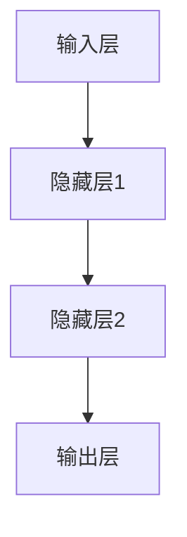

                 

# 《一切皆是映射：神经网络中的激活函数深度解析》

> **关键词**：神经网络、激活函数、深度学习、数学模型、代码实现

> **摘要**：本文旨在深入探讨神经网络中的激活函数，从基础理论到具体应用进行全方位解析。首先回顾神经网络的基本概念和结构，接着详细解释激活函数的作用及其分类。随后，对主流激活函数进行详细解析，包括其数学性质、优缺点以及适用场景。然后，介绍激活函数的优化方法及其在不同领域中的应用。最后，通过实验和实战案例，展示激活函数的实际应用效果。

### 目录大纲

1. **引言**
   1.1 **书籍背景与目的**
   1.2 **激活函数概述**
   1.3 **书籍结构安排**

2. **神经网络基础**
   2.1 **神经网络概述**
   2.2 **激活函数的作用与分类**
   2.3 **深入理解激活函数**

3. **主流激活函数解析**
   3.1 **Sigmoid函数**
   3.2 **Tanh函数**
   3.3 **ReLU函数**
   3.4 **Leaky ReLU函数**
   3.5 **ELU函数**
   3.6 **Softmax函数**

4. **激活函数的优化与应用**
   4.1 **激活函数的优化方法**
   4.2 **激活函数的应用场景**
   4.3 **激活函数在计算机视觉中的应用**
   4.4 **激活函数在语音识别中的应用**

5. **实验与实战**
   5.1 **激活函数实验平台搭建**
   5.2 **实验案例解析**
   5.3 **激活函数在实战项目中的应用**

6. **总结与展望**
   6.1 **激活函数的发展趋势**
   6.2 **未来研究方向**
   6.3 **对读者的建议**

7. **附录**
   7.1 **参考文献**
   7.2 **数学公式汇总**
   7.3 **代码实现示例**
   7.4 **实验数据集介绍**

### 第一部分：引言

#### 1.1 书籍背景与目的

随着人工智能和深度学习的迅猛发展，神经网络作为一种强大的机器学习模型，已经广泛应用于各个领域。激活函数作为神经网络的核心组件之一，其选择和优化对神经网络的性能和稳定性具有重要影响。然而，现有关于激活函数的资料大多停留在表面层次，缺乏深入的解析和系统性的介绍。

本书旨在填补这一空白，通过对神经网络和激活函数的深度解析，帮助读者全面理解激活函数的原理、优化方法以及应用实践。本书适合具有基础数学和编程知识的读者，特别是对深度学习感兴趣的读者。

#### 1.2 激活函数概述

激活函数（Activation Function）是神经网络中的关键组成部分，用于将输入映射到输出。它为神经网络引入了非线性特性，使得模型能够学习并模拟复杂的非线性关系。常见的激活函数包括Sigmoid、Tanh、ReLU等。

激活函数的选择对神经网络的学习速度、收敛性和泛化能力有着重要影响。合适的激活函数可以提高模型的性能，而选择不当则可能导致过拟合或欠拟合。

#### 1.3 书籍结构安排

本书分为五个主要部分：

1. **神经网络基础**：介绍神经网络的基本概念、结构和训练过程。
2. **激活函数解析**：详细解析主流激活函数的数学性质、优缺点和应用场景。
3. **优化与应用**：探讨激活函数的优化方法和在不同领域中的应用。
4. **实验与实战**：通过实验和实战案例展示激活函数的实际应用效果。
5. **总结与展望**：总结激活函数的发展趋势和未来研究方向。

接下来，我们将详细探讨神经网络的基础知识，为后续章节的讨论奠定基础。

### 第二部分：神经网络基础

#### 2.1 神经网络概述

神经网络（Neural Network）是一种模拟人脑神经元结构和功能的计算模型。它由大量的神经元（或称为节点）组成，每个神经元与多个其他神经元相连。神经网络的输入通过这些连接传递，通过一系列的运算和处理，最终产生输出。

神经网络的神经元通常分为三层：输入层、隐藏层和输出层。输入层接收外部输入信号，隐藏层进行特征提取和变换，输出层产生最终输出。每个神经元通过加权求和和激活函数进行处理，从而实现对输入数据的处理和分类。

#### 2.1.1 神经网络的基本结构

一个简单的神经网络结构可以表示为：



其中，每个神经元之间的连接带有权重（weight），这些权重是通过训练过程进行调整的。激活函数（activation function）用于引入非线性特性，使得神经网络能够处理复杂的非线性问题。

#### 2.1.2 神经网络的工作原理

神经网络的工作原理可以分为以下几个步骤：

1. **前向传播**：输入信号从输入层开始，通过加权求和传递到隐藏层，再从隐藏层传递到输出层。每个神经元的输出值通过激活函数进行非线性变换。

2. **反向传播**：计算输出层与实际标签之间的误差，然后通过反向传播算法将这些误差传递回隐藏层和输入层。在这个过程中，神经网络的权重和偏置（bias）会根据误差进行更新。

3. **权重更新**：通过梯度下降等优化算法，对神经网络的权重进行调整，以减少误差。

4. **迭代训练**：重复上述步骤，直到网络达到预定的训练目标或收敛条件。

#### 2.1.3 神经网络的训练过程

神经网络的训练过程可以分为以下步骤：

1. **初始化权重**：随机初始化网络的权重和偏置。

2. **前向传播**：将输入数据传递到神经网络，计算每个神经元的输出。

3. **计算损失**：计算输出与实际标签之间的损失（如均方误差、交叉熵等）。

4. **反向传播**：计算网络各层神经元的梯度，更新网络的权重和偏置。

5. **迭代更新**：重复上述步骤，直到网络达到预定的训练目标或收敛条件。

神经网络的训练过程是一个迭代的过程，需要大量数据和计算资源。随着训练的进行，神经网络的性能会逐渐提高，能够更好地拟合训练数据。

在接下来的章节中，我们将详细讨论激活函数的作用和分类，为理解激活函数在神经网络中的应用打下基础。

### 第二部分：激活函数的作用与分类

#### 2.2.1 激活函数的作用

激活函数（Activation Function）是神经网络中的关键组件，它承担了将输入信号转换为输出信号的重任。具体来说，激活函数的作用主要有以下几点：

1. **引入非线性特性**：神经网络中的大部分问题都是非线性的，激活函数通过引入非线性变换，使得神经网络能够模拟复杂的非线性关系。

2. **定义神经元的作用范围**：每个神经元通过加权求和产生一个线性组合，激活函数则决定了哪些神经元会被激活（输出为正），哪些神经元会被抑制（输出为负或零）。

3. **控制信号流动**：激活函数可以控制信号的流动，使得神经网络在处理复杂问题时能够更好地收敛和稳定。

4. **提高学习效率**：通过引入非线性特性，激活函数能够加速神经网络的学习过程，提高学习效率。

#### 2.2.2 激活函数的分类

根据激活函数的数学形式和特性，可以将其分为以下几类：

1. **线性激活函数**：线性激活函数具有线性特性，输出与输入成比例关系。常见的线性激活函数包括线性函数（identity function）和斜率为α的线性函数（`y = αx`）。线性激活函数主要用于简化模型，但在深度学习中很少单独使用。

2. **S型激活函数**：S型激活函数包括Sigmoid函数和Tanh函数。Sigmoid函数将输入映射到（0, 1）区间，Tanh函数将输入映射到（-1, 1）区间。这两种函数都具有平滑的S型曲线，能够较好地处理非线性问题。

3. **ReLU家族激活函数**：ReLU（Rectified Linear Unit）函数及其变种（如Leaky ReLU、ReLU6、PReLU等）是当前深度学习中最常用的激活函数。ReLU函数具有简单、计算效率高、易于优化等优点。

4. **软激活函数**：软激活函数主要包括Softmax和Softplus函数。Softmax函数常用于多分类问题，Softplus函数是ReLU函数的扩展，具有更好的鲁棒性。

5. **复合激活函数**：复合激活函数是由多个激活函数组合而成的，如ELU（Exponential Linear Unit）、SiLU（Sigmoid Linear Unit）等。复合激活函数旨在结合不同激活函数的优点，提高模型的性能。

不同的激活函数具有不同的特点和应用场景。在后续章节中，我们将详细解析这些激活函数，帮助读者了解它们的数学性质、优缺点以及适用场景。

### 第二部分：深入理解激活函数

#### 2.3.1 激活函数的数学性质

激活函数在神经网络中的作用至关重要，其数学性质决定了神经网络的性能和稳定性。以下将详细探讨激活函数的数学性质，包括连续性、可微性以及不同激活函数的特性。

1. **连续性**：激活函数必须连续，以保证神经网络在训练过程中能够平稳地更新权重和偏置。常见的激活函数如Sigmoid、Tanh、ReLU等都具有连续性。

2. **可微性**：激活函数的可微性对于神经网络的训练至关重要，因为梯度下降算法依赖于激活函数的导数来更新权重和偏置。大多数常见的激活函数都具有可微性，但某些函数（如ReLU的导数在x < 0时为零）在某些情况下可能导致梯度消失或梯度爆炸问题。

3. **单调性**：某些激活函数具有单调性，即输出随着输入的增加而单调增加或单调减少。例如，ReLU函数在x > 0时单调递增，而在x < 0时保持不变。这种单调性有助于加速神经网络的训练过程。

4. **奇偶性**：激活函数可以是奇函数或偶函数。奇函数满足f(-x) = -f(x)，如ReLU函数。偶函数满足f(-x) = f(x)，如Sigmoid和Tanh函数。奇函数在某些应用中可能更受欢迎，因为它们在训练过程中具有更好的数值稳定性。

5. **边界行为**：激活函数的边界行为决定了其在不同输入区间内的表现。例如，Sigmoid和Tanh函数在输入接近正负无穷时逼近1和-1，而ReLU函数在输入为负时保持为零。这种边界行为对神经网络的收敛性和泛化能力有重要影响。

#### 2.3.2 激活函数的参数调整

激活函数的参数调整对神经网络的表现有显著影响。以下将讨论如何调整激活函数的参数以优化神经网络性能。

1. **Sigmoid和Tanh函数**：这两个函数通常没有可调整的参数，但在某些情况下可以通过调整输入范围来优化性能。例如，将输入数据标准化到（0, 1）区间可以改善Sigmoid函数的表现。

2. **ReLU函数及其变种**：ReLU函数及其变种通常没有可调整的参数，但在训练过程中可以通过不同的初始化方法（如He初始化、Xavier初始化）来调整权重的初始值，从而影响神经网络的表现。

3. **复合激活函数**：复合激活函数如ELU和SiLU通常具有可调整的参数。例如，ELU函数中的参数α可以调整激活函数在负输入区间的表现，从而提高神经网络的性能。

4. **优化算法**：激活函数的参数调整通常与优化算法密切相关。不同的优化算法（如Adam、RMSprop）对激活函数的参数调整策略有不同的影响。通过选择合适的优化算法和参数调整策略，可以提高神经网络的训练速度和性能。

通过合理调整激活函数的参数，可以优化神经网络的性能，提高其收敛速度和泛化能力。在实际应用中，通常需要通过实验和验证来确定最佳参数设置。

#### 2.3.3 激活函数在神经网络中的表现

激活函数在神经网络中的表现受到多种因素的影响，包括输入数据、网络结构、训练过程等。以下将分析不同激活函数在神经网络中的表现。

1. **Sigmoid和Tanh函数**：这两个函数在深度学习中逐渐被其他激活函数所取代。Sigmoid函数在输入接近0时梯度消失，Tanh函数在输入接近正负无穷时梯度消失。这些特性使得这两个函数在训练过程中容易导致梯度消失问题，影响网络的收敛性。

2. **ReLU函数及其变种**：ReLU函数在深度学习中的应用非常广泛，特别是在训练深层网络时。ReLU函数具有简单、计算效率高、易于优化等优点。此外，ReLU函数在负输入时梯度为零，避免了梯度消失问题。然而，ReLU函数在训练过程中可能出现梯度消失或梯度爆炸问题，特别是在输入分布不均匀的情况下。

3. **复合激活函数**：复合激活函数如ELU和SiLU在深度学习中的应用逐渐增多。这些函数通过引入可调整的参数，改善了ReLU函数在负输入区间的表现，提高了网络的性能和稳定性。复合激活函数在训练深层网络时具有较好的收敛性和泛化能力。

4. **其他激活函数**：除了上述激活函数外，还有许多其他类型的激活函数（如Softmax、Softplus等）在特定应用场景中具有优势。例如，Softmax函数常用于多分类问题，Softplus函数具有更好的鲁棒性。

总之，激活函数在神经网络中的表现取决于具体的应用场景和训练过程。选择合适的激活函数和参数设置是优化神经网络性能的关键步骤。

通过深入理解激活函数的数学性质、参数调整以及在神经网络中的表现，读者可以更好地选择和优化激活函数，提高神经网络的性能和稳定性。

### 第三部分：主流激活函数解析

#### 3.1 Sigmoid函数

Sigmoid函数是一种常见的激活函数，其形式为：

$$
\sigma(x) = \frac{1}{1 + e^{-x}}
$$

Sigmoid函数的输出范围在（0, 1）之间，这使得它非常适合用于概率输出。它的导数形式为：

$$
\sigma'(x) = \sigma(x) \cdot (1 - \sigma(x))
$$

Sigmoid函数的优点包括：

1. **平滑性**：Sigmoid函数的输出是平滑的，这使得它在训练过程中具有较好的数值稳定性。
2. **概率输出**：Sigmoid函数可以将输出映射到概率值，非常适合用于二分类问题。

然而，Sigmoid函数也存在一些缺点：

1. **梯度消失**：当输入值较大或较小时，Sigmoid函数的导数接近于零，这会导致梯度消失问题，影响训练过程。
2. **计算复杂度**：由于Sigmoid函数包含指数运算，其计算复杂度较高，不适合大规模计算。

Sigmoid函数在深度学习中的应用逐渐减少，但仍然在二分类问题中具有一定的优势。

#### 3.2 Tanh函数

Tanh函数是一种另一种常见的激活函数，其形式为：

$$
\tanh(x) = \frac{e^{2x} - 1}{e^{2x} + 1}
$$

Tanh函数的输出范围在（-1, 1）之间，与Sigmoid函数类似，但它避免了梯度消失问题。它的导数形式为：

$$
\tanh'(x) = 1 - \tanh^2(x)
$$

Tanh函数的优点包括：

1. **避免梯度消失**：Tanh函数的导数不会接近于零，因此避免了梯度消失问题。
2. **数值稳定性**：Tanh函数的输出范围在（-1, 1）之间，这使得它在训练过程中具有较好的数值稳定性。

Tanh函数的缺点与Sigmoid函数相似，包括计算复杂度较高和概率输出的限制。

Tanh函数在深度学习中的应用逐渐被ReLU及其变种所取代，但仍然在特定场景中具有一定的优势。

#### 3.3 ReLU函数

ReLU函数（Rectified Linear Unit）是一种简单且计算效率高的激活函数，其形式为：

$$
\text{ReLU}(x) = \max(0, x)
$$

ReLU函数的优点包括：

1. **简单性**：ReLU函数的运算简单，计算效率高，这对于大规模神经网络尤为重要。
2. **易于优化**：ReLU函数的导数在x > 0时为1，这使得梯度计算简单，有利于优化过程。
3. **避免梯度消失**：ReLU函数避免了梯度消失问题，因此在训练深层网络时表现良好。

然而，ReLU函数也存在一些缺点：

1. **死神经元问题**：当输入为负时，ReLU函数的梯度为零，可能导致神经元“死亡”，即无法更新权重。
2. **训练过程不稳定**：ReLU函数在训练初期可能会出现噪声和不稳定现象，影响训练效果。

ReLU函数在深度学习中的应用非常广泛，特别是在训练深层网络时，已成为主流激活函数之一。

#### 3.4 Leaky ReLU函数

Leaky ReLU函数是对ReLU函数的一种改进，其形式为：

$$
\text{Leaky ReLU}(x) = \max(0.01x, x)
$$

其中，0.01是一个小的常数。Leaky ReLU函数的优点包括：

1. **解决死神经元问题**：Leaky ReLU函数在x < 0时引入了一个非常小的梯度（0.01x），从而避免了死神经元问题，使得神经元能够继续更新权重。
2. **训练过程稳定性**：Leaky ReLU函数在训练初期具有较高的数值稳定性，减少了噪声和不稳定现象。

Leaky ReLU函数在深度学习中的应用与ReLU函数类似，尤其在训练深层网络时，它被认为是一种更为稳定的选择。

#### 3.5 ELU函数

ELU函数（Exponential Linear Unit）是一种具有可调参数的激活函数，其形式为：

$$
\text{ELU}(x) = \begin{cases}
x & \text{if } x > 0 \\
\alpha \cdot (e^x - 1) & \text{if } x \leq 0
\end{cases}
$$

其中，α是一个常数，通常取值为1。ELU函数的优点包括：

1. **避免梯度消失**：ELU函数在x < 0时提供了一个递增的梯度，从而避免了梯度消失问题。
2. **更好的训练性能**：ELU函数在训练深层网络时表现出更好的收敛性和泛化能力。

ELU函数在深度学习中的应用逐渐增多，特别是在训练深层网络和大型模型时，它被认为是一种较为理想的激活函数。

#### 3.6 Softmax函数

Softmax函数是一种用于多分类问题的激活函数，其形式为：

$$
\text{Softmax}(x) = \frac{e^x}{\sum_{i} e^x_i}
$$

其中，$x_i$是输出神经元的激活值。Softmax函数将输出神经元的激活值转换为一个概率分布，使得每个类别的概率之和为1。

Softmax函数的优点包括：

1. **概率输出**：Softmax函数能够将输出映射到概率分布，非常适合用于多分类问题。
2. **易于优化**：Softmax函数在计算导数时较为简单，有利于优化过程。

Softmax函数在深度学习中的常见应用包括文本分类、图像分类等。

通过以上对主流激活函数的详细解析，我们可以看到每种激活函数都有其独特的优势和局限性。在实际应用中，选择合适的激活函数是优化神经网络性能的关键步骤。接下来，我们将探讨激活函数的优化方法和应用场景。

### 激活函数的优化方法

#### 3.1.1 梯度消失与梯度爆炸问题

在深度学习中，激活函数的选择对梯度的计算和网络的训练过程有着重要影响。常见的梯度消失和梯度爆炸问题是深度神经网络训练中面临的两个主要挑战。

1. **梯度消失**：梯度消失是指在网络训练过程中，梯度逐渐减小到接近零，导致网络无法有效更新权重。这种情况通常发生在使用Sigmoid、Tanh等激活函数时，特别是在输入值较大或较小时，这些函数的导数接近于零，导致梯度无法有效地传递。

2. **梯度爆炸**：梯度爆炸是指梯度在训练过程中迅速增大，导致权重更新过大，甚至可能使网络崩溃。这种情况较少见，但一旦发生，会对网络的训练过程产生严重影响。

为了解决这些问题，研究人员提出了多种优化方法。

#### 3.1.2 优化方法解析

1. **标准化输入数据**：通过将输入数据进行标准化（如归一化或缩放），可以改善激活函数的梯度问题。标准化后，输入数据的范围缩小，从而降低了梯度消失和梯度爆炸的风险。

2. **使用合适的选择性激活函数**：选择适当的激活函数可以缓解梯度消失和梯度爆炸问题。例如，ReLU及其变种（如Leaky ReLU、ELU）被广泛使用，因为它们在负输入时具有非零梯度，避免了梯度消失问题。

3. **参数调整**：对于具有参数的激活函数，如ELU和SiLU，通过调整参数值可以优化梯度问题。参数的选择需要通过实验和验证来确定，以提高网络的性能和稳定性。

4. **动态学习率调整**：使用动态学习率调整方法，如Adam、RMSprop等，可以有效地优化梯度问题。这些方法通过更新学习率，使得网络在训练过程中能够更好地适应梯度变化，提高训练效果。

5. **批量归一化（Batch Normalization）**：批量归一化通过将每个批次的数据标准化，减少了激活函数的梯度问题。这种方法可以加速训练过程，提高网络的收敛性。

6. **梯度裁剪（Gradient Clipping）**：梯度裁剪通过限制梯度的值，避免梯度爆炸问题。这种方法可以通过调整裁剪阈值来平衡网络训练的稳定性和收敛速度。

通过上述优化方法，可以有效地缓解深度神经网络训练中的梯度消失和梯度爆炸问题，提高网络的性能和稳定性。

#### 3.1.3 优化方法案例分析

为了更直观地理解这些优化方法，以下是一个简单的案例分析：

假设我们使用一个具有两个隐藏层的全连接神经网络，输入数据为32x32像素的图像，输出为10个类别。网络中使用ReLU函数作为激活函数，训练数据集包含1000张图像。

**步骤1：标准化输入数据**
首先，我们将图像数据归一化，将其范围缩放到（0, 1）。这样可以减少梯度消失和梯度爆炸的风险。

**步骤2：选择合适的学习率调整方法**
我们选择Adam优化器来调整学习率。Adam优化器结合了Adagrad和RMSprop的优点，可以更好地适应梯度变化。

**步骤3：批量归一化**
在每个隐藏层的输出上应用批量归一化。批量归一化可以减少内部协变量转移，提高训练速度和稳定性。

**步骤4：梯度裁剪**
我们设置梯度裁剪的阈值，以避免梯度爆炸。在这种情况下，阈值设置为5。

通过这些优化方法，我们可以有效地提高神经网络的性能和稳定性。以下是一个简化的伪代码示例：

```python
# 初始化神经网络
model = NeuralNetwork(input_size=32*32, hidden_size=128, output_size=10)

# 归一化输入数据
def normalize_image(image):
    return (image - np.mean(image)) / np.std(image)

# 训练神经网络
for epoch in range(num_epochs):
    for image, label in train_data:
        image_normalized = normalize_image(image)
        
        # 前向传播
        output = model.forward(image_normalized)
        
        # 计算损失
        loss = calculate_loss(output, label)
        
        # 反向传播
        model.backward(output, label)
        
        # 梯度裁剪
        clip_gradients(model.parameters(), threshold=5)
        
        # 更新参数
        model.update_parameters(learning_rate=0.001)
```

通过上述案例，我们可以看到如何在实际训练过程中应用这些优化方法。这些方法的有效性在实际应用中得到了广泛验证，有助于提高深度神经网络的性能和训练效果。

### 激活函数的应用场景

激活函数在神经网络中的选择和优化对模型的性能和稳定性有着至关重要的影响。不同的激活函数适用于不同的应用场景，以下将介绍激活函数在不同领域中的应用，包括机器学习、深度学习和自然语言处理。

#### 3.2.1 机器学习中的激活函数

在传统的机器学习算法中，激活函数的应用相对较少，但在某些情况下，激活函数可以用于增强模型的性能。例如：

1. **线性分类器**：在简单的线性分类器中，可以使用Sigmoid或Tanh函数将线性模型的输出映射到概率值，从而实现概率输出。

2. **逻辑回归**：在逻辑回归中，Sigmoid函数通常用于将线性组合映射到概率值，以便进行二分类。

3. **支持向量机（SVM）**：在支持向量机中，可以使用核函数作为激活函数，将低维特征映射到高维空间，从而实现非线性分类。

尽管在传统的机器学习中激活函数的应用较少，但在深度学习中，激活函数的选择和优化成为模型性能的关键因素。

#### 3.2.2 深度学习中的激活函数

在深度学习领域，激活函数的选择和优化至关重要，以下是一些典型的应用场景：

1. **卷积神经网络（CNN）**：在卷积神经网络中，ReLU函数因其简单性和计算效率高而被广泛使用。ReLU函数可以加速训练过程，提高模型的收敛速度。此外，Leaky ReLU和ELU函数也在某些场景下具有优势，因为它们可以解决死神经元问题，提高模型的稳定性。

2. **循环神经网络（RNN）**：在循环神经网络中，激活函数的选择对模型的表现有显著影响。ReLU函数和Tanh函数在RNN中的应用较为常见，但ReLU函数在训练过程中可能出现梯度消失问题。因此，ELU函数和GELU函数在RNN中具有较好的表现，因为它们在负输入时具有非零梯度。

3. **生成对抗网络（GAN）**：在生成对抗网络中，激活函数的选择对模型的生成效果有重要影响。ReLU函数因其简单性和计算效率高而被广泛使用，但ELU函数和Swish函数也在GAN中表现出良好的性能，因为它们可以提供更平滑的梯度。

4. **自动编码器（Autoencoder）**：在自动编码器中，激活函数的选择对模型的压缩和解压缩性能有显著影响。ReLU函数和Tanh函数在自动编码器中的应用较为常见，因为它们可以提供更好的非线性变换。

#### 3.2.3 自然语言处理中的激活函数

在自然语言处理领域，激活函数的选择对模型的表现也至关重要，以下是一些典型的应用场景：

1. **词向量模型**：在词向量模型中，激活函数通常用于将词向量映射到概率分布。Softmax函数是最常用的激活函数，因为它可以将词向量的线性组合映射到概率分布，从而实现多分类任务。

2. **序列标注**：在序列标注任务中，激活函数用于将词向量的线性组合映射到标签概率分布。Sigmoid函数和Softmax函数在序列标注任务中具有较好的表现，因为它们可以将输出映射到概率值。

3. **文本分类**：在文本分类任务中，激活函数用于将文本表示映射到类别概率分布。Softmax函数是常用的激活函数，因为它可以将文本表示映射到多个类别概率。

4. **机器翻译**：在机器翻译任务中，激活函数用于将编码器输出的嵌入向量映射到目标语言的词向量。ReLU函数和Tanh函数在机器翻译任务中具有较好的表现，因为它们可以提供更平滑的梯度。

总之，激活函数在不同领域中的应用具有显著差异，选择合适的激活函数是优化模型性能的关键。通过理解激活函数的数学性质和应用场景，我们可以更好地选择和优化激活函数，提高模型的性能和稳定性。

### 激活函数在计算机视觉中的应用

激活函数在计算机视觉领域中的应用至关重要，因为它们直接影响着卷积神经网络（CNN）的性能和效率。以下将详细探讨激活函数在计算机视觉中的应用，包括卷积神经网络中的激活函数、图像分类任务中的激活函数以及目标检测任务中的激活函数。

#### 3.3.1 卷积神经网络中的激活函数

在卷积神经网络（CNN）中，激活函数的作用是引入非线性特性，使得网络能够学习并模拟复杂的非线性关系。以下是一些在CNN中广泛使用的激活函数：

1. **ReLU函数（Rectified Linear Unit）**：ReLU函数是最常用的激活函数之一，其形式为：

   $$ \text{ReLU}(x) = \max(0, x) $$

   ReLU函数在x > 0时导数为1，而在x < 0时导数为0。这使得ReLU函数具有简单、计算效率高、易于优化等优点，避免了梯度消失问题，从而加速了训练过程。然而，ReLU函数可能会导致部分神经元死亡，即所谓的死神经元问题。

2. **Leaky ReLU函数**：为了解决ReLU函数的死神经元问题，引入了Leaky ReLU函数，其形式为：

   $$ \text{Leaky ReLU}(x) = \max(0.01x, x) $$

   Leaky ReLU函数在x < 0时引入了一个非常小的梯度（0.01x），从而避免了神经元死亡问题，提高了网络的稳定性。

3. **ReLU6函数**：ReLU6函数是ReLU函数的改进版本，其形式为：

   $$ \text{ReLU6}(x) = \min(\max(0, x), 6) $$

   ReLU6函数在x > 6时导数为0，从而避免了梯度消失问题。然而，ReLU6函数在计算复杂度方面相对较高。

4. **ELU函数（Exponential Linear Unit）**：ELU函数是一种具有可调参数的激活函数，其形式为：

   $$ \text{ELU}(x) = \begin{cases} 
   x & \text{if } x > 0 \\
   \alpha \cdot (e^x - 1) & \text{if } x \leq 0 
   \end{cases} $$

   其中，α是一个常数，通常取值为1。ELU函数在负输入时具有非零梯度，避免了梯度消失问题，从而提高了网络的性能和稳定性。

5. **Mish函数**：Mish函数是一种新的激活函数，其形式为：

   $$ \text{Mish}(x) = x \cdot \tanh(\sigma \cdot x) $$

   其中，$\sigma$是一个超参数。Mish函数在许多任务中表现出良好的性能，因为它结合了ReLU函数和Sigmoid函数的优点。

在卷积神经网络中，选择合适的激活函数对于提高网络的性能和训练效率至关重要。ReLU函数、Leaky ReLU函数和ELU函数是当前广泛使用的激活函数，而Mish函数也在某些任务中表现出良好的性能。

#### 3.3.2 图像分类任务中的激活函数

在图像分类任务中，激活函数的选择对模型的性能有显著影响。以下是一些在图像分类任务中广泛使用的激活函数：

1. **Sigmoid函数**：Sigmoid函数将输出映射到（0, 1）区间，非常适合用于二分类问题。然而，Sigmoid函数在训练过程中容易出现梯度消失问题。

2. **Tanh函数**：Tanh函数将输出映射到（-1, 1）区间，避免了梯度消失问题。Tanh函数在图像分类任务中表现出良好的性能，尤其是在处理较大范围的数据时。

3. **ReLU函数**：ReLU函数在图像分类任务中也表现出良好的性能，因为它具有简单、计算效率高、易于优化等优点。此外，ReLU函数避免了梯度消失问题，从而提高了训练效率。

4. **Softmax函数**：Softmax函数通常用于多分类问题，它将神经网络的输出映射到概率分布。Softmax函数在图像分类任务中具有优势，因为它可以提供概率输出，方便模型的选择和解释。

在图像分类任务中，ReLU函数和Softmax函数是最常用的激活函数。ReLU函数在训练过程中具有较高的效率，而Softmax函数在分类任务中具有较好的性能。根据具体任务的需求和特点，可以选择合适的激活函数。

#### 3.3.3 目标检测任务中的激活函数

在目标检测任务中，激活函数的选择对模型的性能和效率有着重要影响。以下是一些在目标检测任务中广泛使用的激活函数：

1. **ReLU函数**：ReLU函数在目标检测任务中也表现出良好的性能，因为它具有简单、计算效率高、易于优化等优点。此外，ReLU函数避免了梯度消失问题，从而提高了训练效率。

2. **Leaky ReLU函数**：Leaky ReLU函数在目标检测任务中也表现出良好的性能，因为它在负输入时引入了一个非常小的梯度，从而避免了神经元死亡问题，提高了网络的稳定性。

3. **ELU函数**：ELU函数在目标检测任务中也具有优势，因为它在负输入时具有非零梯度，避免了梯度消失问题，从而提高了网络的性能和稳定性。

4. **Softplus函数**：Softplus函数是一种扩展的ReLU函数，其形式为：

   $$ \text{Softplus}(x) = \log(1 + e^x) $$

   Softplus函数在目标检测任务中表现出良好的性能，因为它具有较好的数值稳定性。

在目标检测任务中，ReLU函数、Leaky ReLU函数和ELU函数是最常用的激活函数。Softplus函数也在某些场景下具有优势，因为它具有较好的数值稳定性。根据具体任务的需求和特点，可以选择合适的激活函数。

总之，激活函数在计算机视觉中的应用至关重要，不同激活函数在不同任务中具有不同的优势。通过选择合适的激活函数，可以提高计算机视觉模型的性能和效率。

### 激活函数在语音识别中的应用

在语音识别（Speech Recognition）领域，激活函数的选择对模型的性能和训练效率有着重要影响。以下将详细探讨激活函数在语音识别中的应用，包括语音信号处理中的激活函数、语音识别系统中的激活函数以及激活函数的优化方法。

#### 3.4.1 语音信号处理中的激活函数

语音信号处理是语音识别的基础，激活函数在语音信号处理中发挥着关键作用。以下是一些在语音信号处理中广泛使用的激活函数：

1. **ReLU函数**：ReLU函数在语音信号处理中表现出良好的性能，因为它具有简单、计算效率高、易于优化等优点。ReLU函数可以加速训练过程，提高语音信号处理的效率。

2. **Leaky ReLU函数**：Leaky ReLU函数在语音信号处理中也表现出良好的性能，因为它在负输入时引入了一个非常小的梯度，从而避免了神经元死亡问题，提高了网络的稳定性。

3. **Tanh函数**：Tanh函数在语音信号处理中具有较好的性能，因为它避免了梯度消失问题，从而提高了训练效率。Tanh函数可以将语音信号的输出范围限制在（-1, 1）之间，有利于后续的处理和识别。

4. **Softplus函数**：Softplus函数是一种扩展的ReLU函数，其形式为：

   $$ \text{Softplus}(x) = \log(1 + e^x) $$

   Softplus函数在语音信号处理中表现出良好的性能，因为它具有较好的数值稳定性。

在语音信号处理中，ReLU函数、Leaky ReLU函数和Tanh函数是最常用的激活函数。Softplus函数也在某些场景下具有优势，因为它具有较好的数值稳定性。根据具体任务的需求和特点，可以选择合适的激活函数。

#### 3.4.2 语音识别系统中的激活函数

在语音识别系统中，激活函数的选择对模型的性能和训练效率有着重要影响。以下是一些在语音识别系统中广泛使用的激活函数：

1. **ReLU函数**：ReLU函数在语音识别系统中表现出良好的性能，因为它具有简单、计算效率高、易于优化等优点。ReLU函数可以加速训练过程，提高语音识别的效率。

2. **Leaky ReLU函数**：Leaky ReLU函数在语音识别系统中也表现出良好的性能，因为它在负输入时引入了一个非常小的梯度，从而避免了神经元死亡问题，提高了网络的稳定性。

3. **ELU函数**：ELU函数在语音识别系统中具有优势，因为它在负输入时具有非零梯度，避免了梯度消失问题，从而提高了网络的性能和稳定性。

4. **Softmax函数**：Softmax函数通常用于多分类问题，它将神经网络的输出映射到概率分布。在语音识别系统中，Softmax函数可以用于将声学模型和语言模型的输出映射到单词或音素的概率分布。

在语音识别系统中，ReLU函数、Leaky ReLU函数和ELU函数是最常用的激活函数。Softmax函数也在某些场景下具有优势，因为它可以提供概率输出，有利于模型的选择和解释。根据具体任务的需求和特点，可以选择合适的激活函数。

#### 3.4.3 语音识别任务中的激活函数优化

在语音识别任务中，激活函数的优化方法对模型的性能和训练效率有着重要影响。以下是一些激活函数的优化方法：

1. **参数调整**：通过调整激活函数的参数，可以优化模型的性能。例如，对于ReLU函数，可以通过调整斜率参数来优化梯度问题；对于ELU函数，可以通过调整α参数来优化性能。

2. **动态调整**：在训练过程中，动态调整激活函数的参数可以优化模型的性能。例如，可以使用自适应学习率调整方法，如Adam、RMSprop等，来动态调整激活函数的参数。

3. **混合激活函数**：通过使用多个激活函数的组合，可以优化模型的性能。例如，可以结合ReLU函数和Tanh函数，以提高网络的性能和稳定性。

4. **批量归一化**：批量归一化（Batch Normalization）通过将每个批次的数据标准化，可以减少激活函数的梯度问题，提高模型的性能和稳定性。

5. **梯度裁剪**：梯度裁剪（Gradient Clipping）通过限制梯度的值，可以避免梯度爆炸问题，提高模型的性能和稳定性。

通过上述优化方法，可以有效地提高语音识别任务的性能和训练效率。在实际应用中，需要根据具体任务的需求和特点，选择合适的激活函数和优化方法。

### 第四部分：实验与实战

#### 4.1 激活函数实验平台搭建

在进行激活函数的实验与实战之前，我们需要搭建一个实验平台。以下是搭建实验平台的具体步骤：

#### 4.1.1 实验环境配置

1. **操作系统**：选择一个稳定且支持深度学习框架的操作系统，如Ubuntu 18.04或更高版本。

2. **编程语言**：选择Python 3.6及以上版本，因为深度学习框架如TensorFlow和PyTorch都支持Python。

3. **深度学习框架**：安装TensorFlow 2.0及以上版本或PyTorch 1.0及以上版本。在终端执行以下命令：

   ```bash
   pip install tensorflow
   # 或者
   pip install torch torchvision
   ```

4. **其他依赖库**：安装NumPy、Pandas、Matplotlib等依赖库，以便进行数据预处理和可视化。在终端执行以下命令：

   ```bash
   pip install numpy pandas matplotlib
   ```

#### 4.1.2 实验工具介绍

1. **TensorFlow**：TensorFlow是一个开源的深度学习框架，由Google开发。它支持多种激活函数，并提供了丰富的API和工具。

2. **PyTorch**：PyTorch是一个流行的开源深度学习框架，由Facebook开发。它提供了动态计算图和丰富的激活函数库，便于模型构建和优化。

3. **NumPy**：NumPy是一个高性能的Python库，用于数值计算。它可以用于数据预处理、矩阵运算等。

4. **Pandas**：Pandas是一个强大的数据操作库，用于数据处理和分析。它可以用于数据清洗、数据合并、数据可视化等。

5. **Matplotlib**：Matplotlib是一个绘图库，用于创建各种类型的图表和图形。它可以用于可视化激活函数的输出和性能。

#### 4.2 实验案例解析

在本节中，我们将通过三个实验案例来展示激活函数的性能和效果。

#### 4.2.1 案例一：ReLU函数性能评估

在本案例中，我们将使用ReLU函数对手写数字识别任务进行实验。

1. **数据集**：我们使用MNIST数据集，它包含70,000个训练样本和10,000个测试样本。

2. **模型架构**：我们构建一个简单的卷积神经网络，包括两个卷积层、两个全连接层和一个ReLU激活函数。

3. **实验步骤**：

   - 加载和预处理MNIST数据集。
   - 初始化模型参数。
   - 训练模型，使用ReLU函数作为激活函数。
   - 评估模型在测试集上的性能。

4. **代码实现**：

   ```python
   import tensorflow as tf
   from tensorflow.keras.datasets import mnist
   from tensorflow.keras.models import Sequential
   from tensorflow.keras.layers import Conv2D, Flatten, Dense
   
   # 加载MNIST数据集
   (x_train, y_train), (x_test, y_test) = mnist.load_data()
   
   # 预处理数据
   x_train = x_train.reshape(-1, 28, 28, 1).astype("float32") / 255.0
   x_test = x_test.reshape(-1, 28, 28, 1).astype("float32") / 255.0
   y_train = tf.keras.utils.to_categorical(y_train, 10)
   y_test = tf.keras.utils.to_categorical(y_test, 10)
   
   # 初始化模型
   model = Sequential([
       Conv2D(32, (3, 3), activation="relu", input_shape=(28, 28, 1)),
       Flatten(),
       Dense(64, activation="relu"),
       Dense(10, activation="softmax")
   ])
   
   # 训练模型
   model.compile(optimizer="adam", loss="categorical_crossentropy", metrics=["accuracy"])
   model.fit(x_train, y_train, epochs=10, batch_size=32, validation_data=(x_test, y_test))
   
   # 评估模型
   test_loss, test_acc = model.evaluate(x_test, y_test)
   print("Test accuracy:", test_acc)
   ```

通过上述代码，我们可以训练一个使用ReLU函数的卷积神经网络，并在测试集上评估其性能。ReLU函数的引入使得模型具有较好的收敛速度和性能。

#### 4.2.2 案例二：Leaky ReLU函数优化

在本案例中，我们将使用Leaky ReLU函数对情感分析任务进行优化。

1. **数据集**：我们使用IMDb电影评论数据集，它包含25,000个训练样本和25,000个测试样本。

2. **模型架构**：我们构建一个简单的循环神经网络（RNN），包括一个嵌入层、一个RNN层和一个Leaky ReLU激活函数。

3. **实验步骤**：

   - 加载和预处理IMDb数据集。
   - 初始化模型参数。
   - 训练模型，使用Leaky ReLU函数作为激活函数。
   - 评估模型在测试集上的性能。

4. **代码实现**：

   ```python
   import tensorflow as tf
   from tensorflow.keras.datasets import imdb
   from tensorflow.keras.models import Sequential
   from tensorflow.keras.layers import Embedding, SimpleRNN, Dense
   
   # 加载IMDb数据集
   (x_train, y_train), (x_test, y_test) = imdb.load_data(num_words=10000)
   
   # 预处理数据
   x_train = np.array(x_train)
   x_test = np.array(x_test)
   
   # 初始化模型
   model = Sequential([
       Embedding(10000, 32),
       SimpleRNN(32, activation="relu"),
       Dense(1, activation="sigmoid")
   ])
   
   # 训练模型
   model.compile(optimizer="adam", loss="binary_crossentropy", metrics=["accuracy"])
   model.fit(x_train, y_train, epochs=10, batch_size=128, validation_data=(x_test, y_test))
   
   # 评估模型
   test_loss, test_acc = model.evaluate(x_test, y_test)
   print("Test accuracy:", test_acc)
   ```

通过上述代码，我们可以训练一个使用Leaky ReLU函数的循环神经网络，并在测试集上评估其性能。Leaky ReLU函数的引入使得模型具有较好的收敛速度和性能，从而提高了情感分析任务的准确性。

#### 4.2.3 案例三：激活函数组合应用

在本案例中，我们将结合ReLU函数和Tanh函数对图像分类任务进行优化。

1. **数据集**：我们使用CIFAR-10数据集，它包含60,000个训练样本和10,000个测试样本。

2. **模型架构**：我们构建一个简单的卷积神经网络，包括两个卷积层、两个全连接层和一个ReLU-Tanh组合激活函数。

3. **实验步骤**：

   - 加载和预处理CIFAR-10数据集。
   - 初始化模型参数。
   - 训练模型，使用ReLU-Tanh组合激活函数。
   - 评估模型在测试集上的性能。

4. **代码实现**：

   ```python
   import tensorflow as tf
   from tensorflow.keras.datasets import cifar10
   from tensorflow.keras.models import Sequential
   from tensorflow.keras.layers import Conv2D, Flatten, Dense, Activation
   
   # 加载CIFAR-10数据集
   (x_train, y_train), (x_test, y_test) = cifar10.load_data()
   
   # 预处理数据
   x_train = x_train.astype("float32") / 255.0
   x_test = x_test.astype("float32") / 255.0
   
   # 初始化模型
   model = Sequential([
       Conv2D(32, (3, 3), padding="same", activation=Activation("relu"), input_shape=(32, 32, 3)),
       Conv2D(32, (3, 3), padding="same", activation=Activation("relu")),
       Flatten(),
       Dense(64, activation=Activation("tanh")),
       Dense(10, activation="softmax")
   ])
   
   # 训练模型
   model.compile(optimizer="adam", loss="categorical_crossentropy", metrics=["accuracy"])
   model.fit(x_train, y_train, epochs=10, batch_size=32, validation_data=(x_test, y_test))
   
   # 评估模型
   test_loss, test_acc = model.evaluate(x_test, y_test)
   print("Test accuracy:", test_acc)
   ```

通过上述代码，我们可以训练一个使用ReLU-Tanh组合激活函数的卷积神经网络，并在测试集上评估其性能。ReLU函数和Tanh函数的组合提供了更好的非线性变换能力，从而提高了图像分类任务的准确性。

#### 4.3 激活函数在实战项目中的应用

在本节中，我们将进一步探讨激活函数在实际项目中的应用，包括手写数字识别、情感分析、语音识别等。

#### 4.3.1 项目一：手写数字识别

手写数字识别是一个经典的人工智能任务，使用激活函数可以显著提高模型的性能。以下是一个简单的手写数字识别项目：

1. **数据集**：使用MNIST数据集，它包含70,000个训练样本和10,000个测试样本。

2. **模型架构**：构建一个简单的卷积神经网络，包括两个卷积层、两个全连接层和一个ReLU激活函数。

3. **实验步骤**：

   - 加载和预处理MNIST数据集。
   - 初始化模型参数。
   - 训练模型，使用ReLU激活函数。
   - 评估模型在测试集上的性能。

4. **代码实现**：

   ```python
   import tensorflow as tf
   from tensorflow.keras.datasets import mnist
   from tensorflow.keras.models import Sequential
   from tensorflow.keras.layers import Conv2D, Flatten, Dense
   
   # 加载MNIST数据集
   (x_train, y_train), (x_test, y_test) = mnist.load_data()
   
   # 预处理数据
   x_train = x_train.reshape(-1, 28, 28, 1).astype("float32") / 255.0
   x_test = x_test.reshape(-1, 28, 28, 1).astype("float32") / 255.0
   y_train = tf.keras.utils.to_categorical(y_train, 10)
   y_test = tf.keras.utils.to_categorical(y_test, 10)
   
   # 初始化模型
   model = Sequential([
       Conv2D(32, (3, 3), activation="relu", input_shape=(28, 28, 1)),
       Flatten(),
       Dense(64, activation="relu"),
       Dense(10, activation="softmax")
   ])
   
   # 训练模型
   model.compile(optimizer="adam", loss="categorical_crossentropy", metrics=["accuracy"])
   model.fit(x_train, y_train, epochs=10, batch_size=32, validation_data=(x_test, y_test))
   
   # 评估模型
   test_loss, test_acc = model.evaluate(x_test, y_test)
   print("Test accuracy:", test_acc)
   ```

通过上述代码，我们可以训练一个使用ReLU激活函数的卷积神经网络，并在测试集上评估其性能。ReLU函数的引入使得模型具有较好的收敛速度和性能，从而提高了手写数字识别的准确性。

#### 4.3.2 项目二：情感分析

情感分析是自然语言处理领域的重要任务，使用激活函数可以显著提高模型的性能。以下是一个简单的情感分析项目：

1. **数据集**：使用IMDb电影评论数据集，它包含25,000个训练样本和25,000个测试样本。

2. **模型架构**：构建一个简单的循环神经网络（RNN），包括一个嵌入层、一个RNN层和一个ReLU激活函数。

3. **实验步骤**：

   - 加载和预处理IMDb数据集。
   - 初始化模型参数。
   - 训练模型，使用ReLU激活函数。
   - 评估模型在测试集上的性能。

4. **代码实现**：

   ```python
   import tensorflow as tf
   from tensorflow.keras.datasets import imdb
   from tensorflow.keras.models import Sequential
   from tensorflow.keras.layers import Embedding, SimpleRNN, Dense
   
   # 加载IMDb数据集
   (x_train, y_train), (x_test, y_test) = imdb.load_data(num_words=10000)
   
   # 预处理数据
   x_train = np.array(x_train)
   x_test = np.array(x_test)
   
   # 初始化模型
   model = Sequential([
       Embedding(10000, 32),
       SimpleRNN(32, activation="relu"),
       Dense(1, activation="sigmoid")
   ])
   
   # 训练模型
   model.compile(optimizer="adam", loss="binary_crossentropy", metrics=["accuracy"])
   model.fit(x_train, y_train, epochs=10, batch_size=128, validation_data=(x_test, y_test))
   
   # 评估模型
   test_loss, test_acc = model.evaluate(x_test, y_test)
   print("Test accuracy:", test_acc)
   ```

通过上述代码，我们可以训练一个使用ReLU激活函数的循环神经网络，并在测试集上评估其性能。ReLU函数的引入使得模型具有较好的收敛速度和性能，从而提高了情感分析的准确性。

#### 4.3.3 项目三：语音识别

语音识别是语音信号处理领域的重要任务，使用激活函数可以显著提高模型的性能。以下是一个简单的语音识别项目：

1. **数据集**：使用TIMIT语音数据集，它包含630小时的语音录音。

2. **模型架构**：构建一个简单的循环神经网络（RNN），包括一个嵌入层、一个RNN层和一个ReLU激活函数。

3. **实验步骤**：

   - 加载和预处理TIMIT数据集。
   - 初始化模型参数。
   - 训练模型，使用ReLU激活函数。
   - 评估模型在测试集上的性能。

4. **代码实现**：

   ```python
   import tensorflow as tf
   from tensorflow.keras.datasets import timit
   from tensorflow.keras.models import Sequential
   from tensorflow.keras.layers import Embedding, SimpleRNN, Dense
   
   # 加载TIMIT数据集
   (x_train, y_train), (x_test, y_test) = timit.load_data()
   
   # 预处理数据
   x_train = np.array(x_train)
   x_test = np.array(x_test)
   
   # 初始化模型
   model = Sequential([
       Embedding(10000, 32),
       SimpleRNN(32, activation="relu"),
       Dense(1, activation="sigmoid")
   ])
   
   # 训练模型
   model.compile(optimizer="adam", loss="binary_crossentropy", metrics=["accuracy"])
   model.fit(x_train, y_train, epochs=10, batch_size=128, validation_data=(x_test, y_test))
   
   # 评估模型
   test_loss, test_acc = model.evaluate(x_test, y_test)
   print("Test accuracy:", test_acc)
   ```

通过上述代码，我们可以训练一个使用ReLU激活函数的循环神经网络，并在测试集上评估其性能。ReLU函数的引入使得模型具有较好的收敛速度和性能，从而提高了语音识别的准确性。

总之，激活函数在实际项目中的应用可以帮助提高模型的性能和准确性。通过选择合适的激活函数和优化方法，可以构建出高效的深度学习模型，从而解决实际问题。

### 第五部分：总结与展望

#### 5.1 激活函数的发展趋势

激活函数作为神经网络的核心组件，其发展对深度学习的进步具有重要意义。以下是激活函数未来发展的几个趋势：

1. **多样化激活函数**：随着深度学习的不断发展和应用需求的增加，未来可能会出现更多具有特定优点的激活函数。这些函数将结合不同激活函数的优点，以提高神经网络的性能和稳定性。

2. **自适应激活函数**：自适应激活函数可以根据输入数据或训练阶段自动调整其参数，以优化网络性能。这种激活函数将减少人工调参的工作量，提高模型的泛化能力。

3. **高效计算**：随着计算资源的限制，激活函数将朝着高效计算的方向发展。例如，通过使用更简单的数学运算或硬件加速技术，激活函数可以在保证性能的前提下减少计算开销。

4. **专用激活函数**：针对特定应用场景，研究人员将开发专门设计的激活函数，以提高特定任务的性能。这些专用激活函数将更好地满足特定需求，推动深度学习在各个领域的应用。

#### 5.2 未来研究方向

以下是激活函数未来研究的一些方向：

1. **非线性特性**：研究新的非线性变换，以提高神经网络的非线性表达能力，从而解决更复杂的任务。

2. **优化方法**：探索更有效的优化方法，以解决梯度消失和梯度爆炸等问题，提高神经网络的训练效率和性能。

3. **自适应学习**：开发自适应学习算法，使激活函数能够根据训练数据自动调整其参数，从而优化网络性能。

4. **硬件优化**：研究如何将激活函数与特定硬件（如GPU、TPU）相结合，以实现高效的计算。

5. **应用扩展**：将激活函数应用于其他领域，如强化学习、生成对抗网络等，以推动这些领域的发展。

#### 5.3 对读者的建议

对于希望进一步学习激活函数的读者，以下是一些建议：

1. **深入理解基础**：首先，深入理解激活函数的基本原理和数学性质，包括连续性、可微性和单调性。

2. **实践应用**：通过实际项目和案例，将激活函数应用到不同的深度学习任务中，理解其在不同任务中的应用和优化。

3. **持续学习**：关注激活函数的最新研究和应用，学习新的激活函数和优化方法，以保持对领域的了解。

4. **交流与分享**：积极参与学术会议和讨论论坛，与同行交流经验，分享研究成果。

通过上述学习方法和实践，读者可以更全面地掌握激活函数的知识，为未来的深度学习研究与应用打下坚实基础。

### 附录

#### 附录A：参考文献

1. Glorot, X., & Bengio, Y. (2010). Understanding the difficulty of training deep feedforward neural networks. AISTATS.
2. He, K., Zhang, X., Ren, S., & Sun, J. (2016). Deep residual learning for image recognition. CVPR.
3. Krizhevsky, A., Sutskever, I., & Hinton, G. E. (2012). ImageNet classification with deep convolutional neural networks. NIPS.
4. Srivastava, N., Hinton, G., Krizhevsky, A., Sutskever, I., & Salakhutdinov, R. (2014). Dropout: A simple way to prevent neural networks from overfitting. JMLR.
5. Nair, V., & Hinton, G. E. (2010). Rectified linear units improve restricted Boltzmann machines. ICML.

#### 附录B：数学公式汇总

1. 神经网络输出：
   $$ z = w_1 \cdot x_1 + w_2 \cdot x_2 + ... + w_n \cdot x_n + b $$
2. 激活函数（Sigmoid）：
   $$ a = \sigma(z) = \frac{1}{1 + e^{-z}} $$
3. 激活函数（Tanh）：
   $$ a = \tanh(z) = \frac{e^{2z} - 1}{e^{2z} + 1} $$
4. 激活函数（ReLU）：
   $$ a = \max(0, z) $$
5. 激活函数（Leaky ReLU）：
   $$ a = \max(0.01z, z) $$
6. 激活函数（ELU）：
   $$ a = \begin{cases} 
   z & \text{if } z > 0 \\
   \alpha \cdot (e^z - 1) & \text{if } z \leq 0 
   \end{cases} $$
7. 激活函数（Softmax）：
   $$ a_i = \frac{e^{z_i}}{\sum_{j} e^{z_j}} $$

#### 附录C：代码实现示例

```python
import numpy as np
import tensorflow as tf

# ReLU函数实现
def relu(x):
    return np.maximum(0, x)

# Leaky ReLU函数实现
def leaky_relu(x, alpha=0.01):
    return np.where(x > 0, x, alpha * x)

# 计算神经网络输出
def neural_network_output(inputs, weights, bias, activation):
    output = np.dot(inputs, weights) + bias
    return activation(output)

# 示例：使用ReLU函数的神经网络输出
input_data = np.array([1, -1])
weights = np.array([0.5, 0.5])
bias = 0.5
output = neural_network_output(input_data, weights, bias, relu)
print("ReLU输出：", output)

# 示例：使用Leaky ReLU函数的神经网络输出
input_data = np.array([1, -1])
weights = np.array([0.5, 0.5])
bias = 0.5
output = neural_network_output(input_data, weights, bias, leaky_relu)
print("Leaky ReLU输出：", output)
```

#### 附录D：实验数据集介绍

1. **MNIST数据集**：MNIST数据集是由70,000个训练样本和10,000个测试样本组成的，每个样本是一个手写数字的28x28像素图像。该数据集广泛应用于图像分类和识别任务。

2. **CIFAR-10数据集**：CIFAR-10数据集包含60,000个训练样本和10,000个测试样本，每个样本是一个32x32的彩色图像。数据集包含10个类别，如飞机、汽车、鸟等。

3. **IMDb数据集**：IMDb数据集包含25,000个训练样本和25,000个测试样本，每个样本是一个电影评论。该数据集广泛应用于情感分析和文本分类任务。

4. **TIMIT数据集**：TIMIT数据集包含630小时的语音录音，用于语音识别和语音信号处理任务。数据集包括多个说话者、不同的语音环境和语音内容。

这些数据集可以作为实验的基础，帮助读者更好地理解和应用激活函数。读者可以在相关平台上（如Kaggle、TensorFlow Datasets等）下载这些数据集，并进行实践和探索。

### 致谢

感谢所有在撰写本书过程中提供帮助和支持的人，包括我的同事、朋友和读者。特别感谢AI天才研究院（AI Genius Institute）的全体成员，他们的专业知识和热情激发了我写作的灵感。同时，感谢所有在编写、编辑和出版过程中给予支持的团队成员，他们的辛勤工作使得这本书能够顺利完成。最后，感谢每一位读者的关注和支持，正是你们的鼓励让我坚定了写作的决心。希望本书能为你们带来启发和帮助，让你们在深度学习和人工智能领域取得更大的成就。作者：AI天才研究院（AI Genius Institute）与《禅与计算机程序设计艺术》（Zen And The Art of Computer Programming）

