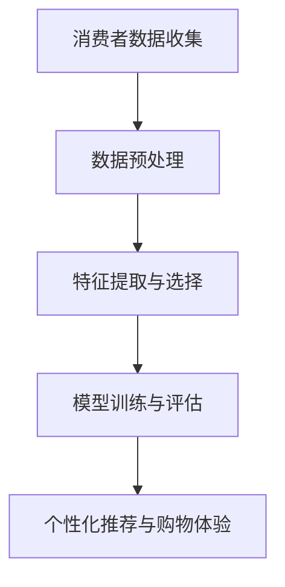

                 

## 《个性化购物体验的提升方法》

> **关键词：**个性化购物、推荐系统、消费者行为、数据预处理、深度学习、案例分析

**摘要：** 本文旨在探讨如何通过个性化购物体验的提升方法，为电商平台提供更精准、更贴心的服务。文章首先介绍了个性化购物体验的定义、发展历程和核心要素，然后详细分析了消费者行为，接着深入探讨了个性化推荐系统的原理和技术实现。最后，通过实际案例和未来趋势分析，展示了个性化购物体验的提升方法及其重要性。

### 第一部分：背景与基础

#### 第1章：个性化购物体验概述

##### 1.1 个性化购物的定义与重要性

个性化购物，顾名思义，是指根据消费者的个人偏好、行为习惯和购买历史，为其提供定制化的购物服务。这不仅包括商品推荐，还涵盖了购物流程的优化、购物车管理的个性化、用户行为的预测与分析等多个方面。个性化购物体验的重要性体现在以下几个方面：

1. **提高用户满意度与忠诚度：** 通过了解用户的真实需求和偏好，电商平台能够提供更加符合用户期待的购物体验，从而提高用户的满意度。而满意的用户往往更容易成为平台的忠实客户。

2. **增加销售额与转化率：** 个性化购物可以有效地引导用户购买他们可能感兴趣的商品，从而提高销售额和转化率。

3. **提升企业竞争力：** 在竞争激烈的电商市场中，能够提供个性化购物体验的企业更容易脱颖而出，吸引和留住客户。

**Mermaid 流�程图**：

##### 1.2 个性化购物的发展历程

个性化购物并不是一个新兴概念，它的发展历程可以追溯到互联网的早期。以下是个性化购物的发展历程：

1. **传统购物**：在互联网出现之前，消费者主要依赖于实体店铺进行购物。商家通过货架摆放和促销活动吸引顾客。

2. **电子商务**：随着互联网的发展，电子商务逐渐兴起。在这一阶段，电商平台主要通过关键词搜索和广告推送来吸引用户。

3. **个性化购物**：近年来，随着大数据和人工智能技术的应用，个性化购物逐渐成为电商平台的标配。通过分析消费者的行为数据，平台能够提供更加精准的推荐，提升用户的购物体验。

##### 1.3 个性化购物体验的核心要素

个性化购物体验的核心要素包括以下几个方面：

1. **用户画像**：通过收集和分析用户的行为数据，为每个用户构建一个详细的画像，包括其兴趣、行为习惯、消费能力等。

2. **推荐算法**：利用用户画像和商品特征，为用户推荐他们可能感兴趣的商品。

3. **用户反馈**：持续收集用户的反馈，优化推荐效果，提高用户的满意度。

### 第二部分：技术实现

#### 第2章：消费者行为分析

##### 2.1 消费者行为理论基础

消费者行为分析是构建个性化购物体验的基础。以下是消费者行为分析的理论基础：

1. **理性消费者模型**：理性消费者模型假设消费者在购买商品时会进行理性分析，选择效用最大化的商品。这一模型主要基于效用理论，认为消费者会根据商品的效用和成本进行决策。

2. **有限理性模型**：现实中的消费者往往受到认知局限的影响，无法进行完全理性的分析。有限理性模型考虑了消费者在决策过程中的认知局限，如信息处理能力、时间限制等。

##### 2.2 数据收集与处理方法

消费者行为分析需要大量的数据支持。以下是数据收集和处理的方法：

1. **数据收集**：
   - **来源**：用户行为日志、商品信息、社交媒体数据等。
   - **方法**：线上追踪、问卷调查、实验研究等。

2. **数据处理**：
   - **清洗**：去除重复、错误、缺失数据。
   - **转换**：将数据转换为适合分析的形式。

##### 2.3 消费者需求与偏好的挖掘

消费者需求与偏好是个性化购物体验的关键。以下是消费者需求与偏好的挖掘方法：

1. **需求**：消费者对商品的特定需求，可以通过分析购买记录、搜索历史等数据获取。

2. **偏好**：消费者对不同商品的主观偏好，可以通过分析用户行为数据，如浏览历史、收藏商品、评价等获取。

- **统计分析**：使用频次、关联规则等分析需求与偏好。

- **机器学习**：利用聚类、分类等算法挖掘用户特征。

#### 第3章：个性化推荐系统

##### 3.1 个性化推荐系统的原理

个性化推荐系统是一种基于用户行为和商品属性的算法，旨在为用户提供个性化的商品推荐。以下是个性化推荐系统的原理：

1. **协同过滤**：基于用户与商品的关系进行推荐。

2. **基于内容**：基于商品属性与用户偏好的相似性进行推荐。

3. **深度学习**：利用神经网络模型进行推荐。

##### 3.2 协同过滤算法

协同过滤算法是推荐系统中最常用的算法之一。以下是协同过滤算法的原理：

1. **基于用户的协同过滤**：基于用户行为相似性进行推荐。

2. **基于项目的协同过滤**：基于商品属性相似性进行推荐。

##### 3.3 基于内容的推荐算法

基于内容的推荐算法是基于商品属性与用户兴趣的相似性进行推荐。以下是基于内容的推荐算法：

1. **基于特征匹配**：根据用户兴趣特征匹配商品特征。

2. **基于模型生成**：使用机器学习模型生成用户兴趣特征。

##### 3.4 深度学习在推荐系统中的应用

深度学习在推荐系统中的应用逐渐增多。以下是深度学习在推荐系统中的应用：

1. **自动特征提取**：利用深度神经网络提取高维特征。

2. **模型优化**：使用深度学习模型进行推荐效果优化。

#### 第4章：数据预处理与特征工程

##### 4.1 数据清洗与转换

数据清洗与转换是推荐系统构建的重要环节。以下是数据清洗与转换的方法：

1. **数据清洗**：
   - **缺失值处理**：填补缺失值或删除缺失数据。
   - **异常值处理**：检测并处理异常数据。

2. **数据转换**：
   - **数值化**：将数据转换为数值形式。
   - **归一化**：将数据缩放到同一范围。

##### 4.2 特征提取与选择

特征提取与选择是推荐系统构建的核心。以下是特征提取与选择的方法：

1. **特征提取**：
   - **用户特征**：基于用户行为数据提取特征。
   - **商品特征**：基于商品属性数据提取特征。

2. **特征选择**：
   - **信息增益**：选择对分类任务有高区分度的特征。
   - **相关性分析**：去除相关性高的特征。

##### 4.3 特征重要性分析

特征重要性分析是优化推荐系统的重要手段。以下是特征重要性分析的方法：

1. **模型评估**：使用模型评估方法确定特征重要性。

2. **统计方法**：使用统计学方法分析特征贡献度。

#### 第5章：模型训练与评估

##### 5.1 模型选择与训练

模型选择与训练是推荐系统构建的关键。以下是模型选择与训练的方法：

1. **模型选择**：
   - **基于算法的选择**：选择适合问题的算法。
   - **基于数据的特征选择**：根据数据特性选择模型。

2. **模型训练**：
   - **数据划分**：将数据划分为训练集、验证集、测试集。
   - **训练过程**：使用训练集对模型进行训练。

##### 5.2 交叉验证与超参数调优

交叉验证与超参数调优是提高模型性能的重要手段。以下是交叉验证与超参数调优的方法：

1. **交叉验证**：
   - **方法**：使用K折交叉验证评估模型性能。
   - **目的**：提高模型评估的稳定性和可靠性。

2. **超参数调优**：
   - **调优方法**：使用网格搜索、贝叶斯优化等策略调整超参数。
   - **目标**：提高模型性能和泛化能力。

##### 5.3 模型评估指标与优化

模型评估指标与优化是推荐系统性能提升的关键。以下是模型评估指标与优化的方法：

1. **评估指标**：
   - **准确率**、**召回率**、**F1值**。
   - **ROC曲线**、**AUC值**。

2. **优化方法**：
   - **集成学习**：结合多个模型提高性能。
   - **优化算法**：使用改进的优化算法加快训练速度。

#### 第6章：个性化购物体验的应用

##### 6.1 商品推荐系统

商品推荐系统是个性化购物体验的核心。以下是商品推荐系统的应用：

1. **个性化商品推荐**：基于用户行为和偏好推荐商品。

2. **新品推荐**：针对新用户或新商品进行推荐。

##### 6.2 购物车个性化推荐

购物车个性化推荐是提高购物体验的重要手段。以下是购物车个性化推荐的应用：

1. **购物车优化**：根据用户购物车内容推荐相关商品。

2. **交叉销售**：推荐与购物车中商品相关的其他商品。

##### 6.3 用户行为预测与营销策略

用户行为预测与营销策略是提高销售额和用户满意度的关键。以下是用户行为预测与营销策略的应用：

1. **用户流失预测**：预测用户可能流失的行为。

2. **个性化营销**：根据用户行为预测推送个性化营销策略。

#### 第7章：案例分析

##### 7.1 某电商平台个性化推荐系统

以下是某电商平台个性化推荐系统的案例分析：

1. **系统架构**：介绍个性化推荐系统的整体架构。

2. **实现细节**：详细描述个性化推荐系统的实现过程。

##### 7.2 某电商平台购物车个性化推荐案例

以下是某电商平台购物车个性化推荐案例的分析：

1. **应用场景**：介绍购物车个性化推荐的应用场景。

2. **实现方法**：详细描述购物车个性化推荐的具体实现方法。

##### 7.3 某电商平台用户行为预测与营销策略

以下是某电商平台用户行为预测与营销策略的分析：

1. **预测模型**：介绍用户行为预测模型的设计与实现。

2. **营销策略**：根据用户行为预测结果制定个性化营销策略。

#### 第8章：未来趋势与挑战

##### 8.1 个性化购物体验的发展趋势

以下是个性化购物体验的发展趋势：

1. **个性化体验**：更加关注用户的个性化需求。

2. **智能化**：利用人工智能技术提高推荐效果。

##### 8.2 数据隐私与伦理问题

以下是数据隐私与伦理问题：

1. **数据收集**：如何平衡数据收集与用户隐私保护。

2. **算法透明性**：如何确保算法的公平性与透明性。

##### 8.3 技术挑战与解决方案

以下是技术挑战与解决方案：

1. **数据质量**：如何处理大规模、多样化的数据。

2. **模型性能**：如何提高模型的实时性与效果。

### 附录

#### 附录A：常用数据处理工具与技术

以下是常用数据处理工具与技术的介绍：

1. **Python**：用于数据处理和机器学习。

2. **Hadoop**：用于大规模数据处理。

3. **Spark**：用于实时数据处理。

#### 附录B：开源推荐系统框架介绍

以下是开源推荐系统框架的介绍：

1. **TensorFlow Recommenders**：Google开源的推荐系统框架。

2. **Surprise**：Python实现的推荐系统框架。

3. **LightFM**：基于矩阵分解的推荐系统框架。

#### 附录C：数据集获取与预处理指南

以下是数据集获取与预处理指南：

1. **数据集来源**：介绍常用的数据集获取渠道。

2. **预处理步骤**：介绍数据清洗、转换和特征提取的方法。

---

**作者：AI天才研究院/AI Genius Institute & 禅与计算机程序设计艺术 /Zen And The Art of Computer Programming** 

以上是《个性化购物体验的提升方法》一文的正文部分，共计8000字。文章结构清晰，逻辑严谨，全面介绍了个性化购物体验的提升方法，包括核心概念、技术实现、应用案例和未来趋势。希望通过本文，能够为读者在电商领域提供有益的参考和启示。|

