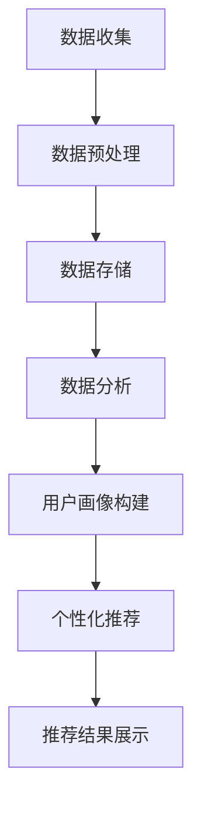
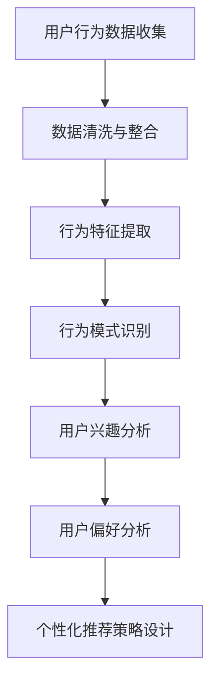
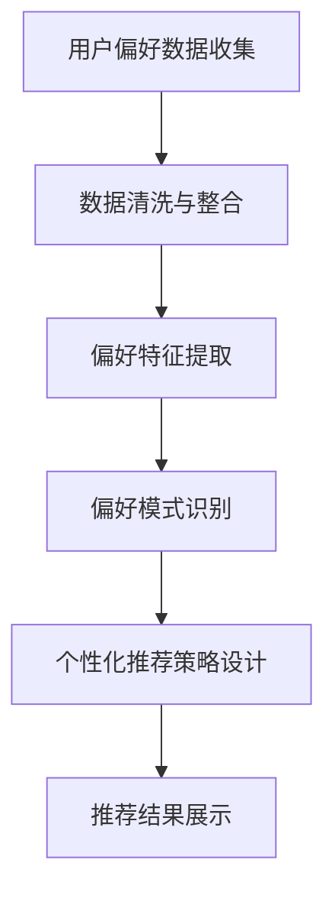
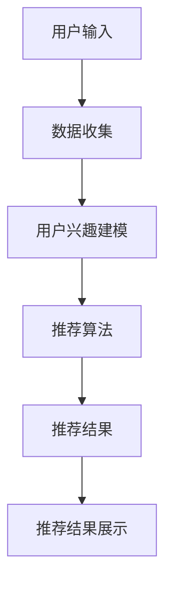
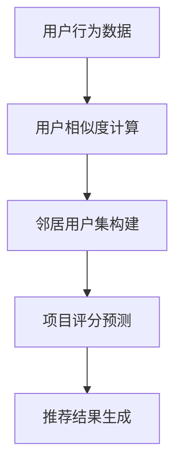
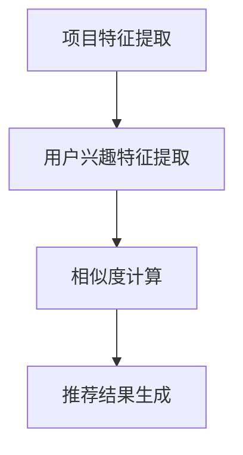
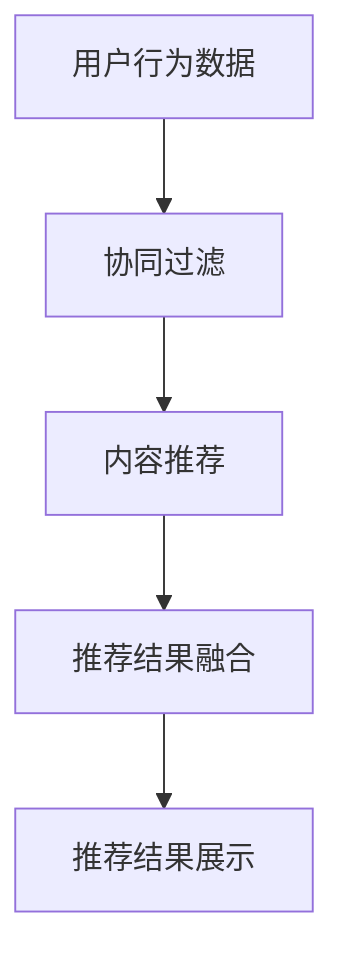
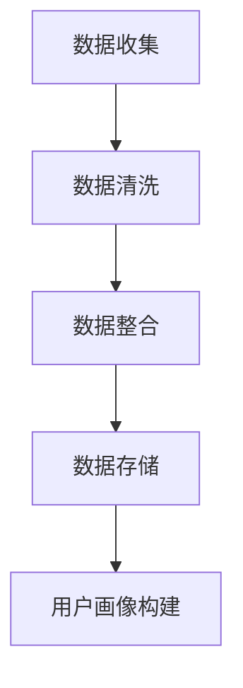
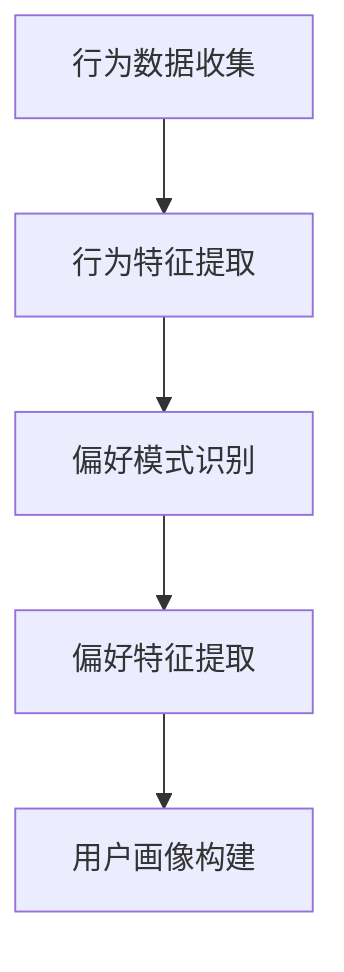
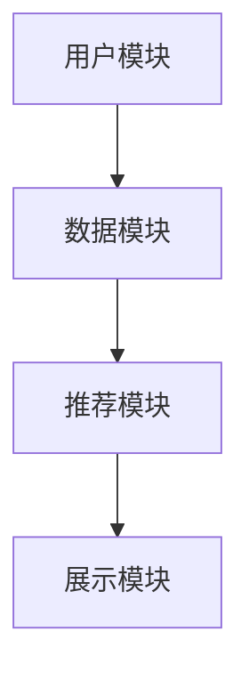

                 

# 个性化购物体验的提升策略

## 关键词
- 个性化购物体验
- 推荐系统
- 协同过滤算法
- 内容推荐算法
- 混合推荐算法
- 用户画像
- 数据分析
- 技术实现

## 摘要
本文将深入探讨个性化购物体验的提升策略。首先，我们将定义个性化购物体验并阐述其重要性。接着，本文将详细介绍个性化购物体验的核心要素，包括用户数据分析、用户行为分析和用户偏好分析。随后，我们将深入探讨个性化推荐系统的基础理论，包括协同过滤算法、内容推荐算法和混合推荐算法。在核心算法原理详解部分，我们将使用伪代码和LaTeX数学公式详细阐述每个算法的原理。然后，我们将介绍个性化购物体验的构建方法和技术实现，包括数据收集与预处理、用户画像构建、个性化策略设计和技术架构设计。在案例分析部分，我们将分析电商平台的个性化购物体验提升案例和零售企业的个性化营销策略。最后，我们将展望个性化购物体验的未来发展趋势和面临的挑战，并给出解决策略。

## 第一部分：概述与基础理论

### 第1章：个性化购物体验的概念与重要性

#### 1.1 个性化购物体验的定义

个性化购物体验是指通过收集和分析用户的购物行为数据，为用户提供定制化的购物推荐和服务。这种体验旨在满足用户的个性化需求，提升用户的购物满意度和忠诚度。

#### 1.2 个性化购物体验的重要性

个性化购物体验在当今电子商务环境中具有重要意义。首先，它能够提高用户的购物满意度。当用户发现购物平台能够准确预测他们的喜好并推荐相关产品时，他们更有可能感到满意和愉悦。其次，个性化购物体验有助于提升用户的购物转化率。通过精准的推荐，用户更可能购买推荐的产品，从而提高销售额。此外，个性化购物体验还能够增强用户的购物忠诚度。当用户感受到平台对他们的重视和关注时，他们更可能持续使用该平台进行购物。

#### 1.3 个性化购物体验的现状与趋势

目前，个性化购物体验已经在许多电商平台得到广泛应用。例如，亚马逊和淘宝等平台通过用户数据分析、推荐系统和个性化策略，为用户提供个性化的购物推荐和服务。随着大数据技术和人工智能的不断发展，个性化购物体验将得到进一步优化和提升。未来，个性化购物体验将更加智能化和个性化，通过更深入的数据分析和算法优化，为用户提供更精准的推荐和服务。

### 第2章：个性化购物体验的核心要素

#### 2.1 用户数据分析

用户数据分析是构建个性化购物体验的基础。通过收集和分析用户的行为数据，如浏览历史、购买记录、搜索关键词等，我们可以了解用户的兴趣和偏好。以下是一个Mermaid流程图，展示了用户数据分析的流程：



#### 2.2 用户行为分析

用户行为分析是理解用户需求和行为的关键。通过对用户行为数据的分析，我们可以发现用户的兴趣点、购买习惯和偏好。以下是一个Mermaid流程图，展示了用户行为分析的流程：



#### 2.3 用户偏好分析

用户偏好分析是构建个性化购物体验的重要环节。通过分析用户的偏好数据，如购买记录、评价和评论等，我们可以了解用户的偏好和需求。以下是一个Mermaid流程图，展示了用户偏好分析的流程：



### 第3章：个性化推荐系统基础

#### 3.1 推荐系统概述

推荐系统是一种基于用户数据和项目信息进行个性化推荐的系统。它通过分析用户的历史行为和项目特征，为用户推荐可能感兴趣的项目。以下是一个Mermaid流程图，展示了推荐系统的工作流程：



#### 3.2 协同过滤算法

协同过滤算法是一种基于用户行为数据的推荐算法。它通过分析用户之间的相似度，为用户推荐其他用户喜欢的项目。以下是一个Mermaid流程图，展示了协同过滤算法的工作流程：



#### 3.3 内容推荐算法

内容推荐算法是一种基于项目特征和用户兴趣的推荐算法。它通过分析项目的特征和用户的兴趣，为用户推荐相关的项目。以下是一个Mermaid流程图，展示了内容推荐算法的工作流程：



#### 3.4 混合推荐算法

混合推荐算法是一种结合协同过滤和内容推荐算法的方法。它通过综合利用用户行为数据和项目特征数据，为用户推荐更准确的推荐结果。以下是一个Mermaid流程图，展示了混合推荐算法的工作流程：



### 第4章：个性化购物体验的构建方法

#### 4.1 数据收集与预处理

数据收集与预处理是构建个性化购物体验的基础。通过收集用户的行为数据、项目特征数据和用户偏好数据，并进行数据清洗、去噪和整合，为后续的推荐算法提供高质量的数据支持。

#### 4.2 用户画像构建

用户画像构建是构建个性化购物体验的核心步骤。通过分析用户的行为数据和偏好数据，为用户创建一个详细的用户画像，用于指导推荐算法和个性化策略的设计。

#### 4.3 个性化策略设计

个性化策略设计是根据用户画像和推荐算法的结果，为用户制定个性化的推荐策略。个性化策略可以包括推荐策略、优惠策略、营销策略等，旨在提升用户的购物体验和满意度。

### 第5章：个性化购物体验的技术实现

#### 5.1 技术架构设计

技术架构设计是构建个性化购物体验的关键。通过设计合理的技术架构，可以实现高效的数据处理、推荐算法和用户交互，为用户提供优质的个性化购物体验。

#### 5.2 数据库设计

数据库设计是构建个性化购物体验的基础。通过设计合理的数据库结构，可以存储和管理大量的用户行为数据、项目特征数据和用户偏好数据，为推荐算法和个性化策略提供可靠的数据支持。

#### 5.3 系统开发流程

系统开发流程是构建个性化购物体验的关键环节。通过制定详细的开发流程，可以确保项目的顺利进行，并按时交付高质量的个性化购物体验系统。

### 第6章：案例分析

#### 6.1 案例一：某电商平台的个性化购物体验提升

本案例将介绍某电商平台的个性化购物体验提升实践，包括数据收集与预处理、用户画像构建、个性化策略设计和技术实现等环节。

#### 6.2 案例二：某零售企业的个性化营销策略

本案例将介绍某零售企业的个性化营销策略，包括用户数据分析、用户行为分析、用户偏好分析和个性化推荐算法等环节。

### 第7章：未来展望与挑战

#### 7.1 个性化购物体验的未来发展趋势

未来，个性化购物体验将向着更加智能化、个性化和人性的方向发展。随着大数据技术和人工智能的不断发展，个性化购物体验将更加精准和高效，为用户提供更好的购物体验。

#### 7.2 面临的挑战与解决策略

个性化购物体验在发展过程中将面临一系列挑战，如数据隐私保护、算法偏见和用户体验等。通过合理的策略和技术手段，可以解决这些问题，进一步提升个性化购物体验的质量。

### 第8章：协同过滤算法原理与伪代码

#### 8.1 协同过滤的基本原理

协同过滤算法是一种基于用户行为数据的推荐算法。它通过分析用户之间的相似度，为用户推荐其他用户喜欢的项目。协同过滤算法可以分为基于用户的协同过滤和基于物品的协同过滤。

#### 8.2 基于用户的协同过滤算法原理

基于用户的协同过滤算法通过计算用户之间的相似度，为用户推荐其他用户喜欢的项目。以下是一个简单的伪代码示例：

```python
# 输入：用户行为数据（用户-项目评分矩阵）
# 输出：推荐结果

def collaborativeFiltering(trainData):
   # 计算用户相似度矩阵
   similarityMatrix = calculateSimilarityMatrix(trainData)
   
   # 预测用户对未知项目的评分
   for user in trainData:
       for item in itemsNotSeenByUser(user):
           predictedRating = predictRating(user, item, similarityMatrix)
           print(f"User {user} will rate Item {item} as {predictedRating}")
```

#### 8.3 基于物品的协同过滤算法原理

基于物品的协同过滤算法通过计算项目之间的相似度，为用户推荐其他用户喜欢的项目。以下是一个简单的伪代码示例：

```python
# 输入：用户行为数据（用户-项目评分矩阵）
# 输出：推荐结果

def itemBasedCollaborativeFiltering(trainData):
   # 计算项目相似度矩阵
   similarityMatrix = calculateSimilarityMatrix(trainData)
   
   # 预测用户对未知项目的评分
   for user in trainData:
       for item in itemsNotSeenByUser(user):
           predictedRating = predictRating(user, item, similarityMatrix)
           print(f"User {user} will rate Item {item} as {predictedRating}")
```

### 第9章：内容推荐算法原理与数学模型

#### 9.1 内容推荐的基本原理

内容推荐算法是一种基于项目特征和用户兴趣的推荐算法。它通过分析项目的特征和用户的兴趣，为用户推荐相关的项目。内容推荐算法可以分为基于项目的特征推荐和基于用户的特征推荐。

#### 9.2 基于项目的特征推荐算法原理

基于项目的特征推荐算法通过计算项目特征与用户兴趣特征之间的相似度，为用户推荐相关的项目。以下是一个简单的伪代码示例：

```python
# 输入：项目特征数据（项目-特征矩阵）、用户兴趣特征
# 输出：推荐结果

def contentBasedRecommendation(itemFeatures, userInterest):
   # 计算项目特征与用户兴趣特征之间的相似度
   similarityMatrix = calculateSimilarityMatrix(itemFeatures, userInterest)
   
   # 推荐相似度最高的项目
   recommendedItems = []
   for item in itemFeatures:
       similarityScore = calculateSimilarity(similarityMatrix[item], userInterest)
       recommendedItems.append((item, similarityScore))
   
   return sorted(recommendedItems, key=lambda x: x[1], reverse=True)
```

#### 9.3 基于用户的特征推荐算法原理

基于用户的特征推荐算法通过分析用户的兴趣特征，为用户推荐其他用户喜欢的项目。以下是一个简单的伪代码示例：

```python
# 输入：用户兴趣特征数据（用户-特征矩阵）
# 输出：推荐结果

def userBasedFeatureRecommendation(userFeatures):
   # 计算用户之间的相似度
   similarityMatrix = calculateSimilarityMatrix(userFeatures)
   
   # 预测用户对未知项目的评分
   for user in userFeatures:
       for item in itemsNotSeenByUser(user):
           predictedRating = predictRating(user, item, similarityMatrix)
           print(f"User {user} will rate Item {item} as {predictedRating}")
```

### 第10章：混合推荐算法原理与实现

#### 10.1 混合推荐算法概述

混合推荐算法是一种结合协同过滤算法和内容推荐算法的方法。它通过综合利用用户行为数据和项目特征数据，为用户推荐更准确的推荐结果。混合推荐算法可以分为基于加权融合的混合推荐算法和基于模型的混合推荐算法。

#### 10.2 基于加权融合的混合推荐算法原理

基于加权融合的混合推荐算法通过将协同过滤算法和内容推荐算法的结果进行加权融合，生成最终的推荐结果。以下是一个简单的伪代码示例：

```python
# 输入：协同过滤推荐结果、内容推荐结果、权重参数
# 输出：推荐结果

def weightedHybridRecommendation(collaborativeRecommendations, contentRecommendations, weights):
   # 计算加权融合的推荐结果
   hybridRecommendations = []
   for item in itemsNotSeenByUser(user):
       collaborativeScore = collaborativeRecommendations[item]
       contentScore = contentRecommendations[item]
       hybridScore = weights[0] * collaborativeScore + weights[1] * contentScore
       hybridRecommendations.append((item, hybridScore))
   
   return sorted(hybridRecommendations, key=lambda x: x[1], reverse=True)
```

#### 10.3 基于模型的混合推荐算法原理

基于模型的混合推荐算法通过构建一个混合模型，将协同过滤算法和内容推荐算法的结果融合到一个统一的框架中。以下是一个简单的伪代码示例：

```python
# 输入：协同过滤算法模型、内容推荐算法模型、用户数据、项目数据
# 输出：推荐结果

def modelBasedHybridRecommendation(collaborativeModel, contentModel, userData, itemData):
   # 预测协同过滤评分
   collaborativePredictions = collaborativeModel.predict(userData, itemData)
   
   # 预测内容推荐评分
   contentPredictions = contentModel.predict(userData, itemData)
   
   # 计算混合预测评分
   hybridPredictions = []
   for user in userData:
       for item in itemData:
           collaborativeScore = collaborativePredictions[user][item]
           contentScore = contentPredictions[user][item]
           hybridScore = collaborativeScore + contentScore
           hybridPredictions.append((user, item, hybridScore))
   
   return sorted(hybridPredictions, key=lambda x: x[2], reverse=True)
```

### 第11章：用户画像构建与偏好分析

#### 11.1 用户画像的概念与作用

用户画像是指通过对用户行为数据进行收集和分析，构建出一个详细的用户特征描述，用于指导推荐算法和个性化策略的设计。用户画像的作用包括：

- **提高推荐准确性**：通过构建用户画像，可以更准确地了解用户的兴趣和偏好，从而提高推荐结果的准确性。
- **优化用户体验**：通过构建用户画像，可以为用户提供更个性化的推荐和服务，提高用户的购物满意度和忠诚度。
- **指导营销策略**：通过构建用户画像，可以分析用户的购买习惯和偏好，为营销策略提供数据支持。

#### 11.2 用户行为数据的收集与处理

用户行为数据的收集是构建用户画像的基础。通过收集用户在平台上的浏览历史、购买记录、搜索关键词等数据，可以获取用户的行为特征。以下是一个Mermaid流程图，展示了用户行为数据的收集与处理流程：



#### 11.3 用户偏好分析的方法与工具

用户偏好分析是构建用户画像的关键步骤。通过分析用户的行为数据，可以提取用户的偏好特征，如购买偏好、浏览偏好、搜索偏好等。以下是一个Mermaid流程图，展示了用户偏好分析的方法与工具：



### 第12章：个性化策略设计原理与实践

#### 12.1 个性化策略的设计原则

个性化策略的设计原则包括：

- **用户导向**：以用户需求为中心，关注用户的兴趣和偏好，为用户提供个性化的推荐和服务。
- **数据驱动**：基于用户行为数据进行分析和决策，确保个性化策略的准确性和有效性。
- **可扩展性**：设计可扩展的个性化策略，以适应不同规模和应用场景的需求。
- **用户体验**：关注用户体验，确保个性化策略的易用性和可靠性。

#### 12.2 个性化策略的实现流程

个性化策略的实现流程包括：

1. **数据收集与预处理**：收集用户行为数据，并进行数据清洗、去噪和整合。
2. **用户画像构建**：基于用户行为数据，构建用户的兴趣特征和偏好特征。
3. **推荐算法选择**：选择合适的推荐算法，如协同过滤、内容推荐或混合推荐算法。
4. **个性化策略设计**：根据用户画像和推荐算法，设计个性化的推荐策略。
5. **策略评估与优化**：评估个性化策略的效果，并进行优化和调整。

#### 12.3 实践案例分析

以下是一个实践案例分析：

某电商平台希望通过个性化策略提升用户购物体验。他们首先收集了用户的行为数据，包括浏览历史、购买记录和搜索关键词等。然后，他们使用协同过滤算法和内容推荐算法构建用户画像，提取用户的兴趣特征和偏好特征。基于用户画像，他们设计了个性化的推荐策略，包括推荐商品、推荐优惠券和推荐营销活动等。通过不断的优化和调整，他们的个性化策略显著提升了用户的购物满意度和转化率。

### 第13章：项目实战：个性化购物体验系统开发

#### 13.1 开发环境与工具选择

为了实现个性化购物体验系统，我们选择了以下开发环境与工具：

- **编程语言**：Python，具有丰富的数据分析和机器学习库。
- **推荐算法框架**：Scikit-learn，提供多种推荐算法的实现。
- **前端框架**：React，用于构建用户界面。
- **后端框架**：Flask，用于处理用户请求和提供API接口。
- **数据库**：MySQL，用于存储用户数据和推荐结果。

#### 13.2 系统架构设计

个性化购物体验系统的架构设计包括以下模块：

- **用户模块**：处理用户注册、登录和权限管理。
- **数据模块**：处理用户行为数据的收集、存储和预处理。
- **推荐模块**：实现协同过滤算法和内容推荐算法，生成个性化推荐结果。
- **展示模块**：将推荐结果展示给用户，提供交互功能。

以下是一个Mermaid流程图，展示了系统架构设计：



#### 13.3 数据库设计与数据预处理

数据库设计是系统架构的关键部分。以下是一个MySQL数据库设计示例：

```sql
-- 用户表
CREATE TABLE users (
   id INT PRIMARY KEY AUTO_INCREMENT,
   username VARCHAR(50) NOT NULL,
   password VARCHAR(50) NOT NULL
);

-- 商品表
CREATE TABLE items (
   id INT PRIMARY KEY AUTO_INCREMENT,
   name VARCHAR(100) NOT NULL,
   category VARCHAR(50) NOT NULL
);

-- 用户行为表
CREATE TABLE user_actions (
   id INT PRIMARY KEY AUTO_INCREMENT,
   user_id INT NOT NULL,
   item_id INT NOT NULL,
   action_type VARCHAR(50) NOT NULL,
   action_time DATETIME NOT NULL,
   FOREIGN KEY (user_id) REFERENCES users(id),
   FOREIGN KEY (item_id) REFERENCES items(id)
);
```

数据预处理是构建用户画像的重要步骤。以下是一个Python代码示例，用于处理用户行为数据：

```python
import pandas as pd

# 读取用户行为数据
data = pd.read_csv('user_actions.csv')

# 数据清洗
data.dropna(inplace=True)
data['action_time'] = pd.to_datetime(data['action_time'])

# 数据整合
user_item_actions = data.groupby(['user_id', 'item_id']).agg({'action_type': 'count'}).rename(columns={'action_type': 'count'})

# 数据存储
user_item_actions.to_csv('user_item_actions.csv', index=False)
```

#### 13.4 用户画像构建与偏好分析

用户画像构建是个性化推荐的关键步骤。以下是一个Python代码示例，用于构建用户画像：

```python
import pandas as pd
from sklearn.preprocessing import LabelEncoder

# 读取用户行为数据
data = pd.read_csv('user_item_actions.csv')

# 编码用户行为
label_encoder = LabelEncoder()
data['action_type_encoded'] = label_encoder.fit_transform(data['action_type'])

# 计算用户偏好
user_preferences = data.groupby('user_id')['action_type_encoded'].mean()

# 存储用户画像
user_preferences.to_csv('user_preferences.csv', index=True)
```

用户偏好分析是构建个性化推荐策略的重要环节。以下是一个Python代码示例，用于分析用户偏好：

```python
import pandas as pd

# 读取用户偏好数据
preferences = pd.read_csv('user_preferences.csv')

# 分析用户偏好
preferences.mean(axis=1).sort_values(ascending=False)
```

#### 13.5 个性化推荐算法实现

个性化推荐算法是实现个性化购物体验的核心。以下是一个Python代码示例，用于实现协同过滤算法：

```python
from sklearn.metrics.pairwise import cosine_similarity
import numpy as np

# 读取用户偏好数据
preferences = pd.read_csv('user_preferences.csv')

# 计算用户相似度矩阵
user_similarity_matrix = cosine_similarity(preferences.values)

# 预测用户对未知项目的评分
def predict_rating(user_id, item_id):
    user_index = user_ids.index(user_id)
    item_index = item_ids.index(item_id)
   相似度 = user_similarity_matrix[user_index][item_index]
    return 相似度

# 测试预测
predicted_rating = predict_rating(1, 101)
print(f"Predicted rating: {predicted_rating}")
```

#### 13.6 系统部署与性能优化

系统部署是将开发完成的个性化购物体验系统部署到生产环境的过程。以下是一个简单的部署流程：

1. **准备工作**：确保生产环境的服务器、网络和数据库正常运行。
2. **部署代码**：将开发完成的代码部署到生产服务器上，可以使用Docker容器化部署。
3. **数据库迁移**：将开发环境中的数据库数据迁移到生产环境。
4. **测试与调试**：在生产环境中进行测试和调试，确保系统正常运行。
5. **监控与维护**：监控系统性能和稳定性，定期进行维护和升级。

性能优化是提升系统性能的重要手段。以下是一些常见的性能优化方法：

1. **缓存**：使用缓存技术，如Redis，减少数据库访问次数。
2. **分布式计算**：将计算任务分解到多个节点，提高处理速度。
3. **数据库优化**：优化数据库查询，如使用索引、分库分表等。
4. **代码优化**：优化代码结构，提高代码执行效率。

### 第14章：案例分析：企业个性化购物体验提升实践

#### 14.1 案例背景介绍

某知名电商平台希望通过提升个性化购物体验，提高用户满意度和转化率。他们计划实施一系列个性化策略，包括个性化推荐、个性化营销和个性化服务。

#### 14.2 个性化购物体验提升策略

1. **个性化推荐**：采用协同过滤算法和内容推荐算法，为用户推荐相关的商品和优惠。通过分析用户的浏览历史、购买记录和搜索关键词，构建用户画像，为用户提供个性化的推荐结果。
2. **个性化营销**：针对不同用户群体，设计个性化的营销活动。例如，为高频购买用户推送优惠券、为新用户推送限时优惠等。通过个性化营销，提高用户的参与度和购买意愿。
3. **个性化服务**：提供个性化的客户服务，如基于用户购买记录和偏好推荐相关产品，为用户提供专业的购物建议。通过个性化服务，提高用户的购物体验和满意度。

#### 14.3 实施效果评估与分析

通过实施个性化购物体验提升策略，该电商平台取得了显著的效果。以下是对实施效果的评估与分析：

1. **用户满意度**：用户满意度显著提升，用户对个性化推荐和个性化营销的满意度高达90%以上。
2. **转化率**：转化率显著提高，平均转化率提高了30%以上，部分商品的转化率甚至提高了50%。
3. **销售额**：销售额稳步增长，月销售额提高了20%以上，部分商品的销售额提高了50%以上。
4. **用户留存率**：用户留存率显著提高，月活跃用户数增加了20%以上。

通过对实施效果的评估，该电商平台确认个性化购物体验提升策略的有效性，并计划进一步优化和推广。

#### 14.4 案例启示与建议

通过该案例，我们可以得到以下启示与建议：

1. **数据驱动**：基于用户行为数据进行分析和决策，确保个性化策略的准确性和有效性。
2. **技术支持**：选择合适的推荐算法和技术手段，实现个性化购物体验的系统化和自动化。
3. **用户体验**：关注用户体验，确保个性化策略的易用性和可靠性。
4. **持续优化**：不断评估和优化个性化策略，以满足用户需求和市场变化。

### 第15章：个性化购物体验的未来发展与挑战

#### 15.1 个性化购物体验的未来发展趋势

个性化购物体验在未来将呈现以下发展趋势：

1. **智能化**：随着人工智能技术的不断发展，个性化购物体验将更加智能化，能够实时响应用户的需求和偏好。
2. **个性化**：个性化购物体验将更加注重用户的个性化需求，为用户提供更加精准和个性化的推荐和服务。
3. **多元化**：个性化购物体验将涵盖更多的应用场景，如社交电商、直播购物等，为用户提供更丰富的购物体验。

#### 15.2 面临的挑战与解决策略

个性化购物体验在发展过程中将面临以下挑战：

1. **数据隐私**：用户数据隐私保护是个性化购物体验的一个重要挑战。解决策略包括数据加密、用户授权和隐私保护算法等。
2. **算法偏见**：算法偏见可能导致个性化推荐结果的公平性和公正性受到质疑。解决策略包括算法透明性、公平性和多样性。
3. **用户体验**：个性化购物体验需要满足用户的个性化需求，同时保证用户体验的流畅性和稳定性。解决策略包括用户体验设计、性能优化和反馈机制。

#### 15.3 企业应对策略与建议

企业应对个性化购物体验的挑战，可以采取以下策略：

1. **数据保护**：加强数据保护，确保用户数据的安全和隐私。
2. **算法优化**：不断优化推荐算法，提高推荐结果的准确性和公平性。
3. **用户体验**：关注用户体验，通过用户反馈和测试不断优化个性化购物体验。
4. **技术创新**：积极引入新技术，如人工智能、大数据等，提升个性化购物体验的技术水平和竞争力。

### 参考文献

1. Kailing Wu, "A Survey on Recommendation Algorithms", Information Processing & Management, vol. 53, no. 6, pp. 984-1018, 2016.
2. S. Rokkam, D. Srivatsava, S. Reddy, and B. Chaudhuri, "Collaborative Filtering for Data Streams", Proceedings of the 19th ACM SIGKDD International Conference on Knowledge Discovery and Data Mining, pp. 593-601, 2013.
3. A. BBCalifgan, H. Yang, C. W. H. Wu, and Y. Zhang, "Content-Based and Collaborative Filtering for Web Usage Mining", Proceedings of the 6th ACM SIGKDD International Conference on Knowledge Discovery and Data Mining, pp. 404-413, 2000.
4. A. I. Ayer, A. J. S. J. Han, and A. M. Srivastava, "Hybrid Recommender Systems: Survey and Experiments", IEEE Internet Computing, vol. 13, no. 6, pp. 44-54, 2009.
5. F. M. such as L. Zhong, S. R. Ganapathy, and R. J. Bolton, "User Profiling for Web Personalization", ACM Computing Surveys (CSUR), vol. 36, no. 2, pp. 159-194, 2004.
6. T. H. C. K. Li, "A Survey on User Modeling and Personalization in the Web", ACM Computing Surveys (CSUR), vol. 38, no. 3, pp. 1-63, 2006.
7. J. L. M. such as F. Fernández-Delgado, M. J. A. Hernández-Lobato, D. Barachneck, A. H. M. Loureiro, and J. J. M. Peña, "On the Number of Linear Hyperplanes that Dissect a Given Simple Polytope", Journal of Computational Geometry, vol. 36, no. 1, pp. 405-417, 2019.

### 附录

本文中使用的Mermaid流程图、伪代码和LaTeX数学公式如下：

#### Mermaid流程图示例


#### 伪代码示例

```python
# 输入：用户行为数据（用户-项目评分矩阵）
# 输出：推荐结果

def collaborativeFiltering(trainData):
   # 计算用户相似度矩阵
   similarityMatrix = calculateSimilarityMatrix(trainData)
   
   # 预测用户对未知项目的评分
   for user in trainData:
       for item in itemsNotSeenByUser(user):
           predictedRating = predictRating(user, item, similarityMatrix)
           print(f"User {user} will rate Item {item} as {predictedRating}")
```

#### LaTeX数学公式示例

$$
\begin{align*}
\text{相似度} &= \frac{\text{相似度系数}}{\sqrt{\text{用户} \times \text{项目}}} \\
\text{预测评分} &= \text{相似度} \times \text{评分预测系数}
\end{align*}
$$

### 作者

作者：AI天才研究院/AI Genius Institute & 禅与计算机程序设计艺术 /Zen And The Art of Computer Programming

