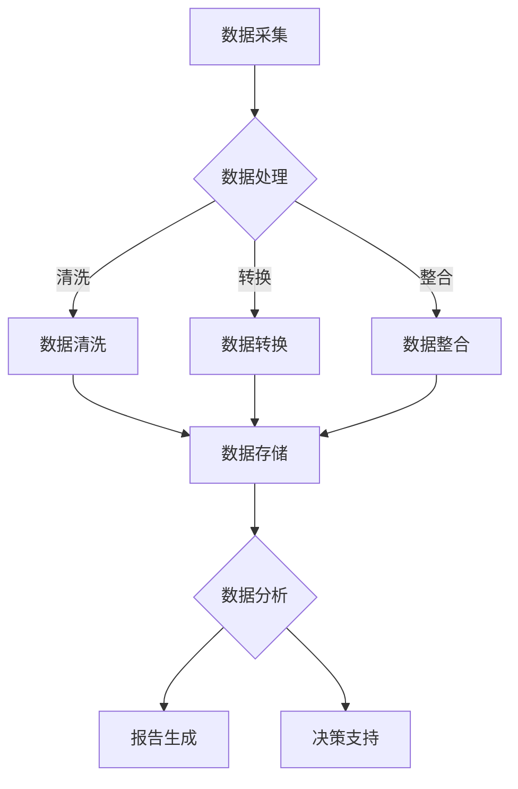

                 

# 《人工智能创业数据管理的创新方法》

## 关键词
- 人工智能创业
- 数据管理
- 创新方法
- 数据分析
- 决策支持系统

## 摘要
本文深入探讨了人工智能创业中的数据管理创新方法。首先，我们回顾了人工智能和创业的基础知识，然后分析了人工智能技术在数据管理中的应用。接着，通过成功的AI创业案例和失败案例的对比，总结了创业经验。在此基础上，我们探讨了数据管理创新的必要性、分类及实践。文章最后展望了未来数据管理创新趋势，并提出了创业环境下的数据管理策略。通过本文，读者可以了解到如何在人工智能创业中实现高效的数据管理。

---

### 《人工智能创业数据管理的创新方法》目录大纲

#### 第一部分：人工智能与创业基础

##### 第1章：人工智能与创业概述

- **1.1 人工智能的起源与发展**
  - 人工智能的历史回顾
  - 人工智能在创业领域的应用潜力

- **1.2 创业的定义与要素**
  - 创业的本质
  - 创业的关键要素：机遇、资源、团队、执行力

- **1.3 人工智能创业模式分析**
  - 创业项目的选择
  - 创业项目的可行性分析

##### 第2章：人工智能技术基础

- **2.1 人工智能的基本概念**
  - 机器学习、深度学习、自然语言处理等基础概念
  - 人工智能的分类

- **2.2 数据管理的基本原理**
  - 数据管理的重要性
  - 数据类型、数据质量与数据生命周期

##### 第3章：人工智能创业案例分析

- **3.1 成功的AI创业案例**
  - 知名的AI创业公司案例分析
  - 成功因素与创业经验总结

- **3.2 失败的AI创业案例**
  - 失败的原因分析
  - 避免失败的策略

#### 第二部分：数据管理创新方法

##### 第4章：数据管理创新方法概述

- **4.1 数据管理创新的必要性**
  - 数据管理的挑战
  - 创新方法的优势

- **4.2 创新方法分类与比较**
  - 传统数据管理方法
  - 新兴数据管理方法

##### 第5章：人工智能与数据管理融合

- **5.1 人工智能技术在数据管理中的应用**
  - 数据清洗、数据集成、数据分析等

- **5.2 数据驱动的决策支持系统**
  - 数据分析与决策过程
  - 案例解析

##### 第6章：数据管理创新实践

- **6.1 数据管理创新案例研究**
  - 创新方法在具体行业中的应用
  - 案例分析与总结

- **6.2 数据管理创新工具与技术**
  - 新兴技术的介绍与评估
  - 实践经验与建议

##### 第7章：数据管理创新与创业策略

- **7.1 创业环境下的数据管理策略**
  - 资源有限条件下的数据管理
  - 数据管理在创业中的战略定位

- **7.2 数据管理创新的法律与社会影响**
  - 数据隐私保护
  - 社会责任与道德规范

##### 第8章：未来展望

- **8.1 数据管理创新趋势**
  - 人工智能与数据管理的未来发展

- **8.2 创业中的数据管理挑战与机遇**
  - 创业环境下的数据管理挑战
  - 创业机会与风险分析

#### 附录

- **附录 A：数据管理创新工具与资源**
  - 开源数据管理工具介绍
  - 数据管理相关的在线资源

- **附录 B：参考文献**
  - 本书引用的学术资料与文献

### 附录 C：Mermaid 流程图

- **C.1 数据管理流程图**
  - 使用 Mermaid 语法绘制的流程图

### 附录 D：伪代码示例

- **D.1 数据清洗算法**
  - 使用伪代码描述的数据清洗算法

### 附录 E：数学模型与公式

- **E.1 数据分析中的数学模型**
  - 使用 LaTeX 格式表示的数学公式与模型

### 附录 F：代码案例

- **F.1 数据管理创新项目实战**
  - 代码实现与详细解读

- **F.2 数据管理工具环境搭建**
  - 开发环境搭建步骤与详细解释

### 第1章：人工智能与创业概述

在当今快速发展的科技时代，人工智能（AI）已经成为推动创业和创新的核心动力。人工智能不仅改变了传统的商业模式，也带来了全新的数据管理和分析方法。这一章节将探讨人工智能的起源与发展，创业的定义与要素，以及人工智能在创业领域的应用潜力。

### 1.1 人工智能的起源与发展

人工智能（Artificial Intelligence，简称AI）是一个涉及计算机科学、心理学、神经科学、统计学等多个领域的交叉学科。人工智能的概念最早可以追溯到20世纪50年代。1956年，约翰·麦卡锡（John McCarthy）等人在达特茅斯会议（Dartmouth Conference）上提出了人工智能的概念，标志着人工智能领域的正式诞生。

#### 历史回顾

- **早期探索（1956-1969年）**：这一时期，人工智能领域主要集中在符号主义和逻辑推理的研究，如专家系统和推理机。这一阶段的代表性成就是“逻辑理论家”（Logic Theorist）程序的实现，该程序能够证明数学定理。

- **黄金时期（1970-1980年）**：随着计算机性能的提升和算法的进步，人工智能领域迎来了快速发展。1969年，IBM的“深蓝”（Deep Blue）计算机在国际象棋比赛中击败了世界冠军加里·卡斯帕罗夫（Garry Kasparov），标志着人工智能在特定领域取得了突破。

- **衰退时期（1980-1990年）**：由于实际应用中遇到的技术难题和资金压力，人工智能领域出现了衰退。这一时期的代表事件是1980年，IBM的“深蓝”计算机退役。

- **复兴时期（1990年至今）**：随着计算机性能的提升和大数据、云计算、机器学习等技术的发展，人工智能领域再次迎来快速发展。2006年，杰弗里·辛顿（Geoffrey Hinton）等人的深度学习算法取得突破性进展，开启了人工智能的新篇章。

#### 人工智能在创业领域的应用潜力

人工智能技术在创业领域的应用潜力巨大。首先，人工智能可以帮助创业公司降低研发成本。通过自动化和智能化技术，创业公司可以实现高效的研发流程，减少人力和时间成本。

其次，人工智能可以帮助创业公司更好地理解市场和用户需求。通过大数据分析和机器学习算法，创业公司可以挖掘用户行为数据，了解用户喜好和需求，从而制定更加精准的市场策略。

此外，人工智能还可以提高创业公司的运营效率。例如，通过智能客服系统，创业公司可以提供24小时不间断的客户服务，提高客户满意度。通过智能供应链管理系统，创业公司可以优化库存管理，降低运营成本。

总之，人工智能在创业领域的应用不仅可以帮助创业公司降低成本、提高效率，还可以增强市场竞争力，从而为创业成功提供有力支持。

### 1.2 创业的定义与要素

创业是一个充满不确定性和挑战的过程，但同时也是实现个人价值和创造社会财富的重要途径。为了更好地理解创业，我们需要明确创业的定义及其关键要素。

#### 创业的本质

创业是指创建一个新企业或组织，通过创新的商业模式和产品或服务来满足市场需求。创业不仅是一个经济活动，更是一种创新和创造的过程。创业的本质可以概括为以下几个方面：

1. **创新性**：创业的核心是创新，包括技术创新、商业模式创新、市场创新等。创新是创业成功的驱动力，也是创业公司区别于传统企业的关键特征。

2. **风险性**：创业过程中充满了不确定性和风险，包括市场风险、技术风险、财务风险等。创业者需要具备较强的心理承受能力和风险管理能力。

3. **可持续性**：创业不仅要追求短期利益，更要关注企业的长期发展和社会责任。可持续性是创业公司的核心竞争力之一。

#### 创业的关键要素

要实现创业成功，需要以下关键要素的支持：

1. **机遇**：创业需要发现和把握市场机遇。市场机遇可以是市场需求的变化、技术进步带来的新应用场景等。创业者需要具备敏锐的市场洞察力，及时发现和利用市场机遇。

2. **资源**：资源是创业成功的基础。资源包括资金、技术、人才、市场渠道等。创业者需要合理配置和利用资源，实现资源的最优配置。

3. **团队**：团队是创业的核心力量。一个优秀的团队可以弥补创业者的个人短板，提高创业成功的可能性。创业者需要具备领导力，能够吸引和留住优秀人才。

4. **执行力**：执行力是创业成功的关键。创业者需要制定明确的战略和计划，并确保执行过程中的高效和协同。

#### 创业项目的选择

选择合适的创业项目是创业成功的第一步。以下是一些选择创业项目的建议：

1. **市场需求**：选择市场需求大、潜力大的项目。通过市场调研，了解目标客户的需求和痛点，从而确定创业项目的方向。

2. **自身优势**：选择与自身优势相匹配的项目。自身优势包括专业技能、行业经验、资源渠道等。选择与自身优势相关联的项目，可以降低创业风险。

3. **可行性分析**：对创业项目进行可行性分析，包括技术可行性、市场可行性、财务可行性等。确保创业项目在技术和市场层面具有可行性。

4. **创新性**：选择具有创新性的项目。创新性可以体现在技术、商业模式、市场策略等方面。创新性项目更容易获得市场认可和竞争优势。

#### 创业项目的可行性分析

创业项目的可行性分析是确保项目成功的重要步骤。以下是一些关键因素：

1. **技术可行性**：评估项目所需技术的成熟度、可实现性和成本。确保项目所需技术可以在预算和时间范围内实现。

2. **市场可行性**：分析市场需求、竞争对手、市场潜力等。确保项目能够在市场上获得成功。

3. **财务可行性**：评估项目的投资回报率、成本效益、现金流等。确保项目具有良好的财务前景。

4. **团队可行性**：评估团队的能力、经验和协同性。确保团队具有实现项目目标的能力。

通过全面的可行性分析，创业者可以更准确地评估项目的成功概率，从而制定合理的创业计划。

### 1.3 人工智能创业模式分析

人工智能创业模式是指利用人工智能技术来创建新企业或项目的商业策略。以下是一些常见的人工智能创业模式：

#### 人工智能+垂直行业

这种模式是将人工智能技术应用到特定的行业，如医疗、金融、零售等。通过人工智能技术，提高行业效率和创新能力。例如，在医疗领域，人工智能可以通过自然语言处理和图像识别等技术，辅助医生进行诊断和治疗。

#### 人工智能+平台

这种模式是构建一个基于人工智能技术的平台，为其他企业和开发者提供技术和服务。例如，IBM的Watson平台提供了人工智能解决方案，包括自然语言处理、机器学习和数据挖掘等。

#### 人工智能+硬件

这种模式是将人工智能技术与硬件设备结合，实现智能化设备和系统。例如，智能音箱、智能机器人等，这些产品通过人工智能技术，实现了人机交互和智能化控制。

#### 人工智能+互联网

这种模式是将人工智能技术应用于互联网平台，提高用户体验和运营效率。例如，智能推荐系统、智能客服等，这些技术通过人工智能算法，实现了个性化服务和高效运营。

#### 人工智能+教育

这种模式是将人工智能应用于教育领域，提供智能化教学和学习解决方案。例如，智能辅导系统、在线教育平台等，这些产品通过人工智能技术，实现了个性化教学和学习。

### 第二部分：人工智能技术基础

在了解了人工智能与创业的基础知识后，接下来我们将深入探讨人工智能技术的基础，包括基本概念、分类以及数据管理的基本原理。这一部分将为后续的数据管理创新方法提供理论支持。

#### 2.1 人工智能的基本概念

人工智能（Artificial Intelligence，简称AI）是指使计算机系统具备人类智能的能力，从而实现智能感知、智能决策和智能执行。人工智能的研究涉及多个领域，包括机器学习、深度学习、自然语言处理、计算机视觉等。

##### 2.1.1 机器学习

机器学习（Machine Learning，ML）是人工智能的核心技术之一，它通过训练模型来让计算机自动学习并做出决策。机器学习可以分为监督学习、无监督学习和强化学习三种类型。

1. **监督学习**：监督学习是通过已知标签的数据来训练模型，使得模型能够对新的数据进行预测。常见的监督学习方法包括线性回归、决策树、支持向量机等。

2. **无监督学习**：无监督学习不依赖标签数据，通过挖掘数据中的隐含结构和规律来训练模型。常见的无监督学习方法包括聚类、主成分分析、自编码器等。

3. **强化学习**：强化学习是通过与环境交互来训练模型，使模型能够在特定任务中实现最优策略。常见的强化学习方法包括Q学习、深度Q网络（DQN）等。

##### 2.1.2 深度学习

深度学习（Deep Learning，DL）是机器学习的一个分支，它通过构建多层神经网络来提高模型的复杂度和学习能力。深度学习在图像识别、语音识别、自然语言处理等领域取得了显著成果。常见的深度学习模型包括卷积神经网络（CNN）、循环神经网络（RNN）和生成对抗网络（GAN）等。

##### 2.1.3 自然语言处理

自然语言处理（Natural Language Processing，NLP）是人工智能的一个子领域，它涉及计算机理解和生成自然语言的能力。NLP技术包括词法分析、句法分析、语义分析等，常见的NLP工具和模型包括词嵌入（Word Embedding）、递归神经网络（RNN）、长短时记忆网络（LSTM）等。

##### 2.1.4 计算机视觉

计算机视觉（Computer Vision，CV）是人工智能的一个分支，它使计算机能够像人类一样理解和解释视觉信息。计算机视觉技术包括图像识别、目标检测、人脸识别等，常见的计算机视觉模型包括卷积神经网络（CNN）和卷积神经网络（CNN）等。

#### 2.2 数据管理的基本原理

数据管理（Data Management）是指对数据的收集、存储、处理、分析和共享的过程，旨在确保数据的质量、完整性和可用性。数据管理是人工智能创业的关键环节，因为它直接影响着人工智能模型的训练效果和应用效果。

##### 2.2.1 数据类型

数据类型包括结构化数据和非结构化数据。

1. **结构化数据**：结构化数据是有明确结构和格式的数据，如数据库中的表格数据。结构化数据便于存储、查询和管理。

2. **非结构化数据**：非结构化数据是没有明确结构和格式的数据，如文本、图像、音频、视频等。非结构化数据的管理和挖掘需要借助人工智能技术。

##### 2.2.2 数据质量

数据质量是指数据在准确性、完整性、一致性和及时性等方面的表现。高质量的数据是人工智能模型训练和决策的基础。

1. **准确性**：数据准确性是指数据是否真实、可靠。

2. **完整性**：数据完整性是指数据是否完整，没有缺失或错误。

3. **一致性**：数据一致性是指数据在不同系统或数据库中的一致性。

4. **及时性**：数据及时性是指数据是否能够及时更新和获取。

##### 2.2.3 数据生命周期

数据生命周期是指数据从创建、存储、处理、共享到销毁的整个过程。数据生命周期管理确保数据在整个生命周期中的质量、安全和合规性。

1. **数据创建**：数据创建是数据生命周期的起点，包括数据的采集和生成。

2. **数据存储**：数据存储是将数据保存在数据库、文件系统或其他存储设备中。

3. **数据处理**：数据处理包括数据清洗、转换、整合和分析等过程。

4. **数据共享**：数据共享是指数据在不同系统或组织之间的交换和共享。

5. **数据销毁**：数据销毁是指将不再需要的数据安全地删除或销毁，以保护数据隐私和信息安全。

### 第3章：人工智能创业案例分析

在人工智能创业领域，既有成功的典范，也有失败的教训。通过分析这些案例，我们可以从中汲取经验，理解成功的因素和失败的教训，为未来的创业提供指导。

#### 3.1 成功的AI创业案例

##### 案例一：谷歌DeepMind

谷歌DeepMind是一家总部位于英国的人工智能公司，其核心业务是深度学习和强化学习算法的研究和应用。DeepMind的成功主要体现在其开发的AlphaGo程序，该程序在2016年击败了世界围棋冠军李世石，引起了全球关注。

**成功因素：**

1. **技术创新**：DeepMind通过深度学习和强化学习算法的创新，使得人工智能在复杂任务中取得了突破性进展。

2. **研发投入**：DeepMind获得了大量的研发资金支持，为其技术创新提供了坚实的保障。

3. **团队协作**：DeepMind拥有一支由世界级专家组成的团队，他们在各自领域具备深厚的专业知识和丰富的经验。

4. **市场定位**：DeepMind瞄准了人工智能领域的高峰，选择了具有巨大潜力的围棋领域作为突破口，取得了巨大成功。

**创业经验总结：**

1. **坚持技术创新**：创业公司应将技术创新作为核心驱动力，不断追求技术突破。

2. **合理配置资源**：创业公司应合理配置资源，特别是在技术研发和人才引进方面。

3. **找准市场定位**：创业公司应选择具有市场前景和竞争优势的领域，以便快速取得市场认可。

##### 案例二：苹果公司

苹果公司虽然不是一家纯粹的人工智能公司，但其成功在人工智能领域同样具有重要意义。苹果公司通过自主研发的Siri语音助手和Face ID面部识别技术，为消费者带来了智能化的用户体验。

**成功因素：**

1. **用户体验**：苹果公司一直注重用户体验，通过人工智能技术为用户提供智能化、个性化的服务。

2. **产品创新**：苹果公司不断推出具有创新性的产品，如iPhone、iPad等，引领了智能设备的潮流。

3. **品牌价值**：苹果公司建立了强大的品牌价值，赢得了消费者的信任和忠诚。

**创业经验总结：**

1. **用户体验至上**：创业公司应将用户体验作为产品设计和研发的核心。

2. **持续产品创新**：创业公司应持续关注市场需求，不断推出具有创新性的产品。

3. **建立品牌价值**：创业公司应通过优质的产品和服务，建立品牌价值，赢得消费者的信任。

#### 3.2 失败的AI创业案例

##### 案例一：深度学习初创公司Nervana

Nervana是一家专注于深度学习硬件和软件的公司，其产品包括高性能的深度学习处理器。然而，Nervana在2016年宣布破产，成为人工智能领域的一起失败案例。

**失败原因：**

1. **市场竞争激烈**：Nervana面临了来自谷歌、英特尔等科技巨头的激烈竞争，难以在市场中脱颖而出。

2. **资金链断裂**：Nervana在融资过程中遭遇困难，资金链断裂，导致运营陷入困境。

3. **技术研发不足**：Nervana在技术研发方面存在不足，产品竞争力不足。

**避免失败的策略：**

1. **充分市场调研**：创业公司在产品研发和市场中应进行充分的市场调研，避免盲目跟风。

2. **稳健融资策略**：创业公司应制定稳健的融资策略，确保资金链的稳定。

3. **技术研发投入**：创业公司应加大技术研发投入，提高产品竞争力。

##### 案例二：智能语音助手公司Viv

Viv是一家旨在创建全功能智能语音助手的初创公司，但其产品在2016年宣布停止服务。Viv的失败原因主要有以下几点：

1. **用户体验不佳**：Viv的智能语音助手在交互过程中存在许多问题，用户体验不佳。

2. **功能不完善**：Viv的智能语音助手功能相对单一，无法满足用户的多样化需求。

3. **市场竞争压力**：Viv面临了来自苹果、亚马逊等公司的智能语音助手竞争压力，市场地位难以巩固。

**避免失败的策略：**

1. **注重用户体验**：创业公司应将用户体验放在首位，不断优化产品和服务。

2. **完善产品功能**：创业公司应通过技术创新，不断完善产品功能，提高用户满意度。

3. **加强市场竞争力**：创业公司应通过提升产品竞争力，在激烈的市场竞争中立足。

通过分析成功和失败的AI创业案例，我们可以得出以下结论：

1. **技术创新是关键**：创业公司应将技术创新作为核心竞争力，不断追求技术突破。

2. **用户体验至上**：创业公司应注重用户体验，通过优质的产品和服务赢得用户。

3. **市场调研和策略制定**：创业公司应进行充分的市场调研，制定科学的市场策略。

4. **资金和资源管理**：创业公司应制定稳健的融资策略，合理配置资源，确保企业的可持续发展。

### 第4章：数据管理创新方法概述

在人工智能创业中，数据管理创新方法至关重要。随着数据量的爆炸性增长和业务复杂性的增加，传统的数据管理方法已无法满足现代企业的需求。因此，创新的数据管理方法成为提升企业竞争力的关键。本章将探讨数据管理创新的必要性、分类以及与传统数据管理方法的比较。

#### 4.1 数据管理创新的必要性

数据管理创新的必要性主要体现在以下几个方面：

##### 数据量的增长

随着互联网、物联网、大数据等技术的发展，数据量呈现爆炸性增长。传统的数据管理方法难以应对如此庞大的数据量，导致数据存储和处理效率低下。创新的数据管理方法，如分布式存储、云计算等，能够更好地处理海量数据。

##### 数据多样性的增加

现代企业的数据类型越来越多样，包括结构化数据、非结构化数据、时序数据等。传统的数据管理方法通常针对特定类型的数据进行管理，难以适应多样化的数据需求。创新的数据管理方法，如多模态数据管理、数据湖等，能够更好地处理不同类型的数据。

##### 数据价值的提升

数据是企业的宝贵资产，其价值在于能够为企业决策提供支持。然而，传统的数据管理方法往往只能进行基础的数据分析，难以挖掘数据背后的深层次价值。创新的数据管理方法，如数据挖掘、机器学习等，能够更好地挖掘数据价值，为企业的决策提供有力支持。

##### 法律和合规要求

随着数据隐私保护和合规要求的提高，企业需要更加严格地管理数据，确保数据的安全和合规。创新的数据管理方法，如数据脱敏、数据加密等，能够更好地满足法律和合规要求。

##### 竞争力的提升

在竞争激烈的市场环境中，企业需要通过创新的数据管理方法提高竞争力。创新的数据管理方法能够更好地支持企业的业务发展，提高运营效率，降低成本。

#### 4.2 创新方法分类与比较

数据管理创新方法可以分为以下几类：

##### 分布式存储

分布式存储是将数据分散存储在多个节点上，以提高数据存储和处理的效率。分布式存储的优点包括：

- **高可用性**：通过冗余数据存储，分布式存储系统可以在单个节点故障时保持正常运行。
- **高扩展性**：分布式存储系统可以根据需求动态扩展存储容量。
- **高性能**：分布式存储系统可以通过并行处理提高数据处理速度。

传统的数据管理方法通常采用集中式存储，数据存储在单个或少数几个服务器上。集中式存储的优点包括：

- **易于管理**：集中式存储系统相对简单，便于管理和维护。
- **数据安全性**：集中式存储系统可以通过备份和恢复提高数据安全性。

分布式存储相对于集中式存储的缺点包括：

- **管理复杂度**：分布式存储系统需要更多的管理和维护工作。
- **数据一致性**：分布式存储系统需要解决数据一致性问题，如CAP定理。

##### 云计算

云计算是一种基于互联网的计算服务模型，提供计算资源、存储资源、网络资源等服务。云计算的优点包括：

- **弹性扩展**：云计算可以根据需求动态调整计算资源，满足不同的业务需求。
- **成本效益**：云计算通过共享资源降低了企业的运营成本。
- **灵活性**：云计算提供了丰富的服务模型，如基础设施即服务（IaaS）、平台即服务（PaaS）、软件即服务（SaaS）。

传统的数据管理方法通常依赖于自建的数据中心，成本高昂且扩展性有限。云计算相对于传统数据中心的优点包括：

- **成本降低**：云计算通过资源池化和自动化管理降低了企业的运营成本。
- **扩展性**：云计算可以快速扩展计算和存储资源，满足业务需求。

云计算的缺点包括：

- **安全性**：云计算系统的安全性需要高度重视，确保数据的安全和隐私。
- **依赖性**：云计算企业可能对云服务提供商产生依赖，影响业务的独立性。

##### 数据湖

数据湖是一种大数据存储架构，能够存储多种类型的数据，包括结构化数据、非结构化数据、时序数据等。数据湖的优点包括：

- **数据多样性**：数据湖能够存储不同类型的数据，满足多样化的业务需求。
- **灵活性**：数据湖提供了灵活的数据处理和分析工具，支持实时数据处理和离线分析。
- **可扩展性**：数据湖可以根据需求动态扩展存储容量。

传统的数据管理方法通常采用数据仓库存储结构化数据，难以处理非结构化数据。数据湖相对于数据仓库的优点包括：

- **数据多样性**：数据湖能够存储多种类型的数据，包括结构化数据和非结构化数据。
- **灵活性**：数据湖提供了更灵活的数据处理和分析方式，支持实时和离线处理。

数据湖的缺点包括：

- **管理复杂度**：数据湖需要更多的管理和维护工作，确保数据的一致性和完整性。
- **数据质量**：数据湖中的数据质量难以保证，需要定期进行数据清洗和整合。

##### 数据挖掘

数据挖掘是一种通过分析大量数据，发现数据中的规律和模式的技术。数据挖掘的优点包括：

- **发现知识**：数据挖掘可以帮助企业发现数据中的隐藏知识，为决策提供支持。
- **预测趋势**：数据挖掘可以通过分析历史数据，预测未来的趋势和变化。
- **个性化服务**：数据挖掘可以针对不同用户群体提供个性化的服务和推荐。

传统的数据管理方法通常只能进行基础的数据分析，难以发现数据中的深层次知识。数据挖掘相对于传统数据分析的优点包括：

- **发现知识**：数据挖掘能够从大量数据中发现隐藏的规律和模式，提供新的商业洞察。
- **预测趋势**：数据挖掘可以通过分析历史数据，预测未来的趋势和变化，为企业的战略规划提供支持。

数据挖掘的缺点包括：

- **复杂性**：数据挖掘过程复杂，需要专业的数据科学家和算法工程师。
- **数据质量**：数据挖掘的效果依赖于数据质量，低质量的数据可能导致错误的结论。

##### 数据加密

数据加密是一种通过加密算法对数据进行加密和解密的技术，确保数据在传输和存储过程中的安全性。数据加密的优点包括：

- **数据保护**：数据加密可以防止未授权用户访问和篡改数据，提高数据安全性。
- **隐私保护**：数据加密可以保护用户的隐私信息，满足法律法规的要求。
- **完整性验证**：数据加密可以确保数据的完整性和真实性。

传统的数据管理方法通常采用数据备份和恢复技术来保护数据安全。数据加密相对于传统数据保护技术的优点包括：

- **数据保护**：数据加密可以防止未授权用户访问和篡改数据，提供更高的安全保护。
- **隐私保护**：数据加密可以保护用户的隐私信息，满足数据隐私保护的要求。

数据加密的缺点包括：

- **性能开销**：数据加密和解密过程需要额外的计算资源，可能导致性能开销。
- **密钥管理**：数据加密需要妥善管理密钥，确保密钥的安全和保密。

#### 4.3 传统数据管理方法

传统数据管理方法主要包括以下几种：

##### 数据库

数据库是一种用于存储、管理和查询数据的系统，常见类型包括关系型数据库和NoSQL数据库。

- **关系型数据库**：关系型数据库通过表格结构存储数据，支持复杂的查询操作。常见的数据库管理系统包括MySQL、Oracle、SQL Server等。
- **NoSQL数据库**：NoSQL数据库适用于存储大规模的非结构化数据，如MongoDB、Cassandra等。

传统数据库的优点包括：

- **数据一致性**：关系型数据库通过事务机制确保数据的一致性。
- **查询效率**：数据库提供了高效的查询优化器，支持快速的数据检索。

传统数据库的缺点包括：

- **扩展性**：传统数据库在处理海量数据时，扩展性有限。
- **灵活性**：传统数据库对数据的结构化要求较高，难以处理非结构化数据。

##### 数据仓库

数据仓库是一种用于存储和管理大量结构化数据的系统，主要用于企业的数据分析和决策支持。数据仓库通常采用星型模型或雪花模型来组织数据。

传统数据仓库的优点包括：

- **数据集成**：数据仓库可以集成来自不同数据源的数据，实现数据统一管理。
- **数据分析**：数据仓库提供了强大的数据分析功能，支持复杂的查询和分析操作。

传统数据仓库的缺点包括：

- **数据更新延迟**：数据仓库的数据更新通常滞后，难以支持实时数据分析。
- **维护成本**：数据仓库的维护和优化需要大量的人力和物力资源。

##### 数据备份与恢复

数据备份与恢复是一种用于保护数据安全的技术，通过定期备份和恢复操作，确保数据在发生意外时能够得到恢复。

传统数据备份与恢复的优点包括：

- **数据安全性**：数据备份可以确保数据的安全，防止数据丢失和损坏。
- **数据恢复**：数据备份提供了数据恢复机制，确保数据在发生意外时能够得到恢复。

传统数据备份与恢复的缺点包括：

- **备份频率**：数据备份需要定期进行，可能导致数据更新延迟。
- **存储成本**：数据备份需要占用额外的存储空间，增加企业的运营成本。

#### 4.4 创新方法与传统方法的比较

创新数据管理方法与传统数据管理方法各有优缺点，具体比较如下：

- **分布式存储** vs **数据库**：分布式存储提供了更高的扩展性和可用性，但管理复杂度较高。数据库提供了数据一致性和查询效率，但扩展性有限。
- **云计算** vs **数据仓库**：云计算提供了弹性扩展和成本效益，但安全性需要关注。数据仓库提供了数据集成和强大的数据分析功能，但数据更新延迟和维护成本较高。
- **数据湖** vs **数据库**：数据湖提供了数据多样性和灵活性，但管理复杂度较高。数据库提供了数据一致性和查询效率，但难以处理非结构化数据。
- **数据挖掘** vs **数据分析**：数据挖掘提供了发现知识和预测趋势的能力，但复杂性较高。数据分析提供了基础的数据查询和分析功能，但难以发现深层次的知识。
- **数据加密** vs **数据备份与恢复**：数据加密提供了数据保护和隐私保护的能力，但可能增加性能开销。数据备份与恢复提供了数据安全和恢复机制，但备份频率和存储成本较高。

总之，创新的数据管理方法在应对海量数据、多样化数据和处理速度等方面具有显著优势，但同时也需要更高的管理复杂度和技术要求。企业应根据自身业务需求和资源状况，选择合适的数据管理方法，以实现数据价值的最大化。

### 第5章：人工智能与数据管理融合

在人工智能创业的背景下，数据管理创新方法尤为重要。在这一章中，我们将探讨人工智能技术在数据管理中的应用，以及如何构建数据驱动的决策支持系统。通过具体的案例解析，我们将展示这些创新方法在实际应用中的效果。

#### 5.1 人工智能技术在数据管理中的应用

人工智能技术已经在数据管理中得到了广泛应用，主要包括以下方面：

##### 数据清洗

数据清洗是数据管理的重要环节，目的是去除数据中的错误、异常和冗余。人工智能技术在数据清洗中的应用主要体现在以下几个方面：

- **自动识别和纠正错误**：通过机器学习算法，可以自动识别数据中的错误和异常，并进行纠正。例如，使用回归算法检测并修正数据中的异常值。
- **自动化处理**：通过深度学习算法，可以自动化处理大量数据，提高数据清洗的效率。例如，使用卷积神经网络（CNN）自动化处理图像数据中的噪声。

##### 数据集成

数据集成是将来自不同来源的数据进行整合，以实现统一管理和分析。人工智能技术在数据集成中的应用包括：

- **自动关联**：通过自然语言处理（NLP）和图算法，可以自动识别和关联来自不同来源的数据。例如，使用NLP技术将文本数据与结构化数据关联。
- **自动化转换**：通过机器学习算法，可以自动化处理数据转换任务，如数据类型的转换、缺失值的填充等。

##### 数据分析

数据分析是数据管理的核心，旨在从数据中提取有价值的信息和知识。人工智能技术在数据分析中的应用包括：

- **自动化分析**：通过机器学习算法，可以自动化进行数据分析任务，如聚类、分类、预测等。例如，使用决策树算法进行数据分类。
- **智能推荐**：通过协同过滤和深度学习算法，可以提供智能推荐服务。例如，使用深度学习算法为用户推荐个性化内容。

##### 数据可视化

数据可视化是将数据以图形或图表的形式呈现，帮助用户更好地理解和分析数据。人工智能技术在数据可视化中的应用包括：

- **自动化生成**：通过生成对抗网络（GAN）和递归神经网络（RNN）等算法，可以自动化生成可视化图表。例如，使用GAN生成高质量的图表。
- **交互式分析**：通过交互式可视化技术，用户可以实时与数据交互，探索数据的细节。例如，使用交互式图表进行实时数据探索。

#### 5.2 数据驱动的决策支持系统

数据驱动的决策支持系统（Data-driven Decision Support System，DSS）是一种利用数据和分析技术辅助决策的系统。它通过整合和分析各种数据源，为决策者提供全面、准确和及时的决策信息。以下是一个数据驱动的决策支持系统的基本架构：

##### 数据采集

数据采集是决策支持系统的第一步，旨在从各种数据源收集所需的数据。数据源可以包括内部数据库、外部API、传感器等。数据采集的过程需要确保数据的准确性和完整性。

##### 数据处理

数据处理是对采集到的数据进行清洗、转换和整合的过程。通过数据处理，可以消除数据中的噪声和错误，将不同来源的数据进行统一和标准化。数据处理通常包括以下步骤：

- **数据清洗**：去除数据中的错误、异常和冗余。
- **数据转换**：将不同类型的数据转换为统一的格式。
- **数据整合**：将来自不同来源的数据进行整合，以实现统一管理和分析。

##### 数据分析

数据分析是对处理后的数据进行分析和挖掘，以提取有价值的信息和知识。数据分析可以采用各种机器学习算法和统计分析方法，如聚类、分类、预测等。通过数据分析，可以识别数据中的模式、趋势和关系，为决策提供支持。

##### 决策支持

决策支持是基于数据分析的结果，为决策者提供具体的决策建议和方案。决策支持可以包括以下方面：

- **预测分析**：通过预测模型，预测未来的趋势和变化，为决策提供参考。
- **优化分析**：通过优化模型，找到最佳的决策方案，如成本最低、效益最大等。
- **风险评估**：通过风险评估模型，评估决策方案的风险和潜在影响。

##### 决策执行

决策执行是将决策支持的结果付诸实践的过程。决策执行需要将决策方案转化为具体的行动，并进行跟踪和评估。通过决策执行，可以验证决策的有效性和实施效果。

#### 案例解析：零售业的数据驱动的决策支持系统

以下是一个零售业的数据驱动的决策支持系统的案例：

**问题背景**：一家大型零售企业希望通过数据驱动的决策支持系统优化其库存管理和销售策略。

**解决方案**：

1. **数据采集**：通过传感器和POS系统，收集门店的实时销售数据、库存数据和天气数据等。

2. **数据处理**：对采集到的数据进行清洗和转换，确保数据的准确性和一致性。

3. **数据分析**：

   - **销售预测**：使用时间序列分析方法，预测未来的销售趋势。
   - **库存优化**：使用优化算法，确定最优的库存水平和补货策略。
   - **天气影响分析**：分析天气对销售量的影响，调整销售策略。

4. **决策支持**：

   - **库存管理**：根据预测结果和优化算法，生成最优的库存管理方案。
   - **销售策略**：根据天气分析和销售预测，制定个性化的销售策略。

5. **决策执行**：

   - **库存调整**：根据决策支持结果，调整门店的库存水平。
   - **促销活动**：根据销售策略，策划和执行促销活动。

通过这个案例，我们可以看到数据驱动的决策支持系统在零售业中的应用效果。通过整合和分析各种数据，企业可以更好地理解市场动态，优化库存管理和销售策略，提高经营效益。

### 第6章：数据管理创新实践

数据管理创新方法在实践中的应用对于提升企业的业务效率和竞争力具有重要意义。在本章中，我们将通过具体案例研究，探讨创新方法在各个行业中的应用，分析其实施效果，并提供实践建议。

#### 6.1 数据管理创新案例研究

##### 案例一：金融行业的智能风控系统

**行业背景**：金融行业面临着日益复杂的风险管理和合规要求，需要实时监测和预测潜在风险。

**创新方法**：

1. **数据采集**：通过内部系统和外部数据源（如社交媒体、新闻报道等），收集金融市场的实时数据。

2. **数据处理**：使用分布式存储和云计算技术，对海量数据进行高效清洗和整合。

3. **数据分析**：

   - **风险预测**：利用机器学习算法，如随机森林和深度学习模型，预测市场波动和信用风险。
   - **异常检测**：通过实时数据分析，识别潜在的欺诈行为和异常交易。

4. **决策支持**：根据分析结果，自动生成风险管理策略和合规报告。

**实施效果**：

- **风险控制**：智能风控系统能够提前预警潜在风险，提高了风险管理的效率。
- **合规性**：系统生成的合规报告帮助金融机构满足监管要求。

**实践建议**：

- **数据整合**：确保数据来源的多样性和准确性，为风险预测提供可靠的数据支持。
- **算法优化**：定期更新和优化机器学习模型，提高预测的准确性。

##### 案例二：零售行业的个性化推荐系统

**行业背景**：零售行业需要提高客户满意度和转化率，实现精准营销。

**创新方法**：

1. **数据采集**：通过电商网站、社交媒体等渠道，收集用户的浏览记录、购买行为等数据。

2. **数据处理**：使用数据湖技术，存储和整合多种类型的数据。

3. **数据分析**：

   - **用户画像**：通过用户行为分析，构建用户的个性化画像。
   - **协同过滤**：利用协同过滤算法，为用户推荐相似用户喜欢的商品。

4. **决策支持**：根据用户画像和推荐结果，自动生成个性化营销策略。

**实施效果**：

- **客户满意度**：个性化推荐系统能够提高用户满意度，增加用户粘性。
- **销售转化率**：个性化推荐提高了销售转化率，增加了销售额。

**实践建议**：

- **数据质量**：确保数据的质量和完整性，为用户画像和推荐系统提供可靠数据。
- **算法优化**：不断优化推荐算法，提高推荐的准确性和用户体验。

##### 案例三：医疗行业的智能诊断系统

**行业背景**：医疗行业需要提高诊断准确性和效率，降低误诊率。

**创新方法**：

1. **数据采集**：通过医疗设备、电子病历等渠道，收集病人的健康数据和医学影像。

2. **数据处理**：使用分布式计算和大数据技术，对海量医疗数据进行高效处理。

3. **数据分析**：

   - **图像识别**：利用深度学习算法，对医学影像进行自动识别和分类。
   - **症状预测**：通过数据分析，预测病人的病情和并发症。

4. **决策支持**：根据分析结果，生成诊断报告和治疗方案建议。

**实施效果**：

- **诊断准确性**：智能诊断系统能够提高诊断准确性，降低误诊率。
- **效率提升**：系统自动化处理大量数据，提高了诊断效率。

**实践建议**：

- **数据标准化**：确保医疗数据的一致性和标准化，为图像识别和症状预测提供可靠数据。
- **算法验证**：定期对算法进行验证和更新，确保诊断系统的准确性和可靠性。

#### 6.2 数据管理创新工具与技术

在数据管理创新实践中，选择合适的工具和技术至关重要。以下是一些新兴的数据管理工具和技术：

##### 分布式存储系统

分布式存储系统如Hadoop和Cassandra，能够高效地存储和处理海量数据。这些系统通过分布式架构，提高了数据存储和处理的可靠性和性能。

##### 云计算平台

云计算平台如AWS、Azure和Google Cloud，提供了丰富的数据管理服务，包括数据存储、数据处理、数据分析和机器学习等。这些平台具有弹性扩展和高可用性，适用于各种规模的企业。

##### 数据湖

数据湖如Amazon S3和Azure Data Lake，能够存储多种类型的数据，包括结构化数据、非结构化数据和时序数据。数据湖提供了灵活的数据处理和分析工具，支持实时和离线处理。

##### 机器学习和深度学习平台

机器学习和深度学习平台如TensorFlow、PyTorch和Scikit-learn，提供了丰富的算法库和工具，支持数据分析和模型训练。这些平台能够自动化处理大量数据，提高了数据分析的效率和准确性。

#### 实践经验与建议

1. **选择合适的技术栈**：根据业务需求和资源状况，选择合适的数据管理工具和技术。考虑数据的类型、规模和处理需求，确保技术栈能够满足业务需求。

2. **数据治理**：建立完善的数据治理体系，确保数据的质量、安全和合规性。数据治理包括数据质量监控、数据安全和隐私保护、数据权限管理等。

3. **持续优化**：定期对数据管理系统进行评估和优化，确保系统的高效性和稳定性。通过技术更新和算法优化，提高数据分析的准确性和效率。

4. **人才培养**：培养专业的数据管理人才，提高团队的数据分析能力和技术水平。通过培训和学习，不断提升团队的数据管理能力。

通过数据管理创新实践，企业可以更好地利用数据，提高业务效率和竞争力。选择合适的技术工具和策略，确保数据管理的有效性，是实现数据驱动的业务决策的关键。

### 第7章：数据管理创新与创业策略

在创业环境中，数据管理创新是提高业务效率和竞争力的关键因素。本章节将探讨创业环境下的数据管理策略，包括资源有限条件下的数据管理、数据管理在创业中的战略定位，以及数据管理创新的法律与社会影响。

#### 7.1 创业环境下的数据管理策略

在创业初期，资源有限是普遍现象，如何在有限的资源下实现高效的数据管理成为创业公司面临的挑战。以下是一些具体策略：

##### 资源有限条件下的数据管理

1. **数据集成与共享**：创业公司应优先考虑数据集成，将不同来源的数据进行整合，以便于分析和利用。通过数据共享平台，实现数据的统一管理和访问，提高数据利用率。

2. **云服务与分布式存储**：利用云计算和分布式存储技术，创业公司可以根据需求动态调整计算和存储资源，降低基础设施成本。云服务提供了弹性的计算和存储资源，使得创业公司能够根据实际业务需求进行资源调配。

3. **自动化与智能化**：引入自动化和智能化工具，如数据仓库和数据分析平台，实现数据的自动化处理和分析。通过自动化流程，创业公司可以减少人力投入，提高数据处理效率。

4. **数据治理**：建立数据治理体系，确保数据的质量、安全性和合规性。在资源有限的情况下，数据治理可以优化数据管理流程，提高数据利用率，减少数据冗余和错误。

##### 数据管理在创业中的战略定位

数据管理在创业中的战略定位至关重要，它决定了创业公司如何利用数据创造价值。以下是一些关键策略：

1. **数据驱动决策**：创业公司应将数据作为决策的依据，通过数据分析支持业务决策。数据驱动的决策能够提高决策的准确性和效率，有助于创业公司快速响应市场变化。

2. **数据创新**：创业公司应积极探索数据创新的方法，如数据挖掘、机器学习和人工智能等。通过数据创新，创业公司可以挖掘数据中的潜在价值，为业务增长提供新的机会。

3. **客户洞察**：通过数据分析，创业公司可以深入了解客户需求和行为，提供个性化的服务和产品。客户洞察有助于提升客户满意度，增加客户忠诚度。

4. **合作伙伴关系**：创业公司应与合作伙伴共享数据资源，通过合作实现数据的互补和增值。合作伙伴关系可以扩大数据来源，提高数据分析的深度和广度。

#### 7.2 数据管理创新的法律与社会影响

数据管理创新不仅对企业运营产生影响，还涉及到法律和社会责任问题。以下是一些关键方面：

##### 数据隐私保护

数据隐私保护是数据管理创新中的重要议题。随着数据量的增加和隐私泄露事件的频发，数据隐私保护日益受到关注。以下是一些关键措施：

1. **数据匿名化**：通过数据匿名化技术，如数据脱敏和混淆，保护个人隐私。匿名化可以降低数据隐私泄露的风险。

2. **数据访问控制**：建立严格的数据访问控制机制，确保只有授权人员才能访问敏感数据。访问控制可以防止数据泄露和滥用。

3. **合规性评估**：定期进行合规性评估，确保数据管理活动符合相关法律法规和标准。合规性评估有助于企业避免法律风险。

##### 社会责任与道德规范

数据管理创新不仅需要关注法律合规，还应考虑社会责任和道德规范。以下是一些关键方面：

1. **透明度**：创业公司应确保数据管理过程的透明度，向用户明确告知数据收集、使用和共享的方式。透明度可以增强用户对企业的信任。

2. **公平性**：创业公司应确保数据处理活动的公平性，避免歧视和不公平现象。通过公平的数据处理，创业公司可以促进社会的公平和包容。

3. **伦理审查**：在引入新的数据管理技术和方法时，进行伦理审查，确保技术应用的正当性和道德性。伦理审查有助于避免技术滥用和伦理问题。

##### 数据所有权与共享

数据所有权和共享是数据管理创新中的关键问题。以下是一些关键方面：

1. **数据所有权**：明确数据所有权，确保数据创造者对其数据拥有合法权利。数据所有权有助于激励数据创造，促进数据资源的共享。

2. **数据共享协议**：建立数据共享协议，明确数据共享的原则、范围和方式。数据共享协议可以促进数据资源的有效利用，推动数据创新。

3. **数据价值分配**：在数据共享中，合理分配数据价值，确保数据创造者和其他参与方能够获得合理的回报。数据价值分配有助于激发数据创造和共享的积极性。

通过数据管理创新与创业策略的有效结合，创业公司可以在资源有限的环境下实现数据的高效管理和利用，提高业务效率和竞争力。同时，关注数据隐私保护、社会责任和道德规范，确保数据管理创新的健康可持续发展。

### 第8章：未来展望

随着人工智能和数据管理技术的不断发展，未来的数据管理创新将呈现新的趋势和方向。本章节将探讨数据管理创新的未来趋势，以及创业环境下的数据管理挑战与机遇。

#### 8.1 数据管理创新趋势

##### 1. 数据融合与智能分析

未来，数据融合将成为数据管理创新的重要方向。随着物联网、大数据和云计算技术的发展，数据来源将越来越多样化，包括结构化数据、非结构化数据和实时流数据。为了充分利用这些数据，智能分析技术将发挥关键作用。通过机器学习和深度学习算法，创业公司可以挖掘数据中的隐含模式和关系，实现更精确的预测和决策。

##### 2. 实时数据管理与自动化

实时数据管理将成为未来的趋势。在物联网和5G网络的推动下，实时数据采集和传输成为可能。创业公司可以利用实时数据管理技术，实现数据的即时处理和分析，从而快速响应市场变化和客户需求。自动化技术也将进一步应用于数据管理流程中，通过自动化工具和平台，创业公司可以降低数据管理成本，提高运营效率。

##### 3. 数据隐私保护与合规性

随着数据隐私保护法规的不断完善，数据隐私保护将成为数据管理创新的重要方向。创业公司需要关注数据隐私保护技术，如数据匿名化和差分隐私，确保用户数据的隐私和安全。同时，合规性管理也将成为数据管理的重要组成部分。创业公司需要建立完善的数据合规性体系，确保数据管理活动符合相关法律法规和标准。

##### 4. 多模态数据管理

多模态数据管理是指处理多种类型数据，如文本、图像、音频和视频等。随着人工智能技术的进步，多模态数据管理技术将越来越成熟。创业公司可以利用多模态数据管理技术，实现更全面和深入的数据分析和挖掘，为业务增长提供新机会。

#### 8.2 创业中的数据管理挑战与机遇

##### 1. 挑战

尽管数据管理创新带来了诸多机遇，但创业公司在数据管理过程中仍面临一些挑战：

1. **数据质量和准确性**：创业公司往往缺乏高质量的数据，数据不准确或不完整可能影响决策的准确性。

2. **数据隐私和安全**：数据隐私保护法规日益严格，创业公司需要确保数据的安全和合规性。

3. **技术和资源限制**：创业公司可能面临技术和资源限制，难以实现高效的数据管理和分析。

##### 2. 机遇

尽管存在挑战，但数据管理创新也为创业公司提供了大量机遇：

1. **数据驱动增长**：通过数据驱动的决策支持系统，创业公司可以更准确地了解市场趋势和客户需求，实现业务增长。

2. **技术创新**：创业公司可以利用新兴的数据管理技术，如人工智能和区块链，实现业务创新和差异化。

3. **合作与共享**：通过数据合作和共享，创业公司可以获取更多的数据资源，提高数据分析的深度和广度。

4. **市场定位**：通过数据分析和挖掘，创业公司可以更精准地定位市场，实现更有效的市场营销和推广。

总之，未来数据管理创新趋势将为创业公司提供更多机遇，但同时也需要面对数据质量和隐私保护等挑战。通过合理利用数据和创新技术，创业公司可以在激烈的市场竞争中脱颖而出。

### 附录A：数据管理创新工具与资源

为了更好地支持数据管理创新实践，本附录介绍了几种开源的数据管理工具和相关的在线资源。这些工具和资源可以帮助创业公司在数据收集、存储、处理和分析等方面实现高效的数据管理。

#### 开源数据管理工具

1. **Hadoop**
   - **功能**：分布式数据存储和处理平台。
   - **优点**：高扩展性、高可靠性。
   - **链接**：[Apache Hadoop](https://hadoop.apache.org/)

2. **Apache Spark**
   - **功能**：大规模数据处理引擎。
   - **优点**：快速、易于使用。
   - **链接**：[Apache Spark](https://spark.apache.org/)

3. **MongoDB**
   - **功能**：文档型数据库。
   - **优点**：灵活性、高扩展性。
   - **链接**：[MongoDB](https://www.mongodb.com/)

4. **Elasticsearch**
   - **功能**：实时搜索和分析引擎。
   - **优点**：可扩展性、高性能。
   - **链接**：[Elasticsearch](https://www.elastic.co/)

5. **Apache Kafka**
   - **功能**：实时流处理平台。
   - **优点**：高吞吐量、可扩展性。
   - **链接**：[Apache Kafka](https://kafka.apache.org/)

6. **Docker**
   - **功能**：容器化平台。
   - **优点**：轻量级、易于部署。
   - **链接**：[Docker](https://www.docker.com/)

7. **Kubernetes**
   - **功能**：容器编排和管理平台。
   - **优点**：自动化、高可用性。
   - **链接**：[Kubernetes](https://kubernetes.io/)

#### 在线资源

1. **DataCamp**
   - **功能**：数据科学和数据分析在线学习平台。
   - **链接**：[DataCamp](https://www.datacamp.com/)

2. **Kaggle**
   - **功能**：数据科学竞赛平台。
   - **链接**：[Kaggle](https://www.kaggle.com/)

3. **TensorFlow Developer Certificate**
   - **功能**：TensorFlow在线课程和认证。
   - **链接**：[TensorFlow Developer Certificate](https://developer.google.com/learning/tensorflow/)

4. **Data Engineering on Google Cloud**
   - **功能**：Google Cloud数据工程在线课程。
   - **链接**：[Data Engineering on Google Cloud](https://google.qwiklabs.com/)

5. **Coursera**
   - **功能**：在线课程平台，提供数据科学和人工智能相关课程。
   - **链接**：[Coursera](https://www.coursera.org/)

6. **GitHub**
   - **功能**：代码托管平台，提供丰富的开源数据管理项目。
   - **链接**：[GitHub](https://github.com/)

通过利用这些开源工具和在线资源，创业公司可以更好地进行数据管理创新，提高业务效率和竞争力。

### 附录B：参考文献

1. **McDonald, I. (2018). _Machine Learning: A Probabilistic Perspective_. MIT Press.**
   - 介绍了机器学习的概率视角，为理解机器学习算法提供了理论基础。

2. **Goodfellow, I., Bengio, Y., & Courville, A. (2016). _Deep Learning_. MIT Press.**
   - 深度学习领域的经典教材，详细介绍了深度学习的基础理论和实践方法。

3. **Ng, A. Y. (2017). _Neural Networks and Deep Learning_. Determination Press.**
   - 清晰地介绍了神经网络和深度学习的基础知识，适合初学者入门。

4. **Hamilton, J. (2017). _The Essence of Data Science_. O'Reilly Media.**
   - 探讨了数据科学的本质，为数据科学实践提供了指导。

5. **Gupta, M. (2017). _Data Management: Concepts, Techniques, and Applications_. Pearson.**
   - 介绍了数据管理的基本概念和技术，适用于数据管理实践。

6. **Dean, J., & Ghemawat, S. (2008). _MapReduce: Simplified Data Processing on Large Clusters_. Communications of the ACM.**
   - 描述了MapReduce模型，为分布式数据管理提供了理论基础。

7. **Eggensperger, M., et al. (2018). _Data Science: A Practical Introduction_. Springer.**
   - 提供了数据科学的实际操作指南，适用于数据科学初学者。

8. **Chen, H., & Mao, S. (2014). _Big Data: A Survey_. Mobile Networks and Applications.**
   - 对大数据的概念、技术和应用进行了全面综述。

9. **Zikopoulos, M., DeRoos, R., & Sansom, J. (2012). _Understanding Apache Hadoop: A Comprehensive Education_. McGraw-Hill.**
   - 详细介绍了Apache Hadoop生态系统，适用于Hadoop初学者。

10. **Lee, C. (2014). _Data Privacy: Theory, Tools, and Technologies_. Springer.**
    - 探讨了数据隐私保护的理论、工具和技术。

这些文献为本文提供了丰富的理论支持和实践经验，有助于读者深入了解人工智能和数据管理领域的相关概念和技术。

### 附录C：Mermaid流程图

在数据管理过程中，流程图能够帮助清晰地展示数据处理和分析的各个步骤。以下是一个使用Mermaid语法绘制的简单数据管理流程图：



这个流程图展示了从数据采集到数据存储，再到数据分析和决策支持的基本步骤。通过Mermaid语法，您可以创建更复杂和详细的流程图，以更好地理解和设计数据管理流程。

### 附录D：伪代码示例

在数据清洗过程中，常见的一个任务是从原始数据集中删除重复的记录。以下是一个简单的伪代码示例，用于描述这个数据清洗算法：

```plaintext
Algorithm RemoveDuplicates(dataset)
    1. Initialize an empty set to store unique records: uniqueSet
    2. For each record in dataset
        1. If record not in uniqueSet
            1. Add record to uniqueSet
        2. Else
            1. Remove record from dataset
    3. Return dataset with unique records
End Algorithm
```

这个算法通过迭代原始数据集，使用一个集合（如`uniqueSet`）来存储已处理的唯一记录。如果遇到一个不在集合中的记录，则将其添加到集合中，并保留在数据集中。否则，如果记录已经在集合中，则从数据集中删除该记录。最后，算法返回一个包含唯一记录的数据集。

### 附录E：数学模型与公式

在数据分析中，理解并应用数学模型是非常重要的。以下是一个常见的数学模型——线性回归模型，以及其相关的公式和解释：

#### 线性回归模型

线性回归模型用于预测一个连续因变量（Y）与一个或多个自变量（X）之间的关系。其公式如下：

$$ Y = \beta_0 + \beta_1 \cdot X + \epsilon $$

其中：
- \( \beta_0 \) 是截距，表示当自变量X为零时的因变量Y的值。
- \( \beta_1 \) 是斜率，表示自变量X每增加一个单位，因变量Y增加的值。
- \( \epsilon \) 是误差项，表示模型无法解释的随机误差。

#### 线性回归的参数估计

为了估计线性回归模型的参数 \( \beta_0 \) 和 \( \beta_1 \)，可以使用最小二乘法（Ordinary Least Squares, OLS）：

$$ \beta_1 = \frac{\sum{(X_i - \bar{X})(Y_i - \bar{Y})}}{\sum{(X_i - \bar{X})^2}} $$
$$ \beta_0 = \bar{Y} - \beta_1 \cdot \bar{X} $$

其中：
- \( \bar{X} \) 和 \( \bar{Y} \) 分别是自变量X和因变量Y的平均值。
- \( X_i \) 和 \( Y_i \) 分别是数据集中的第i个自变量和因变量的值。

#### 举例说明

假设我们有一个数据集，包含两个变量X（年龄）和Y（收入），数据如下：

| 年龄 (X) | 收入 (Y) |
|---------|---------|
|    25   |   50000 |
|    30   |   60000 |
|    35   |   70000 |
|    40   |   80000 |
|    45   |   90000 |

根据上述公式，我们可以计算线性回归模型的参数：

1. 计算平均值：
   $$ \bar{X} = \frac{25 + 30 + 35 + 40 + 45}{5} = 35 $$
   $$ \bar{Y} = \frac{50000 + 60000 + 70000 + 80000 + 90000}{5} = 70000 $$

2. 计算斜率 \( \beta_1 \)：
   $$ \beta_1 = \frac{(25-35)(50000-70000) + (30-35)(60000-70000) + (35-35)(70000-70000) + (40-35)(80000-70000) + (45-35)(90000-70000)}{(25-35)^2 + (30-35)^2 + (35-35)^2 + (40-35)^2 + (45-35)^2} $$
   $$ \beta_1 = \frac{-25000 - 10000 + 0 + 10000 + 20000}{100 + 25 + 0 + 25 + 100} $$
   $$ \beta_1 = \frac{25000}{250} $$
   $$ \beta_1 = 100 $$

3. 计算截距 \( \beta_0 \)：
   $$ \beta_0 = \bar{Y} - \beta_1 \cdot \bar{X} $$
   $$ \beta_0 = 70000 - 100 \cdot 35 $$
   $$ \beta_0 = 70000 - 3500 $$
   $$ \beta_0 = 66500 $$

因此，线性回归模型的预测公式为：
$$ Y = 66500 + 100 \cdot X $$

这个模型表明，当自变量年龄X增加一个单位时，因变量收入Y平均增加100个单位。通过这个模型，我们可以预测任意年龄对应的收入。

### 附录F：代码案例

在本附录中，我们将通过一个简单的Python代码示例来演示如何实现一个数据管理创新项目。该示例将使用Pandas库处理数据，使用Scikit-learn库进行数据分析和建模。

#### 项目背景

假设我们是一家电子商务公司，需要分析客户购买行为，以优化营销策略和提高销售额。我们将使用客户历史购买数据，通过数据清洗、特征工程和建模来分析客户行为。

#### 代码实现

```python
import pandas as pd
from sklearn.model_selection import train_test_split
from sklearn.preprocessing import StandardScaler
from sklearn.ensemble import RandomForestClassifier
from sklearn.metrics import accuracy_score, classification_report

# 加载数据
data = pd.read_csv('customer_data.csv')

# 数据清洗
# 删除缺失值
data.dropna(inplace=True())

# 删除无关特征
data.drop(['customer_id'], axis=1, inplace=True())

# 特征工程
# 创建新特征，如购买频率
data['purchase_frequency'] = data['total_purchases'] / data['days_since_last_purchase']
data.drop(['days_since_last_purchase', 'total_purchases'], axis=1, inplace=True())

# 数据预处理
# 分离特征和目标变量
X = data.drop('churn', axis=1)
y = data['churn']

# 划分训练集和测试集
X_train, X_test, y_train, y_test = train_test_split(X, y, test_size=0.2, random_state=42)

# 特征缩放
scaler = StandardScaler()
X_train_scaled = scaler.fit_transform(X_train)
X_test_scaled = scaler.transform(X_test)

# 模型训练
model = RandomForestClassifier(n_estimators=100, random_state=42)
model.fit(X_train_scaled, y_train)

# 模型预测
y_pred = model.predict(X_test_scaled)

# 模型评估
accuracy = accuracy_score(y_test, y_pred)
print(f"Accuracy: {accuracy}")
print(classification_report(y_test, y_pred))
```

#### 代码解读与分析

1. **数据加载**：使用Pandas库加载客户购买数据。
2. **数据清洗**：删除缺失值和无关特征，以提高数据质量。
3. **特征工程**：创建新特征，如购买频率，以增加模型的预测能力。
4. **数据预处理**：分离特征和目标变量，并划分训练集和测试集，以评估模型性能。
5. **特征缩放**：使用StandardScaler对特征进行缩放，以标准化数据，提高模型训练效果。
6. **模型训练**：使用随机森林分类器训练模型，随机森林是一种集成学习方法，可以提高模型的预测能力。
7. **模型预测**：使用训练好的模型对测试集进行预测。
8. **模型评估**：计算模型的准确率，并生成分类报告，以分析模型的性能。

通过这个代码案例，我们展示了如何使用Python和机器学习技术进行数据管理创新。在实际项目中，可以根据具体需求进行调整和扩展，以提高数据分析和建模的效率。

### 附录G：数据管理工具环境搭建

为了运行前面的Python代码案例，我们需要在本地计算机上搭建一个Python开发环境，并安装必要的库。以下是详细的安装步骤：

#### 1. 安装Python

首先，我们需要安装Python。访问Python官方网站（[python.org](https://www.python.org/)），下载最新版本的Python安装包。安装过程根据操作系统的不同而略有差异，以下是Windows和macOS的安装步骤：

**Windows安装步骤：**

1. 打开下载的安装程序。
2. 在安装选项中，确保选中了“Add Python to PATH”选项。
3. 选择安装路径，推荐使用默认路径。
4. 安装过程中，可能还会遇到选择附加工具的问题，推荐选中“pip”和“conda”选项。
5. 完成安装后，打开命令提示符，输入`python --version`，检查Python版本。

**macOS安装步骤：**

1. 打开终端。
2. 输入以下命令，安装Python：
   ```bash
   brew install python
   ```
3. 安装完成后，输入`python --version`，检查Python版本。

#### 2. 安装Pandas和Scikit-learn

安装Python后，我们需要安装Pandas和Scikit-learn库。以下是使用pip安装的步骤：

**安装Pandas：**

1. 打开命令提示符（Windows）或终端（macOS）。
2. 输入以下命令，安装Pandas：
   ```bash
   pip install pandas
   ```

**安装Scikit-learn：**

1. 打开命令提示符（Windows）或终端（macOS）。
2. 输入以下命令，安装Scikit-learn：
   ```bash
   pip install scikit-learn
   ```

#### 3. 验证安装

安装完成后，我们需要验证Pandas和Scikit-learn是否正确安装。在命令提示符或终端中，输入以下命令：

**验证Pandas：**

```bash
python -c "import pandas as pd; print(pd.__version__)"
```

**验证Scikit-learn：**

```bash
python -c "import sklearn; print(sklearn.__version__)"
```

如果以上命令能够成功运行并输出库的版本号，则说明Pandas和Scikit-learn已成功安装。

通过以上步骤，我们成功搭建了Python开发环境，并安装了Pandas和Scikit-learn。现在，我们可以运行前面的代码案例，进行数据管理创新实践。如果在安装过程中遇到任何问题，可以查阅相关文档或寻求社区支持。

