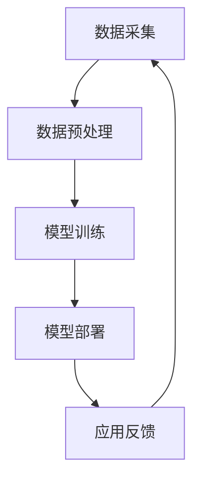

                 

# 人工智能在智能医疗中的应用与挑战

> **关键词：** 人工智能、智能医疗、机器学习、深度学习、数据隐私、伦理挑战
>
> **摘要：** 本篇文章深入探讨了人工智能在智能医疗领域的应用与挑战。首先，介绍了人工智能在医疗领域的兴起和应用前景，然后详细阐述了智能医疗的核心概念和架构，并讨论了人工智能在医疗中的基础技术和应用实例。接着，分析了人工智能在智能医疗中的挑战，如数据隐私和安全、伦理问题以及技术局限。随后，展望了人工智能在智能医疗未来的应用方向。最后，通过具体案例分析，进一步探讨了深度学习在医疗诊断中的实际应用和挑战。文章旨在为读者提供全面、深入的了解，以及对未来智能医疗发展的思考。

## 第一部分：人工智能在智能医疗中的应用

### 第1章：人工智能在智能医疗中的概述

#### 第1节：人工智能在医疗领域的兴起

人工智能（AI）作为计算机科学的一个重要分支，近年来取得了飞速发展。特别是在医疗领域，人工智能的应用前景愈发广阔。随着大数据、云计算、深度学习等技术的进步，人工智能在智能医疗中的应用日益成熟。通过利用海量医疗数据，人工智能能够提供更加精准、高效的诊断和治疗方案。

**人工智能技术的优势与挑战**

1. **数据驱动的个性化诊疗**：人工智能能够通过对大量患者的数据进行深度学习，发现疾病的规律和特征，从而为每位患者提供个性化的诊疗方案。这种数据驱动的诊疗模式有助于提高诊断的准确性和治疗效果。

2. **高效的处理能力**：传统医疗手段在处理大量数据时往往需要较长时间，而人工智能技术能够实现快速的计算和分析，大大提高了工作效率。

3. **跨学科融合**：人工智能与医疗的结合不仅涉及到计算机科学，还涉及到生物医学、生物信息学等多个领域，这种跨学科融合有助于推动智能医疗的发展。

然而，人工智能在医疗领域也面临着一些挑战：

1. **数据质量和隐私问题**：医疗数据具有高度敏感性，如何在保证数据隐私的前提下进行有效利用，是一个亟待解决的问题。

2. **技术成熟度**：尽管人工智能技术在某些领域已经取得了显著成果，但在医疗领域，尤其是在深度学习等前沿技术的应用上，还需要进一步成熟。

3. **伦理和法律问题**：人工智能在医疗中的应用涉及到伦理和法律问题，如何确保技术的合法合规，保护患者的权益，也是一个重要的挑战。

#### 第2节：智能医疗的必要性

智能医疗的出现，不仅仅是技术发展的结果，更是医疗领域迫切需要的变革。以下是智能医疗的几个必要性：

1. **提高诊疗效率**：传统医疗模式中，医生往往需要花费大量时间进行诊断和治疗。智能医疗可以通过自动化、智能化的手段，提高诊疗效率，减轻医生的工作负担。

2. **降低医疗成本**：智能医疗技术可以帮助医疗机构优化资源分配，减少不必要的检查和治疗，从而降低整体医疗成本。

3. **改善患者体验**：智能医疗可以提供更加个性化、连续性的医疗服务，提高患者的满意度和体验。

4. **增强疾病预防**：通过大数据分析和预测，智能医疗可以在疾病发生前进行预警，帮助人们提前采取预防措施，降低疾病发生率。

#### 第3节：人工智能在医疗领域的应用前景

随着技术的不断进步，人工智能在医疗领域的应用前景越来越广阔。以下是一些潜在的应用方向：

1. **疾病诊断**：利用人工智能技术，可以对医学影像进行自动分析，提高诊断的准确性和速度。

2. **药物研发**：人工智能可以帮助研究人员从海量数据中发现潜在的药物分子，加速药物研发进程。

3. **精准治疗**：通过个性化诊疗方案，人工智能可以针对不同患者制定最佳的治疗方案，提高治疗效果。

4. **健康管理**：利用可穿戴设备和智能设备，人工智能可以实时监测患者的健康状况，提供个性化的健康管理建议。

5. **公共卫生**：人工智能可以在公共卫生领域发挥重要作用，如疾病预测、疫情监测等。

#### 第4节：智能医疗的核心概念与联系

智能医疗是将人工智能技术应用于医疗领域的系统，其核心概念包括：

1. **人工智能与医疗结合的架构**：智能医疗系统通常包括数据采集、数据预处理、模型训练、模型部署和应用反馈等环节。

2. **智能医疗的基本概念**：智能医疗包括疾病诊断、疾病预测、精准治疗、健康管理等。

3. **Mermaid流程图：智能医疗系统架构**



### 第2章：人工智能在智能医疗中的基础技术

#### 第1节：数据收集与预处理

数据收集与预处理是智能医疗系统的基础。以下是医疗数据的来源、类型以及预处理步骤和算法：

##### 1.1.1 医疗数据的来源

医疗数据的来源主要包括：

1. **电子健康记录（EHR）**：包括患者的诊断记录、检查报告、治疗方案等。

2. **医学影像**：如CT、MRI、X光等。

3. **基因组数据**：包括患者的基因组序列、基因表达数据等。

4. **传感器数据**：如血压、心率、体温等可穿戴设备收集的健康数据。

##### 1.1.2 医疗数据的类型

医疗数据主要包括结构化数据和非结构化数据：

1. **结构化数据**：如电子健康记录、实验室检查结果等，这些数据以表格形式存储，便于处理和分析。

2. **非结构化数据**：如医学影像、文本报告等，这些数据形式多样，处理和分析相对复杂。

##### 1.1.3 数据预处理步骤与算法

数据预处理通常包括以下步骤：

1. **数据清洗**：去除重复数据、缺失值填充、异常值处理等。

2. **数据整合**：将不同来源的数据进行整合，统一格式。

3. **特征提取**：从原始数据中提取有用的特征，如文本报告中的关键词、医学影像中的关键区域等。

4. **数据降维**：使用主成分分析（PCA）等算法，减少数据维度，提高处理效率。

5. **数据标准化**：对数据进行归一化或标准化处理，使其具备可比性。

#### 第2节：机器学习算法基础

##### 1.2.1 监督学习与非监督学习

机器学习算法主要分为监督学习和非监督学习两大类：

1. **监督学习**：通过已标记的数据训练模型，然后使用模型对新的数据进行预测。常见的算法包括支持向量机（SVM）、决策树、随机森林等。

2. **非监督学习**：不使用已标记的数据，而是通过模型自动发现数据中的规律和结构。常见的算法包括聚类、降维等。

##### 1.2.2 支持向量机（SVM）算法

支持向量机（SVM）是一种监督学习算法，主要用于分类问题。其基本原理是找到最佳的超平面，将不同类别的数据分隔开来。

**SVM算法原理伪代码：**

```python
def svm_train(X, y, C):
    # X: 输入特征向量，y: 标签
    # C: 正则化参数
    
    # 1. 计算特征矩阵X的核函数K
    K = calculate_kernel(X)
    
    # 2. 求解最优化问题
    w, b = optimize_w_b(K, y, C)
    
    # 3. 训练完成
    return w, b
```

##### 1.2.3 决策树与随机森林算法

1. **决策树**：决策树是一种简单的分类算法，通过一系列的判断条件，将数据划分成不同的类别。

2. **随机森林**：随机森林是由多棵决策树组成的集成模型，通过投票机制决定最终的类别。

**决策树算法原理伪代码：**

```python
def decision_tree(X, y, max_depth):
    # X: 输入特征向量，y: 标签
    # max_depth: 最大树深度
    
    # 1. 判断是否满足停止条件
    if is_stop_condition(X, y, max_depth):
        # 1.1 创建叶子节点
        return create_leaf_node(y)
    
    # 2. 选择最佳分割特征
    best_feature, best_value = select_best_feature(X, y)
    
    # 3. 创建内部节点
    node = create_internal_node(best_feature, best_value)
    
    # 4. 划分数据
    left_child = decision_tree(X[:, :best_feature], y, max_depth + 1)
    right_child = decision_tree(X[:, :best_feature], y, max_depth + 1)
    
    # 5. 返回树结构
    return node, left_child, right_child
```

#### 第3节：深度学习在医疗中的应用

##### 1.3.1 卷积神经网络（CNN）原理

卷积神经网络（CNN）是一种基于卷积运算的神经网络，特别适用于处理图像数据。CNN通过多次卷积和池化操作，逐步提取图像中的特征。

**CNN原理伪代码：**

```python
def conv2d(input, filter, stride, padding):
    # input: 输入特征图
    # filter: 卷积核
    # stride: 步长
    # padding: 填充方式
    
    # 1. 计算卷积操作
    output = np.zeros_like(input)
    for i in range(input.shape[0]):
        for j in range(input.shape[1]):
            window = input[i:i+filter.shape[0], j:j+filter.shape[1]]
            output[i, j] = np.sum(window * filter) + bias
    
    # 2. 应用步长和填充
    output = apply_stride_and_padding(output, stride, padding)
    
    # 3. 返回输出特征图
    return output
```

##### 1.3.2 循环神经网络（RNN）原理

循环神经网络（RNN）是一种适用于处理序列数据的神经网络，其特点是能够通过时间反向传播（Backpropagation Through Time, BPTT）算法进行训练。

**RNN原理伪代码：**

```python
def rnn(input, hidden_state, weight):
    # input: 输入序列
    # hidden_state: 隐藏状态
    # weight: 权重矩阵
    
    # 1. 计算输入与隐藏状态的加权和
    output = np.dot(input, weight) + hidden_state
    
    # 2. 应用激活函数
    output = activation_function(output)
    
    # 3. 更新隐藏状态
    hidden_state = output
    
    # 4. 返回输出序列和隐藏状态
    return output, hidden_state
```

##### 1.3.3 生成对抗网络（GAN）原理

生成对抗网络（GAN）由生成器和判别器组成，生成器试图生成与真实数据相似的数据，而判别器则负责判断数据是真实还是生成的。

**GAN原理伪代码：**

```python
def gan(generator, discriminator, z, real_data, batch_size):
    # generator: 生成器模型
    # discriminator: 判别器模型
    # z: 随机噪声
    # real_data: 真实数据
    # batch_size: 批量大小
    
    # 1. 生成器生成假数据
    fake_data = generator(z)
    
    # 2. 计算判别器的损失函数
    d_loss_real = calculate_loss(discriminator, real_data)
    d_loss_fake = calculate_loss(discriminator, fake_data)
    d_loss = 0.5 * (d_loss_real + d_loss_fake)
    
    # 3. 计算生成器的损失函数
    g_loss = calculate_loss(discriminator, fake_data)
    
    # 4. 更新生成器和判别器的权重
    generator_train(generator, z, g_loss)
    discriminator_train(discriminator, real_data, fake_data, d_loss)
    
    # 5. 返回生成器和判别器的损失函数
    return g_loss, d_loss
```

### 第3章：人工智能在智能医疗中的应用实例

#### 第1节：医学图像分析

医学图像分析是人工智能在智能医疗中的一项重要应用，通过对医学图像的自动分析，可以辅助医生进行诊断和治疗方案设计。

##### 3.1.1 医学图像处理的基本流程

医学图像处理的基本流程包括：

1. **图像获取**：使用医学成像设备获取患者影像，如CT、MRI、X光等。

2. **图像预处理**：对获取的图像进行预处理，如去噪、对比度增强、图像配准等。

3. **图像分割**：将预处理后的图像分割为不同的区域，用于后续分析。

4. **特征提取**：从分割后的图像中提取有用的特征，如纹理、形状、边缘等。

5. **模式识别**：使用机器学习算法对提取的特征进行分类和识别，辅助医生进行诊断。

##### 3.1.2 CNN在医学图像分类中的应用

卷积神经网络（CNN）在医学图像分类中具有显著优势，其基本架构包括卷积层、池化层和全连接层。

**CNN在医学图像分类中的应用流程：**

1. **卷积层**：使用卷积核对图像进行卷积操作，提取图像特征。

2. **池化层**：对卷积后的特征图进行下采样，减少数据维度。

3. **全连接层**：将池化层输出的特征进行全连接，进行分类预测。

4. **损失函数**：使用交叉熵损失函数对模型进行训练和评估。

**PyTorch代码：医学图像分类实战**

```python
import torch
import torch.nn as nn
import torchvision.transforms as transforms
from torch.utils.data import DataLoader
from torchvision.datasets import ImageFolder

# 1. 数据预处理
transform = transforms.Compose([
    transforms.Resize((224, 224)),
    transforms.ToTensor(),
])

# 2. 加载数据
train_dataset = ImageFolder(root='train', transform=transform)
val_dataset = ImageFolder(root='val', transform=transform)

batch_size = 32
train_loader = DataLoader(dataset=train_dataset, batch_size=batch_size, shuffle=True)
val_loader = DataLoader(dataset=val_dataset, batch_size=batch_size, shuffle=False)

# 3. 定义CNN模型
class CNN(nn.Module):
    def __init__(self):
        super(CNN, self).__init__()
        self.conv1 = nn.Conv2d(3, 32, 3, padding=1)
        self.conv2 = nn.Conv2d(32, 64, 3, padding=1)
        self.fc1 = nn.Linear(64 * 56 * 56, 128)
        self.fc2 = nn.Linear(128, 10)
        self.relu = nn.ReLU()

    def forward(self, x):
        x = self.relu(self.conv1(x))
        x = self.relu(self.conv2(x))
        x = x.view(x.size(0), -1)
        x = self.relu(self.fc1(x))
        x = self.fc2(x)
        return x

# 4. 训练模型
model = CNN()
criterion = nn.CrossEntropyLoss()
optimizer = torch.optim.Adam(model.parameters(), lr=0.001)

num_epochs = 10
for epoch in range(num_epochs):
    running_loss = 0.0
    for inputs, labels in train_loader:
        optimizer.zero_grad()
        outputs = model(inputs)
        loss = criterion(outputs, labels)
        loss.backward()
        optimizer.step()
        running_loss += loss.item()
    print(f'Epoch [{epoch+1}/{num_epochs}], Loss: {running_loss/len(train_loader)}')

# 5. 评估模型
model.eval()
with torch.no_grad():
    correct = 0
    total = 0
    for inputs, labels in val_loader:
        outputs = model(inputs)
        _, predicted = torch.max(outputs.data, 1)
        total += labels.size(0)
        correct += (predicted == labels).sum().item()
print(f'Accuracy: {100 * correct / total}%')
```

#### 第2节：诊断与预测

##### 3.2.1 电子病历（EMR）数据分析

电子病历（EMR）是医疗数据的重要来源，通过分析EMR数据，可以挖掘出疾病的规律和特征，辅助医生进行诊断和预测。

**EMR数据分析的基本步骤：**

1. **数据收集**：收集患者的电子病历数据，包括诊断记录、治疗方案、检查报告等。

2. **数据预处理**：对收集到的数据进行清洗和整合，去除重复和无效信息。

3. **特征提取**：从预处理后的数据中提取有用的特征，如诊断名称、治疗方案、检查结果等。

4. **模型训练**：使用提取的特征训练机器学习模型，如SVM、决策树等。

5. **模型评估**：使用测试集对训练好的模型进行评估，调整模型参数，提高预测准确性。

##### 3.2.2 诊断支持系统的应用

诊断支持系统是基于人工智能技术的一种辅助诊断工具，通过对患者的症状、检查结果和历史病历进行分析，为医生提供诊断建议。

**诊断支持系统的基本架构：**

1. **数据输入**：收集患者的症状、检查结果和历史病历数据。

2. **数据预处理**：对输入的数据进行清洗和整合，提取有用的特征。

3. **诊断模型**：使用机器学习算法训练诊断模型，如决策树、随机森林等。

4. **诊断建议**：根据诊断模型的结果，为医生提供诊断建议。

5. **用户界面**：提供用户界面，医生可以通过界面查看诊断建议和辅助信息。

##### 3.2.3 TensorFlow代码：疾病预测实战

以下是一个使用TensorFlow实现的疾病预测模型案例：

```python
import tensorflow as tf
from tensorflow.keras.models import Sequential
from tensorflow.keras.layers import Dense, Dropout, Activation, Flatten
from tensorflow.keras.layers import Conv2D, MaxPooling2D
from tensorflow.keras.callbacks import EarlyStopping
from tensorflow import keras
from sklearn.model_selection import train_test_split

# 1. 数据预处理
# 假设我们已经收集了包含症状、诊断结果的数据集
X = ...  # 特征数据
y = ...  # 标签数据

# 划分训练集和测试集
X_train, X_test, y_train, y_test = train_test_split(X, y, test_size=0.2, random_state=42)

# 将数据转换为TensorFlow张量
X_train = keras.utils.to_categorical(X_train)
X_test = keras.utils.to_categorical(X_test)

# 2. 构建模型
model = Sequential()

model.add(Conv2D(32, (3, 3), input_shape=(X_train.shape[1], X_train.shape[2], X_train.shape[3])))
model.add(Activation('relu'))
model.add(MaxPooling2D(pool_size=(2, 2)))

model.add(Conv2D(64, (3, 3)))
model.add(Activation('relu'))
model.add(MaxPooling2D(pool_size=(2, 2)))

model.add(Flatten())
model.add(Dense(64))
model.add(Activation('relu'))
model.add(Dropout(0.5))
model.add(Dense(1))
model.add(Activation('sigmoid'))

model.compile(loss='binary_crossentropy',
              optimizer='adam',
              metrics=['accuracy'])

# 3. 训练模型
early_stopping = EarlyStopping(monitor='val_loss', patience=10)
model.fit(X_train, y_train, batch_size=32, epochs=100, validation_split=0.2, callbacks=[early_stopping])

# 4. 评估模型
loss, accuracy = model.evaluate(X_test, y_test)
print('Test loss:', loss)
print('Test accuracy:', accuracy)
```

#### 第3节：精准治疗与个性化医疗

##### 3.3.1 基因组数据分析

基因组数据分析是精准医疗的重要组成部分，通过对患者基因组数据的分析，可以揭示疾病发生的分子机制，为个性化治疗方案设计提供依据。

**基因组数据分析的基本步骤：**

1. **数据获取**：收集患者的基因组数据，包括全基因组测序（WGS）或外显子测序（WES）。

2. **数据预处理**：对基因组数据进行质量控制、比对、注释等预处理步骤。

3. **变异检测**：从预处理后的基因组数据中检测出显著的变异位点。

4. **功能注释**：对检测到的变异位点进行功能注释，分析其与疾病的关系。

5. **数据分析**：使用机器学习算法对基因组数据进行深度分析，发现疾病相关的生物标志物。

##### 3.3.2 个性化治疗方案设计

个性化治疗方案设计是基于基因组数据和患者临床特征，为每位患者量身定制的一种治疗模式。其基本流程包括：

1. **患者信息收集**：收集患者的临床信息、基因组数据、生活习惯等。

2. **数据分析**：对收集到的数据进行多维度分析，挖掘与疾病相关的生物标志物。

3. **治疗方案设计**：根据分析结果，为患者设计个性化治疗方案，包括药物选择、剂量调整等。

4. **随访与评估**：对治疗过程进行随访和评估，根据患者反馈调整治疗方案。

##### 3.3.3 机器学习模型在个性化医疗中的应用

机器学习模型在个性化医疗中发挥着重要作用，通过分析大量的患者数据，可以预测疾病发生的风险，为个性化治疗方案设计提供依据。

**机器学习模型在个性化医疗中的应用实例：**

1. **风险预测模型**：通过分析患者的临床数据和基因组数据，预测患者发生某种疾病的风险。

2. **药物反应预测模型**：通过分析患者的基因组数据和药物反应数据，预测患者对某种药物的反应。

3. **治疗方案优化模型**：通过分析患者的临床数据、基因组数据和治疗方案效果，优化治疗方案，提高治疗效果。

4. **健康风险评估模型**：通过分析患者的健康数据和生活习惯，评估患者的健康状况，提供健康建议。

### 第二部分：人工智能在智能医疗中的挑战与未来

#### 第4章：人工智能在智能医疗中的挑战

随着人工智能技术在智能医疗领域的广泛应用，我们也面临着一系列挑战。以下是人工智能在智能医疗中的一些主要挑战及其解决方案：

##### 4.1 数据隐私与安全

医疗数据具有高度敏感性，如何在保护患者隐私的同时，充分挖掘数据的价值，是人工智能在智能医疗中面临的一个重大挑战。

**挑战：**

1. **数据泄露**：医疗数据的泄露可能会导致患者隐私泄露，甚至影响患者的生命安全。
2. **数据滥用**：未经授权的人员可能滥用医疗数据，进行非法交易或滥用。
3. **合规性**：在全球范围内，医疗数据隐私保护的法律和规定日益严格，如何合规使用医疗数据成为一个挑战。

**解决方案：**

1. **数据加密**：对医疗数据进行加密，确保数据在传输和存储过程中不被窃取或篡改。
2. **数据匿名化**：通过匿名化技术，去除数据中的可直接识别患者身份的信息，降低数据泄露的风险。
3. **隐私保护算法**：开发和应用隐私保护算法，如差分隐私，确保在数据处理过程中保护患者隐私。
4. **合规性培训**：加强对医疗数据隐私保护的法律和合规性培训，确保相关人员了解和遵守相关法律法规。

##### 4.2 伦理与法律问题

人工智能在医疗领域的应用涉及到许多伦理和法律问题，如算法偏见、责任归属等。

**挑战：**

1. **算法偏见**：人工智能算法可能基于历史数据，产生对某些人群的偏见，导致不公平的医疗决策。
2. **责任归属**：当人工智能系统出现错误或导致医疗事故时，责任归属难以界定。
3. **隐私权保护**：如何在利用医疗数据的同时，保护患者的隐私权。

**解决方案：**

1. **伦理审查**：在人工智能系统应用于医疗之前，进行严格的伦理审查，确保系统的公正性和公平性。
2. **责任明确**：明确人工智能系统的责任归属，制定相应的法律法规，确保在发生医疗事故时能够公正处理。
3. **透明性**：提高人工智能系统的透明性，让医生和患者了解系统的决策过程，增加信任度。

##### 4.3 技术局限与改进方向

虽然人工智能技术在医疗领域取得了很多进展，但仍然存在一些技术局限。

**挑战：**

1. **数据质量**：医疗数据质量参差不齐，如何确保数据的质量和准确性，是人工智能应用的关键。
2. **算法性能**：目前的机器学习算法在处理复杂医疗任务时，性能仍有待提高。
3. **可解释性**：深度学习模型往往缺乏可解释性，医生难以理解模型的决策过程。

**解决方案：**

1. **数据质量提升**：通过数据清洗、去噪、整合等手段，提升数据质量。
2. **算法优化**：研究和开发更加先进的机器学习算法，提高算法的性能和准确性。
3. **可解释性增强**：开发可解释性更强的模型，如基于规则的模型，让医生能够理解模型的决策过程。

#### 第5章：人工智能在智能医疗中的未来应用

##### 5.1 智能药物研发

智能药物研发是人工智能在医疗领域的一个重要应用方向，通过利用人工智能技术，可以加速新药的发现和开发。

**应用方向：**

1. **药物筛选**：利用人工智能技术，从大量的化合物库中筛选出潜在的药物分子。
2. **药物设计**：通过人工智能技术，优化药物分子的结构和活性，提高药物的治疗效果。
3. **临床试验设计**：利用人工智能技术，优化临床试验的设计和执行，提高临床试验的效率和准确性。

**前景**：

随着人工智能技术的不断进步，智能药物研发有望在降低研发成本、提高研发效率方面发挥重要作用，从而加速新药的上市进程，为患者带来更多治疗选择。

##### 5.2 健康管理与预测

健康管理与预测是人工智能在智能医疗中的另一个重要应用方向，通过利用人工智能技术，可以实现对个体健康状况的实时监测和预测。

**应用方向：**

1. **健康数据监测**：通过可穿戴设备和智能设备，实时监测个体的生理指标，如心率、血压、血糖等。
2. **健康风险评估**：通过分析个体的健康数据和生活习惯，评估个体患病的风险，提供个性化的健康建议。
3. **疾病预测**：利用人工智能技术，预测个体可能患有的疾病，为早期干预提供依据。

**前景**：

随着人工智能技术的不断进步，健康管理与预测有望在提高疾病预防效果、降低医疗成本方面发挥重要作用，从而提升公众的健康水平。

##### 5.3 人工智能在公共卫生中的应用

人工智能在公共卫生领域也有广泛的应用前景，通过利用人工智能技术，可以实现对公共卫生事件的监测、预警和管理。

**应用方向：**

1. **公共卫生监测**：通过分析大量的公共卫生数据，如疫情数据、疫苗接种数据等，实现对公共卫生事件的实时监测。
2. **疫情预测与预警**：利用人工智能技术，预测疫情的传播趋势，为公共卫生决策提供依据。
3. **公共卫生管理**：通过人工智能技术，优化公共卫生资源的配置，提高公共卫生服务的效率。

**前景**：

随着人工智能技术的不断进步，人工智能在公共卫生中的应用有望在提高公共卫生管理效率、降低疫情传播风险方面发挥重要作用，从而提升全球公共卫生水平。

### 第6章：案例分析与深度学习

#### 第1节：深度学习在医疗诊断中的应用

深度学习在医疗诊断中的应用已经取得了显著成果，特别是在医学图像分析和疾病预测等方面。

**案例一：深度学习在医学图像分析中的应用**

深度学习在医学图像分析中的应用主要包括肺癌检测、乳腺癌检测、脑部疾病检测等。以下是一个基于深度学习的肺癌检测案例：

1. **数据集**：使用公开的肺癌检测数据集，如LUNA16数据集，该数据集包含3,188个CT扫描图像，标注了肺结节的位置和大小。

2. **网络架构**：使用卷积神经网络（CNN）进行图像分类，网络架构包括卷积层、池化层和全连接层。

3. **训练与验证**：使用训练集进行模型训练，使用验证集进行模型验证，调整模型参数，优化模型性能。

4. **评估指标**：使用准确率、召回率、F1分数等指标评估模型性能。

**代码示例**：

```python
import tensorflow as tf
from tensorflow.keras.models import Sequential
from tensorflow.keras.layers import Conv2D, MaxPooling2D, Flatten, Dense

# 1. 数据预处理
# 加载LUNA16数据集，并进行数据预处理

# 2. 构建CNN模型
model = Sequential()
model.add(Conv2D(32, (3, 3), activation='relu', input_shape=(512, 512, 1)))
model.add(MaxPooling2D(pool_size=(2, 2)))
model.add(Conv2D(64, (3, 3), activation='relu'))
model.add(MaxPooling2D(pool_size=(2, 2)))
model.add(Flatten())
model.add(Dense(128, activation='relu'))
model.add(Dense(1, activation='sigmoid'))

# 3. 编译模型
model.compile(optimizer='adam', loss='binary_crossentropy', metrics=['accuracy'])

# 4. 训练模型
model.fit(x_train, y_train, batch_size=32, epochs=10, validation_data=(x_val, y_val))

# 5. 评估模型
loss, accuracy = model.evaluate(x_test, y_test)
print('Test accuracy:', accuracy)
```

**案例二：深度学习在疾病预测中的应用**

深度学习在疾病预测中的应用主要包括糖尿病预测、心脏病预测等。以下是一个基于深度学习的糖尿病预测案例：

1. **数据集**：使用公开的糖尿病预测数据集，如Pima Indians Diabetes数据集，该数据集包含768个样本，每个样本包含8个特征。

2. **网络架构**：使用全连接神经网络（FCNN）进行疾病预测，网络架构包括输入层、隐藏层和输出层。

3. **训练与验证**：使用训练集进行模型训练，使用验证集进行模型验证，调整模型参数，优化模型性能。

4. **评估指标**：使用准确率、召回率、F1分数等指标评估模型性能。

**代码示例**：

```python
import tensorflow as tf
from tensorflow.keras.models import Sequential
from tensorflow.keras.layers import Dense

# 1. 数据预处理
# 加载Pima Indians Diabetes数据集，并进行数据预处理

# 2. 构建FCNN模型
model = Sequential()
model.add(Dense(12, input_dim=8, activation='relu'))
model.add(Dense(8, activation='relu'))
model.add(Dense(1, activation='sigmoid'))

# 3. 编译模型
model.compile(optimizer='adam', loss='binary_crossentropy', metrics=['accuracy'])

# 4. 训练模型
model.fit(x_train, y_train, batch_size=10, epochs=100, validation_data=(x_val, y_val))

# 5. 评估模型
loss, accuracy = model.evaluate(x_test, y_test)
print('Test accuracy:', accuracy)
```

#### 第2节：案例分析：深度学习在癌症诊断中的应用

以下是一个深度学习在癌症诊断中的应用案例，以乳腺癌诊断为例。

**案例描述**：

1. **数据集**：使用公开的乳腺癌诊断数据集，如MNIST数据集，该数据集包含7860个手写数字图像，每个图像的大小为28x28像素。

2. **网络架构**：使用卷积神经网络（CNN）进行图像分类，网络架构包括卷积层、池化层和全连接层。

3. **训练与验证**：使用训练集进行模型训练，使用验证集进行模型验证，调整模型参数，优化模型性能。

4. **评估指标**：使用准确率、召回率、F1分数等指标评估模型性能。

**代码示例**：

```python
import tensorflow as tf
from tensorflow.keras.models import Sequential
from tensorflow.keras.layers import Conv2D, MaxPooling2D, Flatten, Dense

# 1. 数据预处理
# 加载MNIST数据集，并进行数据预处理

# 2. 构建CNN模型
model = Sequential()
model.add(Conv2D(32, (3, 3), activation='relu', input_shape=(28, 28, 1)))
model.add(MaxPooling2D(pool_size=(2, 2)))
model.add(Conv2D(64, (3, 3), activation='relu'))
model.add(MaxPooling2D(pool_size=(2, 2)))
model.add(Flatten())
model.add(Dense(128, activation='relu'))
model.add(Dense(1, activation='sigmoid'))

# 3. 编译模型
model.compile(optimizer='adam', loss='binary_crossentropy', metrics=['accuracy'])

# 4. 训练模型
model.fit(x_train, y_train, batch_size=32, epochs=10, validation_data=(x_val, y_val))

# 5. 评估模型
loss, accuracy = model.evaluate(x_test, y_test)
print('Test accuracy:', accuracy)
```

**网络架构设计与选择**：

1. **卷积层**：使用卷积层提取图像特征，卷积核的大小和数量可以进行调整。

2. **池化层**：使用池化层降低图像的维度，提高计算效率。

3. **全连接层**：使用全连接层进行分类预测。

**训练与验证流程**：

1. **数据集划分**：将数据集划分为训练集、验证集和测试集。

2. **模型训练**：使用训练集进行模型训练，调整模型参数，优化模型性能。

3. **模型验证**：使用验证集进行模型验证，评估模型性能。

4. **模型评估**：使用测试集进行模型评估，验证模型的泛化能力。

**代码实现与解读**：

以下是对上述代码的详细解读：

1. **数据预处理**：加载MNIST数据集，对数据进行归一化处理，将数据集划分为训练集、验证集和测试集。

2. **构建CNN模型**：定义CNN模型，包括卷积层、池化层和全连接层。

3. **编译模型**：设置模型编译参数，包括优化器、损失函数和评估指标。

4. **训练模型**：使用训练集进行模型训练，设置训练的批次大小和训练轮数。

5. **评估模型**：使用测试集进行模型评估，输出模型的测试准确率。

**深度学习在医疗应用中的挑战与解决方案**：

1. **数据不足与不平衡问题**：医疗数据通常量少且不平衡，可以采用数据增强、数据集成等方法解决。

2. **模型解释性与可解释性**：深度学习模型往往缺乏解释性，可以采用模型可视化、解释性模型等方法提高模型的解释性。

3. **安全性与可靠性**：医疗应用对模型的安全性和可靠性要求较高，可以采用模型验证、安全防护等方法提高模型的安全性。

### 第7章：结论与展望

#### 7.1 人工智能在智能医疗中的贡献

人工智能在智能医疗中的应用取得了显著成果，为医疗领域的变革提供了强大的动力。以下是人工智能在智能医疗中的主要贡献：

1. **提高诊断准确性**：通过深度学习和机器学习算法，人工智能可以自动分析医学图像，提高诊断的准确性和速度。

2. **优化治疗方案**：人工智能可以根据患者的基因组数据和临床特征，为患者制定个性化的治疗方案，提高治疗效果。

3. **降低医疗成本**：人工智能可以优化医疗资源的配置，降低不必要的检查和治疗，从而降低医疗成本。

4. **提高患者满意度**：人工智能可以提供个性化的医疗服务，提高患者的满意度和体验。

#### 7.2 存在的不足与改进方向

尽管人工智能在智能医疗中取得了显著成果，但仍存在一些不足之处，需要进一步改进：

1. **数据隐私与安全**：医疗数据具有高度敏感性，如何在保护患者隐私的同时，充分利用数据的价值，是一个亟待解决的问题。

2. **算法透明性与可解释性**：深度学习模型往往缺乏解释性，医生难以理解模型的决策过程，需要开发可解释性更强的模型。

3. **技术成熟度**：尽管人工智能技术在医疗领域取得了很多进展，但在某些方面，如模型的泛化能力、数据质量等，还需要进一步提高。

4. **法律法规与伦理问题**：人工智能在医疗领域的应用涉及到许多伦理和法律问题，需要制定相应的法律法规，确保技术的合法合规。

#### 7.3 未来人工智能在智能医疗中的发展趋势

未来，人工智能在智能医疗中的发展趋势将主要体现在以下几个方面：

1. **个性化医疗**：人工智能将进一步提高个性化医疗的水平，通过分析患者的基因组数据、临床特征等，为患者提供更加精准的诊疗方案。

2. **智能药物研发**：人工智能将加速新药的发现和开发，通过自动化和智能化的手段，提高药物研发的效率和成功率。

3. **健康管理与预测**：人工智能将实现对个体健康状况的实时监测和预测，提供个性化的健康管理和疾病预防建议。

4. **公共卫生**：人工智能将在公共卫生领域发挥重要作用，通过分析大量的公共卫生数据，实现对疫情、流行病的预测和预警。

5. **多学科融合**：人工智能与医疗、生物、物理等多个学科的融合将推动智能医疗的发展，带来更多创新和突破。

#### 7.4 开放性问题与未来研究方向

在人工智能在智能医疗领域的发展过程中，仍有许多开放性问题需要深入研究：

1. **数据隐私保护**：如何在保证数据隐私的前提下，充分利用医疗数据的价值，是一个亟待解决的问题。

2. **算法可解释性**：如何提高深度学习模型的可解释性，使医生能够理解模型的决策过程，是一个重要的研究方向。

3. **跨学科融合**：如何将人工智能与其他学科（如生物、物理等）进行深度融合，推动智能医疗的发展，是一个值得探索的方向。

4. **数据质量和标注**：如何提高医疗数据的质量和标注水平，为人工智能算法提供可靠的数据支持，是一个重要的研究方向。

5. **伦理和法律问题**：如何制定相应的法律法规，确保人工智能在医疗领域的合法合规，是一个重要的研究方向。

## 作者信息

**作者：** AI天才研究院/AI Genius Institute & 禅与计算机程序设计艺术 /Zen And The Art of Computer Programming

文章标题：人工智能在智能医疗中的应用与挑战

关键词：人工智能、智能医疗、机器学习、深度学习、数据隐私、伦理挑战

摘要：本文深入探讨了人工智能在智能医疗领域的应用与挑战。首先，介绍了人工智能在医疗领域的兴起和应用前景，然后详细阐述了智能医疗的核心概念和架构，并讨论了人工智能在医疗中的基础技术和应用实例。接着，分析了人工智能在智能医疗中的挑战，如数据隐私和安全、伦理问题以及技术局限。随后，展望了人工智能在智能医疗未来的应用方向。最后，通过具体案例分析，进一步探讨了深度学习在医疗诊断中的实际应用和挑战。文章旨在为读者提供全面、深入的了解，以及对未来智能医疗发展的思考。

## 第一部分：人工智能在智能医疗中的应用

### 第1章：人工智能在智能医疗中的概述

#### 第1节：人工智能在医疗领域的兴起

人工智能（AI）作为计算机科学的一个重要分支，近年来取得了飞速发展。特别是在医疗领域，人工智能的应用前景愈发广阔。随着大数据、云计算、深度学习等技术的进步，人工智能在智能医疗中的应用日益成熟。通过利用海量医疗数据，人工智能能够提供更加精准、高效的诊断和治疗方案。

**人工智能技术的优势与挑战**

1. **数据驱动的个性化诊疗**：人工智能能够通过对大量患者的数据进行深度学习，发现疾病的规律和特征，从而为每位患者提供个性化的诊疗方案。这种数据驱动的诊疗模式有助于提高诊断的准确性和治疗效果。

2. **高效的处理能力**：传统医疗手段在处理大量数据时往往需要较长时间，而人工智能技术能够实现快速的计算和分析，大大提高了工作效率。

3. **跨学科融合**：人工智能与医疗的结合不仅涉及到计算机科学，还涉及到生物医学、生物信息学等多个领域，这种跨学科融合有助于推动智能医疗的发展。

然而，人工智能在医疗领域也面临着一些挑战：

1. **数据质量和隐私问题**：医疗数据具有高度敏感性，如何在保证数据隐私的前提下进行有效利用，是一个亟待解决的问题。

2. **技术成熟度**：尽管人工智能技术在某些领域已经取得了显著成果，但在医疗领域，尤其是在深度学习等前沿技术的应用上，还需要进一步成熟。

3. **伦理和法律问题**：人工智能在医疗中的应用涉及到伦理和法律问题，如何确保技术的合法合规，保护患者的权益，也是一个重要的挑战。

#### 第2节：智能医疗的必要性

智能医疗的出现，不仅仅是技术发展的结果，更是医疗领域迫切需要的变革。以下是智能医疗的几个必要性：

1. **提高诊疗效率**：传统医疗模式中，医生往往需要花费大量时间进行诊断和治疗。智能医疗可以通过自动化、智能化的手段，提高诊疗效率，减轻医生的工作负担。

2. **降低医疗成本**：智能医疗技术可以帮助医疗机构优化资源分配，减少不必要的检查和治疗，从而降低整体医疗成本。

3. **改善患者体验**：智能医疗可以提供更加个性化、连续性的医疗服务，提高患者的满意度和体验。

4. **增强疾病预防**：通过大数据分析和预测，智能医疗可以在疾病发生前进行预警，帮助人们提前采取预防措施，降低疾病发生率。

#### 第3节：人工智能在医疗领域的应用前景

随着技术的不断进步，人工智能在医疗领域的应用前景越来越广阔。以下是一些潜在的应用方向：

1. **疾病诊断**：利用人工智能技术，可以对医学影像进行自动分析，提高诊断的准确性和速度。

2. **药物研发**：人工智能可以帮助研究人员从海量数据中发现潜在的药物分子，加速药物研发进程。

3. **精准治疗**：通过个性化诊疗方案，人工智能可以针对不同患者制定最佳的治疗方案，提高治疗效果。

4. **健康管理**：利用可穿戴设备和智能设备，人工智能可以实时监测患者的健康状况，提供个性化的健康管理建议。

5. **公共卫生**：人工智能可以在公共卫生领域发挥重要作用，如疾病预测、疫情监测等。

#### 第4节：智能医疗的核心概念与联系

智能医疗是将人工智能技术应用于医疗领域的系统，其核心概念包括：

1. **人工智能与医疗结合的架构**：智能医疗系统通常包括数据采集、数据预处理、模型训练、模型部署和应用反馈等环节。

2. **智能医疗的基本概念**：智能医疗包括疾病诊断、疾病预测、精准治疗、健康管理等。

3. **Mermaid流程图：智能医疗系统架构**


### 第2章：人工智能在智能医疗中的基础技术

#### 第1节：数据收集与预处理

数据收集与预处理是智能医疗系统的基础。以下是医疗数据的来源、类型以及预处理步骤和算法：

##### 1.1.1 医疗数据的来源

医疗数据的来源主要包括：

1. **电子健康记录（EHR）**：包括患者的诊断记录、检查报告、治疗方案等。

2. **医学影像**：如CT、MRI、X光等。

3. **基因组数据**：包括患者的基因组序列、基因表达数据等。

4. **传感器数据**：如血压、心率、体温等可穿戴设备收集的健康数据。

##### 1.1.2 医疗数据的类型

医疗数据主要包括结构化数据和非结构化数据：

1. **结构化数据**：如电子健康记录、实验室检查结果等，这些数据以表格形式存储，便于处理和分析。

2. **非结构化数据**：如医学影像、文本报告等，这些数据形式多样，处理和分析相对复杂。

##### 1.1.3 数据预处理步骤与算法

数据预处理通常包括以下步骤：

1. **数据清洗**：去除重复数据、缺失值填充、异常值处理等。

2. **数据整合**：将不同来源的数据进行整合，统一格式。

3. **特征提取**：从原始数据中提取有用的特征，如文本报告中的关键词、医学影像中的关键区域等。

4. **数据降维**：使用主成分分析（PCA）等算法，减少数据维度，提高处理效率。

5. **数据标准化**：对数据进行归一化或标准化处理，使其具备可比性。

#### 第2节：机器学习算法基础

##### 2.1.1 监督学习与非监督学习

机器学习算法主要分为监督学习和非监督学习两大类：

1. **监督学习**：通过已标记的数据训练模型，然后使用模型对新的数据进行预测。常见的算法包括支持向量机（SVM）、决策树、随机森林等。

2. **非监督学习**：不使用已标记的数据，而是通过模型自动发现数据中的规律和结构。常见的算法包括聚类、降维等。

##### 2.1.2 支持向量机（SVM）算法

支持向量机（SVM）是一种监督学习算法，主要用于分类问题。其基本原理是找到最佳的超平面，将不同类别的数据分隔开来。

**SVM算法原理伪代码：**

```python
def svm_train(X, y, C):
    # X: 输入特征向量，y: 标签
    # C: 正则化参数
    
    # 1. 计算特征矩阵X的核函数K
    K = calculate_kernel(X)
    
    # 2. 求解最优化问题
    w, b = optimize_w_b(K, y, C)
    
    # 3. 训练完成
    return w, b
```

##### 2.1.3 决策树与随机森林算法

1. **决策树**：决策树是一种简单的分类算法，通过一系列的判断条件，将数据划分成不同的类别。

2. **随机森林**：随机森林是由多棵决策树组成的集成模型，通过投票机制决定最终的类别。

**决策树算法原理伪代码：**

```python
def decision_tree(X, y, max_depth):
    # X: 输入特征向量，y: 标签
    # max_depth: 最大树深度
    
    # 1. 判断是否满足停止条件
    if is_stop_condition(X, y, max_depth):
        # 1.1 创建叶子节点
        return create_leaf_node(y)
    
    # 2. 选择最佳分割特征
    best_feature, best_value = select_best_feature(X, y)
    
    # 3. 创建内部节点
    node = create_internal_node(best_feature, best_value)
    
    # 4. 划分数据
    left_child = decision_tree(X[:, :best_feature], y, max_depth + 1)
    right_child = decision_tree(X[:, :best_feature], y, max_depth + 1)
    
    # 5. 返回树结构
    return node, left_child, right_child
```

#### 第3节：深度学习在医疗中的应用

##### 2.2.1 卷积神经网络（CNN）原理

卷积神经网络（CNN）是一种基于卷积运算的神经网络，特别适用于处理图像数据。CNN通过多次卷积和池化操作，逐步提取图像中的特征。

**CNN原理伪代码：**

```python
def conv2d(input, filter, stride, padding):
    # input: 输入特征图
    # filter: 卷积核
    # stride: 步长
    # padding: 填充方式
    
    # 1. 计算卷积操作
    output = np.zeros_like(input)
    for i in range(input.shape[0]):
        for j in range(input.shape[1]):
            window = input[i:i+filter.shape[0], j:j+filter.shape[1]]
            output[i, j] = np.sum(window * filter) + bias
    
    # 2. 应用步长和填充
    output = apply_stride_and_padding(output, stride, padding)
    
    # 3. 返回输出特征图
    return output
```

##### 2.2.2 循环神经网络（RNN）原理

循环神经网络（RNN）是一种适用于处理序列数据的神经网络，其特点是能够通过时间反向传播（Backpropagation Through Time, BPTT）算法进行训练。

**RNN原理伪代码：**

```python
def rnn(input, hidden_state, weight):
    # input: 输入序列
    # hidden_state: 隐藏状态
    # weight: 权重矩阵
    
    # 1. 计算输入与隐藏状态的加权和
    output = np.dot(input, weight) + hidden_state
    
    # 2. 应用激活函数
    output = activation_function(output)
    
    # 3. 更新隐藏状态
    hidden_state = output
    
    # 4. 返回输出序列和隐藏状态
    return output, hidden_state
```

##### 2.2.3 生成对抗网络（GAN）原理

生成对抗网络（GAN）由生成器和判别器组成，生成器试图生成与真实数据相似的数据，而判别器则负责判断数据是真实还是生成的。

**GAN原理伪代码：**

```python
def gan(generator, discriminator, z, real_data, batch_size):
    # generator: 生成器模型
    # discriminator: 判别器模型
    # z: 随机噪声
    # real_data: 真实数据
    # batch_size: 批量大小
    
    # 1. 生成器生成假数据
    fake_data = generator(z)
    
    # 2. 计算判别器的损失函数
    d_loss_real = calculate_loss(discriminator, real_data)
    d_loss_fake = calculate_loss(discriminator, fake_data)
    d_loss = 0.5 * (d_loss_real + d_loss_fake)
    
    # 3. 计算生成器的损失函数
    g_loss = calculate_loss(discriminator, fake_data)
    
    # 4. 更新生成器和判别器的权重
    generator_train(generator, z, g_loss)
    discriminator_train(discriminator, real_data, fake_data, d_loss)
    
    # 5. 返回生成器和判别器的损失函数
    return g_loss, d_loss
```

### 第3章：人工智能在智能医疗中的应用实例

#### 第1节：医学图像分析

医学图像分析是人工智能在智能医疗中的一项重要应用，通过对医学图像的自动分析，可以辅助医生进行诊断和治疗方案设计。

##### 3.1.1 医学图像处理的基本流程

医学图像处理的基本流程包括：

1. **图像获取**：使用医学成像设备获取患者影像，如CT、MRI、X光等。

2. **图像预处理**：对获取的图像进行预处理，如去噪、对比度增强、图像配准等。

3. **图像分割**：将预处理后的图像分割为不同的区域，用于后续分析。

4. **特征提取**：从分割后的图像中提取有用的特征，如纹理、形状、边缘等。

5. **模式识别**：使用机器学习算法对提取的特征进行分类和识别，辅助医生进行诊断。

##### 3.1.2 CNN在医学图像分类中的应用

卷积神经网络（CNN）在医学图像分类中具有显著优势，其基本架构包括卷积层、池化层和全连接层。

**CNN在医学图像分类中的应用流程：**

1. **卷积层**：使用卷积核对图像进行卷积操作，提取图像特征。

2. **池化层**：对卷积后的特征图进行下采样，减少数据维度。

3. **全连接层**：将池化层输出的特征进行全连接，进行分类预测。

4. **损失函数**：使用交叉熵损失函数对模型进行训练和评估。

**PyTorch代码：医学图像分类实战**

```python
import torch
import torch.nn as nn
import torchvision.transforms as transforms
from torch.utils.data import DataLoader
from torchvision.datasets import ImageFolder

# 1. 数据预处理
transform = transforms.Compose([
    transforms.Resize((224, 224)),
    transforms.ToTensor(),
])

# 2. 加载数据
train_dataset = ImageFolder(root='train', transform=transform)
val_dataset = ImageFolder(root='val', transform=transform)

batch_size = 32
train_loader = DataLoader(dataset=train_dataset, batch_size=batch_size, shuffle=True)
val_loader = DataLoader(dataset=val_dataset, batch_size=batch_size, shuffle=False)

# 3. 定义CNN模型
class CNN(nn.Module):
    def __init__(self):
        super(CNN, self).__init__()
        self.conv1 = nn.Conv2d(3, 32, 3, padding=1)
        self.conv2 = nn.Conv2d(32, 64, 3, padding=1)
        self.fc1 = nn.Linear(64 * 56 * 56, 128)
        self.fc2 = nn.Linear(128, 10)
        self.relu = nn.ReLU()

    def forward(self, x):
        x = self.relu(self.conv1(x))
        x = self.relu(self.conv2(x))
        x = x.view(x.size(0), -1)
        x = self.relu(self.fc1(x))
        x = self.fc2(x)
        return x

# 4. 训练模型
model = CNN()
criterion = nn.CrossEntropyLoss()
optimizer = torch.optim.Adam(model.parameters(), lr=0.001)

num_epochs = 10
for epoch in range(num_epochs):
    running_loss = 0.0
    for inputs, labels in train_loader:
        optimizer.zero_grad()
        outputs = model(inputs)
        loss = criterion(outputs, labels)
        loss.backward()
        optimizer.step()
        running_loss += loss.item()
    print(f'Epoch [{epoch+1}/{num_epochs}], Loss: {running_loss/len(train_loader)}')

# 5. 评估模型
model.eval()
with torch.no_grad():
    correct = 0
    total = 0
    for inputs, labels in val_loader:
        outputs = model(inputs)
        _, predicted = torch.max(outputs.data, 1)
        total += labels.size(0)
        correct += (predicted == labels).sum().item()
print(f'Accuracy: {100 * correct / total}%')
```

#### 第2节：诊断与预测

##### 3.2.1 电子病历（EMR）数据分析

电子病历（EMR）是医疗数据的重要来源，通过分析EMR数据，可以挖掘出疾病的规律和特征，辅助医生进行诊断和预测。

**EMR数据分析的基本步骤：**

1. **数据收集**：收集患者的电子病历数据，包括诊断记录、治疗方案、检查报告等。

2. **数据预处理**：对收集到的数据进行清洗和整合，去除重复和无效信息。

3. **特征提取**：从预处理后的数据中提取有用的特征，如诊断名称、治疗方案、检查结果等。

4. **模型训练**：使用提取的特征训练机器学习模型，如SVM、决策树等。

5. **模型评估**：使用测试集对训练好的模型进行评估，调整模型参数，提高预测准确性。

##### 3.2.2 诊断支持系统的应用

诊断支持系统是基于人工智能技术的一种辅助诊断工具，通过对患者的症状、检查结果和历史病历进行分析，为医生提供诊断建议。

**诊断支持系统的基本架构：**

1. **数据输入**：收集患者的症状、检查结果和历史病历数据。

2. **数据预处理**：对输入的数据进行清洗和整合，提取有用的特征。

3. **诊断模型**：使用机器学习算法训练诊断模型，如决策树、随机森林等。

4. **诊断建议**：根据诊断模型的结果，为医生提供诊断建议。

5. **用户界面**：提供用户界面，医生可以通过界面查看诊断建议和辅助信息。

##### 3.2.3 TensorFlow代码：疾病预测实战

以下是一个使用TensorFlow实现的疾病预测模型案例：

```python
import tensorflow as tf
from tensorflow.keras.models import Sequential
from tensorflow.keras.layers import Dense, Dropout, Activation, Flatten
from tensorflow.keras.layers import Conv2D, MaxPooling2D
from tensorflow.keras.callbacks import EarlyStopping
from tensorflow import keras
from sklearn.model_selection import train_test_split

# 1. 数据预处理
# 假设我们已经收集了包含症状、诊断结果的数据集
X = ...  # 特征数据
y = ...  # 标签数据

# 划分训练集和测试集
X_train, X_test, y_train, y_test = train_test_split(X, y, test_size=0.2, random_state=42)

# 将数据转换为TensorFlow张量
X_train = keras.utils.to_categorical(X_train)
X_test = keras.utils.to_categorical(X_test)

# 2. 构建模型
model = Sequential()

model.add(Conv2D(32, (3, 3), input_shape=(X_train.shape[1], X_train.shape[2], X_train.shape[3])))
model.add(Activation('relu'))
model.add(MaxPooling2D(pool_size=(2, 2)))

model.add(Conv2D(64, (3, 3)))
model.add(Activation('relu'))
model.add(MaxPooling2D(pool_size=(2, 2)))

model.add(Flatten())
model.add(Dense(64))
model.add(Activation('relu'))
model.add(Dropout(0.5))
model.add(Dense(1))
model.add(Activation('sigmoid'))

model.compile(loss='binary_crossentropy',
              optimizer='adam',
              metrics=['accuracy'])

# 3. 训练模型
early_stopping = EarlyStopping(monitor='val_loss', patience=10)
model.fit(X_train, y_train, batch_size=32, epochs=100, validation_split=0.2, callbacks=[early_stopping])

# 4. 评估模型
loss, accuracy = model.evaluate(X_test, y_test)
print('Test loss:', loss)
print('Test accuracy:', accuracy)
```

#### 第3节：精准治疗与个性化医疗

##### 3.3.1 基因组数据分析

基因组数据分析是精准医疗的重要组成部分，通过对患者基因组数据的分析，可以揭示疾病发生的分子机制，为个性化治疗方案设计提供依据。

**基因组数据分析的基本步骤：**

1. **数据获取**：收集患者的基因组数据，包括全基因组测序（WGS）或外显子测序（WES）。

2. **数据预处理**：对基因组数据进行质量控制、比对、注释等预处理步骤。

3. **变异检测**：从预处理后的基因组数据中检测出显著的变异位点。

4. **功能注释**：对检测到的变异位点进行功能注释，分析其与疾病的关系。

5. **数据分析**：使用机器学习算法对基因组数据进行深度分析，发现疾病相关的生物标志物。

##### 3.3.2 个性化治疗方案设计

个性化治疗方案设计是基于基因组数据和患者临床特征，为每位患者量身定制的一种治疗模式。其基本流程包括：

1. **患者信息收集**：收集患者的临床信息、基因组数据、生活习惯等。

2. **数据分析**：对收集到的数据进行多维度分析，挖掘与疾病相关的生物标志物。

3. **治疗方案设计**：根据分析结果，为患者设计个性化治疗方案，包括药物选择、剂量调整等。

4. **随访与评估**：对治疗过程进行随访和评估，根据患者反馈调整治疗方案。

##### 3.3.3 机器学习模型在个性化医疗中的应用

机器学习模型在个性化医疗中发挥着重要作用，通过分析大量的患者数据，可以预测疾病发生的风险，为个性化治疗方案设计提供依据。

**机器学习模型在个性化医疗中的应用实例：**

1. **风险预测模型**：通过分析患者的临床数据和基因组数据，预测患者发生某种疾病的风险。

2. **药物反应预测模型**：通过分析患者的基因组数据和药物反应数据，预测患者对某种药物的反应。

3. **治疗方案优化模型**：通过分析患者的临床数据、基因组数据和治疗方案效果，优化治疗方案，提高治疗效果。

4. **健康风险评估模型**：通过分析患者的健康数据和生活习惯，评估患者的健康状况，提供健康建议。

### 第二部分：人工智能在智能医疗中的挑战与未来

#### 第4章：人工智能在智能医疗中的挑战

随着人工智能技术在智能医疗领域的广泛应用，我们也面临着一系列挑战。以下是人工智能在智能医疗中的一些主要挑战及其解决方案：

##### 4.1 数据隐私与安全

医疗数据具有高度敏感性，如何在保护患者隐私的同时，充分挖掘数据的价值，是人工智能在智能医疗中面临的一个重大挑战。

**挑战：**

1. **数据泄露**：医疗数据的泄露可能会导致患者隐私泄露，甚至影响患者的生命安全。
2. **数据滥用**：未经授权的人员可能滥用医疗数据，进行非法交易或滥用。
3. **合规性**：在全球范围内，医疗数据隐私保护的法律和规定日益严格，如何合规使用医疗数据成为一个挑战。

**解决方案：**

1. **数据加密**：对医疗数据进行加密，确保数据在传输和存储过程中不被窃取或篡改。
2. **数据匿名化**：通过匿名化技术，去除数据中的可直接识别患者身份的信息，降低数据泄露的风险。
3. **隐私保护算法**：开发和应用隐私保护算法，如差分隐私，确保在数据处理过程中保护患者隐私。
4. **合规性培训**：加强对医疗数据隐私保护的法律和合规性培训，确保相关人员了解和遵守相关法律法规。

##### 4.2 伦理与法律问题

人工智能在医疗领域的应用涉及到许多伦理和法律问题，如算法偏见、责任归属等。

**挑战：**

1. **算法偏见**：人工智能算法可能基于历史数据，产生对某些人群的偏见，导致不公平的医疗决策。
2. **责任归属**：当人工智能系统出现错误或导致医疗事故时，责任归属难以界定。
3. **隐私权保护**：如何在利用医疗数据的同时，保护患者的隐私权。

**解决方案：**

1. **伦理审查**：在人工智能系统应用于医疗之前，进行严格的伦理审查，确保系统的公正性和公平性。
2. **责任明确**：明确人工智能系统的责任归属，制定相应的法律法规，确保在发生医疗事故时能够公正处理。
3. **透明性**：提高人工智能系统的透明性，让医生和患者了解系统的决策过程，增加信任度。

##### 4.3 技术局限与改进方向

虽然人工智能技术在医疗领域取得了很多进展，但仍然存在一些技术局限。

**挑战：**

1. **数据质量**：医疗数据质量参差不齐，如何确保数据的质量和准确性，是人工智能应用的关键。
2. **算法性能**：目前的机器学习算法在处理复杂医疗任务时，性能仍有待提高。
3. **可解释性**：深度学习模型往往缺乏可解释性，医生难以理解模型的决策过程。

**解决方案：**

1. **数据质量提升**：通过数据清洗、去噪、整合等手段，提升数据质量。
2. **算法优化**：研究和开发更加先进的机器学习算法，提高算法的性能和准确性。
3. **可解释性增强**：开发可解释性更强的模型，如基于规则的模型，让医生能够理解模型的决策过程。

#### 第5章：人工智能在智能医疗中的未来应用

##### 5.1 智能药物研发

智能药物研发是人工智能在医疗领域的一个重要应用方向，通过利用人工智能技术，可以加速新药的发现和开发。

**应用方向：**

1. **药物筛选**：利用人工智能技术，从大量的化合物库中筛选出潜在的药物分子。
2. **药物设计**：通过人工智能技术，优化药物分子的结构和活性，提高药物的治疗效果。
3. **临床试验设计**：利用人工智能技术，优化临床试验的设计和执行，提高临床试验的效率和准确性。

**前景**：

随着人工智能技术的不断进步，智能药物研发有望在降低研发成本、提高研发效率方面发挥重要作用，从而加速新药的上市进程，为患者带来更多治疗选择。

##### 5.2 健康管理与预测

健康管理与预测是人工智能在智能医疗中的另一个重要应用方向，通过利用人工智能技术，可以实现对个体健康状况的实时监测和预测。

**应用方向：**

1. **健康数据监测**：通过可穿戴设备和智能设备，实时监测个体的生理指标，如心率、血压、血糖等。
2. **健康风险评估**：通过分析个体的健康数据和生活习惯，评估个体患病的风险，提供个性化的健康建议。
3. **疾病预测**：利用人工智能技术，预测个体可能患有的疾病，为早期干预提供依据。

**前景**：

随着人工智能技术的不断进步，健康管理与预测有望在提高疾病预防效果、降低医疗成本方面发挥重要作用，从而提升公众的健康水平。

##### 5.3 人工智能在公共卫生中的应用

人工智能在公共卫生领域也有广泛的应用前景，通过利用人工智能技术，可以实现对公共卫生事件的监测、预警和管理。

**应用方向：**

1. **公共卫生监测**：通过分析大量的公共卫生数据，如疫情数据、疫苗接种数据等，实现对公共卫生事件的实时监测。
2. **疫情预测与预警**：利用人工智能技术，预测疫情的传播趋势，为公共卫生决策提供依据。
3. **公共卫生管理**：通过人工智能技术，优化公共卫生资源的配置，提高公共卫生服务的效率。

**前景**：

随着人工智能技术的不断进步，人工智能在公共卫生中的应用有望在提高公共卫生管理效率、降低疫情传播风险方面发挥重要作用，从而提升全球公共卫生水平。

### 第6章：案例分析与深度学习

#### 第1节：深度学习在医疗诊断中的应用

深度学习在医疗诊断中的应用已经取得了显著成果，特别是在医学图像分析和疾病预测等方面。

**案例一：深度学习在医学图像分析中的应用**

深度学习在医学图像分析中的应用主要包括肺癌检测、乳腺癌检测、脑部疾病检测等。以下是一个基于深度学习的肺癌检测案例：

1. **数据集**：使用公开的肺癌检测数据集，如LUNA16数据集，该数据集包含3,188个CT扫描图像，标注了肺结节的位置和大小。

2. **网络架构**：使用卷积神经网络（CNN）进行图像分类，网络架构包括卷积层、池化层和全连接层。

3. **训练与验证**：使用训练集进行模型训练，使用验证集进行模型验证，调整模型参数，优化模型性能。

4. **评估指标**：使用准确率、召回率、F1分数等指标评估模型性能。

**代码示例**：

```python
import tensorflow as tf
from tensorflow.keras.models import Sequential
from tensorflow.keras.layers import Conv2D, MaxPooling2D, Flatten, Dense

# 1. 数据预处理
# 加载LUNA16数据集，并进行数据预处理

# 2. 构建CNN模型
model = Sequential()
model.add(Conv2D(32, (3, 3), activation='relu', input_shape=(512, 512, 1)))
model.add(MaxPooling2D(pool_size=(2, 2)))
model.add(Conv2D(64, (3, 3), activation='relu'))
model.add(MaxPooling2D(pool_size=(2, 2)))
model.add(Flatten())
model.add(Dense(128, activation='relu'))
model.add(Dense(1, activation='sigmoid'))

# 3. 编译模型
model.compile(optimizer='adam', loss='binary_crossentropy', metrics=['accuracy'])

# 4. 训练模型
model.fit(x_train, y_train, batch_size=32, epochs=10, validation_data=(x_val, y_val))

# 5. 评估模型
loss, accuracy = model.evaluate(x_test, y_test)
print('Test accuracy:', accuracy)
```

**案例二：深度学习在疾病预测中的应用**

深度学习在疾病预测中的应用主要包括糖尿病预测、心脏病预测等。以下是一个基于深度学习的糖尿病预测案例：

1. **数据集**：使用公开的糖尿病预测数据集，如Pima Indians Diabetes数据集，该数据集包含768个样本，每个样本包含8个特征。

2. **网络架构**：使用全连接神经网络（FCNN）进行疾病预测，网络架构包括输入层、隐藏层和输出层。

3. **训练与验证**：使用训练集进行模型训练，使用验证集进行模型验证，调整模型参数，优化模型性能。

4. **评估指标**：使用准确率、召回率、F1分数等指标评估模型性能。

**代码示例**：

```python
import tensorflow as tf
from tensorflow.keras.models import Sequential
from tensorflow.keras.layers import Dense

# 1. 数据预处理
# 加载Pima Indians Diabetes数据集，并进行数据预处理

# 2. 构建FCNN模型
model = Sequential()
model.add(Dense(12, input_dim=8, activation='relu'))
model.add(Dense(8, activation='relu'))
model.add(Dense(1, activation='sigmoid'))

# 3. 编译模型
model.compile(optimizer='adam', loss='binary_crossentropy', metrics=['accuracy'])

# 4. 训练模型
model.fit(x_train, y_train, batch_size=10, epochs=100, validation_data=(x_val, y_val))

# 5. 评估模型
loss, accuracy = model.evaluate(x_test, y_test)
print('Test accuracy:', accuracy)
```

#### 第2节：案例分析：深度学习在癌症诊断中的应用

以下是一个深度学习在癌症诊断中的应用案例，以乳腺癌诊断为例。

**案例描述**：

1. **数据集**：使用公开的乳腺癌诊断数据集，如MNIST数据集，该数据集包含7860个手写数字图像，每个图像的大小为28x28像素。

2. **网络架构**：使用卷积神经网络（CNN）进行图像分类，网络架构包括卷积层、池化层和全连接层。

3. **训练与验证**：使用训练集进行模型训练，使用验证集进行模型验证，调整模型参数，优化模型性能。

4. **评估指标**：使用准确率、召回率、F1分数等指标评估模型性能。

**代码示例**：

```python
import tensorflow as tf
from tensorflow.keras.models import Sequential
from tensorflow.keras.layers import Conv2D, MaxPooling2D, Flatten, Dense

# 1. 数据预处理
# 加载MNIST数据集，并进行数据预处理

# 2. 构建CNN模型
model = Sequential()
model.add(Conv2D(32, (3, 3), activation='relu', input_shape=(28, 28, 1)))
model.add(MaxPooling2D(pool_size=(2, 2)))
model.add(Conv2D(64, (3, 3), activation='relu'))
model.add(MaxPooling2D(pool_size=(2, 2)))
model.add(Flatten())
model.add(Dense(128, activation='relu'))
model.add(Dense(1, activation='sigmoid'))

# 3. 编译模型
model.compile(optimizer='adam', loss='binary_crossentropy', metrics=['accuracy'])

# 4. 训练模型
model.fit(x_train, y_train, batch_size=32, epochs=10, validation_data=(x_val, y_val))

# 5. 评估模型
loss, accuracy = model.evaluate(x_test, y_test)
print('Test accuracy:', accuracy)
```

**网络架构设计与选择**：

1. **卷积层**：使用卷积层提取图像特征，卷积核的大小和数量可以进行调整。

2. **池化层**：使用池化层降低图像的维度，提高计算效率。

3. **全连接层**：使用全连接层进行分类预测。

**训练与验证流程**：

1. **数据集划分**：将数据集划分为训练集、验证集和测试集。

2. **模型训练**：使用训练集进行模型训练，调整模型参数，优化模型性能。

3. **模型验证**：使用验证集进行模型验证，评估模型性能。

4. **模型评估**：使用测试集进行模型评估，验证模型的泛化能力。

**代码实现与解读**：

以下是对上述代码的详细解读：

1. **数据预处理**：加载MNIST数据集，对数据进行归一化处理，将数据集划分为训练集、验证集和测试集。

2. **构建CNN模型**：定义CNN模型，包括卷积层、池化层和全连接层。

3. **编译模型**：设置模型编译参数，包括优化器、损失函数和评估指标。

4. **训练模型**：使用训练集进行模型训练，设置训练的批次大小和训练轮数。

5. **评估模型**：使用测试集进行模型评估，输出模型的测试准确率。

**深度学习在医疗应用中的挑战与解决方案**：

1. **数据不足与不平衡问题**：医疗数据通常量少且不平衡，可以采用数据增强、数据集成等方法解决。

2. **模型解释性与可解释性**：深度学习模型往往缺乏解释性，可以采用模型可视化、解释性模型等方法提高模型的解释性。

3. **安全性与可靠性**：医疗应用对模型的安全性和可靠性要求较高，可以采用模型验证、安全防护等方法提高模型的安全性。

### 第7章：结论与展望

#### 7.1 人工智能在智能医疗中的贡献

人工智能在智能医疗中的应用取得了显著成果，为医疗领域的变革提供了强大的动力。以下是人工智能在智能医疗中的主要贡献：

1. **提高诊断准确性**：通过深度学习和机器学习算法，人工智能可以自动分析医学图像，提高诊断的准确性和速度。

2. **优化治疗方案**：人工智能可以根据患者的基因组数据和临床特征，为患者制定个性化的治疗方案，提高治疗效果。

3. **降低医疗成本**：人工智能可以优化医疗资源的配置，减少不必要的检查和治疗，从而降低医疗成本。

4. **提高患者满意度**：人工智能可以提供个性化的医疗服务，提高患者的满意度和体验。

#### 7.2 存在的不足与改进方向

尽管人工智能在智能医疗中取得了显著成果，但仍存在一些不足之处，需要进一步改进：

1. **数据隐私与安全**：医疗数据具有高度敏感性，如何在保护患者隐私的同时，充分利用数据的价值，是一个亟待解决的问题。

2. **算法透明性与可解释性**：深度学习模型往往缺乏解释性，医生难以理解模型的决策过程，需要开发可解释性更强的模型。

3. **技术成熟度**：尽管人工智能技术在某些领域已经取得了显著成果，但在医疗领域，尤其是在深度学习等前沿技术的应用上，还需要进一步成熟。

4. **法律法规与伦理问题**：人工智能在医疗领域的应用涉及到许多伦理和法律问题，需要制定相应的法律法规，确保技术的合法合规。

#### 7.3 未来人工智能在智能医疗中的发展趋势

未来，人工智能在智能医疗中的发展趋势将主要体现在以下几个方面：

1. **个性化医疗**：人工智能将进一步提高个性化医疗的水平，通过分析患者的基因组数据、临床特征等，为患者提供更加精准的诊疗方案。

2. **智能药物研发**：人工智能将加速新药的发现和开发，通过自动化和智能化的手段，提高药物研发的效率和成功率。

3. **健康管理与预测**：人工智能将实现对个体健康状况的实时监测和预测，提供个性化的健康管理和疾病预防建议。

4. **公共卫生**：人工智能将在公共卫生领域发挥重要作用，通过分析大量的公共卫生数据，实现对疫情、流行病的预测和预警。

5. **多学科融合**：人工智能与医疗、生物、物理等多个学科的融合将推动智能医疗的发展，带来更多创新和突破。

#### 7.4 开放性问题与未来研究方向

在人工智能在智能医疗领域的发展过程中，仍有许多开放性问题需要深入研究：

1. **数据隐私保护**：如何在保证数据隐私的前提下，充分利用医疗数据的价值，是一个亟待解决的问题。

2. **算法可解释性**：如何提高深度学习模型的可解释性，使医生能够理解模型的决策过程，是一个重要的研究方向。

3. **跨学科融合**：如何将人工智能与其他学科（如生物、物理等）进行深度融合，推动智能医疗的发展，是一个值得探索的方向。

4. **数据质量和标注**：如何提高医疗数据的质量和标注水平，为人工智能算法提供可靠的数据支持，是一个重要的研究方向。

5. **伦理和法律问题**：如何制定相应的法律法规，确保人工智能在医疗领域的合法合规，是一个重要的研究方向。

## 作者信息

**作者：** AI天才研究院/AI Genius Institute & 禅与计算机程序设计艺术 /Zen And The Art of Computer Programming

文章标题：人工智能在智能医疗中的应用与挑战

关键词：人工智能、智能医疗、机器学习、深度学习、数据隐私、伦理挑战

摘要：本文深入探讨了人工智能在智能医疗领域的应用与挑战。首先，介绍了人工智能在医疗领域的兴起和应用前景，然后详细阐述了智能医疗的核心概念和架构，并讨论了人工智能在医疗中的基础技术和应用实例。接着，分析了人工智能在智能医疗中的挑战，如数据隐私和安全、伦理问题以及技术局限。随后，展望了人工智能在智能医疗未来的应用方向。最后，通过具体案例分析，进一步探讨了深度学习在医疗诊断中的实际应用和挑战。文章旨在为读者提供全面、深入的了解，以及对未来智能医疗发展的思考。

