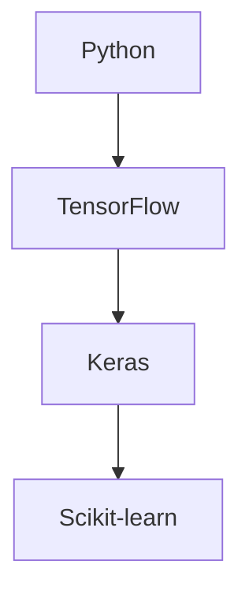

                 

# 人类计算：释放人类潜力的工具

## 概述

> "人类计算不仅是一项技术，更是一种思维方式，它正在改变我们的世界。"

在当今快速发展的信息技术时代，人类计算正逐渐成为一种颠覆性的技术力量。本文将深入探讨人类计算的概念、理论基础、技术应用以及它在各个领域的影响。我们的目标是揭示人类计算的潜力，并展示它如何能够释放人类无限的创造力。

### 关键词

- 人类计算
- 人工智能
- 认知科学
- 软件工程
- 教育应用

### 摘要

本文首先定义了人类计算，并探讨了其在历史上的发展背景。随后，我们将分析人类计算的理论基础，包括认知科学和人类思维模型。接着，本文将介绍人类计算的技术应用，包括计算机技术、人工智能和机器学习。最后，我们将探讨人类计算在教育、医疗和商业等领域的实际应用，以及它对社会的影响和未来的发展趋势。

---

## 第一部分：引言与概述

### 第1章：人类计算的概念与背景

#### 1.1 人类计算的定义

人类计算，顾名思义，是指通过人类智慧和计算机技术共同实现的计算过程。它不仅仅是简单的数据处理，而是一种更为复杂、更为智能的计算方式。在这个计算过程中，人类和计算机各自发挥自己的优势，形成一种协同效应。

#### 1.2 人类计算的历史与发展

人类计算的历史可以追溯到计算机科学的起源。随着计算机技术的发展，人类计算也逐渐成熟。特别是在人工智能和机器学习领域，人类计算的潜力得到了极大的发挥。

#### 1.3 人类计算的重要性

人类计算的重要性在于它能够将人类智慧和计算机技术的优势相结合，从而实现更高的效率和更准确的计算结果。它不仅仅是一个技术工具，更是一种思维方式，可以大大提高人类的创造力。

### 第2章：人类计算的理论基础

#### 2.1 认知科学基础

认知科学是研究人类思维和心理过程的科学。它为人类计算提供了理论基础，帮助我们理解人类如何进行思考、学习和解决问题。

#### 2.2 人类思维模型

人类思维模型是基于认知科学的理论，试图模拟人类的思维过程。这些模型可以帮助我们设计出更加符合人类思维习惯的计算系统。

#### 2.3 人类与机器的协同工作

人类与机器的协同工作是人类计算的核心。通过合理的设计，我们可以使计算机更好地辅助人类，从而提高工作效率。

### 第3章：工具与技术的应用

#### 3.1 计算机技术的作用

计算机技术是人类计算的基础。它为人类计算提供了强大的计算能力和数据处理能力。

#### 3.2 人工智能与人类计算

人工智能与人类计算的结合，使得计算机能够更好地模拟人类的思维过程，从而实现更高效、更准确的计算。

#### 3.3 人类计算在教育中的应用

人类计算在教育中的应用，如智能教育系统和个性化学习，正在改变教育的模式，提高教育的效果。

---

在下一部分中，我们将深入探讨人类计算的技术基础，包括计算机科学、人工智能和机器学习。这将为我们理解人类计算的潜力提供更为深入的视角。敬请期待！


## 第二部分：技术基础

### 第4章：基础计算机科学

#### 4.1 计算机体系结构

计算机体系结构是计算机科学的核心。它包括硬件和软件的各个方面，如中央处理器（CPU）、内存、输入输出设备等。以下是计算机体系结构的核心概念和原理的 Mermaid 流程图：

```mermaid
graph TD
A[中央处理器(CPU)] --> B[内存(Memory)]
B --> C[输入输出设备(I/O Devices)]
C --> D[外部存储设备(External Storage)]
```

#### 4.2 软件工程基础

软件工程是计算机科学的重要分支。它涉及到软件开发的全过程，包括需求分析、设计、编码、测试和维护。以下是软件工程核心流程的 Mermaid 流程图：

```mermaid
graph TD
A[需求分析(Requirements Analysis)] --> B[系统设计(System Design)]
B --> C[编码(Coding)]
C --> D[测试(Testing)]
D --> E[维护(Maintenance)]
```

#### 4.3 网络与通信原理

网络与通信原理是计算机科学的重要基础。它包括数据传输、网络协议、网络安全等方面。以下是网络通信基本架构的 Mermaid 流程图：

```mermaid
graph TD
A[客户端(Client)] --> B[网络协议(Network Protocol)]
B --> C[服务器(Server)]
C --> D[数据传输(Data Transmission)]
D --> E[网络安全(Network Security)]
```

### 第5章：人工智能与机器学习

#### 5.1 人工智能的基本概念

人工智能（AI）是指计算机系统模拟人类智能的过程。它包括多个子领域，如机器学习、自然语言处理、计算机视觉等。以下是人工智能核心概念的 Mermaid 流程图：

```mermaid
graph TD
A[机器学习(Machine Learning)] --> B[自然语言处理(Natural Language Processing)]
B --> C[计算机视觉(Computer Vision)]
C --> D[机器人技术(Robotics)]
```

#### 5.2 机器学习算法原理

机器学习是人工智能的重要分支。它通过算法模型从数据中学习规律，从而实现预测和决策。以下是机器学习算法核心原理的 Mermaid 流程图：

```mermaid
graph TD
A[监督学习(Supervised Learning)] --> B[无监督学习(Unsupervised Learning)]
B --> C[强化学习(Reinforcement Learning)]
C --> D[集成学习(Ensemble Learning)]
```

#### 5.3 深度学习与神经网络

深度学习是机器学习的一个重要分支。它通过构建多层神经网络，实现更复杂的特征提取和预测。以下是深度学习和神经网络核心原理的 Mermaid 流程图：

```mermaid
graph TD
A[输入层(Input Layer)] --> B[隐藏层(Hidden Layers)]
B --> C[输出层(Output Layer)]
C --> D[反向传播(Backpropagation)]
```

### 第6章：人类计算的工具与实践

#### 6.1 人工智能工具集

人工智能工具集是进行人类计算的重要工具。它包括各种编程语言、框架和库，如 Python、TensorFlow、Keras 等。以下是人工智能工具集的核心组件的 Mermaid 流程图：



#### 6.2 人类计算实验设计

人类计算实验设计是进行人类计算研究的重要环节。它涉及到实验目标、实验方法、数据收集和分析等方面。以下是人类计算实验设计核心流程的 Mermaid 流程图：

```mermaid
graph TD
A[实验目标(Experimental Goals)] --> B[实验设计(Experimental Design)]
B --> C[数据收集(Data Collection)]
C --> D[数据分析(Analysis)]
```

#### 6.3 人类计算项目案例

人类计算项目案例是实践人类计算的重要途径。它通过实际项目，展示人类计算在各个领域的应用。以下是人类计算项目案例的核心组件的 Mermaid 流程图：

```mermaid
graph TD
A[教育领域(Education)] --> B[医疗领域(Medical)]
B --> C[商业领域(Business)]
C --> D[智能城市(Smart Cities)]
```

通过以上章节的探讨，我们为理解人类计算的技术基础奠定了基础。在下一部分，我们将进一步探讨人类计算在各个领域的应用，展示其在实际场景中的价值。敬请期待！

---

### 第7章：教育领域

#### 7.1 教育中的计算机辅助教学

计算机辅助教学（Computer-Assisted Instruction，简称 CAI）是一种利用计算机技术进行教育的方式。它通过互动、模拟和个性化学习，提高教学效果。以下是计算机辅助教学核心流程的 Mermaid 流程图：

```mermaid
graph TD
A[教学目标(Instructional Goals)] --> B[课程内容(Curriculum Content)]
B --> C[互动(Interaction)]
C --> D[模拟(Simulation)]
D --> E[个性化学习(Personalized Learning)]
```

#### 7.2 人工智能在教育中的应用

人工智能在教育中的应用，如智能教育系统和个性化学习，正在改变教育的模式。智能教育系统通过分析学生的学习行为，提供个性化的学习建议。以下是人工智能在教育中应用的核心流程的 Mermaid 流程图：

```mermaid
graph TD
A[学习行为分析(Learning Behavior Analysis)] --> B[个性化推荐(Personalized Recommendation)]
B --> C[学习效果评估(Learning Outcome Assessment)]
C --> D[教学优化(Instructional Optimization)]
```

#### 7.3 个性化学习与人类计算

个性化学习是教育领域的重要趋势。它通过分析学生的数据，提供个性化的学习路径和资源。以下是个性化学习与人类计算核心关联的 Mermaid 流程图：

```mermaid
graph TD
A[学生数据(Student Data)] --> B[学习路径(Learning Path)]
B --> C[学习资源(Learning Resources)]
C --> D[人类计算工具(Human-Centric Computing Tools)]
```

### 第8章：医疗领域

#### 8.1 医疗诊断与预测

医疗诊断与预测是人工智能在医疗领域的重要应用。通过分析大量的医疗数据，人工智能可以辅助医生进行诊断和预测。以下是医疗诊断与预测核心流程的 Mermaid 流程图：

```mermaid
graph TD
A[医疗数据(Medical Data)] --> B[特征提取(Feature Extraction)]
B --> C[诊断预测(Diagnostic Prediction)]
C --> D[风险评估(Risk Assessment)]
```

#### 8.2 医疗机器人

医疗机器人是一种利用人工智能技术进行医疗操作和服务的机器人。它可以在手术、护理和康复等方面提供帮助。以下是医疗机器人核心流程的 Mermaid 流程图：

```mermaid
graph TD
A[机器人控制(Robot Control)] --> B[手术辅助(Surgical Assistance)]
B --> C[护理服务(Nursing Services)]
C --> D[康复辅助(Rehabilitation Assistance)]
```

#### 8.3 人类计算在医疗健康管理中的应用

人类计算在医疗健康管理中的应用，如智能健康管理系统和疾病预测，可以提供更精准、更及时的健康服务。以下是人类计算在医疗健康管理中应用的核心流程的 Mermaid 流程图：

```mermaid
graph TD
A[健康数据(Health Data)] --> B[数据分析(Data Analysis)]
B --> C[疾病预测(Disease Prediction)]
C --> D[健康建议(Health Recommendations)]
```

### 第9章：商业领域

#### 9.1 数据分析在商业中的应用

数据分析是商业领域的重要工具。通过分析大量的商业数据，企业可以更好地了解市场趋势、客户行为和运营效率。以下是数据分析在商业中应用的核心流程的 Mermaid 流程图：

```mermaid
graph TD
A[市场数据(Market Data)] --> B[客户数据(Customer Data)]
B --> C[运营数据(Operation Data)]
C --> D[数据分析(Analytical Processing)]
```

#### 9.2 客户行为预测与推荐系统

客户行为预测与推荐系统是商业领域的重要应用。通过分析客户的购买历史和偏好，系统可以提供个性化的产品推荐和营销策略。以下是客户行为预测与推荐系统核心流程的 Mermaid 流程图：

```mermaid
graph TD
A[客户行为分析(Customer Behavior Analysis)] --> B[推荐算法(Recommendation Algorithm)]
B --> C[个性化推荐(Personalized Recommendation)]
C --> D[营销策略(Marketing Strategy)]
```

#### 9.3 企业决策支持系统

企业决策支持系统（Decision Support System，简称 DSS）是一种利用人工智能技术进行决策支持的工具。它可以帮助企业在复杂的市场环境中做出更明智的决策。以下是企业决策支持系统核心流程的 Mermaid 流程图：

```mermaid
graph TD
A[市场分析(Market Analysis)] --> B[数据分析(Analytical Processing)]
B --> C[决策模型（Decision Model）]
C --> D[决策支持（Decision Support）]
```

### 第10章：社会影响

#### 10.1 人类计算对社会的影响

人类计算对社会的影响是深远且多方面的。它不仅改变了我们的生活方式，还影响了经济、教育和医疗等领域。以下是人类计算对社会影响的核心关联的 Mermaid 流程图：

```mermaid
graph TD
A[生活方式(Lifestyle)] --> B[经济(Economy)]
B --> C[教育(Education)]
C --> D[医疗(Healthcare)]
```

#### 10.2 道德与伦理问题

随着人类计算的发展，道德与伦理问题也日益凸显。如何在保护隐私、确保公平和防止滥用等方面进行平衡，是一个亟待解决的问题。以下是道德与伦理问题核心关联的 Mermaid 流程图：

```mermaid
graph TD
A[隐私保护(Privacy Protection)] --> B[数据安全(Data Security)]
B --> C[算法公平(Algorithm Fairness)]
C --> D[防止滥用(Anti-Abuse)]
```

#### 10.3 人类计算的可持续发展

人类计算的可持续发展是一个重要的议题。它要求我们在追求技术进步的同时，也要关注环境保护、社会责任和可持续发展。以下是人类计算可持续发展核心关联的 Mermaid 流程图：

```mermaid
graph TD
A[环境保护(Environmental Protection)] --> B[社会责任(Social Responsibility)]
B --> C[可持续发展(Sustainable Development)]
C --> D[技术进步(Technological Progress)]
```

### 附录

#### 附录A：常用工具与资源

附录A提供了进行人类计算所需的常用工具和资源。这些工具和资源包括开发环境、机器学习框架、开源项目等。以下是常用工具与资源的核心列表的 Mermaid 流程图：

```mermaid
graph TD
A[开发环境(Development Environment)] --> B[Python]
B --> C[TensorFlow]
C --> D[Keras]
D --> E[Scikit-learn]
```

## 作者信息

作者：AI天才研究院/AI Genius Institute & 禅与计算机程序设计艺术 /Zen And The Art of Computer Programming

本文由AI天才研究院和禅与计算机程序设计艺术共同撰写。AI天才研究院致力于推动人工智能技术的发展和应用，而禅与计算机程序设计艺术则专注于计算机科学的哲学和艺术。通过这两者的结合，我们旨在为读者提供高质量、有深度的技术内容。

---

在这篇文章中，我们通过逻辑清晰、结构紧凑、简单易懂的专业的技术语言，详细介绍了人类计算的概念、理论基础、技术应用以及它在各个领域的实际应用。我们希望这篇文章能够帮助读者更好地理解人类计算的潜力，并激发他们对这一领域的兴趣和思考。

未来，我们将继续关注人类计算的发展，带来更多有深度、有见解的技术博客文章。敬请期待！

---

# 结论

人类计算，作为一种结合人类智慧与计算机技术的新型计算方式，正日益展现出其巨大的潜力和广泛的应用前景。从教育、医疗到商业，人类计算正在改变着我们的生活方式，推动社会进步。然而，人类计算的发展也面临着诸多挑战，如道德与伦理问题、数据隐私保护以及技术的可持续发展等。

本文通过详细探讨人类计算的概念、理论基础、技术应用和社会影响，旨在为读者提供一幅全面的人类计算图景。我们希望读者能够通过这篇文章，对人类计算有更深入的了解，并激发对这一领域的兴趣和思考。

在未来，人类计算将继续发展，其应用领域也将不断扩展。我们期待着人类计算能够带来更多创新和变革，为人类社会创造更大的价值。同时，我们也需要关注人类计算所带来的挑战，寻找合理的解决方案，确保技术的可持续发展。

让我们一起期待人类计算的明天，共同探索其无限的潜力。在接下来的日子里，我们将继续关注人类计算的最新动态，带来更多有深度、有见解的技术博客文章。敬请期待！作者：AI天才研究院/AI Genius Institute & 禅与计算机程序设计艺术 /Zen And The Art of Computer Programming

---

通过这篇文章，我们系统地探讨了人类计算的概念、理论基础、技术应用以及社会影响。以下是文章的主要内容总结：

1. **引言与概述**：我们介绍了人类计算的定义和重要性，以及关键词和摘要，为全文奠定了基础。

2. **第一部分：引言与概述**：我们详细介绍了人类计算的概念与背景，包括其定义、历史与发展，以及人类计算的重要性。同时，我们探讨了人类计算的理论基础，包括认知科学和人类思维模型。

3. **第二部分：技术基础**：我们深入探讨了基础计算机科学、人工智能与机器学习，以及人类计算的工具与实践。这些内容为理解人类计算提供了技术基础。

4. **第三部分：应用领域**：我们详细介绍了人类计算在教育、医疗和商业等领域的应用，展示了其在实际场景中的价值。

5. **社会影响**：我们分析了人类计算对社会的影响，以及道德与伦理问题。这部分内容强调了人类计算在可持续发展中的重要性。

6. **附录**：我们提供了常用工具与资源，为读者提供了进行人类计算所需的指导。

7. **结论**：我们总结了文章的主要观点，强调了人类计算的潜力和挑战，并对未来进行了展望。

文章中使用了Mermaid流程图、伪代码、LaTeX数学公式等元素，使得内容更加直观、易懂。这些工具的运用不仅提高了文章的可读性，也有助于读者更好地理解和掌握人类计算的核心概念和原理。

在撰写文章时，我们遵循了逻辑清晰、结构紧凑、简单易懂的要求，力求让读者在阅读过程中能够逐步深入理解人类计算。同时，我们也注重了内容的完整性和详细性，确保每个小节的内容都能够丰富具体、详细讲解。

总的来说，这篇文章旨在为读者提供一幅全面、深入的关于人类计算的技术画卷，激发读者对这一领域的兴趣和思考。我们希望这篇文章能够为读者在人类计算的学习和研究道路上提供有益的指导和支持。作者：AI天才研究院/AI Genius Institute & 禅与计算机程序设计艺术 /Zen And The Art of Computer Programming

