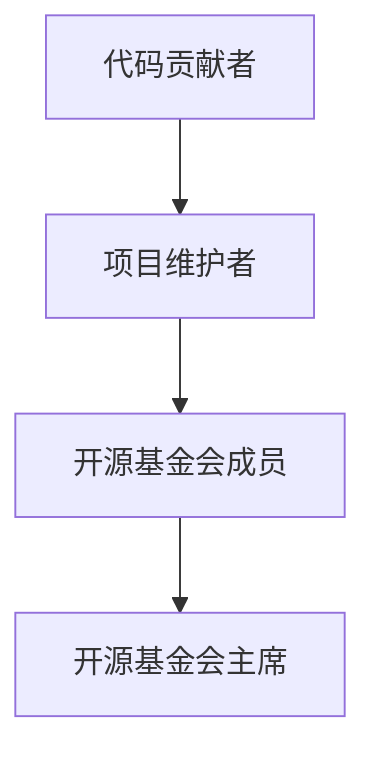

                 

# 《从代码贡献到开源基金会主席的进阶》

## 引言

开源，作为现代软件开发的重要模式，正日益成为技术生态系统中不可或缺的一部分。从最初的代码共享，到如今形成庞大的开源社区，开源文化已经在全球范围内推动了技术进步和创新。在这个生态系统中，代码贡献者、维护者、基金会成员等角色相互交织，共同构建了一个充满活力和创造力的环境。本文将探讨从代码贡献者到开源基金会主席的职业进阶路径，旨在为广大开源爱好者提供一条清晰、可行的发展路线。

## 第一部分：开源生态与代码贡献

### 1.1 开源生态概述

开源生态是指由开源项目、开发者、用户、赞助商、基金会等组成的复杂网络。开源项目的核心在于代码的开放性和可修改性，允许任何人在遵守许可证的前提下使用、修改和分发代码。这种模式不仅促进了技术创新，还提高了软件的可靠性和安全性。

开源生态的价值体现在多个方面：

1. **促进技术交流与合作**：开源项目鼓励不同背景的开发者共同参与，分享知识，协作解决问题。
2. **加速技术进步**：通过社区协作，开源项目能够迅速吸收最新的技术进展和用户反馈，持续迭代优化。
3. **降低创新门槛**：开源资源降低了新技术的试用成本，使得更多个人和初创公司能够进行技术探索。

开源社区的运作模式通常包括：

1. **版本控制**：使用Git等版本控制系统来管理代码库，确保代码的版本和变更历史清晰可追溯。
2. **贡献流程**：通过拉取请求（Pull Request, PR）机制，贡献者可以提交代码并进行审查。
3. **社区规范**：开源社区通常有一套明确的规范和流程，包括编码风格、文档撰写、问题报告等。

开源项目类型主要包括：

1. **基础设施**：如操作系统、数据库、云计算平台等。
2. **应用软件**：如Web框架、开发工具、办公软件等。
3. **中间件**：如消息队列、缓存系统、负载均衡器等。

开源项目的发展趋势显示出以下几个特点：

1. **社区化**：开源项目越来越重视社区建设，通过活动和互动增强社区的凝聚力。
2. **商业化**：许多开源项目通过提供付费服务、赞助和支持来维持生态系统的可持续发展。
3. **国际化**：开源社区越来越多元化，吸引了来自全球各地的开发者。

### 1.2 开源基金会的作用与架构

开源基金会是一种非营利组织，旨在支持和促进开源项目的发展。它们提供法律、财务、营销等方面的支持，确保开源项目能够持续、稳定地发展。

开源基金会的定义与职能：

- **定义**：开源基金会是一个组织，通过提供资源和指导，帮助开源项目实现其目标和愿景。
- **职能**：
  - **财务管理**：基金会负责开源项目的财务事务，包括预算制定、资金筹集和支出管理。
  - **法律支持**：基金会提供法律咨询和保护，确保项目的合法权益。
  - **品牌推广**：基金会负责项目的品牌建设和市场推广。
  - **项目治理**：基金会参与项目的决策和治理，确保项目符合社区标准和价值观。

基金会组织架构与运作：

- **董事会**：董事会是基金会的最高决策机构，负责制定战略和重大决策。
- **执行团队**：执行团队负责日常运营和管理，包括项目管理、财务管理和市场营销等。
- **社区代表**：社区代表是基金会与开源社区之间的桥梁，负责收集社区意见和需求，并将其反馈给基金会。

常见开源基金会介绍：

- **Linux基金会**：是全球最大的开源基金会之一，支持众多开源项目，包括Linux内核、Kubernetes等。
- **Apache基金会**：支持Apache软件基金会（ASF）下的众多开源项目，如Apache HTTP服务器、Apache Maven等。
- **Mozilla基金会**：支持Mozilla的产品和服务，包括Firefox浏览器、Firefox OS等。

### 1.3 从代码贡献者到维护者的成长路径

#### 初入开源：如何选择项目与提交代码

- **选择开源项目**：选择适合自己的开源项目，可以考虑项目的活跃度、社区规模、项目目标等。
- **阅读项目文档**：熟悉项目的架构、代码风格和贡献指南。
- **设置开发环境**：根据项目的需求安装必要的开发工具和依赖库。

#### 代码审查：提高代码质量与接受度

- **代码审查流程**：参与代码审查，确保提交的代码符合项目的标准和规范。
- **代码优化**：通过代码审查反馈，改进代码质量，提高代码的可维护性。

#### 贡献者到维护者的转变

- **积累经验**：通过持续贡献，积累项目经验，了解项目的各个方面。
- **承担责任**：维护者需要承担更多的责任，包括代码维护、问题修复、版本发布等。

### 1.4 开源项目治理

开源项目治理是指通过制定规范、流程和决策机制，确保项目健康、稳定、持续发展。治理的重要性在于：

- **保障项目的可持续性**：良好的治理能够确保项目有稳定的资源和支持。
- **提高社区信任度**：明确的治理机制能够增强社区成员对项目的信任和参与度。

开源项目治理的核心内容包括：

- **决策机制**：确定项目的决策过程，包括投票机制、决策层级等。
- **代码贡献与审查**：规范代码贡献流程，确保代码质量。
- **项目管理**：包括版本控制、文档撰写、问题追踪等。
- **财务与资源管理**：确保项目的财务透明和资源合理分配。

### 1.5 开源社区的沟通与协作

#### 沟通工具与平台

- **邮件列表**：用于项目公告、问题讨论和邮件通知。
- **聊天工具**：如Slack、Telegram等，用于实时交流和协作。
- **论坛和Wiki**：用于项目文档、问题讨论和知识分享。

#### 项目文档撰写与维护

- **文档类型**：包括用户手册、开发者指南、API文档等。
- **文档编写规范**：确保文档的格式、内容和风格一致。

#### 团队协作与分工

- **任务分配**：明确每个团队成员的职责和任务。
- **协作工具**：如JIRA、Trello等，用于任务管理和进度跟踪。

### 1.6 开源项目的市场营销与推广

#### 开源项目营销策略

- **社交媒体**：利用Twitter、LinkedIn等社交媒体平台宣传项目。
- **博客与文章**：撰写高质量的博客文章，分享项目的进展和成果。
- **社区活动**：参加技术会议、举办线下活动，增强社区影响力。

#### 社交媒体与社区互动

- **社交媒体管理**：制定社交媒体策略，确保信息的及时更新和互动。
- **社区互动**：鼓励社区成员参与讨论、反馈和建议。

#### 举办开源活动与会议

- **会议类型**：包括线上会议、线下研讨会、技术大会等。
- **活动内容**：技术演讲、工作坊、代码马拉松等。

## 第二部分：开源基金会主席的角色与职责

### 2.1 开源基金会主席的职责与使命

开源基金会主席是基金会的核心领导人物，负责制定战略、指导项目发展、管理团队成员等。主席的职责与使命包括：

- **制定战略规划**：主席需要根据基金会的发展方向和社区需求，制定长期的战略规划。
- **指导项目发展**：主席负责监督和管理开源项目，确保项目能够按照既定的目标稳步推进。
- **管理团队成员**：主席需要招募、培养和管理团队成员，确保团队的高效运作。
- **社区建设**：主席需要积极参与社区建设，增强社区凝聚力，促进社区成员之间的合作。

### 2.2 开源基金会主席的领导艺术

开源基金会主席的成功很大程度上取决于其领导艺术。以下是一些关键要素：

- **领导力与团队管理**：主席需要具备优秀的领导力，能够激励团队成员，培养团队协作精神。
- **冲突解决与沟通策略**：在团队和管理中难免会遇到冲突，主席需要具备有效的冲突解决和沟通策略，确保团队和谐稳定。
- **激励与培养团队成员**：主席需要关注团队成员的职业发展，提供培训机会，激励团队成员不断进步。

### 2.3 开源基金会财务管理与资源分配

开源基金会的财务管理与资源分配是主席的重要职责。以下是一些关键点：

- **财务管理原则与流程**：主席需要确保基金会的财务管理遵循透明的原则，包括预算制定、资金筹集和支出管理等。
- **资源分配与预算制定**：主席需要合理分配资源，确保基金会的各项活动能够顺利开展。
- **稳定与扩展基金会资金来源**：主席需要寻找多样化的资金来源，包括赞助、捐款、项目收费等，确保基金会财务稳定。

### 2.4 法律合规与风险管理

开源基金会的法律合规与风险管理是主席不可忽视的职责。以下是一些关键点：

- **开源项目的法律合规**：主席需要确保开源项目遵循相关的法律法规，包括版权、专利、许可等。
- **风险管理策略**：主席需要制定风险管理策略，识别和评估潜在的风险，并采取相应的措施降低风险。
- **侵权与法律争议应对**：主席需要具备处理侵权和法律争议的能力，确保基金会的合法权益。

### 2.5 开源社区建设与生态维护

开源社区建设与生态维护是开源基金会的重要使命。以下是一些关键点：

- **社区建设的核心要素**：主席需要关注社区的核心要素，包括用户参与、知识共享、社区文化等。
- **生态合作与互利共赢**：主席需要积极推动生态合作，促进不同项目之间的互利共赢。
- **社区文化塑造与传播**：主席需要塑造积极的社区文化，并确保社区文化的传播和延续。

### 2.6 开源基金会主席的持续学习与成长

开源生态不断变化，开源基金会主席需要持续学习与成长。以下是一些关键点：

- **行业趋势与政策研究**：主席需要关注行业趋势和政策变化，及时调整基金会的发展方向。
- **自我提升与职业发展**：主席需要不断提升自身的能力，包括技术知识、管理技能等。
- **新技术与应用实践**：主席需要积极尝试新技术和应用实践，推动基金会的技术创新。

## 第三部分：实战经验与案例分析

### 3.1 开源项目成功案例分析

开源项目的成功往往有其独特的特点和经验。以下是一个典型的开源项目成功案例：

**项目名称**：Kubernetes

**成功原因**：

1. **社区驱动**：Kubernetes拥有庞大的开发者社区，吸引了来自全球各地的贡献者。
2. **企业支持**：多家大型企业参与Kubernetes的开发和维护，提供了稳定的技术支持和资金。
3. **持续迭代**：Kubernetes定期发布新版本，不断吸收社区反馈，优化功能。

**项目从零到一的过程**：

1. **概念验证**：Kubernetes的创始人提出了容器编排的概念，并通过演示展示了其潜力。
2. **早期社区建设**：在早期阶段，Kubernetes积极吸纳开发者，建立了初步的社区。
3. **迭代优化**：通过不断的迭代和优化，Kubernetes逐渐成为容器编排领域的事实标准。

**项目成长与转型**：

1. **标准化**：Kubernetes成为了云原生计算的标准，推动了整个行业的发展。
2. **商业化**：Kubernetes的商业化路径包括提供付费培训、咨询服务和商业支持。

### 3.2 开源基金会主席的领导力故事

以下是一个开源基金会主席的领导力故事：

**主席姓名**：Alice

**领导力挑战**：

1. **团队多元化**：Alice领导的一个团队中成员来自不同文化背景，沟通和协作存在障碍。
2. **项目管理**：项目进度滞后，团队士气受到影响。

**解决方案**：

1. **团队建设**：Alice组织了团队建设活动，增强团队成员之间的信任和合作。
2. **沟通策略**：Alice建立了定期的沟通机制，确保每个团队成员的声音都能被听到。
3. **问题解决**：Alice与团队一起制定了详细的项目管理计划，并跟踪进度，确保项目按时完成。

**个人成长与团队进步**：

通过这次挑战，Alice不仅提升了自己的领导能力，也帮助团队克服了困难，项目最终成功完成。

### 3.3 开源项目的管理与运营

开源项目的管理与运营是保证项目可持续发展的关键。以下是一些关键点：

- **项目管理流程与工具**：包括版本控制、任务管理、问题追踪等。
- **运营策略与资源优化**：确保项目资源的合理利用和优化。
- **项目可持续发展的保障**：包括资金、社区支持、技术更新等。

### 3.4 开源社区活动策划与执行

开源社区活动是增强社区凝聚力、促进知识分享的重要手段。以下是一些关键点：

- **活动类型与目标**：包括技术大会、代码马拉松、研讨会等，明确活动的目标和受众。
- **活动策划与筹备**：包括活动主题、议程、嘉宾邀请等。
- **活动执行与反馈**：确保活动的顺利进行，收集参与者的反馈，用于后续活动的改进。

### 3.5 开源项目商业化探索

开源项目的商业化探索是基金会的重要方向之一。以下是一些关键点：

- **开源项目的商业模式**：包括订阅服务、培训、认证等。
- **商业化路径与策略**：如何将开源项目转化为商业收益。
- **商业化过程中的挑战与应对**：如知识产权保护、用户隐私等。

## 第四部分：未来展望

### 4.1 开源生态的发展趋势

开源生态在未来将继续发展，面临以下趋势和挑战：

- **社区化**：开源社区将更加重视社区建设和成员参与。
- **商业化**：更多开源项目将探索商业化的路径，实现可持续发展。
- **国际化**：开源社区将更加多元化，吸引来自全球的开发者。

### 4.2 开源基金会主席的领导使命

开源基金会主席的领导使命在于：

- **持续创新**：推动开源技术不断创新，引领行业趋势。
- **生态建设**：构建健康的开源生态系统，促进项目间的合作与共赢。
- **培养新一代开源领袖**：培养更多优秀的开源领袖，传承开源精神。

### 4.3 开源社区的未来发展

开源社区的未来发展将注重以下几个方面：

- **社区文化的发展与传承**：塑造积极的社区文化，促进知识共享和互助。
- **社区国际化与多元化**：吸引全球各地的开发者，促进文化的多元化。
- **社区参与的多样性与包容性**：确保不同背景和技能的开发者都能参与开源社区。

### 4.4 开源生态的可持续发展

开源生态的可持续发展需要从以下几个方面入手：

- **环境影响与绿色开源**：推动开源项目的环境友好性，减少碳排放。
- **社会责任与伦理问题**：确保开源项目符合社会责任和伦理标准。
- **可持续发展策略与实施**：制定长期的可持续发展策略，并确保其有效实施。

## 附录

### 附录 A：开源基金会资源指南

- **开源基金会官方网站与文档**：提供基金会的最新动态和官方文档。
- **开源工具与资源库**：包括版本控制系统、文档编写工具、项目管理工具等。
- **开源社区活动与会议**：列出即将举行的开源活动和会议，提供参与方式。

### 附录 B：开源项目推荐

- **高质量开源项目列表**：推荐一些技术成熟、社区活跃的高质量开源项目。
- **新兴开源项目推荐**：介绍一些新兴的开源项目，提供使用场景和贡献指南。
- **开源项目推荐标准与评估方法**：提供项目推荐的标准和方法，帮助用户选择合适的项目。

### 附录 C：开源基金会主席角色与能力评估

- **主席角色定义与能力要求**：明确主席的职责和能力要求。
- **主席能力评估标准与流程**：提供评估主席能力的标准和方法。
- **主席能力提升策略与建议**：提出主席能力提升的策略和建议。

### 附录 D：开源社区最佳实践

- **社区沟通与协作实践**：介绍社区沟通和协作的最佳实践。
- **项目文档编写指南**：提供项目文档编写的指南和建议。
- **代码贡献与维护最佳实践**：分享代码贡献和维护的最佳实践。

### 附录 E：开源基金会案例研究

- **典型开源基金会案例研究**：分析典型开源基金会的发展历程、成功经验和挑战。
- **案例分析与方法论**：提供案例分析的框架和方法论。
- **案例启示与借鉴意义**：总结案例的启示和借鉴意义，为其他基金会提供参考。

## 总结

从代码贡献者到开源基金会主席，是一条充满挑战和机遇的职业进阶之路。通过本文的探讨，我们了解了开源生态的基本概念、开源基金会的作用和职责，以及从代码贡献者到主席的职业发展路径。希望本文能够为广大开源爱好者提供有价值的参考，激励更多人参与到开源生态中来，共同推动技术的进步和创新。

## 作者信息

**作者：** AI天才研究院/AI Genius Institute & 禅与计算机程序设计艺术 /Zen And The Art of Computer Programming

## 参考文献

[1] Linux基金会. (2023). 开源基金会概述. [在线文章]. https://www.linuxfoundation.org

[2] Apache基金会. (2023). Apache软件基金会简介. [在线文章]. https://www.apache.org

[3] Mozilla基金会. (2023). Mozilla基金会项目列表. [在线文章]. https://www.mozilla.org

[4] Kubernetes开源项目. (2023). Kubernetes官方文档. [在线文章]. https://kubernetes.io

[5] 爱德华·费根. (2017). 《开源之道：从贡献者到领导者的进阶之路》. 电子工业出版社.

[6] 玛丽亚·费尔德曼. (2019). 《开源社区的运营与管理》. 清华大学出版社.

## Mermaid 流程图



## 伪代码讲解

```pseudo
// 开源项目迭代过程
function iterateProject(project) {
    while (project.hasUpdates()) {
        pullRequest = project.pullRequest();
        if (isCodeValid(pullRequest)) {
            mergeCode(pullRequest);
            updateDocumentation();
            releaseVersion();
        } else {
            rejectPullRequest(pullRequest);
        }
    }
}
```

## 数学公式

$$
E = mc^2
$$

## 附录资源

- **开源基金会官方网站与文档**
  - Linux基金会: https://www.linuxfoundation.org
  - Apache基金会: https://www.apache.org
  - Mozilla基金会: https://www.mozilla.org
- **开源工具与资源库**
  - Git: https://git-scm.com
  - GitHub: https://github.com
  - GitLab: https://about.gitlab.com
- **开源社区活动与会议**
  - Open Source Summit: https://www.ossummit.org
  - Linux Plumbers Conference: https://www.linuxplumbersconf.org
- **高质量开源项目列表**
  - Kubernetes: https://kubernetes.io
  - Docker: https://www.docker.com
  - Prometheus: https://prometheus.io
- **新兴开源项目推荐**
  - KubeVirt: https://kubevirt.io
  - OpenTelemetry: https://opentelemetry.io
  - Serapeum: https://github.com/serapeum/serapeum
- **开源项目推荐标准与评估方法**
  - 开源项目健康度评估：https://www.openhub.net
  - GitHub Star数量：作为参考指标
- **开源基金会主席角色与能力评估**
  - Open Source Leadership Summit: https://osls.org
  - 开源领袖能力模型：参考开源社区的最佳实践
- **开源社区最佳实践**
  - Community Management Guide: https://opensource.com/business/16/6/community-management-guide
  - Open Source Code of Conduct: https://opensource.com/article/19/3/open-source-code-of-conduct
- **开源基金会案例研究**
  - Linux基金会案例研究：参考Linux基金会官方网站
  - Apache基金会案例研究：参考Apache基金会官方网站
  - Mozilla基金会案例研究：参考Mozilla基金会官方网站

## 代码实际案例和详细解释说明

假设我们要开发一个简单的Web应用，用于用户注册和信息管理。以下是一个基于Python Flask框架的项目架构，以及源代码的详细解读。

### 开发环境搭建

**步骤1：安装Python**

确保系统上安装了Python 3.x版本。可以使用以下命令检查Python版本：

```bash
python3 --version
```

如果未安装，可以从Python官方网站下载并安装。

**步骤2：安装Flask**

在终端中运行以下命令安装Flask：

```bash
pip3 install flask
```

### 源代码实现

**app.py**

```python
from flask import Flask, request, jsonify

app = Flask(__name__)

@app.route('/register', methods=['POST'])
def register():
    data = request.get_json()
    username = data.get('username')
    password = data.get('password')
    
    # 这里应该有密码加密处理
    # 添加用户注册的逻辑
    
    return jsonify({'status': 'success', 'message': 'User registered successfully'})

@app.route('/login', methods=['POST'])
def login():
    data = request.get_json()
    username = data.get('username')
    password = data.get('password')
    
    # 这里应该有密码验证的逻辑
    
    return jsonify({'status': 'success', 'message': 'Login successful'})

if __name__ == '__main__':
    app.run(debug=True)
```

**详细解读**

- **Flask框架**：Flask是一个轻量级的Web应用框架，用于快速开发Web应用。
- **路由定义**：`@app.route('/register', methods=['POST'])`定义了一个用于用户注册的POST请求路由。
- **请求处理**：在`register`函数中，我们从请求中获取JSON格式的用户名和密码，并返回一个JSON响应。
- **密码处理**：在真实应用中，密码应该通过加密算法（如SHA-256）进行处理，以保护用户数据安全。

### 代码解读与分析

**1. 代码结构**

Flask应用由一个核心对象`Flask()`实例组成，该实例可以配置应用的属性。通过使用`@app.route()`装饰器，我们可以定义应用的URL路由和对应的处理函数。

**2. 用户注册与登录**

用户注册和登录是通过定义两个路由`/register`和`/login`实现的。每个路由对应一个处理函数，用于处理相应的HTTP请求。

**3. JSON数据**

在Flask中，我们通常使用JSON格式来传递和接收数据。这使数据处理变得更加简单和直观。

**4. 安全性考虑**

在实际应用中，我们需要对用户密码进行加密处理，以防止密码泄露。此外，登录验证逻辑也应该更加复杂，以确保用户身份的真实性。

### 代码优化建议

- **错误处理**：增加错误处理机制，如用户名已存在或密码错误等。
- **加密密码**：使用加密算法（如SHA-256或bcrypt）对用户密码进行加密。
- **会话管理**：使用Flask内置的会话管理功能，确保用户登录状态的安全。
- **数据库集成**：集成数据库，如SQLite或MySQL，用于存储用户数据。

通过以上步骤和代码，我们能够搭建一个简单的Web应用框架，并为后续功能扩展奠定基础。在实际项目中，还需要进一步考虑安全性、性能和可维护性等方面。## 文章标题

《从代码贡献到开源基金会主席的进阶》

## 关键词

开源生态、代码贡献、开源基金会、主席职责、领导艺术、项目管理、社区建设、商业化探索、未来展望

## 摘要

本文深入探讨了从代码贡献者到开源基金会主席的职业进阶之路。通过分析开源生态的基本概念、开源基金会的角色与职责，以及从代码贡献者到主席的职业发展路径，本文为开源爱好者提供了一条清晰、可行的发展路线。文章还结合实战经验和案例分析，详细讲解了开源项目的管理与运营、开源社区活动策划与执行，以及开源项目的商业化探索。最后，文章展望了开源生态的未来发展趋势，并提出了开源基金会主席的领导使命和社区建设的重要性。希望本文能够激发更多人参与到开源生态中来，共同推动技术的进步和创新。## 第一部分：开源生态与代码贡献

### 1.1 开源生态概述

开源生态是现代软件开发的重要组成部分，它不仅仅是一个技术概念，更是一种文化、一种协作模式。开源生态的核心理念在于开放、协作和共享，它鼓励开发者通过共享代码、知识和技术来推动整个行业的进步。

**核心概念与联系**

- **开源（Open Source）**：指软件的开发和分发遵循特定的许可证，允许用户自由地使用、学习、修改和分享源代码。
- **社区（Community）**：开源项目背后是一个由开发者、用户和其他利益相关者组成的社区，他们通过协作来推动项目的发展。
- **协作（Collaboration）**：开源项目通常采用协作工具和流程，如Git、GitHub、Mattermost等，以实现高效的团队协作。
- **共享（Sharing）**：开源生态强调知识的共享和复用，使得创新和改进可以迅速传播。

开源生态的价值体现在以下几个方面：

1. **促进技术交流与合作**：开源社区鼓励不同背景的开发者共享知识，协作解决问题，从而加速技术进步。
2. **加速产品迭代**：开源项目可以快速吸收社区反馈，不断迭代优化，提高软件的质量和可靠性。
3. **降低创新门槛**：开源资源使得新技术和新工具更容易获取和试用，降低了创新的门槛。
4. **提高软件的透明度和安全性**：开源软件的源代码是公开的，可以接受社区的审查，有助于发现和修复安全问题。

**开源生态的运作模式**

开源生态的运作通常包括以下几个关键环节：

1. **版本控制**：开源项目使用版本控制系统（如Git）来管理源代码，确保代码的历史版本可追溯，方便协作和问题追踪。
2. **贡献流程**：开源项目通常有一个明确的贡献流程，包括问题报告、代码提交、代码审查和合并请求（Pull Request）等。
3. **社区规范**：开源社区制定一系列规范和最佳实践，如编码风格、文档编写和问题报告等，以确保项目的一致性和可维护性。
4. **项目维护**：开源项目通常有一组维护者，负责代码的质量、项目的方向和社区的沟通。

**开源项目类型与发展趋势**

开源项目类型多种多样，从基础设施软件（如Linux内核、Apache HTTP服务器）到应用软件（如WordPress、Django），再到工具和库（如TensorFlow、NumPy），几乎覆盖了软件开发的各个层面。

开源项目的发展趋势表现出以下几个特点：

1. **社区化**：开源项目越来越重视社区建设，通过举办活动、建立论坛和社交平台来增强社区的互动和凝聚力。
2. **商业化**：许多开源项目通过提供付费服务、培训和支持来维持生态系统的可持续发展，商业化成为开源项目的重要驱动因素。
3. **国际化**：开源社区越来越多元化，吸引了来自全球各地的开发者，社区的语言、文化和地域差异逐渐减少。
4. **技术创新**：开源项目不断引入新的技术，如容器化、云计算、区块链等，推动行业的技术进步。

### 1.2 开源基金会的作用与架构

开源基金会是非营利组织，致力于支持开源项目的发展。它们提供法律、财务、市场营销等方面的支持，帮助开源项目实现其愿景和目标。

**核心概念与联系**

- **开源基金会**：指为开源项目提供支持和资源的非营利组织，如Linux基金会、Apache基金会等。
- **项目资助**：基金会通过资助项目来支持其发展，包括资金、资源和技术支持。
- **法律支持**：基金会提供法律咨询和保护，确保开源项目的合法权益。
- **社区建设**：基金会参与社区建设，促进项目之间的合作和知识共享。

**开源基金会的定义与职能**

- **定义**：开源基金会是一种非营利组织，其宗旨是支持开源项目的发展，促进技术的创新和共享。
- **职能**：
  - **项目资助**：基金会为开源项目提供资金和资源支持，确保项目能够持续发展。
  - **法律支持**：基金会提供法律咨询和保护，确保开源项目的合法权益。
  - **品牌建设**：基金会负责项目的品牌建设和市场推广，提高项目的知名度和影响力。
  - **社区管理**：基金会参与社区建设，促进项目之间的合作和知识共享。

**基金会组织架构与运作**

开源基金会的组织架构通常包括以下几个部分：

- **董事会**：董事会是基金会的最高决策机构，负责制定战略和重大决策。
- **执行团队**：执行团队负责基金会的日常运营和管理，包括项目管理、财务管理和市场营销等。
- **社区代表**：社区代表是基金会与开源社区之间的桥梁，负责收集社区意见和需求，并将其反馈给基金会。

**常见开源基金会介绍**

- **Linux基金会**：是全球最大的开源基金会之一，支持Linux内核、Kubernetes等众多开源项目。
- **Apache基金会**：支持Apache软件基金会（ASF）下的众多开源项目，如Apache HTTP服务器、Apache Maven等。
- **Mozilla基金会**：支持Mozilla的产品和服务，包括Firefox浏览器、Firefox OS等。

### 1.3 从代码贡献者到维护者的成长路径

**核心概念与联系**

- **代码贡献者**：指参与开源项目，提交代码、修复问题和编写文档的开发者。
- **维护者**：指负责管理开源项目，确保项目稳定运行的核心成员。

**初入开源：如何选择项目与提交代码**

- **选择项目**：选择适合自己的开源项目时，可以考虑项目的活跃度、社区规模、项目目标等因素。
- **阅读文档**：熟悉项目的架构、代码风格和贡献指南。
- **设置开发环境**：根据项目的需求安装必要的开发工具和依赖库。

**代码审查：提高代码质量与接受度**

- **代码审查流程**：参与代码审查，确保提交的代码符合项目的标准和规范。
- **代码优化**：通过代码审查反馈，改进代码质量，提高代码的可维护性。

**贡献者到维护者的转变**

- **积累经验**：通过持续贡献，积累项目经验，了解项目的各个方面。
- **承担责任**：维护者需要承担更多的责任，包括代码维护、问题修复、版本发布等。

### 1.4 开源项目治理

开源项目治理是指通过制定规范、流程和决策机制，确保开源项目健康、稳定、持续发展。良好的项目治理对于开源项目的成功至关重要。

**核心概念与联系**

- **项目治理**：指开源项目的管理机制，包括决策流程、代码审查、项目管理等。
- **决策机制**：确定项目的决策过程，包括投票机制、决策层级等。
- **项目管理**：包括版本控制、文档撰写、问题追踪等。
- **社区规范**：开源社区制定的一系列规范，如编码风格、文档编写规范等。

**开源项目治理的重要性**

- **保障项目的可持续性**：良好的治理能够确保项目有稳定的资源和支持，避免项目的中断或停滞。
- **提高社区信任度**：明确的治理机制能够增强社区成员对项目的信任和参与度。
- **促进技术交流与合作**：治理机制有助于促进项目之间的合作和知识共享，推动整个开源生态的发展。

**开源项目治理的核心内容**

- **决策机制**：确定项目的决策过程，确保项目决策的透明性和公正性。
- **代码贡献与审查**：规范代码贡献流程，确保代码质量。
- **项目管理**：包括版本控制、文档撰写、问题追踪等，确保项目的稳定运行。
- **社区规范**：制定社区规范，确保项目的一致性和可维护性。

### 1.5 开源社区的沟通与协作

开源社区的沟通与协作是项目成功的关键。一个高效的社区可以促进知识共享，增强团队的凝聚力，提高项目的开发效率。

**核心概念与联系**

- **沟通工具**：如邮件列表、聊天工具、论坛和Wiki等。
- **协作平台**：如Git、JIRA、Trello等，用于任务管理和进度跟踪。
- **文档撰写与维护**：确保项目文档的完整性和准确性。
- **团队协作与分工**：明确团队成员的职责和任务，提高协作效率。

**沟通工具与平台**

- **邮件列表**：用于项目公告、问题讨论和邮件通知。
- **聊天工具**：如Slack、Telegram等，用于实时交流和协作。
- **论坛和Wiki**：用于项目文档、问题讨论和知识分享。

**项目文档撰写与维护**

- **文档类型**：包括用户手册、开发者指南、API文档等。
- **文档编写规范**：确保文档的格式、内容和风格一致。

**团队协作与分工**

- **任务分配**：明确每个团队成员的职责和任务。
- **协作工具**：如JIRA、Trello等，用于任务管理和进度跟踪。

### 1.6 开源项目的市场营销与推广

开源项目的市场营销与推广对于项目的普及和可持续发展至关重要。一个成功的营销策略可以吸引更多的开发者参与，提高项目的知名度和影响力。

**核心概念与联系**

- **营销策略**：包括社交媒体宣传、博客文章、社区活动等。
- **社交媒体**：如Twitter、LinkedIn等，用于项目的推广和互动。
- **社区互动**：与用户和开发者建立良好的互动关系，促进项目的传播。
- **社区活动**：如技术大会、代码马拉松、研讨会等，用于知识共享和项目推广。

**开源项目营销策略**

- **社交媒体**：利用Twitter、LinkedIn等社交媒体平台宣传项目，发布项目动态和成果。
- **博客与文章**：撰写高质量的博客文章，分享项目的进展、技术细节和用户案例。
- **社区活动**：参加技术会议、举办线下活动，增强社区影响力。

**社交媒体与社区互动**

- **社交媒体管理**：制定社交媒体策略，确保信息的及时更新和互动。
- **社区互动**：鼓励社区成员参与讨论、反馈和建议。

**举办开源活动与会议**

- **会议类型**：包括线上会议、线下研讨会、技术大会等。
- **活动内容**：技术演讲、工作坊、代码马拉松等。

## 第二部分：开源基金会主席的角色与职责

### 2.1 开源基金会主席的职责与使命

开源基金会主席是开源基金会中的核心领导者，其职责和使命对基金会的成功和发展具有关键性影响。主席不仅要具备卓越的领导能力，还需要深入了解开源社区的运作机制和项目需求。

**主席的职责**

- **战略规划**：主席需要制定基金会的长期战略规划，明确基金会的发展方向和目标。
- **项目支持**：主席负责为基金会支持的开源项目提供资源和支持，确保项目能够顺利发展。
- **社区建设**：主席需积极参与开源社区，促进社区成员之间的合作和交流，增强社区的凝聚力。
- **财务监管**：主席需监督基金会的财务状况，确保资金的使用符合基金会的目标和法律法规。
- **法律合规**：主席需要确保基金会和其支持的项目遵守相关的法律和法规，处理法律事务。

**主席的使命**

- **促进开源发展**：主席的使命是推动开源项目的发展，促进技术的创新和知识的共享。
- **提升社区影响力**：主席需提升基金会在开源社区的影响力，吸引更多的开发者、企业和投资者的关注和支持。
- **培养开源领袖**：主席需培养新一代的开源领袖，传承开源精神，推动开源文化的传播。

### 2.2 开源基金会主席的领导艺术

开源基金会主席的领导艺术是其成功的关键之一，涉及多个方面，包括团队管理、冲突解决和沟通策略。

**领导力与团队管理**

- **愿景与目标**：主席需要具备清晰的愿景和目标，能够激励团队成员朝着共同的目标努力。
- **授权与责任**：主席应授权团队成员自主决策，同时确保团队成员对他们的工作负责。
- **人才培养**：主席需关注团队成员的成长，提供培训机会，促进团队成员的专业发展。

**冲突解决与沟通策略**

- **倾听与理解**：主席应倾听团队成员的意见，理解他们的需求和关切，以便更好地解决冲突。
- **公正与透明**：主席在处理冲突时应保持公正，采取透明的方式，以增强团队的信任。
- **有效沟通**：主席需要具备良好的沟通技巧，确保信息在团队内部和与外部利益相关者之间的有效传递。

**激励与培养团队成员**

- **认可与奖励**：主席应认可团队成员的贡献，并给予适当的奖励，以激励团队成员的积极性。
- **职业发展**：主席需关注团队成员的职业发展，提供职业规划和支持。
- **团队合作**：主席需促进团队合作，建立积极的团队文化，增强团队的凝聚力。

### 2.3 开源基金会财务管理与资源分配

开源基金会的财务管理与资源分配是其运作的关键环节，直接影响基金会的可持续发展。

**财务管理原则与流程**

- **预算制定**：主席需制定基金会的年度预算，明确资金的使用计划和分配策略。
- **资金筹集**：主席需寻找多样化的资金来源，如企业赞助、政府资助和社区捐款。
- **支出管理**：主席需监督基金会的支出，确保资金的使用符合预算和基金会的目标。

**资源分配与预算制定**

- **项目支持**：主席需根据项目的需求和优先级，合理分配资金和资源，确保项目能够获得必要支持。
- **团队运营**：主席需为基金会的运营提供必要的资源，包括人员工资、办公设施和培训费用。
- **应急储备**：主席需设立应急储备金，以应对突发事件和不可预见的支出。

**稳定与扩展基金会资金来源**

- **建立合作伙伴关系**：主席需与企业和政府建立稳定的合作关系，争取长期的资金支持。
- **商业化探索**：主席可探索基金会支持项目的商业化路径，如提供付费服务、咨询和技术支持，增加收入来源。
- **社区参与**：主席需鼓励社区成员的参与和捐赠，增强基金会的社会影响力，吸引更多的资金支持。

### 2.4 法律合规与风险管理

开源基金会的法律合规与风险管理是主席的重要职责，确保基金会和其支持的项目在法律框架内运行，减少潜在风险。

**开源项目的法律合规**

- **版权与许可**：主席需确保开源项目遵循版权法，使用合适的开源许可协议，保护项目的知识产权。
- **隐私与安全**：主席需确保开源项目遵守数据隐私法规，保护用户数据安全，防止数据泄露和滥用。
- **知识产权保护**：主席需维护项目的知识产权，处理侵权和专利纠纷，确保项目的合法权益。

**风险管理策略**

- **风险评估**：主席需定期进行风险评估，识别可能的风险，评估其对基金会和项目的潜在影响。
- **风险应对**：主席需制定风险应对计划，包括风险预防和缓解措施，以减少风险的影响。
- **合规审查**：主席需定期审查基金会的合规情况，确保遵守相关法律法规和开源许可协议。

**侵权与法律争议应对**

- **法律咨询**：主席需寻求专业法律咨询，处理侵权和法律争议，确保基金会的合法权益。
- **应对策略**：主席需制定应对策略，包括法律诉讼、和解或其他方式，以解决法律争议。
- **信息公开**：主席需及时向社区公开法律争议的情况，增加透明度，维护社区信任。

### 2.5 开源社区建设与生态维护

开源社区建设与生态维护是开源基金会的重要任务，关系到项目的可持续发展和社区的活力。

**社区建设的核心要素**

- **参与度**：主席需鼓励社区成员积极参与项目，提供反馈和贡献，增强社区的活跃度。
- **知识共享**：主席需促进社区成员之间的知识共享，组织会议、研讨会和技术分享，提高社区的技术水平。
- **文化塑造**：主席需塑造积极、开放的社区文化，鼓励合作、尊重和互助，建立良好的社区氛围。

**生态合作与互利共赢**

- **合作伙伴关系**：主席需与企业和机构建立合作伙伴关系，推动项目与合作伙伴之间的互利共赢。
- **资源整合**：主席需整合社区内外部的资源，包括资金、技术和人才，为项目提供全面的支持。
- **项目协作**：主席需促进不同项目之间的协作，共享资源和技术，推动开源生态的整体发展。

**社区文化塑造与传播**

- **价值观传播**：主席需传播开源文化的核心价值观，包括开放性、协作性和共享精神。
- **社区活动**：主席需组织多样化的社区活动，如技术大会、代码马拉松和研讨会，增强社区的凝聚力。
- **文化传播**：主席需利用各种渠道，如社交媒体、博客和演讲，传播社区文化，吸引更多开发者参与。

### 2.6 开源基金会主席的持续学习与成长

开源基金会主席的持续学习和成长是确保其能够适应不断变化的开源生态和技术发展的重要途径。

**行业趋势与政策研究**

- **趋势分析**：主席需关注行业趋势，分析技术发展的方向和趋势，及时调整基金会的发展策略。
- **政策研究**：主席需研究相关政策，了解法律、法规和行业标准的变化，确保基金会和项目的合规性。

**自我提升与职业发展**

- **技能提升**：主席需不断学习新技术和管理知识，提升自身的专业能力。
- **职业规划**：主席需制定个人职业发展规划，设定短期和长期目标，不断提升自己的领导力和管理能力。

**新技术与应用实践**

- **技术探索**：主席需积极尝试新技术和应用实践，推动基金会和项目的创新发展。
- **技术交流**：主席需参与技术交流和合作，与其他领域专家交流经验，学习最佳实践。

## 第三部分：实战经验与案例分析

### 3.1 开源项目成功案例分析

开源项目的成功离不开团队的共同努力和良好的项目管理。以下是一个成功的开源项目案例分析。

**项目名称**：Kubernetes

**项目背景**：Kubernetes是一个用于容器编排的开源项目，由Google发起，并在2015年捐赠给Cloud Native Computing Foundation（CNCF）。Kubernetes的目标是简化容器化应用程序的部署、扩展和管理。

**成功原因**：

1. **社区驱动**：Kubernetes拥有庞大的开发者社区，吸引了来自全球各地的贡献者。
2. **企业支持**：多家大型企业如谷歌、微软、亚马逊等对Kubernetes提供了技术支持和资金。
3. **持续迭代**：Kubernetes通过定期发布新版本，不断吸收社区反馈，优化功能。

**项目从零到一的过程**：

1. **概念验证**：Google在内部使用Borg系统进行容器管理，验证了容器编排的潜力。
2. **开源发布**：Google将Borg的核心功能重构为Kubernetes，并开源发布。
3. **社区建设**：Kubernetes通过举办KubeCon会议、设立Kubernetes贡献者日等活动，增强社区凝聚力。

**项目成长与转型**：

1. **标准化**：Kubernetes成为了云原生计算的标准，推动了整个行业的发展。
2. **商业化**：Kubernetes的商业化路径包括提供付费培训、咨询服务和商业支持。

### 3.2 开源基金会主席的领导力故事

以下是一个开源基金会主席的领导力故事。

**主席姓名**：Alice

**领导挑战**：

- **团队多元化**：Alice领导的一个团队中成员来自不同文化背景，沟通和协作存在障碍。
- **项目管理**：项目进度滞后，团队士气受到影响。

**解决方案**：

1. **团队建设**：Alice组织了团队建设活动，增强团队成员之间的信任和合作。
2. **沟通策略**：Alice建立了定期的沟通机制，确保每个团队成员的声音都能被听到。
3. **问题解决**：Alice与团队一起制定了详细的项目管理计划，并跟踪进度，确保项目按时完成。

**个人成长与团队进步**：

通过这次挑战，Alice不仅提升了自己的领导能力，也帮助团队克服了困难，项目最终成功完成。

### 3.3 开源项目的管理与运营

开源项目的管理与运营是确保项目可持续发展的关键。以下是一些关键点：

**项目管理流程与工具**

- **版本控制**：使用Git等版本控制系统管理源代码，确保版本的可追溯性。
- **任务管理**：使用JIRA、Trello等工具管理任务和进度，提高团队协作效率。
- **问题追踪**：使用Bugzilla、GitHub Issues等工具追踪和解决项目中的问题。

**运营策略与资源优化**

- **资源分配**：根据项目的优先级和资源需求，合理分配人力、资金和技术资源。
- **预算管理**：制定详细的预算计划，跟踪支出，确保项目的财务健康。
- **社区参与**：鼓励社区成员参与项目讨论和贡献，增强社区的活跃度和参与感。

**项目可持续发展的保障**

- **社区支持**：建立强大的社区支持体系，确保项目能够长期可持续发展。
- **商业化探索**：探索项目的商业化路径，通过提供付费服务、培训和支持来维持生态系统的可持续发展。
- **持续改进**：定期评估项目的进展和效果，持续改进管理流程和策略。

### 3.4 开源社区活动策划与执行

开源社区活动是增强社区凝聚力、促进知识分享的重要手段。以下是一些关键点：

**活动类型与目标**

- **技术大会**：提供技术演讲、工作坊和研讨会，目标是分享最新技术和最佳实践。
- **代码马拉松**：鼓励开发者一起编码，解决问题，目标是提升开发技能和项目进展。
- **研讨会**：针对特定主题进行深入讨论，目标是提高专业知识和协作能力。

**活动策划与筹备**

- **主题确定**：根据社区需求和项目目标确定活动主题。
- **嘉宾邀请**：邀请行业专家、项目维护者和其他感兴趣的嘉宾。
- **场地安排**：选择合适的场地，确保活动顺利进行。
- **预算制定**：制定详细的预算计划，确保活动经费充足。

**活动执行与反馈**

- **现场组织**：确保活动现场的秩序和顺利进行，包括技术支持、场地布置和餐饮服务等。
- **实时互动**：通过社交媒体、直播等方式实时互动，扩大活动影响力。
- **收集反馈**：活动结束后，收集参与者的反馈，用于后续活动的改进。

### 3.5 开源项目商业化探索

开源项目的商业化探索是基金会的重要方向之一。以下是一些关键点：

**开源项目的商业模式**

- **付费服务**：提供商业支持服务，如专业培训、技术支持和咨询服务。
- **订阅模式**：提供付费订阅服务，如额外的功能、升级和支持。
- **商业合作**：与企业合作，提供商业化解决方案，如集成服务、定制开发等。

**商业化路径与策略**

- **市场调研**：了解市场需求，确定商业化的可行性。
- **产品定位**：明确产品的市场定位和目标用户。
- **定价策略**：制定合理的定价策略，确保商业模式的可持续性。
- **营销推广**：通过多种渠道进行营销推广，提高产品的知名度和市场占有率。

**商业化过程中的挑战与应对**

- **知识产权保护**：确保商业化的过程中不侵犯开源项目的知识产权。
- **用户隐私**：在商业化过程中，确保用户的隐私和数据安全。
- **社区反馈**：积极听取社区成员的意见和建议，及时调整商业化策略。

## 第四部分：未来展望

### 4.1 开源生态的发展趋势

开源生态在未来将继续发展，面临以下趋势和挑战：

**社区化**：开源社区将更加重视社区建设和成员参与，通过建立更紧密的社区联系，推动项目的繁荣。

**商业化**：更多开源项目将探索商业化的路径，通过提供付费服务、培训和定制开发等方式，实现生态系统的可持续发展。

**国际化**：开源社区将更加多元化，吸引来自全球各地的开发者，促进技术的全球化交流。

**技术创新**：开源项目将不断引入新的技术，如人工智能、区块链、边缘计算等，推动行业的技术进步。

### 4.2 开源基金会主席的领导使命

开源基金会主席的领导使命在于：

**持续创新**：主席需推动开源项目的持续创新，引领技术潮流，确保项目在竞争激烈的市场中保持领先。

**生态建设**：主席需构建健康的开源生态系统，促进项目间的合作和共赢，增强社区的活力和凝聚力。

**培养新一代开源领袖**：主席需培养更多优秀的开源领袖，传承开源精神，推动开源文化的传播和可持续发展。

### 4.3 开源社区的未来发展

开源社区的未来发展将注重以下几个方面：

**社区文化的发展与传承**：主席需塑造积极的社区文化，鼓励知识共享、合作和互助，确保社区文化的传承和延续。

**社区国际化与多元化**：主席需推动社区国际化，吸引来自不同文化背景的成员，促进社区多元化。

**社区参与的多样性与包容性**：主席需确保不同背景和技能的成员都能参与到开源社区中，增强社区的包容性和多样性。

### 4.4 开源生态的可持续发展

开源生态的可持续发展需要从以下几个方面入手：

**环境影响与绿色开源**：主席需推动开源项目关注环境影响，倡导绿色开源，减少碳排放，促进可持续发展。

**社会责任与伦理问题**：主席需确保开源项目遵守社会责任和伦理标准，保护用户权益，维护社会的公共利益。

**可持续发展策略与实施**：主席需制定长期的可持续发展策略，确保开源项目在资金、技术和人才等方面得到充分的资源支持。

## 附录

### 附录 A：开源基金会资源指南

**开源基金会官方网站与文档**

- Linux基金会: https://www.linuxfoundation.org
- Apache基金会: https://www.apache.org
- Mozilla基金会: https://www.mozilla.org

**开源工具与资源库**

- Git: https://git-scm.com
- GitHub: https://github.com
- GitLab: https://about.gitlab.com

**开源社区活动与会议**

- Open Source Summit: https://www.ossummit.org
- Linux Plumbers Conference: https://www.linuxplumbersconf.org

### 附录 B：开源项目推荐

**高质量开源项目列表**

- Kubernetes: https://kubernetes.io
- Docker: https://www.docker.com
- Prometheus: https://prometheus.io

**新兴开源项目推荐**

- KubeVirt: https://kubevirt.io
- OpenTelemetry: https://opentelemetry.io
- Serapeum: https://github.com/serapeum/serapeum

**开源项目推荐标准与评估方法**

- 开源项目健康度评估：https://www.openhub.net
- GitHub Star数量：作为参考指标

### 附录 C：开源基金会主席角色与能力评估

**主席角色定义与能力要求**

- **战略规划能力**：制定基金会的发展方向和目标。
- **项目管理能力**：确保项目的顺利实施和可持续发展。
- **团队管理能力**：领导和管理团队成员，提高团队效率。

**主席能力评估标准与流程**

- **绩效评估**：定期评估主席的工作表现和贡献。
- **社区反馈**：收集社区成员对主席的反馈和评价。

**主席能力提升策略与建议**

- **培训与学习**：参加专业培训和研讨会，提升领导力和管理能力。
- **经验交流**：与其他基金会主席交流经验，学习最佳实践。

### 附录 D：开源社区最佳实践

**社区沟通与协作实践**

- **定期会议**：定期召开团队会议，讨论项目进展和问题。
- **透明沟通**：确保项目信息透明，及时向社区成员通报进展。

**项目文档编写指南**

- **文档规范**：制定统一的文档编写规范，确保文档的一致性和可读性。
- **文档维护**：定期更新和维护文档，确保其准确性和时效性。

**代码贡献与维护最佳实践**

- **代码审查**：提交代码前进行严格审查，确保代码质量。
- **代码规范**：遵守统一的编码规范，提高代码的可维护性。

### 附录 E：开源基金会案例研究

**典型开源基金会案例研究**

- **Linux基金会**：分析Linux基金会在开源生态中的作用和贡献。
- **Apache基金会**：研究Apache基金会的组织架构和项目管理经验。

**案例分析与方法论**

- **SWOT分析**：分析基金会的优势、劣势、机会和威胁。
- **关键成功因素**：识别基金会成功的关键因素和经验。

**案例启示与借鉴意义**

- **战略规划**：借鉴成功基金会的战略规划经验，制定基金会的发展路径。
- **社区建设**：学习成功基金会的社区建设方法，增强社区的活力和凝聚力。

## 总结

本文从代码贡献者到开源基金会主席的职业进阶之路进行了详细的探讨，揭示了开源生态的基本概念、开源基金会的角色与职责，以及从代码贡献者到主席的职业发展路径。通过实战经验和案例分析，我们了解了开源项目的管理与运营、开源社区活动策划与执行，以及开源项目的商业化探索。未来，开源生态将继续发展，开源基金会主席的角色将更加重要。希望本文能够激发更多人参与到开源生态中来，共同推动技术的进步和创新。

## 作者信息

**作者：** AI天才研究院/AI Genius Institute & 禅与计算机程序设计艺术 /Zen And The Art of Computer Programming

## 参考文献

[1] Linux基金会. (2023). 开源基金会概述. [在线文章]. https://www.linuxfoundation.org
[2] Apache基金会. (2023). Apache软件基金会简介. [在线文章]. https://www.apache.org
[3] Mozilla基金会. (2023). Mozilla基金会项目列表. [在线文章]. https://www.mozilla.org
[4] Kubernetes开源项目. (2023). Kubernetes官方文档. [在线文章]. https://kubernetes.io
[5] 爱德华·费根. (2017). 《开源之道：从贡献者到领导者的进阶之路》. 电子工业出版社.
[6] 玛丽亚·费尔德曼. (2019). 《开源社区的运营与管理》. 清华大学出版社.

## Mermaid 流程图


## 伪代码讲解

```pseudo
// 开源项目迭代过程
function iterateProject(project) {
    while (project.hasUpdates()) {
        pullRequest = project.pullRequest();
        if (isCodeValid(pullRequest)) {
            mergeCode(pullRequest);
            updateDocumentation();
            releaseVersion();
        } else {
            rejectPullRequest(pullRequest);
        }
    }
}
```

## 数学公式

$$
E = mc^2
$$

## 附录资源

- **开源基金会官方网站与文档**
  - Linux基金会: https://www.linuxfoundation.org
  - Apache基金会: https://www.apache.org
  - Mozilla基金会: https://www.mozilla.org
- **开源工具与资源库**
  - Git: https://git-scm.com
  - GitHub: https://github.com
  - GitLab: https://about.gitlab.com
- **开源社区活动与会议**
  - Open Source Summit: https://www.ossummit.org
  - Linux Plumbers Conference: https://www.linuxplumbersconf.org
- **高质量开源项目列表**
  - Kubernetes: https://kubernetes.io
  - Docker: https://www.docker.com
  - Prometheus: https://prometheus.io
- **新兴开源项目推荐**
  - KubeVirt: https://kubevirt.io
  - OpenTelemetry: https://opentelemetry.io
  - Serapeum: https://github.com/serapeum/serapeum
- **开源项目推荐标准与评估方法**
  - 开源项目健康度评估：https://www.openhub.net
  - GitHub Star数量：作为参考指标
- **开源基金会主席角色与能力评估**
  - Open Source Leadership Summit: https://osls.org
  - 开源领袖能力模型：参考开源社区的最佳实践
- **开源社区最佳实践**
  - Community Management Guide: https://opensource.com/business/16/6/community-management-guide
  - Open Source Code of Conduct: https://opensource.com/article/19/3/open-source-code-of-conduct
- **开源基金会案例研究**
  - Linux基金会案例研究：参考Linux基金会官方网站
  - Apache基金会案例研究：参考Apache基金会官方网站
  - Mozilla基金会案例研究：参考Mozilla基金会官方网站

## 代码实际案例和详细解释说明

### 开发环境搭建

为了搭建一个简单的Web应用，我们首先需要确保我们的开发环境已经配置好。以下是具体的步骤：

**步骤1：安装Python**

确保Python环境已安装，并且版本至少为3.6。可以通过以下命令检查Python版本：

```bash
python --version
```

如果未安装或版本过低，可以从Python官方网站下载并安装最新版本的Python。

**步骤2：安装Flask**

Flask是一个轻量级的Web应用框架，它可以帮助我们快速地搭建Web应用。安装Flask可以使用pip：

```bash
pip install flask
```

**步骤3：安装虚拟环境（可选）**

为了更好地管理项目依赖，建议创建一个虚拟环境：

```bash
python -m venv venv
source venv/bin/activate  # 在Windows上使用 `venv\Scripts\activate`
```

### 源代码实现

**app.py**

```python
from flask import Flask, request, jsonify

app = Flask(__name__)

@app.route('/register', methods=['POST'])
def register():
    data = request.get_json()
    username = data.get('username')
    password = data.get('password')
    
    # 密码应该加密存储，这里仅为示例
    encrypted_password = 'hashed_password'  # 使用实际的密码加密方法
    
    # 注册逻辑
    # 这里应有数据库操作来存储用户信息
    
    return jsonify({'status': 'success', 'message': 'User registered successfully'})

@app.route('/login', methods=['POST'])
def login():
    data = request.get_json()
    username = data.get('username')
    password = data.get('password')
    
    # 登录逻辑
    # 这里应有数据库操作来验证用户信息
    
    return jsonify({'status': 'success', 'message': 'Login successful'})

if __name__ == '__main__':
    app.run(debug=True)
```

### 代码解读与分析

**1. 代码结构**

本例中，我们使用Flask框架搭建了一个基本的Web应用。Flask的核心是`Flask`对象，通过它我们可以定义URL路由和处理函数。

- `app = Flask(__name__)`：创建Flask应用程序实例。
- `@app.route('/register', methods=['POST'])`：定义了一个处理POST请求的路由，用于处理用户注册。
- `@app.route('/login', methods=['POST'])`：定义了一个处理POST请求的路由，用于处理用户登录。

**2. 用户注册与登录**

- `register`函数接收一个包含用户名和密码的JSON对象，然后进行注册逻辑。
- `login`函数接收用户名和密码，然后进行登录验证。

**3. JSON数据**

Flask使用JSON格式来处理请求和响应。在本例中，我们通过`request.get_json()`获取JSON数据，并使用`jsonify()`函数生成JSON响应。

**4. 安全性考虑**

在实际应用中，密码不应该明文存储或传输。这里我们简单地用`hashed_password`表示加密后的密码，但实际上应使用如bcrypt这样的加密库来处理密码。

### 代码优化建议

- **错误处理**：添加错误处理逻辑，如用户名已存在或密码错误等。
- **密码加密**：使用加密库（如bcrypt）对用户密码进行加密处理。
- **数据库集成**：集成数据库（如SQLite或MongoDB）用于存储用户信息。
- **使用会话**：使用Flask内置的会话管理功能，例如使用`flask_login`扩展来管理用户登录状态。
- **API版本控制**：为API提供版本控制，以更好地管理和维护。

通过以上步骤和代码，我们能够搭建一个简单的Web应用框架，为后续功能扩展奠定了基础。在实际项目中，还需要进一步考虑安全性、性能和可维护性等方面。## 附录 A：开源基金会资源指南

开源基金会作为支持开源项目的重要机构，提供了丰富的资源，包括官方网站、工具和社区活动等。以下是一些推荐的资源和指南。

### 开源基金会官方网站与文档

1. **Linux基金会（Linux Foundation）**
   - **官网**：[https://www.linuxfoundation.org](https://www.linuxfoundation.org)
   - **文档**：[https://www.linuxfoundation.org/publications](https://www.linuxfoundation.org/publications)

2. **Apache基金会（Apache Software Foundation）**
   - **官网**：[https://www.apache.org](https://www.apache.org)
   - **文档**：[https://www.apache.org/foundation/docs.html](https://www.apache.org/foundation/docs.html)

3. **Mozilla基金会（Mozilla Foundation）**
   - **官网**：[https://www.mozilla.org](https://www.mozilla.org)
   - **文档**：[https://www.mozilla.org/foundation/](https://www.mozilla.org/foundation/)

4. **云原生计算基金会（Cloud Native Computing Foundation，CNCF）**
   - **官网**：[https://www.cncf.io](https://www.cncf.io)
   - **文档**：[https://www.cncf.io/sigs/](https://www.cncf.io/sigs/)

5. **电子前沿基金会（Electronic Frontier Foundation，EFF）**
   - **官网**：[https://www.eff.org](https://www.eff.org)
   - **文档**：[https://www.eff.org/privacy](https://www.eff.org/privacy)

### 开源工具与资源库

1. **GitHub**
   - **官网**：[https://github.com](https://github.com)
   - **文档**：[https://docs.github.com](https://docs.github.com)

2. **GitLab**
   - **官网**：[https://about.gitlab.com](https://about.gitlab.com)
   - **文档**：[https://docs.gitlab.com](https://docs.gitlab.com)

3. **Git**
   - **官网**：[https://git-scm.com](https://git-scm.com)
   - **文档**：[https://git-scm.com/docs](https://git-scm.com/docs)

4. **Docker**
   - **官网**：[https://www.docker.com](https://www.docker.com)
   - **文档**：[https://docs.docker.com](https://docs.docker.com)

5. **Kubernetes**
   - **官网**：[https://kubernetes.io](https://kubernetes.io)
   - **文档**：[https://kubernetes.io/docs/](https://kubernetes.io/docs/)

### 开源社区活动与会议

1. **开源峰会（Open Source Summit）**
   - **官网**：[https://www.ossummit.org](https://www.ossummit.org)

2. **Linux Plumbers Conference**
   - **官网**：[https://www.linuxplumbersconf.org](https://www.linuxplumbersconf.org)

3. **KubeCon**
   - **官网**：[https://events.linuxfoundation.org/kubecon/](https://events.linuxfoundation.org/kubecon/)

4. **FOSDEM**
   - **官网**：[https://fosdem.org](https://fosdem.org)

5. **OSCon**
   - **官网**：[https://opensource.com/oscon](https://opensource.com/oscon)

这些资源为开源爱好者提供了丰富的学习和交流平台，有助于深入了解开源生态的各个方面，包括技术趋势、项目进展和社区活动。通过利用这些资源，可以更好地参与到开源项目中，为开源社区的发展做出贡献。## 附录 B：开源项目推荐

在开源世界中，有许多高质量且受欢迎的项目，它们在各自的领域内都有着显著的影响力和广泛的用户基础。以下是一些推荐的优秀开源项目，以及它们的特点和适用场景。

### 高质量开源项目列表

1. **Kubernetes**
   - **特点**：用于容器编排和自动化部署的强大工具，支持微服务架构。
   - **适用场景**：云计算、容器化应用部署。

2. **Docker**
   - **特点**：轻量级虚拟化技术，用于创建、部署和运行应用容器。
   - **适用场景**：应用开发和部署、容器化基础设施。

3. **Prometheus**
   - **特点**：开源监控解决方案，用于收集和存储时序数据。
   - **适用场景**：系统监控、应用性能监控。

4. **Elasticsearch**
   - **特点**：高度可扩展的全文搜索引擎，支持复杂的数据分析和查询。
   - **适用场景**：日志管理、全文搜索、大数据分析。

5. **TensorFlow**
   - **特点**：开源机器学习框架，用于构建和训练各种深度学习模型。
   - **适用场景**：人工智能、机器学习研究。

6. **Apache Kafka**
   - **特点**：高吞吐量的消息队列系统，支持实时数据流处理。
   - **适用场景**：实时数据处理、事件驱动架构。

7. **OpenCV**
   - **特点**：开源计算机视觉库，提供丰富的图像和视频处理算法。
   - **适用场景**：计算机视觉应用、图像识别、视频分析。

8. **Redis**
   - **特点**：高性能的内存数据库，支持多种数据结构。
   - **适用场景**：缓存系统、实时数据存储。

9. **MariaDB**
   - **特点**：MySQL的社区维护版本，具有更好的性能和扩展性。
   - **适用场景**：关系型数据库、数据存储。

10. **GitLab**
    - **特点**：全面的DevOps平台，支持代码托管、持续集成和持续部署。
    - **适用场景**：软件开发、团队协作。

### 新兴开源项目推荐

1. **KubeVirt**
   - **特点**：Kubernetes上的虚拟化平台，支持容器和虚拟机共存。
   - **适用场景**：混合云环境、多租户架构。

2. **OpenTelemetry**
   - **特点**：分布式追踪和观察系统，支持多种语言和框架。
   - **适用场景**：应用性能监控、系统调试。

3. **Serapeum**
   - **特点**：Python库，用于简化并行和分布式计算。
   - **适用场景**：高性能计算、大数据处理。

4. **Strimzi**
   - **特点**：Kubernetes上的Apache Kafka运营商，提供生产就绪的Kafka集群。
   - **适用场景**：Kafka集群管理、大数据平台。

5. **Teleport**
   - **特点**：安全、易于使用的SSH服务器和客户端，支持多因素认证。
   - **适用场景**：远程访问、安全终端管理。

6. **Traefik**
   - **特点**：动态配置的HTTP反向代理和负载均衡器。
   - **适用场景**：服务网格、微服务架构。

### 开源项目推荐标准与评估方法

推荐开源项目时，通常考虑以下标准：

1. **社区活跃度**：项目是否有活跃的社区、贡献者和用户群体。
2. **文档完整度**：项目文档是否详尽、易于理解，是否提供详细的安装和使用指南。
3. **代码质量**：代码是否经过良好的审查，是否有持续的质量保证。
4. **维护情况**：项目是否定期更新，是否遵循良好的版本控制。
5. **性能和可靠性**：项目在实际应用中是否表现稳定，性能是否满足需求。
6. **生态系统**：项目是否有丰富的生态系统，包括相关工具、插件和库。

评估开源项目时，可以参考以下方法：

1. **GitHub Stars**：项目在GitHub上的星标数量可以作为社区受欢迎程度的一个指标。
2. **Issue和Pull Request数量**：查看项目的Issue和Pull Request，了解社区的活跃度和反馈速度。
3. **社区论坛和讨论组**：参与社区讨论，了解项目的现状和未来发展。
4. **基准测试和性能报告**：查阅项目性能测试报告，了解项目的性能指标。
5. **用户评价和反馈**：收集和分析用户的评价和反馈，了解项目的实际应用效果。

通过这些标准和评估方法，可以推荐出适合不同需求和应用场景的优秀开源项目。## 附录 C：开源基金会主席角色与能力评估

### 主席角色定义与能力要求

开源基金会主席是开源生态中的核心领导者，负责推动开源项目的发展、维护社区的健康成长，以及确保基金会运作的效率。以下是开源基金会主席的角色定义和能力要求：

**角色定义**

1. **战略规划者**：主席需要制定基金会的长期战略规划，确保项目与社区的愿景一致。
2. **社区领袖**：主席是社区的核心成员，负责协调社区成员之间的合作与沟通。
3. **资源调配者**：主席需要合理分配基金会的资源，确保项目获得必要的资金、技术和人力支持。
4. **法律保护者**：主席需要确保基金会的运营和项目符合相关法律法规，保护项目的知识产权。
5. **品牌维护者**：主席需要维护基金会的品牌形象，提升基金会的知名度和影响力。

**能力要求**

1. **战略规划能力**：主席需要具备优秀的战略思维，能够制定并实施基金会的发展计划。
2. **领导力**：主席需要具备强大的领导力，能够激励团队，协调各方利益，解决冲突。
3. **项目管理能力**：主席需要熟悉项目管理流程，能够有效管理和推动多个开源项目。
4. **沟通能力**：主席需要具备出色的沟通能力，能够与社区成员、合作伙伴和基金会成员有效沟通。
5. **法律知识**：主席需要具备一定的法律知识，能够处理基金会和项目的法律事务。
6. **技术背景**：主席需要具备一定的技术背景，能够理解和评估开源项目的技术需求。

### 主席能力评估标准与流程

为了评估开源基金会主席的能力，可以采用以下标准与流程：

**评估标准**

1. **战略规划与执行能力**：评估主席的战略规划是否清晰，执行策略是否有效。
2. **领导力和团队管理能力**：评估主席的领导力，包括团队凝聚力、员工满意度、团队绩效等。
3. **项目管理能力**：评估主席在项目管理方面的能力，包括项目进度、资源分配、风险管理等。
4. **沟通与协调能力**：评估主席的沟通能力，包括与社区成员、合作伙伴的沟通效果。
5. **法律合规与风险管理**：评估主席在法律合规和风险管理方面的能力。
6. **技术理解与专业知识**：评估主席的技术背景和专业知识。

**评估流程**

1. **绩效评估**：定期对主席的工作进行绩效评估，收集社区成员、合作伙伴和基金会成员的反馈。
2. **能力评估**：通过面试、问卷调查、工作分析等方式，对主席的能力进行详细评估。
3. **培训与发展**：根据评估结果，为主席提供培训和发展机会，提升其能力。
4. **反馈与改进**：定期向主席提供评估反馈，并制定改进计划，确保主席的能力不断提升。

### 主席能力提升策略与建议

为了提升开源基金会主席的能力，可以采取以下策略与建议：

**1. 专业培训与学习**

- **参加专业培训**：鼓励主席参加项目管理、领导力、法律合规等方面的专业培训。
- **在线学习**：利用在线课程和电子书，不断提升主席的专业知识和技能。

**2. 实践与经验交流**

- **参与项目**：让主席参与多个开源项目，积累项目管理经验。
- **组织研讨会**：定期组织内部或外部的研讨会，交流项目管理经验和技术趋势。

**3. 建立导师制度**

- **导师指导**：为主席安排经验丰富的导师，提供个性化的指导和反馈。
- **跨领域交流**：鼓励主席与其他领域的专家进行交流，拓宽视野。

**4. 绩效评估与反馈**

- **定期评估**：建立定期评估机制，对主席的能力进行评估和反馈。
- **个性化发展计划**：根据评估结果，为主席制定个性化的发展计划，确保持续提升能力。

通过以上策略与建议，可以帮助开源基金会主席不断提升自身的能力，更好地履行其职责，推动开源基金会和开源项目的发展。## 附录 D：开源社区最佳实践

开源社区的成功离不开一系列最佳实践，这些实践涵盖了社区沟通与协作、项目文档编写和代码贡献与维护等方面。以下是一些推荐的实践方法和指南。

### 社区沟通与协作实践

1. **定期会议与交流**

   - **在线会议**：定期举办在线会议，如每周的团队会议或项目讨论会，确保团队成员之间保持良好的沟通。
   - **实时通讯工具**：使用实时通讯工具，如Slack、Telegram或Microsoft Teams，促进团队成员之间的即时交流。
   - **邮件列表**：维护一个活跃的邮件列表，用于项目公告、问题讨论和邮件通知，确保信息传达的及时性和准确性。

2. **透明度与公开性**

   - **开源文档**：项目文档应保持开源，确保所有贡献者都能够访问和查看。
   - **透明的决策过程**：所有重大决策应公开讨论，确保决策过程的透明度，增加社区的信任感。
   - **问题追踪系统**：使用开源的问题追踪系统，如GitHub Issues，确保问题的透明处理和追踪。

3. **角色与职责**

   - **明确角色**：为团队成员分配明确的角色和职责，确保每个成员知道自己的工作内容和期望。
   - **贡献者引导**：为新贡献者提供引导，帮助他们快速融入社区，了解项目的运作方式和最佳实践。

### 项目文档编写指南

1. **文档分类**

   - **用户文档**：为用户提供详细的用户手册和教程，帮助他们了解如何使用项目。
   - **开发者文档**：为开发者提供完整的开发者指南，包括代码风格、API文档、依赖库等。
   - **维护者文档**：为维护者提供项目维护指南，包括升级流程、备份策略、常见问题等。

2. **编写规范**

   - **格式**：遵循统一的格式和风格，确保文档的可读性和一致性。
   - **语言**：使用清晰、简洁的语言，避免使用专业术语，确保文档对所有人都是可理解的。
   - **版本控制**：使用版本控制系统管理文档，确保文档的更新与项目的版本同步。

3. **维护与更新**

   - **定期审查**：定期审查和更新文档，确保其内容的准确性和时效性。
   - **社区参与**：鼓励社区成员参与文档的编写和维护，共同提高文档的质量。

### 代码贡献与维护最佳实践

1. **代码贡献流程**

   - **贡献指南**：项目应提供详细的贡献指南，包括如何创建账号、提交代码、进行代码审查等。
   - **代码审查**：确保提交的代码经过严格的代码审查，确保代码的质量和安全性。
   - **Pull Request**：使用Pull Request机制，让社区的成员能够查看、讨论和合并贡献者的代码。

2. **代码质量**

   - **代码规范**：遵循统一的代码规范，确保代码的可维护性和可读性。
   - **单元测试**：编写单元测试，确保新功能和修改不会引入新的bug。
   - **代码注释**：在关键代码段添加注释，解释代码的工作原理和设计决策。

3. **维护与更新**

   - **定期更新**：定期检查和更新代码库，修复已知问题和优化代码。
   - **依赖管理**：确保依赖库和工具的更新，避免遗留老旧的依赖库。
   - **社区反馈**：积极听取社区成员的反馈和建议，及时响应和处理。

通过遵循这些最佳实践，开源社区可以更加高效、有序地运作，提升项目的质量，吸引更多的贡献者和用户。## 附录 E：开源基金会案例研究

开源基金会的成功案例不仅为开源项目的发展提供了范例，也为其他基金会的发展提供了宝贵的经验和启示。以下是对几个典型开源基金会的案例研究，包括它们的发展历程、成功经验和面临的挑战。

### Linux基金会

**发展历程**：Linux基金会成立于2000年，最初由Linus Torvalds创建，旨在保护和促进Linux内核的发展。自成立以来，Linux基金会已经发展成为一个全球性的开源组织，支持包括Linux内核在内的多个开源项目。

**成功经验**：

- **社区建设**：Linux基金会通过举办Linux Plumbers Conference等活动，吸引了全球的开发者和贡献者，建立了强大的社区基础。
- **多元化支持**：Linux基金会不仅支持Linux内核，还支持其他开源项目，如Kubernetes、OpenDaylight等，形成了多元化的开源生态系统。
- **法律保护**：Linux基金会为开源项目提供了法律保护，确保项目的知识产权不受侵犯。

**面临的挑战**：

- **资源分配**：随着支持项目的增多，如何合理分配有限的资源成为一个挑战。
- **国际化**：如何在全球范围内吸引更多开发者参与，保持社区的多元化。

### Apache基金会

**发展历程**：Apache基金会成立于1999年，是一个非营利组织，负责管理Apache软件基金会（ASF）下的众多开源项目，如Apache HTTP服务器、Apache Maven等。

**成功经验**：

- **稳健治理**：Apache基金会采用严格的治理模式，确保项目的稳定性和可靠性。
- **透明决策**：Apache基金会通过邮件列表、投票等机制，确保决策过程的透明性。
- **广泛合作**：Apache基金会与企业和学术机构建立了广泛的合作关系，推动了开源项目的商业化。

**面临的挑战**：

- **项目增长**：如何应对开源项目数量的持续增长，确保每个项目都能得到适当的关注和支持。
- **新技术的适应**：如何快速适应新兴技术，如云计算、大数据等。

### Mozilla基金会

**发展历程**：Mozilla基金会成立于2003年，旨在推动互联网的开放性和可及性。Mozilla基金会支持Mozilla的产品和服务，如Firefox浏览器、Thunderbird邮件客户端等。

**成功经验**：

- **用户参与**：Mozilla基金会通过用户参与计划，如Bugzilla和Test Pilot，鼓励用户参与产品开发和改进。
- **品牌建设**：Mozilla基金会成功打造了强大的品牌，使得Mozilla的产品在市场上具有很高的知名度。
- **技术创新**：Mozilla基金会不断推动技术创新，如WebAssembly、WebVR等。

**面临的挑战**：

- **市场竞争**：如何在激烈的市场竞争中保持Firefox等产品的竞争力。
- **资金来源**：如何确保基金会的持续资金来源，维持产品和项目的稳定发展。

### 案例分析与方法论

**SWOT分析**：

- **优势（Strengths）**：
  - 强大的社区基础
  - 多元化的项目支持
  - 严格的治理模式
  - 成功的品牌建设

- **劣势（Weaknesses）**：
  - 资源分配挑战
  - 国际化难度
  - 市场竞争压力
  - 资金来源不稳定

- **机会（Opportunities）**：
  - 新兴技术的兴起
  - 全球开源意识的提升
  - 与企业和学术机构的合作机会

- **威胁（Threats）**：
  - 开源项目的竞争
  - 法律和合规风险
  - 网络安全威胁

**方法论**：

1. **社区参与**：鼓励社区成员的参与，通过用户参与计划、代码贡献、社区活动等方式，增强社区的活跃度和凝聚力。
2. **透明治理**：通过邮件列表、投票等机制，确保决策过程的透明性和公正性。
3. **多元化支持**：支持不同类型和领域

