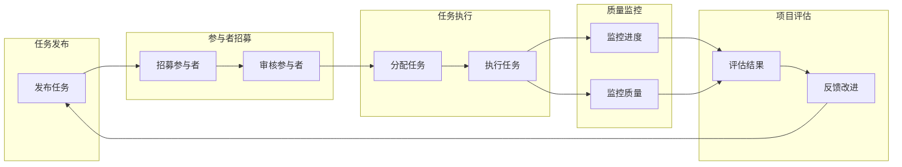

                 

### 《众包的力量：如何利用集体智慧解决问题》

> **关键词：** 众包，集体智慧，集体智慧原理，众包平台，众包案例分析，众包实践。

> **摘要：** 本文章旨在探讨众包的概念、原理及其在现代科技和社会治理中的应用。通过分析集体智慧的优势与挑战，介绍主流众包平台，设计众包项目，并解析成功案例，文章旨在帮助读者理解如何利用集体智慧解决问题，提高创新能力和效率。

### 《众包的力量：如何利用集体智慧解决问题》目录大纲

#### 第一部分：众包的概述

##### 第1章：众包的概念与背景
- **1.1 众包的定义与起源**
- **1.2 众包的发展历程**
- **1.3 众包的类型与应用领域**

##### 第2章：集体智慧的力量
- **2.1 集体智慧的原理**
- **2.2 集体智慧的优势与挑战**
- **2.3 集体智慧的研究现状与趋势**

#### 第二部分：众包平台与实践

##### 第3章：众包平台概述
- **3.1 主流众包平台介绍**
- **3.2 众包平台的构建要素**
- **3.3 众包平台的运营与管理**

##### 第4章：众包项目设计
- **4.1 众包项目需求分析**
- **4.2 众包项目方案设计**
- **4.3 众包项目的风险评估与应对**

##### 第5章：众包项目的执行与监控
- **5.1 众包项目的任务分配与执行**
- **5.2 众包项目的进度监控与反馈**
- **5.3 众包项目的质量保证与优化**

##### 第6章：众包项目的评估与优化
- **6.1 众包项目的效果评估方法**
- **6.2 众包项目的成本效益分析**
- **6.3 众包项目的持续优化策略**

##### 第7章：众包与未来
- **7.1 众包的未来发展趋势**
- **7.2 众包在社会治理中的应用**
- **7.3 众包在技术创新中的角色**

#### 第三部分：众包案例分析

##### 第8章：众包成功案例解析
- **8.1 案例一：InnoCentive的众包创新**
- **8.2 案例二：crowdspring的创意设计众包**
- **8.3 案例三：Amaze的物流优化众包**

##### 第9章：众包实践中的挑战与解决
- **9.1 众包实践中的问题与挑战**
- **9.2 案例分析：如何克服众包实践中的难题**
- **9.3 众包实践中的法律法规问题与应对**

#### 附录

##### 附录A：众包工具与技术
- **A.1 主流众包工具介绍**
- **A.2 众包技术的应用场景**

##### 附录B：参考文献
- **B.1 众包相关书籍推荐**
- **B.2 众包研究论文推荐**

##### 附录C：众包流程图
- **C.1 众包流程Mermaid流程图**

### 第一部分：众包的概述

#### **第1章：众包的概念与背景**

##### **1.1 众包的定义与起源**

**众包**（Crowdsourcing）是指通过互联网和社交媒体平台，将特定任务或问题分配给广大公众或特定群体来完成的一种合作模式。其核心在于利用集体智慧和资源，实现个人或组织无法单独完成的任务。

众包的起源可以追溯到20世纪初。当时，设计师雷蒙德·罗维（Raymond Loewy）采用了一种类似众包的方法来设计产品。他通过向公众征集设计方案，最终选择最佳的创意进行商业化生产。这种做法开创了众包的先河。

进入21世纪，随着互联网的普及和社交媒体的发展，众包得到了更广泛的应用。2006年，雷恩·布洛（Jeff Howe）在《连线》杂志上首次提出了“众包”这一概念，并将其定义为一种新的工作方式。随后，众包逐渐成为一种重要的合作模式，广泛应用于创意设计、科技创新、知识问答和社会治理等领域。

##### **1.2 众包的发展历程**

**众包**的发展历程可以分为三个阶段：

1. **早期众包（2006年以前）**：这一阶段的众包主要是基于传统的方式，如设计竞赛、悬赏等。代表性的平台包括InnoCentive，它是一个针对复杂科学和工程问题的众包平台。

2. **成熟期众包（2006-2010年）**：随着互联网的普及，众包开始广泛应用到各个领域。2006年，crowdspring成立，为创意设计提供了众包服务。同时，Kaggle等数据科学竞赛平台也逐渐崭露头角。

3. **现代众包（2010年至今）**：这一阶段的众包不仅限于创意设计、科技创新，还扩展到知识问答、物流优化、社会治理等领域。代表性的平台包括Amazon Mechanical Turk、Topcoder等。

##### **1.3 众包的类型与应用领域**

**众包**可以分为以下几种类型：

1. **创意设计众包**：将产品设计、品牌设计等创意任务分配给广大参与者，以获取最佳的创意解决方案。应用领域包括广告、影视、游戏等。

2. **科技创新众包**：将复杂科学和工程问题分配给全球科研人员，通过众包的方式加速科技创新。应用领域包括生物医药、环境科学、能源等。

3. **知识问答众包**：将特定问题分配给广大知识工作者，以获取高质量的答案。应用领域包括教育、法律、医学等。

4. **社会治理众包**：将社会治理问题分配给公众，以共同解决社会问题。应用领域包括环境保护、公益慈善、城市规划等。

5. **物流优化众包**：将物流配送任务分配给广大司机或物流公司，以实现物流配送的优化。应用领域包括电子商务、物流公司等。

通过以上分析，我们可以看到众包作为一种创新的合作模式，已经在多个领域得到广泛应用。接下来，我们将进一步探讨集体智慧的力量及其在众包中的应用。

### **第2章：集体智慧的力量**

#### **2.1 集体智慧的原理**

**集体智慧**（Collective Intelligence）是指群体成员通过协同工作，利用个体知识、经验和技能来解决问题的智慧过程。集体智慧的原理可以从以下几个方面来理解：

1. **个体知识与经验共享**：群体成员通过共享个体知识和经验，形成了一个庞大的知识库。这使得群体能够处理更为复杂的问题，并且能够从不同角度思考问题，提高解决问题的效率。

2. **协同工作**：群体成员之间的协同工作使得每个人都能专注于自己擅长的领域，从而实现资源的最优配置。同时，协同工作还可以激发成员之间的灵感碰撞，促进创新思维的产生。

3. **多样性**：群体成员的多样性是集体智慧的重要基础。多样性包括知识、技能、文化背景等方面的差异。多样化的群体成员能够提供不同的观点和解决方案，从而增加解决问题的可能性。

4. **自组织**：集体智慧的形成过程具有一定的自组织性。群体成员通过自主组织和协调，实现了共同的目标。自组织性使得群体能够在没有中央控制的情况下，自主适应和调整，从而提高整体效率。

5. **反馈机制**：集体智慧的形成过程需要有效的反馈机制。群体成员通过反馈机制，了解自己的工作对整体目标的影响，并据此调整自己的行为。反馈机制有助于提高群体智慧的水平，并防止群体智慧陷入局部最优。

#### **2.2 集体智慧的优势与挑战**

**集体智慧**具有许多优势，但也面临一些挑战。以下是对其优势和挑战的详细探讨：

##### **优势**

1. **创新能力**：集体智慧能够汇聚群体成员的创意和智慧，产生更多的创新想法。这种创新的多样性使得群体能够在面对复杂问题时，找到更为有效的解决方案。

2. **大数据分析**：集体智慧能够处理和分析大量数据，从而发现隐藏在数据中的规律和趋势。大数据分析有助于企业或组织做出更加准确的决策，提高业务效率。

3. **降低成本**：通过众包，企业或组织可以利用广泛的公众资源来完成特定任务，从而降低成本。此外，集体智慧还可以减少对专业人才的依赖，降低人力成本。

4. **提高效率**：集体智慧使得群体成员能够专注于自己擅长的领域，从而提高整体工作效率。协同工作和多样化观点的碰撞还可以激发成员的潜能，提高工作质量。

##### **挑战**

1. **信息质量**：在众包过程中，参与者来自不同的背景和领域，其提供的信息质量可能参差不齐。如何确保信息的准确性和可靠性，是集体智慧面临的一个挑战。

2. **参与者的激励与监管**：在众包过程中，如何激励参与者积极参与，并确保他们按时完成任务，是组织者需要考虑的问题。此外，对参与者的行为进行监管，防止恶意行为，也是一项挑战。

3. **数据隐私与安全**：众包过程中涉及大量的个人信息和敏感数据，如何保护这些数据的安全和隐私，是集体智慧面临的另一个挑战。

4. **平台运营风险**：众包平台需要承担一定的运营风险，包括资金风险、法律风险等。如何在保证平台稳定运行的同时，降低运营风险，是平台管理者需要考虑的问题。

#### **2.3 集体智慧的研究现状与趋势**

**集体智慧**的研究现状和趋势可以从以下几个方面来分析：

1. **理论研究**：近年来，越来越多的研究者开始关注集体智慧的研究。研究主要集中在群体智能、协同工作、多样性、自组织等方面。这些理论研究为集体智慧的实际应用提供了理论基础。

2. **应用实践**：随着互联网和大数据技术的发展，集体智慧在实际应用中得到了广泛的应用。如创新设计众包、科技创新众包、知识问答众包等。这些实践案例展示了集体智慧在解决实际问题中的巨大潜力。

3. **未来发展**：未来，集体智慧的研究将继续深入，结合人工智能、机器学习等先进技术，提高集体智慧的分析和处理能力。此外，集体智慧还将在社会治理、环境保护、健康医疗等领域发挥重要作用。

4. **跨学科研究**：集体智慧的研究不仅涉及计算机科学、心理学、社会学等领域，还涉及经济学、管理学等多个学科。跨学科研究将有助于从不同角度理解和优化集体智慧。

通过以上分析，我们可以看到集体智慧作为一种强大的合作模式，具有广泛的应用前景和巨大的潜力。接下来，我们将进一步探讨众包平台的建设和管理。

### 第二部分：众包平台与实践

#### 第3章：众包平台概述

##### **3.1 主流众包平台介绍**

众包平台是组织和协调众包项目的核心基础设施，它们为任务发布者（需求方）和任务执行者（供应方）提供了连接和沟通的桥梁。以下是一些主流的众包平台及其特点：

1. **InnoCentive**：InnoCentive是一个专注于解决科学和工程难题的众包平台。它由凯雷集团（Kohlberg Kravis Roberts）成立于1999年。平台汇集了全球各地的科学家、工程师和创新者，为企业和研究机构提供创新的解决方案。InnoCentive以其开放的创新竞赛和挑战而闻名，用户可以发布开放式的难题，并悬赏奖励成功解决问题的个人或团队。

2. **crowdspring**：crowdspring是一个提供创意设计服务的众包平台，包括标志设计、网站设计、包装设计等。平台成立于2008年，用户可以发布设计项目，并从多个设计师的作品中选择最佳方案。crowdspring的特点是提供明确的创意流程，确保设计师与需求方之间的沟通畅通。

3. **Topcoder**：Topcoder是一个针对软件开发和算法编程的众包平台，成立于2001年。Topcoder以其编程竞赛和开发项目而闻名，吸引了大量的程序员和软件开发者。平台提供各种编程挑战和开发任务，用户可以选择参与并竞标。

4. **Kaggle**：Kaggle是一个数据科学竞赛平台，成立于2010年。平台举办各种数据科学竞赛，吸引了全球的数据科学家、机器学习工程师和研究人员。用户可以在竞赛中提交自己的模型和算法，与其他参赛者竞争。

5. **Amazon Mechanical Turk**：Amazon Mechanical Turk（MTurk）是一个在线众包市场，成立于2005年。MTurk允许用户发布微型任务，如数据标注、调查问卷和在线测试等，并支付少量报酬。平台为需求方提供了一个灵活的劳动力池，为供应方提供了一个赚取额外收入的机会。

6. **Topcoder**：Topcoder是一个面向软件开发和算法编程的众包平台，提供编程竞赛和开发项目。平台成立于2001年，吸引了大量的程序员和软件开发者。用户可以选择参与编程挑战和竞标开发任务。

7. **Upwork**：Upwork是一个综合性的在线自由职业市场，提供各种众包服务，包括编程、写作、设计、数据分析和市场营销等。用户可以创建个人资料，展示自己的技能，并竞标感兴趣的项目。

##### **3.2 众包平台的构建要素**

一个成功的众包平台需要具备以下关键要素：

1. **任务管理系统**：任务管理系统是众包平台的核心组件，它负责管理任务发布、任务分配、任务跟踪和任务完成情况。任务管理系统需要具备以下功能：
   - 任务创建：允许任务发布者创建并发布任务。
   - 任务分配：根据任务需求和参与者的技能，将任务分配给合适的参与者。
   - 任务跟踪：提供实时任务状态跟踪，确保任务按时完成。
   - 任务评估：对参与者的任务完成情况进行评估，并根据评估结果进行奖励。

2. **参与者管理系统**：参与者管理系统负责管理参与者的注册、认证、评估和奖励。主要功能包括：
   - 参与者注册：允许参与者创建账户并注册成为平台用户。
   - 参与者认证：对参与者的身份和技能进行认证，确保任务的质量。
   - 参与者评估：根据参与者的表现和任务完成情况，进行评估和排名。
   - 奖励机制：设计合理的奖励机制，激励参与者积极参与和高质量完成任务。

3. **数据处理与分析系统**：数据处理与分析系统负责收集和分析众包项目中的大量数据，提供决策支持。主要功能包括：
   - 数据收集：从任务执行过程中收集关键数据，如任务完成时间、错误率、用户反馈等。
   - 数据分析：利用数据分析工具，对收集的数据进行统计和分析，发现问题和改进机会。
   - 数据可视化：将分析结果以图表、报表等形式展示，帮助任务发布者和参与者了解任务完成情况和项目进展。

4. **沟通与协作工具**：众包项目通常涉及多个参与者和任务，沟通与协作工具对于项目成功至关重要。主要功能包括：
   - 实时聊天：提供即时沟通工具，如聊天室、私信等，确保参与者能够及时交流。
   - 文档共享：允许参与者共享和协作编辑文档、代码和设计方案。
   - 视频会议：提供在线视频会议功能，方便参与者进行远程会议和讨论。

5. **用户界面与用户体验**：一个良好的用户界面和用户体验对于众包平台至关重要。用户界面需要简洁直观，易于操作，同时提供丰富的功能。用户体验则需要考虑参与者的需求和习惯，确保他们能够轻松地完成任务和获得奖励。

##### **3.3 众包平台的运营与管理**

运营和管理众包平台是一个复杂的过程，需要考虑多个方面：

1. **平台战略**：制定明确的平台战略，明确平台的定位、目标用户群体、主要服务内容等。平台战略将指导平台的发展方向和运营策略。

2. **市场推广**：通过有效的市场推广策略，吸引更多的用户和参与者加入平台。市场推广手段可以包括广告、社交媒体营销、合作伙伴关系等。

3. **用户支持**：提供优质的用户支持服务，包括用户注册指导、任务发布指导、技术支持等。良好的用户支持可以提升用户满意度和平台口碑。

4. **质量保证**：确保平台提供高质量的服务和产品。质量保证可以通过以下措施实现：
   - 任务审核：对发布的任务进行审核，确保任务的质量和可行性。
   - 参与者筛选：对参与者进行筛选和认证，确保他们的技能和信誉。
   - 反馈机制：建立反馈机制，收集用户反馈，及时处理和解决问题。

5. **风险管理**：识别和管理平台运营中的各种风险，如资金风险、法律风险、信息安全风险等。风险管理可以通过制定应急预案、加强内部监管、购买保险等措施实现。

6. **持续改进**：根据用户反馈和市场变化，不断改进平台的功能和服务，提高用户满意度和平台竞争力。

通过以上要素和运营管理策略，众包平台可以为任务发布者和参与者提供高效、便捷的服务，实现集体智慧的发挥和价值的最大化。

### **第4章：众包项目设计**

#### **4.1 众包项目需求分析**

众包项目的成功与否往往取决于项目需求分析的质量。这一阶段的核心任务是明确项目目标、理解用户需求、界定任务范围，并为后续的方案设计和项目执行打下坚实的基础。以下是对众包项目需求分析的关键步骤：

1. **明确项目目标**：项目目标是指项目希望达成的具体结果和目的。明确项目目标有助于确保所有参与者和任务发布者都朝同一个方向努力。例如，如果项目目标是设计一款新的手机应用程序，那么目标可以具体化为提升用户体验、增加用户活跃度等。

2. **理解用户需求**：用户需求是指目标用户对产品或服务的基本要求和期望。深入理解用户需求有助于确保众包项目能够满足用户的实际需求。用户需求可以通过以下几种方式收集：
   - **用户访谈**：通过面对面或在线访谈，直接从用户处获取他们的需求和反馈。
   - **问卷调查**：设计并分发问卷，收集大量用户的数据和意见。
   - **市场调研**：分析市场趋势、竞争对手和用户行为数据，了解用户需求的变化。

3. **界定任务范围**：任务范围是指项目需要完成的具体任务和活动。明确任务范围有助于避免项目范围蔓延和任务过度扩展。界定任务范围可以通过以下步骤实现：
   - **任务分解**：将大任务分解为更小的、可管理的子任务。
   - **优先级排序**：根据项目目标和用户需求，确定每个任务的优先级，确保关键任务优先执行。
   - **任务描述**：详细描述每个任务的输入、输出、依赖关系和时间要求。

4. **需求文档**：将收集到的需求信息整理成需求文档。需求文档应包含以下内容：
   - **项目目标**：明确的项目目标描述。
   - **用户需求**：详细记录用户需求和期望。
   - **任务范围**：详细的任务描述和范围界定。
   - **用户场景**：描述用户在使用产品或服务时的典型场景和行为。
   - **功能需求**：列出产品或服务的功能需求。
   - **非功能需求**：列出产品或服务的非功能需求，如性能、安全性、可维护性等。

5. **需求验证**：需求验证是确保需求文档准确性和可行性的关键步骤。需求验证可以通过以下方式进行：
   - **用户评审**：组织用户评审会议，让用户对需求文档进行评审和反馈。
   - **同行评审**：组织同行评审，让专业人士对需求文档进行审查。
   - **原型验证**：开发初步原型，通过用户测试和反馈，验证需求的可实现性和用户体验。

6. **需求管理**：需求管理是确保需求在整个项目生命周期中得到有效管理和控制的过程。需求管理包括以下活动：
   - **需求变更控制**：当需求发生变化时，需要经过严格的变更控制流程，确保变更的影响得到评估和控制。
   - **需求跟踪**：跟踪需求的状态和实现情况，确保每个需求都得到妥善处理。
   - **需求文档更新**：随着项目进展，需求文档需要定期更新，以反映项目实际情况。

通过以上步骤，众包项目需求分析可以为项目成功奠定坚实基础。接下来，我们将探讨如何设计众包项目方案。

#### **4.2 众包项目方案设计**

众包项目方案设计是确保项目顺利进行的关键环节。一个良好的方案设计能够明确项目目标、任务分配、资源利用、时间安排和风险管理，从而提高项目的成功率和效率。以下是众包项目方案设计的详细步骤：

1. **明确项目目标**：在项目方案设计阶段，需要再次明确项目目标，确保所有参与者对项目的最终目标有一致的理解。项目目标应具体、可衡量、可实现、相关性强和时间限制。

2. **选择众包模式**：根据项目需求和目标，选择适合的众包模式。常见的众包模式包括：
   - **开放众包**：任何人都可以参与，适合创意设计、知识问答等。
   - **选择式众包**：通过筛选确定参与者，适合对参与者有特定要求的任务。
   - **邀请式众包**：仅邀请特定群体参与，适合需要高度专业知识和信任的领域。
   - **反向拍卖**：参与者竞标价格，需求方选择最低报价的参与者。

3. **任务分解**：将项目目标分解为具体的任务和工作包。每个任务应具有明确的目标、输入、输出和交付物。任务分解有助于确保项目目标的实现，并便于任务分配和管理。

4. **任务分配**：根据任务的特点和参与者的技能，合理分配任务。任务分配应考虑以下因素：
   - **技能匹配**：确保每个参与者具备完成任务所需的知识和技能。
   - **工作负荷**：平衡参与者的工作负荷，避免过度负担。
   - **协同效应**：考虑任务之间的依赖关系，确保协同工作的顺利进行。

5. **制定时间计划**：根据任务分解和时间要求，制定详细的时间计划。时间计划应包括每个任务的开始时间、结束时间和持续时间，并考虑任务之间的依赖关系。

6. **资源规划**：确定项目所需的资源，包括人力、资金、设备和技术。资源规划应考虑资源的可用性、成本和效率，确保资源得到充分利用。

7. **风险管理**：识别项目可能面临的风险，并制定相应的应对策略。常见风险包括任务执行延误、参与者流失、信息泄露等。风险管理包括风险识别、评估、规划和监控。

8. **奖励机制设计**：根据任务完成情况和项目目标，设计合理的奖励机制。奖励机制应激励参与者积极参与，确保任务的高质量完成。常见的奖励机制包括：
   - **固定奖金**：根据任务完成情况支付固定奖金。
   - **绩效奖金**：根据任务完成的质量和效率支付额外奖金。
   - **积分奖励**：通过积分制度激励参与者参与更多任务。

9. **沟通与协作机制**：确保项目参与者之间良好的沟通和协作。沟通和协作机制可以包括：
   - **定期会议**：定期召开会议，更新项目进展，解决遇到的问题。
   - **即时通讯**：使用即时通讯工具，如Slack或Telegram，进行实时沟通。
   - **文档共享**：使用共享文档平台，如Google Docs或Confluence，共享项目文件和资料。

10. **评估与反馈**：设计评估和反馈机制，用于评估项目成果和参与者表现。评估和反馈应透明、公正，有助于项目持续改进。

通过以上步骤，可以设计出一份详细、可行的众包项目方案，确保项目的顺利执行和目标实现。接下来，我们将探讨众包项目的风险评估与应对策略。

#### **4.3 众包项目的风险评估与应对**

在众包项目的执行过程中，风险是不可忽视的重要因素。合理评估和管理风险，有助于降低项目失败的可能性，提高项目的成功率。以下是众包项目的风险评估与应对策略：

1. **风险识别**：
   - **任务执行风险**：参与者可能因为技能不足、时间安排不合理等原因，无法按时完成任务。
   - **信息泄露风险**：众包过程中涉及敏感数据，可能存在数据泄露的风险。
   - **参与者流失风险**：项目周期较长或任务难度较大时，参与者可能中途退出。
   - **平台运营风险**：平台可能面临技术故障、资金短缺等运营风险。
   - **法律和合规风险**：众包项目可能涉及法律法规问题，如知识产权、劳动法等。

2. **风险评估**：
   - **定性评估**：使用风险矩阵等工具，对风险发生的可能性及其影响进行定性评估。
   - **定量评估**：使用数学模型或统计方法，对风险的概率和影响进行定量评估。
   - **风险优先级排序**：根据风险评估结果，对风险进行优先级排序，重点关注高优先级风险。

3. **风险应对策略**：
   - **风险规避**：通过调整项目计划或任务分配，避免风险的发生。例如，通过增加任务完成时间或提高参与者的门槛，减少任务执行风险。
   - **风险减轻**：采取措施降低风险发生的可能性或减轻其影响。例如，通过加强平台的安全防护措施，减轻信息泄露风险。
   - **风险转移**：通过保险或其他方式，将风险转移给第三方。例如，为平台运营购买保险，减轻运营风险。
   - **风险接受**：对于无法规避或减轻的风险，制定应急预案和应对措施，确保项目能够继续进行。例如，对于参与者流失风险，制定替补方案，确保任务能够顺利完成。

4. **风险监控与应对**：
   - **建立风险监控机制**：定期评估项目风险，及时发现和处理潜在问题。
   - **风险预警**：设置风险预警指标，一旦达到预警条件，立即采取应对措施。
   - **应急响应**：制定详细的应急预案，确保在风险事件发生时，能够迅速响应和处理。

通过以上风险评估与应对策略，可以有效降低众包项目中的风险，提高项目的成功率。接下来，我们将探讨众包项目的执行与监控。

### **第5章：众包项目的执行与监控**

#### **5.1 众包项目的任务分配与执行**

众包项目的成功执行离不开有效的任务分配和执行管理。任务分配是指将项目中的各项任务合理地分配给参与者，以确保任务能够按时、高质量地完成。以下是任务分配与执行的关键步骤：

1. **任务分配策略**：
   - **技能匹配**：根据参与者的技能和专长，将任务分配给最适合完成该任务的参与者。确保每位参与者都能在自身擅长的领域发挥作用。
   - **工作量平衡**：合理分配任务，避免个别参与者承担过多的工作量，确保整体工作负荷平衡。
   - **团队协作**：对于复杂任务，可以考虑组建跨职能团队，实现团队成员之间的协作和互补。

2. **任务执行监控**：
   - **进度跟踪**：建立任务进度跟踪机制，确保任务按照计划进行。可以通过在线任务管理工具，如Trello或Asana，实时更新任务状态。
   - **质量监控**：设定质量标准，定期检查任务完成情况，确保任务质量符合预期。质量监控可以通过阶段性审查或交付物评审实现。
   - **反馈机制**：建立有效的反馈机制，让任务发布者及时了解任务进展和质量，对存在的问题进行及时调整。

3. **任务执行管理**：
   - **沟通与协作**：确保参与者在任务执行过程中能够进行有效的沟通和协作。可以使用即时通讯工具，如Slack或Microsoft Teams，促进团队成员之间的交流。
   - **资源管理**：确保参与者能够及时获取完成任务所需的资源，如数据、工具和文档。资源管理可以通过共享平台，如Google Drive或Dropbox，实现资源的集中管理。

#### **5.2 众包项目的进度监控与反馈**

进度监控与反馈是确保众包项目按计划顺利进行的重要环节。以下是如何进行进度监控和反馈的详细方法：

1. **进度监控**：
   - **制定进度计划**：在项目启动时，制定详细的进度计划，明确各阶段的任务和时间节点。进度计划应包括关键路径任务和松弛时间，以确保项目按时完成。
   - **实时监控**：利用在线任务管理工具，如JIRA或Trello，实时监控任务进度。通过这些工具，任务发布者可以及时了解任务的完成情况，发现潜在的问题。
   - **定期审查**：定期进行进度审查，检查项目是否按计划进行。进度审查可以通过定期会议或进度报告进行。

2. **反馈机制**：
   - **及时反馈**：建立及时反馈机制，让任务发布者能够及时了解任务进展和质量。可以通过在线讨论、邮件或即时通讯工具进行反馈。
   - **双向沟通**：确保任务发布者和参与者之间的沟通是双向的，参与者能够提出问题和建议，任务发布者能够及时响应。
   - **问题解决**：对于发现的问题，应及时采取措施解决。可以通过团队协作和问题跟踪工具，如Confluence或JIRA，记录和跟踪问题的解决过程。

#### **5.3 众包项目的质量保证与优化**

确保众包项目的质量是项目成功的关键。以下是如何进行质量保证和优化的方法：

1. **质量保证**：
   - **制定质量标准**：在项目启动时，制定明确的质量标准，包括任务完成的时间、质量要求等。质量标准应具体、可操作、可衡量。
   - **质量检查**：定期对任务完成情况进行质量检查，确保任务符合质量标准。质量检查可以通过自动化工具或人工审查进行。
   - **用户评价**：建立用户评价机制，让参与者对任务的完成情况进行评价。用户评价可以作为质量评估的参考。

2. **优化策略**：
   - **持续改进**：通过不断收集用户反馈和项目数据，识别项目中存在的问题，并采取措施进行改进。持续改进可以提升项目的整体质量。
   - **流程优化**：优化任务分配、任务执行和任务监控的流程，提高工作效率和任务完成质量。流程优化可以通过流程图和流程分析工具实现。
   - **技术创新**：利用先进的技术，如人工智能和机器学习，提高任务执行和监控的效率和质量。例如，通过自然语言处理技术，提高任务描述的准确性，通过自动化工具，减少人工干预。

通过以上方法，可以有效保证众包项目的质量，并持续优化项目流程，提高项目的整体效率。接下来，我们将探讨如何评估和优化众包项目。

### **第6章：众包项目的评估与优化**

#### **6.1 众包项目的效果评估方法**

众包项目的效果评估是确保项目目标实现和持续改进的重要环节。以下是一些常用的效果评估方法：

1. **定性评估**：
   - **用户满意度调查**：通过问卷调查、访谈等方式，收集用户对项目成果的满意度。用户满意度可以反映项目是否符合用户需求。
   - **参与者反馈**：收集参与者在任务执行过程中的反馈，了解他们的体验和感受。参与者反馈可以揭示项目中的问题，为改进提供依据。
   - **专家评审**：邀请相关领域的专家对项目成果进行评审，评估项目的质量和创新性。

2. **定量评估**：
   - **指标体系**：建立一套完整的指标体系，用于评估项目效果。常见的指标包括任务完成率、任务完成时间、错误率、成本效益等。
   - **数据分析**：通过数据收集和分析工具，对项目数据进行统计和分析，评估项目效果。数据分析可以揭示项目中的趋势和问题。
   - **绩效指标**：根据项目目标和任务要求，设定具体的绩效指标，如任务完成率、任务质量等。绩效指标可以量化评估项目的效果。

3. **综合评估**：
   - **多维度评估**：结合定性评估和定量评估，从多个维度评估项目效果。例如，既评估用户满意度，又评估任务完成率和成本效益。
   - **KPI评估**：设定关键绩效指标（KPI），根据KPI评估项目的关键绩效指标。KPI应与项目目标密切相关，能够准确反映项目效果。

#### **6.2 众包项目的成本效益分析**

成本效益分析是评估众包项目经济可行性的重要方法。以下是如何进行成本效益分析的步骤：

1. **成本计算**：
   - **直接成本**：包括任务发布费用、参与者奖励、平台运营成本等。
   - **间接成本**：包括管理成本、风险成本、培训成本等。
   - **固定成本**：在项目生命周期内不随任务数量变化的成本，如平台开发成本、技术支持成本等。
   - **可变成本**：随任务数量变化的成本，如参与者奖励、数据处理成本等。

2. **效益评估**：
   - **直接效益**：包括任务完成后的直接收益，如产品销售额、成本节约等。
   - **间接效益**：包括品牌提升、市场拓展、技术创新等。
   - **长期效益**：评估项目对组织长期发展的影响，如提高创新能力、建立良好声誉等。

3. **成本效益分析**：
   - **成本效益比**：计算成本与效益的比值，评估项目的经济效益。成本效益比越高，项目的经济效益越好。
   - **净现值（NPV）**：计算项目的净现值，评估项目的投资回报率。净现值越高，项目的投资回报率越高。
   - **内部收益率（IRR）**：计算项目的内部收益率，评估项目的投资回报率。内部收益率越高，项目的投资回报率越高。

通过以上步骤，可以全面评估众包项目的经济可行性，为项目的持续优化提供依据。

#### **6.3 众包项目的持续优化策略**

持续优化是确保众包项目长期成功的关键。以下是一些常见的持续优化策略：

1. **收集用户反馈**：
   - **定期反馈**：定期收集用户对项目成果的反馈，了解用户的需求和满意度。
   - **实时反馈**：建立实时反馈机制，如在线问卷调查、用户论坛等，及时了解用户的需求变化。

2. **改进任务分配**：
   - **技能匹配**：优化任务分配策略，确保参与者能够在其擅长的领域发挥作用。
   - **工作量平衡**：合理分配任务，避免个别参与者过度负担。

3. **提高平台效率**：
   - **自动化**：利用自动化工具，提高任务管理和执行的效率。
   - **优化流程**：持续优化项目流程，减少不必要的环节，提高工作效率。

4. **加强质量管理**：
   - **质量标准**：制定明确的任务质量标准，确保任务符合预期。
   - **质量监控**：建立质量监控机制，定期检查任务完成情况，确保任务质量。

5. **激励机制**：
   - **奖励机制**：优化奖励机制，激励参与者积极参与和高质量完成任务。
   - **积分制度**：建立积分制度，鼓励参与者参与更多任务，提升整体任务质量。

6. **技术创新**：
   - **人工智能**：利用人工智能技术，提高任务执行和监控的效率和质量。
   - **机器学习**：应用机器学习算法，优化任务分配和质量管理。

通过以上策略，可以持续优化众包项目，提高项目成功率，实现长期可持续发展。

### **第7章：众包成功案例解析**

#### **8.1 案例一：InnoCentive的众包创新**

**背景**：InnoCentive是一个成立于1999年的众包平台，专注于解决科学和工程难题。其目标是通过众包的方式，汇聚全球智慧和资源，为企业和研究机构提供创新的解决方案。

**创新成果**：InnoCentive平台上发布的挑战涵盖了生物技术、化学、材料科学、环境保护等多个领域。以下是一些成功的案例：

1. **生物技术的创新**：某制药公司通过InnoCentive发布了一个关于新药研发的挑战，最终收到了数百个创意和解决方案。其中，一个名为“CoronaVaccine”的方案被成功实施，为抗击病毒做出了重要贡献。

2. **环境保护的挑战**：InnoCentive平台上发布的一个关于海洋污染问题的挑战，吸引了全球环保专家和科研人员的关注。通过众包，平台成功找到了一种新的、高效的海洋污染物处理方法，对环境保护产生了积极影响。

**众包模式**：InnoCentive采用开放式的众包模式，任何人都可以参与挑战。平台通过设立奖励机制，激励参与者提交高质量的解决方案。具体流程如下：

1. **挑战发布**：需求方在InnoCentive平台上发布挑战，明确挑战的背景、目标和奖励金额。

2. **方案提交**：全球参与者浏览挑战，根据自身专长和兴趣提交解决方案。

3. **评审与奖励**：InnoCentive组织专家对提交的方案进行评审，根据评审结果发放奖金。

通过InnoCentive，企业和研究机构能够迅速获取创新方案，提高研发效率，同时也能够激发全球科研人员的创新潜力。

#### **8.2 案例二：crowdspring的创意设计众包**

**背景**：crowdspring是一个成立于2008年的创意设计众包平台，提供包括标志设计、网站设计、包装设计等在内的多种设计服务。平台旨在通过众包的方式，为企业提供高质量的设计解决方案。

**设计创意成果**：crowdspring平台上已经完成了数千个设计项目，以下是一些成功的案例：

1. **品牌重塑**：一家初创公司通过crowdspring进行品牌重塑，收到了数百个设计方案。最终，一个简洁而富有现代感的设计方案脱颖而出，成功提升了公司的品牌形象。

2. **包装设计**：一家食品公司通过crowdspring设计了一款新的产品包装，收到了多个具有创新性的设计方案。最终，一个具有视觉冲击力的设计方案被采纳，有效提升了产品的市场竞争力。

**众包实践**：crowdspring的众包实践具有以下特点：

1. **明确的创意流程**：crowdspring为设计项目提供了一个明确的创意流程，从需求分析、方案征集、评审到最终选择，确保每个环节都得到有效管理。

2. **多样化的参与者**：crowdspring吸引了全球范围内的设计师参与，确保了设计方案的多样性和质量。

3. **透明的评审过程**：crowdspring建立了透明的评审过程，让需求方能够清晰地了解每个设计方案的优缺点，并做出最佳选择。

通过crowdspring，企业能够快速获取高质量的设计创意，降低设计成本，同时也能够激发设计师的创造力。

#### **8.3 案例三：Amaze的物流优化众包**

**背景**：Amaze是一个专注于物流优化和运输管理的公司，通过众包的方式，利用广泛的运输资源，为电商和物流公司提供高效的物流解决方案。

**物流优化成果**：Amaze通过众包，成功实现了以下物流优化成果：

1. **配送时间缩短**：通过众包的方式，Amaze整合了大量的配送资源，实现了配送时间的显著缩短。以某电商平台的配送为例，通过众包，配送时间从原来的3天缩短到1天。

2. **成本节约**：Amaze通过优化配送路线和资源配置，实现了物流成本的显著节约。以某物流公司的优化项目为例，通过众包，运输成本降低了20%。

**众包策略**：Amaze的众包策略具有以下特点：

1. **灵活的任务分配**：Amaze采用了灵活的任务分配策略，根据配送需求，将任务分配给最合适的运输资源。这种策略提高了任务的响应速度和效率。

2. **实时监控与反馈**：Amaze建立了实时监控与反馈机制，对配送任务进行全程跟踪，确保任务按时完成。同时，通过收集反馈信息，不断优化配送流程。

3. **奖励机制**：Amaze设计了合理的奖励机制，激励参与者积极参与和高质量完成任务。奖励机制包括即时奖励和长期激励，如绩效奖金和积分奖励。

通过Amaze的众包实践，电商和物流公司能够实现物流优化，提高配送效率，降低物流成本，从而提升整体竞争力。

### **第8章：众包实践中的挑战与解决**

#### **9.1 众包实践中的问题与挑战**

尽管众包具有许多优势，但在实际应用中仍面临一系列问题和挑战。以下是对这些问题和挑战的详细探讨：

1. **信息质量**：众包过程中，参与者来自不同的背景和领域，其提供的信息质量可能参差不齐。如何确保信息的准确性和可靠性，是众包实践中的一个重要挑战。

2. **参与者的激励与监管**：众包项目通常涉及多个参与者，如何激励他们积极参与并高质量完成任务，是一个关键问题。此外，如何对参与者进行有效监管，防止欺诈和恶意行为，也是众包实践中的一个挑战。

3. **数据隐私与安全**：众包过程中涉及大量的个人信息和敏感数据，如何保护这些数据的安全和隐私，是另一个重要挑战。

4. **平台运营风险**：众包平台需要承担一定的运营风险，包括资金风险、法律风险等。如何在保证平台稳定运行的同时，降低运营风险，是平台管理者需要考虑的问题。

5. **任务分配与协调**：在众包项目中，如何合理分配任务，确保任务的高效执行，是一个重要挑战。任务分配不当可能导致资源浪费、任务延误等问题。

6. **法律和合规问题**：众包实践可能涉及法律法规问题，如知识产权、劳动法等。如何确保众包活动符合法律法规要求，是众包实践中的一个挑战。

#### **9.2 案例分析：如何克服众包实践中的难题**

以下通过具体案例，分析如何克服众包实践中的难题：

1. **案例一：信息质量**：

**背景**：某电商平台通过众包的方式，收集用户对产品服务的反馈。

**问题**：由于参与者背景不同，收集到的反馈信息质量参差不齐，部分信息不准确或有误导性。

**解决方案**：

- **筛选机制**：建立严格的筛选机制，对参与者的背景和资质进行审查，确保提供反馈的参与者具备相关经验和知识。
- **双重验证**：引入双重验证机制，对收集到的反馈信息进行交叉验证，提高信息准确性。
- **数据清洗**：利用数据清洗技术，对收集到的数据进行清洗和去重，去除不准确或有误导性的信息。

2. **案例二：参与者的激励与监管**：

**背景**：某设计众包平台，参与者积极性不高，任务完成质量不理想。

**问题**：参与者的激励不足，缺乏有效的监管机制。

**解决方案**：

- **奖励机制**：设计合理的奖励机制，包括即时奖励和长期激励，如绩效奖金、积分奖励等，提高参与者的积极性。
- **绩效考核**：建立绩效考核体系，对参与者的任务完成情况进行评估，并根据评估结果进行奖惩。
- **实时监控**：利用在线监控工具，对参与者的任务执行过程进行实时监控，确保任务按时高质量完成。
- **社区管理**：建立社区管理机制，鼓励参与者之间的互动和协作，提高任务完成质量。

3. **案例三：数据隐私与安全**：

**背景**：某企业通过众包的方式，收集用户隐私数据，用于市场分析和产品优化。

**问题**：数据隐私和安全问题，如何确保收集到的数据不会泄露或被滥用。

**解决方案**：

- **数据加密**：采用数据加密技术，对收集到的数据进行加密处理，确保数据在传输和存储过程中的安全。
- **访问控制**：建立严格的访问控制机制，确保只有授权人员才能访问敏感数据。
- **隐私政策**：制定明确的隐私政策，告知用户数据的收集、使用和存储方式，提高用户的隐私保护意识。
- **数据匿名化**：对收集到的数据进行匿名化处理，确保用户隐私不被泄露。

4. **案例四：平台运营风险**：

**背景**：某众包平台面临资金短缺、法律纠纷等问题。

**问题**：平台运营风险，如何确保平台的稳定运行和可持续发展。

**解决方案**：

- **风险管理**：建立完善的风险管理机制，包括风险识别、评估、规划和监控，确保平台运营风险得到有效控制。
- **资金储备**：建立资金储备，以应对可能出现的资金短缺问题。
- **法律咨询**：聘请专业法律顾问，确保平台运营符合法律法规要求。
- **持续改进**：根据用户反馈和市场变化，持续改进平台功能和服务，提高用户满意度。

通过以上案例分析，可以看到，通过合理的解决方案，众包实践中的问题和挑战可以得到有效克服，从而提高众包项目的成功率。

#### **9.3 众包实践中的法律法规问题与应对**

在众包实践中，遵守法律法规是确保项目合法合规的重要保障。以下是对众包实践中的法律法规问题及应对策略的详细探讨：

1. **知识产权问题**：

**问题**：在众包项目中，如何确保参与者的作品不侵犯他人的知识产权。

**应对策略**：

- **版权声明**：在项目开始前，要求参与者签署版权声明，明确作品的所有权和使用权。
- **知识产权审查**：对参与者的作品进行知识产权审查，确保其不侵犯他人的知识产权。
- **违约责任**：制定违约责任条款，明确如果参与者的作品侵犯他人知识产权，需承担的责任。

2. **劳动法问题**：

**问题**：在众包项目中，如何确保参与者的权益，避免违反劳动法。

**应对策略**：

- **参与协议**：与参与者签订明确的参与协议，明确参与者的权益和责任。
- **合法雇佣**：确保参与者的身份和雇佣关系符合当地法律法规要求，避免违反劳动法。
- **培训与支持**：为参与者提供必要的培训和技能支持，确保他们具备完成任务所需的技能和知识。

3. **数据保护法问题**：

**问题**：在众包项目中，如何保护参与者的个人信息和数据安全。

**应对策略**：

- **隐私政策**：制定详细的隐私政策，告知参与者个人信息的收集、使用和存储方式。
- **数据加密**：采用数据加密技术，确保参与者的个人信息在传输和存储过程中的安全。
- **访问控制**：建立严格的访问控制机制，确保只有授权人员才能访问敏感数据。

4. **法律法规合规性**：

**问题**：如何在跨国众包项目中确保遵守不同国家和地区的法律法规。

**应对策略**：

- **法律法规咨询**：聘请专业法律顾问，了解不同国家和地区的法律法规，确保项目合法合规。
- **跨文化沟通**：建立跨文化沟通机制，确保项目团队了解和尊重不同文化背景的法律要求。
- **本地化策略**：针对不同国家和地区，制定本地化的运营策略，确保项目符合当地的法律法规要求。

通过以上法律法规问题的应对策略，可以有效保障众包实践的合法性，降低法律风险，确保项目的顺利进行。

### **附录A：众包工具与技术**

#### **A.1 主流众包工具介绍**

众包工具是组织和执行众包项目的关键组成部分。以下介绍几种主流的众包工具，包括其功能与特点：

1. **InnoCentive**：
   - **功能**：InnoCentive是一个专业的科学和工程难题众包平台，允许用户发布挑战，并悬赏奖励成功的解决方案。
   - **特点**：专业性强，涵盖多个领域，提供明确的奖励机制，吸引全球的科研人员和创新者。

2. **crowdspring**：
   - **功能**：crowdspring专注于创意设计领域的众包，包括标志设计、网站设计、广告创意等。
   - **特点**：提供多样化的设计方案，透明的评审过程，确保设计质量。

3. **Topcoder**：
   - **功能**：Topcoder是一个编程和算法编程的众包平台，提供编程挑战、开发项目和竞赛。
   - **特点**：吸引全球顶尖的程序员，提供高水平的算法竞赛和开发项目。

4. **Kaggle**：
   - **功能**：Kaggle是一个数据科学竞赛平台，允许用户参与各种数据科学竞赛，并提交自己的模型。
   - **特点**：数据科学社区活跃，提供丰富的数据集和工具，鼓励创新和竞争。

5. **Amazon Mechanical Turk（MTurk）**：
   - **功能**：MTurk是一个在线众包市场，提供各种微型任务，如数据标注、用户调查、在线测试等。
   - **特点**：任务种类丰富，灵活的劳动力市场，适合大规模的、简单的众包任务。

6. **Upwork**：
   - **功能**：Upwork是一个综合性的在线自由职业市场，提供各种类型的众包服务，包括编程、设计、写作等。
   - **特点**：全球范围的自由职业者，丰富的项目类型，灵活的合同模式。

7. **CrowdFlower**：
   - **功能**：CrowdFlower专注于数据标注和众包数据服务，提供高质量的数据标注解决方案。
   - **特点**：专注于数据标注任务，提供高质量的标注结果，适用于机器学习和人工智能项目。

#### **A.2 众包技术的应用场景**

众包技术在多个领域有广泛的应用，以下探讨其在数据分析、人工智能和机器学习等领域的应用场景：

1. **数据分析**：
   - **应用场景**：数据分析领域的众包可以用于数据清洗、数据标注和数据分析。
   - **具体应用**：例如，通过众包平台收集用户评价数据，进行数据标注和分类，用于构建推荐系统或分析市场趋势。

2. **人工智能**：
   - **应用场景**：人工智能领域的众包可以用于算法优化、模型训练和图像识别。
   - **具体应用**：例如，在图像识别任务中，通过众包平台收集大量图像数据，进行标注和训练，提高模型的准确性和泛化能力。

3. **机器学习**：
   - **应用场景**：机器学习领域的众包可以用于数据集构建、模型测试和模型优化。
   - **具体应用**：例如，在构建机器学习模型时，通过众包平台收集标注数据，进行数据集构建和模型测试，确保模型的可靠性和鲁棒性。

4. **知识问答**：
   - **应用场景**：知识问答领域的众包可以用于问题解答、知识整理和问答社区建设。
   - **具体应用**：例如，在构建问答社区时，通过众包平台吸引用户参与，提出问题和解答问题，形成知识共享和互动社区。

5. **社会治理**：
   - **应用场景**：社会治理领域的众包可以用于数据收集、问题调查和社会参与。
   - **具体应用**：例如，在环境保护项目中，通过众包平台收集环境数据，进行调查和监测，提高社会治理的效率和效果。

通过众包工具和技术的应用，可以在各个领域实现资源的共享和协同创新，提高工作效率和创新能力。接下来，我们将进一步探讨众包技术在实际项目中的应用。

### **附录B：参考文献**

#### **B.1 众包相关书籍推荐**

1. **《众包：开启协作式创新》**（Crowdsourcing: How and Why Companies Use the Wisdom of Customers to Flourish in the Global Economy）
   - 作者：Jeane A. Baughman
   - 内容简介：本书详细介绍了众包的概念、应用场景和商业价值，探讨了如何通过众包实现协作式创新。

2. **《众包实战：如何通过众包实现创新和商业成功》**（Crowdsourcing for Dummies）
   - 作者：Jennifers D. Keil and Heather McGuire
   - 内容简介：本书针对初学者，详细介绍了众包的基本概念、实施步骤和最佳实践，提供了丰富的案例和实用技巧。

3. **《众包思维：如何借助大众智慧解决复杂问题》**（The Crowdsourcing Mindset: Innovation, Wisdom, and Success in the Connected Age）
   - 作者：Jeff Howe
   - 内容简介：本书探讨了众包思维的核心原则，如何借助大众智慧解决复杂问题，提高创新能力和效率。

4. **《众包与协作：从创意到商业成功的路径》**（Crowdsourcing and Collaboration: Pathways to Business Success）
   - 作者：Jonas Persson and Erik Simula
   - 内容简介：本书详细介绍了众包和协作的概念、应用场景和商业价值，提供了具体的实施步骤和案例分析。

#### **B.2 众包研究论文推荐**

1. **“Crowdsourcing as a Paradigm: Mapping the Field”**（2012）
   - 作者：Thomas W. Malone
   - 摘要：本文探讨了众包作为一种新型工作方式的发展现状和未来趋势，分析了众包在不同领域的应用和挑战。

2. **“Crowdsourcing: A Review and Analysis”**（2013）
   - 作者：Silvia T. Galesic and Lise M. Järvelin
   - 摘要：本文对众包进行了全面综述和分析，从理论基础、应用领域、挑战和未来发展方向等方面进行了探讨。

3. **“Crowdsourcing Creativity and Innovation”**（2016）
   - 作者：David M. Siegel and Richard L. Daft
   - 摘要：本文探讨了众包在创意和创新能力提升方面的作用，分析了众包如何激发创新思维和提升企业竞争力。

4. **“The Impact of Crowdsourcing on Knowledge Management”**（2018）
   - 作者：Wei Li, Ying-Feng Lin, and Yu-Wei Chen
   - 摘要：本文分析了众包对知识管理的影响，探讨了众包如何促进知识的共享、传播和创新。

5. **“Legal Issues in Crowdsourcing: An Overview”**（2020）
   - 作者：Ana Beatriz de Carvalho, Jorge Machado, and Catarina S. Morais
   - 摘要：本文对众包中的法律法规问题进行了综述，分析了知识产权、劳动法、数据隐私等方面的法律挑战和应对策略。

通过以上书籍和论文，读者可以深入了解众包的理论和实践，掌握众包的关键概念和技术，为实际项目的实施提供指导。接下来，我们将展示众包流程的Mermaid流程图。

### **附录C：众包流程图**

以下是一个简单的众包流程图，用于展示众包项目从任务发布到任务完成的各个阶段：

这个流程图展示了众包项目的核心环节，包括任务发布、参与者招募、任务执行、质量监控和项目评估。通过这个流程图，可以帮助读者更好地理解众包项目的运作过程，以及各个环节之间的关联和相互作用。接下来，我们将对文章进行总结。

### **总结**

本文从多个角度探讨了众包的概念、原理、平台、项目设计和实践中的挑战。首先，我们明确了众包的定义与背景，了解了集体智慧的力量及其优势与挑战。接着，我们介绍了主流的众包平台及其构建要素，阐述了众包项目的需求分析、方案设计和风险评估的方法。在项目执行与监控方面，我们详细讨论了任务分配、进度监控、质量保证和优化策略。此外，通过成功案例解析，我们展示了众包在不同领域的应用和成果。最后，我们探讨了众包实践中的挑战与解决方法，以及法律法规问题。

通过本文的详细分析，读者可以全面了解众包的基本概念、原理和应用，掌握众包项目的实施方法和管理策略。众包作为一种创新的合作模式，具有广泛的应用前景和巨大的潜力。在未来的发展中，随着技术的不断进步和应用的深入，众包将在更多领域发挥重要作用，推动社会创新和进步。

### **作者信息**

作者：AI天才研究院/AI Genius Institute & 《禅与计算机程序设计艺术》/Zen And The Art of Computer Programming

AI天才研究院致力于推动人工智能技术的发展和普及，研究前沿的人工智能技术，并为全球企业提供专业的AI解决方案。《禅与计算机程序设计艺术》作者是一位计算机科学领域的专家，以其深刻的计算机编程哲学和对技术原理的精湛剖析而闻名。感谢您阅读本文，希望对您在理解众包及其应用方面有所帮助。如有任何问题或建议，欢迎随时与我们联系。期待您的宝贵意见，共同推动人工智能技术的进步。

