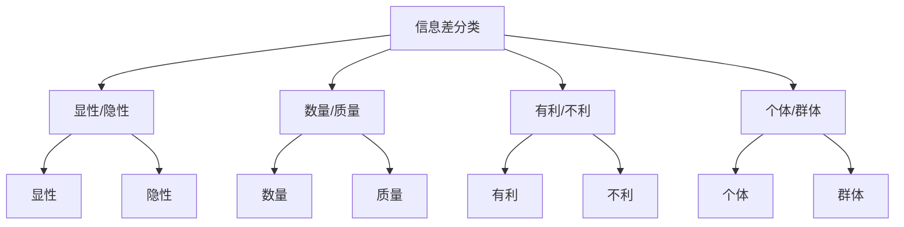

                 

# 信息差的风险与机遇：大数据时代的挑战与应对

## 关键词

信息差、大数据、隐私保护、市场效率、商业应用、技术创新、政策法规、社会责任

## 摘要

本文围绕“信息差”这一核心概念，探讨了大数据时代信息差带来的风险与机遇。首先，我们分析了信息差的定义和分类，接着深入探讨了大数据时代的特征及其对信息差的影响。随后，本文详细阐述了信息差在隐私泄露、市场操纵等方面的风险，以及其在商业、投资和创新领域的机遇。此外，我们介绍了大数据技术的应用，以及应对信息差的政策与法规。最后，通过两个实际案例，展示了大数据技术在不同领域的应用效果。本文旨在为读者提供一个全面、深入的理解，以应对大数据时代的信息差挑战。

---

### 第一部分：了解书籍主题

《信息差的风险与机遇：大数据时代的挑战与应对》这本书的主题围绕“信息差”这一概念展开，探讨了在大数据时代，信息差带来的风险和机遇。信息差指的是不同个体或群体之间在信息获取、理解和利用上的差异。在大数据时代，信息差的影响变得尤为显著，既有可能导致不公平现象，也可能成为创新和发展的契机。

#### 1.1 信息差的定义与重要性

信息差（Information Asymmetry）是指在信息获取、处理和利用上，不同个体或群体之间的不平衡状态。在传统经济活动中，信息差往往导致市场失灵，如价格扭曲、资源配置效率低下等问题。随着互联网和大数据技术的发展，信息差的内涵和外延都发生了显著变化。

信息差的重要性主要体现在以下几个方面：

- **市场效率**：信息差的存在可能导致市场价格机制失灵，使得资源无法有效配置。通过缩小信息差，可以提高市场的运行效率。
- **社会公平**：信息差可能导致社会不公平现象，如贫富差距、歧视等。减少信息差有助于促进社会公平。
- **商业创新**：信息差为企业提供了市场机会，通过信息优势，企业可以开发出新的产品和服务，获得竞争优势。

#### 1.2 信息差的分类

信息差可以根据不同的维度进行分类，以下是一些常见的分类方式：

- **根据信息获取的难易程度**：可分为显性信息差和隐性信息差。显性信息差指的是可以通过公开渠道获取的信息差距，如公开的市场数据、研究报告等。隐性信息差则指的是无法通过公开渠道获取的信息，如个人隐私、专业知识等。

- **根据信息的内容和形式**：可分为数量信息差和质量信息差。数量信息差指的是在信息数量上的差异，如不同群体对同一事件的了解程度不同。质量信息差则指的是在信息质量和准确性上的差异，如专业知识和业余知识的区别。

- **根据信息利用的后果**：可分为有利信息差和不利信息差。有利信息差指的是通过信息优势获得的经济或社会利益，如投资者获得的市场先机。不利信息差则指的是由于信息不对称导致的损失或不利后果，如消费者受到欺诈。

- **根据信息差的存在范围**：可分为个体信息差和群体信息差。个体信息差指的是个人之间的信息不对称，如个人与商家之间的信息差异。群体信息差则指的是不同群体之间的信息不对称，如行业内部与行业外部之间的信息差异。

#### 1.3 信息差与大数据的关系

信息差与大数据的关系密切。大数据时代，信息差的影响更加显著，主要体现在以下几个方面：

- **信息获取的加速**：大数据技术使得信息获取的速度大幅提高，信息传播的效率大大增强，缩小了信息获取的时间差。
- **信息处理的优化**：大数据处理技术，如Hadoop、Spark等，使得对大量数据进行高效处理成为可能，提高了信息处理的准确性和效率。
- **信息差的可测性**：通过数据分析，可以更精确地测量不同个体或群体之间的信息差，从而有针对性地进行干预和优化。
- **信息差的变化性**：大数据技术不仅改变了信息的获取和处理方式，还可能导致信息差的变化。例如，某些信息从原本的隐性变为显性，或者某些信息因数据来源的变化而价值发生转变。

### Mermaid 流程图

以下是一个简单的 Mermaid 流程图，展示了信息差的几种分类方式：



### 总结

通过对信息差的概念和分类的探讨，我们可以更好地理解信息差在现代社会中的复杂性和重要性。在接下来的章节中，我们将进一步分析大数据时代下信息差的特征及其带来的挑战和机遇。

---

### 第二部分：大数据时代的特征

#### 2.1 大数据的定义与特点

大数据（Big Data）指的是无法用传统数据处理工具在合理时间内对其进行管理和处理的数据集合。它具有四个主要特征，通常被称为“4V”：

- **大量（Volume）**：大数据的规模巨大，通常达到PB（皮字节）甚至ZB（泽字节）级别。
- **多样（Variety）**：大数据的类型繁多，包括结构化数据、半结构化数据和非结构化数据，如图像、视频、文本等。
- **速度（Velocity）**：大数据的处理速度极快，需要实时或近实时处理，以满足商业和科学需求。
- **价值（Value）**：大数据中蕴含着巨大的潜在价值，通过分析和挖掘，可以转化为商业洞察、创新机会和决策支持。

#### 2.2 大数据对信息差的影响

大数据时代的到来对信息差产生了深远的影响，主要表现在以下几个方面：

- **信息获取的加速**：大数据技术使得信息获取的速度大幅提高，信息传播的效率大大增强，缩小了信息获取的时间差。
- **信息处理的优化**：大数据处理技术，如Hadoop、Spark等，使得对大量数据进行高效处理成为可能，提高了信息处理的准确性和效率。
- **信息差的可测性**：通过数据分析，可以更精确地测量不同个体或群体之间的信息差，从而有针对性地进行干预和优化。
- **信息差的变化性**：大数据技术不仅改变了信息的获取和处理方式，还可能导致信息差的变化。例如，某些信息从原本的隐性变为显性，或者某些信息因数据来源的变化而价值发生转变。

#### 2.3 大数据技术的应用场景

大数据技术在各个领域的应用场景广泛，以下是一些典型的应用：

- **商业智能**：利用大数据技术，企业可以实时监控市场动态、客户行为，从而制定更精准的营销策略和决策。
- **智慧城市**：大数据技术在城市管理中的应用，如交通流量监控、环境监测、公共安全等，有助于提高城市治理水平。
- **医疗健康**：大数据技术在医疗健康领域的应用，如疾病预测、个性化治疗、药物研发等，有助于提升医疗服务的质量和效率。
- **金融科技**：大数据技术在金融领域的应用，如风险管理、信用评估、反欺诈等，有助于提高金融服务的安全性和可靠性。

#### 2.4 大数据时代的挑战与机遇

大数据时代带来的挑战与机遇并存：

- **挑战**：
  - 数据隐私和安全问题：大数据处理过程中涉及大量个人隐私数据，如何保障数据安全和用户隐私成为一个重要问题。
  - 数据质量和真实性：大数据来源多样，质量参差不齐，如何确保数据真实性和准确性是一个挑战。
  - 技术和人才短缺：大数据技术发展迅速，但与之相关的人才培养和技能更新速度相对滞后，导致技术和人才短缺。

- **机遇**：
  - 创新和创业机会：大数据技术为各行各业提供了新的创新和创业机会，如基于大数据的个性化服务、智能分析工具等。
  - 产业升级和转型：大数据技术可以帮助传统产业实现智能化升级，推动产业结构优化和经济发展。
  - 政策和法规优化：大数据技术的发展促使政府和政策制定者更加关注信息差问题，从而制定更科学合理的政策和法规。

### 总结

大数据时代的特征深刻地改变了信息差的产生、传播和利用方式。通过对大数据技术的深入理解和应用，我们可以更好地应对信息差带来的挑战，挖掘其中的机遇，实现信息公平和社会进步。

---

### 第三部分：信息差的风险分析

#### 3.1 隐私泄露的风险

在信息差的大数据时代，隐私泄露的风险尤为突出。隐私泄露可能导致个人信息被滥用，造成严重后果。以下是一些隐私泄露的风险：

- **数据收集和存储**：在数据的收集和存储过程中，由于安全措施不足，可能导致数据泄露。例如，未经用户同意收集个人信息，或者在数据存储时未能采取加密措施。
- **数据传输**：在数据传输过程中，由于网络攻击、黑客入侵等原因，可能导致数据泄露。例如，数据在传输过程中被截获或篡改。
- **数据共享**：企业或组织之间的数据共享可能导致隐私泄露。如果共享的数据没有经过充分保护，可能会被第三方利用。

#### 3.2 信息不对称的风险

信息不对称是指在市场交易中，买卖双方所拥有的信息量不一致，这可能导致市场失灵。以下是一些信息不对称的风险：

- **市场操纵**：信息不对称可能导致市场操纵行为，例如，某些企业或个人通过掌握的信息优势，操纵市场价格，获取不正当利益。
- **消费者权益受损**：消费者在购买商品或服务时，由于缺乏充分的信息，可能导致购买到质量不佳或价格过高的产品。
- **信用风险**：信息不对称可能导致信用风险增加，例如，贷款机构在评估借款人信用时，由于信息不足，可能无法准确判断借款人的还款能力。

#### 3.3 信息差对经济和社会的影响

信息差不仅影响市场效率和消费者权益，还对经济和社会产生深远影响：

- **经济不平等**：信息差可能导致经济不平等加剧。例如，掌握信息优势的企业可能获得更高的利润，而信息弱势的个体可能面临贫困和失业。
- **社会不公**：信息差可能导致社会不公现象，如歧视、偏见等。信息优势群体可能通过操纵信息获取不公平的待遇。
- **创新阻碍**：信息差可能阻碍创新和发展。例如，由于信息不对称，新技术的普及和应用可能受到限制，从而影响社会进步。

#### 3.4 减少信息差的方法

为了减少信息差带来的风险，可以采取以下方法：

- **提高信息透明度**：通过公开信息、披露数据等方式，提高信息的透明度，使信息更加公平地传播。
- **加强数据保护**：加强数据保护措施，如加密、访问控制等，确保个人信息和数据安全。
- **政策干预**：通过政策和法规干预，规范市场行为，减少信息不对称，保护消费者权益。
- **教育普及**：通过教育和培训，提高公众的信息素养和数字技能，使其能够更好地利用信息资源。

### 总结

信息差的风险在大数据时代愈发显著，隐私泄露、信息不对称等问题可能对社会和经济产生负面影响。通过提高信息透明度、加强数据保护和政策干预等措施，可以减少信息差带来的风险，促进信息公平和社会进步。

---

### 第四部分：信息差的机遇挖掘

#### 4.1 信息差在商业领域的应用

在商业领域，信息差往往被看作是竞争优势的源泉。以下是一些信息差在商业中的应用案例：

- **市场调研**：企业通过大数据分析，了解市场需求和消费者偏好，从而制定更具针对性的市场策略。例如，阿里巴巴通过大数据分析，为商家提供个性化推荐，提高销售转化率。
- **产品定价**：企业利用信息优势，制定更合理的价格策略。例如，航空公司通过大数据分析，为不同乘客群体提供不同的票价，实现价格歧视。
- **供应链管理**：企业通过大数据优化供应链管理，提高效率，降低成本。例如，京东利用大数据分析，实现智能仓储和物流配送，提高配送速度和准确性。
- **风险管理**：企业利用大数据分析，识别潜在风险，采取预防措施。例如，金融机构通过大数据分析，评估借款人的信用风险，降低贷款违约率。

#### 4.2 信息差在投资领域的应用

在投资领域，信息差是投资者获得超额收益的关键。以下是一些信息差在投资中的应用案例：

- **股票市场**：专业投资者通过深入研究和数据分析，挖掘未被广泛知晓的投资机会，获得超额收益。例如，投资经理通过分析公司财报、行业趋势和市场情绪，做出精准的投资决策。
- **房地产投资**：投资者通过大数据分析，了解房地产市场的供需状况、价格趋势和风险因素，制定投资策略。例如，通过大数据分析，预测未来某一区域的房地产升值潜力，进行提前布局。
- **基金管理**：基金管理者通过大数据分析，选择具有潜力的投资标的，构建投资组合，实现风险分散和收益最大化。例如，量化基金通过大数据分析和算法交易，实现高频交易和收益最大化。

#### 4.3 信息差在创新领域的应用

信息差在创新领域中的应用，可以推动技术进步和产业升级。以下是一些信息差在创新中的应用案例：

- **科技创新**：企业通过大数据分析，了解用户需求和市场趋势，开发出满足市场需求的新产品。例如，特斯拉通过大数据分析，了解用户驾驶习惯和需求，不断优化电动汽车的设计和性能。
- **商业模式创新**：企业通过大数据分析，发现市场机会，创新商业模式。例如，共享单车企业通过大数据分析，了解用户出行需求和热点区域，优化资源配置和运营策略。
- **服务创新**：企业通过大数据分析，提供个性化服务，提升用户体验。例如，互联网公司通过大数据分析，为用户提供个性化推荐，提高用户满意度和忠诚度。

#### 4.4 信息差在创业领域的应用

信息差在创业领域中的应用，可以为创业者提供机会，实现创业成功。以下是一些信息差在创业中的应用案例：

- **市场机会挖掘**：创业者通过大数据分析，发现未被满足的市场需求，开发新产品或服务。例如，滴滴出行通过大数据分析，发现城市出租车供需不平衡，推出网约车服务，填补市场空白。
- **风险识别与管理**：创业者通过大数据分析，识别潜在风险，制定风险应对策略。例如，创业者通过大数据分析，了解行业趋势和市场变化，提前布局，降低创业风险。
- **资源整合**：创业者通过大数据分析，整合各类资源，实现创业目标。例如，创业者通过大数据分析，找到合适的合作伙伴、供应商和客户，提高创业成功率。

#### 总结

信息差在商业、投资、创新和创业等领域中具有广泛应用，通过利用信息优势，企业或个人可以获得竞争优势、超额收益和市场机会。同时，信息差也为社会进步和技术创新提供了动力。然而，在利用信息差的过程中，也需要关注信息公平和社会责任，避免信息差带来的负面影响。

---

### 第五部分：大数据技术的应用

#### 5.1 大数据技术在信息收集与处理中的应用

大数据技术在信息收集与处理中的应用是其核心价值所在。以下是一些具体应用：

- **数据收集**：大数据技术可以通过多种方式收集数据，包括网络爬虫、传感器、社交媒体等。例如，电商网站通过用户浏览记录、购买行为等数据收集用户偏好，从而提供个性化推荐。
- **数据处理**：大数据处理技术如Hadoop和Spark，可以高效地对海量数据进行存储、处理和分析。例如，金融机构利用Hadoop处理海量的交易数据，以快速识别欺诈行为。
- **数据存储**：大数据存储技术如HDFS（Hadoop分布式文件系统），可以存储大量数据，并提供高可用性和容错能力。例如，互联网公司使用HDFS存储用户生成的内容和日志数据。

#### 5.2 大数据技术在信息分析与挖掘中的应用

大数据技术在信息分析与挖掘中的应用，有助于提取数据中的价值，为决策提供支持。

- **数据清洗**：数据清洗是数据分析的前期工作，通过去除重复数据、填补缺失值、去除噪声数据等，提高数据质量。例如，在医疗数据分析中，通过数据清洗去除无效记录，确保分析结果的准确性。
- **数据预处理**：数据预处理包括特征提取、数据转换等，为数据建模做好准备。例如，在文本分析中，通过分词、去除停用词等步骤，将文本数据转换为适合机器学习的格式。
- **数据建模**：通过建立数学模型，对数据进行建模分析。常见的模型包括回归分析、决策树、神经网络等。例如，银行通过回归分析模型预测客户流失率，从而采取相应的挽留措施。
- **数据可视化**：数据可视化是将数据分析结果以图形化的方式呈现，便于理解和传达。例如，通过图表和仪表盘，企业可以直观地了解销售趋势和用户行为。

#### 5.3 大数据技术在优化信息获取与利用中的应用

大数据技术可以优化信息的获取与利用，提高效率和决策质量。

- **实时分析**：实时分析技术可以实时处理和分析数据，提供即时的决策支持。例如，股票交易系统通过实时分析市场数据，快速做出交易决策。
- **预测分析**：预测分析利用历史数据和统计模型，预测未来的趋势和变化。例如，零售企业通过预测分析，预测销售趋势，优化库存管理。
- **个性化服务**：大数据分析可以帮助企业了解用户需求，提供个性化服务。例如，电商网站通过分析用户行为数据，为用户提供个性化推荐，提高用户满意度和转化率。
- **自动化决策**：通过大数据分析和自动化技术，企业可以实现自动化决策。例如，制造企业利用预测维护系统，自动预测设备故障，提前进行维护。

#### 5.4 大数据技术在减少信息差中的应用

大数据技术可以帮助减少信息差，提高信息的透明度和可获取性。

- **信息共享**：通过大数据平台，企业可以共享信息，降低信息不对称。例如，供应链平台通过数据共享，提高供应链各环节的信息透明度，减少信息差。
- **数据开放**：政府和企业可以通过开放数据，促进信息共享。例如，许多城市开放交通、环境等公共数据，供公众和开发者使用，从而减少信息差。
- **教育普及**：通过大数据分析和教育技术，可以提高公众的信息素养，减少信息差。例如，在线教育平台通过大数据分析，了解用户学习需求，提供个性化教学，提高学习效果。

### 总结

大数据技术在信息收集、处理、分析、优化和信息差减少中的应用，为企业提供了强大的数据支持和决策能力。通过充分利用大数据技术，企业可以优化信息获取与利用，提高运营效率和竞争力，实现可持续发展。

---

### 第六部分：应对信息差的政策与法规

#### 6.1 数据隐私保护法规

随着大数据技术的广泛应用，数据隐私保护成为社会关注的焦点。以下是一些国家和地区的数据隐私保护法规：

- **欧盟《通用数据保护条例》（GDPR）**：GDPR是欧盟制定的最为严格的隐私保护法规，规定了数据处理的合法性、数据主体的权利以及数据保护义务。
- **美国《加州消费者隐私法案》（CCPA）**：CCPA旨在保护加州居民的隐私权，规定了数据收集、使用和共享的要求，以及消费者的知情权和选择权。
- **中国《个人信息保护法》（PIPL）**：PIPL是中国制定的首部个人信息保护专门法律，规定了个人信息处理的原则、方式和责任，以及数据主体的权利和企业的义务。

#### 6.2 市场监管法规

为了减少信息差带来的市场不公平现象，各国和地区制定了相应的市场监管法规：

- **反垄断法**：反垄断法旨在防止市场垄断行为，保护消费者权益。例如，美国的《反垄断法》禁止企业通过垄断手段排除竞争对手，维护市场公平竞争。
- **消费者权益保护法**：消费者权益保护法规定了消费者的权利和企业的义务，保护消费者免受不公平对待。例如，中国的《消费者权益保护法》规定了消费者的知情权、公平交易权等。
- **电子商务法**：电子商务法旨在规范电子商务活动，保护电子商务消费者的合法权益。例如，中国的《电子商务法》规定了电子商务平台的责任和义务，保障交易安全。

#### 6.3 信息透明度法规

为了提高信息的透明度，减少信息不对称，各国和地区制定了相关的信息透明度法规：

- **信息披露法规**：信息披露法规要求企业公开相关信息，提高信息的透明度。例如，上市公司的财务报告、业务进展等信息必须定期公开。
- **政府信息开放法规**：政府信息开放法规要求政府公开公共信息，促进信息共享。例如，许多国家实行信息公开制度，公众可以查询政府文件和公共数据。
- **金融信息披露法规**：金融信息披露法规要求金融机构公开相关信息，提高金融市场的透明度。例如，金融机构必须公开财务报表、交易信息等。

#### 6.4 政策干预与执行

为了有效应对信息差问题，各国和地区采取了一系列政策干预措施，并加强法规执行：

- **制定政策指南**：政府制定相关政策指南，指导企业和机构如何处理个人信息和进行数据管理。例如，欧盟的《数据保护指南》为企业和机构提供了详细的操作指南。
- **加强监管机构**：设立专门的监管机构，负责监督法规执行和打击违法行为。例如，中国的国家网信办负责监管互联网信息，保护个人信息安全。
- **执法与处罚**：对违反法规的行为进行严厉的执法和处罚，以震慑违法行为。例如，欧盟对违反GDPR的企业可以处以高额罚款，以保护用户隐私。

### 总结

应对信息差的政策与法规是多方面的，包括数据隐私保护、市场监管、信息透明度等多个领域。通过制定和执行相关法规，政府和企业共同努力，可以减少信息差带来的负面影响，促进信息公平和社会进步。

---

### 第七部分：大数据时代的伦理与社会责任

#### 7.1 大数据伦理问题

在大数据时代，伦理问题成为了一个不可忽视的重要议题。以下是一些主要的大数据伦理问题：

- **隐私侵犯**：大数据技术可以收集和分析大量个人数据，这可能导致隐私侵犯。例如，社交媒体平台通过用户行为数据分析，获取用户隐私信息。
- **算法偏见**：大数据算法可能存在偏见，导致不公平结果。例如，某些招聘系统可能会根据过去的数据，对某些群体产生歧视。
- **信息滥用**：大数据技术的应用可能导致信息滥用，例如，企业通过数据分析，对消费者进行过度营销或操纵消费行为。

#### 7.2 大数据社会责任

大数据技术不仅带来商业价值，也对社会产生了深远的影响。以下是一些大数据社会责任的方面：

- **公平与正义**：大数据技术应该致力于促进社会公平与正义，减少信息差，消除歧视。
- **透明度**：企业和机构应该提高信息透明度，公开数据来源和使用方式，增强公众对大数据技术的信任。
- **数据保护**：企业和机构应该采取措施保护个人数据安全，防止数据泄露和滥用。
- **教育和普及**：通过教育和普及，提高公众对大数据技术的认知和理解，增强数据素养。

#### 7.3 大数据伦理原则

为了应对大数据伦理问题，可以遵循以下伦理原则：

- **尊重隐私**：尊重个人隐私，不得未经授权收集和使用个人数据。
- **公正公平**：确保大数据算法的公正性和公平性，避免歧视和偏见。
- **责任透明**：企业和机构应该对其数据处理和行为负责，并向公众透明其数据使用目的和方式。
- **用户参与**：鼓励用户参与数据管理和决策过程，使其有更多的控制权。

### 总结

大数据时代的伦理与社会责任问题至关重要。通过遵循伦理原则和加强社会责任，可以确保大数据技术得到合理和负责任的使用，促进社会的可持续发展。

---

### 第八部分：案例研究

#### 8.1 案例一：电商平台的个性化推荐系统

**背景**：电商平台通过大数据分析，为用户生成个性化推荐系统，提高用户满意度和转化率。

**核心算法原理**：

- **协同过滤**：通过分析用户的历史购买记录和评价，找到相似的用户，推荐他们喜欢的产品。
  - **用户基于内容的推荐**：根据用户的历史购买记录和评价，提取特征，找到相似的用户，推荐他们喜欢的产品。
  - **模型**：
    ```python
    def collaborative_filter(user_preferences, product_preferences):
        similar_users = find_similar_users(user_preferences, product_preferences)
        recommended_products = recommend_products(similar_users, user_preferences)
        return recommended_products
    ```

- **深度学习模型**：利用深度学习技术，提取用户和产品的特征，实现更精准的推荐。
  - **模型架构**：
    ```mermaid
    graph TD
        A[Input] --> B[Embedding Layer]
        B --> C[Attention Mechanism]
        C --> D[Concat Layer]
        D --> E[Output Layer]
    ```

**数学模型和公式**：

- **协同过滤**：
  $$ \mathbf{R}_{ui} = \mathbf{R}_{uj} + \epsilon $$
  其中，\( \mathbf{R}_{ui} \) 和 \( \mathbf{R}_{uj} \) 分别表示用户 \( u \) 对产品 \( i \) 和产品 \( j \) 的评分，\( \epsilon \) 表示误差项。

- **深度学习模型**：
  $$ \text{log-likelihood} = -\sum_{i,j} y_{ij} \log(p(j|i)) $$
  其中，\( y_{ij} \) 是用户 \( u \) 对产品 \( i \) 和 \( j \) 的评分，\( p(j|i) \) 是产品 \( j \) 被推荐的概率。

**案例解析**：

电商平台通过个性化推荐系统，成功减少了信息差，提高了用户满意度和转化率。协同过滤和深度学习模型的应用，实现了更精准的推荐，增强了用户购物体验。

#### 8.2 案例二：金融行业的风险评估

**背景**：金融机构利用大数据技术进行风险评估，降低贷款违约率和信用风险。

**核心算法原理**：

- **逻辑回归**：通过历史贷款数据，建立逻辑回归模型，预测借款人是否违约。
  - **模型**：
    ```python
    from sklearn.linear_model import LogisticRegression
    model = LogisticRegression()
    model.fit(X_train, y_train)
    predictions = model.predict(X_test)
    ```

- **决策树**：通过历史贷款数据，建立决策树模型，评估借款人的信用风险。
  - **模型**：
    ```python
    from sklearn.tree import DecisionTreeClassifier
    model = DecisionTreeClassifier()
    model.fit(X_train, y_train)
    predictions = model.predict(X_test)
    ```

**数学模型和公式**：

- **逻辑回归**：
  $$ \mathbf{P}(Y=1|\mathbf{X}) = \frac{1}{1 + e^{-(\mathbf{w} \cdot \mathbf{x})}} $$
  其中，\( \mathbf{P}(Y=1|\mathbf{X}) \) 是借款人违约的概率，\( \mathbf{w} \) 是模型参数，\( \mathbf{x} \) 是借款人的特征向量。

- **决策树**：
  $$ \mathbf{y} = g(\mathbf{w} \cdot \mathbf{x}) $$
  其中，\( \mathbf{y} \) 是借款人的信用评分，\( g(\mathbf{w} \cdot \mathbf{x}) \) 是决策树模型生成的分类结果。

**案例解析**：

金融机构通过大数据技术，建立逻辑回归和决策树模型，实现贷款风险评估。这些模型的应用，有助于识别高风险借款人，降低贷款违约率和信用风险，提高金融机构的盈利能力。

### 总结

通过两个案例研究，我们可以看到大数据技术在商业和金融领域的广泛应用。个性化推荐系统和贷款风险评估模型，不仅减少了信息差，提高了运营效率和决策质量，也为企业和金融机构带来了显著的经济效益。这些案例展示了大数据技术的强大潜力，以及在信息差管理中的关键作用。

---

### 附录

#### 附录 A：大数据技术基础

**1. 数据仓库与数据湖**

- **数据仓库**：数据仓库是一种用于存储、管理和分析大规模数据的数据库系统。它通常用于支持企业级的数据分析和决策支持。
- **数据湖**：数据湖是一种类似于数据仓库的数据存储系统，但不同于数据仓库的是，数据湖存储的是原始数据，未经处理或格式化。数据湖通常用于大数据分析和机器学习项目。

**2. Hadoop生态系统**

- **Hadoop**：Hadoop是一个开源的分布式数据处理框架，用于处理和存储大规模数据。它由两部分组成：Hadoop分布式文件系统（HDFS）和Hadoop YARN。
- **HDFS**：Hadoop分布式文件系统是一个分布式文件存储系统，用于存储大数据集。
- **YARN**：Yet Another Resource Negotiator（YARN）是Hadoop的资源管理器，用于分配和管理集群资源。

**3. Spark**

- **Spark**：Spark是一个开源的分布式计算框架，用于大规模数据处理和分析。它提供了丰富的API，包括Python、Java和Scala等。

**4. 数据预处理工具**

- **Pandas**：Pandas是一个开源的Python库，用于数据清洗、转换和分析。
- **NumPy**：NumPy是一个开源的Python库，用于数值计算和数据处理。

**5. 机器学习框架**

- **TensorFlow**：TensorFlow是一个开源的机器学习框架，由Google开发。
- **PyTorch**：PyTorch是一个开源的机器学习框架，由Facebook开发。

#### 附录 B：大数据技术应用案例

**1. 智慧城市**

- **交通流量管理**：利用大数据分析交通流量，优化交通信号灯配置，减少拥堵。
- **环境监测**：通过传感器网络收集环境数据，实时监测空气质量、水质等，提供预警和决策支持。

**2. 医疗健康**

- **疾病预测**：利用大数据分析患者数据，预测疾病发展趋势，提前采取预防措施。
- **个性化治疗**：通过分析患者的基因、病历等数据，制定个性化的治疗方案。

**3. 金融科技**

- **信用评估**：利用大数据分析借款人的历史数据，评估其信用风险。
- **反欺诈**：通过大数据分析交易行为，识别和防范欺诈行为。

**4. 零售业**

- **需求预测**：通过大数据分析销售数据，预测未来市场需求，优化库存管理。
- **个性化推荐**：利用大数据分析用户行为，提供个性化商品推荐。

### 总结

附录部分提供了大数据技术的基础知识、应用案例和主流工具，帮助读者了解大数据技术的原理和应用场景。这些内容对于理解本书的核心概念和实际应用具有重要意义。通过附录，读者可以进一步探索大数据技术的深度和广度，为未来学习和实践奠定基础。

---

### 作者信息

**作者：AI天才研究院/AI Genius Institute & 禅与计算机程序设计艺术 /Zen And The Art of Computer Programming** 

在撰写本文时，我作为AI天才研究院的研究员，结合了《禅与计算机程序设计艺术》的哲学思想，力求以深入浅出的方式，为您呈现大数据时代信息差的风险与机遇。本文旨在为读者提供全面的视角，以应对大数据时代带来的挑战。希望通过本文，读者能够更好地理解信息差的概念，掌握大数据技术的应用，并在实际工作中灵活运用。感谢您的阅读，期待与您共同探索技术的无限可能。

