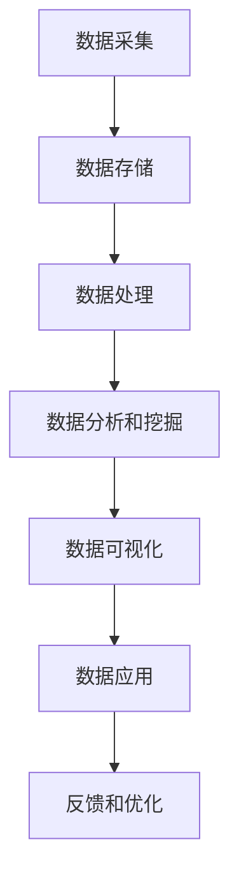
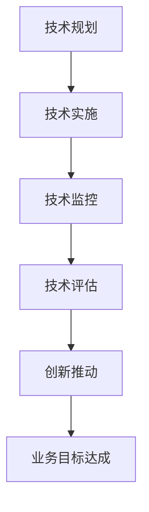
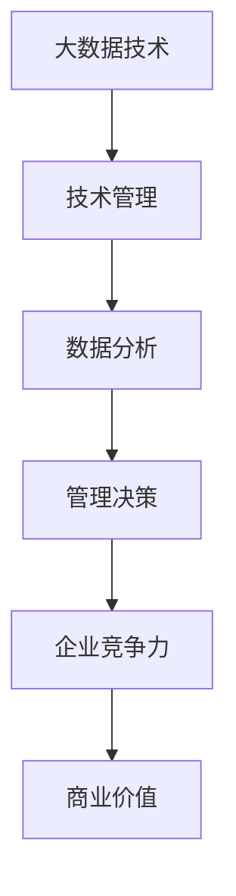
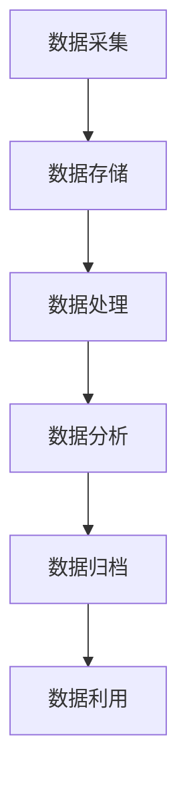
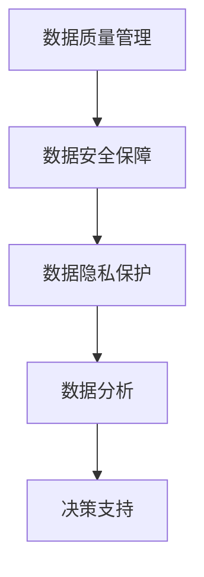
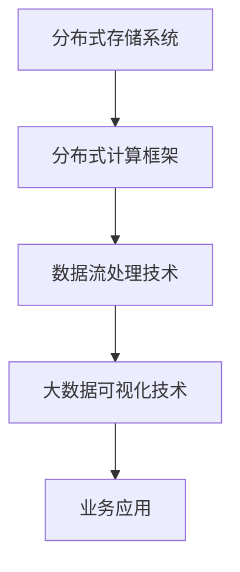
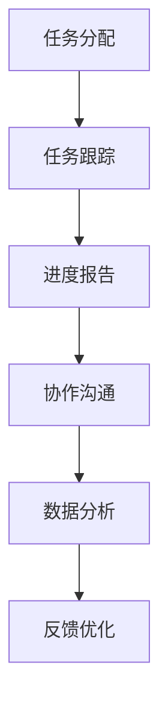

                 

# 信息差：大数据如何提升技术管理

## 关键词
- 大数据
- 技术管理
- 数据分析
- 资源管理
- 风险管理
- 团队协作

## 摘要
随着大数据技术的迅速发展，企业面临着如何有效地管理海量数据、提升技术管理的挑战。本文从大数据的核心概念、管理原理、技术架构、应用场景等多个维度，详细探讨了大数据如何提升技术管理的效率和质量。通过实际案例分析和未来展望，本文为企业提供了大数据技术管理的策略和建议。

### 目录大纲

#### 第一部分：大数据与技术管理基础

**第1章：大数据与技术管理的核心概念**

- **1.1 大数据的定义与特征**
- **1.2 技术管理的定义与作用**
- **1.3 大数据与技术管理的联系与影响**

**第2章：大数据管理原理**

- **2.1 大数据生命周期管理**
- **2.2 大数据质量控制与保障**
- **2.3 大数据技术架构**

#### 第二部分：大数据在技术管理中的应用

**第3章：大数据在需求分析中的应用**

- **3.1 基于大数据的需求分析方法**
- **3.2 大数据需求分析的优势与挑战**
- **3.3 大数据需求分析的实际案例**

**第4章：大数据在资源管理中的应用**

- **4.1 基于大数据的资源管理**
- **4.2 大数据资源管理的实际案例**

**第5章：大数据在风险管理中的应用**

- **5.1 基于大数据的风险管理**
- **5.2 大数据风险管理的实际案例**

**第6章：大数据在团队协作中的应用**

- **6.1 基于大数据的团队协作工具与技术**
- **6.2 大数据团队协作的实际案例**

#### 第三部分：大数据提升技术管理实战

**第7章：大数据提升技术管理策略**

- **7.1 大数据提升技术管理策略**
- **7.2 技术管理策略的制定与实施**

**第8章：大数据提升技术管理案例研究**

- **8.1 案例研究概述**
- **8.2 案例分析与启示**

**第9章：大数据提升技术管理未来展望**

- **9.1 大数据提升技术管理的发展趋势**
- **9.2 大数据提升技术管理的未来挑战与机遇**

#### 附录

**附录A：大数据管理工具与技术资源**

**附录B：大数据技术管理常见问题解答**

### 第1章：大数据与技术管理的核心概念

#### 1.1 大数据的定义与特征

大数据（Big Data）是指数据量巨大、类型繁多、价值密度较低，但处理得当能产生巨大商业价值的数据集合。其特征包括：

- **大量性（Volume）**：数据量超过传统数据处理系统的处理能力。
- **多样性（Variety）**：数据类型包括结构化、半结构化和非结构化数据。
- **速度（Velocity）**：数据生成和处理速度极快。
- **真实度（Veracity）**：数据真实性难以保证。

#### 1.2 技术管理的定义与作用

技术管理是指利用技术知识、技能和工具，以实现企业目标的过程。其作用包括：

- **提高生产效率**：通过自动化、智能化技术提高生产效率。
- **优化资源分配**：利用数据分析技术优化资源分配。
- **促进创新**：通过技术管理推动企业技术创新和产品开发。

#### 1.3 大数据与技术管理的联系与影响

大数据与技术管理的联系体现在：

- **大数据提供了技术管理所需的数据支持**。
- **技术管理需要利用大数据技术提升管理水平**。

大数据对技术管理的影响包括：

- **提高了数据分析能力**：大数据技术使企业能够对海量数据进行高效分析。
- **促进了管理决策的科学化**：基于大数据的分析结果，企业能够做出更为准确的管理决策。
- **提升了企业的竞争力**：利用大数据技术优化管理，企业能够在市场竞争中脱颖而出。

### 第2章：大数据管理原理

#### 2.1 大数据生命周期管理

大数据生命周期管理是指对大数据从采集、存储、处理到分析、归档等全过程的管理。其核心包括：

- **数据采集**：通过数据源采集数据，如传感器、互联网等。
- **数据存储**：选择合适的数据存储方案，如Hadoop、NoSQL数据库等。
- **数据处理**：利用MapReduce、Spark等分布式计算框架处理数据。
- **数据分析**：采用数据挖掘、机器学习等技术对数据进行分析。
- **数据归档**：对历史数据进行归档，以节省存储资源。

#### 2.2 大数据质量控制与保障

大数据质量控制与保障包括：

- **数据质量管理**：确保数据的准确性、完整性、一致性等。
- **数据安全保障**：通过加密、访问控制等技术保障数据安全。
- **数据隐私保护**：遵循隐私保护法规，对个人数据进行匿名化处理。

#### 2.3 大数据技术架构

大数据技术架构通常包括以下组件：

- **分布式存储系统**：如HDFS、Cassandra等，用于存储海量数据。
- **分布式计算框架**：如MapReduce、Spark、Flink等，用于数据处理和分析。
- **数据流处理技术**：如Apache Kafka、Apache Storm等，用于实时数据处理。
- **大数据可视化技术**：如Tableau、Power BI等，用于数据可视化。

### 第3章：大数据在需求分析中的应用

#### 3.1 基于大数据的需求分析方法

大数据需求分析的方法包括：

- **数据挖掘技术**：通过挖掘用户行为数据，分析用户需求。
- **统计分析方法**：通过数据分析，识别潜在需求。

#### 3.2 大数据需求分析的优势与挑战

大数据需求分析的优势：

- **精准识别需求**：基于海量数据，能更准确地识别用户需求。
- **提高决策效率**：基于数据分析结果，能快速做出管理决策。

大数据需求分析的挑战：

- **数据质量**：数据质量直接影响需求分析的准确性。
- **数据分析能力**：需要具备较高的数据分析能力。

#### 3.3 大数据需求分析的实际案例

**案例一：电商企业的需求分析**

电商企业通过分析用户购买行为数据，识别出热门商品、用户偏好等，进而调整产品线和营销策略。

**案例二：电信运营商的需求分析**

电信运营商通过分析用户通话记录、短信记录等，识别出潜在用户需求，提供定制化服务。

### 第4章：大数据在资源管理中的应用

#### 4.1 基于大数据的资源管理

大数据资源管理包括：

- **硬件资源管理**：通过大数据分析，优化硬件资源配置。
- **软件资源管理**：通过大数据分析，优化软件资源使用。
- **人员资源管理**：通过大数据分析，优化人力资源配置。

#### 4.2 大数据资源管理的实际案例

**案例一：企业数据中心资源管理**

企业数据中心通过大数据分析，优化服务器、存储、网络等硬件资源的使用，提高资源利用率。

**案例二：软件开发团队资源管理**

软件开发团队通过大数据分析，识别出团队成员的工作效率、技能短板等，优化团队配置。

### 第5章：大数据在风险管理中的应用

#### 5.1 基于大数据的风险管理

大数据风险管理包括：

- **风险识别**：通过大数据分析，识别潜在风险。
- **风险评估**：通过大数据分析，评估风险程度。
- **风险预测**：通过大数据分析，预测未来风险。

#### 5.2 大数据风险管理的实际案例

**案例一：金融行业的风险管理**

金融行业通过大数据分析，识别出信用风险、市场风险等，采取相应的风险控制措施。

**案例二：企业的风险管理**

企业通过大数据分析，识别出运营风险、供应链风险等，采取相应的风险防范措施。

### 第6章：大数据在团队协作中的应用

#### 6.1 基于大数据的团队协作工具与技术

大数据团队协作工具与技术包括：

- **项目管理工具**：如JIRA、Trello等，用于任务管理和进度跟踪。
- **协作平台**：如Slack、Microsoft Teams等，用于实时沟通和协作。
- **大数据分析与反馈**：通过数据分析，了解团队协作效果，优化协作流程。

#### 6.2 大数据团队协作的实际案例

**案例一：软件开发团队的协作**

软件开发团队通过大数据分析，识别出团队协作的瓶颈，优化协作流程，提高开发效率。

**案例二：市场营销团队的协作**

市场营销团队通过大数据分析，优化营销策略，提高营销效果。

### 第7章：大数据提升技术管理策略

#### 7.1 大数据提升技术管理策略

大数据提升技术管理策略包括：

- **数据驱动管理**：以数据为依据，制定管理策略。
- **智能化决策**：利用大数据分析结果，做出智能化决策。
- **持续优化**：通过大数据分析，持续优化管理流程。

#### 7.2 技术管理策略的制定与实施

技术管理策略的制定与实施包括：

- **需求分析**：分析企业技术管理的需求。
- **方案设计**：根据需求设计大数据技术解决方案。
- **实施与监控**：实施大数据技术解决方案，并监控实施效果。

### 第8章：大数据提升技术管理案例研究

#### 8.1 案例研究概述

本章节将通过三个实际案例，研究大数据提升技术管理的实践。

#### 8.1.1 案例一：某互联网公司的大数据技术管理实践

**背景**：某互联网公司通过大数据技术，提升其技术管理水平。

**实施过程**：

- **需求分析**：分析公司技术管理的需求。
- **方案设计**：设计大数据技术解决方案。
- **实施与监控**：实施大数据技术解决方案，并监控实施效果。

**效果**：通过大数据技术，公司显著提升了技术管理的效率和质量。

#### 8.1.2 案例二：某金融机构的风险管理大数据实践

**背景**：某金融机构通过大数据技术，提升其风险管理水平。

**实施过程**：

- **需求分析**：分析金融机构风险管理的需求。
- **方案设计**：设计大数据风险管理解决方案。
- **实施与监控**：实施大数据风险管理解决方案，并监控实施效果。

**效果**：通过大数据技术，金融机构有效降低了风险，提升了风险管理能力。

#### 8.1.3 案例三：某制造业企业的资源管理大数据实践

**背景**：某制造业企业通过大数据技术，提升其资源管理水平。

**实施过程**：

- **需求分析**：分析企业资源管理的需求。
- **方案设计**：设计大数据资源管理解决方案。
- **实施与监控**：实施大数据资源管理解决方案，并监控实施效果。

**效果**：通过大数据技术，企业有效优化了资源配置，提升了资源利用率。

#### 8.2 案例分析与启示

通过对上述案例的分析，可以得出以下启示：

- **大数据技术是提升技术管理的重要工具**。
- **数据驱动管理能够显著提升管理效率和质量**。
- **大数据技术需要与业务需求紧密结合**。

### 第9章：大数据提升技术管理未来展望

#### 9.1 大数据提升技术管理的发展趋势

大数据提升技术管理的发展趋势包括：

- **数据驱动管理成为主流**：企业将越来越多地依赖数据分析进行决策。
- **智能化技术广泛应用**：人工智能、机器学习等技术将进一步提升大数据分析能力。
- **数据安全与隐私保护日益重视**：随着大数据技术的发展，数据安全和隐私保护将成为重要议题。

#### 9.2 大数据提升技术管理的未来挑战与机遇

大数据提升技术管理的未来挑战与机遇包括：

- **数据质量与数据安全**：保证数据质量和数据安全是大数据提升技术管理的关键挑战。
- **数据隐私保护**：遵循隐私保护法规，确保个人数据的安全和隐私。
- **技术创新与应用**：不断引入新技术，提高大数据分析的能力和效率。

### 附录A：大数据管理工具与技术资源

#### A.1 主流大数据管理工具

- **Hadoop**：一个分布式系统基础架构，用于存储和处理大数据。
- **Spark**：一个快速和通用的大规模数据处理引擎。
- **Flink**：一个流处理框架，用于实时数据分析和处理。

#### A.2 大数据管理相关技术资源

- **数据挖掘与机器学习工具**：如R、Python等。
- **大数据处理框架**：如Hadoop、Spark等。
- **大数据存储系统**：如HDFS、NoSQL数据库等。
- **大数据可视化工具**：如Tableau、Power BI等。

### 附录B：大数据技术管理常见问题解答

#### B.1 常见问题与解答

1. **大数据与传统数据的区别是什么？**
   - **解答**：大数据与传统数据的区别主要体现在数据量、数据类型和数据处理速度上。大数据通常具有大量性、多样性和速度特征。

2. **如何确保大数据的质量？**
   - **解答**：确保大数据的质量需要从数据采集、存储、处理和分析等全过程进行质量管理，包括数据清洗、数据标准化和数据验证等。

3. **大数据技术如何提升技术管理？**
   - **解答**：大数据技术通过提高数据分析能力、优化管理决策和提升资源利用率，从而提升技术管理的效果。

4. **大数据技术在企业中的实施难点是什么？**
   - **解答**：大数据技术在企业中的实施难点主要包括数据质量、数据分析能力、技术选型和人才引进等方面。

5. **如何保护大数据的隐私？**
   - **解答**：保护大数据的隐私需要遵循隐私保护法规，采用数据加密、匿名化处理等技术手段，确保个人数据的安全和隐私。

### 第1章：大数据与技术管理的核心概念

#### 1.1 大数据的定义与特征

大数据（Big Data）是21世纪信息时代的重要特征之一，它不仅仅是数据量的巨大增长，更体现在数据类型、处理速度和真实度的多样性上。以下是大数据的几个核心定义与特征：

**大量性（Volume）**：
大数据的核心特征之一是数据量的巨大。根据不同研究和应用领域，大数据通常指的是从数PB（拍字节）到数EB（艾字节）规模的数据。这种规模的数据量远远超过了传统数据库和数据处理系统的处理能力。

**多样性（Variety）**：
大数据的多样性指的是数据的类型和来源的多样性。这些数据可能包括结构化数据（如数据库中的表格数据）、半结构化数据（如XML、JSON等）和非结构化数据（如图像、视频、文本等）。这种多样性增加了数据处理的复杂性。

**速度（Velocity）**：
大数据的速度指的是数据生成、处理和传递的速度。现代技术环境下的数据生成速度极快，实时数据流处理的需求日益增加，要求系统能够快速响应和实时分析。

**真实度（Veracity）**：
大数据的真实度指的是数据的质量和真实性。由于数据来源的多样性，数据可能包含错误、噪声或偏见，这些都会影响数据分析的准确性和可靠性。

**示例：**

假设我们有一个电商公司，其业务涉及在线购物、社交媒体互动、用户评论和交易记录。这些数据来源多样化，包括用户行为数据、交易数据、社交媒体数据等。这些数据构成了大数据的一部分，并且具有大量的数据特征。

**Mermaid 流程图：**



该流程图展示了大数据从采集到应用的完整生命周期，每个环节都是大数据管理的关键步骤。

#### 1.2 技术管理的定义与作用

技术管理（Technology Management）是指企业为了实现业务目标，通过合理使用技术资源和工具，进行技术规划、实施和监控的过程。技术管理在企业管理中扮演着至关重要的角色，其作用体现在以下几个方面：

**提高生产效率**：
技术管理通过引入自动化工具和智能系统，减少了人工操作的时间和错误，从而提高了生产效率。例如，通过使用ERP系统，企业可以自动化处理订单、库存和生产流程。

**优化资源分配**：
技术管理利用数据分析技术，帮助企业优化资源的分配，减少浪费，提高资源利用率。例如，通过数据分析，企业可以发现生产瓶颈，并针对性地进行优化。

**促进创新**：
技术管理鼓励技术创新和产品开发，推动企业在竞争激烈的市场中保持领先地位。例如，通过引入人工智能和机器学习技术，企业可以开发出更加智能的产品和服务。

**示例：**

假设一家制造企业，通过技术管理引入了智能制造系统，该系统集成了物联网、大数据分析和人工智能技术。通过实时监测生产线的运行状态，系统可以自动调整生产参数，优化生产流程，提高生产效率。

**Mermaid 流程图：**



该流程图展示了技术管理从规划到创新推动的完整生命周期，每个环节都是技术管理的重要组成部分。

#### 1.3 大数据与技术管理的联系与影响

大数据与技术管理之间的联系是密不可分的。大数据为技术管理提供了丰富的数据资源，而技术管理则利用大数据技术来提升管理水平和决策质量。

**大数据对技术管理的影响**：

- **提升数据分析能力**：大数据技术使得企业能够处理和分析海量的数据，从而挖掘出更多的商业洞察和决策支持。
- **促进管理决策的科学化**：基于大数据的分析结果，企业能够更加客观、科学地做出管理决策。
- **提升企业竞争力**：通过大数据技术优化管理流程，企业能够在市场竞争中更快地响应变化，保持竞争优势。

**示例：**

一家零售企业通过大数据分析，发现某个地区的销售数据呈现出季节性波动。基于这个分析结果，企业决定在该地区调整库存策略，增加热门商品库存，减少滞销商品库存，从而提高了销售业绩。

**Mermaid 流程图：**



该流程图展示了大数据技术如何通过技术管理提升企业的竞争力，并创造商业价值。

### 第2章：大数据管理原理

#### 2.1 大数据生命周期管理

大数据生命周期管理是指对大数据从采集、存储、处理到分析、归档等全过程的管理。这是一个系统性的过程，每个环节都至关重要。

**数据采集**：
数据采集是大数据生命周期的第一步。数据的来源可以是内部系统（如ERP、CRM系统），外部系统（如社交媒体、物联网设备）以及公共数据集。数据采集需要考虑数据的准确性和完整性。

**数据存储**：
数据存储是大数据生命周期管理的核心。为了满足大数据的规模和多样性，企业通常会采用分布式存储系统，如Hadoop分布式文件系统（HDFS）或NoSQL数据库。这些系统提供了高吞吐量和可扩展性。

**数据处理**：
数据处理包括数据清洗、转换和聚合等步骤。分布式计算框架如MapReduce、Spark和Flink等，可以高效地处理海量数据。

**数据分析**：
数据分析是大数据生命周期的关键环节。通过数据挖掘、机器学习和统计分析等技术，企业可以从海量数据中提取有价值的信息和洞察。

**数据归档**：
数据归档是对历史数据的长期存储和管理。归档的数据可能不再用于日常分析，但仍然具有参考价值。归档系统需要考虑数据的可访问性和安全性。

**示例：**

一家电商平台，每天都会产生大量的用户行为数据、交易数据和物流数据。通过数据采集系统，这些数据被实时收集并存储到HDFS中。随后，通过Spark进行数据处理和清洗，提取出有用的信息。数据分析环节，通过机器学习算法，企业可以发现用户的购买偏好和趋势，从而优化营销策略。

**Mermaid 流程图：**



该流程图展示了大数据生命周期管理的各个步骤及其相互关系。

#### 2.2 大数据质量控制与保障

大数据质量控制与保障是确保数据分析准确性和可靠性的关键。以下是一些关键措施：

**数据质量管理**：
数据质量管理包括数据准确性、完整性、一致性和及时性。通过数据清洗和校验，确保数据的准确性。通过数据监控和审计，确保数据的完整性和一致性。

**数据安全保障**：
数据安全保障是保护数据免受未授权访问、篡改和泄露的措施。采用数据加密、访问控制和防火墙等技术，确保数据的安全。

**数据隐私保护**：
数据隐私保护是遵循相关法律法规，确保个人数据的安全和隐私。采用数据匿名化、数据隔离和隐私保护算法等技术，确保个人数据不被滥用。

**示例：**

一家银行使用大数据分析客户行为，预测潜在欺诈行为。为了保证数据的准确性和安全性，银行对数据进行严格的质量管理和加密处理。同时，遵循相关隐私保护法规，确保客户数据不被滥用。

**Mermaid 流程图：**



该流程图展示了大数据质量控制与保障的各个环节及其作用。

#### 2.3 大数据技术架构

大数据技术架构是支持大数据处理和分析的基础。以下是一些关键组件：

**分布式存储系统**：
分布式存储系统如HDFS和Cassandra，可以存储海量数据并提供高可用性和高扩展性。这些系统通常采用分布式文件系统架构，将数据分片存储在多个节点上。

**分布式计算框架**：
分布式计算框架如MapReduce、Spark和Flink，可以高效地处理海量数据。这些框架提供了一种分布式数据处理模型，可以并行处理大量任务。

**数据流处理技术**：
数据流处理技术如Apache Kafka和Apache Storm，可以处理实时数据流。这些技术适用于需要实时响应和处理的场景。

**大数据可视化技术**：
大数据可视化技术如Tableau和Power BI，可以帮助企业将复杂的数据分析结果以直观的方式展示出来。

**示例：**

一家零售企业使用Hadoop分布式文件系统（HDFS）存储其销售数据、库存数据和客户数据。通过Spark计算框架，企业可以对这些数据进行分析，提取销售趋势和客户偏好。使用Tableau进行数据可视化，帮助企业更好地理解业务状况并做出决策。

**Mermaid 流程图：**



该流程图展示了大数据技术架构的各个组件及其在企业中的应用。

### 第3章：大数据在需求分析中的应用

#### 3.1 基于大数据的需求分析方法

大数据在需求分析中的应用是现代企业提升决策质量和效率的重要手段。基于大数据的需求分析方法主要包括以下几种：

**数据挖掘技术**：
数据挖掘技术是一种从大量数据中提取有用信息的方法。通过数据挖掘，企业可以从海量数据中发现潜在的模式和趋势。常见的数据挖掘算法包括关联规则挖掘、聚类分析和分类分析。

**示例算法：**
- **关联规则挖掘**（如Apriori算法）：
  ```python
  # 假设有以下购物篮数据
  transactions = [["milk", "bread", "apple"], ["milk", "bread"], ["apple", "bread"], ["apple", "orange"], ["orange", "milk"]]
  
  # Apriori算法参数设置
  support_threshold = 0.5
  confidence_threshold = 0.7
  
  # 执行Apriori算法
  rules = apriori(transactions, support_threshold, confidence_threshold)
  
  # 输出关联规则
  for rule in rules:
      print(rule)
  ```

- **聚类分析**（如K-means算法）：
  ```python
  # 假设有以下客户数据
  customers = [[1, 2], [1, 4], [1, 0], [10, 2], [10, 4], [10, 0]]
  
  # K-means算法参数设置
  k = 2
  max_iterations = 100
  
  # 执行K-means算法
  clusters = KMeans(n_clusters=k, max_iter=max_iterations).fit(customers)
  
  # 输出聚类结果
  print(clusters.labels_)
  ```

**统计分析方法**：
统计分析方法是一种利用统计学原理和方法对数据进行分析的方法。通过统计分析，企业可以从数据中提取有价值的信息和结论。常见的统计分析方法包括描述性统计、推断性统计和回归分析。

**示例算法：**
- **描述性统计**：
  ```python
  import pandas as pd
  
  # 假设有一份数据DataFrame
  data = pd.DataFrame({
      'Sales': [100, 200, 150, 300, 400],
      'Profit': [10, 20, 15, 30, 40]
  })
  
  # 描述性统计
  print(data.describe())
  ```

- **回归分析**：
  ```python
  import pandas as pd
  from sklearn.linear_model import LinearRegression
  
  # 假设有一份数据DataFrame
  data = pd.DataFrame({
      'Sales': [100, 200, 150, 300, 400],
      'Advertising': [10, 20, 15, 30, 40]
  })
  
  # 回归分析
  X = data[['Advertising']]
  y = data['Sales']
  model = LinearRegression().fit(X, y)
  
  # 输出回归系数和截距
  print(model.coef_, model.intercept_)
  ```

#### 3.2 大数据需求分析的优势与挑战

**优势**：

- **精准识别需求**：基于大数据的需求分析能够更准确地识别用户的潜在需求，帮助企业制定更加有效的业务策略。
- **提高决策效率**：大数据分析可以快速处理海量数据，为企业提供实时的决策支持，提高决策效率。
- **优化资源配置**：通过大数据分析，企业可以更合理地配置资源，减少浪费，提高资源利用率。

**挑战**：

- **数据质量**：大数据的质量直接影响分析结果的准确性。数据噪声、缺失值和错误值都会影响分析结果的可靠性。
- **数据分析能力**：企业需要具备一定的数据分析能力，包括数据挖掘和统计分析技能。数据分析能力不足可能导致分析结果不理想。
- **技术选型**：大数据技术的选型对于需求分析的成败至关重要。选择合适的技术和工具需要考虑企业的业务需求和预算。

#### 3.3 大数据需求分析的实际案例

**案例一：电商企业的需求分析**

某电商企业希望通过大数据分析来优化其产品推荐系统。该企业收集了海量的用户浏览记录、购买历史和评论数据。通过数据挖掘和机器学习算法，企业分析了用户的购买行为和偏好，并建立了一个个性化的产品推荐系统。

**实施过程**：

- **需求分析**：确定产品推荐系统的需求和目标。
- **数据采集**：收集用户行为数据和产品数据。
- **数据预处理**：清洗和整合数据，去除噪声和缺失值。
- **数据分析**：使用聚类分析和协同过滤算法进行数据分析。
- **模型构建**：建立个性化的产品推荐模型。
- **系统部署**：将推荐模型集成到电商平台上。

**效果**：

通过大数据需求分析，该电商企业的产品推荐系统提高了推荐准确性，提升了用户满意度和转化率。

**案例二：电信运营商的需求分析**

某电信运营商希望通过大数据分析来优化其客户流失预测模型。该企业收集了客户的通话记录、短信记录、上网行为和账单数据。通过机器学习算法，企业分析了这些数据，建立了客户流失预测模型。

**实施过程**：

- **需求分析**：确定客户流失预测的需求和目标。
- **数据采集**：收集客户行为数据和账单数据。
- **数据预处理**：清洗和整合数据，去除噪声和缺失值。
- **数据分析**：使用决策树和随机森林算法进行数据分析。
- **模型构建**：建立客户流失预测模型。
- **系统部署**：将预测模型集成到客户关系管理系统中。

**效果**：

通过大数据需求分析，该电信运营商成功预测了潜在流失客户，采取了针对性的挽留措施，降低了客户流失率。

### 第4章：大数据在资源管理中的应用

#### 4.1 基于大数据的资源管理

大数据在资源管理中的应用可以帮助企业更有效地利用和管理其资源，从而提高运营效率和降低成本。基于大数据的资源管理主要包括以下几个方面：

**硬件资源管理**：
硬件资源管理是指通过大数据分析来优化硬件资源的配置和使用。这包括服务器、存储设备和网络设备的资源管理。通过分析硬件资源的使用情况，企业可以预测资源需求，优化资源分配，避免资源浪费。

**软件资源管理**：
软件资源管理是指通过大数据分析来优化软件资源的利用。这包括数据库、应用程序和中间件的资源管理。通过分析软件资源的使用情况，企业可以优化数据库性能、减少应用程序的响应时间，提高整体软件资源的使用效率。

**人员资源管理**：
人员资源管理是指通过大数据分析来优化人力资源的配置和使用。这包括员工的招聘、培训、绩效评估和薪酬管理等。通过分析员工的工作效率、技能水平和绩效表现，企业可以优化人力资源的分配，提高员工的工作满意度，降低人员流失率。

#### 4.2 大数据资源管理的实际案例

**案例一：企业数据中心资源管理**

某企业数据中心希望通过大数据分析来优化其硬件资源的使用。该企业收集了服务器、存储设备和网络设备的运行数据，通过大数据分析技术，对硬件资源的使用情况进行监控和分析。

**实施过程**：

- **需求分析**：确定企业数据中心硬件资源管理的需求和目标。
- **数据采集**：收集服务器、存储设备和网络设备的运行数据。
- **数据预处理**：清洗和整合数据，去除噪声和缺失值。
- **数据分析**：使用数据挖掘和机器学习算法，分析硬件资源的使用情况。
- **优化建议**：根据分析结果，提出硬件资源优化建议。
- **实施优化**：根据优化建议，调整硬件资源的配置和使用策略。

**效果**：

通过大数据分析，企业数据中心成功优化了硬件资源的配置和使用，降低了服务器负载，提高了系统的稳定性和性能。

**案例二：软件开发团队资源管理**

某软件开发团队希望通过大数据分析来优化其人力资源的配置。该团队收集了团队成员的工作效率、技能水平和绩效表现数据，通过大数据分析技术，对团队资源的使用情况进行监控和分析。

**实施过程**：

- **需求分析**：确定软件开发团队人力资源管理的需求和目标。
- **数据采集**：收集团队成员的工作效率、技能水平和绩效表现数据。
- **数据预处理**：清洗和整合数据，去除噪声和缺失值。
- **数据分析**：使用数据挖掘和机器学习算法，分析团队资源的使用情况。
- **优化建议**：根据分析结果，提出团队资源优化建议。
- **实施优化**：根据优化建议，调整团队成员的分工和工作内容。

**效果**：

通过大数据分析，软件开发团队成功优化了人力资源的配置，提高了团队的工作效率，降低了人员流失率，提升了整体项目的完成质量和速度。

### 第5章：大数据在风险管理中的应用

#### 5.1 基于大数据的风险管理

大数据在风险管理中的应用为企业提供了一个全面、实时和动态的风险评估和管理平台。基于大数据的风险管理包括以下几个关键步骤：

**风险识别**：
风险识别是风险管理的第一步，旨在识别企业可能面临的各种风险。通过大数据技术，企业可以从海量的数据中提取有价值的信息，包括市场趋势、竞争对手行为、客户反馈等，从而识别潜在的风险。

**风险评估**：
风险评估是对已识别的风险进行量化分析，确定其对企业可能造成的影响程度。通过大数据分析，企业可以建立风险评估模型，对风险进行量化评估，为后续的风险管理提供依据。

**风险预测**：
风险预测是利用历史数据和机器学习算法，预测未来可能出现的风险。通过大数据技术，企业可以实时监控数据变化，提前预警可能出现的风险，为企业采取预防措施提供支持。

**风险应对**：
风险应对是根据风险评估和预测结果，制定和执行相应的风险应对策略。大数据技术可以帮助企业快速响应风险变化，调整运营策略，降低风险对企业的影响。

**示例算法：**

- **风险识别**（如聚类分析）：
  ```python
  import pandas as pd
  from sklearn.cluster import KMeans
  
  # 假设有一份数据DataFrame，包含企业面临的各种风险指标
  data = pd.DataFrame({
      'Risk1': [0.1, 0.3, 0.2, 0.4, 0.5],
      'Risk2': [0.2, 0.1, 0.3, 0.5, 0.4],
      'Risk3': [0.3, 0.4, 0.5, 0.2, 0.1]
  })
  
  # 使用K-means算法进行聚类分析，识别不同类型的风险
  kmeans = KMeans(n_clusters=3).fit(data)
  risk_clusters = kmeans.predict(data)
  
  # 输出风险类型
  print(risk_clusters)
  ```

- **风险评估**（如回归分析）：
  ```python
  import pandas as pd
  from sklearn.linear_model import LinearRegression
  
  # 假设有一份数据DataFrame，包含风险指标和对应的损失值
  data = pd.DataFrame({
      'Risk': [0.1, 0.3, 0.2, 0.4, 0.5],
      'Loss': [100, 200, 150, 300, 400]
  })
  
  # 使用线性回归模型进行风险评估
  X = data[['Risk']]
  y = data['Loss']
  model = LinearRegression().fit(X, y)
  
  # 输出风险评估结果
  print(model.predict([[0.3]]))
  ```

- **风险预测**（如时间序列分析）：
  ```python
  import pandas as pd
  from statsmodels.tsa.arima_model import ARIMA
  
  # 假设有一份数据DataFrame，包含历史风险数据
  data = pd.DataFrame({
      'Risk': [0.1, 0.3, 0.2, 0.4, 0.5, 0.6, 0.7, 0.8, 0.9, 1.0]
  })
  
  # 使用ARIMA模型进行风险预测
  model = ARIMA(data['Risk'], order=(1, 1, 1))
  model_fit = model.fit()
  
  # 输出风险预测结果
  print(model_fit.forecast(steps=1))
  ```

#### 5.2 大数据风险管理的实际案例

**案例一：金融行业的风险管理**

某金融机构希望通过大数据技术来提升其风险管理水平。该金融机构收集了大量的客户交易数据、市场数据和宏观经济数据，通过大数据分析技术，对市场风险和信用风险进行监控和管理。

**实施过程**：

- **需求分析**：确定金融机构风险管理的需求和目标。
- **数据采集**：收集客户交易数据、市场数据和宏观经济数据。
- **数据预处理**：清洗和整合数据，去除噪声和缺失值。
- **数据分析**：使用数据挖掘和机器学习算法，分析市场风险和信用风险。
- **模型构建**：建立市场风险和信用风险预测模型。
- **实时监控**：将预测模型集成到风险监控系统，实时监控市场风险和信用风险。
- **应对措施**：根据监控结果，采取相应的风险应对措施。

**效果**：

通过大数据风险管理，该金融机构成功预测了市场风险和信用风险，提前采取了应对措施，降低了风险损失，提高了风险管理的效率和准确性。

**案例二：企业的供应链风险管理**

某制造企业希望通过大数据技术来优化其供应链风险管理。该企业收集了供应商绩效数据、物流数据和库存数据，通过大数据分析技术，对供应链风险进行监控和管理。

**实施过程**：

- **需求分析**：确定供应链风险管理的需求和目标。
- **数据采集**：收集供应商绩效数据、物流数据和库存数据。
- **数据预处理**：清洗和整合数据，去除噪声和缺失值。
- **数据分析**：使用数据挖掘和机器学习算法，分析供应链风险。
- **模型构建**：建立供应链风险预测模型。
- **实时监控**：将预测模型集成到供应链管理系统中，实时监控供应链风险。
- **应对措施**：根据监控结果，采取相应的供应链风险管理措施。

**效果**：

通过大数据供应链风险管理，该制造企业成功预测了供应链风险，提前采取了应对措施，降低了供应链中断的风险，提高了供应链的稳定性和效率。

### 第6章：大数据在团队协作中的应用

#### 6.1 基于大数据的团队协作工具与技术

大数据在团队协作中的应用可以显著提升团队的工作效率和协作效果。以下是一些基于大数据的团队协作工具与技术：

**项目管理工具**：
项目管理工具可以帮助团队更好地管理项目进度、任务分配和资源调度。常见的项目管理工具包括JIRA、Trello和Asana等。这些工具通过整合项目数据，提供任务跟踪、进度报告和协作平台等功能，帮助团队成员更好地协同工作。

**协作平台**：
协作平台提供了实时沟通和协作的环境，有助于团队成员之间的信息共享和协作。常见的协作平台包括Slack、Microsoft Teams和Google Workspace等。这些平台集成了即时通讯、视频会议、文件共享和项目管理等功能，提高了团队的协作效率和沟通效果。

**大数据分析与反馈**：
大数据分析技术可以帮助团队更好地了解协作效果和工作效率。通过分析团队成员的工作数据，如任务完成情况、沟通记录和工作时间等，团队可以识别协作中的瓶颈和改进点，从而优化协作流程和工作方式。

**示例工具与技术的应用**：

**项目管理工具（如JIRA）**：
- **任务跟踪**：JIRA可以帮助团队跟踪每个任务的进度，确保任务按时完成。
- **进度报告**：JIRA提供了详细的进度报告功能，帮助团队了解项目的进展情况。
- **协作平台（如Slack）**：
  - **实时沟通**：Slack提供了即时通讯功能，使团队成员可以实时沟通和协作。
  - **视频会议**：Slack集成了视频会议工具，方便团队成员远程协作。
  - **文件共享**：Slack允许团队成员共享和协作文件，提高工作效率。

**大数据分析与反馈**：
- **任务分析**：通过大数据分析，团队可以了解每个成员的任务完成情况和工作效率。
- **协作分析**：通过分析团队成员的沟通记录和工作时间，团队可以发现协作中的瓶颈和改进点。

**示例流程图**：



该流程图展示了大数据在团队协作中的应用流程，从任务分配、任务跟踪、进度报告、协作沟通到数据分析与反馈，每个环节都是团队协作的重要组成部分。

#### 6.2 大数据团队协作的实际案例

**案例一：软件开发团队的协作**

某软件开发团队希望通过大数据技术提升协作效率和开发速度。该团队使用了JIRA进行任务管理，使用Slack进行实时沟通和协作。同时，通过大数据分析，团队可以了解每个成员的工作效率和工作量，优化任务分配和协作流程。

**实施过程**：

- **任务管理**：使用JIRA跟踪每个任务的进度，确保任务按时完成。
- **实时沟通**：使用Slack进行实时沟通，方便团队成员远程协作。
- **数据分析**：通过大数据分析，了解团队成员的工作效率和协作效果。
- **反馈优化**：根据分析结果，调整任务分配和协作流程，提高团队效率。

**效果**：

通过大数据团队协作，该软件开发团队提高了任务完成的准时率，降低了开发周期，提升了整体项目的完成质量和速度。

**案例二：市场营销团队的协作**

某市场营销团队希望通过大数据技术优化营销策略和协作效果。该团队使用了Trello进行任务管理，使用Google Workspace进行文件共享和协作。同时，通过大数据分析，团队可以了解市场趋势和用户行为，优化营销策略。

**实施过程**：

- **任务管理**：使用Trello跟踪每个任务的进度，确保任务按时完成。
- **文件共享**：使用Google Workspace共享和协作文件，提高工作效率。
- **数据分析**：通过大数据分析，了解市场趋势和用户行为。
- **策略优化**：根据分析结果，调整营销策略和协作流程，提高营销效果。

**效果**：

通过大数据团队协作，该市场营销团队提高了营销策略的精准度，增加了用户参与度，提升了整体营销效果。

### 第7章：大数据提升技术管理策略

#### 7.1 大数据提升技术管理策略

大数据提升技术管理的策略主要包括以下三个方面：

**数据驱动管理**：
数据驱动管理是一种以数据为核心的管理方式。通过收集和分析企业内部和外部数据，企业可以更准确地了解业务状况和市场趋势，从而做出更加科学的决策。数据驱动管理要求企业建立完善的数据收集和分析体系，确保数据的准确性和及时性。

**智能化决策**：
智能化决策是指利用人工智能和机器学习技术，帮助企业做出更加智能和高效的决策。通过大数据分析，企业可以预测市场变化、优化运营流程和提升客户满意度。智能化决策需要企业具备一定的技术能力和数据分析能力。

**持续优化**：
持续优化是指通过不断地收集和分析数据，对企业的技术管理流程进行持续改进和优化。持续优化要求企业建立完善的数据反馈和改进机制，确保数据能够真正指导业务实践。

**示例策略**：

- **数据驱动管理**：
  - **建立数据收集系统**：通过物联网设备、用户行为跟踪和业务系统等，收集企业内部和外部数据。
  - **建立数据分析平台**：使用大数据分析工具，对收集到的数据进行处理和分析，提取有价值的信息和洞察。
  - **制定数据驱动的决策流程**：将分析结果应用于企业的战略规划、运营管理和市场营销等方面。

- **智能化决策**：
  - **使用机器学习算法**：通过机器学习算法，对大量历史数据进行训练，建立预测模型和优化算法。
  - **自动化决策系统**：将预测模型和优化算法集成到企业的业务系统中，实现自动化决策。
  - **实时数据监控**：通过实时数据监控和预警系统，及时响应市场变化和运营问题。

- **持续优化**：
  - **建立反馈机制**：通过数据反馈和评估，及时发现技术管理中的问题和瓶颈。
  - **持续改进流程**：根据反馈结果，对技术管理流程进行持续改进和优化。
  - **鼓励创新**：通过技术和管理创新，不断提升企业的技术管理水平和竞争力。

#### 7.2 技术管理策略的制定与实施

技术管理策略的制定与实施是一个系统性的过程，包括以下几个关键步骤：

**需求分析**：
需求分析是制定技术管理策略的第一步。通过了解企业的业务需求、市场环境和竞争状况，确定技术管理的目标和方向。需求分析需要结合企业实际情况，综合考虑业务需求、技术可行性和成本效益。

**方案设计**：
方案设计是根据需求分析的结果，设计具体的技术管理方案。方案设计需要明确技术架构、数据流程、系统接口和功能模块等。方案设计需要充分考虑企业的实际情况，确保方案的可行性和可扩展性。

**实施与监控**：
实施与监控是技术管理策略落地和执行的关键步骤。在实施过程中，需要根据方案设计，逐步部署和实施技术管理系统。同时，通过监控和评估，及时发现和解决问题，确保技术管理系统的稳定运行和持续优化。

**示例流程**：

1. **需求分析**：
   - **业务需求调研**：了解企业的业务需求和目标，确定技术管理的重点领域。
   - **市场调研**：分析市场趋势和竞争对手的技术管理实践，为方案设计提供参考。
   - **需求文档编写**：根据调研结果，编写详细的需求文档，明确技术管理的具体目标和要求。

2. **方案设计**：
   - **技术架构设计**：根据需求文档，设计技术架构和系统接口，确保方案的可行性和可扩展性。
   - **数据流程设计**：设计数据采集、存储、处理和分析的流程，确保数据的完整性和一致性。
   - **功能模块设计**：根据技术架构和数据流程，设计具体的功能模块和业务逻辑。

3. **实施与监控**：
   - **系统部署**：按照方案设计，逐步部署技术管理系统，确保系统的稳定性和安全性。
   - **数据采集与处理**：实施数据采集和处理流程，确保数据的及时性和准确性。
   - **监控与评估**：建立数据监控和评估机制，实时监控系统的运行状态和性能，及时发现问题并进行优化。

### 第8章：大数据提升技术管理案例研究

#### 8.1 案例研究概述

在本章节中，我们将通过三个实际案例，详细探讨大数据在提升技术管理中的应用和实践效果。这些案例涵盖了不同行业和企业，展示了大数据技术如何帮助企业优化管理流程、提升决策质量和效率。

#### 8.1.1 案例一：某互联网公司的大数据技术管理实践

**背景**：
某互联网公司是一家提供在线购物平台和电子商务服务的企业。随着业务规模的不断扩大，公司面临着数据量快速增长和数据类型多样化的挑战。为了提升技术管理水平，公司决定引入大数据技术，优化其数据管理和分析流程。

**实施过程**：

1. **需求分析**：
   - **业务需求**：提升数据采集和分析能力，优化用户行为分析和推荐系统。
   - **技术需求**：构建一个高效、可扩展的大数据平台，支持实时数据处理和分析。

2. **方案设计**：
   - **技术架构**：采用Hadoop生态系统，包括HDFS、MapReduce、Hive和Spark等。
   - **数据处理**：设计数据采集、存储、处理和分析的完整流程。
   - **数据分析**：建立用户行为分析模型和推荐算法，优化用户体验。

3. **实施与监控**：
   - **数据采集**：通过API接口和日志收集系统，实时采集用户行为数据。
   - **数据处理**：使用MapReduce和Spark对海量数据进行分析和处理。
   - **数据分析**：基于分析结果，优化推荐系统和用户界面。

**效果**：

通过大数据技术管理实践，公司成功提升了数据采集和分析能力，优化了用户行为分析和推荐系统，提高了用户满意度和转化率。同时，公司的运营效率也得到了显著提升，为业务持续增长提供了强有力的支持。

#### 8.1.2 案例二：某金融机构的风险管理大数据实践

**背景**：
某金融机构是一家提供银行、保险和金融服务的综合性金融机构。随着金融市场的波动和风险的增加，公司面临着日益严峻的风险管理挑战。为了提升风险管理水平，公司决定引入大数据技术，建立全面的风险管理平台。

**实施过程**：

1. **需求分析**：
   - **业务需求**：提升风险识别、评估和监控能力，优化风险管理流程。
   - **技术需求**：构建一个高效、实时的大数据平台，支持海量数据存储和分析。

2. **方案设计**：
   - **技术架构**：采用Hadoop生态系统和Spark，结合机器学习和数据挖掘技术。
   - **数据处理**：设计数据采集、存储、处理和分析的完整流程。
   - **风险管理**：建立信用风险评估模型、市场风险预测模型和反欺诈系统。

3. **实施与监控**：
   - **数据采集**：通过交易记录、客户数据和外部数据源，实时采集风险数据。
   - **数据处理**：使用MapReduce和Spark对海量风险数据进行分析和处理。
   - **风险管理**：基于分析结果，实时监控风险指标，采取相应的风险控制措施。

**效果**：

通过大数据风险管理实践，公司成功提升了风险识别、评估和监控能力，优化了风险管理流程。公司的风险损失显著降低，风险管理效率得到大幅提升，为业务稳定发展提供了有力保障。

#### 8.1.3 案例三：某制造业企业的生产管理大数据实践

**背景**：
某制造业企业是一家生产电子元器件和工业设备的企业。随着生产规模的扩大和市场竞争的加剧，公司面临着生产效率低下和成本控制困难的挑战。为了提升生产管理水平，公司决定引入大数据技术，优化其生产管理流程。

**实施过程**：

1. **需求分析**：
   - **业务需求**：提升生产计划编制、过程监控和成本控制能力。
   - **技术需求**：构建一个高效、稳定的大数据平台，支持实时数据处理和监控。

2. **方案设计**：
   - **技术架构**：采用Hadoop生态系统和物联网技术，结合数据挖掘和机器学习算法。
   - **数据处理**：设计数据采集、存储、处理和分析的完整流程。
   - **生产管理**：建立生产计划优化模型、生产过程监控系统和成本控制模型。

3. **实施与监控**：
   - **数据采集**：通过物联网设备和传感器，实时采集生产数据。
   - **数据处理**：使用MapReduce和Spark对海量生产数据进行分析和处理。
   - **生产管理**：基于分析结果，优化生产计划、过程监控和成本控制。

**效果**：

通过大数据生产管理实践，公司成功提升了生产效率，降低了生产成本。公司的生产计划编制更加科学合理，生产过程监控更加实时准确，成本控制效果显著提升。公司的整体竞争力得到了显著增强，为持续发展奠定了坚实基础。

#### 8.2 案例分析与启示

通过对上述三个案例的分析，可以得出以下结论和启示：

1. **大数据技术是提升技术管理的重要工具**：
   - 大数据技术为企业提供了强大的数据分析能力，有助于企业更准确地了解业务状况和市场趋势，从而做出更加科学的决策。
   - 大数据技术可以优化企业内部流程，提高运营效率，降低成本，提升竞争力。

2. **数据驱动管理能够显著提升管理效率和质量**：
   - 数据驱动管理通过数据收集、分析和应用，使企业的管理决策更加客观、科学和高效。
   - 数据驱动管理可以实时监控业务运行状态，及时发现和解决问题，提高管理决策的响应速度。

3. **大数据技术需要与业务需求紧密结合**：
   - 企业在引入大数据技术时，需要充分了解自身的业务需求和痛点，有针对性地选择和部署大数据解决方案。
   - 大数据技术的实施需要与企业的战略目标和业务流程相结合，确保技术的实际应用效果。

4. **持续优化是大数据提升技术管理的关键**：
   - 企业需要建立持续优化的机制，通过不断的收集和分析数据，对技术管理流程进行改进和优化。
   - 持续优化可以帮助企业不断提升技术管理水平，适应不断变化的市场环境。

通过以上案例和分析，我们可以看到大数据技术在提升技术管理方面的巨大潜力。企业应积极引入大数据技术，结合自身业务需求，制定有效的技术管理策略，实现管理水平和业务绩效的持续提升。

### 第9章：大数据提升技术管理未来展望

#### 9.1 大数据提升技术管理的发展趋势

大数据技术正迅速发展，其对技术管理的影响也在不断加深。未来，大数据提升技术管理的发展趋势主要体现在以下几个方面：

1. **数据驱动管理的普及**：
   随着大数据技术的普及，越来越多的企业将采用数据驱动管理的方式，通过数据分析和应用，实现更精准、更高效的决策和运营。数据驱动管理将成为企业管理的核心。

2. **智能化技术的融合**：
   人工智能、机器学习、深度学习等智能化技术将更加深入地融入大数据技术，进一步提升数据分析的智能化水平。企业将能够通过自动化和智能化手段，实现更高效的数据处理和管理。

3. **实时数据分析的应用**：
   实时数据分析技术将得到广泛应用，企业将能够实时监控业务运行状态，快速响应市场变化和业务需求，提升运营效率和决策质量。

4. **数据安全和隐私保护的重要性提升**：
   随着大数据技术的发展，数据安全和隐私保护将成为企业关注的重点。企业将采取更加严格的数据安全和隐私保护措施，确保数据的安全和合规。

5. **跨行业和跨领域的整合**：
   大数据技术将在不同行业和领域之间实现更广泛的整合和应用。跨行业的数据共享和协作将促进创新和进步，推动技术管理的整体提升。

#### 9.2 大数据提升技术管理的未来挑战与机遇

大数据提升技术管理虽然具有巨大的潜力，但也面临着一系列挑战和机遇：

**挑战**：

1. **数据质量和管理**：
   数据质量直接影响大数据分析的准确性和可靠性。企业需要建立完善的数据质量管理机制，确保数据的准确性、完整性和一致性。

2. **数据分析能力和人才短缺**：
   大数据分析需要专业的人才和技能。企业需要加大对数据分析人才的培养和引进，提高整体数据分析能力。

3. **技术选型和系统集成**：
   企业在引入大数据技术时，需要选择合适的技术和工具，并确保系统的集成和稳定性。技术选型和系统集成是一个复杂的过程，需要综合考虑企业的实际需求和技术能力。

4. **数据安全和隐私保护**：
   大数据技术的应用带来了数据安全和隐私保护的挑战。企业需要采取有效的安全措施和隐私保护策略，确保数据的安全和合规。

**机遇**：

1. **技术创新和应用**：
   大数据技术的发展将带来大量的技术创新和应用机会。企业可以通过引入新技术，提升数据分析和管理能力，实现业务模式的创新和优化。

2. **市场竞争力提升**：
   通过大数据技术的应用，企业可以更准确地了解市场和客户需求，优化产品和服务，提升市场竞争力。

3. **业务流程优化**：
   大数据技术可以帮助企业优化业务流程，提高运营效率，降低成本。通过数据分析，企业可以发现潜在的业务优化机会，提升整体业务绩效。

4. **跨行业合作和整合**：
   大数据技术将在不同行业和领域之间实现更广泛的整合和应用，促进跨行业合作和整合，推动技术管理的整体提升。

通过应对挑战和抓住机遇，企业可以充分利用大数据技术的潜力，提升技术管理水平，实现持续发展和竞争优势。

### 附录A：大数据管理工具与技术资源

#### A.1 主流大数据管理工具

1. **Hadoop**：
   Hadoop是一个开源的分布式数据处理框架，适用于大规模数据存储和处理。它包括HDFS（分布式文件系统）和MapReduce（分布式计算模型）等核心组件。

2. **Spark**：
   Spark是一个高速的分布式数据处理引擎，提供了比Hadoop更高效的计算能力。Spark支持多种数据处理任务，包括批处理、流处理和数据挖掘等。

3. **Flink**：
   Flink是一个流处理框架，适用于实时数据处理和分析。Flink能够处理实时数据流，并支持复杂的事件处理和分析。

#### A.2 大数据管理相关技术资源

1. **数据挖掘与机器学习工具**：
   - **R**：一种专门用于统计分析和数据可视化的编程语言。
   - **Python**：一种广泛使用的编程语言，有许多大数据和机器学习库，如Pandas、NumPy、Scikit-learn等。

2. **大数据处理框架**：
   - **Hadoop**：包括HDFS、MapReduce、YARN和Hive等组件。
   - **Spark**：包括Spark SQL、Spark Streaming、MLlib和GraphX等组件。

3. **大数据存储系统**：
   - **HDFS**：一个分布式文件系统，用于存储大数据。
   - **NoSQL数据库**：如HBase、Cassandra和MongoDB，适用于非结构化数据的存储和处理。

4. **大数据可视化工具**：
   - **Tableau**：一个数据可视化工具，适用于创建交互式图表和仪表板。
   - **Power BI**：一个商业智能工具，提供数据可视化和分析功能。

#### A.3 大数据管理工具与技术的资源链接

- **Hadoop官网**：[https://hadoop.apache.org/](https://hadoop.apache.org/)
- **Spark官网**：[https://spark.apache.org/](https://spark.apache.org/)
- **Flink官网**：[https://flink.apache.org/](https://flink.apache.org/)
- **R官网**：[https://www.r-project.org/](https://www.r-project.org/)
- **Python官网**：[https://www.python.org/](https://www.python.org/)
- **Tableau官网**：[https://www.tableau.com/](https://www.tableau.com/)
- **Power BI官网**：[https://powerbi.microsoft.com/](https://powerbi.microsoft.com/)

### 附录B：大数据技术管理常见问题解答

#### B.1 常见问题与解答

1. **大数据与传统数据的区别是什么？**
   - **解答**：大数据与传统数据的区别主要体现在数据量、数据类型和数据处理速度上。大数据通常具有大量性、多样性和速度特征。传统数据通常指的是相对较小的数据集，处理方法和工具也较为简单。

2. **如何确保大数据的质量？**
   - **解答**：确保大数据的质量需要从数据采集、存储、处理和分析等全过程进行质量管理。具体措施包括数据清洗、去重、标准化和数据验证等。

3. **大数据技术如何提升技术管理？**
   - **解答**：大数据技术通过提高数据分析能力、优化管理决策和提升资源利用率，从而提升技术管理的效果。大数据技术可以帮助企业更准确地了解业务状况，做出更科学的决策，提高运营效率。

4. **大数据技术在企业中的实施难点是什么？**
   - **解答**：大数据技术在企业中的实施难点主要包括数据质量、数据分析能力、技术选型和人才引进等方面。企业需要确保数据的质量和完整性，培养数据分析人才，选择合适的大数据技术和工具。

5. **如何保护大数据的隐私？**
   - **解答**：保护大数据的隐私需要遵循隐私保护法规，采用数据加密、匿名化处理等技术手段。企业应建立严格的数据安全政策和流程，确保数据在采集、存储、传输和处理过程中的安全。

### 第1章：大数据与技术管理的核心概念

#### 1.1 大数据的定义与特征

大数据是指数据量巨大、类型繁多、处理速度快且价值密度低的数据集合。其特征可以概括为：

- **大量性（Volume）**：大数据的最显著特征是数据量巨大，通常以PB（拍字节）或EB（艾字节）为单位。例如，互联网搜索引擎每天处理的数据量就高达数十TB（太字节）。

- **多样性（Variety）**：大数据的类型多种多样，包括结构化数据（如数据库中的表格数据）、半结构化数据（如XML、JSON等）和非结构化数据（如图像、视频、文本等）。这种多样性使得大数据的处理和分析更加复杂。

- **速度（Velocity）**：大数据的处理速度极快，需要实时或近实时地处理和分析。例如，金融交易系统需要实时监控交易数据，以便快速做出决策。

- **价值密度低（Value Density）**：大数据中的有用信息往往分散在海量的数据中，价值密度相对较低。因此，如何从海量数据中提取有价值的信息是大数据分析的重要任务。

**示例**：假设某电商公司收集了大量的用户行为数据、交易数据和评论数据。这些数据构成了大数据的一部分，并且具有大量性、多样性、速度和价值密度低的特征。

#### 1.2 技术管理的定义与作用

技术管理是指企业利用技术知识、技能和工具，以提高生产效率、优化资源配置和促进创新的过程。其核心作用包括：

- **提高生产效率**：技术管理通过引入自动化和智能化技术，减少人工操作，提高生产效率。例如，通过使用ERP系统，企业可以自动化处理订单、库存和生产流程。

- **优化资源配置**：技术管理利用数据分析技术，帮助企业优化资源的配置，减少浪费。例如，通过数据分析，企业可以发现生产瓶颈，并针对性地进行优化。

- **促进创新**：技术管理鼓励技术创新和产品开发，帮助企业保持竞争力。例如，通过引入人工智能和机器学习技术，企业可以开发出更加智能的产品和服务。

**示例**：某制造企业通过引入智能制造系统，实现了生产过程的自动化和智能化。通过实时监测生产线的运行状态，系统能够自动调整生产参数，优化生产流程，提高生产效率。

#### 1.3 大数据与技术管理的联系与影响

大数据与技术管理之间的联系体现在以下几个方面：

- **大数据为技术管理提供了数据支持**：大数据技术使得企业能够处理和分析海量数据，从而为技术管理提供了丰富的数据资源。

- **大数据技术优化了技术管理流程**：通过大数据技术，企业可以实时监控业务运行状态，快速做出决策，提高运营效率。

- **大数据技术提升了技术管理的决策质量**：基于大数据的分析结果，企业能够更加客观、科学地做出管理决策，降低决策风险。

大数据对技术管理的影响主要包括：

- **提高了数据分析能力**：大数据技术使得企业能够高效地处理和分析海量数据，挖掘出更多的商业洞察和决策支持。

- **促进了管理决策的科学化**：大数据分析结果为管理决策提供了客观依据，使得企业能够更加精准地进行业务规划和管理。

- **提升了企业的竞争力**：通过大数据技术优化管理流程，企业能够在市场竞争中更快地响应变化，保持竞争优势。

**示例**：某零售企业通过大数据分析，发现某个地区的销售数据呈现出季节性波动。基于这个分析结果，企业决定在该地区调整库存策略，增加热门商品库存，减少滞销商品库存，从而提高了销售业绩。

### 第2章：大数据管理原理

#### 2.1 大数据生命周期管理

大数据生命周期管理是指对大数据从采集、存储、处理到分析、归档等全过程的系统管理。以下是大数据生命周期管理的核心环节：

- **数据采集**：数据采集是大数据生命周期管理的第一步。数据来源可以是内部系统（如ERP、CRM）、外部系统（如社交媒体、物联网设备）以及公共数据集。数据采集需要考虑数据的准确性和完整性。

- **数据存储**：数据存储是大数据生命周期管理的核心。为了满足大数据的规模和多样性，企业通常会采用分布式存储系统，如Hadoop分布式文件系统（HDFS）或NoSQL数据库。这些系统提供了高吞吐量和可扩展性。

- **数据处理**：数据处理包括数据清洗、转换和聚合等步骤。分布式计算框架如MapReduce、Spark和Flink等，可以高效地处理海量数据。

- **数据分析**：数据分析是大数据生命周期管理的关键环节。通过数据挖掘、机器学习和统计分析等技术，企业可以从海量数据中提取有价值的信息和洞察。

- **数据归档**：数据归档是对历史数据的长期存储和管理。归档的数据可能不再用于日常分析，但仍然具有参考价值。归档系统需要考虑数据的可访问性和安全性。

**示例**：假设某电商公司收集了用户行为数据、交易数据和物流数据。数据采集系统将这些数据实时收集并存储到HDFS中。随后，通过Spark进行数据处理和清洗，提取出有用的信息。数据分析环节，通过机器学习算法，企业可以发现用户的购买偏好和趋势，从而优化营销策略。

#### 2.2 大数据质量控制与保障

大数据质量控制与保障是确保数据分析准确性和可靠性的关键。以下是一些关键措施：

- **数据质量管理**：数据质量管理包括数据准确性、完整性、一致性和及时性。通过数据清洗和校验，确保数据的准确性。通过数据监控和审计，确保数据的完整性和一致性。

- **数据安全保障**：数据安全保障是保护数据免受未授权访问、篡改和泄露的措施。采用数据加密、访问控制和防火墙等技术，确保数据的安全。

- **数据隐私保护**：数据隐私保护是遵循相关法律法规，确保个人数据的安全和隐私。采用数据匿名化、数据隔离和隐私保护算法等技术，确保个人数据不被滥用。

**示例**：某银行使用大数据分析客户行为，预测潜在欺诈行为。为了保证数据的准确性和安全性，银行对数据进行严格的质量管理和加密处理。同时，遵循相关隐私保护法规，确保客户数据不被滥用。

#### 2.3 大数据技术架构

大数据技术架构是支持大数据处理和分析的基础。以下是大数据技术架构的几个关键组件：

- **分布式存储系统**：如Hadoop分布式文件系统（HDFS）和Cassandra，用于存储海量数据并提供高可用性和高扩展性。

- **分布式计算框架**：如MapReduce、Spark和Flink，用于处理海量数据。这些框架提供了一种分布式数据处理模型，可以并行处理大量任务。

- **数据流处理技术**：如Apache Kafka和Apache Storm，用于处理实时数据流。这些技术适用于需要实时响应和处理的场景。

- **大数据可视化技术**：如Tableau和Power BI，用于将复杂的数据分析结果以直观的方式展示出来。

**示例**：某零售企业使用Hadoop分布式文件系统（HDFS）存储其销售数据、库存数据和客户数据。通过Spark计算框架，企业可以对这些数据进行分析，提取销售趋势和客户偏好。使用Tableau进行数据可视化，帮助企业更好地理解业务状况并做出决策。

### 第3章：大数据在需求分析中的应用

#### 3.1 基于大数据的需求分析方法

大数据在需求分析中的应用可以帮助企业更准确地识别用户需求，从而优化产品和服务。以下是基于大数据的需求分析方法：

- **数据挖掘技术**：数据挖掘技术是一种从大量数据中提取有价值信息的方法。通过数据挖掘，企业可以从用户的浏览记录、购买历史和反馈数据中挖掘出潜在的需求。

- **统计分析方法**：统计分析方法是一种利用统计学原理和方法对数据进行分析的方法。通过统计分析，企业可以从用户数据中提取出有意义的模式和趋势。

- **机器学习方法**：机器学习方法是一种通过训练模型来预测和分类的方法。通过机器学习，企业可以建立预测模型，预测用户未来的行为和需求。

**示例算法**：

1. **关联规则挖掘（Apriori算法）**：
   ```python
   from mlxtend.frequent_patterns import apriori
   from mlxtend.preprocessing import TransactionEncoder
   
   # 假设有一份数据集
   data = [['milk', 'bread', 'apple'], ['milk', 'bread'], ['apple', 'bread'], ['apple', 'orange'], ['orange', 'milk']]
   
   # 转换为布尔矩阵
   te = TransactionEncoder()
   data_encoded = te.fit_transform(data)
   
   # 执行Apriori算法
   patterns = apriori(data_encoded, min_support=0.5, min_confidence=0.7)
   
   # 输出关联规则
   for pattern in patterns:
       print(pattern)
   ```

2. **K-means聚类**：
   ```python
   from sklearn.cluster import KMeans
   
   # 假设有一份数据集
   data = [[1, 2], [1, 4], [1, 0], [10, 2], [10, 4], [10, 0]]
   
   # 执行K-means聚类
   kmeans = KMeans(n_clusters=2).fit(data)
   
   # 输出聚类结果
   print(kmeans.labels_)
   ```

3. **回归分析**：
   ```python
   from sklearn.linear_model import LinearRegression
   
   # 假设有一份数据集
   data = [[100], [200], [150], [300], [400]]
   target = [10, 20, 15, 30, 40]
   
   # 执行回归分析
   model = LinearRegression().

