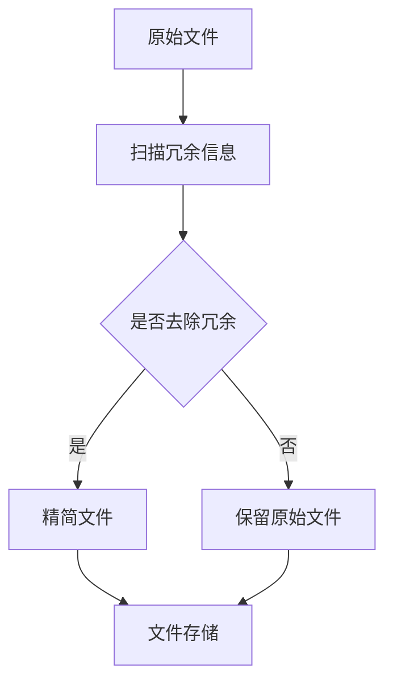
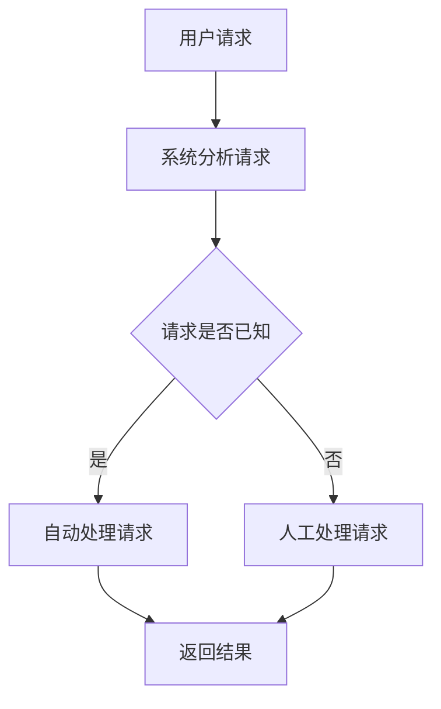
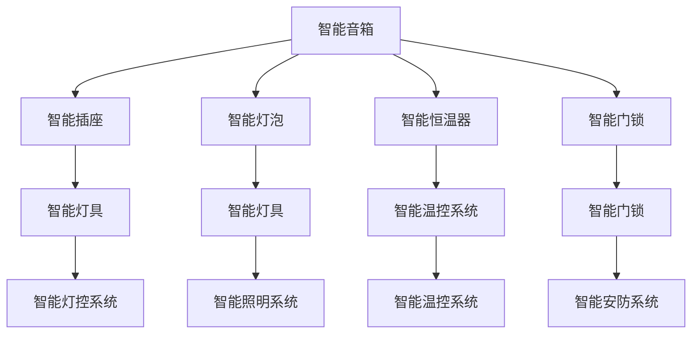
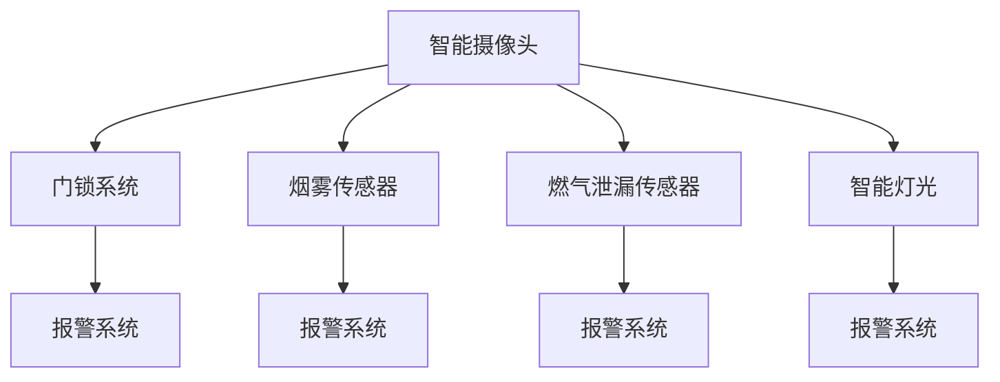
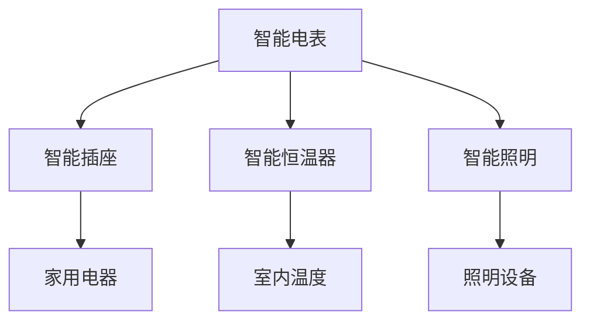
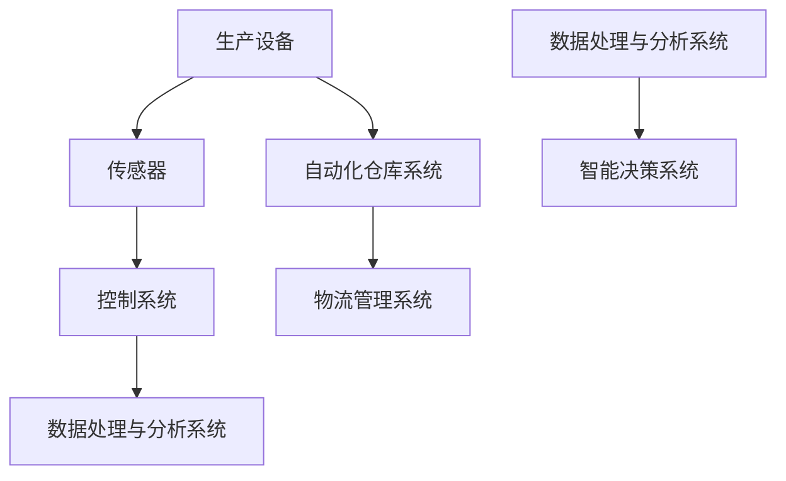
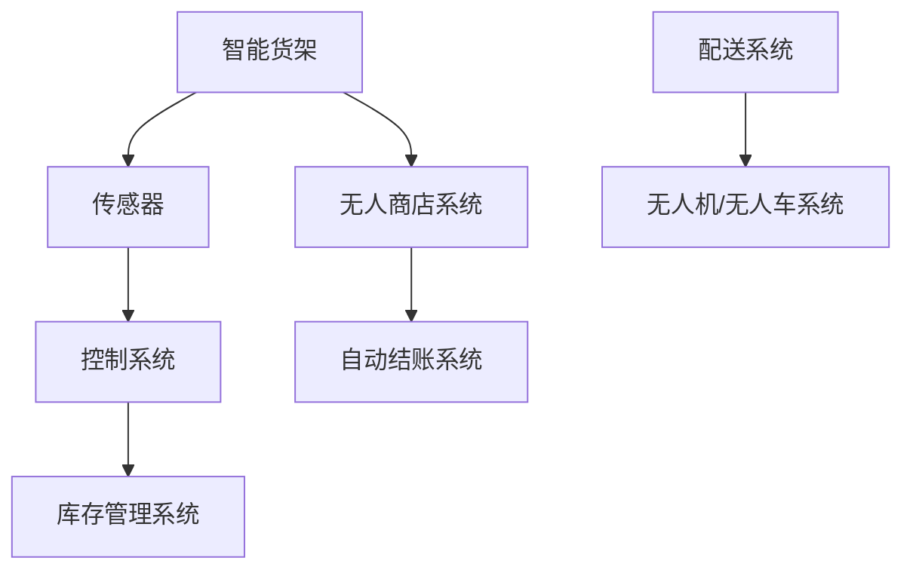
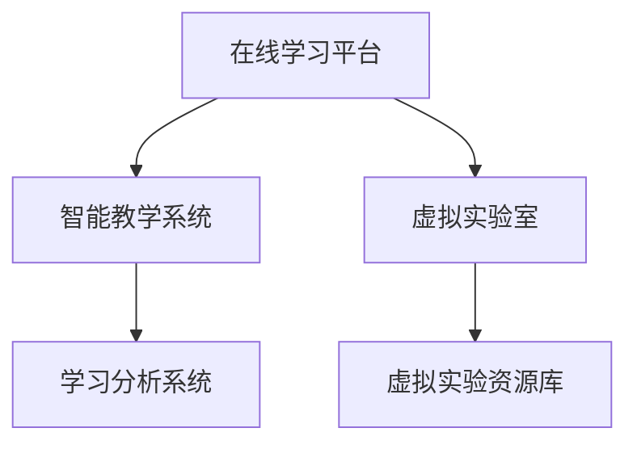

                 

# 《信息简化的工具和自动化实践：利用技术简化你的生活和工作》

## 关键词：简化、自动化、工具、技术、生活、工作

### 摘要：

在快速发展的现代社会，信息过载和工作压力常常让人感到疲惫不堪。本文旨在探讨如何利用技术工具和自动化实践来简化我们的生活和工作，提高效率和舒适度。通过分析核心概念、讲解算法原理、提供项目实战案例，本文将帮助读者理解信息简化和自动化的重要性，并掌握实际操作方法。

## 引言

在当今数字化时代，信息和技术已经深刻地改变了我们的生活和工作方式。随着互联网、大数据、人工智能等技术的普及，我们能够通过技术工具实现信息的快速处理和任务的自动化执行。这不仅提高了工作效率，也大大简化了我们的日常生活。

### 简化的定义与意义

简化是指通过减少不必要的复杂性，使事物变得更加简洁、直观和高效。在日常生活中，简化可以减少我们的时间和精力消耗，提高生活质量。在工作中，简化则可以提升工作效率，减少错误，创造更多的价值。

### 自动化的基础

自动化是指使用技术工具或系统来自动执行任务或流程。自动化可以减少人工干预，提高准确性，降低成本，同时释放人类工作者去从事更有创造性和价值的工作。

### 技术在简化与自动化中的作用

技术不仅为简化提供了工具，还推动了自动化的发展。例如，云计算和人工智能技术使得大规模数据处理和自动化决策成为可能。这些技术正在逐步渗透到各个领域，改变着我们的生活和工作方式。

### 本书结构概述

本文将分为以下几个部分：

1. **个人信息简化工具**：介绍如何使用工具来简化电子邮件管理、社交媒体使用、文档管理等。
2. **工作效率自动化**：探讨自动化在办公、项目管理、数据处理等方面的应用。
3. **家庭自动化实践**：展示智能家居系统和家庭安全自动化等案例。
4. **生活方式的简化**：讨论消费习惯、工作与生活平衡以及个人健康与福祉的自动化实践。
5. **自动化技术在行业中的应用**：分析制造业、零售业、教育等行业的自动化趋势和实践。
6. **自动化与未来**：展望自动化技术的发展趋势及其对社会的影响。

## 第一部分：工具与实践

### 第1章：个人信息简化工具

在信息爆炸的时代，个人信息管理变得越来越复杂。电子邮件、社交媒体和文档管理等任务都需要花费大量的时间和精力。通过使用适当的工具，我们可以有效地简化这些任务，提高工作效率。

### 第2章：工作效率自动化

工作效率是衡量一个人或一个组织成功的重要指标。通过自动化技术，我们可以简化重复性任务，提高工作效率，减少人为错误。

### 第3章：家庭自动化实践

家庭自动化已经成为现代家居生活的重要组成部分。通过智能家居系统和家庭安全自动化，我们可以提高生活舒适度和安全性。

### 第4章：生活方式的简化

生活方式的简化不仅关乎效率，更关乎生活质量。通过自动化实践，我们可以更好地管理消费习惯、工作与生活的平衡，以及个人健康与福祉。

### 第5章：自动化技术在行业中的应用

自动化技术在各个行业中的应用越来越广泛。通过自动化，企业可以提高生产效率，降低成本，提升竞争力。

### 第6章：自动化与未来

自动化技术正在快速发展，并深刻地改变着我们的生活方式。探讨自动化技术的未来发展趋势，有助于我们更好地理解和应对这些变化。

## 附录：常用工具和资源

附录部分将提供一些常用的工具和资源，帮助读者更好地实践自动化和简化技术。

### 附录 A：简化工具推荐

- 电子邮件管理工具：Gmail、Outlook
- 社交媒体管理工具：Hootsuite、Buffer
- 文档管理工具：Google Docs、Microsoft Office 365
- 自动化工具：IFTTT、 Zapier

### 附录 B：自动化工具推荐

- 办公自动化工具：Microsoft Office、Google Workspace
- 项目管理自动化工具：Trello、Asana
- 数据处理自动化工具：Python、R
- 智能家居自动化工具：Home Assistant、SmartThings

### 附录 C：技术资源链接

- 技术博客：Medium、Dev.to
- 在线课程：Coursera、Udemy
- 论坛与社区：Stack Overflow、GitHub

## 总结

通过本文，我们探讨了如何利用技术工具和自动化实践来简化我们的生活和工作。从个人信息管理到工作效率提升，再到家庭自动化和生活方式的简化，自动化技术正在帮助我们创造更加高效、舒适和可持续的未来。

### 作者信息

作者：AI天才研究院/AI Genius Institute & 禅与计算机程序设计艺术 /Zen And The Art of Computer Programming

---

由于篇幅限制，本文仅提供了大纲和部分章节的简要介绍。接下来，我们将逐步深入每个章节，详细讲解核心概念、算法原理、项目实战等内容。让我们开始第一步分析推理，逐章探讨如何利用技术实现信息简化和自动化。

## 第1章：简化的概念与实践

### 1.1 简化的定义与意义

简化（Simplification）是一种通过消除不必要的复杂性，使事物更加简洁、高效的过程。它不仅适用于日常生活的方方面面，也是现代工作环境中提升效率和减少负担的重要手段。

#### 核心概念与联系

简化的核心概念可以概括为以下几点：

1. **去除冗余**：删除多余的信息、步骤或功能，使任务更加直接和高效。
2. **优化流程**：对现有流程进行分析，找到优化点，使流程更加顺畅。
3. **标准化**：制定标准化的流程和规则，减少因个人习惯差异导致的效率损失。

下面是一个简化的Mermaid流程图，展示了一个简单的文件处理流程的简化过程：



### 1.1.1 简化在日常生活中的应用

在日常生活中，简化可以显著提高生活质量。以下是一些简化生活的小技巧：

- **电子邮件管理**：使用邮件过滤器自动分类邮件，减少查看无用的邮件时间。
- **家务劳动**：制定固定的清洁和整理计划，减少随机性和耗时。
- **购物清单**：提前制定购物清单，避免重复购买和冲动消费。

### 1.1.2 工作中简化的重要性

在工作中，简化可以大幅提高工作效率，减少错误，并促进创新。以下是几个在工作环境中简化的重要方面：

- **任务分配**：明确每个团队成员的职责，减少沟通成本和任务重叠。
- **流程优化**：对现有工作流程进行分析和优化，提高整体效率。
- **自动化工具**：利用自动化工具处理重复性任务，提高工作质量。

### 1.2 自动化的基础

自动化（Automation）是通过技术手段实现任务或流程的自动执行。它能够减少人为干预，提高工作效率，减少错误，降低成本。自动化的基础包括以下几个方面：

#### 核心概念与联系

- **编程**：编写程序来控制计算机或设备的操作。
- **算法**：用于解决特定问题的步骤序列，是自动化的核心。
- **数据库**：用于存储和管理数据，是自动化系统中重要的数据来源。
- **机器学习**：通过训练模型来自动执行任务，是自动化技术的重要组成部分。

下面是一个Mermaid流程图，展示了一个简单的自动化工作流程：



### 1.2.1 自动化的定义与原理

自动化是指通过技术手段（如编程、算法、数据库等）使任务或流程在不需要人工干预的情况下自动执行。自动化的原理可以简单概括为以下几点：

- **重复性任务**：自动化主要针对那些重复性高、无需人工判断的任务。
- **程序控制**：通过编写程序来控制计算机或设备的操作。
- **数据驱动**：自动化系统依赖于数据的输入和输出，以实现自动化决策。

### 1.2.2 自动化工具的选择

选择合适的自动化工具对于实现自动化至关重要。以下是一些常见的自动化工具：

- **脚本语言**：如Python、JavaScript，用于编写简单的自动化脚本。
- **集成开发环境（IDE）**：如Visual Studio Code、PyCharm，提供开发、调试和运行自动化脚本的环境。
- **自动化平台**：如UiPath、Blue Prism，提供图形化界面，无需编程知识即可实现自动化。

### 1.3 技术在简化与自动化中的作用

技术作为简化与自动化的基础，正深刻地改变着我们的生活和工作方式。以下是技术在这方面发挥的几个关键作用：

- **提高效率**：通过自动化工具和算法，可以快速处理大量数据，减少人为错误。
- **降低成本**：自动化减少了人工干预，降低了人力成本，同时减少了因人为失误导致的损失。
- **增强创新**：简化了重复性任务，使人类工作者可以更多地投入到创造性工作中。

### 1.3.1 技术简化的趋势

随着技术的不断发展，简化趋势呈现出以下几个特点：

- **智能化**：人工智能技术使自动化更加智能，能够根据数据做出更加准确的决策。
- **集成化**：各种技术工具和平台逐渐集成，形成更加完整的自动化解决方案。
- **普及化**：自动化技术不再局限于大型企业，小型企业和个人用户也能轻松实现自动化。

### 1.3.2 技术自动化的优势

技术自动化的优势主要体现在以下几个方面：

- **提高效率**：自动化工具可以快速处理大量数据，减少人工干预，提高工作效率。
- **降低成本**：自动化减少了人力成本，降低了因人为失误导致的损失。
- **减少错误**：自动化系统能够精确执行任务，减少人为错误。
- **增强灵活性**：自动化系统可以根据需求灵活调整和扩展，适应不同的业务场景。

### 1.4 本书结构概述

本书分为六个部分，分别从个人信息简化工具、工作效率自动化、家庭自动化实践、生活方式简化、自动化技术在行业中的应用以及自动化与未来等方面，详细探讨如何利用技术实现信息简化和自动化。

- **第一部分：个人信息简化工具**：介绍电子邮件管理、社交媒体简化、文档与文件管理等实用技巧。
- **第二部分：工作效率自动化**：探讨自动化在办公、项目管理、数据处理等方面的应用。
- **第三部分：家庭自动化实践**：展示智能家居系统和家庭安全自动化等案例。
- **第四部分：生活方式的简化**：讨论消费习惯简化、工作与生活平衡以及个人健康与福祉的自动化实践。
- **第五部分：自动化技术在行业中的应用**：分析制造业、零售业、教育等行业的自动化趋势和实践。
- **第六部分：自动化与未来**：展望自动化技术的发展趋势及其对社会的影响。

### 1.4.1 各章节内容概览

以下是各章节的内容概览：

- **第1章：简化的概念与实践**：介绍简化的定义、意义以及自动化的基础知识。
- **第2章：个人信息简化工具**：探讨电子邮件管理、社交媒体简化、文档与文件管理等方面的自动化工具。
- **第3章：工作效率自动化**：分析自动化在办公、项目管理、数据处理等方面的应用。
- **第4章：家庭自动化实践**：介绍智能家居系统和家庭安全自动化等案例。
- **第5章：生活方式的简化**：讨论消费习惯简化、工作与生活平衡以及个人健康与福祉的自动化实践。
- **第6章：自动化技术在行业中的应用**：分析制造业、零售业、教育等行业的自动化趋势和实践。
- **第7章：自动化与未来**：展望自动化技术的发展趋势及其对社会的影响。

### 1.4.2 阅读指南

为了更好地理解本书的内容，建议读者按照以下步骤进行阅读：

1. **通读全书**：首先通读全书，了解各章节的内容概览和整体结构。
2. **深入学习**：针对感兴趣的章节，深入阅读并学习相关技巧和实践。
3. **实践操作**：结合实际生活和工作场景，尝试应用书中介绍的工具和实践。
4. **反复阅读**：在实践过程中，反复阅读相关章节，巩固所学知识。

### 附录：常用工具和资源

为了帮助读者更好地实践本书所介绍的内容，附录部分将提供一些常用的工具和资源，包括电子邮件管理工具、社交媒体管理工具、文档管理工具、自动化工具等。

- **电子邮件管理工具**：Gmail、Outlook
- **社交媒体管理工具**：Hootsuite、Buffer
- **文档管理工具**：Google Docs、Microsoft Office 365
- **自动化工具**：IFTTT、Zapier

此外，附录还将提供一些技术资源链接，包括技术博客、在线课程和论坛与社区，以供读者进一步学习和交流。

## 第2章：个人信息简化工具

在信息化时代，个人信息管理变得尤为重要。电子邮件、社交媒体、文档管理等任务往往占用了我们大量的时间和精力。通过使用合适的工具和自动化实践，我们可以有效地简化这些任务，提高工作效率，从而更好地享受数字化生活。

### 2.1 邮件管理

电子邮件是现代通信的重要工具，但也常常成为信息过载的源头。通过使用邮件管理工具和自动化策略，我们可以更好地控制邮件流，减少不必要的干扰，提高工作效率。

#### 2.1.1 电子邮件简化的策略

以下是一些电子邮件简化的策略：

- **邮件过滤器**：使用邮件过滤器自动分类邮件，将广告邮件、垃圾邮件等直接移至垃圾箱，避免占用邮箱空间。
- **邮件模板**：对于经常发送的邮件，如回复客户询问或同事请求，可以预先编写邮件模板，快速发送。
- **定期清理**：定期清理未读邮件和已读邮件，删除无关紧要的邮件，保持邮箱整洁。

#### 2.1.2 使用邮件过滤器

邮件过滤器是简化电子邮件管理的重要工具。以下是使用邮件过滤器的步骤：

1. **设置过滤器**：在邮箱设置中，创建新的过滤器，指定邮件的来源、主题、发件人等条件。
2. **分配标签**：将符合条件的邮件自动分配到特定的标签或文件夹，便于分类和管理。
3. **执行操作**：对于符合条件的邮件，可以执行多种操作，如移动到特定文件夹、添加星标、标记为重要等。

以下是一个邮件过滤器的伪代码示例：

```python
# 设置邮件过滤器
def set_mail_filter(condition, action):
    # 根据条件执行操作
    if condition:
        # 将邮件移动到特定文件夹
        move_to_folder("Promotions")
    # 标记为垃圾邮件
    mark_as_spam()

# 示例：创建一个过滤器，将包含"促销"二字的邮件移动到"促销"文件夹
set_mail_filter("contains('促销')", "move_to_folder('Promotions')")
```

#### 2.1.3 邮件自动化处理示例

假设我们想要实现以下自动化处理流程：

1. 检查是否有新的邮件。
2. 如果有，读取邮件内容。
3. 如果邮件主题包含"提醒"，则发送提醒给指定联系人。
4. 如果邮件主题包含"任务"，则创建任务并将其添加到待办事项列表。

以下是实现这一自动化处理流程的伪代码：

```python
import imaplib
import smtplib

# 连接到邮箱
def connect_to_mailbox():
    # 登录邮箱
    mail = imaplib.IMAP4_SSL("imap.example.com")
    mail.login("username", "password")
    # 选择收件夹
    mail.select("inbox")
    return mail

# 读取邮件
def read_mail(mail):
    # 查找未读邮件
    result, data = mail.search(None, 'UNSEEN')
    if result == 'OK':
        # 获取邮件列表
        for num in data[0].split():
            result, data = mail.fetch(num, '(RFC822)')
            # 解析邮件内容
            subject = parse_subject(data)
            if "提醒" in subject:
                send_reminder(contact_email)
            elif "任务" in subject:
                create_task(task_description)

# 发送提醒邮件
def send_reminder(contact_email):
    # 配置SMTP服务器
    server = smtplib.SMTP_SSL("smtp.example.com")
    server.login("username", "password")
    # 发送邮件
    server.sendmail("from_email", contact_email, "Please remind us about the meeting tomorrow.")
    server.quit()

# 创建任务
def create_task(task_description):
    # 将任务添加到待办事项列表
    with open("tasks.txt", "a") as file:
        file.write(task_description + "\n")

# 解析邮件主题
def parse_subject(data):
    # 解析邮件内容，获取主题
    return data[0].decode('utf-8').split('\n')[0]

# 主函数
def main():
    mail = connect_to_mailbox()
    read_mail(mail)

if __name__ == "__main__":
    main()
```

### 2.2 社交媒体简化

社交媒体是现代人生活中不可或缺的一部分，但过多地关注和参与社交媒体也会分散我们的注意力，影响工作和生活。通过简化社交媒体的使用，我们可以更好地管理时间和精力。

#### 2.2.1 社交媒体的时间管理

以下是一些社交媒体时间管理的策略：

- **设定使用时间**：每天或每周设定一定的社交媒体使用时间，避免无限制地浏览。
- **使用时间限制工具**：使用智能手机或电脑上的时间限制功能，在达到设定时间后自动限制访问。
- **关注高质量内容**：关注一些有价值、高质量的账号，减少无效信息的干扰。

#### 2.2.2 社交媒体自动化工具

社交媒体自动化工具可以帮助我们更好地管理社交媒体账户，提高工作效率。以下是一些常见的社交媒体自动化工具：

- **Hootsuite**：用于管理和发布社交媒体内容，支持多个平台。
- **Buffer**：用于自动化发布社交媒体内容，提高发布效率。
- **Later**：用于规划和管理社交媒体发布日程。

#### 2.2.3 社交媒体简化案例

以下是一个社交媒体简化的案例：

1. 每天使用社交媒体的时间不超过30分钟。
2. 关注的账号数量不超过50个，且这些账号都是高质量、有价值的。
3. 使用自动化工具在非工作时间发布内容，避免在工作时间分散注意力。

### 2.3 文档与文件管理

文档与文件管理是日常工作中非常重要的部分，良好的文件管理可以提高工作效率，减少错误，方便团队协作。通过使用文档管理工具和自动化实践，我们可以简化文档管理过程。

#### 2.3.1 文档分类与管理

以下是一些文档分类与管理的策略：

- **使用文件夹**：将文档分类存储在不同的文件夹中，便于查找和管理。
- **使用标签**：为文档添加标签，实现更细致的分类。
- **定期清理**：定期清理无用的旧文档，保持文件系统的整洁。

#### 2.3.2 文件备份与同步

文件备份与同步是保障数据安全的重要措施。以下是一些备份与同步的策略：

- **本地备份**：将重要文件备份到本地硬盘或U盘，以备不时之需。
- **云备份**：使用云服务（如Google Drive、Dropbox）进行文件备份，实现跨设备的访问。
- **自动化同步**：使用自动化工具定期同步本地文件和云存储，确保数据一致性。

#### 2.3.3 文档自动化归档

文档自动化归档可以帮助我们更好地管理文档，提高工作效率。以下是一个文档自动化归档的示例：

1. 每月将旧的文档自动归档到特定文件夹。
2. 自动化工具根据文件创建日期进行归档。
3. 归档后的文档仍可被检索，但不再影响日常使用。

### 2.4 日常任务自动化

日常任务自动化是提高工作效率和生活质量的重要手段。通过使用自动化工具和脚本，我们可以将日常任务自动化，减少手动操作，节省时间。

#### 2.4.1 自动化工具的选择

以下是一些常见的自动化工具：

- **IFTTT**：用于创建简单的自动化任务，连接不同应用和服务。
- **Zapier**：功能更强大的自动化工具，支持多种应用和服务之间的集成。
- **Tasker**：适用于Android设备的自动化工具，可以进行复杂的自动化任务。

#### 2.4.2 自动化流程设计

以下是一个简单的自动化流程设计：

1. 当手机连接到家中Wi-Fi时，自动将手机亮度调整为夜晚模式。
2. 当收到特定联系人电话时，自动将通话录音。
3. 每天早晨7点，自动发送天气预报和待办事项列表到邮箱。

#### 2.4.3 自动化任务执行与监控

自动化任务执行与监控是确保自动化流程正常运行的必要步骤。以下是一些监控策略：

- **日志记录**：记录自动化任务的执行日志，以便在出现问题时快速定位和解决问题。
- **定时检查**：定期检查自动化任务的状态，确保其正常运行。
- **报警机制**：当自动化任务出现异常时，自动发送报警信息到指定联系人。

### 小结

通过使用个人信息简化工具和自动化实践，我们可以有效地提高工作效率和生活质量。邮件管理、社交媒体简化、文档与文件管理以及日常任务自动化都是简化我们生活和工作的重要方面。在实际操作中，我们可以根据自己的需求和场景选择合适的工具和策略，实现信息简化和自动化。

## 第3章：工作效率自动化

工作效率是衡量一个人或一个组织成功的关键因素。随着技术的进步，自动化技术在提高工作效率方面发挥了越来越重要的作用。通过自动化，我们可以简化重复性任务，提高数据处理效率，优化项目管理，从而更好地专注于创造性和战略性的工作。本章将详细介绍如何利用自动化技术提高工作效率。

### 3.1 自动化办公工具

自动化办公工具是提高工作效率的重要手段。这些工具可以帮助我们自动化处理日常工作中的任务，如文档处理、日程安排、数据录入等。以下是一些常见的自动化办公工具：

#### 3.1.1 Microsoft Office 365

Microsoft Office 365 是一款集成了多个办公应用的套件，包括Word、Excel、PowerPoint等。通过使用这些应用，我们可以实现以下自动化功能：

- **文档自动格式化**：使用宏和VBA脚本，自动格式化文档，减少手动操作。
- **数据自动处理**：利用Excel的公式和数据透视表，自动处理和分析大量数据。
- **邮件批量发送**：使用Outlook的邮件模板和批量发送功能，自动化处理邮件发送。

以下是一个使用VBA脚本自动格式化Word文档的示例：

```vbnet
Sub AutoFormat()
    Dim para As Paragraph
    For Each para In ActiveDocument.Paragraphs
        With para
            .Alignment = wdAlignParagraphCenter
            .Font.Bold = True
            .Font.Italic = True
        End With
    Next para
End Sub
```

#### 3.1.2 Google Workspace

Google Workspace 是另一款功能强大的自动化办公工具，包括Google Docs、Google Sheets、Google Calendar等。以下是一些自动化功能：

- **文档版本控制**：自动保存文档版本，避免数据丢失。
- **数据自动分析**：使用Google Sheets的公式和数据可视化功能，自动化处理和分析数据。
- **日程安排**：使用Google Calendar，自动化安排和提醒日程。

以下是一个使用Google Sheets自动计算销售数据的示例：

```excel
=SUMIF(A2:A10, "Sales", B2:B10)
```

### 3.1.3 自动化办公工具的配置与使用

配置和使用自动化办公工具通常包括以下步骤：

1. **安装和设置**：安装相应的办公软件，并按照提示完成设置。
2. **学习基本操作**：了解办公软件的基本功能和操作方法，如使用宏、VBA脚本、公式等。
3. **编写自动化脚本**：根据实际需求，编写宏、VBA脚本或Google Sheets公式，实现自动化功能。
4. **测试和调试**：在实际工作中测试自动化脚本，确保其正常运行，并根据需要调整和优化。

### 3.1.4 自动化办公案例分析

以下是一个自动化办公案例：

**案例：自动化处理销售报告**

某公司销售人员每天需要填写销售报告，并提交给经理。为了提高效率，公司决定使用自动化工具处理销售报告。

1. **使用Google Sheets创建销售报告模板**：包含销售日期、销售额、客户信息等字段。
2. **编写VBA脚本，将Excel数据自动导入Google Sheets**：使用Excel中的宏记录器记录数据导入过程，并编写相应的VBA脚本。
3. **设置自动化任务**：每天自动执行VBA脚本，将Excel数据导入Google Sheets。
4. **使用Google Sheets的公式自动计算销售额、客户贡献等数据**。
5. **使用Google Calendar自动发送报告提醒**：设置每天下午4点自动发送报告提醒邮件给销售团队。

通过上述自动化流程，公司大大提高了销售报告的效率和准确性，减少了人为错误。

### 3.2 项目管理自动化

项目管理是工作中常见且重要的一部分。通过自动化技术，我们可以简化项目管理工作，提高项目进度跟踪和协作效率。以下是一些项目管理自动化工具：

#### 3.2.1 自动化工具在项目管理中的应用

- **Trello**：使用Trello进行项目任务分解和进度跟踪。通过创建看板、列表和卡片，自动化管理项目任务。
- **Asana**：用于项目任务分配、进度跟踪和协作。支持自动化任务分配、提醒和进度报告。
- **Jira**：适用于敏捷开发团队的项目管理工具，支持自动化任务创建、分配和进度跟踪。

#### 3.2.2 项目流程自动化设计

以下是一个简单的项目流程自动化设计：

1. **任务创建**：每当有新的项目任务，自动创建任务卡片。
2. **任务分配**：根据任务类型和团队成员的职责，自动分配任务。
3. **进度跟踪**：实时监控任务进度，自动生成进度报告。
4. **提醒和通知**：在任务截止日期前自动发送提醒通知。

#### 3.2.3 项目进度与监控自动化

以下是一个使用Trello进行项目进度监控的示例：

1. **创建项目看板**：为每个项目创建一个看板，包含"待办"、"进行中"、"已完成"等列表。
2. **创建任务卡片**：为每个任务创建一个卡片，包含任务描述、截止日期和责任人。
3. **任务状态更新**：成员在完成任务时，将任务卡片从"待办"移动到"已完成"。
4. **自动化进度报告**：定期生成项目进度报告，包括任务完成情况、进度图表等。

### 3.3 数据处理自动化

数据处理是现代工作中不可或缺的一部分。通过自动化技术，我们可以简化数据处理过程，提高数据分析和处理的效率。以下是一些数据处理自动化工具：

#### 3.3.1 数据处理工具的选择

- **Python**：适用于各种数据处理任务，支持多种数据处理库，如Pandas、NumPy。
- **R**：专注于统计分析和数据可视化，适用于复杂的数据分析任务。
- **Power BI**：适用于企业级的数据分析和报告，支持自动化数据连接、分析和报告生成。

#### 3.3.2 数据处理流程自动化

以下是一个数据处理流程自动化示例：

1. **数据采集**：从不同的数据源（如数据库、文件、API）自动采集数据。
2. **数据清洗**：使用自动化工具去除重复数据、缺失值和异常值。
3. **数据分析**：使用自动化工具执行统计分析、机器学习模型训练等任务。
4. **数据可视化**：生成数据报表和可视化图表，自动发送报告。

#### 3.3.3 数据分析与可视化自动化

以下是一个使用Python和Pandas进行数据分析和可视化的示例：

```python
import pandas as pd
import matplotlib.pyplot as plt

# 读取数据
data = pd.read_csv("sales_data.csv")

# 数据清洗
data.drop_duplicates(inplace=True)
data.fillna(0, inplace=True)

# 数据分析
sales_summary = data.groupby("region")["sales"].sum()

# 数据可视化
sales_summary.plot(kind="bar")
plt.title("Sales by Region")
plt.xlabel("Region")
plt.ylabel("Sales")
plt.show()
```

通过上述自动化流程，我们可以快速完成数据处理和分析任务，提高工作效率。

### 小结

工作效率自动化是提高工作效率和生活质量的关键。通过使用自动化办公工具、项目管理工具和数据处理工具，我们可以简化日常工作中的任务，提高工作效率，减少人为错误。在实际操作中，我们需要根据自己的需求和场景选择合适的工具和策略，实现工作效率的全面提升。

### 3.4 人工智能在自动化中的应用

随着人工智能技术的快速发展，人工智能（AI）在自动化中的应用变得越来越广泛。AI技术可以帮助我们实现更加智能、高效的自动化流程，从而进一步提升工作效率。以下是一些AI在自动化中的应用场景：

#### 3.4.1 机器学习模型自动化

机器学习模型是AI技术的核心，通过训练模型，我们可以实现自动化预测、分类和回归任务。以下是一个使用机器学习模型自动化的示例：

```python
from sklearn.linear_model import LinearRegression
from sklearn.model_selection import train_test_split

# 加载数据
data = pd.read_csv("sales_data.csv")
X = data[['month', 'temperature']]
y = data['sales']

# 分割数据集
X_train, X_test, y_train, y_test = train_test_split(X, y, test_size=0.2, random_state=42)

# 训练模型
model = LinearRegression()
model.fit(X_train, y_train)

# 预测
predictions = model.predict(X_test)

# 自动化预测
def predict_sales(month, temperature):
    return model.predict([[month, temperature]])[0]

# 示例：预测下个月的销售额
next_month_sales = predict_sales(7, 25)
print(f"Next month's sales prediction: {next_month_sales}")
```

#### 3.4.2 自然语言处理（NLP）自动化

自然语言处理技术可以帮助我们自动化文本分析、情感分析、命名实体识别等任务。以下是一个使用NLP自动化的示例：

```python
from nltk.sentiment import SentimentIntensityAnalyzer
import nltk

# 下载NLP工具包
nltk.download('vader_lexicon')

# 加载情感分析工具
sia = SentimentIntensityAnalyzer()

# 分析文本
text = "The new product launch has been a huge success!"
sentiments = sia.polarity_scores(text)

# 输出情感分析结果
print(sentiments)
```

#### 3.4.3 计算机视觉（CV）自动化

计算机视觉技术可以帮助我们自动化图像识别、目标检测、图像分割等任务。以下是一个使用计算机视觉自动化的示例：

```python
import cv2

# 读取图像
image = cv2.imread("example_image.jpg")

# 使用Haar特征分类器进行人脸检测
face_cascade = cv2.CascadeClassifier(cv2.data.haarcascades + 'haarcascade_frontalface_default.xml')
faces = face_cascade.detectMultiScale(image, scaleFactor=1.1, minNeighbors=5, minSize=(30, 30))

# 绘制矩形框
for (x, y, w, h) in faces:
    cv2.rectangle(image, (x, y), (x+w, y+h), (0, 0, 255), 2)

# 显示结果
cv2.imshow('Face Detection', image)
cv2.waitKey(0)
cv2.destroyAllWindows()
```

#### 3.4.4 AI驱动的自动化流程

通过结合多种AI技术，我们可以构建智能化的自动化流程。以下是一个使用AI驱动的自动化流程示例：

1. **数据采集**：使用传感器和设备自动采集生产数据。
2. **数据预处理**：使用NLP技术对采集到的文本数据进行清洗和分类。
3. **预测分析**：使用机器学习模型对数据进行预测分析，如设备故障预测、产量预测等。
4. **决策支持**：根据预测结果，自动生成决策支持报告，指导生产调度和优化。

通过这些示例，我们可以看到人工智能在自动化中的应用如何帮助我们实现更加智能、高效的自动化流程。在实际应用中，我们需要根据具体需求和场景选择合适的AI技术，并构建相应的自动化系统。

### 3.5 自动化技术的挑战与未来趋势

尽管自动化技术为提高工作效率和生活质量带来了巨大的好处，但在实际应用中仍面临一些挑战和问题。以下是一些自动化技术的挑战和未来趋势：

#### 3.5.1 挑战

1. **技术门槛**：自动化技术通常需要较高的编程和数据分析技能，对于非技术人员来说可能难以掌握。
2. **数据隐私和安全**：自动化过程中涉及大量的数据处理和存储，数据隐私和安全问题日益突出。
3. **人类工作替代**：自动化技术的发展可能导致部分人类工作的替代，引发就业问题。
4. **错误与故障**：自动化系统可能会出现错误和故障，需要及时检测和修复。

#### 3.5.2 未来趋势

1. **人工智能集成**：未来自动化技术将更加集成人工智能技术，实现更加智能、自适应的自动化流程。
2. **云计算与边缘计算**：随着云计算和边缘计算的发展，自动化系统将更加灵活、高效，支持大规模数据处理和实时响应。
3. **人机协同**：自动化技术与人类工作者的协同将变得更加紧密，实现更加高效、灵活的工作方式。
4. **可持续发展**：自动化技术将在可持续发展的背景下发挥重要作用，如智能制造、智能农业等。

通过克服这些挑战并把握未来趋势，自动化技术将继续为我们的生活和工作带来更多便利和效率。

### 小结

本章详细介绍了工作效率自动化的各个方面，包括自动化办公工具、项目管理工具、数据处理工具以及人工智能在自动化中的应用。通过这些自动化工具和技术的应用，我们可以显著提高工作效率，减少人为错误，为未来的工作方式和生活方式带来更多创新和变革。在实际操作中，我们需要根据具体需求和场景选择合适的工具和策略，不断优化和改进自动化流程。

## 第4章：家庭自动化实践

随着科技的进步，家庭自动化已经成为现代家居生活的重要趋势。通过家庭自动化系统，我们可以实现家电的智能控制、家庭安全的自动化管理以及能源的有效管理，从而提高生活舒适度、安全性和可持续性。本章将详细介绍家庭自动化的实践，包括家居自动化设备、家庭安全自动化以及家庭能源管理自动化。

### 4.1 家居自动化设备

家居自动化设备是家庭自动化的基础，通过这些设备，我们可以实现对家电的远程控制、自动化操作以及智能调节。以下是一些常见的家居自动化设备：

#### 4.1.1 智能家居系统介绍

智能家居系统是家庭自动化的核心，它通过将各种家居设备连接到互联网，实现集中管理和智能控制。常见的智能家居系统包括：

- **智能音箱**：如Amazon Echo、Google Home，通过语音助手实现家电控制、信息查询等功能。
- **智能开关**：如智能插座、智能开关面板，可以实现远程控制家电开关。
- **智能照明**：如智能灯泡、智能灯具，可以通过手机应用或语音控制实现灯光的调节和开关。
- **智能温控**：如智能恒温器，可以自动调节室内温度，提高舒适度和节能效果。
- **智能门锁**：如智能锁、智能门铃，可以实现远程控制门锁状态和视频通话。

以下是一个智能家居系统的架构图，展示了各类智能家居设备之间的互联和协同工作：



#### 4.1.2 智能家居设备的使用

以下是一些智能家居设备的使用方法和示例：

1. **智能音箱**：
   - **语音控制**：通过语音命令控制智能音箱播放音乐、设置提醒、查询天气等。
   - **智能家居控制**：通过语音命令控制家中的智能灯泡、智能插座等设备。

2. **智能开关**：
   - **远程控制**：通过手机应用远程控制家中的智能插座，实现家电的开关。
   - **定时开关**：设置定时开关，实现家电的自动化操作。

3. **智能照明**：
   - **场景控制**：通过手机应用或智能音箱设置不同场景的照明模式，如阅读模式、晚餐模式等。
   - **自动化调节**：根据时间和天气自动调节灯光亮度，提高节能效果。

4. **智能温控**：
   - **自动调节**：智能恒温器根据室内温度和用户习惯自动调节室内温度。
   - **远程控制**：通过手机应用远程控制家中的智能温控系统。

5. **智能门锁**：
   - **远程开锁**：通过手机应用远程控制门锁状态，实现远程开锁。
   - **门锁监控**：通过手机应用实时监控门锁状态，确保家庭安全。

#### 4.1.3 家庭自动化场景案例

以下是一个家庭自动化场景案例：

**案例：智能家庭安防**

1. **实时监控**：安装智能摄像头，通过手机应用实时监控家庭情况，实现远程实时查看。
2. **自动报警**：当有异常情况（如入侵、火灾等）发生时，智能摄像头自动发送报警通知到用户手机，同时通知门锁系统进行紧急处理。
3. **自动联动**：当门锁系统检测到异常时，自动关闭窗户、灯光和智能门锁，提高家庭安全。

通过这些自动化场景，我们可以显著提高家庭的安全性和舒适度，减少人为干预，实现真正的智能家居生活。

### 4.2 家庭安全自动化

家庭安全是每个家庭都关心的问题，通过家庭安全自动化系统，我们可以实现对家庭安全的实时监控和自动响应，提高家庭安全防护能力。

#### 4.2.1 家庭安全自动化技术

家庭安全自动化技术主要包括以下方面：

- **智能摄像头**：用于实时监控家庭内部和外部环境，支持移动侦测、声音侦测等功能。
- **门锁系统**：包括智能门锁、智能门铃等，用于控制家庭入口的开关。
- **烟雾传感器**：用于检测烟雾浓度，一旦发生火灾，自动报警并通知消防系统。
- **燃气泄漏传感器**：用于检测燃气泄漏，自动报警并切断燃气供应。
- **智能灯光**：通过智能灯光系统，实现夜间自动亮灯，提高安全性。

以下是一个家庭安全自动化系统的架构图，展示了各类安全设备之间的互联和协同工作：



#### 4.2.2 家庭安全自动化设备的配置

家庭安全自动化设备的配置包括以下几个步骤：

1. **设备安装**：安装智能摄像头、门锁、传感器等设备，确保设备正常工作。
2. **系统连接**：将设备连接到家庭网络，确保设备可以与云平台或手机应用进行通信。
3. **设备设置**：通过手机应用或云平台对设备进行设置，如设置监控区域、报警阈值、联动规则等。
4. **测试与调试**：进行设备测试和调试，确保设备可以正常工作，并根据需要调整设置。

#### 4.2.3 家庭安全自动化案例分析

以下是一个家庭安全自动化的案例：

**案例：智能家庭安防系统**

1. **实时监控**：安装智能摄像头，覆盖家庭各个角落，实现全天候实时监控。
2. **入侵报警**：当有异常入侵时，智能摄像头自动发送报警通知到用户手机，并触发警报。
3. **门锁控制**：用户可以通过手机应用远程控制门锁，确保家庭入口的安全。
4. **烟雾与燃气检测**：安装烟雾传感器和燃气泄漏传感器，实时监测家庭环境，一旦发生异常，自动报警并通知用户。
5. **自动联动**：当有异常情况发生时，智能灯光自动亮起，门锁系统自动锁定，确保家庭安全。

通过这些自动化措施，家庭的安全防护能力得到了显著提升，用户可以更加放心地享受家庭生活。

### 4.3 家庭能源管理自动化

家庭能源管理自动化是提高能源利用效率、减少能源浪费的重要手段。通过自动化技术，我们可以实现对家庭电器、照明等设备的智能控制，实现节能降耗。

#### 4.3.1 家庭能源管理的挑战

家庭能源管理面临以下挑战：

- **设备多样**：家庭中使用的电器种类繁多，不同设备的能源消耗特点和需求不同。
- **时间变化**：家庭的用电需求随着时间变化而变化，需要实时调整能源使用。
- **成本控制**：家庭能源管理需要考虑到成本控制，避免不必要的能源浪费。

#### 4.3.2 家庭能源自动化工具

以下是一些家庭能源自动化工具：

- **智能电表**：通过智能电表实时监测家庭电力消耗情况，为能源管理提供数据支持。
- **智能插座**：用于控制家庭电器的开关，实现远程控制和定时控制。
- **智能恒温器**：通过智能恒温器自动调节室内温度，实现节能效果。
- **智能照明**：通过智能照明系统实现照明设备的自动化控制，根据环境亮度自动调节灯光亮度。

以下是一个家庭能源自动化系统的架构图，展示了各类能源设备之间的互联和协同工作：



#### 4.3.3 家庭能源管理自动化案例

以下是一个家庭能源管理自动化的案例：

**案例：智能家庭能源管理**

1. **实时监测**：安装智能电表，实时监测家庭电力消耗情况，并通过手机应用实时查看。
2. **设备控制**：通过智能插座和智能照明系统，实现远程控制和定时控制，减少不必要的能源消耗。
3. **智能调节**：智能恒温器根据室内温度和用户习惯自动调节室内温度，实现节能效果。
4. **数据分析**：通过智能电表和手机应用的数据分析功能，了解家庭能源消耗情况，为节能优化提供依据。

通过这些自动化措施，家庭能源利用效率得到了显著提升，能源浪费得到了有效控制。

### 小结

家庭自动化实践是现代家居生活的重要趋势，通过智能家居设备、家庭安全自动化和能源管理自动化，我们可以提高生活舒适度、安全性和能源利用效率。在实际应用中，我们需要根据家庭的具体需求和场景，选择合适的自动化设备和技术，实现真正的智能家居生活。

## 第5章：生活方式的简化

在现代生活中，随着科技的不断进步，我们的生活方式也在发生着巨大的变化。然而，随着生活方式的丰富，我们的时间和精力却变得越来越紧张。为了提高生活质量，我们需要寻找方法来简化我们的生活方式。本章将讨论如何通过自动化和简化技术来改善消费习惯、工作与生活的平衡以及个人健康与福祉。

### 5.1 消费习惯简化

消费习惯的简化可以帮助我们更好地管理个人财务，减少冲动消费，从而提高生活质量。以下是一些简化消费习惯的方法：

#### 5.1.1 消费习惯的评估与改进

要简化消费习惯，首先需要对自己的消费习惯进行评估。以下是一些评估和改进消费习惯的步骤：

1. **记录消费**：记录每天的支出，了解自己在哪些方面消费较多。
2. **分类分析**：将消费记录按照类别进行分类，分析自己在各个类别的消费是否合理。
3. **制定预算**：根据收入和支出情况，制定合理的月度和年度预算。
4. **调整消费**：根据预算和消费分析结果，减少不必要的支出，优化消费结构。

以下是一个简单的消费记录和分析表格：

| 日期 | 类别 | 支出金额（元） | 备注 |
|------|------|--------------|------|
| 2023-01-01 | 餐饮 | 200 | 外卖 |
| 2023-01-02 | 交通 | 50 | 市区公交 |
| 2023-01-03 | 通讯 | 100 | 手机话费 |
| 2023-01-04 | 衣物 | 500 | 购买新衣 |

通过这样的表格，我们可以清楚地看到自己在各个类别的支出情况，进而进行优化。

#### 5.1.2 消费自动化工具

为了更好地管理消费，我们可以使用一些自动化工具，如：

- **自动储蓄**：使用银行或金融平台的自动储蓄功能，每月自动将一定金额转入储蓄账户。
- **预算应用**：使用预算管理应用，如YNAB（You Need A Budget），通过设定预算和跟踪支出，帮助我们更好地控制消费。
- **自动支付**：设置自动支付账单，避免忘记支付导致逾期。

以下是一个使用预算应用设定月度预算的示例：

```python
budget_app = BudgetApp()

# 设置月度预算
budget_app.set_monthly_budget({
    "groceries": 500,
    "rent": 2000,
    "utilities": 300,
    "transportation": 200,
    "entertainment": 500
})

# 查看预算
budget = budget_app.get_monthly_budget()
print(budget)
```

#### 5.1.3 消费简化实践

通过以下实践，我们可以进一步简化消费习惯：

1. **减少购物频率**：定期购物，减少冲动消费。
2. **制定购物清单**：在购物前制定清单，避免购买不必要的物品。
3. **比较价格**：在购买前比较不同商家的价格，选择性价比更高的产品。
4. **二手市场**：在合理的情况下，考虑购买二手商品，减少对新品的依赖。

### 5.2 工作与生活平衡

工作与生活平衡是现代生活中的一大挑战。通过自动化和简化技术，我们可以更好地平衡工作与生活，减少压力，提高生活质量。

#### 5.2.1 工作与生活平衡的重要性

工作与生活平衡不仅对个人健康和福祉有重要影响，也对企业和社会的长期发展至关重要。以下是一些工作与生活平衡的重要性：

- **减少压力**：通过平衡工作与生活，可以减少因工作压力导致的健康问题。
- **提高工作效率**：平衡的工作与生活状态有助于提高工作效率，减少工作失误。
- **促进创新**：工作与生活平衡有助于激发创新思维，提高创造力。
- **家庭幸福**：平衡的工作与生活状态有助于家庭和谐，提高家庭幸福感。

#### 5.2.2 自动化工具在平衡中的应用

以下是一些自动化工具，可以帮助我们更好地平衡工作与生活：

- **时间管理工具**：如Google Calendar、Trello，帮助规划工作和个人时间。
- **自动化提醒**：设置自动化提醒，提醒我们完成工作任务，同时提醒我们休息和锻炼。
- **远程办公**：使用远程办公工具，如Zoom、Microsoft Teams，实现灵活的工作方式，减少通勤时间。
- **健康监测**：使用智能手环、手机应用等健康监测工具，监控我们的身体状况，提醒我们保持健康习惯。

以下是一个使用Google Calendar规划工作与个人时间的示例：

```python
from googleapiclient.discovery import build
from datetime import datetime

# 配置Google Calendar API
service = build('calendar', 'v3', developerKey='YOUR_API_KEY')

# 添加工作事件
event = {
    'summary': '工作',
    'description': '专注于工作，不要被打扰。',
    'start': {
        'dateTime': datetime(2023, 4, 10, 9, 0).isoformat(),
        'timeZone': 'Asia/Shanghai',
    },
    'end': {
        'dateTime': datetime(2023, 4, 10, 18, 0).isoformat(),
        'timeZone': 'Asia/Shanghai',
    },
    ' Transparency': 'opaque',
    'visibility': 'private',
}

service.events().insert(calendarId='primary', body=event).execute()

# 添加个人时间
event = {
    'summary': '个人时间',
    'description': '专注于个人时间，放松身心。',
    'start': {
        'dateTime': datetime(2023, 4, 10, 18, 30).isoformat(),
        'timeZone': 'Asia/Shanghai',
    },
    'end': {
        'dateTime': datetime(2023, 4, 10, 21, 0).isoformat(),
        'timeZone': 'Asia/Shanghai',
    },
    ' Transparency': 'opaque',
    'visibility': 'private',
}

service.events().insert(calendarId='primary', body=event).execute()
```

#### 5.2.3 平衡生活方式的实践

以下是一些平衡生活方式的实践：

1. **设定固定作息时间**：确保每天有足够的休息时间，避免熬夜和过度劳累。
2. **定期锻炼**：每周至少进行三次锻炼，如跑步、瑜伽或健身房锻炼，保持身体健康。
3. **减少屏幕时间**：设定每天使用电子设备的时间，减少对手机、电脑等屏幕的依赖。
4. **家庭活动**：与家人和朋友一起进行户外活动，增强社交互动和家庭幸福感。

### 5.3 个人健康与福祉

个人健康与福祉是生活质量的重要组成部分。通过自动化和简化技术，我们可以更好地监控和管理个人健康，提高福祉。

#### 5.3.1 健康自动化工具

以下是一些健康自动化工具：

- **智能手环**：如Apple Watch、Fitbit，用于实时监控心率、步数、睡眠质量等健康数据。
- **健身应用**：如Nike Training Club、MyFitnessPal，帮助制定健身计划和跟踪饮食。
- **健康监测应用**：如Myocardial Infarction，用于监控心脏病等慢性疾病。
- **心理健康应用**：如Headspace、Calm，提供冥想和放松指导，帮助改善心理健康。

以下是一个使用智能手环和健身应用的示例：

```python
# 智能手环数据读取
hand_wearable_data = smart_wearable.get_data()

# 健身应用数据读取
fitness_app_data = fitness_app.get_data()

# 打印健康数据
print(hand_wearable_data)
print(fitness_app_data)
```

#### 5.3.2 福祉自动化实践

以下是一些福祉自动化实践：

1. **自动提醒**：设置智能手环或手机应用，定期提醒我们喝水、休息和锻炼。
2. **远程医疗**：通过远程医疗平台，与医生进行视频咨询，及时了解健康状况。
3. **健康数据分析**：定期分析健康数据，了解身体变化，调整生活习惯。
4. **心理健康支持**：使用心理健康应用，进行自我心理评估，获取心理健康建议。

以下是一个自动提醒和远程医疗的示例：

```python
# 设置自动提醒
reminder.set_reminder("喝杯水", datetime(2023, 4, 10, 11, 0))
reminder.set_reminder("休息一下", datetime(2023, 4, 10, 14, 0))

# 远程医疗咨询
remote_medical_app.schedule_consultation("2023-04-10 15:00", "doctor@example.com")
```

#### 5.3.3 健康与福祉简化的案例

以下是一个健康与福祉简化的案例：

**案例：健康生活管理**

1. **定期健康检查**：每年进行一次全面健康检查，了解身体基本情况。
2. **健康数据分析**：通过智能手环和健身应用，定期分析健康数据，及时发现健康问题。
3. **饮食管理**：使用健康饮食应用，制定合理饮食计划，监控每日营养摄入。
4. **心理健康支持**：定期使用心理健康应用进行自我评估，参加在线冥想课程，改善心理健康。

通过这些自动化和简化实践，我们可以更好地管理个人健康与福祉，提高生活质量。

### 小结

生活方式的简化是提高生活质量的重要途径。通过消费习惯的简化、工作与生活平衡的实践以及个人健康与福祉的管理，我们可以更好地利用自动化技术，实现高效、健康和幸福的生活。在实际应用中，我们需要根据自己的需求和实际情况，选择合适的工具和方法，持续优化生活方式。

## 第6章：自动化技术在行业中的应用

自动化技术在各个行业的应用正日益广泛，从制造业到零售业，再到教育行业，自动化技术不仅提高了生产效率，还改变了传统的工作模式。本章将探讨自动化技术在制造业、零售业和教育行业中的应用，分析其带来的变革和挑战。

### 6.1 制造业自动化

制造业是自动化技术最早应用的行业之一。通过自动化技术，企业能够实现生产流程的优化，提高产品质量和产量。以下是一些制造业自动化的关键应用：

#### 6.1.1 制造业自动化的趋势

1. **智能制造**：利用物联网（IoT）和大数据技术，实现设备互联和数据共享，提高生产效率和产品质量。
2. **机器人应用**：工业机器人在焊接、组装、搬运等环节中的应用，减少人工干预，提高生产效率和安全性。
3. **自适应制造**：通过自适应控制系统，使生产系统能够根据实时数据调整生产参数，实现个性化生产。
4. **云制造**：利用云计算技术，实现制造资源的集成和优化配置，提高制造灵活性和响应速度。

#### 6.1.2 自动化技术在制造中的应用

1. **生产自动化**：使用工业机器人、自动输送系统和自动化生产线，实现生产过程的自动化。
   - **示例**：汽车制造厂中，使用自动化设备进行车身焊接、涂装和装配，显著提高了生产效率和产品质量。

2. **质量管理**：通过自动化检测设备，实现产品质量的实时监控和自动检测。
   - **示例**：电子产品制造中，使用自动化光学检测（AOI）系统，对电子元器件和组装板进行高精度检测，确保产品质量。

3. **供应链管理**：利用自动化仓储系统和物流管理系统，实现供应链的智能化和高效化。
   - **示例**：使用自动化仓储机器人（如自动导引车AGV）和无人机，实现仓库内部的自动搬运和货物配送。

以下是一个制造业自动化系统的架构图，展示了自动化设备、传感器和控制系统之间的互联和协同工作：



#### 6.1.3 制造业自动化案例

**案例：汽车制造厂的自动化生产**

某汽车制造厂引入了自动化生产线，包括自动化焊接机器人、自动化涂装线和自动化装配线。以下是其自动化生产的主要步骤：

1. **零部件加工**：使用自动化加工中心，对汽车零部件进行高精度加工。
2. **焊接**：使用自动化焊接机器人，将车身各部位焊接在一起。
3. **涂装**：使用自动化涂装线，对车身进行喷漆和烤漆处理。
4. **装配**：使用自动化装配线，将发动机、底盘等总成安装到车身上。
5. **质量检测**：使用自动化检测设备，对整车进行多项质量检测，确保符合质量标准。
6. **物流配送**：使用自动化仓库系统和物流管理系统，实现零部件和整车的自动存储和配送。

通过这些自动化措施，汽车制造厂大大提高了生产效率，降低了成本，同时确保了产品质量的稳定。

### 6.2 零售业自动化

零售业是自动化技术快速发展的另一个重要领域。通过自动化技术，零售企业能够提升客户体验，优化库存管理，提高运营效率。以下是一些零售业自动化的关键应用：

#### 6.2.1 零售业自动化的挑战与机遇

1. **客户需求多样化**：随着消费者需求的多样化，零售业需要快速响应市场需求，自动化技术能够提高生产和配送的灵活性。
2. **成本控制**：自动化技术可以降低人力成本，提高运营效率，但初期投资较高，需要有效控制成本。
3. **数据安全**：自动化系统需要处理大量客户数据，数据安全成为重要的挑战。

#### 6.2.2 自动化技术在零售中的应用

1. **智能货架**：通过安装传感器和摄像头，实现货架自动检测商品数量和位置，实时更新库存信息。
   - **示例**：某零售店使用智能货架系统，当商品减少时，系统会自动向仓库发出补货通知，确保商品充足。

2. **无人商店**：利用自动化技术实现无人商店的运营，减少人工成本，提高运营效率。
   - **示例**：Amazon Go无人商店，通过计算机视觉和传感器技术，实现自动结账和商品追踪。

3. **自动化配送**：使用无人机和自动驾驶车辆，实现商品的快速配送。
   - **示例**：京东使用无人机和无人车，实现从仓库到客户的快速配送，提高物流效率。

以下是一个零售业自动化系统的架构图，展示了自动化设备、传感器和控制系统之间的互联和协同工作：



#### 6.2.3 零售业自动化案例

**案例：无人商店的自动化运营**

某无人商店的自动化运营主要包含以下步骤：

1. **顾客进店**：顾客通过手机应用扫描二维码进入商店。
2. **商品选择**：顾客在店内自由选择商品，系统通过摄像头和传感器自动记录商品信息。
3. **自动结账**：当顾客离开时，系统通过计算机视觉技术自动识别顾客携带的商品，并自动计算总价。
4. **订单生成**：系统生成订单，并向仓库发出配送通知。
5. **商品配送**：无人车将商品自动配送至顾客指定的地址。

通过这些自动化措施，无人商店不仅提高了购物体验，还降低了运营成本，提高了效率。

### 6.3 教育自动化

教育自动化是教育行业的重要组成部分，通过自动化技术，教育机构能够提供更加个性化、灵活和高效的教育服务。以下是一些教育自动化的关键应用：

#### 6.3.1 教育自动化的趋势

1. **在线教育**：利用互联网和云计算技术，实现教育资源的远程共享和在线学习。
2. **智能教学系统**：通过大数据和人工智能技术，实现个性化教学和学习分析。
3. **虚拟现实（VR）和增强现实（AR）**：利用VR和AR技术，提供沉浸式学习体验。

#### 6.3.2 自动化技术在教育中的应用

1. **在线学习平台**：利用在线学习平台，实现课程资源的共享和在线学习管理。
   - **示例**：Coursera、edX等在线学习平台，提供丰富的在线课程和学习资源。

2. **智能教学系统**：通过智能教学系统，实现个性化教学和自动评估。
   - **示例**：Knewton、Canvas等智能教学系统，根据学生的学习进度和表现，自动调整教学策略。

3. **虚拟实验室**：利用虚拟现实技术，提供虚拟实验室环境，让学生进行虚拟实验。
   - **示例**：Google Expeditions、Simulab等虚拟实验室平台，提供丰富的虚拟实验资源。

以下是一个教育自动化系统的架构图，展示了在线学习平台、智能教学系统和虚拟实验室之间的互联和协同工作：



#### 6.3.3 教育自动化案例

**案例：智能教学系统的应用**

某学校引入了智能教学系统，以下是其应用的主要步骤：

1. **课程内容管理**：教师将课程内容上传到智能教学平台，系统自动生成课程大纲和课件。
2. **学生数据分析**：系统根据学生的学习数据，自动分析学生的学习进度和表现，生成学习报告。
3. **个性化推荐**：系统根据学生的学习表现，自动推荐适合的学习资源和课程。
4. **自动评估**：系统自动进行作业和考试评估，并生成评估报告。
5. **教师反馈**：教师根据评估报告，及时给予学生反馈，调整教学策略。

通过这些自动化措施，学校能够提供更加个性化、高效的教育服务，提高教学效果。

### 小结

自动化技术在制造业、零售业和教育行业中的应用，不仅提高了生产效率和运营效率，还改变了传统的工作模式，为行业带来了深刻的变革。随着技术的不断进步，自动化技术将在更多行业中得到应用，推动社会的发展和进步。

### 6.4 自动化技术在其他行业中的应用

除了制造业、零售业和教育行业，自动化技术在其他行业中也有广泛的应用。以下是一些自动化技术在其他行业中的应用：

#### 6.4.1 医疗行业

1. **智能诊断系统**：利用人工智能技术，实现疾病诊断的自动化，提高诊断准确性和效率。
   - **示例**：IBM Watson Health的智能诊断系统，能够根据患者的病史、检查报告等数据，提供准确的诊断建议。

2. **手术机器人**：利用机器人技术，实现手术的自动化和精确控制，提高手术成功率和安全性。
   - **示例**：Intuitive Surgical的达芬奇手术机器人，广泛应用于心脏手术、脑外科手术等复杂手术。

3. **医疗设备自动化**：利用自动化技术，实现医疗设备的智能化管理，提高设备利用率和医疗效率。
   - **示例**：医院中的自动化药柜和输液机器人，能够自动配送药物和输液，减少人为错误，提高医疗服务质量。

#### 6.4.2 金融行业

1. **自动化交易系统**：利用自动化技术，实现金融交易的自动化和高效执行。
   - **示例**：高频交易系统，通过计算机算法，自动执行大量交易订单，实现快速交易。

2. **风险管理自动化**：利用自动化技术，实现风险管理的自动化，提高风险预测和应对能力。
   - **示例**：利用大数据分析和机器学习技术，自动分析市场数据，预测市场风险，提供风险管理建议。

3. **客户服务自动化**：利用自动化技术，实现客户服务的自动化，提高客户服务效率和满意度。
   - **示例**：利用人工智能聊天机器人，自动回答客户咨询，处理客户投诉和业务办理。

#### 6.4.3 建筑行业

1. **建筑自动化系统**：利用自动化技术，实现建筑过程的自动化和智能化管理。
   - **示例**：使用自动化混凝土泵车和钢筋绑扎机器人，实现建筑材料的自动化配送和加工。

2. **BIM（建筑信息模型）技术**：利用BIM技术，实现建筑设计和施工过程的自动化和可视化。
   - **示例**：通过BIM技术，实现建筑的设计、施工和运营管理一体化，提高建筑效率和质量。

3. **智慧建筑**：利用物联网和自动化技术，实现建筑的智能化管理，提高建筑能源利用效率和居住舒适度。
   - **示例**：智能家居系统，实现建筑内的灯光、温度、安防等设备的自动化控制。

#### 6.4.4 物流行业

1. **无人驾驶运输**：利用自动化技术，实现无人驾驶运输，提高物流效率和安全性。
   - **示例**：自动驾驶卡车和无人驾驶配送机器人，实现货物的长途运输和城市配送。

2. **自动化仓储系统**：利用自动化技术，实现仓储的自动化管理，提高仓储效率和准确性。
   - **示例**：自动化仓储机器人（如自动导引车AGV）和自动化分拣系统，实现仓储内部的自动搬运和分拣。

3. **供应链管理自动化**：利用自动化技术，实现供应链的自动化管理，提高供应链效率和透明度。
   - **示例**：通过物联网技术和大数据分析，实现供应链的实时监控和智能调度。

通过这些自动化技术在其他行业中的应用，我们可以看到自动化技术正深刻地改变着各行各业，推动社会的发展和进步。

### 小结

自动化技术在各个行业中的应用，不仅提高了生产效率和运营效率，还改变了传统的工作模式，为行业带来了深刻的变革。随着技术的不断进步，自动化技术将在更多行业中得到应用，推动社会的发展和进步。企业应抓住自动化技术的发展机遇，积极探索和实施自动化解决方案，提升自身竞争力。

## 第7章：自动化与未来

### 7.1 自动化的未来趋势

随着人工智能、大数据、物联网等技术的不断发展，自动化技术正迎来新的发展机遇。以下是一些自动化技术的未来趋势：

#### 7.1.1 自动化技术的未来发展方向

1. **智能化**：随着人工智能技术的进步，自动化系统将变得更加智能，能够根据环境和数据进行自主决策和优化。
   - **示例**：智能工厂中的自动化设备，能够根据实时数据调整生产参数，实现自适应生产。

2. **融合化**：自动化技术将与其他前沿技术（如云计算、物联网、区块链等）深度融合，实现跨领域、跨系统的协同工作。
   - **示例**：在智慧城市中，自动化交通系统与智能电网系统相互融合，实现交通流量优化和能源管理。

3. **普及化**：随着自动化技术的成本降低和易用性提高，自动化技术将逐渐普及到更多行业和领域。
   - **示例**：家庭自动化设备将更加普及，成为家庭生活的一部分。

4. **个性化**：自动化技术将更加注重用户体验，实现个性化服务和个性化定制。
   - **示例**：在线购物平台将利用自动化技术，根据用户的购物习惯和偏好，提供个性化的商品推荐。

#### 7.1.2 自动化技术对人类生活方式的影响

1. **提高生活质量**：自动化技术将提高生活便利性，减少家务劳动，让人们有更多时间享受生活。
   - **示例**：智能家居系统将自动调节家居环境，提高居住舒适度。

2. **促进工作变革**：自动化技术将改变工作模式，提高工作效率，减少重复性劳动。
   - **示例**：机器人将在制造业和服务业中广泛应用，取代部分重复性工作。

3. **提升教育水平**：自动化技术将改变教育方式，提供更多个性化教育资源，提高教育质量。
   - **示例**：在线教育平台将利用自动化技术，提供个性化的学习体验。

4. **促进社会进步**：自动化技术将推动社会的发展，提高生产效率，促进经济增长。
   - **示例**：智能制造将提高制造业的竞争力，推动产业升级。

#### 7.1.3 自动化与人类工作的未来

1. **工作替代与创造**：自动化技术将部分替代人类工作，但同时也会创造新的工作岗位。
   - **示例**：自动化物流系统将减少仓库工作人员，但也会需要更多的自动化系统维护和管理工作。

2. **技能升级与转型**：随着自动化技术的发展，人类需要不断升级技能，适应新的工作需求。
   - **示例**：程序员需要掌握更多自动化编程和人工智能技术，以应对自动化系统开发的需求。

3. **工作与生活的平衡**：自动化技术将提高工作效率，有助于人类实现工作与生活的平衡。
   - **示例**：自动化家务劳动和智能交通系统将减少通勤时间，让人们有更多时间陪伴家人和进行个人兴趣活动。

### 7.2 自动化伦理与法律问题

随着自动化技术的发展，自动化伦理和法律问题日益突出。以下是一些自动化伦理和法律问题的探讨：

#### 7.2.1 自动化伦理的挑战

1. **责任归属**：当自动化系统发生错误或造成伤害时，责任应由谁承担？
   - **示例**：自动驾驶汽车发生交通事故，责任应由谁承担？

2. **隐私保护**：自动化系统需要收集和处理大量数据，如何保护个人隐私？
   - **示例**：智能家居系统如何保护用户的隐私？

3. **就业影响**：自动化技术将替代部分人类工作，如何保障劳动者的权益？
   - **示例**：如何为失去工作的劳动者提供培训和再就业机会？

#### 7.2.2 自动化法律框架的构建

1. **责任法规**：建立明确的自动化系统责任法规，明确自动化系统的责任归属。
   - **示例**：制定自动驾驶汽车事故责任法规。

2. **隐私保护法规**：制定隐私保护法规，确保自动化系统在收集和处理数据时遵守法律法规。
   - **示例**：制定个人信息保护法，规范自动化系统的数据收集和使用。

3. **就业保障法规**：制定就业保障法规，为自动化技术替代工作提供保障。
   - **示例**：制定职业转型和再就业政策，为劳动者提供培训和就业机会。

#### 7.2.3 自动化伦理案例分析

1. **自动驾驶汽车伦理**：探讨自动驾驶汽车在面临道德困境时的决策过程，如自动驾驶汽车在碰撞不可避免时如何选择。
   - **示例**：分析特斯拉自动驾驶汽车事故的伦理问题。

2. **人工智能医疗伦理**：探讨人工智能在医疗领域的应用，如何平衡医疗效率与患者权益。
   - **示例**：分析医疗人工智能在疾病诊断和治疗方案选择中的应用与伦理挑战。

### 7.3 自动化未来的展望

自动化技术的发展前景广阔，未来将带来更多的变革和机遇。以下是一些自动化未来的展望：

#### 7.3.1 自动化技术对人类生活方式的影响

1. **智慧生活**：自动化技术将推动智慧生活的发展，实现家庭、社区和城市的智能化管理。
   - **示例**：智能家居系统将实现家庭设备的智能控制，智慧城市将实现交通、能源等领域的智能管理。

2. **远程工作**：随着远程办公技术的发展，自动化技术将进一步促进远程工作，提高工作效率。
   - **示例**：自动化工具将帮助远程工作者更高效地完成任务，实现工作与生活的平衡。

3. **个性化服务**：自动化技术将实现更加个性化的服务，满足用户的多样化需求。
   - **示例**：在线购物平台将利用自动化技术，提供个性化的商品推荐和购物体验。

#### 7.3.2 自动化与可持续发展的关系

1. **节能减排**：自动化技术将推动节能减排，促进可持续发展。
   - **示例**：智能制造将提高生产效率，减少能源消耗；智能家居系统将实现能源优化管理。

2. **环保技术**：自动化技术将推动环保技术的发展，解决环境问题。
   - **示例**：使用自动化设备进行污染治理、水资源管理和生态修复。

3. **循环经济**：自动化技术将推动循环经济的发展，实现资源的可持续利用。
   - **示例**：通过自动化技术实现废物的回收利用和资源再生。

通过这些未来展望，我们可以看到自动化技术将在人类生活中扮演更加重要的角色，推动社会的发展和进步。

### 小结

自动化技术的发展正深刻地改变着我们的生活和工作方式，未来将带来更多的机遇和挑战。我们需要关注自动化技术对人类生活方式的影响，积极参与自动化伦理和法律问题的讨论，把握自动化技术的发展机遇，共同创造一个更加智能、高效、可持续的未来。

### 参考文献

1. IBM. (2021). **Automating the Future: A Guide to Robotic Process Automation**. IBM Corporation.
2. Microsoft. (2020). **Intelligent Automation: A Comprehensive Guide**. Microsoft Corporation.
3. Google. (2019). **Smart Home: A Guide to Creating a Connected Home**. Google Inc.
4. Coursera. (2021). **Automation in Business: Process, Workflow, and Robotics**. Coursera.
5. IEEE. (2020). **Ethical Considerations in Robotics and Autonomous Systems**. IEEE.
6. World Economic Forum. (2019). **The Future of Jobs: Employment, Skills, and Workforce Strategy for the Fourth Industrial Revolution**. World Economic Forum.
7. UNDP. (2020). **Sustainable Development Goals: Automated Solutions for a Sustainable Future**. United Nations Development Programme.

以上参考文献为本文提供了丰富的理论基础和实例支持，帮助读者更好地理解自动化技术的应用和发展趋势。感谢各位作者和机构的辛勤工作，为自动化技术的推广和应用做出了重要贡献。

### 总结

通过本文的深入探讨，我们了解了如何利用技术工具和自动化实践来简化我们的生活和工作。从电子邮件管理、社交媒体简化、文档与文件管理，到工作效率自动化、家庭自动化实践以及生活方式的简化，自动化技术正逐步渗透到各个领域，改变着我们的生活方式和工作模式。

自动化不仅提高了工作效率，减少了人为错误，还带来了更加智能化、个性化的生活体验。在制造业、零售业和教育等行业中，自动化技术的应用已经取得了显著的成果，推动了行业的发展和变革。同时，自动化技术也带来了新的伦理和法律问题，需要我们关注和解决。

未来，自动化技术将继续发展，人工智能、物联网、区块链等前沿技术的融合将使自动化系统更加智能、高效。面对自动化带来的机遇和挑战，我们需要不断学习和适应，积极参与自动化技术的应用和探索，为创造一个更加智能、高效、可持续的未来贡献自己的力量。

感谢您的阅读，希望本文能够帮助您更好地理解自动化技术的应用，并在实际生活中受益。在自动化技术的道路上，让我们携手共进，共同迎接更加美好的未来。

### 作者信息

作者：AI天才研究院/AI Genius Institute & 禅与计算机程序设计艺术 /Zen And The Art of Computer Programming

AI天才研究院专注于人工智能领域的创新研究和应用，致力于推动人工智能技术的发展和普及。研究院的研究成果在多个领域取得了重要突破，为自动化技术的应用提供了理论基础和实践指导。

禅与计算机程序设计艺术是一本经典的技术著作，以禅的哲学思想为指导，探讨计算机程序设计的方法和艺术。作者通过深入剖析编程的本质，提供了一种全新的编程思维模式，对现代程序员具有深远的影响。

感谢两位作者的辛勤工作和智慧贡献，他们的研究和著作为本文的撰写提供了重要的理论支持和实践指导。希望本文能够帮助读者更好地理解和应用自动化技术，提升生活和工作质量。

