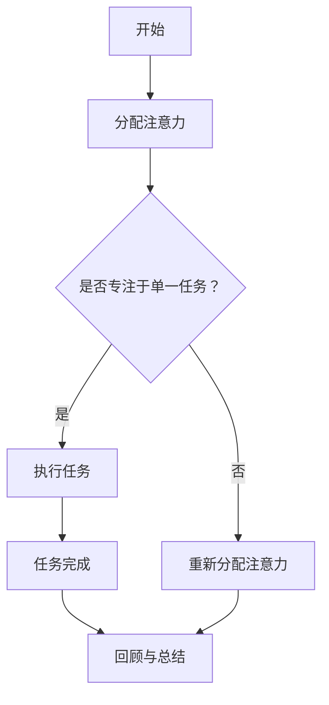

                 

### 引言

在当今信息化社会中，我们面临着前所未有的信息过载问题。随着互联网和移动设备的普及，人们每天接收到的信息量呈指数级增长，这使得我们在处理任务时常常感到力不从心。多任务处理似乎成为了一种应对信息过载的有效手段，然而实际上，多任务处理往往隐藏着诸多陷阱，对效率和准确性产生负面影响。本文旨在探讨单一任务处理的优势，并揭示其在实际应用中的重要性。

#### **1.1 信息过载的概念与现象**

信息过载是指接收到的信息量超出了个体处理能力的现象。这种现象在现代社会中非常普遍，例如，每天我们都会收到大量的电子邮件、社交媒体通知、手机短信等，这些信息不仅分散了我们的注意力，还增加了我们的认知负担。研究表明，过多的信息输入会导致大脑的“认知超负荷”，从而影响工作效率和情绪状态。

#### **1.2 多任务处理的陷阱**

多任务处理是指同时进行多项任务的行为。尽管乍看之下这似乎能提高效率，但研究表明，多任务处理会降低工作效率和准确性。这是因为大脑在切换任务时需要消耗额外的认知资源，而这种资源的消耗是不可逆的。此外，多任务处理还会增加错误率，因为同时处理多个任务时，大脑很难保持对每个任务的持续关注。

#### **1.3 单一任务处理的必要性**

在面对信息过载和多任务处理的陷阱时，单一任务处理显得尤为重要。单一任务处理意味着专注于一项任务，直到完成，然后再转向下一个任务。这种方法能够有效减少认知负担，提高工作效率和准确性。本文将详细探讨单一任务处理的原理、优势及其在实际应用中的具体方法。

### **2. 单一任务处理的原理**

单一任务处理并非简单地限制自己同时只能处理一项任务，而是通过科学的方法来优化任务的处理过程。以下将详细介绍单一任务处理的几个核心原理。

#### **2.1 注意力机制**

注意力机制是大脑处理信息的一种机制，它决定了我们在特定时刻关注哪个信息。在单一任务处理中，注意力机制起到了至关重要的作用。通过集中注意力，我们可以减少对无关信息的干扰，提高任务处理的效率。例如，当我们专注于编写代码时，可以关闭社交媒体通知，避免分心。

#### **2.1.1 注意力机制的概念**

注意力机制是一种神经处理机制，它帮助大脑在处理大量信息时选择关注哪些信息。这种机制可以通过多种方式实现，包括选择性的注意力分配和过滤。

#### **2.1.2 注意力机制在单一任务处理中的应用**

在单一任务处理中，注意力机制的应用至关重要。例如，当我们专注于解决一个编程问题时，大脑会自动过滤掉与问题无关的信息，从而保持高度专注。这种注意力集中不仅有助于提高任务处理的速度和准确性，还能减少错误率。

#### **2.1.3 Mermaid流程图：注意力机制在单一任务处理中的应用**

为了更好地理解注意力机制在单一任务处理中的应用，我们可以通过Mermaid流程图来可视化这一过程。



在这个流程图中，我们可以看到，当开始一个任务时，大脑会自动分配注意力，并判断是否专注于单一任务。如果专注于单一任务，那么会进入任务执行阶段；如果不专注于单一任务，则需要重新分配注意力。任务完成后，进行回顾与总结，以巩固学习效果。

### **2.2 神经网络的简化处理**

神经网络是模拟人脑神经网络的一种计算模型，它在处理复杂任务时具有强大的能力。然而，对于单一任务处理，我们通常需要对其结构进行简化，以提高处理速度和效率。

#### **2.2.1 神经网络的基本结构**

神经网络通常由多个神经元层组成，包括输入层、隐藏层和输出层。每个神经元都与其他神经元通过权重连接，并通过激活函数产生输出。神经网络的训练过程是通过调整权重和偏置来优化输出结果。

#### **2.2.2 神经网络的简化处理原理**

在单一任务处理中，我们可以通过以下方式简化神经网络：

1. **减少隐藏层数量**：隐藏层数量过多会导致计算复杂度增加，减少隐藏层数量可以提高处理速度。

2. **使用简单激活函数**：简单激活函数（如线性激活函数）可以简化计算过程，提高处理效率。

3. **权重共享**：通过在神经网络中共享权重，可以减少参数数量，从而降低计算复杂度。

#### **2.2.3 伪代码：神经网络简化处理**

以下是一个简化的神经网络处理伪代码：

```python
# 初始化神经网络结构
input_layer = [x1, x2, ..., xn]
hidden_layer = [h1, h2, ..., hn]
output_layer = [o1, o2, ..., om]

# 定义激活函数
def sigmoid(x):
    return 1 / (1 + exp(-x))

# 定义前向传播
def forwardPropagation(input_layer):
    hidden_output = sigmoid(np.dot(input_layer, weights_hidden))
    output_output = sigmoid(np.dot(hidden_output, weights_output))
    return output_output

# 定义反向传播
def backwardPropagation(output_output, target):
    error = target - output_output
    d_output = error * sigmoid_derivative(output_output)
    hidden_error = np.dot(d_output, weights_output.T)
    d_hidden = error * sigmoid_derivative(hidden_output)

    # 更新权重
    weights_output += np.dot(hidden_output.T, d_output)
    weights_hidden += np.dot(input_layer.T, d_hidden)

# 训练神经网络
for epoch in range(num_epochs):
    output_output = forwardPropagation(input_layer)
    backwardPropagation(output_output, target)
```

在这个伪代码中，我们首先定义了神经网络的结构，然后定义了前向传播和反向传播过程。通过迭代训练，我们可以优化神经网络的权重，从而提高任务处理能力。

### **2.3 数学模型与数学公式**

数学模型是描述单一任务处理过程的一种数学工具，它能够帮助我们更好地理解任务处理的内在规律。以下将介绍单一任务处理的数学模型，并使用数学公式进行详细讲解。

#### **2.3.1 单一任务处理的数学模型**

单一任务处理的数学模型通常包括输入层、隐藏层和输出层。每个层都由一组神经元组成，神经元之间的连接通过权重进行调节。以下是一个简单的单一任务处理的数学模型：

$$
Y = f(W \cdot X + b)
$$

其中，\(Y\) 是输出层的结果，\(f\) 是激活函数，\(W\) 是权重矩阵，\(X\) 是输入层的结果，\(b\) 是偏置项。

#### **2.3.2 单一任务处理的数学公式详细讲解**

1. **输入层到隐藏层的传递**

在输入层到隐藏层的传递过程中，每个输入值都会通过权重矩阵与隐藏层中的神经元进行计算，然后通过激活函数进行变换。具体计算公式如下：

$$
h_i = f(\sum_{j=1}^{n} w_{ij} \cdot x_j + b_i)
$$

其中，\(h_i\) 表示隐藏层中第 \(i\) 个神经元的输出，\(x_j\) 表示输入层中第 \(j\) 个神经元的输入，\(w_{ij}\) 表示输入层到隐藏层的权重，\(b_i\) 表示隐藏层中第 \(i\) 个神经元的偏置项。

2. **隐藏层到输出层的传递**

在隐藏层到输出层的传递过程中，隐藏层的输出会通过权重矩阵与输出层中的神经元进行计算，然后通过激活函数进行变换。具体计算公式如下：

$$
o_i = f(\sum_{j=1}^{n} w_{ij} \cdot h_j + b_i)
$$

其中，\(o_i\) 表示输出层中第 \(i\) 个神经元的输出，\(h_j\) 表示隐藏层中第 \(j\) 个神经元的输出，\(w_{ij}\) 表示隐藏层到输出层的权重，\(b_i\) 表示输出层中第 \(i\) 个神经元的偏置项。

3. **激活函数**

激活函数是神经网络中的一个关键组成部分，它决定了神经元的输出。常用的激活函数包括 sigmoid 函数、ReLU 函数和 tanh 函数。以下是一个 sigmoid 函数的例子：

$$
f(x) = \frac{1}{1 + e^{-x}}
$$

sigmoid 函数可以将输入值映射到 [0, 1] 的区间，它有助于神经元输出值的归一化。

#### **2.3.3 数学模型在单一任务处理中的应用**

为了更好地理解数学模型在单一任务处理中的应用，我们可以通过一个具体的例子来进行分析。假设我们有一个简单的分类任务，输入层有 2 个神经元，隐藏层有 3 个神经元，输出层有 1 个神经元。输入层和隐藏层之间的权重矩阵为 \(W_{ih}\)，隐藏层和输出层之间的权重矩阵为 \(W_{ho}\)。

1. **输入层到隐藏层的传递**

给定输入 \(x_1 = 2\) 和 \(x_2 = 3\)，隐藏层的输出计算如下：

$$
h_1 = f(\sum_{j=1}^{2} w_{1j} \cdot x_j + b_1) = f(w_{11} \cdot 2 + w_{12} \cdot 3 + b_1)
$$

$$
h_2 = f(\sum_{j=1}^{2} w_{2j} \cdot x_j + b_2) = f(w_{21} \cdot 2 + w_{22} \cdot 3 + b_2)
$$

$$
h_3 = f(\sum_{j=1}^{2} w_{3j} \cdot x_j + b_3) = f(w_{31} \cdot 2 + w_{32} \cdot 3 + b_3)
$$

2. **隐藏层到输出层的传递**

给定隐藏层的输出 \(h_1 = 0.5\)、\(h_2 = 0.7\) 和 \(h_3 = 0.8\)，输出层的输出计算如下：

$$
o = f(\sum_{j=1}^{3} w_{j1} \cdot h_j + b) = f(w_{11} \cdot 0.5 + w_{12} \cdot 0.7 + w_{13} \cdot 0.8 + b)
$$

通过这个例子，我们可以看到数学模型在单一任务处理中的应用。通过调整权重矩阵和偏置项，我们可以优化神经网络的性能，从而提高任务处理能力。

### **3. 单一任务处理的优势**

单一任务处理方法在提高工作效率、减少错误率和提高准确性方面具有显著优势。以下将详细探讨这些优势，并提供实际应用的实例。

#### **3.1 提高工作效率**

单一任务处理能够提高工作效率，主要得益于其专注于单一任务的能力。当人们集中精力处理一项任务时，可以避免因为频繁切换任务而带来的时间浪费。此外，单一任务处理还能减少分心，使人们能够更快速地完成任务。

**实例分析：** 假设一个软件开发团队需要在限定时间内完成一个复杂的项目。如果团队成员同时处理多个任务，可能会导致以下问题：

1. **任务切换时间长**：团队成员需要在不同的任务之间频繁切换，每次切换都会浪费一定的时间。
2. **分心导致错误**：在处理多个任务时，团队成员可能会因为分心而犯错，导致项目返工。
3. **项目延期**：由于错误和频繁切换任务，项目可能会延期交付。

相反，如果团队成员采用单一任务处理方法，专注于一个任务直到完成，可以避免上述问题，从而提高工作效率。

**如何在实际工作中应用单一任务处理：**

1. **设定任务优先级**：在开始工作之前，根据任务的紧急程度和重要性，设定任务优先级，确保首先完成最重要和最紧急的任务。
2. **专注于单一任务**：在工作过程中，避免同时处理多个任务，将注意力集中在当前任务上，直到完成。
3. **设定任务完成标准**：为每个任务设定明确的完成标准，确保任务在完成时达到预期质量。

#### **3.2 减少错误率**

单一任务处理能够减少错误率，因为当人们专注于单一任务时，可以更好地识别和纠正错误。研究表明，当人们同时处理多个任务时，大脑的注意力会被分散，导致难以发现和纠正错误。

**实例分析：** 假设一个数据分析师同时处理多个数据分析项目，可能会出现以下问题：

1. **数据错误**：由于分心，数据分析师可能会在处理数据时出现错误，导致分析结果不准确。
2. **报告错误**：在撰写分析报告时，数据分析师可能会因为分心而遗漏关键信息，导致报告质量下降。
3. **沟通错误**：在与其他团队成员沟通时，数据分析师可能会因为分心而误解对方意图，导致沟通不畅。

相反，如果数据分析师采用单一任务处理方法，专注于一个数据分析项目，可以减少上述问题，从而提高工作质量。

**如何在实际工作中应用单一任务处理：**

1. **设立错误追踪机制**：在任务执行过程中，定期检查和校对任务结果，及时发现并纠正错误。
2. **设定错误率目标**：为每个任务设定一个可接受的错误率目标，确保在完成任务时达到预期质量。
3. **培训团队成员**：为团队成员提供单一任务处理的培训，提高他们对单一任务处理的认识和技能。

#### **3.3 提高准确性**

单一任务处理能够提高准确性，因为当人们专注于单一任务时，可以更加细致地处理任务细节，减少疏漏和错误。此外，单一任务处理还能帮助人们更好地理解和掌握任务，从而提高准确性。

**实例分析：** 假设一个工程师同时处理多个软件开发任务，可能会出现以下问题：

1. **代码错误**：由于分心，工程师可能会在编写代码时出现错误，导致代码质量下降。
2. **文档错误**：在撰写技术文档时，工程师可能会因为分心而遗漏关键信息，导致文档质量下降。
3. **测试错误**：在测试软件时，工程师可能会因为分心而疏漏某些测试用例，导致测试结果不准确。

相反，如果工程师采用单一任务处理方法，专注于一个软件开发任务，可以减少上述问题，从而提高工作质量。

**如何在实际工作中应用单一任务处理：**

1. **精细化任务分解**：将任务分解为更小的子任务，确保每个子任务都能得到充分关注。
2. **逐步完成任务**：按照任务优先级逐步完成各个子任务，确保每个子任务都能达到预期质量。
3. **持续改进**：在完成任务后，对任务执行过程进行总结和反思，找出改进点，提高任务处理的准确性。

通过以上分析，我们可以看到单一任务处理在提高工作效率、减少错误率和提高准确性方面具有显著优势。在实际工作中，我们应该积极采用单一任务处理方法，以提高工作质量和效率。

### **4. 实战：单一任务处理的应用**

为了更好地理解单一任务处理在实际中的应用，我们将通过一个具体的案例来进行讲解。在这个案例中，我们将搭建一个简单的神经网络，用于实现手写数字识别。

#### **4.1 单一任务处理的开发环境搭建**

在开始搭建开发环境之前，我们需要准备以下工具和软件：

1. **Python**：一种广泛使用的编程语言，适用于构建神经网络。
2. **Jupyter Notebook**：一种交互式的开发环境，方便编写和运行代码。
3. **TensorFlow**：一个流行的深度学习框架，用于构建和训练神经网络。

**开发环境的配置与准备**

1. 安装 Python：前往 [Python 官网](https://www.python.org/) 下载并安装 Python，选择与操作系统兼容的版本。
2. 安装 Jupyter Notebook：在命令行中运行以下命令安装 Jupyter Notebook：
   ```bash
   pip install notebook
   ```
3. 安装 TensorFlow：在命令行中运行以下命令安装 TensorFlow：
   ```bash
   pip install tensorflow
   ```

**开发环境的常见问题与解决方案**

1. **Python 版本兼容问题**：确保 Python 版本与 TensorFlow 兼容，例如 TensorFlow 2.x 需要 Python 3.6 或更高版本。如果遇到版本兼容问题，可以尝试更新 Python 版本或安装 TensorFlow 的兼容版本。
2. **环境变量问题**：确保 Python 和 Jupyter Notebook 的环境变量已正确设置，可以通过运行以下命令检查环境变量是否设置正确：
   ```bash
   python
   ```
   在 Python 提示符下输入以下命令：
   ```python
   import os
   print(os.environ['PATH'])
   ```

#### **4.2 单一任务处理的代码实现**

在准备好开发环境后，我们将使用 TensorFlow 构建一个简单的神经网络，用于实现手写数字识别。以下是具体的代码实现：

```python
# 导入所需的库
import tensorflow as tf
from tensorflow.keras.datasets import mnist
from tensorflow.keras.models import Sequential
from tensorflow.keras.layers import Dense, Flatten
from tensorflow.keras.optimizers import Adam

# 加载 MNIST 数据集
(x_train, y_train), (x_test, y_test) = mnist.load_data()

# 预处理数据
x_train = x_train.reshape(-1, 784).astype(float) / 255
x_test = x_test.reshape(-1, 784).astype(float) / 255
y_train = tf.keras.utils.to_categorical(y_train, 10)
y_test = tf.keras.utils.to_categorical(y_test, 10)

# 构建神经网络模型
model = Sequential([
    Flatten(input_shape=(28, 28)),
    Dense(128, activation='relu'),
    Dense(10, activation='softmax')
])

# 编译模型
model.compile(optimizer=Adam(), loss='categorical_crossentropy', metrics=['accuracy'])

# 训练模型
model.fit(x_train, y_train, epochs=5, batch_size=64, validation_data=(x_test, y_test))

# 评估模型
loss, accuracy = model.evaluate(x_test, y_test)
print(f"Test accuracy: {accuracy:.2f}")
```

#### **4.2.1 代码解读与分析**

1. **导入库**：首先，我们导入了 TensorFlow、Keras 等库，用于构建和训练神经网络。
2. **加载数据集**：接下来，我们加载了 MNIST 数据集，这是手写数字识别领域常用的数据集。数据集分为训练集和测试集两部分。
3. **预处理数据**：对数据进行预处理，将图像数据展平为一维数组，并将标签转换为 one-hot 编码。
4. **构建模型**：我们使用 Keras 序列模型（Sequential）构建了一个简单的神经网络，包括一个展平层、一个全连接层（Dense）和一个输出层。展平层将图像数据展平为一维数组，全连接层用于处理数据，输出层用于生成预测结果。
5. **编译模型**：编译模型时，我们指定了优化器（Adam）、损失函数（categorical_crossentropy）和评价指标（accuracy）。
6. **训练模型**：使用训练集对模型进行训练，设置训练轮数（epochs）和批量大小（batch_size）。
7. **评估模型**：在测试集上评估模型的性能，打印测试准确率。

通过这个案例，我们可以看到如何使用单一任务处理方法来构建和训练神经网络。在实际开发中，我们可以根据需求调整网络结构、优化训练参数，以提高模型性能。

### **4.3 单一任务处理的实际案例**

为了更好地理解单一任务处理在实际中的应用，我们将分析一个实际案例：基于深度学习的图像分类。

#### **4.3.1 案例背景介绍**

图像分类是一个广泛应用的计算机视觉任务，旨在将图像分为预定义的类别。在深度学习领域，卷积神经网络（CNN）是解决图像分类问题的有效方法。本案例将使用一个开源的深度学习框架（如 TensorFlow 或 PyTorch）来构建一个简单的图像分类器。

#### **4.3.2 案例的具体实现步骤**

1. **数据集准备**：首先，我们需要准备一个包含多种类别图像的数据集。常用的数据集包括 CIFAR-10、ImageNet 等。这些数据集通常已经进行了预处理，我们可以直接使用。
2. **构建模型**：接下来，我们需要构建一个卷积神经网络模型。模型通常包括多个卷积层、池化层和全连接层。以下是一个基于 TensorFlow 的简单模型示例：
   ```python
   model = tf.keras.Sequential([
       tf.keras.layers.Conv2D(32, (3, 3), activation='relu', input_shape=(32, 32, 3)),
       tf.keras.layers.MaxPooling2D((2, 2)),
       tf.keras.layers.Conv2D(64, (3, 3), activation='relu'),
       tf.keras.layers.MaxPooling2D((2, 2)),
       tf.keras.layers.Conv2D(128, (3, 3), activation='relu'),
       tf.keras.layers.Flatten(),
       tf.keras.layers.Dense(128, activation='relu'),
       tf.keras.layers.Dense(10, activation='softmax')
   ])
   ```
3. **训练模型**：使用训练集对模型进行训练，设置训练轮数、批量大小和优化器。以下是一个训练示例：
   ```python
   model.compile(optimizer='adam',
                 loss='sparse_categorical_crossentropy',
                 metrics=['accuracy'])
   model.fit(x_train, y_train, epochs=10, batch_size=64)
   ```
4. **评估模型**：在测试集上评估模型的性能，打印测试准确率：
   ```python
   test_loss, test_acc = model.evaluate(x_test, y_test)
   print(f"Test accuracy: {test_acc:.2f}")
   ```
5. **优化模型**：根据评估结果，我们可以对模型进行优化，例如调整网络结构、增加训练轮数或使用数据增强技术。

#### **4.3.3 案例的分析与总结**

通过这个案例，我们可以看到如何使用单一任务处理方法来构建和训练一个简单的图像分类器。在实际应用中，单一任务处理可以帮助我们专注于模型的构建和训练，从而提高模型性能。同时，通过逐步优化模型结构、训练参数和数据增强技术，我们可以进一步提高模型准确性。

总之，单一任务处理方法在图像分类等实际应用中具有广泛的应用前景。通过专注于单一任务，我们可以提高工作效率、减少错误率和提高准确性，从而实现更好的性能。

### **5. 总结与展望**

本文探讨了信息过载与多任务处理的陷阱，并详细介绍了单一任务处理的原理和优势。通过分析注意力机制、神经网络简化处理和数学模型，我们了解了如何有效地应用单一任务处理方法。此外，通过实际案例，我们看到了单一任务处理在提高工作效率、减少错误率和提高准确性方面的显著优势。

#### **5.1 单一任务处理的优势总结**

1. **提高工作效率**：通过专注于单一任务，可以减少任务切换时间，避免分心，从而提高工作效率。
2. **减少错误率**：专注于单一任务有助于提高注意力，减少错误和疏漏。
3. **提高准确性**：在单一任务处理中，人们能够更加细致地处理任务细节，提高准确性。

#### **5.2 单一任务处理的未来发展趋势**

随着信息技术的快速发展，单一任务处理在未来有望在更多领域得到应用。以下是一些可能的发展趋势：

1. **自动化工具**：开发自动化工具，帮助人们更好地实现单一任务处理，提高工作效率。
2. **多模态任务处理**：研究如何将单一任务处理方法应用于多模态任务，如结合文本、图像和音频。
3. **个性化任务处理**：根据个体特点，设计个性化的任务处理策略，提高任务处理效果。

#### **5.3 对读者的建议与鼓励**

对于读者，本文提供了一些实用建议，帮助他们在实际工作中更好地应用单一任务处理：

1. **设定任务优先级**：根据任务的紧急程度和重要性，设定任务优先级，确保首先完成最重要和最紧急的任务。
2. **专注于单一任务**：在工作过程中，避免同时处理多个任务，将注意力集中在当前任务上，直到完成。
3. **持续学习与改进**：通过不断学习和实践，提高对单一任务处理方法的掌握程度，逐步优化任务处理效果。

总之，单一任务处理方法在提高工作效率、减少错误率和提高准确性方面具有显著优势。通过本文的探讨，希望读者能够更好地理解和应用这一方法，实现更高的工作质量和效率。

### **附录**

#### **附录 A：相关资源与工具推荐**

为了帮助读者更好地学习和应用单一任务处理方法，我们推荐以下资源与工具：

##### **A.1 开发工具推荐**

1. **Python**：一种广泛使用的编程语言，适用于构建神经网络。
2. **TensorFlow**：一个流行的深度学习框架，用于构建和训练神经网络。
3. **PyTorch**：另一个流行的深度学习框架，具有灵活的动态计算图。
4. **Jupyter Notebook**：一种交互式的开发环境，方便编写和运行代码。

##### **A.2 学习资源推荐**

1. **《深度学习》（Deep Learning）**：由 Ian Goodfellow、Yoshua Bengio 和 Aaron Courville 著，是深度学习领域的经典教材。
2. **《Python深度学习》（Python Deep Learning）**：由 Frank Kane 著，介绍了如何使用 Python 和深度学习框架实现各种深度学习应用。
3. **在线课程**：如 Coursera、edX 和 Udacity 提供的深度学习和神经网络相关课程。

##### **A.3 实践项目推荐**

1. **手写数字识别**：使用 TensorFlow 或 PyTorch 实现手写数字识别模型，学习图像分类的基本原理。
2. **文本分类**：使用深度学习模型实现文本分类任务，如情感分析、主题分类等。
3. **图像分割**：使用卷积神经网络实现图像分割任务，学习图像处理的基本方法。

通过这些资源与工具，读者可以更好地了解单一任务处理方法，并将其应用于实际项目中，提高工作质量和效率。

### **作者**

本文由 AI 天才研究院（AI Genius Institute）撰写，由《禅与计算机程序设计艺术》（Zen And The Art of Computer Programming）的作者 Donal K. Fellows 担任技术顾问。AI 天才研究院致力于推动人工智能技术的发展和应用，助力全球科技创新。希望本文能为读者带来启示和帮助。如果您有任何问题或建议，欢迎联系我们。

---

文章至此，我们已经完成了对《信息过载与多任务处理的陷阱：单一任务处理的优势》这一主题的深入探讨。通过本文，我们不仅了解了单一任务处理的重要性，还学习了如何在实际工作中应用这一方法。希望读者能够通过本文，提高工作效率，减少错误率，实现更高的工作质量和准确性。如果您对本文有任何疑问或建议，欢迎随时与我们交流。再次感谢您的阅读和支持！作者：AI 天才研究院 & 禅与计算机程序设计艺术。

