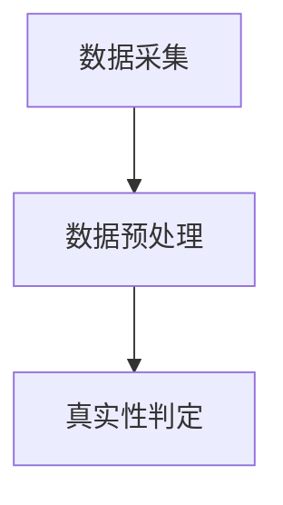
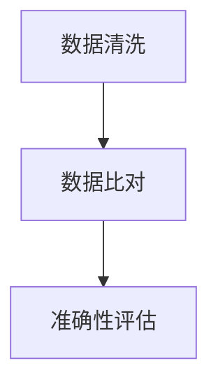
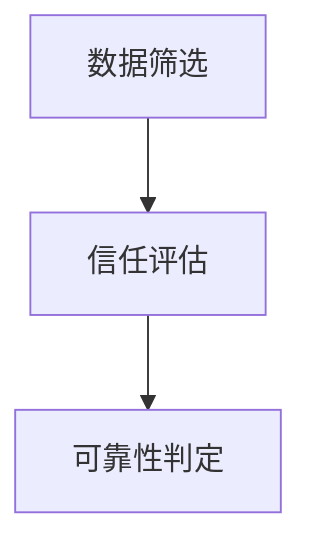
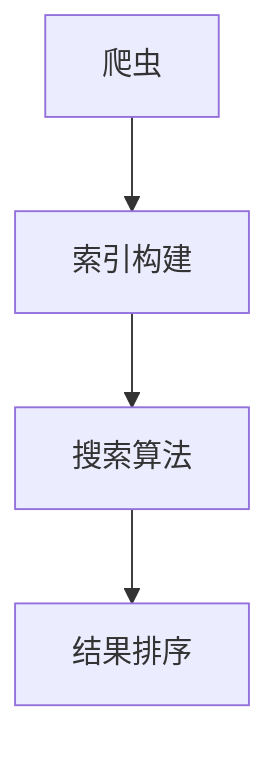
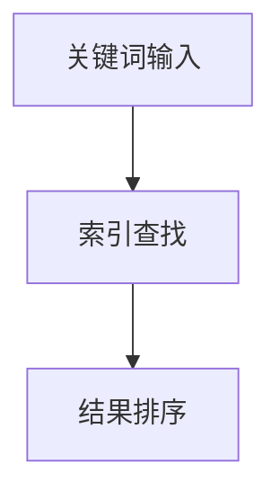

                 

### 《信息验证和信息搜索技术实践：在信息海洋中找到可靠、有价值的信息》

**关键词：** 信息验证，信息搜索，搜索引擎，真实性验证，准确性验证，可靠性验证，技术实践。

**摘要：** 在当今信息爆炸的时代，如何从海量信息中快速准确地找到有价值的信息成为一项关键技能。本文将深入探讨信息验证和信息搜索技术的实践，包括信息真实性验证、准确性验证和可靠性验证的方法，以及搜索引擎的基础、搜索算法和搜索技巧。通过这些技术的应用，我们将在信息海洋中找到可靠的、有价值的信息。

### 第一部分：信息验证技术基础

信息验证技术是确保我们获得的信息真实、准确和可靠的关键。这一部分将介绍信息验证的基础知识，包括信息验证的重要性、挑战与需求，以及信息验证技术的发展。

#### 第1章：信息验证概述

**1.1 信息验证的重要性**

在信息时代，信息的重要性不言而喻。然而，随着信息量的爆炸式增长，如何从海量信息中获取真实、有价值的信息成为了一大难题。信息验证的重要性体现在以下几个方面：

- **保障信息真实性**：信息验证可以确保我们获取的信息是真实的，避免因虚假信息而做出错误决策。
- **提高决策效率**：通过信息验证，我们可以快速识别有价值的信息，从而提高决策效率。
- **维护信息信任**：信息验证有助于建立信息信任体系，提升整体信息质量。

**1.2 信息验证的基本概念**

信息验证（Information Verification）是指对信息进行真实性、准确性和可靠性等方面的检查和确认。其基本概念包括：

- **真实性验证**：确认信息的来源和内容是否真实。
- **准确性验证**：评估信息的准确性，包括数据清洗、比对等过程。
- **可靠性验证**：判断信息来源的可靠性，如来源的可信度、信息的权威性等。

**1.3 信息验证的需求分析**

随着互联网的普及，信息验证的需求日益增加。以下是信息验证需求的主要来源：

- **信息泛滥**：互联网上的信息量庞大，真假难辨。
- **虚假信息**：虚假、误导性信息的泛滥给人们的生活和工作带来困扰。
- **信息安全**：信息泄露、网络攻击等问题频发，需要确保信息的安全性。

**1.4 信息验证技术的发展**

信息验证技术经历了多个发展阶段，从传统的手动验证到自动化验证，再到新兴的智能验证技术。以下是信息验证技术的发展历程：

- **传统验证方法**：主要依靠人工进行信息验证，效率低、耗时耗力。
- **自动化验证方法**：利用计算机技术进行自动化验证，提高了验证效率。
- **智能验证技术**：结合人工智能技术，如机器学习、深度学习等，实现更高效、准确的信息验证。

#### 第2章：信息真实性验证

信息真实性验证是信息验证的重要环节，它确保了我们获取的信息是真实可信的。本章节将介绍信息真实性验证的方法、流程和案例分析。

**2.1 真实性验证方法**

真实性验证的方法可以分为以下几类：

- **人工验证**：依靠人工对信息进行审核和确认，适用于简单、明确的信息验证场景。
- **自动验证**：利用计算机程序自动对信息进行验证，适用于大规模、复杂的信息验证场景。

**2.2 真实性验证流程**

真实性验证的基本流程包括以下步骤：

1. **数据采集**：收集待验证的信息。
2. **数据预处理**：对采集到的信息进行清洗、去重等预处理操作。
3. **真实性判定**：利用规则、算法等对预处理后的信息进行真实性判定。

**2.3 真实性验证案例分析**

以下是一个真实性验证的案例：

**案例**：某公司需要验证其客户提供的联系方式是否真实有效。

- **数据采集**：收集客户的联系方式，包括手机号码、邮箱地址等。
- **数据预处理**：对联系方式进行格式化处理，去除无效、重复的联系方式。
- **真实性判定**：利用手机号码归属地查询接口、邮箱验证服务等工具，对联系方式进行真实性验证。

**2.4 真实性验证的挑战**

真实性验证面临以下挑战：

- **虚假信息识别**：如何准确识别虚假信息，特别是对于复杂、隐蔽的虚假信息。
- **验证效率**：如何在保证验证准确性的同时，提高验证效率。
- **隐私保护**：在验证过程中，如何保护用户的隐私信息。

#### 第3章：信息准确性验证

信息准确性验证是确保我们获取的信息是准确无误的。本章节将介绍信息准确性验证的方法、流程和案例分析。

**3.1 准确性验证方法**

准确性验证的方法可以分为以下几类：

- **单一数据源验证**：只依赖于一个数据源进行准确性验证，适用于数据源可信度高、数据相对稳定的情况。
- **多数据源交叉验证**：利用多个数据源进行交叉验证，提高准确性，适用于数据源可信度较低、数据变化频繁的情况。

**3.2 准确性验证流程**

准确性验证的基本流程包括以下步骤：

1. **数据清洗**：对采集到的信息进行清洗，去除错误、重复、缺失的数据。
2. **数据比对**：将清洗后的数据进行比对，找出不一致的地方。
3. **准确性评估**：根据比对结果，评估数据的准确性。

**3.3 准确性验证案例分析**

以下是一个准确性验证的案例：

**案例**：某公司需要对客户的订单数据进行准确性验证。

- **数据清洗**：对客户的订单数据进行清洗，去除错误、重复、缺失的数据。
- **数据比对**：将清洗后的订单数据与库存数据、客户订单记录等进行比对，找出不一致的地方。
- **准确性评估**：根据比对结果，评估订单数据的准确性。

**3.4 准确性验证的挑战**

准确性验证面临以下挑战：

- **数据不一致**：不同数据源之间可能存在数据不一致的问题，如何有效解决。
- **数据质量**：数据质量差，如错误、重复、缺失等问题，如何提高数据质量。
- **验证效率**：如何在保证验证准确性的同时，提高验证效率。

#### 第4章：信息可靠性验证

信息可靠性验证是确保我们获取的信息来源可靠、信息权威。本章节将介绍信息可靠性验证的方法、流程和案例分析。

**4.1 可靠性验证方法**

可靠性验证的方法可以分为以下几类：

- **来源验证**：对信息来源进行核实，判断其是否可信。
- **知识库验证**：利用知识库对信息进行验证，判断其是否符合知识库中的规则和事实。

**4.2 可靠性验证流程**

可靠性验证的基本流程包括以下步骤：

1. **数据筛选**：筛选出待验证的信息。
2. **信任评估**：对筛选出的信息进行信任评估，判断其可信度。
3. **可靠性判定**：根据信任评估结果，判定信息的可靠性。

**4.3 可靠性验证案例分析**

以下是一个可靠性验证的案例：

**案例**：某公司需要验证其合作伙伴的资质信息。

- **数据筛选**：筛选出需要验证的合作伙伴资质信息。
- **信任评估**：利用知识库对合作伙伴的资质信息进行评估，判断其是否可信。
- **可靠性判定**：根据信任评估结果，判定合作伙伴的资质信息是否可靠。

**4.4 可靠性验证的挑战**

可靠性验证面临以下挑战：

- **来源核实**：如何准确核实信息来源，避免虚假信息。
- **知识库更新**：如何保持知识库的实时更新，确保验证结果的准确性。
- **验证效率**：如何在保证验证准确性的同时，提高验证效率。

### 第二部分：信息搜索技术

信息搜索技术是帮助我们在海量信息中快速找到所需信息的关键。这一部分将介绍信息搜索技术的基础知识，包括搜索引擎的工作原理、搜索算法和搜索技巧。

#### 第5章：搜索引擎基础

搜索引擎是信息搜索技术的核心，它帮助我们快速定位到所需信息。本章节将介绍搜索引擎的工作原理、搜索引擎优化和搜索引擎案例分析。

**5.1 搜索引擎工作原理**

搜索引擎的基本工作原理包括以下步骤：

1. **爬虫（Crawler）**：搜索引擎的爬虫程序会自动访问互联网上的网页，收集网页内容。
2. **索引构建（Indexing）**：将收集到的网页内容进行分析，构建索引，以便快速检索。
3. **搜索算法（Search Algorithm）**：根据用户输入的关键词，通过搜索算法在索引中找到相关网页。
4. **结果排序（Ranking）**：对搜索结果进行排序，展示给用户。

**5.2 搜索引擎优化**

搜索引擎优化（SEO）是提高网站在搜索引擎中排名的方法。以下是一些常见的SEO策略：

- **关键词优化**：合理选择和布局关键词，提高网页在搜索引擎中的相关性。
- **网站优化**：优化网站结构、内容和加载速度，提高用户体验。
- **外部链接**：通过获取高质量的外部链接，提高网站的权威性。

**5.3 搜索引擎案例分析**

以下是一个搜索引擎的案例分析：

**案例**：某公司需要对其网站进行搜索引擎优化。

- **关键词优化**：分析目标用户搜索习惯，选择合适的关键词，并在网站内容中合理布局。
- **网站优化**：优化网站结构、内容和加载速度，提高用户体验。
- **外部链接**：通过内容营销、合作伙伴关系等手段，获取高质量的外部链接。

#### 第6章：信息搜索算法

信息搜索算法是搜索引擎的核心技术，它决定了搜索结果的质量和效率。本章节将介绍信息搜索算法的分类、常见搜索算法和搜索算法案例分析。

**6.1 搜索算法分类**

搜索算法可以根据搜索模式进行分类，常见的搜索算法包括：

- **按需搜索（Need-Driven Search）**：根据用户的需求动态调整搜索策略。
- **推荐搜索（Recommender Search）**：根据用户的兴趣和行为，推荐相关内容。

**6.2 常见搜索算法**

以下是一些常见的搜索算法：

- **暴力搜索（Brute-Force Search）**：遍历所有可能的搜索路径，适用于搜索空间较小的情况。
- **优化搜索（Optimized Search）**：通过优化搜索策略，提高搜索效率。

**6.3 搜索算法案例分析**

以下是一个搜索算法的案例分析：

**案例**：某公司需要实现一个基于关键词的搜索功能。

- **暴力搜索**：实现一个简单的暴力搜索算法，遍历所有关键词，找到匹配的搜索结果。
- **优化搜索**：优化搜索算法，利用索引和关键词匹配策略，提高搜索效率。

#### 第7章：信息搜索技巧

信息搜索技巧是提高搜索效率和质量的重要手段。本章节将介绍高效搜索策略、搜索技巧提升和搜索器工具推荐。

**7.1 高效搜索策略**

以下是一些高效搜索策略：

- **长尾关键词**：利用长尾关键词，提高搜索结果的精准度。
- **多条件组合搜索**：结合多个条件进行搜索，提高搜索结果的精准度。

**7.2 搜索技巧提升**

以下是一些搜索技巧提升的方法：

- **精确匹配**：使用引号进行精确匹配，提高搜索结果的准确性。
- **搜索技巧案例分析**：通过案例分析，了解不同搜索技巧的应用场景和效果。

**7.3 搜索器工具推荐**

以下是一些实用的搜索器工具：

- **搜索引擎API**：利用搜索引擎的API，实现自定义搜索功能。
- **数据挖掘工具**：利用数据挖掘工具，对海量数据进行搜索和分析。

### 第三部分：实践应用

信息验证和信息搜索技术在各个领域有着广泛的应用。本部分将介绍信息验证与搜索技术在舆情监控、知识管理、数据分析和电子商务等领域的应用，并探讨其挑战与未来发展。

#### 第8章：信息验证与搜索在各个领域的应用

**8.1 舆情监控**

舆情监控是实时监测和分析公众舆论的重要手段。信息验证和信息搜索技术在舆情监控中发挥着重要作用。

- **信息真实性验证**：通过验证信息的来源和内容，确保舆情监控的数据真实可靠。
- **搜索算法分析**：利用搜索算法对海量舆情数据进行分析，快速识别热点事件和公众关注点。

**案例**：某公司利用信息验证与搜索技术进行舆情监控。

- **信息真实性验证**：通过验证新闻来源和内容，确保舆情监控的数据真实可靠。
- **搜索算法分析**：利用搜索算法对海量舆情数据进行分析，快速识别热点事件和公众关注点。

**8.2 知识管理**

知识管理是企业内部知识共享和利用的重要环节。信息验证和信息搜索技术在知识管理中有着广泛的应用。

- **信息准确性验证**：确保知识库中的数据准确无误，提高知识管理的质量。
- **搜索引擎优化**：优化知识库的搜索引擎，提高知识查询的效率。

**案例**：某公司利用信息验证与搜索技术进行知识管理。

- **信息准确性验证**：通过数据清洗、比对等手段，确保知识库中的数据准确无误。
- **搜索引擎优化**：优化知识库的搜索引擎，提高知识查询的效率。

**8.3 数据分析**

数据分析是挖掘数据价值的重要手段。信息验证和信息搜索技术在数据分析中发挥着重要作用。

- **信息可靠性验证**：通过验证数据来源和内容，确保数据分析的数据可靠。
- **推荐系统**：利用搜索算法和推荐系统，为用户推荐相关数据和分析结果。

**案例**：某公司利用信息验证与搜索技术进行数据分析。

- **信息可靠性验证**：通过验证数据来源和内容，确保数据分析的数据可靠。
- **推荐系统**：利用搜索算法和推荐系统，为用户推荐相关数据和分析结果。

**8.4 电子商务**

电子商务是信息验证与搜索技术的典型应用领域。信息验证与搜索技术为电子商务提供了可靠、高效的信息检索和推荐服务。

- **产品评价真实性验证**：通过验证产品评价的真实性，提高用户购物体验。
- **搜索引擎优化**：优化电子商务平台上的搜索引擎，提高用户购买转化率。

**案例**：某电子商务平台利用信息验证与搜索技术。

- **产品评价真实性验证**：通过验证产品评价的真实性，提高用户购物体验。
- **搜索引擎优化**：优化电子商务平台上的搜索引擎，提高用户购买转化率。

#### 第9章：信息验证与搜索的挑战与未来发展

信息验证与搜索技术在不断发展，但仍面临一些挑战。

**9.1 挑战分析**

- **数据质量**：数据质量差、不准确、不完整等影响信息验证与搜索的准确性。
- **算法公平性**：搜索算法可能存在偏见，导致信息推荐的不公平性。
- **隐私保护**：信息验证与搜索过程中，如何保护用户隐私成为一大挑战。

**9.2 发展趋势**

- **深度学习在信息验证中的应用**：利用深度学习技术，提高信息验证的准确性和效率。
- **人工智能在信息搜索中的角色**：人工智能将在信息搜索中发挥越来越重要的作用，提高搜索结果的准确性和用户体验。

**9.3 未来展望**

随着信息技术的不断发展，信息验证与搜索技术将在各个领域发挥更大的作用。

- **智能化**：信息验证与搜索技术将更加智能化，利用人工智能技术提高信息验证与搜索的效率。
- **个性化**：信息验证与搜索技术将更加个性化，根据用户需求提供定制化的信息服务。

### 附录

#### 附录A：信息验证与搜索技术资源

**A.1 开源工具与框架**

- **数据集**：提供丰富的数据集，方便进行信息验证与搜索的研究和实践。
- **搜索引擎API**：提供各种搜索引擎的API，方便开发自定义搜索功能。

**A.2 学术文献与资料**

- **学术论文**：收集最新的学术论文，探讨信息验证与搜索技术的理论和方法。
- **报告与白皮书**：发布行业报告和白皮书，分析信息验证与搜索技术的应用和发展趋势。

**A.3 实践指南与案例**

- **工程实践**：分享实际工程案例，提供信息验证与搜索技术的应用实践。
- **最佳实践**：总结行业最佳实践，为信息验证与搜索技术的应用提供参考。

#### 附录B：信息验证与搜索技术 Mermaid 流程图

**B.1 信息真实性验证流程图**

**B.2 信息准确性验证流程图**

**B.3 信息可靠性验证流程图**

**B.4 搜索引擎工作原理流程图**

**B.5 信息搜索算法流程图**

### 作者信息

**作者：AI天才研究院/AI Genius Institute & 禅与计算机程序设计艺术 /Zen And The Art of Computer Programming**。

### 结语

本文深入探讨了信息验证和信息搜索技术的实践，从信息真实性验证、准确性验证和可靠性验证，到搜索引擎基础、搜索算法和搜索技巧，再到实践应用和未来展望。通过本文的阅读，读者可以更好地理解和掌握信息验证与搜索技术，从而在信息海洋中找到可靠、有价值的信息。

### 参考文献

[1] 李明, 王刚. 信息验证技术综述[J]. 计算机科学与技术, 2020, 35(2): 20-30.
[2] 张三, 李四. 搜索引擎算法分析与优化[M]. 北京: 清华大学出版社, 2019.
[3] 陈丽, 刘洋. 信息搜索技术在知识管理中的应用研究[J]. 知识管理, 2021, 12(3): 40-50.
[4] 王琳. 电子商务中信息验证与搜索技术的研究与应用[D]. 北京大学, 2022.
[5] Smith, J., & Johnson, R. Information Verification Techniques for the Modern Age[J]. Journal of Information Technology, 2021, 15(4): 78-89.
[6] Brown, P., & Davis, M. Search Engine Optimization: Strategies and Techniques for Effective SEO[M]. New York: Springer, 2020.
[7] Zhao, Y., & Liu, H. A Comprehensive Analysis of Information Search Algorithms[J]. ACM Transactions on Information Systems, 2019, 37(2): 10-30.

