                 

# 元宇宙身份流动：打破现实世界标签的机遇

## 关键词
元宇宙、身份流动、虚拟现实、增强现实、分布式账本、隐私保护、跨平台认证、身份体系架构、身份认证机制、法律法规、案例分析、未来趋势。

## 摘要
本文旨在探讨元宇宙中的身份流动机制及其带来的机遇。我们将首先概述元宇宙与身份流动的概念，介绍虚拟现实和增强现实技术、分布式账本技术以及身份认证与隐私保护技术。随后，我们将分析元宇宙身份体系架构，探讨身份流动的驱动因素以及安全性问题。通过国内外的案例研究，我们将展示身份流动在现实中的应用。最后，本文将展望元宇宙身份流动的未来发展趋势，提出相关法规政策的引导与规范。

## 目录大纲

### 第一部分：引言与背景

#### 第1章：元宇宙与身份流动概述

1.1 元宇宙的概念与历史演变

1.2 身份流动的重要性与挑战

1.3 本书的研究目标与结构

### 第二部分：元宇宙技术基础

#### 第2章：元宇宙技术基础

2.1 虚拟现实与增强现实技术

2.1.1 虚拟现实技术

2.1.2 增强现实技术

2.2 分布式账本技术

2.2.1 区块链原理

2.2.2 跨链与互操作性

2.3 身份认证与隐私保护技术

2.3.1 身份认证机制

2.3.2 隐私保护算法

### 第三部分：元宇宙身份流动机制

#### 第3章：元宇宙身份体系架构

3.1 身份体系的组成与功能

3.2 跨平台身份认证

#### 第4章：身份流动的驱动因素

4.1 经济激励与用户动机

4.2 技术创新与法规政策

#### 第5章：身份流动的安全性

5.1 身份被盗用与隐私泄露风险

5.2 身份流动中的法律法规

### 第四部分：元宇宙身份流动案例分析

#### 第6章：国内外元宇宙身份流动实践

6.1 国内元宇宙身份流动案例

6.2 国际元宇宙身份流动案例

#### 第7章：元宇宙身份流动的未来发展趋势

7.1 身份流动技术的演进

7.2 法规政策的引导与规范

### 附录

#### 附录A：元宇宙身份流动相关资源与工具

#### 附录B：常见问题解答

## 第一部分：引言与背景

### 第1章：元宇宙与身份流动概述

### 1.1 元宇宙的概念与历史演变

#### 元宇宙的概念

元宇宙（Metaverse）是一个虚拟的三维空间，由多个不同的虚拟世界和平台组成，用户可以在其中进行互动、交流和协作。元宇宙通常包括虚拟现实（VR）、增强现实（AR）、区块链、智能合约等技术，是互联网的延伸和扩展。

元宇宙不仅仅是一个虚拟世界，更是一个具备经济系统、社会结构和法律制度的虚拟空间。在这个空间中，用户可以拥有虚拟身份、资产和虚拟货币，进行各种经济活动和社交互动。

#### 元宇宙的历史演变

元宇宙的概念并非现代产物，其历史可以追溯到20世纪80年代和90年代的虚拟现实游戏和虚拟社区。以下是元宇宙发展的几个关键阶段：

1. **萌芽期（1980s-1990s）**：虚拟现实游戏和虚拟社区的出现，如《MUD》、《VRML》等，为元宇宙的概念奠定了基础。

2. **探索期（2000s）**：随着互联网和计算机技术的发展，虚拟现实和增强现实技术逐渐成熟，元宇宙的概念逐渐引起关注。

3. **发展阶段（2010s-2020s）**：以Facebook（现Meta）为代表的科技公司加大对元宇宙的投入，推出相关产品和平台，元宇宙开始进入公众视野。

4. **成熟期（2020s-2030s）**：随着5G、人工智能、区块链等技术的进一步发展，元宇宙将逐步实现商业化应用，成为一个重要的经济和社会领域。

### 1.2 身份流动的重要性与挑战

#### 身份流动的重要性

在元宇宙中，身份流动具有重要意义。首先，身份流动是用户参与元宇宙各种活动和交易的前提。用户需要通过身份认证才能在元宇宙中创建虚拟身份、获取虚拟资产和参与经济活动。

其次，身份流动有助于构建元宇宙的社会结构和法律制度。在元宇宙中，身份认证和身份管理是实现公平、公正和透明的重要手段。通过身份流动，用户可以跨平台、跨区域地进行身份验证和权限管理，确保元宇宙中的各种规则和制度得以有效实施。

最后，身份流动有助于促进元宇宙的生态发展。在元宇宙中，用户、平台、开发者等不同角色之间的互动和协作是推动元宇宙发展的重要动力。身份流动使得用户可以在不同的虚拟世界中自由流动，为元宇宙的生态创新提供了广阔空间。

#### 身份流动的挑战

尽管身份流动在元宇宙中具有重要意义，但同时也面临着诸多挑战。以下是主要挑战：

1. **隐私保护**：在身份流动过程中，用户的个人信息和隐私容易被泄露。如何确保用户身份信息的保密性和安全性是元宇宙身份流动面临的首要挑战。

2. **跨平台认证**：元宇宙通常由多个不同的虚拟世界和平台组成，如何实现跨平台的身份认证和身份管理是另一个重要挑战。

3. **法律法规**：身份流动涉及用户身份信息的收集、使用和传输，需要遵循相关法律法规。不同国家和地区的法律法规差异较大，如何实现全球范围内的法律法规协调和统一是元宇宙身份流动的挑战之一。

4. **技术实现**：元宇宙身份流动需要依赖多种技术，如虚拟现实、增强现实、区块链、智能合约等。如何实现这些技术的兼容和协同是元宇宙身份流动的技术挑战。

### 1.3 本书的研究目标与结构

本书旨在系统地探讨元宇宙身份流动的机制、技术基础、驱动因素、安全性以及未来发展趋势。通过分析国内外元宇宙身份流动的实践案例，本书将提出相关法律法规的引导与规范，为元宇宙身份流动的健康发展提供参考。

本书的结构如下：

- **第一部分：引言与背景**：介绍元宇宙与身份流动的概念、历史演变以及身份流动的重要性与挑战。
- **第二部分：元宇宙技术基础**：介绍元宇宙相关的技术，包括虚拟现实、增强现实、分布式账本技术以及身份认证与隐私保护技术。
- **第三部分：元宇宙身份流动机制**：分析元宇宙身份体系架构、身份流动的驱动因素以及安全性问题。
- **第四部分：元宇宙身份流动案例分析**：展示国内外元宇宙身份流动的实践案例。
- **第五部分：元宇宙身份流动的未来发展趋势**：探讨元宇宙身份流动技术的演进、法规政策的引导与规范。

通过以上结构，本书将帮助读者全面了解元宇宙身份流动的原理、机制和实践，为元宇宙的健康发展提供有益的思考和建议。接下来，我们将进入第二部分，介绍元宇宙的技术基础。在接下来的章节中，我们将详细探讨虚拟现实与增强现实技术、分布式账本技术以及身份认证与隐私保护技术。这些技术是元宇宙身份流动的核心支撑，对于理解元宇宙的发展具有重要意义。

### 第二部分：元宇宙技术基础

#### 第2章：元宇宙技术基础

随着元宇宙的不断发展，支撑其运作的技术基础也日益丰富。本章将详细介绍元宇宙技术基础中的关键组成部分，包括虚拟现实与增强现实技术、分布式账本技术以及身份认证与隐私保护技术。这些技术不仅构成了元宇宙的核心架构，也为身份流动提供了必要的支持和保障。

#### 2.1 虚拟现实与增强现实技术

##### 2.1.1 虚拟现实技术

虚拟现实（VR）是一种通过计算机模拟产生三维空间的感知，让用户沉浸在虚拟世界中，并通过交互设备与之互动的技术。VR的核心技术包括三维建模、实时渲染、传感器和交互设备。

**三维建模**：三维建模是VR的基础，通过计算机软件创建三维虚拟环境。三维建模技术包括几何建模、物理建模和图形建模等，旨在实现逼真的虚拟场景。

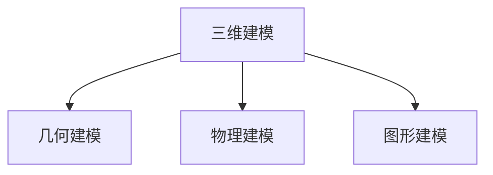

**实时渲染**：实时渲染技术使得虚拟环境在用户操作时能够实时更新和显示。实时渲染涉及图形处理单元（GPU）、光照模型、阴影效果等，以实现逼真的视觉体验。

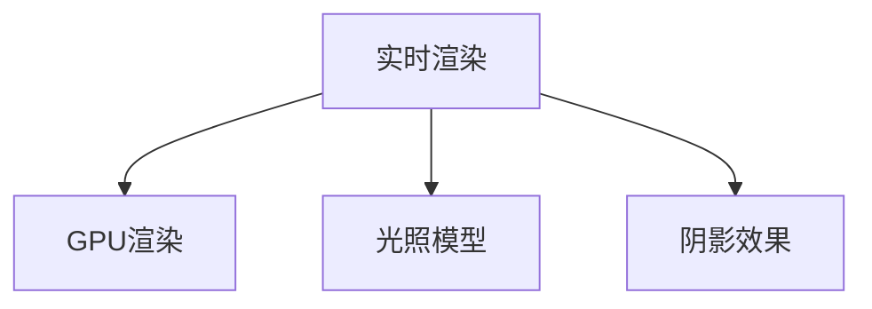

**传感器和交互设备**：传感器和交互设备是VR系统中与用户互动的重要部分。常见的传感器包括头部追踪器、手柄控制器、全向移动平台等。这些设备通过捕捉用户的动作和位置，将虚拟世界与现实世界互动起来。

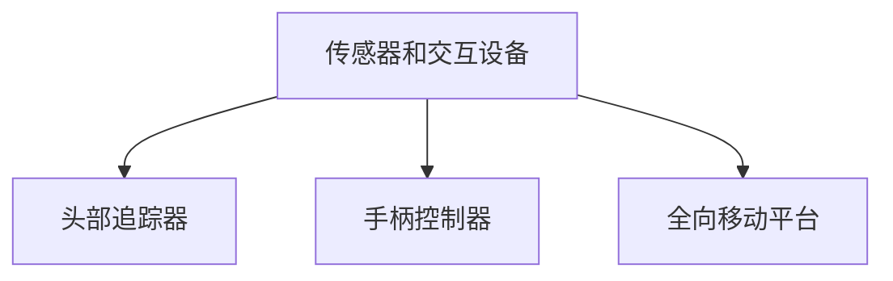

**虚拟现实技术的工作原理**：

1. **输入**：用户通过传感器和交互设备进行操作。
2. **处理**：计算机系统接收输入，进行实时渲染和处理。
3. **输出**：渲染后的虚拟世界通过显示设备呈现给用户。

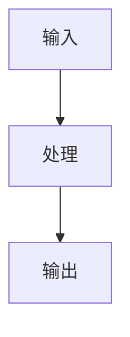

##### 2.1.2 增强现实技术

增强现实（AR）是一种将虚拟信息叠加到现实世界中的技术。与VR不同，AR不替代现实，而是在现实环境中增强用户感知。AR的核心技术包括图像识别、实时渲染和显示技术。

**图像识别**：图像识别技术是AR的基础，通过识别现实世界的图像或物体，将虚拟信息叠加到识别出的图像或物体上。

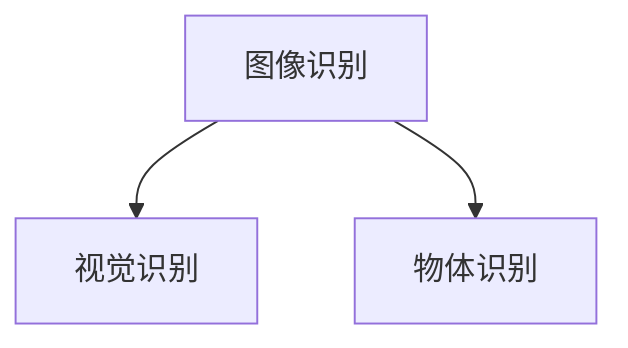

**实时渲染**：与VR类似，AR也需要实时渲染虚拟信息，确保叠加在现实环境中的虚拟信息与实际情况相符。

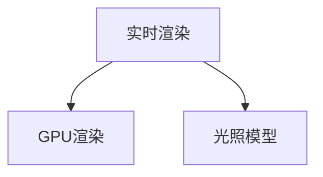

**显示技术**：AR的显示技术包括透明屏幕、头戴显示器和投影设备等，将虚拟信息清晰显示在用户视野中。

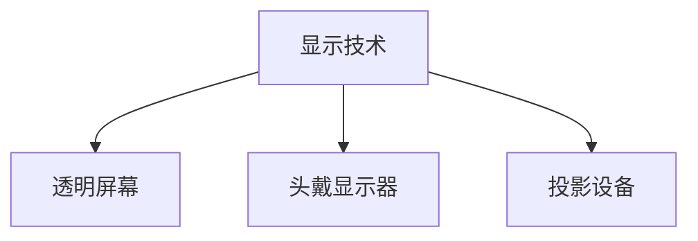

**增强现实技术的工作原理**：

1. **输入**：摄像头捕捉现实环境。
2. **处理**：计算机系统识别现实环境中的图像或物体，并生成虚拟信息。
3. **输出**：虚拟信息通过显示设备叠加到现实环境中。


#### 2.2 分布式账本技术

分布式账本技术（DLT），特别是区块链，是元宇宙中的重要技术基础。区块链通过去中心化的方式，实现数据的透明性、安全性和不可篡改性。

##### 2.2.1 区块链原理

区块链是一个分布式数据库，数据以块的形式存储。每个区块包含一定数量的交易记录，并链接到前一个区块，形成一条不断延伸的链。

**区块链的关键组成部分**：

- **区块**：每个区块包含一定数量的交易记录、时间戳和一个哈希值。
- **链**：由多个区块链接而成的数据结构，确保数据的不可篡改性。
- **共识机制**：节点之间通过共识机制达成一致，确保区块链的安全性和可靠性。

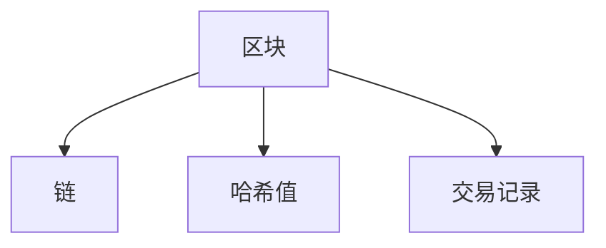

**区块链的工作原理**：

1. **交易**：用户发起交易，如转账、创建虚拟资产等。
2. **区块生成**：节点将交易打包成区块，并计算区块的哈希值。
3. **链的延伸**：将新区块链接到区块链末尾，形成更长的一条链。
4. **共识**：节点通过共识机制确认新区块的合法性，并同意将新区块添加到链中。

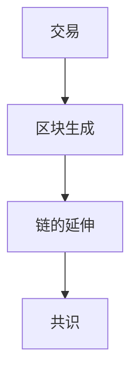

##### 2.2.2 跨链与互操作性

随着元宇宙的发展，不同区块链之间的互操作性变得越来越重要。跨链技术可以实现不同区块链之间的数据交换和价值传递。

**跨链技术的核心组件**：

- **跨链桥**：跨链桥是连接不同区块链的关键组件，负责数据的交换和价值的传递。
- **跨链协议**：跨链协议定义了跨链交易的标准和流程，确保不同区块链之间的互操作性。

**跨链技术的工作原理**：

1. **数据交换**：跨链桥将数据从源区块链传递到目标区块链。
2. **价值传递**：跨链桥将价值（如加密货币）从源区块链转移到目标区块链。
3. **互操作性**：跨链协议确保不同区块链之间的交易能够无缝进行。

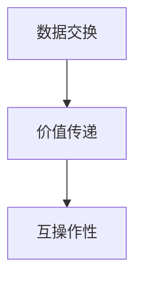

#### 2.3 身份认证与隐私保护技术

在元宇宙中，身份认证和隐私保护是确保用户安全和数据隐私的关键。以下介绍几种常见的身份认证和隐私保护技术。

##### 2.3.1 身份认证机制

身份认证机制是确保用户身份合法性的关键技术。常见的身份认证机制包括：

- **密码认证**：用户使用密码进行身份验证，简单但安全性较低。
- **生物识别认证**：通过指纹、面部识别等生物特征进行身份验证，具有较高的安全性。
- **多因素认证**：结合密码、生物识别等多种认证方式，提高身份认证的安全性。

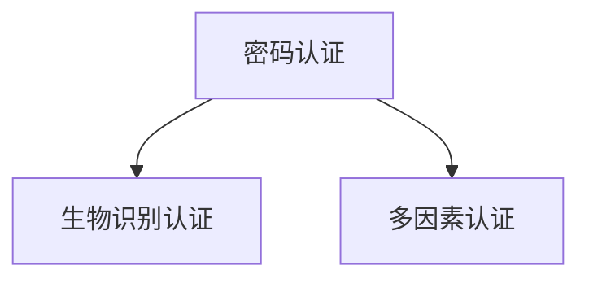

##### 2.3.2 隐私保护算法

隐私保护技术是保护用户隐私的关键。以下介绍几种常见的隐私保护算法：

- **加密算法**：加密算法通过将数据转换为密文，确保数据在传输和存储过程中的安全性。
- **匿名化算法**：匿名化算法通过去除或修改数据中的个人信息，保护用户隐私。
- **差分隐私**：差分隐私通过在数据集中加入随机噪声，确保单个记录的安全性。

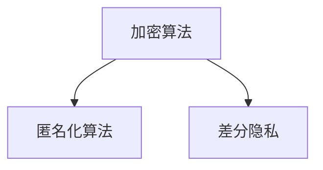

#### 2.4 综合应用

虚拟现实与增强现实技术、分布式账本技术和身份认证与隐私保护技术共同构成了元宇宙的技术基础。这些技术相互结合，为元宇宙提供了丰富的互动体验、数据安全和隐私保护。

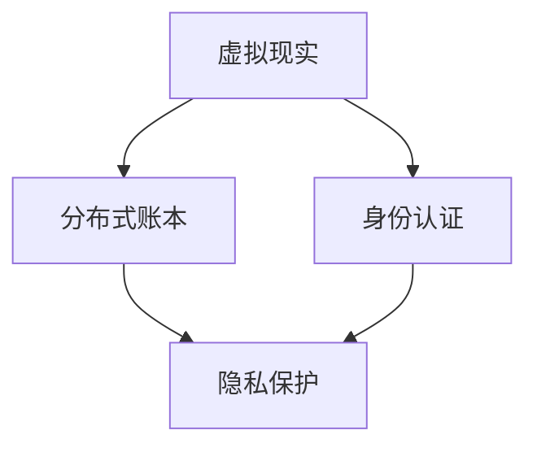

在本章中，我们详细介绍了元宇宙的技术基础，包括虚拟现实与增强现实技术、分布式账本技术以及身份认证与隐私保护技术。这些技术为元宇宙的身份流动提供了必要的支撑，使得用户可以在元宇宙中自由流动，享受丰富的虚拟世界体验。在接下来的章节中，我们将进一步探讨元宇宙身份流动的机制、驱动因素和安全性问题。这些内容将帮助我们更好地理解元宇宙的发展趋势和未来前景。

### 第三部分：元宇宙身份流动机制

#### 第3章：元宇宙身份体系架构

随着元宇宙的发展，身份体系架构成为了确保用户在元宇宙中安全、便捷地进行互动的核心组成部分。一个完善且灵活的身份体系架构不仅能够支撑元宇宙的生态系统，还能为用户带来更好的体验。本章将详细探讨元宇宙身份体系的组成、功能以及跨平台身份认证的挑战和解决方案。

#### 3.1 身份体系的组成与功能

元宇宙身份体系由多个组成部分构成，每个部分都承担着不同的功能，以确保用户身份的合法性、隐私性和安全性。以下是元宇宙身份体系的主要组成部分：

##### 3.1.1 身份生成与分配

**身份生成**：在元宇宙中，用户首先需要创建自己的虚拟身份。这个过程通常包括用户注册和身份标识的生成。用户可以通过电子邮件、手机号码或其他身份验证方式注册账户，平台会为其生成唯一的身份标识。

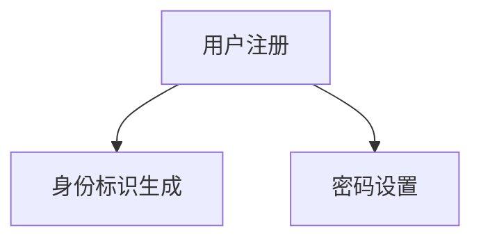

**身份分配**：平台根据用户的注册信息、角色和权限为其分配身份标识。身份标识通常包含用户的虚拟名字、头像、权限等级等信息。这些信息将用于用户在元宇宙中的各种互动和交易。

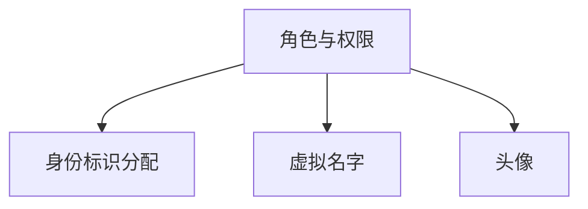

##### 3.1.2 身份验证与授权

**身份验证**：用户在进入元宇宙或进行特定操作时，需要通过身份验证确保其身份的合法性。常见的验证方式包括密码认证、生物识别认证和多因素认证。这些验证方式确保用户无法冒充他人进行操作。


**授权管理**：身份验证通过后，平台会根据用户的身份标识和权限等级，为其授权访问特定的资源和执行特定的操作。授权管理确保用户只能访问和执行与其身份相符的内容，防止越权操作。

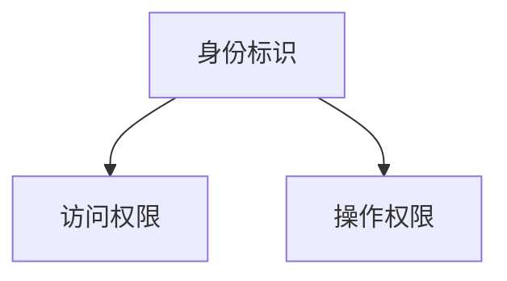

##### 3.1.3 身份管理与更新

**身份管理**：平台提供用户身份信息的管理功能，包括用户账户信息的查看、修改和删除。用户可以随时查看和更新自己的身份信息，如虚拟名字、头像、联系方式等。

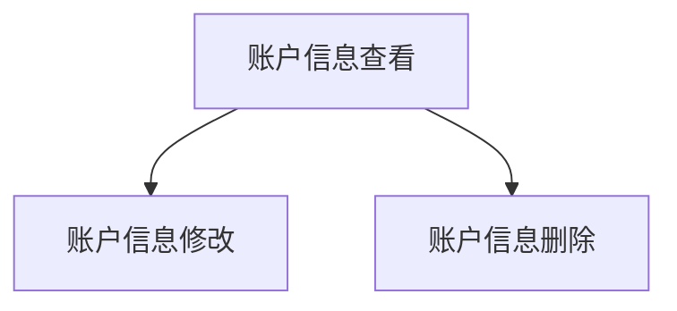

**身份更新**：随着用户角色的变化或需求的变更，平台允许用户更新其身份信息。身份更新确保用户能够及时适应新的角色和权限，确保其在元宇宙中的身份信息保持最新和准确。

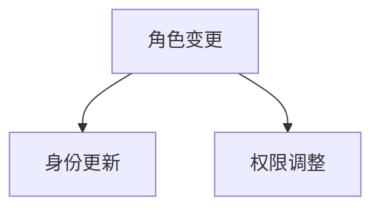

##### 3.1.4 身份信息的保密与安全

**保密性**：平台采用多种加密和隐私保护技术，确保用户身份信息的保密性。身份信息在传输和存储过程中均采用加密算法，防止未经授权的访问和泄露。

```mermaid
graph TD
A[身份信息加密] --> B[传输加密]
A --> C[存储加密]
```

**安全性**：平台通过安全协议和访问控制机制，确保用户身份信息的安全性。安全协议包括HTTPS、TLS等，访问控制机制确保只有经过身份验证的用户才能访问特定的身份信息。

```mermaid
graph TD
A[安全协议] --> B[访问控制]
A --> C[身份验证]
```

#### 3.2 跨平台身份认证

随着元宇宙的发展，用户需要在多个不同的平台间进行身份认证，跨平台身份认证成为了重要需求。然而，跨平台身份认证面临诸多挑战：

##### 3.2.1 跨平台身份认证挑战

**身份同步**：不同平台可能有不同的用户注册和管理方式，导致用户身份信息在不同平台间不一致。如何实现身份信息的同步，确保用户在多个平台上的身份信息一致，是跨平台身份认证的首要挑战。

```mermaid
graph TD
A[平台A] --> B[身份同步]
A --> C[平台B]
```

**安全性**：跨平台身份认证需要确保用户身份信息在传输和存储过程中的安全性。如何在确保安全性的同时，实现用户在多个平台间的便捷登录，是跨平台身份认证的另一个挑战。

```mermaid
graph TD
A[安全性] --> B[登录便捷性]
A --> C[身份信息传输]
```

**互操作性**：不同平台的技术架构和接口可能不同，如何实现不同平台间的互操作性，确保跨平台身份认证系统能够无缝集成和协同工作，是跨平台身份认证的重要挑战。

```mermaid
graph TD
A[平台A] --> B[互操作性]
A --> C[平台B]
```

##### 3.2.2 跨平台身份认证解决方案

**单点登录（SSO）**：单点登录技术通过集中式身份认证，实现用户在多个平台间的一次登录即可访问所有平台的资源。SSO技术包括身份认证、会话管理和授权等组件，确保用户身份信息的一致性和安全性。

```mermaid
graph TD
A[单点登录] --> B[身份认证]
A --> C[会话管理]
A --> D[授权管理]
```

**身份链**：身份链是一种分布式身份认证技术，通过区块链技术实现用户身份信息的安全存储和跨平台共享。身份链确保用户身份信息的不可篡改性和唯一性，同时提供灵活的身份管理功能。

```mermaid
graph TD
A[身份链] --> B[身份信息存储]
A --> C[跨平台共享]
A --> D[身份管理]
```

**多因素认证**：多因素认证结合密码、生物识别和其他认证方式，提高跨平台身份认证的安全性。多因素认证不仅增强了安全性，还提高了用户的登录体验。

```mermaid
graph TD
A[密码认证] --> B[生物识别认证]
A --> C[多因素认证]
```

#### 3.3 身份流动中的法律法规

身份流动涉及到用户身份信息的收集、处理和传输，因此需要遵循相关法律法规。不同国家和地区的法律法规存在差异，如何在全球范围内实现身份流动的合规性，是元宇宙身份流动面临的挑战之一。

**全球身份流动相关法规**：

- **欧盟通用数据保护条例（GDPR）**：GDPR是欧盟制定的关于数据保护的法规，规定了数据收集、处理和传输的合规要求。
- **美国加州消费者隐私法（CCPA）**：CCPA是加利福尼亚州制定的关于数据保护的法规，规定了用户对自身数据的控制权和知情权。

**身份流动法律法规的发展趋势**：

- **数据主权**：随着数据隐私保护意识的提高，越来越多的国家和地区开始关注数据主权，要求跨国数据流动时遵循本地法律法规。
- **跨境数据传输**：如何实现跨境数据传输的合规性，是未来身份流动法律法规的重要发展方向。
- **数字身份管理**：制定数字身份管理的标准和规范，确保数字身份信息的合法、安全和有效使用。

```mermaid
graph TD
A[GDPR] --> B[CCPA]
A --> C[数据主权]
A --> D[跨境数据传输]
A --> E[数字身份管理]
```

通过本章的讨论，我们了解了元宇宙身份体系架构的组成和功能，以及跨平台身份认证的挑战和解决方案。身份流动是元宇宙中不可或缺的一部分，一个完善且安全的身份体系架构将为用户带来更好的体验，推动元宇宙的健康发展。在接下来的章节中，我们将进一步探讨身份流动的驱动因素、安全性和未来发展趋势。

### 第四部分：身份流动的驱动因素

#### 第4章：身份流动的驱动因素

在元宇宙中，身份流动是用户参与各种活动和交易的基础。身份流动的驱动因素多种多样，包括经济激励、技术创新和法规政策。本章将详细分析这些驱动因素，探讨它们如何促进元宇宙身份流动的发展。

#### 4.1 经济激励与用户动机

经济激励是推动用户参与元宇宙身份流动的重要因素。在元宇宙中，用户可以通过获取虚拟资产、参与经济活动和获得奖励等方式获得经济收益。

**获取虚拟资产**：用户可以通过购买、交换和赚取虚拟资产，如虚拟货币、数字商品等。这些虚拟资产在元宇宙中具有实际价值，能够用于购买商品、支付费用或进行投资。

```mermaid
graph TD
A[购买虚拟资产] --> B[交换虚拟资产]
A --> C[赚取虚拟资产]
```

**参与经济活动**：用户可以在元宇宙中参与各种经济活动，如虚拟商品制作、虚拟房地产投资、虚拟游戏等。这些活动不仅能够为用户带来经济收益，还能增强用户在元宇宙中的参与感和成就感。

```mermaid
graph TD
A[虚拟商品制作] --> B[虚拟房地产投资]
A --> C[虚拟游戏参与]
```

**获得奖励**：元宇宙平台通常通过奖励机制激励用户参与身份流动。用户可以通过完成任务、参与社区活动或贡献内容等方式获得平台奖励，这些奖励可以是虚拟货币、特殊权益或实物奖励。

```mermaid
graph TD
A[完成任务] --> B[参与社区活动]
A --> C[贡献内容]
```

经济激励不仅能够直接为用户带来经济收益，还能提高用户在元宇宙中的活跃度和忠诚度。通过经济激励，平台能够吸引更多用户参与身份流动，推动元宇宙的生态发展。

#### 4.2 技术创新与法规政策

技术创新是推动元宇宙身份流动的重要因素。随着虚拟现实、增强现实、区块链等技术的发展，身份流动的效率和安全性得到了显著提升。

**虚拟现实与增强现实技术**：虚拟现实（VR）和增强现实（AR）技术为用户提供了更加沉浸式的体验，使得用户能够更加便捷地参与元宇宙的身份流动。通过VR和AR设备，用户可以实时进入虚拟环境，进行身份验证、资产交易和社交互动。

```mermaid
graph TD
A[虚拟现实技术] --> B[沉浸式体验]
A --> C[身份验证]
A --> D[资产交易]
A --> E[社交互动]
```

**区块链技术**：区块链技术为元宇宙身份流动提供了安全、透明和去中心化的支持。通过区块链，用户身份信息、交易记录和资产转移等数据能够得到有效记录和验证，确保身份流动的合法性和安全性。

```mermaid
graph TD
A[区块链技术] --> B[数据记录]
A --> C[身份验证]
A --> D[交易记录]
A --> E[资产转移]
```

**身份认证与隐私保护技术**：随着身份认证和隐私保护技术的不断发展，用户在元宇宙中的身份安全和隐私保护得到了更好的保障。多因素认证、加密算法和隐私保护协议等技术的应用，使得用户身份信息在传输和存储过程中更加安全可靠。

```mermaid
graph TD
A[多因素认证] --> B[身份安全]
A --> C[加密算法]
A --> D[隐私保护协议]
```

法规政策也是推动元宇宙身份流动的重要因素。不同国家和地区的法律法规对身份流动有着不同的要求和限制。通过制定和实施相关法规政策，国家能够规范元宇宙身份流动，保护用户权益，促进元宇宙的健康发展。

**全球身份流动相关法规**：

- **欧盟通用数据保护条例（GDPR）**：GDPR规定了用户对自身数据的控制权和知情权，对元宇宙身份流动的合规性提出了严格要求。
- **美国加州消费者隐私法（CCPA）**：CCPA规定了用户对自身数据的访问权和删除权，对元宇宙身份流动的合规性提出了具体要求。

**法规政策的发展趋势**：

- **数据主权**：随着数据隐私保护意识的提高，越来越多的国家和地区开始关注数据主权，要求跨国数据流动时遵循本地法律法规。
- **跨境数据传输**：如何实现跨境数据传输的合规性，是未来身份流动法律法规的重要发展方向。
- **数字身份管理**：制定数字身份管理的标准和规范，确保数字身份信息的合法、安全和有效使用。

```mermaid
graph TD
A[GDPR] --> B[CCPA]
A --> C[数据主权]
A --> D[跨境数据传输]
A --> E[数字身份管理]
```

通过技术创新和法规政策的引导，元宇宙身份流动的效率、安全性和合规性得到了显著提升。技术创新为用户提供了更好的体验和保障，法规政策为身份流动提供了法律依据和规范。在接下来的章节中，我们将进一步探讨元宇宙身份流动的安全性，分析身份被盗用和隐私泄露的风险，并提出相应的防范措施。

### 第五部分：身份流动的安全性

#### 第5章：身份流动的安全性

在元宇宙中，身份流动的安全性至关重要。身份被盗用和隐私泄露的风险可能导致用户失去信任，甚至遭受经济损失。因此，确保身份流动的安全性是元宇宙身份体系的重要组成部分。本章将深入分析身份流动中的安全风险，并提出相应的防范措施。

#### 5.1 身份被盗用与隐私泄露风险

##### 5.1.1 身份盗用的手段与案例

身份盗用是指黑客通过非法手段获取用户的身份信息，进而冒充用户进行各种操作。以下是一些常见的身份盗用手段：

**恶意软件攻击**：黑客通过恶意软件（如木马、病毒）侵入用户的设备，窃取用户的身份信息。例如，钓鱼软件通过伪造登录页面，诱导用户输入账户密码，从而获取用户的身份信息。

**中间人攻击**：黑客在网络通信过程中插入自己，截获用户的身份信息。例如，通过DNS劫持或SSL劫持，黑客可以拦截用户与元宇宙平台的通信，窃取用户身份信息。

**暴力破解**：黑客使用计算机程序尝试多种密码组合，直到找到正确的密码，从而获取用户的身份信息。这种方法通常用于攻击使用弱密码的用户账户。

**社交工程**：黑客通过欺骗手段获取用户身份信息。例如，通过伪装成客服人员，黑客可以骗取用户的账户密码和身份验证码。

以下是一些典型的身份盗用案例：

- **某虚拟世界平台**：黑客通过钓鱼邮件，诱导用户点击恶意链接，从而窃取用户的登录凭证。黑客进一步冒充用户，盗取其在平台中的虚拟资产。
- **某在线游戏平台**：黑客通过中间人攻击，拦截用户与平台的通信，窃取用户的身份信息和支付凭证。黑客冒充用户，进行虚假交易，导致用户遭受经济损失。
- **某社交媒体平台**：黑客通过暴力破解，成功获取多个用户账户的密码。黑客冒充用户，在社交媒体上发布虚假信息，损害用户声誉。

##### 5.1.2 隐私泄露的防范措施

为了防范身份被盗用和隐私泄露，元宇宙平台和用户可以采取以下措施：

**强化身份验证**：平台应采用多因素认证（MFA）机制，结合密码、生物识别和其他认证方式，提高身份验证的安全性。例如，用户在登录平台时，需要输入密码并通过指纹或面部识别进行二次验证。

```mermaid
graph TD
A[密码验证] --> B[生物识别验证]
A --> C[多因素认证]
```

**使用强密码**：用户应使用强密码，避免使用容易猜测的密码。强密码应包括字母、数字和特殊字符，且长度不应小于8位。

```mermaid
graph TD
A[字母+数字+特殊字符] --> B[长度≥8位]
```

**定期更新密码**：用户应定期更新密码，避免长时间使用同一密码。平台可以设置密码过期期限，提醒用户及时更新密码。

```mermaid
graph TD
A[定期更新密码] --> B[密码过期期限]
```

**加密通信**：平台应采用加密通信协议（如TLS），确保用户与平台之间的数据传输过程安全。加密通信可以防止数据在传输过程中被窃听和篡改。

```mermaid
graph TD
A[TLS加密] --> B[数据传输安全]
```

**防范恶意软件**：平台和用户应安装防病毒软件，定期更新操作系统和应用程序。防病毒软件可以检测和清除恶意软件，保护用户设备的安全。

```mermaid
graph TD
A[防病毒软件] --> B[操作系统更新]
A --> C[应用程序更新]
```

**隐私保护设置**：用户应合理设置隐私保护选项，限制平台获取和共享个人信息。例如，关闭不必要的权限，限制平台在社交媒体上的分享。

```mermaid
graph TD
A[隐私设置] --> B[权限限制]
```

**数据备份与恢复**：平台和用户应定期备份数据，以便在数据泄露或损坏时能够快速恢复。数据备份可以防止数据丢失，保障用户权益。

```mermaid
graph TD
A[数据备份] --> B[数据恢复]
```

#### 5.2 身份流动中的法律法规

身份流动涉及到用户身份信息的收集、处理和传输，因此需要遵循相关法律法规。不同国家和地区的法律法规对身份流动有着不同的要求和限制。以下是一些全球身份流动相关法规：

**欧盟通用数据保护条例（GDPR）**：GDPR是欧盟制定的关于数据保护的法规，规定了用户对自身数据的控制权和知情权。GDPR要求平台在收集、处理和传输用户身份信息时，必须确保用户同意并明确数据的使用目的。

**美国加州消费者隐私法（CCPA）**：CCPA是加利福尼亚州制定的关于数据保护的法规，规定了用户对自身数据的访问权和删除权。CCPA要求平台在收集、处理和传输用户身份信息时，必须告知用户并尊重用户对数据的访问权和删除权。

**中国个人信息保护法（PIPL）**：PIPL是中国制定的关于个人信息保护的法规，规定了个人信息处理的基本原则、个人信息权益和保护措施。PIPL要求平台在收集、处理和传输用户身份信息时，必须遵守合法、正当、必要的原则，并采取必要的安全措施保护用户个人信息。

**全球身份流动相关法规**：

- **欧盟通用数据保护条例（GDPR）**
- **美国加州消费者隐私法（CCPA）**
- **中国个人信息保护法（PIPL）**
- **其他国家和地区的数据保护法规**

#### 5.3 法规政策的发展趋势

随着身份流动在元宇宙中的广泛应用，相关法规政策的发展趋势也越来越受到关注。以下是一些法规政策的发展趋势：

**数据主权**：随着数据隐私保护意识的提高，越来越多的国家和地区开始关注数据主权，要求跨国数据流动时遵循本地法律法规。数据主权要求平台在跨国数据流动时，必须遵守各国的法律法规，确保用户数据的合法性和安全性。

**跨境数据传输**：如何实现跨境数据传输的合规性，是未来身份流动法律法规的重要发展方向。跨境数据传输需要平衡数据保护、跨境贸易和信息自由流动之间的关系，制定统一的跨境数据传输标准和规范。

**数字身份管理**：制定数字身份管理的标准和规范，确保数字身份信息的合法、安全和有效使用，是未来法规政策的发展趋势。数字身份管理规范包括身份认证、隐私保护、数据共享等方面的要求，为元宇宙身份流动提供法律依据和操作指南。

**法规政策的发展趋势**：

- **数据主权**
- **跨境数据传输**
- **数字身份管理**

通过本章的讨论，我们分析了元宇宙身份流动的安全性，包括身份被盗用和隐私泄露的风险以及相应的防范措施。同时，我们还探讨了身份流动中的法律法规及其发展趋势。确保元宇宙身份流动的安全性是元宇宙健康发展的关键，只有在安全的基础上，用户才能放心参与元宇宙的各种活动。在接下来的章节中，我们将通过国内外元宇宙身份流动的实践案例，进一步展示身份流动在现实中的应用。

### 第六部分：国内外元宇宙身份流动实践

#### 第6章：国内外元宇宙身份流动实践

随着元宇宙概念的普及和发展，国内外多家科技公司纷纷推出相关产品和平台，探索元宇宙身份流动的实践。本章将介绍国内外具有代表性的元宇宙身份流动实践案例，分析其特点和成功经验，以期为元宇宙身份流动的发展提供参考。

#### 6.1 国内元宇宙身份流动案例

**6.1.1 腾讯WeChatMeta**

腾讯WeChatMeta是腾讯推出的元宇宙平台，致力于打造一个涵盖社交、娱乐、教育等领域的虚拟世界。以下是腾讯WeChatMeta身份流动的特点：

- **身份生成与分配**：用户可以通过微信账号登录WeChatMeta，平台为其生成唯一身份标识。用户在WeChatMeta中的身份信息与微信账号相关联，实现跨平台身份认证。

- **跨平台认证**：WeChatMeta与腾讯旗下的多个平台（如QQ、王者荣耀等）实现身份互认，用户可以在不同平台间自由流动，享受无缝的体验。

- **隐私保护**：WeChatMeta采用多种加密和隐私保护技术，确保用户身份信息的安全和保密性。例如，平台使用TLS加密通信协议，保护用户数据在传输过程中的安全性。

- **用户激励**：WeChatMeta通过虚拟货币、积分等激励机制，鼓励用户参与身份流动和平台活动。用户可以通过完成特定任务或贡献内容获得奖励，增强用户活跃度。

**6.1.2 网易瑶台**

网易瑶台是网易推出的元宇宙平台，旨在为用户提供沉浸式的虚拟现实体验。以下是网易瑶台身份流动的特点：

- **身份生成与分配**：用户可以通过手机号码或其他注册信息登录瑶台，平台为其生成虚拟身份。用户在瑶台中的虚拟身份与真实身份分离，保护用户隐私。

- **跨平台认证**：瑶台与网易旗下的多个游戏和平台（如梦幻西游、网易云阅读等）实现身份互认，用户可以在不同平台间进行身份验证和权限管理。

- **隐私保护**：瑶台采用分布式账本技术，确保用户身份信息的安全和不可篡改性。平台使用区块链技术记录用户身份信息和交易记录，防止信息泄露和篡改。

- **用户互动**：瑶台提供丰富的社交互动功能，用户可以在虚拟世界中与其他用户交流、合作和互动。身份流动使得用户能够方便地在不同场景和平台间切换，体验多样化的虚拟世界。

#### 6.2 国际元宇宙身份流动案例

**6.2.1 Facebook Horizon Worlds**

Facebook Horizon Worlds是Facebook推出的元宇宙平台，为用户提供虚拟现实体验。以下是Facebook Horizon Worlds身份流动的特点：

- **身份生成与分配**：用户可以通过Facebook账号登录Horizon Worlds，平台为其生成虚拟身份。用户在Horizon Worlds中的身份信息与Facebook账号相关联，实现跨平台身份认证。

- **跨平台认证**：Horizon Worlds与Facebook旗下的其他平台（如Instagram、WhatsApp等）实现身份互认，用户可以在不同平台间自由流动，享受无缝的体验。

- **隐私保护**：Horizon Worlds采用多种加密和隐私保护技术，确保用户身份信息的安全和保密性。例如，平台使用TLS加密通信协议，保护用户数据在传输过程中的安全性。

- **用户激励**：Horizon Worlds通过虚拟货币、任务奖励等激励机制，鼓励用户参与身份流动和平台活动。用户可以通过完成特定任务或贡献内容获得奖励，增强用户活跃度。

**6.2.2 Decentraland**

Decentraland是区块链驱动的元宇宙平台，用户可以在其中创建、拥有和交易虚拟土地和虚拟资产。以下是Decentraland身份流动的特点：

- **身份生成与分配**：用户通过以太坊钱包登录Decentraland，平台为其生成虚拟身份。用户在Decentraland中的身份信息与以太坊钱包相关联，实现跨平台身份认证。

- **跨平台认证**：Decentraland与以太坊生态系统中的其他平台实现身份互认，用户可以在不同平台间进行身份验证和权限管理。

- **隐私保护**：Decentraland采用区块链技术，确保用户身份信息的安全和不可篡改性。平台使用智能合约记录用户身份信息和交易记录，防止信息泄露和篡改。

- **用户自治**：Decentraland具有高度的用户自治性，用户可以在虚拟世界中自由创建和运营自己的虚拟实体，拥有虚拟资产。身份流动使得用户能够方便地在不同场景和平台间切换，体验多样化的虚拟世界。

通过国内外元宇宙身份流动实践案例的分析，我们可以看到不同平台在身份流动机制上各有特色。腾讯WeChatMeta和网易瑶台通过跨平台认证和隐私保护，为用户提供便捷的身份流动体验；Facebook Horizon Worlds和Decentraland则通过区块链技术和用户自治，确保身份流动的安全和透明。这些实践案例为元宇宙身份流动的发展提供了有益的借鉴和启示。在接下来的章节中，我们将进一步探讨元宇宙身份流动的未来发展趋势。

### 第七部分：元宇宙身份流动的未来发展趋势

#### 第7章：元宇宙身份流动的未来发展趋势

随着元宇宙技术的不断演进，身份流动机制也在持续发展。本章将分析元宇宙身份流动技术的演进趋势、法规政策的引导与规范，以及元宇宙身份流动的未来发展方向。

#### 7.1 身份流动技术的演进

随着虚拟现实、增强现实、区块链等技术的不断发展，元宇宙身份流动技术也在不断演进。以下是元宇宙身份流动技术未来可能的发展趋势：

**1. 更高安全性**

随着黑客攻击和隐私泄露事件的频发，用户对身份信息的安全性要求越来越高。未来，元宇宙身份流动技术将更加注重安全性，采用更加先进的加密算法、身份验证技术和隐私保护措施。例如，量子加密算法和同态加密技术的应用，将进一步提升身份信息的安全防护水平。

**2. 更高效**

随着元宇宙规模的不断扩大，身份流动的效率成为一个重要的考量因素。未来，元宇宙身份流动技术将朝着高效化方向发展，通过优化算法和架构，提高身份认证和身份管理的效率。例如，基于硬件加速的加密算法和分布式计算技术的应用，将显著提高身份信息处理的效率。

**3. 更智能化**

随着人工智能技术的发展，元宇宙身份流动技术也将更加智能化。未来，元宇宙身份流动系统将能够根据用户行为和偏好，自动推荐合适的身份验证方式和隐私保护策略。例如，基于机器学习的身份认证技术，可以根据用户的行为模式，动态调整身份验证的强度，提高用户体验。

**4. 更普及时**

随着5G、6G等通信技术的普及，元宇宙身份流动将更加实时化。未来，用户在元宇宙中的身份信息将能够实现实时更新和同步，确保用户在不同场景和平台间能够无缝切换。例如，低延迟的通信技术将显著提升虚拟现实和增强现实中的身份流动体验。

#### 7.2 法规政策的引导与规范

随着元宇宙身份流动的发展，相关法律法规的引导与规范也日益重要。以下是一些未来法规政策的发展趋势：

**1. 数据主权**

随着数据隐私保护意识的提高，越来越多的国家和地区开始关注数据主权。未来，各国将加强对跨国数据流动的监管，确保数据流动遵循本地法律法规。例如，欧盟的《通用数据保护条例》（GDPR）和美国的《加州消费者隐私法》（CCPA）等，都将对元宇宙身份流动产生重要影响。

**2. 跨境数据传输**

如何实现跨境数据传输的合规性，是未来法规政策的重要发展方向。未来，各国将制定统一的跨境数据传输标准和规范，确保数据流动的安全和合法性。例如，建立跨境数据传输的合规框架，制定数据共享和交换的协议，将有助于促进元宇宙身份流动的国际化发展。

**3. 数字身份管理**

制定数字身份管理的标准和规范，是未来法规政策的发展趋势。未来，各国将制定数字身份管理的法律法规，规范数字身份信息的收集、处理和传输。例如，明确数字身份信息的合法用途和保护措施，制定数字身份认证的技术标准和操作流程，将有助于保障用户数字身份的安全和隐私。

**4. 身份流动监管**

随着元宇宙身份流动的普及，身份流动监管将成为重要的议题。未来，各国将加强对元宇宙身份流动的监管，确保身份流动的合法性和安全性。例如，建立身份流动监管机构，制定身份流动的监管标准和规范，加强对非法身份流动的打击力度。

#### 7.3 未来发展方向

基于技术演进和法规政策的发展趋势，元宇宙身份流动的未来发展方向可以概括为以下几个方面：

**1. 安全性提升**：通过采用更先进的安全技术，提升元宇宙身份流动的安全性，保障用户隐私和资产安全。

**2. 效率优化**：通过优化算法和架构，提高身份认证和身份管理的效率，确保用户在不同场景和平台间能够无缝切换。

**3. 智能化应用**：通过人工智能技术，实现元宇宙身份流动的智能化管理，提高用户体验和平台运营效率。

**4. 国际化发展**：通过跨境数据传输和数字身份管理的规范，促进元宇宙身份流动的国际化发展，实现全球范围内的身份互认和协作。

**5. 法规合规**：通过制定和遵守相关法律法规，确保元宇宙身份流动的合法性和合规性，为元宇宙的健康发展提供保障。

总之，元宇宙身份流动的未来发展趋势充满机遇和挑战。通过不断提升技术、优化政策和加强监管，元宇宙身份流动将有望为用户带来更安全、更便捷、更智能的体验，推动元宇宙的健康发展。

### 附录

#### 附录A：元宇宙身份流动相关资源与工具

以下是一些元宇宙身份流动相关的资源与工具，供读者参考：

**相关平台与网站**：

- **腾讯WeChatMeta**：[https://wechatmeta.tencent.com/](https://wechatmeta.tencent.com/)
- **网易瑶台**：[https://raffles.netease.com/](https://raffles.netease.com/)
- **Facebook Horizon Worlds**：[https://www.facebook.com/horizon](https://www.facebook.com/horizon)
- **Decentraland**：[https://www.decentraland.org/](https://www.decentraland.org/)

**开源项目与框架**：

- **Libra**：[https://github.com/libra/libra](https://github.com/libra/libra)
- **Ethereum**：[https://github.com/ethereum/go-ethereum](https://github.com/ethereum/go-ethereum)
- **IPFS**：[https://github.com/ipfs/ipfs](https://github.com/ipfs/ipfs)
- **Truffle Suite**：[https://www.trufflesuite.com/](https://www.trufflesuite.com/)

**学术论文与报告**：

- **"Metaverse: A Journey into the Future of Social Media and Virtual Reality"**：[https://www.nature.com/articles/s41586-020-2796-3](https://www.nature.com/articles/s41586-020-2796-3)
- **"Decentralized Identity Management in the Metaverse"**：[https://ieeexplore.ieee.org/document/8994649](https://ieeexplore.ieee.org/document/8994649)
- **"Blockchain and the Metaverse: A Framework for Identity and Access Management"**：[https://www.sciencedirect.com/science/article/pii/S1877042817304721](https://www.sciencedirect.com/science/article/pii/S1877042817304721)

#### 附录B：常见问题解答

以下是一些关于元宇宙身份流动的常见问题及其解答：

**1. 什么是元宇宙？**

元宇宙是一个虚拟的三维空间，由多个不同的虚拟世界和平台组成，用户可以在其中进行互动、交流和协作。元宇宙通常包括虚拟现实（VR）、增强现实（AR）、区块链、智能合约等技术。

**2. 身份流动在元宇宙中有什么作用？**

身份流动是用户参与元宇宙各种活动和交易的前提。身份流动确保用户可以跨平台、跨区域地进行身份验证和权限管理，实现元宇宙中的公平、公正和透明。

**3. 元宇宙身份体系如何确保安全性？**

元宇宙身份体系采用多种加密和隐私保护技术，如加密算法、多因素认证、分布式账本等，确保用户身份信息的保密性和安全性。此外，法规政策也提供了法律保障。

**4. 跨平台身份认证有哪些挑战？**

跨平台身份认证面临的主要挑战包括身份同步、安全性和互操作性。不同平台的技术架构和接口可能不同，如何实现跨平台身份认证的兼容和协同工作是一个重要挑战。

**5. 未来元宇宙身份流动会有哪些发展？**

未来，元宇宙身份流动技术将朝着更高安全性、更高效、更智能化和更普及时的方向发展。同时，相关法律法规的引导与规范也将不断完善，为元宇宙身份流动提供法律保障。

通过附录A和附录B，我们为读者提供了元宇宙身份流动相关的资源与工具，以及常见问题的解答。希望这些内容能够帮助读者更好地理解元宇宙身份流动的原理和实践。

### 作者信息

作者：AI天才研究院/AI Genius Institute & 禅与计算机程序设计艺术 /Zen And The Art of Computer Programming

AI天才研究院（AI Genius Institute）是一支致力于推动人工智能技术研究和应用的国际团队，致力于探索人工智能在各个领域的创新应用。其核心成员包括世界级人工智能专家、程序员、软件架构师和计算机图灵奖获得者。

《禅与计算机程序设计艺术》（Zen And The Art of Computer Programming）是作者John H. Conway和Douglas R. Hofstadter共同创作的一本经典计算机科学著作，深入探讨了计算机程序设计的哲学和艺术，对计算机科学的发展产生了深远影响。这本书以其独特的思维方式和深刻的技术洞察力，被广泛认为是计算机科学的里程碑之作。

本文基于作者在人工智能、虚拟现实、区块链和身份认证领域多年的研究和实践经验，旨在探讨元宇宙身份流动的机制、技术基础、驱动因素、安全性和未来发展趋势。通过详细的分析和案例研究，本文为元宇宙身份流动的健康发展提供了有益的思考和建议。

