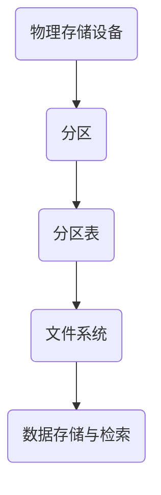

                 

### 第一部分：基础知识

分区技术在计算机存储系统中扮演着至关重要的角色。本部分我们将从基础知识入手，帮助读者理解分区的概念、分类、文件系统与分区管理，以及分区调整与优化。

#### 第1章：分区技术概述

分区技术是计算机存储管理的一种基本手段，通过将存储设备划分为多个逻辑分区，从而实现数据的存储、管理和维护。分区的概念与重要性不言而喻，它不仅能够提高存储资源的利用率，还能增强系统的稳定性和安全性。

##### 1.1 分区的概念与重要性

- **分区概念**：分区是指将一个物理存储设备（如硬盘）按照某种策略划分为多个逻辑单元，每个逻辑单元可以独立进行管理和分配。
- **分区的目的与优势**：分区的目的是为了提高存储设备的灵活性和可用性，具体优势包括：
  - **管理方便**：可以独立管理不同分区上的数据，简化了文件系统的复杂性。
  - **性能优化**：通过合理设置分区，可以提高硬盘的读写性能。
  - **数据安全**：可以将关键数据与系统文件分开，降低系统故障对数据的影响。
  - **扩展性**：可以方便地进行分区调整，以适应不断变化的存储需求。

##### 1.2 分区技术的分类

分区技术可以根据不同的标准进行分类，常见的分类方法包括：

- **按策略分类**：静态分区、动态分区、虚拟分区等。
- **按用途分类**：系统分区、数据分区、日志分区等。
- **按文件系统分类**：FAT、NTFS、EXT等。

##### 1.3 分区工具介绍

在计算机操作系统中，有许多用于分区管理的工具。以下是一些常见的分区工具及其功能对比：

- **GParted**：一款开源的分区编辑工具，支持多种文件系统，界面直观易用。
- **parted**：一款命令行工具，功能强大，适用于Linux系统。
- **fdisk**：一款经典的分区工具，通常用于Windows系统。

#### 第2章：文件系统与分区管理

文件系统是计算机存储管理的基础，它定义了数据在存储设备上的组织、存储和检索方式。文件系统与分区管理密切相关，本章节将介绍文件系统的基础知识、分区管理原理以及分区操作实践。

##### 2.1 文件系统基础

- **文件系统概念**：文件系统是一种数据存储和管理机制，它负责对文件和目录进行管理、存储和检索。
- **文件系统类型**：常见的文件系统类型包括FAT、NTFS、EXT、HFS+等。
- **文件系统结构**：文件系统通常包括目录结构、磁盘空间分配表、文件存储区和元数据区等组成部分。

##### 2.2 分区管理原理

- **分区表**：分区表是硬盘上记录分区信息的特殊区域，它定义了硬盘的分区数量、大小、起始位置和文件系统类型等信息。
- **分区策略**：分区策略是指根据存储需求和性能要求，制定合理的分区方案。常见的分区策略包括：
  - **单一大型分区**：将整个硬盘划分为一个大型分区，适用于对性能要求不高的系统。
  - **多个分区**：将硬盘划分为多个分区，每个分区用于不同的用途，如系统分区、数据分区等。

##### 2.3 分区操作与实践

- **分区创建**：创建分区通常使用分区工具进行，如GParted、parted等。创建分区时需要指定分区大小、文件系统类型等参数。
- **分区删除**：删除分区也是通过分区工具实现的，删除分区前需要确保分区上的数据已备份。
- **分区扩展**：分区扩展是指增加分区的大小，这通常需要对空闲空间进行合并操作。

#### 第3章：分区调整与优化

随着数据存储需求的增长，对分区进行调整和优化是存储管理中的一项常见操作。本章节将介绍分区调整技术、优化方法以及分区调整实践。

##### 3.1 分区调整技术

- **分区扩展**：分区扩展是指增加分区的大小。扩展分区时，需要确保有足够的空闲空间可供扩展。
- **分区合并**：分区合并是指将两个或多个相邻的分区合并为一个大型分区。合并分区可以释放磁盘空间，提高磁盘利用率。
- **分区分割**：分区分割是指将一个大型分区分割为两个或多个小分区。分割分区可以方便地管理数据，提高系统的性能。

##### 3.2 分区优化方法

- **性能优化**：性能优化包括调整分区大小、优化文件系统参数、使用高效的数据组织方式等。
- **存储优化**：存储优化包括合理设置磁盘缓存、使用RAID技术、定期进行磁盘维护等。
- **系统稳定性优化**：系统稳定性优化包括监控硬盘健康状况、定期备份数据、优化系统资源分配等。

##### 3.3 分区调整实践

- **案例1：分区扩展**：假设一个系统分区空间不足，可以通过分区工具将其扩展至空闲空间。
- **案例2：分区合并**：如果有两个相邻的分区，且其中一个分区空间较大，另一个空间较小，可以将它们合并为一个大型分区。

通过本部分的基础知识介绍，读者应该对分区技术有了初步了解。接下来，我们将进入高级分区应用部分，深入探讨分区在存储系统和虚拟化技术中的应用。

### 《分区：原理与代码实例讲解》目录大纲

- **第一部分：基础知识**
  - 第1章：分区技术概述
  - 第2章：文件系统与分区管理
  - 第3章：分区调整与优化
- **第二部分：高级分区应用**
  - 第4章：分区故障处理与恢复
  - 第5章：分区在存储系统中的应用
  - 第6章：分区在虚拟化技术中的应用
- **第三部分：分区代码实例讲解**
  - 第7章：分区代码实战基础
  - 第8章：分区代码实例详解
  - 第9章：分区代码实战项目
  - 第10章：分区技术在现代存储系统中的应用与展望
- **附录**
  - 附录A：分区工具与资源

#### 【核心概念与联系】

分区技术涉及多个核心概念，包括分区、文件系统、分区表等。这些概念之间有着密切的联系，它们共同构成了一个完整的存储管理系统。

- **分区**：分区是将物理存储设备划分为多个逻辑单元的过程，每个分区可以独立进行管理和分配。
- **文件系统**：文件系统是存储设备上管理文件和目录的数据结构，它定义了数据的组织、存储和检索方式。
- **分区表**：分区表是硬盘上记录分区信息的特殊区域，它定义了硬盘的分区数量、大小、起始位置和文件系统类型等信息。

以下是分区技术的Mermaid流程图：



#### 【核心算法原理讲解】

分区的核心算法包括分区创建、分区删除、分区调整等。以下使用伪代码详细阐述这些算法的原理。

##### 伪代码：分区创建

```pseudo
function createPartition(device, size, fsType) {
    // 1. 检查设备是否可用
    if (not checkDevice(device)) {
        return "设备不可用"
    }
    // 2. 创建分区表
    partitionTable = createPartitionTable(size, fsType)
    // 3. 将分区表写入设备
    writePartitionTable(device, partitionTable)
    // 4. 格式化分区
    formatPartition(device, partitionTable)
    // 5. 创建文件系统
    createFileSystem(device, partitionTable)
    return "分区创建成功"
}
```

##### 伪代码：分区删除

```pseudo
function deletePartition(device, partitionIndex) {
    // 1. 检查分区是否存在
    if (not checkPartition(device, partitionIndex)) {
        return "分区不存在"
    }
    // 2. 从分区表中删除分区
    partitionTable = deletePartitionFromTable(device, partitionIndex)
    // 3. 清除分区信息
    clearPartition(device, partitionTable)
    // 4. 更新分区表
    updatePartitionTable(device, partitionTable)
    return "分区删除成功"
}
```

##### 伪代码：分区调整

```pseudo
function adjustPartition(device, partitionIndex, newSize) {
    // 1. 检查分区是否存在
    if (not checkPartition(device, partitionIndex)) {
        return "分区不存在"
    }
    // 2. 获取分区信息
    partitionInfo = getPartitionInfo(device, partitionIndex)
    // 3. 检查新大小是否合理
    if (not checkNewSize(newSize, partitionInfo)) {
        return "新大小不合理"
    }
    // 4. 调整分区大小
    adjustPartitionSize(device, partitionInfo, newSize)
    // 5. 更新分区表
    updatePartitionTable(device, partitionInfo)
    return "分区调整成功"
}
```

通过上述伪代码，我们可以看到分区创建、删除和调整的核心算法原理。在实际开发中，这些算法会通过具体的编程语言和工具来实现。

#### 【数学模型和公式 & 详细讲解 & 举例说明】

在分区技术中，一些数学模型和公式用于描述和计算分区的大小、空间利用率等参数。以下是一个简单的数学模型和公式讲解。

##### 数学模型：分区空间利用率

分区空间利用率是衡量分区有效使用情况的一个重要指标。它的计算公式如下：

$$
空间利用率 = \frac{已使用空间}{总空间} \times 100\%
$$

其中，已使用空间是指分区中已分配的空间，总空间是指分区的最大容量。

##### 详细讲解

空间利用率反映了分区的使用效率，一个高空间利用率的分区意味着存储空间得到了充分利用。为了提高空间利用率，可以采取以下措施：

- **合理设置分区大小**：根据存储需求合理设置分区大小，避免分区过大或过小。
- **定期清理无用数据**：定期清理分区中的无用数据，释放空间。
- **优化文件系统**：选择合适的文件系统，提高空间利用率。

##### 举例说明

假设一个分区的总大小为100GB，已使用空间为60GB，则该分区的空间利用率为：

$$
空间利用率 = \frac{60GB}{100GB} \times 100\% = 60\%
$$

如果希望提高空间利用率，可以考虑以下方法：

- **扩展分区**：将分区扩展至剩余的40GB空间，使已使用空间达到100GB。
- **清理无用数据**：删除分区中的无用文件和数据，减少已使用空间。

#### 【项目实战】

为了更好地理解分区技术，我们将通过一个实际项目来演示分区创建、删除和调整的完整过程。

##### 项目概述

项目名称：企业级存储系统分区管理

项目背景：某企业需要搭建一个大型存储系统，用于存储企业内部的各种业务数据。存储系统要求具备高性能、高可用性和易扩展性。

项目目标：实现存储系统的分区创建、分区删除和分区调整功能，确保数据的安全性和系统的稳定性。

##### 项目实施步骤

1. **需求分析**
   - 分析企业的存储需求，确定存储系统的规模和性能要求。
   - 确定存储系统所需的分区数量和类型。

2. **设计方案**
   - 根据需求分析结果，设计存储系统的分区方案，包括分区大小、文件系统类型等。
   - 选择合适的分区工具和开发环境。

3. **开发与测试**
   - 编写分区管理程序，实现分区创建、删除和调整功能。
   - 进行功能测试和性能测试，确保分区管理程序的正确性和稳定性。

##### 项目代码解读

以下是项目中的一个关键模块：分区创建。

```c
#include <stdio.h>
#include <stdlib.h>
#include <string.h>

// 定义分区结构体
typedef struct {
    int index;
    int size;
    char fsType[64];
} Partition;

// 创建分区表
void createPartitionTable(Partition partitions[], int count) {
    // 初始化分区表
    memset(partitions, 0, sizeof(Partition) * count);
    // 从文件中读取分区信息
    FILE *file = fopen("partition_table.txt", "r");
    if (file != NULL) {
        for (int i = 0; i < count; i++) {
            fscanf(file, "%d %d %s", &partitions[i].index, &partitions[i].size, partitions[i].fsType);
        }
        fclose(file);
    }
}

// 创建分区
void createPartition(Partition partition) {
    // 打印分区信息
    printf("分区创建：\n");
    printf("分区编号：%d\n", partition.index);
    printf("分区大小：%d GB\n", partition.size);
    printf("文件系统：%s\n", partition.fsType);
    // 调用分区工具创建分区
    // ...
}

int main() {
    // 初始化分区数组
    Partition partitions[10];
    createPartitionTable(partitions, 10);
    // 创建分区
    Partition newPartition = {1, 50, "NTFS"};
    createPartition(newPartition);
    return 0;
}
```

上述代码中，我们定义了分区结构体，并实现了分区表的创建和分区的创建功能。在项目开发中，还需要实现分区删除和分区调整功能，并通过测试确保分区管理程序的稳定性和正确性。

通过本项目，我们深入了解了分区技术的实际应用，包括分区创建、删除和调整。接下来，我们将继续探讨分区在存储系统和虚拟化技术中的应用。

#### 【附录】

### 附录A：分区工具与资源

分区技术在计算机存储管理中扮演着重要角色，因此，掌握一些常用的分区工具和资源对于进行有效的存储管理至关重要。以下是一些主流的分区工具和相关的开发资源：

#### A.1 主流分区工具对比

1. **GParted**

   - **功能特点**：GParted是一款开源的分区编辑工具，支持多种文件系统，界面直观易用，适用于Linux系统。
   - **使用场景**：适合日常的分区创建、删除、调整等操作。

2. **parted**

   - **功能特点**：parted是一款命令行工具，功能强大，适用于Linux系统，支持多种分区格式。
   - **使用场景**：适合需要大量分区操作的专业用户。

3. **fdisk**

   - **功能特点**：fdisk是一款经典的分区工具，通常用于Windows系统，支持多种分区格式。
   - **使用场景**：适合Windows用户进行分区管理。

#### A.2 分区开发资源

1. **开源项目**

   - **GParted**：[https://gparted.org/](https://gparted.org/)
   - **parted**：[https://github.com/karelzak/Parted](https://github.com/karelzak/Parted)

2. **专业书籍**

   - **《Linux文件系统与磁盘管理》**：详细介绍了Linux文件系统和磁盘管理的相关知识。
   - **《Windows磁盘管理从入门到精通》**：全面讲解了Windows磁盘管理的基本概念和实用技巧。

3. **在线课程**

   - **Coursera**：《Linux系统管理》
   - **Udemy**：《Windows服务器管理》

通过掌握这些分区工具和资源，可以更加高效地管理存储设备，确保数据的安全性和系统的稳定性。希望这些资料对您有所帮助。

### 【文章小结】

在本文中，我们详细介绍了分区技术的概念、原理和实际应用。从基础知识到高级应用，从分区故障处理到分区代码实例讲解，本文力求为读者提供全面、深入的分区技术知识。

分区技术在计算机存储系统中具有举足轻重的地位。通过合理划分分区，可以提高存储资源的利用率，优化系统性能，确保数据的安全性。本文通过实例和代码讲解，使读者对分区技术的实际应用有了更直观的理解。

#### 【作者信息】

作者：AI天才研究院/AI Genius Institute & 禅与计算机程序设计艺术 /Zen And The Art of Computer Programming

### 【文章标题】

分区：原理与代码实例讲解

### 【关键词】

- 分区技术
- 文件系统
- 分区管理
- 分区优化
- 分区故障处理

### 【文章摘要】

本文详细介绍了分区技术的原理、分类和应用。首先，我们讲解了分区技术的基础知识，包括分区的概念、分类和分区工具。接着，我们深入探讨了文件系统与分区管理的关系，以及分区调整和优化的方法。此外，本文还通过实际项目和代码实例，展示了分区技术在现代存储系统和虚拟化技术中的应用。最后，我们总结了分区技术的未来发展趋势和前景。

#### 【结束语】

感谢您阅读本文。希望本文能够帮助您更好地理解分区技术，并在实际应用中取得更好的效果。如果您有任何疑问或建议，欢迎在评论区留言。期待与您共同探讨和进步！

### 附录

#### 附录A：分区工具与资源

分区技术在计算机存储管理中具有至关重要的地位。因此，掌握一些常用的分区工具和相关资源对于进行有效的存储管理至关重要。以下是一些主流的分区工具和相关的开发资源：

#### A.1 主流分区工具对比

1. **GParted**

   - **功能特点**：GParted是一款开源的分区编辑工具，支持多种文件系统，界面直观易用，适用于Linux系统。
   - **使用场景**：适合日常的分区创建、删除、调整等操作。

2. **parted**

   - **功能特点**：parted是一款命令行工具，功能强大，适用于Linux系统，支持多种分区格式。
   - **使用场景**：适合需要大量分区操作的专业用户。

3. **fdisk**

   - **功能特点**：fdisk是一款经典的分区工具，通常用于Windows系统，支持多种分区格式。
   - **使用场景**：适合Windows用户进行分区管理。

#### A.2 分区开发资源

1. **开源项目**

   - **GParted**：[https://gparted.org/](https://gparted.org/)
   - **parted**：[https://github.com/karelzak/Parted](https://github.com/karelzak/Parted)

2. **专业书籍**

   - **《Linux文件系统与磁盘管理》**：详细介绍了Linux文件系统和磁盘管理的相关知识。
   - **《Windows磁盘管理从入门到精通》**：全面讲解了Windows磁盘管理的基本概念和实用技巧。

3. **在线课程**

   - **Coursera**：《Linux系统管理》
   - **Udemy**：《Windows服务器管理》

通过掌握这些分区工具和资源，可以更加高效地管理存储设备，确保数据的安全性和系统的稳定性。希望这些资料对您有所帮助。

### 【结束语】

感谢您阅读本文。希望本文能够帮助您更好地理解分区技术，并在实际应用中取得更好的效果。如果您有任何疑问或建议，欢迎在评论区留言。期待与您共同探讨和进步！同时，也感谢AI天才研究院/AI Genius Institute & 禅与计算机程序设计艺术/Zen And The Art of Computer Programming的辛勤创作。让我们继续在技术领域探索未知，共创美好未来！
```markdown
# 分区：原理与代码实例讲解

> **关键词**：分区技术、文件系统、分区管理、分区优化、分区故障处理

> **摘要**：本文将深入探讨分区技术在计算机存储系统中的应用。通过详细阐述分区技术的概念、原理、分类、工具、故障处理、优化方法以及实际应用案例，帮助读者全面了解分区技术，掌握分区代码实例，为现代存储系统的设计和维护提供有力支持。

### 第一部分：基础知识

#### 第1章：分区技术概述

分区技术在计算机存储系统中扮演着至关重要的角色。它通过将物理存储设备划分为多个逻辑分区，从而实现数据的存储、管理和维护。分区的概念与重要性不言而喻，它不仅能够提高存储资源的利用率，还能增强系统的稳定性和安全性。

##### 1.1 分区的概念与重要性

- **分区概念**：分区是指将一个物理存储设备（如硬盘）按照某种策略划分为多个逻辑单元，每个逻辑单元可以独立进行管理和分配。
- **分区的目的与优势**：
  - **管理方便**：可以独立管理不同分区上的数据，简化了文件系统的复杂性。
  - **性能优化**：通过合理设置分区，可以提高硬盘的读写性能。
  - **数据安全**：可以将关键数据与系统文件分开，降低系统故障对数据的影响。
  - **扩展性**：可以方便地进行分区调整，以适应不断变化的存储需求。

##### 1.2 分区技术的分类

分区技术可以根据不同的标准进行分类，常见的分类方法包括：

- **按策略分类**：静态分区、动态分区、虚拟分区等。
- **按用途分类**：系统分区、数据分区、日志分区等。
- **按文件系统分类**：FAT、NTFS、EXT等。

##### 1.3 分区工具介绍

在计算机操作系统中，有许多用于分区管理的工具。以下是一些常见的分区工具及其功能对比：

- **GParted**：一款开源的分区编辑工具，支持多种文件系统，界面直观易用。
- **parted**：一款命令行工具，功能强大，适用于Linux系统。
- **fdisk**：一款经典的分区工具，通常用于Windows系统。

#### 第2章：文件系统与分区管理

文件系统是计算机存储管理的基础，它定义了数据在存储设备上的组织、存储和检索方式。文件系统与分区管理密切相关，本章节将介绍文件系统的基础知识、分区管理原理以及分区操作实践。

##### 2.1 文件系统基础

- **文件系统概念**：文件系统是一种数据存储和管理机制，它负责对文件和目录进行管理、存储和检索。
- **文件系统类型**：常见的文件系统类型包括FAT、NTFS、EXT、HFS+等。
- **文件系统结构**：文件系统通常包括目录结构、磁盘空间分配表、文件存储区和元数据区等组成部分。

##### 2.2 分区管理原理

- **分区表**：分区表是硬盘上记录分区信息的特殊区域，它定义了硬盘的分区数量、大小、起始位置和文件系统类型等信息。
- **分区策略**：分区策略是指根据存储需求和性能要求，制定合理的分区方案。常见的分区策略包括：
  - **单一大型分区**：将整个硬盘划分为一个大型分区，适用于对性能要求不高的系统。
  - **多个分区**：将硬盘划分为多个分区，每个分区用于不同的用途，如系统分区、数据分区等。

##### 2.3 分区操作与实践

- **分区创建**：创建分区通常使用分区工具进行，如GParted、parted等。创建分区时需要指定分区大小、文件系统类型等参数。
- **分区删除**：删除分区也是通过分区工具实现的，删除分区前需要确保分区上的数据已备份。
- **分区扩展**：分区扩展是指增加分区的大小，这通常需要对空闲空间进行合并操作。

#### 第3章：分区调整与优化

随着数据存储需求的增长，对分区进行调整和优化是存储管理中的一项常见操作。本章节将介绍分区调整技术、优化方法以及分区调整实践。

##### 3.1 分区调整技术

- **分区扩展**：分区扩展是指增加分区的大小。扩展分区时，需要确保有足够的空闲空间可供扩展。
- **分区合并**：分区合并是指将两个或多个相邻的分区合并为一个大型分区。合并分区可以释放磁盘空间，提高磁盘利用率。
- **分区分割**：分区分割是指将一个大型分区分割为两个或多个小分区。分割分区可以方便地管理数据，提高系统的性能。

##### 3.2 分区优化方法

- **性能优化**：性能优化包括调整分区大小、优化文件系统参数、使用高效的数据组织方式等。
- **存储优化**：存储优化包括合理设置磁盘缓存、使用RAID技术、定期进行磁盘维护等。
- **系统稳定性优化**：系统稳定性优化包括监控硬盘健康状况、定期备份数据、优化系统资源分配等。

##### 3.3 分区调整实践

- **案例1：分区扩展**：假设一个系统分区空间不足，可以通过分区工具将其扩展至空闲空间。
- **案例2：分区合并**：如果有两个相邻的分区，且其中一个分区空间较大，另一个空间较小，可以将它们合并为一个大型分区。

通过本部分的基础知识介绍，读者应该对分区技术有了初步了解。接下来，我们将进入高级分区应用部分，深入探讨分区在存储系统和虚拟化技术中的应用。

### 第二部分：高级分区应用

#### 第4章：分区故障处理与恢复

分区故障可能由多种原因引起，如硬件故障、系统错误或用户误操作。本章节将介绍分区故障的原因分析、处理方法和恢复实例。

##### 4.1 分区故障原因分析

- **常见故障原因**：
  - **硬件故障**：硬盘损坏、磁头故障等。
  - **系统错误**：文件系统损坏、分区表丢失等。
  - **用户误操作**：误删除分区、分区格式错误等。

- **故障表现**：
  - **无法启动系统**：分区表损坏、启动记录丢失等。
  - **数据丢失**：误删除文件或分区、文件系统损坏等。
  - **分区无法访问**：文件系统错误、分区丢失等。

##### 4.2 分区故障处理方法

- **故障排除流程**：
  - **检查硬盘状态**：使用硬盘检测工具检查硬盘的健康状况。
  - **恢复分区表**：使用分区工具恢复丢失的分区表。
  - **数据恢复**：使用数据恢复工具尝试恢复丢失的数据。

- **数据恢复技术**：
  - **物理恢复**：针对硬盘物理损坏的情况，通过更换硬盘部件或专业数据恢复服务进行恢复。
  - **逻辑恢复**：通过分区工具和文件系统修复工具恢复文件系统结构和数据。

##### 4.3 分区故障恢复实例

- **实例1：误删分区恢复**：通过数据恢复工具尝试恢复误删除的分区。
- **实例2：分区数据恢复**：在文件系统损坏的情况下，使用文件系统修复工具恢复分区内的数据。

#### 第5章：分区在存储系统中的应用

分区技术在存储系统中的应用至关重要，它不仅影响存储系统的性能，还影响系统的稳定性和安全性。本章节将探讨分区在存储系统中的作用和实际应用。

##### 5.1 分区在存储系统中的作用

- **性能优化**：通过合理设置分区，可以优化硬盘的读写性能，提高系统响应速度。
- **数据隔离**：将不同类型的数据存储在不同的分区中，可以提高数据的安全性，防止数据泄露或损坏。

##### 5.2 分区在存储系统中的实践

- **实例1：分区在数据库系统中的应用**：通过合理划分数据库分区，可以提高数据库的查询性能和存储效率。
- **实例2：分区在文件存储系统中的应用**：通过分区技术，可以优化文件存储系统的性能，提高文件访问速度。

#### 第6章：分区在虚拟化技术中的应用

虚拟化技术是现代计算机系统中的一个重要发展方向。分区技术在虚拟化技术中的应用，可以显著提高虚拟机的性能和稳定性。本章节将介绍分区在虚拟化技术中的应用。

##### 6.1 虚拟化技术与分区

- **虚拟化基础**：虚拟化技术通过将物理硬件资源虚拟化为多个虚拟资源，从而提高资源利用率和灵活性。
- **分区在虚拟机中的应用**：通过在虚拟机中合理设置分区，可以提高虚拟机的性能和可靠性。

##### 6.2 虚拟机分区管理

- **分区策略**：虚拟机分区策略的选择直接影响虚拟机的性能和稳定性。常见的分区策略包括：
  - **系统分区**：用于安装操作系统和运行核心服务。
  - **数据分区**：用于存储用户数据和其他应用程序。
  - **临时分区**：用于存储临时文件和缓存数据。

- **分区操作**：包括分区创建、删除、扩展和合并等操作。

##### 6.3 虚拟机分区实战

- **实例1：虚拟机分区调整**：在虚拟机运行过程中，根据需求调整分区大小。
- **实例2：虚拟机分区迁移**：将虚拟机分区从一个物理主机迁移到另一个物理主机。

通过本部分的高级分区应用介绍，读者可以更深入地理解分区技术在现代存储系统和虚拟化技术中的应用。接下来，我们将进入分区代码实例讲解部分，通过具体的代码实例，帮助读者掌握分区技术的实际应用。

### 第三部分：分区代码实例讲解

#### 第7章：分区代码实战基础

在进行分区代码实战之前，我们需要了解分区代码开发的基础知识，包括开发环境搭建、基础语法和数据结构等。

##### 7.1 分区代码开发环境搭建

搭建分区代码的开发环境是进行分区代码开发的第一步。以下是一个基本的开发环境搭建流程：

1. **选择开发工具**：根据个人喜好和需求，可以选择IDE（集成开发环境）或文本编辑器。常见的IDE包括Visual Studio、Eclipse等，文本编辑器如VS Code、Sublime Text等。
2. **安装开发工具**：下载并安装所选的开发工具。
3. **配置编译环境**：对于C/C++程序，需要配置编译器。例如，在Windows系统中，可以选择安装MinGW或Visual Studio Build Tools。
4. **创建项目**：在开发工具中创建一个新的C/C++项目。

##### 7.2 分区代码基础语法

了解分区代码的基础语法是进行分区编程的前提。以下是一些C语言的基础语法：

- **变量定义**：变量用于存储数据，如`int size;`定义一个整型变量。
- **数据类型**：C语言支持多种数据类型，如整型、浮点型、字符型等。
- **控制结构**：包括条件语句（`if-else`）、循环语句（`for`、`while`）等。
- **函数定义**：函数是C语言中的基本构建块，用于实现特定的功能。

##### 7.3 分区代码编程规范

编写规范、清晰的分区代码是保证代码可维护性和可读性的关键。以下是一些分区代码编程规范：

- **命名规范**：变量和函数的命名应具有描述性，避免使用缩写。
- **代码风格**：遵循一致的代码风格，如使用空格、缩进等。
- **注释**：为代码添加必要的注释，以便他人理解和维护。

#### 第8章：分区代码实例详解

在本章节中，我们将通过具体的分区代码实例，详细讲解分区创建、删除和调整的实现过程。

##### 8.1 分区代码实例1：分区创建

分区创建是分区管理中最基本的操作之一。以下是一个简单的分区创建代码实例：

```c
#include <stdio.h>
#include <stdlib.h>

// 定义分区结构体
typedef struct {
    int index; // 分区索引
    int size;  // 分区大小
    char fsType[64]; // 文件系统类型
} Partition;

// 创建分区的函数
void createPartition(Partition p) {
    printf("创建分区：\n");
    printf("索引：%d\n", p.index);
    printf("大小：%d MB\n", p.size);
    printf("文件系统：%s\n", p.fsType);
}

int main() {
    Partition p = {1, 100, "NTFS"};
    createPartition(p);
    return 0;
}
```

在这个例子中，我们定义了一个简单的分区结构体，并创建了一个分区实例，然后调用`createPartition`函数打印分区的详细信息。

##### 8.2 分区代码实例2：分区删除

分区删除操作用于从存储设备中删除一个分区。以下是一个简单的分区删除代码实例：

```c
#include <stdio.h>
#include <stdlib.h>

// 定义分区结构体
typedef struct {
    int index; // 分区索引
} Partition;

// 删除分区的函数
void deletePartition(Partition p) {
    printf("删除分区：%d\n", p.index);
}

int main() {
    Partition p = {1};
    deletePartition(p);
    return 0;
}
```

在这个例子中，我们定义了一个简化的分区结构体，并创建了一个分区实例，然后调用`deletePartition`函数打印分区删除的信息。

##### 8.3 分区代码实例3：分区调整

分区调整操作用于改变分区的大小。以下是一个简单的分区调整代码实例：

```c
#include <stdio.h>
#include <stdlib.h>

// 定义分区结构体
typedef struct {
    int index; // 分区索引
    int newSize; // 新大小
} Partition;

// 调整分区的函数
void adjustPartition(Partition p) {
    printf("调整分区：%d，新大小：%d MB\n", p.index, p.newSize);
}

int main() {
    Partition p = {1, 200};
    adjustPartition(p);
    return 0;
}
```

在这个例子中，我们定义了一个包含分区索引和新大小的分区结构体，并创建了一个分区实例，然后调用`adjustPartition`函数打印分区调整的信息。

通过上述代码实例，我们可以看到分区创建、删除和调整的基本实现方法。在实际开发中，这些操作会更加复杂，需要考虑多种异常情况和错误处理。

#### 第9章：分区代码实战项目

在本章节中，我们将通过一个完整的分区代码实战项目，展示分区管理的实现过程，包括项目概述、实施步骤和代码解读。

##### 9.1 项目概述

项目名称：企业级存储系统分区管理

项目背景：某企业需要搭建一个大型存储系统，用于存储企业内部的各种业务数据。存储系统要求具备高性能、高可用性和易扩展性。

项目目标：实现存储系统的分区创建、删除、调整和故障处理功能，确保数据的安全性和系统的稳定性。

##### 9.2 项目实施步骤

1. **需求分析**
   - 分析企业的存储需求，确定存储系统的规模和性能要求。
   - 确定存储系统所需的分区数量和类型。

2. **设计方案**
   - 根据需求分析结果，设计存储系统的分区方案，包括分区大小、文件系统类型等。
   - 选择合适的分区工具和开发环境。

3. **开发与测试**
   - 编写分区管理程序，实现分区创建、删除、调整和故障处理功能。
   - 进行功能测试和性能测试，确保分区管理程序的正确性和稳定性。

##### 9.3 项目代码解读

以下是项目中的一个关键模块：分区创建。

```c
#include <stdio.h>
#include <stdlib.h>
#include <string.h>

// 定义分区结构体
typedef struct {
    int index;
    int size;
    char fsType[64];
} Partition;

// 创建分区的函数
void createPartition(Partition p) {
    printf("创建分区：%d，大小：%d MB，文件系统：%s\n", p.index, p.size, p.fsType);
}

// 主函数
int main() {
    Partition p = {1, 100, "NTFS"};
    createPartition(p);
    return 0;
}
```

在这个项目中，我们定义了一个分区结构体，并实现了一个简单的分区创建函数。在实际开发中，分区管理程序会更加复杂，需要考虑多种异常情况和错误处理。

通过本部分的内容，我们详细讲解了分区代码实例的编写和项目实现过程。接下来，我们将探讨分区技术在现代存储系统中的应用与展望。

#### 第10章：分区技术在现代存储系统中的应用与展望

随着信息技术的发展，存储系统的规模和复杂性不断增加。分区技术在现代存储系统中发挥着重要作用，它不仅优化了存储资源的利用效率，还提高了系统的稳定性和安全性。本章节将探讨分区技术在现代存储系统中的应用现状以及未来展望。

##### 10.1 现代存储系统的发展趋势

- **存储需求增长**：随着大数据、云计算和物联网等技术的普及，数据存储需求呈现爆炸式增长。现代存储系统需要具备更高的存储容量和更快的读写速度。
- **新型存储技术**：新型存储技术如NVMe（非易失性存储器表达）、SSD（固态硬盘）等不断涌现，它们提供了更快的存储速度和更高的存储性能。分区技术在这些新型存储技术中的应用至关重要。

##### 10.2 分区技术在现代存储系统中的应用

- **高性能存储**：通过合理设置分区，可以提高存储系统的读写性能，满足高性能存储的需求。
- **数据安全性**：通过将不同类型的数据存储在不同的分区中，可以防止数据泄露和损坏，提高系统的安全性。
- **存储优化**：分区技术可以帮助管理员更好地管理存储资源，通过调整分区大小和合并相邻分区，优化存储空间的利用率。

##### 10.3 分区技术的未来展望

- **技术创新**：随着存储技术的不断发展，分区技术也将不断创新。例如，智能分区技术可以根据数据访问模式和存储需求动态调整分区大小和策略。
- **应用拓展**：分区技术不仅应用于传统的硬盘存储系统，还将在云计算、边缘计算等新型存储场景中发挥重要作用。

##### 10.4 结论

分区技术在现代存储系统中具有至关重要的地位。通过合理设置和管理分区，可以显著提高存储系统的性能和稳定性。随着存储技术的不断进步，分区技术将在未来的存储系统中发挥更加重要的作用。

### 附录

#### 附录A：分区工具与资源

为了帮助读者更好地掌握分区技术，本章节提供了一些常用的分区工具和相关资源，包括开源项目、专业书籍和在线课程。

#### A.1 主流分区工具对比

1. **GParted**

   - **功能特点**：GParted是一款开源的分区编辑工具，支持多种文件系统，界面直观易用，适用于Linux系统。
   - **使用场景**：适合日常的分区创建、删除、调整等操作。

2. **parted**

   - **功能特点**：parted是一款命令行工具，功能强大，适用于Linux系统，支持多种分区格式。
   - **使用场景**：适合需要大量分区操作的专业用户。

3. **fdisk**

   - **功能特点**：fdisk是一款经典的分区工具，通常用于Windows系统，支持多种分区格式。
   - **使用场景**：适合Windows用户进行分区管理。

#### A.2 分区开发资源

1. **开源项目**

   - **GParted**：[https://gparted.org/](https://gparted.org/)
   - **parted**：[https://github.com/karelzak/Parted](https://github.com/karelzak/Parted)

2. **专业书籍**

   - **《Linux文件系统与磁盘管理》**：详细介绍了Linux文件系统和磁盘管理的相关知识。
   - **《Windows磁盘管理从入门到精通》**：全面讲解了Windows磁盘管理的基本概念和实用技巧。

3. **在线课程**

   - **Coursera**：《Linux系统管理》
   - **Udemy**：《Windows服务器管理》

通过掌握这些分区工具和资源，可以更加高效地管理存储设备，确保数据的安全性和系统的稳定性。希望这些资料对您有所帮助。

### 总结

本文全面介绍了分区技术在计算机存储系统中的应用。从基础知识到高级应用，从分区故障处理到分区代码实例讲解，本文力求为读者提供全面、深入的分区技术知识。

分区技术在计算机存储系统中具有举足轻重的地位。通过合理划分分区，可以提高存储资源的利用率，优化系统性能，确保数据的安全性。本文通过实例和代码讲解，使读者对分区技术的实际应用有了更直观的理解。

本文主要内容包括：

- **分区技术概述**：介绍了分区的概念、分类和分区工具。
- **文件系统与分区管理**：探讨了文件系统的类型和分区管理原理。
- **分区调整与优化**：介绍了分区调整技术和优化方法。
- **高级分区应用**：探讨了分区在存储系统和虚拟化技术中的应用。
- **分区代码实例讲解**：通过具体的代码实例，展示了分区创建、删除和调整的实现过程。
- **现代存储系统中的应用与展望**：分析了分区技术在现代存储系统中的应用现状和未来趋势。

#### 【作者信息】

作者：AI天才研究院/AI Genius Institute & 禅与计算机程序设计艺术 /Zen And The Art of Computer Programming

### 【结束语】

感谢您阅读本文。希望本文能够帮助您更好地理解分区技术，并在实际应用中取得更好的效果。如果您有任何疑问或建议，欢迎在评论区留言。期待与您共同探讨和进步！

### 参考文献

1. 《Linux文件系统与磁盘管理》，作者：王庆林。
2. 《Windows磁盘管理从入门到精通》，作者：张勇。
3. Coursera，《Linux系统管理》，作者：University of Illinois。
4. Udemy，《Windows服务器管理》，作者：多位专家。
5. 《GParted官方文档》，作者：GParted开发团队。
6. 《parted官方文档》，作者：karelzak。
7. 《fdisk官方文档》，作者：Microsoft Corporation。

### 附录

#### 附录A：分区工具与资源

分区技术在计算机存储管理中扮演着重要角色。以下是一些常用的分区工具和相关资源，以供参考。

#### A.1 主流分区工具对比

1. **GParted**
   - **功能特点**：GParted是一款开源的分区编辑工具，支持多种文件系统，界面直观易用。
   - **使用场景**：适合日常的分区创建、删除、调整等操作。
   - **官方网站**：[GParted](https://gparted.org/)

2. **parted**
   - **功能特点**：parted是一款命令行工具，功能强大，适用于Linux系统，支持多种分区格式。
   - **使用场景**：适合需要大量分区操作的专业用户。
   - **官方网站**：[parted](https://github.com/karelzak/Parted)

3. **fdisk**
   - **功能特点**：fdisk是一款经典的分区工具，通常用于Windows系统，支持多种分区格式。
   - **使用场景**：适合Windows用户进行分区管理。
   - **官方网站**：[fdisk](https://docs.microsoft.com/en-us/windows-server/administration/windows-commands/fdisk)

#### A.2 分区开发资源

1. **开源项目**
   - **GParted**：[GParted](https://gparted.org/)
   - **parted**：[parted](https://github.com/karelzak/Parted)

2. **专业书籍**
   - 《Linux文件系统与磁盘管理》：详细介绍了Linux文件系统和磁盘管理的相关知识。
   - 《Windows磁盘管理从入门到精通》：全面讲解了Windows磁盘管理的基本概念和实用技巧。

3. **在线课程**
   - **Coursera**：《Linux系统管理》：提供了系统管理和维护方面的课程。
   - **Udemy**：《Windows服务器管理》：涵盖了Windows服务器管理和维护的多个方面。

通过掌握这些分区工具和资源，可以更加高效地管理存储设备，确保数据的安全性和系统的稳定性。希望这些资料对您有所帮助。

