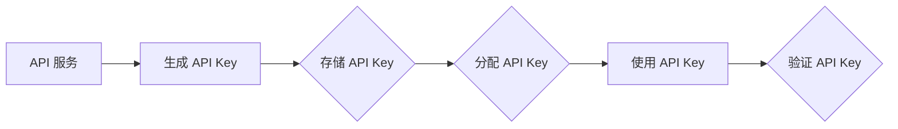

                 

# 《分级 API Key 的详细管理》

> **关键词：** API Key、分级管理、权限控制、安全性、监控、实践案例

> **摘要：** 本文将详细探讨 API Key 的分级管理，从基础概念、管理与维护、分级体系、权限管理、安全措施和监控审计等方面进行深入分析。通过实际案例，我们将展示 API Key 管理的最佳实践，并展望其未来发展趋势。

---

### 《分级 API Key 的详细管理》目录大纲

#### 第一部分：API Key管理概述

#### 第1章：API Key的基础知识

#### 第2章：API Key的分类与安全性

#### 第二部分：API Key的管理与维护

#### 第3章：API Key的生成与分配

#### 第4章：API Key的存储与管理

#### 第5章：API Key的更新与回收

#### 第二部分：API Key分级管理

#### 第6章：API Key分级体系

#### 第7章：API Key的权限管理

#### 第三部分：API Key的安全与监控

#### 第8章：API Key的安全措施

#### 第9章：API Key的监控与审计

#### 第四部分：实践与案例分析

#### 第10章：API Key管理的实践案例

#### 第11章：API Key管理的未来趋势

#### 附录：API Key管理资源汇总

---

### 第一部分：API Key管理概述

#### 第1章：API Key的基础知识

**1.1 API Key的定义与作用**

API Key，即应用程序接口密钥，是用于标识应用程序身份的一种唯一标识符。它在API（应用程序编程接口）服务中起着至关重要的作用。API Key的基本概念如下：

- **唯一性**：每个API Key都是独一无二的，确保了API调用的可追溯性和安全性。
- **认证**：API Key用于认证调用者的身份，确保API服务只能被授权的应用程序访问。
- **限制**：通过API Key，服务提供者可以实施访问限制，如请求频率、请求速率等，以保护服务不被滥用。

**1.1.1 API Key的基本概念**

API Key通常由一串字符组成，这些字符可以是数字、字母或特殊字符。它们通常由服务提供者在创建API密钥时生成。API Key可以通过多种方式传递，如URL参数、HTTP头部或POST请求体。

**1.1.2 API Key的应用场景**

API Key广泛应用于各种场景，包括：

- **第三方系统集成**：开发者可以使用API Key将第三方服务集成到自己的应用程序中。
- **数据分析**：API Key用于获取特定的数据服务，如天气信息、新闻更新等。
- **权限控制**：API Key作为权限控制的一部分，确保只有授权的应用程序可以访问API。

**1.2 API Key的分类**

API Key可以根据不同的标准进行分类，如按权限划分和按用途划分。

**1.2.1 按权限划分**

- **公开API Key**：这种API Key通常向公众开放，用于非商业用途，如天气查询、地图服务等。
- **私有API Key**：私有API Key仅供特定应用程序使用，通常用于商业用途，如在线购物、支付服务等。

**1.2.2 按用途划分**

- **读写API Key**：读写API Key可以执行对资源的读取和写入操作。
- **只读API Key**：只读API Key只能执行读取操作，不能进行修改或删除。

**1.3 API Key的安全性问题**

API Key的安全漏洞和风险主要源于以下几个方面：

- **泄露**：API Key在传输或存储过程中可能被泄露。
- **滥用**：未经授权的应用程序可能会使用API Key滥用服务资源。
- **暴力破解**：攻击者可能会尝试通过暴力破解来获取API Key。

**1.3.1 安全漏洞与风险**

- **Key泄露**：API Key在网络上泄露，可能导致未授权访问。
- **Key滥用**：多个应用程序共享同一API Key，可能导致资源耗尽。
- **Key窃取**：攻击者通过钓鱼攻击或中间人攻击窃取API Key。

**1.3.2 安全策略与措施**

- **加密传输**：使用HTTPS加密传输API Key，防止中间人攻击。
- **定期更新**：定期更换API Key，降低泄露风险。
- **访问控制**：限制API Key的访问权限，确保只有授权的应用程序可以使用。

---

**核心概念与联系**

以下是一个简单的 Mermaid 流程图，展示了 API Key 生成、分配和使用的流程：

---

在本章中，我们介绍了 API Key 的基本概念、分类和安全性问题。在接下来的章节中，我们将进一步探讨 API Key 的管理与维护、分级体系和权限管理，以及安全措施和监控审计。敬请期待。

---

**作者：AI天才研究院/AI Genius Institute & 禅与计算机程序设计艺术 /Zen And The Art of Computer Programming**

