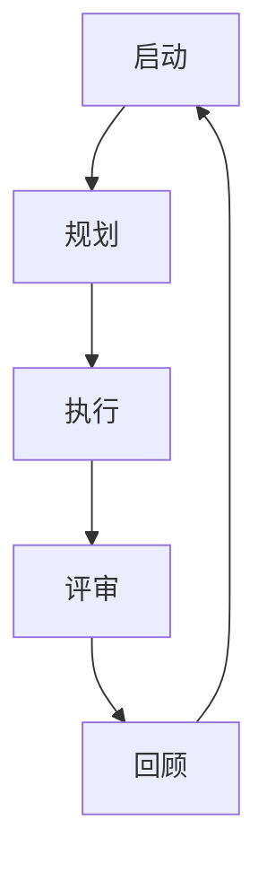
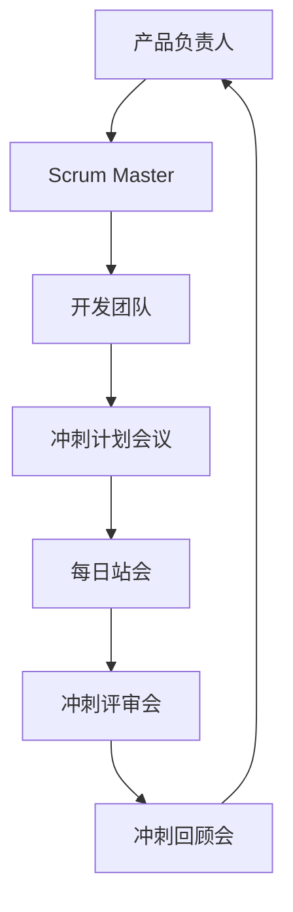
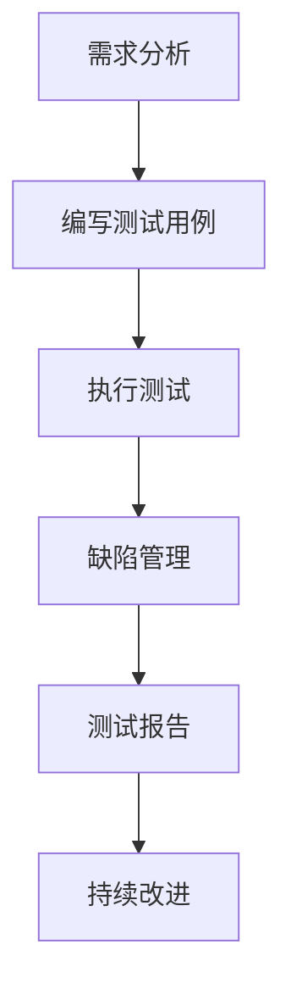
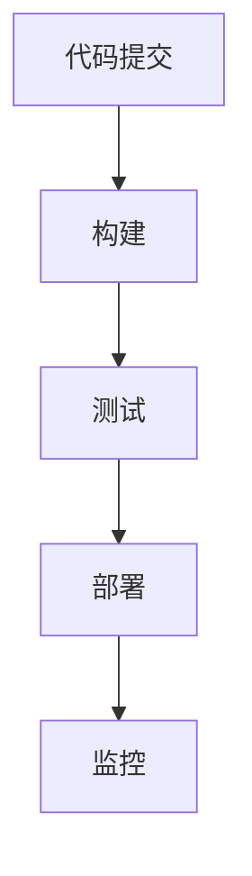

                 

# 《创业公司的敏捷开发实践》

> **关键词**：敏捷开发、创业公司、Scrum、Kanban、团队协作、项目管理

> **摘要**：本文旨在探讨敏捷开发在创业公司中的应用和实践。通过分析敏捷开发的理论基础、核心原则、流程与框架、团队管理、项目管理以及敏捷测试与持续集成，结合案例分析，为创业公司在敏捷开发道路上提供实际操作的指导和策略。

----------------------------------------------------------------

## 第一部分：敏捷开发理论基础

### 第1章：敏捷开发简介

#### 1.1 敏捷开发的起源与理念

敏捷开发（Agile Development）是一种以人为核心、迭代、渐进的开发方法。它起源于软件开发领域，最早由17位软件专家在2001年共同发布了《敏捷宣言》（Agile Manifesto）。敏捷宣言提出了四项价值观和十二项原则，强调了个体和互动、可工作的软件、客户合作以及响应变化的重要性。

敏捷开发的核心理念是快速响应变化、持续交付价值、团队协作、自组织、透明度、可持续开发等。与传统开发模式相比，敏捷开发更加灵活、高效，能够更好地适应市场需求和技术变化。

#### 1.2 敏捷开发与传统开发模式对比

传统开发模式，如瀑布模型（Waterfall Model），通常采用线性、顺序的工作方式。每个阶段必须在上一阶段完成后才开始，如需求分析、设计、开发、测试等。这种方法在早期软件开发中得到了广泛应用，但随着时间的推移，其缺点逐渐显现：

1. **响应变化能力差**：一旦需求发生变化，整个项目可能需要重新设计、开发和测试，导致时间和成本的大幅增加。
2. **客户参与度低**：在项目开发过程中，客户参与度较低，需求变更可能导致客户对最终产品的满意度降低。
3. **沟通不畅**：传统的开发模式通常涉及多个团队和角色，导致沟通成本高、协调困难。

敏捷开发则强调快速迭代、持续交付和客户参与。其优点包括：

1. **响应变化能力更强**：敏捷开发采用迭代、增量的方法，能够快速响应需求变化，降低项目风险。
2. **客户参与度高**：敏捷开发强调与客户的持续互动，确保产品始终符合客户需求。
3. **沟通高效**：敏捷开发通常采用跨职能团队，团队成员之间沟通更直接、更高效。

总的来说，敏捷开发在应对复杂、快速变化的项目时具有明显优势。然而，它并不是适用于所有项目的万能解决方案，创业公司在选择敏捷开发时需要结合自身实际情况进行权衡。

### 第2章：敏捷开发核心原则

#### 2.1 敏捷宣言与四大价值观

敏捷宣言（Agile Manifesto）是敏捷开发的基石，由四项价值观和十二项原则组成。四项价值观如下：

1. **个体和互动高于流程与工具**：敏捷开发强调团队合作和个人能力，认为良好的沟通和协作比使用特定的流程和工具更为重要。
2. **可工作的软件高于详尽的文档**：敏捷开发主张交付可工作的软件而非大量文档，因为软件是最终目标，文档只是辅助。
3. **客户合作高于合同谈判**：敏捷开发强调与客户的紧密合作，确保产品始终符合客户需求。
4. **响应变化高于遵循计划**：敏捷开发认为变化是不可避免的，应适应并利用变化，而不是一味地坚持原计划。

这些价值观体现了敏捷开发的核心思想，即以人为核心、关注实际交付结果、重视客户需求和市场变化。

#### 2.2 敏捷开发的12条原则

敏捷宣言的12条原则进一步细化了敏捷开发的具体实践，包括：

1. **最高优先级是满足客户通过早期和持续交付有价值的软件**：敏捷开发强调快速交付有价值的功能，确保客户尽早获得回报。
2. **欢迎改变需求，即使是在开发的晚期**：敏捷开发接受需求变化，并认为这是正常现象，通过迭代和增量开发来适应变化。
3. **开展工作的时间跨度为几周，最好是几周或一个月**：敏捷开发采用短周期的迭代方式，通常为几周，以便快速反馈和调整。
4. **每间隔一个月（或更短时间），都要召开一次评估会，以评估进展并调整计划**：敏捷开发通过定期评估和调整来确保项目进度和质量。
5. **持续关注技术卓越和良好的设计增强敏捷性**：敏捷开发强调技术卓越和良好的设计，以提高开发效率和软件质量。
6. **简单的设计是下一项要做的最优先任务**：敏捷开发主张简化设计，避免过度设计，专注于实现核心功能。
7. **代码编写、代码审查、测试和重构必须同步进行**：敏捷开发要求在开发过程中同步进行代码审查、测试和重构，以确保代码质量。
8. **每个成员都要对项目的最终成功负责**：敏捷开发强调团队成员的责任感和团队精神，确保项目顺利完成。
9. **定期地反思如何能更高效地工作，并调整行为**：敏捷开发通过反思和调整来持续优化开发流程和团队协作。
10. **保持开发团队的规模和小而精**：敏捷开发建议团队规模控制在10人以下，以便更好地协作和沟通。
11. **现场客户与开发团队经常保持沟通**：敏捷开发强调客户参与，确保项目始终符合客户需求。
12. **保持最佳人员的稳定工作，从项目一开始直至项目结束**：敏捷开发主张保持团队成员的稳定，以减少团队成员变化带来的风险。

这些原则为敏捷开发提供了具体的实践指导，帮助团队在项目开发过程中实现高效协作和持续优化。

### 第3章：敏捷流程与框架

#### 3.1 敏捷开发的生命周期

敏捷开发的生命周期由多个迭代组成，每个迭代包含需求分析、设计、开发、测试和部署等阶段。整个生命周期可以分为以下几个阶段：

1. **阶段1：启动阶段**：确定项目目标、范围和优先级，组建团队，制定项目计划。
2. **阶段2：规划阶段**：制定详细的项目计划，包括迭代规划、任务分配和资源安排。
3. **阶段3：执行阶段**：按照计划进行迭代开发，每个迭代周期通常为几周。
4. **阶段4：评估与回顾阶段**：在每个迭代结束时，进行评估和回顾，总结经验教训，调整项目计划和团队协作方式。
5. **阶段5：部署与维护阶段**：完成所有迭代后，进行项目部署和后续维护。

#### 3.2 敏捷开发的主流框架：Scrum与Kanban

敏捷开发中，Scrum和Kanban是两种主流的框架。

1. **Scrum框架**

   Scrum是一种迭代、增量的敏捷开发框架，由三个主要角色（产品负责人、Scrum Master、开发团队）和五个主要事件（冲刺计划会议、每日站会、冲刺评审会、冲刺回顾会、冲刺）组成。

   - **产品负责人**：代表客户和利益相关者，负责定义产品需求并设定优先级。
   - **Scrum Master**：负责确保Scrum流程的顺利执行，帮助团队解决障碍。
   - **开发团队**：负责实现产品需求，通常由5-10名成员组成。

   Scrum中的迭代称为“冲刺”，每个冲刺周期通常为2-4周。在冲刺计划会议中，团队确定本次冲刺的目标和任务；每日站会用于同步进度和解决问题；冲刺评审会展示冲刺成果，收集反馈；冲刺回顾会总结经验教训，改进流程。

2. **Kanban框架**

   Kanban是一种基于流程可视化和限制工作量的敏捷开发框架。它通过在看板上展示任务流程，帮助团队识别瓶颈和优化流程。

   - **看板**：一种可视化工具，用于展示任务的整个生命周期，包括等待、进行中、测试、完成等状态。
   - **限制工作数量（WIP）**：通过限制每个阶段的工作数量，防止任务堆积，提高工作效率。

   Kanban的核心原则是“流动”，即通过持续改进和优化，确保工作在团队中的高效流动。Kanban适用于需要持续交付和优化流程的项目。

#### 3.3 敏捷开发的实践策略

敏捷开发的实践策略包括以下几个方面：

1. **迭代规划**：在每个迭代开始时，团队制定详细的迭代计划，明确目标、任务和资源安排。

2. **需求管理**：敏捷开发采用优先级排序的需求管理方法，确保最关键的特性优先实现。

3. **风险管理**：通过定期评估和调整，及时识别和解决潜在风险，确保项目顺利进行。

4. **团队建设**：建立高效的跨职能团队，提高团队成员的沟通和协作能力。

5. **持续集成与部署**：通过自动化测试和持续集成工具，确保代码质量和快速交付。

6. **质量保证**：在开发过程中，同步进行代码审查、测试和重构，确保软件质量。

7. **反思与改进**：在每个迭代结束时，进行回顾和总结，识别改进点，持续优化开发流程。

敏捷开发的实践策略旨在提高团队协作效率、缩短开发周期、快速响应变化，从而实现项目的成功交付。

### 第4章：敏捷团队管理

#### 4.1 敏捷团队的组成与角色

敏捷团队通常由以下三个主要角色组成：

1. **产品负责人（Product Owner）**：代表客户和利益相关者，负责定义产品愿景、需求和管理产品待办事项。产品负责人需要具备良好的沟通能力、需求分析能力和优先级排序能力。

2. **Scrum Master（或敏捷教练）**：负责确保敏捷流程的顺利执行，帮助团队解决障碍，提高团队协作效率。Scrum Master需要具备良好的沟通能力、协调能力和敏捷方法论知识。

3. **开发团队（Development Team）**：负责实现产品需求，通常由多学科成员组成，包括程序员、设计师、测试工程师等。开发团队需要具备高度的自组织能力和协作精神。

#### 4.2 敏捷团队的沟通与合作

敏捷团队强调高效的沟通与合作，以下是一些关键策略：

1. **每日站会**：每日站会是敏捷团队的重要沟通机制，用于同步进度、解决问题和协调任务。站会通常持续15分钟，团队成员轮流发言。

2. **信息共享**：敏捷团队通过共享看板、任务管理工具和文档库，确保信息的透明度和可追溯性。

3. **代码评审**：敏捷团队采用代码评审机制，确保代码质量，提高团队协作效率。

4. **迭代回顾**：在迭代结束时，敏捷团队进行回顾会议，总结经验教训，识别改进点，持续优化团队协作。

#### 4.3 敏捷团队的激励机制

敏捷团队的激励机制包括以下几个方面：

1. **目标导向**：敏捷团队设定明确的目标，确保团队成员对项目目标和进度有清晰的认识。

2. **绩效评价**：敏捷团队采用持续的评价机制，通过迭代回顾和绩效评估，识别团队成员的优势和改进点。

3. **奖励与激励**：敏捷团队通过奖励和激励措施，如表彰、奖金和培训，激励团队成员不断提升。

4. **团队建设**：敏捷团队定期组织团队建设活动，提高团队成员的凝聚力和归属感。

敏捷团队管理的关键在于建立高效的沟通机制、激发团队潜能和持续优化团队协作。通过合理的激励机制，确保团队成员保持高水平的积极性和工作效率。

### 第5章：敏捷项目管理

#### 5.1 敏捷项目的计划与跟踪

敏捷项目计划与跟踪是确保项目成功的关键。以下是一些关键策略：

1. **迭代规划**：在迭代开始时，团队制定详细的迭代计划，包括目标、任务、资源和时间安排。迭代规划通常在冲刺计划会议中完成。

2. **任务管理**：敏捷团队使用任务管理工具（如JIRA、Trello）跟踪任务状态，确保任务按时完成。

3. **进度跟踪**：敏捷团队通过每日站会、迭代评审和回顾会，实时监控项目进度，及时发现并解决问题。

4. **风险监控**：敏捷团队定期评估项目风险，制定相应的应对措施，确保项目顺利进行。

5. **信息共享**：敏捷团队通过共享看板、文档库和任务管理工具，确保项目信息的透明度和可追溯性。

#### 5.2 敏捷项目的风险管理

敏捷项目风险管理旨在识别、评估和应对项目风险，以确保项目成功。以下是一些关键策略：

1. **风险识别**：通过项目规划和团队沟通，识别可能影响项目的风险。

2. **风险评估**：评估每个风险的概率和影响，确定优先级。

3. **风险应对**：制定相应的风险应对措施，如风险规避、风险转移、风险接受等。

4. **风险监控**：定期评估风险状况，及时调整风险应对措施。

5. **应急计划**：为关键风险制定应急计划，确保项目在遇到风险时能够迅速应对。

#### 5.3 敏捷项目的质量管理

敏捷项目质量管理旨在确保项目交付的软件产品满足质量要求。以下是一些关键策略：

1. **持续集成**：通过持续集成工具（如Jenkins、GitLab CI）自动化构建和测试，确保代码质量。

2. **自动化测试**：编写自动化测试脚本，确保在每次代码提交时进行测试，及时发现和修复问题。

3. **代码审查**：进行代码审查，确保代码符合最佳实践和设计规范。

4. **重构**：定期进行代码重构，优化代码结构，提高可读性和可维护性。

5. **质量保证**：建立质量保证团队，负责项目质量的管理和监督。

敏捷项目管理强调快速响应变化、持续交付价值和团队协作，通过合理的计划与跟踪、风险管理、质量保证等策略，确保项目成功交付。

### 第6章：敏捷测试与持续集成

#### 6.1 敏捷测试策略

敏捷测试策略旨在确保敏捷开发过程中快速交付高质量的产品。以下是一些关键策略：

1. **持续测试**：敏捷开发强调在开发过程中持续进行测试，确保每次代码提交都能通过测试。

2. **自动化测试**：编写自动化测试脚本，实现自动化测试，提高测试效率。

3. **测试驱动开发（TDD）**：在编写代码前先编写测试用例，确保代码满足预期功能。

4. **行为驱动开发（BDD）**：通过编写业务场景描述，确保测试用例覆盖业务需求。

5. **探索性测试**：结合开发人员的经验和技能，进行探索性测试，发现潜在的缺陷和问题。

#### 6.2 持续集成与持续部署

持续集成（CI）和持续部署（CD）是敏捷开发中重要的实践。以下是一些关键策略：

1. **持续集成**：通过自动化构建和测试，确保每次代码提交都能通过集成测试，及时发现和修复问题。

2. **持续部署**：通过自动化部署，确保代码更新和发布过程高效、可靠。

3. **容器化**：使用容器（如Docker）封装应用程序及其依赖项，确保部署环境的标准化。

4. **基础设施即代码（IaC）**：使用脚本自动化基础设施配置，确保部署环境的一致性和可重复性。

5. **监控与反馈**：通过监控工具（如Prometheus、Grafana）实时监控系统性能和健康状态，及时发现问题并进行调整。

持续集成与持续部署有助于提高开发效率、确保代码质量和缩短发布周期，从而实现快速交付高质量的产品。

### 第7章：敏捷实践中的常见问题与解决方法

#### 7.1 敏捷转型中的挑战

在敏捷转型过程中，企业可能会面临以下挑战：

1. **组织结构和文化障碍**：传统的组织结构和文化可能不利于敏捷实践的实施，如角色分工过细、沟通不畅等。

2. **人员素质和能力不足**：敏捷开发需要团队成员具备一定的敏捷方法论知识和实践能力，但企业现有人员可能缺乏这些技能。

3. **流程和工具不完善**：敏捷转型需要适应新的开发流程和工具，但现有流程和工具可能无法完全满足敏捷开发的需求。

#### 7.2 解决敏捷开发中的常见问题

为解决敏捷开发中的常见问题，企业可以采取以下策略：

1. **加强培训和宣传**：通过内部培训、宣传和交流活动，提高团队成员对敏捷开发的认识和理解。

2. **调整组织结构和流程**：优化组织结构，减少角色分工，建立跨职能团队，提高沟通和协作效率。

3. **引入敏捷工具**：选择适合敏捷开发的工具，如JIRA、Trello、Jenkins等，提高任务管理和流程可视化的效果。

4. **持续改进**：鼓励团队成员积极参与迭代回顾，总结经验教训，持续优化开发流程和团队协作。

#### 7.3 敏捷实践中的团队成长

在敏捷实践中，团队成长至关重要。以下是一些关键策略：

1. **培养敏捷思维**：通过学习和实践，培养团队成员的敏捷思维，提高对敏捷方法论的理解和应用能力。

2. **提高沟通能力**：加强团队成员之间的沟通和协作，提高团队的整体效能。

3. **提供反馈与支持**：为团队成员提供及时、具体的反馈和支持，帮助他们克服困难，提高自信心。

4. **持续学习和进步**：鼓励团队成员不断学习新知识、新技能，提高自身能力，为团队成长贡献力量。

敏捷实践中的团队成长需要持续的努力和关注，通过培养敏捷思维、提高沟通能力、提供反馈与支持等措施，实现团队的不断进步和发展。

### 第8章：创业公司敏捷开发的案例分析

#### 8.1 某创业公司的敏捷开发实践

为了更好地理解敏捷开发在创业公司的实际应用，我们以一家初创公司为例，分析其敏捷开发实践。

这家初创公司是一家专注于移动互联网应用开发的创业公司，团队成员包括前端开发者、后端开发者、产品经理、测试工程师等。在项目启动阶段，公司面临着技术选型、团队协作、需求变更等挑战。为了应对这些挑战，公司决定采用敏捷开发模式。

1. **敏捷开发流程设计**：公司采用Scrum框架，每个迭代周期为2周。在冲刺计划会议中，产品经理与团队一起制定本次冲刺的目标和任务，并进行优先级排序。

2. **团队协作**：公司建立了一个跨职能团队，成员之间保持紧密沟通，确保需求理解和任务分配的准确性。公司引入了JIRA作为任务管理工具，提高任务跟踪和团队协作效率。

3. **持续集成与测试**：公司使用Jenkins进行持续集成，确保每次代码提交都能通过集成测试。同时，公司引入了自动化测试工具，如Selenium，提高测试效率和质量。

4. **迭代回顾与改进**：在每个迭代结束时，公司进行回顾会议，总结经验教训，识别改进点，并在下一个迭代中实施。

#### 8.2 案例分析：敏捷开发在创业公司的成功因素

通过分析这家创业公司的敏捷开发实践，我们可以总结出以下成功因素：

1. **敏捷方法论的应用**：公司采用Scrum框架，确保团队在迭代过程中能够高效协作和持续交付价值。

2. **跨职能团队协作**：通过建立跨职能团队，成员之间保持紧密沟通，确保需求理解和任务分配的准确性。

3. **持续集成与测试**：通过引入持续集成和自动化测试，提高代码质量和开发效率。

4. **迭代回顾与改进**：定期进行迭代回顾，识别改进点，持续优化开发流程和团队协作。

5. **领导力的支持**：公司领导层对敏捷开发给予充分支持，鼓励团队成员积极参与培训和实践活动，提高敏捷能力。

通过这些成功因素，这家创业公司在敏捷开发道路上取得了显著成果，项目进度和产品质量得到了显著提升，为公司发展奠定了坚实基础。

### 第9章：敏捷开发在创业公司的实际操作

#### 9.1 创业公司敏捷开发的流程设计

创业公司采用敏捷开发模式，首先需要设计合适的流程。以下是一些关键步骤：

1. **确定目标**：明确项目的目标、范围和优先级。这有助于团队在敏捷开发过程中保持清晰的方向。

2. **组建团队**：组建一个跨职能团队，包括前端开发者、后端开发者、产品经理、测试工程师等，确保团队具备完成项目所需的各种技能。

3. **制定迭代计划**：根据项目的目标，制定每个迭代的目标和任务。通常，迭代周期为2-4周，以便团队在短时间内完成具体任务。

4. **制定敏捷框架**：选择合适的敏捷框架，如Scrum或Kanban，确保团队在开发过程中遵循最佳实践。

5. **任务分配与跟踪**：使用任务管理工具（如JIRA、Trello），将任务分配给团队成员，并实时跟踪任务进度，确保任务按时完成。

6. **沟通与协作**：建立高效的沟通机制，如每日站会、迭代评审会和回顾会，确保团队成员之间的信息共享和协作。

7. **持续集成与测试**：引入持续集成和自动化测试工具，确保代码质量和开发效率。

通过这些步骤，创业公司可以设计出适合自身需求的敏捷开发流程，确保项目在敏捷开发模式下高效、顺利地推进。

#### 9.2 创业公司敏捷开发的技术栈选择

创业公司在选择敏捷开发的技术栈时，需要考虑以下几个方面：

1. **开发语言**：根据项目需求和团队技能，选择合适的编程语言，如Java、Python、JavaScript等。

2. **框架与库**：选择适合项目需求的框架和库，如Spring Boot、Django、React等，提高开发效率。

3. **数据库**：根据数据存储和查询需求，选择合适的数据库，如MySQL、PostgreSQL、MongoDB等。

4. **前端技术**：选择合适的前端技术，如HTML、CSS、JavaScript、Vue.js、React等，确保良好的用户体验。

5. **测试工具**：引入自动化测试工具，如JUnit、Selenium、Cypress等，提高测试效率和代码质量。

6. **持续集成与部署**：选择合适的持续集成和部署工具，如Jenkins、GitLab CI、Docker等，确保代码质量和快速交付。

7. **DevOps工具**：引入DevOps工具，如Kubernetes、Ansible、Prometheus等，提高开发、测试和运维的协同效率。

创业公司在选择技术栈时，应综合考虑项目需求、团队技能和现有资源，确保技术栈能够满足项目需求并提高开发效率。

#### 9.3 敏捷开发在创业公司的团队协作

敏捷开发强调团队协作，以下是一些关键策略：

1. **跨职能团队**：建立跨职能团队，包括开发、测试、产品管理等角色，确保项目需求在团队内部得到充分理解和执行。

2. **信息共享**：使用共享看板、任务管理工具和文档库，确保团队成员之间的信息透明度和可追溯性。

3. **每日站会**：每日站会是团队沟通的重要环节，用于同步进度、解决问题和协调任务。站会通常持续15分钟，团队成员轮流发言。

4. **迭代回顾**：在每个迭代结束时，进行回顾会议，总结经验教训，识别改进点，并在下一个迭代中实施。

5. **代码评审**：进行代码评审，确保代码质量，提高团队协作效率。

6. **持续反馈**：鼓励团队成员在开发过程中相互反馈，及时解决问题，提高整体效能。

7. **培训与学习**：定期组织培训和学习活动，提高团队成员的技能和敏捷能力。

通过这些策略，创业公司可以建立高效的团队协作机制，确保项目在敏捷开发模式下高效推进。

### 第10章：创业公司敏捷开发中的项目管理

#### 10.1 创业公司敏捷项目的规划与执行

在敏捷开发模式下，创业公司需要制定详细的项目规划和执行策略，以确保项目顺利推进。以下是一些关键步骤：

1. **项目启动**：明确项目目标、范围和关键里程碑，组建跨职能团队。

2. **迭代规划**：制定每个迭代的目标和任务，进行优先级排序。迭代周期通常为2-4周。

3. **资源分配**：根据任务需求和团队规模，合理分配资源，确保任务按时完成。

4. **任务分解**：将大任务分解为小任务，确保每个任务都有明确的负责人和交付标准。

5. **风险管理**：识别项目风险，制定相应的应对措施，确保项目顺利进行。

6. **持续跟踪与调整**：通过每日站会、迭代评审和回顾会，实时监控项目进度，及时调整计划。

7. **质量保证**：引入自动化测试和代码审查，确保项目交付的软件质量。

8. **项目评审**：在项目结束时，进行项目评审，总结经验教训，为后续项目提供参考。

通过这些步骤，创业公司可以确保敏捷项目的顺利规划和执行，提高项目成功率。

#### 10.2 创业公司敏捷项目的进度管理

进度管理是敏捷项目成功的关键。以下是一些关键策略：

1. **迭代规划**：在迭代开始时，明确每个迭代的目标和任务，制定详细的进度计划。

2. **任务跟踪**：使用任务管理工具（如JIRA、Trello）实时跟踪任务进度，确保任务按时完成。

3. **每日站会**：每日站会用于同步进度、解决问题和协调任务，确保团队成员之间的信息共享。

4. **风险监控**：定期评估项目风险，及时调整计划，确保项目进度不受影响。

5. **迭代评审**：在迭代结束时，进行迭代评审，总结经验教训，为下一个迭代提供改进点。

6. **进度报告**：定期向利益相关者报告项目进度，确保各方对项目进展有清晰了解。

通过这些策略，创业公司可以确保敏捷项目进度在控制范围内，提高项目成功率。

#### 10.3 创业公司敏捷项目的成本控制

成本控制是创业公司敏捷项目成功的关键。以下是一些关键策略：

1. **资源优化**：合理分配资源，避免资源浪费，确保项目资源得到充分利用。

2. **任务分解**：将大任务分解为小任务，确保每个任务的成本和效益明确。

3. **成本估算**：根据任务分解和团队规模，进行成本估算，确保项目预算合理。

4. **成本监控**：使用成本管理工具（如Project、Microsoft Excel）实时监控项目成本，确保成本在预算范围内。

5. **成本调整**：在项目执行过程中，根据实际情况及时调整成本，确保项目顺利完成。

6. **效率提升**：通过优化开发流程、引入自动化测试等手段，提高开发效率，降低项目成本。

通过这些策略，创业公司可以确保敏捷项目在成本控制范围内，提高项目效益。

### 第11章：创业公司的敏捷文化塑造

#### 11.1 塑造敏捷文化的关键要素

敏捷文化是敏捷开发成功的关键。以下是一些塑造敏捷文化的关键要素：

1. **价值观**：倡导敏捷宣言中的价值观，如个体和互动、可工作的软件、客户合作、响应变化等。

2. **沟通与协作**：鼓励团队成员之间进行开放式沟通，建立信任和合作关系。

3. **透明度**：确保项目信息透明，让团队成员了解项目进展、问题和改进点。

4. **持续学习与进步**：鼓励团队成员不断学习和进步，提高技能和敏捷能力。

5. **领导力**：领导者要具备敏捷领导力，支持团队自主决策和自我管理。

6. **灵活性**：适应市场需求和技术变化，灵活调整项目计划和策略。

通过这些关键要素，创业公司可以逐步塑造敏捷文化，提高团队协作效率和项目成功率。

#### 11.2 培养敏捷思维

培养敏捷思维是塑造敏捷文化的关键。以下是一些培养敏捷思维的方法：

1. **学习敏捷方法论**：了解敏捷宣言、敏捷原则、Scrum和Kanban等敏捷方法论，掌握敏捷开发的核心思想和实践。

2. **实践敏捷开发**：参与敏捷开发项目，亲身体验敏捷开发的流程、工具和方法，提高敏捷能力。

3. **反思与改进**：在每次迭代结束后，进行反思和总结，识别改进点，不断优化开发流程和团队协作。

4. **跨职能合作**：积极参与跨职能团队工作，提高对其他角色和领域的理解和协作能力。

5. **持续学习**：关注敏捷开发领域的最新动态和最佳实践，不断学习和掌握新知识。

通过这些方法，创业公司可以培养团队成员的敏捷思维，提高敏捷能力，推动敏捷文化的建立。

#### 11.3 建立敏捷文化的方法与策略

建立敏捷文化需要系统的方法和策略。以下是一些关键方法与策略：

1. **领导力培训**：领导者要具备敏捷领导力，支持团队自主决策和自我管理，通过领导力培训提升领导者的敏捷能力。

2. **团队建设活动**：定期组织团队建设活动，增强团队成员之间的信任和合作关系，提高团队凝聚力。

3. **知识分享与交流**：鼓励团队成员分享经验和知识，通过内部培训、技术讲座和团队交流活动，提高整体敏捷能力。

4. **敏捷方法论推广**：在组织内部推广敏捷方法论，让团队成员了解敏捷开发的核心理念和实践，提高对敏捷文化的认同感。

5. **敏捷工具引入**：引入适合敏捷开发的工具，如JIRA、Trello、GitLab等，提高团队协作效率。

6. **持续改进**：鼓励团队成员在每次迭代结束后进行反思和总结，识别改进点，持续优化开发流程和团队协作。

通过这些方法与策略，创业公司可以逐步建立敏捷文化，提高团队协作效率和项目成功率。

### 第12章：创业公司的敏捷开发之路

#### 12.1 敏捷开发在创业公司中的持续优化

敏捷开发在创业公司中需要持续优化，以适应不断变化的市场和技术。以下是一些持续优化的策略：

1. **流程改进**：定期评估和改进开发流程，消除瓶颈和冗余环节，提高开发效率。

2. **团队协作**：加强团队协作，建立高效的沟通机制，提高团队整体效能。

3. **技能提升**：鼓励团队成员不断学习和提升技能，提高敏捷能力。

4. **质量保证**：引入自动化测试和质量保证工具，确保软件质量。

5. **反馈与改进**：鼓励团队成员在每次迭代结束后进行反馈和总结，识别改进点，持续优化开发流程和团队协作。

通过这些策略，创业公司可以持续优化敏捷开发，提高项目成功率。

#### 12.2 敏捷开发与创业公司的战略发展

敏捷开发与创业公司的战略发展密切相关。以下是一些关键策略：

1. **市场导向**：以市场需求为导向，快速响应市场变化，确保产品始终符合客户需求。

2. **技术创新**：关注技术创新，引入新技术和最佳实践，提高产品竞争力。

3. **团队协作**：建立高效的跨职能团队，提高团队协作效率，推动项目顺利进行。

4. **风险管理**：建立有效的风险管理机制，识别和应对项目风险，确保项目顺利进行。

5. **敏捷文化**：建立敏捷文化，培养团队成员的敏捷思维，提高整体敏捷能力。

通过这些策略，创业公司可以充分利用敏捷开发的优势，实现战略发展目标。

#### 12.3 敏捷开发在创业公司中的未来展望

随着敏捷开发的不断普及和发展，创业公司在未来有望在以下几个方面取得更大突破：

1. **敏捷文化**：敏捷文化将成为创业公司的核心竞争力，提高团队协作效率和项目成功率。

2. **自动化和智能化**：引入自动化测试、持续集成和智能化工具，提高开发效率和质量。

3. **云原生应用**：利用云原生技术，实现快速部署和扩展，提高产品竞争力。

4. **创新驱动**：以敏捷开发为基础，推动技术创新和业务模式创新，实现持续发展。

5. **全球化布局**：通过敏捷开发，实现全球化布局，开拓国际市场，提高企业竞争力。

在未来，敏捷开发将继续在创业公司中发挥重要作用，助力企业实现战略发展目标。

## 结论

敏捷开发作为现代软件开发的重要方法，已经在创业公司中得到了广泛应用。本文从敏捷开发的起源与理念、核心原则、流程与框架、团队管理、项目管理、敏捷测试与持续集成等方面进行了详细探讨，并结合创业公司的实际案例，提供了具体的操作指导和策略。创业公司在敏捷开发道路上，需要持续优化、培养敏捷文化、关注技术创新，以实现持续发展和成功。

## 作者信息

**作者：** AI天才研究院/AI Genius Institute & 禅与计算机程序设计艺术 /Zen And The Art of Computer Programming

感谢您的阅读，希望本文对您在敏捷开发领域的实践和探索有所帮助。如果您有任何问题或建议，欢迎在评论区留言，我们将竭诚为您解答。

----------------------------------------------------------------

### 附录：敏捷开发核心概念与联系

在敏捷开发中，核心概念与联系至关重要，以下为部分核心概念及相应的Mermaid流程图和解释：

#### 1. 敏捷开发的迭代周期



**解释**：敏捷开发采用迭代的方式进行，每个迭代包含启动、规划、执行、评审和回顾五个阶段，形成闭环。

#### 2. Scrum框架的角色和活动



**解释**：Scrum框架由产品负责人、Scrum Master和开发团队三个角色组成，通过冲刺计划会议、每日站会、冲刺评审会和冲刺回顾会等活动，确保项目顺利进行。

#### 3. 敏捷测试策略



**解释**：敏捷测试策略包括需求分析、编写测试用例、执行测试、缺陷管理和测试报告等环节，通过持续改进，提高软件质量。

#### 4. 持续集成与持续部署



**解释**：持续集成与持续部署通过代码提交、构建、测试、部署和监控等环节，确保代码质量和快速交付。

### 附录：核心算法原理讲解

以下以敏捷测试策略中的自动化测试为例，详细解释核心算法原理，并使用伪代码进行阐述：

#### 自动化测试策略

**目标**：确保代码质量，提高测试效率。

**算法原理**：

1. **单元测试**：针对代码模块进行独立测试，确保每个模块功能正确。
2. **集成测试**：将多个代码模块集成后进行测试，确保模块之间的交互正常。
3. **回归测试**：在代码更新后进行测试，确保原有功能未受影响。
4. **性能测试**：测试系统性能，如响应时间、并发处理能力等。

**伪代码**：

```python
# 单元测试
def unit_test(module):
    # 执行模块功能测试
    assert module.function() == expected_result

# 集成测试
def integration_test():
    # 集成多个模块，执行测试
    module1.function()
    module2.function()
    # 验证模块间的交互
    assert module1.result == module2.result

# 回归测试
def regression_test():
    # 重新执行之前的测试用例
    unit_test(module)
    integration_test()

# 性能测试
def performance_test():
    # 执行性能测试，记录指标
    start_time = current_time()
    module.function()
    end_time = current_time()
    response_time = end_time - start_time
    assert response_time <= expected_response_time
```

通过上述伪代码，可以实现对代码的全面测试，确保软件质量。

### 附录：项目实战

以下以一个简单的Web应用开发为例，展示敏捷开发在实际项目中的应用。

**项目需求**：开发一个简单的待办事项应用，用户可以添加、删除和查看待办事项。

**开发环境**：Python、Flask、SQLite

**实战步骤**：

1. **需求分析**：与客户沟通，明确项目需求和优先级。
2. **迭代规划**：将项目分解为多个迭代，每个迭代完成部分功能。
3. **设计数据库**：设计SQLite数据库，存储用户和待办事项信息。
4. **编写代码**：使用Flask框架编写Web应用代码，实现添加、删除和查看待办事项的功能。
5. **自动化测试**：编写测试用例，使用pytest进行自动化测试。
6. **持续集成**：使用GitLab CI进行持续集成，确保代码质量和快速交付。
7. **部署与维护**：将Web应用部署到服务器，进行监控和维护。

通过上述实战步骤，可以实现敏捷开发在项目中的应用，提高开发效率和质量。

### 附录：代码解读与分析

以下为待办事项应用的源代码解读与分析。

**代码解读**：

```python
# app.py

from flask import Flask, request, jsonify
import sqlite3

app = Flask(__name__)

# 连接SQLite数据库
conn = sqlite3.connect('todo.db')
cursor = conn.cursor()

# 创建用户表
cursor.execute('''CREATE TABLE IF NOT EXISTS user (id INTEGER PRIMARY KEY, username TEXT)''')
# 创建待办事项表
cursor.execute('''CREATE TABLE IF NOT EXISTS todo (id INTEGER PRIMARY KEY, user_id INTEGER, title TEXT, completed BOOLEAN)''')

def init_db():
    cursor.execute('''INSERT INTO user (username) VALUES ('admin')''')
    conn.commit()

@app.route('/users', methods=['POST'])
def create_user():
    username = request.json['username']
    cursor.execute('''INSERT INTO user (username) VALUES (?)''', (username,))
    conn.commit()
    return jsonify({'id': cursor.lastrowid, 'username': username})

@app.route('/todos', methods=['POST'])
def create_todo():
    user_id = request.json['user_id']
    title = request.json['title']
    completed = request.json['completed']
    cursor.execute('''INSERT INTO todo (user_id, title, completed) VALUES (?, ?, ?)''', (user_id, title, completed))
    conn.commit()
    return jsonify({'id': cursor.lastrowid, 'user_id': user_id, 'title': title, 'completed': completed})

@app.route('/todos/<int:todo_id>', methods=['DELETE'])
def delete_todo(todo_id):
    cursor.execute('''DELETE FROM todo WHERE id = ?''', (todo_id,))
    conn.commit()
    return jsonify({'status': 'success'})

@app.route('/todos', methods=['GET'])
def get_todos():
    todos = cursor.execute('''SELECT * FROM todo''').fetchall()
    return jsonify({'todos': todos})

if __name__ == '__main__':
    init_db()
    app.run(debug=True)
```

**代码分析**：

- 使用Flask框架实现Web应用，提供用户管理、待办事项管理和查询功能。
- 连接SQLite数据库，创建用户表和待办事项表。
- `create_user` 函数用于创建新用户，接收JSON格式的用户名，插入数据库并返回用户ID。
- `create_todo` 函数用于创建新的待办事项，接收JSON格式的用户ID、标题和完成状态，插入数据库并返回待办事项ID。
- `delete_todo` 函数用于删除指定的待办事项，根据待办事项ID删除数据库记录。
- `get_todos` 函数用于获取所有待办事项，返回JSON格式的待办事项列表。

通过以上代码解读与分析，可以了解待办事项应用的基本实现和功能，为后续优化和扩展提供参考。

### 附录：数学模型和公式

在敏捷开发中，质量管理是一个重要的方面。以下是一个简单的数学模型，用于评估软件缺陷率：

**公式**：

\[ \text{Defect Rate} = \frac{\text{Total Number of Defects}}{\text{Total Number of Test Cases}} \]

其中：

- **Total Number of Defects**：总的缺陷数
- **Total Number of Test Cases**：总的测试用例数

**举例说明**：

假设一个项目中，共有100个测试用例，发现10个缺陷，则缺陷率为：

\[ \text{Defect Rate} = \frac{10}{100} = 0.1 \]

这意味着在每个测试用例中，平均有0.1个缺陷。通过持续改进测试策略和开发流程，可以降低缺陷率，提高软件质量。

### 附录：创业公司敏捷开发之路

创业公司在敏捷开发道路上需要不断探索和实践，以下是一些关键步骤：

1. **制定敏捷战略**：明确敏捷开发的目标、愿景和路径，确保团队在敏捷开发中保持一致的方向。
2. **培养敏捷文化**：建立敏捷文化，鼓励团队成员积极参与敏捷实践，提高敏捷能力。
3. **引入敏捷方法论**：选择适合创业公司的敏捷方法论，如Scrum、Kanban等，确保团队遵循最佳实践。
4. **优化开发流程**：根据项目需求，优化开发流程，确保流程简洁、高效。
5. **持续学习和改进**：鼓励团队成员不断学习新知识、新技能，持续优化开发流程和团队协作。
6. **建立敏捷团队**：建立跨职能、自组织的敏捷团队，提高团队协作效率。
7. **监测和评估**：建立敏捷项目监测和评估机制，实时监控项目进度和质量，及时调整计划。

通过这些步骤，创业公司可以逐步实现敏捷开发，提高项目成功率，实现持续发展和成功。

