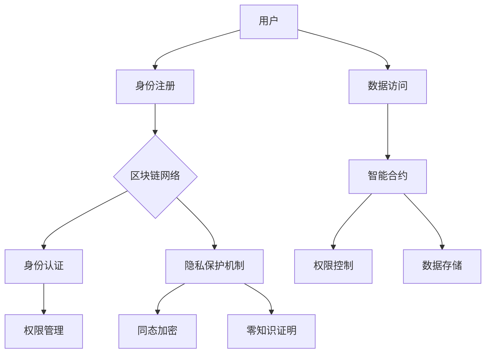
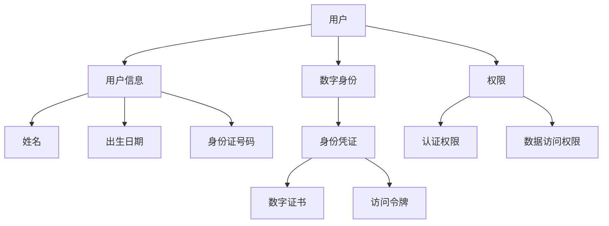

                 

### 《区块链数字身份管理：隐私保护的创业方向》

区块链数字身份管理是近年来迅速崛起的新兴领域，它将区块链技术应用于数字身份的创建、管理和验证，从而实现更高的安全性和隐私保护。随着数字化时代的到来，个人和企业对数据安全和隐私保护的需求日益增长，区块链数字身份管理因此成为了一个极具潜力的创业方向。本文将深入探讨区块链数字身份管理的基本概念、技术原理、应用场景以及创业实践，旨在为读者提供一个全面而清晰的视角。

#### 关键词：
- 区块链
- 数字身份管理
- 隐私保护
- 同态加密
- 零知识证明
- 匿名通信协议
- 创业方向

#### 摘要：
本文旨在探讨区块链数字身份管理的概念、技术原理、应用场景以及隐私保护的重要性。我们将首先回顾区块链的基本原理及其在数字身份管理中的应用。接着，详细分析几种隐私保护机制，包括同态加密、零知识证明和匿名通信协议。随后，通过实际案例展示区块链数字身份管理的应用，并探讨创业方向和商业模型。最后，我们将分析当前创业环境、策略与实践，并展望未来发展趋势与挑战。

### 目录大纲

## 第一部分：引言

### 1.1 书籍背景与目的

区块链数字身份管理的背景介绍，隐私保护的重要性，以及为何选择将其作为创业方向。

### 1.2 本书结构安排

对本书各章节的内容进行概述，帮助读者理解文章的整体框架和主要内容。

## 第二部分：区块链与数字身份管理基础

### 2.1 区块链技术概述

介绍区块链的基本原理、优缺点以及应用场景。

### 2.2 数字身份管理概述

讨论数字身份的概念、管理挑战及解决方案。

### 2.3 区块链与数字身份管理的关系

分析区块链在数字身份管理中的作用及其与数字身份管理的联系与差异。

## 第三部分：隐私保护机制与算法

### 3.1 隐私保护机制概述

讨论隐私保护的目标、法律法规和技术手段。

### 3.2 同态加密算法

详细解释同态加密的概念、原理、应用场景及其优缺点。

### 3.3 零知识证明

介绍零知识证明的概念、原理、应用场景及其优缺点。

### 3.4 匿名通信协议

探讨匿名通信协议的概念、原理、应用场景及其优缺点。

## 第四部分：区块链数字身份管理的应用

### 4.1 区块链数字身份管理的应用场景

分析区块链数字身份管理的应用领域，包括个人隐私保护、企业信息安全等。

### 4.2 区块链数字身份管理案例解析

通过实际案例展示区块链数字身份管理的应用效果。

### 4.3 创业方向与商业模型

探讨面向不同领域的创业方向及区块链数字身份管理的商业模型。

## 第五部分：隐私保护的创业实践

### 5.1 创业环境分析

分析当前区块链数字身份管理行业的发展趋势、竞争格局以及政策支持。

### 5.2 创业策略与规划

讨论创业团队建设、产品设计与开发、融资与市场推广等方面。

### 5.3 创业案例分享

分享成功和失败案例分析，提供创业的教训与启示。

## 第六部分：技术细节与实现

### 6.1 区块链数字身份管理架构设计

介绍区块链数字身份管理的架构设计原则、技术选型与框架。

### 6.2 隐私保护算法实现

详细阐述同态加密、零知识证明和匿名通信协议的实现方法。

### 6.3 数字身份管理数据模型设计

讨论数字身份管理数据模型的构建原则、结构与关系以及优化策略。

## 第七部分：未来展望与挑战

### 7.1 区块链数字身份管理的发展趋势

分析区块链数字身份管理的技术创新、行业应用拓展以及隐私保护技术的进步。

### 7.2 潜在挑战与解决方案

探讨技术难题、法规与政策限制以及社会认知与接受度等挑战。

### 7.3 创业方向与未来机遇

探讨创新创业模式、新型商业模式探索以及创业生态系统建设。

## 附录

### 附录 A：常用区块链数字身份管理工具与资源

列出常用区块链数字身份管理工具、平台和资源。

### 附录 B：参考文献与进一步阅读

提供相关书籍、论文、行业报告和法规等参考资料。

### 附录 C：常见问题解答

解答读者可能遇到的技术、法律和创业实践问题。

### 第一部分：引言

#### 1.1 书籍背景与目的

**区块链数字身份管理的背景**

随着互联网的普及和数字经济的蓬勃发展，人们逐渐意识到数字身份管理的重要性。传统的数字身份管理方式往往依赖于中心化的服务器和数据库，这种方式在数据处理效率和安全性方面存在诸多局限。而区块链技术的出现为数字身份管理提供了一种全新的解决方案。

区块链是一种分布式账本技术，其去中心化、不可篡改和透明性的特点使其在数字身份管理中具有巨大的潜力。区块链技术可以确保用户身份信息的安全性和隐私性，防止数据泄露和篡改。此外，区块链技术还能够实现跨平台和跨机构的身份认证，提高身份验证的效率和准确性。

**隐私保护的重要性**

在数字化时代，个人隐私保护成为了一个极其重要的问题。随着大数据和人工智能技术的广泛应用，个人数据被大量收集、分析和共享，这无疑增加了隐私泄露的风险。用户对于隐私保护的担忧日益加剧，隐私保护已经成为数字身份管理中亟待解决的关键问题。

区块链技术以其独特的特性，为隐私保护提供了一种新的思路。通过区块链，用户可以对自己的身份信息进行加密和匿名化处理，确保数据在传输和存储过程中的安全性和隐私性。此外，区块链的去中心化特性也使得数据存储和管理更加透明和可追溯，有助于提高隐私保护的合规性和可信度。

**创业方向的展望**

基于区块链技术的数字身份管理具有广阔的市场前景和巨大的发展潜力。随着数字化转型和隐私保护需求的增加，区块链数字身份管理将成为一个重要的创业方向。

创业者在选择区块链数字身份管理作为创业方向时，可以从以下几个方面考虑：

1. **技术创新**：不断探索和应用新的区块链技术，如智能合约、分布式存储等，以提高数字身份管理的安全性和效率。

2. **隐私保护**：深入研究隐私保护机制，如同态加密、零知识证明等，为用户提供更高级别的隐私保护服务。

3. **应用场景**：针对不同领域的需求，开发特定的数字身份管理解决方案，如个人隐私保护、企业信息安全、政府服务与监管等。

4. **商业合作**：与相关机构和企业建立合作关系，共同推进区块链数字身份管理的发展和应用。

**本书的目的**

本书旨在为广大读者提供一个全面而深入的区块链数字身份管理指南，帮助读者了解这一领域的核心概念、技术原理、应用场景以及创业实践。本书将分为七个部分，分别从引言、基础理论、隐私保护机制、应用场景、创业实践、技术细节和未来展望等方面进行阐述。

通过本书的阅读，读者可以：

- **理解区块链数字身份管理的基本概念和原理**  
- **掌握隐私保护机制和算法的实现方法**  
- **了解区块链数字身份管理的应用场景和商业模型**  
- **学习创业实践中的策略和规划方法**  
- **展望区块链数字身份管理的未来发展趋势和挑战**

本书适合从事区块链技术、信息安全、数字身份管理等领域的技术人员、创业者以及研究人员阅读，同时也适合对区块链技术感兴趣的一般读者。

#### 1.2 本书结构安排

本书分为七个部分，每个部分都有其独特的目的和内容，旨在为读者提供一个全面而深入的区块链数字身份管理指南。

**第一部分：引言**

本部分主要介绍区块链数字身份管理的背景、隐私保护的重要性以及本书的目的。通过这一部分的阅读，读者可以初步了解区块链数字身份管理的概念和意义，为后续内容的深入学习打下基础。

**第二部分：区块链与数字身份管理基础**

本部分将详细介绍区块链技术的基本原理、优缺点以及应用场景。同时，还将讨论数字身份管理的概念、挑战和解决方案。这一部分的内容将帮助读者建立对区块链和数字身份管理的全面理解。

**第三部分：隐私保护机制与算法**

本部分将重点探讨几种常见的隐私保护机制和算法，包括同态加密、零知识证明和匿名通信协议。通过详细的分析和讲解，读者可以深入了解这些机制和算法的原理和应用场景。

**第四部分：区块链数字身份管理的应用**

本部分将分析区块链数字身份管理的应用场景，包括个人隐私保护、企业信息安全、政府服务与监管等。同时，还将通过实际案例展示区块链数字身份管理的应用效果。

**第五部分：隐私保护的创业实践**

本部分将探讨隐私保护在区块链数字身份管理中的创业实践，包括创业环境分析、策略与规划以及案例分享。这一部分将为读者提供实际的创业经验和启示。

**第六部分：技术细节与实现**

本部分将深入探讨区块链数字身份管理的架构设计、隐私保护算法实现以及数字身份管理数据模型设计。通过详细的讲解和案例，读者可以更好地理解技术的实现方法和策略。

**第七部分：未来展望与挑战**

本部分将分析区块链数字身份管理的发展趋势、潜在挑战和未来机遇。通过这一部分的阅读，读者可以了解区块链数字身份管理的未来发展方向和可能面临的挑战。

通过本书的阅读，读者可以：

- **理解区块链数字身份管理的基本概念和原理**  
- **掌握隐私保护机制和算法的实现方法**  
- **了解区块链数字身份管理的应用场景和商业模型**  
- **学习创业实践中的策略和规划方法**  
- **展望区块链数字身份管理的未来发展趋势和挑战**

本书适合从事区块链技术、信息安全、数字身份管理等领域的技术人员、创业者以及研究人员阅读，同时也适合对区块链技术感兴趣的一般读者。

### 第二部分：区块链与数字身份管理基础

#### 2.1 区块链技术概述

区块链技术是一种分布式账本技术，其核心思想是将数据存储在多个节点上，并通过密码学技术确保数据的安全性和不可篡改性。区块链技术的关键特点包括去中心化、不可篡改、透明性和可追溯性。

**区块链的基本原理**

区块链由一系列按时间顺序排列的数据块组成，每个数据块包含一定数量的交易记录。数据块通过加密算法连接在一起，形成了一个区块链。区块链的每个节点都保存了一份完整的区块链数据，从而实现了去中心化的数据存储和管理。

区块链中的交易记录由用户发起，经过验证和确认后添加到区块链中。每次交易记录的添加都需要经过网络中的多个节点验证，确保交易的合法性和正确性。区块链的不可篡改性体现在一旦交易记录被添加到区块链中，就难以被修改或删除。

**区块链的优缺点分析**

区块链技术具有以下优点：

1. **去中心化**：区块链去中心化的特性使得数据存储和管理更加分散，提高了系统的可靠性和容错性。
2. **不可篡改**：区块链的数据一旦被添加到链中，就难以被篡改，提高了数据的可信度和安全性。
3. **透明性**：区块链的数据是公开透明的，用户可以查看和验证区块链上的交易记录，增加了系统的透明度。
4. **可追溯性**：区块链的数据具有可追溯性，有助于追踪和分析数据的变化和历史记录。

然而，区块链技术也存在一些缺点：

1. **性能瓶颈**：区块链的处理能力相对较低，无法满足大规模交易的处理需求。因此，在处理高并发交易时，区块链的性能可能会受到影响。
2. **能耗问题**：区块链技术依赖于大量的计算资源，特别是在进行加密算法和共识机制的计算过程中，能耗问题日益突出。
3. **安全性挑战**：尽管区块链具有较高的安全性，但依然存在被攻击的风险，如51%攻击等。

**区块链的应用场景**

区块链技术具有广泛的应用场景，以下是一些典型的应用领域：

1. **金融领域**：区块链技术在金融领域的应用非常广泛，如数字货币、智能合约、跨境支付等。
2. **供应链管理**：区块链技术可以用于供应链管理中的物流追踪、溯源等环节，提高供应链的透明度和效率。
3. **数字身份管理**：区块链技术可以用于数字身份的创建、管理和验证，提高身份认证的可靠性和安全性。
4. **医疗健康**：区块链技术可以用于医疗健康数据的存储、共享和追溯，保护患者的隐私和信息安全。
5. **版权保护**：区块链技术可以用于版权保护，确保作品的真实性和合法性，并提供不可篡改的版权记录。

#### 2.2 数字身份管理概述

**数字身份的概念**

数字身份是指个人或实体在数字世界中的唯一标识，它用于在互联网上进行身份认证、交易和信息交流。数字身份通常包括身份信息、身份凭证和身份属性等组成部分。

身份信息是指个人的基本信息，如姓名、出生日期、身份证号码等。身份凭证是指用于证明身份的证书、证件或验证手段，如数字证书、身份认证令牌等。身份属性是指个人或实体的特定特征，如指纹、虹膜、面部特征等。

**数字身份管理的挑战**

数字身份管理面临着一系列挑战，主要包括以下几个方面：

1. **隐私保护**：在数字身份管理中，用户的隐私保护至关重要。然而，传统的数字身份管理方式往往依赖于中心化的服务器和数据库，这使得用户数据容易被泄露或滥用。如何保护用户隐私成为数字身份管理的关键问题。
2. **安全性**：数字身份管理需要确保用户身份信息的安全性和完整性。一旦身份信息被篡改或泄露，可能会导致严重的后果，如身份盗用、欺诈等。
3. **认证效率**：数字身份管理需要提供高效的身份认证机制，以减少用户在身份验证过程中的等待时间和操作步骤。如何在保证安全性的同时提高认证效率是一个重要的挑战。
4. **互操作性**：数字身份管理需要实现不同系统、平台和机构之间的互操作性，以便用户在不同场景下能够方便地进行身份认证和信息交换。

**数字身份管理的解决方案**

为了应对数字身份管理面临的挑战，可以采用以下解决方案：

1. **分布式身份管理**：分布式身份管理通过去中心化的方式实现数字身份的创建、管理和验证，从而提高系统的安全性和隐私保护能力。区块链技术可以用于实现分布式身份管理，确保用户身份信息的安全性和不可篡改性。
2. **隐私保护机制**：隐私保护机制包括同态加密、零知识证明、匿名通信协议等，这些机制可以在数据传输和存储过程中提供高级别的隐私保护，防止用户身份信息被泄露或滥用。
3. **智能合约**：智能合约是一种自动执行合同条款的计算机程序，它可以用于实现数字身份管理中的身份认证、授权和权限管理等功能。智能合约提高了数字身份管理的自动化和效率。
4. **多因素认证**：多因素认证是一种结合多种认证手段的身份验证方式，可以提供更高的安全性。例如，结合密码、指纹和面部识别等多种认证方式，可以有效降低身份盗用的风险。

#### 2.3 区块链与数字身份管理的关系

**区块链在数字身份管理中的作用**

区块链技术为数字身份管理提供了一种全新的解决方案，它在数字身份管理中发挥着重要的作用：

1. **去中心化身份认证**：区块链的去中心化特性使得数字身份认证不再依赖于中心化的身份认证机构，从而提高了认证的可靠性和安全性。用户可以在区块链上创建和管理自己的数字身份，确保身份信息的真实性和唯一性。
2. **隐私保护**：区块链技术通过加密算法和分布式存储方式，确保用户身份信息的隐私保护。用户可以对自己的身份信息进行加密存储，确保在数据传输和存储过程中不会被泄露或篡改。
3. **不可篡改性**：区块链的不可篡改性保证了数字身份信息的不可篡改性和持久性。一旦用户身份信息被记录在区块链上，就难以被修改或删除，从而确保身份信息的真实性和可信度。
4. **透明性和可追溯性**：区块链的透明性和可追溯性使得数字身份管理更加透明和可审计。用户可以查看和验证自己的身份信息，确保身份认证过程的公正性和透明度。

**区块链与数字身份管理的联系与差异**

区块链与数字身份管理之间有着密切的联系，但两者也存在一定的差异：

1. **联系**：区块链技术为数字身份管理提供了一种高效、安全和去中心化的解决方案，是实现数字身份管理的关键技术之一。区块链技术可以用于实现数字身份的创建、管理和验证，确保身份信息的真实性和唯一性，并提供隐私保护和不可篡改的特性。
2. **差异**：数字身份管理是一个更广泛的概念，它包括身份认证、授权、隐私保护等多个方面。而区块链技术主要关注身份信息的存储、传输和验证过程，并不直接涉及身份认证的具体实现。此外，区块链技术在实现数字身份管理时，还需要考虑性能、能耗、互操作性等问题。

**区块链在数字身份管理中的潜力**

区块链技术在数字身份管理中具有巨大的潜力，未来可能会在以下几个方面得到进一步的发展：

1. **提升认证效率**：区块链技术可以通过分布式身份认证网络，实现快速、高效的身份认证。结合智能合约技术，可以自动化执行身份认证过程中的各种操作，进一步提高认证效率。
2. **隐私保护机制创新**：随着隐私保护需求的增加，区块链技术需要不断探索和应用新的隐私保护机制，如同态加密、零知识证明等。这些机制可以提供更高级别的隐私保护，满足不同场景下的隐私保护需求。
3. **跨平台互操作性**：区块链技术需要实现与其他数字身份管理系统和平台的互操作性，以便用户在不同场景下能够方便地进行身份认证和信息交换。通过建立统一的身份认证标准，可以促进区块链技术在数字身份管理领域的广泛应用。
4. **生态系统的建设**：区块链技术在数字身份管理中的应用需要建立一个完整的生态系统，包括身份认证机构、服务提供商、用户等多个角色。通过合作和协同发展，可以推动区块链数字身份管理技术的创新和应用。

### 第三部分：隐私保护机制与算法

#### 3.1 隐私保护机制概述

在数字化时代，个人隐私保护成为了一个极其重要的问题。随着大数据和人工智能技术的广泛应用，个人数据被大量收集、分析和共享，这无疑增加了隐私泄露的风险。因此，隐私保护机制的设计和实现成为数字身份管理中至关重要的一环。隐私保护机制的目标是在数据传输、存储和处理过程中，确保个人隐私不被泄露或滥用。

**隐私保护的目标**

隐私保护的目标主要包括以下几个方面：

1. **数据保密性**：确保个人数据在传输和存储过程中不被未经授权的第三方获取或访问。
2. **数据完整性**：确保个人数据在传输和存储过程中不被篡改或破坏。
3. **数据可用性**：确保个人数据在需要时可以被合法用户访问和使用。
4. **数据可追溯性**：确保个人数据的使用历史和行为可以被追踪和审计。

**隐私保护的法律法规**

为了保护个人隐私，各国政府和国际组织制定了一系列隐私保护法律法规，如《通用数据保护条例》（GDPR）、《加州消费者隐私法案》（CCPA）等。这些法律法规明确了数据收集、存储、处理和共享的基本原则和操作规范，对违规行为进行了明确的惩罚和处罚。

**隐私保护的技术手段**

隐私保护的技术手段包括以下几个方面：

1. **加密技术**：加密技术是隐私保护的核心手段，通过加密算法将数据转换为密文，确保在数据传输和存储过程中不被泄露。常见的加密技术包括对称加密、非对称加密和同态加密等。
2. **匿名化技术**：匿名化技术通过去除或隐藏个人身份信息，将个人数据转换为匿名数据，从而降低隐私泄露的风险。匿名化技术包括数据去标识化、数据混淆和数据聚合等。
3. **访问控制技术**：访问控制技术通过控制用户对数据的访问权限，确保只有授权用户才能访问和使用数据。常见的访问控制技术包括身份认证、权限管理和审计等。
4. **零知识证明**：零知识证明是一种密码学技术，它允许一方在不泄露任何信息的情况下，证明某个陈述是真实的。零知识证明可以用于各种隐私保护场景，如身份认证、数据加密和隐私保护计算等。

#### 3.2 同态加密算法

**同态加密的概念与原理**

同态加密是一种特殊的加密算法，它允许在密文上进行计算，并得到与明文计算相同的结果。同态加密的基本原理是将明文映射到密文空间，然后在密文空间中进行计算，最后将结果映射回明文空间。同态加密的关键在于确保在密文空间中的计算结果与明文空间中的计算结果一致。

同态加密分为部分同态加密和完全同态加密。部分同态加密仅支持对特定类型的操作进行计算，如只支持对加法或乘法进行计算。完全同态加密则支持任意类型的计算操作。

**同态加密的应用场景**

同态加密在许多隐私保护场景中具有广泛的应用，包括：

1. **云计算**：在云计算环境中，用户的数据被存储在远程服务器上，同态加密可以确保在服务器端对用户数据进行计算和分析时，不泄露用户的隐私信息。
2. **大数据分析**：在大数据分析场景中，同态加密可以保护用户数据的隐私，确保在数据处理和分析过程中，不泄露用户身份和敏感信息。
3. **区块链**：在区块链应用中，同态加密可以用于保护交易数据，确保在区块链网络中对交易数据进行验证和计算时，不泄露交易参与者的隐私信息。

**同态加密的优缺点分析**

同态加密具有以下优点：

1. **隐私保护**：同态加密可以在加密状态下对数据进行分析和计算，从而保护用户数据的隐私。
2. **灵活性**：同态加密支持对多种类型的计算操作进行加密计算，具有较好的灵活性。
3. **可扩展性**：同态加密适用于各种隐私保护场景，具有良好的可扩展性。

然而，同态加密也存在一些缺点：

1. **性能瓶颈**：同态加密算法通常需要较高的计算复杂度，可能导致计算性能较低，特别是在大规模数据处理场景中。
2. **实现难度**：同态加密的实现较为复杂，需要深入理解和掌握密码学知识。

#### 3.3 零知识证明

**零知识证明的概念与原理**

零知识证明是一种密码学技术，它允许一方在不泄露任何信息的情况下，证明某个陈述是真实的。零知识证明的基本原理是，一方（证明者）向另一方（验证者）展示一个计算过程，证明者在过程中不泄露任何实际信息，而验证者可以确认证明者确实知道某个陈述是真实的。

零知识证明分为几种类型，包括布尔零知识证明、基于身份的零知识证明和基于密码学的零知识证明等。布尔零知识证明是最简单的一种，它基于布尔电路的构造，可以证明某个陈述是真实的。基于身份的零知识证明则基于用户的身份信息，可以证明用户具有某个特定身份。基于密码学的零知识证明则基于复杂的密码学算法，可以证明用户知道某个秘密信息。

**零知识证明的应用场景**

零知识证明在许多隐私保护场景中具有广泛的应用，包括：

1. **身份认证**：零知识证明可以用于身份认证场景，确保用户在认证过程中不泄露任何身份信息，从而保护用户的隐私。
2. **数据隐私保护**：零知识证明可以用于数据隐私保护，确保在数据传输和存储过程中，不泄露用户数据的敏感信息。
3. **区块链**：在区块链应用中，零知识证明可以用于隐私保护，确保交易数据的隐私性。

**零知识证明的优缺点分析**

零知识证明具有以下优点：

1. **隐私保护**：零知识证明可以在不泄露任何信息的情况下，证明某个陈述是真实的，从而保护用户的隐私。
2. **灵活性**：零知识证明适用于各种隐私保护场景，具有较好的灵活性。

然而，零知识证明也存在一些缺点：

1. **性能瓶颈**：零知识证明通常需要较高的计算复杂度，可能导致计算性能较低。
2. **实现难度**：零知识证明的实现较为复杂，需要深入理解和掌握密码学知识。

#### 3.4 匿名通信协议

**匿名通信协议的概念与原理**

匿名通信协议是一种网络协议，它允许用户在通信过程中隐藏自己的身份和通信内容。匿名通信协议的基本原理是通过中间节点转发和加密通信内容，从而保护用户的隐私。

常见的匿名通信协议包括Tor、I2P和Freenet等。Tor是一种基于洋葱路由技术的匿名通信协议，它通过多跳网络传输数据，每次传输都会经过不同的节点，从而保护用户的通信隐私。I2P是一种分布式匿名通信协议，它通过构建一个内部网络，用户在内部网络中进行通信，外部网络无法直接访问。Freenet是一种去中心化的匿名通信协议，它通过将数据分散存储在多个节点上，用户可以通过查找和检索数据来保护自己的通信隐私。

**匿名通信协议的应用场景**

匿名通信协议在许多场景中具有广泛的应用，包括：

1. **隐私保护**：匿名通信协议可以用于保护用户的通信隐私，防止通信内容被窃听或监控。
2. **反追踪**：匿名通信协议可以用于反追踪，防止用户的通信行为被追踪和监控。
3. **社交网络**：匿名通信协议可以用于社交网络，保护用户的隐私和安全。

**匿名通信协议的优缺点分析**

匿名通信协议具有以下优点：

1. **隐私保护**：匿名通信协议可以有效保护用户的通信隐私，防止通信内容被窃听或监控。
2. **匿名性**：匿名通信协议可以提供较高的匿名性，用户可以隐藏自己的身份和通信内容。

然而，匿名通信协议也存在一些缺点：

1. **性能瓶颈**：匿名通信协议通常需要较高的网络带宽和计算资源，可能导致通信速度较慢。
2. **安全性挑战**：匿名通信协议存在被攻击和监控的风险，如节点泄露、流量分析等。
3. **法律法规限制**：匿名通信协议在某些国家和地区可能受到法律法规的限制，如非法行为和恐怖主义等。

### 第四部分：区块链数字身份管理的应用

#### 4.1 区块链数字身份管理的应用场景

区块链数字身份管理在多个领域具有广泛的应用，其主要应用场景包括个人隐私保护、企业信息安全、政府服务与监管等。以下将详细分析这些应用场景及其重要性。

**个人隐私保护**

在数字化时代，个人隐私保护变得尤为重要。区块链数字身份管理通过去中心化的方式，确保个人身份信息的安全和隐私。用户可以在区块链上创建和管理自己的数字身份，这些身份信息经过加密存储，难以被未经授权的第三方访问。此外，区块链的不可篡改特性确保了个人身份信息的真实性和完整性，防止身份信息被篡改或伪造。

具体应用案例包括：

1. **社交媒体**：用户在社交媒体平台上的身份信息可以通过区块链进行验证和存储，确保身份的真实性和合法性，防止虚假账号和欺诈行为。
2. **在线交易**：在电子商务平台进行交易时，用户可以使用区块链数字身份进行身份验证，提高交易的安全性和信任度，减少欺诈风险。

**企业信息安全**

企业信息安全是数字化企业面临的重大挑战之一。区块链数字身份管理可以为企业的员工、客户和合作伙伴提供安全、可靠的认证机制。通过区块链，企业可以创建和管理数字身份，确保身份信息的真实性和唯一性。此外，区块链的分布式存储和加密特性提高了数据的安全性和隐私保护能力，防止数据泄露和篡改。

具体应用案例包括：

1. **员工身份认证**：企业可以通过区块链技术对员工的身份进行认证，确保员工的身份真实性和合法性，防止内部欺诈和违规行为。
2. **客户身份认证**：在金融、医疗等领域，客户需要进行身份验证，区块链数字身份管理可以提供安全、高效的认证服务，提高客户体验和业务效率。

**政府服务与监管**

政府在提供公共服务和监管过程中，需要处理大量敏感数据和身份信息。区块链数字身份管理可以为政府提供一种安全、可靠的身份认证和管理机制。通过区块链，政府可以创建和管理数字身份，确保身份信息的真实性和完整性，提高公共服务和监管的效率和透明度。

具体应用案例包括：

1. **电子政务**：政府可以通过区块链技术提供安全的电子政务服务，如在线办理证照、税务申报等，提高政府服务的便捷性和透明度。
2. **监管合规**：在金融、医疗等领域，政府需要进行严格的监管和合规性检查。区块链数字身份管理可以帮助政府实现高效、准确的监管，防止违规行为和金融犯罪。

#### 4.2 区块链数字身份管理案例解析

以下将分析三个具体案例，展示区块链数字身份管理的实际应用和效果。

**案例一：数字身份认证系统**

数字身份认证系统是一个典型的区块链数字身份管理应用。该系统通过区块链技术，为用户创建和管理数字身份，提供安全、可靠的身份认证服务。

1. **应用背景**：在传统的身份认证系统中，用户需要进行繁琐的身份验证过程，如填写申请表、提交证件等。这不仅降低了用户体验，还存在数据泄露的风险。
2. **解决方案**：数字身份认证系统利用区块链技术，用户可以在区块链上创建和管理自己的数字身份。这些身份信息经过加密存储，确保隐私和安全。用户在访问在线服务时，只需使用数字身份进行认证，系统可以自动验证身份信息的真实性和合法性。
3. **效果**：数字身份认证系统提高了身份认证的效率和安全性，降低了用户的操作成本。同时，区块链的不可篡改特性确保了身份信息的真实性和完整性，提高了系统的可信度。

**案例二：去中心化金融（DeFi）**

去中心化金融（DeFi）是区块链技术的一个新兴应用领域，它通过区块链实现金融服务的去中心化和智能化。区块链数字身份管理在DeFi领域发挥了重要作用，确保金融交易的安全性和可信度。

1. **应用背景**：在传统的金融系统中，金融机构是金融服务的中心，用户在进行金融交易时需要依赖金融机构进行身份验证和授权。这不仅降低了金融服务的效率，还存在风险和成本。
2. **解决方案**：去中心化金融利用区块链技术，实现金融交易的去中心化和智能化。用户可以在区块链上创建和管理自己的数字身份，确保身份信息的真实性和合法性。在DeFi平台进行交易时，用户只需使用数字身份进行认证，系统可以自动验证身份信息的真实性和合法性。
3. **效果**：去中心化金融通过区块链数字身份管理，提高了金融交易的效率和安全性。用户可以更便捷地进行金融交易，降低交易成本。同时，区块链的不可篡改特性确保了身份信息的真实性和完整性，提高了系统的可信度。

**案例三：供应链管理**

供应链管理是区块链技术的重要应用领域之一。区块链数字身份管理可以确保供应链的透明性和可追溯性，提高供应链管理的效率和质量。

1. **应用背景**：在传统的供应链管理中，各环节的信息传递和共享存在诸多问题，如数据不透明、信息不完整等。这导致供应链效率低下，质量难以保证。
2. **解决方案**：区块链数字身份管理可以用于供应链管理，确保各环节的信息透明和可追溯。各参与方可以在区块链上创建和管理数字身份，确保身份信息的真实性和合法性。通过区块链，供应链各环节的信息可以实时记录和共享，提高供应链的透明度和可追溯性。
3. **效果**：区块链数字身份管理在供应链管理中的应用，提高了供应链的效率和透明度。各参与方可以实时获取和共享供应链信息，确保供应链的准确性和可靠性。同时，区块链的不可篡改特性确保了供应链信息的真实性和完整性，提高了供应链管理的可信度。

#### 4.3 创业方向与商业模型

随着区块链技术的发展，区块链数字身份管理成为一个极具潜力的创业方向。创业者可以从以下几个方面探索区块链数字身份管理的商业机会：

**面向个人用户的服务**

1. **数字身份认证服务**：提供数字身份认证服务，为用户提供便捷、安全的身份认证体验。通过区块链技术，确保用户身份信息的真实性和隐私性。
2. **数字资产钱包**：开发数字资产钱包，为用户提供安全、便捷的数字资产管理服务。通过区块链技术，确保数字资产的安全性和可追溯性。

**面向企业用户的服务**

1. **企业数字身份管理**：为企业提供数字身份管理服务，确保企业员工、客户和合作伙伴的身份信息真实性和合法性。
2. **供应链金融服务**：利用区块链技术，为企业提供供应链金融服务，如供应链贷款、供应链融资等。通过区块链数字身份管理，提高金融服务的效率和安全。

**面向政府机构的服务**

1. **电子政务平台**：为政府机构提供电子政务平台，实现政府服务的高效、便捷和透明。通过区块链数字身份管理，提高政府服务的可信度和用户体验。
2. **监管合规服务**：为政府提供监管合规服务，确保金融、医疗等领域的合规性和安全性。通过区块链数字身份管理，提高监管效率和可信度。

**商业模型分析**

1. **订阅模式**：为用户提供订阅服务，按月或按年收取订阅费用。通过提供优质服务和持续优化，吸引更多用户订阅。
2. **广告模式**：为平台上的企业用户提供广告服务，根据用户访问量和点击量计费。通过广告收入，为平台提供资金支持。
3. **金融服务**：通过提供数字资产钱包和供应链金融服务，为用户提供增值服务，创造商业价值。

#### 4.4 创业风险与挑战

尽管区块链数字身份管理具有巨大的商业潜力，但创业者仍然面临诸多风险和挑战：

**技术风险**：

1. **技术成熟度**：区块链技术尚未完全成熟，存在技术瓶颈和安全隐患。创业者需要持续关注技术发展趋势，确保技术的可靠性和安全性。
2. **算法实现难度**：区块链数字身份管理中的隐私保护算法，如同态加密、零知识证明等，实现难度较高。创业者需要具备深厚的密码学知识和实践经验。

**市场风险**：

1. **市场竞争**：区块链数字身份管理市场竞争激烈，创业者需要具备独特的竞争力和差异化优势，以在市场中脱颖而出。
2. **用户接受度**：区块链技术的普及度相对较低，用户对区块链数字身份管理的接受度和认知程度有限。创业者需要通过市场推广和用户教育，提高用户对区块链数字身份管理的认知和接受度。

**法律法规风险**：

1. **政策法规**：区块链数字身份管理涉及隐私保护和个人信息保护，受到各国政策和法规的监管。创业者需要关注政策法规的变化，确保合规运营。
2. **法律纠纷**：区块链数字身份管理可能引发法律纠纷，如身份信息泄露、隐私侵权等。创业者需要建立健全的法律保护机制，防范法律风险。

**解决策略**：

1. **技术创新**：持续关注区块链技术发展趋势，不断优化和提升技术，确保技术的可靠性和安全性。
2. **市场推广**：加大市场推广力度，提高用户对区块链数字身份管理的认知和接受度。通过合作和推广活动，拓展市场空间。
3. **合规运营**：关注政策法规变化，确保合规运营。建立健全的法律保护机制，防范法律风险。

### 第五部分：隐私保护的创业实践

#### 5.1 创业环境分析

在探讨隐私保护的创业实践之前，我们需要对当前区块链数字身份管理领域的创业环境进行详细分析。这包括行业趋势、市场需求、竞争格局、法律法规和政策支持等方面。

**行业趋势与市场需求**

区块链数字身份管理是近年来迅速崛起的新兴领域，随着数字化转型的加速和隐私保护需求的增加，这一领域的市场需求呈现出爆发式增长。以下是一些关键的趋势：

1. **数字化转型加速**：全球范围内，越来越多的企业和机构开始采用数字化手段进行运营和管理。这推动了数字身份管理解决方案的需求增长。
2. **隐私保护需求增加**：随着大数据和人工智能技术的发展，个人和企业对隐私保护的需求日益增长。区块链技术以其独特的隐私保护特性，成为解决隐私保护问题的重要手段。
3. **跨行业应用拓展**：区块链数字身份管理不仅在金融、医疗等领域得到广泛应用，还在供应链管理、电子政务等多个领域展现了广阔的应用前景。

**竞争格局与机遇**

区块链数字身份管理领域的竞争格局逐渐形成，一些行业巨头和新兴创业公司纷纷进入这一市场。以下是一些主要的竞争格局和机遇：

1. **行业巨头入局**：一些互联网巨头和金融机构已经开始布局区块链数字身份管理，如谷歌、IBM、微软等。这些巨头拥有强大的技术实力和用户基础，对市场的竞争格局产生了深远影响。
2. **新兴创业公司**：众多新兴创业公司也在积极探索区块链数字身份管理的商业机会。这些公司往往具有灵活的创新能力和较强的市场敏锐度，能够在竞争中找到独特的切入点。
3. **合作与竞争并存**：在区块链数字身份管理领域，竞争与合作并存。巨头公司通过收购和合作，拓展业务版图；新兴创业公司则通过技术创新和市场拓展，寻求突破。

**法律法规与政策支持**

法律法规和政策支持是区块链数字身份管理创业实践的重要保障。以下是一些关键点：

1. **隐私保护法规**：各国政府和国际组织纷纷出台隐私保护法规，如《通用数据保护条例》（GDPR）、《加州消费者隐私法案》（CCPA）等。这些法规对数据处理和隐私保护提出了严格要求，为区块链数字身份管理提供了合规的基础。
2. **政策支持**：一些国家和地区政府对区块链技术给予了积极的政策支持，包括资金支持、税收优惠等。这些政策支持有助于降低创业成本，促进技术创新和应用。
3. **国际合作**：随着全球化和数字经济的快速发展，国际合作在区块链数字身份管理领域变得更加重要。各国政府和国际组织之间的合作有助于推动区块链技术的发展和应用。

**创业实践的意义**

在当前创业环境中，区块链数字身份管理的创业实践具有重要意义：

1. **技术创新**：通过创业实践，推动区块链数字身份管理技术的创新和发展，探索新的解决方案和应用模式。
2. **市场需求**：满足日益增长的隐私保护需求，提供安全、高效的数字身份管理服务，满足个人和企业的需求。
3. **市场拓展**：通过创业实践，开拓新的市场机会，拓展业务范围，提高市场竞争力。

总之，区块链数字身份管理领域的创业实践不仅有助于推动技术创新和市场拓展，还能为个人和企业提供更安全、更高效的数字身份管理解决方案，满足日益增长的隐私保护需求。

#### 5.2 创业策略与规划

在区块链数字身份管理的创业实践中，制定明确的策略和规划至关重要。以下将从创业团队建设、产品设计与开发、融资与市场推广等方面详细阐述创业策略与规划。

**创业团队建设**

一个成功的创业团队是项目成功的关键。创业团队建设需要关注以下几个方面：

1. **核心团队**：组建一个具备技术实力、业务敏锐度和市场洞察力的核心团队。核心团队成员应包括区块链技术专家、产品经理、市场营销专家和运营专家等。
2. **技能互补**：团队成员应具备互补的技能，以确保项目在不同阶段都能够顺利推进。例如，技术团队应包括前端、后端和区块链开发人员，产品团队应包括UI/UX设计师、测试工程师等。
3. **激励机制**：建立有效的激励机制，激发团队成员的积极性和创造力。通过股权激励、绩效奖金等方式，鼓励团队成员共同努力实现创业目标。

**产品设计与开发**

区块链数字身份管理产品的设计与开发需要遵循以下原则：

1. **用户需求**：深入了解用户需求，提供符合用户期望的数字身份管理解决方案。通过用户调研、市场分析和用户反馈，持续优化产品功能和服务。
2. **安全性**：确保产品的安全性是核心目标。采用先进的加密算法、分布式存储和隐私保护技术，确保用户数据的安全性和隐私性。
3. **易用性**：设计简洁、易用的用户界面，提高用户体验。通过用户友好的交互设计，降低用户使用门槛，提高用户满意度。
4. **可扩展性**：考虑到未来业务的发展，设计具有高扩展性的系统架构，以便在未来能够轻松扩展功能和服务。

**融资与市场推广**

创业融资和市场推广是创业成功的关键环节。以下是一些关键策略：

1. **融资策略**：根据创业项目的需求，选择合适的融资渠道。可以通过天使投资、风险投资、众筹等方式筹集资金。在融资过程中，需要准备好详细的商业计划书、项目演示和财务预测，以吸引投资者的关注。
2. **市场推广**：通过多种渠道进行市场推广，提高品牌知名度和用户认可度。可以采用以下策略：

   - **线上推广**：利用社交媒体、博客、论坛等线上平台，发布相关内容和广告，吸引潜在用户。
   - **线下活动**：举办线下活动，如发布会、研讨会、行业展览等，与用户、合作伙伴和潜在投资者建立联系。
   - **合作推广**：与行业内的合作伙伴建立合作关系，共同推广产品和服务。例如，与区块链技术公司、金融科技企业、信息安全公司等合作，实现资源共享和互利共赢。
3. **用户体验**：提供优质的用户体验是留住用户的关键。通过提供高质量的服务、定期更新产品功能和优化用户体验，提高用户满意度和忠诚度。

**市场定位**

在区块链数字身份管理的市场环境中，明确市场定位是成功创业的重要前提。以下是一些市场定位策略：

1. **细分市场**：针对不同的细分市场，制定相应的市场定位策略。例如，针对个人用户，可以提供数字身份认证服务；针对企业用户，可以提供企业数字身份管理解决方案。
2. **差异化优势**：在竞争激烈的市场中，差异化优势是脱颖而出的关键。可以通过技术创新、独特功能、优质服务等手段，打造差异化的产品和服务。
3. **品牌建设**：通过品牌宣传和品牌形象塑造，提高品牌知名度和认可度。建立专业、可靠、创新的品牌形象，为用户和市场建立信任。

总之，区块链数字身份管理的创业实践需要明确的策略和规划。通过建设高效的创业团队、设计优秀的产品、实施有效的融资和市场推广策略，创业团队可以在激烈的市场竞争中找到自己的定位，实现持续发展和成功。

#### 5.3 创业案例分享

在区块链数字身份管理领域，有许多成功的创业案例值得借鉴。以下将分析两个成功的创业案例和一个失败的案例，从成功和失败中吸取教训，为未来的创业实践提供启示。

**成功案例一：Silent Circle**

**背景**：Silent Circle成立于2012年，由Mike Janke等几位前NSA（美国国家安全局）成员创立。公司旨在提供安全通信解决方案，保护用户隐私。

**解决方案**：Silent Circle开发了多款安全通信工具，如加密短信应用“Redphone”和加密语音通话应用“Greenphone”。这些应用利用区块链技术，确保用户通信内容的安全性。此外，Silent Circle还提供数字身份管理服务，用户可以在区块链上创建和管理自己的数字身份。

**成功因素**：

1. **技术创新**：Silent Circle团队具有深厚的密码学和网络安全背景，持续进行技术创新，开发出具有高安全性的通信工具。
2. **市场需求**：随着人们对隐私保护需求的增加，Silent Circle的解决方案获得了广泛的关注和认可。
3. **市场推广**：通过积极参与行业会议、媒体宣传和合作伙伴关系，Silent Circle成功建立了品牌知名度，吸引了大量用户和投资者。

**失败案例：Blockstream**

**背景**：Blockstream成立于2014年，由Chandler Guo等几位比特币开发者创立。公司旨在推动比特币和区块链技术的发展，提供高性能的区块链解决方案。

**解决方案**：Blockstream开发了名为“Blockstream Liquid”的区块链网络，旨在实现快速、高效的区块链交易。此外，Blockstream还提供数字身份管理服务，支持用户在区块链上进行身份验证和交易。

**失败原因**：

1. **技术挑战**：Blockstream在推进技术发展的过程中，面临了诸多技术难题，如高性能交易处理、隐私保护等。这些问题导致公司的技术进展缓慢，影响了市场竞争力。
2. **市场变化**：随着区块链市场的波动和竞争加剧，Blockstream的市场份额逐渐被其他公司蚕食。
3. **内部管理**：Blockstream在内部管理方面存在一些问题，如团队分歧、战略调整不及时等，这些因素导致了公司的运营困难。

**教训与启示**：

1. **技术创新的重要性**：在区块链数字身份管理领域，技术创新是保持竞争力的关键。公司需要持续进行技术创新，解决技术难题，以满足市场需求。
2. **市场适应能力**：市场环境不断变化，公司需要具备快速适应市场变化的能力，灵活调整战略和业务方向。
3. **团队协作与内部管理**：高效的团队协作和良好的内部管理是公司成功的关键。公司需要建立良好的团队文化，确保团队成员之间的协作和沟通顺畅。

通过分析成功和失败的创业案例，我们可以得出以下教训和启示：

1. **技术创新**：持续进行技术创新，解决技术难题，提高产品的安全性和性能，是公司成功的关键。
2. **市场需求**：深入了解市场需求，提供符合用户期望的产品和服务，是公司取得成功的基础。
3. **市场适应能力**：具备快速适应市场变化的能力，灵活调整战略和业务方向，是公司长期发展的保障。
4. **团队协作与内部管理**：建立高效的团队协作和良好的内部管理，确保团队成员之间的协作和沟通顺畅，是公司成功的重要保障。

总之，成功的创业实践需要技术创新、市场需求、市场适应能力和团队协作等多方面的综合努力。通过借鉴成功和失败的案例，创业者可以更好地规划自己的创业道路，实现持续发展和成功。

### 第六部分：技术细节与实现

#### 6.1 区块链数字身份管理架构设计

**架构设计原则**

区块链数字身份管理架构的设计需要遵循以下原则：

1. **去中心化**：确保系统的去中心化特性，避免中心化节点成为攻击目标，提高系统的安全性和可靠性。
2. **可扩展性**：设计具有高扩展性的架构，以支持不断增长的用户和数据量，提高系统的性能和可用性。
3. **高安全性**：采用先进的加密算法和隐私保护机制，确保用户身份信息和数据的安全。
4. **易用性**：设计简洁、易用的用户界面，提高用户体验。

**技术选型与框架**

区块链数字身份管理架构的技术选型主要包括以下几个方面：

1. **区块链平台**：选择合适的区块链平台，如Ethereum、Hyperledger Fabric等，以支持数字身份的创建、管理和验证等功能。
2. **加密算法**：采用先进的加密算法，如ECC（椭圆曲线加密）、SHA-256等，确保用户身份信息的隐私保护和数据完整性。
3. **隐私保护机制**：集成同态加密、零知识证明等隐私保护机制，提高系统对隐私泄露的防护能力。
4. **智能合约**：利用智能合约实现身份认证、权限管理和数据访问控制等功能，提高系统的自动化和效率。

**架构演进与优化**

随着技术的不断发展和市场需求的增加，区块链数字身份管理架构也需要不断演进和优化。以下是一些常见的架构演进和优化策略：

1. **性能优化**：通过优化共识算法、网络传输协议和存储结构，提高系统的性能和响应速度，支持高并发交易处理。
2. **隐私保护增强**：引入更先进的隐私保护机制，如联邦学习、差分隐私等，进一步提高系统的隐私保护能力。
3. **跨平台兼容性**：实现跨平台兼容性，支持不同操作系统、设备和区块链平台的互操作，提高系统的应用范围。
4. **模块化设计**：采用模块化设计，将不同的功能模块独立开发和管理，提高系统的可维护性和可扩展性。

**架构设计示例**

以下是一个简单的区块链数字身份管理架构设计示例：



在该架构中，用户通过身份注册模块将身份信息注册到区块链网络，身份认证模块负责验证用户身份。隐私保护机制模块包括同态加密和零知识证明，用于保护用户隐私。数据访问模块通过智能合约实现权限管理和数据存储，确保数据的完整性和安全性。

#### 6.2 隐私保护算法实现

**同态加密算法实现**

同态加密是一种在加密状态下对数据进行操作的加密算法，它使得在数据加密后仍能进行计算。以下是一个同态加密算法实现的伪代码示例：

```python
# 同态加密算法实现
def homomorphic_encrypt(plaintext):
    # 将明文转换为密文
    ciphertext = encrypt(plaintext)
    return ciphertext

# 同态加密计算
def homomorphic_compute(ciphertext, operation):
    # 根据操作执行同态加密计算
    if operation == "add":
        result = homomorphic_add(ciphertext, ciphertext)
    elif operation == "mul":
        result = homomorphic_mul(ciphertext, ciphertext)
    else:
        raise ValueError("Unsupported operation")
    return result

# 同态加密解密
def homomorphic_decrypt(ciphertext):
    # 将密文解密为明文
    plaintext = decrypt(ciphertext)
    return plaintext
```

**零知识证明算法实现**

零知识证明是一种在不需要泄露任何信息的情况下证明某个陈述是真实的密码学技术。以下是一个零知识证明算法实现的伪代码示例：

```python
# 零知识证明算法实现
def zero_knowledge_proof(prover, claim):
    # 初始化证明
    proof = initialize_proof()

    # 执行证明计算
    prover.compute_proof(claim, proof)

    # 验证证明
    is_valid = verifier.verify_proof(proof)

    return is_valid
```

**匿名通信协议实现**

匿名通信协议是一种通过中间节点转发和加密通信内容，保护用户隐私的网络协议。以下是一个匿名通信协议实现的伪代码示例：

```python
# 匿名通信协议实现
def anonymize_communication(sender, receiver, message):
    # 选择中间节点
    node = select_node()

    # 加密消息
    encrypted_message = encrypt_message(message)

    # 将消息发送到中间节点
    node.forward(sender, receiver, encrypted_message)

    # 解密消息
    decrypted_message = decrypt_message(encrypted_message)

    return decrypted_message
```

#### 6.3 数字身份管理数据模型设计

**数据模型构建原则**

数字身份管理数据模型的设计需要遵循以下原则：

1. **用户友好**：设计简单、易理解的数据模型，便于用户操作和管理。
2. **数据一致性**：确保数据的一致性和完整性，防止数据冗余和冲突。
3. **可扩展性**：设计具有高扩展性的数据模型，以适应未来数据量的增长和功能扩展。
4. **安全性**：确保数据模型设计能够支持加密和访问控制，提高数据的安全性。

**数据模型结构与关系**

以下是一个数字身份管理数据模型的结构和关系示例：



在该数据模型中，用户信息包括姓名、出生日期、身份证号码等基本身份信息。数字身份包括身份凭证（如数字证书、访问令牌）和权限（如认证权限、数据访问权限）。通过建立用户、数字身份、权限之间的关系，实现数字身份管理的功能。

**数据存储与查询优化**

数据存储与查询优化是提高数字身份管理系统性能和效率的关键。以下是一些优化策略：

1. **索引优化**：通过建立适当的索引，提高查询速度。例如，对用户ID、身份凭证和权限的索引可以显著提高查询效率。
2. **分片存储**：将数据分布存储在多个节点上，实现数据的水平扩展。通过分片存储，可以支持大量用户数据的存储和查询。
3. **缓存机制**：利用缓存机制，提高数据的读取速度。缓存常用的数据，减少数据库的查询次数，提高系统的响应速度。
4. **查询优化**：通过优化查询语句，减少查询的复杂度和执行时间。例如，避免使用复杂的联接操作，使用预编译语句等。

### 第七部分：未来展望与挑战

#### 7.1 区块链数字身份管理的发展趋势

区块链数字身份管理作为新兴领域，正面临着快速发展和广泛应用的趋势。以下是未来几年区块链数字身份管理可能的发展趋势：

**技术创新**

区块链技术的不断进步将推动数字身份管理技术的发展。未来的技术创新可能包括：

1. **更加高效的同态加密算法**：随着计算能力的提升，同态加密算法的效率将得到显著提高，从而支持更复杂的计算操作。
2. **量子计算的进步**：量子计算的发展将挑战传统加密算法的安全性，推动新型加密算法和隐私保护机制的研发。
3. **分布式身份验证网络**：分布式身份验证网络将进一步提升身份认证的速度和安全性，实现全球范围内的身份互操作性。

**行业应用拓展**

区块链数字身份管理将在更多行业得到应用，如：

1. **金融行业**：区块链数字身份管理将用于提升金融交易的透明度和安全性，防止欺诈和身份盗用。
2. **医疗健康**：在医疗领域，区块链数字身份管理将用于保护患者隐私，确保医疗数据的安全性和可靠性。
3. **公共服务**：在公共服务领域，区块链数字身份管理将用于提高政府服务的效率和可信度，如电子政务、社会保障等。

**隐私保护技术的进步**

随着隐私保护需求的增加，隐私保护技术将得到持续发展。未来的隐私保护技术可能包括：

1. **多因素隐私保护**：结合多种隐私保护机制，提供更高级别的隐私保护，如同态加密与零知识证明的结合。
2. **隐私计算**：隐私计算技术将允许在数据加密状态下进行计算，进一步提升数据隐私保护能力。
3. **匿名化技术的优化**：匿名化技术将得到进一步优化，提高数据匿名化的效率和准确性。

#### 7.2 潜在挑战与解决方案

尽管区块链数字身份管理具有巨大的潜力，但未来发展仍面临诸多挑战：

**技术难题**

1. **性能瓶颈**：区块链技术的性能瓶颈，如交易处理速度和存储容量，可能限制其在高并发场景中的应用。
2. **安全性挑战**：区块链系统可能面临51%攻击、智能合约漏洞等安全威胁。
3. **互操作性**：不同区块链平台之间的互操作性问题，可能限制区块链数字身份管理技术的广泛应用。

**法律法规与政策限制**

1. **法规合规**：全球范围内的法律法规和监管政策可能对区块链数字身份管理的发展产生限制。
2. **数据保护**：数据保护法规（如GDPR）对数据处理提出了严格要求，可能增加企业的合规成本。
3. **监管不确定性**：政策监管的不确定性可能影响区块链数字身份管理技术的创新和应用。

**社会认知与接受度**

1. **公众认知**：公众对区块链技术和数字身份管理的认知程度有限，可能影响技术的普及和应用。
2. **信任问题**：建立用户对区块链数字身份管理技术的信任，是推广技术的重要挑战。
3. **教育和培训**：提高行业从业人员和公众的区块链技术知识和意识，是推动技术发展的关键。

**解决方案**

为了应对这些挑战，可以采取以下解决方案：

1. **技术优化**：持续进行技术创新和性能优化，提高区块链数字身份管理技术的可靠性和效率。
2. **合规性研究**：深入研究全球范围内的法律法规和监管政策，确保技术的合规性。
3. **教育培训**：加强区块链技术的教育和培训，提高公众和行业从业人员的认知水平。
4. **行业合作**：通过行业合作和标准制定，推动区块链数字身份管理技术的互操作性和标准化。

#### 7.3 创业方向与未来机遇

在区块链数字身份管理领域，创业方向和未来机遇主要体现在以下几个方面：

**技术创新**

1. **隐私保护算法研发**：研发更加高效和安全的隐私保护算法，如量子计算安全的加密算法，提高数字身份管理的安全性和可靠性。
2. **分布式身份验证网络**：构建分布式身份验证网络，实现全球范围内的身份互操作性，提高身份认证的速度和安全性。

**垂直行业应用**

1. **金融行业**：开发针对金融行业的数字身份管理解决方案，如智能合约审计、金融欺诈检测等，提高金融交易的安全性和透明度。
2. **医疗健康**：开发医疗健康领域的数字身份管理解决方案，如电子健康档案、药品供应链追踪等，保护患者隐私和数据安全。
3. **政府服务**：开发政府服务领域的数字身份管理解决方案，如电子政务服务、公共数据安全等，提高政府服务的效率和可信度。

**商业合作**

1. **跨行业合作**：与金融、医疗、政府等领域的合作伙伴建立合作关系，共同推动区块链数字身份管理技术的发展和应用。
2. **技术创新联盟**：组建技术创新联盟，促进不同企业之间的技术交流和合作，共同推动区块链数字身份管理技术的创新和进步。

**新兴市场**

1. **新兴市场国家**：针对新兴市场国家，开发适合当地需求和市场环境的数字身份管理解决方案，如移动身份认证、小额支付等，推动技术的普及和应用。
2. **国际市场**：通过国际化战略，拓展国际市场，将区块链数字身份管理技术应用到全球范围内的不同行业和市场。

总之，区块链数字身份管理领域充满创新和机遇。创业者可以通过技术创新、垂直行业应用、商业合作和新兴市场开拓，实现业务增长和市场扩展，推动区块链数字身份管理技术的广泛应用和持续发展。

### 附录

#### 附录 A：常用区块链数字身份管理工具与资源

**开源框架与库**

1. **Ethereum**：一个开源的智能合约平台，支持去中心化应用（DApps）的开发，适用于数字身份管理。
2. **Hyperledger Fabric**：一个开源的区块链框架，适用于企业级应用，支持数字身份认证和权限管理。
3. **Cosmos SDK**：一个开源的开发工具包，用于构建模块化的分布式应用程序，适用于构建数字身份管理平台。

**区块链平台与工具**

1. **Aion**：一个支持智能合约的区块链平台，适用于数字身份管理。
2. **Blockstack**：一个基于区块链的域名系统，支持数字身份认证和去中心化应用。
3. **Iota**：一个去中心化的分布式账本，支持微交易和物联网应用，适用于数字身份管理。

**隐私保护技术资源**

1. **Zcash**：一个支持隐私保护的区块链平台，使用零知识证明技术，适用于数字货币和隐私保护应用。
2. **Monero**：一个隐私保护区块链，使用环形签名和混淆交易技术，适用于隐私保护交易。
3. **Torus**：一个开源的浏览器扩展，支持去中心化身份认证，适用于数字身份管理。

#### 附录 B：参考文献与进一步阅读

**相关书籍与论文**

1. **《区块链技术指南》**，吴波著，电子工业出版社，2018年。
2. **《区块链：从数字货币到企业应用》**，亚历克斯·塔洛克著，机械工业出版社，2017年。
3. **《数字货币》**，中本聪著，中国人民银行数字货币研究所，2016年。

**行业报告与白皮书**

1. **《2019年全球区块链技术发展白皮书》**，中国信息通信研究院，2019年。
2. **《2020年区块链行业报告》**，普华永道，2020年。
3. **《区块链与数字身份管理白皮书》**，腾讯研究院，2020年。

**国际标准与法规**

1. **ISO/IEC 27001**：信息安全管理体系标准。
2. **GDPR**：通用数据保护条例，欧盟数据保护法规。
3. **CCPA**：加州消费者隐私法案，美国加州隐私保护法规。

#### 附录 C：常见问题解答

**技术问题解答**

1. **什么是同态加密？**
   同态加密是一种加密算法，允许在密文状态下进行特定类型的计算操作，而不需要解密。这种加密方式在数据隐私保护中具有重要意义，如云计算中的数据处理。

2. **什么是零知识证明？**
   零知识证明是一种密码学技术，它允许一方在不泄露任何信息的情况下，证明某个陈述是真实的。这种技术常用于隐私保护场景，如数字身份认证和保密交易。

3. **什么是匿名通信协议？**
   匿名通信协议是一种网络协议，通过中间节点转发和加密通信内容，保护用户的通信隐私。常见的匿名通信协议包括Tor和I2P。

**法律法规问题解答**

1. **区块链数字身份管理是否受法律法规限制？**
   是的，区块链数字身份管理涉及数据隐私保护和个人信息保护，因此受到相关法律法规的约束。例如，GDPR和CCPA等法规对数据处理和隐私保护有明确规定。

2. **如何确保区块链数字身份管理的合规性？**
   为确保合规性，企业需要：

   - 了解并遵循所在国家/地区的数据保护法规。
   - 设计和实施严格的隐私保护措施，如数据加密、匿名化等。
   - 定期进行合规审计和风险评估。

**创业实践问题解答**

1. **区块链数字身份管理的创业方向有哪些？**
   创业方向包括：

   - 提供数字身份认证服务，面向个人和企业的需求。
   - 开发数字身份管理平台，结合智能合约和分布式身份验证网络。
   - 研发隐私保护算法和工具，提升数字身份管理的安全性和隐私保护能力。

2. **如何应对区块链数字身份管理的创业风险和挑战？**
   为应对风险和挑战，企业可以：

   - 持续关注技术发展趋势，不断提升技术能力和创新能力。
   - 建立健全的法律法规合规机制，确保业务的合法性和合规性。
   - 加强市场调研和用户教育，提高用户对区块链数字身份管理的认知和接受度。

### 作者信息

作者：AI天才研究院/AI Genius Institute & 禅与计算机程序设计艺术 /Zen And The Art of Computer Programming

