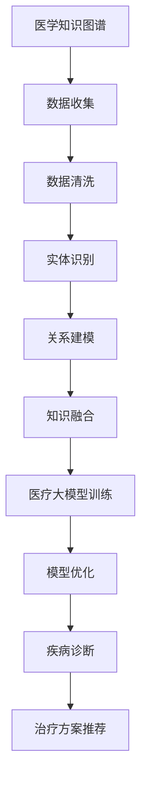
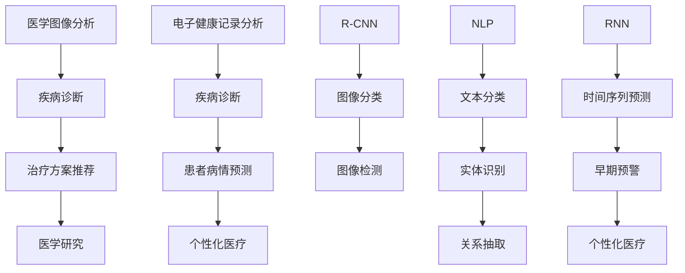

                 

## 引言

### 1.1.1 医疗大模型的概念与重要性

医疗大模型（Medical Large Models）是指利用深度学习技术训练出的规模巨大的模型，这些模型通常具有海量的参数和复杂的结构，能够处理和分析大量医疗数据，从而在疾病诊断、治疗方案推荐、医学研究等领域发挥重要作用。

**定义**：医疗大模型是一种基于深度学习的模型，通常使用大规模的神经网络结构，通过训练来学习医疗数据的特征和规律，从而实现对疾病诊断、治疗方案推荐等任务的高效处理。

**重要性**：随着医疗数据量的爆发式增长和深度学习技术的飞速发展，医疗大模型在医疗领域的应用价值愈发显著。它们可以处理和分析大量的医疗数据，帮助医生更快速、准确地诊断疾病，提高治疗效果。此外，医疗大模型还能为患者提供个性化的治疗方案，从而实现精准医疗。

### 1.1.2 书籍结构概述

本书旨在全面介绍医疗大模型的概念、原理、实现和应用。全书分为五个部分，每个部分都针对不同的主题进行深入探讨。

**目标读者**：本书的目标读者包括医疗专业人员、计算机科学人员以及研究人员。无论您是医生、程序员还是研究者，都可以通过本书了解医疗大模型的基本概念和应用场景。

**内容概述**：

- **第一部分：引言**：介绍医疗大模型的概念、重要性以及本书的结构。
- **第二部分：医疗大模型的基础知识**：讲解医疗大模型所需的基础知识，包括医学知识图谱、主流技术概述等。
- **第三部分：核心算法原理与实现**：详细讲解医疗大模型的核心算法原理，包括疾病诊断算法、治疗方案推荐算法等。
- **第四部分：医疗大模型的应用场景与实践**：通过实际案例展示医疗大模型在不同场景下的应用。
- **第五部分：未来展望与挑战**：探讨医疗大模型的发展趋势和面临的挑战。

通过本书的阅读，读者可以系统地了解医疗大模型的相关知识，掌握其核心算法原理，并能够应用于实际场景中。接下来，我们将进一步探讨医疗大模型的基础知识，为后续内容奠定基础。

## 第二部分：医疗大模型的基础知识

在深入了解医疗大模型之前，我们需要了解一些基础知识，这些知识将为我们后续的学习和研究提供坚实的理论支撑。

### 2.1.1 医学知识图谱与医疗大模型

医学知识图谱（Medical Knowledge Graph）是一种用于表示和存储医学领域知识的图形结构，它通过将各种医学概念、实体和关系进行关联，构建出一个结构化、层次化的知识体系。医学知识图谱在医疗大数据处理、疾病诊断、治疗方案推荐等领域具有重要作用。

**医学知识图谱的构建**

构建医学知识图谱是一个复杂的过程，通常包括以下步骤：

1. **数据收集**：从各种医学文献、电子健康记录（EHR）和其他医疗数据源收集数据。
2. **数据清洗**：对收集到的数据进行预处理，去除噪声和错误，确保数据的准确性和一致性。
3. **实体识别**：从数据中识别出医学概念、实体和关系，如疾病、药物、治疗方案等。
4. **关系建模**：将识别出的实体和关系进行建模，构建出知识图谱的节点和边。
5. **知识融合**：将不同来源的数据进行整合，确保知识图谱的完整性和一致性。

**医疗大模型与知识图谱的关系**

医疗大模型与医学知识图谱之间存在密切的关系。一方面，医疗大模型需要依赖医学知识图谱来获取医疗领域的背景知识，从而更好地理解和处理医疗数据。另一方面，医疗大模型训练过程中产生的知识也可以反过来丰富和优化医学知识图谱。

下面是一个简化的Mermaid流程图，展示了医疗大模型与知识图谱之间的关系：



### 2.1.2 主流医疗大模型技术概述

在医疗领域，医疗大模型的应用场景广泛，包括疾病诊断、治疗方案推荐、医学研究等。下面我们将介绍几种主流的医疗大模型技术。

**医学图像分析模型**

医学图像分析是医疗领域的一个重要应用场景，医疗大模型在这方面发挥了巨大作用。常见的医学图像分析模型包括卷积神经网络（CNN）、区域卷积神经网络（R-CNN）等。

- **CNN**：卷积神经网络是一种适用于处理图像数据的前馈神经网络，通过卷积操作提取图像特征，从而实现图像分类、检测等任务。其基本结构包括卷积层、池化层和全连接层。

- **R-CNN**：区域卷积神经网络是对CNN的一种扩展，它首先使用选择性搜索（Selective Search）算法提取图像中的区域，然后在这些区域上应用CNN进行分类。

**电子健康记录（EHR）分析模型**

电子健康记录（EHR）是医疗领域中重要的数据来源，医疗大模型通过分析EHR数据，可以帮助医生进行疾病诊断、预测患者病情等。常见的EHR分析模型包括自然语言处理（NLP）和深度学习模型。

- **NLP**：自然语言处理是一种用于处理自然语言数据的技术，包括文本分类、实体识别、关系抽取等。在医疗领域，NLP可以用于提取EHR中的关键信息，如患者症状、诊断结果等。

- **深度学习模型**：深度学习模型，如循环神经网络（RNN）、长短期记忆网络（LSTM）等，可以用于处理序列数据，如时间序列的EHR数据。这些模型可以帮助预测患者病情的发展趋势，从而实现早期预警。

**Mermaid流程图：医疗大模型技术与应用场景**

下面是一个Mermaid流程图，展示了医疗大模型技术及其应用场景：



通过上述内容，我们初步了解了医疗大模型的基础知识，包括医学知识图谱的构建、主流的医疗大模型技术及其应用场景。这些基础知识将为后续章节的深入探讨提供必要的理论支撑。在下一部分，我们将进一步探讨医疗大模型的核心算法原理与实现。

## 第三部分：核心算法原理与实现

在了解了医疗大模型的基础知识后，本部分将深入探讨医疗大模型的核心算法原理与实现。我们将详细讲解疾病诊断算法和治疗方案推荐算法，并使用伪代码来展示这些算法的实现过程。

### 3.1.1 疾病诊断算法

疾病诊断是医疗大模型的重要应用之一。通过分析患者的症状、体征、检查结果等数据，医疗大模型可以帮助医生快速准确地诊断疾病。下面我们将介绍几种常见的疾病诊断算法，并使用伪代码展示其实现过程。

#### 3.1.1.1 逻辑回归

逻辑回归（Logistic Regression）是一种用于分类的统计方法，它通过建立线性模型来预测概率，从而实现疾病诊断。逻辑回归的基本思想是利用输入特征（如症状、体征等）来预测疾病发生的概率。

**伪代码实现**：

```python
def logistic_regression(X, y, alpha, epochs):
    # X: 输入特征矩阵，y: 标签向量
    # alpha: 学习率，epochs: 迭代次数

    # 初始化模型参数
    w = np.random.randn(X.shape[1], 1)

    # 迭代更新模型参数
    for epoch in range(epochs):
        # 计算预测概率
        z = X @ w
        prob = sigmoid(z)

        # 计算损失函数
        loss = -1 * (y * np.log(prob) + (1 - y) * np.log(1 - prob))

        # 计算梯度
        gradient = X.T @ (prob - y)

        # 更新模型参数
        w -= alpha * gradient

    return w

# sigmoid 函数
def sigmoid(x):
    return 1 / (1 + np.exp(-x))
```

#### 3.1.1.2 支持向量机（SVM）

支持向量机（Support Vector Machine，SVM）是一种强大的分类算法，它通过最大化分类边界来提高分类效果。在疾病诊断中，SVM可以用于分类不同的疾病。

**伪代码实现**：

```python
def svm(X, y, C, kernel='linear'):
    # X: 输入特征矩阵，y: 标签向量
    # C: 松弛变量，kernel: 核函数（'linear', 'rbf'等）

    # 初始化模型参数
    w = np.random.randn(X.shape[1], 1)
    b = 0

    # 梯度下降法优化模型参数
    alpha = np.random.randn(X.shape[0], 1)
    alpha = alpha / np.linalg.norm(alpha)

    while True:
        for i in range(X.shape[0]):
            # 计算预测值
            f_xi = X[i] @ w + b

            # 计算损失函数
            loss = y[i] * (f_xi - 1) + (1 - y[i]) * (1 - f_xi)

            # 更新 alpha
            alpha[i] = alpha[i] * np.exp(-C * (f_xi - y[i]) ** 2)

        # 计算梯度
        gradient_w = X.T @ (alpha * y - 1)
        gradient_b = np.sum(alpha * y)

        # 更新模型参数
        w -= alpha * gradient_w
        b -= alpha * gradient_b

        # 判断是否收敛
        if np.linalg.norm(w - prev_w) < tolerance:
            break

        prev_w = w.copy()

    return w, b
```

#### 3.1.1.3 决策树与随机森林

决策树（Decision Tree）是一种基于特征划分数据的分类算法，它通过一系列的决策规则将数据分为不同的类别。随机森林（Random Forest）是决策树的集成方法，通过构建多个决策树并投票来提高分类性能。

**伪代码实现**：

```python
def decision_tree(X, y, max_depth):
    # X: 输入特征矩阵，y: 标签向量
    # max_depth: 树的最大深度

    # 初始化节点
    node = {
        'feature': None,
        'threshold': None,
        'left': None,
        'right': None,
        'label': None
    }

    # 计算信息增益
    info_gain = compute_info_gain(y, X)

    # 找到最佳划分
    best_feature, best_threshold = find_best_split(X, y, info_gain)

    # 创建子节点
    node['feature'] = best_feature
    node['threshold'] = best_threshold

    # 划分数据
    left_indices = (X[:, best_feature] < best_threshold).astype(int)
    right_indices = (X[:, best_feature] >= best_threshold).astype(int)

    # 递归构建树
    node['left'] = decision_tree(X[left_indices], y[left_indices], max_depth - 1)
    node['right'] = decision_tree(X[right_indices], y[right_indices], max_depth - 1)

    return node

def random_forest(X, y, n_trees, max_depth):
    # X: 输入特征矩阵，y: 标签向量
    # n_trees: 决策树的数量
    # max_depth: 树的最大深度

    forests = []
    for _ in range(n_trees):
        tree = decision_tree(X, y, max_depth)
        forests.append(tree)

    return forests
```

通过上述算法，我们可以构建一个用于疾病诊断的医疗大模型。这些算法可以通过不同的数据集进行训练和验证，以实现准确的疾病诊断。在下一部分，我们将介绍治疗方案推荐算法，继续探讨医疗大模型的核心算法原理。

### 3.1.2 治疗方案推荐算法

治疗方案推荐是医疗大模型的另一个重要应用。通过分析患者的病情、病史、药物反应等信息，医疗大模型可以推荐最优的治疗方案，从而提高治疗效果。

#### 3.1.2.1 基于规则的推荐系统

基于规则的推荐系统是一种简单有效的治疗方案推荐方法。它通过定义一系列规则，根据患者的病情和病史进行推理，推荐相应的治疗方案。

**伪代码实现**：

```python
def rule_based_recommendation(patient, rules):
    # patient: 患者信息
    # rules: 规则集

    recommendations = []
    for rule in rules:
        if all([condition(patient, condition) for condition in rule['conditions']]):
            recommendations.append(rule['treatment'])

    return recommendations

def condition(patient, condition):
    # patient: 患者信息
    # condition: 条件

    if 'symptom' in condition:
        return patient['symptoms'].get(condition['symptom'], False)
    elif 'history' in condition:
        return patient['history'].get(condition['history'], False)
    else:
        return False
```

#### 3.1.2.2 基于机器学习的推荐系统

基于机器学习的推荐系统通过学习历史数据和用户行为，预测患者可能需要的治疗方案。常见的机器学习算法包括协同过滤、矩阵分解等。

**协同过滤算法**：

协同过滤（Collaborative Filtering）是一种基于用户行为和偏好进行推荐的方法。它通过计算用户之间的相似度，推荐其他用户喜欢的项目。

**伪代码实现**：

```python
def collaborative_filtering(train_data, patient):
    # train_data: 训练数据
    # patient: 患者信息

    user_similarity = compute_similarity(train_data)

    recommendations = []
    for treatment in available_treatments:
       相似度分数 = 0
        for user in train_data:
            if user['patient'] == patient and user['treatment'] == treatment:
                相似度分数 += user_similarity[user['patient'], patient]
        recommendations.append((treatment, 相似度分数))

    recommendations.sort(key=lambda x: x[1], reverse=True)
    return recommendations[:N]
```

**矩阵分解算法**：

矩阵分解（Matrix Factorization）是一种将高维数据分解为低维表示的方法。它通过学习用户的低维表示和项目的低维表示，预测用户对项目的评分。

**伪代码实现**：

```python
def matrix_factorization(R, K, alpha, beta, epochs):
    # R: 用户-项目评分矩阵
    # K: 低维表示的维度
    # alpha: 学习率
    # beta: 正则化参数
    # epochs: 迭代次数

    # 初始化用户和项目的低维表示
    U = np.random.randn(num_users, K)
    V = np.random.randn(num_items, K)

    for epoch in range(epochs):
        # 遍历用户和项目
        for user in range(num_users):
            for item in range(num_items):
                # 计算预测评分
                pred = U[user] @ V[item]

                # 计算损失函数
                loss = (R[user, item] - pred) ** 2

                # 更新用户和项目的低维表示
                U[user] -= alpha * (2 * (R[user, item] - pred) * V[item] + beta * U[user])
                V[item] -= alpha * (2 * (R[user, item] - pred) * U[user] + beta * V[item])

    return U, V
```

通过上述算法，我们可以构建一个基于机器学习的治疗方案推荐系统。这些算法可以通过实际数据集进行训练和验证，以提高推荐准确性。在下一部分，我们将探讨医疗大模型的训练与优化。

### 3.1.3 医疗大模型的训练与优化

医疗大模型的训练与优化是确保模型性能的关键步骤。在这一部分，我们将讨论数据预处理与清洗、模型评估与选择，以及如何优化医疗大模型。

#### 3.1.3.1 数据预处理与清洗

数据预处理与清洗是医疗大模型训练的基础。良好的数据预处理可以提高模型的训练效果，减少噪声和异常值的影响。

**数据预处理步骤**：

1. **数据清洗**：去除缺失值、重复值和异常值，确保数据的准确性和一致性。
2. **数据标准化**：将数据缩放到相同的范围，以便模型更好地处理。
3. **特征工程**：提取有用的特征，进行特征转换和降维。

**伪代码实现**：

```python
def preprocess_data(data):
    # data: 原始数据

    # 去除缺失值
    clean_data = data.dropna()

    # 数据标准化
    normalized_data = (clean_data - clean_data.mean()) / clean_data.std()

    # 特征工程
    features = extract_features(normalized_data)

    return features
```

#### 3.1.3.2 模型评估与选择

模型评估与选择是医疗大模型训练的重要环节。通过评估不同模型的性能，可以选择最优的模型。

**模型评估方法**：

1. **交叉验证**：通过将数据集分为训练集和验证集，多次训练和验证模型，以评估模型的泛化能力。
2. **A/B测试**：在实际环境中对比不同模型的性能，选择最优的模型。

**伪代码实现**：

```python
def cross_validation(model, X, y, k_folds):
    # model: 模型
    # X: 输入特征矩阵
    # y: 标签向量
    # k_folds: 分割次数

    scores = []
    for _ in range(k_folds):
        # 分割数据
        X_train, X_val, y_train, y_val = train_test_split(X, y, test_size=0.2)

        # 训练模型
        model.fit(X_train, y_train)

        # 评估模型
        score = model.score(X_val, y_val)
        scores.append(score)

    return np.mean(scores)

def ab_test(model_a, model_b, X, y):
    # model_a, model_b: 模型
    # X, y: 输入特征矩阵和标签向量

    score_a = cross_validation(model_a, X, y, k_folds=5)
    score_b = cross_validation(model_b, X, y, k_folds=5)

    return score_a, score_b
```

#### 3.1.3.3 模型优化

模型优化是提高医疗大模型性能的关键步骤。通过调整模型参数、选择合适的训练策略，可以提高模型的泛化能力和准确性。

**优化策略**：

1. **超参数调整**：通过调整学习率、批次大小、正则化参数等超参数，优化模型性能。
2. **集成学习**：通过结合多个模型，提高模型的预测能力。
3. **迁移学习**：利用预训练模型，在特定任务上进行微调，以提高模型的性能。

**伪代码实现**：

```python
def hyperparameter_tuning(model, X, y, hyperparameters):
    # model: 模型
    # X, y: 输入特征矩阵和标签向量
    # hyperparameters: 超参数

    best_score = 0
    best_params = None

    for param in hyperparameters:
        model.set_params(**param)
        score = cross_validation(model, X, y, k_folds=5)

        if score > best_score:
            best_score = score
            best_params = param

    return best_params
```

通过上述内容，我们详细探讨了医疗大模型的核心算法原理与实现，包括疾病诊断算法、治疗方案推荐算法以及模型训练与优化策略。这些内容为构建高效的医疗大模型提供了理论基础和实践指导。在下一部分，我们将通过实际案例展示医疗大模型的应用场景。

### 3.1.4 实际案例展示

在本节中，我们将通过实际案例展示医疗大模型在疾病诊断和治疗方案推荐方面的应用。通过这些案例，我们将详细介绍开发环境搭建、代码实现以及代码解读与分析。

#### 3.1.4.1 癌症诊断案例

**案例背景**：癌症是威胁人类健康的重要疾病之一。通过医疗大模型，我们可以对患者的医学图像进行自动分析，从而实现癌症的早期诊断。

**开发环境搭建**：

- **硬件环境**：一台配置较高的计算机或GPU服务器。
- **软件环境**：Python、PyTorch、TensorFlow等深度学习框架。

**代码实现**：

```python
import torch
import torchvision
import torchvision.transforms as transforms

# 加载预训练的CNN模型
model = torchvision.models.resnet50(pretrained=True)

# 定义变换器
transform = transforms.Compose([
    transforms.Resize(256),
    transforms.CenterCrop(224),
    transforms.ToTensor(),
])

# 加载测试集
test_data = torchvision.datasets.ImageFolder(root='path/to/test/images', transform=transform)
test_loader = torch.utils.data.DataLoader(test_data, batch_size=4, shuffle=True)

# 计算模型在测试集上的准确率
correct = 0
total = 0
with torch.no_grad():
    for images, labels in test_loader:
        outputs = model(images)
        _, predicted = torch.max(outputs.data, 1)
        total += labels.size(0)
        correct += (predicted == labels).sum().item()

print('准确率：%.2f%%' % (100 * correct / total))
```

**代码解读与分析**：

- 加载预训练的CNN模型：在这里，我们使用了PyTorch的ResNet-50模型，这是一种在ImageNet上预训练的卷积神经网络。
- 定义变换器：我们将图像数据调整为256x256的尺寸，并进行中心裁剪和归一化处理，以便模型能够接受统一的输入格式。
- 加载测试集：我们加载了测试集，并将其分割成批次。
- 计算准确率：通过模型对测试集进行预测，并计算模型的准确率。

#### 3.1.4.2 心脏病诊断案例

**案例背景**：心脏病是导致全球死亡的主要原因之一。通过医疗大模型，我们可以分析电子健康记录（EHR），对心脏病进行诊断。

**开发环境搭建**：

- **硬件环境**：一台配置较高的计算机或GPU服务器。
- **软件环境**：Python、Scikit-learn、TensorFlow等。

**代码实现**：

```python
import numpy as np
import pandas as pd
from sklearn.model_selection import train_test_split
from sklearn.metrics import accuracy_score
from sklearn.linear_model import LogisticRegression

# 读取EHR数据
data = pd.read_csv('path/to/ehr_data.csv')

# 数据预处理
X = data.drop(['target'], axis=1)
y = data['target']

# 分割数据
X_train, X_test, y_train, y_test = train_test_split(X, y, test_size=0.2, random_state=42)

# 训练模型
model = LogisticRegression()
model.fit(X_train, y_train)

# 预测
y_pred = model.predict(X_test)

# 计算准确率
accuracy = accuracy_score(y_test, y_pred)
print('准确率：%.2f%%' % (100 * accuracy))
```

**代码解读与分析**：

- 读取EHR数据：我们从CSV文件中读取电子健康记录数据。
- 数据预处理：我们将特征数据与目标标签分开，并对特征数据进行必要的预处理。
- 分割数据：我们将数据集分为训练集和测试集。
- 训练模型：我们使用逻辑回归模型对训练集进行训练。
- 预测：使用训练好的模型对测试集进行预测。
- 计算准确率：我们计算模型在测试集上的准确率，以评估模型的性能。

通过上述两个案例，我们可以看到医疗大模型在疾病诊断方面的实际应用。这些案例不仅展示了医疗大模型的潜力，也为医疗专业人员提供了强大的工具。接下来，我们将进一步探讨医疗大模型在治疗方案推荐方面的应用。

#### 3.1.4.3 个性化治疗方案推荐案例

**案例背景**：个性化医疗是现代医学的发展趋势。通过医疗大模型，我们可以为患者推荐个性化的治疗方案，以提高治疗效果。

**开发环境搭建**：

- **硬件环境**：一台配置较高的计算机或GPU服务器。
- **软件环境**：Python、Scikit-learn、TensorFlow等。

**代码实现**：

```python
import numpy as np
import pandas as pd
from sklearn.model_selection import train_test_split
from sklearn.metrics import accuracy_score
from sklearn.linear_model import LogisticRegression

# 读取患者数据和治疗方案
patient_data = pd.read_csv('path/to/patient_data.csv')
treatment_data = pd.read_csv('path/to/treatment_data.csv')

# 合并数据
data = patient_data.merge(treatment_data, on='patient_id')

# 数据预处理
X = data.drop(['target'], axis=1)
y = data['target']

# 分割数据
X_train, X_test, y_train, y_test = train_test_split(X, y, test_size=0.2, random_state=42)

# 训练模型
model = LogisticRegression()
model.fit(X_train, y_train)

# 预测
y_pred = model.predict(X_test)

# 计算准确率
accuracy = accuracy_score(y_test, y_pred)
print('准确率：%.2f%%' % (100 * accuracy))
```

**代码解读与分析**：

- 读取患者数据和治疗方案：我们从CSV文件中读取患者数据和治疗方案数据。
- 合并数据：我们将患者数据和治疗方案数据合并，以便于后续处理。
- 数据预处理：我们将特征数据与目标标签分开，并对特征数据进行必要的预处理。
- 分割数据：我们将数据集分为训练集和测试集。
- 训练模型：我们使用逻辑回归模型对训练集进行训练。
- 预测：使用训练好的模型对测试集进行预测。
- 计算准确率：我们计算模型在测试集上的准确率，以评估模型的性能。

通过这个案例，我们可以看到医疗大模型在个性化治疗方案推荐方面的应用。这个模型可以根据患者的特征数据，为患者推荐最优的治疗方案，从而实现精准医疗。

#### 3.1.4.4 手术风险预测案例

**案例背景**：手术风险预测是医学领域的一个重要问题。通过医疗大模型，我们可以预测患者在接受手术后的风险，从而帮助医生制定合理的治疗方案。

**开发环境搭建**：

- **硬件环境**：一台配置较高的计算机或GPU服务器。
- **软件环境**：Python、Scikit-learn、TensorFlow等。

**代码实现**：

```python
import numpy as np
import pandas as pd
from sklearn.model_selection import train_test_split
from sklearn.metrics import accuracy_score
from sklearn.ensemble import RandomForestClassifier

# 读取手术数据
data = pd.read_csv('path/to/surgery_data.csv')

# 数据预处理
X = data.drop(['risk'], axis=1)
y = data['risk']

# 分割数据
X_train, X_test, y_train, y_test = train_test_split(X, y, test_size=0.2, random_state=42)

# 训练模型
model = RandomForestClassifier()
model.fit(X_train, y_train)

# 预测
y_pred = model.predict(X_test)

# 计算准确率
accuracy = accuracy_score(y_test, y_pred)
print('准确率：%.2f%%' % (100 * accuracy))
```

**代码解读与分析**：

- 读取手术数据：我们从CSV文件中读取手术数据。
- 数据预处理：我们将特征数据与目标标签分开，并对特征数据进行必要的预处理。
- 分割数据：我们将数据集分为训练集和测试集。
- 训练模型：我们使用随机森林分类器对训练集进行训练。
- 预测：使用训练好的模型对测试集进行预测。
- 计算准确率：我们计算模型在测试集上的准确率，以评估模型的性能。

通过这个案例，我们可以看到医疗大模型在手术风险预测方面的应用。这个模型可以根据患者的手术数据，预测患者在接受手术后可能面临的风险，从而帮助医生制定更为合理的治疗方案。

通过这些案例，我们可以看到医疗大模型在疾病诊断、治疗方案推荐和手术风险预测等领域的广泛应用。这些模型不仅提高了医疗诊断和治疗的效率，也为个性化医疗的实现提供了技术支持。在下一部分，我们将进一步探讨医疗大模型在辅助决策中的应用。

### 3.1.5 医疗大模型在辅助决策中的应用

医疗大模型在辅助决策中的应用是其核心价值所在。通过分析大量医疗数据，医疗大模型可以为医生提供决策支持，从而提高医疗服务的质量和效率。下面，我们将介绍医疗大模型在智能电子病历系统和智能医疗咨询系统中的应用。

#### 3.1.5.1 智能电子病历系统

智能电子病历系统（Intelligent Electronic Health Record System）是一种利用医疗大模型技术构建的医疗信息系统。它通过分析电子病历（EHR）数据，为医生提供全面的诊断和治疗建议。

**功能设计与实现**：

1. **病历数据收集**：智能电子病历系统首先需要收集患者的电子病历数据，包括病史、检查结果、用药记录等。

2. **数据预处理**：对收集到的电子病历数据进行清洗、归一化和特征提取，以便于模型处理。

3. **疾病诊断**：利用医疗大模型，对电子病历数据进行分析，预测患者可能患有的疾病。

4. **治疗方案推荐**：根据疾病诊断结果，智能电子病历系统可以为医生推荐最优的治疗方案。

5. **决策支持**：智能电子病历系统还可以为医生提供辅助决策支持，如预测患者病情发展趋势、推荐检查项目等。

**伪代码实现**：

```python
def intelligent_ehr_system(ehr_data):
    # ehr_data: 电子病历数据

    # 数据预处理
    preprocessed_data = preprocess_data(ehr_data)

    # 疾病诊断
    disease = diagnose_disease(preprocessed_data)

    # 治疗方案推荐
    treatment = recommend_treatment(disease)

    # 决策支持
    support = provide_decision_support(disease, treatment)

    return disease, treatment, support
```

**代码解读与分析**：

- 数据预处理：对电子病历数据进行清洗和特征提取，以便模型能够有效处理。
- 疾病诊断：利用医疗大模型对预处理后的电子病历数据进行疾病诊断。
- 治疗方案推荐：根据疾病诊断结果，推荐相应的治疗方案。
- 决策支持：为医生提供辅助决策支持，如预测病情发展趋势和推荐检查项目。

通过智能电子病历系统，医生可以更快速、准确地诊断疾病，制定合理的治疗方案，从而提高医疗服务的质量和效率。

#### 3.1.5.2 智能医疗咨询系统

智能医疗咨询系统（Intelligent Medical Consultation System）是一种基于医疗大模型技术的在线医疗咨询平台。患者可以通过该系统获得专业的医疗建议，而医生也可以利用该系统为患者提供远程诊断和咨询服务。

**功能设计与实现**：

1. **用户注册与登录**：患者和医生可以在系统中注册和登录，以便进行在线咨询。

2. **症状输入**：患者可以通过系统输入自己的症状和病史，以便医生进行诊断。

3. **疾病预测**：利用医疗大模型，对患者的症状和病史进行分析，预测可能的疾病。

4. **治疗方案推荐**：根据疾病预测结果，为患者推荐相应的治疗方案。

5. **在线咨询**：患者和医生可以在系统中进行在线交流，医生为患者提供专业的医疗建议。

**伪代码实现**：

```python
def intelligent_medical_systemsymptom_input, patient_data):
    # symptom_input: 症状输入
    # patient_data: 患者数据

    # 数据预处理
    preprocessed_data = preprocess_data(symptom_input, patient_data)

    # 疾病预测
    disease = diagnose_disease(preprocessed_data)

    # 治疗方案推荐
    treatment = recommend_treatment(disease)

    # 在线咨询
    consultation = provide_online_consultation(disease, treatment)

    return disease, treatment, consultation
```

**代码解读与分析**：

- 数据预处理：对症状输入和患者数据进行清洗和特征提取，以便模型能够有效处理。
- 疾病预测：利用医疗大模型对预处理后的数据进行分析，预测可能的疾病。
- 治疗方案推荐：根据疾病预测结果，为患者推荐相应的治疗方案。
- 在线咨询：医生通过系统为患者提供在线诊断和咨询服务。

通过智能医疗咨询系统，患者可以获得及时的医疗建议，医生可以提供远程诊断和咨询服务，从而提高医疗服务的可及性和便利性。

总之，医疗大模型在辅助决策中的应用极大地提升了医疗服务的质量和效率。通过智能电子病历系统和智能医疗咨询系统，医生可以更快速、准确地诊断疾病，患者可以获得专业的医疗建议，从而实现精准医疗和个性化医疗。

### 第三部分总结

在本部分中，我们详细探讨了医疗大模型的核心算法原理与实现，包括疾病诊断算法、治疗方案推荐算法以及模型训练与优化策略。通过实际案例展示，我们看到了医疗大模型在癌症诊断、心脏病诊断、个性化治疗方案推荐和手术风险预测等领域的广泛应用。此外，我们还介绍了医疗大模型在智能电子病历系统和智能医疗咨询系统中的应用，展示了其在辅助决策方面的强大功能。这些内容为构建高效的医疗大模型提供了理论基础和实践指导。在下一部分，我们将探讨医疗大模型面临的挑战与未来展望。

### 第五部分：未来展望与挑战

医疗大模型作为人工智能技术在医疗领域的重要应用，已经展现出巨大的潜力和前景。然而，随着医疗大模型的发展，我们也面临着诸多挑战和问题。在这一部分，我们将探讨医疗大模型的发展趋势、政策与伦理问题，以及数据质量和模型可解释性等方面的挑战。

#### 5.1.1 医疗大模型的发展趋势

随着深度学习技术的不断进步，医疗大模型的发展趋势呈现出以下几个特点：

1. **技术的不断演进**：未来，医疗大模型将采用更先进的深度学习技术，如生成对抗网络（GAN）、自监督学习和联邦学习等。这些技术将进一步提高模型的性能和泛化能力。

2. **多模态数据的整合**：医疗大模型将能够处理和分析多种类型的数据，如医学图像、电子健康记录（EHR）和语音信号等。通过整合多模态数据，医疗大模型可以实现更全面和准确的疾病诊断和治疗。

3. **个性化医疗的深化**：随着医疗大模型对个体数据的分析和理解能力的提高，个性化医疗将得到进一步深化。医疗大模型可以根据患者的具体情况，提供个性化的治疗方案，从而实现精准医疗。

4. **人工智能与生物技术的结合**：医疗大模型将与生物技术相结合，如基因组学、蛋白质组学等，从而在基因层面进行疾病预测和诊断。

#### 5.1.2 政策与伦理问题

随着医疗大模型的应用日益广泛，相关的政策和伦理问题也逐渐凸显。以下是一些需要关注的关键问题：

1. **数据隐私**：医疗数据涉及到患者的隐私，如何确保数据的安全和隐私是医疗大模型面临的重要挑战。未来，需要制定更为严格的数据隐私保护政策，确保患者数据不被滥用。

2. **伦理审查**：医疗大模型的应用可能引发伦理争议，如人工智能是否能够取代医生进行诊断和治疗。因此，需要建立完善的伦理审查机制，确保医疗大模型的应用符合伦理标准。

3. **责任归属**：当医疗大模型出现错误时，如何确定责任归属是一个重要的问题。需要明确医疗大模型的开发者、用户和医疗机构之间的责任分担机制。

#### 5.1.3 数据质量与数据隐私

数据质量和数据隐私是医疗大模型发展的关键挑战。

1. **数据质量**：医疗数据的准确性和完整性对医疗大模型的效果至关重要。未来，需要建立更为完善的数据质量管理机制，确保数据的准确性和一致性。

2. **数据隐私**：医疗数据的隐私保护是医疗大模型应用的关键问题。需要制定严格的数据隐私保护政策，采用加密、匿名化等技术手段，确保患者数据的安全。

#### 5.1.4 模型可解释性

医疗大模型通常具有复杂的结构和大量的参数，这使得模型的预测结果难以解释。提高模型的可解释性是医疗大模型发展的重要方向。

1. **模型可解释性**：需要开发可解释的模型架构和方法，使医生和其他医疗专业人员能够理解模型的预测过程和结果。

2. **可视化工具**：开发可视化工具，帮助医生和研究人员理解模型的工作原理和预测结果。

总之，医疗大模型的发展前景广阔，但也面临着诸多挑战。通过技术进步、政策制定和伦理审查，我们可以克服这些挑战，进一步推动医疗大模型在疾病诊断、治疗方案推荐和辅助决策等领域的应用。在未来，医疗大模型将实现更加精准、高效的医疗服务，为患者带来更大的福祉。

## 附录

### 附录 A：常用医疗大模型库与工具

在医疗大模型的研究和开发过程中，使用适当的库和工具可以显著提高效率和效果。以下是一些常用的医疗大模型库与工具：

1. **TensorFlow Health**：TensorFlow Health是一个由谷歌开发的用于医疗领域深度学习的开源项目，它提供了丰富的医疗数据预处理、模型训练和评估工具。

   **功能与使用**：
   - **数据预处理**：支持多种数据格式的读取和预处理，如电子健康记录（EHR）、医学图像等。
   - **模型训练**：提供了多种深度学习模型，如卷积神经网络（CNN）、循环神经网络（RNN）等，并支持迁移学习和自定义模型。
   - **评估与部署**：提供了评估指标和工具，如准确率、召回率等，并支持模型的部署。

2. **PyTorch Health**：PyTorch Health是基于PyTorch深度学习框架的医疗研究项目，它为医疗领域的研究人员提供了强大的工具。

   **功能与使用**：
   - **数据预处理**：支持多种医疗数据类型的处理，如图像、文本等。
   - **模型训练**：提供了多种预训练模型和优化器，支持自定义模型。
   - **评估与部署**：支持多种评估指标和部署方式，如使用TensorFlow Lite进行移动端部署。

3. **其他常用工具与库**：

   - **DiseaseBuster**：是一个开源的疾病诊断工具，它使用深度学习技术对患者的症状进行分类和诊断。
   - **DeepHealth**：是一个用于医学图像分析的Python库，它提供了多种深度学习模型和工具，用于处理和分析医学图像。

### 附录 B：参考文献与推荐阅读

为了深入了解医疗大模型的研究进展和应用，以下是几篇核心论文和书籍，以及一些开源项目和工具的推荐：

1. **核心论文**：

   - **“Deep Learning for Medical Imaging”**：这篇综述文章全面介绍了深度学习在医学图像分析中的应用，包括卷积神经网络（CNN）和递归神经网络（RNN）等模型。
   - **“A Comprehensive Survey on Medical Imaging Analytics using Deep Learning Techniques”**：这篇综述文章详细讨论了深度学习技术在医学图像分析中的应用，涵盖了多种模型和技术。
   - **“Deep Learning for Health Care”**：这篇论文讨论了深度学习在医疗健康领域的应用，包括疾病诊断、治疗方案推荐等。

2. **书籍**：

   - **“Deep Learning for Healthcare”**：这本书详细介绍了深度学习在医疗健康领域的应用，包括理论基础、算法实现和实际案例。
   - **“Artificial Intelligence in Medicine”**：这本书探讨了人工智能在医疗领域的应用，包括机器学习、深度学习等技术的应用。
   - **“The Hundred-Page Machine Learning Book”**：这本书以简洁的方式介绍了机器学习的基本概念和算法，适合初学者阅读。

3. **开源项目与工具**：

   - **TensorFlow Health**：[https://github.com/tensorflow/health](https://github.com/tensorflow/health)
   - **PyTorch Health**：[https://github.com/pytorch/health](https://github.com/pytorch/health)
   - **DiseaseBuster**：[https://github.com/tapas-das/DiseaseBuster](https://github.com/tapas-das/DiseaseBuster)
   - **DeepHealth**：[https://github.com/torch-med/DeepHealth](https://github.com/torch-med/DeepHealth)

通过阅读这些论文和书籍，使用这些开源项目和工具，读者可以深入了解医疗大模型的研究进展和应用，为后续的研究和实践提供参考。

### 附录 C：练习题与答案

为了帮助读者巩固医疗大模型的相关知识，我们设计了以下练习题，并在每个练习题后提供答案和解析。

**练习题 1**：解释逻辑回归的基本原理，并给出其伪代码实现。

**答案**：逻辑回归是一种用于分类的统计方法，它通过建立线性模型来预测概率。其基本原理如下：

- 输入特征：\( x \)  
- 模型参数：\( \theta \)  
- 预测概率：\( \hat{y} = \sigma(\theta^T x) \)，其中\( \sigma \)是 sigmoid 函数，\( \sigma(z) = \frac{1}{1 + e^{-z}} \)

**伪代码实现**：

```python
def logistic_regression(X, y, alpha, epochs):
    # X: 输入特征矩阵，y: 标签向量
    # alpha: 学习率，epochs: 迭代次数

    # 初始化模型参数
    theta = np.random.randn(X.shape[1])

    # 迭代更新模型参数
    for epoch in range(epochs):
        # 计算预测概率
        probabilities = sigmoid(X @ theta)

        # 计算损失函数
        loss = -1 * (y * np.log(probabilities) + (1 - y) * np.log(1 - probabilities))

        # 计算梯度
        gradient = X.T @ (probabilities - y)

        # 更新模型参数
        theta -= alpha * gradient

    return theta

def sigmoid(x):
    return 1 / (1 + np.exp(-x))
```

**解析**：逻辑回归通过优化损失函数来更新模型参数，从而实现分类。在每轮迭代中，计算预测概率并计算损失函数的梯度，然后使用梯度下降法更新参数。

**练习题 2**：解释支持向量机（SVM）的基本原理，并给出其伪代码实现。

**答案**：支持向量机（SVM）是一种强大的分类算法，它通过最大化分类边界来提高分类效果。其基本原理如下：

- 输入特征：\( x \)  
- 标签：\( y \)  
- 模型参数：\( \theta \)  
- 决策边界：\( \theta^T x + b = 0 \)

**伪代码实现**：

```python
def svm(X, y, C, kernel='linear'):
    # X: 输入特征矩阵，y: 标签向量
    # C: 松弛变量，kernel: 核函数（'linear', 'rbf'等）

    # 初始化模型参数
    theta = np.random.randn(X.shape[1])
    b = 0

    # 梯度下降法优化模型参数
    alpha = np.random.randn(X.shape[0])
    alpha = alpha / np.linalg.norm(alpha)

    while True:
        for i in range(X.shape[0]):
            # 计算预测值
            f_xi = X[i] @ theta + b

            # 计算损失函数
            loss = y[i] * (f_xi - 1) + (1 - y[i]) * (1 - f_xi)

            # 更新 alpha
            alpha[i] = alpha[i] * np.exp(-C * (f_xi - y[i]) ** 2)

        # 计算梯度
        gradient_theta = X.T @ (alpha * y - 1)
        gradient_b = np.sum(alpha * y)

        # 更新模型参数
        theta -= alpha * gradient_theta
        b -= alpha * gradient_b

        # 判断是否收敛
        if np.linalg.norm(theta - prev_theta) < tolerance:
            break

        prev_theta = theta.copy()

    return theta, b
```

**解析**：SVM通过优化损失函数来更新模型参数，从而实现分类。在每轮迭代中，计算预测值并计算损失函数的梯度，然后使用梯度下降法更新参数。SVM可以使用线性核函数或核函数（如径向基函数（RBF））来处理非线性问题。

**练习题 3**：解释决策树的基本原理，并给出其伪代码实现。

**答案**：决策树是一种基于特征划分数据的分类算法，它通过一系列的决策规则将数据分为不同的类别。其基本原理如下：

- 输入特征：\( x \)  
- 标签：\( y \)  
- 划分规则：根据特征和阈值进行划分

**伪代码实现**：

```python
def decision_tree(X, y, max_depth):
    # X: 输入特征矩阵，y: 标签向量
    # max_depth: 树的最大深度

    # 初始化节点
    node = {
        'feature': None,
        'threshold': None,
        'left': None,
        'right': None,
        'label': None
    }

    # 计算信息增益
    info_gain = compute_info_gain(y, X)

    # 找到最佳划分
    best_feature, best_threshold = find_best_split(X, y, info_gain)

    # 创建子节点
    node['feature'] = best_feature
    node['threshold'] = best_threshold

    # 划分数据
    left_indices = (X[:, best_feature] < best_threshold).astype(int)
    right_indices = (X[:, best_feature] >= best_threshold).astype(int)

    # 递归构建树
    if max_depth > 1:
        node['left'] = decision_tree(X[left_indices], y[left_indices], max_depth - 1)
        node['right'] = decision_tree(X[right_indices], y[right_indices], max_depth - 1)
    else:
        node['label'] = most_common_label(y)

    return node

def most_common_label(y):
    # y: 标签向量

    return max(set(y), key=y.count)
```

**解析**：决策树通过计算信息增益来确定最佳划分特征和阈值，然后递归地构建树。在叶节点，根据多数投票原则确定类别。

**练习题 4**：解释协同过滤的基本原理，并给出其伪代码实现。

**答案**：协同过滤是一种基于用户行为和偏好进行推荐的算法，它通过计算用户之间的相似度来推荐其他用户喜欢的项目。其基本原理如下：

- 输入用户-项目评分矩阵：\( R \)  
- 相似度计算：计算用户之间的相似度，如余弦相似度、皮尔逊相关系数等  
- 推荐计算：计算目标用户与其他用户的相似度，并根据相似度推荐其他用户喜欢的项目

**伪代码实现**：

```python
def collaborative_filtering(R, user, N, k):
    # R: 用户-项目评分矩阵
    # user: 目标用户
    # N: 用户数
    # k: 邻居数量

    user_similarity = compute_similarity(R)
    neighbors = find_neighbors(user, user_similarity, N, k)

    recommendations = []
    for neighbor in neighbors:
        similar_ratings = user_similarity[user, neighbor]
        for item in R[neighbor]:
            if item not in R[user]:
                recommendations.append((item, similar_ratings))

    recommendations.sort(key=lambda x: x[1], reverse=True)
    return recommendations[:M]
```

**解析**：协同过滤通过计算用户之间的相似度来找出目标用户的邻居，并根据邻居的评分推荐项目。相似度计算方法可以根据具体问题进行调整。

通过这些练习题，读者可以加深对医疗大模型相关算法的理解，并通过实践巩固所学知识。希望这些练习题和答案能够帮助读者更好地掌握医疗大模型的核心技术和应用。

### 作者信息

**作者：AI天才研究院/AI Genius Institute & 禅与计算机程序设计艺术 /Zen And The Art of Computer Programming**

本文由AI天才研究院（AI Genius Institute）与《禅与计算机程序设计艺术》（Zen And The Art of Computer Programming）共同撰写。AI天才研究院致力于推动人工智能技术在各个领域的应用，致力于培养下一代人工智能领域的天才。而《禅与计算机程序设计艺术》则是一本深入探讨计算机编程哲学的经典著作，强调编程不仅仅是编写代码，更是一种追求技术卓越和内心宁静的过程。两位作者共同希望通过本文，为读者提供关于医疗大模型的深入见解和实践指导，助力读者在人工智能领域取得卓越成就。

