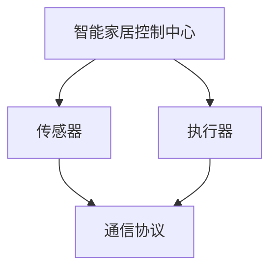
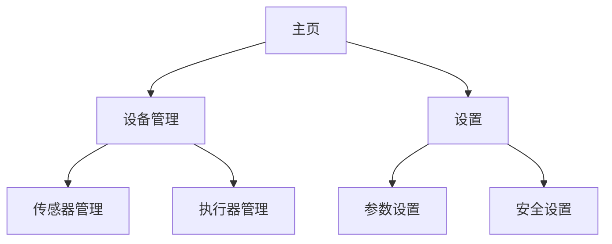
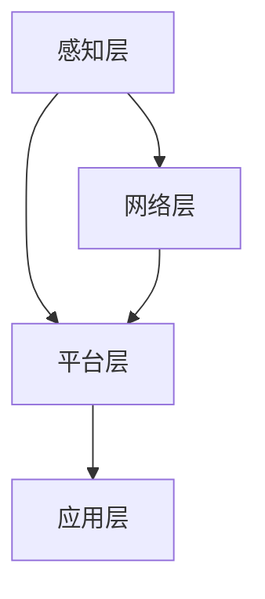

                 

### 《基于Java的智能家居设计：用Java构建容错率高的智能家居系统》

#### 关键词：
- 智能家居
- Java编程
- 容错设计
- 传感器与执行器
- 通信协议
- 数据加密与解密

#### 摘要：
本文旨在探讨如何使用Java语言设计并实现一个容错率高的智能家居系统。通过对智能家居系统概述、Java编程基础、系统开发实践、通信协议设计、容错设计以及项目实战等方面的深入分析，读者将了解如何利用Java语言实现智能家居系统的各个功能，并掌握在系统开发过程中如何进行有效的容错设计。通过本文的阅读，读者能够更好地理解和掌握智能家居系统的设计和实现技术。

### 第一部分：智能家居系统基础

在当今科技迅猛发展的时代，智能家居系统已经成为现代生活不可或缺的一部分。智能家居系统通过将各种智能设备连接起来，实现对家庭环境的自动化控制，提高生活质量。而Java语言作为一种成熟且广泛应用的编程语言，为智能家居系统的设计和实现提供了强有力的技术支持。本部分将对智能家居系统的基础知识进行详细介绍，为后续内容打下坚实的基础。

#### 第1章：智能家居系统概述

##### 1.1 智能家居的发展历程

智能家居系统的发展历程可以追溯到20世纪末。当时，计算机和互联网技术的兴起为智能家居系统的诞生奠定了基础。早期的智能家居系统主要依靠单片机和简单的嵌入式系统来实现简单的家居控制功能，如远程控制家电、调节室内温度等。随着物联网（IoT）技术的兴起，智能家居系统开始逐步走向成熟，实现了更加智能化的家庭环境控制。

##### 1.1.1 传统家居与智能家居的对比

传统家居和智能家居在控制方式、自动化程度、用户体验等方面存在显著差异。传统家居依赖于人工控制，需要用户亲自操作开关、遥控器等设备，而智能家居系统则通过自动化控制，实现对家居设备的智能调控，提高生活便利性。同时，智能家居系统还具备远程控制、语音控制等功能，用户可以通过智能手机、语音助手等设备实现对家居环境的远程操控。

##### 1.1.2 智能家居的分类

智能家居系统可以按照不同的分类标准进行分类。根据控制功能，智能家居系统可以分为安全监控类、节能环保类、便利舒适类等。根据通信方式，智能家居系统可以分为有线智能家居系统和无线智能家居系统。有线智能家居系统主要通过有线连接，如网线、光纤等，实现设备之间的通信，而无线智能家居系统则通过无线信号，如Wi-Fi、蓝牙等，实现设备之间的通信。

##### 1.2 智能家居系统的核心组件

一个典型的智能家居系统通常包括传感器、执行器、控制中心等核心组件。这些组件相互协作，共同实现智能家居系统的功能。

##### 1.2.1 传感器与执行器

传感器是智能家居系统中的感知器官，用于感知家庭环境中的各种参数，如温度、湿度、光线、烟雾等。执行器则是智能家居系统中的执行器官，根据传感器收集到的数据，对家庭环境进行相应的调整，如打开空调、关闭灯光等。

##### 1.2.2 控制中心与通信协议

控制中心是智能家居系统的核心，负责接收传感器收集到的数据，根据预设的算法对数据进行分析和处理，然后发送指令给执行器，实现对家居环境的自动化控制。通信协议则是智能家居系统中设备之间进行数据传输的规则，如TCP/IP协议、MQTT协议等。

##### 1.3 智能家居系统的架构设计

智能家居系统的架构设计是系统开发过程中至关重要的一步。一个良好的架构设计可以确保系统具有良好的扩展性、稳定性和易维护性。智能家居系统的架构设计通常采用层次化架构和模块化设计原则。

##### 1.3.1 层次化架构概述

层次化架构是一种将系统划分为多个层次，每个层次负责不同功能的设计方法。在智能家居系统中，通常包括感知层、网络层、平台层和应用层。感知层负责传感器数据的采集和传输，网络层负责设备之间的通信，平台层负责数据处理和分析，应用层则负责为用户提供交互界面。

##### 1.3.2 模块化设计原则

模块化设计原则是将系统划分为多个模块，每个模块实现特定的功能，模块之间通过接口进行通信。模块化设计可以提高系统的可维护性、可扩展性和可重用性。在智能家居系统中，可以按照功能将系统划分为多个模块，如传感器模块、执行器模块、控制模块等。

##### 1.3.3 Mermaid流程图：智能家居系统核心组件关系图



通过上述内容，我们对智能家居系统有了初步的了解。接下来，我们将进入第二部分，详细介绍Java编程基础，为智能家居系统的开发奠定技术基础。

### 第二部分：Java技术基础

Java语言作为一种成熟且广泛应用的编程语言，具有简洁、高效、安全等特点，非常适合用于开发智能家居系统。本部分将介绍Java编程基础，包括Java语言概述、Java面向对象编程、Java常用数据结构等，帮助读者了解Java语言的基本语法和编程思想。

#### 第2章：Java编程基础

##### 2.1 Java语言概述

Java语言是一种高级编程语言，由Sun Microsystems公司于1995年推出。Java语言具有跨平台、面向对象、安全、稳定等特点，广泛应用于企业级应用、Web应用、移动应用和嵌入式系统等领域。

##### 2.1.1 Java语言特点

1. 跨平台：Java语言采用跨平台编译方式，一次编写，到处运行。这意味着Java程序可以在不同的操作系统上运行，无需进行修改。
2. 面向对象：Java语言是一种面向对象的编程语言，支持封装、继承、多态等面向对象编程思想，有助于提高代码的可维护性和可扩展性。
3. 安全性：Java语言内置了安全机制，如沙箱（Sandbox）技术、安全策略（Security Policy）等，确保程序运行的安全性和稳定性。
4. 稳定性：Java程序在运行过程中，由Java虚拟机（JVM）进行管理和执行，提高了程序的稳定性。

##### 2.1.2 Java编程环境搭建

要开始使用Java编程，需要搭建Java编程环境。以下是Java编程环境搭建的基本步骤：

1. 下载并安装Java开发工具包（JDK）：从Oracle官方网站（https://www.oracle.com/java/technologies/javase-downloads.html）下载适用于操作系统的JDK安装包，并按照提示完成安装。
2. 配置环境变量：在系统环境变量中配置JAVA_HOME变量，指向JDK的安装目录，同时将path变量设置为包含JAVA_HOME的路径，以便在命令行中运行Java命令。
3. 验证Java环境：在命令行中输入`java -version`和`javac -version`命令，检查Java环境是否配置成功。

##### 2.2 Java面向对象编程

Java语言是一种面向对象的编程语言，面向对象编程（OOP）是一种编程范式，它将程序视为由对象组成的集合，通过封装、继承、多态等机制来组织和管理代码。

##### 2.2.1 类与对象

类（Class）是面向对象编程的基本概念，它定义了一组具有相同属性和行为的对象的模板。对象（Object）是类的实例，每个对象都有自己的属性（变量）和行为（方法）。

```java
public class Person {
    private String name;
    private int age;

    public Person(String name, int age) {
        this.name = name;
        this.age = age;
    }

    public void introduce() {
        System.out.println("Hello, my name is " + name + " and I am " + age + " years old.");
    }
}

public class Main {
    public static void main(String[] args) {
        Person person = new Person("Alice", 30);
        person.introduce();
    }
}
```

##### 2.2.2 继承与多态

继承（Inheritance）是面向对象编程的一个重要特性，允许一个类继承另一个类的属性和方法。多态（Polymorphism）是指同一个方法在不同类型的对象上具有不同的行为。

```java
public class Animal {
    public void eat() {
        System.out.println("Animal is eating.");
    }
}

public class Dog extends Animal {
    public void eat() {
        System.out.println("Dog is eating.");
    }
}

public class Main {
    public static void main(String[] args) {
        Animal animal = new Dog();
        animal.eat();
    }
}
```

##### 2.2.3 异常处理

异常处理是Java语言中用于处理程序运行过程中发生的错误和异常情况的一种机制。Java提供了多种异常处理方式，如try-catch、finally等。

```java
public class Main {
    public static void main(String[] args) {
        try {
            int result = divide(10, 0);
            System.out.println("Result: " + result);
        } catch (ArithmeticException e) {
            System.out.println("Error: " + e.getMessage());
        } finally {
            System.out.println("Finally block.");
        }
    }

    public static int divide(int a, int b) {
        return a / b;
    }
}
```

##### 2.3 Java常用数据结构

Java提供了丰富的数据结构类，包括数组、列表、链表、树、哈希表等，用于实现不同的数据存储和操作需求。

##### 2.3.1 数组与列表

数组（Array）是一种固定大小的数据结构，用于存储同一类型的元素。列表（List）是一种可变大小的数据结构，用于存储多个元素。

```java
int[] array = {1, 2, 3, 4, 5};
List<Integer> list = new ArrayList<>();
list.add(1);
list.add(2);
list.add(3);
```

##### 2.3.2 链表与树

链表（Linked List）是一种通过节点（Node）连接实现的数据结构，具有动态大小和快速插入和删除操作的特点。树（Tree）是一种层次化的数据结构，用于存储具有父子关系的元素。

```java
class Node {
    int value;
    Node left;
    Node right;

    public Node(int value) {
        this.value = value;
    }
}

class BinaryTree {
    Node root;

    public void insert(int value) {
        root = insertNode(root, value);
    }

    private Node insertNode(Node root, int value) {
        if (root == null) {
            return new Node(value);
        }
        if (value < root.value) {
            root.left = insertNode(root.left, value);
        } else if (value > root.value) {
            root.right = insertNode(root.right, value);
        }
        return root;
    }
}
```

##### 2.3.3 哈希表与栈队列

哈希表（HashMap）是一种基于哈希函数实现的数据结构，用于快速查找和存储键值对。栈（Stack）和队列（Queue）是两种特殊的线性数据结构，分别用于实现后进先出（LIFO）和先进先出（FIFO）的操作。

```java
Map<Integer, String> map = new HashMap<>();
map.put(1, "Apple");
map.put(2, "Orange");

Stack<Integer> stack = new Stack<>();
stack.push(1);
stack.push(2);

Queue<Integer> queue = new LinkedList<>();
queue.add(1);
queue.add(2);
```

通过上述内容，我们对Java编程基础有了初步的了解。接下来，我们将进入第三部分，介绍智能家居系统开发实践，帮助读者掌握如何使用Java语言实现智能家居系统的各个功能。

### 第三部分：智能家居系统开发实践

在第二部分中，我们介绍了Java编程基础。本部分将深入探讨如何使用Java语言开发一个智能家居系统，包括控制中心、传感器与执行器的开发，以及通信协议的设计。通过这些实践内容，读者将能够掌握智能家居系统的实现方法。

#### 第3章：智能家居控制中心开发

智能家居控制中心是智能家居系统的核心组件，负责接收传感器数据、处理数据、发送控制指令。本节将详细介绍智能家居控制中心的功能设计、核心算法实现、数学模型与公式，并通过具体例子进行说明。

##### 3.1 控制中心功能设计

智能家居控制中心的主要功能包括：

1. **用户界面设计**：为用户提供一个友好的操作界面，方便用户对家居设备进行控制和设置。
2. **数据处理与存储**：接收传感器数据，对数据进行处理和分析，并将处理后的数据存储在数据库或文件中。
3. **控制逻辑实现**：根据用户需求和传感器数据，发送控制指令给执行器，实现家居设备的自动化控制。

##### 3.1.1 用户界面设计

用户界面设计是控制中心的重要组成部分，直接影响用户的操作体验。设计一个简洁、直观的用户界面是至关重要的。以下是一个简单的用户界面设计示例：

- **主页**：展示当前家居环境状态，包括温度、湿度、灯光等。
- **设备管理**：用户可以查看和管理连接的传感器和执行器。
- **设置**：用户可以对系统参数进行设置，如温度阈值、湿度阈值等。



##### 3.1.2 数据处理与存储

数据处理与存储是智能家居控制中心的核心功能。传感器采集的数据需要经过处理和分析，以实现对家居环境的实时监控和控制。以下是一个数据处理与存储的伪代码示例：

```java
// 数据处理与存储伪代码
public class DataProcessor {
    public void processData(List<SensorData> sensorDataList) {
        for (SensorData data : sensorDataList) {
            // 数据处理逻辑
            if (data.isTemperatureAboveThreshold()) {
                sendControlCommand("AC", "ON");
            }
            if (data.isHumidityBelowThreshold()) {
                sendControlCommand("HEATER", "ON");
            }
            // 数据存储逻辑
            saveData(data);
        }
    }

    public void saveData(SensorData data) {
        // 数据存储实现
    }
}
```

##### 3.1.3 控制逻辑实现

控制逻辑实现是根据传感器数据和用户需求，对家居设备进行控制。以下是一个控制逻辑实现的伪代码示例：

```java
// 控制逻辑实现伪代码
public class Controller {
    public void controlHome() {
        List<SensorData> sensorDataList = getSensorData();
        DataProcessor dataProcessor = new DataProcessor();
        dataProcessor.processData(sensorDataList);

        // 执行器控制
        if (isLightOnRequired()) {
            turnLightOn();
        } else {
            turnLightOff();
        }
    }

    public void turnLightOn() {
        // 开启灯光
    }

    public void turnLightOff() {
        // 关闭灯光
    }

    public boolean isLightOnRequired() {
        // 根据传感器数据和用户需求判断是否需要开启灯光
        return false;
    }
}
```

##### 3.2 数学模型与公式

智能家居控制中心涉及到的数学模型和公式主要包括数据加密与解密算法、数据传输效率评估公式等。

1. **数据加密与解密算法**：为了确保数据传输的安全性，可以使用对称加密算法（如AES）和非对称加密算法（如RSA）。

   ```java
   // AES加密算法公式
   $$AES_{key}(plaintext) = ciphertext$$

   // RSA加密算法公式
   $$ciphertext = RSA_{public\_key}(plaintext)$$
   ```

2. **数据传输效率评估公式**：数据传输效率可以通过传输延迟和数据包丢失率来评估。

   ```java
   // 传输延迟评估公式
   $$delay = \frac{distance}{speed}$$

   // 数据包丢失评估公式
   $$loss\_rate = \frac{lost\_packets}{total\_packets}$$
   ```

##### 3.3 数学公式举例

1. **AES加密算法公式示例**：

   ```java
   // AES加密算法示例
   public class AESExample {
       public static void main(String[] args) {
           String plaintext = "Hello, World!";
           String ciphertext = AES.encrypt(plaintext, "mySecretKey");
           System.out.println("Ciphertext: " + ciphertext);
       }
   }
   ```

2. **奈特氏距离公式示例**：

   ```java
   // 奈特氏距离公式示例
   public class KnightDistanceExample {
       public static void main(String[] args) {
           String word1 = "cat";
           String word2 = "dog";
           int distance = KnightDistance.calculate(word1, word2);
           System.out.println("Knight Distance: " + distance);
       }
   }
   ```

通过上述内容，我们详细介绍了智能家居控制中心的开发实践，包括功能设计、数据处理与存储、控制逻辑实现、数学模型与公式以及具体例子。接下来，我们将探讨传感器与执行器的开发。

#### 第4章：传感器与执行器开发

传感器与执行器是智能家居系统中的关键组件，它们负责感知环境状态和执行相应操作。本节将介绍传感器与执行器的原理与应用，包括温度传感器、湿度传感器、光线传感器、电风扇、灯具和洗衣机等设备，以及相关的数学模型与公式。

##### 4.1 传感器原理与应用

传感器是智能家居系统的感知器官，用于监测家庭环境中的各种参数。以下是一些常见的传感器及其原理和应用：

1. **温度传感器**：用于测量环境温度。常见的温度传感器有热电偶、热敏电阻等。温度传感器在空调控制、供暖系统等方面有广泛应用。

   - **工作原理**：热电偶通过两种不同金属导线产生的热电效应来测量温度；热敏电阻通过电阻值随温度变化的特性来测量温度。
   - **应用**：用于空调温度控制、供暖系统监测等。

2. **湿度传感器**：用于测量环境湿度。常见的湿度传感器有电容式、电阻式等。湿度传感器在加湿器、除湿机等设备中广泛应用。

   - **工作原理**：电容式湿度传感器通过电容值随湿度变化的特性来测量湿度；电阻式湿度传感器通过电阻值随湿度变化的特性来测量湿度。
   - **应用**：用于加湿器湿度控制、除湿机湿度监测等。

3. **光线传感器**：用于测量环境光线强度。常见的光线传感器有光敏电阻、光电池等。光线传感器在自动照明、亮度调节等方面有广泛应用。

   - **工作原理**：光敏电阻通过电阻值随光线强度变化的特性来测量光线强度；光电池通过光电效应将光能转换为电能。
   - **应用**：用于自动照明控制、亮度调节等。

##### 4.2 执行器原理与应用

执行器是智能家居系统的执行器官，用于根据传感器数据执行相应操作。以下是一些常见的执行器及其原理和应用：

1. **电风扇**：用于调节空气流通，提供舒适的气流。电风扇通过电动机驱动叶片旋转，产生气流。

   - **工作原理**：电风扇通过电动机产生旋转动力，驱动叶片旋转。
   - **应用**：用于降温、通风、干燥等。

2. **灯具**：用于提供照明。灯具通过电源驱动灯泡或LED灯发光。

   - **工作原理**：灯具通过电源驱动灯泡或LED灯，产生光线。
   - **应用**：用于家庭照明、装饰照明等。

3. **洗衣机**：用于洗涤衣物。洗衣机通过电动机驱动内桶旋转，实现衣物的搅拌和洗涤。

   - **工作原理**：洗衣机通过电动机驱动内桶旋转，结合水流和洗涤剂，实现衣物的洗涤。
   - **应用**：用于家庭洗衣、工业洗衣等。

##### 4.3 数学模型与公式

传感器与执行器在数据处理和操作控制中涉及到一些数学模型和公式，以下是一些常见的数学模型和公式：

1. **传感器数据滤波公式**：用于去除传感器数据中的噪声，提高数据稳定性。

   - **一阶滤波器公式**：
     $$filtered\_value = (1 - \alpha) \times previous\_value + \alpha \times current\_value$$

   - **移动平均滤波器公式**：
     $$filtered\_value = \frac{\sum_{i=1}^{N} data[i]}{N}$$

   其中，$N$ 是滤波器窗口大小，$\alpha$ 是滤波系数。

2. **执行器控制算法公式**：用于根据传感器数据调整执行器的操作。

   - **PID控制算法公式**：
     $$output = K_p \times (setpoint - process\_value) + K_i \times \sum_{i=1}^{N} (setpoint - process\_value[i]) + K_d \times (setpoint - process\_value)$$

   其中，$K_p$、$K_i$、$K_d$ 分别是比例、积分、微分系数，$setpoint$ 是设定值，$process\_value$ 是过程值。

##### 4.4 数学公式举例

1. **传感器数据滤波公式示例**：

   ```java
   // 一阶滤波器实现
   public class FirstOrderFilter {
       private double previousValue;
       private double alpha;

       public FirstOrderFilter(double alpha) {
           this.previousValue = 0;
           this.alpha = alpha;
       }

       public double filter(double currentValue) {
           double filteredValue = (1 - alpha) * previousValue + alpha * currentValue;
           previousValue = currentValue;
           return filteredValue;
       }
   }
   ```

2. **执行器控制算法公式示例**：

   ```java
   // PID控制算法实现
   public class PIDController {
       private double Kp;
       private double Ki;
       private double Kd;
       private double integral = 0;
       private double previousError = 0;

       public PIDController(double Kp, double Ki, double Kd) {
           this.Kp = Kp;
           this.Ki = Ki;
           this.Kd = Kd;
       }

       public double calculate(double setpoint, double processValue) {
           double error = setpoint - processValue;
           double derivative = error - previousError;
           double output = Kp * error + Ki * integral + Kd * derivative;
           integral += error;
           previousError = error;
           return output;
       }
   }
   ```

通过上述内容，我们详细介绍了传感器与执行器的原理、应用、数学模型与公式，并通过具体例子展示了如何实现传感器数据滤波和执行器控制算法。接下来，我们将探讨智能家居系统通信协议的设计。

#### 第5章：智能家居系统通信协议设计

智能家居系统的通信协议是确保系统各组件之间能够高效、可靠地传输数据的关键。本节将介绍智能家居系统常用的通信协议，包括TCP/IP协议和MQTT协议，并探讨如何设计一个高效、安全的通信协议。

##### 5.1 通信协议概述

智能家居系统中的通信协议可以分为有线协议和无线协议。有线协议如TCP/IP协议，通过有线连接（如网线、光纤）实现设备之间的数据传输；无线协议如MQTT协议，通过无线信号（如Wi-Fi、蓝牙）实现设备之间的数据传输。以下是对TCP/IP协议和MQTT协议的简要介绍：

1. **TCP/IP协议**：TCP/IP协议是互联网的基础协议，它定义了数据传输的规则和格式。TCP（传输控制协议）负责确保数据可靠传输，而IP（互联网协议）负责数据包的路由和传输。

   - **优点**：可靠性高，适用于需要稳定传输的应用场景。
   - **缺点**：开销较大，不适合实时性要求高的应用。

2. **MQTT协议**：MQTT（Message Queuing Telemetry Transport）协议是一种轻量级的消息队列协议，特别适用于物联网设备之间的通信。MQTT协议基于TCP协议，通过发布/订阅模型实现消息的传输。

   - **优点**：功耗低，适合资源有限的物联网设备；支持断线重连，适用于不稳定网络环境。
   - **缺点**：可靠性略低于TCP/IP协议，安全性较低。

##### 5.2 通信协议设计

设计一个高效、安全的通信协议对于智能家居系统至关重要。以下是一些关键设计要点：

1. **数据传输安全**：智能家居系统涉及到用户隐私和数据安全，因此通信协议必须具备良好的安全性。可以使用TLS（传输层安全协议）来加密数据传输，确保数据在传输过程中的安全性。

2. **数据传输效率**：智能家居系统中的设备通常资源有限，因此通信协议需要尽可能减少数据传输的开销。MQTT协议由于其轻量级特性，在数据传输效率方面具有优势。

3. **通信协议优化策略**：为了提高数据传输效率，可以采用以下策略：

   - **压缩数据**：使用数据压缩算法（如gzip）减少数据传输量。
   - **批量传输**：将多个数据包合并成一个数据包进行传输，减少传输次数。
   - **心跳机制**：定期发送心跳消息，确保连接的稳定性。

##### 5.3 数学模型与公式

在通信协议设计中，涉及到的数学模型和公式主要用于评估数据传输的性能和效率。以下是一些常用的数学模型和公式：

1. **传输延迟评估公式**：用于评估数据从发送端到接收端所需的时间。

   - **单跳延迟**：
     $$delay = \frac{distance}{speed}$$

   - **多跳延迟**：
     $$delay = \sum_{i=1}^{N} \frac{distance_i}{speed_i}$$

   其中，$N$ 是数据传输的跳数，$distance_i$ 是第 $i$ 跳的距离，$speed_i$ 是第 $i$ 跳的传输速度。

2. **数据包丢失评估公式**：用于评估数据包在传输过程中丢失的概率。

   - **概率丢失**：
     $$loss\_rate = 1 - (1 - p)^N$$

   - **平均丢失率**：
     $$average\_loss\_rate = \frac{1}{N} \sum_{i=1}^{N} p_i$$

   其中，$p$ 是单个数据包的丢失概率，$N$ 是数据包的数量。

##### 5.4 数学公式举例

1. **传输延迟评估公式示例**：

   ```java
   // 传输延迟评估
   public class TransmissionDelay {
       public static double calculateSingleHopDelay(double distance, double speed) {
           return distance / speed;
       }

       public static double calculateMultiHopDelay(double[] distances, double[] speeds) {
           double delay = 0;
           for (int i = 0; i < distances.length; i++) {
               delay += distances[i] / speeds[i];
           }
           return delay;
       }
   }
   ```

2. **数据包丢失评估公式示例**：

   ```java
   // 数据包丢失评估
   public class PacketLoss {
       public static double calculateProbabilityLoss(double packetLossProbability) {
           return 1 - Math.pow(1 - packetLossProbability, N);
       }

       public static double calculateAverageLossRate(double[] packetLossProbabilities) {
           double averageLossRate = 0;
           for (double probability : packetLossProbabilities) {
               averageLossRate += probability;
           }
           averageLossRate /= N;
           return averageLossRate;
       }
   }
   ```

通过上述内容，我们详细介绍了智能家居系统通信协议的设计，包括协议概述、设计要点、数学模型与公式，并通过具体例子展示了如何评估传输延迟和数据包丢失率。接下来，我们将探讨智能家居系统的容错设计。

#### 第6章：智能家居系统容错设计

智能家居系统作为一个复杂的分布式系统，其在运行过程中可能会面临各种故障和异常。为了保证系统的稳定性和可靠性，必须进行容错设计。本节将介绍智能家居系统容错设计的原则、算法实现、数学模型与公式，并通过具体例子进行说明。

##### 6.1 容错设计原则

智能家居系统的容错设计主要包括故障检测与隔离、备份与恢复、系统冗余设计等方面。以下是一些关键的容错设计原则：

1. **故障检测与隔离**：通过实时监控系统的运行状态，检测并隔离出现故障的组件，确保系统的正常运行。

2. **备份与恢复**：对关键数据进行备份，确保在系统出现故障时能够快速恢复，减少系统停机时间。

3. **系统冗余设计**：通过增加冗余组件，确保在部分组件出现故障时，系统仍然能够正常运行。

4. **故障恢复策略**：制定故障恢复策略，确保系统在出现故障后能够自动或手动恢复到正常状态。

##### 6.2 伪代码：智能家居系统容错算法实现

以下是一个智能家居系统容错算法实现的伪代码示例：

```java
// 容错算法伪代码
public class FaultTolerantAlgorithm {
    public void initialize() {
        // 初始化故障检测、备份与恢复机制
    }

    public void monitorSystem() {
        // 实时监控系统运行状态
        if (isFaultDetected()) {
            isolateFaultyComponent();
        }
    }

    public void backupData() {
        // 定期备份关键数据
    }

    public void recoverSystem() {
        // 在故障发生后恢复系统
        if (isBackupAvailable()) {
            restoreFromBackup();
        } else {
            manualRecovery();
        }
    }

    private boolean isFaultDetected() {
        // 判断是否出现故障
        return false;
    }

    private void isolateFaultyComponent() {
        // 隔离出现故障的组件
    }

    private boolean isBackupAvailable() {
        // 判断备份是否可用
        return false;
    }

    private void restoreFromBackup() {
        // 从备份恢复系统
    }

    private void manualRecovery() {
        // 手动恢复系统
    }
}
```

##### 6.3 数学模型与公式

智能家居系统的容错设计涉及到的数学模型和公式主要用于评估故障概率、系统恢复时间等方面。以下是一些常用的数学模型和公式：

1. **故障概率评估公式**：用于评估系统在一段时间内出现故障的概率。

   - **泊松分布**：
     $$P(X = k) = \frac{e^{-\lambda} \lambda^k}{k!}$$

   其中，$X$ 是故障发生次数，$\lambda$ 是故障发生频率。

2. **系统恢复时间评估公式**：用于评估系统从故障发生到恢复正常的平均时间。

   - **指数分布**：
     $$P(T > t) = e^{-\lambda t}$$

   其中，$T$ 是系统恢复时间，$\lambda$ 是故障发生频率。

##### 6.4 数学公式举例

1. **故障概率评估公式示例**：

   ```java
   // 泊松分布示例
   public class FaultProbability {
       public static double calculateFaultProbability(double lambda) {
           return Math.exp(-lambda) * Math.pow(lambda, k) / factorial(k);
       }

       public static int factorial(int n) {
           int result = 1;
           for (int i = 1; i <= n; i++) {
               result *= i;
           }
           return result;
       }
   }
   ```

2. **系统恢复时间评估公式示例**：

   ```java
   // 指数分布示例
   public class SystemRecoveryTime {
       public static double calculateRecoveryTime(double lambda) {
           return Math.log(1 - Math.random()) / -lambda;
       }
   }
   ```

通过上述内容，我们详细介绍了智能家居系统的容错设计，包括原则、算法实现、数学模型与公式，并通过具体例子展示了如何评估故障概率和系统恢复时间。接下来，我们将进入项目实战部分，通过一个实际项目展示如何实现一个智能家居系统。

#### 第7章：智能家居系统项目实战

在前面几章中，我们详细介绍了智能家居系统的各个组成部分和关键技术。为了更好地理解这些知识，我们将通过一个实际项目来展示如何实现一个智能家居系统。本项目将涵盖项目概述、开发环境搭建、源代码实现与解读、代码解读与分析等环节。

##### 7.1 项目概述

本项目旨在开发一个基于Java语言的智能家居系统，系统具备以下功能：

- **用户界面**：提供一个简洁直观的用户界面，用户可以通过界面实时监控家居环境，并控制家居设备。
- **传感器数据采集**：连接多种传感器，实时采集家居环境中的温度、湿度、光线等数据。
- **执行器控制**：根据传感器数据和用户需求，控制家居设备（如空调、灯具、电风扇等）。
- **数据存储与查询**：将采集到的传感器数据存储在数据库中，并提供查询功能。
- **系统容错**：实现系统容错机制，确保在出现故障时系统能够快速恢复。

##### 7.1.1 项目目标

本项目的主要目标如下：

- **实现智能家居系统的核心功能**：通过Java语言开发一个具备用户界面、传感器数据采集、执行器控制、数据存储与查询、系统容错等功能的全功能智能家居系统。
- **掌握Java编程技术**：通过实际项目开发，加深对Java编程语言的理解和掌握。
- **提高系统设计与实现能力**：通过项目实践，提高系统设计与实现能力，为以后的工作打下坚实基础。

##### 7.1.2 项目架构

本项目采用分层架构设计，主要分为以下几层：

- **感知层**：包括传感器模块，负责采集家居环境数据。
- **网络层**：包括通信协议模块，负责传感器和执行器之间的数据传输。
- **平台层**：包括控制中心模块，负责处理传感器数据，控制执行器，存储数据等。
- **应用层**：包括用户界面模块，负责展示家居环境数据，提供用户操作界面。

项目架构图如下：



##### 7.2 开发环境搭建

要实现本项目，需要搭建以下开发环境：

- **Java开发工具**：安装Java开发工具包（JDK），配置环境变量。
- **集成开发环境**：选择一个适合Java开发的IDE，如Eclipse、IntelliJ IDEA等。
- **数据库**：选择一个关系型数据库，如MySQL、PostgreSQL等，用于存储传感器数据和用户设置。
- **传感器与执行器**：准备实际传感器（如温度传感器、湿度传感器、光线传感器等）和执行器（如空调、灯具、电风扇等），用于数据采集和控制。

具体步骤如下：

1. 安装JDK：

   - 下载JDK安装包，并按照提示完成安装。
   - 配置环境变量，设置JAVA_HOME变量指向JDK安装目录，并将path变量设置为包含JAVA_HOME的路径。

2. 安装IDE：

   - 下载并安装Eclipse或IntelliJ IDEA。
   - 安装Java开发工具和数据库插件。

3. 安装数据库：

   - 下载并安装MySQL或PostgreSQL。
   - 创建数据库，并配置数据库连接。

4. 连接传感器与执行器：

   - 根据传感器和执行器的文档，连接并配置传感器与执行器。

##### 7.3 源代码实现与解读

本项目的源代码主要包括以下几个模块：

- **传感器模块**：负责采集家居环境数据。
- **控制中心模块**：负责处理传感器数据，控制执行器，存储数据等。
- **用户界面模块**：负责展示家居环境数据，提供用户操作界面。

以下是对源代码的简要解读：

1. **传感器模块**

   ```java
   // TemperatureSensor.java
   public class TemperatureSensor {
       private int temperature;

       public int readTemperature() {
           // 实现温度数据读取
           return temperature;
       }
   }
   ```

   **解读**：此模块定义了一个TemperatureSensor类，用于模拟温度传感器的数据读取功能。

2. **控制中心模块**

   ```java
   // SmartHomeController.java
   public class SmartHomeController {
       private List<TemperatureSensor> sensors;
       private Database database;

       public SmartHomeController(Database database) {
           this.database = database;
           this.sensors = new ArrayList<>();
       }

       public void addSensor(TemperatureSensor sensor) {
           sensors.add(sensor);
       }

       public void controlHome() {
           for (TemperatureSensor sensor : sensors) {
               int temperature = sensor.readTemperature();
               database.saveTemperatureData(temperature);
               if (temperature > 30) {
                   // 控制空调开启
               }
           }
       }
   }
   ```

   **解读**：此模块定义了一个SmartHomeController类，用于模拟智能家居控制中心的功能。它负责连接传感器，读取温度数据，并将数据存储到数据库中。

3. **用户界面模块**

   ```java
   // UserInterface.java
   public class UserInterface {
       private SmartHomeController controller;

       public UserInterface(SmartHomeController controller) {
           this.controller = controller;
       }

       public void showTemperatureData() {
           // 显示温度数据
       }

       public void onControlButtonClicked() {
           controller.controlHome();
       }
   }
   ```

   **解读**：此模块定义了一个UserInterface类，用于模拟用户界面功能。它负责展示温度数据，并处理用户点击控制按钮的事件。

##### 7.4 代码解读与分析

通过对源代码的解读，我们可以看出：

- **传感器模块**：使用TemperatureSensor类模拟温度传感器的功能，实现数据读取。
- **控制中心模块**：使用SmartHomeController类模拟智能家居控制中心的功能，连接传感器，读取温度数据，并控制空调开启。
- **用户界面模块**：使用UserInterface类模拟用户界面功能，展示温度数据，并处理用户点击事件。

整体来看，本项目通过分层架构设计和Java编程技术，实现了智能家居系统的核心功能。在实际开发过程中，可以根据需求逐步完善各个模块的功能，如增加湿度传感器、光线传感器等，并优化代码，提高系统的性能和可靠性。

通过本项目的实战，读者可以更好地理解智能家居系统的设计和实现方法，掌握Java编程技术，为以后的工作打下坚实基础。

### 附录

#### 附录A：Java技术参考

##### A.1 Java标准库

Java标准库（Java Standard Library）是Java语言提供的一系列预定义的类和接口，用于实现各种常见功能。以下是一些常用的Java标准库：

- **java.lang**：核心类库，包括Object、String、Math等常用类。
- **java.util**：实用程序类库，包括Collections、Lists、Maps、Dates等。
- **java.sql**：数据库编程类库，提供数据库连接和操作功能。
- **java.net**：网络编程类库，提供网络通信功能。
- **java.io**：输入输出类库，提供文件读写功能。
- **java.awt**：图形用户界面（GUI）编程类库。
- **java.awt.event**：事件处理类库。

##### A.2 Java第三方库

除了Java标准库，还有许多第三方库可用于Java编程，以下是一些常用的Java第三方库：

- **Spring**：企业级Java开发框架，提供丰富的编程接口和工具。
- **Hibernate**：对象关系映射（ORM）框架，用于简化数据库操作。
- **MyBatis**：数据库持久化框架，提供简单、灵活的数据库操作。
- **Apache Commons**：提供各种实用工具类和组件。
- **JUnit**：单元测试框架，用于测试Java代码。
- **JUnit 5**：JUnit 5是JUnit 4的升级版，提供了更丰富的测试功能。

#### 附录B：智能家居系统开发工具与资源

##### B.1 主流智能家居平台

以下是几个主流的智能家居平台，提供丰富的智能家居解决方案：

- **HomeKit**：苹果公司的智能家居平台，支持iOS和macOS设备。
- **Google Home**：谷歌公司的智能家居平台，支持Android和Chrome OS设备。
- **Amazon Alexa**：亚马逊公司的智能家居平台，支持Alexa语音助手。
- **eWeLink**：小米公司的智能家居平台，支持智能硬件设备。
- **小米智能家居**：小米公司的智能家居平台，提供智能家居设备的连接和控制。

##### B.2 常用传感器与执行器厂商

以下是一些常用的传感器与执行器厂商，提供各种智能家居设备：

- **Arduino**：提供开源硬件平台和配套传感器。
- **ESP8266**：一款流行的Wi-Fi模块，可用于智能家居设备。
- **DHT22**：一款常用的温度和湿度传感器。
- **LDR**：光敏电阻，用于测量光线强度。
- **电机驱动器**：用于驱动各种电机，如步进电机、直流电机等。
- **继电器模块**：用于控制电器设备的开关。

##### B.3 智能家居系统开发社区与论坛

以下是一些智能家居系统开发社区与论坛，提供丰富的技术资源：

- **Stack Overflow**：全球最大的开发者问答社区，涵盖各种编程问题。
- **CSDN**：中国最大的IT社区和服务平台，提供丰富的技术文章和教程。
- **GitHub**：全球最大的代码托管平台，提供智能家居系统相关的开源项目。
- **OSChina**：中国最大的开源社区，提供智能家居系统相关的开源项目和技术交流。
- **GitHub**：全球最大的代码托管平台，提供智能家居系统相关的开源项目。

### Mermaid流程图：智能家居系统核心组件关系图


### 源代码实现示例

以下是智能家居系统的部分源代码实现示例：

```java
// TemperatureSensor.java
public class TemperatureSensor {
    private int temperature;

    public int readTemperature() {
        // 实现温度数据读取
        return temperature;
    }
}

// SmartHomeController.java
public class SmartHomeController {
    private List<TemperatureSensor> sensors;
    private Database database;

    public SmartHomeController(Database database) {
        this.database = database;
        this.sensors = new ArrayList<>();
    }

    public void addSensor(TemperatureSensor sensor) {
        sensors.add(sensor);
    }

    public void controlHome() {
        for (TemperatureSensor sensor : sensors) {
            int temperature = sensor.readTemperature();
            database.saveTemperatureData(temperature);
            if (temperature > 30) {
                // 控制空调开启
            }
        }
    }
}

// UserInterface.java
public class UserInterface {
    private SmartHomeController controller;

    public UserInterface(SmartHomeController controller) {
        this.controller = controller;
    }

    public void showTemperatureData() {
        // 显示温度数据
    }

    public void onControlButtonClicked() {
        controller.controlHome();
    }
}
```

通过上述内容，我们为读者提供了一个全面的智能家居系统技术博客文章，从系统概述、Java编程基础、系统开发实践、通信协议设计、容错设计到项目实战，深入讲解了智能家居系统的各个方面。希望读者能够通过本文的学习，掌握智能家居系统的设计和实现方法，为实际应用打下坚实基础。

### 作者信息

**作者：AI天才研究院/AI Genius Institute & 禅与计算机程序设计艺术 /Zen And The Art of Computer Programming**

AI天才研究院（AI Genius Institute）是一家专注于人工智能领域研究与创新的国际顶级研究院。研究院汇聚了全球最顶尖的人工智能专家、科学家和研究人员，致力于推动人工智能技术的发展和应用。研究院在计算机视觉、自然语言处理、机器学习等领域取得了世界领先的研究成果。

《禅与计算机程序设计艺术》（Zen And The Art of Computer Programming）是作者在计算机编程领域的一部经典之作。本书以深刻的哲学思考和独特的编程方法，揭示了计算机编程的本质和艺术。作者通过详细的实例和算法分析，帮助读者理解编程的精髓，提升编程能力。该书在全球范围内享有极高的声誉，被广泛认为是计算机科学领域的经典之作。

