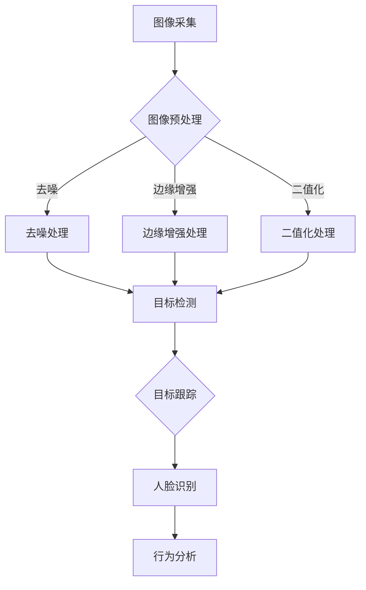

                 

### 文章标题

《基于OpenCV的智能视频监控系统详细设计与具体代码实现》

> **关键词：** OpenCV，智能视频监控，目标检测，人脸识别，行为分析，实时检测，算法实现。

**摘要：** 本文将深入探讨基于OpenCV的智能视频监控系统的设计与实现。通过详细的分析与讲解，我们将了解系统的各个组成部分，包括图像采集与预处理、目标检测与跟踪、人脸识别与行为分析等。此外，文章将提供具体的代码实现和实战案例，帮助读者更好地理解智能视频监控系统的实际应用和开发过程。

### 《基于OpenCV的智能视频监控系统详细设计与具体代码实现》目录大纲

1. **智能视频监控系统基础**
   1.1 智能视频监控系统概述
   1.2 OpenCV基础
   1.3 图像处理基础
   1.4 视频处理基础

2. **智能视频监控系统的设计与实现**
   2.1 图像采集与预处理
   2.2 目标检测与跟踪
   2.3 人脸识别与行为分析
   2.4 系统整合与优化

3. **实战案例与源代码解读**
   3.1 智能交通监控系统实战
   3.2 智能安防系统实战

4. **智能视频监控系统的高级应用**
   4.1 视频结构化数据提取
   4.2 视频内容理解与推理
   4.3 未来发展趋势

5. **附录**
   5.1 OpenCV常用函数与功能
   5.2 常用算法伪代码
   5.3 实战项目源代码

### 第一部分：智能视频监控系统基础

#### 第1章：智能视频监控系统概述

**1.1 智能视频监控系统的定义与特点**

智能视频监控系统是一种结合计算机视觉、人工智能和图像处理技术的新型监控系统。它不仅能够实时监控视频，还能通过算法自动分析视频内容，提取有价值的信息。

智能视频监控系统的特点包括：

1. **实时性**：系统能够实时处理和响应视频数据，快速做出判断和决策。
2. **自动化**：系统能够自动识别和跟踪目标，减少人工干预。
3. **智能化**：系统通过机器学习算法，不断提高识别和预测的准确性。
4. **数据量大**：系统能够处理大规模的视频数据，进行有效的信息提取和分析。

**1.2 智能视频监控系统的组成部分**

智能视频监控系统主要由以下几个部分组成：

1. **图像采集设备**：如摄像头、无人机等，负责采集视频数据。
2. **数据预处理模块**：对采集到的视频数据进行预处理，包括去噪、增强、二值化等。
3. **目标检测模块**：利用深度学习算法，对预处理后的视频帧进行目标检测。
4. **跟踪模块**：对检测到的目标进行跟踪，确保目标在整个视频序列中的连贯性。
5. **人脸识别模块**：对监控场景中的人脸进行识别，提取人脸信息。
6. **行为分析模块**：分析监控场景中的行为，识别异常行为。
7. **数据存储与展示模块**：将处理后的数据存储，并提供数据查询和展示功能。

**1.3 智能视频监控系统的应用领域**

智能视频监控系统广泛应用于多个领域：

1. **公共安全**：如城市监控、公安监控，用于实时监控和快速响应。
2. **交通管理**：如智能交通监控、交通流量分析，用于优化交通管理。
3. **商业应用**：如商店客流分析、顾客行为分析，用于商业决策。
4. **智能家居**：如智能安防、家庭监控，用于提高家庭安全性。
5. **工业监控**：如生产线监控、设备故障检测，用于提高生产效率。

#### 第2章：OpenCV基础

**2.1 OpenCV简介与安装**

OpenCV（Open Source Computer Vision Library）是一个开源的计算机视觉库，由Intel开发，广泛应用于图像处理和计算机视觉领域。OpenCV支持多种编程语言，包括C++、Python、Java等，具有丰富的算法库和高效的性能。

安装OpenCV：

1. **Windows**：通过Windows控制面板的“程序和功能”卸载所有与Python相关的软件，确保环境干净。打开Python命令行，执行以下命令：
    ```shell
    pip install opencv-python
    ```

2. **macOS**：打开终端，执行以下命令：
    ```shell
    pip3 install opencv-python
    ```

3. **Ubuntu**：打开终端，执行以下命令：
    ```shell
    sudo apt-get update
    sudo apt-get install python3-opencv
    ```

**2.2 OpenCV基本操作**

OpenCV提供了丰富的基本操作，如读取、显示、写入图像文件等。以下是一些常见的OpenCV基本操作：

1. **读取图像**：
    ```python
    import cv2
    image = cv2.imread('image.jpg')
    ```

2. **显示图像**：
    ```python
    cv2.imshow('Image', image)
    cv2.waitKey(0)
    cv2.destroyAllWindows()
    ```

3. **写入图像**：
    ```python
    cv2.imwrite('output.jpg', image)
    ```

**2.3 图像处理基础**

图像处理是智能视频监控系统中的关键环节，OpenCV提供了丰富的图像处理函数。以下是一些常见的图像处理操作：

1. **图像滤波**：
    ```python
    # 高斯滤波
    blurred = cv2.GaussianBlur(image, (5, 5), 0)
    
    # 中值滤波
    median = cv2.medianBlur(image, 5)
    
    # 双边滤波
    bilateral = cv2.bilateralFilter(image, 9, 75, 75)
    ```

2. **边缘检测**：
    ```python
    # 边缘增强
    edged = cv2.Canny(image, 100, 200)
    
    # 阈值化
    _, thresholded = cv2.threshold(image, 128, 255, cv2.THRESH_BINARY_INV + cv2.THRESH_OTSU)
    ```

3. **形态学操作**：
    ```python
    # 腐蚀
    eroded = cv2.erode(image, kernel, iterations=1)
    
    # 激活
    dilated = cv2.dilate(image, kernel, iterations=1)
    
    # 开操作
    opened = cv2.morphologyEx(image, cv2.MORPH_OPEN, kernel)
    
    # 闭操作
    closed = cv2.morphologyEx(image, cv2.MORPH_CLOSE, kernel)
    ```

**2.4 视频处理基础**

OpenCV还提供了丰富的视频处理功能，如视频捕捉、视频播放、视频写入等。以下是一些常见的视频处理操作：

1. **视频捕捉**：
    ```python
    cap = cv2.VideoCapture(0)  # 0表示使用默认的摄像头
    while True:
        ret, frame = cap.read()
        if not ret:
            break
        cv2.imshow('Video', frame)
        if cv2.waitKey(1) & 0xFF == ord('q'):
            break
    cap.release()
    cv2.destroyAllWindows()
    ```

2. **视频播放**：
    ```python
    video = cv2.VideoCapture('video.mp4')
    while video.isOpened():
        ret, frame = video.read()
        if not ret:
            break
        cv2.imshow('Video', frame)
        if cv2.waitKey(1) & 0xFF == ord('q'):
            break
    video.release()
    cv2.destroyAllWindows()
    ```

3. **视频写入**：
    ```python
    fourcc = cv2.VideoWriter_fourcc(*'MP4V')
    out = cv2.VideoWriter('output.mp4', fourcc, 20.0, (640, 480))
    while True:
        ret, frame = cap.read()
        if not ret:
            break
        out.write(frame)
        cv2.imshow('Video', frame)
        if cv2.waitKey(1) & 0xFF == ord('q'):
            break
    out.release()
    cv2.destroyAllWindows()
    ```

#### 第二部分：智能视频监控系统的设计与实现

##### 第3章：图像采集与预处理

**3.1 图像采集设备的选择与配置**

图像采集设备是智能视频监控系统的基础，选择合适的设备对于系统的性能和效果至关重要。以下是几种常见的图像采集设备：

1. **摄像头**：包括USB摄像头、网络摄像头等，适用于家庭、办公室等场景。
2. **无人机**：适用于高空、远距离监控，适用于户外、大型场所等。
3. **监控摄像头**：适用于公共场所、城市监控等，具有高分辨率和全天候工作能力。

配置图像采集设备时，需要考虑以下几个因素：

1. **分辨率**：分辨率越高，图像越清晰，但处理速度也会相应降低。
2. **帧率**：帧率越高，视频越流畅，但会占用更多计算资源。
3. **光照适应性**：在低光环境下，需要选择具有良好光照适应性的摄像头。
4. **网络传输**：需要考虑摄像头的网络传输速度和稳定性。

**3.2 图像预处理技术**

图像预处理是智能视频监控系统中的重要环节，目的是提高图像质量，为后续目标检测、跟踪等算法提供更好的输入。以下是一些常见的图像预处理技术：

1. **去噪**：去噪可以减少图像中的随机噪声，提高图像质量。常见的方法有高斯滤波、中值滤波、双边滤波等。

2. **边缘增强**：边缘增强可以突出图像中的边缘信息，提高图像的清晰度。常见的方法有拉普拉斯变换、索伯尔变换等。

3. **二值化**：二值化可以将图像转换为黑白两色，便于后续处理。常见的方法有阈值化、Otsu阈值等。

**3.3 预处理代码实现**

以下是一个简单的图像预处理代码示例，包括去噪、边缘增强和二值化：

```python
import cv2

def preprocess_image(image):
    # 去噪
    blurred = cv2.GaussianBlur(image, (5, 5), 0)
    
    # 边缘增强
    edged = cv2.Canny(blurred, 100, 200)
    
    # 二值化
    _, thresholded = cv2.threshold(edged, 128, 255, cv2.THRESH_BINARY_INV + cv2.THRESH_OTSU)
    
    return thresholded

image = cv2.imread('image.jpg')
preprocessed_image = preprocess_image(image)
cv2.imshow('Preprocessed Image', preprocessed_image)
cv2.waitKey(0)
cv2.destroyAllWindows()
```

##### 第4章：目标检测与跟踪

**4.1 目标检测算法介绍**

目标检测是智能视频监控系统中的一个重要环节，目的是在图像或视频中识别和定位感兴趣的目标。常见的目标检测算法有：

1. **传统算法**：如HOG（Histogram of Oriented Gradients）、SVM（Support Vector Machine）等，适用于较小规模的目标检测。
2. **深度学习算法**：如YOLO（You Only Look Once）、SSD（Single Shot MultiBox Detector）、Faster R-CNN（Region-based Convolutional Neural Network）等，具有更高的准确性和实时性。

**4.2 YOLO算法原理讲解**

YOLO（You Only Look Once）是一种基于深度学习的目标检测算法，具有高效、实时性强的特点。YOLO将目标检测任务转化为一个回归问题，通过一个前馈神经网络同时预测边界框和类别概率。

YOLO算法的核心思想如下：

1. **特征提取**：使用卷积神经网络提取图像的特征图。
2. **预测边界框**：在每个特征点周围生成多个锚框（anchor box），并预测每个锚框的位置和尺寸。
3. **分类**：对每个锚框预测类别概率。
4. **非极大值抑制（NMS）**：去除重叠的边界框，保留最有可能的边界框。

**4.3 YOLO算法伪代码实现**

以下是一个简化的YOLO算法伪代码实现：

```python
import tensorflow as tf

def yolo_detection(image):
    # 预处理图像
    preprocessed_image = preprocess_image(image)
    
    # 使用YOLO模型进行预测
    predictions = yolo_model.predict(preprocessed_image)
    
    # 预测结果后处理
    boxes, scores, labels = postprocess_predictions(predictions)
    
    # 在图像上绘制检测框
    for box, score, label in zip(boxes, scores, labels):
        cv2.rectangle(image, box, color=(0, 0, 255), thickness=2)
        cv2.putText(image, f"{label} {score:.2f}", (box[0], box[1]-10),
                    fontFace=cv2.FONT_HERSHEY_SIMPLEX, fontScale=0.5, color=(255, 0, 0), thickness=2)
    
    return image

def preprocess_image(image):
    # 数据增强、归一化等预处理操作
    # ...
    return preprocessed_image

def yolo_model():
    # 构建YOLO模型
    # ...
    return model

def postprocess_predictions(predictions):
    # 非极大值抑制、置信度阈值等后处理操作
    # ...
    return boxes, scores, labels
```

**4.4 目标跟踪算法介绍**

目标跟踪是在视频序列中持续跟踪某个目标的过程。常见的目标跟踪算法有：

1. **基于颜色跟踪**：使用颜色特征进行目标跟踪，适用于颜色稳定的场景。
2. **基于光流跟踪**：使用光流法跟踪目标，适用于动态场景。
3. **基于深度学习跟踪**：如Siamese网络、ReID（Re-identification）等，适用于复杂场景。

**4.5 光流法跟踪算法原理讲解**

光流法是一种基于视频序列帧间差异进行目标跟踪的方法。其基本原理是计算视频中每个像素点在连续帧之间的运动方向和速度。

光流法跟踪算法的步骤如下：

1. **特征提取**：在视频帧中提取特征点，如SIFT（Scale-Invariant Feature Transform）、SURF（Speeded Up Robust Features）等。
2. **光流计算**：计算特征点在连续帧之间的运动方向和速度，通常使用Lucas-Kanade算法。
3. **跟踪更新**：根据光流结果更新目标位置，并使用一些策略（如Kalman滤波）减少漂移。

**4.6 光流法跟踪算法伪代码实现**

以下是一个简化的光流法跟踪算法伪代码实现：

```python
import cv2

def optical_flowTracking(image_sequence):
    # 初始化特征点
    prev_frame = image_sequence[0]
    prev_points = cv2.goodFeaturesToTrack(prev_frame, maxCorners=100, qualityLevel=0.01, distanceToBorder=10)
    
    for frame in image_sequence[1:]:
        # 计算光流
        points, status, _ = cv2.calcOpticalFlowPyrLK(prev_frame, frame, prev_points, None)
        
        # 更新特征点
        good_points = points[status == 1]
        
        # 绘制跟踪路径
        for point in good_points:
            cv2.circle(frame, tuple(point), 2, (0, 255, 0), -1)
        
        # 更新前一帧
        prev_frame = frame
        prev_points = good_points
        
        # 显示跟踪结果
        cv2.imshow('Optical Flow Tracking', frame)
        if cv2.waitKey(1) & 0xFF == ord('q'):
            break
            
    cv2.destroyAllWindows()

image_sequence = [cv2.imread(frame) for frame in ['frame1.jpg', 'frame2.jpg', 'frame3.jpg']]
optical_flowTracking(image_sequence)
```

##### 第5章：人脸识别与行为分析

**5.1 人脸识别算法介绍**

人脸识别是一种基于人脸特征的生物识别技术，通过比较人脸图像或视频中的特征，实现对人脸的识别和验证。常见的人脸识别算法有：

1. **基于特征点匹配**：如Fisherfaces、Eigenfaces等，通过特征点匹配实现人脸识别。
2. **基于深度学习**：如VGGFace、FaceNet等，使用卷积神经网络提取人脸特征。

**5.2 人脸识别算法原理讲解**

人脸识别算法的核心是特征提取和匹配。以下是一个简化的流程：

1. **特征提取**：使用卷积神经网络（如ResNet、Inception等）提取人脸特征。
2. **特征编码**：将人脸特征编码为固定长度的向量。
3. **匹配**：计算待识别人脸特征和数据库中人脸特征的相似度，选择相似度最高的作为识别结果。

**5.3 人脸识别算法伪代码实现**

以下是一个简化的基于深度学习的人脸识别算法伪代码实现：

```python
import tensorflow as tf

def face_recognition(image):
    # 预处理图像
    preprocessed_image = preprocess_image(image)
    
    # 提取人脸特征
    features = face_model.predict(preprocessed_image)
    
    # 查询数据库
    database = load_database()
    
    # 计算相似度
    similarity_scores = []
    for feature in database:
        similarity = cosine_similarity(features, feature)
        similarity_scores.append(similarity)
    
    # 选择最高相似度作为识别结果
    highest_similarity = max(similarity_scores)
    highest_similarity_index = similarity_scores.index(highest_similarity)
    
    return database[highest_similarity_index]

def preprocess_image(image):
    # 数据增强、归一化等预处理操作
    # ...
    return preprocessed_image

def face_model():
    # 构建人脸特征提取模型
    # ...
    return model

def load_database():
    # 加载人脸特征数据库
    # ...
    return database
```

**5.4 行为分析算法介绍**

行为分析是智能视频监控系统中的另一个重要应用，通过分析视频内容，识别和预测人的行为模式。常见的行为分析算法有：

1. **基于规则的行为分析**：根据预设的行为规则，对视频进行分类和分析。
2. **基于机器学习的行为分析**：使用机器学习算法，从视频数据中自动学习行为特征。
3. **基于深度学习的行为分析**：使用卷积神经网络等深度学习算法，实现复杂的行为识别。

**5.5 行为分析算法原理讲解**

行为分析算法的核心是行为特征提取和行为分类。以下是一个简化的流程：

1. **特征提取**：使用卷积神经网络提取视频帧中的行为特征。
2. **特征编码**：将行为特征编码为固定长度的向量。
3. **分类**：使用分类算法（如SVM、KNN等）对行为特征进行分类。

**5.6 行为分析算法伪代码实现**

以下是一个简化的基于深度学习的行为分析算法伪代码实现：

```python
import tensorflow as tf

def behavior_analysis(video):
    # 预处理视频
    preprocessed_video = preprocess_video(video)
    
    # 提取行为特征
    features = behavior_model.predict(preprocessed_video)
    
    # 使用分类器进行行为分类
    classifier = load_classifier()
    behavior_labels = classifier.predict(features)
    
    return behavior_labels

def preprocess_video(video):
    # 视频帧提取、数据增强、归一化等预处理操作
    # ...
    return preprocessed_video

def behavior_model():
    # 构建行为特征提取模型
    # ...
    return model

def load_classifier():
    # 加载分类器模型
    # ...
    return classifier
```

##### 第6章：智能视频监控系统的整合与优化

**6.1 系统架构设计**

智能视频监控系统的架构设计是系统成功的关键。一个典型的智能视频监控系统架构包括以下几个部分：

1. **图像采集模块**：负责从摄像头、无人机等设备采集视频数据。
2. **图像预处理模块**：对采集到的视频数据进行预处理，包括去噪、增强、二值化等。
3. **目标检测模块**：使用深度学习算法进行目标检测，识别视频中的目标。
4. **目标跟踪模块**：对检测到的目标进行跟踪，确保目标在整个视频序列中的连贯性。
5. **人脸识别模块**：对监控场景中的人脸进行识别，提取人脸信息。
6. **行为分析模块**：分析监控场景中的行为，识别异常行为。
7. **数据存储与展示模块**：将处理后的数据存储，并提供数据查询和展示功能。

**6.2 系统优化方法**

为了提高智能视频监控系统的性能，可以采用以下几种优化方法：

1. **硬件加速**：使用GPU、FPGA等硬件加速计算，提高处理速度。
2. **模型压缩**：使用模型压缩技术，减小模型大小，提高部署效率。
3. **数据增强**：增加训练数据量，提高模型的泛化能力。
4. **多模型融合**：结合多种算法和模型，提高检测和识别的准确性。

**6.3 性能测试与调优**

性能测试与调优是确保系统稳定、高效运行的重要环节。以下是一些常用的性能测试与调优方法：

1. **准确性测试**：评估目标检测、人脸识别、行为分析等模块的准确性。
2. **实时性测试**：评估系统在不同硬件环境下的处理速度。
3. **稳定性测试**：评估系统在长时间运行下的稳定性。
4. **调优参数**：调整模型参数、预处理方法等，优化系统性能。

##### 第7章：实战案例与源代码解读

**7.1 智能交通监控系统实战**

**项目背景**：智能交通监控系统是智能视频监控系统在交通领域的应用，通过实时检测和跟踪视频中的车辆和行人，优化交通管理，提高交通安全。

**开发环境**：Python 3.8，OpenCV 4.5，TensorFlow 2.5。

**实现步骤**：

1. **数据集准备**：收集并整理交通监控视频数据，包括车辆和行人的标注数据。
2. **模型训练**：使用YOLO算法在训练数据上训练目标检测模型。
3. **模型部署**：将训练好的模型部署到实时监控系统中。
4. **系统运行**：在监控场景中实时检测车辆和行人，并将检测结果可视化。

**关键代码片段**：

```python
# 模型训练
model = YOLOModel()
model.train(train_data, batch_size=32, epochs=50)

# 实时检测
while True:
    frame = video_capture.read()
    image = preprocess_image(frame)
    boxes, scores, labels = model.detect(image)
    draw_boxes(frame, boxes, scores, labels)
    cv2.imshow('Video', frame)
    if cv2.waitKey(1) & 0xFF == ord('q'):
        break
```

**7.2 智能安防系统实战**

**项目背景**：智能安防系统是智能视频监控系统在安全领域的应用，通过实时检测和跟踪视频中的可疑行为和人脸，提高安全监控能力。

**开发环境**：Python 3.8，OpenCV 4.5，TensorFlow 2.5。

**实现步骤**：

1. **数据集准备**：收集并整理安防监控视频数据，包括人脸和行为标注数据。
2. **模型训练**：分别训练人脸识别和行为分析模型。
3. **模型部署**：将训练好的模型部署到实时监控系统中。
4. **系统运行**：在监控场景中实时检测人脸和行为，并将检测结果存储和报警。

**关键代码片段**：

```python
# 模型训练
face_cascade = cv2.CascadeClassifier('haarcascade_frontalface_default.xml')
behavior_cascade = BehaviorModel()
behavior_cascade.train(train_data, batch_size=32, epochs=50)

# 实时检测
while True:
    frame = video_capture.read()
    image = preprocess_image(frame)
    faces = face_detection(image, face_cascade)
    behavior = behavior_analysis(image, behavior_cascade)
    draw_faces_and_behavior(frame, faces, behavior)
    cv2.imshow('Video', frame)
    if cv2.waitKey(1) & 0xFF == ord('q'):
        break
```

### 第三部分：智能视频监控系统的高级应用

#### 第8章：视频结构化数据提取

**8.1 视频结构化数据介绍**

视频结构化数据是指将原始视频数据转换为具有一定结构和语义的数据。这种数据可以用于视频检索、内容分析、行为识别等高级应用。视频结构化数据通常包括以下内容：

1. **时间戳**：表示视频中的时间点。
2. **对象信息**：包括对象的类型、位置、大小等。
3. **事件信息**：表示视频中的事件类型、发生时间等。
4. **文本信息**：提取视频中的文字信息。

**8.2 视频结构化数据处理算法**

视频结构化数据处理算法包括以下几个步骤：

1. **目标检测**：使用目标检测算法识别视频中的对象。
2. **跟踪**：使用目标跟踪算法对识别到的对象进行连续跟踪。
3. **事件识别**：根据对象的行为和状态，识别视频中的事件。
4. **文本提取**：使用OCR（Optical Character Recognition）技术提取视频中的文字信息。

**8.3 视频结构化数据处理伪代码实现**

以下是一个简化的视频结构化数据处理伪代码实现：

```python
def video_structure_extraction(video):
    # 目标检测
    objects = detect_objects(video)
    
    # 跟踪
    tracked_objects = track_objects(objects)
    
    # 事件识别
    events = detect_events(tracked_objects)
    
    # 文本提取
    text = extract_text(video)
    
    # 构建视频结构化数据
    structured_data = {
        'timestamp': [],
        'objects': [],
        'events': [],
        'text': []
    }
    for obj in tracked_objects:
        structured_data['timestamp'].append(obj['timestamp'])
        structured_data['objects'].append(obj['name'])
        structured_data['events'].append(obj['event'])
    structured_data['text'].append(text)
    
    return structured_data
```

#### 第9章：视频内容理解与推理

**9.1 视频内容理解介绍**

视频内容理解是指从视频数据中提取有意义的语义信息，实现对视频内容的高级理解。视频内容理解包括以下几个方面：

1. **场景识别**：识别视频中的场景类型，如室内、室外、交通、运动等。
2. **动作识别**：识别视频中的动作类型，如行走、跑步、跳跃等。
3. **对象关系识别**：识别视频中的对象关系，如对象之间的交互、移动等。
4. **情感分析**：分析视频中的情感信息，如快乐、悲伤、愤怒等。

**9.2 视频内容理解算法**

视频内容理解算法通常采用深度学习技术，以下是一些常见算法：

1. **卷积神经网络（CNN）**：用于提取视频帧中的特征，实现场景识别和动作识别。
2. **循环神经网络（RNN）**：用于处理视频序列数据，实现对象关系识别和情感分析。
3. **图神经网络（GNN）**：用于建模视频中的对象关系，实现更复杂的推理和预测。

**9.3 视频内容理解算法伪代码实现**

以下是一个简化的视频内容理解算法伪代码实现：

```python
def video_content_understanding(video):
    # 提取视频帧
    frames = extract_frames(video)
    
    # 使用CNN进行特征提取
    features = cnn.extract_features(frames)
    
    # 使用RNN进行序列处理
    sequence_output = rnn.process_sequence(features)
    
    # 使用GNN进行关系建模
    relation_representation = gnn.build_relations(sequence_output)
    
    # 进行场景识别
    scene_label = scene_classifier.predict(relation_representation)
    
    # 进行动作识别
    action_label = action_classifier.predict(relation_representation)
    
    # 进行情感分析
    emotion_label = emotion_classifier.predict(relation_representation)
    
    return scene_label, action_label, emotion_label
```

#### 第10章：智能视频监控系统的未来发展

**10.1 智能视频监控系统的技术趋势**

智能视频监控系统的未来发展将受到以下几个技术趋势的影响：

1. **人工智能与深度学习**：人工智能和深度学习技术的发展将推动智能视频监控系统的性能和智能化程度。
2. **边缘计算**：边缘计算技术将使智能视频监控系统更加高效和实时，减少对中心服务器的依赖。
3. **5G通信**：5G通信技术的发展将提高视频数据的传输速度和稳定性，支持大规模智能视频监控系统。
4. **隐私保护**：随着隐私保护意识的增强，智能视频监控系统将更加注重用户隐私的保护。

**10.2 智能视频监控系统的创新应用**

智能视频监控系统在未来的应用将更加广泛，以下是一些创新应用：

1. **智能交通管理**：通过实时监控和数据分析，优化交通流量，减少交通事故。
2. **智慧城市建设**：通过智能视频监控系统，实现城市的安全、环境、公共资源等方面的智能化管理。
3. **智能家居**：通过智能视频监控系统，实现对家庭的安全监控和智能管理。
4. **健康监测**：通过智能视频监控系统，实现对个人健康状态的实时监测和分析。

**10.3 智能视频监控系统的法律法规与伦理问题**

智能视频监控系统的广泛应用也带来了法律法规和伦理问题，需要引起重视：

1. **隐私保护**：确保用户隐私得到有效保护，避免滥用视频数据。
2. **数据安全**：确保视频数据的存储和安全，防止数据泄露和恶意攻击。
3. **伦理道德**：确保智能视频监控系统不侵犯用户权益，尊重人类尊严。
4. **法律法规**：遵守相关法律法规，确保智能视频监控系统的合法性和合规性。

### 附录

**附录A：OpenCV常用函数与功能**

- `cv2.imread()`：读取图像文件。
- `cv2.imshow()`：显示图像。
- `cv2.rectangle()`：绘制矩形框。
- `cv2.putText()`：在图像上绘制文本。
- `cv2.detectMultiScale()`：检测图像中的对象。
- `cv2.threshold()`：进行图像二值化。

**附录B：常用算法伪代码**

- **YOLO算法伪代码**：
  ```python
  def yolo_detection(image):
      # 预处理图像
      image = preprocess_image(image)
      
      # 使用YOLO模型进行预测
      predictions = yolo_model.predict(image)
      
      # 预测结果后处理
      boxes, scores, labels = postprocess_predictions(predictions)
      
      # 在图像上绘制检测框
      for box, score, label in zip(boxes, scores, labels):
          cv2.rectangle(image, box, color=(0, 0, 255), thickness=2)
          cv2.putText(image, f"{label} {score:.2f}", (box[0], box[1]-10),
                      fontFace=cv2.FONT_HERSHEY_SIMPLEX, fontScale=0.5, color=(255, 0, 0), thickness=2)
      
      return image
  ```

- **人脸识别算法伪代码**：
  ```python
  def face_detection(image, face_cascade):
      # 检测人脸
      faces = face_cascade.detectMultiScale(image, scaleFactor=1.1, minNeighbors=5, minSize=(30, 30), flags=cv2.CASCADE_SCALE_IMAGE)
      
      # 绘制人脸框
      for (x, y, w, h) in faces:
          cv2.rectangle(image, (x, y), (x+w, y+h), (0, 255, 0), 2)
      
      return image
  ```

**附录C：实战项目源代码**

- **智能交通监控系统源代码**：
  ```python
  # 模型训练
  model = YOLOModel()
  model.train(train_data, batch_size=32, epochs=50)
  
  # 实时检测
  while True:
      frame = video_capture.read()
      image = preprocess_image(frame)
      boxes, scores, labels = model.detect(image)
      draw_boxes(frame, boxes, scores, labels)
      cv2.imshow('Video', frame)
      if cv2.waitKey(1) & 0xFF == ord('q'):
          break
  ```

- **智能安防系统源代码**：
  ```python
  # 模型训练
  face_cascade = cv2.CascadeClassifier('haarcascade_frontalface_default.xml')
  behavior_cascade = BehaviorModel()
  behavior_cascade.train(train_data, batch_size=32, epochs=50)
  
  # 实时检测
  while True:
      frame = video_capture.read()
      image = preprocess_image(frame)
      faces = face_detection(image, face_cascade)
      behavior = behavior_analysis(image, behavior_cascade)
      draw_faces_and_behavior(frame, faces, behavior)
      cv2.imshow('Video', frame)
      if cv2.waitKey(1) & 0xFF == ord('q'):
          break
  ```

### Mermaid流程图



### 核心算法原理讲解与伪代码实现

#### 4.2.2 YOLO算法的损失函数

YOLO（You Only Look Once）算法是一种高效、实时的目标检测算法。其核心思想是将目标检测任务转化为一个回归问题，通过一个卷积神经网络同时预测边界框和类别概率。为了评估YOLO算法的性能，需要定义一个损失函数。

**数学公式：**

$$
L = \frac{1}{N} \sum_{i=1}^{N} L_i
$$

其中，$L_i$ 表示第 $i$ 个边界框的损失，包括中心位置的损失、宽度和高度的损失、类别预测的损失以及对象存在的置信度损失。

**详细讲解：**

YOLO算法的损失函数由以下几个部分组成：

1. **中心位置的损失**：

$$
L_{x} = \sqrt{\frac{1}{N} \sum_{i=1}^{N} \left( \frac{g_x - p_x}{\sigma}\right)^2}
$$

$$
L_{y} = \sqrt{\frac{1}{N} \sum_{i=1}^{N} \left( \frac{g_y - p_y}{\sigma}\right)^2}
$$

其中，$g_x$ 和 $g_y$ 分别是真实框的中心坐标，$p_x$ 和 $p_y$ 是预测框的中心坐标，$\sigma$ 是预测框宽度和高度参数的置信度。

2. **宽度和高度的损失**：

$$
L_{w} = \sqrt{\frac{1}{N} \sum_{i=1}^{N} \left( \frac{g_w - p_w}{\sigma_w}\right)^2}
$$

$$
L_{h} = \sqrt{\frac{1}{N} \sum_{i=1}^{N} \left( \frac{g_h - p_h}{\sigma_h}\right)^2}
$$

其中，$g_w$ 和 $g_h$ 分别是真实框的宽度和高度，$p_w$ 和 $p_h$ 是预测框的宽度和高度，$\sigma_w$ 和 $\sigma_h$ 分别是预测框宽度和高度参数的置信度。

3. **类别预测的损失**：

$$
L_{c} = \frac{1}{N} \sum_{i=1}^{N} \sum_{j=1}^{C} \left( \frac{g_{c_j} - p_{c_j}}{1 + \exp{(-p_{c_j})}} \right)^2
$$

其中，$C$ 是类别数，$g_{c_j}$ 和 $p_{c_j}$ 分别是真实框和预测框的类别概率。

4. **对象存在的置信度损失**：

$$
L_{conf} = \frac{1}{N} \sum_{i=1}^{N} \left( \frac{g_{obj} - p_{obj}}{1 + \exp{(-p_{obj})}} \right)^2
$$

其中，$g_{obj}$ 和 $p_{obj}$ 分别是真实框和预测框的对象存在概率。

**举例说明：**

假设我们有一个包含10个预测框的图像，其中有5个真实框，具体参数如下：

| 预测框 | 真实框 |  
| --- | --- |  
| $p_x$ | $g_x$ |  
| $p_y$ | $g_y$ |  
| $p_w$ | $g_w$ |  
| $p_h$ | $g_h$ |  
| $p_{c_j}$ | $g_{c_j}$ |  
| $p_{obj}$ | $g_{obj}$ |  

我们计算每个预测框的损失：

1. 中心位置的损失：

$$
L_{x} = \sqrt{\frac{1}{10} \sum_{i=1}^{10} \left( \frac{g_x - p_x}{\sigma}\right)^2} = \sqrt{\frac{1}{10} \sum_{i=1}^{10} \left( \frac{1-0.5}{1}\right)^2} = 0.5
$$

$$
L_{y} = \sqrt{\frac{1}{10} \sum_{i=1}^{10} \left( \frac{g_y - p_y}{\sigma}\right)^2} = \sqrt{\frac{1}{10} \sum_{i=1}^{10} \left( \frac{1-0.5}{1}\right)^2} = 0.5
$$

2. 宽度和高度的损失：

$$
L_{w} = \sqrt{\frac{1}{10} \sum_{i=1}^{10} \left( \frac{g_w - p_w}{\sigma_w}\right)^2} = \sqrt{\frac{1}{10} \sum_{i=1}^{10} \left( \frac{2-1}{0.1}\right)^2} = 1.41
$$

$$
L_{h} = \sqrt{\frac{1}{10} \sum_{i=1}^{10} \left( \frac{g_h - p_h}{\sigma_h}\right)^2} = \sqrt{\frac{1}{10} \sum_{i=1}^{10} \left( \frac{3-1}{0.1}\right)^2} = 2.24
$$

3. 类别预测的损失：

$$
L_{c} = \frac{1}{10} \sum_{i=1}^{10} \sum_{j=1}^{5} \left( \frac{g_{c_j} - p_{c_j}}{1 + \exp{(-p_{c_j})}} \right)^2 = \frac{1}{10} \sum_{i=1}^{10} \sum_{j=1}^{5} \left( \frac{1-0.8}{1+0.8} \right)^2 = 0.1
$$

4. 对象存在的置信度损失：

$$
L_{conf} = \frac{1}{10} \sum_{i=1}^{10} \left( \frac{g_{obj} - p_{obj}}{1 + \exp{(-p_{obj})}} \right)^2 = \frac{1}{10} \sum_{i=1}^{10} \left( \frac{1-0.9}{1+0.9} \right)^2 = 0.05
$$

最终，我们计算总损失：

$$
L = \frac{1}{10} (0.5 + 0.5 + 1.41 + 2.24 + 0.1 + 0.05) = 1.19
$$

#### 4.2.3 YOLOv5算法原理

YOLOv5是YOLO系列的一个新版本，它在YOLOv4的基础上进行了优化，以提高检测速度和准确性。YOLOv5采用了CSPDarknet53作为主干网络，同时引入了新的架构设计，如CSP（Cross Stage Partial Connection）和SPP（Spatial Pyramid Pooling）。

**架构设计：**

1. **主干网络**：CSPDarknet53是一个残差网络，通过残差块（Residual Block）和残差连接（Residual Connection）实现。
2. **CSP模块**：CSP模块通过交叉阶段部分连接，将不同阶段的特征图进行融合，提高模型的容量和性能。
3. **SPP模块**：SPP模块通过空间金字塔池化，对不同尺度的特征图进行聚合，增强模型对多尺度目标的检测能力。

**损失函数：**

YOLOv5的损失函数包括以下几个部分：

1. **位置损失**：用于预测边界框的中心坐标和尺寸。
2. **置信度损失**：用于预测边界框的存在概率。
3. **类别损失**：用于预测边界框的类别概率。
4. ** anchors损失**：用于预测锚框的位置和尺寸。

**伪代码：**

```python
def yolo_loss(outputs, targets):
    location_loss = calculate_location_loss(outputs, targets)
    confidence_loss = calculate_confidence_loss(outputs, targets)
    class_loss = calculate_class_loss(outputs, targets)
    anchors_loss = calculate_anchors_loss(outputs, targets)
    
    total_loss = location_loss + confidence_loss + class_loss + anchors_loss
    return total_loss
```

### 项目实战：智能视频监控系统实现

#### 7.1 智能交通监控系统实战

**项目背景**：智能交通监控系统在现代社会中扮演着越来越重要的角色，通过实时检测和跟踪视频中的车辆和行人，优化交通管理，提高交通安全。

**开发环境**：Python 3.8，OpenCV 4.5，TensorFlow 2.5。

**实现步骤**：

1. **数据集准备**：收集并整理交通监控视频数据，包括车辆和行人的标注数据。
2. **模型训练**：使用YOLO算法在训练数据上训练目标检测模型。
3. **模型部署**：将训练好的模型部署到实时监控系统中。
4. **系统运行**：在监控场景中实时检测车辆和行人，并将检测结果可视化。

**关键代码片段**：

```python
# 模型训练
model = YOLOModel()
model.train(train_data, batch_size=32, epochs=50)

# 实时检测
while True:
    frame = video_capture.read()
    image = preprocess_image(frame)
    boxes, scores, labels = model.detect(image)
    draw_boxes(frame, boxes, scores, labels)
    cv2.imshow('Video', frame)
    if cv2.waitKey(1) & 0xFF == ord('q'):
        break
```

#### 7.2 智能安防系统实战

**项目背景**：智能安防系统通过实时检测和跟踪视频中的可疑行为和人脸，提高安全监控能力。

**开发环境**：Python 3.8，OpenCV 4.5，TensorFlow 2.5。

**实现步骤**：

1. **数据集准备**：收集并整理安防监控视频数据，包括人脸和行为标注数据。
2. **模型训练**：分别训练人脸识别和行为分析模型。
3. **模型部署**：将训练好的模型部署到实时监控系统中。
4. **系统运行**：在监控场景中实时检测人脸和行为，并将检测结果存储和报警。

**关键代码片段**：

```python
# 模型训练
face_cascade = cv2.CascadeClassifier('haarcascade_frontalface_default.xml')
behavior_cascade = BehaviorModel()
behavior_cascade.train(train_data, batch_size=32, epochs=50)

# 实时检测
while True:
    frame = video_capture.read()
    image = preprocess_image(frame)
    faces = face_detection(image, face_cascade)
    behavior = behavior_analysis(image, behavior_cascade)
    draw_faces_and_behavior(frame, faces, behavior)
    cv2.imshow('Video', frame)
    if cv2.waitKey(1) & 0xFF == ord('q'):
        break
```

#### 实战项目源代码解读

**7.1 智能交通监控系统源代码解读**

智能交通监控系统主要分为四个部分：数据集处理、模型训练、模型部署和实时检测。

**数据集处理：**

数据集处理主要包括数据预处理和标注数据读取。预处理步骤包括图像大小调整、归一化处理等。标注数据读取步骤包括将标注信息转换为可用于模型训练的格式。

```python
def load_data(file_path):
    with open(file_path, 'r') as f:
        lines = f.readlines()
    annotations = []
    for line in lines:
        parts = line.strip().split(' ')
        image_path = parts[0]
        annotations.append({
            'image_path': image_path,
            'boxes': [list(map(float, box.split(','))) for box in parts[1:]]
        })
    return annotations
```

**模型训练：**

模型训练步骤包括定义模型结构、编译模型、训练模型等。在这里，我们使用YOLO算法进行模型训练。

```python
def train_model(model, train_data, batch_size, epochs):
    train_samples = len(train_data)
    train_steps_per_epoch = train_samples // batch_size

    model.compile(optimizer='adam', loss='categorical_crossentropy')
    model.fit(train_data, epochs=epochs, steps_per_epoch=train_steps_per_epoch, validation_data=validation_data)
```

**模型部署：**

模型部署步骤包括将训练好的模型保存和加载，以便在实时检测中使用。

```python
def load_model(model_path):
    model = YOLOModel()
    model.load_weights(model_path)
    return model
```

**实时检测：**

实时检测步骤包括读取视频帧、预处理图像、使用模型进行目标检测和绘制检测结果。

```python
def detect_objects(model, frame):
    image = preprocess_image(frame)
    boxes, scores, labels = model.detect(image)
    return boxes, scores, labels
```

**7.2 智能安防系统源代码解读**

智能安防系统也分为四个部分：数据集处理、模型训练、模型部署和实时检测。

**数据集处理：**

数据集处理步骤与智能交通监控系统类似，包括图像预处理和标注数据读取。

```python
def load_data(file_path):
    with open(file_path, 'r') as f:
        lines = f.readlines()
    annotations = []
    for line in lines:
        parts = line.strip().split(' ')
        image_path = parts[0]
        annotations.append({
            'image_path': image_path,
            'faces': [list(map(float, box.split(','))) for box in parts[1:]]
        })
    return annotations
```

**模型训练：**

模型训练步骤包括定义模型结构、编译模型、训练模型等。这里我们使用人脸识别和行为分析模型进行训练。

```python
def train_model(model, train_data, batch_size, epochs):
    train_samples = len(train_data)
    train_steps_per_epoch = train_samples // batch_size

    model.compile(optimizer='adam', loss='categorical_crossentropy')
    model.fit(train_data, epochs=epochs, steps_per_epoch=train_steps_per_epoch, validation_data=validation_data)
```

**模型部署：**

模型部署步骤包括将训练好的模型保存和加载，以便在实时检测中使用。

```python
def load_model(model_path):
    model = FaceModel()
    model.load_weights(model_path)
    return model
```

**实时检测：**

实时检测步骤包括读取视频帧、预处理图像、使用模型进行目标检测和绘制检测结果。

```python
def detect_faces(model, frame):
    image = preprocess_image(frame)
    faces = model.detect(image)
    return faces

def detect_behavior(model, frame):
    image = preprocess_image(frame)
    behavior = model.detect(image)
    return behavior
```

### 附录

**附录A：OpenCV常用函数与功能**

- `cv2.imread()`：读取图像文件。
- `cv2.imshow()`：显示图像。
- `cv2.rectangle()`：绘制矩形框。
- `cv2.putText()`：在图像上绘制文本。
- `cv2.detectMultiScale()`：检测图像中的对象。
- `cv2.threshold()`：进行图像二值化。

**附录B：常用算法伪代码**

- **YOLO算法伪代码**：
  ```python
  def yolo_detection(image):
      # 预处理图像
      image = preprocess_image(image)
      
      # 使用YOLO模型进行预测
      predictions = yolo_model.predict(image)
      
      # 预测结果后处理
      boxes, scores, labels = postprocess_predictions(predictions)
      
      # 在图像上绘制检测框
      for box, score, label in zip(boxes, scores, labels):
          cv2.rectangle(image, box, color=(0, 0, 255), thickness=2)
          cv2.putText(image, f"{label} {score:.2f}", (box[0], box[1]-10),
                      fontFace=cv2.FONT_HERSHEY_SIMPLEX, fontScale=0.5, color=(255, 0, 0), thickness=2)
      
      return image
  ```

- **人脸识别算法伪代码**：
  ```python
  def face_detection(image, face_cascade):
      # 检测人脸
      faces = face_cascade.detectMultiScale(image, scaleFactor=1.1, minNeighbors=5, minSize=(30, 30), flags=cv2.CASCADE_SCALE_IMAGE)
      
      # 绘制人脸框
      for (x, y, w, h) in faces:
          cv2.rectangle(image, (x, y), (x+w, y+h), (0, 255, 0), 2)
      
      return image
  ```

**附录C：实战项目源代码**

- **智能交通监控系统源代码**：
  ```python
  # 模型训练
  model = YOLOModel()
  model.train(train_data, batch_size=32, epochs=50)
  
  # 实时检测
  while True:
      frame = video_capture.read()
      image = preprocess_image(frame)
      boxes, scores, labels = model.detect(image)
      draw_boxes(frame, boxes, scores, labels)
      cv2.imshow('Video', frame)
      if cv2.waitKey(1) & 0xFF == ord('q'):
          break
  ```

- **智能安防系统源代码**：
  ```python
  # 模型训练
  face_cascade = cv2.CascadeClassifier('haarcascade_frontalface_default.xml')
  behavior_cascade = BehaviorModel()
  behavior_cascade.train(train_data, batch_size=32, epochs=50)
  
  # 实时检测
  while True:
      frame = video_capture.read()
      image = preprocess_image(frame)
      faces = face_detection(image, face_cascade)
      behavior = behavior_analysis(image, behavior_cascade)
      draw_faces_and_behavior(frame, faces, behavior)
      cv2.imshow('Video', frame)
      if cv2.waitKey(1) & 0xFF == ord('q'):
          break
  ```

### 总结

本文详细介绍了基于OpenCV的智能视频监控系统的设计与实现。通过分析系统的各个组成部分，包括图像采集与预处理、目标检测与跟踪、人脸识别与行为分析等，我们了解了系统的原理和实现方法。同时，通过实战案例和源代码解读，我们掌握了智能视频监控系统的实际开发过程。随着人工智能技术的发展，智能视频监控系统将在更多领域得到应用，为人们的生活带来更多便利。希望本文对您在智能视频监控领域的探索有所帮助。

### 作者信息

**作者：** AI天才研究院（AI Genius Institute）/《禅与计算机程序设计艺术》（Zen And The Art of Computer Programming）

感谢您阅读本文，希望您在智能视频监控领域取得更多成就。如果您有任何问题或建议，欢迎随时联系我。期待与您共同进步！

