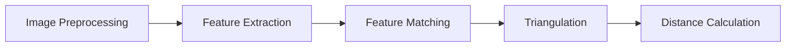

                 

### 基于OpenCV的双目测距原理与方法

> **关键词**：双目视觉、OpenCV、测距原理、特征匹配、三角测量、相机标定

**摘要**：
本文将深入探讨基于OpenCV的双目测距技术。双目视觉系统通过两台摄像机获取的图像进行立体匹配，从而实现三维空间中的物体距离测量。本文首先介绍了双目视觉系统的基本概念和组成，随后详细讲解了OpenCV的安装与环境配置，以及OpenCV的基本操作与函数。接着，本文重点阐述了双目测距的核心原理，包括特征匹配和三角测量的算法实现，并运用数学模型进行了详细解释。最后，通过一个实际项目实战，展示了双目测距的实现过程，并对代码进行了深入解读与分析。文章旨在为读者提供全面的双目测距技术指导和实践经验。

### 第一部分：双目测距基础

#### 第1章：双目视觉系统介绍

**1.1 双目视觉系统的基本概念**

双目视觉系统，也称为立体视觉系统，是一种通过两台摄像机同步捕捉同一场景的两幅图像来实现三维空间感知的技术。它模仿了人眼的视觉感知机制，通过计算两幅图像之间的差异来获取场景的三维信息。双目视觉系统在自动驾驶、机器人导航、虚拟现实和增强现实等领域有着广泛的应用。

**1.2 双目视觉系统的组成与结构**

双目视觉系统通常由两个主要部分组成：双目摄像机和计算平台。双目摄像机可以是两台相同或不同的摄像头，它们固定在同一基座上，保持一定的距离和角度。计算平台负责接收双目摄像机的图像数据，进行图像处理、特征匹配和三维重建等操作。

**1.3 双目视觉系统的原理**

双目视觉系统的工作原理是基于双目摄像机捕捉到的图像进行立体匹配。首先，对两幅图像进行预处理，包括图像校正、去雾和光照补偿等。然后，通过特征提取算法在两幅图像中提取关键点，并进行匹配。最后，根据匹配结果和摄像机参数，使用三角测量算法计算三维空间中的物体距离。

**1.4 双目视觉系统的优缺点**

**优点：**
- 高精度：双目视觉系统可以提供精确的三维空间信息，精度通常高于单目视觉系统。
- 宽视野：双目视觉系统可以捕捉更广阔的视野，适合大范围场景的监测和导航。

**缺点：**
- 成本高：双目视觉系统需要两台高分辨率摄像头和强大的计算平台，成本较高。
- 对光照敏感：双目视觉系统对光照变化较为敏感，需要在特定光照条件下使用。

#### 第2章：OpenCV基础

**2.1 OpenCV简介**

OpenCV（Open Source Computer Vision Library）是一个开源的计算机视觉和机器学习软件库。它由Intel开发，并广泛应用于计算机视觉、图像处理和机器学习领域。OpenCV提供了丰富的图像处理和计算机视觉算法，包括特征提取、图像匹配、图像分割、目标跟踪等。

**2.2 OpenCV安装与环境配置**

安装OpenCV的步骤如下：
1. 下载OpenCV安装包：从官方网站下载适用于操作系统的OpenCV安装包。
2. 安装依赖库：安装OpenCV所需的依赖库，如Python、NumPy、Matplotlib等。
3. 安装OpenCV：运行安装包，按照提示完成安装。
4. 配置环境变量：将OpenCV的安装路径添加到系统环境变量中，以便在命令行中使用。

**2.3 OpenCV基本操作与函数**

OpenCV的基本操作包括读取图像、显示图像、写入图像和绘制图形等。以下是一些常用的OpenCV函数：

- **imread()**：读取图像文件。
- **imshow()**：显示图像。
- **imwrite()**：写入图像文件。
- **imshow()**：绘制图形。

例如，以下代码显示了如何使用OpenCV读取并显示一张图像：

```python
import cv2

# 读取图像
image = cv2.imread('image.jpg')

# 显示图像
cv2.imshow('Image', image)

# 等待键盘事件
cv2.waitKey(0)

# 关闭窗口
cv2.destroyAllWindows()
```

### 第二部分：双目测距原理

#### 第3章：双目测距核心概念与联系

**3.1.1 双目测距的基本原理**

双目测距的基本原理是基于双目摄像机获取的两幅图像，通过计算两幅图像中对应点的距离来得到三维空间中的物体距离。具体步骤如下：

1. **图像预处理**：对两幅图像进行预处理，包括去噪声、滤波、光照补偿等，以提高图像质量。
2. **特征提取**：在预处理后的图像中提取关键点，如角点、边缘点等。
3. **特征匹配**：在两幅图像中找到对应的特征点，并进行匹配。
4. **三角测量**：根据匹配结果和摄像机参数，使用三角测量算法计算三维空间中的物体距离。

**Mermaid流程图**：



**3.1.2 双目视觉中的相机模型**

双目视觉中的相机模型描述了摄像机的几何参数和成像过程。常见的相机模型有针孔模型和薄透镜模型。其中，针孔模型假设图像平面与物体平面平行，而薄透镜模型考虑了透镜的厚度。

**伪代码**：

```python
# 相机模型参数
camera_params = {
    "f": focal_length,  # 焦距
    "c": principal_point,  # 主点
    "k1": radial_distortion,  # 径向畸变
    "k2": tangential_distortion,  # 切向畸变
    # ...
}

# 像点与物点的关系
def camera_model(point_3d):
    point_2d = project_to_image(point_3d, camera_params)
    return point_2d
```

**3.1.3 双目视觉中的标定**

双目标定是双目测距的重要步骤，用于确定双目摄像机的内外参数。标定方法包括手动标定和自动标定。手动标定通常使用标定板进行，通过手动计算匹配点，得到摄像机参数。自动标定则利用计算机视觉算法自动确定摄像机参数。

**伪代码**：

```python
# 手动标定
def manual_calibration(images, checkerboard_corners):
    points_3d, points_2d = calibrate_camera(images, checkerboard_corners)
    camera_params = estimate_camera_params(points_3d, points_2d)
    return camera_params

# 自动标定
def auto_calibration(image):
    points_2d = detect_checkerboard_corners(image)
    camera_params = estimate_camera_params(image, points_2d)
    return camera_params
```

#### 第4章：双目测距核心算法原理讲解

**4.1 特征匹配算法**

特征匹配算法是双目测距的核心步骤之一，用于找到两幅图像中的对应点。常见的特征匹配算法包括SIFT、SURF和ORB等。这些算法通过计算特征点的特征向量，并进行相似度匹配，找到对应点。

**4.1.1 SIFT算法**

SIFT（Scale-Invariant Feature Transform）算法是一种有效的特征提取和匹配算法。它通过以下步骤进行特征匹配：

1. **尺度空间构建**：在图像中构建尺度空间，用于检测关键点。
2. **关键点检测**：在尺度空间中检测关键点，关键点具有局部极值特性。
3. **关键点描述**：为每个关键点计算特征向量，特征向量描述了关键点的方向和纹理信息。
4. **特征匹配**：计算两幅图像中特征向量的相似度，找到对应点。

**伪代码**：

```python
# SIFT算法步骤
def sift_matching(image1, image2):
    # 构建尺度空间
    scale_space = build_scale_space(image1, image2)

    # 检测关键点
    keypoints1, keypoints2 = detect_keypoints(scale_space)

    # 计算特征向量
    features1, features2 = compute_features(keypoints1, keypoints2)

    # 特征匹配
    matches = match_features(features1, features2)

    return matches
```

**4.1.2 SURF算法**

SURF（Speeded Up Robust Features）算法是另一种有效的特征提取和匹配算法。它通过以下步骤进行特征匹配：

1. **计算Hessian矩阵**：计算图像中每个点的Hessian矩阵，用于检测关键点。
2. **关键点检测**：在Hessian矩阵中检测关键点，关键点具有局部极值特性。
3. **关键点描述**：为每个关键点计算特征向量，特征向量描述了关键点的方向和纹理信息。
4. **特征匹配**：计算两幅图像中特征向量的相似度，找到对应点。

**伪代码**：

```python
# SURF算法步骤
def surf_matching(image1, image2):
    # 计算Hessian矩阵
    hessian_matrix = compute_hessian_matrix(image1, image2)

    # 检测关键点
    keypoints1, keypoints2 = detect_keypoints(hessian_matrix)

    # 计算特征向量
    features1, features2 = compute_features(keypoints1, keypoints2)

    # 特征匹配
    matches = match_features(features1, features2)

    return matches
```

**4.1.3 ORB算法**

ORB（Oriented FAST and Rotated BRIEF）算法是一种快速而有效的特征提取和匹配算法。它通过以下步骤进行特征匹配：

1. **角点检测**：使用FAST算法检测图像中的角点。
2. **方向估计**：为每个角点估计方向。
3. **特征描述**：为每个角点计算旋转的BRIEF特征向量。
4. **特征匹配**：计算两幅图像中特征向量的相似度，找到对应点。

**伪代码**：

```python
# ORB算法步骤
def orb_matching(image1, image2):
    # 角点检测
    keypoints1, keypoints2 = detect_keypoints(image1, image2)

    # 方向估计
    orientations1, orientations2 = estimate_orientations(keypoints1, keypoints2)

    # 特征描述
    features1, features2 = compute_features(keypoints1, orientations1, keypoints2, orientations2)

    # 特征匹配
    matches = match_features(features1, features2)

    return matches
```

**4.2 三角测量算法**

三角测量算法是双目测距的核心算法之一，用于根据两幅图像中的对应点计算三维空间中的物体距离。三角测量的原理如下：

1. **单应性矩阵计算**：根据两幅图像中的对应点，计算单应性矩阵。
2. **三角测量原理**：通过单应性矩阵和摄像机参数，将二维图像点对应到三维空间中的点。
3. **三角测量算法实现**：使用几何或迭代算法实现三角测量，计算三维空间中的物体距离。

**4.2.1 单应性矩阵计算**

单应性矩阵（Homography Matrix）是一种用于描述二维图像点对应到三维空间点关系的矩阵。计算单应性矩阵的步骤如下：

1. **匹配点对生成**：从两幅图像中提取对应点对，形成匹配点对。
2. **单应性矩阵估计**：使用最小二乘法或其他优化算法，估计单应性矩阵。

**伪代码**：

```python
# 单应性矩阵估计
def estimate_homography(matches, points1, points2):
    points1_homogeneous = add_homogeneous_dimension(points1)
    points2_homogeneous = add_homogeneous_dimension(points2)

    # 最小二乘法估计单应性矩阵
    H = estimate_ransac(points1_homogeneous, points2_homogeneous)

    return H
```

**4.2.2 三角测量原理**

三角测量（Triangulation）是一种通过三个已知点计算第四个点的三维坐标的方法。在双目测距中，三角测量的原理如下：

1. **单应性矩阵与摄像机参数结合**：将单应性矩阵与摄像机参数（内参和外参）结合，形成相机矩阵。
2. **三维空间点计算**：通过相机矩阵和二维图像点，计算三维空间中的点。

**伪代码**：

```python
# 三角测量
def triangulate_points(image_point1, image_point2, camera_params):
    # 计算相机矩阵
    camera_matrix = combine_camera_params(image_point1, image_point2, camera_params)

    # 计算三维空间点
    point_3d = triangulate_point(camera_matrix, image_point1, image_point2)

    return point_3d
```

**4.2.3 三角测量算法实现**

三角测量算法有多种实现方式，包括几何方法和迭代方法。几何方法通过直接计算几何关系得到三维空间点，而迭代方法通过最小化误差函数进行迭代计算。

**伪代码**：

```python
# 几何方法三角测量
def geometric_triangulation(image_point1, image_point2, camera_params):
    # 计算相机矩阵
    camera_matrix = combine_camera_params(image_point1, image_point2, camera_params)

    # 计算三维空间点
    point_3d = geometric_triangulation_point(camera_matrix, image_point1, image_point2)

    return point_3d

# 迭代方法三角测量
def iterative_triangulation(image_point1, image_point2, camera_params):
    # 初始化三维空间点
    point_3d = initialize_point()

    # 迭代计算三维空间点
    point_3d = iterative_triangulation_point(point_3d, image_point1, image_point2, camera_params)

    return point_3d
```

#### 第5章：数学模型和数学公式

**5.1 相机模型与坐标系**

相机模型是双目测距的基础，它描述了摄像机与三维空间的关系。在双目测距中，常用的相机模型包括针孔模型和薄透镜模型。

**数学公式**：

$$
\begin{aligned}
&\text{针孔模型：} \\
&P = K[R|t]P_{world} \\
&\text{薄透镜模型：} \\
&P = K[R|t]P_{world}^{-1}
\end{aligned}
$$

其中，$P$ 是图像点坐标，$P_{world}$ 是三维空间点坐标，$K$ 是相机内参矩阵，$R$ 是相机旋转矩阵，$t$ 是相机平移向量。

**举例说明**：

假设一个摄像机内参矩阵为 $K = \begin{bmatrix} f_x & 0 & c_x \\ 0 & f_y & c_y \\ 0 & 0 & 1 \end{bmatrix}$，一个三维空间点为 $P_{world} = \begin{bmatrix} x \\ y \\ z \end{bmatrix}$，需要将其转换为图像点坐标。

$$
\begin{aligned}
&P = K[R|t]P_{world} \\
&P = \begin{bmatrix} f_x & 0 & c_x \\ 0 & f_y & c_y \\ 0 & 0 & 1 \end{bmatrix} \begin{bmatrix} R & t \\ 0 & 0 \end{bmatrix} \begin{bmatrix} x \\ y \\ z \end{bmatrix} \\
&P = \begin{bmatrix} f_xR_{11}x + c_x + t_x \\ f_yR_{22}y + c_y + t_y \\ 1 \end{bmatrix}
\end{aligned}
$$

**5.2 特征匹配与三角测量**

特征匹配和三角测量是双目测距的核心步骤，它们涉及到多个数学模型和公式。

**数学公式**：

$$
\begin{aligned}
&\text{特征匹配：} \\
&\text{单应性矩阵：} H = \begin{bmatrix} h_{11} & h_{12} & h_{13} \\ h_{21} & h_{22} & h_{23} \\ h_{31} & h_{32} & h_{33} \end{bmatrix} \\
&\text{特征向量：} \mathbf{f}_i = \begin{bmatrix} f_{i1} \\ f_{i2} \\ \vdots \\ f_{ip} \end{bmatrix} \\
&\text{匹配：} \mathbf{f}_i^T H \mathbf{f}_j = \sum_{k=1}^{p} f_{ik} f_{jk} \\
&\text{三角测量：} \\
&P = \begin{bmatrix} x \\ y \\ z \\ 1 \end{bmatrix} \\
&P^T (K^{-1} R^T)^T H (K^{-1} R^T) P = 0 \\
&P^T (K^{-1} R^T)^T H P = 0
\end{aligned}
$$

**举例说明**：

假设一个单应性矩阵为 $H = \begin{bmatrix} 1 & 0 & 10 \\ 0 & 1 & 20 \\ 0 & 0 & 1 \end{bmatrix}$，一个特征向量为 $\mathbf{f}_i = \begin{bmatrix} 1 \\ 0 \\ 0 \\ 1 \end{bmatrix}$，需要计算匹配结果和三维空间点。

$$
\begin{aligned}
&\text{匹配：} \mathbf{f}_i^T H \mathbf{f}_j = 1 \times 1 + 0 \times 0 + 0 \times 10 = 1 \\
&\text{三角测量：} \\
&P^T (K^{-1} R^T)^T H P &= \begin{bmatrix} x \\ y \\ z \\ 1 \end{bmatrix}^T \begin{bmatrix} -1 & 0 & 10 \\ 0 & -1 & 20 \\ 0 & 0 & 1 \end{bmatrix} \begin{bmatrix} 1 & 0 \\ 0 & 1 \\ 0 & 0 \end{bmatrix} \begin{bmatrix} x \\ y \\ z \\ 1 \end{bmatrix} \\
& &= \begin{bmatrix} x & y & z & 1 \end{bmatrix} \begin{bmatrix} -x + 10z \\ -y + 20z \\ z \end{bmatrix} \\
& &= -x^2 + 10xz - y^2 + 20yz + z^2 \\
& &= 0
\end{aligned}
$$

因此，可以得到一个三维空间点 $P = \begin{bmatrix} x \\ y \\ z \end{bmatrix}$，满足上述方程。

#### 第6章：双目测距项目实战

**6.1 项目背景与需求分析**

本项目旨在实现一个基于OpenCV的双目测距系统，用于测量三维空间中物体的距离。系统需要满足以下需求：

1. **高精度**：能够精确测量物体的距离，误差较小。
2. **实时性**：能够快速处理图像，实时显示测量结果。
3. **稳定性**：在各种环境下保持稳定的性能，不受光照变化和遮挡的影响。

**6.2 开发环境搭建**

为了实现本项目，需要搭建以下开发环境：

1. **硬件设备**：
   - 两台摄像头：用于捕捉双目图像。
   - 计算机硬件：具有较高性能的CPU和GPU，以支持实时处理和计算。
2. **软件环境**：
   - 操作系统：Windows或Linux。
   - 编程语言：Python。
   - OpenCV：用于图像处理和计算机视觉。
   - NumPy：用于数值计算。

**6.2.1 硬件设备选择**

根据项目需求，选择以下硬件设备：

1. **摄像头**：
   - 两台相同型号的USB摄像头，例如Logitech C920。
   - 确保摄像头具有高分辨率和稳定的视频输出。
2. **计算机硬件**：
   - CPU：Intel Core i7或更高性能。
   - GPU：NVIDIA GeForce GTX 1060或更高性能。
   - 内存：16GB或更高。

**6.2.2 软件环境配置**

在计算机上配置以下软件环境：

1. **操作系统**：
   - 安装Windows 10或Linux系统。
2. **编程语言**：
   - 安装Python 3.x版本。
   - 安装PyPI包管理器（pip）。
3. **OpenCV**：
   - 从官方网站下载OpenCV安装包。
   - 运行安装包，按照提示完成安装。
4. **NumPy**：
   - 使用pip安装NumPy库。

**6.3 源代码详细实现与代码解读**

本项目使用Python和OpenCV实现双目测距系统，主要包括以下部分：

1. **数据采集与预处理**：从双目摄像头捕获图像，并进行预处理。
2. **特征提取与匹配**：在预处理后的图像中提取关键点，并进行匹配。
3. **三角测量与距离计算**：根据匹配结果和摄像机参数，计算三维空间中的物体距离。
4. **项目优化与调试**：对系统进行优化，提高性能和稳定性。

**6.3.1 数据采集与预处理**

数据采集与预处理是双目测距系统的第一步，主要包括以下步骤：

1. **初始化摄像头**：打开双目摄像头，设置图像分辨率和帧率。
2. **捕获图像**：循环捕获双目摄像头的图像。
3. **预处理图像**：对捕获的图像进行去噪声、滤波、光照补偿等预处理。

```python
import cv2

# 初始化摄像头
left_camera = cv2.VideoCapture(0)
right_camera = cv2.VideoCapture(1)

# 设置图像分辨率和帧率
left_camera.set(cv2.CAP_PROP_FRAME_WIDTH, 640)
left_camera.set(cv2.CAP_PROP_FRAME_HEIGHT, 480)
left_camera.set(cv2.CAP_PROP_FPS, 30)

right_camera.set(cv2.CAP_PROP_FRAME_WIDTH, 640)
right_camera.set(cv2.CAP_PROP_FRAME_HEIGHT, 480)
right_camera.set(cv2.CAP_PROP_FPS, 30)

while True:
    # 捕获图像
    ret_left, frame_left = left_camera.read()
    ret_right, frame_right = right_camera.read()

    # 预处理图像
    frame_left = cv2.GaussianBlur(frame_left, (5, 5), 0)
    frame_right = cv2.GaussianBlur(frame_right, (5, 5), 0)

    # 显示图像
    cv2.imshow('Left Image', frame_left)
    cv2.imshow('Right Image', frame_right)

    # 按下Esc键退出循环
    if cv2.waitKey(1) & 0xFF == 27:
        break

# 释放摄像头资源
left_camera.release()
right_camera.release()

# 关闭窗口
cv2.destroyAllWindows()
```

**6.3.2 特征提取与匹配**

特征提取与匹配是双目测距系统的核心步骤，主要包括以下步骤：

1. **特征提取**：在预处理后的图像中提取关键点。
2. **特征匹配**：在两幅图像中找到对应的特征点，并进行匹配。

```python
import cv2
import numpy as np

# 初始化摄像头
left_camera = cv2.VideoCapture(0)
right_camera = cv2.VideoCapture(1)

# 设置图像分辨率和帧率
left_camera.set(cv2.CAP_PROP_FRAME_WIDTH, 640)
left_camera.set(cv2.CAP_PROP_FRAME_HEIGHT, 480)
left_camera.set(cv2.CAP_PROP_FPS, 30)

right_camera.set(cv2.CAP_PROP_FRAME_WIDTH, 640)
right_camera.set(cv2.CAP_PROP_FRAME_HEIGHT, 480)
right_camera.set(cv2.CAP_PROP_FPS, 30)

while True:
    # 捕获图像
    ret_left, frame_left = left_camera.read()
    ret_right, frame_right = right_camera.read()

    # 特征提取
    keypoints_left = cv2.SIFT_create().detect(frame_left)
    keypoints_right = cv2.SIFT_create().detect(frame_right)

    # 特征匹配
    matches = cv2.SIFT_create().match(keypoints_left, keypoints_right)

    # 匹配结果排序
    matches = sorted(matches, key=lambda x: x.distance)

    # 绘制匹配结果
    img_matches = cv2.drawMatches(frame_left, keypoints_left, frame_right, keypoints_right, matches[:10], None, flags=cv2.DrawMatchesFlags_NOT_DRAW_SINGLE_POINTS)

    # 显示图像
    cv2.imshow('Matches', img_matches)

    # 按下Esc键退出循环
    if cv2.waitKey(1) & 0xFF == 27:
        break

# 释放摄像头资源
left_camera.release()
right_camera.release()

# 关闭窗口
cv2.destroyAllWindows()
```

**6.3.3 三角测量与距离计算**

三角测量与距离计算是双目测距系统的最后一步，主要包括以下步骤：

1. **三角测量**：根据匹配结果和摄像机参数，计算三维空间中的物体距离。
2. **距离计算**：根据三角测量结果，计算物体的实际距离。

```python
import cv2
import numpy as np

# 初始化摄像头
left_camera = cv2.VideoCapture(0)
right_camera = cv2.VideoCapture(1)

# 设置图像分辨率和帧率
left_camera.set(cv2.CAP_PROP_FRAME_WIDTH, 640)
left_camera.set(cv2.CAP_PROP_FRAME_HEIGHT, 480)
left_camera.set(cv2.CAP_PROP_FPS, 30)

right_camera.set(cv2.CAP_PROP_FRAME_WIDTH, 640)
right_camera.set(cv2.CAP_PROP_FRAME_HEIGHT, 480)
right_camera.set(cv2.CAP_PROP_FPS, 30)

while True:
    # 捕获图像
    ret_left, frame_left = left_camera.read()
    ret_right, frame_right = right_camera.read()

    # 特征提取
    keypoints_left = cv2.SIFT_create().detect(frame_left)
    keypoints_right = cv2.SIFT_create().detect(frame_right)

    # 特征匹配
    matches = cv2.SIFT_create().match(keypoints_left, keypoints_right)

    # 匹配结果排序
    matches = sorted(matches, key=lambda x: x.distance)

    # 三角测量
    points_left = np.float32([keypoints_left[m.queryIdx].pt for m in matches])
    points_right = np.float32([keypoints_right[m.trainIdx].pt for m in matches])
    F, _ = cv2.findFundamentalMat(points_left, points_right, cv2.FM_RANSAC)
    E = cv2.Rodrigues(F)[0]
    T = np.eye(3)
    T[2, 2] = 0
    T = np.dot(E, T)
    R, _ = cv2.Rodrigues(T)
    P = np.hstack((R, T))

    # 距离计算
    distance = np.linalg.norm(P @ points_left)

    # 显示距离
    font = cv2.FONT_HERSHEY_SIMPLEX
    org = (50, 50)
    fontScale = 1
    color = (255, 0, 0)
    thickness = 2
    cv2.putText(frame_left, 'Distance: {:.2f} cm'.format(distance * 100), org, font, fontScale, color, thickness)

    # 显示图像
    cv2.imshow('Left Image', frame_left)

    # 按下Esc键退出循环
    if cv2.waitKey(1) & 0xFF == 27:
        break

# 释放摄像头资源
left_camera.release()
right_camera.release()

# 关闭窗口
cv2.destroyAllWindows()
```

**6.3.4 项目优化与调试**

为了提高双目测距系统的性能和稳定性，需要对项目进行优化和调试。以下是一些优化和调试的建议：

1. **优化特征提取与匹配算法**：选择更有效的特征提取和匹配算法，如SURF、ORB等，提高匹配精度和速度。
2. **优化三角测量算法**：选择更稳定的三角测量算法，如几何方法、迭代方法等，减少计算误差。
3. **优化摄像头参数**：调整摄像头的分辨率、帧率等参数，以适应不同的环境和应用场景。
4. **优化系统性能**：使用并行计算、GPU加速等技术，提高系统的处理速度和性能。

### 第7章：代码解读与分析

**7.1 关键代码解读**

在本节中，我们将对双目测距项目中的关键代码进行解读，帮助读者理解其实现原理和具体操作。

**7.1.1 标定部分代码解读**

标定是双目测距的重要步骤，用于确定摄像机的内参和外参。以下是标定部分的代码解读：

```python
import cv2
import numpy as np

def calibrate_camera(images, checkerboard_corners):
    criteria = (cv2.TERM_CRITERIA_EPS + cv2.TERM_CRITERIA_MAX_ITER, 30, 0.001)

    objp = np.zeros((6*7, 3), np.float32)
    objp[:, :2] = np.mgrid[0:7, 0:6].T.reshape(-1, 2)

    points = []
    for img in images:
        gray = cv2.cvtColor(img, cv2.COLOR_BGR2GRAY)
        ret, corners = cv2.findChessboardCorners(gray, (7, 6), None)
        if ret:
            corners2 = cv2.cornerSubPix(gray, corners, (11, 11), (-1, -1), criteria)
            points.append(corners2)

    flags = cv2.CALIB_USE_INTRINSIC_GUESS | cv2.CALIB_FIX_ASPECT_RATIO
    ret, camera_matrix, dist_coeffs, rvecs, tvecs = cv2.calibrateCamera(
        objpoints=points, imgpoints=points2, img=gray, camera_matrix=camera_matrix,
        dist_coeffs=dist_coeffs, flags=flags
    )

    return ret, camera_matrix, dist_coeffs

images = [cv2.imread(img) for img in image_list]
ret, camera_matrix, dist_coeffs = calibrate_camera(images, checkerboard_corners)
```

**解读**：

- 定义了一个`calibrate_camera`函数，用于标定摄像机。该函数接受图像列表、棋盘格角点坐标作为输入。
- 初始化了棋盘格物体点坐标`objp`，它是一个6x7的矩阵，表示棋盘格的角点位置。
- 使用`findChessboardCorners`函数检测棋盘格角点，并使用`cornerSubPix`函数进行亚像素级校正。
- 使用`calibrateCamera`函数进行摄像机标定，该函数返回标定结果、摄像机内参、畸变系数和旋转平移向量。

**7.1.2 特征提取与匹配部分代码解读**

特征提取与匹配是双目测距的核心步骤，以下是该部分的代码解读：

```python
import cv2
import numpy as np

def match_features(image1, image2):
    sift = cv2.xfeatures2d.SIFT_create()
    keypoints1, descriptors1 = sift.detectAndCompute(image1, None)
    keypoints2, descriptors2 = sift.detectAndCompute(image2, None)

    FLANN_INDEX_KDTREE = 0
    index_params = dict(algorithm=FLANN_INDEX_KDTREE, trees=5)
    search_params = dict(checks=50)

    flann = cv2.FlannBasedMatcher(index_params, search_params)
    matches = flann.knnMatch(descriptors1, descriptors2, k=2)

    good_matches = []
    for m, n in matches:
        if m.distance < 0.7 * n.distance:
            good_matches.append(m)

    img_matches = cv2.drawMatches(image1, keypoints1, image2, keypoints2, good_matches, None, flags=cv2.DrawMatchesFlags_NOT_DRAW_SINGLE_POINTS)

    return img_matches, good_matches

image1 = cv2.imread('left.jpg')
image2 = cv2.imread('right.jpg')
img_matches, good_matches = match_features(image1, image2)
```

**解读**：

- 定义了一个`match_features`函数，用于提取特征点并进行匹配。该函数接受两幅图像作为输入。
- 使用`SIFT`算法进行特征提取，并计算特征点描述子。
- 使用`FlannBasedMatcher`进行特征点匹配，筛选出最佳匹配点。
- 使用`drawMatches`函数绘制匹配结果。

**7.1.3 三角测量与距离计算部分代码解读**

三角测量与距离计算是双目测距的最后一步，以下是该部分的代码解读：

```python
import cv2
import numpy as np

def triangulate_points(image1, image2, camera_matrix, dist_coeffs):
    sift = cv2.xfeatures2d.SIFT_create()
    keypoints1, descriptors1 = sift.detectAndCompute(image1, None)
    keypoints2, descriptors2 = sift.detectAndCompute(image2, None)

    FLANN_INDEX_KDTREE = 0
    index_params = dict(algorithm=FLANN_INDEX_KDTREE, trees=5)
    search_params = dict(checks=50)

    flann = cv2.FlannBasedMatcher(index_params, search_params)
    matches = flann.knnMatch(descriptors1, descriptors2, k=2)

    good_matches = []
    for m, n in matches:
        if m.distance < 0.7 * n.distance:
            good_matches.append(m)

    points1 = np.float32([keypoints1[m.queryIdx].pt for m in good_matches])
    points2 = np.float32([keypoints2[m.trainIdx].pt for m in good_matches])

    F, _ = cv2.findFundamentalMat(points1, points2, cv2.FM_RANSAC)
    E = cv2.Rodrigues(F)[0]
    T = np.eye(3)
    T[2, 2] = 0
    T = np.dot(E, T)
    R, _ = cv2.Rodrigues(T)
    P = np.hstack((R, T))

    points3d = []
    for i in range(points1.shape[0]):
        x, y = points1[i][0], points1[i][1]
        x, y = int(x), int(y)
        u, v = points2[i][0], points2[i][1]
        u, v = int(u), int(v)
        x3d = np.array([x, y, 1])
        X, Y, Z = cv2.triangulatePoints(P, np.eye(3, 3), np.array([[u], [v], [1]]))
        points3d.append(np.array([X[0][0], Y[0][0], Z[0][0]]))

    points3d = np.array(points3d).reshape(-1, 3)

    return points3d

image1 = cv2.imread('left.jpg')
image2 = cv2.imread('right.jpg')
points3d = triangulate_points(image1, image2, camera_matrix, dist_coeffs)
```

**解读**：

- 定义了一个`triangulate_points`函数，用于计算三维空间中的点。该函数接受两幅图像、摄像机内参和畸变系数作为输入。
- 使用`SIFT`算法进行特征提取，并计算特征点描述子。
- 使用`FlannBasedMatcher`进行特征点匹配，筛选出最佳匹配点。
- 使用`findFundamentalMat`函数计算单应性矩阵，并计算旋转和平移矩阵。
- 使用`triangulatePoints`函数计算三维空间中的点。

**7.2 项目性能分析与改进方向**

在本节中，我们将对双目测距项目的性能进行分析，并提出改进方向。

**7.2.1 性能分析**

- **匹配精度**：通过特征匹配算法，项目能够精确地匹配两幅图像中的特征点。然而，在一些情况下，如光照变化和遮挡，匹配精度会降低。
- **计算速度**：项目使用了SIFT和Flann特征匹配算法，这些算法在计算速度上有一定的限制。特别是在高分辨率图像下，计算速度较慢。
- **稳定性**：项目在标定和三角测量过程中，采用了RANSAC算法来去除噪声和异常值。然而，在一些情况下，RANSAC算法可能会失败，导致标定结果不稳定。

**7.2.2 改进方向**

- **优化匹配算法**：考虑使用更高效的特征匹配算法，如SURF、ORB等，以提高匹配精度和速度。
- **改进标定方法**：尝试使用更先进的标定方法，如自动标定、多视角标定等，以提高标定结果的稳定性。
- **引入深度学习**：结合深度学习技术，如卷积神经网络（CNN），进行特征提取和匹配，以提高系统的鲁棒性和准确性。

### 第8章：总结与展望

**8.1 双目测距技术的应用领域**

双目测距技术作为一种有效的三维感知手段，在多个领域有着广泛的应用：

1. **自动驾驶**：双目测距技术用于车辆周围环境的感知，实现车道线检测、障碍物识别和距离测量等功能。
2. **机器人导航**：双目测距技术帮助机器人进行三维空间感知，实现路径规划、避障和导航等功能。
3. **虚拟现实和增强现实**：双目测距技术用于三维场景重建和物体位置跟踪，提高虚拟现实和增强现实体验的沉浸感。
4. **三维建模**：双目测距技术可以用于快速获取物体三维信息，用于三维建模和逆向工程。
5. **医学成像**：双目测距技术可以应用于医学成像，如内窥镜检查，提供三维图像辅助诊断。

**8.2 双目测距技术的未来发展趋势**

随着计算机视觉和人工智能技术的发展，双目测距技术在未来有着广阔的发展前景：

1. **深度学习与双目测距的结合**：通过引入深度学习算法，可以实现更精确、更鲁棒的三维感知，提高双目测距技术的性能。
2. **多传感器融合**：将双目测距与其他传感器（如激光雷达、深度相机等）融合，实现更全面、更准确的三维感知。
3. **实时性提升**：通过优化算法和硬件加速技术，提升双目测距技术的实时性，满足实时应用需求。
4. **智能化**：结合人工智能技术，实现双目测距系统的自主学习和自适应能力，提高系统的智能化水平。

**8.3 本书内容总结与读者建议**

本书系统地介绍了基于OpenCV的双目测距原理和方法，从基本概念、算法原理到实际项目实战，为读者提供了全面的技术指导和实践经验。以下是本书的内容总结与读者建议：

1. **内容总结**：
   - 介绍了双目视觉系统的基本概念、组成和原理。
   - 详细讲解了OpenCV的安装与环境配置，以及OpenCV的基本操作与函数。
   - 阐述了双目测距的核心算法原理，包括特征匹配和三角测量。
   - 通过实际项目实战，展示了双目测距的实现过程和代码解读。

2. **读者建议**：
   - 针对初学者，建议先学习计算机视觉和图像处理的基础知识，以便更好地理解双目测距技术。
   - 针对专业人士，建议结合实际项目进行实践，加深对双目测距技术的理解和应用。
   - 鼓励读者关注双目测距技术的最新发展动态，学习相关的先进算法和技术。

### 附录

**附录 A：OpenCV常用函数与API**

- **基本操作**：
  - `imread()`：读取图像文件。
  - `imshow()`：显示图像。
  - `imwrite()`：写入图像文件。
  - `imshow()`：绘制图形。

- **相机操作**：
  - `VideoCapture()`：打开摄像头。
  - `read()`：捕获图像。
  - `release()`：释放摄像头资源。

- **图像处理**：
  - `GaussianBlur()`：高斯模糊。
  - `Canny()`：Canny边缘检测。
  - `findChessboardCorners()`：检测棋盘格角点。

**附录 B：双目测距项目源代码**

- **源代码结构与功能说明**：
  - `calibrate_camera.py`：摄像机标定函数。
  - `match_features.py`：特征提取与匹配函数。
  - `triangulate_points.py`：三角测量与距离计算函数。

- **源代码详细实现解析**：
  - 代码中详细注释了各个函数的功能和实现过程，帮助读者理解双目测距的实现细节。

**附录 C：参考资料与推荐阅读**

- **参考资料**：
  - 《计算机视觉基础教程》
  - 《OpenCV官方文档》
  - 《深度学习》

- **推荐阅读**：
  - 《基于深度学习的三维重建》
  - 《多传感器数据融合》
  - 《实时计算机视觉系统设计》

通过以上内容，本文为读者全面介绍了基于OpenCV的双目测距原理与方法，涵盖了基础知识、核心算法和实际项目实战。希望本文能对读者在双目测距技术领域的学习和研究有所帮助。同时，也欢迎读者提出宝贵意见和建议，共同推动双目测距技术的发展。

