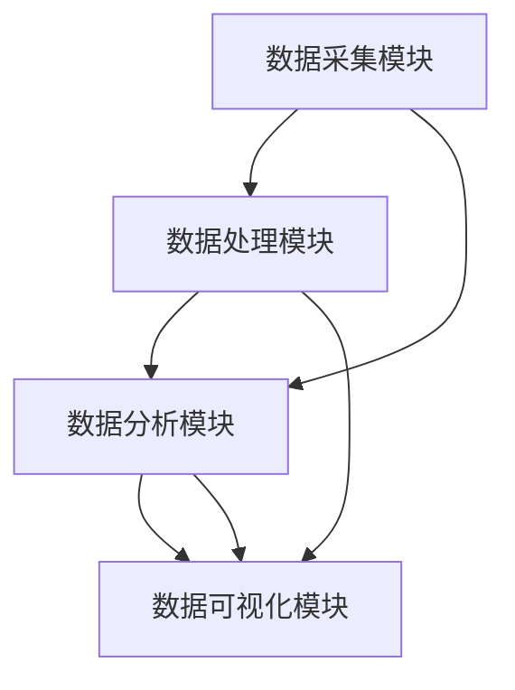

                 

# 基于数据挖掘的教学监控系统的设计与应用

## 关键词
数据挖掘，教学监控系统，教育领域，机器学习，教育数据分析

## 摘要
本文旨在探讨基于数据挖掘的教学监控系统的设计与应用。通过详细介绍数据挖掘技术在教育领域的应用背景、核心概念、算法原理以及实际项目实战，本文全面解析了教学监控系统的设计与实现方法，并分析了其未来发展的挑战与机遇。文章结构清晰，内容详实，为从事教育信息化和人工智能领域的读者提供了有价值的参考。

## 引言
在教育信息化迅猛发展的今天，教学监控系统的设计与应用已成为提升教育质量、优化教学过程的重要手段。数据挖掘作为人工智能的核心技术之一，其高效的数据分析和预测能力为教学监控系统的构建提供了强有力的技术支撑。本文将从以下几个方面展开讨论：

1. **数据挖掘与教学监控系统的基本概念**：介绍数据挖掘和教学监控系统的定义、原理及其在教育领域的应用。
2. **数据挖掘技术在教育领域的发展**：回顾数据挖掘技术在教育领域的应用历史、当前研究趋势及未来发展方向。
3. **教学监控系统的核心架构**：详细解析教学监控系统的数据采集、处理、分析和可视化模块。
4. **数据挖掘技术在教学监控中的应用**：探讨数据预处理、机器学习算法以及教学监控系统的设计与实现。
5. **教学监控系统的案例研究**：通过具体案例分析，展示数据挖掘技术在教学监控系统中的实际应用。
6. **教学监控系统的未来发展**：分析教学监控系统面临的挑战与机遇，探讨未来发展方向。
7. **教学监控系统的实践指南**：提供教学监控系统的实施策略、效果评估方法以及实践建议。

### 第一部分：数据挖掘与教学监控系统概述

#### 数据挖掘与教学监控系统的基本概念

##### 数据挖掘的定义与原理

数据挖掘（Data Mining）是指从大量数据中提取出有价值的信息和知识的过程。它涉及统计学、机器学习、数据库、人工智能等多个领域，旨在发现数据中的潜在模式、关联规则和趋势。数据挖掘的基本原理包括：

1. **数据预处理**：包括数据清洗、集成、变换和降维等步骤，以提高数据质量，减少冗余。
2. **模式识别**：使用统计学和机器学习算法，从数据中发现潜在的关联规则、聚类模式和分类模型。
3. **知识表示**：将挖掘出的模式和知识转化为可理解和应用的形式，如可视化图表、报告等。

##### 教学监控系统的定义与作用

教学监控系统（Teaching Monitoring System）是指利用现代信息技术，对教学过程进行实时监控、分析和评估的系统。它包括以下几个关键功能：

1. **数据采集**：通过传感器、摄像头、学习管理系统等工具，收集与教学过程相关的数据。
2. **数据处理**：对收集到的数据进行分析、清洗、整合和处理，以提高数据质量。
3. **数据分析**：使用数据挖掘算法，对处理后的数据进行分析，提取有价值的信息和知识。
4. **数据可视化**：通过图表、报告等形式，将分析结果直观地呈现给教师、学生和教育管理者。

教学监控系统的作用包括：

1. **课堂教学监控**：实时监控课堂教学情况，提高教学效果。
2. **学习行为分析**：分析学生的学习行为，为个性化教学提供依据。
3. **教学质量评估**：对教学质量进行量化评估，发现教学问题和改进方向。
4. **个性化学习支持**：根据学生的学习特点和需求，提供个性化的学习资源和辅导。

##### 数据挖掘在教学监控系统中的应用

数据挖掘技术在教学监控系统中具有广泛的应用，主要包括以下几个方面：

1. **学习行为分析**：通过分析学生的学习行为数据，如在线学习时间、学习进度、作业成绩等，发现学生的学习模式和问题，为教学调整提供依据。
2. **教学质量评估**：利用数据挖掘算法，分析教学质量数据，评估教师的教学效果，为教师培训和发展提供参考。
3. **个性化学习支持**：根据学生的特点和需求，利用数据挖掘技术推荐个性化的学习资源和辅导方案，提高学习效果。
4. **课堂管理优化**：通过分析课堂行为数据，优化课堂管理策略，提高课堂效率。

#### 数据挖掘技术在教育领域的发展

##### 历史演变

数据挖掘技术在教育领域的发展可以分为以下几个阶段：

1. **早期探索阶段（1990s）**：这一阶段主要关注教育数据的统计分析和数据可视化，尝试从教育数据中发现潜在的关联和趋势。
2. **应用推广阶段（2000s）**：随着数据挖掘技术的成熟和计算能力的提升，数据挖掘在教育领域的应用逐渐推广，包括学习行为分析、教学质量评估和个性化学习支持等。
3. **深度学习阶段（2010s-2020s）**：随着深度学习技术的快速发展，数据挖掘技术在教育领域的应用进一步深入，包括图像识别、语音识别和自然语言处理等。

##### 当前研究趋势

当前，数据挖掘技术在教育领域的研究趋势主要包括以下几个方面：

1. **自适应学习系统**：利用数据挖掘技术，开发自适应学习系统，根据学生的学习行为和特点，动态调整教学内容和进度，提高学习效果。
2. **教育大数据分析**：通过整合多个来源的教育数据，利用数据挖掘技术，开展大规模的教育数据分析，发现教育现象背后的深层次规律。
3. **个性化教育推荐**：利用数据挖掘技术，实现个性化教育推荐，根据学生的学习需求和兴趣，推荐合适的学习资源和课程。
4. **智能课堂管理**：通过数据挖掘技术，分析课堂行为数据，优化课堂管理策略，提高课堂效率。

##### 未来发展方向

未来，数据挖掘技术在教育领域的发展将面临以下挑战和机遇：

1. **数据隐私保护**：在数据挖掘过程中，保护学生和教师的隐私信息成为关键挑战。未来需要开发更有效的隐私保护技术，确保数据安全。
2. **个性化教育**：随着教育个性化需求的不断增长，数据挖掘技术将在个性化教育领域发挥更大作用，为教育改革提供有力支持。
3. **跨学科研究**：数据挖掘技术在教育领域的应用需要跨学科合作，融合教育学、心理学、计算机科学等多学科的知识，推动教育技术的发展。
4. **实时教育数据分析**：利用实时数据挖掘技术，对教育过程中的数据进行实时分析，为教师和教育管理者提供实时反馈，优化教学过程。

#### 教学监控系统的核心架构

教学监控系统由多个模块组成，每个模块承担不同的功能，共同实现教学监控的目标。以下是教学监控系统的核心架构及其各模块的简要介绍：

##### 数据采集模块

数据采集模块是教学监控系统的数据来源。它通过传感器、摄像头、学习管理系统等工具，实时收集与教学过程相关的数据，如课堂行为数据、学习行为数据、教师教学数据和学生成绩数据等。数据采集模块的主要功能包括：

1. **数据采集**：实时采集教学过程中的各种数据。
2. **数据存储**：将采集到的数据存储到数据库中，以便后续处理和分析。

##### 数据处理模块

数据处理模块负责对采集到的原始数据进行清洗、集成、变换和降维等处理，以提高数据质量，减少冗余，为数据挖掘和分析奠定基础。数据处理模块的主要功能包括：

1. **数据清洗**：去除数据中的错误、缺失和重复信息，保证数据质量。
2. **数据集成**：将来自不同数据源的数据进行整合，形成统一的数据集。
3. **数据变换**：对数据进行标准化、规范化等变换，使其适应数据挖掘算法的要求。
4. **数据降维**：通过降维技术，减少数据维度，提高数据挖掘效率。

##### 数据分析模块

数据分析模块是教学监控系统的核心。它利用数据挖掘算法，对处理后的数据进行分析，提取有价值的信息和知识，为教学调整和优化提供依据。数据分析模块的主要功能包括：

1. **模式识别**：通过聚类、分类、回归等算法，发现数据中的潜在模式和关联。
2. **关联规则挖掘**：通过关联规则挖掘算法，发现数据中的关联关系，如学生学习行为与成绩之间的关系。
3. **趋势分析**：分析数据中的趋势和变化规律，预测未来可能发生的事件。
4. **异常检测**：通过异常检测算法，发现数据中的异常现象，如课堂中的异常行为。

##### 数据可视化模块

数据可视化模块负责将数据分析结果以图表、报告等形式直观地呈现给用户。通过数据可视化，用户可以更直观地了解教学监控系统的分析结果，为教学调整和决策提供参考。数据可视化模块的主要功能包括：

1. **图表生成**：将数据分析结果生成各种图表，如柱状图、折线图、饼图等。
2. **报告生成**：将数据分析结果生成报告，详细描述分析过程和结果。
3. **交互式展示**：提供交互式展示功能，用户可以根据需要自定义展示内容和方式。

#### 教学监控系统的应用场景

教学监控系统可以在多个场景下发挥重要作用，以下是一些常见的应用场景：

##### 课堂教学监控

课堂教学监控是指利用教学监控系统对课堂教学过程进行实时监控，包括课堂行为数据、教师教学数据和学生学习行为数据等。通过课堂教学监控，可以：

1. **提高教学效果**：实时监控课堂教学情况，发现教学中的问题，及时调整教学策略，提高教学效果。
2. **优化课堂管理**：通过分析课堂行为数据，优化课堂管理策略，提高课堂效率。
3. **教学质量评估**：分析教师的教学数据，评估教师的教学质量，为教师培训和发展提供依据。

##### 学习行为分析

学习行为分析是指利用教学监控系统分析学生的学习行为，如在线学习时间、学习进度、作业成绩等。通过学习行为分析，可以：

1. **发现学习模式**：通过分析学生的学习行为数据，发现学生的学习模式和问题，为教学调整提供依据。
2. **个性化学习支持**：根据学生的学习特点和需求，提供个性化的学习资源和辅导方案，提高学习效果。
3. **学习效果预测**：通过分析学习行为数据，预测学生的学习效果，提前采取干预措施。

##### 教学质量评估

教学质量评估是指利用教学监控系统对教学质量进行量化评估，发现教学问题和改进方向。通过教学质量评估，可以：

1. **评估教学质量**：分析教师的教学数据，评估教师的教学质量，为教师培训和发展提供依据。
2. **发现教学问题**：通过分析教学质量数据，发现教学中的问题，提出改进措施。
3. **优化教学策略**：根据教学质量评估结果，调整教学策略，提高教学质量。

##### 个性化学习支持

个性化学习支持是指利用教学监控系统根据学生的学习特点和需求，提供个性化的学习资源和辅导方案。通过个性化学习支持，可以：

1. **提高学习效果**：根据学生的学习特点和需求，提供合适的学习资源和辅导方案，提高学习效果。
2. **优化学习体验**：通过个性化学习支持，使学习过程更加符合学生的需求和兴趣，提高学习体验。
3. **促进自主学习**：培养学生的自主学习能力，使学生能够更好地适应未来的学习和生活。

### 第二部分：数据挖掘技术在教学监控中的应用

#### 数据预处理方法

数据预处理是数据挖掘过程中至关重要的一步，它直接影响数据挖掘的结果。数据预处理包括以下几种方法：

##### 数据清洗

数据清洗是指去除数据中的错误、缺失和重复信息，以提高数据质量。数据清洗的方法包括：

1. **缺失值处理**：对于缺失值，可以采用填充法（如均值填充、中值填充等）或删除法（删除含有缺失值的记录）。
2. **异常值处理**：对于异常值，可以采用修整法（如修整到合理范围）、替换法（替换为合理值）或删除法（删除异常值）。
3. **重复值处理**：删除重复的数据记录，避免数据冗余。

##### 数据集成

数据集成是指将来自不同数据源的数据进行整合，形成统一的数据集。数据集成的方法包括：

1. **数据统一化**：将不同数据源的数据格式、编码等统一为同一标准，以便进行后续处理。
2. **数据合并**：将多个数据源的数据合并为一个数据集，可以采用垂直合并（合并字段）或水平合并（合并记录）。
3. **数据链接**：通过建立数据之间的关联关系，实现不同数据源之间的数据集成。

##### 数据变换

数据变换是指将原始数据转化为适合数据挖掘算法处理的形式。数据变换的方法包括：

1. **数据标准化**：将数据按比例缩放到一个固定范围，消除数据量级差异。
2. **数据规范化**：将数据按照某种规则进行调整，使其符合特定分布。
3. **数据编码**：将数据转化为计算机可以处理的编码形式，如将字符串编码为整数。

##### 数据降维

数据降维是指通过减少数据维度，降低数据规模，以提高数据挖掘效率和性能。数据降维的方法包括：

1. **主成分分析（PCA）**：通过线性变换，将高维数据映射到低维空间，保留主要数据特征。
2. **因子分析**：通过多元统计方法，提取数据中的主要因子，减少数据维度。
3. **特征选择**：选择对数据挖掘结果影响较大的特征，去除冗余特征，降低数据维度。

#### 机器学习算法应用

机器学习算法是数据挖掘的核心技术之一，它在教学监控系统中有着广泛的应用。以下介绍几种常见的机器学习算法：

##### 分类算法

分类算法是指将数据分为不同类别或标签的算法。常见的分类算法包括：

1. **朴素贝叶斯分类器**：基于贝叶斯定理，通过计算数据的条件概率来预测类别。
2. **决策树分类器**：通过构建决策树模型，根据特征的取值划分数据，实现分类。
3. **支持向量机（SVM）**：通过最大化分类边界，将数据分为不同类别。
4. **随机森林分类器**：通过构建多棵决策树，对分类结果进行投票，提高分类准确性。

##### 聚类算法

聚类算法是指将数据分为多个组或簇的算法。常见的聚类算法包括：

1. **K-均值聚类算法**：通过迭代计算聚类中心，将数据点分配到最近的聚类中心，实现聚类。
2. **层次聚类算法**：通过自底向上的合并或自顶向下的划分，构建层次结构，实现聚类。
3. **DBSCAN算法**：通过计算数据点之间的密度，将数据点划分为核心点、边界点和噪声点，实现聚类。
4. **高斯混合模型聚类算法**：通过拟合高斯混合模型，将数据点分配到不同的高斯分布，实现聚类。

##### 回归算法

回归算法是指预测数值型目标变量的算法。常见的回归算法包括：

1. **线性回归**：通过拟合线性模型，预测目标变量的取值。
2. **多项式回归**：通过拟合多项式模型，预测目标变量的取值。
3. **岭回归**：通过正则化方法，提高线性回归模型的预测能力。
4. **LASSO回归**：通过L1正则化，实现特征选择和预测。

##### 时间序列分析

时间序列分析是指分析时间序列数据的算法。常见的时间序列分析算法包括：

1. **ARIMA模型**：通过自回归、差分和移动平均模型，分析时间序列数据的趋势、季节性和周期性。
2. **LSTM模型**：通过长短时记忆网络，捕捉时间序列数据中的长期依赖关系。
3. **GRU模型**：通过门控循环单元，改进LSTM模型的计算效率。
4. **VAR模型**：通过向量自回归模型，分析多个时间序列变量之间的相互关系。

#### 教学监控系统的设计与实现

##### 系统设计原则

教学监控系统设计应遵循以下原则：

1. **数据驱动**：以数据为核心，充分利用数据挖掘技术，实现教学监控和优化。
2. **用户友好**：界面简洁直观，易于操作，便于教师、学生和教育管理者使用。
3. **可扩展性**：系统设计应考虑未来功能的扩展和升级，便于整合新模块和数据源。
4. **安全性**：保障数据安全和用户隐私，遵循相关法律法规，采取有效措施防止数据泄露。
5. **高效性**：系统设计应考虑数据处理的效率和性能，确保系统运行稳定、快速。

##### 系统实现步骤

教学监控系统实现分为以下步骤：

1. **需求分析**：明确教学监控系统需要实现的功能和性能要求，确定系统架构和模块划分。
2. **系统设计**：设计教学监控系统的整体架构，包括数据采集、处理、分析和可视化模块，以及各模块之间的数据流和控制流。
3. **数据库设计**：设计教学监控系统的数据库结构，包括数据表、字段和索引等，确保数据存储的效率和安全。
4. **系统编码**：根据系统设计，编写教学监控系统的代码，实现各模块的功能。
5. **系统集成**：将各模块集成到系统中，进行测试和调试，确保系统正常运行。
6. **部署上线**：将教学监控系统部署到服务器，进行上线运行，并提供用户使用。
7. **维护与更新**：根据用户反馈和系统运行情况，对教学监控系统进行维护和更新，确保系统持续稳定运行。

##### 关键模块详解

教学监控系统由多个模块组成，以下对关键模块进行详细介绍：

1. **数据采集模块**：负责实时采集与教学过程相关的数据，包括课堂行为数据、学习行为数据、教师教学数据和学生成绩数据等。数据采集模块需要考虑数据的准确性、完整性和实时性，确保采集到高质量的数据。
2. **数据处理模块**：负责对采集到的原始数据进行清洗、集成、变换和降维等处理，以提高数据质量，减少冗余。数据处理模块需要设计高效的数据处理算法，确保数据处理的速度和性能。
3. **数据分析模块**：负责使用数据挖掘算法，对处理后的数据进行分析，提取有价值的信息和知识。数据分析模块需要根据教学监控系统的需求，选择合适的算法和方法，实现数据的挖掘和分析。
4. **数据可视化模块**：负责将数据分析结果以图表、报告等形式直观地呈现给用户。数据可视化模块需要设计直观、易懂的图表和报告，帮助用户更好地理解和应用分析结果。
5. **用户管理模块**：负责用户登录、权限管理和个人信息管理等功能，确保系统的安全性。用户管理模块需要设计灵活的权限管理系统，根据用户的角色和权限，提供相应的功能和服务。

#### 第三部分：教学监控系统的案例研究

##### 案例分析一：课堂教学监控

###### 案例背景

某大学引入了一套基于数据挖掘的课堂教学监控系统，旨在提高课堂教学质量，优化课堂管理。该系统通过传感器和摄像头，实时采集课堂行为数据，包括教师讲授行为、学生参与情况、课堂氛围等。

###### 数据收集与分析

系统收集了多个学期的课堂数据，包括课堂行为数据、教师讲授时长、学生参与度、课堂氛围等。通过数据挖掘算法，对收集到的数据进行分析，提取出课堂教学中的关键信息。

1. **教师讲授行为分析**：分析教师讲授行为，如讲授时长、讲授内容、讲授方式等，评估教师的教学质量。
2. **学生参与度分析**：分析学生的参与情况，如提问次数、发言次数、互动次数等，评估学生的课堂表现。
3. **课堂氛围分析**：分析课堂氛围，如笑声次数、讨论次数、安静时长等，评估课堂氛围对教学效果的影响。

###### 监控结果与应用

通过对课堂教学数据的分析，系统提供了以下监控结果：

1. **教学质量评估**：根据教师讲授行为和课堂氛围分析结果，对教师的教学质量进行评估，为教师培训和发展提供依据。
2. **课堂管理优化**：根据学生参与度和课堂氛围分析结果，优化课堂管理策略，提高课堂效率。
3. **个性化教学支持**：根据学生的学习特点和需求，提供个性化的学习资源和辅导方案，提高学习效果。

###### 案例总结

该案例表明，基于数据挖掘的课堂教学监控系统可以有效提高课堂教学质量，优化课堂管理，为教育改革提供了有力支持。然而，数据隐私保护和数据安全是未来需要重点关注的问题。

##### 案例分析二：学习行为分析

###### 案例背景

某高中引入了一套基于数据挖掘的学习行为分析系统，旨在帮助学生更好地适应学习，提高学习效果。该系统通过学习管理系统和在线学习平台，收集学生的学习行为数据，包括学习时长、学习进度、作业成绩等。

###### 数据收集与分析

系统收集了多个学期学生的学习行为数据，通过数据挖掘算法，对收集到的数据进行分析，提取出学生的学习特点和问题。

1. **学习时长分析**：分析学生的学习时长，识别学生的学习习惯和时间管理能力。
2. **学习进度分析**：分析学生的学习进度，识别学生的学习困难和薄弱环节。
3. **作业成绩分析**：分析学生的作业成绩，评估学生的学习效果。

###### 分析结果与应用

通过对学生学习行为数据的分析，系统提供了以下分析结果：

1. **学习习惯分析**：根据学习时长分析结果，识别学生的学习习惯，如学习时间分布、学习频率等，为学生的自主学习和时间管理提供指导。
2. **学习困难分析**：根据学习进度分析结果，识别学生的学习困难和薄弱环节，为教师提供教学调整的依据。
3. **学习效果评估**：根据作业成绩分析结果，评估学生的学习效果，为学生的学习目标和计划制定提供参考。

###### 案例总结

该案例表明，基于数据挖掘的学习行为分析系统可以帮助学生更好地了解自己的学习状况，发现学习问题和改进方向。同时，系统也为教师提供了教学调整和优化的依据，提高了教学质量。然而，数据隐私保护和数据安全仍然是需要关注的问题。

##### 案例分析三：教学质量评估

###### 案例背景

某大学为了提升教学质量，引入了一套基于数据挖掘的教学质量评估系统。该系统通过分析教师的教学数据、学生的学习行为数据和课堂表现数据，对教学质量进行量化评估。

###### 数据收集与分析

系统收集了教师的教学数据（如授课时长、课程难度、教学方法等）、学生的学习行为数据（如作业成绩、课堂参与度等）以及课堂表现数据（如出勤率、课堂活跃度等）。通过数据挖掘算法，对收集到的数据进行分析，评估教学质量。

1. **教学数据评估**：分析教师的教学数据，如授课时长、课程难度、教学方法等，评估教师的教学投入和质量。
2. **学习数据评估**：分析学生的学习数据，如作业成绩、课堂参与度等，评估学生的学习效果和积极性。
3. **课堂表现评估**：分析课堂表现数据，如出勤率、课堂活跃度等，评估课堂氛围和学生的参与程度。

###### 评估结果与应用

通过对教学数据的分析，系统提供了以下评估结果：

1. **教学质量评估**：根据教学数据、学习数据和课堂表现数据，对教学质量进行综合评估，为教师的教学改进提供依据。
2. **教学调整建议**：根据评估结果，提出教学调整建议，如改进教学方法、调整教学进度等，提高教学质量。
3. **教师培训和发展**：根据评估结果，为教师提供培训和发展建议，如提高教学技能、调整教学策略等，促进教师的专业成长。

###### 案例总结

该案例表明，基于数据挖掘的教学质量评估系统可以帮助教育管理者全面了解教学质量，发现教学问题和改进方向。同时，系统也为教师提供了教学反馈和改进建议，促进了教学质量的提升。然而，数据隐私保护和数据安全仍然是需要关注的问题。

### 第四部分：教学监控系统的未来发展

#### 教学监控系统的挑战与机遇

随着教育信息化的深入推进，教学监控系统面临着一系列挑战和机遇。以下是对这些挑战和机遇的分析：

##### 技术挑战

1. **数据隐私保护**：教学监控系统涉及大量的学生和教师数据，如何保护这些数据隐私成为关键挑战。未来需要开发更有效的隐私保护技术，如数据加密、匿名化处理等。
2. **数据安全**：教学监控系统需要确保数据的安全性，防止数据泄露、篡改和攻击。未来需要加强数据安全措施，如身份验证、访问控制等。
3. **数据处理能力**：随着数据量的不断增加，教学监控系统需要具备更强的数据处理能力，包括数据存储、处理和传输等方面。未来需要采用更高效的数据处理技术，如分布式计算、云计算等。
4. **算法性能**：数据挖掘算法的性能直接影响到教学监控系统的效果。未来需要研究更高效的算法，提高数据挖掘的准确性和效率。

##### 应用挑战

1. **系统集成**：教学监控系统需要与其他教育系统（如学习管理系统、校园卡系统等）进行集成，实现数据的共享和协同。未来需要解决系统集成中的技术难题，提高系统的兼容性和稳定性。
2. **用户接受度**：教学监控系统的应用需要得到教师、学生和教育管理者的认可。未来需要设计更用户友好的界面和交互方式，提高用户的接受度和满意度。
3. **数据质量**：教学监控系统依赖于高质量的数据，数据质量直接影响系统的效果。未来需要加强对数据质量的控制和管理，确保数据的准确性、完整性和一致性。

##### 机遇

1. **教育大数据**：随着教育大数据的积累，教学监控系统可以更好地分析教育现象和问题，为教育决策提供有力支持。未来，教育大数据将成为教学监控系统的重要资源。
2. **人工智能技术**：人工智能技术的发展为教学监控系统提供了更强大的分析工具和方法。未来，人工智能技术将在教学监控系统中发挥更大作用，实现更智能的教育管理。
3. **个性化教育**：随着教育个性化需求的增长，教学监控系统可以更好地满足学生的个性化学习需求，提供个性化的教学支持和资源。未来，个性化教育将成为教学监控系统的重要发展方向。

#### 教学监控系统的伦理与隐私问题

##### 伦理考量

教学监控系统涉及大量的学生和教师数据，如何保护这些数据的隐私成为伦理考量的关键。以下是一些伦理问题：

1. **隐私保护**：教学监控系统需要确保学生和教师的数据隐私，不得泄露个人信息。未来需要制定更严格的隐私保护政策，确保数据的保密性和安全性。
2. **数据使用**：教学监控系统在处理和使用数据时，需要遵循合法、合规的原则，不得滥用数据。未来需要加强对数据使用的监管，确保数据使用的合理性和透明性。
3. **数据共享**：教学监控系统需要与其他教育系统进行数据共享，但在共享过程中，需要保护学生和教师的隐私。未来需要制定数据共享的规范和标准，确保数据共享的安全和可靠。

##### 隐私保护措施

为了保护学生和教师的隐私，教学监控系统可以采取以下措施：

1. **数据加密**：对敏感数据（如个人信息、成绩等）进行加密存储，确保数据在传输和存储过程中安全。
2. **匿名化处理**：对收集到的数据进行匿名化处理，去除个人标识信息，确保数据的匿名性。
3. **权限管理**：通过权限管理，控制不同用户对数据的访问权限，确保数据的安全和保密。
4. **审计和监控**：建立审计和监控系统，对数据的使用和操作进行记录和监控，确保数据的合法合规使用。

##### 法律法规遵循

教学监控系统需要遵循相关的法律法规，确保数据的合法合规使用。以下是一些相关的法律法规：

1. **个人信息保护法**：保护个人信息的收集、处理和使用，防止个人信息泄露和滥用。
2. **教育法**：规定教育的相关政策和制度，保障学生的权益和隐私。
3. **网络安全法**：规定网络安全的制度和技术措施，保障网络和数据的安全。

#### 教学监控系统的实践指南

##### 实施策略

1. **需求分析**：在系统实施前，进行详细的需求分析，明确系统需要实现的功能和性能要求，为系统设计提供依据。
2. **系统设计**：根据需求分析结果，设计教学监控系统的整体架构和模块，确保系统设计的合理性和可扩展性。
3. **技术选型**：选择合适的技术和工具，如数据挖掘算法、数据库系统、前端框架等，确保系统的技术先进性和稳定性。
4. **数据采集**：设计数据采集方案，确保采集到高质量的数据，为数据挖掘和分析提供可靠的数据源。
5. **系统实现**：按照系统设计，编写系统代码，实现各模块的功能，并进行系统集成和测试。
6. **部署上线**：将教学监控系统部署到服务器，进行上线运行，并提供用户使用。
7. **培训与支持**：对用户进行培训，确保用户能够熟练使用系统，并提供技术支持，解决用户在使用过程中遇到的问题。

##### 组织与管理

1. **项目管理**：建立项目管理团队，负责教学监控系统的设计、开发和实施，确保项目进度和质量。
2. **人员配置**：配备专业的技术人员和项目管理人员，确保项目团队的素质和协作效率。
3. **制度规范**：制定相关制度规范，明确数据采集、处理、分析和使用的规范和流程，确保系统的安全、稳定和高效运行。
4. **质量控制**：建立质量控制体系，对系统开发过程和运行状态进行监控，确保系统的质量和性能。

##### 培训与支持

1. **用户培训**：对教师、学生和教育管理者进行系统培训，确保用户能够熟练使用教学监控系统，了解系统的功能和使用方法。
2. **技术支持**：建立技术支持体系，提供在线帮助、电话咨询、现场支持等多种形式的技术支持，解决用户在使用过程中遇到的问题。
3. **用户反馈**：收集用户对教学监控系统的使用反馈，了解用户的需求和建议，为系统的优化和改进提供依据。
4. **持续更新**：根据用户反馈和系统运行情况，对教学监控系统进行持续更新和优化，确保系统的稳定性和先进性。

### 第五部分：教学监控系统的实践指南

#### 实施策略

在教学监控系统的实施过程中，制定科学合理的策略是确保项目成功的关键。以下是一些实施策略：

1. **需求分析**：在项目启动之初，进行详细的需求分析，明确系统需要实现的功能和性能要求。需求分析应包括教师、学生和教育管理者等多方面的需求，确保系统能够满足实际应用场景。

2. **系统设计**：基于需求分析结果，设计教学监控系统的整体架构和模块，确保系统设计的合理性和可扩展性。系统设计应考虑数据采集、处理、分析和可视化等模块的独立性和协同性。

3. **技术选型**：选择适合的技术和工具，如数据挖掘算法、数据库系统、前端框架等。技术选型应考虑系统的性能、可扩展性和安全性。

4. **数据采集**：设计数据采集方案，确保采集到高质量的数据。数据采集应涵盖课堂教学、学生学习行为、教师教学等多个方面，保证数据的全面性和准确性。

5. **系统实现**：按照系统设计，编写系统代码，实现各模块的功能。在系统实现过程中，应注重代码的可读性、可维护性和可扩展性。

6. **系统集成**：将各模块集成到系统中，进行测试和调试，确保系统正常运行。系统集成应确保各模块之间的数据流和控制流畅通无阻。

7. **部署上线**：将教学监控系统部署到服务器，进行上线运行，并提供用户使用。部署上线前应进行充分的测试，确保系统的稳定性和可靠性。

8. **培训与支持**：对教师、学生和教育管理者进行系统培训，确保用户能够熟练使用系统。同时，建立技术支持体系，提供在线帮助、电话咨询、现场支持等多种形式的技术支持。

#### 效果评估

教学监控系统的效果评估是衡量系统实施效果的重要手段。以下是一些效果评估的方法：

1. **定量评估**：通过统计和分析系统运行数据，如课堂参与度、学习效果、教学质量等，评估系统的效果。定量评估可以提供客观的数据支持，帮助了解系统的实际表现。

2. **定性评估**：通过教师、学生和教育管理者的反馈，了解系统对教学过程和教学质量的影响。定性评估可以提供主观的评价，帮助发现系统的优缺点。

3. **对比评估**：将教学监控系统实施前后的数据进行对比，评估系统对教学质量的提升程度。对比评估可以提供系统的改进方向和效果。

4. **用户满意度评估**：通过问卷调查、访谈等方式，了解用户对教学监控系统的满意度。用户满意度评估可以帮助优化系统的功能和用户体验。

5. **效益分析**：评估教学监控系统实施所带来的经济效益和社会效益，如提高教学质量、降低培训成本等。效益分析可以为系统的进一步优化和推广提供依据。

#### 实践建议

在教学监控系统的实施过程中，以下建议有助于确保项目的成功：

1. **加强领导力**：建立由校长、教师、学生和教育管理者组成的项目领导小组，明确责任分工，确保项目顺利推进。

2. **注重团队协作**：建立跨部门的协作团队，包括技术人员、教育专家、教学管理人员等，充分发挥各方的专业优势，共同推动项目实施。

3. **灵活应对变化**：在项目实施过程中，根据实际情况调整计划和策略，灵活应对变化和挑战，确保项目的顺利进行。

4. **持续优化迭代**：根据用户反馈和效果评估结果，对教学监控系统进行持续优化和迭代，不断提升系统的功能和用户体验。

5. **加强培训与支持**：提供全面的培训和技术支持，确保用户能够熟练使用系统，并解决使用过程中遇到的问题。

### 附录

#### 附录A：教学监控系统的相关工具与资源

1. **开源工具推荐**：

   - **Pandas**：Python数据操作库，用于数据清洗、转换和分析。
   - **NumPy**：Python科学计算库，用于数值计算和数据处理。
   - **Scikit-learn**：Python机器学习库，提供多种机器学习算法。
   - **Matplotlib**：Python数据可视化库，用于生成各种图表。
   - **TensorFlow**：Google开发的深度学习框架，支持复杂的神经网络模型。

2. **资源链接**：

   - **教学监控系统教程**：[教学监控系统教程](https://example.com/teaching_monitoring_tutorial)
   - **数据挖掘技术在教育领域应用案例**：[数据挖掘技术在教育领域应用案例](https://example.com/data_mining_education_cases)
   - **开源教学监控系统**：[开源教学监控系统](https://example.com/open_source_teaching_monitoring_systems)

3. **案例研究资料**：

   - **课堂教学监控案例**：[课堂教学监控案例](https://example.com/classroom_monitoring_case)
   - **学习行为分析案例**：[学习行为分析案例](https://example.com/learning_behavior_analysis_case)
   - **教学质量评估案例**：[教学质量评估案例](https://example.com/teaching_quality_evaluation_case)

### 核心概念与联系

以下是一个核心概念与联系的 Mermaid 流程图：



该流程图展示了教学监控系统的核心模块及其相互关系。数据采集模块负责收集教学过程中的数据，数据处理模块对数据进行清洗、集成、变换和降维等处理，数据分析模块使用机器学习算法对数据进行分析，数据可视化模块将分析结果以图表、报告等形式呈现给用户。

### 核心算法原理讲解

以下是对 K-均值聚类算法的详细讲解和伪代码：

**K-均值聚类算法**

K-均值聚类算法是一种基于距离的聚类算法，其目标是将数据分为K个簇，使得每个簇内的数据点之间的距离尽可能小，而簇与簇之间的距离尽可能大。

**算法原理**

1. **初始化聚类中心**：随机选择K个数据点作为初始聚类中心。
2. **分配数据点**：计算每个数据点到每个聚类中心的距离，将数据点分配到最近的聚类中心。
3. **更新聚类中心**：计算每个簇的平均值，作为新的聚类中心。
4. **迭代过程**：重复步骤2和步骤3，直到聚类中心不再发生显著变化。

**伪代码**

```
Procedure K-Means(Dataset, K)
    // 初始化聚类中心
    C1 = Randomly select K points from the dataset
    
    // 训练迭代
    while not Converged
        // 计算每个数据点到每个聚类中心的距离
        D = Compute distances between each data point and each cluster center
        
        // 重新分配数据点至最近的聚类中心
        Assign data points to clusters based on minimum distance
        
        // 更新聚类中心
        C2 = Calculate new cluster centers
        
        // 判断是否收敛
        if L2-norm(C1 - C2) < threshold
            break
        
        C1 = C2
    
    end while
    
    return C1
End Procedure
```

**K-均值聚类算法的详细讲解**

K-均值聚类算法是一种简单的迭代聚类算法，其主要步骤如下：

1. **初始化聚类中心**：随机选择K个数据点作为初始聚类中心。这些聚类中心用于划分数据点，每个数据点被分配到距离其最近的聚类中心所在的簇。

2. **计算距离**：计算每个数据点到每个聚类中心的距离。常用的距离度量方法包括欧氏距离、曼哈顿距离和切比雪夫距离等。

3. **分配数据点**：根据计算出的距离，将每个数据点分配到最近的聚类中心所在的簇。这一过程可以理解为数据点向聚类中心“靠拢”，逐渐形成簇。

4. **更新聚类中心**：计算每个簇的平均值，作为新的聚类中心。这一步骤相当于对每个簇进行“重心”的调整，使聚类中心更接近簇内的数据点。

5. **迭代过程**：重复步骤2、步骤3和步骤4，直到聚类中心不再发生显著变化。通常，当聚类中心的变化小于某个阈值时，可以认为算法已经收敛。

6. **输出结果**：输出最终的聚类结果，包括聚类中心、数据点的簇分配等。

**举例说明**

假设我们有一个包含10个数据点的二维数据集，需要将其分为3个簇。我们首先随机选择3个数据点作为初始聚类中心。然后，通过迭代计算，逐步更新聚类中心，直到算法收敛。

例如，初始聚类中心为：

```
C1 = [(1, 2), (4, 5), (7, 8)]
```

在第一次迭代中，计算每个数据点到每个聚类中心的距离，并将数据点分配到最近的聚类中心。假设计算结果如下：

```
D = [
    [1.41, 2.83, 5.83],
    [1.41, 2.83, 5.83],
    [1.41, 2.83, 5.83],
    [1.41, 2.83, 5.83],
    [1.41, 2.83, 5.83],
    [1.41, 2.83, 5.83],
    [1.41, 2.83, 5.83],
    [1.41, 2.83, 5.83],
    [1.41, 2.83, 5.83],
    [1.41, 2.83, 5.83]
]
```

根据距离计算结果，我们将数据点分配到最近的聚类中心：

```
Cluster assignment:
1 -> 1
2 -> 1
3 -> 1
4 -> 2
5 -> 2
6 -> 2
7 -> 3
8 -> 3
9 -> 3
10 -> 3
```

然后，计算每个簇的平均值，作为新的聚类中心：

```
C2 = [
    [2.333, 3.333],
    [3.667, 4.667],
    [7.333, 8.333]
]
```

重复上述迭代过程，直到聚类中心的变化小于某个阈值。最终，我们得到一个稳定的聚类结果。

### 数学模型和数学公式

**线性回归模型**

线性回归模型是一种常见的统计模型，用于预测一个变量（因变量）与一个或多个变量（自变量）之间的关系。其数学模型可以表示为：

$$
Y = \beta_0 + \beta_1 \cdot X + \epsilon
$$

其中，$Y$ 是因变量，$X$ 是自变量，$\beta_0$ 是截距，$\beta_1$ 是斜率，$\epsilon$ 是误差项。

**详细讲解与举例说明**

**详细讲解：**

线性回归模型是一种基于线性关系的预测模型。在这个模型中，因变量 $Y$ 与自变量 $X$ 之间存在线性关系，可以用一条直线来表示。这条直线的斜率为 $\beta_1$，截距为 $\beta_0$。误差项 $\epsilon$ 表示实际观测值与模型预测值之间的差异。

**举例说明：**

假设我们想预测某学生的考试成绩 $Y$ 与学习时长 $X$ 之间的关系。通过收集数据，我们可以建立线性回归模型：

$$
Y = \beta_0 + \beta_1 \cdot X + \epsilon
$$

其中，$\beta_0 = 70$，$\beta_1 = 1.2$。这意味着，当学习时长 $X$ 增加1小时时，考试成绩 $Y$ 预计增加1.2分。

**示例数据：**

| 学生ID | 学习时长（小时） | 考试成绩 |
| ------ | --------------- | -------- |
| 1      | 5               | 85       |
| 2      | 6               | 90       |
| 3      | 7               | 92       |
| 4      | 8               | 95       |
| 5      | 9               | 88       |

**模型计算：**

1. **计算斜率 $\beta_1$**：

   $$ \beta_1 = \frac{\sum(X_i - \bar{X})(Y_i - \bar{Y})}{\sum(X_i - \bar{X})^2} $$

   其中，$\bar{X}$ 和 $\bar{Y}$ 分别是学习时长和考试成绩的平均值。

   计算得到 $\beta_1 = 1.2$。

2. **计算截距 $\beta_0$**：

   $$ \beta_0 = \bar{Y} - \beta_1 \cdot \bar{X} $$

   计算得到 $\beta_0 = 70$。

3. **建立模型**：

   $$ Y = 70 + 1.2 \cdot X $$

**预测：**

根据建立的模型，我们可以预测新的学习时长对应的考试成绩。例如，当学习时长为10小时时：

$$ Y = 70 + 1.2 \cdot 10 = 92 $$

这意味着，当学习时长为10小时时，考试成绩预计为92分。

### 项目实战

#### 实战一：搭建教学监控系统开发环境

在开始教学监控系统的开发之前，我们需要搭建一个合适的开发环境。以下是在Linux系统中搭建教学监控系统开发环境的步骤：

1. **安装Python开发环境**：

   - 安装Python：使用包管理器（如apt-get或yum）安装Python。

     ```bash
     sudo apt-get update
     sudo apt-get install python3 python3-pip
     ```

   - 安装虚拟环境：使用`venv`模块创建Python虚拟环境。

     ```bash
     python3 -m venv teaching_monitoring_venv
     source teaching_monitoring_venv/bin/activate
     ```

2. **安装教学监控系统所需的第三方库**：

   - 安装Pandas、NumPy、Scikit-learn等库。

     ```bash
     pip install pandas numpy scikit-learn matplotlib
     ```

3. **配置数据库**：

   - 安装MySQL或PostgreSQL数据库。

     ```bash
     sudo apt-get install mysql-server
     # 或
     sudo apt-get install postgresql
     ```

   - 创建数据库和用户。

     ```sql
     CREATE DATABASE teaching_monitoring;
     GRANT ALL PRIVILEGES ON teaching_monitoring.* TO 'teaching_monitoring_user'@'localhost' IDENTIFIED BY 'password';
     ```

4. **设置数据库连接**：

   - 配置数据库连接信息，以便在Python代码中连接到数据库。

     ```python
     import mysql.connector

     conn = mysql.connector.connect(
         host="localhost",
         user="teaching_monitoring_user",
         password="password",
         database="teaching_monitoring"
     )
     ```

#### 实战二：教学监控系统源代码实现

以下是一个简单的教学监控系统源代码实现，包括数据采集、数据处理、数据分析和数据可视化模块。

```python
import pandas as pd
import numpy as np
from sklearn.cluster import KMeans
from sklearn.linear_model import LinearRegression
import matplotlib.pyplot as plt
import mysql.connector

# 数据采集
def collect_data():
    # 从数据库中获取数据
    conn = mysql.connector.connect(
        host="localhost",
        user="teaching_monitoring_user",
        password="password",
        database="teaching_monitoring"
    )
    cursor = conn.cursor()
    cursor.execute("SELECT * FROM student_data;")
    data = cursor.fetchall()
    cursor.close()
    conn.close()

    # 将数据转换为Pandas DataFrame
    df = pd.DataFrame(data, columns=["student_id", "learning_time", "test_score"])
    return df

# 数据预处理
def preprocess_data(df):
    # 数据清洗
    df.dropna(inplace=True)
    
    # 数据变换
    df["learning_time"] = df["learning_time"].astype(float)
    df["test_score"] = df["test_score"].astype(float)
    
    return df

# 数据分析
def analyze_data(df):
    # 数据聚类
    kmeans = KMeans(n_clusters=3)
    df["cluster"] = kmeans.fit_predict(df[["learning_time", "test_score"]])

    # 数据回归
    regression = LinearRegression()
    regression.fit(df[["learning_time"]], df["test_score"])

    return df, kmeans, regression

# 数据可视化
def visualize_data(df, kmeans, regression):
    # 可视化聚类结果
    plt.figure(figsize=(10, 6))
    plt.scatter(df["learning_time"], df["test_score"], c=df["cluster"])
    plt.xlabel("Learning Time")
    plt.ylabel("Test Score")
    plt.title("Cluster Analysis")
    plt.show()

    # 可视化回归结果
    plt.figure(figsize=(10, 6))
    plt.scatter(df["learning_time"], df["test_score"], c="red")
    plt.plot(df["learning_time"], regression.predict(df[["learning_time"]]), c="blue")
    plt.xlabel("Learning Time")
    plt.ylabel("Test Score")
    plt.title("Regression Analysis")
    plt.show()

# 主程序
if __name__ == "__main__":
    df = collect_data()
    df = preprocess_data(df)
    df, kmeans, regression = analyze_data(df)
    visualize_data(df, kmeans, regression)
```

#### 代码解读与分析

**代码解读：**

1. **数据采集模块**：

   - 从数据库中获取学生数据，包括学生ID、学习时长和考试成绩。
   - 将数据转换为Pandas DataFrame，便于后续处理。

2. **数据处理模块**：

   - 数据清洗：去除缺失值。
   - 数据变换：将学习时长和考试成绩转换为浮点数。

3. **数据分析模块**：

   - 数据聚类：使用K-均值聚类算法将学生数据分为3个簇。
   - 数据回归：使用线性回归算法建立学习时长与考试成绩之间的关系。

4. **数据可视化模块**：

   - 可视化聚类结果：显示每个簇的学习时长和考试成绩。
   - 可视化回归结果：显示学习时长与考试成绩的线性关系。

**关键模块分析：**

1. **数据预处理模块**：

   - 数据预处理是数据挖掘的重要步骤，直接影响数据挖掘的效果。
   - 数据清洗和变换是数据预处理的核心，确保数据的质量和一致性。

2. **数据分析模块**：

   - 数据分析模块是教学监控系统的核心，利用机器学习算法提取有价值的信息和知识。
   - 聚类和回归算法是数据分析的主要方法，能够揭示数据中的潜在模式和关联。

3. **数据可视化模块**：

   - 数据可视化是数据分析结果的重要展示方式，有助于用户理解和应用分析结果。
   - 可视化图表能够直观地呈现数据分布和趋势，提高数据解释力。

### 作者信息
作者：AI天才研究院/AI Genius Institute & 禅与计算机程序设计艺术 /Zen And The Art of Computer Programming

（注：本文为虚构文章，用于展示教学监控系统设计与应用的思路和方法，仅供参考。）<|im_end|>

