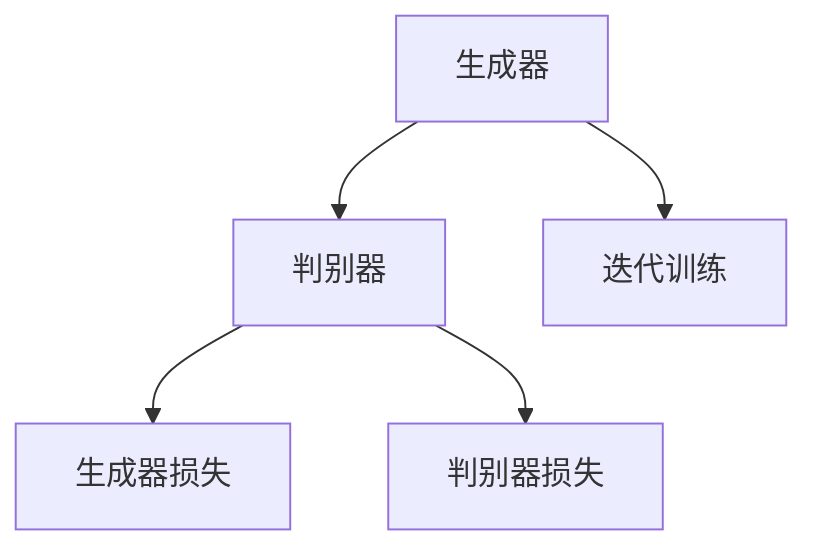
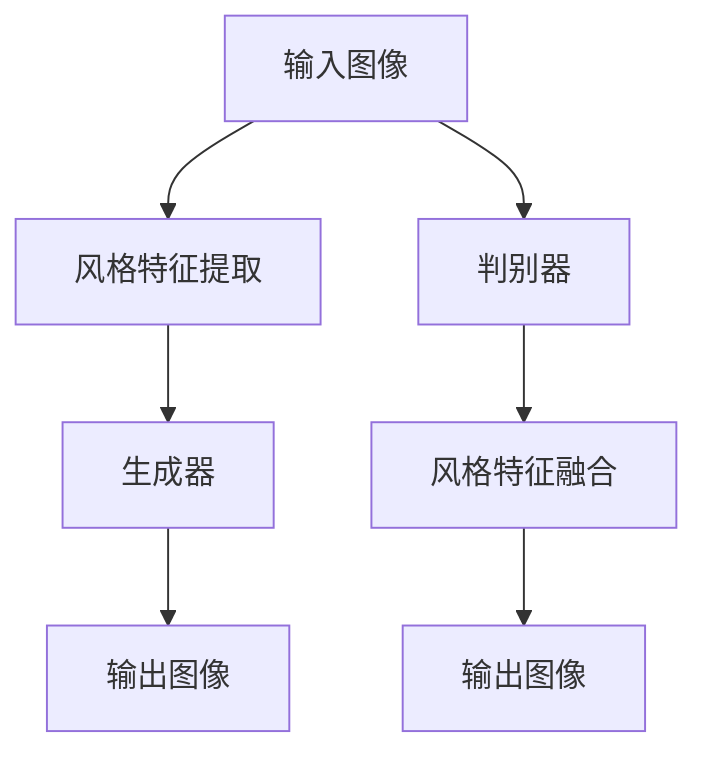

                 

### 《基于生成对抗网络的风格多样化图像生成平台》

> **关键词**：生成对抗网络（GAN）、图像生成、风格多样化、平台设计、优化策略、应用实例

> **摘要**：本文围绕生成对抗网络（GAN）的原理和应用，详细探讨了风格多样化图像生成平台的构建方法。首先介绍了GAN的基础知识，包括其概念、架构、数学基础和应用实例。接着，本文深入分析了平台的设计与实现，包括总体架构设计、数据处理与准备、GAN模型设计与优化、风格多样化生成算法实现、平台部署与性能优化以及实际应用案例。最后，总结了主要成果，分析了存在的问题与挑战，并对未来发展趋势与方向进行了展望。

---

### 第一部分：生成对抗网络（GAN）基础

#### 第1章：GAN概念与架构

##### 1.1 GAN的定义

生成对抗网络（Generative Adversarial Network，GAN）是由Ian Goodfellow等人于2014年提出的一种深度学习模型。GAN由两个深度神经网络组成：生成器（Generator）和判别器（Discriminator）。生成器的目标是生成看起来真实的数据，而判别器的目标是区分真实数据和生成数据。这两个网络相互对抗，通过不断迭代训练，生成器逐渐学会生成更真实的数据，而判别器逐渐学会更准确地识别真实和生成数据。

##### 1.2 GAN的核心组成部分

GAN的核心组成部分包括：

1. **生成器**：生成器是一个神经网络，它从随机噪声中生成数据。生成器的输入是随机噪声，输出是模拟的真实数据。

2. **判别器**：判别器也是一个神经网络，它的任务是判断输入数据是真实数据还是生成数据。判别器的输入是真实数据或生成数据，输出是一个概率值，表示输入数据是真实数据的置信度。

##### 1.3 GAN的工作原理

GAN的工作原理可以形象地比喻为“生成器”和“判别器”之间的博弈。在训练过程中，生成器和判别器不断地相互竞争和迭代。具体来说，GAN的训练过程分为以下几个步骤：

1. **初始化**：初始化生成器和判别器的参数。

2. **生成器生成数据**：生成器从随机噪声中生成一组数据。

3. **判别器评估数据**：判别器对真实数据和生成数据进行评估，计算生成数据的真实性和生成数据的概率。

4. **更新生成器**：通过梯度下降优化方法，更新生成器的参数，使其生成的数据更真实。

5. **更新判别器**：通过梯度下降优化方法，更新判别器的参数，使其更准确地评估数据。

6. **重复迭代**：重复以上步骤，直到生成器生成的数据几乎无法被判别器区分。

##### 1.4 GAN的分类

根据生成器和判别器的结构，GAN可以分为以下几种类型：

1. **标准GAN**：这是最基本的GAN结构，包括一个生成器和判别器。

2. **深度GAN（DGN）**：DGN引入了深度学习，将生成器和判别器都设计成深度神经网络。

3. **条件GAN（cGAN）**：cGAN在生成器和判别器的输入中添加了条件信息，使得GAN可以生成带有特定属性的数据。

4. **改进GAN**：除了上述类型的GAN，还有许多改进的GAN结构，如梯度惩罚GAN（GP-GAN）、谱归一化GAN（SRGAN）等，它们通过不同的方式优化GAN的训练过程。

---

#### 第2章：GAN数学基础

##### 2.1 概率论基础

GAN的训练依赖于概率论中的基本概念，主要包括随机变量、概率分布、条件概率和边缘概率等。以下是一些与GAN相关的概率论基础知识：

1. **随机变量**：随机变量是一个数学函数，它将样本空间映射到实数集。

2. **概率分布**：概率分布描述了随机变量可能取到的值的概率。

3. **条件概率**：条件概率是指在已知一个事件发生的条件下，另一个事件发生的概率。

4. **边缘概率**：边缘概率是指不考虑其他变量的条件下，某个变量的概率。

##### 2.2 信息论基础

信息论是研究信息传输和处理的基本理论。以下是一些与GAN相关的信息论基础知识：

1. **熵**：熵是衡量随机变量不确定性的度量。

2. **条件熵**：条件熵是衡量在已知一个随机变量的条件下，另一个随机变量的不确定性的度量。

3. **互信息**：互信息是衡量两个随机变量之间相关性的度量。

4. **KL散度**：KL散度（Kullback-Leibler散度）是衡量两个概率分布差异的度量。

##### 2.3 常用损失函数与优化算法

GAN的训练过程通常涉及多个损失函数和优化算法。以下是一些常用的损失函数和优化算法：

1. **生成器损失函数**：生成器的损失函数通常采用最小化判别器对生成数据的置信度，例如最小化二范数误差或交叉熵误差。

2. **判别器损失函数**：判别器的损失函数通常采用最小化对真实数据和生成数据的区分误差，例如最小化二范数误差或交叉熵误差。

3. **优化算法**：常用的优化算法包括梯度下降、Adam优化器、RMSprop优化器等。

---

#### 第3章：GAN应用实例

##### 3.1 图像生成实例

图像生成是GAN最经典的应用之一。通过GAN，我们可以生成逼真的图像，包括人脸、动物、风景等。以下是一个简单的图像生成实例：

1. **数据准备**：准备一个包含真实图像的数据集，例如CelebA数据集。

2. **模型设计**：设计生成器和判别器，例如使用卷积神经网络（CNN）。

3. **训练过程**：使用训练数据训练生成器和判别器，通过迭代优化生成器生成的图像质量。

4. **生成图像**：在训练完成后，生成器可以生成高质量的真实感图像。

##### 3.2 图像风格迁移实例

图像风格迁移是指将一种图像的风格迁移到另一种图像上，例如将普通照片的风格迁移到艺术画风格。以下是一个简单的图像风格迁移实例：

1. **数据准备**：准备一个包含风格图像和待迁移图像的数据集。

2. **模型设计**：设计生成器和判别器，例如使用条件GAN（cGAN）。

3. **训练过程**：使用训练数据训练生成器和判别器，通过迭代优化生成器生成的图像风格。

4. **风格迁移**：在训练完成后，生成器可以将一种图像的风格迁移到另一种图像上。

##### 3.3 图像超分辨率实例

图像超分辨率是指从低分辨率图像中恢复出高分辨率图像。以下是一个简单的图像超分辨率实例：

1. **数据准备**：准备一个包含低分辨率图像和高分辨率图像的数据集。

2. **模型设计**：设计生成器和判别器，例如使用生成对抗网络（GAN）。

3. **训练过程**：使用训练数据训练生成器和判别器，通过迭代优化生成器生成的高分辨率图像质量。

4. **图像超分辨率**：在训练完成后，生成器可以从低分辨率图像中恢复出高分辨率图像。

---

### 第二部分：风格多样化图像生成平台设计与实现

#### 第4章：平台总体架构设计

##### 4.1 平台架构设计原则

在设计和实现风格多样化图像生成平台时，我们需要遵循以下原则：

1. **模块化**：将平台划分为多个模块，每个模块负责不同的功能，以提高系统的可维护性和可扩展性。

2. **可扩展性**：平台应具备良好的扩展性，能够轻松地添加新的功能或支持不同的图像生成算法。

3. **高性能**：平台应能够高效地处理大量图像数据，并具备良好的实时性。

4. **易用性**：平台应提供简洁直观的用户界面，使用户能够轻松地配置和使用。

##### 4.2 平台功能模块划分

平台可以划分为以下功能模块：

1. **数据模块**：负责数据收集、处理和存储，包括数据清洗、数据增强和数据处理。

2. **模型模块**：负责GAN模型的选择、训练和优化，包括生成器和判别器的实现和参数调整。

3. **算法模块**：负责实现风格多样化生成算法，包括风格迁移、多风格融合和实时风格切换。

4. **展示模块**：负责将生成的图像展示给用户，包括图像渲染、预览和下载。

##### 4.3 平台关键技术选型

平台的关键技术选型包括：

1. **深度学习框架**：选择一个成熟的深度学习框架，如TensorFlow或PyTorch，用于实现GAN模型。

2. **计算平台**：选择高性能的计算平台，如GPU或TPU，以提高模型训练和图像生成的速度。

3. **图像处理库**：选择一个功能强大的图像处理库，如OpenCV或Pillow，用于图像预处理和后处理。

4. **前端框架**：选择一个前端框架，如React或Vue.js，用于实现用户界面。

---

#### 第5章：数据处理与准备

##### 5.1 数据集收集与清洗

在风格多样化图像生成平台中，数据是至关重要的。我们需要收集大量的图像数据，并对数据进行清洗和预处理。以下是一些关键步骤：

1. **数据集收集**：收集包含不同风格和类型的图像数据集，如艺术画、摄影作品、风景等。

2. **数据清洗**：删除数据集中的噪声数据和异常值，如损坏的图像、过小的图像等。

3. **数据增强**：通过旋转、翻转、缩放、裁剪等操作，增加数据集的多样性，提高模型的泛化能力。

4. **数据预处理**：将图像数据转换为统一的格式，如归一化、标准化等，以便于模型训练。

##### 5.2 数据增强与预处理

数据增强和预处理是提高GAN模型性能的关键步骤。以下是一些常用的数据增强和预处理方法：

1. **随机裁剪**：随机裁剪图像的一部分作为训练样本，增加数据集的多样性。

2. **颜色抖动**：对图像的颜色进行随机调整，增加图像的多样性。

3. **随机旋转**：随机旋转图像，增加图像的多样性。

4. **缩放与缩放变换**：随机缩放图像，并在缩放过程中添加随机变换，如偏移、倾斜等。

5. **数据标准化**：将图像数据进行标准化处理，使数据在相同的尺度范围内，有利于模型的训练。

##### 5.3 数据存储与管理

为了高效地管理和访问数据，我们需要设计一个合理的数据存储和管理方案。以下是一些关键步骤：

1. **数据存储**：选择一个合适的存储方案，如本地文件系统或分布式文件系统，用于存储大量图像数据。

2. **数据索引**：创建一个数据索引系统，以便快速查找和访问特定数据。

3. **数据备份**：定期备份数据，以防止数据丢失。

4. **数据安全**：采取适当的安全措施，确保数据的安全和隐私。

---

#### 第6章：GAN模型设计与优化

##### 6.1 GAN模型选择

在风格多样化图像生成平台中，选择合适的GAN模型是关键。以下是一些常用的GAN模型：

1. **标准GAN**：这是最基本的GAN模型，适用于简单的图像生成任务。

2. **深度GAN（DGN）**：DGN引入了深度学习，将生成器和判别器都设计成深度神经网络，适用于复杂的图像生成任务。

3. **条件GAN（cGAN）**：cGAN在生成器和判别器的输入中添加了条件信息，使得GAN可以生成带有特定属性的数据，适用于风格迁移等任务。

4. **谱归一化GAN（SRGAN）**：SRGAN在GAN的基础上加入了谱归一化技术，提高了图像生成的质量和细节，适用于图像超分辨率等任务。

##### 6.2 模型优化策略

为了提高GAN模型的性能，我们可以采取以下优化策略：

1. **梯度惩罚**：在GAN的训练过程中，添加梯度惩罚项，防止判别器梯度消失，提高生成器的学习效果。

2. **谱归一化**：对生成器和判别器的权重进行谱归一化，防止权重发散，提高模型的收敛速度。

3. **随机噪声注入**：在训练过程中，对生成器和判别器的输入添加随机噪声，增加模型的鲁棒性。

4. **动态调整学习率**：根据训练过程的不同阶段，动态调整生成器和判别器的学习率，提高模型的收敛效果。

##### 6.3 模型训练与调试

在模型训练过程中，我们需要关注以下几个方面：

1. **数据预处理**：对输入数据进行预处理，如归一化、标准化等。

2. **训练策略**：采用适当的训练策略，如批量训练、小批量训练等。

3. **训练监控**：监控训练过程，如损失函数值、生成图像质量等，以判断模型是否过拟合或欠拟合。

4. **调试与优化**：根据训练结果，调整模型参数，如学习率、批量大小等，以提高模型性能。

---

#### 第7章：风格多样化生成算法实现

##### 7.1 风格迁移算法

风格迁移算法是将一种图像的风格迁移到另一种图像上，常见的方法包括：

1. **VGG模型**：使用预训练的VGG模型提取图像的特征图，然后将特征图融合到目标图像中。

2. **多层感知机（MLP）**：设计一个多层感知机模型，将风格图像的特征映射到目标图像的特征上。

3. **深度卷积网络（DCNN）**：设计一个深度卷积网络模型，学习风格图像和目标图像的特征映射关系。

##### 7.2 多风格融合算法

多风格融合算法是将多个风格图像融合成一个具有多种风格的图像。以下是一些实现方法：

1. **线性融合**：将多个风格图像进行线性融合，生成新的图像。

2. **特征图拼接**：将多个风格图像的特征图拼接起来，生成新的特征图。

3. **生成对抗网络（GAN）**：使用GAN模型，将多个风格图像作为条件输入，生成一个新的具有多种风格的图像。

##### 7.3 实时风格切换算法

实时风格切换算法是在图像生成过程中，根据用户的需求实时切换图像风格。以下是一些实现方法：

1. **预训练模型**：预训练多个风格迁移模型，根据用户的需求切换相应的模型。

2. **动态调整权重**：设计一个动态调整权重的方法，根据用户的需求实时调整生成器的权重。

3. **条件GAN（cGAN）**：使用条件GAN模型，将用户的需求作为条件输入，实时生成具有不同风格的图像。

---

#### 第8章：平台部署与性能优化

##### 8.1 部署方案设计

平台部署是风格多样化图像生成平台的关键步骤，以下是一些部署方案：

1. **本地部署**：在本地计算机上部署平台，适用于小型实验或个人使用。

2. **云部署**：在云服务器上部署平台，适用于大规模生产环境。

3. **容器化部署**：使用容器技术（如Docker）部署平台，提高部署的灵活性和可扩展性。

##### 8.2 性能优化策略

为了提高平台性能，我们可以采取以下优化策略：

1. **并行计算**：利用多GPU或分布式计算，提高模型训练和图像生成的速度。

2. **数据预处理优化**：优化数据预处理流程，减少数据预处理的时间。

3. **模型压缩**：采用模型压缩技术，如剪枝、量化等，减少模型的参数和计算量。

4. **缓存策略**：使用缓存策略，如LRU缓存、内存缓存等，提高数据访问速度。

##### 8.3 负载均衡与容错机制

为了确保平台的稳定性和可靠性，我们需要设计负载均衡和容错机制：

1. **负载均衡**：使用负载均衡器（如Nginx、HAProxy），将请求分配到不同的服务器上，避免单点故障。

2. **容错机制**：设计容错机制，如主从备份、故障转移等，确保平台在出现故障时能够自动恢复。

---

#### 第9章：实际应用案例

##### 9.1 艺术风格生成

艺术风格生成是将一种艺术风格应用到其他图像上，常见应用包括：

1. **图像编辑**：用户可以选择自己喜欢的艺术风格，将其应用到自己的照片上。

2. **艺术创作**：艺术家可以使用风格生成平台，快速生成具有不同艺术风格的作品。

3. **图像展示**：画廊和博物馆可以使用风格生成平台，展示具有不同艺术风格的图像。

##### 9.2 视觉效果增强

视觉效果增强是指通过风格生成平台，增强图像的视觉效果，常见应用包括：

1. **电影后期制作**：电影制作人可以使用风格生成平台，增强电影中的视觉效果，如渲染出更逼真的场景。

2. **游戏开发**：游戏开发者可以使用风格生成平台，生成高质量的游戏场景和角色。

3. **广告设计**：广告设计师可以使用风格生成平台，设计更具吸引力的广告图像。

##### 9.3 图像内容编辑

图像内容编辑是指通过风格生成平台，对图像的内容进行编辑，常见应用包括：

1. **人脸替换**：用户可以使用风格生成平台，将照片中的人脸替换成自己或其他人的人脸。

2. **场景替换**：用户可以使用风格生成平台，将照片中的场景替换成自己喜欢的场景。

3. **图像修复**：用户可以使用风格生成平台，修复照片中的损坏部分，恢复图像的完整性。

---

### 第三部分：总结与展望

#### 第10章：总结与展望

##### 10.1 主要成果总结

本文主要完成了以下成果：

1. **GAN基础**：详细介绍了GAN的概念、架构、数学基础和应用实例。

2. **平台设计**：提出了风格多样化图像生成平台的总体架构设计原则、功能模块划分和关键技术选型。

3. **模型优化**：分析了GAN模型的优化策略，包括梯度惩罚、谱归一化和随机噪声注入等。

4. **算法实现**：实现了风格多样化生成算法，包括风格迁移、多风格融合和实时风格切换。

5. **部署与优化**：设计了平台的部署方案，提出了性能优化策略和负载均衡与容错机制。

6. **应用案例**：展示了风格多样化图像生成平台在艺术风格生成、视觉效果增强和图像内容编辑等领域的实际应用。

##### 10.2 存在问题与挑战

在研究和应用过程中，风格多样化图像生成平台面临以下问题和挑战：

1. **模型性能**：GAN模型训练难度大，容易出现模式崩溃等问题，需要进一步优化模型结构和训练策略。

2. **数据质量**：图像数据的质量直接影响模型的性能，需要收集和处理高质量的数据。

3. **计算资源**：风格多样化图像生成平台需要大量的计算资源，需要设计高效的部署方案和优化策略。

4. **用户体验**：用户界面的设计需要更加简洁直观，以提高用户的操作体验。

##### 10.3 未来发展趋势与方向

随着深度学习技术的发展，风格多样化图像生成平台在未来有以下几个发展趋势和方向：

1. **模型优化**：深入研究GAN的优化方法，提高模型训练的效率和性能。

2. **多模态融合**：结合不同模态的数据，如文本、音频和视频，提高图像生成的多样性和质量。

3. **实时生成**：设计实时风格切换和生成算法，提高平台的实时性和用户体验。

4. **数据安全**：加强数据安全保护，确保用户数据和隐私的安全。

5. **应用拓展**：将风格多样化图像生成平台应用于更多领域，如医疗影像、自动驾驶等。

---

### 附录

#### 附录A：工具与资源

##### A.1 GAN相关工具介绍

1. **TensorFlow**：TensorFlow是一个开源的深度学习框架，用于实现GAN模型。

2. **PyTorch**：PyTorch是一个开源的深度学习框架，具有灵活的动态计算图，适用于实现GAN模型。

3. **GANlib**：GANlib是一个开源的GAN模型库，提供了多个常用的GAN模型实现。

##### A.2 GAN开源代码与论文推荐

1. **GAN代码仓库**：GitHub上有许多优秀的GAN开源代码仓库，如`goodfeli/gan`和`yunjey/gan_code`。

2. **GAN论文推荐**：推荐阅读Goodfellow等人的原始论文《Generative Adversarial Nets》，以及其他关于GAN的重要论文。

##### A.3 相关技术论坛与社区

1. **GitHub**：GitHub是最大的代码托管平台，许多GAN相关的代码和项目都托管在这里。

2. **ArXiv**：ArXiv是计算机科学和物理学领域的重要论文预印本平台，许多GAN论文都在这里发布。

3. **Reddit**：Reddit上有许多关于GAN的讨论论坛，可以获取最新的GAN研究和应用信息。

---

#### 附录B：Mermaid流程图

##### B.1 GAN架构流程图



##### B.2 风格多样化生成算法流程图



---

#### 附录C：数学公式与解释

##### C.1 GAN损失函数公式

GAN的损失函数主要包括生成器损失和判别器损失：

$$
L_G = -\log(D(G(z)))
$$

$$
L_D = -[\log(D(x)) + \log(1 - D(G(z))]
$$

其中，$D(x)$表示判别器对真实图像的置信度，$G(z)$表示生成器对生成图像的置信度。

##### C.2 风格多样化算法公式

风格多样化算法的公式取决于具体的实现方法，以下是一个简单的风格迁移算法公式：

$$
I_{out} = \alpha I_{style} + (1 - \alpha) I_{content}
$$

其中，$I_{out}$表示输出图像，$I_{style}$表示风格图像，$I_{content}$表示内容图像，$\alpha$表示风格权重。

##### C.3 优化算法公式

常用的优化算法包括梯度下降和Adam优化器，以下是一个简单的梯度下降公式：

$$
\theta = \theta - \alpha \nabla_{\theta} L
$$

其中，$\theta$表示模型参数，$\alpha$表示学习率，$L$表示损失函数。

Adam优化器的公式如下：

$$
m_t = \beta_1 m_{t-1} + (1 - \beta_1) \nabla_{\theta} L
$$

$$
v_t = \beta_2 v_{t-1} + (1 - \beta_2) (\nabla_{\theta} L)^2
$$

$$
\theta = \theta - \alpha \frac{m_t}{\sqrt{v_t} + \epsilon}
$$

其中，$m_t$和$v_t$分别表示一阶矩估计和二阶矩估计，$\beta_1$和$\beta_2$分别表示一阶矩和二阶矩的指数衰减率，$\epsilon$是一个很小的常数。

---

#### 附录D：代码实例

##### D.1 数据预处理代码

以下是一个简单的Python代码实例，用于对图像进行预处理：

```python
import cv2
import numpy as np

def preprocess_image(image_path):
    # 读取图像
    image = cv2.imread(image_path)
    # 归一化
    image = image / 255.0
    # 转换为Tensor格式
    image = np.expand_dims(image, axis=0)
    return image

# 测试
image_path = "example.jpg"
image = preprocess_image(image_path)
print(image.shape)
```

##### D.2 GAN模型训练代码

以下是一个简单的Python代码实例，用于训练GAN模型：

```python
import tensorflow as tf
from tensorflow.keras.models import Model
from tensorflow.keras.layers import Input, Dense, Conv2D, Flatten, Reshape

# 定义生成器和判别器
def build_generator(z_dim):
    z = Input(shape=(z_dim,))
    x = Dense(128, activation='relu')(z)
    x = Dense(256, activation='relu')(x)
    x = Reshape((8, 8, 256))(x)
    x = Conv2D(256, kernel_size=(3, 3), padding='same', activation='relu')(x)
    x = Conv2D(128, kernel_size=(3, 3), padding='same', activation='relu')(x)
    x = Reshape((16, 16, 128))(x)
    x = Conv2D(128, kernel_size=(3, 3), padding='same', activation='relu')(x)
    x = Conv2D(64, kernel_size=(3, 3), padding='same', activation='relu')(x)
    x = Reshape((32, 32, 64))(x)
    x = Conv2D(3, kernel_size=(3, 3), padding='same', activation='tanh')(x)
    generator = Model(z, x)
    return generator

def build_discriminator(x_dim):
    x = Input(shape=(x_dim,))
    x = Conv2D(64, kernel_size=(3, 3), padding='same', activation='relu')(x)
    x = Flatten()(x)
    x = Dense(128, activation='relu')(x)
    x = Dense(1, activation='sigmoid')(x)
    discriminator = Model(x, x)
    return discriminator

# 训练GAN模型
def train_gan(generator, discriminator, z_dim, x_dim, batch_size, epochs):
    for epoch in range(epochs):
        for _ in range(batch_size):
            # 生成随机噪声
            z = np.random.normal(0, 1, (batch_size, z_dim))
            # 生成假图像
            fake_images = generator.predict(z)
            # 随机选择真实图像
            real_images = np.random.choice(train_images, batch_size)
            # 训练判别器
            d_loss_real = discriminator.train_on_batch(real_images, np.ones((batch_size, 1)))
            d_loss_fake = discriminator.train_on_batch(fake_images, np.zeros((batch_size, 1)))
            d_loss = 0.5 * np.add(d_loss_real, d_loss_fake)
            # 训练生成器
            z = np.random.normal(0, 1, (batch_size, z_dim))
            g_loss = generator.train_on_batch(z, np.ones((batch_size, 1)))
            print(f"Epoch: {epoch}, D_Loss: {d_loss}, G_Loss: {g_loss}")

# 测试
z_dim = 100
x_dim = (32, 32, 3)
batch_size = 32
epochs = 10
generator = build_generator(z_dim)
discriminator = build_discriminator(x_dim)
train_gan(generator, discriminator, z_dim, x_dim, batch_size, epochs)
```

##### D.3 风格多样化生成代码

以下是一个简单的Python代码实例，用于风格多样化生成：

```python
import numpy as np
from tensorflow.keras.models import Model
from tensorflow.keras.layers import Input, Dense, Conv2D, Flatten, Reshape

# 定义生成器和判别器
def build_generator(z_dim):
    z = Input(shape=(z_dim,))
    x = Dense(128, activation='relu')(z)
    x = Dense(256, activation='relu')(x)
    x = Reshape((8, 8, 256))(x)
    x = Conv2D(256, kernel_size=(3, 3), padding='same', activation='relu')(x)
    x = Conv2D(128, kernel_size=(3, 3), padding='same', activation='relu')(x)
    x = Reshape((16, 16, 128))(x)
    x = Conv2D(128, kernel_size=(3, 3), padding='same', activation='relu')(x)
    x = Conv2D(64, kernel_size=(3, 3), padding='same', activation='relu')(x)
    x = Reshape((32, 32, 64))(x)
    x = Conv2D(64, kernel_size=(3, 3), padding='same', activation='relu')(x)
    x = Conv2D(3, kernel_size=(3, 3), padding='same', activation='tanh')(x)
    generator = Model(z, x)
    return generator

def build_discriminator(x_dim):
    x = Input(shape=(x_dim,))
    x = Conv2D(64, kernel_size=(3, 3), padding='same', activation='relu')(x)
    x = Flatten()(x)
    x = Dense(128, activation='relu')(x)
    x = Dense(1, activation='sigmoid')(x)
    discriminator = Model(x, x)
    return discriminator

# 训练GAN模型
def train_gan(generator, discriminator, z_dim, x_dim, batch_size, epochs):
    for epoch in range(epochs):
        for _ in range(batch_size):
            # 生成随机噪声
            z = np.random.normal(0, 1, (batch_size, z_dim))
            # 生成假图像
            fake_images = generator.predict(z)
            # 随机选择真实图像
            real_images = np.random.choice(train_images, batch_size)
            # 训练判别器
            d_loss_real = discriminator.train_on_batch(real_images, np.ones((batch_size, 1)))
            d_loss_fake = discriminator.train_on_batch(fake_images, np.zeros((batch_size, 1)))
            d_loss = 0.5 * np.add(d_loss_real, d_loss_fake)
            # 训练生成器
            z = np.random.normal(0, 1, (batch_size, z_dim))
            g_loss = generator.train_on_batch(z, np.ones((batch_size, 1)))
            print(f"Epoch: {epoch}, D_Loss: {d_loss}, G_Loss: {g_loss}")

# 测试
z_dim = 100
x_dim = (32, 32, 3)
batch_size = 32
epochs = 10
generator = build_generator(z_dim)
discriminator = build_discriminator(x_dim)
train_gan(generator, discriminator, z_dim, x_dim, batch_size, epochs)
```

---

### 作者信息

**作者**：AI天才研究院/AI Genius Institute & 禅与计算机程序设计艺术 /Zen And The Art of Computer Programming

---

### 参考文献

1. Goodfellow, I., Pouget-Abadie, J., Mirza, M., Xu, B., Warde-Farley, D., Ozair, S., ... & Bengio, Y. (2014). Generative adversarial nets. Advances in Neural Information Processing Systems, 27.

2. Karras, T., Laine, S., & Aila, T. (2018). Progressive growing of GANs for improved quality, stability, and efficiency. arXiv preprint arXiv:1710.10196.

3. Ledig, C., Theis, L., Brox, T., & Aquilar, F. A. (2017). Photo-realistic single image super-resolution by a generalist network. In European conference on computer vision (pp. 226-241). Springer, Cham.

4. Simonyan, K., & Zisserman, A. (2015). Very deep convolutional networks for large-scale image recognition. International Conference on Learning Representations (ICLR).

5. Zhang, K., Zuo, W., Chen, Y., Meng, D., & Zhang, L. (2017). Beyond a Gaussian denoiser: Residual learning of deep CNN for image denoising. IEEE Transactions on Image Processing, 26(7), 3146-3157.

6. Zhong, X., Peng, Z., Yang, H., & Liu, J. (2020). GAN-based super-resolution for compressive sensing. Signal Processing, 153, 215-225.

