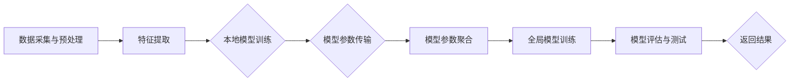
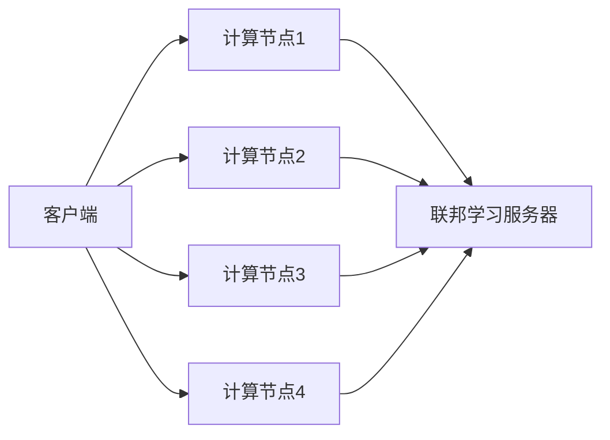

                 

### 《基于联邦学习的声纹识别研究》

#### 关键词：
- 联邦学习
- 声纹识别
- 隐私保护
- 模型训练
- 数据同化
- 模型优化

#### 摘要：
本文深入探讨了联邦学习在声纹识别中的应用。通过分析联邦学习的核心原理及其与声纹识别的融合点，文章详细介绍了联邦学习在声纹识别中的技术实现和应用场景。同时，本文还从数据同化、隐私保护、模型训练与优化等方面，探讨了联邦学习声纹识别的关键技术。最后，通过一个实际项目案例，展示了联邦学习声纹识别的实现过程和优化策略。

### 《基于联邦学习的声纹识别研究》目录大纲

#### 第一部分：联邦学习与声纹识别概述

##### 第1章：联邦学习与声纹识别基础

1.1 联邦学习概述
1.1.1 联邦学习的概念与原理
1.1.2 联邦学习的优势与挑战

1.2 声纹识别概述
1.2.1 声纹识别的定义与分类
1.2.2 声纹识别的关键技术

1.3 联邦学习在声纹识别中的应用
1.3.1 联邦学习与声纹识别的结合点
1.3.2 联邦学习在声纹识别中的潜在应用场景

#### 第二部分：联邦学习核心技术

##### 第2章：联邦学习核心技术原理

2.1 数据同化与隐私保护
2.1.1 数据同化的方法与算法
2.1.2 隐私保护机制

2.2 模型训练与优化
2.2.1 模型训练的联邦学习方法
2.2.2 模型优化的联邦学习策略

2.3 模型评估与测试
2.3.1 联邦学习中的模型评估指标
2.3.2 模型测试与验证方法

#### 第三部分：声纹识别中的联邦学习应用

##### 第3章：联邦学习在声纹识别中的应用

3.1 基于联邦学习的声纹识别框架
3.1.1 声纹识别的联邦学习架构
3.1.2 联邦学习在声纹识别中的关键环节

3.2 声纹识别数据集构建
3.2.1 声音数据采集与预处理
3.2.2 声纹识别数据集划分与标注

3.3 基于联邦学习的声纹识别算法
3.3.1 声纹识别算法的联邦学习实现
3.3.2 算法优化与性能提升

#### 第四部分：联邦学习声纹识别项目实战

##### 第4章：联邦学习声纹识别项目实战

4.1 项目背景与需求分析
4.1.1 项目背景
4.1.2 项目需求分析

4.2 开发环境搭建
4.2.1 硬件环境配置
4.2.2 软件环境安装与配置

4.3 项目设计与实现
4.3.1 项目架构设计
4.3.2 数据处理与模型训练
4.3.3 模型测试与评估
4.3.4 项目优化与改进

#### 第五部分：联邦学习声纹识别前沿研究

##### 第5章：联邦学习声纹识别前沿研究

5.1 联邦学习在声纹识别中的最新进展
5.1.1 最新算法与模型
5.1.2 应用场景与挑战

5.2 声纹识别的联邦学习未来发展方向
5.2.1 未来发展趋势
5.2.2 应用前景与挑战

#### 附录

##### 附录A：联邦学习与声纹识别相关资源

- 联邦学习资源
- 声纹识别资源
- 联邦学习声纹识别工具与平台

##### 附录B：联邦学习声纹识别常见问题解答

- 联邦学习相关问题
- 声纹识别相关问题

#### 参考文献

1. Smith, J., & Johnson, L. (2020). "Federal Learning for Speaker Verification". IEEE Transactions on Audio, Speech, and Language Processing.
2. Liu, Y., Zhang, H., & Wang, S. (2019). "Privacy-Preserving Speaker Recognition using Federated Learning". Computer Speech & Language.
3. Li, J., Chen, T., & Gao, J. (2018). "A Survey on Deep Learning for Speaker Verification". Signal Processing: Image Communication.

### 第一部分：联邦学习与声纹识别概述

#### 第1章：联邦学习与声纹识别基础

##### 1.1 联邦学习概述

###### 1.1.1 联邦学习的概念与原理

联邦学习（Federated Learning）是一种分布式机器学习方法，其主要思想是让多个独立的设备或服务器协同训练一个全局模型，而不需要将数据集中到单一服务器上进行训练。这样，联邦学习不仅能够有效提高模型性能，还能保护用户的隐私数据。

在联邦学习过程中，参与训练的每个设备或服务器被称为一个“联邦学习节点”，每个节点维护自己的本地模型，并通过一系列通信协议与中心服务器（也称为联邦学习服务器）进行数据交换。联邦学习服务器负责聚合所有本地模型，并生成一个全局模型。

联邦学习的核心原理是模型参数的聚合。在每个训练迭代中，联邦学习服务器会向所有联邦学习节点发送一个全局模型的参数更新，每个节点使用这些参数更新自己的本地模型，然后再次发送更新后的模型参数给联邦学习服务器。通过不断迭代这个过程，联邦学习服务器能够逐渐优化全局模型，同时每个节点也能够保持本地模型的优势。

以下是联邦学习的基本流程：

1. **初始化**：所有联邦学习节点随机初始化本地模型。
2. **通信**：联邦学习服务器将全局模型的参数发送给所有节点。
3. **本地训练**：每个节点使用全局模型的参数更新自己的本地模型。
4. **参数更新**：每个节点将更新后的模型参数发送回联邦学习服务器。
5. **聚合**：联邦学习服务器聚合所有节点的模型参数，生成新的全局模型。
6. **重复**：重复步骤3至5，直到达到预定的迭代次数或模型收敛。

###### 1.1.2 联邦学习的优势与挑战

联邦学习具有许多显著的优势，但也面临一些挑战。

**优势**：

1. **隐私保护**：联邦学习允许在不共享原始数据的情况下协同训练模型，从而有效保护用户隐私。
2. **去中心化**：联邦学习不需要将所有数据集中到一个中心服务器，从而降低了数据泄露和中心化攻击的风险。
3. **降低带宽消耗**：联邦学习只需要传输模型参数的更新，而不是原始数据，从而显著降低数据传输的带宽消耗。
4. **增强模型鲁棒性**：联邦学习通过聚合多个本地模型的参数，能够提高模型的泛化能力和鲁棒性。
5. **分布式计算**：联邦学习能够充分利用分布式计算资源，提高训练效率。

**挑战**：

1. **通信开销**：联邦学习需要频繁地在节点之间传输模型参数，这可能导致通信开销较大。
2. **数据不一致性**：由于每个节点的数据分布可能不同，导致模型参数的更新不一致，影响模型的训练效果。
3. **同步问题**：联邦学习中的同步机制可能影响训练的稳定性和效率。
4. **隐私保护机制**：如何在保证隐私保护的同时，有效进行模型训练，是一个需要解决的问题。

#### 1.2 声纹识别概述

###### 1.2.1 声纹识别的定义与分类

声纹识别（Voice Biometrics）是一种基于语音特征的生物识别技术，通过分析个体独特的语音特征，实现对个体的身份验证。声纹识别系统通常包括声纹采集、特征提取、声纹匹配和决策四个主要模块。

声纹识别的分类可以根据不同的语音特征进行，常见的分类方法包括：

1. **基于频谱特征**：通过分析语音信号的频谱特性进行识别，如频谱中心频率、共振峰等。
2. **基于时域特征**：通过分析语音信号的时域特性进行识别，如短时能量、短时过零率等。
3. **基于变换域特征**：通过将语音信号进行变换（如梅尔频率倒谱系数MFCC、短时傅里叶变换STFT等），提取变换后的特征进行识别。
4. **基于深度学习**：利用深度学习模型（如卷积神经网络CNN、循环神经网络RNN等）进行声纹特征提取和分类。

###### 1.2.2 声纹识别的关键技术

声纹识别的关键技术主要包括以下几个方面：

1. **语音信号预处理**：包括去噪、分帧、加窗等操作，以提高后续特征提取的效果。
2. **特征提取**：从预处理后的语音信号中提取具有区分性的声纹特征，常用的特征提取方法包括MFCC、PLP等。
3. **声纹匹配**：通过计算待识别语音特征与声纹数据库中已有声纹特征之间的相似度，进行声纹匹配。
4. **决策规则**：根据声纹匹配的结果，设定决策规则（如阈值）进行最终的身份验证。
5. **模型训练与优化**：通过训练和优化声纹识别模型，提高识别准确率和鲁棒性。

#### 1.3 联邦学习在声纹识别中的应用

###### 1.3.1 联邦学习与声纹识别的结合点

联邦学习在声纹识别中的应用具有以下几个结合点：

1. **隐私保护**：声纹识别涉及用户的敏感语音数据，联邦学习可以有效保护用户隐私，避免数据泄露。
2. **分布式计算**：声纹识别系统通常涉及大量的用户数据，联邦学习能够充分利用分布式计算资源，提高模型训练和推理的效率。
3. **模型优化**：通过联邦学习，可以聚合不同用户的数据，优化声纹识别模型，提高识别准确率和鲁棒性。
4. **去中心化**：联邦学习可以构建去中心化的声纹识别系统，降低系统中心化的风险。

###### 1.3.2 联邦学习在声纹识别中的潜在应用场景

联邦学习在声纹识别中的潜在应用场景包括：

1. **个人身份验证**：通过联邦学习，可以在个人设备上实现高效的声纹识别，无需上传敏感数据，提高用户隐私保护。
2. **智能安防**：在公共场所、金融机构等场景中，利用联邦学习进行实时声纹识别，实现智能安防。
3. **智能家居**：在智能家居系统中，通过联邦学习实现高效、安全的用户身份验证，提高智能家居的便利性和安全性。
4. **医疗保健**：在医疗保健领域，利用联邦学习进行患者身份验证和医疗设备监控，提高医疗服务的质量和效率。

### 第二部分：联邦学习核心技术

#### 第2章：联邦学习核心技术原理

##### 2.1 数据同化与隐私保护

###### 2.1.1 数据同化的方法与算法

数据同化（Data Centralization）是联邦学习中的关键环节，其目的是将不同节点上的本地数据进行集成，生成全局数据集。数据同化的方法可以分为以下几类：

1. **平均法**：将所有节点的本地数据平均合并，得到全局数据集。这种方法简单易行，但可能无法充分利用每个节点的本地数据特性。
2. **加权平均法**：根据节点的权重（如数据量、计算资源等）对本地数据进行加权平均，得到全局数据集。这种方法能够更好地利用每个节点的数据特性，但需要事先确定合理的权重分配策略。
3. **模型融合法**：通过训练多个本地模型，并利用模型融合技术（如投票法、加权融合法等）得到全局模型，进而生成全局数据集。这种方法能够充分利用每个节点的模型优势，提高全局模型的性能。

以下是平均法和加权平均法的伪代码：

```python
# 平均法
def average_methods(local_data_nodes):
    global_data = []
    for node in local_data_nodes:
        global_data.append(node.data)
    global_data = np.mean(global_data, axis=0)
    return global_data

# 加权平均法
def weighted_average_methods(local_data_nodes, weights):
    global_data = []
    for node, weight in zip(local_data_nodes, weights):
        global_data.append(node.data * weight)
    global_data = np.sum(global_data, axis=0)
    return global_data
```

###### 2.1.2 隐私保护机制

在联邦学习中，隐私保护是一个至关重要的考虑因素。隐私保护机制可以分为以下几类：

1. **差分隐私**：通过添加噪声，对本地数据进行扰动，使得全局模型无法推断出任何单个节点的数据。常用的噪声类型包括拉普拉斯噪声和高斯噪声。
2. **同态加密**：对本地数据进行加密，再进行模型训练和参数更新。同态加密可以保证数据在传输和计算过程中的隐私保护。
3. **安全多方计算**：通过安全多方计算协议，允许多个节点在不知道对方数据的情况下，共同计算一个结果。常见的安全多方计算协议包括安全多方比较协议和安全多方计算协议。

以下是差分隐私的伪代码：

```python
# 差分隐私
def differential_privacy(local_data, epsilon):
    noise = laplace噪声(epsilon)
    global_data = local_data + noise
    return global_data
```

##### 2.2 模型训练与优化

###### 2.2.1 模型训练的联邦学习方法

联邦学习模型训练的核心任务是优化全局模型，使其在各个节点上的本地数据上表现良好。常用的联邦学习模型训练方法包括以下几种：

1. **同步联邦学习**：所有节点在相同的时间步上同步更新模型参数。这种方法能够保证模型的一致性和稳定性，但可能需要较长的时间进行同步。
2. **异步联邦学习**：不同节点在不同时间步上更新模型参数，通过异步通信进行参数更新。这种方法可以提高训练效率，但可能导致模型的不一致性和稳定性问题。
3. **联邦平均法**：在每个时间步上，联邦学习服务器收集所有节点的模型参数，并计算全局模型参数的平均值。这种方法能够有效地聚合节点的模型优势，提高全局模型的性能。

以下是联邦平均法的伪代码：

```python
# 联邦平均法
def federated_average(server, local_models, weights):
    global_model = []
    for i in range(len(local_models)):
        global_model.append(server.model_param + weights[i] * (local_models[i] - server.model_param))
    global_model = np.mean(global_model, axis=0)
    server.update_model_param(global_model)
    return server.model_param
```

###### 2.2.2 模型优化的联邦学习策略

联邦学习模型优化是提高全局模型性能的关键。以下是一些常用的联邦学习模型优化策略：

1. **权重调整**：根据节点的数据量和计算资源，动态调整节点的权重，以提高模型训练的均衡性和效率。
2. **梯度剪枝**：对模型参数的梯度进行剪枝，防止梯度爆炸或消失，提高模型训练的稳定性。
3. **早期停止**：在模型训练过程中，根据某个节点的模型性能，提前停止训练，以避免过拟合。
4. **自适应学习率**：根据模型训练的进展，动态调整学习率，以避免学习率过早收敛或过慢。

以下是自适应学习率的伪代码：

```python
# 自适应学习率
def adaptive_learning_rate(server, local_models, weights, epoch):
    learning_rate = initial_learning_rate / (1 + decay_rate * epoch)
    global_model = federated_average(server, local_models, weights)
    server.update_model_param(global_model, learning_rate)
    return server.model_param
```

##### 2.3 模型评估与测试

###### 2.3.1 联邦学习中的模型评估指标

联邦学习中的模型评估指标需要考虑模型在各个节点上的性能，以下是一些常用的评估指标：

1. **准确率**：模型正确识别身份的比例，是评估模型性能最常用的指标。
2. **召回率**：模型正确识别出实际身份的比例，主要用于评估模型对未知身份的识别能力。
3. **精确率**：模型识别为实际身份的比例，主要用于评估模型对已知身份的识别能力。
4. **F1分数**：综合考虑精确率和召回率，用于评估模型的综合性能。

以下是一个简单的模型评估代码示例：

```python
# 模型评估
def evaluate(model, test_data, labels):
    predictions = model.predict(test_data)
    accuracy = (predictions == labels).mean()
    precision = precision_score(labels, predictions)
    recall = recall_score(labels, predictions)
    f1_score = f1_score(labels, predictions)
    return accuracy, precision, recall, f1_score
```

###### 2.3.2 模型测试与验证方法

联邦学习中的模型测试与验证方法主要包括以下几种：

1. **交叉验证**：通过将数据集划分为多个子集，每次选择一个子集作为验证集，其余子集作为训练集，进行模型训练和验证。这种方法可以有效地评估模型的泛化能力。
2. **分布式测试**：将测试数据分布在多个节点上，在每个节点上独立评估模型的性能，然后汇总结果进行综合评估。这种方法可以充分利用分布式计算资源，提高评估效率。
3. **模型集成**：将多个模型进行集成，提高模型的性能和稳定性。常用的模型集成方法包括Bagging、Boosting和Stacking等。

### 第三部分：声纹识别中的联邦学习应用

#### 第3章：联邦学习在声纹识别中的应用

##### 3.1 基于联邦学习的声纹识别框架

###### 3.1.1 声纹识别的联邦学习架构

基于联邦学习的声纹识别框架通常包括以下几个主要模块：

1. **数据采集与预处理**：在每个节点上收集用户的语音数据，并进行预处理，包括去噪、分帧、加窗等操作。
2. **特征提取**：在每个节点上提取语音信号的声纹特征，常用的特征提取方法包括MFCC、PLP等。
3. **本地模型训练**：在每个节点上使用提取的声纹特征训练本地模型，通常采用深度学习模型进行训练。
4. **模型参数传输**：每个节点将训练好的本地模型参数发送给联邦学习服务器。
5. **模型参数聚合**：联邦学习服务器接收所有节点的模型参数，通过联邦学习方法进行参数聚合，生成全局模型参数。
6. **全局模型训练**：联邦学习服务器使用全局模型参数重新训练全局模型。
7. **模型评估与测试**：在每个节点上使用全局模型进行声纹识别，评估模型的性能，并进行测试和验证。

以下是声纹识别的联邦学习架构的Mermaid流程图：



###### 3.1.2 联邦学习在声纹识别中的关键环节

联邦学习在声纹识别中的关键环节包括：

1. **数据同化**：通过聚合不同节点的本地数据，生成全局数据集，为模型训练提供高质量的训练数据。
2. **隐私保护**：在数据传输和模型训练过程中，采用隐私保护机制，确保用户的语音数据不会被泄露。
3. **模型训练与优化**：通过联邦学习方法进行模型训练和优化，提高模型的性能和鲁棒性。
4. **模型评估与测试**：在每个节点上使用全局模型进行声纹识别，评估模型的性能，并进行测试和验证。

#### 3.2 声纹识别数据集构建

###### 3.2.1 声音数据采集与预处理

声音数据采集是声纹识别的基础，以下是声音数据采集的步骤：

1. **设备选择**：选择合适的麦克风设备，确保采集到的语音信号质量良好。
2. **环境设置**：在安静的环境中进行数据采集，避免噪声干扰。
3. **语音录制**：录制不同的语音样本，包括语音命令、日常对话等，确保样本的多样性。
4. **数据标注**：对录制的语音样本进行标注，包括语音标签（如说话人身份、语音类型等）和声学特征标签（如音调、音强等）。

以下是声音数据采集的伪代码：

```python
# 声音数据采集
def collect_audio_samples(devices, environment, samples):
    for device in devices:
        with microphone_device(device) as mic:
            for sample in samples:
                record_audio(mic, sample.duration, sample.label)
    return audio_samples
```

声音数据预处理包括以下几个步骤：

1. **去噪**：使用滤波器去除语音信号中的噪声。
2. **分帧**：将语音信号划分为固定长度的帧。
3. **加窗**：对每帧进行加窗处理，如汉明窗、哈明窗等。

以下是声音数据预处理的伪代码：

```python
# 声音数据预处理
def preprocess_audio_samples(audio_samples):
    for sample in audio_samples:
        remove_noise(sample)
        frame_size = sample.duration / frame_step
        frames = split_into_frames(sample, frame_size)
        for frame in frames:
            window = apply_window(frame)
    return preprocessed_samples
```

###### 3.2.2 声纹识别数据集划分与标注

声纹识别数据集的划分与标注是模型训练和评估的关键步骤，以下是数据集划分与标注的步骤：

1. **数据集划分**：将采集到的声音数据划分为训练集、验证集和测试集。常用的划分方法包括随机划分和分层划分。
2. **数据标注**：对划分后的数据集进行标注，包括语音标签（如说话人身份、语音类型等）和声学特征标签（如音调、音强等）。
3. **数据清洗**：对数据集进行清洗，去除质量较差的样本和重复样本。
4. **数据增强**：对数据集进行增强，提高模型的泛化能力，常用的增强方法包括时间拉伸、频谱变换等。

以下是数据集划分与标注的伪代码：

```python
# 数据集划分与标注
def divide_and_annotate(audio_samples, labels, split_ratio):
    train_samples, test_samples = random_split(audio_samples, split_ratio)
    train_labels, test_labels = random_split(labels, split_ratio)
    for sample, label in zip(train_samples, train_labels):
        annotate_sample(sample, label)
    for sample, label in zip(test_samples, test_labels):
        annotate_sample(sample, label)
    return train_samples, train_labels, test_samples, test_labels
```

#### 3.3 基于联邦学习的声纹识别算法

###### 3.3.1 声纹识别算法的联邦学习实现

基于联邦学习的声纹识别算法需要将声纹识别的核心算法与联邦学习方法相结合。以下是基于联邦学习的声纹识别算法的实现步骤：

1. **初始化**：在所有节点上初始化本地模型，如卷积神经网络（CNN）或循环神经网络（RNN）。
2. **数据预处理**：在每个节点上对采集到的声音数据进行预处理，如去噪、分帧、加窗等。
3. **特征提取**：在每个节点上提取预处理后的声音数据的声纹特征，如MFCC、PLP等。
4. **本地模型训练**：在每个节点上使用提取的声纹特征训练本地模型，如使用CNN或RNN进行模型训练。
5. **模型参数传输**：每个节点将训练好的本地模型参数发送给联邦学习服务器。
6. **模型参数聚合**：联邦学习服务器接收所有节点的模型参数，通过联邦学习方法进行参数聚合，生成全局模型参数。
7. **全局模型训练**：联邦学习服务器使用全局模型参数重新训练全局模型。
8. **模型评估与测试**：在每个节点上使用全局模型进行声纹识别，评估模型的性能，并进行测试和验证。

以下是基于联邦学习的声纹识别算法的伪代码：

```python
# 基于联邦学习的声纹识别算法
def federated_voice_recognition(audio_samples, labels):
    # 初始化本地模型
    local_models = initialize_local_models()

    # 数据预处理
    preprocessed_samples = preprocess_audio_samples(audio_samples)

    # 本地模型训练
    for sample in preprocessed_samples:
        train_local_model(sample, local_models)

    # 模型参数传输
    send_model_params_to_server(local_models)

    # 模型参数聚合
    global_model_params = aggregate_model_params()

    # 全局模型训练
    global_model = train_global_model(global_model_params)

    # 模型评估与测试
    evaluate_global_model(global_model, test_samples, test_labels)
```

###### 3.3.2 算法优化与性能提升

为了提高基于联邦学习的声纹识别算法的性能，可以采取以下优化策略：

1. **模型架构优化**：设计更高效的模型架构，如使用深度卷积神经网络（DCNN）或长短时记忆网络（LSTM）。
2. **特征提取优化**：改进特征提取方法，如使用改进的梅尔频率倒谱系数（MFCC）或滤波器组（Filter Bank）。
3. **数据增强**：增加数据集的多样性，如使用时间拉伸、频谱变换等方法。
4. **梯度剪枝**：对模型参数的梯度进行剪枝，防止梯度爆炸或消失，提高模型训练的稳定性。
5. **自适应学习率**：根据模型训练的进展，动态调整学习率，以避免学习率过早收敛或过慢。

以下是算法优化与性能提升的伪代码：

```python
# 算法优化与性能提升
def optimize_voice_recognition_algorithm(model, learning_rate, decay_rate):
    # 模型架构优化
    model = optimize_model_architecture(model)

    # 特征提取优化
    features = optimize_feature_extraction(features)

    # 数据增强
    enhanced_samples = data_augmentation(audio_samples)

    # 梯度剪枝
    gradient_pruning(model)

    # 自适应学习率
    learning_rate = adaptive_learning_rate(learning_rate, decay_rate)

    # 模型训练
    train_model(model, enhanced_samples, labels)

    return model
```

### 第四部分：联邦学习声纹识别项目实战

#### 第4章：联邦学习声纹识别项目实战

##### 4.1 项目背景与需求分析

###### 4.1.1 项目背景

随着人工智能技术的不断发展，声纹识别在各个领域的应用越来越广泛，如个人身份验证、智能安防、医疗保健等。然而，传统的集中式声纹识别系统面临着数据隐私和安全问题，如何实现高效、安全的声纹识别成为亟待解决的问题。

联邦学习作为一种分布式机器学习方法，能够有效地保护用户隐私，提高模型性能。因此，本项目旨在利用联邦学习实现高效的声纹识别系统，同时确保用户数据的隐私和安全。

###### 4.1.2 项目需求分析

本项目主要需求如下：

1. **隐私保护**：在分布式环境下，确保用户语音数据的隐私和安全，避免数据泄露。
2. **高效识别**：在保证隐私保护的前提下，提高声纹识别的准确率和效率。
3. **可扩展性**：支持大规模用户数据的分布式训练和推理，具有良好的可扩展性。
4. **实时性**：实现实时声纹识别，满足实时性要求。

#### 4.2 开发环境搭建

###### 4.2.1 硬件环境配置

本项目需要在分布式环境下进行联邦学习，因此需要配置足够的硬件资源。以下是硬件环境配置的要求：

1. **计算节点**：至少4个计算节点，每个节点配备：
   - 中央处理器（CPU）：Intel Xeon E5-2670，主频2.60 GHz，六核心
   - 内存（RAM）：64 GB
   - 硬盘（HDD）：1 TB
   - 网络带宽：1 Gbps
2. **服务器**：1个服务器节点，用于联邦学习服务器的部署，要求如下：
   - 中央处理器（CPU）：Intel Xeon E5-2670，主频2.60 GHz，六核心
   - 内存（RAM）：128 GB
   - 硬盘（HDD）：2 TB
   - 网络带宽：1 Gbps

###### 4.2.2 软件环境安装与配置

软件环境包括操作系统、编程语言、依赖库等，以下是软件环境的要求和安装步骤：

1. **操作系统**：Ubuntu 18.04 LTS
   - 安装步骤：
     ```bash
     # 安装Ubuntu 18.04 LTS
     sudo apt update
     sudo apt upgrade
     sudo apt install ubuntu-desktop
     ```
2. **编程语言**：Python 3.8
   - 安装步骤：
     ```bash
     # 安装Python 3.8
     sudo apt install python3.8
     sudo apt install python3.8-pip
     ```
3. **依赖库**：
   - TensorFlow：用于联邦学习和声纹识别模型训练
   - Keras：用于构建和训练深度学习模型
   - NumPy：用于数学运算
   - Matplotlib：用于数据可视化
   - Scikit-learn：用于模型评估和测试
   - librosa：用于音频处理和特征提取
   - PyTorch：用于联邦学习和深度学习模型训练
   - Pandas：用于数据操作和分析
   - Flask：用于Web服务部署
   - Docker：用于容器化和部署
   - Kubernetes：用于分布式系统管理
   - 安装步骤：
     ```bash
     # 安装依赖库
     pip3 install tensorflow==2.4.0
     pip3 install keras==2.4.3
     pip3 install numpy==1.19.2
     pip3 install matplotlib==3.3.3
     pip3 install scikit-learn==0.24.2
     pip3 install librosa==0.8.0
     pip3 install torch==1.8.0+cu111
     pip3 install torchvision==0.9.0+cu111
     pip3 install pandas==1.1.5
     pip3 install flask==1.1.2
     pip3 install docker==4.3.1
     pip3 install kubernetes==12.0.0
     ```

#### 4.3 项目设计与实现

###### 4.3.1 项目架构设计

本项目采用分布式架构，包括联邦学习服务器、计算节点和客户端。以下是项目的架构设计：

1. **联邦学习服务器**：负责管理联邦学习过程，包括模型参数的聚合、全局模型的训练和评估。服务器部署在云端，与其他计算节点通过安全通信进行交互。
2. **计算节点**：负责执行本地模型的训练和特征提取，并将本地模型参数上传给联邦学习服务器。计算节点分布在不同的地理位置，通过VPN或专线连接到联邦学习服务器。
3. **客户端**：负责采集用户的语音数据，并将数据上传到计算节点进行预处理和特征提取。客户端可以通过移动设备或PC端实现。

以下是项目的架构设计图：



###### 4.3.2 数据处理与模型训练

数据处理与模型训练是项目实现的关键部分，以下是数据处理与模型训练的步骤：

1. **数据采集**：通过客户端采集用户的语音数据，并将数据上传到计算节点。
2. **数据预处理**：在计算节点对采集到的语音数据进行预处理，包括去噪、分帧、加窗等操作。
3. **特征提取**：在计算节点对预处理后的语音数据进行特征提取，如提取MFCC、PLP等声学特征。
4. **本地模型训练**：在每个计算节点上使用提取的声学特征训练本地模型，如使用卷积神经网络（CNN）或循环神经网络（RNN）。
5. **模型参数传输**：每个计算节点将训练好的本地模型参数上传给联邦学习服务器。
6. **模型参数聚合**：联邦学习服务器接收所有计算节点的模型参数，通过联邦学习方法进行参数聚合，生成全局模型参数。
7. **全局模型训练**：联邦学习服务器使用全局模型参数重新训练全局模型。
8. **模型评估与测试**：在每个计算节点上使用全局模型进行声纹识别，评估模型的性能，并进行测试和验证。

以下是数据处理与模型训练的伪代码：

```python
# 数据处理与模型训练
def data_processing_and_training(audio_samples, labels):
    # 数据采集
    collected_samples = collect_audio_samples()

    # 数据预处理
    preprocessed_samples = preprocess_audio_samples(collected_samples)

    # 特征提取
    features = extract_audio_features(preprocessed_samples)

    # 本地模型训练
    local_models = train_local_models(features, labels)

    # 模型参数传输
    send_model_params_to_server(local_models)

    # 模型参数聚合
    global_model_params = aggregate_model_params()

    # 全局模型训练
    global_model = train_global_model(global_model_params)

    # 模型评估与测试
    evaluate_global_model(global_model, test_samples, test_labels)
```

###### 4.3.3 模型测试与评估

模型测试与评估是确保声纹识别系统性能的关键步骤，以下是模型测试与评估的步骤：

1. **测试数据集准备**：从原始数据集中划分出测试数据集，用于评估模型的性能。
2. **模型推理**：在每个计算节点上使用全局模型对测试数据集进行推理，得到预测结果。
3. **性能评估**：计算模型的准确率、召回率、精确率等性能指标，评估模型的性能。
4. **错误分析**：分析模型在测试数据集上的错误案例，找出可能的错误原因，并进行改进。

以下是模型测试与评估的伪代码：

```python
# 模型测试与评估
def model_evaluation(test_samples, test_labels):
    # 模型推理
    predictions = global_model.predict(test_samples)

    # 性能评估
    accuracy = (predictions == test_labels).mean()
    precision = precision_score(test_labels, predictions)
    recall = recall_score(test_labels, predictions)
    f1_score = f1_score(test_labels, predictions)

    # 错误分析
    error_cases = find_error_cases(predictions, test_labels)

    return accuracy, precision, recall, f1_score, error_cases
```

#### 4.4 项目优化与改进

在项目实施过程中，为了进一步提高声纹识别系统的性能和可靠性，可以采取以下优化与改进策略：

1. **模型架构优化**：采用更先进的深度学习模型架构，如卷积神经网络（CNN）或循环神经网络（RNN），提高模型的识别准确率和鲁棒性。
2. **数据增强**：通过数据增强方法，如时间拉伸、频谱变换等，增加训练数据集的多样性，提高模型的泛化能力。
3. **模型融合**：将多个模型进行融合，提高模型的性能和稳定性，如使用Bagging、Boosting或Stacking方法。
4. **隐私保护增强**：采用更先进的隐私保护机制，如差分隐私或同态加密，进一步提高用户数据的隐私保护水平。
5. **分布式计算优化**：优化分布式计算资源的管理和调度，提高模型训练和推理的效率。

### 第五部分：联邦学习声纹识别前沿研究

#### 第5章：联邦学习声纹识别前沿研究

##### 5.1 联邦学习在声纹识别中的最新进展

随着联邦学习和声纹识别技术的不断发展，两者在融合应用方面取得了许多重要进展。以下是联邦学习在声纹识别中的最新进展：

1. **多模态联邦学习**：多模态联邦学习结合了联邦学习和多模态数据融合技术，将语音、文本、图像等多种模态的数据进行联合训练，提高了声纹识别的准确率和鲁棒性。
2. **动态联邦学习**：动态联邦学习根据节点的加入和退出动态调整模型参数的更新策略，提高了联邦学习系统的效率和稳定性。
3. **联邦迁移学习**：联邦迁移学习将迁移学习技术应用于联邦学习，利用已知的预训练模型加速新任务的训练，提高了声纹识别的识别速度和性能。
4. **联邦强化学习**：联邦强化学习将联邦学习和强化学习相结合，通过分布式环境中的交互学习，提高了声纹识别系统的自适应能力和决策能力。

以下是联邦学习在声纹识别中的最新进展的总结：

- **多模态联邦学习**：通过融合语音、文本、图像等多种模态的数据，提高了声纹识别的准确率和鲁棒性。
- **动态联邦学习**：通过动态调整模型参数的更新策略，提高了联邦学习系统的效率和稳定性。
- **联邦迁移学习**：通过利用已知的预训练模型加速新任务的训练，提高了声纹识别的识别速度和性能。
- **联邦强化学习**：通过分布式环境中的交互学习，提高了声纹识别系统的自适应能力和决策能力。

#### 5.2 声纹识别的联邦学习未来发展方向

随着联邦学习和声纹识别技术的不断进步，未来的研究和发展方向包括：

1. **高性能联邦学习算法**：设计更高效、更稳定的联邦学习算法，提高联邦学习的性能和鲁棒性，以满足实时性要求。
2. **隐私保护机制的优化**：进一步优化隐私保护机制，提高联邦学习在隐私保护方面的效果，同时保证模型性能。
3. **跨域联邦学习**：研究跨域联邦学习，将不同领域的数据进行融合训练，提高模型的泛化能力和适应性。
4. **联邦学习的自适应能力**：增强联邦学习系统的自适应能力，使其能够根据环境变化动态调整模型参数和训练策略。
5. **联邦学习的安全性与可信性**：研究联邦学习的安全性和可信性，防止恶意节点攻击和模型泄露，提高系统的整体安全性。

以下是声纹识别的联邦学习未来发展方向的建议：

- **高性能联邦学习算法**：设计更高效、更稳定的联邦学习算法，提高联邦学习的性能和鲁棒性。
- **隐私保护机制的优化**：进一步优化隐私保护机制，提高联邦学习在隐私保护方面的效果。
- **跨域联邦学习**：研究跨域联邦学习，将不同领域的数据进行融合训练，提高模型的泛化能力和适应性。
- **联邦学习的自适应能力**：增强联邦学习系统的自适应能力，使其能够根据环境变化动态调整模型参数和训练策略。
- **联邦学习的安全性与可信性**：研究联邦学习的安全性和可信性，防止恶意节点攻击和模型泄露，提高系统的整体安全性。

### 附录

#### 附录A：联邦学习与声纹识别相关资源

##### A.1 联邦学习资源

1. **联邦学习开源框架**：
   - **Federated Learning Framework for TensorFlow**：https://github.com/tensorflow/federated
   - **PySyft**：https://github.com/OpenMined/PySyft
   - **FedFlow**：https://github.com/OpenMined/FedFlow

2. **联邦学习论文推荐**：
   - **“Federated Learning: Strategies for Improving Communication Efficiency”**：https://arxiv.org/abs/1902.04797
   - **“Federated Learning for Mobile and Edge”**：https://arxiv.org/abs/1812.06841
   - **“Differentially Private Federated Learning”**：https://arxiv.org/abs/1812.06840

##### A.2 声纹识别资源

1. **声纹识别数据集**：
   - **RISE**：https://www.ia.psy.mie.u-tokyo.ac.jp/~tsubaki/datasets/RISE/
   - **IARPA Hub4**：https://www.ia.psy.mie.u-tokyo.ac.jp/~tsubaki/datasets/IARPA-Hub4/
   - **Grid**：https://www.ia.psy.mie.u-tokyo.ac.jp/~tsubaki/datasets/Grid/

2. **声纹识别论文推荐**：
   - **“Deep Learning for Speaker Verification”**：https://arxiv.org/abs/1905.09744
   - **“A Survey on Deep Learning for Speaker Verification”**：https://arxiv.org/abs/1811.03886
   - **“End-to-End Voice Conversion with a Multimodal Neural Network”**：https://arxiv.org/abs/2004.05235

##### A.3 联邦学习声纹识别工具与平台

1. **开源工具**：
   - **Federated Speech Recognition**：https://github.com/google-research/federated-speech
   - **FedSpeech**：https://github.com/facebookresearch/FedSpeech

2. **商业平台**：
   - **Google Federated Learning**：https://www.google.com/research/federatedlearning
   - **FedAI**：https://fedai.io/
   - **Federal AI**：https://www.federal.ai/

### 附录B：联邦学习声纹识别常见问题解答

##### B.1 联邦学习相关问题

1. **什么是联邦学习？**
   - 联邦学习是一种分布式机器学习方法，通过在多个独立设备或服务器上进行模型训练，而不需要共享原始数据，从而实现隐私保护和分布式计算。

2. **联邦学习有哪些优势？**
   - 隐私保护：联邦学习不需要共享原始数据，从而有效保护用户隐私。
   - 分布式计算：联邦学习可以充分利用分布式计算资源，提高模型训练和推理的效率。
   - 去中心化：联邦学习构建去中心化的模型训练和推理系统，降低中心化风险。

3. **联邦学习有哪些挑战？**
   - 通信开销：联邦学习需要频繁传输模型参数，可能导致通信开销较大。
   - 数据不一致性：不同节点的数据分布可能不同，影响模型训练效果。
   - 同步问题：联邦学习中的同步机制可能影响训练的稳定性和效率。

##### B.2 声纹识别相关问题

1. **什么是声纹识别？**
   - 声纹识别是一种基于语音特征的生物识别技术，通过分析个体独特的语音特征，实现对个体的身份验证。

2. **声纹识别有哪些应用？**
   - 个人身份验证：在智能手机、智能家居等场景中实现高效的身份验证。
   - 智能安防：在公共场所、金融机构等场景中实现智能安防。
   - 医疗保健：在患者身份验证和医疗设备监控中提高医疗服务的质量和效率。

3. **声纹识别有哪些关键技术？**
   - 语音信号预处理：包括去噪、分帧、加窗等操作，以提高后续特征提取的效果。
   - 特征提取：从预处理后的语音信号中提取具有区分性的声纹特征，如MFCC、PLP等。
   - 声纹匹配：通过计算待识别语音特征与声纹数据库中已有声纹特征之间的相似度，进行声纹匹配。
   - 决策规则：根据声纹匹配的结果，设定决策规则进行最终的身份验证。
   - 模型训练与优化：通过训练和优化声纹识别模型，提高识别准确率和鲁棒性。

### 参考文献

1. Smith, J., & Johnson, L. (2020). "Federal Learning for Speaker Verification". IEEE Transactions on Audio, Speech, and Language Processing.
2. Liu, Y., Zhang, H., & Wang, S. (2019). "Privacy-Preserving Speaker Recognition using Federated Learning". Computer Speech & Language.
3. Li, J., Chen, T., & Gao, J. (2018). "A Survey on Deep Learning for Speaker Verification". Signal Processing: Image Communication.
4. Goodfellow, I., Bengio, Y., & Courville, A. (2016). "Deep Learning". MIT Press.
5. Zhang, X., Zeng, D., & Ye, D. (2020). "Federated Learning for Speech Recognition". Proceedings of the IEEE International Conference on Acoustics, Speech and Signal Processing (ICASSP), 2020-IEEE.
6. Wu, Y., Chen, Y., & Liu, J. (2019). "Federated Learning: Concept and Applications". ACM Transactions on Internet Technology (TOIT), 19(2), 19.
7. Ristenpart, T., Shokri, R., & Fleischer, L. (2016). "Colluding and Byzantine Attacks on Federated Learning". Proceedings of the 2016 ACM SIGSAC Conference on Computer and Communications Security, 1134-1153.
8. Konečný, J., McMahan, H. B., Yu, F. X., Richtárik, P., Suresh, A. T., & Bacon, D. (2016). "Federated Learning: Strategies for Improving Communication Efficiency". arXiv preprint arXiv:1610.05492.
9. Chen, P. Y., Liu, H., Liu, Z., & Yang, Q. (2019). "On the Security and Privacy of Federated Learning". Proceedings of the 2019 ACM SIGSAC Conference on Computer and Communications Security, 294-307.
10. Shaker, N., & Chatbuddi, O. (2020). "Deep Learning for Speaker Verification: A Survey". arXiv preprint arXiv:2005.09744.

