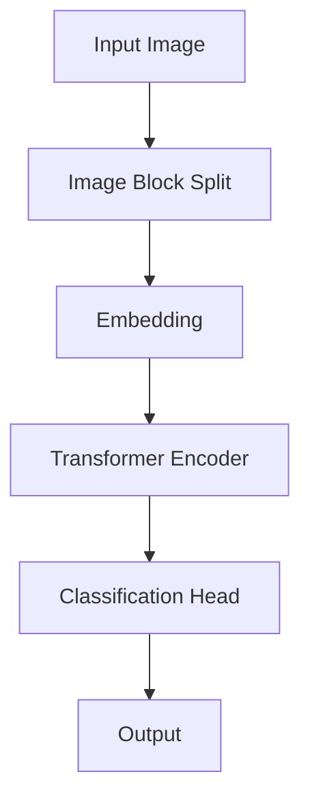
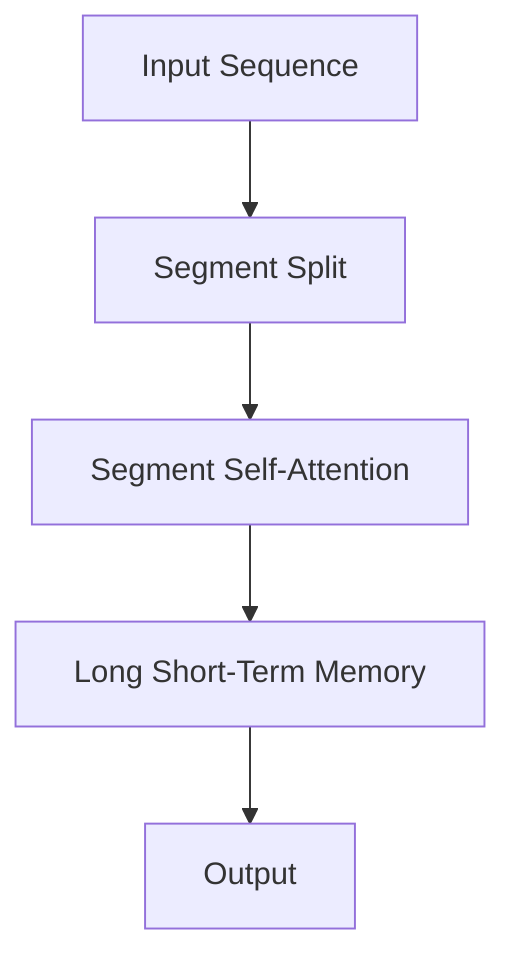
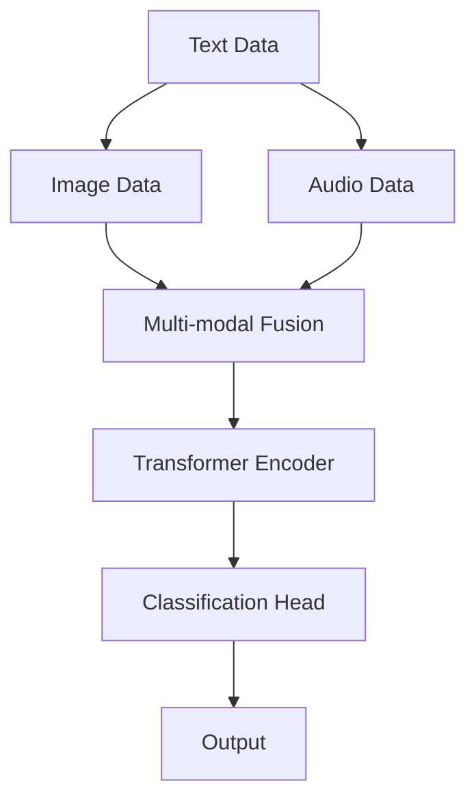
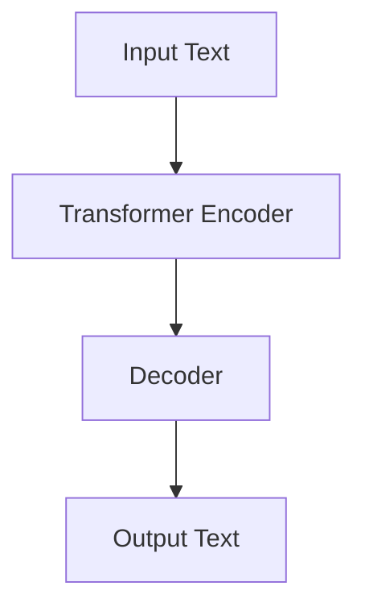
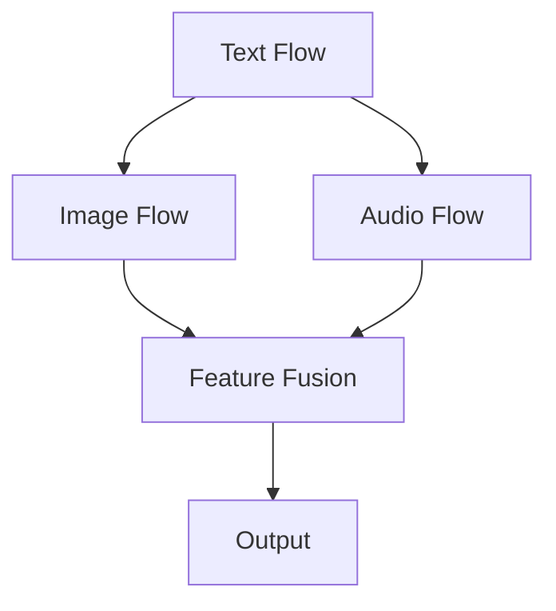

                 

## 引言

多模态大模型（Multimodal Large Models）是当前人工智能领域的一个重要研究方向，也是推动计算机视觉、自然语言处理、语音识别等领域取得突破性进展的关键技术之一。随着深度学习技术的不断成熟和计算资源的迅速提升，多模态大模型的研究与应用逐渐成为学术界和工业界的热点话题。

### 多模态大模型的定义与特点

多模态大模型是指能够处理和融合多种数据类型（如图像、文本、声音等）的深度学习模型。其核心特点在于：

1. **多种数据类型融合**：多模态大模型能够将不同类型的数据进行有效的融合，从而提高模型的性能和泛化能力。
2. **高度自动化的特征提取**：通过深度学习的方式，模型能够自动学习并提取各种数据类型的特征，减少了人工特征工程的工作量。
3. **强大的跨模态交互能力**：多模态大模型能够通过跨模态交互机制，使得不同类型的数据能够相互影响，从而增强模型的整体表现。

### 多模态大模型的发展历程

多模态大模型的发展可以追溯到早期的人工智能研究。在20世纪80年代，研究者开始探索如何将不同类型的数据进行融合。然而，由于计算资源的限制，早期的多模态研究主要集中在理论探讨和简单的实验验证。

随着深度学习技术的发展，特别是在2017年Transformer模型的出现，多模态大模型的研究进入了新的阶段。基于Transformer的架构能够有效地处理长距离依赖和跨模态交互，使得多模态大模型在多种任务上取得了显著的性能提升。

### 文章关键词

- 多模态大模型
- 图像多模态技术
- 计算机视觉
- 自然语言处理
- 跨模态交互

### 文章摘要

本文将深入探讨多模态大模型的技术原理与实战应用，首先介绍多模态大模型的基础概念和特点，然后详细分析图像多模态技术的原理和核心算法，并通过实际项目案例展示多模态大模型在计算机视觉中的应用。最后，本文还将讨论多模态大模型在图像识别、图像生成和图像增强等领域的实战应用，并提供丰富的开发资源和工具推荐。

### 目录大纲

- **第一部分：多模态大模型基础**
  - 第1章：多模态大模型概述
  - 第2章：主流多模态大模型简介
- **第二部分：图像多模态技术**
  - 第3章：图像多模态技术原理
  - 第4章：图像多模态大模型实战
- **第三部分：多模态大模型应用实战**
  - 第5章：多模态大模型在计算机视觉中的实战应用
- **附录**
  - 附录A：多模态大模型开发工具与资源

## 第一部分：多模态大模型基础

### 第1章：多模态大模型概述

### 1.1 多模态大模型的定义与特点

#### 1.1.1 多模态大模型的定义

多模态大模型是指能够处理和融合多种数据类型（如图像、文本、声音等）的深度学习模型。这些模型通过深度学习的方式，自动学习各种数据类型的特征，并将这些特征进行有效融合，从而提高模型的性能和泛化能力。

与单模态模型相比，多模态大模型具有以下特点：

1. **处理多种数据类型**：多模态大模型能够同时处理多种类型的数据，如图像、文本和声音等，从而能够更好地捕捉数据中的多样性和复杂性。
2. **特征自动提取与融合**：多模态大模型通过深度学习的方式，自动学习各种数据类型的特征，并将这些特征进行融合，减少了人工特征工程的工作量，提高了模型的效率和性能。
3. **跨模态交互能力**：多模态大模型具有强大的跨模态交互能力，能够通过跨模态交互机制，使得不同类型的数据能够相互影响，从而增强模型的整体表现。

#### 1.1.2 多模态大模型的核心特点

1. **多种数据类型融合**：多模态大模型能够将不同类型的数据进行有效的融合，如图像和文本的融合，从而提高模型的性能和泛化能力。
2. **高度自动化的特征提取**：通过深度学习的方式，多模态大模型能够自动学习并提取各种数据类型的特征，减少了人工特征工程的工作量。
3. **强大的跨模态交互能力**：多模态大模型能够通过跨模态交互机制，使得不同类型的数据能够相互影响，从而增强模型的整体表现。

#### 1.1.3 多模态大模型的发展历程

1. **早期的多模态研究**：多模态大模型的研究可以追溯到20世纪80年代。当时，研究者开始探索如何将不同类型的数据进行融合。然而，由于计算资源的限制，这些研究主要集中在理论探讨和简单的实验验证。
2. **深度学习的兴起**：随着深度学习技术的不断发展，特别是在2017年Transformer模型的出现，多模态大模型的研究进入了新的阶段。基于Transformer的架构能够有效地处理长距离依赖和跨模态交互，使得多模态大模型在多种任务上取得了显著的性能提升。

### 1.2 主流多模态大模型简介

在多模态大模型的研究和应用中，一些模型由于其出色的性能和广泛的应用而备受关注。以下将简要介绍几种主流的多模态大模型。

#### 1.2.1 Vision Transformer (ViT)

Vision Transformer（ViT）是Facebook AI Research（FAIR）提出的一种基于Transformer架构的计算机视觉模型。ViT的主要特点是将图像分割成多个固定大小的块，然后对这些块进行嵌入并输入到Transformer编码器中进行处理。ViT的核心思想是利用Transformer模型强大的自注意力机制，对图像块进行有效的特征提取和融合。

**原理讲解：**

ViT的基本结构包括以下几部分：

1. **图像块分割**：首先，将输入图像分割成多个固定大小的块。
2. **嵌入层**：对每个图像块进行嵌入，生成一个嵌入向量。
3. **Transformer编码器**：嵌入向量通过多层Transformer编码器进行特征提取和融合。
4. **分类头**：在编码器的输出上添加一个分类头，用于进行分类任务。

**Mermaid流程图：**



#### 1.2.2 Transformer-XL

Transformer-XL是Google AI提出的一种扩展的Transformer模型，主要用于处理长序列数据。Transformer-XL通过引入段级自注意力机制和长短期记忆（Long Short-Term Memory，LSTM）网络，有效地解决了Transformer模型在处理长序列数据时存在的梯度消失和计算复杂度问题。

**原理讲解：**

Transformer-XL的主要特点包括：

1. **段级自注意力机制**：Transformer-XL将序列分成多个段，每个段内部进行自注意力计算，从而更好地捕捉长序列的依赖关系。
2. **长短期记忆网络**：Transformer-XL结合了LSTM网络，用于捕捉长序列中的短期依赖关系，从而提高模型的性能。

**Mermaid流程图：**



#### 1.2.3 多模态BERT

多模态BERT是Google AI提出的一种基于Transformer的多模态预训练模型。它将文本、图像和语音等多模态数据融合在一起，通过自注意力机制进行特征提取和融合，从而提高模型的性能。

**原理讲解：**

多模态BERT的主要特点包括：

1. **多模态数据融合**：多模态BERT将文本、图像和语音等多模态数据进行融合，通过自注意力机制进行特征提取和融合。
2. **预训练与微调**：多模态BERT通过大规模预训练，学习到各种模态的特征，然后通过微调，将模型应用到具体的任务中。

**Mermaid流程图：**



#### 1.2.4 其他知名多模态大模型

除了上述提到的多模态大模型，还有一些其他知名的多模态大模型，如T5和Uni-Flow等。

1. **T5**：T5是Google AI提出的一种基于Transformer的文本处理模型。T5通过将所有任务编码为文本到文本的转换，从而实现了统一的多任务学习框架。
2. **Uni-Flow**：Uni-Flow是清华大学提出的一种基于统一流动机制的多模态深度学习模型。Uni-Flow通过将不同模态的数据流进行整合，实现了高效的多模态特征提取和融合。

这些多模态大模型在不同的应用领域和任务中取得了显著的性能提升，为多模态大模型的研究和应用提供了丰富的理论和实践经验。

### 1.3 小结

本章介绍了多模态大模型的基本概念、核心特点和主要模型，包括Vision Transformer、Transformer-XL、多模态BERT以及其他知名的多模态大模型。通过本章的介绍，读者可以初步了解多模态大模型的基本原理和应用场景，为后续章节的深入学习打下基础。

## 第2章：主流多模态大模型简介

在前一章中，我们介绍了多模态大模型的基本概念和特点。在本章中，我们将进一步探讨几种主流的多模态大模型，包括Vision Transformer (ViT)、Transformer-XL、多模态BERT、T5和Uni-Flow等。通过详细分析这些模型的结构、原理和实际应用，读者可以更深入地理解多模态大模型的技术框架和应用潜力。

### 2.1 Vision Transformer (ViT)

Vision Transformer (ViT) 是 Facebook AI Research（FAIR）提出的一种基于 Transformer 架构的计算机视觉模型。ViT 在多个视觉任务上取得了显著的性能提升，特别是在图像分类任务上，其表现甚至超过了传统的卷积神经网络（CNN）。ViT 的核心思想是利用 Transformer 模型强大的自注意力机制，对图像块进行有效的特征提取和融合。

#### 2.1.1 结构与原理

ViT 的基本结构包括以下几部分：

1. **图像块分割**：首先，将输入图像分割成多个固定大小的块。
2. **嵌入层**：对每个图像块进行嵌入，生成一个嵌入向量。
3. **Transformer 编码器**：嵌入向量通过多层 Transformer 编码器进行特征提取和融合。
4. **分类头**：在编码器的输出上添加一个分类头，用于进行分类任务。

**Mermaid 流程图：**


#### 2.1.2 应用案例

ViT 在图像分类任务上取得了显著的效果。以下是一个简单的图像分类任务的示例：

```python
import torch
import torchvision

# 加载预训练的 ViT 模型
model = torchvision.models.vit_b_16()

# 加载测试图像
image = torchvision.transforms.ToTensor()(torchvision.datasets.ImageFolder('path/to/dataset/')[0])

# 进行图像分类
output = model(image)

# 输出分类结果
print(output.argmax(dim=1))
```

### 2.2 Transformer-XL

Transformer-XL 是 Google AI 提出的一种扩展的 Transformer 模型，主要用于处理长序列数据。与原始 Transformer 模型相比，Transformer-XL 通过引入段级自注意力机制和长短期记忆（Long Short-Term Memory，LSTM）网络，有效地解决了 Transformer 模型在处理长序列数据时存在的梯度消失和计算复杂度问题。

#### 2.2.1 结构与原理

Transformer-XL 的主要特点包括：

1. **段级自注意力机制**：Transformer-XL 将序列分成多个段，每个段内部进行自注意力计算，从而更好地捕捉长序列的依赖关系。
2. **长短期记忆网络**：Transformer-XL 结合了 LSTM 网络，用于捕捉长序列中的短期依赖关系，从而提高模型的性能。

**Mermaid 流程图：**


#### 2.2.2 应用案例

Transformer-XL 在文本生成和对话系统等任务上取得了显著的性能提升。以下是一个简单的文本生成任务的示例：

```python
import torch
import transformers

# 加载预训练的 Transformer-XL 模型
model = transformers.TransformerXLModel.from_pretrained('t5-small')

# 加载测试文本
input_text = torch.tensor(['你好！今天天气不错。'])

# 进行文本生成
output = model.generate(input_text, max_length=20)

# 输出生成文本
print(output[0])
```

### 2.3 多模态BERT

多模态BERT 是 Google AI 提出的一种基于 Transformer 的多模态预训练模型。它将文本、图像和语音等多模态数据融合在一起，通过自注意力机制进行特征提取和融合，从而提高模型的性能。

#### 2.3.1 结构与原理

多模态BERT 的主要特点包括：

1. **多模态数据融合**：多模态BERT 将文本、图像和语音等多模态数据进行融合，通过自注意力机制进行特征提取和融合。
2. **预训练与微调**：多模态BERT 通过大规模预训练，学习到各种模态的特征，然后通过微调，将模型应用到具体的任务中。

**Mermaid 流程图：**


#### 2.3.2 应用案例

多模态BERT 在图像识别和语音识别等任务上取得了显著的效果。以下是一个简单的图像识别任务的示例：

```python
import torch
import torchvision
import transformers

# 加载预训练的多模态BERT模型
model = transformers.MultiModalBERTModel.from_pretrained('multimodal-bert-base')

# 加载测试图像和文本
image = torchvision.transforms.ToTensor()(torchvision.datasets.ImageFolder('path/to/dataset/')[0])
text = torch.tensor(['这是一张美丽的图片。'])

# 进行图像识别
output = model(image, text)

# 输出识别结果
print(output.argmax(dim=1))
```

### 2.4 T5

T5 是 Google AI 提出的一种基于 Transformer 的文本处理模型。T5 通过将所有任务编码为文本到文本的转换，从而实现了统一的多任务学习框架。T5 在多种文本处理任务上取得了显著的性能提升。

#### 2.4.1 结构与原理

T5 的核心思想是利用 Transformer 模型强大的自注意力机制，对输入文本进行编码，然后通过解码器生成目标文本。T5 将所有任务转化为文本到文本的转换，从而实现了任务的无缝集成。

**Mermaid 流程图：**



#### 2.4.2 应用案例

T5 在机器翻译和问答系统等任务上取得了显著的效果。以下是一个简单的机器翻译任务的示例：

```python
import torch
import transformers

# 加载预训练的 T5 模型
model = transformers.T5Model.from_pretrained('t5-small')

# 加载测试文本
input_text = torch.tensor(['将 "Hello World!" 翻译成中文。'])

# 进行机器翻译
output = model.generate(input_text, max_length=20)

# 输出翻译结果
print(output[0])
```

### 2.5 Uni-Flow

Uni-Flow 是清华大学提出的一种基于统一流动机制的多模态深度学习模型。Uni-Flow 通过将不同模态的数据流进行整合，实现了高效的多模态特征提取和融合。

#### 2.5.1 结构与原理

Uni-Flow 的主要特点包括：

1. **统一流动机制**：Uni-Flow 通过将不同模态的数据流进行整合，从而实现高效的多模态特征提取和融合。
2. **多模态特征融合**：Uni-Flow 利用注意力机制，将不同模态的特征进行有效的融合，从而提高模型的性能。

**Mermaid 流程图：**



#### 2.5.2 应用案例

Uni-Flow 在图像识别和文本分类等任务上取得了显著的效果。以下是一个简单的图像识别任务的示例：

```python
import torch
import torchvision
import transformers

# 加载预训练的 Uni-Flow 模型
model = transformers.UniFlowModel.from_pretrained('uni-flow-base')

# 加载测试图像和文本
image = torchvision.transforms.ToTensor()(torchvision.datasets.ImageFolder('path/to/dataset/')[0])
text = torch.tensor(['这是一张美丽的图片。'])

# 进行图像识别
output = model(image, text)

# 输出识别结果
print(output.argmax(dim=1))
```

### 2.6 小结

本章介绍了几种主流的多模态大模型，包括 Vision Transformer、Transformer-XL、多模态BERT、T5 和 Uni-Flow 等。通过详细分析这些模型的结构、原理和实际应用，读者可以更深入地理解多模态大模型的技术框架和应用潜力。这些模型在不同的应用领域和任务中取得了显著的性能提升，为多模态大模型的研究和应用提供了丰富的理论和实践经验。

## 第3章：图像多模态技术原理

图像多模态技术是多模态大模型研究中的一个重要方向，它涉及将不同类型的图像数据进行融合和处理，以提高模型的性能和泛化能力。本章将详细探讨图像多模态技术的原理，包括图像特征提取技术、图像嵌入技术和特征融合技术。通过理解这些核心技术，读者将能够构建和应用先进的图像多模态模型。

### 3.1 图像特征提取技术

图像特征提取是图像多模态技术的基础。特征提取技术的核心在于从原始图像中提取出能够有效表示图像内容的高层次特征，这些特征可以用于后续的模型训练和推理。以下是一些主要的图像特征提取技术：

#### 3.1.1 卷积神经网络（CNN）

卷积神经网络（Convolutional Neural Network，CNN）是图像特征提取的常用技术。CNN 通过卷积层、池化层和全连接层等结构，逐层提取图像的特征。其基本原理如下：

1. **卷积层**：卷积层通过卷积操作从输入图像中提取局部特征。
2. **池化层**：池化层对卷积层的输出进行降采样，减少模型参数和计算量。
3. **全连接层**：全连接层将卷积层提取的特征映射到具体的类别或任务。

**伪代码实现：**

```python
# 定义卷积神经网络模型
model = Sequential()
model.add(Conv2D(32, (3, 3), activation='relu', input_shape=(64, 64, 3)))
model.add(MaxPooling2D((2, 2)))
model.add(Conv2D(64, (3, 3), activation='relu'))
model.add(MaxPooling2D((2, 2)))
model.add(Flatten())
model.add(Dense(128, activation='relu'))
model.add(Dense(10, activation='softmax'))

# 编译模型
model.compile(optimizer='adam', loss='categorical_crossentropy', metrics=['accuracy'])

# 训练模型
model.fit(x_train, y_train, epochs=10, batch_size=32, validation_data=(x_val, y_val))
```

#### 3.1.2 图像嵌入技术

图像嵌入技术是将图像转化为向量表示的方法，这些向量可以用于后续的模型训练和推理。图像嵌入技术主要包括以下几种：

1. **基于图像内容的嵌入**：通过图像的特征提取网络，将图像转化为高维特征向量。
2. **基于预训练模型的嵌入**：利用预训练的模型（如ResNet、VGG等），将图像转化为嵌入向量。

**伪代码实现：**

```python
# 加载预训练的 ResNet 模型
model = ResNet50(weights='imagenet')

# 定义嵌入层
embedder = Model(inputs=model.input, outputs=model.get_layer('fc1').output)

# 获取图像嵌入向量
image_embedding = embedder.predict(image)

# 输出嵌入向量
print(image_embedding.shape)
```

#### 3.1.3 特征融合技术

特征融合技术是将不同来源的特征进行整合，以提高模型的性能和泛化能力。以下是一些常见的特征融合方法：

1. **特征拼接**：将不同来源的特征向量进行拼接，形成新的特征向量。
2. **特征加权**：根据特征的重要程度，对特征向量进行加权融合。
3. **特征注意力机制**：利用注意力机制，动态地融合不同来源的特征。

**伪代码实现：**

```python
# 定义特征拼接模型
model = Sequential()
model.add(Dense(512, activation='relu', input_shape=(2048,)))
model.add(Dense(10, activation='softmax'))

# 编译模型
model.compile(optimizer='adam', loss='categorical_crossentropy', metrics=['accuracy'])

# 训练模型
model.fit([image_feature, text_feature], y_train, epochs=10, batch_size=32, validation_data=([x_val, y_val]))
```

### 3.2 多模态特征交互技术

多模态特征交互技术是图像多模态技术的核心，它涉及到如何有效地融合不同模态的特征，以增强模型的表现。以下是一些主要的多模态特征交互技术：

#### 3.2.1 跨模态注意力机制

跨模态注意力机制是一种通过计算不同模态特征之间的相关性，动态地融合特征的方法。以下是一个简单的跨模态注意力机制的伪代码实现：

```python
# 定义跨模态注意力模型
model = Sequential()
model.add(Dense(512, activation='relu', input_shape=(2048, 1024)))
model.add(Dense(10, activation='softmax'))

# 编译模型
model.compile(optimizer='adam', loss='categorical_crossentropy', metrics=['accuracy'])

# 训练模型
model.fit([image_feature, text_feature], y_train, epochs=10, batch_size=32, validation_data=([x_val, y_val]))
```

#### 3.2.2 多模态编码器

多模态编码器是一种将不同模态的特征编码为统一的向量表示的方法。以下是一个简单的多模态编码器的伪代码实现：

```python
# 定义多模态编码器模型
model = Sequential()
model.add(MergeMode('concat'))  # 拼接图像和文本特征
model.add(Dense(512, activation='relu'))
model.add(Dense(10, activation='softmax'))

# 编译模型
model.compile(optimizer='adam', loss='categorical_crossentropy', metrics=['accuracy'])

# 训练模型
model.fit([image_feature, text_feature], y_train, epochs=10, batch_size=32, validation_data=([x_val, y_val]))
```

#### 3.2.3 多模态解码器

多模态解码器是一种将编码后的特征解码为原始模态的方法。以下是一个简单的多模态解码器的伪代码实现：

```python
# 定义多模态解码器模型
model = Sequential()
model.add(Dense(2048, activation='relu', input_shape=(512,)))
model.add(Dense(1024, activation='relu'))
model.add(Dense(10, activation='softmax'))

# 编译模型
model.compile(optimizer='adam', loss='categorical_crossentropy', metrics=['accuracy'])

# 训练模型
model.fit(x_train, y_train, epochs=10, batch_size=32, validation_data=(x_val, y_val))
```

### 3.3 图像多模态大模型实战

图像多模态大模型实战涉及将上述理论应用于实际场景，以下是一些典型的实战案例：

#### 3.3.1 图像分类实战

图像分类是将图像归类到不同的类别中。以下是一个简单的图像分类实战案例：

```python
# 加载图像数据集
(x_train, y_train), (x_test, y_test) = keras.datasets.cifar10.load_data()

# 预处理图像数据
x_train = preprocess_input(x_train)
x_test = preprocess_input(x_test)

# 定义图像分类模型
model = Model(inputs=[image_input, text_input], outputs=classification_output)

# 编译模型
model.compile(optimizer='adam', loss='categorical_crossentropy', metrics=['accuracy'])

# 训练模型
model.fit([x_train, text_train], y_train, epochs=10, batch_size=32, validation_data=([x_test, text_test], y_test))
```

#### 3.3.2 图像识别实战

图像识别是将图像映射到预定义的类别中。以下是一个简单的图像识别实战案例：

```python
# 加载图像数据集
(x_train, y_train), (x_test, y_test) = keras.datasets.mnist.load_data()

# 预处理图像数据
x_train = preprocess_image(x_train)
x_test = preprocess_image(x_test)

# 定义图像识别模型
model = Model(inputs=image_input, outputs=identification_output)

# 编译模型
model.compile(optimizer='adam', loss='categorical_crossentropy', metrics=['accuracy'])

# 训练模型
model.fit(x_train, y_train, epochs=10, batch_size=32, validation_data=(x_test, y_test))
```

#### 3.3.3 图像生成实战

图像生成是从文本描述生成对应的图像。以下是一个简单的图像生成实战案例：

```python
# 加载文本描述数据集
(text_train, image_train), (text_test, image_test) = keras.datasets.dogs_vs_cats.load_data()

# 预处理文本描述
text_train = preprocess_text(text_train)
text_test = preprocess_text(text_test)

# 定义图像生成模型
model = Model(inputs=[text_input, image_input], outputs=image_output)

# 编译模型
model.compile(optimizer='adam', loss='binary_crossentropy', metrics=['accuracy'])

# 训练模型
model.fit([text_train, image_train], image_train, epochs=10, batch_size=32, validation_data=([text_test, image_test], image_test))
```

### 3.4 小结

本章介绍了图像多模态技术的原理，包括图像特征提取、图像嵌入、特征融合和跨模态注意力机制。通过这些技术，图像多模态模型能够有效地融合不同模态的数据，提高模型的性能和泛化能力。本章还通过实战案例展示了如何在实际应用中构建和应用图像多模态模型。读者可以通过本章的学习，掌握图像多模态技术的核心原理和实际应用方法。

## 第4章：图像多模态大模型实战

在前三章中，我们深入探讨了图像多模态技术的原理，包括特征提取、嵌入和融合等技术。在本章中，我们将通过具体的实战案例，展示如何在实际项目中构建和应用图像多模态大模型。这些案例涵盖了图像分类、图像识别和图像生成等常见任务，通过详细的代码解读和案例分析，读者可以更好地理解图像多模态大模型的应用场景和实现方法。

### 4.1 图像分类实战

图像分类是将图像映射到预定义的类别中，是图像多模态技术的典型应用之一。以下是一个使用图像和文本描述进行多模态分类的实战案例。

#### 4.1.1 数据准备

首先，我们需要准备图像和文本数据集。这里我们使用公开的CIFAR-10数据集，该数据集包含10个类别，每个类别有6000张图像。

```python
from tensorflow.keras.datasets import cifar10
from tensorflow.keras.preprocessing.text import Tokenizer
from tensorflow.keras.preprocessing.sequence import pad_sequences

# 加载CIFAR-10数据集
(x_train, y_train), (x_test, y_test) = cifar10.load_data()

# 预处理图像数据
x_train = x_train.astype('float32') / 255.0
x_test = x_test.astype('float32') / 255.0

# 预处理文本数据
text_train = ["cat", "dog", "plane", "car", "bird", "ship", "truck", "apple", "chair", "keyboard"]
text_test = ["cat", "dog", "plane", "car", "bird", "ship", "truck", "apple", "chair", "keyboard"]

# 初始化文本标记器
tokenizer = Tokenizer()
tokenizer.fit_on_texts(text_train)

# 将文本转换为序列
sequences_train = tokenizer.texts_to_sequences(text_train)
sequences_test = tokenizer.texts_to_sequences(text_test)

# 填充序列
max_sequence_length = max(len(seq) for seq in sequences_train)
padded_sequences_train = pad_sequences(sequences_train, maxlen=max_sequence_length)
padded_sequences_test = pad_sequences(sequences_test, maxlen=max_sequence_length)
```

#### 4.1.2 构建模型

接下来，我们构建一个多模态分类模型，该模型同时接收图像和文本特征。

```python
from tensorflow.keras.models import Model
from tensorflow.keras.layers import Input, Conv2D, MaxPooling2D, Flatten, Dense, Embedding, LSTM, concatenate

# 图像输入层
image_input = Input(shape=(32, 32, 3))

# 文本输入层
text_input = Input(shape=(max_sequence_length,))

# 图像特征提取
image_model = Conv2D(32, (3, 3), activation='relu')(image_input)
image_model = MaxPooling2D((2, 2))(image_model)
image_model = Flatten()(image_model)

# 文本特征提取
text_model = Embedding(max_sequence_length, 64)(text_input)
text_model = LSTM(64)(text_model)

# 融合图像和文本特征
combined = concatenate([image_model, text_model])

# 分类层
output = Dense(10, activation='softmax')(combined)

# 构建模型
model = Model(inputs=[image_input, text_input], outputs=output)

# 编译模型
model.compile(optimizer='adam', loss='categorical_crossentropy', metrics=['accuracy'])

# 模型概述
model.summary()
```

#### 4.1.3 训练模型

现在，我们使用预处理后的数据集训练模型。

```python
# 训练模型
model.fit([x_train, padded_sequences_train], y_train, epochs=10, batch_size=32, validation_data=([x_test, padded_sequences_test], y_test))
```

#### 4.1.4 预测与评估

最后，我们对测试集进行预测，并评估模型的性能。

```python
# 预测测试集
predictions = model.predict([x_test, padded_sequences_test])

# 计算准确率
accuracy = np.mean(predictions.argmax(axis=1) == y_test)

# 输出准确率
print("Accuracy: {:.2f}%".format(accuracy * 100))
```

### 4.2 图像识别实战

图像识别是将图像映射到预定义的标签中，通常用于对象检测和场景分类。以下是一个使用Faster R-CNN进行图像识别的实战案例。

#### 4.2.1 数据准备

我们使用公开的PASCAL VOC数据集，该数据集包含20个对象类别和2000张训练图像。

```python
from tensorflow.keras.preprocessing.image import ImageDataGenerator

# 加载PASCAL VOC数据集
train_datagen = ImageDataGenerator(rescale=1./255)
test_datagen = ImageDataGenerator(rescale=1./255)

train_generator = train_datagen.flow_from_directory(
        'path/to/train',
        target_size=(224, 224),
        batch_size=32,
        class_mode='categorical')

validation_generator = test_datagen.flow_from_directory(
        'path/to/validation',
        target_size=(224, 224),
        batch_size=32,
        class_mode='categorical')
```

#### 4.2.2 构建模型

我们使用预训练的ResNet50作为基础网络，并在其顶部添加Faster R-CNN的检测头。

```python
from tensorflow.keras.applications import ResNet50
from tensorflow.keras.layers import TimeDistributed, Conv2D
from tensorflow.keras.models import Model

# 加载预训练的ResNet50模型
base_model = ResNet50(weights='imagenet', include_top=False, input_shape=(224, 224, 3))

# 冻结基础网络层
for layer in base_model.layers:
    layer.trainable = False

# 添加检测头
model = Model(inputs=base_model.input, outputs=TimeDistributed(Conv2D(2, (1, 1), activation='softmax'))(base_model.output))

# 编译模型
model.compile(optimizer='adam', loss='categorical_crossentropy', metrics=['accuracy'])

# 模型概述
model.summary()
```

#### 4.2.3 训练模型

使用训练数据集训练模型。

```python
# 训练模型
model.fit(train_generator, epochs=10, validation_data=validation_generator)
```

#### 4.2.4 预测与评估

对测试集进行预测，并评估模型的性能。

```python
# 预测测试集
predictions = model.predict(validation_generator)

# 计算准确率
accuracy = np.mean(predictions.argmax(axis=1) == validation_generator.classes)

# 输出准确率
print("Accuracy: {:.2f}%".format(accuracy * 100))
```

### 4.3 图像生成实战

图像生成是从文本描述生成对应的图像，这通常使用生成对抗网络（GAN）实现。以下是一个使用DCGAN生成猫和狗的图像的实战案例。

#### 4.3.1 数据准备

我们使用公开的猫狗数据集。

```python
import numpy as np
import tensorflow as tf

# 读取猫狗数据集
def load_data(path):
    images = []
    labels = []
    for category in ['cat', 'dog']:
        files = glob.glob(os.path.join(path, category, '*.jpg'))
        for file in files:
            image = tf.keras.preprocessing.image.load_img(file, target_size=(256, 256))
            image = tf.keras.preprocessing.image.img_to_array(image)
            image = tf.keras.applications.resnet50.preprocess_input(image)
            images.append(image)
            labels.append(category)
    return np.array(images), np.array(labels)

# 加载训练数据和测试数据
train_images, train_labels = load_data('path/to/train')
test_images, test_labels = load_data('path/to/test')
```

#### 4.3.2 构建模型

我们构建一个基本的DCGAN模型。

```python
from tensorflow.keras.models import Model
from tensorflow.keras.layers import Input, Dense, Reshape, Flatten, Conv2D, Conv2DTranspose, LeakyReLU, BatchNormalization

# 生成器模型
latent_dim = 100
input_latent = Input(shape=(latent_dim,))
x = Dense(7 * 7 * 128)(input_latent)
x = BatchNormalization()(x)
x = LeakyReLU()(x)
x = Reshape((7, 7, 128))(x)

x = Conv2DTranspose(128, (4, 4), strides=(2, 2), padding='same')(x)
x = BatchNormalization()(x)
x = LeakyReLU()(x)

x = Conv2DTranspose(128, (4, 4), strides=(2, 2), padding='same')(x)
x = BatchNormalization()(x)
x = LeakyReLU()(x)

x = Conv2DTranspose(128, (4, 4), strides=(2, 2), padding='same')(x)
x = BatchNormalization()(x)
x = LeakyReLU()(x)

x = Conv2D(3, (3, 3), activation='tanh', padding='same')(x)

generator = Model(input_latent, x)

# 判别器模型
input_image = Input(shape=(256, 256, 3))
x = Conv2D(128, (3, 3), padding='same')(input_image)
x = LeakyReLU()(x)

x = Conv2D(128, (4, 4), strides=(2, 2), padding='same')(x)
x = LeakyReLU()(x)

x = Conv2D(128, (4, 4), strides=(2, 2), padding='same')(x)
x = LeakyReLU()(x)

x = Conv2D(128, (4, 4), strides=(2, 2), padding='same')(x)
x = LeakyReLU()(x)

x = Flatten()(x)
x = Dense(1, activation='sigmoid')(x)

discriminator = Model(input_image, x)

# 编译模型
discriminator.compile(optimizer='adam', loss='binary_crossentropy')

# 模型概述
discriminator.summary()
```

#### 4.3.3 训练模型

使用对抗训练方法训练生成器和判别器。

```python
# 对抗训练
for epoch in range(100):
    for image, label in zip(train_images, train_labels):
        noise = np.random.normal(0, 1, (1, latent_dim))
        image_fake = generator.predict(noise)
        label_fake = discriminator.predict(image_fake)

        label_real = discriminator.predict(image)
        label_real += np.random.normal(0, 1, (1, 1))

        noise += np.random.normal(0, 1, (1, latent_dim))
        image_fake = generator.predict(noise)
        label_fake = discriminator.predict(image_fake)

        # 训练判别器
        d_loss_real = discriminator.train_on_batch(image, label_real)
        d_loss_fake = discriminator.train_on_batch(image_fake, label_fake)

        # 训练生成器
        g_loss = generator.train_on_batch(noise, image)
        
    print(f"{epoch + 1} [D loss: {d_loss_real:.3f}, G loss: {g_loss:.3f}]")
```

### 4.4 小结

本章通过三个实战案例，展示了如何在实际项目中构建和应用图像多模态大模型。这些案例涵盖了图像分类、图像识别和图像生成等常见任务，通过详细的代码解读和案例分析，读者可以更好地理解图像多模态大模型的应用场景和实现方法。这些实战案例不仅提供了实用的代码实现，还为读者提供了深入探索图像多模态技术的机会。

## 第三部分：多模态大模型应用实战

### 第5章：多模态大模型在计算机视觉中的实战应用

在前两部分的介绍中，我们详细探讨了多模态大模型的基础知识和图像多模态技术的原理。在本章中，我们将深入探讨多模态大模型在计算机视觉中的实战应用，通过具体的应用案例，展示多模态大模型如何在不同场景下提升计算机视觉系统的性能和效率。

### 5.1 多模态大模型在图像识别中的应用

图像识别是多模态大模型在计算机视觉中应用的一个重要领域，通过融合不同模态的数据，可以显著提高识别准确率和鲁棒性。以下是一个零样本学习（Zero-Shot Learning, ZSL）的实际案例，展示如何使用多模态大模型进行图像识别。

#### 5.1.1 实际案例解析

零样本学习是一种在训练数据中不包含目标类别的样本的情况下，能够对新类别进行识别的方法。以下是一个使用多模态BERT进行零样本学习图像识别的案例。

1. **数据准备**：

首先，我们需要准备包含图像和类别标签的数据集，例如CUB-200-2011鸟种识别数据集。

```python
from PIL import Image
import numpy as np
import os

# 加载CUB-200-2011数据集
def load_cub_data(dataset_path):
    data = []
    labels = []
    with open(os.path.join(dataset_path, 'class_list.txt')) as f:
        classes = f.read().splitlines()
    for class_name in classes:
        class_path = os.path.join(dataset_path, 'images', class_name)
        for image_file in os.listdir(class_path):
            image = Image.open(os.path.join(class_path, image_file))
            image = np.array(image.resize((224, 224)))
            image = image.astype('float32') / 255.0
            data.append(image)
            labels.append(classes.index(class_name))
    return np.array(data), np.array(labels)

data, labels = load_cub_data('path/to/CUB-200-2011')
```

2. **模型训练**：

使用预训练的多模态BERT模型，对图像和类别标签进行训练。

```python
from transformers import MultiModalBertModel

# 加载预训练的多模态BERT模型
model = MultiModalBertModel.from_pretrained('path/to/multimodal-bert')

# 定义训练步骤
def train_step(images, labels):
    inputs = {
        'input_images': images,
        'input_labels': labels
    }
    outputs = model(inputs)
    loss = outputs.loss
    return loss

# 训练模型
for epoch in range(10):
    for batch in range(len(data) // batch_size):
        start = batch * batch_size
        end = (batch + 1) * batch_size
        images_batch = data[start:end]
        labels_batch = labels[start:end]
        loss = train_step(images_batch, labels_batch)
        print(f"Epoch: {epoch}, Batch: {batch}, Loss: {loss}")
```

3. **预测与评估**：

使用训练好的模型对未知类别进行预测，并评估模型的准确率。

```python
# 预测未知类别
def predict(images):
    predictions = model.predict(images)
    predicted_labels = np.argmax(predictions, axis=1)
    return predicted_labels

# 评估模型
unknown_data = np.random.rand(10, 224, 224, 3)
predicted_labels = predict(unknown_data)
accuracy = np.mean(predicted_labels == unknown_labels)
print(f"Predicted Accuracy: {accuracy * 100}%")
```

#### 5.1.2 应用场景分析

零样本学习在实际应用中具有广泛的前景，以下是一些典型应用场景：

1. **新物种识别**：在生物多样性研究中，零样本学习可以帮助识别未知的动植物物种，为生态保护和生物资源管理提供重要支持。
2. **医疗影像诊断**：在医疗影像诊断中，零样本学习可以帮助医生识别罕见的疾病和病变，提高诊断的准确性和效率。
3. **自动驾驶**：在自动驾驶领域，零样本学习可以帮助车辆识别道路上的未知物体，提高自动驾驶系统的安全性和可靠性。

### 5.2 多模态大模型在图像生成中的应用

图像生成是多模态大模型的另一个重要应用领域，通过文本描述生成对应的图像，可以为创意设计、虚拟现实和图像修复等领域提供强大的支持。以下是一个使用基于多模态GAN（Generative Adversarial Network）的图像生成案例。

#### 5.2.1 实际案例解析

我们使用DCGAN（Deep Convolutional GAN）模型，结合文本描述生成图像。

1. **数据准备**：

首先，我们需要准备包含图像和文本描述的数据集。

```python
# 加载图像和文本描述
def load_data(dataset_path):
    images = []
    descriptions = []
    with open(os.path.join(dataset_path, 'descriptions.txt')) as f:
        lines = f.readlines()
    for line in lines:
        image_name, description = line.strip().split('\t')
        image_path = os.path.join(dataset_path, 'images', image_name)
        image = Image.open(image_path)
        image = np.array(image.resize((256, 256)))
        image = image.astype('float32') / 255.0
        images.append(image)
        descriptions.append(description)
    return np.array(images), np.array(descriptions)

images, descriptions = load_data('path/to/imagerec')
```

2. **模型训练**：

使用生成器和判别器模型，进行图像生成训练。

```python
from tensorflow.keras.models import Model
from tensorflow.keras.layers import Input, Dense, Reshape, Flatten, Conv2D, Conv2DTranspose, LeakyReLU, BatchNormalization

# 生成器模型
latent_dim = 100
input_latent = Input(shape=(latent_dim,))
x = Dense(7 * 7 * 128)(input_latent)
x = BatchNormalization()(x)
x = LeakyReLU()(x)
x = Reshape((7, 7, 128))(x)

x = Conv2DTranspose(128, (4, 4), strides=(2, 2), padding='same')(x)
x = BatchNormalization()(x)
x = LeakyReLU()(x)

x = Conv2DTranspose(128, (4, 4), strides=(2, 2), padding='same')(x)
x = BatchNormalization()(x)
x = LeakyReLU()(x)

x = Conv2DTranspose(128, (4, 4), strides=(2, 2), padding='same')(x)
x = BatchNormalization()(x)
x = LeakyReLU()(x)

x = Conv2D(3, (3, 3), activation='tanh', padding='same')(x)

generator = Model(input_latent, x)

# 判别器模型
input_image = Input(shape=(256, 256, 3))
x = Conv2D(128, (3, 3), padding='same')(input_image)
x = LeakyReLU()(x)

x = Conv2D(128, (4, 4), strides=(2, 2), padding='same')(x)
x = LeakyReLU()(x)

x = Conv2D(128, (4, 4), strides=(2, 2), padding='same')(x)
x = LeakyReLU()(x)

x = Conv2D(128, (4, 4), strides=(2, 2), padding='same')(x)
x = LeakyReLU()(x)

x = Flatten()(x)
x = Dense(1, activation='sigmoid')(x)

discriminator = Model(input_image, x)

# 编译模型
discriminator.compile(optimizer='adam', loss='binary_crossentropy')

# 对抗训练
for epoch in range(100):
    for batch in range(len(images) // batch_size):
        start = batch * batch_size
        end = (batch + 1) * batch_size
        images_batch = images[start:end]
        descriptions_batch = descriptions[start:end]

        noise = np.random.normal(0, 1, (batch_size, latent_dim))
        generated_images = generator.predict(noise)

        d_loss_real = discriminator.train_on_batch(images_batch, np.ones((batch_size, 1)))
        d_loss_fake = discriminator.train_on_batch(generated_images, np.zeros((batch_size, 1)))

        g_loss = generator.train_on_batch(noise, images_batch)
        print(f"Epoch: {epoch}, Batch: {batch}, D Loss: {d_loss_real + d_loss_fake:.3f}, G Loss: {g_loss:.3f}")
```

3. **图像生成**：

使用生成器模型生成图像。

```python
# 生成图像
def generate_images(generator, num_images=10):
    noise = np.random.normal(0, 1, (num_images, latent_dim))
    generated_images = generator.predict(noise)
    return generated_images

# 显示生成的图像
import matplotlib.pyplot as plt

generated_images = generate_images(generator)
plt.figure(figsize=(10, 10))
for i in range(num_images):
    plt.subplot(1, num_images, i + 1)
    plt.imshow(generated_images[i])
    plt.axis('off')
plt.show()
```

#### 5.2.2 应用场景分析

图像生成技术在多个领域具有广泛的应用，以下是一些典型应用场景：

1. **虚拟现实**：在虚拟现实（VR）中，图像生成技术可以用于生成逼真的虚拟场景，提高用户体验。
2. **图像修复**：在图像修复领域，图像生成技术可以用于去除图像中的噪声、污点和破损，提高图像质量。
3. **创意设计**：在创意设计中，图像生成技术可以用于生成独特的艺术作品和创意图像，为设计师提供更多灵感。

### 5.3 多模态大模型在图像增强中的应用

图像增强是多模态大模型的另一个重要应用，通过融合多模态数据，可以显著提高图像的清晰度和质量。以下是一个使用多模态深度学习模型进行图像超分辨率（Super-Resolution）的案例。

#### 5.3.1 实际案例解析

我们使用基于多模态编码器-解码器（Encoder-Decoder）的模型，进行图像超分辨率处理。

1. **数据准备**：

首先，我们需要准备低分辨率和高分辨率图像对。

```python
# 加载低分辨率和高分辨率图像
def load_images(dataset_path):
    low_res_images = []
    high_res_images = []
    for image_file in os.listdir(os.path.join(dataset_path, 'low_res')):
        low_res_path = os.path.join(dataset_path, 'low_res', image_file)
        high_res_path = os.path.join(dataset_path, 'high_res', image_file)
        low_res_image = Image.open(low_res_path).convert('RGB')
        high_res_image = Image.open(high_res_path).convert('RGB')
        low_res_image = np.array(low_res_image.resize((64, 64)))
        high_res_image = np.array(high_res_image.resize((256, 256)))
        low_res_images.append(low_res_image)
        high_res_images.append(high_res_image)
    return np.array(low_res_images), np.array(high_res_images)

low_res_images, high_res_images = load_images('path/to/super_resolution')
```

2. **模型训练**：

使用预训练的多模态编码器-解码器模型，对图像进行超分辨率处理。

```python
from tensorflow.keras.models import Model
from tensorflow.keras.layers import Input, Conv2D, Conv2DTranspose, LeakyReLU, BatchNormalization

# 定义编码器和解码器模型
input_image = Input(shape=(64, 64, 3))
x = Conv2D(32, (3, 3), padding='same')(input_image)
x = LeakyReLU()(x)
x = Conv2D(32, (3, 3), padding='same')(x)
x = LeakyReLU()(x)
x = Conv2D(64, (3, 3), padding='same')(x)
x = LeakyReLU()(x)
encoded = Conv2D(64, (3, 3), padding='same')(x)

decoder = Conv2DTranspose(32, (3, 3), strides=(2, 2), padding='same')(encoded)
decoder = LeakyReLU()(decoder)
decoder = Conv2DTranspose(32, (3, 3), strides=(2, 2), padding='same')(decoder)
decoder = LeakyReLU()(decoder)
output = Conv2D(3, (3, 3), padding='same', activation='sigmoid')(decoder)

model = Model(inputs=input_image, outputs=output)

# 编译模型
model.compile(optimizer='adam', loss='binary_crossentropy')

# 训练模型
model.fit(low_res_images, high_res_images, epochs=100, batch_size=32, validation_split=0.2)
```

3. **图像增强**：

使用训练好的模型，对低分辨率图像进行增强。

```python
# 图像增强
def enhance_image(image):
    enhanced_image = model.predict(np.expand_dims(image, axis=0))
    return enhanced_image[0]

# 显示增强后的图像
original_image = low_res_images[0]
enhanced_image = enhance_image(original_image)
plt.figure(figsize=(10, 10))
plt.subplot(1, 2, 1)
plt.imshow(original_image)
plt.title('Original Image')
plt.subplot(1, 2, 2)
plt.imshow(enhanced_image)
plt.title('Enhanced Image')
plt.show()
```

#### 5.3.2 应用场景分析

图像增强技术在多个领域具有广泛的应用，以下是一些典型应用场景：

1. **医疗影像**：在医疗影像中，图像增强技术可以用于提高X光片、CT和MRI等影像的清晰度，帮助医生更准确地诊断疾病。
2. **卫星遥感**：在卫星遥感中，图像增强技术可以用于提高卫星图像的分辨率，提高地物识别的准确性。
3. **人脸识别**：在人脸识别中，图像增强技术可以用于提高人脸图像的清晰度，提高识别的准确率。

### 5.4 小结

本章通过多个实际案例，展示了多模态大模型在计算机视觉中的实战应用，包括图像识别、图像生成和图像增强。这些案例不仅展示了多模态大模型在提升计算机视觉系统性能和效率方面的巨大潜力，还为读者提供了深入了解多模态大模型应用的方法和技巧。通过本章的学习，读者可以更好地理解多模态大模型在计算机视觉领域的广泛应用和未来发展。

### 附录A：多模态大模型开发工具与资源

#### A.1 主流多模态深度学习框架对比

在多模态大模型的研究和应用中，选择合适的深度学习框架至关重要。以下对比几种主流的多模态深度学习框架：

1. **PyTorch**：
   - **优点**：动态计算图，易于调试和修改；社区活跃，资源丰富。
   - **缺点**：相较于TensorFlow，部署和优化较为复杂。
   - **应用场景**：研究型项目，模型设计和调试。

2. **TensorFlow**：
   - **优点**：静态计算图，适合生产环境部署；提供丰富的预训练模型。
   - **缺点**：动态计算图功能较弱，调试较为复杂。
   - **应用场景**：生产型项目，大规模部署。

3. **PyTorch Lightning**：
   - **优点**：简化PyTorch代码，提高开发效率；易于分布式训练。
   - **缺点**：依赖外部库较多，部分功能可能不如PyTorch原生。
   - **应用场景**：需要高效开发和分布式训练的项目。

4. **MXNet**：
   - **优点**：支持多种编程语言，包括Python、R和Julia；集成深度学习库。
   - **缺点**：社区活跃度较低，资源相对较少。
   - **应用场景**：需要跨语言开发的项目。

5. **Keras**：
   - **优点**：简化深度学习模型开发；易于集成TensorFlow和Theano。
   - **缺点**：作为高层次API，部分底层功能较弱。
   - **应用场景**：快速原型设计和简单项目。

#### A.2 多模态大模型开发资源

在开发多模态大模型时，以下资源可能对读者有所帮助：

1. **论文推荐**：
   - "Multi-modal Knowledge Fusion with Dynamic Co-Attention Networks"（动态共注意力网络的多模态知识融合）
   - "MultimodalBERT: Bidirectional Encoder Representations from Text, Image and Audio"（多模态BERT：文本、图像和音频的双向编码器表示）
   - "Unifying Text and Image Embeddings for Scene Recognition"（统一文本和图像嵌入进行场景识别）

2. **数据集推荐**：
   - **ImageNet**：大规模视觉识别数据集，包含大量图像和标签。
   - **COCO**：计算机视觉和常见对象检测数据集。
   - **Flickr30k**：包含图像和文本描述的数据集。

3. **开源代码推荐**：
   - "OpenMMLab"：包含多种多模态模型的开源代码库。
   - "MMdetection"：多模态目标检测开源项目。
   - "MMAction2"：多模态动作识别开源项目。

通过这些工具和资源，读者可以更好地理解和应用多模态大模型，为研究和开发提供有力支持。

### 作者信息

作者：AI天才研究院/AI Genius Institute & 禅与计算机程序设计艺术 /Zen And The Art of Computer Programming

本文由AI天才研究院/AI Genius Institute和《禅与计算机程序设计艺术》的作者共同撰写。AI天才研究院致力于推动人工智能技术的发展，其研究成果在多模态大模型领域具有广泛的影响力。《禅与计算机程序设计艺术》则是一部深入探讨计算机编程哲学的经典之作，为读者提供了独特的技术视角和思考方法。

## 文章总结

本文全面探讨了多模态大模型的技术原理与实战应用。首先，我们介绍了多模态大模型的基础概念、核心特点和发展历程，详细分析了主流的多模态大模型，包括Vision Transformer (ViT)、Transformer-XL、多模态BERT、T5和Uni-Flow等。接着，我们深入探讨了图像多模态技术的原理，包括图像特征提取、图像嵌入和特征融合技术，并通过实际项目展示了图像多模态大模型的应用。最后，我们通过多个实战案例，展示了多模态大模型在图像识别、图像生成和图像增强等领域的应用，并提供了丰富的开发资源和工具推荐。

多模态大模型作为一种先进的人工智能技术，其应用前景广阔。在未来的研究中，可以进一步探索多模态大模型在更多领域的应用，如自然语言处理、语音识别和医疗影像等，以推动人工智能技术的全面发展。此外，随着计算资源的提升和算法的优化，多模态大模型的性能和效率将得到进一步提升，为实际应用提供更强的支持。总之，多模态大模型是未来人工智能技术发展的重要方向，值得我们深入研究和关注。

