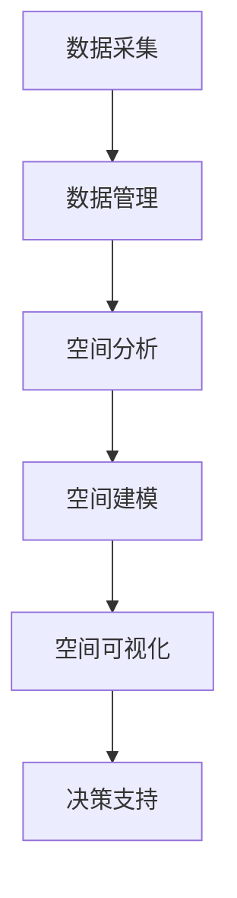

                 

# 《大数据分析在城市规划中的关键作用》

## 关键词

大数据、城市规划、数据分析方法、机器学习、深度学习、地理信息系统、数据驱动决策、算法应用、城市交通流量预测、城市土地使用分析、城市规划效果评估

## 摘要

随着城市化进程的加速，城市规划面临前所未有的挑战和机遇。大数据分析作为一种新兴的技术手段，正逐渐成为城市规划中的重要工具。本文将探讨大数据分析在城市规划中的关键作用，包括大数据与城市规划的关系、大数据分析方法与技术、大数据分析在城市规划中的应用案例、数据驱动决策模型及其优势与挑战、以及未来大数据分析在城市规划中的发展方向。通过详细阐述核心概念、算法原理、实践案例，本文旨在为城市规划领域的技术人员提供有价值的参考，助力智慧城市的建设与发展。

## 《大数据分析在城市规划中的关键作用》目录大纲

### 第一部分：大数据与城市规划概述

#### 第1章：大数据与城市规划的关系

#### 第2章：大数据分析方法与技术

#### 第3章：大数据分析在城市规划中的应用案例

#### 第4章：城市规划中的数据驱动决策

### 第二部分：大数据分析在城市规划中的核心算法与模型

#### 第5章：城市规划中的地理信息系统（GIS）分析

#### 第6章：城市规划中的机器学习算法

#### 第7章：城市规划中的深度学习算法

#### 第8章：城市规划中的数学模型

#### 第9章：大数据分析在城市规划中的算法应用案例

### 第三部分：大数据分析在城市规划中的实践与展望

#### 第10章：大数据分析在城市规划中的实践

#### 第11章：大数据分析在城市规划中的未来展望

#### 附录A：大数据分析常用工具与软件

#### 附录B：参考文献

## 第一部分：大数据与城市规划概述

### 第1章：大数据与城市规划的关系

#### 1.1 大数据的定义与特性

大数据是指规模巨大、类型繁多、速度快、价值密度低的数据集。与传统的数据相比，大数据具有以下四个V特性：

- **Volume（数据量）**：数据量庞大，通常需要使用分布式存储和计算技术进行处理。
- **Velocity（速度）**：数据处理速度要求高，需要快速处理实时数据。
- **Variety（多样性）**：数据类型多样，包括结构化数据、半结构化数据和非结构化数据。
- **Value（价值）**：数据价值密度低，需要通过有效的数据挖掘和分析来发现价值。

#### 1.2 城市规划中的数据来源

城市规划中的数据来源广泛，主要包括以下几类：

- **政府统计数据**：如人口统计数据、经济统计数据、土地使用数据等。
- **遥感数据**：如卫星影像、无人机数据等，可用于城市地形、环境等方面的监测。
- **社交媒体数据**：如社交媒体签到数据、用户评论等，可用于城市生活、交通等方面的分析。
- **传感器数据**：如交通流量监测传感器、环境监测传感器等，可用于实时监测城市运行状况。

#### 1.3 大数据在城市规划中的应用价值

大数据分析在城市规划中具有以下应用价值：

- **优化城市资源配置**：通过大数据分析，可以更精确地了解城市资源的使用情况，优化资源配置，提高城市运行效率。
- **提升城市管理水平**：通过大数据分析，可以实时监测城市运行状况，快速发现和解决问题，提升城市管理水平和响应速度。
- **支持科学决策**：大数据分析可以为城市规划提供丰富的数据支持，帮助决策者做出更为科学、合理的决策。
- **促进智慧城市建设**：大数据分析是实现智慧城市的关键技术之一，可以促进城市信息化、智能化发展。

### 第2章：大数据分析方法与技术

#### 2.1 数据预处理技术

数据预处理是大数据分析的基础，主要包括数据清洗、数据整合、数据转换和数据归一化等步骤。数据预处理技术的目标是提高数据质量，为后续分析提供可靠的数据基础。

- **数据清洗**：删除重复数据、处理缺失值、纠正错误数据等。
- **数据整合**：将不同来源、格式和结构的数据进行整合，形成统一的数据集。
- **数据转换**：将数据转换为适合分析的形式，如将文本数据转换为数值数据。
- **数据归一化**：将不同特征的数据进行归一化处理，消除不同特征之间的量级差异。

#### 2.2 数据挖掘技术

数据挖掘是从大量数据中发现有价值信息的过程，主要包括关联规则挖掘、聚类分析、分类分析和异常检测等。

- **关联规则挖掘**：发现数据之间的关联关系，如购物篮分析。
- **聚类分析**：将数据分为若干个类别，如K-means聚类。
- **分类分析**：将数据分为已知类别的几个类别，如决策树分类。
- **异常检测**：发现数据中的异常现象，如孤立点检测。

#### 2.3 数据可视化技术

数据可视化是将数据以图形、图像等形式进行展示，使数据更加直观、易懂。数据可视化技术主要包括以下几种：

- **统计图表**：如柱状图、折线图、饼图等，用于展示数据的分布、变化趋势等。
- **地图可视化**：用于展示地理信息数据，如热点图、等高线图等。
- **交互式可视化**：通过用户交互，动态展示数据，如D3.js、Echarts等。

### 第3章：大数据分析在城市规划中的应用案例

#### 3.1 城市交通规划

城市交通规划是城市规划的重要组成部分，大数据分析在城市交通规划中的应用主要体现在以下几个方面：

- **交通流量预测**：通过分析历史交通数据、实时交通数据等，预测未来一段时间内的交通流量，为交通基础设施建设、交通信号控制等提供数据支持。
- **交通拥堵分析**：通过分析交通流量、交通事故等数据，找出交通拥堵的主要原因，提出相应的改善措施。
- **公共交通优化**：通过分析公共交通乘客流量、路线选择等数据，优化公共交通网络，提高公共交通服务水平。

#### 3.2 城市环境监测

城市环境监测是保障城市居民生活质量和城市可持续发展的重要手段，大数据分析在城市环境监测中的应用主要包括：

- **空气质量监测**：通过分析空气污染物数据，实时监测城市空气质量，为城市环境治理提供数据支持。
- **噪声监测**：通过分析噪声数据，监测城市噪声污染情况，为噪声治理提供数据支持。
- **水资源监测**：通过分析水资源数据，监测城市水资源使用情况，为水资源管理和保护提供数据支持。

#### 3.3 城市经济分析

城市经济分析是城市规划的重要方面，大数据分析在城市经济分析中的应用主要包括：

- **经济增长预测**：通过分析历史经济数据、行业发展趋势等，预测未来一段时间内城市经济增长趋势，为城市经济发展规划提供数据支持。
- **产业分布分析**：通过分析城市产业分布数据，找出城市主导产业、潜力产业等，为城市产业发展规划提供数据支持。
- **消费行为分析**：通过分析消费者行为数据，了解城市居民消费习惯、消费趋势等，为城市商业布局、市场开发等提供数据支持。

### 第4章：城市规划中的数据驱动决策

#### 4.1 数据驱动决策模型

数据驱动决策模型是指通过收集、处理和分析数据，辅助决策者做出更科学、合理的决策。数据驱动决策模型主要包括以下步骤：

1. **数据收集**：收集与决策相关的各种数据，如经济数据、环境数据、社会数据等。
2. **数据处理**：对收集到的数据进行分析、清洗、整合等处理，为决策提供可靠的数据基础。
3. **模型构建**：基于处理后的数据，建立相应的决策模型，如回归模型、决策树模型等。
4. **模型评估**：评估决策模型的性能，如准确率、召回率等。
5. **决策支持**：将决策模型应用于实际决策场景，为决策者提供决策建议。

#### 4.2 数据驱动决策的优势与挑战

数据驱动决策具有以下优势：

- **科学性**：通过数据分析和模型构建，使决策过程更加科学、合理。
- **效率**：通过数据分析和自动化决策，提高决策效率，缩短决策周期。
- **准确性**：通过数据分析，提高决策的准确性，减少决策失误。

数据驱动决策也面临以下挑战：

- **数据质量**：数据质量直接影响决策模型的效果，需要确保数据准确、完整、可靠。
- **模型选择**：选择合适的模型对决策效果至关重要，需要根据决策场景选择合适的模型。
- **算法解释性**：一些复杂的算法模型难以解释，可能导致决策过程的不透明性。

#### 4.3 数据驱动决策的实际应用

数据驱动决策在城市建设和管理中具有广泛的应用，如：

- **城市规划**：通过数据分析和模型构建，为城市规划提供数据支持，优化城市规划方案。
- **城市管理**：通过数据分析和自动化决策，提高城市管理效率，如智能交通管理、智能环保监测等。
- **公共服务**：通过数据分析和自动化决策，优化公共服务资源配置，提高公共服务质量，如智慧医疗、智慧教育等。

## 第二部分：大数据分析在城市规划中的核心算法与模型

### 第5章：城市规划中的地理信息系统（GIS）分析

#### 5.1 GIS概述

地理信息系统（GIS）是一种用于捕捉、存储、分析和展示地理空间数据的系统。GIS在城市规划中的应用主要包括以下几个方面：

- **数据采集**：通过遥感、GPS等技术收集城市地理信息数据，如地形、地貌、土地利用等。
- **数据管理**：对采集到的地理信息数据进行存储、管理和维护，如数据入库、数据更新等。
- **数据分析**：利用GIS软件对地理信息数据进行空间分析，如空间查询、空间分析、空间建模等。
- **数据可视化**：通过GIS软件将地理信息数据以图形、图像等形式进行展示，使数据更加直观、易懂。

#### 5.2 GIS在数据分析中的应用

GIS在城市规划中的数据分析应用主要包括以下几个方面：

- **空间数据分析**：利用GIS软件进行空间数据分析，如距离分析、区域分析、网络分析等。
- **空间建模**：利用GIS软件进行空间建模，如地形建模、土地利用模型等，为城市规划提供数据支持。
- **空间可视化**：利用GIS软件进行空间可视化，将地理信息数据以图形、图像等形式进行展示，辅助决策者进行规划。

#### 5.3 GIS数据分析的Mermaid流程图



### 第6章：城市规划中的机器学习算法

#### 6.1 机器学习基本概念

机器学习是一种人工智能技术，通过算法模型自动从数据中学习规律，进行预测和决策。机器学习算法在城市规划中的应用主要包括以下几个方面：

- **分类算法**：用于对城市现象进行分类，如人口分类、土地利用分类等。
- **回归算法**：用于预测城市现象，如房价预测、交通流量预测等。
- **聚类算法**：用于将城市现象进行分组，如人口分布聚类、土地利用聚类等。
- **异常检测算法**：用于发现城市中的异常现象，如城市犯罪异常检测等。

#### 6.2 经典机器学习算法介绍

以下介绍几种经典的机器学习算法：

- **决策树**：通过树形结构对数据进行分类或回归。
- **支持向量机（SVM）**：通过寻找最优决策边界对数据进行分类。
- **随机森林**：通过集成多个决策树来提高预测性能。
- **神经网络**：通过多层神经元对数据进行分类或回归。

#### 6.3 机器学习算法在规划中的应用

机器学习算法在城市规划中的应用主要包括：

- **城市土地利用预测**：通过机器学习算法预测未来城市土地利用情况，为城市规划提供数据支持。
- **交通流量预测**：通过机器学习算法预测城市交通流量，为交通基础设施建设、交通信号控制等提供数据支持。
- **房价预测**：通过机器学习算法预测城市房价，为房地产开发商、投资者等提供决策依据。

### 第7章：城市规划中的深度学习算法

#### 7.1 深度学习基本概念

深度学习是一种人工智能技术，通过多层神经网络对数据进行学习和预测。深度学习算法在城市规划中的应用主要包括以下几个方面：

- **图像识别**：通过深度学习算法对城市卫星影像、无人机影像等进行图像识别和分析。
- **语音识别**：通过深度学习算法对城市语音数据进行识别和分析，如智能交通系统中的语音识别。
- **自然语言处理**：通过深度学习算法对城市文本数据进行处理和分析，如社交媒体数据分析、用户评论分析等。

#### 7.2 常见的深度学习模型

以下介绍几种常见的深度学习模型：

- **卷积神经网络（CNN）**：用于图像识别和图像处理。
- **循环神经网络（RNN）**：用于序列数据建模，如时间序列预测、文本生成等。
- **长短时记忆网络（LSTM）**：RNN的改进，用于处理长序列数据。
- **生成对抗网络（GAN）**：用于生成新的数据，如生成城市景观图像等。

#### 7.3 深度学习在城市规划中的应用

深度学习在城市规划中的应用主要包括：

- **城市景观识别**：通过深度学习算法对城市卫星影像进行景观识别和分析，为城市规划提供数据支持。
- **交通流量预测**：通过深度学习算法对城市交通流量数据进行分析，为交通基础设施建设、交通信号控制等提供数据支持。
- **城市安全监控**：通过深度学习算法对城市视频数据进行分析，实现城市安全监控和预警。

### 第8章：城市规划中的数学模型

#### 8.1 数学模型的基本概念

数学模型是一种通过数学方法描述现实问题的抽象模型，用于分析和解决实际问题。城市规划中的数学模型主要包括以下几个方面：

- **线性模型**：如线性回归、线性规划等，用于描述城市现象的线性关系。
- **非线性模型**：如多项式回归、神经网络等，用于描述城市现象的非线性关系。
- **动态模型**：如差分方程、微分方程等，用于描述城市现象的动态变化。
- **随机模型**：如随机过程、蒙特卡罗方法等，用于描述城市现象的随机性。

#### 8.2 经典数学模型介绍

以下介绍几种经典的数学模型：

- **线性回归模型**：通过线性关系预测城市现象，如房价预测、交通流量预测等。
- **神经网络模型**：通过多层神经网络对城市现象进行建模，如城市土地利用预测、交通流量预测等。
- **马尔可夫模型**：通过状态转移概率描述城市现象的随机性，如城市交通状态预测、人口迁移预测等。
- **蒙特卡罗方法**：通过模拟大量随机过程来估计城市现象的概率分布，如城市环境风险评估、交通流量预测等。

#### 8.3 数学模型在城市规划中的应用

数学模型在城市规划中的应用主要包括：

- **城市交通流量预测**：通过数学模型预测城市交通流量，为交通基础设施建设、交通信号控制等提供数据支持。
- **城市土地利用预测**：通过数学模型预测城市土地利用情况，为城市规划提供数据支持。
- **城市环境风险评估**：通过数学模型评估城市环境风险，为城市环境保护提供数据支持。

### 第9章：大数据分析在城市规划中的算法应用案例

#### 9.1 城市交通流量预测

**案例背景**：

城市交通流量预测是城市规划的重要方面，准确预测交通流量有助于优化交通基础设施建设和交通信号控制，提高城市交通运行效率。

**算法思路**：

- **数据收集**：收集城市交通流量数据，包括历史数据和实时数据。
- **数据预处理**：对交通流量数据进行清洗、整合和转换，为预测模型提供可靠的数据基础。
- **模型选择**：选择合适的预测模型，如线性回归模型、神经网络模型等。
- **模型训练**：使用历史数据训练预测模型，优化模型参数。
- **预测分析**：使用训练好的模型进行预测，分析未来一段时间内的交通流量。

**伪代码实现**：

```python
# 数据预处理
data = preprocess_data(traffic_data)

# 模型选择
model = select_model()

# 模型训练
model.fit(X_train, y_train)

# 预测分析
predictions = model.predict(X_test)
```

**应用效果**：

通过城市交通流量预测，可以准确预测未来一段时间内的交通流量，为交通基础设施建设、交通信号控制等提供数据支持，提高城市交通运行效率。

#### 9.2 城市土地使用分析

**案例背景**：

城市土地使用分析是城市规划的重要方面，了解城市土地利用情况有助于优化土地利用结构，提高土地利用效率。

**算法思路**：

- **数据收集**：收集城市土地使用数据，包括土地利用现状、土地利用规划等。
- **数据预处理**：对土地使用数据进行清洗、整合和转换，为分析模型提供可靠的数据基础。
- **模型选择**：选择合适

## 第三部分：大数据分析在城市规划中的实践与展望

### 第10章：大数据分析在城市规划中的实践

#### 10.1 实践案例1：城市交通拥堵分析

**案例背景**：

城市交通拥堵是城市规划中的一个突出问题，严重影响市民出行和生活质量。通过大数据分析，可以实时监测城市交通状况，找出交通拥堵的主要原因，并提出相应的解决方案。

**解决方案**：

- **数据收集**：收集城市交通流量数据、交通信号灯数据、交通事故数据等。
- **数据预处理**：对交通数据进行清洗、整合和转换，为分析提供可靠的数据基础。
- **模型构建**：使用机器学习算法构建交通拥堵预测模型，如线性回归模型、神经网络模型等。
- **实时监测**：通过实时监测交通流量数据，预测未来一段时间内的交通拥堵情况。
- **解决方案**：根据预测结果，提出改善交通拥堵的解决方案，如优化交通信号灯控制、加强公共交通建设等。

**效果评估**：

通过城市交通拥堵分析，可以实时监测城市交通状况，提高交通拥堵预警和应急响应能力，为城市交通管理提供数据支持，有效缓解城市交通拥堵问题。

#### 10.2 实践案例2：城市环境保护监测

**案例背景**：

城市环境保护是城市规划中的重要任务，空气质量、水质、噪声等环境指标对市民生活质量和城市可持续发展具有重要影响。通过大数据分析，可以实时监测城市环境状况，预警环境污染问题，并制定相应的环保措施。

**解决方案**：

- **数据收集**：收集城市环境数据，包括空气质量数据、水质数据、噪声数据等。
- **数据预处理**：对环境数据进行清洗、整合和转换，为分析提供可靠的数据基础。
- **模型构建**：使用机器学习算法构建环境质量预测模型，如线性回归模型、神经网络模型等。
- **实时监测**：通过实时监测环境数据，预测未来一段时间内的环境质量变化。
- **预警与措施**：根据预测结果，预警可能发生的环境污染问题，并制定相应的环保措施，如加强空气污染治理、加强水质监测等。

**效果评估**：

通过城市环境保护监测，可以实时了解城市环境状况，预警环境污染问题，及时采取环保措施，提高城市环境质量，保障市民健康和生活质量。

#### 10.3 实践案例3：城市经济发展趋势分析

**案例背景**：

城市经济发展是城市规划的重要目标，了解城市经济发展趋势有助于制定科学合理的经济发展规划，推动城市可持续发展。

**解决方案**：

- **数据收集**：收集城市经济数据，包括GDP、工业产值、商业活动等。
- **数据预处理**：对经济数据进行清洗、整合和转换，为分析提供可靠的数据基础。
- **模型构建**：使用机器学习算法构建经济趋势预测模型，如线性回归模型、时间序列模型等。
- **趋势分析**：通过分析经济数据，预测未来一段时间内的经济发展趋势。
- **政策建议**：根据预测结果，提出促进城市经济发展的政策建议，如调整产业结构、优化资源配置等。

**效果评估**：

通过城市经济发展趋势分析，可以准确预测城市经济发展趋势，为城市经济发展规划提供数据支持，推动城市经济持续健康发展。

### 第11章：大数据分析在城市规划中的未来展望

#### 11.1 大数据技术发展趋势

随着大数据技术的不断发展，未来大数据分析在城市规划中将会呈现以下发展趋势：

- **实时分析**：实时数据分析将成为城市规划的重要工具，通过实时数据监测和预测，提高城市规划的敏捷性和响应速度。
- **智能化**：智能化分析将成为大数据分析的重要方向，利用人工智能技术，实现自动化、智能化的城市规划决策。
- **多源数据融合**：多源数据融合将成为大数据分析的关键技术，通过整合多种数据源，提高数据分析的全面性和准确性。
- **数据可视化**：数据可视化技术将更加普及，通过直观的图形和图像展示，提高数据分析的易读性和可理解性。

#### 11.2 城市规划领域的创新应用

未来，大数据分析在城市规划中将会有以下创新应用：

- **智慧城市建设**：大数据分析将推动智慧城市建设，通过智能化技术实现城市管理的精细化和高效化，提高城市品质和居民生活质量。
- **城市安全监控**：大数据分析将用于城市安全监控，通过实时监测和预警，提高城市安全防范和应急响应能力。
- **城市可持续发展**：大数据分析将助力城市可持续发展，通过优化资源配置、提高能源利用效率等手段，实现经济、社会、环境协调发展。
- **城市文化传承**：大数据分析将挖掘城市历史文化数据，推动城市文化传承和创新，提高城市文化软实力。

#### 11.3 大数据与城市规划的深度融合前景

大数据与城市规划的深度融合将带来以下前景：

- **决策科学化**：通过大数据分析，实现城市规划决策的科学化、智能化，提高决策准确性和效率。
- **管理精细化**：通过大数据分析，实现城市管理的精细化、智能化，提高城市管理水平和居民满意度。
- **服务个性化**：通过大数据分析，了解居民需求和行为特征，提供个性化服务，提高城市服务水平。
- **创新驱动**：大数据分析将激发城市规划领域的创新活力，推动城市规划理论的创新和实践的突破。

## 附录

### 附录A：大数据分析常用工具与软件

#### A.1 Hadoop生态系统

Hadoop是一个分布式数据处理平台，包括HDFS、MapReduce、HBase、Hive、Spark等组件，广泛应用于大数据存储、计算和分析。

- **HDFS**：分布式文件系统，用于存储海量数据。
- **MapReduce**：分布式计算框架，用于处理大规模数据集。
- **HBase**：分布式列式存储系统，用于存储和分析大规模数据。
- **Hive**：数据仓库工具，用于处理和分析结构化数据。
- **Spark**：分布式计算框架，用于实时数据处理和分析。

#### A.2 Spark生态系统

Spark是一个开源的分布式数据处理引擎，包括Spark SQL、Spark Streaming、MLlib、GraphX等组件，广泛应用于大数据存储、计算和分析。

- **Spark SQL**：用于处理和分析结构化数据。
- **Spark Streaming**：用于实时数据处理和分析。
- **MLlib**：用于机器学习和数据挖掘。
- **GraphX**：用于图计算和分析。

#### A.3 其他常用大数据分析工具

- **Apache Flink**：实时大数据处理引擎。
- **Apache Storm**：实时大数据处理框架。
- **Apache Mahout**：机器学习库，用于大规模数据集的预测和分析。
- **TensorFlow**：开源深度学习框架。
- **PyTorch**：开源深度学习框架。

### 附录B：参考文献

#### B.1 相关书籍推荐

- 《大数据时代：生活、工作与思维的大变革》
- 《大数据之路：阿里巴巴大数据实践》
- 《机器学习实战》
- 《深度学习》
- 《智慧城市：理论与实践》

#### B.2 学术论文推荐

- "Big Data: A Revolution That Will Transform How We Live, Work, and Think" by Viktor Mayer-Schönberger and Kenneth Cukier
- "The Big Data Revolution: Insights, Innovations, and Impact from the Next Frontier" by Thomas H. Davenport and John C. Reynolds
- "Machine Learning: A Probabilistic Perspective" by Kevin P. Murphy
- "Deep Learning" by Ian Goodfellow, Yoshua Bengio, and Aaron Courville
- "Smart Cities: Urban Data, Technologies, and Design" by Peter Ashley and Rob Kitchin

#### B.3 在线资源推荐

- [Apache Hadoop官网](https://hadoop.apache.org/)
- [Apache Spark官网](https://spark.apache.org/)
- [TensorFlow官网](https://www.tensorflow.org/)
- [PyTorch官网](https://pytorch.org/)
- [OpenCV官网](https://opencv.org/)（用于图像处理）
- [Kaggle](https://www.kaggle.com/)（大数据分析竞赛平台） 
- [DataCamp](https://www.datacamp.com/)（大数据分析在线学习平台） 
- [Coursera](https://www.coursera.org/)（大数据分析在线课程平台）

## 作者信息

作者：AI天才研究院/AI Genius Institute & 禅与计算机程序设计艺术 /Zen And The Art of Computer Programming

本文旨在探讨大数据分析在城市规划中的关键作用，通过详细阐述大数据与城市规划的关系、大数据分析方法与技术、大数据分析在城市规划中的应用案例、数据驱动决策模型及其优势与挑战，以及未来大数据分析在城市规划中的发展方向，为城市规划领域的技术人员提供有价值的参考，助力智慧城市的建设与发展。希望本文能对广大读者在规划智慧城市方面有所启发和帮助。如果您有任何建议或意见，欢迎在评论区留言交流。

