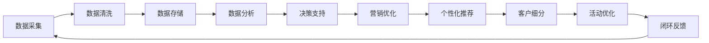

                 

### 大数据时代下的精准营销

> “大数据，小智慧。精准营销，未来已来。”

#### 1.1 大数据的定义与特点

**大数据（Big Data）**，是指数据量巨大、类型繁多、价值密度低但总价值高、处理速度快的数据集合。其特点可概括为“4V”：Volume（数据量）、Velocity（数据速度）、Variety（数据多样性）和Veracity（数据的真实性）。

- **数据量（Volume）**：大数据的第一大特点是数据量大。互联网、物联网、社交媒体等技术的普及使得数据产生和积累的速度空前加快，每天产生的数据量以指数级增长。

- **数据速度（Velocity）**：随着实时数据处理和云计算技术的发展，大数据能够实现高速的数据处理和分析，这使得营销策略可以实时调整和优化。

- **数据多样性（Variety）**：大数据不仅包括结构化数据，还包括非结构化数据，如文本、图像、视频等，数据来源广泛，形式多样。

- **数据真实性（Veracity）**：大数据的真实性也是一个重要特点。由于数据来源的多样性和复杂性，如何确保数据的质量和真实性是大数据分析中的一个重要课题。

#### 1.2 精准营销的概念与重要性

**精准营销（Precision Marketing）**，是指通过数据分析和人工智能技术，对消费者的行为、偏好、需求等进行深入分析，从而实现营销目标精准化的营销方式。

- **目标人群的精准定位**：通过大数据分析，可以准确识别出目标客户群体，减少无效的营销投入。

- **个性化的营销策略**：大数据分析能够深入了解客户的需求，制定个性化的营销策略，提高营销效果。

- **提高营销效率**：通过大数据分析，可以实时监测营销活动的效果，快速调整营销策略，提高营销效率。

#### 1.3 大数据与精准营销的联系

大数据与精准营销密切相关。大数据为精准营销提供了丰富的数据资源，而精准营销则是大数据价值的体现。通过大数据分析，可以实现对消费者行为的深度洞察，从而制定出更加精准的营销策略。

- **数据资源**：大数据为精准营销提供了丰富的数据资源，包括用户行为数据、购买数据、社交媒体数据等。

- **分析工具**：大数据分析工具和技术，如机器学习、数据挖掘等，为精准营销提供了强大的分析能力。

- **决策支持**：大数据分析结果可以为企业提供决策支持，帮助企业优化营销策略，提高营销效果。

### 伪代码：用户行为数据采集与处理

```python
# 伪代码：用户行为数据采集与处理

def collect_user_data():
    # 采集用户行为数据
    data = []
    for user in users:
        behavior = user.record_behavior()
        data.append(behavior)

def process_user_data(data):
    # 数据清洗与预处理
    clean_data = []
    for record in data:
        if is_valid_record(record):
            clean_data.append(record)

def analyze_user_behavior(clean_data):
    # 数据分析，构建用户画像
    user_profile = {}
    for record in clean_data:
        update_user_profile(user_profile, record)

    return user_profile

# 假设函数is_valid_record用于判断数据记录的有效性
# 假设函数update_user_profile用于更新用户画像
```

#### 1.4 大数据在精准营销中的应用场景

- **个性化推荐**：通过大数据分析用户的历史行为，为用户推荐个性化的产品和服务。

- **客户细分**：根据用户的行为和需求，将客户分为不同的细分市场，实施有针对性的营销策略。

- **营销活动优化**：通过大数据分析营销活动的效果，实时调整营销策略，提高营销效果。

### 结论

大数据时代已经到来，精准营销成为企业提升竞争力的重要手段。通过大数据分析，企业可以更好地了解消费者，制定出更加精准和个性化的营销策略，从而提高营销效果和转化率。未来，随着大数据技术的不断发展，精准营销将更加成熟和普及。

### Mermaid 流程图：大数据分析在精准营销中的流程



在这个流程中，数据采集、清洗、存储、分析和决策支持等步骤相互连接，形成一个闭环系统，使得精准营销能够不断优化和迭代。

---

**作者：** AI天才研究院/AI Genius Institute & 禅与计算机程序设计艺术 /Zen And The Art of Computer Programming

---

这篇文章是《大数据分析在精准营销中的实践与创新》的第一部分，主要介绍了大数据与精准营销的基本概念、特点和应用。在接下来的章节中，我们将深入探讨大数据分析的技术和方法，以及在精准营销中的具体应用。请读者继续关注，让我们一同探索大数据营销的无限可能。

