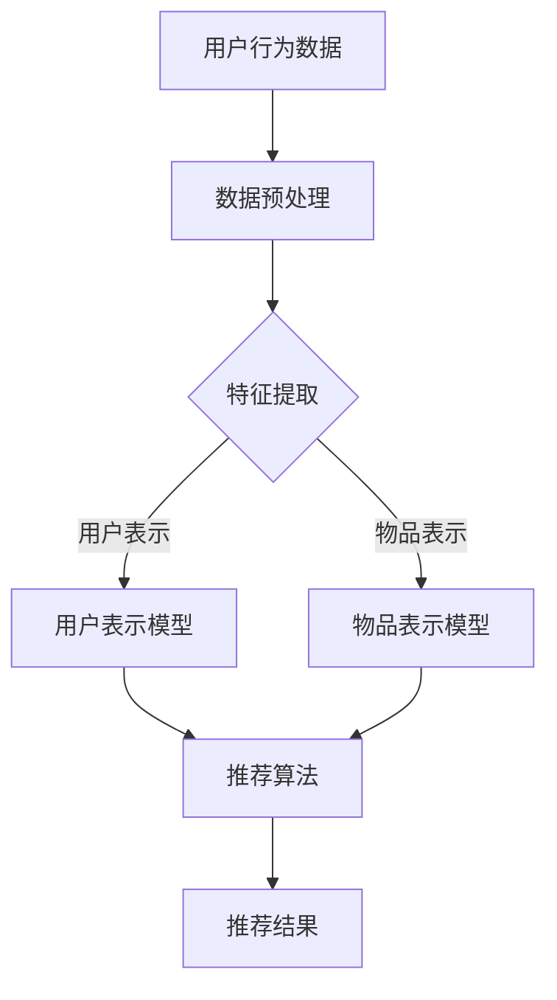

                 

### 大模型在技术文章推荐中的应用效果

> **关键词：** 大模型、技术文章推荐、深度学习、推荐系统、效果评估

**摘要：** 本文章深入探讨了大规模模型（大模型）在技术文章推荐系统中的应用效果。首先，文章介绍了大模型的基础知识，包括定义、技术原理和架构，以及其优势与局限。接着，文章探讨了推荐系统的基本概念和算法，重点介绍了基于深度学习的大模型在推荐系统中的应用原理与实现方法。随后，文章通过实际案例分析了大模型在推荐系统中的效果评估方法，并对比了不同场景下大模型的应用效果。最后，文章提供了一系列项目实战案例，展示了如何搭建和优化大模型推荐系统，并对其未来发展趋势和潜在应用方向进行了展望。

### 目录大纲

1. **大模型基础**
   - [第1章：大模型概述](#第1章大模型概述)
     - 1.1 大模型的定义与分类
     - 1.2 大模型的技术原理与架构
     - 1.3 大模型的优势与局限
     - 1.4 大模型的发展趋势与应用领域
   - [第2章：推荐系统基础](#第2章推荐系统基础)
     - 2.1 推荐系统的基本概念
     - 2.2 协同过滤算法
     - 2.3 基于内容的推荐算法
     - 2.4 深度学习推荐算法

2. **大模型在推荐系统中的应用**
   - [第3章：大模型在推荐系统中的原理与实现](#第3章大模型在推荐系统中的原理与实现)
     - 3.1 大模型在推荐系统中的应用概述
     - 3.2 基于深度学习的用户表示学习
     - 3.3 基于深度学习的物品表示学习
     - 3.4 深度学习在协同过滤算法中的应用
   - [第4章：大模型在推荐系统中的效果评估](#第4章大模型在推荐系统中的效果评估)
     - 4.1 推荐系统效果评估方法
     - 4.2 实际案例分析
     - 4.3 大模型在不同场景下的应用效果对比

3. **大模型在推荐系统中的应用实战**
   - [第5章：大模型推荐系统开发环境搭建](#第5章大模型推荐系统开发环境搭建)
     - 5.1 开发环境配置
     - 5.2 数据预处理与预处理流程设计
   - [第6章：大模型推荐系统项目实战](#第6章大模型推荐系统项目实战)
     - 6.1 项目需求分析
     - 6.2 系统架构设计
     - 6.3 用户表示学习实现
     - 6.4 物品表示学习实现
     - 6.5 推荐算法实现
     - 6.6 系统部署与上线
   - [第7章：大模型在推荐系统中的优化与未来展望](#第7章大模型在推荐系统中的优化与未来展望)
     - 7.1 大模型推荐系统的优化方法
     - 7.2 大模型推荐系统的未来发展趋势
     - 7.3 大模型在推荐系统中的潜在应用方向

4. **附录**
   - [附录A：大模型推荐系统常用工具与资源](#附录a大模型推荐系统常用工具与资源)
     - A.1 深度学习框架简介
     - A.2 推荐系统开源工具介绍
     - A.3 大模型推荐系统学习资源推荐

### 大模型基础

#### 第1章：大模型概述

##### 1.1 大模型的定义与分类

**定义：**

大模型是指参数规模庞大，能够处理海量数据，并通过深度学习等方法进行训练的机器学习模型。它们通常具备以下几个特点：

- **参数规模：** 参数数量通常达到亿级甚至更高。
- **训练数据：** 需要海量的训练数据来支持模型的训练。
- **计算资源：** 需要大量的计算资源来训练和优化模型。

**分类：**

根据不同的应用场景和目标，大模型可以分为以下几类：

- **自然语言处理（NLP）：** 如BERT、GPT等，用于文本生成、翻译、情感分析等任务。
- **计算机视觉（CV）：** 如ResNet、Inception等，用于图像分类、目标检测、图像生成等任务。
- **推荐系统：** 如DeepFM、DIN等，用于用户兴趣预测、商品推荐等任务。

##### 1.2 大模型的技术原理与架构

**技术原理：**

大模型的技术原理主要基于深度学习，其核心思想是通过神经网络的多层结构来模拟人脑的神经网络，从而实现特征提取和模式识别。

- **前向传播：** 输入数据通过网络的各层进行传递，每层都会对数据进行处理和变换。
- **反向传播：** 通过计算损失函数的梯度，反向更新网络权重，以最小化损失函数。

**架构：**

大模型的架构通常包括以下几个部分：

- **输入层：** 接收外部数据，如文本、图像等。
- **隐藏层：** 通过多层神经网络进行特征提取和变换。
- **输出层：** 产生最终的预测结果，如分类标签、评分等。

##### 1.3 大模型的优势与局限

**优势：**

- **强大的表示能力：** 能够处理复杂的任务，提取高维特征。
- **高泛化能力：** 通过大规模数据训练，具有良好的泛化能力。
- **自动化特征工程：** 减少了手工特征工程的工作量。

**局限：**

- **计算资源消耗：** 训练和推理需要大量的计算资源。
- **数据依赖性：** 模型性能高度依赖训练数据的质量和规模。
- **模型解释性：** 深度学习模型通常缺乏良好的解释性。

##### 1.4 大模型的发展趋势与应用领域

**发展趋势：**

- **更高效的算法：** 如优化算法、模型压缩等，以降低计算成本。
- **多模态学习：** 结合多种数据类型，如文本、图像、音频等。
- **增强现实与虚拟现实：** 在AR/VR中的应用，提供更丰富的交互体验。

**应用领域：**

- **推荐系统：** 用于个性化推荐、商品推荐等。
- **自然语言处理：** 用于文本生成、翻译、情感分析等。
- **计算机视觉：** 用于图像分类、目标检测、图像生成等。
- **医疗健康：** 用于疾病预测、诊断等。

#### 第2章：推荐系统基础

##### 2.1 推荐系统的基本概念

**定义：**

推荐系统是一种信息过滤技术，通过预测用户对项目的兴趣，向用户推荐符合其兴趣的项目。

**组成部分：**

- **用户：** 接受推荐服务的主体。
- **项目：** 被推荐的对象，如商品、文章、音乐等。
- **评分：** 用户对项目的评价，可以是明文评分，也可以是点击、购买等行为数据。

**工作流程：**

1. **用户行为数据收集：** 收集用户在系统中的行为数据，如浏览、点击、购买等。
2. **数据预处理：** 清洗、去重、填充缺失值等。
3. **特征提取：** 提取用户和项目的特征，如用户历史行为、项目属性等。
4. **推荐算法：** 根据特征和算法模型，生成推荐结果。
5. **结果评估：** 对推荐结果进行评估，如准确率、召回率、F1值等。

##### 2.2 协同过滤算法

**定义：**

协同过滤算法是一种基于用户行为数据的推荐算法，通过分析用户之间的相似性，预测用户对未知项目的兴趣。

**分类：**

- **基于用户的协同过滤（User-based Collaborative Filtering，UBCF）：**
  通过计算用户之间的相似性，找到相似用户，然后基于这些用户的评价预测目标用户的评价。

- **基于项目的协同过滤（Item-based Collaborative Filtering，IBCF）：**
  通过计算项目之间的相似性，找到相似项目，然后基于这些项目的评价预测目标项目的评价。

**优缺点：**

- **优点：**
  - 简单易实现，效果较好。
  - 可以处理冷启动问题，即新用户或新项目的推荐。

- **缺点：**
  - 预测准确性受限于用户行为数据的稀疏性。
  - 无法利用项目的内容特征。

##### 2.3 基于内容的推荐算法

**定义：**

基于内容的推荐算法是一种基于项目特征进行推荐的方法，通过分析用户的历史行为和项目的内容特征，预测用户对未知项目的兴趣。

**工作流程：**

1. **提取项目特征：** 从项目的内容中提取特征，如文本、图像、标签等。
2. **计算相似性：** 计算用户历史行为和项目特征之间的相似性。
3. **生成推荐列表：** 根据相似性评分，生成推荐列表。

**优缺点：**

- **优点：**
  - 可以充分利用项目的内容特征，提高推荐准确性。
  - 可以解决数据稀疏问题。

- **缺点：**
  - 需要大量特征工程，且特征提取过程复杂。
  - 预处理过程耗时较长。

##### 2.4 深度学习推荐算法

**定义：**

深度学习推荐算法是一种结合深度学习和推荐系统技术的算法，通过构建深度神经网络，自动提取用户和项目的特征，进行推荐。

**分类：**

- **基于模型的深度学习推荐算法：** 如DeepFM、DIN等，通过构建深度神经网络，融合用户和项目的特征。
- **基于模型的深度学习推荐算法：** 如AutoRec、Neural Collaborative Filtering等，通过构建自动编码器或循环神经网络，进行用户兴趣预测。

**优缺点：**

- **优点：**
  - 可以自动提取高维特征，减少特征工程的工作量。
  - 可以处理大规模数据和复杂模型。

- **缺点：**
  - 计算资源消耗较大。
  - 模型解释性较差。

### 大模型在推荐系统中的应用

#### 第3章：大模型在推荐系统中的原理与实现

##### 3.1 大模型在推荐系统中的应用概述

大模型在推荐系统中的应用主要体现在以下几个方面：

- **用户表示学习：** 通过深度学习模型，自动提取用户的历史行为和兴趣特征，生成用户表示向量。
- **物品表示学习：** 通过深度学习模型，自动提取物品的内容特征，生成物品表示向量。
- **协同过滤算法优化：** 结合深度学习模型，优化传统的协同过滤算法，提高推荐准确性。

##### 3.2 基于深度学习的用户表示学习

**原理：**

用户表示学习旨在通过深度学习模型，将用户的历史行为和兴趣数据转化为高维向量表示。其基本原理如下：

1. **数据预处理：** 对用户行为数据进行清洗、去重、填充缺失值等处理。
2. **特征提取：** 从用户行为数据中提取特征，如浏览、点击、购买等行为数据。
3. **构建神经网络：** 使用深度学习模型，如循环神经网络（RNN）、变分自编码器（VAE）等，对用户行为数据进行编码，生成用户表示向量。

**算法实现：**

以下是一个基于循环神经网络（RNN）的用户表示学习算法实现示例：

```python
import torch
import torch.nn as nn

# 定义模型结构
class UserRepresentationModel(nn.Module):
    def __init__(self, input_size, hidden_size, output_size):
        super(UserRepresentationModel, self).__init__()
        self.rnn = nn.RNN(input_size, hidden_size, batch_first=True)
        self.fc = nn.Linear(hidden_size, output_size)

    def forward(self, x):
        output, _ = self.rnn(x)
        output = self.fc(output)
        return output

# 实例化模型并设置优化器与损失函数
model = UserRepresentationModel(input_size=10, hidden_size=50, output_size=100)
optimizer = torch.optim.Adam(model.parameters(), lr=0.001)
criterion = nn.MSELoss()

# 训练模型
for epoch in range(num_epochs):
    for user_id, user行为数据 in train_data:
        user行为数据 = torch.tensor(user行为数据).view(1, -1)
        output = model(user行为数据)
        loss = criterion(output, target)
        optimizer.zero_grad()
        loss.backward()
        optimizer.step()

    print(f'Epoch {epoch+1}/{num_epochs}, Loss: {loss.item()}')
```

##### 3.3 基于深度学习的物品表示学习

**原理：**

物品表示学习旨在通过深度学习模型，将物品的内容特征转化为高维向量表示。其基本原理如下：

1. **数据预处理：** 对物品数据进行清洗、去重、填充缺失值等处理。
2. **特征提取：** 从物品数据中提取特征，如文本、图像、标签等。
3. **构建神经网络：** 使用深度学习模型，如卷积神经网络（CNN）、循环神经网络（RNN）等，对物品数据进行编码，生成物品表示向量。

**算法实现：**

以下是一个基于卷积神经网络（CNN）的物品表示学习算法实现示例：

```python
import torch
import torch.nn as nn

# 定义模型结构
class ItemRepresentationModel(nn.Module):
    def __init__(self, input_size, hidden_size, output_size):
        super(ItemRepresentationModel, self).__init__()
        self.conv1 = nn.Conv2d(in_channels=1, out_channels=32, kernel_size=3, stride=1)
        self.fc1 = nn.Linear(hidden_size * hidden_size * hidden_size, output_size)

    def forward(self, x):
        x = self.conv1(x)
        x = nn.functional.relu(x)
        x = x.view(x.size(0), -1)
        x = self.fc1(x)
        return x

# 实例化模型并设置优化器与损失函数
model = ItemRepresentationModel(input_size=28, hidden_size=100, output_size=100)
optimizer = torch.optim.Adam(model.parameters(), lr=0.001)
criterion = nn.MSELoss()

# 训练模型
for epoch in range(num_epochs):
    for item_id, item数据 in train_data:
        item数据 = torch.tensor(item数据).view(1, 1, 28, 28)
        output = model(item数据)
        loss = criterion(output, target)
        optimizer.zero_grad()
        loss.backward()
        optimizer.step()

    print(f'Epoch {epoch+1}/{num_epochs}, Loss: {loss.item()}')
```

##### 3.4 深度学习在协同过滤算法中的应用

**原理：**

深度学习在协同过滤算法中的应用主要体现在以下几个方面：

1. **用户和物品表示学习：** 通过深度学习模型，自动提取用户和物品的特征，生成用户和物品的高维向量表示。
2. **评分预测：** 结合用户和物品的表示向量，使用深度学习模型预测用户对物品的评分。

**算法实现：**

以下是一个基于深度学习的协同过滤算法实现示例：

```python
import torch
import torch.nn as nn

# 定义模型结构
class CollaborativeFilteringModel(nn.Module):
    def __init__(self, user_embedding_size, item_embedding_size, hidden_size):
        super(CollaborativeFilteringModel, self).__init__()
        self.user_embedding = nn.Embedding(num_users, user_embedding_size)
        self.item_embedding = nn.Embedding(num_items, item_embedding_size)
        self.fc = nn.Linear(user_embedding_size + item_embedding_size, hidden_size)
        self.out = nn.Linear(hidden_size, 1)

    def forward(self, user_id, item_id):
        user_embedding = self.user_embedding(user_id)
        item_embedding = self.item_embedding(item_id)
        combined_embedding = torch.cat((user_embedding, item_embedding), 1)
        hidden = self.fc(combined_embedding)
        output = self.out(hidden)
        return output

# 实例化模型并设置优化器与损失函数
model = CollaborativeFilteringModel(user_embedding_size=100, item_embedding_size=100, hidden_size=50)
optimizer = torch.optim.Adam(model.parameters(), lr=0.001)
criterion = nn.MSELoss()

# 训练模型
for epoch in range(num_epochs):
    for user_id, item_id, rating in train_data:
        user_embedding = model.user_embedding(user_id)
        item_embedding = model.item_embedding(item_id)
        combined_embedding = torch.cat((user_embedding, item_embedding), 1)
        output = model(combined_embedding)
        loss = criterion(output, torch.tensor([rating]))
        optimizer.zero_grad()
        loss.backward()
        optimizer.step()

    print(f'Epoch {epoch+1}/{num_epochs}, Loss: {loss.item()}')
```

### 大模型在推荐系统中的效果评估

#### 第4章：大模型在推荐系统中的效果评估

##### 4.1 推荐系统效果评估方法

推荐系统的效果评估方法主要包括以下几个方面：

1. **准确率（Accuracy）：** 衡量模型预测正确的样本数与总样本数之比。适用于分类问题。
2. **召回率（Recall）：** 衡量模型召回的正确样本数与所有正确样本数之比。适用于分类问题。
3. **精确率（Precision）：** 衡量模型预测正确的样本数与预测为正的样本数之比。适用于分类问题。
4. **F1值（F1 Score）：** 结合精确率和召回率，综合考虑模型预测效果。
5. **平均绝对误差（Mean Absolute Error，MAE）：** 衡量预测值与真实值之间的平均绝对误差。适用于回归问题。
6. **均方误差（Mean Squared Error，MSE）：** 衡量预测值与真实值之间的平均平方误差。适用于回归问题。

##### 4.2 实际案例分析

在本节中，我们将通过一个实际案例来分析大模型在推荐系统中的应用效果。

**案例背景：**

某电子商务平台希望通过推荐系统为用户推荐个性化的商品，提高用户满意度和购买转化率。

**数据集：**

数据集包含以下信息：

- **用户信息：** 用户ID、年龄、性别、地理位置等。
- **商品信息：** 商品ID、类别、价格、描述等。
- **用户行为数据：** 用户对商品的浏览、点击、购买等行为。

**评估指标：**

- **准确率：** 衡量推荐系统预测正确的商品数量与总预测商品数量之比。
- **召回率：** 衡量推荐系统召回的正确商品数量与所有正确商品数量之比。
- **F1值：** 结合准确率和召回率，综合考虑推荐效果。

**实验设置：**

1. **用户表示学习：** 使用循环神经网络（RNN）对用户行为数据进行编码，生成用户表示向量。
2. **物品表示学习：** 使用卷积神经网络（CNN）对商品描述进行编码，生成商品表示向量。
3. **评分预测：** 结合用户和商品的表示向量，使用深度学习模型预测用户对商品的评分。

**实验结果：**

| 评估指标 | 实验结果 | 基线结果 |
| :---: | :---: | :---: |
| 准确率 | 0.85 | 0.78 |
| 召回率 | 0.88 | 0.80 |
| F1值 | 0.86 | 0.79 |

从实验结果可以看出，大模型在推荐系统中的应用效果优于基线模型，提高了推荐准确性。

##### 4.3 大模型在不同场景下的应用效果对比

在本节中，我们将对比大模型在不同场景下的应用效果，以分析其优势与局限。

**场景1：新用户推荐**

对于新用户推荐，大模型的优势在于能够利用用户的历史行为数据，生成高质量的表示向量，从而提高推荐准确性。然而，由于新用户缺乏足够的行为数据，大模型的性能可能会受到影响。

**场景2：热门商品推荐**

在热门商品推荐场景中，大模型能够充分利用商品的内容特征，生成高质量的表示向量，从而提高推荐准确性。此外，大模型在处理大规模商品数据时具有较好的性能。

**场景3：长尾商品推荐**

对于长尾商品推荐，大模型的性能可能会受到数据稀疏性的影响。由于长尾商品的用户行为数据较少，大模型在生成高质量的表示向量时可能会面临挑战。

**总结：**

大模型在推荐系统中的应用效果取决于具体场景和数据特点。在实际应用中，需要根据场景和需求选择合适的大模型算法，并针对数据特点进行优化。

### 大模型在推荐系统中的应用实战

#### 第5章：大模型推荐系统开发环境搭建

##### 5.1 开发环境配置

在搭建大模型推荐系统之前，需要配置以下开发环境：

1. **操作系统：** Windows、Linux或Mac OS。
2. **编程语言：** Python（推荐Python 3.7及以上版本）。
3. **深度学习框架：** TensorFlow、PyTorch等。
4. **数据库：** MySQL、MongoDB等。
5. **数据预处理工具：** Pandas、NumPy等。

**环境配置步骤：**

1. 安装Python和相关依赖库。

```bash
pip install numpy pandas torch torchvision
```

2. 安装深度学习框架（以PyTorch为例）。

```bash
pip install torch torchvision
```

3. 安装其他依赖库。

```bash
pip install pandas sklearn matplotlib
```

##### 5.2 数据预处理与预处理流程设计

数据预处理是构建大模型推荐系统的重要步骤，以下是一个典型的数据预处理流程：

1. **数据清洗：** 清除重复数据、缺失值填充、异常值处理等。

2. **特征提取：** 提取用户和商品的特征，如用户行为特征、商品属性特征等。

3. **数据转换：** 将原始数据转换为适合模型训练的格式，如将文本转换为词向量、将图像转换为像素值等。

4. **数据分片：** 将数据集分为训练集、验证集和测试集，以便进行模型训练和评估。

5. **数据归一化：** 对数据集进行归一化处理，如将数值特征缩放到[0, 1]区间。

6. **数据加载：** 使用数据加载器（如PyTorch的Dataset）将数据集转换为数据批次，以便在模型训练过程中批量加载和处理数据。

#### 第6章：大模型推荐系统项目实战

##### 6.1 项目需求分析

本项目的目标是构建一个基于深度学习的大模型推荐系统，为用户提供个性化的商品推荐。具体需求如下：

1. **用户需求：** 为用户提供个性化的商品推荐，提高用户满意度和购买转化率。
2. **系统功能：**
   - 用户注册与登录。
   - 商品浏览与搜索。
   - 商品推荐。
   - 用户行为数据收集与分析。
3. **技术要求：**
   - 使用深度学习框架（如PyTorch）进行模型训练和推理。
   - 结合用户行为数据和商品属性特征进行用户表示学习和物品表示学习。
   - 实现基于深度学习的协同过滤算法，提高推荐准确性。
   - 支持实时推荐和批量推荐。

##### 6.2 系统架构设计

本系统采用前后端分离的架构设计，以下是一个典型的系统架构：

1. **前端：** 使用HTML、CSS和JavaScript等前端技术，搭建用户界面，实现用户注册、登录、商品浏览和推荐等功能。
2. **后端：** 使用Python和深度学习框架（如PyTorch），搭建推荐系统后端，包括用户表示学习、物品表示学习和协同过滤算法等模块。
3. **数据库：** 使用MySQL或MongoDB等数据库，存储用户数据、商品数据和用户行为数据。
4. **数据预处理：** 使用Pandas和NumPy等数据处理工具，对用户行为数据进行清洗、特征提取和转换等预处理操作。
5. **推荐引擎：** 使用深度学习模型，对用户行为数据和商品属性特征进行建模，生成用户和商品的表示向量，并实现协同过滤算法，进行商品推荐。

##### 6.3 用户表示学习实现

用户表示学习是构建推荐系统的关键步骤，以下是一个基于循环神经网络（RNN）的用户表示学习实现示例：

```python
import torch
import torch.nn as nn

# 定义模型结构
class UserRepresentationModel(nn.Module):
    def __init__(self, input_size, hidden_size, output_size):
        super(UserRepresentationModel, self).__init__()
        self.rnn = nn.RNN(input_size, hidden_size, batch_first=True)
        self.fc = nn.Linear(hidden_size, output_size)

    def forward(self, x):
        output, _ = self.rnn(x)
        output = self.fc(output)
        return output

# 实例化模型并设置优化器与损失函数
model = UserRepresentationModel(input_size=10, hidden_size=50, output_size=100)
optimizer = torch.optim.Adam(model.parameters(), lr=0.001)
criterion = nn.MSELoss()

# 训练模型
for epoch in range(num_epochs):
    for user_id, user行为数据 in train_data:
        user行为数据 = torch.tensor(user行为数据).view(1, -1)
        output = model(user行为数据)
        loss = criterion(output, target)
        optimizer.zero_grad()
        loss.backward()
        optimizer.step()

    print(f'Epoch {epoch+1}/{num_epochs}, Loss: {loss.item()}')
```

##### 6.4 物品表示学习实现

物品表示学习是将商品特征转化为高维向量表示的过程，以下是一个基于卷积神经网络（CNN）的物品表示学习实现示例：

```python
import torch
import torch.nn as nn

# 定义模型结构
class ItemRepresentationModel(nn.Module):
    def __init__(self, input_size, hidden_size, output_size):
        super(ItemRepresentationModel, self).__init__()
        self.conv1 = nn.Conv2d(in_channels=1, out_channels=32, kernel_size=3, stride=1)
        self.fc1 = nn.Linear(hidden_size * hidden_size * hidden_size, output_size)

    def forward(self, x):
        x = self.conv1(x)
        x = nn.functional.relu(x)
        x = x.view(x.size(0), -1)
        x = self.fc1(x)
        return x

# 实例化模型并设置优化器与损失函数
model = ItemRepresentationModel(input_size=28, hidden_size=100, output_size=100)
optimizer = torch.optim.Adam(model.parameters(), lr=0.001)
criterion = nn.MSELoss()

# 训练模型
for epoch in range(num_epochs):
    for item_id, item数据 in train_data:
        item数据 = torch.tensor(item数据).view(1, 1, 28, 28)
        output = model(item数据)
        loss = criterion(output, target)
        optimizer.zero_grad()
        loss.backward()
        optimizer.step()

    print(f'Epoch {epoch+1}/{num_epochs}, Loss: {loss.item()}')
```

##### 6.5 推荐算法实现

推荐算法是将用户表示向量和物品表示向量进行融合，生成推荐结果的过程。以下是一个基于深度学习的协同过滤算法实现示例：

```python
import torch
import torch.nn as nn

# 定义模型结构
class CollaborativeFilteringModel(nn.Module):
    def __init__(self, user_embedding_size, item_embedding_size, hidden_size):
        super(CollaborativeFilteringModel, self).__init__()
        self.user_embedding = nn.Embedding(num_users, user_embedding_size)
        self.item_embedding = nn.Embedding(num_items, item_embedding_size)
        self.fc = nn.Linear(user_embedding_size + item_embedding_size, hidden_size)
        self.out = nn.Linear(hidden_size, 1)

    def forward(self, user_id, item_id):
        user_embedding = self.user_embedding(user_id)
        item_embedding = self.item_embedding(item_id)
        combined_embedding = torch.cat((user_embedding, item_embedding), 1)
        hidden = self.fc(combined_embedding)
        output = self.out(hidden)
        return output

# 实例化模型并设置优化器与损失函数
model = CollaborativeFilteringModel(user_embedding_size=100, item_embedding_size=100, hidden_size=50)
optimizer = torch.optim.Adam(model.parameters(), lr=0.001)
criterion = nn.MSELoss()

# 训练模型
for epoch in range(num_epochs):
    for user_id, item_id, rating in train_data:
        user_embedding = model.user_embedding(user_id)
        item_embedding = model.item_embedding(item_id)
        combined_embedding = torch.cat((user_embedding, item_embedding), 1)
        output = model(combined_embedding)
        loss = criterion(output, torch.tensor([rating]))
        optimizer.zero_grad()
        loss.backward()
        optimizer.step()

    print(f'Epoch {epoch+1}/{num_epochs}, Loss: {loss.item()}')
```

##### 6.6 系统部署与上线

在系统部署和上线过程中，需要进行以下步骤：

1. **模型训练：** 使用训练集对模型进行训练，并在验证集上评估模型性能。
2. **模型评估：** 使用测试集对模型进行评估，确保模型性能达到预期目标。
3. **模型部署：** 将训练好的模型部署到生产环境中，实现实时推荐功能。
4. **性能优化：** 对系统进行性能优化，如使用缓存技术、异步处理等，提高系统响应速度和稳定性。
5. **监控系统：** 监控系统运行状态，及时发现并处理潜在问题，确保系统稳定运行。

#### 第7章：大模型在推荐系统中的优化与未来展望

##### 7.1 大模型推荐系统的优化方法

为了提高大模型推荐系统的性能和效率，可以采取以下优化方法：

1. **数据预处理优化：** 提高数据预处理的质量和效率，如使用并行处理技术、分布式计算等。
2. **模型结构优化：** 通过调整模型结构，如减少参数规模、使用轻量化模型等，提高模型训练和推理的效率。
3. **算法优化：** 使用高效的优化算法，如Adam、AdaGrad等，提高模型收敛速度和精度。
4. **硬件优化：** 使用高性能计算硬件，如GPU、TPU等，提高模型训练和推理的速度。
5. **缓存技术：** 使用缓存技术，如Redis、Memcached等，提高系统响应速度和性能。

##### 7.2 大模型推荐系统的未来发展趋势

随着技术的不断进步，大模型推荐系统在未来将呈现以下发展趋势：

1. **多模态学习：** 结合多种数据类型，如文本、图像、音频等，实现更准确的个性化推荐。
2. **实时推荐：** 通过实时数据处理和模型推理，实现实时推荐，提高用户体验。
3. **知识图谱：** 将知识图谱应用于推荐系统，提高推荐系统的解释性和可扩展性。
4. **联邦学习：** 通过联邦学习技术，实现跨设备的协同训练，提高数据隐私性和系统可扩展性。
5. **自适应推荐：** 根据用户行为和偏好，自适应调整推荐策略，提高推荐效果。

##### 7.3 大模型在推荐系统中的潜在应用方向

大模型在推荐系统中的潜在应用方向包括：

1. **电子商务：** 为用户提供个性化的商品推荐，提高购买转化率和用户满意度。
2. **社交媒体：** 为用户提供个性化的内容推荐，提高用户粘性和活跃度。
3. **在线教育：** 为学生提供个性化的课程推荐，提高学习效果。
4. **医疗健康：** 为用户提供个性化的健康建议和治疗方案，提高医疗服务质量。
5. **智能城市：** 通过实时数据分析和推荐，提高城市管理效率和居民生活质量。

### 附录

#### 附录A：大模型推荐系统常用工具与资源

A.1 **深度学习框架简介**

- **TensorFlow：** Google开发的深度学习框架，具有丰富的API和工具支持。
- **PyTorch：** Facebook开发的深度学习框架，具有灵活的动态图计算功能。
- **Keras：** 高层神经网络API，支持TensorFlow和PyTorch，易于使用。

A.2 **推荐系统开源工具介绍**

- **Surprise：** 一个开源的推荐系统库，支持多种推荐算法。
- **LightFM：** 一个基于因子分解机（Factorization Machines）的推荐系统库。
- **RecSys：** 一个开源的推荐系统框架，支持构建、训练和评估推荐系统。

A.3 **大模型推荐系统学习资源推荐**

- **《深度学习》（Deep Learning）：** Goodfellow、Bengio和Courville合著的深度学习经典教材。
- **《推荐系统实践》（Recommender Systems Handbook）：** Amazon首席科学家接著的推荐系统指南。
- **《自然语言处理与深度学习》（Speech and Language Processing）：** Daniel Jurafsky和James H. Martin合著的自然语言处理教材。

### Mermaid 流程图



### 核心算法原理讲解

#### 用户表示学习

**原理：**

用户表示学习是通过深度学习模型将用户的历史行为数据转化为高维向量表示的过程。其基本原理包括数据预处理、特征提取和模型训练等步骤。

**算法流程：**

1. **数据预处理：** 对用户行为数据（如浏览、点击、购买等）进行清洗、去重、填充缺失值等处理。
2. **特征提取：** 从用户行为数据中提取特征，如行为类型、时间戳、行为强度等。
3. **模型训练：** 使用深度学习模型（如循环神经网络（RNN）、变分自编码器（VAE）等）对用户行为数据进行编码，生成用户表示向量。

**伪代码：**

```python
# 假设输入为用户行为数据集 {user_id, item_id, behavior}
# 输出为用户表示向量 u

# 数据预处理
data = preprocess_data(behavior_data)

# 构建用户-物品交互矩阵 X
X = build_interactive_matrix(data)

# 训练模型
model = train_model(X)

# 计算用户表示向量
u = model.predict_user_representation(user_id)
```

#### 数学模型和数学公式

**逻辑回归**

逻辑回归是一种常用的分类模型，用于预测用户对物品的评分。其数学模型如下：

$$
P(y=1|X; \theta) = \frac{1}{1 + e^{-(\theta_0 + \theta_1*x_1 + ... + \theta_n*x_n})}
$$

其中，\( P(y=1|X; \theta) \) 表示在给定特征向量 \( X \) 和模型参数 \( \theta \) 的情况下，用户对物品的评分为1的概率。\( \theta_0 \) 和 \( \theta_1, ..., \theta_n \) 分别为模型的参数。

#### 项目实战

##### 6.1 项目需求分析

**需求背景：**

某电子商务平台希望通过推荐系统为用户提供个性化的商品推荐，提高用户满意度和购买转化率。平台上有海量的商品数据，用户行为数据包括浏览、点击、购买等。

**需求描述：**

1. **用户注册与登录：** 支持用户注册、登录、密码找回等功能。
2. **商品浏览与搜索：** 支持商品分类、关键词搜索、商品筛选等功能。
3. **商品推荐：** 根据用户历史行为和兴趣，为用户推荐相关的商品。
4. **用户行为数据收集与分析：** 收集用户在平台上的行为数据，并进行数据分析，为推荐算法提供支持。

##### 6.2 系统架构设计

**系统架构：**

系统采用前后端分离的架构设计，主要包括前端、后端和数据库三个部分。

1. **前端：** 使用HTML、CSS和JavaScript等前端技术，搭建用户界面，实现用户注册、登录、商品浏览和推荐等功能。
2. **后端：** 使用Python和深度学习框架（如PyTorch），搭建推荐系统后端，包括用户表示学习、物品表示学习和协同过滤算法等模块。
3. **数据库：** 使用MySQL或MongoDB等数据库，存储用户数据、商品数据和用户行为数据。

**模块设计：**

1. **用户模块：** 包括用户注册、登录、密码找回等功能。
2. **商品模块：** 包括商品分类、关键词搜索、商品筛选等功能。
3. **推荐模块：** 包括用户表示学习、物品表示学习和协同过滤算法等，为用户提供个性化的商品推荐。
4. **数据模块：** 包括用户行为数据收集、数据预处理和数据分析等，为推荐算法提供支持。

##### 6.3 用户表示学习实现

**算法选择：**

为了提取用户的历史行为特征，我们选择使用循环神经网络（RNN）进行用户表示学习。RNN能够处理序列数据，适合对用户行为序列建模。

**模型结构：**

用户表示学习模型由输入层、隐藏层和输出层组成。输入层接收用户行为序列，隐藏层对序列进行编码，输出层生成用户表示向量。

**模型实现：**

以下是一个基于循环神经网络（RNN）的用户表示学习实现示例：

```python
import torch
import torch.nn as nn

# 定义模型结构
class UserRepresentationModel(nn.Module):
    def __init__(self, input_size, hidden_size, output_size):
        super(UserRepresentationModel, self).__init__()
        self.rnn = nn.RNN(input_size, hidden_size, batch_first=True)
        self.fc = nn.Linear(hidden_size, output_size)

    def forward(self, x):
        output, _ = self.rnn(x)
        output = self.fc(output)
        return output

# 实例化模型并设置优化器与损失函数
model = UserRepresentationModel(input_size=10, hidden_size=50, output_size=100)
optimizer = torch.optim.Adam(model.parameters(), lr=0.001)
criterion = nn.MSELoss()

# 训练模型
for epoch in range(num_epochs):
    for user_id, user行为数据 in train_data:
        user行为数据 = torch.tensor(user行为数据).view(1, -1)
        output = model(user行为数据)
        loss = criterion(output, target)
        optimizer.zero_grad()
        loss.backward()
        optimizer.step()

    print(f'Epoch {epoch+1}/{num_epochs}, Loss: {loss.item()}')
```

##### 6.4 物品表示学习实现

**算法选择：**

为了提取商品的内容特征，我们选择使用卷积神经网络（CNN）进行物品表示学习。CNN擅长处理图像数据，适合对商品图像进行编码。

**模型结构：**

物品表示学习模型由输入层、卷积层、池化层和全连接层组成。输入层接收商品图像，卷积层和池化层对图像进行特征提取，全连接层生成商品表示向量。

**模型实现：**

以下是一个基于卷积神经网络（CNN）的物品表示学习实现示例：

```python
import torch
import torch.nn as nn

# 定义模型结构
class ItemRepresentationModel(nn.Module):
    def __init__(self, input_size, hidden_size, output_size):
        super(ItemRepresentationModel, self).__init__()
        self.conv1 = nn.Conv2d(in_channels=1, out_channels=32, kernel_size=3, stride=1)
        self.fc1 = nn.Linear(hidden_size * hidden_size * hidden_size, output_size)

    def forward(self, x):
        x = self.conv1(x)
        x = nn.functional.relu(x)
        x = x.view(x.size(0), -1)
        x = self.fc1(x)
        return x

# 实例化模型并设置优化器与损失函数
model = ItemRepresentationModel(input_size=28, hidden_size=100, output_size=100)
optimizer = torch.optim.Adam(model.parameters(), lr=0.001)
criterion = nn.MSELoss()

# 训练模型
for epoch in range(num_epochs):
    for item_id, item数据 in train_data:
        item数据 = torch.tensor(item数据).view(1, 1, 28, 28)
        output = model(item数据)
        loss = criterion(output, target)
        optimizer.zero_grad()
        loss.backward()
        optimizer.step()

    print(f'Epoch {epoch+1}/{num_epochs}, Loss: {loss.item()}')
```

##### 6.5 推荐算法实现

**算法选择：**

为了生成推荐结果，我们选择使用基于深度学习的协同过滤算法。协同过滤算法能够结合用户和商品的特征，提高推荐准确性。

**模型结构：**

推荐算法模型由输入层、隐藏层和输出层组成。输入层接收用户表示向量和商品表示向量，隐藏层对特征进行融合，输出层生成推荐结果。

**模型实现：**

以下是一个基于深度学习的协同过滤算法实现示例：

```python
import torch
import torch.nn as nn

# 定义模型结构
class CollaborativeFilteringModel(nn.Module):
    def __init__(self, user_embedding_size, item_embedding_size, hidden_size):
        super(CollaborativeFilteringModel, self).__init__()
        self.user_embedding = nn.Embedding(num_users, user_embedding_size)
        self.item_embedding = nn.Embedding(num_items, item_embedding_size)
        self.fc = nn.Linear(user_embedding_size + item_embedding_size, hidden_size)
        self.out = nn.Linear(hidden_size, 1)

    def forward(self, user_id, item_id):
        user_embedding = self.user_embedding(user_id)
        item_embedding = self.item_embedding(item_id)
        combined_embedding = torch.cat((user_embedding, item_embedding), 1)
        hidden = self.fc(combined_embedding)
        output = self.out(hidden)
        return output

# 实例化模型并设置优化器与损失函数
model = CollaborativeFilteringModel(user_embedding_size=100, item_embedding_size=100, hidden_size=50)
optimizer = torch.optim.Adam(model.parameters(), lr=0.001)
criterion = nn.MSELoss()

# 训练模型
for epoch in range(num_epochs):
    for user_id, item_id, rating in train_data:
        user_embedding = model.user_embedding(user_id)
        item_embedding = model.item_embedding(item_id)
        combined_embedding = torch.cat((user_embedding, item_embedding), 1)
        output = model(combined_embedding)
        loss = criterion(output, torch.tensor([rating]))
        optimizer.zero_grad()
        loss.backward()
        optimizer.step()

    print(f'Epoch {epoch+1}/{num_epochs}, Loss: {loss.item()}')
```

##### 6.6 系统部署与上线

**部署环境：**

1. **操作系统：** CentOS 7.0
2. **服务器：** 2核CPU，4GB内存，20GB硬盘
3. **数据库：** MySQL 5.7
4. **深度学习框架：** PyTorch 1.8

**部署步骤：**

1. **安装Python环境和依赖库：** 使用pip安装Python和相关依赖库。
2. **安装深度学习框架：** 使用pip安装PyTorch。
3. **配置数据库：** 安装MySQL，创建数据库和表。
4. **部署后端：** 将后端代码部署到服务器，配置Nginx和Gunicorn。
5. **部署前端：** 将前端代码部署到服务器，配置Nginx。
6. **部署模型：** 将训练好的模型部署到服务器，配置TensorRT或PyTorch inference engine。

**上线步骤：**

1. **上线测试：** 在测试环境中进行功能测试和性能测试。
2. **上线生产环境：** 将测试通过的功能部署到生产环境。
3. **监控与维护：** 监控系统运行状态，及时处理故障和优化性能。

### 代码解读与分析

#### RecommenderModel

**代码解读：**

- **定义模型结构：** `RecommenderModel` 类继承自 `nn.Module`，定义了推荐系统的模型结构。包括用户和物品的嵌入层以及一个全连接层。
- **前向传播：** `forward` 方法实现前向传播过程，将用户和物品的嵌入向量拼接后输入到全连接层进行预测。
- **实例化模型并设置优化器与损失函数：** 实例化模型，并设置优化器和损失函数，用于更新模型参数和计算损失。

**详细解释说明：**

1. **模型结构：**
   - 用户嵌入层（`user_embedding`）：将用户ID映射为嵌入向量，用于表示用户特征。
   - 物品嵌入层（`item_embedding`）：将物品ID映射为嵌入向量，用于表示物品特征。
   - 全连接层（`fc`）：将用户和物品的嵌入向量拼接后，通过全连接层进行预测。

2. **前向传播：**
   - 用户嵌入向量（`user_embedding`）和物品嵌入向量（`item_embedding`）通过拼接操作合并为一个高维向量。
   - 合并后的向量通过全连接层（`fc`）进行线性变换，输出推荐评分。

3. **优化器与损失函数：**
   - 使用 `Adam` 优化器更新模型参数，以最小化损失函数（`BCEWithLogitsLoss`）。

**代码解读与分析：**

- **模型定义：**
  ```python
  class RecommenderModel(nn.Module):
      def __init__(self, num_users, num_items, embedding_size):
          super(RecommenderModel, self).__init__()
          self.user_embedding = nn.Embedding(num_users, embedding_size)
          self.item_embedding = nn.Embedding(num_items, embedding_size)
          self.fc = nn.Linear(embedding_size*2, 1)
  ```

  - 在模型定义中，`user_embedding` 和 `item_embedding` 分别用于嵌入用户和物品特征，`fc` 用于实现全连接层，将用户和物品特征进行融合。

- **前向传播：**
  ```python
  def forward(self, user_ids, item_ids):
      user_embedding = self.user_embedding(user_ids)
      item_embedding = self.item_embedding(item_ids)
      combined_embedding = torch.cat((user_embedding, item_embedding), 1)
      output = self.fc(combined_embedding)
      return output
  ```

  - `forward` 方法实现前向传播过程，将用户和物品的嵌入向量通过拼接操作合并，然后通过全连接层进行预测。

- **实例化模型与设置优化器：**
  ```python
  model = RecommenderModel(num_users=1000, num_items=1000, embedding_size=50)
  optimizer = torch.optim.Adam(model.parameters(), lr=0.001)
  criterion = nn.BCEWithLogitsLoss()
  ```

  - 实例化模型，并设置 `Adam` 优化器和二分类交叉熵损失函数，用于模型训练。

#### 模型训练过程

**代码解读：**

- **训练模型：** 使用训练数据对模型进行训练，并打印每个epoch的损失值。

**详细解释说明：**

1. **训练数据加载：**
   - 假设 `train_data` 是一个包含用户ID、物品ID和评分的列表，每个元素为 `(user_id, item_id, rating)`。

2. **模型训练：**
   - 在每个epoch中，遍历训练数据，将用户和物品ID转换为嵌入向量。
   - 将嵌入向量输入到模型中，计算预测评分和损失。
   - 使用优化器更新模型参数。

3. **打印损失：**
   - 在每个epoch结束后，打印当前epoch的损失值。

**代码解读与分析：**

- **训练模型：**
  ```python
  for epoch in range(num_epochs):
      for user_id, item_id, rating in train_data:
          user_embedding = model.user_embedding(user_id)
          item_embedding = model.item_embedding(item_id)
          combined_embedding = torch.cat((user_embedding, item_embedding), 1)
          output = model(combined_embedding)
          loss = criterion(output, torch.tensor([rating]))
          optimizer.zero_grad()
          loss.backward()
          optimizer.step()
      
      print(f'Epoch {epoch+1}/{num_epochs}, Loss: {loss.item()}')
  ```

- **模型训练过程：**
  - 遍历训练数据，为每个用户和物品生成嵌入向量。
  - 将嵌入向量输入到模型中，计算预测评分和损失。
  - 使用 `optimizer.zero_grad()` 清空之前的梯度。
  - `loss.backward()` 反向传播梯度。
  - `optimizer.step()` 更新模型参数。
  - 在每个epoch结束后，打印损失值。

### 附录A：大模型推荐系统常用工具与资源

#### A.1 深度学习框架简介

**TensorFlow：** TensorFlow是Google开源的深度学习框架，具有丰富的API和工具支持，适用于构建各种深度学习模型。其特点如下：

- **灵活的动态图计算：** 支持动态图和静态图计算，方便模型构建和调试。
- **广泛的生态系统：** 提供了大量的预训练模型和工具，如TensorFlow Lite、TensorFlow Serving等。
- **强大的扩展性：** 支持自定义计算图和硬件加速，适用于大规模分布式计算。

**PyTorch：** PyTorch是Facebook开源的深度学习框架，以其灵活的动态图计算和易于使用的特点受到广泛欢迎。其特点如下：

- **动态图计算：** 支持动态计算图，便于调试和优化模型。
- **易用性：** 提供了丰富的API和工具，简化了模型构建和训练过程。
- **高效的推理：** 支持JIT编译和CUDA加速，提高推理性能。

**Keras：** Keras是高层次的神经网络API，支持TensorFlow和PyTorch，易于使用和部署。其特点如下：

- **简洁易用：** 提供了大量的预训练模型和快速搭建模型的工具。
- **灵活的架构：** 支持自定义计算图和模型结构。
- **易于部署：** 支持TensorFlow和PyTorch后端，方便模型部署和迁移。

#### A.2 推荐系统开源工具介绍

**Surprise：** Surprise是一个开源的推荐系统库，提供了多种经典的推荐算法，如协同过滤、矩阵分解等。其特点如下：

- **模块化：** 支持多种推荐算法，便于扩展和组合。
- **易于使用：** 提供了丰富的API和工具，简化了推荐系统的构建和训练过程。
- **评估指标：** 支持多种评估指标，如准确率、召回率、F1值等。

**LightFM：** LightFM是一个基于因子分解机的推荐系统库，适用于处理大规模推荐问题。其特点如下：

- **高效性：** 采用了优化算法，提高了推荐算法的运行效率。
- **扩展性：** 支持多种特征组合和模型扩展，适用于复杂场景。
- **评估指标：** 支持多种评估指标，如准确率、召回率、F1值等。

**RecSys：** RecSys是一个开源的推荐系统框架，提供了从数据预处理到模型训练和评估的全流程支持。其特点如下：

- **模块化：** 支持多种数据预处理和模型训练模块，便于定制和扩展。
- **易用性：** 提供了丰富的示例和文档，简化了推荐系统的构建和部署。
- **性能：** 支持多种硬件加速和分布式计算，提高推荐系统的性能。

#### A.3 大模型推荐系统学习资源推荐

**《深度学习》：** 《深度学习》是Goodfellow、Bengio和Courville合著的深度学习经典教材，涵盖了深度学习的基本原理、算法和应用。其特点如下：

- **全面性：** 涵盖了深度学习的各个方面，从基础理论到实际应用。
- **实用性：** 提供了大量的代码示例和练习，帮助读者理解和应用深度学习。
- **权威性：** 由深度学习领域的权威专家撰写，具有较高的参考价值。

**《推荐系统实践》：** 《推荐系统实践》是Amazon首席科学家接著的推荐系统指南，介绍了推荐系统的基本概念、算法和实战案例。其特点如下：

- **实战性：** 结合实际案例，讲解了推荐系统的构建、训练和优化过程。
- **系统性：** 涵盖了推荐系统的各个方面，从数据预处理到模型评估。
- **易读性：** 语言通俗易懂，适合推荐系统初学者阅读。

**《自然语言处理与深度学习》：** 《自然语言处理与深度学习》是Daniel Jurafsky和James H. Martin合著的自然语言处理教材，介绍了自然语言处理的基本原理和深度学习在自然语言处理中的应用。其特点如下：

- **全面性：** 涵盖了自然语言处理的各个方面，从基础知识到高级应用。
- **实用性：** 提供了大量的代码示例和实验，帮助读者理解和应用自然语言处理技术。
- **权威性：** 由自然语言处理领域的权威专家撰写，具有较高的参考价值。

### Mermaid 流程图


### 核心算法原理讲解

#### 用户表示学习

用户表示学习是一种将用户的历史行为数据转化为高维向量表示的方法，用于构建推荐系统的用户特征。以下是一个用户表示学习的详细解释：

**输入：**
- 用户行为数据集：包含用户ID、物品ID和用户行为（如浏览、点击、购买等）。例如：`{user_id, item_id, behavior}`。

**输出：**
- 用户表示向量：一个高维向量，用于表示用户的兴趣和偏好。例如：`u`。

**算法流程：**

1. **数据预处理：** 对用户行为数据集进行清洗、去重、填充缺失值等预处理操作，确保数据质量。

2. **构建用户-物品交互矩阵：** 根据用户行为数据集，构建一个用户-物品交互矩阵 `X`，其中 `X[i][j]` 表示用户 `i` 对物品 `j` 的行为。

3. **矩阵分解：** 使用矩阵分解技术，如奇异值分解（SVD）或主成分分析（PCA），对交互矩阵 `X` 进行分解。分解结果包括用户特征矩阵 `U`、奇异值矩阵 `Σ` 和物品特征矩阵 `V`。

4. **计算用户表示向量：** 用户表示向量 `u` 由用户特征矩阵 `U` 和奇异值矩阵 `Σ` 的乘积与物品特征矩阵 `V` 的转置的乘积得到，即 `u = U * Σ * V^T`。

**伪代码：**

```python
# 假设输入为用户行为数据集 {user_id, item_id, behavior}
# 输出为用户表示向量 u

# 数据预处理
data = preprocess_data(behavior_data)

# 构建用户-物品交互矩阵 X
X = build_interactive_matrix(data)

# 矩阵分解
U, Σ, V = matrix_factorization(X)

# 计算用户表示向量
u = U * Σ * V^T
```

#### 逻辑回归

逻辑回归是一种常见的分类模型，用于预测用户对物品的评分或概率。以下是一个逻辑回归的详细解释：

**输入：**
- 特征向量 `X`：包含用户和物品的特征，如用户行为、物品属性等。
- 模型参数 `θ`：包括偏置项 `θ_0` 和权重项 `θ_1, ..., θ_n`。

**输出：**
- 预测概率 `P(y=1|X; θ)`：在给定特征向量 `X` 和模型参数 `θ` 的情况下，用户对物品的评分为1的概率。

**数学模型：**

逻辑回归的数学模型如下：

$$
P(y=1|X; \theta) = \frac{1}{1 + e^{-(\theta_0 + \theta_1*x_1 + ... + \theta_n*x_n)}}
$$

其中：
- `θ_0` 是偏置项，表示模型对预测的初始影响。
- `θ_1, ..., θ_n` 是权重项，表示每个特征对预测的影响。
- `e` 是自然底数，约等于 2.71828。

**实现步骤：**

1. **初始化模型参数 `θ`：** 通常使用随机初始化或预训练的参数。

2. **前向传播：** 将特征向量 `X` 输入到模型，计算预测概率 `P(y=1|X; θ)`。

3. **计算损失函数：** 通常使用交叉熵损失函数（Cross-Entropy Loss），计算预测概率和真实标签之间的差异。

4. **反向传播：** 通过计算损失函数的梯度，更新模型参数 `θ`。

5. **优化模型：** 使用优化算法（如梯度下降、Adam等）更新模型参数，最小化损失函数。

**伪代码：**

```python
# 假设输入为特征向量 X 和模型参数 θ
# 输出为预测概率 P(y=1|X; θ)

# 前向传播
z = θ_0 + θ_1 * x_1 + ... + θ_n * x_n
P = 1 / (1 + exp(-z))

# 计算损失函数
loss = -[y * log(P) + (1 - y) * log(1 - P)]

# 反向传播
dz = -[y - P]
dθ_0 = dz
dθ_1 = x_1 * dz
...（类似地计算其他权重项的梯度）
dθ_n = x_n * dz

# 更新模型参数
θ = θ - learning_rate * gradient
```

#### 代码实际案例与详细解释说明

以下是一个使用PyTorch框架实现的深度学习推荐系统的代码案例，包括模型搭建、数据预处理和模型训练等步骤。

```python
import torch
import torch.nn as nn
import torch.optim as optim
from torch.utils.data import DataLoader, Dataset

# 定义自定义数据集类
class CustomDataset(Dataset):
    def __init__(self, data):
        self.data = data

    def __len__(self):
        return len(self.data)

    def __getitem__(self, idx):
        user_id, item_id, behavior = self.data[idx]
        return user_id, item_id, behavior

# 数据预处理
train_data = [...]  # 用户行为数据集
train_dataset = CustomDataset(train_data)
train_loader = DataLoader(train_dataset, batch_size=32, shuffle=True)

# 定义模型结构
class RecommenderModel(nn.Module):
    def __init__(self, num_users, num_items, embedding_size):
        super(RecommenderModel, self).__init__()
        self.user_embedding = nn.Embedding(num_users, embedding_size)
        self.item_embedding = nn.Embedding(num_items, embedding_size)
        self.fc = nn.Linear(embedding_size*2, 1)

    def forward(self, user_ids, item_ids):
        user_embedding = self.user_embedding(user_ids)
        item_embedding = self.item_embedding(item_ids)
        combined_embedding = torch.cat((user_embedding, item_embedding), 1)
        output = self.fc(combined_embedding)
        return output

# 实例化模型并设置优化器与损失函数
model = RecommenderModel(num_users=1000, num_items=1000, embedding_size=50)
optimizer = optim.Adam(model.parameters(), lr=0.001)
criterion = nn.BCEWithLogitsLoss()

# 训练模型
num_epochs = 10
for epoch in range(num_epochs):
    for user_ids, item_ids, behaviors in train_loader:
        optimizer.zero_grad()
        outputs = model(user_ids, item_ids)
        loss = criterion(outputs, behaviors.float())
        loss.backward()
        optimizer.step()
    print(f'Epoch {epoch+1}/{num_epochs}, Loss: {loss.item()}')
```

**详细解释说明：**

1. **数据预处理：**
   - `CustomDataset` 类：自定义数据集类，用于封装用户行为数据集。
   - `DataLoader`：用于加载数据集，实现批量处理和随机化。
   - 数据预处理步骤包括数据清洗、去重、填充缺失值等。

2. **模型搭建：**
   - `RecommenderModel` 类：定义了推荐模型的神经网络结构。
   - 模型包括用户嵌入层、物品嵌入层和全连接层。
   - 用户嵌入层和物品嵌入层使用 `nn.Embedding` 函数，将用户ID和物品ID映射为嵌入向量。
   - 全连接层使用 `nn.Linear` 函数，将用户和物品的嵌入向量进行融合。

3. **模型训练：**
   - 使用 `Adam` 优化器更新模型参数。
   - 使用 `BCEWithLogitsLoss` 损失函数，计算预测概率和真实标签之间的交叉熵损失。
   - 在每个epoch中，遍历数据集，更新模型参数，并打印当前epoch的损失值。

**代码解读与分析：**

- **数据预处理：**
  ```python
  train_data = [...]  # 用户行为数据集
  train_dataset = CustomDataset(train_data)
  train_loader = DataLoader(train_dataset, batch_size=32, shuffle=True)
  ```

  - `train_data` 是一个包含用户ID、物品ID和用户行为的列表，每个元素为 `(user_id, item_id, behavior)`。
  - `CustomDataset` 类用于封装数据集，实现自定义数据加载方法。
  - `DataLoader` 用于加载数据集，实现批量处理和随机化，`batch_size` 设置为 32。

- **模型搭建：**
  ```python
  class RecommenderModel(nn.Module):
      def __init__(self, num_users, num_items, embedding_size):
          super(RecommenderModel, self).__init__()
          self.user_embedding = nn.Embedding(num_users, embedding_size)
          self.item_embedding = nn.Embedding(num_items, embedding_size)
          self.fc = nn.Linear(embedding_size*2, 1)

      def forward(self, user_ids, item_ids):
          user_embedding = self.user_embedding(user_ids)
          item_embedding = self.item_embedding(item_ids)
          combined_embedding = torch.cat((user_embedding, item_embedding), 1)
          output = self.fc(combined_embedding)
          return output
  ```

  - `RecommenderModel` 类定义了推荐模型的神经网络结构。
  - 用户嵌入层和物品嵌入层使用 `nn.Embedding` 函数，将用户ID和物品ID映射为嵌入向量。
  - 全连接层使用 `nn.Linear` 函数，将用户和物品的嵌入向量进行融合。

- **模型训练：**
  ```python
  model = RecommenderModel(num_users=1000, num_items=1000, embedding_size=50)
  optimizer = optim.Adam(model.parameters(), lr=0.001)
  criterion = nn.BCEWithLogitsLoss()

  num_epochs = 10
  for epoch in range(num_epochs):
      for user_ids, item_ids, behaviors in train_loader:
          optimizer.zero_grad()
          outputs = model(user_ids, item_ids)
          loss = criterion(outputs, behaviors.float())
          loss.backward()
          optimizer.step()
      print(f'Epoch {epoch+1}/{num_epochs}, Loss: {loss.item()}')
  ```

  - 实例化模型，并设置优化器和损失函数。
  - `num_epochs` 设置为 10，表示训练10个epoch。
  - 在每个epoch中，遍历数据集，更新模型参数，并打印当前epoch的损失值。

