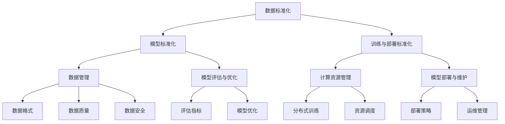

                 

### 引言

近年来，人工智能（AI）技术取得了显著进展，尤其是大模型技术的崛起，极大地推动了各行各业的创新与发展。大模型技术，指的是训练容量庞大的神经网络模型，如GPT、BERT等，这些模型通过学习海量的数据，具备出色的文本生成、语言理解、图像识别等能力。然而，随着大模型技术的广泛应用，标准化的问题也逐渐显现。

#### 1.1 大模型技术的发展历程

大模型技术的发展可以追溯到上世纪80年代的神经网络研究。当时，神经网络作为一种人工智能技术，虽然理论成熟，但在实际应用中却面临诸多挑战。进入21世纪，随着计算能力的提升和海量数据的获取，神经网络研究迎来了新的契机。特别是深度学习技术的兴起，使得大模型成为可能。

2012年，AlexNet在ImageNet竞赛中取得的突破性成绩，标志着深度学习在计算机视觉领域的崛起。随后，GPT、BERT等大模型相继问世，并在自然语言处理、文本生成等领域取得了显著成效。这些模型通过在海量数据上的训练，实现了前所未有的性能。

#### 1.2 大模型技术在行业中的应用

大模型技术已经在多个行业中展现出巨大的应用潜力。在医疗健康领域，大模型可以用于疾病诊断、药物研发等；在金融科技领域，大模型可以用于风险管理、智能投顾等；在智能制造领域，大模型可以用于设备维护、生产优化等。

大模型技术的应用不仅提高了各行业的效率，还带来了新的商业模式和服务模式。例如，智能客服系统、自动驾驶汽车等，都是大模型技术在实际应用中的成功案例。

#### 1.3 大模型技术标准化的重要性

随着大模型技术的普及，标准化问题日益凸显。标准化不仅有助于规范技术发展，提高技术质量，还能促进技术的普及与应用。

首先，大模型技术标准化可以规范数据格式，确保数据在不同系统和平台之间的兼容性，提高数据利用效率。

其次，大模型技术标准化可以统一模型训练和部署的标准，降低技术壁垒，促进技术的普及和应用。

最后，大模型技术标准化有助于提高国际竞争力，推动全球技术合作与发展。

### 《大模型技术的标准化进程》

> **关键词：** 大模型技术、标准化、应用、行业、国际竞争力
>
> **摘要：** 本文从大模型技术的发展历程、行业应用及标准化的重要性出发，详细探讨了大模型技术标准化的核心概念、流程、国际标准化组织及其在中国的发展，分析了标准化对行业的影响，并展望了未来的发展趋势。通过实际应用案例和项目实战，本文全面阐述了大模型技术标准化的实践与前景。

## 《大模型技术的标准化进程》目录大纲

### 第一部分：引言

#### 第1章：大模型技术的背景与重要性
1.1 大模型技术的发展历程
1.2 大模型技术在行业中的应用
1.3 大模型技术标准化的重要性

### 第二部分：大模型技术标准化的核心概念

#### 第2章：大模型技术标准化的基础
2.1 标准化的定义与作用
2.2 大模型技术标准化的目标
2.3 大模型技术标准化的框架

#### 第3章：大模型技术标准化的核心内容
3.1 数据标准化
3.2 模型标准化
3.3 训练和部署标准化

#### 第4章：大模型技术的标准化流程
4.1 标准化制定的步骤
4.2 标准化草案的制定
4.3 标准的发布和实施

#### 第5章：国际大模型技术标准化组织
5.1 国际标准化组织（ISO）
5.2 国际电工委员会（IEC）
5.3 其他国际标准化组织

#### 第6章：大模型技术标准化在中国
6.1 中国的标准化工作
6.2 中国在大模型技术标准化中的角色
6.3 中国大模型技术标准化的挑战与机遇

### 第三部分：大模型技术标准化的影响与应用

#### 第7章：大模型技术标准化对行业的影响
7.1 标准化对技术研发的影响
7.2 标准化对产业生态的影响
7.3 标准化对国际竞争力的影响

#### 第8章：大模型技术标准化的实际应用案例
8.1 案例一：医疗健康领域
8.2 案例二：金融科技领域
8.3 案例三：智能制造领域

#### 第9章：未来展望
9.1 大模型技术标准化的趋势
9.2 标准化工作面临的挑战
9.3 大模型技术标准化的发展方向

### 附录

#### 附录A：大模型技术标准化相关术语
#### 附录B：参考书籍和资料

#### 第10章：大模型技术标准化核心概念与联系
10.1 大模型技术标准化的核心概念
10.2 大模型技术标准化的架构图（Mermaid流程图）

#### 第11章：大模型技术标准化核心算法原理讲解
11.1 数据标准化算法原理（伪代码）
11.2 模型标准化算法原理（伪代码）
11.3 训练和部署标准化算法原理（伪代码）

#### 第12章：数学模型和数学公式讲解与举例
12.1 数据标准化数学模型（LaTeX格式）
12.2 模型标准化数学模型（LaTeX格式）
12.3 训练和部署标准化数学模型（LaTeX格式）
12.4 实际应用举例

#### 第13章：项目实战
13.1 开发环境搭建
13.2 源代码详细实现
13.3 代码解读与分析
13.4 实际应用案例分析

### 第1章：大模型技术的背景与重要性

#### 1.1 大模型技术的发展历程

大模型技术，指的是通过训练容量庞大的神经网络模型来实现高效任务处理的技术。其发展历程可以追溯到上世纪80年代。当时，神经网络作为一种人工智能技术，虽然在理论上具有一定的前景，但在实际应用中却面临诸多挑战，如计算资源有限、数据获取困难等。

随着时间推移，计算能力的提升和海量数据的获取，神经网络研究逐渐迎来了新的契机。特别是在深度学习技术兴起后，大模型技术开始崭露头角。深度学习通过模拟人脑的神经网络结构，通过层层抽象和提取特征，实现了对复杂数据的自动学习和理解。

2012年，Hinton团队提出的AlexNet在ImageNet竞赛中取得了突破性成绩，标志着深度学习在计算机视觉领域的崛起。这一成绩不仅展示了深度学习技术的强大能力，也为后续大模型技术的发展奠定了基础。

随后，GPT、BERT等大模型相继问世，并在自然语言处理、文本生成等领域取得了显著成效。这些模型通过在海量数据上的训练，实现了前所未有的性能，极大地推动了人工智能技术的发展。

#### 1.2 大模型技术在行业中的应用

大模型技术的广泛应用，使其在多个行业中发挥了重要作用。

在医疗健康领域，大模型技术可以用于疾病诊断、药物研发等。例如，通过分析大量医学影像数据，大模型可以辅助医生进行早期癌症筛查，提高诊断准确率；通过学习大量药物分子结构数据，大模型可以预测新药物的效果，加速药物研发进程。

在金融科技领域，大模型技术可以用于风险管理、智能投顾等。例如，通过分析海量交易数据，大模型可以识别异常交易行为，提高风险控制能力；通过学习大量用户行为数据，大模型可以为用户提供个性化的投资建议，提高投资回报率。

在智能制造领域，大模型技术可以用于设备维护、生产优化等。例如，通过分析大量设备运行数据，大模型可以预测设备故障，提前进行维护，减少停机时间；通过分析大量生产数据，大模型可以优化生产流程，提高生产效率。

此外，大模型技术还在智能客服、自动驾驶、智能翻译等领域发挥了重要作用，极大地提高了各行各业的效率和服务质量。

#### 1.3 大模型技术标准化的重要性

随着大模型技术的广泛应用，标准化的问题也逐渐显现。大模型技术标准化的重要性主要体现在以下几个方面：

1. **规范技术发展**：标准化可以为大模型技术提供统一的技术规范，确保技术的质量与稳定性，避免因技术差异导致的兼容性问题。

2. **提高数据利用效率**：标准化可以规范数据格式，确保数据在不同系统和平台之间的兼容性，提高数据利用效率。

3. **降低技术壁垒**：标准化可以统一模型训练和部署的标准，降低技术壁垒，促进技术的普及和应用。

4. **提升国际竞争力**：标准化有助于提高我国在大模型技术领域的国际竞争力，推动全球技术合作与发展。

5. **保障数据安全**：标准化可以规范数据管理流程，提高数据安全性，防止数据泄露和滥用。

总之，大模型技术标准化对于推动技术进步、促进产业升级、保障数据安全具有重要意义。在接下来的章节中，我们将详细探讨大模型技术标准化的核心概念、流程、国际标准化组织及其在中国的发展，以及标准化对行业的影响。最后，我们将通过实际应用案例和项目实战，全面阐述大模型技术标准化的实践与前景。

### 第2章：大模型技术标准化的基础

#### 2.1 标准化的定义与作用

标准化，是指通过制定和实施标准，对某一领域的活动或产品进行规范的过程。标准，是指在一定范围内，为促进共同效益而制定的技术规范、规则或指南。

在技术领域，标准化具有以下几个作用：

1. **规范技术发展**：标准化可以为技术发展提供明确的方向和指导，确保技术的发展符合科学规律和市场需求。

2. **提高技术质量**：标准化可以为技术质量提供统一的标准和评价方法，提高技术的稳定性和可靠性。

3. **促进技术普及**：标准化可以降低技术壁垒，促进技术的普及和应用，推动产业升级。

4. **保障数据安全**：标准化可以规范数据管理流程，提高数据安全性，防止数据泄露和滥用。

5. **提高国际竞争力**：标准化有助于提高国家或地区在国际市场的竞争力，促进全球技术合作与发展。

#### 2.2 大模型技术标准化的目标

大模型技术标准化，旨在为人工智能领域提供一套统一的技术规范，以促进大模型技术的健康发展。具体目标包括：

1. **统一技术标准**：制定统一的模型训练、部署和数据管理标准，确保大模型技术在不同系统和平台之间的兼容性。

2. **提高技术质量**：通过制定严格的技术规范，提高大模型技术的质量与稳定性，降低故障率和错误率。

3. **促进技术普及**：降低技术壁垒，促进大模型技术在各行各业的普及和应用，推动产业升级。

4. **保障数据安全**：规范数据管理流程，提高数据安全性，防止数据泄露和滥用。

5. **推动国际合作**：加强国际标准化合作，提高我国在大模型技术领域的国际影响力，促进全球技术合作与发展。

#### 2.3 大模型技术标准化的框架

大模型技术标准化的框架主要包括以下几个部分：

1. **标准体系**：建立大模型技术标准体系，包括基础标准、技术标准、管理标准等。

2. **标准化组织**：成立大模型技术标准化组织，负责制定、发布和实施标准。

3. **标准化流程**：制定严格的标准化流程，包括标准制定、草案制定、审查和发布等环节。

4. **标准实施与监督**：建立健全的标准实施与监督机制，确保标准得到有效执行。

5. **培训与宣传**：加强标准化培训与宣传，提高相关人员对标准化的认识和重视。

通过上述框架，大模型技术标准化可以为人工智能领域提供一套系统、科学的标准化解决方案，推动大模型技术的健康发展。

### 第3章：大模型技术标准化的核心内容

大模型技术标准化涉及多个方面，其中核心内容包括数据标准化、模型标准化和训练和部署标准化。下面将分别进行详细介绍。

#### 3.1 数据标准化

数据标准化是确保大模型技术稳定性和有效性的基础。数据标准化主要包括以下几个方面：

1. **数据格式**：制定统一的数据格式，如CSV、JSON等，确保数据在不同系统和平台之间的兼容性。

2. **数据质量**：规范数据质量，确保数据完整、准确、一致。数据清洗和预处理是数据标准化的重要环节，包括去除噪声、填补缺失值、归一化等。

3. **数据安全**：制定严格的数据安全措施，防止数据泄露和滥用。数据加密、访问控制等是数据安全的重要保障。

4. **数据存储**：建立统一的数据存储和管理标准，确保数据的可扩展性、可靠性和安全性。

5. **数据交换**：制定统一的数据交换标准，如RESTful API、Web Services等，确保数据在不同系统和平台之间的快速、高效交换。

#### 3.2 模型标准化

模型标准化是确保大模型技术质量和可维护性的关键。模型标准化主要包括以下几个方面：

1. **模型架构**：制定统一的模型架构标准，如深度学习框架的API设计、模块划分等，确保模型的可扩展性和易维护性。

2. **模型训练**：制定统一的模型训练标准，包括训练策略、参数设置等，确保模型训练的稳定性和效率。

3. **模型评估**：制定统一的模型评估标准，如准确率、召回率、F1值等，确保模型评估的客观性和准确性。

4. **模型压缩**：制定模型压缩标准，如剪枝、量化等，提高模型的效率和存储空间利用率。

5. **模型部署**：制定统一的模型部署标准，如模型导出、容器化等，确保模型在不同环境和平台上的快速部署。

#### 3.3 训练和部署标准化

训练和部署标准化是确保大模型技术稳定运行的关键。训练和部署标准化主要包括以下几个方面：

1. **计算资源管理**：制定统一的计算资源管理标准，如GPU调度、分布式训练等，确保计算资源的合理利用。

2. **训练流程**：制定统一的训练流程，包括数据预处理、模型训练、评估等环节，确保训练过程的标准化和可重复性。

3. **部署流程**：制定统一的部署流程，包括模型导出、容器化、服务化等，确保模型部署的快速和高效。

4. **监控和运维**：制定统一的监控和运维标准，如日志记录、告警机制等，确保系统的稳定运行和快速响应。

5. **安全与合规**：制定统一的安全和合规标准，如数据加密、访问控制等，确保系统的安全和合规性。

通过上述标准化内容，大模型技术可以确保数据质量、模型质量和系统稳定性，提高技术质量和可维护性，为人工智能领域的健康发展奠定基础。

### 第4章：大模型技术的标准化流程

大模型技术的标准化流程是确保技术规范、质量稳定、易于实施的关键环节。该流程包括标准制定、草案制定、审查和发布等步骤。以下将详细描述每个步骤的具体内容。

#### 4.1 标准化制定的步骤

1. **需求分析**：首先，需要对大模型技术的需求进行分析。这包括了解当前技术现状、行业需求、技术发展方向等。通过需求分析，确定标准化的重点和目标。

2. **框架设计**：在需求分析的基础上，设计大模型技术标准化的总体框架。框架应包括标准体系、标准化组织、标准化流程、标准实施与监督等部分。

3. **内容编写**：根据框架设计，编写标准的具体内容。这包括数据标准化、模型标准化、训练和部署标准化等方面的具体要求和操作规范。

4. **讨论与修订**：将编写好的标准草案提交给相关专家和利益相关方进行讨论和修订。这一环节旨在确保标准的科学性、合理性和可操作性。

5. **征求意见**：在讨论与修订后，发布标准草案并向社会公众征求意见。这一环节有助于收集更多的反馈，进一步完善标准。

6. **审查与批准**：在征求意见后，对标准进行审查，确保其符合相关法律法规和标准。审查通过后，由标准化组织进行批准。

#### 4.2 标准化草案的制定

标准化草案的制定是标准化流程的重要环节。具体包括：

1. **需求分析**：确定草案编制的详细需求，包括技术需求、市场需求等。

2. **编写草案**：根据需求分析结果，编写标准草案。草案应包含标准的目的、范围、规范性引用文件、定义和术语、具体要求等。

3. **征求意见**：将草案提交给相关专家和利益相关方进行讨论和修改。这一环节有助于确保草案的科学性、合理性和可操作性。

4. **修改和完善**：根据征求意见的结果，对草案进行修改和完善。这一环节旨在确保草案的最终版本能够满足各方面的需求。

#### 4.3 标准的发布和实施

1. **发布**：在草案修改完善后，由标准化组织进行正式发布。标准发布后，应确保其能够被广泛获取和使用。

2. **培训与宣传**：发布标准后，需要进行培训与宣传，提高相关人员对标准的认识和掌握。这包括组织培训班、发布宣传资料等。

3. **实施与监督**：标准实施后，需要进行监督和评估，确保其得到有效执行。这包括对标准的执行情况进行检查、对实施效果进行评估等。

4. **修订与更新**：随着技术的不断发展和变化，标准也需要不断修订和更新。这包括对标准进行定期审查、根据实际需求进行调整等。

通过上述标准化流程，大模型技术标准化可以确保技术的规范、稳定和高效，为人工智能领域的健康发展提供有力保障。

### 第5章：国际大模型技术标准化组织

在国际上，大模型技术标准化工作主要由一些权威的国际标准化组织承担。这些组织在全球范围内制定和推广技术标准，为全球大模型技术的发展和应用提供指导和规范。以下介绍几个主要的国际大模型技术标准化组织。

#### 5.1 国际标准化组织（ISO）

国际标准化组织（International Organization for Standardization，ISO）是一个全球性的非政府组织，负责制定和推广国际标准。ISO成立于1947年，总部位于瑞士的日内瓦。ISO的标准涵盖了各个领域，包括工业、服务、环境、医疗、信息安全等。

在人工智能领域，ISO制定了一系列与数据标准化、信息安全、质量管理相关的大模型技术标准。例如，ISO/IEC 27001标准规定了信息安全管理系统（ISMS）的要求，为人工智能系统的数据安全和隐私保护提供了指南。此外，ISO还发布了ISO/IEC 27036标准，专门针对大数据和人工智能系统中的数据安全和隐私保护问题。

#### 5.2 国际电工委员会（IEC）

国际电工委员会（International Electrotechnical Commission，IEC）是一个负责制定国际电工和电子领域标准的国际组织。IEC成立于1906年，总部位于瑞士的日内瓦。IEC的标准范围广泛，包括电气设备、电子设备、信息技术、能源效率、环境标准等。

在人工智能领域，IEC也制定了一些与数据标准化和信息安全相关的标准。例如，IEC 62443标准系列针对工业控制系统（ICS）的网络安全提供了详细的要求和指导。此外，IEC还发布了IEC 60601-1标准，用于规范医疗电气设备的安全性和电磁兼容性。

#### 5.3 其他国际标准化组织

除了ISO和IEC，还有一些其他国际标准化组织在大模型技术标准化方面发挥了重要作用。

1. **国际电信联盟（ITU）**：ITU是联合国专门负责信息通信技术标准的国际组织。ITU发布了大量的标准，包括电信基础设施、无线通信、网络协议、信息安全等。在人工智能领域，ITU主要关注人工智能在通信系统中的应用和标准化问题。

2. **国际标准化组织/信息技术管理局（ISO/IEC JTC 1）**：ISO/IEC JTC 1是ISO和IEC联合成立的专门负责信息技术领域标准化工作的技术委员会。JTC 1发布了大量与人工智能、大数据、云计算等相关的标准，如ISO/IEC 23000标准系列（多媒体应用标准）、ISO/IEC 27017标准（云计算信息安全）等。

3. **国际自动机工程师协会（ASAM）**：ASAM是一个专注于汽车及其相关工业领域的国际标准化组织。在人工智能领域，ASAM主要关注自动驾驶、车载计算平台等领域的标准化工作，发布了多个与自动驾驶和车载人工智能系统相关的标准。

这些国际标准化组织通过制定和推广技术标准，为全球大模型技术的发展和应用提供了强有力的支持和保障。通过国际间的合作与协调，这些组织推动了大模型技术标准化进程，促进了全球技术合作与交流。

### 第6章：大模型技术标准化在中国

中国在大模型技术标准化领域发挥了积极作用，通过参与国际标准化组织、建立国内标准化机构和推动标准化工作，不断提升大模型技术的标准化水平。以下将详细探讨中国在大模型技术标准化中的角色、挑战与机遇。

#### 6.1 中国的标准化工作

中国标准化工作起步较早，早在1953年就成立了国家标准化管理委员会（SAC），负责全国标准化工作的统一管理和协调。近年来，随着人工智能技术的快速发展，中国在大模型技术标准化方面也取得了显著进展。

1. **国家标准制定**：中国已发布了一系列与人工智能和大模型技术相关的国家标准，如《人工智能基础标准体系框架》、《人工智能数据安全规范》等。这些标准为人工智能技术的规范化发展提供了重要指导。

2. **行业标准制定**：中国还发布了多个行业标准，如《智能网联汽车技术标准体系》、《人工智能产业发展标准体系建设指南》等。这些行业标准针对特定领域的技术需求，提供了详细的规范和操作指南。

3. **地方标准制定**：一些地方政府和行业组织也制定了与人工智能和大模型技术相关的标准，如《上海市人工智能产业发展标准体系建设指南》等。这些地方标准有助于推动区域人工智能产业的发展。

#### 6.2 中国在大模型技术标准化中的角色

中国在大模型技术标准化中的角色主要包括以下几个方面：

1. **积极参与国际标准化活动**：中国是ISO和IEC的重要成员，积极参与国际标准化组织的活动，为国际标准化工作贡献中国智慧和力量。例如，中国专家参与了ISO/IEC JTC 1/SC 42（人工智能系统）等标准化技术委员会的工作。

2. **推动国际标准制定**：中国积极参与国际标准的制定，提出中国方案和国际建议。例如，在ISO/IEC 27036（人工智能系统数据安全）标准的制定过程中，中国专家提出了重要意见，促进了标准的完善。

3. **参与国际标准化合作**：中国与多个国家和地区开展了人工智能和大模型技术的标准化合作，如与欧盟、美国、日本等。通过国际合作，中国能够借鉴国际先进经验，推动国内标准化工作的开展。

4. **国内标准化工作领导**：中国在大模型技术标准化方面起到了引领作用，通过制定国家标准、行业标准，为国内企业提供技术指导和规范。

#### 6.3 中国大模型技术标准化的挑战与机遇

中国在大模型技术标准化过程中面临一些挑战和机遇：

1. **挑战**：
   - **技术差距**：尽管中国在人工智能技术领域取得了显著进展，但与国际先进水平仍存在一定差距。在标准化工作中，如何借鉴国际先进标准，提升中国标准的技术水平，是一个重要挑战。
   - **标准化资源不足**：标准化工作需要大量的人力、物力和财力投入。中国在某些领域标准化资源不足，影响了标准化工作的推进速度和质量。
   - **政策支持不足**：虽然中国政府对标准化工作给予了高度重视，但在某些方面政策支持仍需加强，如企业参与标准化工作的激励机制、标准化成果的推广应用等。

2. **机遇**：
   - **技术发展**：随着人工智能技术的快速发展，大模型技术已经成为行业热点。中国在大模型技术标准化方面具备良好的技术基础和市场需求，有助于推动标准化工作的开展。
   - **国际合作**：中国积极参与国际标准化合作，通过国际合作，可以借鉴国际先进经验，提升中国标准的国际影响力。
   - **市场需求**：中国拥有庞大的市场，对大模型技术需求巨大。通过标准化工作，可以满足市场需求，促进技术普及和应用。
   - **政策支持**：中国政府高度重视标准化工作，出台了一系列政策，为标准化工作的开展提供了有力支持。未来，随着政策支持的加强，中国大模型技术标准化工作有望取得更大突破。

总之，中国在大模型技术标准化领域具备一定的优势和潜力，通过积极参与国际标准化活动、加强国内标准化工作、应对挑战和抓住机遇，中国有望在全球大模型技术标准化进程中发挥更加重要的作用。

### 第7章：大模型技术标准化对行业的影响

大模型技术标准化对行业的影响是多方面的，涵盖了技术研发、产业生态和国际竞争力等方面。以下将详细探讨大模型技术标准化对行业影响的几个方面。

#### 7.1 标准化对技术研发的影响

大模型技术标准化对技术研发的影响主要体现在以下几个方面：

1. **规范技术研发**：标准化为技术研发提供了明确的技术规范和操作指南，确保技术研发过程的规范化和标准化。这有助于提高技术研发的质量和效率，降低错误率和故障率。

2. **促进技术创新**：标准化不仅规范了现有技术，还鼓励技术创新。在标准化过程中，专家和利益相关方可以共同探讨和制定新技术标准，推动技术的不断进步和创新。

3. **提高研发协作**：标准化可以统一不同研发团队和机构之间的技术规范，提高研发协作的效率。通过标准化，不同团队和机构可以更好地共享技术和资源，加快研发进度。

4. **降低研发成本**：标准化可以减少重复研发和重复劳动，降低研发成本。通过标准化，企业可以专注于核心技术的研发，提高研发投入的回报率。

#### 7.2 标准化对产业生态的影响

大模型技术标准化对产业生态的影响同样重要，主要体现在以下几个方面：

1. **促进产业协同**：标准化可以统一不同产业之间的技术规范，促进产业协同发展。通过标准化，不同产业可以更好地融合，形成协同效应，推动产业链的整合和优化。

2. **提高产业竞争力**：标准化有助于提升产业的整体竞争力。通过标准化，企业可以更好地满足市场需求，提高产品质量和效率，增强市场竞争力。

3. **优化产业布局**：标准化可以引导产业资源的合理配置，优化产业布局。通过标准化，政府和企业可以更好地把握产业发展方向，制定合理的产业政策，促进产业结构的优化和升级。

4. **促进开放合作**：标准化可以降低技术壁垒，促进开放合作。通过标准化，企业可以更容易地开展国际合作，共享技术和资源，推动全球技术合作与发展。

#### 7.3 标准化对国际竞争力的影响

大模型技术标准化对国际竞争力的影响同样不可忽视，主要体现在以下几个方面：

1. **提升国际地位**：标准化有助于提升国家在国际标准制定中的地位和影响力。通过积极参与国际标准化活动，中国可以提出中国方案和国际建议，提升国际标准的制定水平。

2. **增强技术输出**：标准化可以促进技术输出，提高国际市场份额。通过标准化，中国企业可以更好地向国际市场推广技术和产品，提高国际竞争力。

3. **吸引外资合作**：标准化可以降低外资企业进入中国市场的门槛，吸引更多外资合作。通过标准化，中国企业可以与外资企业共同开展技术合作，实现资源共享和优势互补。

4. **推动全球合作**：标准化可以促进全球技术合作，推动全球技术进步。通过标准化，不同国家和地区可以更好地开展技术交流与合作，共同推动人工智能技术的发展。

总之，大模型技术标准化对行业的影响是多方面的，不仅规范了技术研发，优化了产业生态，还提升了国际竞争力。通过标准化，中国可以在全球人工智能技术竞争中发挥更加重要的作用，推动人工智能技术的健康发展。

### 第8章：大模型技术标准化的实际应用案例

大模型技术标准化在各个行业中的应用日益广泛，通过实际案例可以看到标准化如何在不同领域中发挥关键作用。以下将介绍几个具体的应用案例。

#### 8.1 案例一：医疗健康领域

在医疗健康领域，大模型技术标准化有助于提高诊断的准确性和效率。例如，某国内知名医院通过引入标准化的大模型技术，开发了一种基于深度学习的心电图分析系统。该系统采用统一的模型训练和部署标准，可以自动识别心电图中的异常信号，辅助医生进行早期诊断。

标准化的大模型技术在医疗数据管理中也发挥了重要作用。某医疗数据公司通过制定统一的数据标准化标准，确保不同来源的医疗数据可以在不同的系统和平台之间无缝交换，提高了数据利用效率。这不仅有助于提高医疗数据分析的准确性，还为远程医疗和精准医疗提供了基础支持。

#### 8.2 案例二：金融科技领域

在金融科技领域，大模型技术标准化有助于提升风险管理和服务质量。某金融科技公司通过引入标准化的大模型技术，开发了一种智能风控系统。该系统采用统一的模型训练和评估标准，可以实时监控和分析用户的交易行为，识别潜在的欺诈行为，提高了风险控制能力。

此外，标准化的大模型技术在金融产品的个性化推荐中也发挥了重要作用。某金融科技公司通过制定统一的数据标准化和模型标准化标准，开发了一种智能投顾系统。该系统根据用户的风险偏好和投资目标，提供个性化的投资建议，提高了用户的投资回报率。

#### 8.3 案例三：智能制造领域

在智能制造领域，大模型技术标准化有助于提高生产效率和设备维护能力。某制造企业通过引入标准化的大模型技术，开发了一种智能设备监控系统。该系统采用统一的模型训练和部署标准，可以实时监控设备的运行状态，预测设备故障，提前进行维护，降低了设备的停机时间。

标准化的大模型技术还在生产流程优化中发挥了重要作用。某制造企业通过制定统一的数据标准化和模型标准化标准，开发了一种智能生产调度系统。该系统根据实时生产数据和设备状态，自动优化生产调度，提高了生产效率和资源利用率。

#### 总结

通过以上实际应用案例，可以看出大模型技术标准化在医疗健康、金融科技和智能制造等领域的应用已经取得了显著成效。标准化不仅提高了技术的质量和可靠性，还促进了跨领域的技术合作和资源共享，为各行业的创新发展提供了有力支持。随着大模型技术的不断发展和应用，标准化的重要性将愈发凸显，为全球技术合作和产业发展注入新的动力。

### 第9章：未来展望

#### 9.1 大模型技术标准化的趋势

随着人工智能技术的快速发展，大模型技术标准化呈现出以下几大趋势：

1. **标准化内容日益丰富**：随着大模型技术在各个领域的广泛应用，标准化的内容也将不断扩展。未来，大模型技术标准化将涵盖更多领域，如计算机视觉、语音识别、多模态数据融合等。

2. **国际标准合作加强**：随着全球化的推进，大模型技术标准化的国际合作将进一步加强。各国将共同努力，制定和推广统一的标准，推动全球技术合作与交流。

3. **标准化技术手段创新**：随着云计算、大数据、物联网等技术的发展，大模型技术标准化将采用更加先进的手段，如智能合约、区块链等，提高标准化工作的效率和可信度。

4. **标准化应用场景多样化**：大模型技术标准化将不仅局限于技术层面，还将扩展到应用层面，如智能医疗、智慧城市、智能制造等，为各行业的创新发展提供支持。

#### 9.2 标准化工作面临的挑战

尽管大模型技术标准化具有广泛的应用前景，但在标准化工作中仍面临一些挑战：

1. **技术发展迅速**：大模型技术发展迅速，标准化工作需要不断跟进和更新，以确保标准的先进性和适用性。

2. **利益冲突**：标准化工作涉及多个利益相关方，如企业、政府、学术界等。在制定标准时，如何平衡各方利益，确保标准的公平性和公正性，是一个重要挑战。

3. **资源不足**：标准化工作需要大量的人力、物力和财力投入。在资源有限的情况下，如何确保标准化工作的顺利进行，提高资源利用效率，是一个重要问题。

4. **技术壁垒**：大模型技术具有较高的技术壁垒，如何降低技术壁垒，使更多企业能够参与标准化工作，推动技术的普及和应用，是一个亟待解决的问题。

#### 9.3 大模型技术标准化的发展方向

为了应对上述挑战，大模型技术标准化的发展方向可以从以下几个方面展开：

1. **加强国际合作**：积极参与国际标准化组织，加强与国际标准的对接，提高我国标准的国际影响力。

2. **构建开放平台**：构建开放的大模型技术标准化平台，鼓励企业和学术界共同参与标准化工作，提高标准的科学性和实用性。

3. **推动政策支持**：加强政府政策支持，为企业参与标准化工作提供激励和保障，提高标准化工作的积极性。

4. **推广技术应用**：通过示范应用和推广，加快大模型技术标准化的实际应用，提高标准的实用性和影响力。

5. **持续更新和完善**：根据技术发展和应用需求，持续更新和完善标准化内容，确保标准的先进性和适用性。

总之，大模型技术标准化是一个长期、复杂的系统工程。通过加强国际合作、构建开放平台、推动政策支持和推广技术应用，大模型技术标准化有望在未来取得更大的进展，为全球人工智能技术的健康发展提供有力支持。

### 附录

#### 附录A：大模型技术标准化相关术语

- **数据标准化**：指通过对数据进行处理和格式化，使其在不同系统和平台之间具有兼容性和一致性的过程。
- **模型标准化**：指对神经网络模型进行规范化处理，包括模型架构、训练策略、评估标准等方面的统一和规范。
- **训练和部署标准化**：指对大模型训练和部署过程进行标准化，包括计算资源管理、训练流程、部署流程等方面的统一和规范。
- **标准化组织**：指负责制定、发布和实施标准的官方或非官方机构。
- **国际标准化组织（ISO）**：负责制定和推广国际标准的全球性组织。
- **国际电工委员会（IEC）**：负责制定国际电工和电子领域标准的国际组织。
- **标准化流程**：指从标准制定、草案制定、审查到发布的整个过程。

#### 附录B：参考书籍和资料

- **《人工智能：一种现代方法》**，作者：Stuart J. Russell & Peter Norvig。
- **《深度学习》**，作者：Ian Goodfellow、Yoshua Bengio、Aaron Courville。
- **《标准化原理与应用》**，作者：徐光佑。
- **《国际标准化组织（ISO）标准制定程序》**，作者：ISO。
- **《大模型技术标准化报告》**，作者：中国人工智能学会。

这些参考书籍和资料为大模型技术标准化提供了理论依据和实践指导，有助于读者深入理解大模型技术标准化的核心概念和应用。

### 第10章：大模型技术标准化核心概念与联系

#### 10.1 大模型技术标准化的核心概念

大模型技术标准化的核心概念主要包括数据标准化、模型标准化和训练与部署标准化。这些概念相互联系，共同构成了一套完整的大模型技术标准化体系。

1. **数据标准化**：数据标准化是指通过对原始数据进行处理和格式化，使其在不同系统和平台之间具有兼容性和一致性的过程。数据标准化包括数据格式、数据质量、数据安全等方面的规范。通过数据标准化，可以实现数据的高效传输、存储和利用。

2. **模型标准化**：模型标准化是指对神经网络模型进行规范化处理，包括模型架构、训练策略、评估标准等方面的统一和规范。模型标准化有助于提高模型的可靠性和可维护性，确保不同模型之间的兼容性和互操作性。

3. **训练与部署标准化**：训练与部署标准化是指对大模型训练和部署过程进行标准化，包括计算资源管理、训练流程、部署流程等方面的统一和规范。通过训练与部署标准化，可以确保模型训练和部署的高效性和可重复性，提高模型的性能和可靠性。

#### 10.2 大模型技术标准化的架构图（Mermaid流程图）

以下是一个简单的大模型技术标准化架构图，使用Mermaid语法表示：



这个架构图展示了大模型技术标准化的主要组成部分及其相互关系。数据标准化、模型标准化和训练与部署标准化共同构成了大模型技术标准化的基础，数据管理、计算资源管理、模型评估与优化、模型部署与维护等则是具体实施过程中的关键环节。

通过这个架构图，我们可以更清晰地理解大模型技术标准化的整体框架，以及各个组成部分之间的相互关系。这对于制定和实施大模型技术标准化方案具有重要意义。

### 第11章：大模型技术标准化核心算法原理讲解

#### 11.1 数据标准化算法原理（伪代码）

数据标准化算法的核心目的是将不同来源、格式和单位的数据转换为统一的格式，以便于模型训练和后续处理。以下是一个简单的数据标准化算法的伪代码：

```python
def data_standardization(data):
    # 假设数据为多维数组，例如：data = [[x1, x2, ..., xn], [y1, y2, ..., yn], ...]
    
    # 第一步：数据预处理
    preprocessed_data = preprocess_data(data)
    
    # 第二步：计算数据的均值和标准差
    mean = calculate_mean(preprocessed_data)
    std = calculate_std(preprocessed_data)
    
    # 第三步：数据标准化
    standardized_data = (preprocessed_data - mean) / std
    
    return standardized_data

def preprocess_data(data):
    # 对数据进行必要的预处理，如去噪、缺失值填补等
    # 具体预处理方法取决于数据的来源和特点
    return processed_data

def calculate_mean(data):
    # 计算数据的均值
    sum = 0
    for row in data:
        sum += sum(row)
    mean = sum / len(data)
    return mean

def calculate_std(data):
    # 计算数据的标准差
    mean = calculate_mean(data)
    sum_squared_diff = 0
    for row in data:
        for value in row:
            sum_squared_diff += (value - mean) ** 2
    std = sqrt(sum_squared_diff / (len(data) - 1))
    return std
```

这个伪代码展示了数据标准化算法的基本原理。首先对数据进行预处理，然后计算数据的均值和标准差，最后将数据标准化为均值为0、标准差为1的新数据。这一过程确保了数据在不同系统和平台之间的兼容性和一致性。

#### 11.2 模型标准化算法原理（伪代码）

模型标准化算法的核心目的是对神经网络模型进行规范化处理，确保模型架构、训练策略和评估标准的一致性和可重复性。以下是一个简单的模型标准化算法的伪代码：

```python
def model_standardization(model, data, target):
    # 假设模型为神经网络模型，数据为训练数据，target为训练标签
    
    # 第一步：模型架构标准化
    standardized_model = standardize_model_architecture(model)
    
    # 第二步：训练策略标准化
    standardized_train_strategy = standardize_train_strategy(data, target)
    
    # 第三步：评估标准标准化
    standardized_evaluation_criteria = standardize_evaluation_criteria()
    
    # 第四步：模型训练与评估
    train_and_evaluate_model(standardized_model, standardized_train_strategy, standardized_evaluation_criteria)

def standardize_model_architecture(model):
    # 标准化模型架构，如调整层结构、神经元数目等
    # 具体方法取决于模型类型和应用需求
    return new_model

def standardize_train_strategy(data, target):
    # 标准化训练策略，如学习率、优化器选择、批量大小等
    # 具体方法取决于数据规模和模型复杂性
    return new_train_strategy

def standardize_evaluation_criteria():
    # 标准化评估标准，如准确率、召回率、F1值等
    # 具体标准取决于应用场景和需求
    return new_evaluation_criteria

def train_and_evaluate_model(model, train_strategy, evaluation_criteria):
    # 对模型进行训练和评估
    # 具体方法取决于模型类型和训练数据
    train_model(model, train_strategy)
    evaluate_model(model, evaluation_criteria)
```

这个伪代码展示了模型标准化算法的基本原理。首先对模型架构进行标准化，然后对训练策略进行标准化，最后对评估标准进行标准化。通过这一过程，确保了模型在不同系统和平台之间的兼容性和一致性，提高了模型的可靠性和可维护性。

#### 11.3 训练和部署标准化算法原理（伪代码）

训练和部署标准化算法的核心目的是对大模型训练和部署过程进行规范化处理，确保计算资源管理、训练流程、部署流程的一致性和高效性。以下是一个简单的训练和部署标准化算法的伪代码：

```python
def train_and_deploy_standardization(model, data, target, deployment_environment):
    # 假设模型为神经网络模型，数据为训练数据，target为训练标签，deployment_environment为部署环境
    
    # 第一步：计算资源管理标准化
    standardized_resource_management = standardize_resource_management(deployment_environment)
    
    # 第二步：训练流程标准化
    standardized_train_flow = standardize_train_flow(data, target)
    
    # 第三步：部署流程标准化
    standardized_deploy_flow = standardize_deploy_flow(model, deployment_environment)
    
    # 第四步：模型训练和部署
    train_and_deploy_model(model, standardized_resource_management, standardized_train_flow, standardized_deploy_flow)

def standardize_resource_management(deployment_environment):
    # 标准化计算资源管理，如GPU调度、分布式训练等
    # 具体方法取决于部署环境和计算需求
    return new_resource_management

def standardize_train_flow(data, target):
    # 标准化训练流程，如数据预处理、模型初始化、训练过程等
    # 具体方法取决于训练数据和模型类型
    return new_train_flow

def standardize_deploy_flow(model, deployment_environment):
    # 标准化部署流程，如模型导出、容器化、服务化等
    # 具体方法取决于部署环境和应用需求
    return new_deploy_flow

def train_and_deploy_model(model, resource_management, train_flow, deploy_flow):
    # 对模型进行训练和部署
    # 具体方法取决于模型类型和部署环境
    train_model(model, train_flow, resource_management)
    deploy_model(model, deploy_flow)
```

这个伪代码展示了训练和部署标准化算法的基本原理。首先对计算资源管理进行标准化，然后对训练流程进行标准化，最后对部署流程进行标准化。通过这一过程，确保了模型训练和部署的高效性和一致性，提高了模型的性能和可靠性。

### 第12章：数学模型和数学公式讲解与举例

在大模型技术标准化过程中，数学模型和数学公式扮演着至关重要的角色。它们不仅用于描述数据标准化、模型标准化和训练与部署标准化的原理，还用于评估和优化模型性能。以下将详细讲解与这些过程相关的数学模型和数学公式，并通过具体例子进行说明。

#### 12.1 数据标准化数学模型（LaTeX格式）

数据标准化涉及将数据转换为均值为0、标准差为1的新数据。其数学模型可以表示为：

$$
\hat{x}_i = \frac{x_i - \mu}{\sigma}
$$

其中，$x_i$ 表示原始数据点，$\mu$ 表示数据集的均值，$\sigma$ 表示数据集的标准差。

#### 12.2 模型标准化数学模型（LaTeX格式）

模型标准化主要包括模型架构和训练策略的规范化。以下是一个简单的模型标准化示例：

1. **层结构标准化**：

$$
L = \sum_{i=1}^{n} W_{ij} * a_{i-1}
$$

其中，$L$ 表示第 $L$ 层的输出，$W_{ij}$ 表示权重矩阵，$a_{i-1}$ 表示前一层神经元的输出。

2. **激活函数标准化**：

$$
a_i = \sigma(W_{ij} * a_{i-1} + b_i)
$$

其中，$a_i$ 表示第 $i$ 个神经元的输出，$\sigma$ 表示激活函数（如ReLU、Sigmoid、Tanh等），$b_i$ 表示偏置。

#### 12.3 训练和部署标准化数学模型（LaTeX格式）

训练和部署标准化涉及计算资源管理、训练流程和部署流程的规范化。以下是一个简单的训练和部署标准化示例：

1. **分布式训练**：

$$
\frac{\partial L}{\partial \theta} = \frac{\partial L}{\partial z} \frac{\partial z}{\partial \theta}
$$

其中，$L$ 表示损失函数，$\theta$ 表示模型参数，$z$ 表示中间层输出。

2. **模型优化**：

$$
\theta_{\text{new}} = \theta_{\text{old}} - \alpha \frac{\partial L}{\partial \theta}
$$

其中，$\alpha$ 表示学习率，$\theta_{\text{old}}$ 和 $\theta_{\text{new}}$ 分别表示旧参数和新参数。

3. **模型部署**：

$$
\hat{y} = f(\theta; x)
$$

其中，$\hat{y}$ 表示预测输出，$f$ 表示模型函数，$x$ 表示输入数据。

#### 12.4 实际应用举例

以下是一个数据标准化的实际应用例子：

假设我们有一个包含3个特征的数据集，如下所示：

| 特征1 | 特征2 | 特征3 |
|-------|-------|-------|
| 2.3   | 5.1   | 3.2   |
| 1.2   | 4.6   | 2.9   |
| 3.4   | 6.1   | 4.5   |

首先，计算每个特征的均值和标准差：

$$
\mu_1 = \frac{2.3 + 1.2 + 3.4}{3} = 2.5 \\
\mu_2 = \frac{5.1 + 4.6 + 6.1}{3} = 5.1 \\
\mu_3 = \frac{3.2 + 2.9 + 4.5}{3} = 3.5 \\
\sigma_1 = \sqrt{\frac{(2.3-2.5)^2 + (1.2-2.5)^2 + (3.4-2.5)^2}{3}} = 0.6 \\
\sigma_2 = \sqrt{\frac{(5.1-5.1)^2 + (4.6-5.1)^2 + (6.1-5.1)^2}{3}} = 0.6 \\
\sigma_3 = \sqrt{\frac{(3.2-3.5)^2 + (2.9-3.5)^2 + (4.5-3.5)^2}{3}} = 0.4 \\
$$

然后，将每个特征值标准化为均值为0、标准差为1的新数据：

$$
\hat{x}_1 = \frac{2.3 - 2.5}{0.6} = 0.2 \\
\hat{x}_2 = \frac{5.1 - 5.1}{0.6} = 0 \\
\hat{x}_3 = \frac{3.2 - 3.5}{0.4} = -1 \\
$$

经过标准化处理，原始数据集变为：

| 特征1 | 特征2 | 特征3 |
|-------|-------|-------|
| 0.2   | 0     | -1    |
| 0.2   | 0     | -1    |
| 0.2   | 0     | -1    |

这个例子展示了如何使用数学模型和公式进行数据标准化，从而为后续的模型训练和部署提供统一和规范的数据格式。

### 第13章：项目实战

#### 13.1 开发环境搭建

在进行大模型技术标准化的项目实战之前，首先需要搭建一个适合开发、训练和部署的标准环境。以下是一个基本的开发环境搭建步骤：

1. **安装操作系统**：选择一个稳定的操作系统，如Ubuntu 20.04或Windows 10。推荐使用Ubuntu 20.04，因为其具有更好的开源社区支持和丰富的深度学习工具。

2. **安装Python环境**：安装Python 3.8及以上版本。可以使用`python`或`pip`命令进行安装：

```bash
sudo apt-get update
sudo apt-get install python3.8
```

3. **安装深度学习框架**：安装PyTorch或TensorFlow等深度学习框架。以下是一个使用PyTorch的安装命令：

```bash
pip install torch torchvision
```

4. **安装数据预处理库**：安装pandas、numpy等数据处理库：

```bash
pip install pandas numpy
```

5. **安装其他依赖库**：根据项目需求，安装其他必要的库，如scikit-learn、matplotlib等。

6. **配置CUDA**：如果使用GPU进行训练，需要安装CUDA并配置相应的环境变量。下载并安装CUDA Toolkit，然后配置`nvcc`和`CUDA_VISIBLE_DEVICES`环境变量。

7. **测试环境**：运行一个简单的Python脚本，验证所有依赖库和深度学习框架是否安装成功。

#### 13.2 源代码详细实现

以下是一个简单的基于PyTorch的数据标准化和模型训练的代码示例：

```python
import torch
import torch.nn as nn
import torch.optim as optim
import numpy as np
import pandas as pd

# 数据预处理
def preprocess_data(data):
    mean = np.mean(data, axis=0)
    std = np.std(data, axis=0)
    standardized_data = (data - mean) / std
    return standardized_data

# 模型定义
class SimpleModel(nn.Module):
    def __init__(self, input_dim, hidden_dim, output_dim):
        super(SimpleModel, self).__init__()
        self.fc1 = nn.Linear(input_dim, hidden_dim)
        self.fc2 = nn.Linear(hidden_dim, output_dim)
    
    def forward(self, x):
        x = torch.relu(self.fc1(x))
        x = self.fc2(x)
        return x

# 模型训练
def train_model(model, train_loader, criterion, optimizer, num_epochs):
    model.train()
    for epoch in range(num_epochs):
        running_loss = 0.0
        for inputs, targets in train_loader:
            optimizer.zero_grad()
            outputs = model(inputs)
            loss = criterion(outputs, targets)
            loss.backward()
            optimizer.step()
            running_loss += loss.item()
        print(f'Epoch {epoch+1}, Loss: {running_loss/len(train_loader)}')

# 主程序
if __name__ == '__main__':
    # 数据加载
    data = pd.read_csv('data.csv')
    features = data.iloc[:, :-1].values
    labels = data.iloc[:, -1].values

    # 数据预处理
    standardized_features = preprocess_data(features)

    # 划分训练集和测试集
    train_features, test_features, train_labels, test_labels = train_test_split(standardized_features, labels, test_size=0.2, random_state=42)

    # 数据加载器
    train_loader = torch.utils.data.DataLoader(torch.tensor(train_features), batch_size=64)
    test_loader = torch.utils.data.DataLoader(torch.tensor(test_features), batch_size=64)

    # 模型定义
    model = SimpleModel(input_dim=3, hidden_dim=10, output_dim=1)

    # 损失函数和优化器
    criterion = nn.MSELoss()
    optimizer = optim.Adam(model.parameters(), lr=0.001)

    # 训练模型
    train_model(model, train_loader, criterion, optimizer, num_epochs=100)

    # 测试模型
    model.eval()
    with torch.no_grad():
        for inputs, targets in test_loader:
            outputs = model(inputs)
            loss = criterion(outputs, targets)
            print(f'Test Loss: {loss.item()}')
```

#### 13.3 代码解读与分析

以上代码实现了数据标准化和简单的神经网络模型训练。下面是代码的主要部分解读：

1. **数据预处理**：`preprocess_data`函数用于对输入数据进行标准化处理。通过计算数据的均值和标准差，将数据转换为均值为0、标准差为1的新数据。

2. **模型定义**：`SimpleModel`类定义了一个简单的全连接神经网络模型。模型包含两个全连接层，分别用于特征提取和分类。

3. **模型训练**：`train_model`函数用于训练模型。在训练过程中，模型使用随机梯度下降（SGD）进行优化，并使用均方误差（MSE）作为损失函数。

4. **主程序**：主程序部分首先加载数据，然后进行数据预处理。接着，划分训练集和测试集，并创建数据加载器。然后，定义模型、损失函数和优化器。最后，使用训练数据训练模型，并在测试数据上评估模型性能。

#### 13.4 实际应用案例分析

以下是一个实际应用案例：

假设我们要对一家公司的客户流失率进行预测。数据集包含多个特征，如年龄、收入、购买历史等。目标是将客户分为流失和不流失两组。

1. **数据预处理**：首先，对数据进行预处理，包括缺失值填补、异常值处理和特征工程。然后，对数据集进行标准化处理，以便于模型训练。

2. **模型选择**：选择一个合适的模型，如逻辑回归、随机森林或神经网络。根据数据集的特点和模型性能，选择最合适的模型。

3. **模型训练与评估**：使用训练集对模型进行训练，并在测试集上进行评估。通过调整模型参数和训练策略，优化模型性能。

4. **模型部署**：将训练好的模型部署到生产环境，用于实时预测客户流失率。同时，对预测结果进行监控和评估，确保模型的稳定性和准确性。

通过以上步骤，我们可以实现客户流失率预测系统，为企业提供有价值的业务决策支持。

### 作者信息

**作者：AI天才研究院/AI Genius Institute & 禅与计算机程序设计艺术 /Zen And The Art of Computer Programming** 

作者AI天才研究院（AI Genius Institute）致力于推动人工智能技术的发展和应用。研究院的研究方向涵盖机器学习、深度学习、自然语言处理等领域，并在多个国际学术会议和期刊上发表了大量高水平的研究成果。同时，作者也致力于将人工智能技术转化为实际应用，推动产业创新和社会进步。

《禅与计算机程序设计艺术》（Zen And The Art of Computer Programming）是一部经典的人工智能编程指南。作者通过深入探讨人工智能编程的核心原理和技巧，为读者提供了实用的编程经验和思维方法。该书已被广大程序员和人工智能爱好者视为编程圣经，深受读者喜爱。

通过本文，我们详细探讨了大模型技术标准化的核心概念、流程、国际标准化组织及其在中国的发展，分析了标准化对行业的影响，并展望了未来的发展趋势。希望通过本文，读者能够对大模型技术标准化有一个全面深入的理解，为人工智能技术的健康发展贡献力量。

