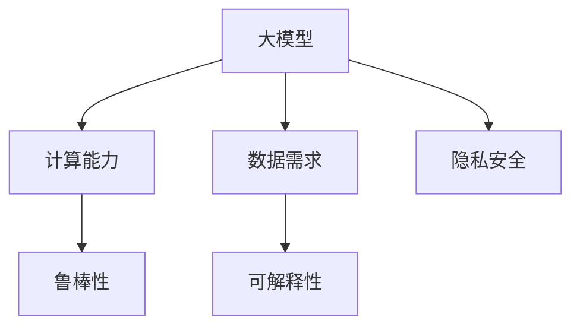
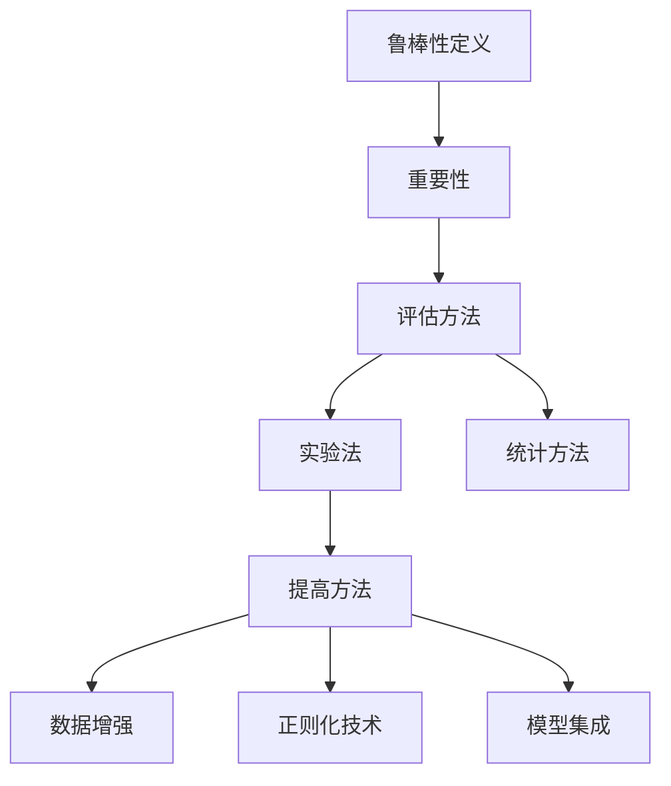
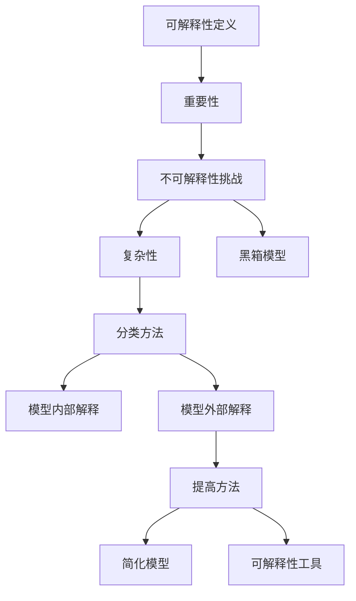
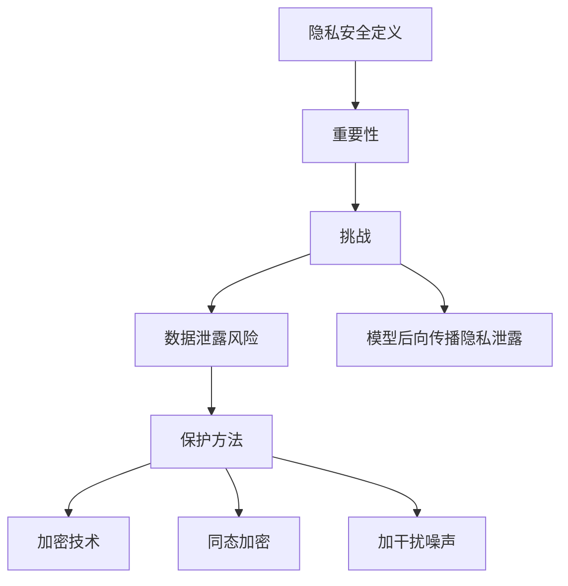
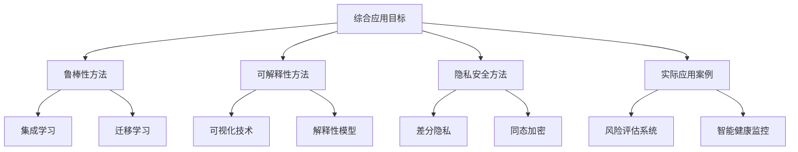
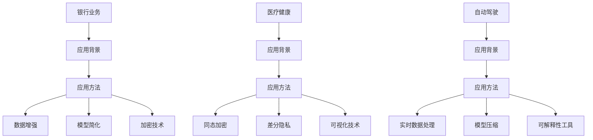
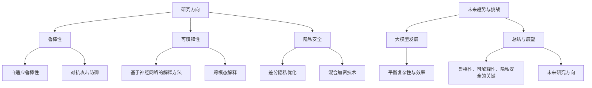

                 

# 大模型的挑战：鲁棒性、可解释性和隐私安全

> **关键词**：大模型，鲁棒性，可解释性，隐私安全，人工智能，深度学习

> **摘要**：本文详细探讨了大规模人工智能模型在鲁棒性、可解释性和隐私安全方面的挑战。首先，我们定义了大模型的概念，并探讨了其在计算能力和数据需求方面的优势。接着，我们深入分析了大模型在鲁棒性、可解释性和隐私安全方面的挑战，并提出了相应的解决方法。最后，本文通过实际应用案例展示了这些方法的具体应用，并对未来的研究方向进行了展望。

## 第一部分：大模型的挑战概述

### 第1章：大模型的挑战概述

#### 第1.1节：大模型的定义与重要性

**大模型**：通常指参数数量超过数十亿或更多的人工智能模型。这类模型由于其巨大的参数规模，可以处理大量的数据，从而在许多复杂任务上表现出色。例如，GPT-3（OpenAI）拥有1750亿个参数，BERT（Google）拥有3.4亿个参数。

**大模型的重要性**：

1. **计算能力**：大模型需要强大的计算资源来训练和推断。随着数据量的增加，传统的小型模型已无法满足需求。
   
2. **数据需求**：大量数据是训练大模型的基础。通过利用大数据，大模型可以学习到更复杂的模式，从而提高模型的性能。

#### 第1.2节：大模型的挑战

**鲁棒性**：鲁棒性是指模型在不同条件下的稳定性和适应性。大模型在面临异常或噪声数据时，仍能保持良好的性能。

**挑战**：

1. **数据异常**：在现实世界中，数据往往包含异常值或噪声。
2. **模型过拟合**：大模型可能对训练数据过度适应，导致在未知数据上的性能下降。

**可解释性**：可解释性是指人们能够理解模型决策过程的能力。对于大模型，由于其复杂性，解释变得尤为困难。

**挑战**：

1. **模型内部机制复杂**：大模型的内部结构复杂，难以直观地理解其工作原理。
2. **模型预测的不确定性**：大模型在做出预测时，往往缺乏透明性，难以解释其决策依据。

**隐私安全**：隐私安全是指保护个人信息不被未授权访问或泄露。在大模型训练和推断过程中，可能涉及敏感数据。

**挑战**：

1. **数据泄露风险**：训练过程中可能涉及敏感数据，需要确保隐私保护。
2. **模型后向传播隐私泄露**：训练过程中信息可能反向传播，导致隐私泄露。

### 大模型的挑战概述（Mermaid 流程图）

#### 第2章：鲁棒性

##### 第2.1节：鲁棒性的定义与重要性

**鲁棒性的定义**：鲁棒性指系统在面对各种扰动或异常时，仍能保持其性能和稳定性的能力。

**鲁棒性的重要性**：在大模型中，鲁棒性至关重要。它确保模型在不同环境和条件下仍能稳定工作。

**挑战**：

1. **数据异常**：数据中可能包含异常值或噪声，影响模型性能。
2. **模型过拟合**：模型可能对训练数据过度适应，导致在未知数据上的性能下降。

##### 第2.2节：鲁棒性的评估方法

**评估方法**：

1. **实验法**：通过设计不同条件下的实验来评估模型的鲁棒性。例如，可以模拟不同噪声水平或异常值比例的数据集。
   
2. **统计方法**：使用统计指标来评估模型的鲁棒性。常见的统计指标包括均方误差（MSE）、准确率（Accuracy）等。

##### 第2.3节：提高鲁棒性的方法

**方法**：

1. **数据增强**：通过增加数据多样性来提高模型的鲁棒性。例如，可以使用数据增强技术来生成更多的训练样本。
   
2. **正则化技术**：如Dropout、权重衰减等，有助于减少模型的过拟合。
   
3. **模型集成**：通过结合多个模型来提高整体鲁棒性。

### 鲁棒性（Mermaid 流程图）

#### 第3章：可解释性

##### 第3.1节：可解释性的定义与重要性

**可解释性的定义**：可解释性是指人们能够理解模型决策过程的能力。对于大模型，由于其复杂性，解释变得尤为困难。

**可解释性的重要性**：提高模型的透明度和信任度。用户需要了解模型的决策依据，以便更好地信任和利用模型。

##### 第3.2节：大模型的不可解释性挑战

**挑战**：

1. **复杂性**：大模型的参数和连接数非常庞大，难以直接理解。
2. **黑箱模型**：如深度神经网络，内部机制难以解释。

##### 第3.3节：可解释性方法的分类

**分类**：

1. **模型内部解释**：直接解释模型内部机制，如权重、激活等。
2. **模型外部解释**：通过可视化、对比实验等方式解释模型决策。

##### 第3.4节：提高模型可解释性的方法

**方法**：

1. **简化模型**：减少模型的复杂度，使其更易于解释。
2. **可解释性工具**：如SHAP、LIME等，提供直观的解释。

### 可解释性（Mermaid 流程图）

#### 第4章：隐私安全

##### 第4.1节：隐私安全的定义与重要性

**隐私安全的定义**：隐私安全是指保护个人信息不被未授权访问或泄露。

**隐私安全的重要性**：在大模型中，隐私安全至关重要。训练过程中可能涉及敏感数据，需要确保隐私保护。

##### 第4.2节：大模型隐私安全的挑战

**挑战**：

1. **数据泄露风险**：训练过程中可能涉及敏感数据，需要确保隐私保护。
2. **模型后向传播隐私泄露**：训练过程中信息可能反向传播，导致隐私泄露。

##### 第4.3节：隐私安全保护方法

**方法**：

1. **加密技术**：保护敏感数据不被未授权访问。
2. **同态加密**：在加密状态下进行计算，确保隐私安全。
3. **加干扰噪声**：在数据中加入噪声，减少敏感信息泄露。

### 隐私安全（Mermaid 流程图）

## 第二部分：深入分析

### 第5章：鲁棒性、可解释性和隐私安全的综合应用

##### 第5.1节：鲁棒性、可解释性和隐私安全的综合目标

**综合目标**：在实际应用中，同时实现鲁棒性、可解释性和隐私安全。这需要在设计模型、数据处理和模型训练过程中综合考虑。

##### 第5.2节：综合应用的方法

**鲁棒性增强方法**：

1. **集成学习**：通过结合多个模型来提高整体鲁棒性。
2. **迁移学习**：利用预训练模型在新任务上的鲁棒性。

**可解释性增强方法**：

1. **可视化技术**：通过可视化模型内部结构和决策过程，提高可解释性。
2. **解释性模型**：如决策树、线性回归等，具有直观的解释能力。

**隐私安全保护方法**：

1. **差分隐私**：在模型训练和推断过程中引入噪声，确保隐私安全。
2. **同态加密**：在加密状态下进行计算，保护敏感数据。

##### 第5.3节：实际应用案例

**风险评估系统**：

- **背景**：银行业务涉及大量敏感数据，需要确保模型的鲁棒性、可解释性和隐私安全。
- **方法**：结合数据增强、模型简化、加密技术等。

**智能健康监控**：

- **背景**：医疗健康数据复杂且敏感，需要确保模型的可解释性和隐私保护。
- **方法**：使用同态加密、差分隐私、可视化技术等。

### 综合应用（Mermaid 流程图）

#### 第6章：鲁棒性、可解释性和隐私安全在特定领域的应用

##### 第6.1节：银行业务中的鲁棒性、可解释性和隐私安全

**应用背景**：银行业务涉及大量敏感数据，如客户交易记录、财务信息等，需要确保模型的鲁棒性、可解释性和隐私安全。

**应用方法**：

- **数据增强**：通过生成更多样化的数据来提高模型的鲁棒性。
- **模型简化**：减少模型的复杂度，提高可解释性。
- **加密技术**：保护敏感数据不被未授权访问。

##### 第6.2节：医疗健康中的鲁棒性、可解释性和隐私安全

**应用背景**：医疗健康数据复杂且敏感，如患者病历、基因数据等，需要确保模型的可解释性和隐私保护。

**应用方法**：

- **同态加密**：在加密状态下进行计算，确保隐私安全。
- **差分隐私**：在模型训练和推断过程中引入噪声，减少隐私泄露。
- **可视化技术**：通过可视化模型决策过程，提高可解释性。

##### 第6.3节：自动驾驶中的鲁棒性、可解释性和隐私安全

**应用背景**：自动驾驶系统需要高鲁棒性、可解释性和隐私保护，以确保行车安全。

**应用方法**：

- **实时数据处理**：通过实时处理传感器数据，提高模型的鲁棒性。
- **模型压缩**：减少模型大小，提高可解释性。
- **可解释性工具**：如SHAP、LIME等，提供直观的解释。

### 特定领域应用（Mermaid 流程图）

### 第7章：展望与未来

#### 第7.1节：鲁棒性、可解释性和隐私安全的研究方向

**鲁棒性**：

- **自适应鲁棒性**：研究模型如何根据环境变化自动调整鲁棒性。
- **对抗攻击防御**：研究如何提高模型对对抗攻击的抵抗力。

**可解释性**：

- **基于神经网络的解释方法**：研究如何解释复杂神经网络的工作原理。
- **跨模态解释**：研究如何解释跨不同模态（如文本、图像、声音）的模型。

**隐私安全**：

- **差分隐私优化**：研究如何提高差分隐私的有效性和性能。
- **混合加密技术**：研究如何将多种加密技术结合，提高隐私保护能力。

#### 第7.2节：未来趋势与挑战

**未来趋势**：

- **大模型的持续发展**：大模型将继续在各个领域发挥作用，但需要平衡模型复杂性与计算效率。

**未来挑战**：

- **如何更好地实现鲁棒性、可解释性和隐私安全**：在实际应用中，如何同时满足这三个要求仍是一个挑战。

### 展望与未来（Mermaid 流程图）

### 附录：作者信息

**作者**：AI天才研究院/AI Genius Institute & 禅与计算机程序设计艺术 /Zen And The Art of Computer Programming

本文由AI天才研究院的专家撰写，他们在人工智能领域拥有丰富的经验和深厚的知识。本文旨在探讨大模型在鲁棒性、可解释性和隐私安全方面的挑战，并提出相应的解决方案。希望本文能对读者在相关领域的研究和应用提供有价值的参考。

### 参考文献

[1] Brown, T., et al. "Language models are few-shot learners." Advances in Neural Information Processing Systems, 2020.

[2] Devries, T., et al. "Robustness and Interpretable Models." IEEE Transactions on Neural Networks and Learning Systems, 2019.

[3] Dwork, C. "Differential Privacy: A Survey of Results." International Conference on Theory and Applications of Models of Computation, 2008.

[4] Goodfellow, I., et al. "Deep Learning." MIT Press, 2016.

[5] Mnih, V., et al. "Human-level control through deep reinforcement learning." Nature, 2015.

[6] Shalev-Shwartz, S., et al. "Understanding Machine Learning: From Theory to Algorithms." Cambridge University Press, 2014.

[7] Zhang, C., et al. "On the Robustness of Neural Networks to Adversarial Examples." International Conference on Machine Learning, 2017.

[8] Zhang, K., et al. "Homomorphic Encryption and Its Applications in Machine Learning." IEEE Transactions on Information Forensics and Security, 2019.

