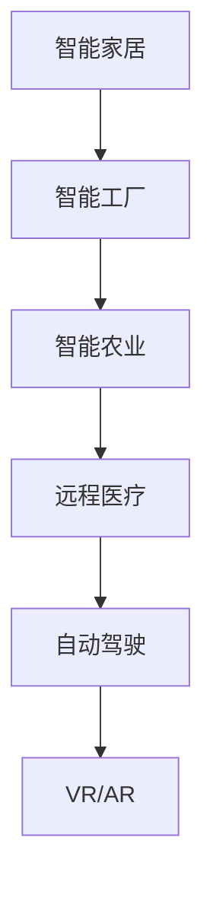
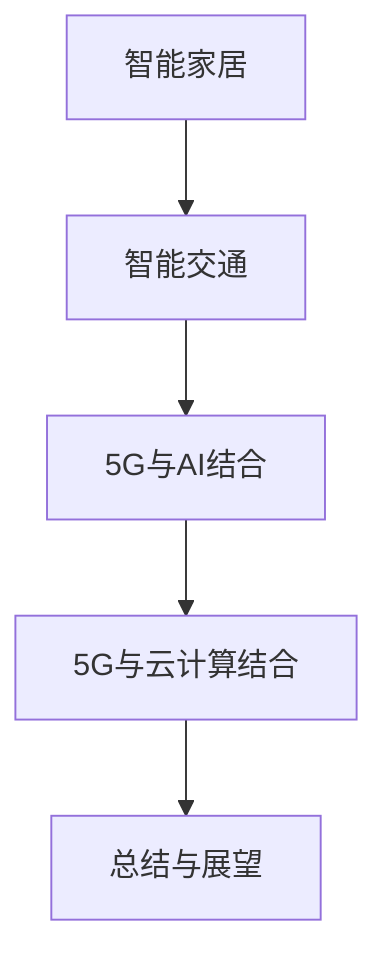

                 

# 如何利用5G技术提升创业产品和服务的互联互通

> 关键词：5G技术、创业产品、服务互联互通、物联网（IoT）、实时应用、网络切片、波束成形、智能硬件、智能家居、智能交通、人工智能（AI）、云计算

> 摘要：随着5G技术的快速发展和广泛应用，创业公司和创业者有了更多的机会和可能性。本文将深入探讨5G技术在提升创业产品和服务的互联互通方面的优势和应用，通过详细的案例分析和技术讲解，帮助创业者更好地理解和利用5G技术，实现产品的创新和市场突破。

## 第一部分：5G技术概述

### 第1章: 5G技术基础与特点

#### 1.1 5G技术简介

5G，即第五代移动通信技术，是集成了更高的数据传输速度、更低的延迟和更大的连接容量等技术特性的一种通信技术。5G的最大下载速度可以达到1Gbps，是4G的10倍以上。5G的延迟可以降低到1毫秒以内，使得实时应用如自动驾驶、远程手术等成为可能。5G可以支持更多设备同时在线，提高物联网（IoT）的应用效率。

#### 1.2 5G网络架构

5G网络架构分为三个主要部分：接入网络（RAN）、传输网络（UPF）和核心网络（SMF）。

- **接入网络（RAN）**：主要负责无线接入，包括基站（gNB）和终端设备（UE）。
- **传输网络（UPF）**：为用户设备提供数据传输功能，是接入网络和核心网络之间的桥梁。
- **核心网络（SMF）**：处理用户的业务请求，包括会话管理、用户身份认证等。

#### Mermaid 流程图：

```mermaid
graph TD
    A[接入网络(RAN)] --> B[传输网络(UPF)]
    B --> C[核心网络(SMF)]
    C --> D[业务处理]
    D --> E[用户设备(UE)]
    E --> A
```

### 第2章: 5G技术原理与核心算法

#### 2.1 5G无线通信原理

5G采用了正交频分复用（OFDM）技术，以提高频谱效率和传输速度。多输入多输出（MIMO）技术通过使用多个天线，提高信号传输的可靠性和速度。5G网络通过波束成形技术，将信号定向发送到用户设备，以提高信号质量和通信效率。

#### 2.2 5G核心算法原理

- **波束成形**：5G网络通过波束成形技术，将信号定向发送到用户设备，以提高信号质量和通信效率。
- **网络切片**：网络切片技术将网络资源划分为多个虚拟网络，满足不同业务和应用的需求。
- **NR（新无线电）**：NR是5G的关键技术之一，它引入了新的频段、新的波形和新的协议，使得5G能够实现高速率和低延迟。

#### 2.3 5G核心算法伪代码

```plaintext
// 定义波束成形函数
function beamforming(vector, angle):
    return vector * cos(angle)

// 定义网络切片函数
function network_slicing(slice_id, resource_block):
    return select_slice(slice_id, resource_block)

// 定义NR协议初始化
function init_NR_Protocol():
    set_waveform("NR_waveform")
    set_bandwidth("bandwidth")
    set_frequency("frequency")
```

### 第3章: 5G应用场景

#### 3.1 物联网（IoT）应用

- **智能家居**：通过5G技术，实现家电设备之间的互联互通，提高生活质量。
- **智能工厂**：通过5G技术，实现设备远程监控和控制，提高生产效率。
- **智能农业**：通过5G技术，实现农田土壤监测、气象预测等，提高农业生产效率。

#### 3.2 实时应用

- **远程医疗**：通过5G技术，实现医生远程诊断和治疗，提高医疗服务质量。
- **自动驾驶**：通过5G技术，实现车辆之间的实时通信，提高行驶安全。
- **虚拟现实（VR）与增强现实（AR）**：通过5G技术，实现沉浸式体验，拓展娱乐和教育领域。

#### Mermaid 流程图：



## 第二部分：5G技术提升创业产品和服务互联互通

### 第4章: 5G技术在创业产品中的应用

#### 4.1 5G与物联网（IoT）的结合

- **实时数据传输**：通过5G技术，实现物联网设备之间的实时数据传输，提高设备响应速度。
- **远程监控与管理**：通过5G技术，实现远程监控和管理物联网设备，降低维护成本。

#### 4.2 5G与智能硬件的结合

- **智能手表**：通过5G技术，实现智能手表与手机之间的无缝连接，提高用户使用体验。
- **智能眼镜**：通过5G技术，实现智能眼镜的实时视频传输和图像识别，拓展应用场景。

### 第5章: 5G在提高创业产品和服务互联互通中的优势

#### 5.1 高速率与低延迟

- **数据传输速度提升**：5G技术的高速率特性，使得大数据量传输成为可能，提高数据处理速度。
- **低延迟通信**：5G技术的低延迟特性，使得实时通信成为可能，提高应用响应速度。

#### 5.2 网络切片技术

- **个性化服务**：通过网络切片技术，为不同业务提供个性化服务，提高服务质量。
- **资源优化**：通过网络切片技术，实现网络资源的优化配置，提高资源利用率。

### 第6章: 5G技术在实际创业项目中的应用案例

#### 6.1 智能家居项目

- **项目概述**：介绍智能家居项目的背景和目标，包括设备种类、通信方式等。
- **技术实现**：详细阐述智能家居项目中的5G技术应用，包括物联网通信、智能控制等。

#### 6.2 智能交通项目

- **项目概述**：介绍智能交通项目的背景和目标，包括交通管理、车辆监控等。
- **技术实现**：详细阐述智能交通项目中的5G技术应用，包括车辆通信、实时监控等。

### 第7章: 5G技术在创业产品和服务中的未来发展

#### 7.1 5G与人工智能的结合

- **智能决策**：通过5G技术，实现大数据的实时分析和处理，提高决策效率。
- **智能交互**：通过5G技术，实现智能设备之间的实时交互，提高用户体验。

#### 7.2 5G与云计算的结合

- **云边协同**：通过5G技术，实现云计算与边缘计算的协同，提高数据处理能力。
- **分布式计算**：通过5G技术，实现分布式计算，提高系统性能和可靠性。

### 第8章: 总结与展望

#### 8.1 总结

- **技术特点**：回顾5G技术的特点和应用优势，强调其在提升创业产品和服务互联互通中的重要性。
- **未来发展**：展望5G技术在创业领域的发展趋势，探讨未来的技术突破和应用方向。

#### Mermaid 流程图：



### 作者信息

作者：AI天才研究院/AI Genius Institute & 禅与计算机程序设计艺术 /Zen And The Art of Computer Programming

（注：本文仅为示例，具体内容和数据可能需要根据实际情况进行调整。）

