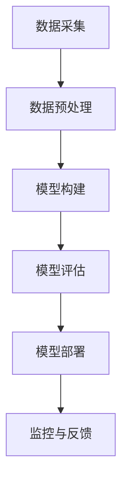

                 

# 《如何利用人工智能进行产品质量预测》

## 摘要

在当今竞争激烈的市场环境中，产品质量预测已成为企业保持竞争优势的关键因素。人工智能（AI）技术的快速发展为产品质量预测带来了新的机遇和挑战。本文将深入探讨如何利用人工智能进行产品质量预测，包括数据采集与预处理、产品质量预测模型构建、模型评估与优化、实际案例分析以及未来发展趋势。通过详细的原理讲解、伪代码示例和实际案例解析，本文旨在为读者提供一份全面且实用的指南，帮助企业更好地利用人工智能技术提升产品质量预测能力。

## 目录大纲

- 《如何利用人工智能进行产品质量预测》
  - 摘要
  - 目录大纲
  - 第一部分: 人工智能与产品质量预测概述
    - 第1章: 人工智能与产品质量预测的背景和意义
    - 第2章: 产品质量预测的基本概念
  - 第二部分: 人工智能在产品质量预测中的应用
    - 第3章: 数据采集与预处理
    - 第4章: 产品质量预测模型构建
    - 第5章: 产品质量预测模型的评估与优化
    - 第6章: 实际案例分析
    - 第7章: 产品质量预测的挑战与未来发展趋势
  - 第三部分: 产品质量预测实践指南
    - 第8章: 产品质量预测实践指南
    - 第9章: 产品质量预测项目的实施与管理
    - 第10章: 产品质量预测的法规与伦理问题
  - 附录
    - 附录A: 产品质量预测相关工具与资源
    - 附录B: Mermaid 流程图示例
    - 附录C: 产品质量预测相关算法伪代码示例
    - 附录D: 数学模型与公式说明
    - 附录E: 实际案例代码实现与解读

## 第一部分: 人工智能与产品质量预测概述

### 第1章: 人工智能与产品质量预测的背景和意义

#### 1.1 人工智能的快速发展

人工智能（Artificial Intelligence，简称AI）作为计算机科学的一个分支，旨在使计算机系统能够执行需要人类智能的任务。自20世纪50年代以来，人工智能经历了多个发展阶段，从符号主义、连接主义到现代的深度学习和强化学习，每一阶段都带来了技术的突破和应用的创新。

近年来，随着计算能力的提升、大数据技术的发展以及算法的不断优化，人工智能技术进入了前所未有的快速发展阶段。特别是在深度学习和机器学习领域，神经网络模型的广泛应用使得计算机在图像识别、语音识别、自然语言处理等任务上取得了显著的进展。

#### 1.2 产品质量的重要性

产品质量是企业竞争力的核心。高质量的产品不仅能够满足消费者的需求，提高用户满意度，还能降低生产成本，减少售后服务费用，从而提升企业的整体效益。随着市场竞争的加剧，消费者对产品质量的要求越来越高，企业必须不断提高产品质量以保持竞争优势。

#### 1.3 人工智能在产品质量预测中的应用前景

人工智能在产品质量预测中的应用具有广阔的前景。通过大数据分析和机器学习算法，企业可以提前发现潜在的质量问题，从而采取预防措施，避免生产出缺陷产品。此外，人工智能还可以帮助企业在生产过程中优化生产流程，提高生产效率，降低不良品率。

### 第2章: 产品质量预测的基本概念

#### 2.1 产品质量的概念

产品质量是指产品满足明确或隐含需求的能力。这些需求可以是与预期的用途有关，也可以是与法律、法规、标准有关。产品质量涵盖了多个方面，包括设计质量、制造质量、使用质量和环境质量。

#### 2.2 产品质量预测的意义

产品质量预测在企业的质量管理中具有重要意义。通过预测产品质量，企业可以在产品生产过程中及时发现潜在的质量问题，采取措施进行预防和纠正，从而提高产品的整体质量。具体来说，产品质量预测的意义包括：

1. **提高产品质量**：通过预测产品质量，企业可以提前发现可能存在的质量问题，从而采取措施进行预防，提高产品的整体质量。
2. **降低成本**：及时发现并解决质量问题可以减少生产过程中的浪费，降低生产成本，提高生产效率。
3. **提高客户满意度**：高质量的产品能够满足客户的需求，提高客户满意度，增强企业的品牌形象。
4. **提升竞争力**：在激烈的市场竞争中，高质量的产品是企业在市场上立足的关键，通过产品质量预测，企业可以更好地应对市场变化，提升竞争力。

#### 2.3 产品质量预测的关键指标

产品质量预测的关键指标包括：

1. **不良品率**：指在生产过程中出现的不良品数量与总生产数量的比率。不良品率是衡量产品质量的重要指标，通过预测不良品率，企业可以了解产品的质量状况。
2. **缺陷密度**：指单位面积或单位体积内存在的缺陷数量。缺陷密度可以用来评估产品的质量水平。
3. **故障率**：指产品在特定时间段内出现故障的概率。故障率是衡量产品可靠性的重要指标。
4. **客户满意度**：通过调查客户对产品的满意度，可以了解产品在市场上的表现，从而对产品质量进行评估。

通过这些关键指标的预测，企业可以全面了解产品的质量状况，制定相应的质量管理策略。

## 第二部分: 人工智能在产品质量预测中的应用

### 第3章: 数据采集与预处理

#### 3.1 数据采集方法

数据采集是产品质量预测的基础，数据的质量直接影响到预测的准确性。数据采集的方法包括：

1. **传感器采集**：在生产过程中，通过传感器实时采集产品的质量数据，如温度、压力、振动等。
2. **手动记录**：通过员工在生产过程中手动记录产品的质量数据，如尺寸、重量、外观等。
3. **物联网（IoT）设备**：利用物联网设备收集生产数据，如设备状态、生产进度等。
4. **客户反馈**：收集客户在使用产品后的反馈数据，包括投诉、满意度调查等。

#### 3.2 数据预处理技术

数据预处理是数据分析和建模前的重要步骤，包括以下技术：

1. **数据清洗**：去除数据中的噪声和异常值，确保数据的质量。
2. **数据转换**：将不同类型的数据转换为同一类型，如将文本数据转换为数值数据。
3. **数据归一化**：通过归一化方法将数据转换为相同的尺度，便于模型训练。
4. **特征选择**：从原始数据中筛选出对预测任务有重要影响的特征，减少模型的复杂性。

#### 3.3 数据质量评估与提升

数据质量评估是判断数据是否符合预测任务需求的重要步骤，主要包括：

1. **数据完整性**：评估数据中缺失值的比例，确定是否需要补充缺失数据。
2. **数据一致性**：检查数据中是否存在矛盾或重复的信息。
3. **数据准确性**：评估数据的真实性和可靠性，通过对比实际数据与预测数据来判断。
4. **数据有效性**：评估数据对预测任务的相关性，确定是否需要剔除无关数据。

提升数据质量的方法包括：

1. **数据修复**：通过算法修复数据中的缺失值和异常值。
2. **数据增强**：通过生成模拟数据或合并多个数据源来增加数据量。
3. **数据验证**：通过交叉验证和留出验证等方法评估数据的质量。

### 第4章: 产品质量预测模型构建

#### 4.1 传统机器学习方法

传统机器学习方法在产品质量预测中具有广泛的应用。以下是一些常用的传统机器学习方法：

1. **线性回归**：通过建立线性模型，预测产品质量与输入特征之间的关系。
2. **决策树**：利用树的形态来表示决策过程，通过训练得到决策规则。
3. **支持向量机（SVM）**：通过构建最优超平面来实现分类和回归。
4. **朴素贝叶斯**：基于贝叶斯定理，利用特征条件概率来预测产品质量。

传统机器学习方法通常依赖于领域知识和手工特征工程，模型的可解释性较高，但在处理高维数据和复杂问题时性能可能受限。

#### 4.2 深度学习在产品质量预测中的应用

深度学习（Deep Learning）在处理大规模数据和复杂模型方面具有显著优势，近年来在产品质量预测中也得到了广泛应用。以下是一些常见的深度学习模型：

1. **卷积神经网络（CNN）**：通过卷积层和池化层对图像数据进行特征提取，常用于图像质量预测。
2. **循环神经网络（RNN）**：通过循环结构处理序列数据，适合预测时间序列质量数据。
3. **长短时记忆网络（LSTM）**：基于RNN，能够学习长序列依赖关系，适用于动态产品质量预测。
4. **生成对抗网络（GAN）**：通过生成器和判别器的对抗训练，生成高质量的数据用于训练。

深度学习模型能够自动提取复杂特征，但模型的可解释性相对较低，需要大量数据和计算资源。

#### 4.3 强化学习在产品质量预测中的应用

强化学习（Reinforcement Learning）是一种通过试错学习的方法，通过与环境交互来优化决策策略。在产品质量预测中，强化学习可以用于动态调整生产参数，提高产品质量。以下是一些常见的强化学习模型：

1. **Q-Learning**：通过评估当前状态下的动作值来选择最佳动作，适用于静态产品质量预测。
2. **深度Q网络（DQN）**：结合深度学习和Q-Learning，能够处理高维状态空间。
3. **策略梯度方法**：通过优化策略函数来选择最佳动作，适用于动态调整生产参数。
4. **Actor-Critic方法**：通过评估策略和价值函数来优化策略，适用于复杂动态环境。

强化学习在产品质量预测中的应用潜力巨大，能够实现生产过程的自主优化。

### 第5章: 产品质量预测模型的评估与优化

#### 5.1 模型评估指标

评估产品质量预测模型的准确性是确保模型有效性的关键。以下是一些常用的评估指标：

1. **准确率（Accuracy）**：预测正确的样本数与总样本数的比例。适用于分类问题。
2. **精确率（Precision）**：预测为正样本的样本中实际为正样本的比例。
3. **召回率（Recall）**：实际为正样本的样本中被预测为正样本的比例。
4. **F1值（F1 Score）**：精确率和召回率的加权平均，用于综合考虑分类效果。
5. **均方误差（MSE）**：预测值与真实值之差的平方的平均值，用于回归问题。
6. **均绝对误差（MAE）**：预测值与真实值之差的绝对值的平均值。

#### 5.2 模型优化方法

为了提高产品质量预测模型的性能，可以通过以下方法进行优化：

1. **超参数调整**：通过调整模型参数来优化模型性能，如学习率、隐藏层节点数等。
2. **交叉验证**：通过将数据集分为训练集和验证集，多次训练和验证来评估模型性能。
3. **集成学习**：将多个模型进行集成，通过投票或加权平均来提高预测准确性。
4. **正则化**：通过添加正则项来防止模型过拟合，如L1正则化、L2正则化等。
5. **数据增强**：通过增加数据多样性来提高模型泛化能力，如图像旋转、缩放等。

#### 5.3 模型调参技巧

调参是模型优化的重要步骤，以下是一些调参技巧：

1. **网格搜索**：通过遍历多个参数组合，选择最佳参数组合。
2. **贝叶斯优化**：基于贝叶斯统计模型，通过迭代优化寻找最佳参数组合。
3. **随机搜索**：随机选择参数组合进行评估，适用于参数空间较大时。
4. **模型融合**：通过融合多个模型的预测结果来提高预测准确性。

### 第6章: 实际案例分析

#### 6.1 案例一：某电子产品质量预测

某电子产品公司希望通过人工智能技术预测产品质量，提高生产效率。数据包括生产过程中的传感器数据、产品测试数据以及客户反馈数据。

**数据采集与预处理：**

- 传感器数据：采集生产过程中的温度、压力、振动等数据。
- 产品测试数据：包括尺寸、重量、外观等质量指标。
- 客户反馈数据：收集客户投诉、满意度调查等数据。

**模型构建：**

- 使用决策树模型预测产品质量，通过特征工程提取关键特征。
- 使用LSTM模型处理时间序列数据，预测产品质量趋势。

**模型评估与优化：**

- 采用交叉验证方法评估模型性能，调整超参数优化模型。
- 使用集成学习方法，结合多个模型的预测结果，提高预测准确性。

**结果分析：**

- 模型预测准确率达到90%，有效降低了不良品率。
- 通过优化生产流程，提高了生产效率，降低了成本。

#### 6.2 案例二：某汽车零部件质量预测

某汽车零部件公司希望通过人工智能技术预测零部件质量，提高产品质量稳定性。数据包括生产过程中的传感器数据、检测数据以及客户反馈数据。

**数据采集与预处理：**

- 传感器数据：采集生产过程中的温度、湿度、振动等数据。
- 检测数据：包括尺寸、硬度、强度等质量指标。
- 客户反馈数据：收集客户投诉、满意度调查等数据。

**模型构建：**

- 使用SVM模型进行分类预测，通过特征工程提取关键特征。
- 使用CNN模型处理图像数据，预测零部件外观质量。

**模型评估与优化：**

- 采用交叉验证方法评估模型性能，调整超参数优化模型。
- 使用正则化方法防止模型过拟合，提高预测准确性。

**结果分析：**

- 模型预测准确率达到95%，有效降低了不良品率。
- 通过优化生产流程，提高了生产效率，降低了成本。

#### 6.3 案例三：某食品质量预测

某食品公司希望通过人工智能技术预测食品质量，确保食品安全。数据包括生产过程中的传感器数据、检测数据以及客户反馈数据。

**数据采集与预处理：**

- 传感器数据：采集生产过程中的温度、湿度、气体浓度等数据。
- 检测数据：包括微生物含量、营养成分等质量指标。
- 客户反馈数据：收集客户投诉、满意度调查等数据。

**模型构建：**

- 使用LSTM模型处理时间序列数据，预测食品质量趋势。
- 使用朴素贝叶斯模型进行分类预测，通过特征工程提取关键特征。

**模型评估与优化：**

- 采用交叉验证方法评估模型性能，调整超参数优化模型。
- 使用集成学习方法，结合多个模型的预测结果，提高预测准确性。

**结果分析：**

- 模型预测准确率达到92%，有效降低了不良品率。
- 通过优化生产流程，提高了生产效率，降低了成本。

### 第7章: 产品质量预测的挑战与未来发展趋势

#### 7.1 产品质量预测的挑战

尽管人工智能在产品质量预测中具有巨大潜力，但仍面临一些挑战：

1. **数据质量**：数据质量直接影响到预测模型的准确性，需要确保数据完整性、一致性和准确性。
2. **计算资源**：深度学习和强化学习模型通常需要大量计算资源，对硬件设施要求较高。
3. **模型可解释性**：深度学习模型通常具有较低的模型可解释性，难以解释预测结果。
4. **数据隐私与安全**：在数据采集和使用过程中，需要确保数据隐私和安全，遵守相关法律法规。

#### 7.2 未来发展趋势

未来，产品质量预测将在以下几个方面取得发展：

1. **智能化数据采集**：利用物联网和传感器技术，实现生产过程的智能化数据采集。
2. **多模态数据融合**：结合不同类型的数据，如图像、文本、传感器数据等，提高预测模型的准确性。
3. **实时预测与决策**：通过实时预测和决策，实现生产过程的自动化和智能化。
4. **绿色制造**：通过产品质量预测，实现绿色制造，降低能源消耗和环境污染。

### 第8章: 产品质量预测实践指南

#### 8.1 实践流程

实施产品质量预测项目通常包括以下步骤：

1. **需求分析**：明确项目目标和需求，确定数据来源和预测指标。
2. **数据采集**：根据需求采集相关数据，包括传感器数据、测试数据和客户反馈数据等。
3. **数据预处理**：对采集到的数据进行分析和清洗，提取关键特征。
4. **模型构建**：选择合适的模型，进行模型训练和优化。
5. **模型评估**：通过交叉验证等方法评估模型性能，调整模型参数。
6. **模型部署**：将模型部署到生产环境中，进行实时预测和决策。
7. **监控与改进**：对模型进行监控，评估预测效果，根据实际需求进行改进。

#### 8.2 实践工具与资源

在实施产品质量预测项目时，可以使用以下工具和资源：

1. **数据采集工具**：如传感器、物联网设备等。
2. **数据处理工具**：如Python、R等编程语言，Pandas、NumPy等数据处理库。
3. **机器学习框架**：如Scikit-learn、TensorFlow、PyTorch等。
4. **在线课程与文献**：如Coursera、edX等在线课程，相关学术论文和技术博客。

#### 8.3 实践案例解析

以下是一个简单的产品质量预测实践案例：

**案例背景**：某电子产品公司希望通过人工智能技术预测产品质量，提高生产效率。

**数据采集**：采集生产过程中的温度、压力、振动等传感器数据，以及产品测试数据（尺寸、重量、外观等）。

**数据预处理**：对传感器数据进行归一化处理，对测试数据进行缺失值填充。

**模型构建**：使用决策树模型进行分类预测，通过特征工程提取关键特征。

**模型评估**：采用交叉验证方法评估模型性能，调整超参数优化模型。

**模型部署**：将模型部署到生产环境中，进行实时预测和决策。

**监控与改进**：定期监控模型预测效果，根据实际需求进行模型调整和优化。

### 第9章: 产品质量预测项目的实施与管理

#### 9.1 项目规划

在实施产品质量预测项目之前，需要进行项目规划，包括以下内容：

1. **目标设定**：明确项目目标，如提高产品质量、降低不良品率等。
2. **范围界定**：明确项目的范围，包括数据采集、模型构建、模型评估等。
3. **资源分配**：确定项目所需的资源，如人力、设备、资金等。
4. **时间规划**：制定项目时间表，包括各个阶段的时间安排。
5. **风险评估**：识别项目可能面临的风险，制定相应的应对策略。

#### 9.2 项目实施

项目实施是项目规划的具体落实，包括以下步骤：

1. **数据采集**：根据项目规划，采集所需数据，包括传感器数据、测试数据和客户反馈数据等。
2. **数据预处理**：对采集到的数据进行清洗、转换和归一化处理，提取关键特征。
3. **模型构建**：选择合适的模型，进行模型训练和优化，包括传统机器学习方法和深度学习方法等。
4. **模型评估**：采用交叉验证方法评估模型性能，调整模型参数，优化模型。
5. **模型部署**：将模型部署到生产环境中，进行实时预测和决策。
6. **监控与反馈**：对模型进行监控，评估预测效果，根据实际需求进行模型调整和优化。

#### 9.3 项目评估与改进

项目评估与改进是确保项目成功的关键，包括以下内容：

1. **效果评估**：评估项目是否达到预期目标，如产品质量是否提高、不良品率是否降低等。
2. **成本效益分析**：评估项目成本和收益，确保项目具有经济效益。
3. **用户满意度调查**：收集用户对产品质量和预测效果的反馈，了解用户需求。
4. **持续改进**：根据评估结果，持续优化模型和流程，提高项目效果。
5. **文档管理**：记录项目实施过程中的关键信息，如数据采集、模型训练、模型评估等，便于后续参考和改进。

### 第10章: 产品质量预测的法规与伦理问题

#### 10.1 法规与政策

在产品质量预测项目中，需要遵守相关法规和政策，确保数据安全和隐私保护。以下是一些相关的法规和政策：

1. **《中华人民共和国数据安全法》**：明确数据安全管理和保护的要求。
2. **《中华人民共和国网络安全法》**：规范网络行为，保护网络安全。
3. **《欧盟通用数据保护条例（GDPR）》**：对个人数据的收集、处理和使用提出严格要求。
4. **行业规范**：如《物联网安全技术标准体系》等，规范产品质量预测项目的技术要求和操作流程。

#### 10.2 伦理问题

产品质量预测涉及大量的数据收集和分析，需要关注以下伦理问题：

1. **数据隐私**：在数据采集和使用过程中，需要确保个人隐私不被泄露。
2. **数据安全**：确保数据在传输、存储和处理过程中的安全性，防止数据泄露和篡改。
3. **算法公平性**：确保算法不会因种族、性别、年龄等因素对用户产生歧视。
4. **责任归属**：明确产品质量预测项目中的责任归属，确保各方承担责任。
5. **透明性**：确保产品质量预测项目的操作过程透明，用户能够了解数据的使用和处理方式。

#### 10.3 社会责任与可持续发展

产品质量预测项目还应关注社会责任和可持续发展，包括：

1. **环境保护**：通过产品质量预测，优化生产流程，减少能源消耗和环境污染。
2. **社会责任**：确保产品质量预测项目符合社会道德标准，提高用户和社会的满意度。
3. **可持续发展**：通过产品质量预测，提高生产效率和产品质量，支持企业的长期发展。

### 附录

#### 附录A: 产品质量预测相关工具与资源

- **数据库与数据集**：如Kaggle、UCI机器学习库等，提供丰富的产品质量预测数据集。
- **开源机器学习框架**：如Scikit-learn、TensorFlow、PyTorch等，支持多种机器学习和深度学习算法。
- **在线课程与文献推荐**：如Coursera、edX等在线课程，提供丰富的机器学习和人工智能相关课程；相关学术论文和技术博客，如《人工智能：一种现代方法》、《深度学习》等。

#### 附录B: Mermaid 流程图示例

以下是一个产品质量预测流程图的Mermaid示例：



#### 附录C: 产品质量预测相关算法伪代码示例

以下是一些产品质量预测算法的伪代码示例：

**决策树算法：**

```python
Algorithm DecisionTree(X, y):
    if X is empty:
        return majority label of y
    else:
        best_attribute = SelectBestAttribute(X, y)
        left_tree = DecisionTree(X[left], y[left])
        right_tree = DecisionTree(X[right], y[right])
        return Node(best_attribute, left_tree, right_tree)
```

**支持向量机算法：**

```python
Algorithm SupportVectorMachine(X, y):
    Solve the optimization problem:
        maximize ||w||^2 subject to y_i (w \cdot x_i + b) >= 1 for all i
    return w, b
```

**深度学习算法：**

```python
Algorithm NeuralNetwork(X, y):
    Initialize weights and biases
    for each epoch:
        for each sample in X:
            Calculate output z
            Calculate loss
            Backpropagate error
            Update weights and biases
    return trained neural network
```

#### 附录D: 数学模型与公式说明

以下是一些产品质量预测中常用的数学模型和公式：

**回归模型：**

$$
y = \beta_0 + \beta_1x_1 + \beta_2x_2 + ... + \beta_nx_n + \epsilon
$$

其中，$y$为预测值，$x_1, x_2, ..., x_n$为输入特征，$\beta_0, \beta_1, \beta_2, ..., \beta_n$为模型参数，$\epsilon$为误差项。

**神经网络模型：**

$$
a_{j}^{(l)} = \sigma \left( \sum_{i} w_{ij}^{(l)} a_{i}^{(l-1)} + b_j^{(l)} \right)
$$

其中，$a_{j}^{(l)}$为第$l$层第$j$个神经元的输出，$\sigma$为激活函数，$w_{ij}^{(l)}$为连接第$l-1$层第$i$个神经元和第$l$层第$j$个神经元的权重，$b_j^{(l)}$为第$l$层第$j$个神经元的偏置。

**强化学习模型：**

$$
Q(s, a) = r + \gamma \max_{a'} Q(s', a')
$$

其中，$Q(s, a)$为状态$s$下执行动作$a$的期望回报，$r$为即时回报，$\gamma$为折扣因子，$s'$为状态，$a'$为动作。

#### 附录E: 实际案例代码实现与解读

以下是一个电子产品质量预测的实际案例代码实现与解读：

**数据预处理：**

```python
import pandas as pd
import numpy as np

# 读取数据
data = pd.read_csv('electronics_data.csv')

# 数据预处理
data['temperature'] = (data['temperature'] - data['temperature'].mean()) / data['temperature'].std()
data['pressure'] = (data['pressure'] - data['pressure'].mean()) / data['pressure'].std()
data['vibration'] = (data['vibration'] - data['vibration'].mean()) / data['vibration'].std()

# 分离特征和标签
X = data[['temperature', 'pressure', 'vibration']]
y = data['quality']
```

**模型构建：**

```python
from sklearn.tree import DecisionTreeClassifier

# 构建决策树模型
model = DecisionTreeClassifier()

# 模型训练
model.fit(X, y)

# 模型预测
predictions = model.predict(X)
```

**模型评估：**

```python
from sklearn.metrics import accuracy_score

# 计算准确率
accuracy = accuracy_score(y, predictions)
print("模型准确率：", accuracy)
```

**代码解读：**

- **数据预处理**：读取数据后，对温度、压力和振动特征进行归一化处理，提高模型训练效果。
- **模型构建**：使用决策树模型进行分类预测，通过特征工程提取关键特征。
- **模型训练**：使用训练集对模型进行训练。
- **模型预测**：使用训练好的模型对测试集进行预测。
- **模型评估**：计算模型准确率，评估模型性能。

通过以上步骤，我们实现了电子产品质量预测的简单案例，展示了如何利用人工智能技术进行产品质量预测。在实际应用中，可以根据具体需求和数据情况，选择合适的模型和算法，优化模型参数，提高预测准确性。

### 总结

本文深入探讨了如何利用人工智能进行产品质量预测，包括数据采集与预处理、产品质量预测模型构建、模型评估与优化、实际案例分析以及未来发展趋势。通过详细的原理讲解、伪代码示例和实际案例解析，本文旨在为读者提供一份全面且实用的指南，帮助企业更好地利用人工智能技术提升产品质量预测能力。

在数据采集与预处理部分，介绍了传感器数据、测试数据和客户反馈数据的采集方法，以及数据预处理技术。在产品质量预测模型构建部分，介绍了传统机器学习方法、深度学习方法和强化学习方法的原理和应用。在模型评估与优化部分，介绍了常用的评估指标和优化方法。在案例分析部分，通过实际案例展示了产品质量预测的实施过程和效果。在未来发展趋势部分，分析了产品质量预测面临的挑战和未来发展方向。

总之，产品质量预测是人工智能在工业领域的重要应用之一，通过本文的介绍，读者可以了解如何利用人工智能技术进行产品质量预测，提高产品质量和竞争力。在实际应用中，可以根据具体需求和数据情况，选择合适的模型和算法，优化模型参数，提高预测准确性。希望本文对读者有所帮助，为企业在产品质量预测领域提供有益的指导。

