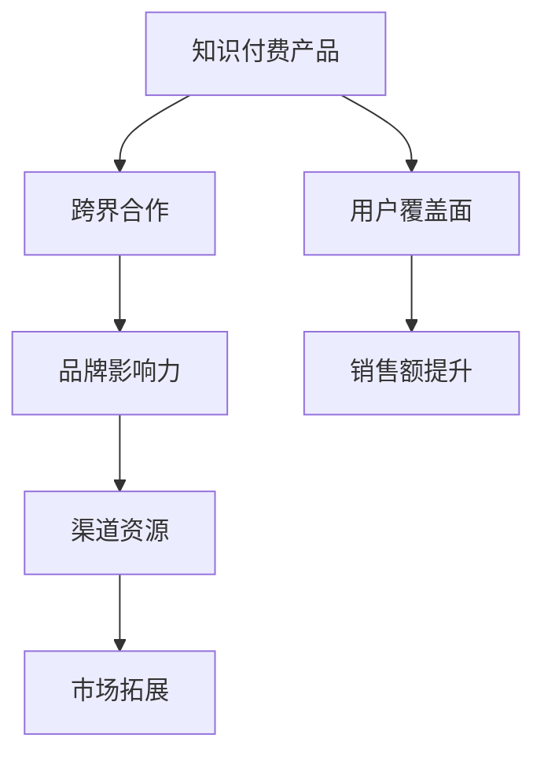

                 

### {文章标题}

> **关键词**：（此处列出文章的5-7个核心关键词）

> **摘要**：（此处给出文章的核心内容和主题思想）

在当今快速变化的市场环境中，知识付费产品作为一种新兴的商业模式，正逐渐成为企业和个人获取知识、技能和经验的重要渠道。然而，如何在激烈的市场竞争中脱颖而出，有效地推广知识付费产品，成为许多企业和创业者面临的难题。本文将探讨如何利用跨界合作来推广知识付费产品，通过一步步的分析和推理，提供一套切实可行的策略和方案。

首先，我们将介绍跨界合作和知识付费产品的核心概念，并通过Mermaid流程图展示它们之间的联系。接着，我们将深入探讨跨界合作的基本原理和策略，以及知识付费产品的推广方法。然后，我们将通过实际案例展示跨界合作在知识付费产品推广中的应用，并分析可能面临的挑战和解决方案。最后，我们将展望跨界合作和知识付费产品的未来发展趋势，并总结全文，为读者提供实用的参考和指导。

### 第一部分: 核心概念与联系

在探讨如何利用跨界合作推广知识付费产品之前，我们需要明确两个核心概念：跨界合作和知识付费产品。

#### 核心概念

**跨界合作**：指的是来自不同领域或行业的企业或个人之间的合作，通常是为了共同实现某种目标或创造新的价值。这种合作可以发生在完全不同的行业之间，如教育、科技、金融、文化等，也可以发生在同一行业的不同子领域之间。

**知识付费产品**：是指用户需要付费才能获取的学习资料或服务，例如在线课程、电子书、专业咨询等。这些产品通常是基于特定领域的专业知识或技能，旨在满足用户的学习和成长需求。

#### 跨界合作与知识付费产品的联系

**跨界合作的优势**：跨界合作可以结合不同领域的专业知识，创造新的产品和服务，提高竞争力，拓展市场。例如，一个教育机构可以与科技公司合作，开发基于人工智能的教育工具，从而提升教学质量和学习体验。

**知识付费产品的推广**：通过跨界合作，可以借助合作伙伴的品牌影响力和渠道资源，更有效地推广知识付费产品，增加用户覆盖面。例如，一个在线教育平台可以与知名咨询公司合作，利用对方的客户资源和渠道，推广其在线课程。

#### Mermaid 流�程图

以下是一个用Mermaid绘制的流程图，展示了跨界合作与知识付费产品的联系：

### 第二部分: 跨界合作的原理与策略

#### 跨界合作的基本原理

**资源互补**：不同领域的企业或个人通常拥有不同的资源和能力，通过合作可以实现资源的互补，提高整体的竞争力。例如，一个教育机构可能擅长教学内容的设计和推广，而一个科技公司则擅长教育技术的开发和应用。

**风险分散**：合作各方可以将市场风险和开发风险进行分散，降低单方面承担的风险。例如，一个初创公司可能通过合作来降低市场调研和产品开发的风险。

**创新能力**：跨界合作往往能带来新的视角和思维方式，激发创新，创造出全新的产品和服务。例如，一个传统制造企业与互联网企业合作，可以开发出基于互联网的智能制造解决方案。

#### 跨界合作的策略

**选择合适的合作伙伴**：选择与自身业务互补、有共同目标和价值观的合作伙伴。例如，一个教育机构可能选择与一个科技公司合作，共同开发基于人工智能的教育工具。

**明确合作目标**：在合作初期明确双方的合作目标和期望，确保合作方向一致。例如，合作双方可以共同确定市场拓展的目标，并制定相应的营销策略。

**合作模式设计**：设计合适的合作模式，如股权合作、契约合作、战略联盟等，确保合作关系的稳定性和持续性。例如，股权合作可以使双方在利益上更加紧密地绑定在一起。

**沟通与协调**：保持有效的沟通与协调，解决合作过程中的问题，确保合作的顺利进行。例如，定期举行双方的高层会议，及时解决合作中出现的问题。

### 第三部分: 知识付费产品的推广方法

#### 知识付费产品的推广原理

**用户需求分析**：深入了解目标用户的需求，提供针对性的产品和服务。例如，通过市场调研和用户反馈，了解用户在某一领域的具体学习需求，并针对性地开发相关课程。

**市场定位**：明确产品在市场中的定位，确定目标用户群体和市场细分。例如，一个在线教育平台可能将目标用户定位为职场新人，提供职业技能培训课程。

**品牌建设**：建立强大的品牌形象，提高产品的认知度和信任度。例如，通过高质量的内容营销和社交媒体宣传，提升品牌的知名度和美誉度。

#### 知识付费产品的推广方法

**社交媒体营销**：利用社交媒体平台（如微博、微信、抖音等）进行内容营销，吸引用户关注和参与。例如，通过发布有吸引力的教学视频和互动话题，提高用户的参与度和活跃度。

**KOL合作**：与行业内的意见领袖或达人合作，借助他们的影响力推广产品。例如，邀请知名专家开设专栏或直播课程，吸引大量潜在用户。

**线下活动**：举办线下活动（如讲座、研讨会、工作坊等），增加与用户的互动和信任。例如，定期举办行业研讨会，邀请专家和用户共同探讨行业热点话题。

**内容营销**：通过高质量的内容（如文章、视频、电子书等）提升产品的曝光度和用户粘性。例如，撰写专业的行业分析报告和案例研究，为用户提供有价值的信息。

### 第四部分: 跨界合作在知识付费产品推广中的应用

#### 跨界合作在知识付费产品推广中的应用场景

**教育领域**：与培训机构合作，提供在线课程，利用对方的教学资源和用户群体。例如，一个在线教育平台可以与线下培训机构合作，将线下的课程内容转移到线上，同时利用培训机构的用户资源，扩大在线课程的覆盖面。

**出版领域**：与出版社合作，出版专业的电子书或纸质书，利用对方的市场渠道和品牌影响力。例如，一个知识付费平台可以与知名出版社合作，共同出版专业领域的电子书，利用出版社的市场渠道和品牌影响力，提高电子书的销售量和影响力。

**咨询领域**：与专业咨询公司合作，提供行业研究报告、市场分析等付费咨询服务。例如，一个在线教育平台可以与专业咨询公司合作，共同开发行业研究报告，向用户提供有价值的行业洞察和市场分析。

#### 案例分析

**案例1：在线教育平台与培训机构合作**

**合作内容**：在线教育平台提供技术支持和课程平台，培训机构提供课程内容。

**推广效果**：通过平台的技术优势和培训机构的课程内容，实现了课程的快速推广和用户增长。合作后，平台的用户数量和课程销量均实现了显著增长。

**案例2：电子书平台与出版社合作**

**合作内容**：电子书平台提供电子书销售渠道，出版社提供电子书内容。

**推广效果**：通过电子书平台的广泛传播和出版社的品牌影响，电子书的销量显著提升。合作后，电子书平台的市场份额和用户粘性均有所提高。

### 第五部分: 跨界合作的挑战与解决方案

#### 跨界合作的挑战

**文化差异**：不同企业或个人之间的文化差异可能导致沟通障碍和合作难度。例如，一个注重创新和快速决策的科技公司可能难以与一个注重稳定和长期规划的咨询公司达成共识。

**利益分配**：合作各方的利益分配不均衡可能导致合作破裂。例如，如果合作各方在利益分配上存在明显不公平，可能会导致合作方的不满和退出。

**风险管理**：跨界合作往往涉及较大的风险，如何有效管理风险是合作成功的关键。例如，市场环境的变化、技术实现的难度等都可能成为跨界合作的潜在风险。

#### 解决方案

**文化融合**：在合作初期就进行充分的沟通和交流，建立共同的文化价值观和合作理念。例如，通过定期的交流会议和团队建设活动，增强合作各方的相互理解和信任。

**利益平衡**：通过制定明确的合作协议和利益分配机制，确保合作各方的利益得到保障。例如，可以设立一个利益共享基金，根据合作方的贡献和业绩，进行利益分配。

**风险管理**：建立完善的风险评估和管理机制，提前识别和应对合作过程中的潜在风险。例如，可以设立专门的风险管理团队，定期进行风险评估和调整合作策略。

### 第六部分: 项目实战与案例研究

#### 项目实战

**项目背景**：一个在线教育平台希望通过跨界合作来拓展用户群体和提高产品销量。他们选择了与一家知名的培训机构合作，共同开发一系列在线课程。

**合作方**：在线教育平台与培训机构。

**合作内容**：在线教育平台提供技术支持和课程平台，培训机构提供课程内容。

**项目实施**：

1. **市场调研**：双方进行了市场调研，了解了用户在某一领域的具体学习需求和期望。
2. **合作洽谈**：双方进行了详细的洽谈，明确了合作目标、合作模式、利益分配等关键问题。
3. **产品开发**：在线教育平台和培训机构共同开发了系列在线课程，并上线到平台。
4. **推广实施**：双方共同制定了推广策略，包括社交媒体营销、KOL合作、线下活动等。

**项目成果**：

1. **用户反馈**：用户对课程内容和质量给予了高度评价，用户满意度显著提升。
2. **销售额**：课程上线后，销售额实现了显著增长，平台和培训机构均获得了良好的收益。
3. **市场份额**：通过跨界合作，在线教育平台在市场中的份额得到了显著提升。

#### 案例研究

**案例1：知识付费平台与线下教育机构合作**

**合作背景**：知识付费平台希望通过跨界合作来拓展用户群体和提高产品销量。他们选择了与一家线下教育机构合作，共同推广在线课程。

**合作内容**：知识付费平台提供在线课程，线下教育机构提供线下授课服务。

**实施过程**：

1. **市场调研**：知识付费平台进行了市场调研，了解了用户对线下授课服务的需求。
2. **合作洽谈**：知识付费平台与线下教育机构进行了详细的洽谈，明确了合作目标、合作模式、利益分配等关键问题。
3. **课程开发**：双方共同开发了在线课程，并上线到平台。
4. **推广实施**：双方共同制定了推广策略，包括社交媒体营销、KOL合作、线下活动等。

**成果总结**：

1. **用户增长**：通过跨界合作，知识付费平台的用户数量得到了显著增长。
2. **销售额提升**：在线课程的销售量实现了显著增长，平台和线下教育机构均获得了良好的收益。
3. **品牌影响力**：跨界合作提高了知识付费平台和线下教育机构在市场中的知名度，增强了品牌影响力。

### 第七部分: 未来发展趋势与展望

#### 未来发展趋势

**跨界合作的深化**：随着技术的进步和市场环境的变化，跨界合作将进一步深化，跨领域、跨行业的合作模式将更加普遍。例如，人工智能技术将在更多领域得到应用，推动各行业之间的合作。

**知识付费产品的创新**：知识付费产品将更加注重个性化、定制化，满足用户多样化的学习需求。例如，基于大数据和人工智能的技术将帮助平台更好地理解用户需求，提供个性化的学习方案。

**数字化转型的加速**：数字化转型将继续推动跨界合作，为知识付费产品的推广提供更多的可能性。例如，通过云计算、大数据等技术，知识付费平台可以更加高效地管理和分析用户数据，提高用户满意度和忠诚度。

#### 展望

**跨界合作将成为企业发展的常态**：跨界合作将成为企业获取竞争优势、拓展市场、提升品牌影响力的重要手段。例如，通过跨界合作，企业可以迅速获取新的市场机会，提高自身的竞争力。

**知识付费产品将继续繁荣**：随着用户对知识的需求不断增长，知识付费产品将迎来更广阔的发展空间。例如，随着在线教育和远程办公的普及，知识付费产品将得到更广泛的应用。

### 附录

#### 附录 A: 跨界合作与知识付费产品推广相关资源

**跨界合作指南**：提供跨界合作的步骤、策略和案例。

**知识付费产品推广策略**：介绍各种推广方法和技巧。

**相关法律法规**：介绍与跨界合作和知识付费产品推广相关的法律法规。

#### 附录 B: 跨界合作与知识付费产品推广常见问题解答

**如何选择合适的合作伙伴？**：在选择合作伙伴时，应考虑双方的互补性、共同目标和价值观，以及合作的长远潜力。

**如何确保跨界合作的稳定性？**：通过建立明确的合作协议、利益分配机制和风险管理措施，确保合作的稳定性和持续性。

**如何进行有效的风险管理和利益分配？**：建立完善的风险评估和管理机制，确保合作过程中的风险得到有效控制。同时，制定合理的利益分配机制，确保合作各方的利益得到公平保障。

**如何提升知识付费产品的销量和用户满意度？**：通过深入了解用户需求，提供高质量的产品和服务。同时，利用跨界合作，借助合作伙伴的品牌影响力和渠道资源，提高产品的销量和用户满意度。此外，通过不断优化产品和服务，提升用户的满意度和忠诚度。

