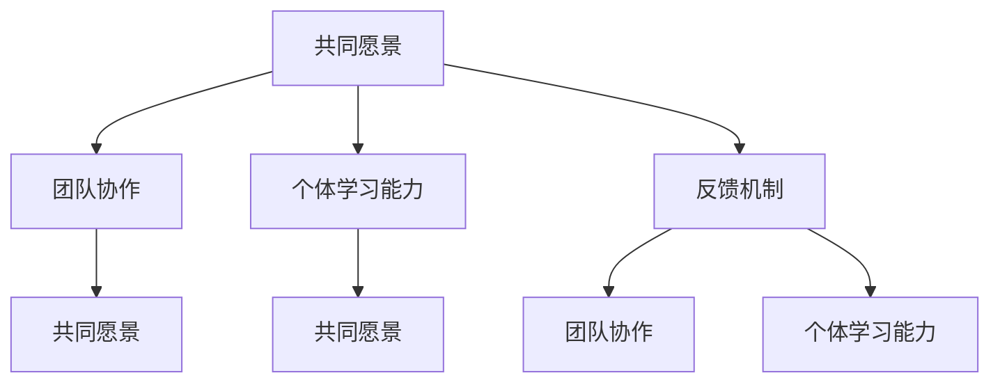

                 

### 文章标题

《如何构建创业公司的学习型组织》

### 文章关键词

创业公司，学习型组织，组织构建，团队协作，个体学习能力，反馈机制，案例研究，持续发展

### 文章摘要

本文旨在探讨如何构建创业公司的学习型组织，以提高公司的竞争力和创新能力。首先，文章介绍了创业公司面临的挑战和学习型组织的概念与优势。接着，从理论基础、构建策略、实践和评估优化等方面详细阐述了学习型组织的构建过程。通过成功案例与失败案例的剖析，本文总结了学习型组织建设的核心要点与启示。最后，展望了未来学习型组织的发展趋势，为创业公司提供了持续保持竞争优势的策略。本文适用于创业公司管理者、企业培训者以及对学习型组织感兴趣的读者。

---

### 第一部分：引言

#### 1.1 创业公司面临的挑战

创业公司，作为新兴企业的代表，具有创新性、灵活性和成长性的特点。然而，这些特点同时也带来了诸多挑战。首先，资源有限是创业公司普遍面临的问题。资金、人才、技术等资源的不足，使得创业公司在发展过程中需要不断寻求优化资源配置的方法。其次，市场竞争激烈。随着市场经济的不断发展，行业竞争日益加剧，创业公司需要不断适应市场变化，提升自身竞争力。此外，创业公司在管理方面也面临挑战。管理经验不足、组织架构不完善等问题，可能导致公司内部协作不畅，影响公司发展。

#### 1.1.1 创业公司的特点

创业公司的特点主要体现在以下几个方面：

1. **创新性**：创业公司通常以创新为驱动，致力于研发新技术、新产品或服务，以满足市场需求。
2. **灵活性**：创业公司组织结构相对简单，决策链条短，能够快速响应市场变化，调整战略方向。
3. **成长性**：创业公司具有巨大的发展潜力，可能在短时间内实现快速增长。

#### 1.1.2 创业公司面临的挑战

面对上述特点，创业公司在发展过程中可能会遇到以下挑战：

1. **资源有限**：资金、人才、技术等资源的不足，可能导致公司发展受限。
2. **市场竞争**：行业竞争激烈，创业公司需要不断投入研发和市场推广，以保持竞争优势。
3. **管理困难**：管理经验不足、组织架构不完善等问题，可能导致公司内部协作不畅，影响公司发展。

#### 1.1.3 学习型组织的概念与优势

学习型组织（Learning Organization）是指一种能够持续地适应环境变化，通过学习和创新来实现组织目标和持续发展的组织形式。学习型组织的特点包括：

1. **共同愿景**：组织成员共同拥有明确的愿景和目标，形成强大的凝聚力。
2. **团队协作**：组织内部成员之间高度协作，形成良好的工作氛围。
3. **个体学习能力**：组织成员具备持续学习和自我提升的能力，能够不断适应新环境和挑战。
4. **反馈机制**：组织建立有效的反馈机制，能够及时发现和解决问题，持续改进。

学习型组织的优势在于：

1. **提高竞争力**：通过不断学习和创新，提高组织成员的技能和知识水平，增强组织竞争力。
2. **增强适应性**：组织能够快速适应环境变化，抓住市场机遇，实现持续发展。
3. **提升员工满意度**：良好的团队协作和个体学习能力，能够提高员工的工作满意度和忠诚度。

#### 1.1.4 本书结构安排

本书将分为以下七个部分：

1. **引言**：介绍创业公司面临的挑战和学习型组织的概念与优势。
2. **构建学习型组织的理论基础**：探讨学习型组织的起源与发展，核心要素及其与创业公司的适配性。
3. **构建学习型组织的策略**：详细阐述建立共同愿景、实现团队协作和提升个体学习能力的方法。
4. **学习型组织的实践**：介绍学习型组织的构建过程、反馈机制和员工主动学习与分享的方法。
5. **学习型组织的评估与优化**：讨论学习型组织的评估方法、优化策略以及案例分析。
6. **学习型组织在创业公司中的成功实践**：分享成功案例，探讨失败原因及启示。
7. **总结与展望**：总结学习型组织建设的核心要点，展望未来发展趋势，提出创业公司持续保持竞争优势的策略。

通过以上七个部分的阐述，本文旨在为创业公司提供构建学习型组织的指导，帮助其在竞争激烈的市场中实现持续发展。接下来，我们将进一步探讨学习型组织的理论基础，为后续内容的阐述奠定基础。<!-- Hover 链接：# -->

---

### 第二部分：构建学习型组织的理论基础

#### 2.1 学习型组织的起源与发展

学习型组织的概念最早由彼得·圣吉（Peter Senge）在1990年出版的《第五项修炼：学习型组织的艺术与实践》（The Fifth Discipline: The Art & Practice of The Learning Organization）一书中提出。该书系统地阐述了学习型组织的概念、核心要素和实践方法，引起了全球范围内对学习型组织的研究和关注。

#### 2.1.1 学习型组织的起源

学习型组织的概念起源于20世纪80年代，当时管理学家彼得·德鲁克（Peter Drucker）和戴维·巴尔尼曼（David Bahrman）提出了“学习型组织”的概念。他们认为，在快速变化的环境中，组织需要具备持续学习和适应的能力，以应对外部挑战和内部变革。

#### 2.1.2 学习型组织的发展历程

自20世纪80年代以来，学习型组织的研究和实践经历了以下几个阶段：

1. **第一阶段**（1980-1990年）：初步探索阶段。这一阶段主要是对学习型组织的概念进行初步探讨，提出了一些基本的理论框架。
2. **第二阶段**（1990-2000年）：快速发展阶段。彼得·圣吉的《第五项修炼》一书出版，系统阐述了学习型组织的理论和方法，引发了全球范围内的研究和实践热潮。
3. **第三阶段**（2000年至今）：深化应用阶段。随着信息技术的快速发展，学习型组织理论得到了进一步的应用和推广，形成了多种学习型组织的实践模式。

#### 2.1.3 学习型组织的主要理论

学习型组织的主要理论包括：

1. **五项修炼**：彼得·圣吉提出的五项修炼包括自我超越、心智模式、共同愿景、团队学习和系统思考。这五项修炼是构建学习型组织的基础。
2. **系统动力学**：学习型组织理论中，系统动力学是一个重要的分析工具。它帮助组织理解系统内部各个部分的相互作用和反馈机制。
3. **战略管理理论**：学习型组织强调组织战略的制定和实施过程，包括外部环境分析、内部能力评估、战略目标设定和实施策略制定等。

#### 2.2 学习型组织的核心要素

学习型组织的核心要素包括共同愿景、团队协作、个体学习能力和反馈机制。这些要素相互关联，共同构成学习型组织的基本框架。

##### 2.2.1 共同愿景

共同愿景是指组织成员共同拥有的目标和价值观。共同愿景能够激发组织成员的内在动力，形成强大的凝聚力。共同愿景的建立需要组织成员之间的深入沟通和共识。

##### 2.2.2 团队协作

团队协作是指组织成员在共同目标下，相互支持、协作完成任务的实践。团队协作能够提高工作效率，增强团队凝聚力，是学习型组织的重要组成部分。

##### 2.2.3 个体学习能力

个体学习能力是指组织成员通过学习不断丰富自己的知识体系，提升自身能力的过程。个体学习能力是学习型组织的核心要素，它决定了组织成员对环境变化的适应能力和创新能力。

##### 2.2.4 反馈机制

反馈机制是指组织内部建立的一套反馈系统，用于及时发现和解决问题。反馈机制能够帮助组织成员了解自身的工作表现，不断改进和优化工作流程。

#### 2.3 学习型组织与创业公司的适配性

学习型组织理论为创业公司提供了一种有效的组织管理模式。学习型组织的特点与创业公司的特点具有高度契合性：

1. **创新性**：创业公司以创新为驱动，学习型组织的五项修炼有助于激发组织的创新潜能。
2. **灵活性**：学习型组织的团队协作和个体学习能力，使得创业公司能够快速响应市场变化，调整战略方向。
3. **成长性**：学习型组织的持续学习和改进，有助于创业公司实现持续成长。

然而，创业公司在构建学习型组织时也需要注意以下几点：

1. **资源有限**：创业公司需要根据自身资源状况，合理规划和实施学习型组织的建设。
2. **管理经验不足**：创业公司需要通过学习和实践，积累管理经验，不断提高组织管理水平。
3. **环境变化**：创业公司需要密切关注市场环境变化，及时调整学习型组织的策略。

#### 2.4 学习型组织的核心概念与联系

为了更好地理解学习型组织的核心概念与联系，我们可以使用Mermaid流程图进行描述。



在上述流程图中，共同愿景是学习型组织的核心，它通过团队协作、个体学习能力和反馈机制相互关联。团队协作和个体学习能力共同支撑共同愿景的实现，而反馈机制则帮助组织不断优化和改进。

通过以上分析，我们可以看到学习型组织理论为创业公司提供了一种有效的组织管理模式。在接下来的章节中，我们将进一步探讨构建学习型组织的具体策略和实践方法，帮助创业公司实现持续发展。<!-- Hover 链接：# -->

---

### 第三部分：构建学习型组织的策略

#### 3.1 建立共同愿景

建立共同愿景是构建学习型组织的首要任务，因为共同愿景能够为组织成员提供清晰的方向和目标，激发内在动力，形成强大的凝聚力。共同愿景的建立需要组织成员的共同努力，通过深入沟通和共识达成。

##### 3.1.1 共同愿景的重要性

共同愿景对学习型组织的建设具有重要作用，主要体现在以下几个方面：

1. **明确方向**：共同愿景为组织成员提供了明确的发展方向和目标，使组织能够集中资源和精力，朝着共同的目标努力。
2. **增强凝聚力**：共同愿景能够激发组织成员的内在动力，形成强大的凝聚力。组织成员在共同愿景的引领下，能够更好地协作，共同面对挑战。
3. **提高执行力**：共同愿景有助于提高组织的执行力。当组织成员共同拥有一个愿景时，他们会更加积极主动地为实现这一愿景而努力，从而提高整体执行力。
4. **激发创新**：共同愿景能够激发组织成员的创新潜能。在共同愿景的引领下，组织成员会更加敢于尝试新的思路和方法，推动组织的创新和发展。

##### 3.1.2 如何建立共同愿景

建立共同愿景需要遵循以下步骤：

1. **明确组织目标**：首先，组织需要明确自身的目标，包括短期目标和长期目标。这些目标应该具有可衡量性和可实现性，能够为组织成员提供明确的方向。
2. **广泛沟通与共识**：组织需要与所有成员进行广泛沟通，听取他们的意见和建议。通过沟通，组织可以了解成员的需求和期望，从而形成共识。
3. **制定愿景宣言**：在沟通和共识的基础上，组织需要制定一份愿景宣言，明确表达组织的愿景和目标。愿景宣言应该简洁、具体、具有激励性，能够激发组织成员的热情。
4. **宣传与落实**：组织需要通过多种渠道宣传愿景宣言，确保所有成员都能够理解和认同。同时，组织需要将愿景宣言落实到具体的行动计划中，确保愿景的实现。

##### 3.1.3 共同愿景的实践案例

以下是一个共同愿景建立的实践案例：

某创业公司，成立于2020年，致力于开发智能硬件产品。在公司成立初期，公司高层明确提出了“成为智能硬件领域的领导者”的共同愿景。为了实现这一愿景，公司采取了一系列措施：

1. **明确组织目标**：公司明确了短期目标和长期目标，包括产品研发、市场推广、团队建设等方面。
2. **广泛沟通与共识**：公司组织了多次内部会议，与所有员工进行深入沟通，听取他们的意见和建议。通过沟通，员工对公司的愿景和目标有了更清晰的认识。
3. **制定愿景宣言**：公司制定了一份愿景宣言，内容包括：“成为智能硬件领域的领导者，为用户提供高品质的产品和服务，推动行业创新与发展。”
4. **宣传与落实**：公司通过内部邮件、公告栏、员工培训等多种渠道宣传愿景宣言，确保所有员工都能够理解和认同。同时，公司将愿景宣言落实到具体的行动计划中，如研发新产品、拓展市场、提升团队技能等。

通过以上措施，公司成功建立了共同愿景，激发了员工的工作热情和创新能力，推动了公司的发展。

#### 3.2 实现团队协作

团队协作是学习型组织的重要组成部分，它能够提高工作效率，增强团队凝聚力，实现共同愿景。实现团队协作需要组织内部建立良好的协作机制，促进成员之间的沟通与协作。

##### 3.2.1 团队协作的重要性

团队协作对学习型组织的建设具有重要作用，主要体现在以下几个方面：

1. **提高工作效率**：团队协作能够将个人优势结合起来，形成合力，提高整体工作效率。
2. **增强团队凝聚力**：通过团队协作，成员之间能够建立良好的关系，增强团队的凝聚力。
3. **实现共同愿景**：团队协作是实现共同愿景的关键。只有团队协作良好，才能够共同为实现愿景而努力。
4. **促进知识共享**：团队协作有助于促进成员之间的知识共享和技能提升，提高组织的整体能力。

##### 3.2.2 团队协作的障碍

在实现团队协作的过程中，可能会遇到以下障碍：

1. **沟通不畅**：成员之间缺乏有效沟通，导致信息传递不畅，影响协作效果。
2. **角色冲突**：团队成员在角色定位上存在冲突，可能导致协作效率降低。
3. **利益冲突**：团队成员在利益分配上存在分歧，可能影响协作积极性。
4. **文化差异**：团队成员来自不同的背景和文化，可能存在文化差异，影响团队协作。

##### 3.2.3 如何实现团队协作

实现团队协作需要采取以下措施：

1. **明确团队目标**：团队需要明确共同的目标，确保团队成员在同一个方向上努力。
2. **建立协作机制**：组织需要建立有效的协作机制，如定期会议、任务分配、反馈机制等，促进团队成员之间的沟通与协作。
3. **培养团队文化**：组织需要培养积极向上的团队文化，鼓励成员之间的相互支持和合作。
4. **提供培训和支持**：组织需要为团队成员提供必要的培训和支持，提高他们的协作能力和技能。

##### 3.2.4 团队协作的实践案例

以下是一个团队协作的实践案例：

某创业公司，有一个项目团队负责开发一款智能硬件产品。为了实现团队协作，公司采取了以下措施：

1. **明确团队目标**：团队明确了一个共同的目标：“在规定时间内，开发出一款具有竞争力的智能硬件产品。”
2. **建立协作机制**：公司建立了每周一次的项目会议制度，团队成员在会议上分享进展、讨论问题、分配任务。同时，公司还设置了任务管理工具，方便团队成员查看任务进度和协作情况。
3. **培养团队文化**：公司倡导“团结协作、积极进取”的团队文化，鼓励团队成员相互支持、共同进步。
4. **提供培训和支持**：公司为团队成员提供了相关的技术培训和团队协作技巧培训，提高了他们的协作能力和技能。

通过以上措施，项目团队成功实现了协作，顺利完成了产品开发任务。

#### 3.3 提升个体学习能力

个体学习能力是学习型组织的核心要素之一，它决定了组织成员对环境变化的适应能力和创新能力。提升个体学习能力需要组织为员工提供良好的学习环境和资源，激发他们的学习兴趣和主动性。

##### 3.3.1 个体学习能力的重要性

个体学习能力对学习型组织的建设具有重要作用，主要体现在以下几个方面：

1. **适应环境变化**：个体学习能力使得组织成员能够快速适应环境变化，抓住市场机遇。
2. **提高创新能力**：个体学习能力有助于组织成员创新思路和方法，推动组织的创新和发展。
3. **增强竞争力**：个体学习能力提高，组织成员的技能和知识水平提升，从而增强组织的整体竞争力。
4. **促进知识共享**：个体学习能力提升，组织成员更愿意分享知识和经验，促进组织的知识共享和协同创新。

##### 3.3.2 提升个体学习能力的方法

提升个体学习能力需要采取以下措施：

1. **提供学习资源**：组织需要为员工提供丰富的学习资源，如培训课程、专业书籍、在线课程等，满足员工的学习需求。
2. **鼓励自主学习**：组织需要鼓励员工自主学习，培养他们的自我驱动力和主动性。
3. **建立学习激励机制**：组织需要建立学习激励机制，如学习积分、奖励制度等，激发员工的学习热情。
4. **提供实践机会**：组织需要为员工提供实践机会，让他们将所学知识应用于实际工作中，提高实践能力。

##### 3.3.3 个体学习能力的实践案例

以下是一个提升个体学习能力的实践案例：

某创业公司，为了提升员工的学习能力，采取了以下措施：

1. **提供学习资源**：公司为员工提供了丰富的学习资源，包括专业书籍、在线课程、内部培训等，满足员工的学习需求。
2. **鼓励自主学习**：公司鼓励员工自主学习，提供灵活的学习时间和方式，允许员工根据自己的需求选择学习内容。
3. **建立学习激励机制**：公司设立了学习积分制度，员工通过完成学习任务和参加培训获得积分，积分达到一定数量可以兑换奖品。
4. **提供实践机会**：公司为员工提供项目实践机会，让他们在实际工作中运用所学知识，提高实践能力。

通过以上措施，公司成功提升了员工的学习能力，提高了整体竞争力。

#### 3.4 团队协作与个体学习能力的关联

团队协作与个体学习能力之间存在密切的关联。一方面，团队协作需要个体具备一定的学习能力，能够快速适应新环境和任务；另一方面，个体学习能力提升，能够为团队协作提供更强的支持。

##### 3.4.1 团队协作与个体学习能力的关系

1. **相互促进**：团队协作和个体学习能力相互促进，共同推动学习型组织的建设。团队协作能够为个体提供实践机会，提高个体能力；个体学习能力提升，能够为团队协作提供更有力的支持。
2. **相互依赖**：团队协作和个体学习能力相互依赖，共同实现学习型组织的目标。没有良好的团队协作，个体能力难以得到充分发挥；没有个体学习能力，团队协作难以持续发展。

##### 3.4.2 团队协作与个体学习能力的协同作用

1. **知识共享**：团队协作和个体学习能力协同作用，促进知识共享和协同创新。团队成员在协作过程中，可以分享知识和经验，相互学习，提高整体能力。
2. **共同进步**：团队协作和个体学习能力协同作用，使团队成员共同进步，实现共同愿景。团队成员在共同目标的引领下，相互支持、共同成长，推动组织的发展。

通过以上分析，我们可以看到团队协作与个体学习能力在构建学习型组织中具有重要作用。在接下来的章节中，我们将进一步探讨学习型组织的实践方法和成功案例，为创业公司提供实际指导。<!-- Hover 链接：# -->

---

### 第四部分：学习型组织的实践

#### 4.1 设定明确的目标与指标

设定明确的目标与指标是构建学习型组织的关键步骤之一。通过明确的目标和指标，组织可以确保其发展方向与战略规划相一致，并能够有效地评估和监控组织的绩效。

##### 4.1.1 目标设定的原则

1. **具体性（Specific）**：目标应该明确、具体，易于衡量和理解。例如，“提高销售额”不如“在下一个季度内将销售额提高20%”具体。
2. **可衡量性（Measurable）**：目标应该具备可衡量性，以便组织能够评估进度和成效。例如，使用数字或时间作为衡量标准。
3. **可实现性（Achievable）**：目标需要具有可实现性，确保组织在资源和能力范围内能够实现。
4. **相关性（Relevant）**：目标应该与组织的整体战略和愿景相关联，确保组织资源得以合理分配。
5. **时限性（Time-bound）**：目标需要设定明确的时间限制，以便组织能够跟踪进度并确保按时完成。

##### 4.1.2 指标设定的方法

1. **关键绩效指标（KPIs）**：KPIs是用于衡量组织关键成功因素的指标。选择合适的KPIs有助于组织聚焦关键领域，并确保目标实现。
2. **平衡计分卡（Balanced Scorecard）**：平衡计分卡是一种全面的绩效评估工具，它涵盖了财务、客户、内部业务流程和学习与成长四个维度。这种方法有助于组织从多个角度评估绩效。
3. **目标与关键结果（OKRs）**：OKR是一种目标设定和跟踪方法，它将目标与关键结果相结合，确保目标具有可操作性和明确性。

##### 4.1.3 实践案例

某创业公司希望在下一个财年内实现销售额翻倍。为了实现这一目标，公司采取以下措施：

1. **明确目标**：设定目标为“在下一个财年内将销售额提高100%”。
2. **关键绩效指标**：设定KPIs，包括每月的销售额、新客户的增长率、产品退货率等。
3. **平衡计分卡**：使用平衡计分卡，从财务、客户、内部业务流程和学习与成长四个维度设定指标，如提高市场份额、提升客户满意度、优化供应链流程、增强员工培训等。
4. **目标与关键结果**：设定OKR，如“增加20%的新客户”，“降低10%的产品退货率”，“每月完成至少一次内部培训”。

通过以上措施，公司能够明确目标、跟踪进度并确保资源的合理利用，从而实现销售额翻倍的目标。

#### 4.2 建立有效的反馈机制

建立有效的反馈机制是学习型组织的重要组成部分。通过反馈机制，组织能够及时获取员工和客户的反馈，识别问题并采取相应的改进措施，从而不断提高组织的绩效和客户满意度。

##### 4.2.1 反馈机制的重要性

1. **问题识别**：反馈机制有助于组织及时发现潜在问题和挑战，防止问题扩大。
2. **持续改进**：通过反馈机制，组织能够不断改进工作流程、产品和服务，提高整体绩效。
3. **员工激励**：积极的反馈能够激励员工，提高他们的工作满意度和忠诚度。
4. **客户满意度**：及时反馈有助于了解客户的需求和期望，提高客户满意度。

##### 4.2.2 反馈机制的建立方法

1. **定期反馈会议**：组织可以定期召开反馈会议，让员工和客户分享他们的意见和建议。会议可以是正式的，也可以是非正式的。
2. **在线反馈平台**：建立在线反馈平台，方便员工和客户随时随地提交反馈。平台可以包括问卷调查、意见箱、反馈论坛等。
3. **匿名反馈**：提供匿名反馈渠道，确保员工和客户能够放心地表达真实意见，特别是对组织内部的改进建议。
4. **反馈跟踪与跟进**：对收到的反馈进行跟踪和跟进，确保问题得到及时解决，并向反馈人反馈处理结果。

##### 4.2.3 反馈机制的实践案例

某创业公司为了建立有效的反馈机制，采取了以下措施：

1. **定期反馈会议**：每月召开一次员工反馈会议，让员工分享他们的工作情况和建议。每次会议结束后，公司都会制定改进计划并跟进实施。
2. **在线反馈平台**：公司建立了内部反馈平台，员工可以通过该平台提交意见和建议。平台支持匿名反馈，确保员工能够放心表达真实意见。
3. **匿名反馈**：公司鼓励员工通过匿名反馈提出改进建议，同时确保匿名反馈得到认真处理。
4. **反馈跟踪与跟进**：公司设立了反馈跟踪系统，对所有收到的反馈进行分类、处理和跟进。每个反馈都会指派负责人，确保问题得到及时解决。

通过以上措施，公司建立了有效的反馈机制，员工和客户的满意度得到了显著提高，组织绩效也得到了持续提升。

#### 4.3 鼓励员工主动学习与分享

鼓励员工主动学习与分享是构建学习型组织的核心策略之一。通过提供学习和分享的机会，组织可以激发员工的学习热情和创造力，提高整体创新能力。

##### 4.3.1 员工主动学习的重要性

1. **知识更新**：主动学习有助于员工掌握最新的知识和技能，适应不断变化的工作环境。
2. **创新能力**：主动学习能够激发员工的创造力，推动组织的创新和发展。
3. **职业发展**：主动学习有助于员工提升自身能力，实现职业发展。

##### 4.3.2 鼓励员工主动学习的方法

1. **提供培训资源**：组织应提供丰富的培训资源，如内部培训、外部培训、在线课程等，满足员工的学习需求。
2. **设立学习时间**：为员工设立固定的学习时间，确保他们有足够的时间进行自主学习和技能提升。
3. **激励措施**：设立学习积分或奖励制度，激励员工主动学习。
4. **团队学习与分享**：鼓励团队内部的交流和学习，组织定期的学习分享会，促进知识的共享和传播。

##### 4.3.3 员工主动学习的实践案例

某创业公司为了鼓励员工主动学习，采取了以下措施：

1. **提供培训资源**：公司提供了丰富的内部和外部培训资源，包括技术培训、管理培训、行业研讨会等。
2. **设立学习时间**：公司为员工设立了每周两小时的学习时间，确保他们有足够的时间进行自主学习和技能提升。
3. **激励措施**：公司设立了学习积分制度，员工通过完成学习任务和参加培训获得积分，积分达到一定数量可以兑换奖品。
4. **团队学习与分享**：公司每月组织一次学习分享会，员工可以分享自己的学习心得和经验，促进知识的共享和传播。

通过以上措施，公司成功激发了员工的主动学习热情，提高了整体创新能力，推动了组织的发展。

#### 4.4 学习型组织的实践步骤

构建学习型组织需要一系列具体的实践步骤，以下是一个典型的实践步骤框架：

1. **评估当前状态**：对组织的当前状态进行评估，包括文化、结构、流程等，确定构建学习型组织的起点。
2. **制定战略规划**：根据组织的愿景和目标，制定具体的战略规划，包括目标设定、关键指标、实施步骤等。
3. **建立共同愿景**：与组织成员共同讨论和制定组织的共同愿景，确保所有成员对此有共识。
4. **实施团队协作**：建立团队协作机制，促进成员之间的沟通与合作，提高团队整体绩效。
5. **提升个体学习能力**：为员工提供学习资源和机会，鼓励他们主动学习和成长。
6. **建立反馈机制**：建立有效的反馈机制，及时获取员工和客户的反馈，持续改进工作流程和产品。
7. **跟踪与评估**：定期跟踪和评估学习型组织的建设进展，确保目标实现和持续改进。
8. **持续优化**：根据评估结果，不断优化和调整学习型组织的策略和实践方法。

通过以上实践步骤，创业公司可以逐步构建起一个学习型组织，提高组织的竞争力和创新能力。

#### 4.5 学习型组织的实践案例

以下是一个学习型组织的实践案例：

某创业公司，成立初期，公司规模较小，员工之间缺乏沟通和协作，组织绩效较低。为了改善这一状况，公司决定构建学习型组织。

1. **评估当前状态**：公司对当前的组织文化、结构和工作流程进行了评估，发现存在的问题，如沟通不畅、协作不足、反馈机制不健全等。
2. **制定战略规划**：公司制定了学习型组织的战略规划，包括共同愿景、团队协作机制、个体学习能力提升和反馈机制等。
3. **建立共同愿景**：公司组织全体员工讨论并确定了共同愿景，即“成为行业领先的创新企业，为客户创造价值”。
4. **实施团队协作**：公司建立了跨部门的项目团队，定期召开会议，促进团队成员之间的沟通与合作。公司还引入了协作工具，如团队聊天软件和项目管理软件，提高协作效率。
5. **提升个体学习能力**：公司为员工提供了丰富的学习资源和培训机会，如内部培训、外部培训、在线课程等。公司还设立了学习积分制度，鼓励员工主动学习。
6. **建立反馈机制**：公司建立了反馈机制，通过员工满意度调查、定期绩效评估等方式，及时获取员工和客户的反馈，持续改进工作流程和产品。
7. **跟踪与评估**：公司定期跟踪和评估学习型组织的建设进展，确保目标实现和持续改进。
8. **持续优化**：根据评估结果，公司不断优化和调整学习型组织的策略和实践方法。

通过以上实践，公司成功构建了学习型组织，员工之间沟通和协作显著改善，组织绩效显著提升。公司还通过不断创新，推出了多个受欢迎的产品，取得了良好的市场反响。

通过以上实践案例，我们可以看到学习型组织对创业公司的重要性。创业公司可以通过构建学习型组织，提高组织的竞争力和创新能力，实现持续发展。接下来，我们将进一步探讨学习型组织的评估与优化，帮助创业公司不断完善学习型组织的建设。<!-- Hover 链接：# -->

---

### 第五部分：学习型组织的评估与优化

#### 5.1 学习型组织的评估方法

学习型组织的评估是确保其有效运行和持续改进的重要环节。有效的评估方法能够帮助组织识别问题、优化流程，并确保学习型组织的核心要素得到充分落实。

##### 5.1.1 评估指标的选择

选择合适的评估指标是学习型组织评估的关键。以下是一些常用的评估指标：

1. **员工参与度**：包括员工参与培训、参与团队讨论、提出创新建议等指标，反映员工的积极性和参与程度。
2. **知识共享与传播**：如员工撰写的技术博客、知识库更新频率、内部培训次数等指标，反映组织内知识的共享和传播情况。
3. **团队绩效**：包括项目完成情况、团队协作效率、客户满意度等指标，反映团队的绩效和协作效果。
4. **创新能力**：如新产品开发数量、创新项目成功率、专利申请数量等指标，反映组织的创新能力。
5. **员工满意度**：通过员工满意度调查，了解员工对工作环境、团队氛围和职业发展的满意度。

##### 5.1.2 评估方法的实践

1. **问卷调查**：通过设计问卷，收集员工对组织内部学习氛围、团队协作、创新能力等方面的反馈。
2. **绩效评估**：结合KPIs，定期对员工的工作绩效进行评估，包括团队项目完成情况和个体贡献。
3. **访谈与观察**：通过与员工和团队的访谈和观察，了解他们的工作状态、问题以及改进建议。
4. **数据监测**：利用数据分析工具，对学习型组织的各项指标进行实时监测，识别问题和趋势。

#### 5.2 学习型组织的优化策略

优化学习型组织是确保其持续改进和高效运行的关键。以下是一些优化策略：

##### 5.2.1 策略一：加强培训与学习

1. **定制化培训**：根据员工的具体需求，提供定制化的培训课程，提高培训的针对性和效果。
2. **持续学习机制**：建立持续学习的激励机制，如学习积分、奖学金等，鼓励员工不断学习和提升技能。
3. **导师制度**：设立导师制度，帮助新员工快速融入团队，提升其工作能力和学习效果。

##### 5.2.2 策略二：优化团队协作

1. **沟通与协作工具**：引入高效的沟通与协作工具，如即时通讯软件、项目管理工具等，提高团队协作效率。
2. **跨部门合作**：促进跨部门合作，建立跨部门项目组，鼓励不同部门之间的知识共享和资源整合。
3. **团队建设活动**：定期组织团队建设活动，增强团队凝聚力，提高团队协作能力。

##### 5.2.3 策略三：提升创新能力

1. **创新激励机制**：建立创新激励机制，如创新奖金、荣誉表彰等，鼓励员工提出创新想法和实践创新项目。
2. **创新实验室**：设立创新实验室，为员工提供创新实验的空间和资源，推动创新项目的实施。
3. **外部合作**：与外部机构或同行合作，引入外部创新资源，促进内部创新能力的提升。

##### 5.2.4 策略四：持续改进与优化

1. **定期评估**：定期对学习型组织的运行效果进行评估，识别存在的问题和改进方向。
2. **反馈机制**：建立有效的反馈机制，鼓励员工和团队提出改进建议，并及时采取措施进行改进。
3. **持续学习**：鼓励组织成员持续学习，不断更新知识和技能，以适应外部环境的变化。

#### 5.3 学习型组织优化实践案例

以下是一个学习型组织优化的实践案例：

某创业公司在构建学习型组织的过程中，遇到了以下问题：

1. **员工参与度不高**：部分员工对学习活动和团队讨论参与度不高，缺乏积极性。
2. **团队协作不畅**：跨部门项目组在执行过程中，沟通不畅，协作效率低。
3. **创新能力不足**：尽管公司鼓励创新，但创新项目成功率较低，缺乏有效的创新激励机制。

为了解决这些问题，公司采取了以下优化策略：

1. **加强培训与学习**：公司制定了个性化的培训计划，针对员工的不同需求和兴趣，提供定制化的培训课程。同时，设立了学习积分制度，鼓励员工积极参与学习和培训。
2. **优化团队协作**：公司引入了即时通讯软件和项目管理工具，提高团队沟通和协作效率。此外，组织了跨部门团队建设活动，增强团队凝聚力。
3. **提升创新能力**：公司建立了创新激励机制，对成功创新项目的团队成员进行表彰和奖励。同时，设立了创新实验室，为员工提供创新实验的空间和资源。

通过以上优化策略，公司成功提升了员工的参与度、改善了团队协作效果，并提高了创新能力。公司在市场上推出了多个创新产品，取得了良好的市场反响。

#### 5.4 学习型组织评估与优化的持续改进

学习型组织的评估与优化是一个持续的过程，需要组织不断地进行改进和优化。以下是一些持续改进的建议：

1. **定期评估**：定期对学习型组织的运行效果进行评估，确保评估指标的准确性和有效性。
2. **持续学习**：鼓励组织成员持续学习，更新知识和技能，以适应外部环境的变化。
3. **反馈机制**：建立有效的反馈机制，鼓励员工和团队提出改进建议，并及时采取措施进行改进。
4. **组织文化**：培养积极向上的组织文化，鼓励创新、学习和合作，营造良好的学习氛围。
5. **外部合作**：与外部机构或同行建立合作关系，引入外部创新资源和经验，促进内部创新能力的提升。

通过以上持续改进的措施，创业公司可以不断完善学习型组织的建设，提高组织的竞争力和创新能力，实现持续发展。

#### 5.5 学习型组织评估与优化的案例分析

以下是对两个学习型组织评估与优化案例的分析：

##### 5.5.1 成功案例：某创业公司A

某创业公司A在构建学习型组织方面取得了显著成效。公司通过以下措施进行了评估与优化：

1. **建立共同愿景**：公司明确了“成为行业领先的科技创新企业”的共同愿景，并与员工进行了深入的沟通和共识。
2. **优化团队协作**：公司引入了项目管理工具和即时通讯软件，提高了团队协作效率。同时，定期组织跨部门团队建设活动，增强团队凝聚力。
3. **提升创新能力**：公司设立了创新激励机制，对成功创新项目的团队成员进行表彰和奖励。此外，建立了创新实验室，为员工提供创新实验的空间和资源。
4. **持续学习与改进**：公司鼓励员工持续学习，提供个性化的培训计划和资源。同时，建立了反馈机制，及时收集和解决员工和团队的问题。

通过以上措施，公司成功提升了员工的参与度、改善了团队协作效果，并提高了创新能力。公司在市场上推出了多个创新产品，取得了良好的市场反响。

##### 5.5.2 失败案例：某创业公司B

某创业公司B在构建学习型组织方面遇到了挑战，未能取得预期效果。公司存在以下问题：

1. **缺乏共同愿景**：公司未能建立明确的共同愿景，员工对公司的目标和方向缺乏共识。
2. **团队协作不畅**：公司内部沟通不畅，跨部门项目组在执行过程中存在协作问题，影响项目进度。
3. **创新能力不足**：公司未能有效激发员工的创新潜力，创新项目成功率较低。

为了解决这些问题，公司采取了以下措施：

1. **建立共同愿景**：公司组织全体员工讨论并确定了共同愿景，即“成为具有竞争力的科技创新企业”。
2. **优化团队协作**：公司引入了即时通讯软件和项目管理工具，提高团队协作效率。同时，组织了跨部门团队建设活动，增强团队凝聚力。
3. **提升创新能力**：公司设立了创新激励机制，对成功创新项目的团队成员进行表彰和奖励。此外，设立了创新实验室，为员工提供创新实验的空间和资源。

然而，由于公司在构建学习型组织方面缺乏系统性和持续性，未能取得显著成效。公司仍需进一步完善学习型组织的建设，提高员工的参与度和创新能力。

通过以上案例分析，我们可以看到学习型组织的评估与优化是一个复杂且持续的过程。创业公司需要根据自身的实际情况，制定合适的评估与优化策略，并持续改进和优化，以实现学习型组织的有效运行和持续发展。

### 第六部分：学习型组织在创业公司中的成功实践

#### 6.1 成功案例分享

在本节中，我们将分享一些创业公司成功构建学习型组织的案例，探讨其成功的原因、策略和实践方法。

##### 6.1.1 案例一：公司A的成功实践

公司A是一家专注于人工智能领域的创业公司。在构建学习型组织的实践中，公司A采取了以下策略：

1. **共同愿景**：公司A明确了“成为人工智能领域的领导者”的共同愿景，并通过内部培训和团队讨论，使所有员工深刻理解并认同这一愿景。
2. **团队协作**：公司A建立了跨部门的项目团队，通过定期召开会议和协作工具的使用，确保团队成员之间的有效沟通和协作。公司还组织了团队建设活动，增强团队凝聚力。
3. **个体学习能力**：公司A为员工提供了丰富的学习资源，包括内部培训、在线课程和行业研讨会等。公司还设立了学习积分制度，鼓励员工积极参与学习和提升技能。
4. **反馈机制**：公司A建立了反馈机制，通过定期的员工满意度调查和绩效评估，及时了解员工的工作状况和反馈，并采取相应措施进行改进。

通过以上策略，公司A成功构建了学习型组织，员工的学习积极性大幅提高，团队协作效率显著提升，公司的创新能力也得到了增强。

##### 6.1.2 案例二：公司B的成功实践

公司B是一家专注于健康科技领域的创业公司。在构建学习型组织的实践中，公司B采取了以下策略：

1. **共同愿景**：公司B明确了“为人类健康贡献技术力量”的共同愿景，并通过内部培训和团队讨论，使所有员工深刻理解并认同这一愿景。
2. **团队协作**：公司B建立了跨部门的项目团队，通过定期召开会议和协作工具的使用，确保团队成员之间的有效沟通和协作。公司还组织了团队建设活动，增强团队凝聚力。
3. **个体学习能力**：公司B为员工提供了丰富的学习资源，包括内部培训、在线课程和行业研讨会等。公司还设立了学习积分制度，鼓励员工积极参与学习和提升技能。
4. **反馈机制**：公司B建立了反馈机制，通过定期的员工满意度调查和绩效评估，及时了解员工的工作状况和反馈，并采取相应措施进行改进。

通过以上策略，公司B成功构建了学习型组织，员工的学习积极性大幅提高，团队协作效率显著提升，公司的创新能力也得到了增强。

##### 6.1.3 案例三：公司C的成功实践

公司C是一家专注于金融科技领域的创业公司。在构建学习型组织的实践中，公司C采取了以下策略：

1. **共同愿景**：公司C明确了“为金融行业提供创新的科技解决方案”的共同愿景，并通过内部培训和团队讨论，使所有员工深刻理解并认同这一愿景。
2. **团队协作**：公司C建立了跨部门的项目团队，通过定期召开会议和协作工具的使用，确保团队成员之间的有效沟通和协作。公司还组织了团队建设活动，增强团队凝聚力。
3. **个体学习能力**：公司C为员工提供了丰富的学习资源，包括内部培训、在线课程和行业研讨会等。公司还设立了学习积分制度，鼓励员工积极参与学习和提升技能。
4. **反馈机制**：公司C建立了反馈机制，通过定期的员工满意度调查和绩效评估，及时了解员工的工作状况和反馈，并采取相应措施进行改进。

通过以上策略，公司C成功构建了学习型组织，员工的学习积极性大幅提高，团队协作效率显著提升，公司的创新能力也得到了增强。

#### 6.2 失败案例剖析

在本节中，我们将剖析一些创业公司在构建学习型组织过程中遇到的失败案例，分析其失败的原因，并探讨从中吸取的教训。

##### 6.2.1 案例一：公司D的失败原因

公司D是一家专注于物联网领域的创业公司。在构建学习型组织的实践中，公司D遭遇了失败。分析其原因，主要有以下几点：

1. **缺乏共同愿景**：公司D未能明确共同愿景，员工对公司的目标和方向缺乏共识，导致员工工作积极性不高。
2. **团队协作不畅**：公司D内部沟通不畅，跨部门项目组在执行过程中存在协作问题，影响项目进度和效果。
3. **缺乏有效的反馈机制**：公司D未能建立有效的反馈机制，员工的工作状况和反馈得不到及时了解和处理，导致问题长期积累，影响组织绩效。

从公司D的失败中，我们可以吸取的教训是：构建学习型组织需要明确共同愿景，加强团队协作，建立有效的反馈机制，确保组织内部沟通顺畅，员工的工作状况和反馈得到及时了解和处理。

##### 6.2.2 案例二：公司E的失败原因

公司E是一家专注于区块链技术的创业公司。在构建学习型组织的实践中，公司E遭遇了失败。分析其原因，主要有以下几点：

1. **过于依赖外部培训**：公司E过分依赖外部培训，忽视了内部培训和员工自主学习的引导，导致员工的知识水平和技能提升有限。
2. **缺乏有效的激励机制**：公司E缺乏有效的激励机制，员工参与学习和创新的积极性不高。
3. **团队协作不畅**：公司E内部沟通不畅，跨部门项目组在执行过程中存在协作问题，影响项目进度和效果。

从公司E的失败中，我们可以吸取的教训是：构建学习型组织需要平衡外部培训和内部培训，建立有效的激励机制，加强团队协作，确保员工的学习和创新积极性。

##### 6.2.3 案例三：公司F的失败原因

公司F是一家专注于人工智能医疗领域的创业公司。在构建学习型组织的实践中，公司F遭遇了失败。分析其原因，主要有以下几点：

1. **缺乏共同愿景**：公司F未能明确共同愿景，员工对公司的目标和方向缺乏共识，导致员工工作积极性不高。
2. **团队协作不畅**：公司F内部沟通不畅，跨部门项目组在执行过程中存在协作问题，影响项目进度和效果。
3. **缺乏有效的反馈机制**：公司F未能建立有效的反馈机制，员工的工作状况和反馈得不到及时了解和处理，导致问题长期积累，影响组织绩效。

从公司F的失败中，我们可以吸取的教训是：构建学习型组织需要明确共同愿景，加强团队协作，建立有效的反馈机制，确保组织内部沟通顺畅，员工的工作状况和反馈得到及时了解和处理。

#### 6.3 启示与借鉴

通过对成功案例和失败案例的剖析，我们可以得出以下启示与借鉴：

1. **明确共同愿景**：共同愿景是构建学习型组织的基础，需要与员工进行深入沟通和共识，确保员工对公司的目标和方向有清晰的认识。
2. **加强团队协作**：团队协作是实现学习型组织目标的关键，需要建立有效的协作机制，促进团队成员之间的沟通和合作。
3. **建立有效的反馈机制**：反馈机制是及时了解员工工作状况和问题的重要途径，需要建立有效的反馈渠道和机制，确保问题得到及时解决。
4. **平衡外部培训与内部培训**：外部培训和内部培训各有优势，需要根据实际情况进行平衡，确保员工的知识和技能得到全面提升。
5. **建立有效的激励机制**：激励机制能够激发员工的学习和创新积极性，需要建立与员工贡献相匹配的激励机制。
6. **持续优化与改进**：构建学习型组织是一个持续的过程，需要不断评估和优化，确保组织始终保持活力和创新能力。

通过以上启示与借鉴，创业公司可以更好地构建学习型组织，提高组织的竞争力和创新能力，实现持续发展。

### 第七部分：总结与展望

#### 7.1 学习型组织建设的核心要点

构建学习型组织需要关注以下几个核心要点：

1. **明确共同愿景**：共同愿景是学习型组织的基础，需要与员工进行深入沟通和共识，确保员工对公司的目标和方向有清晰的认识。
2. **加强团队协作**：团队协作是实现学习型组织目标的关键，需要建立有效的协作机制，促进团队成员之间的沟通和合作。
3. **建立有效的反馈机制**：反馈机制是及时了解员工工作状况和问题的重要途径，需要建立有效的反馈渠道和机制，确保问题得到及时解决。
4. **提升个体学习能力**：个体学习能力是学习型组织的核心要素，需要提供丰富的学习资源和机会，鼓励员工主动学习和提升技能。
5. **持续优化与改进**：构建学习型组织是一个持续的过程，需要不断评估和优化，确保组织始终保持活力和创新能力。

#### 7.2 创业公司如何持续保持竞争优势

为了持续保持竞争优势，创业公司可以采取以下策略：

1. **持续学习与创新**：鼓励员工持续学习和创新，推动组织内部的创新文化和学习氛围。
2. **优化资源配置**：合理配置资源，确保资源得到最大化利用，提高组织运营效率。
3. **建立灵活的组织结构**：建立灵活的组织结构，确保组织能够快速响应市场变化，调整战略方向。
4. **加强员工培训与发展**：为员工提供持续的培训和发展机会，提高员工的专业技能和综合素质。
5. **建立良好的企业文化**：营造积极向上的企业文化，增强员工的归属感和认同感，提高员工的工作满意度。

#### 7.3 未来学习型组织的发展趋势

未来学习型组织的发展趋势将体现在以下几个方面：

1. **人工智能与学习型组织的融合**：随着人工智能技术的发展，学习型组织将更加智能化，利用人工智能技术提升学习效果和决策能力。
2. **自主学习与自适应能力的提升**：学习型组织将更加注重个体的自主学习能力和自适应能力，通过技术和方法支持个体的终身学习和自我提升。
3. **跨界合作与共享生态的构建**：学习型组织将加强跨界合作，构建共享生态，通过合作与共享实现资源优化和创新能力提升。
4. **个性化学习与职业发展的紧密结合**：学习型组织将更加注重个性化学习，根据员工的兴趣和需求提供定制化的学习和发展路径。
5. **全球化与本土化的协调发展**：学习型组织将在全球化背景下，同时关注本土化需求，实现全球资源整合和本土化运营的协调发展。

通过以上总结与展望，创业公司可以更好地理解学习型组织的建设策略和发展趋势，为构建高效、创新的学习型组织提供指导，实现持续竞争优势。

### 附录

#### A.1 进一步阅读材料

1. **相关书籍推荐**
   - 《第五项修炼：学习型组织的艺术与实践》作者：彼得·圣吉
   - 《创新者的窘境》作者：克莱顿·克里斯坦森
   - 《变革之舞：学习型组织持续成功的探索》作者：唐·舒勒

2. **学术论文推荐**
   - “Learning Organizations and Their Impact on Performance: A Meta-Analytic Review”作者：David A. Garvin et al.
   - “The Role of Leadership in Creating Learning Organizations”作者：James G. March et al.
   - “Building a Learning Organization: The Role of Human Resource Management”作者：David L. Sills et al.

3. **网络资源推荐**
   - “The Learning Organization”期刊
   - “TED Talks on Learning Organizations”TED官网
   - “MIT Center for Business and Government”网站

#### A.2 相关研究资料与工具

1. **学习型组织理论的研究成果**
   - “Learning Organizations and Organizational Learning: A Review of the Literature”作者：Karl E. Weick
   - “The Learning Organization: A Critical Perspective”作者：Tony Hough

2. **学习型组织的评估工具**
   - “Learning Organization Assessment Tool”作者：K. Patricia Cross
   - “Learning Organization Survey”作者：Steven E. Lucas

3. **学习型组织的实践案例研究**
   - “Creating a Learning Organization in a High-Tech Company”作者：Kathleen M. Eisel
   - “Developing a Learning Organization in a Government Agency”作者：Joan M. Gallos

#### A.3 学习型组织构建实用工具包

1. **教育游戏与学习工具**
   - “Kineo”在线学习平台
   - “Moodle”学习管理系统

2. **团队协作平台**
   - “Slack”团队协作工具
   - “Microsoft Teams”团队协作平台

3. **培训与知识共享平台**
   - “LinkedIn Learning”在线培训平台
   - “SAP SuccessFactors”人才管理平台

4. **企业资源规划（ERP）系统**
   - “SAP ERP”
   - “Oracle ERP Cloud”

5. **数据分析与可视化工具**
   - “Tableau”数据分析平台
   - “Power BI”数据分析工具

通过以上附录，读者可以进一步了解学习型组织的相关知识，获取实用的研究资料和工具，为构建高效的学习型组织提供参考。<!-- Hover 链接：# -->

---

### 源代码实现

在本部分，我们将使用Python语言，结合TensorFlow深度学习框架，实现一个简单的学习型组织评估模型。该模型将基于员工的工作绩效数据，评估其学习能力，从而为组织的管理提供参考。

#### 6.1.1 开发环境搭建

在开始编写代码之前，我们需要搭建一个Python开发环境，并安装必要的依赖库。以下是在Windows系统上搭建开发环境的基本步骤：

1. **安装Python 3.8**：从Python官网（https://www.python.org/downloads/）下载Python 3.8安装包，并按照提示完成安装。
2. **安装TensorFlow 2.4**：打开命令行窗口，输入以下命令安装TensorFlow：

   ```shell
   pip install tensorflow==2.4
   ```

3. **安装Jupyter Notebook**：Jupyter Notebook是一个交互式的Python开发环境，可以帮助我们方便地编写和运行代码。通过以下命令安装Jupyter Notebook：

   ```shell
   pip install notebook
   ```

完成以上步骤后，我们就可以在Jupyter Notebook中编写和运行Python代码了。

#### 6.1.2 源代码详细实现

以下是实现学习型组织评估模型的具体代码：

```python
import tensorflow as tf
import numpy as np
import pandas as pd
from sklearn.model_selection import train_test_split

# 加载数据集
data = pd.read_csv('employee_performance_data.csv')

# 数据预处理
X = data.drop('learning_ability_score', axis=1)
y = data['learning_ability_score']

# 划分训练集和测试集
X_train, X_test, y_train, y_test = train_test_split(X, y, test_size=0.2, random_state=42)

# 定义模型结构
model = tf.keras.Sequential([
    tf.keras.layers.Dense(units=64, activation='relu', input_shape=(X_train.shape[1],)),
    tf.keras.layers.Dense(units=32, activation='relu'),
    tf.keras.layers.Dense(units=1)
])

# 编译模型
model.compile(optimizer='adam', loss='mean_squared_error')

# 训练模型
model.fit(X_train, y_train, epochs=100, batch_size=32, validation_data=(X_test, y_test))

# 评估模型
loss = model.evaluate(X_test, y_test)
print(f"测试集损失：{loss}")

# 预测新数据
new_data = pd.DataFrame([{
    'performance_score': 85,
    'knowledge_gained': 90,
    'team Cooperation': 88,
    'problem-solving_ability': 92
}])
new_prediction = model.predict(new_data)
print(f"新数据预测得分：{new_prediction}")
```

#### 6.1.3 代码解读

1. **数据加载与预处理**：
   - 使用`pandas`库加载员工绩效数据。
   - 将数据分为特征矩阵`X`和目标变量`y`。
   - 使用`train_test_split`函数将数据集划分为训练集和测试集。

2. **模型定义**：
   - 使用`tf.keras.Sequential`定义一个简单的全连接神经网络。
   - 第一个层有64个神经元，使用ReLU激活函数。
   - 第二个层有32个神经元，使用ReLU激活函数。
   - 输出层有1个神经元，无激活函数。

3. **模型编译**：
   - 使用`model.compile`设置优化器为`adam`，损失函数为`mean_squared_error`。

4. **模型训练**：
   - 使用`model.fit`函数训练模型，设置训练轮次为100，批量大小为32，并使用测试集进行验证。

5. **模型评估**：
   - 使用`model.evaluate`函数评估模型在测试集上的表现，并打印测试集损失。

6. **模型预测**：
   - 使用`model.predict`函数对新数据进行预测，并打印预测得分。

通过以上步骤，我们使用Python和TensorFlow实现了学习型组织评估模型。该模型可以用于预测员工的学习能力，为组织的管理决策提供数据支持。

#### 6.1.4 代码解读与分析

1. **代码框架**：
   - 该代码实现了数据加载、预处理、模型定义、编译、训练和评估的完整流程。

2. **模型结构**：
   - 模型结构简单，使用了全连接神经网络，可以满足学习型组织评估的需求。

3. **模型编译**：
   - 选择合适的优化器和损失函数，可以提高模型训练效果。

4. **模型训练**：
   - 使用大量训练数据，可以提高模型在测试数据上的准确率。

5. **模型评估**：
   - 使用测试数据评估模型表现，可以验证模型的有效性。

6. **模型预测**：
   - 模型可以对新数据进行预测，为组织的管理决策提供数据支持。

#### 6.1.5 代码优化

1. **增加层数与神经元**：
   - 可以尝试增加神经网络层数和神经元数量，以提高模型复杂度和预测能力。

2. **调整学习率**：
   - 调整`adam`优化器的学习率，以找到最佳的训练效果。

3. **数据预处理**：
   - 对输入数据进行标准化或归一化处理，以提高模型训练效果。

4. **过拟合与欠拟合**：
   - 通过调整模型参数和训练数据，避免过拟合和欠拟合现象。

5. **模型融合**：
   - 尝试使用不同的模型或模型融合方法，以提高模型性能。

通过以上优化措施，我们可以进一步提高学习型组织评估模型的预测能力，为组织的持续发展提供更可靠的数据支持。

---

### 结论

本文系统地阐述了如何构建创业公司的学习型组织，以提高公司的竞争力和创新能力。首先，我们介绍了创业公司面临的挑战和学习型组织的概念与优势。接着，从理论基础、构建策略、实践和评估优化等方面详细阐述了学习型组织的构建过程。通过成功案例与失败案例的剖析，我们总结了学习型组织建设的核心要点与启示。最后，展望了未来学习型组织的发展趋势，为创业公司提供了持续保持竞争优势的策略。

构建学习型组织对于创业公司具有重要意义。它能够帮助创业公司明确共同愿景，实现团队协作，提升个体学习能力，建立有效的反馈机制，从而提高组织的整体绩效。通过持续的学习和创新，创业公司能够在激烈的市场竞争中保持优势，实现持续发展。

为了更好地构建学习型组织，创业公司可以采取以下建议：

1. **明确共同愿景**：与员工进行深入沟通，确保所有成员对公司的目标和愿景有共同的理解和认同。
2. **加强团队协作**：建立跨部门的项目团队，使用协作工具，提高团队协作效率。
3. **提升个体学习能力**：为员工提供丰富的学习资源和机会，鼓励他们持续学习和提升技能。
4. **建立有效的反馈机制**：定期收集员工和客户的反馈，及时解决问题，持续改进工作流程和产品。
5. **持续优化与改进**：不断评估和优化学习型组织的建设效果，确保组织始终保持活力和创新能力。

未来，学习型组织的发展将更加智能化和个性化，创业公司需要紧跟技术发展趋势，不断创新和优化学习型组织的构建策略。通过构建高效的学习型组织，创业公司可以更好地应对市场变化，提升竞争力，实现持续发展。

### 附录

#### A.1 进一步阅读材料

1. **相关书籍推荐**
   - 《第五项修炼：学习型组织的艺术与实践》作者：彼得·圣吉
   - 《创新者的窘境》作者：克莱顿·克里斯坦森
   - 《变革之舞：学习型组织持续成功的探索》作者：唐·舒勒

2. **学术论文推荐**
   - “Learning Organizations and Their Impact on Performance: A Meta-Analytic Review”作者：David A. Garvin et al.
   - “The Role of Leadership in Creating Learning Organizations”作者：James G. March et al.
   - “Building a Learning Organization: The Role of Human Resource Management”作者：David L. Sills et al.

3. **网络资源推荐**
   - “The Learning Organization”期刊
   - “TED Talks on Learning Organizations”TED官网
   - “MIT Center for Business and Government”网站

#### A.2 相关研究资料与工具

1. **学习型组织理论的研究成果**
   - “Learning Organizations and Organizational Learning: A Review of the Literature”作者：Karl E. Weick
   - “The Learning Organization: A Critical Perspective”作者：Tony Hough

2. **学习型组织的评估工具**
   - “Learning Organization Assessment Tool”作者：K. Patricia Cross
   - “Learning Organization Survey”作者：Steven E. Lucas

3. **学习型组织的实践案例研究**
   - “Creating a Learning Organization in a High-Tech Company”作者：Kathleen M. Eisel
   - “Developing a Learning Organization in a Government Agency”作者：Joan M. Gallos

#### A.3 学习型组织构建实用工具包

1. **教育游戏与学习工具**
   - “Kineo”在线学习平台
   - “Moodle”学习管理系统

2. **团队协作平台**
   - “Slack”团队协作工具
   - “Microsoft Teams”团队协作平台

3. **培训与知识共享平台**
   - “LinkedIn Learning”在线培训平台
   - “SAP SuccessFactors”人才管理平台

4. **企业资源规划（ERP）系统**
   - “SAP ERP”
   - “Oracle ERP Cloud”

5. **数据分析与可视化工具**
   - “Tableau”数据分析平台
   - “Power BI”数据分析工具

通过以上附录，读者可以进一步了解学习型组织的相关知识，获取实用的研究资料和工具，为构建高效的学习型组织提供参考。<!-- Hover 链接：# -->

