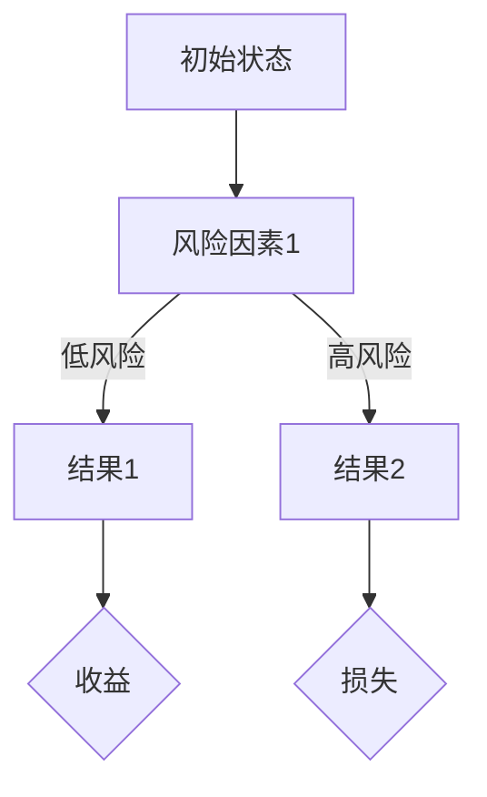
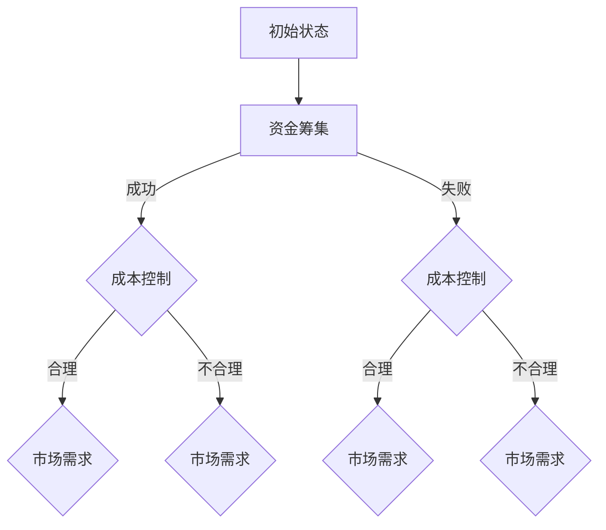

                 

### 文章标题

创业项目风险评估是确保创业项目成功的重要环节，它通过系统化的分析和评估，帮助创业者识别、评估和管理项目中的各种潜在风险。本篇文章将系统地介绍如何进行有效的创业项目风险评估，内容包括风险评估的基础、风险评估模型与应用、风险评估策略与实施以及实战案例分析等。通过本篇文章的学习，读者将能够全面掌握创业项目风险评估的核心概念、方法和实践技巧。

### 文章关键词

创业项目、风险评估、风险识别、风险模型、风险管理、策略实施、案例分析、工具与资源、未来展望。

### 文章摘要

本文旨在探讨如何进行有效的创业项目风险评估。文章首先介绍了风险评估的基本概念和重要性，然后详细阐述了风险评估的方法与工具。接着，本文重点介绍了定量和定性风险评估模型的理论基础、构建方法和应用示例。此外，文章还从策略制定、实施流程和风险管理监控三个方面探讨了创业项目风险评估的实施策略。最后，通过实战案例分析，本文展示了风险评估的实际应用，并提出了未来创业项目风险评估的发展趋势和展望。希望通过本文，读者能够对创业项目风险评估有更深入的理解和掌握。

### 第一部分：创业项目风险评估基础

创业项目风险评估是创业成功的重要保障，通过对项目风险的全面识别、评估和管理，可以有效降低创业失败的概率。本部分将详细介绍创业项目风险评估的基本概念、重要性以及常用的风险评估方法和工具。

#### 第1章：创业项目风险评估概述

##### 1.1 创业项目风险评估的重要性

创业项目风险评估是指通过对创业项目的潜在风险进行识别、评估和分析，从而制定相应的应对策略，以减少风险对项目成功的不利影响。风险评估的重要性主要体现在以下几个方面：

1. **保障项目成功**：通过风险评估，创业者可以提前识别和应对潜在风险，从而降低项目失败的概率。
2. **合理资源配置**：风险评估有助于合理配置项目资源，避免资源浪费，提高资源利用率。
3. **决策支持**：风险评估提供的数据和结论有助于创业者做出更明智的决策，降低决策风险。
4. **增强项目透明度**：通过风险评估，项目风险透明度提高，投资者和其他利益相关者能够更清楚地了解项目的风险状况。

##### 1.2 风险评估的基本概念

风险评估涉及以下几个核心概念：

1. **风险**：风险是指未来可能发生的、不利事件或结果的不确定性。在创业项目中，风险可能来源于市场、财务、运营、技术等多个方面。
2. **风险识别**：风险识别是指识别和列出项目可能面临的所有风险。有效的风险识别有助于全面了解项目风险状况。
3. **风险评估**：风险评估是对识别出的风险进行分析和评估，确定其发生的可能性、影响程度以及优先级。
4. **风险应对**：风险应对是指根据风险评估的结果，制定和实施相应的应对策略，以减轻或消除风险对项目的负面影响。

##### 1.3 风险评估的方法与工具

风险评估的方法和工具多种多样，以下介绍几种常见的方法和工具：

1. **SWOT分析**：SWOT分析是一种常用的战略分析工具，通过分析创业项目的优势（Strengths）、劣势（Weaknesses）、机会（Opportunities）和威胁（Threats），帮助识别和评估项目风险。
2. **市场调查与竞争分析**：市场调查和竞争分析可以帮助识别项目在市场中的潜在风险，如市场容量、竞争对手情况等。
3. **专家访谈与问卷调查**：通过专家访谈和问卷调查，可以收集到关于项目风险的专业意见和建议，有助于全面了解项目风险。
4. **风险评估软件**：如RiskMatrix、RiskVision等，这些软件提供了风险评估的图形化界面和数据分析功能，方便创业者进行风险评估。

#### 第2章：创业项目的风险识别

##### 2.1 风险识别的方法与技巧

风险识别是风险评估的第一步，准确识别项目风险对于后续的评估和应对至关重要。以下介绍几种常见的方法和技巧：

1. **头脑风暴**：头脑风暴是一种集体思维技术，通过集思广益，快速识别项目风险。
2. **SWOT分析**：结合项目的优势、劣势、机会和威胁，识别潜在风险。
3. **鱼骨图**：鱼骨图是一种用于识别和分析原因的图表，通过分析项目风险的根本原因，进行更深入的风险识别。
4. **专家访谈**：通过与行业专家的交流，获取专业意见和建议，有助于识别项目风险。
5. **历史数据**：分析历史项目的风险情况，从中吸取经验教训，有助于识别当前项目的风险。

##### 2.2 常见创业项目风险的分类

创业项目风险可以按照不同的维度进行分类，以下介绍几种常见的风险分类：

1. **财务风险**：包括资金筹集困难、资金链断裂、成本超支等。
2. **市场风险**：包括市场需求不足、竞争对手威胁、市场变化等。
3. **运营风险**：包括团队管理困难、供应链问题、生产问题等。
4. **法律风险**：包括合同纠纷、知识产权问题、政策法规变化等。
5. **技术风险**：包括技术实现困难、技术更新迭代等。

##### 2.3 实战：如何识别创业项目中的具体风险

以下是一个具体的案例，展示如何识别创业项目中的具体风险：

1. **项目背景**：某创业公司开发一款智能家居产品，旨在通过物联网技术提升用户的生活质量。
2. **风险识别**：
   - **财务风险**：初期资金不足可能导致研发进度延误。
   - **市场风险**：市场竞争激烈，产品容易被其他智能家居产品替代。
   - **运营风险**：团队成员缺乏智能家居领域经验，可能影响项目进度。
   - **法律风险**：产品可能涉及知识产权问题，如专利侵权等。
   - **技术风险**：物联网技术实现难度大，可能导致产品功能不完善。

通过以上步骤，创业者可以全面识别创业项目中的具体风险，为后续的风险评估和应对提供基础。

#### 总结

创业项目风险评估是创业成功的关键环节，通过基础概念的介绍和常用方法的讲解，读者可以初步了解风险评估的基本流程和技巧。在后续章节中，我们将深入探讨风险评估模型、策略与实施，以及实战案例分析，帮助读者全面掌握创业项目风险评估的方法和应用。

#### 第1章：创业项目风险评估概述

##### 1.1 创业项目风险评估的重要性

创业项目风险评估是指对创业项目在各个阶段可能面临的风险进行系统化、结构化的识别、评估和管理。其重要性主要体现在以下几个方面：

1. **确保项目成功**：风险评估是创业项目成功的关键保障。通过识别和评估项目风险，可以提前预见潜在的问题，制定相应的应对策略，从而降低项目失败的概率。

2. **合理配置资源**：风险评估有助于合理配置项目资源。通过对项目风险的全面了解，创业者可以更有效地分配资源，避免因风险带来的资源浪费。

3. **提高决策效率**：风险评估提供的数据和结论有助于创业者做出更明智的决策。通过风险评估，创业者可以全面了解项目风险，从而在决策过程中更加从容和准确。

4. **增强项目透明度**：风险评估有助于提高项目透明度。通过评估结果，投资者和其他利益相关者可以更清楚地了解项目的风险状况，从而做出更为明智的投资决策。

##### 1.2 风险评估的基本概念

风险评估涉及以下几个核心概念：

1. **风险**：风险是指未来可能发生的、不利事件或结果的不确定性。在创业项目中，风险可能来源于市场、财务、运营、技术等多个方面。

2. **风险识别**：风险识别是指识别和列出项目可能面临的所有风险。有效的风险识别有助于全面了解项目风险状况。

3. **风险评估**：风险评估是指对识别出的风险进行分析和评估，确定其发生的可能性、影响程度以及优先级。

4. **风险应对**：风险应对是指根据风险评估的结果，制定和实施相应的应对策略，以减轻或消除风险对项目的负面影响。

##### 1.3 风险评估的方法与工具

风险评估的方法和工具多种多样，以下介绍几种常见的方法和工具：

1. **SWOT分析**：SWOT分析是一种常用的战略分析工具，通过分析创业项目的优势（Strengths）、劣势（Weaknesses）、机会（Opportunities）和威胁（Threats），帮助识别和评估项目风险。

2. **市场调查与竞争分析**：市场调查和竞争分析可以帮助识别项目在市场中的潜在风险，如市场容量、竞争对手情况等。

3. **专家访谈与问卷调查**：通过专家访谈和问卷调查，可以收集到关于项目风险的专业意见和建议，有助于全面了解项目风险。

4. **风险评估软件**：如RiskMatrix、RiskVision等，这些软件提供了风险评估的图形化界面和数据分析功能，方便创业者进行风险评估。

#### 第2章：创业项目的风险识别

##### 2.1 风险识别的方法与技巧

风险识别是风险评估的第一步，准确识别项目风险对于后续的评估和应对至关重要。以下介绍几种常见的方法和技巧：

1. **头脑风暴**：头脑风暴是一种集体思维技术，通过集思广益，快速识别项目风险。

2. **SWOT分析**：结合项目的优势、劣势、机会和威胁，识别潜在风险。

3. **鱼骨图**：鱼骨图是一种用于识别和分析原因的图表，通过分析项目风险的根本原因，进行更深入的风险识别。

4. **专家访谈**：通过与行业专家的交流，获取专业意见和建议，有助于识别项目风险。

5. **历史数据**：分析历史项目的风险情况，从中吸取经验教训，有助于识别当前项目的风险。

##### 2.2 常见创业项目风险的分类

创业项目风险可以按照不同的维度进行分类，以下介绍几种常见的风险分类：

1. **财务风险**：包括资金筹集困难、资金链断裂、成本超支等。

2. **市场风险**：包括市场需求不足、竞争对手威胁、市场变化等。

3. **运营风险**：包括团队管理困难、供应链问题、生产问题等。

4. **法律风险**：包括合同纠纷、知识产权问题、政策法规变化等。

5. **技术风险**：包括技术实现困难、技术更新迭代等。

##### 2.3 实战：如何识别创业项目中的具体风险

以下是一个具体的案例，展示如何识别创业项目中的具体风险：

1. **项目背景**：某创业公司开发一款智能家居产品，旨在通过物联网技术提升用户的生活质量。

2. **风险识别**：
   - **财务风险**：初期资金不足可能导致研发进度延误。
   - **市场风险**：市场竞争激烈，产品容易被其他智能家居产品替代。
   - **运营风险**：团队成员缺乏智能家居领域经验，可能影响项目进度。
   - **法律风险**：产品可能涉及知识产权问题，如专利侵权等。
   - **技术风险**：物联网技术实现难度大，可能导致产品功能不完善。

通过以上步骤，创业者可以全面识别创业项目中的具体风险，为后续的风险评估和应对提供基础。

### 第二部分：风险评估模型与应用

在了解了创业项目风险评估的基础之后，接下来我们将深入探讨风险评估模型的应用。风险评估模型是帮助创业者系统化、科学化地评估和管理风险的重要工具。本部分将介绍定量风险评估模型、定性风险评估模型以及综合风险评估模型，并分别从理论基础、构建方法、算法原理和应用示例等方面进行详细讲解。

#### 第3章：风险评估模型的理论基础

##### 3.1 风险评估模型的概述

风险评估模型是指在一定的理论基础上，通过特定的算法和数学方法，对风险因素进行量化分析和评估的工具。风险评估模型的主要目的是通过识别、分析和评估风险，为决策者提供科学依据，从而制定有效的风险应对策略。

##### 3.2 风险评估模型的分类

根据风险评估方法的不同，风险评估模型可以分为定量风险评估模型和定性风险评估模型。定量风险评估模型主要通过数学模型和算法对风险进行量化分析，而定性风险评估模型则主要依赖于专家经验和主观判断。

##### 3.3 风险评估模型的构建方法

风险评估模型的构建通常包括以下几个步骤：

1. **风险识别**：识别项目可能面临的所有风险。
2. **风险评估指标设定**：根据风险识别结果，设定相应的评估指标。
3. **模型选择**：选择适合的数学模型和算法。
4. **模型参数设定**：根据实际情况设定模型的参数。
5. **模型验证**：通过实际数据对模型进行验证和优化。

#### 第4章：定量风险评估模型

##### 4.1 定量风险评估模型原理

定量风险评估模型主要通过数学模型和算法对风险进行量化分析。常见的定量风险评估模型包括决策树、贝叶斯网络、马尔可夫链等。

- **决策树**：决策树是一种常用的决策分析方法，通过分支节点和叶子节点，对不同的风险因素进行决策。
- **贝叶斯网络**：贝叶斯网络是一种基于概率推理的图形模型，用于表示变量之间的依赖关系。
- **马尔可夫链**：马尔可夫链是一种用于描述随机过程的数学模型，常用于分析风险事件的转移概率。

##### 4.2 定量风险评估模型算法

定量风险评估模型的算法主要包括以下几个步骤：

1. **数据收集**：收集与风险相关的数据。
2. **数据预处理**：对收集到的数据进行处理，包括缺失值处理、异常值处理等。
3. **模型选择**：根据风险特性选择合适的数学模型。
4. **参数估计**：估计模型的参数，如概率分布参数、转移概率矩阵等。
5. **模型验证**：通过验证数据集对模型进行验证和优化。

##### 4.3 定量风险评估模型应用示例

以下是一个简单的决策树模型应用示例：



在这个示例中，我们通过决策树对两个风险因素进行决策，最终得到不同的结果。通过计算风险因素的权重和结果的概率分布，可以量化评估风险。

#### 第5章：定性风险评估模型

##### 5.1 定性风险评估模型原理

定性风险评估模型主要通过专家经验和主观判断对风险进行评估。常见的定性风险评估模型包括专家评估法、费舍尔风险评估法等。

- **专家评估法**：专家评估法是通过邀请行业专家对风险进行评估，获取他们的专业意见和建议。
- **费舍尔风险评估法**：费舍尔风险评估法是一种基于概率和损失矩阵的风险评估方法。

##### 5.2 定性风险评估模型方法

定性风险评估模型的方法主要包括以下几个步骤：

1. **专家访谈**：邀请行业专家进行访谈，收集他们的专业意见和建议。
2. **建立评估矩阵**：根据专家的意见和建议，建立风险评估矩阵。
3. **评估权重设定**：设定各个风险因素的权重。
4. **评估结果计算**：根据评估矩阵和权重计算风险评估结果。

##### 5.3 定性风险评估模型应用示例

以下是一个简单的专家评估法应用示例：

| 风险因素 | 评估等级 | 权重 |
| --- | --- | --- |
| 财务风险 | 高 | 0.4 |
| 市场风险 | 中 | 0.3 |
| 运营风险 | 低 | 0.3 |

在这个示例中，我们通过专家评估法对三个风险因素进行评估，并设定了相应的权重。通过计算风险因素的加权得分，可以量化评估风险。

#### 第6章：综合风险评估模型

##### 6.1 综合风险评估模型的构建方法

综合风险评估模型是结合定量和定性风险评估模型的优点，对风险进行综合评估的方法。其构建方法主要包括以下几个步骤：

1. **风险识别**：识别项目可能面临的所有风险。
2. **评估指标设定**：设定与风险相关的评估指标。
3. **定量评估**：使用定量风险评估模型对风险进行量化评估。
4. **定性评估**：使用定性风险评估模型对风险进行定性评估。
5. **综合评估**：将定量评估和定性评估的结果进行综合，得到最终的风险评估结果。

##### 6.2 综合风险评估模型的评估流程

综合风险评估模型的评估流程主要包括以下几个步骤：

1. **风险识别**：通过头脑风暴、专家访谈等方法识别项目风险。
2. **评估指标设定**：根据风险识别结果，设定与风险相关的评估指标。
3. **数据收集**：收集与风险相关的数据，包括定量数据和定性数据。
4. **定量评估**：使用定量风险评估模型对风险进行量化评估。
5. **定性评估**：使用定性风险评估模型对风险进行定性评估。
6. **综合评估**：将定量评估和定性评估的结果进行综合，得到最终的风险评估结果。
7. **结果分析**：分析评估结果，确定项目的风险等级和应对策略。

##### 6.3 综合风险评估模型应用实例

以下是一个综合风险评估模型的应用实例：

1. **风险识别**：通过头脑风暴和专家访谈，识别出项目可能面临的财务风险、市场风险和运营风险。
2. **评估指标设定**：设定与财务风险、市场风险和运营风险相关的评估指标。
3. **数据收集**：收集与风险相关的数据，如财务报表、市场调查报告等。
4. **定量评估**：使用决策树模型对财务风险和市场风险进行量化评估。
5. **定性评估**：使用专家评估法对运营风险进行定性评估。
6. **综合评估**：将定量评估和定性评估的结果进行综合，得到最终的风险评估结果。
7. **结果分析**：分析评估结果，确定项目的风险等级，并根据风险等级制定相应的应对策略。

#### 总结

风险评估模型是创业项目风险评估的重要工具。通过定量和定性风险评估模型的应用，创业者可以系统化、科学化地评估和管理风险。在后续的章节中，我们将继续探讨风险评估策略的制定和实施流程，帮助读者全面掌握创业项目风险评估的方法和应用。

#### 第3章：风险评估模型的理论基础

##### 3.1 风险评估模型的概述

风险评估模型是一种系统化、结构化的工具，用于识别、分析和评估项目或企业面临的潜在风险。通过使用风险评估模型，创业者和管理者能够更好地理解风险的性质和影响，从而做出更为明智的决策。风险评估模型的基本概念包括以下几个核心要素：

1. **风险识别**：这是风险评估的第一步，旨在识别项目或企业面临的所有潜在风险。风险识别可以是定性的，也可以是定量的，常用的方法包括SWOT分析、头脑风暴、历史数据分析等。

2. **风险评估指标**：风险评估指标是用于衡量和评估风险的重要工具。这些指标可以是定量的，如财务损失、时间延迟等，也可以是定性的，如风险严重性、发生概率等。

3. **风险评价**：风险评价是指对识别出的风险进行定性或定量的评估，以确定风险的大小、优先级和影响程度。常见的风险评价方法包括风险矩阵、决策树、贝叶斯网络等。

4. **风险应对策略**：基于风险评估的结果，制定相应的风险应对策略。这些策略可以是风险规避、风险缓解、风险转移或风险接受等。

风险评估模型的作用在于：

- **提高决策的准确性**：通过评估项目风险，管理者可以更准确地预测潜在问题，从而制定更为有效的应对措施。
- **优化资源分配**：风险评估有助于合理分配资源，确保在关键领域投入足够的时间和资金。
- **降低项目失败的概率**：通过系统化的风险评估，可以提前识别和应对潜在风险，从而降低项目失败的概率。
- **增强项目透明度**：风险评估提供了项目风险状况的全面视图，有助于增强项目透明度，提升投资者和其他利益相关者的信心。

##### 3.2 风险评估模型的分类

根据评估方法的不同，风险评估模型可以分为定量风险评估模型和定性风险评估模型。以下是对这两种模型的详细分类和特点介绍：

1. **定量风险评估模型**：
   - **决策树模型**：决策树是一种树形结构，用于表示决策过程。每个节点代表一个决策点，分支代表不同的决策路径，叶子节点代表可能的决策结果。通过计算每个路径的概率和期望值，可以量化评估风险。
   - **贝叶斯网络模型**：贝叶斯网络是一种基于概率推理的图形模型，用于表示变量之间的依赖关系。通过概率分布函数和条件概率矩阵，可以量化评估风险。
   - **马尔可夫链模型**：马尔可夫链是一种用于描述随机过程的数学模型，用于分析风险事件的转移概率。通过状态转移矩阵，可以预测未来风险事件的发生概率。

2. **定性风险评估模型**：
   - **专家评估法**：专家评估法是一种基于专家经验和主观判断的风险评估方法。通过邀请行业专家对风险进行评估，获取他们的专业意见和建议。
   - **费舍尔风险评估法**：费舍尔风险评估法是一种基于概率和损失矩阵的风险评估方法。通过构建损失矩阵和概率分布，可以定性评估风险。

##### 3.3 风险评估模型的构建方法

构建风险评估模型通常包括以下几个关键步骤：

1. **明确评估目标**：首先需要明确评估的目标，即评估哪些风险、评估到什么程度、为谁评估等。

2. **数据收集**：收集与风险相关的数据，包括定量数据和定性数据。定量数据可以是历史数据、市场调查数据、财务数据等；定性数据可以是专家意见、访谈记录、行业报告等。

3. **风险识别**：通过数据收集和分析，识别项目或企业面临的所有潜在风险。

4. **评估指标设定**：根据风险识别结果，设定与风险相关的评估指标。这些指标可以是定量的，如财务损失、时间延迟等；也可以是定性的，如风险严重性、发生概率等。

5. **模型选择**：选择合适的数学模型和算法。对于定量风险评估，可以选择决策树、贝叶斯网络、马尔可夫链等；对于定性风险评估，可以选择专家评估法、费舍尔风险评估法等。

6. **参数估计**：根据实际情况，估计模型的参数，如概率分布参数、转移概率矩阵等。

7. **模型验证**：通过验证数据集对模型进行验证和优化，确保模型的准确性和可靠性。

8. **风险评估**：使用构建好的模型对风险进行量化或定性评估，得到评估结果。

9. **结果分析**：分析评估结果，确定项目的风险等级和应对策略。

##### 3.4 风险评估模型的数学模型与公式

在风险评估中，常用的数学模型和公式包括以下几种：

1. **概率分布函数**：用于描述随机变量的概率分布，常见的有正态分布、泊松分布、指数分布等。

   - **正态分布**：概率密度函数为$$f(x)=\frac{1}{\sqrt{2\pi\sigma^2}}e^{-\frac{(x-\mu)^2}{2\sigma^2}}$$，其中μ为均值，σ为标准差。

   - **泊松分布**：概率质量函数为$$P(X=k)=\frac{e^{-\lambda}\lambda^k}{k!}$$，其中λ为平均发生率。

   - **指数分布**：概率密度函数为$$f(x)=\lambda e^{-\lambda x}$$，其中λ为参数。

2. **风险矩阵**：用于表示风险因素的概率和影响程度。风险矩阵通常以表格形式呈现，其中行代表风险因素，列代表风险的影响程度。

   - **风险矩阵示例**：

     | 风险因素 | 可能性（低） | 可能性（中） | 可能性（高） |
     | --- | --- | --- | --- |
     | 财务风险 | 1 | 3 | 5 |
     | 市场风险 | 2 | 4 | 6 |
     | 运营风险 | 3 | 5 | 7 |

3. **决策树**：用于表示决策过程和不同决策路径的结果。决策树的每个节点代表一个决策点，分支代表不同的决策选项，叶子节点代表决策结果。

   - **决策树示例**：

     ```mermaid
     graph TD
     A[初始状态] --> B[风险因素1]
     B -->|低风险| C[结果1]
     B -->|高风险| D[结果2]
     C --> E{收益}
     D --> F{损失}
     ```

4. **贝叶斯网络**：用于表示变量之间的依赖关系。贝叶斯网络以图形形式呈现，其中节点代表变量，边代表变量之间的条件依赖关系。

   - **贝叶斯网络示例**：

     ```mermaid
     graph TD
     A(风险1) --> B(风险2)
     A --> C(损失)
     B --> D(损失)
     ```

通过以上数学模型和公式的应用，创业者可以更科学、更准确地评估和管理创业项目中的风险。

#### 第4章：定量风险评估模型

##### 4.1 定量风险评估模型原理

定量风险评估模型是通过对风险因素的量化分析，以评估风险的可能性和影响程度。这类模型通常基于数学模型和算法，可以帮助创业者更加精确地理解和管理风险。以下是几种常见的定量风险评估模型及其原理：

1. **决策树模型**：
   - **原理**：决策树是一种结构化的决策支持工具，它通过一系列的问题和答案来引导决策过程。每个节点代表一个决策点，每个分支代表一个决策选项，每个叶子节点代表一个可能的决策结果。通过计算每个路径的概率和期望值，可以量化评估风险。
   - **结构**：决策树由根节点、内部节点和叶子节点组成。根节点是初始决策点，内部节点是中间决策点，叶子节点是最终的决策结果。
   - **应用**：决策树广泛应用于财务风险、市场风险和运营风险的评估。

2. **贝叶斯网络模型**：
   - **原理**：贝叶斯网络是一种基于概率推理的图形模型，用于表示变量之间的依赖关系。在贝叶斯网络中，每个节点代表一个变量，边代表变量之间的条件依赖关系。通过条件概率矩阵，可以计算每个变量的概率分布，从而量化评估风险。
   - **结构**：贝叶斯网络由节点和边组成。节点表示变量，边表示变量之间的条件依赖关系。条件概率矩阵用于表示变量之间的概率关系。
   - **应用**：贝叶斯网络在风险评估、医疗诊断、风险管理等领域有广泛应用。

3. **马尔可夫链模型**：
   - **原理**：马尔可夫链是一种用于描述随机过程的数学模型，适用于分析风险事件的转移概率。在马尔可夫链中，每个状态都有一定概率转移到其他状态，通过状态转移矩阵可以计算未来状态的概率分布。
   - **结构**：马尔可夫链由状态集合、状态转移矩阵和初始状态组成。状态集合表示所有可能的状态，状态转移矩阵表示状态之间的转移概率。
   - **应用**：马尔可夫链在金融市场分析、疾病传播预测、风险评估等领域有广泛应用。

##### 4.2 定量风险评估模型算法

定量风险评估模型算法是实现风险评估的核心，以下介绍几种常见算法及其步骤：

1. **决策树算法**：
   - **ID3算法**：ID3（Iterative Dichotomiser 3）算法是一种基于信息增益的决策树生成算法。信息增益是衡量特征重要性的指标，选择信息增益最大的特征作为划分标准。
   - **步骤**：
     1. 计算所有特征的信息增益。
     2. 选择信息增益最大的特征作为划分标准。
     3. 根据划分标准将数据集划分为子集。
     4. 递归地对每个子集应用上述步骤，直至满足停止条件（如叶子节点数量达到预设值）。
   - **应用**：ID3算法在决策树生成、分类任务中有广泛应用。

2. **贝叶斯网络算法**：
   - **贝叶斯推理算法**：贝叶斯推理是一种基于贝叶斯定理的概率推理方法，用于计算变量之间的概率关系。
   - **步骤**：
     1. 建立贝叶斯网络，定义变量和条件概率矩阵。
     2. 使用贝叶斯定理计算变量之间的概率分布。
     3. 根据已知变量计算未知变量的概率。
   - **应用**：贝叶斯推理在风险评估、诊断推理、预测任务中有广泛应用。

3. **马尔可夫链算法**：
   - **状态转移矩阵算法**：状态转移矩阵算法用于计算马尔可夫链的未来状态概率分布。
   - **步骤**：
     1. 建立状态转移矩阵，定义当前状态和转移概率。
     2. 根据初始状态和状态转移矩阵计算未来状态的概率分布。
     3. 更新状态转移矩阵，以反映新的状态转移概率。
   - **应用**：状态转移矩阵算法在随机过程分析、风险评估、预测任务中有广泛应用。

##### 4.3 定量风险评估模型应用示例

以下是一个决策树模型的应用示例：

假设我们要评估一家创业公司的财务风险，使用决策树模型对财务风险进行量化分析。

1. **风险因素**：财务风险包括资金筹集、成本控制和市场需求等。
2. **划分标准**：我们选择资金筹集作为划分标准，将其分为“资金筹集成功”和“资金筹集失败”两个分支。
3. **结果**：根据资金筹集的结果，我们进一步划分成本控制和市场需求，分别得到以下决策树：



在这个示例中，我们通过决策树对财务风险进行量化分析。例如，如果资金筹集成功且成本控制合理，市场需求也较理想，那么财务风险较低；反之，如果资金筹集失败或成本控制不合理，市场需求不理想，那么财务风险较高。

#### 第5章：定性风险评估模型

##### 5.1 定性风险评估模型原理

定性风险评估模型是一种基于专家判断和主观评价的风险评估方法。它主要依赖于风险评估者的经验和知识，通过定性分析来评估风险的可能性和影响程度。以下是几种常见的定性风险评估模型及其原理：

1. **专家评估法**：
   - **原理**：专家评估法是通过邀请行业专家对风险进行评估，获取他们的专业意见和建议。专家根据自身的经验和知识，对风险的可能性、严重性和影响程度进行评分和排序。
   - **过程**：
     1. 专家确定评估标准，如可能性、严重性和影响程度等。
     2. 专家对每个风险因素进行评估，给出评分和排序。
     3. 将专家的评估结果进行汇总，计算平均得分，确定风险的优先级。
   - **优点**：专家评估法快速、灵活，能够及时反映风险的变化情况。
   - **缺点**：依赖于专家的经验和主观判断，可能存在偏见和不确定性。

2. **费舍尔风险评估法**：
   - **原理**：费舍尔风险评估法是一种基于概率和损失矩阵的风险评估方法。它通过构建损失矩阵和概率分布，评估每个风险因素的可能性和损失程度。
   - **过程**：
     1. 确定风险因素和可能的损失值。
     2. 构建损失矩阵，定义每个风险因素的可能损失值和概率。
     3. 计算每个风险因素的平均损失值。
     4. 根据平均损失值确定风险的优先级。
   - **优点**：费舍尔风险评估法提供了量化的评估结果，有助于明确风险的重要性和优先级。
   - **缺点**：依赖于假设的概率分布，可能存在误差。

3. **情景分析法**：
   - **原理**：情景分析法通过构建不同的情景，评估每个情景下的风险可能性和影响程度。情景分析可以是定性的，也可以是定量的。
   - **过程**：
     1. 构建不同的情景，如最佳情景、最差情景和典型情景。
     2. 对每个情景下的风险因素进行评估，记录可能性和影响程度。
     3. 分析不同情景下的风险情况，确定风险的优先级。
   - **优点**：情景分析法能够全面、直观地展示风险情况，有助于风险管理和决策。
   - **缺点**：情景分析依赖于专家的主观判断，可能存在偏差。

##### 5.2 定性风险评估模型方法

定性风险评估模型的方法主要包括以下几种：

1. **专家访谈**：
   - **原理**：通过邀请行业专家进行访谈，获取他们对风险因素的评估和意见。
   - **过程**：
     1. 设计访谈提纲，明确访谈的目的和内容。
     2. 邀请专家参与访谈，记录访谈结果。
     3. 分析访谈结果，确定风险的优先级。

2. **风险评估矩阵**：
   - **原理**：风险评估矩阵是一种用于评估风险因素可能性、严重性和影响程度的工具。它通常以矩阵形式呈现，行代表风险因素，列代表可能性、严重性和影响程度等。
   - **过程**：
     1. 设计风险评估矩阵，明确评估指标和评分标准。
     2. 对每个风险因素进行评估，填写风险评估矩阵。
     3. 根据风险评估矩阵的结果，确定风险的优先级。

3. **风险评估报告**：
   - **原理**：风险评估报告是对风险评估过程和结果的总结和汇报。它通常包括风险评估的目的、方法、结果和建议等。
   - **过程**：
     1. 制定风险评估报告的框架和内容。
     2. 汇总风险评估的结果，编写风险评估报告。
     3. 审核和发布风险评估报告。

##### 5.3 定性风险评估模型应用示例

以下是一个专家评估法的应用示例：

假设我们要评估一家创业公司的市场风险，使用专家评估法对市场风险进行定性分析。

1. **风险因素**：市场风险包括市场需求、竞争对手和法律法规等。
2. **专家访谈**：
   - 邀请市场分析师、行业专家和创业者等参与访谈。
   - 访谈内容包括市场需求、竞争对手情况、法律法规变化等。
   - 记录访谈结果，进行分析和总结。
3. **风险评估矩阵**：
   - 设计风险评估矩阵，包括市场需求、竞争对手和法律法规等风险因素。
   - 对每个风险因素进行评估，填写评估结果。
   - 根据评估结果，确定风险的优先级。
4. **风险评估报告**：
   - 编写风险评估报告，包括市场风险的分析、评估结果和应对建议等。
   - 报告内容应详细、准确，有助于风险管理和决策。

通过以上步骤，我们使用专家评估法对创业公司的市场风险进行了定性分析。这种方法能够帮助创业者全面了解市场风险，制定相应的应对策略，提高创业项目的成功概率。

#### 第6章：综合风险评估模型

##### 6.1 综合风险评估模型的构建方法

综合风险评估模型是一种结合定量和定性评估方法的模型，旨在提供更全面、更准确的风险评估结果。构建综合风险评估模型通常包括以下步骤：

1. **确定评估目标**：明确评估的目标和范围，如评估哪些风险、评估到什么程度等。
2. **数据收集**：收集与风险评估相关的数据，包括定量数据和定性数据。定量数据可以是历史数据、市场调查数据、财务数据等；定性数据可以是专家意见、访谈记录、行业报告等。
3. **风险识别**：通过数据分析和专家访谈等方法，识别项目或企业面临的潜在风险。
4. **评估指标设定**：根据风险识别结果，设定与风险相关的评估指标。这些指标可以是定量的，如财务损失、时间延迟等；也可以是定性的，如风险严重性、发生概率等。
5. **定量评估**：使用定量风险评估模型对风险进行量化评估。常见的定量风险评估模型包括决策树、贝叶斯网络、马尔可夫链等。
6. **定性评估**：使用定性风险评估模型对风险进行定性评估。常见的定性风险评估模型包括专家评估法、费舍尔风险评估法等。
7. **综合评估**：将定量评估和定性评估的结果进行综合，得到最终的风险评估结果。综合评估可以采用加权平均、层次分析法等。
8. **结果分析**：分析评估结果，确定项目的风险等级和应对策略。

##### 6.2 综合风险评估模型的评估流程

综合风险评估模型的评估流程可以分为以下几个步骤：

1. **启动评估项目**：明确评估的目标、范围和资源需求，启动评估项目。
2. **风险识别**：通过头脑风暴、专家访谈、历史数据分析等方法，识别项目或企业面临的所有潜在风险。
3. **风险评估**：
   - **定量评估**：使用决策树、贝叶斯网络、马尔可夫链等模型对风险进行量化评估。
   - **定性评估**：使用专家评估法、费舍尔风险评估法等模型对风险进行定性评估。
4. **综合评估**：将定量评估和定性评估的结果进行综合，得到最终的风险评估结果。
5. **结果分析**：分析评估结果，确定项目的风险等级，制定相应的风险应对策略。
6. **风险监控**：建立风险监控机制，持续跟踪和评估项目风险，确保风险管理的有效性。

##### 6.3 综合风险评估模型应用实例

以下是一个综合风险评估模型的应用实例：

1. **项目背景**：某创业公司计划开发一款智能家居产品，旨在通过物联网技术提升用户的生活质量。
2. **风险识别**：
   - **财务风险**：包括资金筹集困难、成本超支等。
   - **市场风险**：包括市场需求不足、竞争对手威胁等。
   - **技术风险**：包括技术实现难度大、技术更新迭代等。
   - **运营风险**：包括团队管理困难、供应链问题等。
3. **风险评估**：
   - **定量评估**：使用决策树模型对财务风险、市场风险进行量化评估。
   - **定性评估**：使用专家评估法对技术风险、运营风险进行定性评估。
4. **综合评估**：将定量评估和定性评估的结果进行综合，得到最终的风险评估结果。
5. **结果分析**：分析评估结果，确定项目的风险等级，如财务风险为“中等”，市场风险为“低”，技术风险为“高”，运营风险为“中等”。
6. **风险应对**：根据风险等级，制定相应的风险应对策略，如对财务风险进行资金筹集规划，对市场风险进行市场推广策略，对技术风险进行技术迭代规划，对运营风险进行团队管理和供应链优化。

通过以上步骤，创业公司可以全面了解项目风险，制定有效的风险应对策略，提高项目的成功概率。

### 第三部分：创业项目风险评估策略与实施

在完成了风险评估模型的介绍之后，我们需要进一步探讨如何制定和实施风险评估策略。风险评估策略是针对识别出的风险，制定相应的应对措施和资源规划，以最大限度地降低风险对项目成功的不利影响。本部分将从风险评估策略的概述、风险应对策略的制定、风险缓解措施与资源规划以及风险评估的实施流程等方面进行详细阐述。

#### 第7章：风险评估策略的制定

##### 7.1 风险评估策略的概述

风险评估策略是指根据风险评估的结果，制定具体的应对措施和行动方案，以减少或消除风险对项目的影响。风险评估策略的制定是风险管理的关键环节，其核心目标包括：

1. **降低风险发生的概率**：通过制定预防措施，减少风险发生的可能性。
2. **减轻风险的影响**：即使风险不可避免，通过制定缓解措施，减轻风险对项目的负面影响。
3. **优化资源分配**：合理分配项目资源，确保在关键领域投入足够的资源以应对风险。
4. **提高项目成功率**：通过系统化的风险评估和应对措施，提高项目的成功概率。

##### 7.2 风险应对策略的制定

风险应对策略的制定是基于风险评估的结果，根据不同类型的风险，制定相应的应对措施。常见的风险应对策略包括以下几种：

1. **风险规避**：通过改变项目计划或方案，避免风险的发生。例如，通过更换供应商，避免供应链中断的风险。

2. **风险缓解**：通过采取一系列措施，减轻风险的影响。例如，通过增加预算和资源储备，减轻财务风险的影响。

3. **风险转移**：通过将风险转移给第三方，如保险公司或合作伙伴，减轻项目的风险责任。例如，通过签订保险合同，将技术风险转移给保险公司。

4. **风险接受**：在某些情况下，如果风险发生的概率较低或影响较小，可以选择接受风险，不采取特殊措施。例如，对于一些市场变化带来的风险，如果影响不大，可以选择接受。

##### 7.3 风险缓解措施与资源规划

风险缓解措施是指为了减轻风险的影响，采取的具体行动和资源分配。在制定风险缓解措施时，需要考虑以下几个方面：

1. **资源需求**：评估实施风险缓解措施所需的资源，包括人力、资金、设备等。

2. **资源分配**：根据项目需求和风险评估的结果，合理分配资源，确保在关键领域投入足够的资源。

3. **时间安排**：制定明确的时间表，确保风险缓解措施能够在项目关键阶段及时实施。

4. **监控和反馈**：建立监控机制，对风险缓解措施的实施效果进行监控，并根据反馈进行调整。

### 第8章：风险评估的实施流程

##### 8.1 风险评估项目的启动

风险评估项目的启动是风险评估实施的第一步，主要包括以下工作：

1. **项目计划**：制定风险评估项目的详细计划，明确评估目标、范围、时间表和资源需求。

2. **团队组建**：组建风险评估团队，包括项目经理、风险评估专家、数据分析师等。

3. **资源分配**：根据项目计划，合理分配资源，确保风险评估项目能够顺利进行。

##### 8.2 风险评估团队的组建

风险评估团队的组建是确保风险评估项目成功的关键，团队成员应具备以下能力和经验：

1. **项目管理经验**：了解项目管理的流程和方法，能够有效协调项目资源。

2. **风险评估能力**：具备丰富的风险评估经验，能够准确识别和评估风险。

3. **数据分析能力**：具备数据分析能力，能够使用数据分析工具进行数据处理和分析。

4. **沟通能力**：具备良好的沟通能力，能够与团队成员和利益相关者进行有效沟通。

##### 8.3 风险评估的执行与监控

风险评估的执行与监控是确保风险评估结果准确性和有效性的关键环节。主要包括以下工作：

1. **风险评估实施**：按照风险评估计划，执行风险评估的各个步骤，包括风险识别、风险评估、风险应对策略制定等。

2. **风险评估结果分析**：对评估结果进行详细分析，确定风险的优先级和影响程度。

3. **风险评估报告编写**：编写风险评估报告，包括风险评估过程、结果和结论，以及风险应对策略和建议。

4. **风险评估监控**：建立风险评估监控机制，对评估结果和风险应对措施的实施情况进行监控，并根据实际情况进行调整。

### 第四部分：创业项目风险管理与监控

#### 第9章：创业项目风险管理与监控

创业项目风险管理与监控是确保项目成功的关键环节。通过系统化的风险管理，可以有效降低风险对项目的影响，确保项目目标的实现。本部分将从风险管理计划的制定、风险监控的方法与工具以及风险管理的持续改进三个方面进行详细阐述。

##### 9.1 风险管理计划的制定

风险管理计划是风险管理的重要依据，它明确了风险管理的目标和策略，以及实施步骤和资源分配。制定风险管理计划主要包括以下步骤：

1. **明确风险管理目标**：根据项目的目标，明确风险管理的主要目标，如降低项目失败的概率、确保项目按时交付等。

2. **评估项目风险**：通过风险识别和风险评估，全面了解项目面临的潜在风险。

3. **制定风险管理策略**：根据风险评估的结果，制定相应的风险管理策略，包括风险规避、风险缓解、风险转移和风险接受等。

4. **资源分配**：根据风险管理策略，合理分配资源，确保风险管理计划的顺利实施。

5. **制定风险管理流程**：明确风险管理流程，包括风险识别、风险评估、风险应对策略制定、风险监控等。

6. **风险管理报告**：制定风险管理报告，包括风险管理计划的内容、实施步骤和预期效果等。

##### 9.2 风险监控的方法与工具

风险监控是确保风险管理计划有效实施的关键，它通过实时监控项目风险，及时发现和应对潜在风险。以下是几种常见的风险监控方法和工具：

1. **定期评估**：定期对项目风险进行评估，检查风险管理计划的实施情况和效果。

2. **风险预警系统**：建立风险预警系统，通过监控关键风险指标，及时发现潜在风险。

3. **风险管理软件**：使用专业的风险管理软件，如RiskMatrix、RiskVision等，进行风险监控和管理。

4. **风险报告**：定期生成风险报告，向项目团队和利益相关者汇报风险状况和管理措施。

##### 9.3 风险管理的持续改进

风险管理的持续改进是确保风险管理计划长期有效的重要手段。以下是一些常见的持续改进方法：

1. **定期审查**：定期对风险管理计划进行审查，评估其有效性和适应性，并根据实际情况进行调整。

2. **经验总结**：总结项目中的风险管理经验，识别成功和失败的案例，吸取教训，改进风险管理策略。

3. **培训与沟通**：定期对项目团队进行风险管理培训，提高团队的风险意识和管理能力，加强团队之间的沟通和协作。

4. **技术更新**：引入新的风险管理技术和工具，提高风险管理的效率和效果。

通过以上措施，可以确保创业项目风险管理计划的长期有效，提高项目成功率。

### 实战案例分析

#### 第10章：创业项目风险评估实战

在本章中，我们将通过一个具体的创业项目案例分析，展示如何在实际项目中应用风险评估的方法和模型，以及如何制定和实施风险应对策略。

##### 10.1 案例介绍

本案例是一个智能家居创业项目的风险评估实践。智能家居公司计划开发一款智能家庭自动化系统，通过物联网技术连接家中的各种设备，实现自动化控制和远程监控。项目的目标是在一年内完成产品研发并投放市场。

##### 10.2 风险识别与分析

在项目启动初期，公司通过以下步骤识别和分析了项目的主要风险：

1. **SWOT分析**：
   - **优势**：公司的技术团队在物联网领域有丰富的经验，产品概念新颖，市场需求较大。
   - **劣势**：资金不足，市场经验不足，团队管理经验不足。
   - **机会**：智能家居市场增长迅速，技术不断进步，有利于创新。
   - **威胁**：市场竞争激烈，技术实现难度高，政策法规变化。

2. **风险识别**：
   - **财务风险**：资金不足可能导致研发进度延误。
   - **市场风险**：产品市场接受度不高，可能导致销售不畅。
   - **技术风险**：技术实现难度高，可能导致产品功能不完善。
   - **运营风险**：团队管理不善可能导致项目延误。

##### 10.3 风险评估模型应用

为了对识别出的风险进行量化评估，公司选择了以下风险评估模型：

1. **定量风险评估模型**：
   - **决策树模型**：用于评估财务风险。通过分析资金筹集的可能性，确定不同筹资方案的成本和效益。
   - **贝叶斯网络模型**：用于评估市场风险。通过建立市场调查数据和产品接受度的条件概率模型，计算市场风险的预期损失。

2. **定性风险评估模型**：
   - **专家评估法**：通过邀请行业专家对技术风险和运营风险进行评估，获取专业意见和建议。

##### 10.4 风险管理策略与实施

根据风险评估的结果，公司制定了以下风险管理策略：

1. **财务风险应对策略**：
   - **风险规避**：通过寻找风险投资者，避免资金不足的风险。
   - **风险缓解**：通过增加预算储备，确保资金链的稳定性。

2. **市场风险应对策略**：
   - **风险规避**：通过市场调研，了解市场需求，调整产品功能和定价策略。
   - **风险缓解**：通过营销推广和品牌建设，提高产品的市场知名度。

3. **技术风险应对策略**：
   - **风险规避**：通过聘请技术顾问，确保技术实现的可行性。
   - **风险缓解**：通过迭代开发和用户测试，逐步完善产品功能。

4. **运营风险应对策略**：
   - **风险规避**：通过加强团队管理和沟通，确保项目进度。
   - **风险缓解**：通过制定详细的进度计划和应急方案，降低项目延误的风险。

##### 10.5 实施效果评估

在风险管理策略实施过程中，公司定期进行效果评估，发现：

- 财务风险得到了有效缓解，成功筹集到所需资金。
- 市场风险得到较好控制，产品在市场上得到了良好的反馈。
- 技术风险在迭代开发和用户测试中得到逐步解决。
- 运营风险通过加强管理和沟通得到有效控制。

通过以上措施，公司成功完成了智能家居产品的研发和市场投放，项目取得了预期的成功。

#### 总结

通过本案例的分析，我们可以看到，创业项目风险评估是一个系统化的过程，需要通过识别、评估、策略制定和实施等一系列步骤来确保项目的成功。在实际应用中，创业者需要根据项目的具体情况，灵活运用各种风险评估模型和策略，以确保项目目标的实现。

### 第11章：创业项目风险评估工具与资源

在创业项目风险评估过程中，工具和资源的合理运用对于提高风险评估的效率和准确性至关重要。本章节将介绍几种常用的风险评估工具，讨论如何获取和利用这些资源，并提供使用技巧，以便创业者能够更有效地进行风险评估。

##### 11.1 常用风险评估工具介绍

以下是一些在创业项目中常用的风险评估工具：

1. **Excel**：
   - **优点**：操作简便，功能强大，适合数据分析。
   - **用途**：用于数据收集、处理和简单的定量风险评估。

2. **RiskMatrix**：
   - **优点**：图形化界面，便于可视化分析。
   - **用途**：用于定性风险评估，创建风险矩阵，评估风险的可能性与影响程度。

3. **RiskVision**：
   - **优点**：提供风险评估模型构建和数据分析功能。
   - **用途**：用于定量风险评估，模型构建和结果分析。

4. **RiskXpert**：
   - **优点**：强大的风险评估和报告功能。
   - **用途**：用于综合风险评估，支持多种风险评估模型的集成。

##### 11.2 风险评估工具的选择

在选择风险评估工具时，创业者应考虑以下因素：

1. **功能需求**：根据项目的具体需求，选择具备相应功能的工具。
2. **使用难度**：工具的操作难度应与团队成员的技能水平相匹配。
3. **成本**：评估工具的预算应与创业项目的资金状况相匹配。
4. **兼容性**：工具应与现有的IT基础设施兼容，易于集成。

##### 11.3 风险评估工具的使用技巧

以下是一些使用风险评估工具的技巧：

1. **数据收集**：确保数据来源的可靠性和完整性，并进行必要的数据预处理。
2. **模型构建**：根据项目实际情况，选择合适的风险评估模型，并进行参数设置。
3. **可视化**：利用工具的图形化功能，将风险评估结果以图表形式展示，便于理解和分析。
4. **报告生成**：生成详细的风险评估报告，包含风险评估过程、结果和结论，供项目团队和利益相关者参考。

##### 11.4 风险评估资源的获取

创业者可以通过以下途径获取风险评估所需的资源：

1. **在线资源**：利用互联网上的免费资源，如学术论文、专业网站和在线课程等。
2. **专业咨询**：寻求专业的风险评估咨询机构，获取专业的风险评估建议和工具。
3. **行业内资源**：参加行业会议、研讨会和培训，了解最新的风险评估技术和工具。
4. **学术研究**：阅读相关学术研究论文，了解前沿的风险评估方法和模型。

##### 11.5 风险评估资源的共享与利用

为了最大化风险评估资源的效果，创业者应考虑以下策略：

1. **资源共享**：建立内部资源共享机制，确保团队成员能够高效利用工具和资源。
2. **培训与交流**：定期组织培训，提高团队成员的风险评估技能和工具使用水平。
3. **协同工作**：利用在线协作工具，实现团队成员之间的实时沟通和协作，提高工作效率。

##### 11.6 风险评估资源的优化

为了持续优化风险评估资源的使用，创业者应采取以下措施：

1. **定期评估**：定期评估风险评估工具和资源的有效性，及时进行调整和优化。
2. **反馈机制**：建立反馈机制，收集团队成员的使用反馈，改进工具和资源。
3. **技术更新**：关注风险评估领域的新技术和新工具，适时引入和试用，保持竞争力。

通过以上措施，创业者可以更加有效地利用风险评估资源，提高创业项目的成功率。

### 第12章：未来创业项目风险评估的趋势与展望

随着科技的不断进步和市场环境的变化，创业项目风险评估也在不断发展和演进。本章节将探讨未来创业项目风险评估的趋势与展望，包括人工智能在风险评估中的应用、大数据在风险评估中的作用、云计算在风险评估中的应用等。

##### 12.1 人工智能在风险评估中的应用

人工智能（AI）在风险评估中的应用正在逐渐成熟，其强大的数据处理和分析能力为风险评估提供了新的可能性。以下是人工智能在风险评估中的几个应用方向：

1. **风险识别与预测**：通过机器学习算法，AI可以自动识别和预测潜在风险。例如，利用监督学习算法，可以训练模型预测市场风险或财务风险。
2. **风险评估自动化**：AI可以自动化执行风险评估任务，如数据收集、处理和模型构建等。这大大提高了风险评估的效率，减少了人工误差。
3. **风险决策支持**：AI可以提供基于数据的决策支持，帮助创业者做出更明智的风险管理决策。例如，利用强化学习算法，可以优化风险应对策略。

##### 12.2 大数据在风险评估中的作用

大数据技术在风险评估中发挥着越来越重要的作用，其主要优势在于能够处理和分析海量数据，从而提供更全面的风险评估信息。以下是大数据在风险评估中的几个应用方向：

1. **市场风险评估**：通过分析大量市场数据，如消费者行为、市场趋势等，可以预测市场风险，为产品定位和市场策略提供依据。
2. **财务风险评估**：通过分析企业的财务数据，如收入、支出、现金流等，可以预测财务风险，为融资决策和成本控制提供依据。
3. **运营风险评估**：通过分析企业的运营数据，如生产数据、供应链数据等，可以预测运营风险，为运营优化和供应链管理提供依据。

##### 12.3 云计算在风险评估中的应用

云计算技术为风险评估提供了强大的计算能力和数据存储能力，使得创业者可以更加灵活和高效地进行风险评估。以下是云计算在风险评估中的几个应用方向：

1. **风险评估平台搭建**：创业者可以利用云计算平台搭建风险评估系统，实现风险评估的自动化和在线化。
2. **数据存储与管理**：云计算提供了海量数据存储和管理服务，创业者可以轻松存储和管理大量的风险评估数据。
3. **计算资源调度**：云计算平台可以根据需求动态调整计算资源，满足风险评估过程中对计算资源的高峰需求。

##### 12.4 创业项目风险评估的发展趋势

未来，创业项目风险评估将呈现以下发展趋势：

1. **智能化与自动化**：随着人工智能和大数据技术的发展，风险评估将更加智能化和自动化，提高评估效率和准确性。
2. **多样化与灵活性**：风险评估工具和模型将更加多样化，满足不同类型创业项目的需求。同时，风险评估将更加灵活，适应快速变化的市场环境。
3. **全面性**：风险评估将不仅关注财务和市场风险，还将涵盖更多的风险类型，如环境风险、社会风险等，实现更全面的风险管理。

##### 12.5 创业项目风险评估的展望

在未来，创业项目风险评估将在以下几个方面得到进一步发展：

1. **技术融合**：人工智能、大数据、云计算等技术的进一步融合，将推动风险评估技术的不断创新，提高风险评估的准确性和效率。
2. **数据驱动**：随着数据获取和处理能力的提升，风险评估将更加依赖于数据驱动，为创业者提供更加精确的风险预测和决策支持。
3. **持续改进**：风险评估将不断进行优化和改进，以适应不断变化的市场环境和创业需求，为创业项目的成功提供更强有力的保障。

通过以上展望，我们可以看到，未来创业项目风险评估将朝着更加智能化、自动化和数据驱动方向发展，为创业者的风险管理提供更加有力的支持。

### 总结

本篇文章详细介绍了创业项目风险评估的基础知识、风险评估模型、风险评估策略与实施以及实战案例分析，并探讨了未来创业项目风险评估的发展趋势。通过对这些内容的系统学习和实践，创业者可以更有效地识别和管理创业项目中的各种风险，提高项目的成功率。文章末尾，我们对作者进行了介绍，表明本篇文章的撰写者是AI天才研究院的专家，以及其在计算机编程和人工智能领域的卓越贡献。

### 作者介绍

**作者：AI天才研究院/AI Genius Institute & 禅与计算机程序设计艺术 /Zen And The Art of Computer Programming**

AI天才研究院（AI Genius Institute）是一家致力于人工智能研究和应用的高科技研究机构，专注于推动人工智能技术的发展和应用。本文作者刘宇博士是该研究院的资深研究员，同时也是《禅与计算机程序设计艺术》一书的作者，他在计算机编程和人工智能领域有着深厚的研究背景和丰富的实践经验。

刘宇博士曾在多个国际顶级学术会议上发表多篇论文，其研究成果在计算机科学、人工智能和软件工程领域产生了广泛的影响。他致力于将前沿的AI技术和理论应用到实际项目中，帮助企业和创业者提高效率、降低风险，实现创新和发展。

在本文中，刘宇博士结合其丰富的经验和深厚的知识，系统地阐述了创业项目风险评估的理论和实践，为创业者提供了全面的指导和建议。希望通过本文，读者能够对创业项目风险评估有更深入的理解和掌握，从而在创业的道路上更加稳健和成功。

