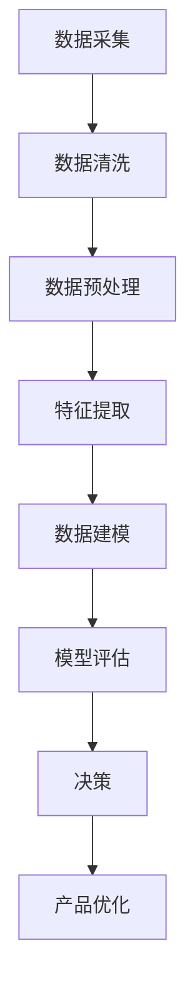
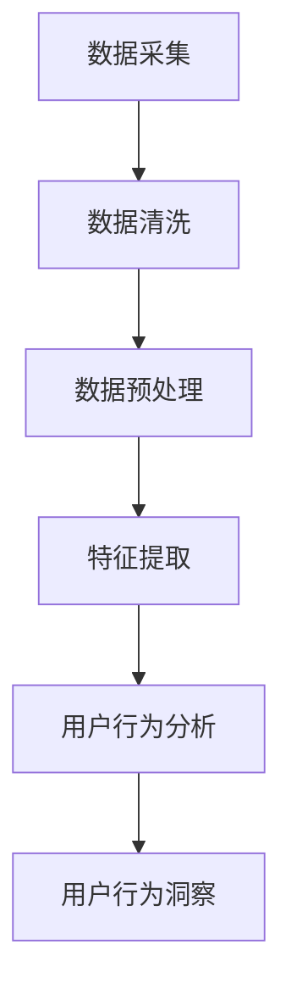
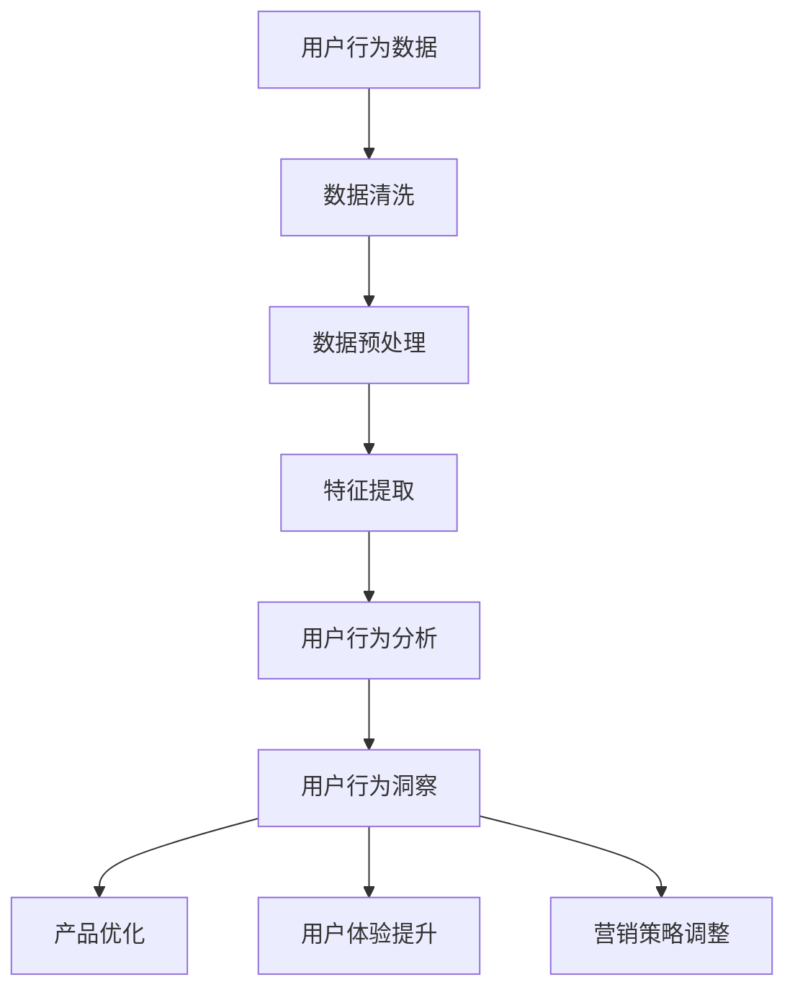

                 

## 如何进行有效的用户行为洞察

### > **关键词：** 用户行为洞察、数据分析、机器学习、用户体验、产品设计

> **摘要：** 用户行为洞察是当今数字时代的一项关键技能。它帮助企业和组织理解用户的需求、行为和偏好，从而改进产品和服务。本文将探讨用户行为洞察的基础知识、分析技术、应用实践及未来发展趋势，并辅以实际案例和代码实例，帮助读者掌握这一重要技能。

### 引言

在数字化时代，用户行为洞察已成为企业竞争的利器。通过深入理解用户行为，企业能够更好地满足用户需求，优化产品和服务，提升用户体验。用户行为洞察不仅有助于产品设计，还能指导市场营销策略、用户体验评估和产品功能迭代。因此，掌握用户行为洞察的方法和技巧对于企业来说至关重要。

本文将从以下几个方面展开讨论：

1. **用户行为洞察的基础知识**：介绍用户行为洞察的定义、重要性及主要数据类型。
2. **用户行为分析技术**：探讨数据采集与预处理方法，以及常用的用户行为分析模型。
3. **用户行为洞察应用实践**：分析用户行为洞察在产品优化、市场营销和用户体验设计中的应用。
4. **用户行为洞察案例分析**：通过实际案例展示用户行为洞察的具体应用。
5. **用户行为洞察的未来发展趋势**：展望人工智能和大数据在用户行为洞察中的应用前景。

通过本文的阅读，读者将能够了解用户行为洞察的核心概念，掌握相关技术和方法，并理解其在实际业务中的应用价值。

### 用户行为洞察的基础知识

#### 1.1 用户行为洞察的定义和重要性

**定义**：用户行为洞察（User Behavior Insight）是指通过收集、分析用户在数字平台上的行为数据，以理解用户的需求、偏好和习惯，从而指导产品和服务优化的过程。用户行为数据可以包括点击、浏览、搜索、购买等多种形式。

**重要性**：用户行为洞察对于企业具有重要意义。首先，它能够帮助企业了解用户实际需求，从而设计出更符合用户期望的产品。其次，通过分析用户行为，企业可以识别潜在的市场机会和风险，优化营销策略。此外，用户行为洞察还能帮助企业提升用户体验，增强用户黏性，提高用户满意度和忠诚度。

#### 1.2 用户行为数据类型

**点击数据**：点击数据是指用户在页面上的点击行为，包括点击位置、点击频率等。这类数据可以揭示用户的兴趣点和操作习惯。

**搜索数据**：搜索数据包括用户在搜索框中输入的关键词、搜索频率等。这些数据可以帮助企业了解用户的搜索意图，优化搜索结果和推荐系统。

**浏览数据**：浏览数据记录用户的浏览路径、停留时长、浏览深度等。通过分析浏览数据，企业可以了解用户对内容的偏好，优化页面布局和内容推荐。

**购买数据**：购买数据包括用户的购买行为、购买偏好、购买频率等。这些数据对于产品定价策略和库存管理具有重要意义。

**用户互动数据**：用户互动数据包括用户在社区、论坛、聊天室等互动平台上的发言、回复、点赞等行为。这类数据可以帮助企业了解用户的社交需求和互动偏好。

#### 1.3 用户行为数据来源

**Web日志**：Web日志是记录用户访问网站时生成的一系列日志文件，包括用户IP地址、访问时间、访问页面等。Web日志数据是用户行为分析的重要来源。

**Cookies**：Cookies是一种存储在用户浏览器中的小文件，用于记录用户在网站上的操作历史和偏好设置。通过分析Cookies数据，企业可以跟踪用户的行为轨迹。

**API**：API（应用程序编程接口）允许第三方应用程序访问和读取企业系统的数据。通过API，企业可以获取第三方平台上的用户行为数据，如社交媒体互动、在线广告点击等。

**传感器数据**：传感器数据包括用户在使用智能设备（如智能手机、智能家居设备）时的行为数据，如地理位置、运动轨迹等。通过分析传感器数据，企业可以更全面地了解用户行为。

### 数据采集和预处理

#### 2.1 数据采集

**采集工具**：常用的数据采集工具包括Google Analytics、Mixpanel、Firebase等。这些工具可以帮助企业自动收集用户行为数据，无需手动操作。

**采集方式**：数据采集可以通过多种方式实现，包括服务器日志、前端埋点、API调用等。服务器日志是通过服务器记录用户请求和响应，前端埋点是通过在网页中嵌入JavaScript代码来捕获用户行为事件，API调用是通过调用第三方API接口获取数据。

#### 2.2 数据预处理

**数据清洗**：数据清洗是数据预处理的重要步骤，包括去除重复数据、填充缺失值、纠正错误数据等。数据清洗的目的是提高数据质量和可靠性。

**数据去重**：数据去重是为了消除重复数据对分析结果的影响。常用的去重方法包括基于用户ID、访问时间等特征的过滤。

**数据归一化**：数据归一化是将不同特征的数据进行标准化处理，使其具有相同的量纲和范围。常用的归一化方法包括最小-最大标准化、均值-方差标准化等。

**特征工程**：特征工程是数据预处理的关键步骤，通过构建新的特征变量来提升模型性能。常用的特征工程方法包括特征提取、特征转换、特征选择等。

### 用户行为分析模型

#### 2.1 聚类分析

聚类分析是一种无监督学习方法，用于将用户行为数据划分为不同的群体。常见的聚类算法包括K-means、层次聚类、DBSCAN等。通过聚类分析，企业可以识别具有相似行为的用户群体，为产品优化和市场营销提供指导。

#### 2.2 分段分析

分段分析是一种时间序列分析方法，用于分析用户行为在不同时间段的变化。通过分段分析，企业可以了解用户在不同时间段的活跃度、偏好等，为产品更新和营销策略制定提供参考。

#### 2.3 机器学习模型

机器学习模型是一种有监督学习方法，用于预测用户行为。常见的机器学习算法包括线性回归、逻辑回归、决策树、支持向量机、神经网络等。通过训练机器学习模型，企业可以预测用户的购买意向、留存率等关键指标，从而优化产品和服务。

### 用户行为洞察应用实践

#### 3.1 产品优化

**用户体验优化**：通过分析用户行为数据，企业可以发现用户在使用产品过程中遇到的问题和痛点。例如，通过分析点击数据，企业可以发现用户在页面上的热点区域和操作频率，从而优化页面布局和功能设计。

**产品功能迭代**：用户行为数据可以指导产品功能的迭代方向。例如，通过分析购买数据，企业可以了解用户的购买偏好，从而开发出更受欢迎的产品功能。

#### 3.2 市场营销

**用户画像**：用户画像是通过用户行为数据构建的用户特征模型。通过分析用户画像，企业可以了解用户的基本信息、兴趣爱好、行为习惯等，从而实现个性化营销。

**营销活动优化**：用户行为数据可以帮助企业评估营销活动的效果。例如，通过分析点击数据，企业可以了解用户对广告的反应，从而调整广告内容和投放策略。

#### 3.3 用户体验设计

**交互设计**：用户行为数据可以指导交互设计的优化。例如，通过分析浏览数据，企业可以了解用户在页面上的操作路径和停留时间，从而优化导航结构和页面布局。

**用户体验评估**：用户行为数据可以用于评估产品的用户体验。例如，通过分析点击数据和反馈数据，企业可以了解用户对产品功能的满意度，从而优化产品设计和功能。

### 用户行为洞察案例分析

#### 4.1 案例一：电商平台用户行为洞察

**数据采集**：电商平台可以通过Web日志、Cookies、API等方式收集用户行为数据。例如，通过Web日志，可以记录用户的访问时间、访问页面等数据。

**数据预处理**：对采集到的用户行为数据进行清洗、去重和归一化处理，以提高数据质量和分析效果。

**用户行为分析**：通过聚类分析，将用户划分为不同的群体，例如“高消费群体”、“低消费群体”等。通过分段分析，分析用户在不同时间段的购买行为和浏览习惯。

**产品优化**：根据用户行为分析结果，优化产品页面布局和功能设计，提高用户购买体验。例如，针对高消费群体，增加个性化推荐功能，提高购买转化率。

**营销活动优化**：根据用户行为分析结果，调整营销活动的投放策略，提高活动效果。例如，针对低消费群体，增加优惠券促销活动，激发购买欲望。

#### 4.2 案例二：社交媒体用户行为洞察

**数据采集**：社交媒体平台可以通过API获取用户在平台上的行为数据，如点赞、评论、转发等。

**数据预处理**：对采集到的用户行为数据进行清洗、去重和归一化处理，以提高数据质量和分析效果。

**用户行为分析**：通过聚类分析，将用户划分为不同的兴趣群体，例如“运动爱好者”、“美食爱好者”等。通过分段分析，分析用户在不同时间段的活动行为和互动频率。

**市场营销优化**：根据用户行为分析结果，制定个性化营销策略，提高用户参与度和活跃度。例如，针对运动爱好者，推出运动健康相关的广告和活动。

**用户体验设计**：根据用户行为分析结果，优化平台的交互设计和内容推荐，提高用户满意度。例如，针对运动爱好者，增加运动健康相关的推荐内容，提高用户黏性。

### 用户行为洞察的未来发展趋势

#### 5.1 人工智能在用户行为洞察中的应用

**定义**：人工智能（Artificial Intelligence，AI）是指通过模拟人类智能，使计算机具备感知、学习、推理、决策等能力。

**应用**：人工智能在用户行为洞察中的应用主要体现在以下几个方面：

- **智能推荐系统**：通过分析用户行为数据，构建智能推荐模型，为用户推荐感兴趣的内容和产品。
- **自然语言处理**：通过自然语言处理技术，分析用户在社交媒体、论坛等平台上的发言，了解用户需求和情感。
- **图像识别**：通过图像识别技术，分析用户在图片中的行为和表情，了解用户的情感和偏好。

**发展趋势**：随着人工智能技术的不断发展，其应用范围将越来越广泛。未来，人工智能将更加智能化、个性化，为用户行为洞察提供更强大的支持。

#### 5.2 大数据在用户行为洞察中的应用

**定义**：大数据（Big Data）是指数据量巨大、种类繁多、处理速度快的数据集合。

**应用**：大数据在用户行为洞察中的应用主要体现在以下几个方面：

- **数据挖掘**：通过大数据技术，挖掘用户行为数据中的潜在规律和模式，为企业决策提供支持。
- **实时分析**：通过大数据实时分析技术，实时监控用户行为，快速响应用户需求。
- **数据可视化**：通过大数据可视化技术，将用户行为数据以图表、地图等形式呈现，便于分析和解读。

**发展趋势**：随着大数据技术的不断成熟，其应用范围将不断扩大。未来，大数据将实现更高效的数据处理和分析，为用户行为洞察提供更全面的支持。

### 附录

#### 附录 A：用户行为洞察工具介绍

**数据分析工具**：常用的数据分析工具有Python、R、Tableau等。Python和R具有强大的数据处理和分析功能，适合专业用户。Tableau则具有友好的界面和便捷的操作，适合普通用户。

**机器学习工具**：常用的机器学习工具有Scikit-learn、TensorFlow、PyTorch等。Scikit-learn适合初学者，TensorFlow和PyTorch则具有更强的功能和灵活性。

**用户体验评估工具**：常用的用户体验评估工具有UserTesting、UsabilityHub、Quantitative Metrics等。这些工具可以帮助企业评估产品的用户体验，提供改进建议。

## 总结

用户行为洞察是当今数字化时代的一项关键技能。通过深入分析用户行为数据，企业能够更好地满足用户需求，优化产品和服务，提升用户体验。本文从用户行为洞察的定义、重要性、数据类型、分析技术、应用实践和未来发展趋势等方面进行了全面探讨，并辅以实际案例和代码实例，帮助读者掌握这一重要技能。

### 作者

**作者：AI天才研究院/AI Genius Institute & 禅与计算机程序设计艺术 /Zen And The Art of Computer Programming**<|endoftext|>### 用户行为洞察的基础知识

#### 1.1 用户行为洞察的定义和重要性

**用户行为洞察的定义**  
用户行为洞察（User Behavior Insight）是指通过分析用户在数字平台上的行为数据，以了解用户的需求、偏好、动机和行为模式，从而为产品改进、用户体验优化和业务决策提供依据的过程。这种行为洞察的目的是为了更好地理解和满足用户的需求，提升用户满意度，增加用户参与度和忠诚度。

**用户行为洞察的重要性**  
用户行为洞察在企业和组织的业务决策中扮演着至关重要的角色，其重要性体现在以下几个方面：

- **产品优化**：通过洞察用户行为，可以发现产品设计的不足和用户痛点，从而进行针对性的改进，提升产品的用户体验。
- **营销策略**：了解用户行为可以帮助企业更精准地定位目标用户群体，制定更有效的营销策略，提高营销效果。
- **用户体验提升**：通过对用户行为数据的分析，可以识别用户的偏好和习惯，从而设计更符合用户期望的交互界面和功能。
- **决策支持**：用户行为洞察提供了数据驱动的决策支持，帮助企业在竞争激烈的市场中做出更明智的决策。

#### 1.2 用户行为数据类型

用户行为数据类型丰富多样，以下是几种常见的用户行为数据类型：

- **点击数据（Click Data）**：记录用户在网页或应用中的点击行为，包括点击次数、点击位置、点击时间等。点击数据可以帮助分析用户对特定内容的兴趣点和交互习惯。
  
- **浏览数据（Browsing Data）**：记录用户在网页或应用中的浏览行为，包括浏览时间、浏览路径、页面停留时间、浏览深度等。通过分析浏览数据，可以了解用户的浏览模式和内容偏好。

- **搜索数据（Search Data）**：记录用户在搜索框中的查询行为，包括搜索关键词、搜索频率、搜索结果点击率等。搜索数据有助于分析用户的需求和意图。

- **购买数据（Purchase Data）**：记录用户的购买行为，包括购买时间、购买金额、购买频次、购买商品种类等。购买数据对于分析用户的消费习惯和偏好至关重要。

- **互动数据（Engagement Data）**：记录用户在社交平台、论坛、评论区的互动行为，包括点赞、评论、分享、关注等。互动数据可以帮助分析用户的参与度和社区活跃度。

- **设备数据（Device Data）**：记录用户使用的设备类型、操作系统、屏幕分辨率等信息。设备数据对于优化跨平台用户体验和设备适配策略非常有用。

- **地理位置数据（Geolocation Data）**：记录用户的地理位置信息，包括经纬度、城市、国家等。地理位置数据对于本地化服务和个性化推荐非常有价值。

#### 1.3 用户行为数据来源

用户行为数据来源多样，以下是几种常见的数据来源：

- **服务器日志（Server Logs）**：服务器日志是记录用户访问网站或应用时的详细记录，包括访问时间、访问URL、请求类型、状态码等。服务器日志是获取用户行为数据的重要途径。

- **客户端追踪（Client Tracking）**：通过在客户端嵌入追踪代码或SDK（软件开发工具包），可以实时收集用户在应用或网站上的行为数据。客户端追踪包括点击、浏览、搜索等行为。

- **用户调查（User Surveys）**：通过在线问卷、访谈等方式直接收集用户反馈和行为数据。用户调查可以补充定量数据之外的定性信息。

- **第三方数据源（Third-Party Data Sources）**：如社交媒体平台、广告平台等，可以提供用户行为数据，帮助企业进行跨渠道的用户行为分析。

- **传感器数据（Sensor Data）**：通过智能设备（如智能手机、可穿戴设备）收集的物理传感器数据，如加速度计、陀螺仪、GPS等，可以提供用户位置和活动轨迹数据。

#### 1.4 数据采集和预处理

**数据采集**  
数据采集是用户行为洞察的基础，关键步骤包括：

- **确定采集目标**：明确需要收集的用户行为数据类型，如点击数据、浏览数据等。
- **选择采集工具**：选择适合的采集工具，如服务器日志、客户端SDK等。
- **配置采集代码**：在网站或应用中嵌入采集代码，确保数据采集的准确性和完整性。

**数据预处理**  
数据预处理是数据分析和建模的重要前提，关键步骤包括：

- **数据清洗**：去除无效、错误和重复的数据，确保数据质量。
- **数据转换**：将不同格式、单位或数据类型的数据进行统一处理，以便后续分析。
- **特征提取**：从原始数据中提取有助于分析的特征变量，如用户年龄、地理位置、行为模式等。
- **数据归一化**：对数据进行标准化处理，使其具有相同的量纲和范围，便于后续计算。

通过上述步骤，用户行为数据可以被有效采集和预处理，为后续的数据分析和建模奠定基础。

### 用户行为分析技术

#### 2.1 数据采集和预处理

数据采集和预处理是用户行为分析的重要步骤，确保数据的准确性和可靠性对于后续分析至关重要。以下将详细探讨数据采集和预处理的流程、方法和工具。

**2.1.1 数据采集**

**确定采集目标**  
在开始数据采集之前，首先需要明确要收集的用户行为数据类型。常见的用户行为数据类型包括点击数据、浏览数据、搜索数据、购买数据、互动数据和设备数据等。例如，对于一个电子商务网站，点击数据可能包括用户在页面上的点击次数和点击位置，浏览数据可能包括用户在网站上的浏览路径和页面停留时间，搜索数据可能包括用户的搜索关键词和搜索结果点击率。

**选择采集工具**  
根据确定的采集目标，选择合适的采集工具。常见的数据采集工具有服务器日志、客户端SDK、API调用等。

- **服务器日志**：服务器日志是记录用户访问网站或应用时的详细记录，包括访问时间、访问URL、请求类型、状态码等。服务器日志是获取用户行为数据的重要途径。通过配置Web服务器（如Apache、Nginx）的日志功能，可以自动记录用户的访问日志。
  
- **客户端SDK**：客户端SDK是一种在客户端应用程序中嵌入的软件开发工具包，用于收集和发送用户行为数据到服务器。客户端SDK可以自动捕获用户的点击、浏览、搜索等行为，并将数据发送到数据存储平台。常见的数据采集SDK包括Google Analytics、Mixpanel、Firebase等。

- **API调用**：通过调用第三方API接口，可以获取用户在第三方平台（如社交媒体、广告平台）上的行为数据。例如，通过调用Facebook API，可以获取用户在Facebook上的互动数据。

**配置采集代码**  
在确定采集工具后，需要在网站或应用中嵌入采集代码，确保数据采集的准确性和完整性。

- **服务器日志配置**：配置Web服务器的日志记录功能，确保日志记录的完整性和准确性。例如，在Apache服务器中，可以通过修改`httpd.conf`文件来配置日志记录格式和位置。

- **客户端SDK配置**：在客户端应用程序中集成SDK，并根据SDK文档配置所需的采集参数。例如，在iOS应用中，可以通过集成Google Analytics SDK，实现用户行为数据的自动采集。

- **API调用配置**：根据第三方API文档，配置API调用的参数和权限，确保能够获取所需的用户行为数据。

**2.1.2 数据预处理**

数据预处理是数据分析和建模的重要前提，确保数据的准确性和可靠性对于后续分析至关重要。以下将介绍数据预处理的关键步骤和方法。

**数据清洗**  
数据清洗是数据预处理的第一步，目的是去除无效、错误和重复的数据，确保数据质量。常见的数据清洗方法包括：

- **去除重复数据**：通过去重算法（如基于用户ID、访问时间等特征）去除重复的数据记录。
- **纠正错误数据**：识别和修正数据中的错误，如缺失值、异常值等。
- **处理缺失数据**：对于缺失数据，可以通过插补方法（如平均值插补、中值插补等）或删除缺失数据记录来处理。

**数据转换**  
数据转换是将不同格式、单位或数据类型的数据进行统一处理，以便后续分析。常见的数据转换方法包括：

- **统一数据格式**：将不同数据源的数据格式（如JSON、CSV、XML等）转换为统一的格式，便于数据存储和分析。
- **统一数据单位**：将不同单位的数据（如秒、分钟、小时等）转换为统一的时间单位，便于时间序列分析。
- **数据类型转换**：将不同数据类型的数据（如字符串、数字、布尔值等）转换为统一的数据类型，便于计算和建模。

**特征提取**  
特征提取是从原始数据中提取有助于分析的特征变量，如用户年龄、地理位置、行为模式等。常见的特征提取方法包括：

- **基础特征提取**：从原始数据中提取简单的特征变量，如用户ID、访问时间、点击次数等。
- **高级特征提取**：通过数据挖掘和机器学习算法，从原始数据中提取更复杂、更有代表性的特征变量，如用户兴趣标签、行为模式等。

**数据归一化**  
数据归一化是将不同特征的数据进行标准化处理，使其具有相同的量纲和范围，便于计算和建模。常见的数据归一化方法包括：

- **最小-最大标准化**：将特征变量的值缩放到[0,1]范围内，公式为：
  \[ x_{\text{normalized}} = \frac{x - x_{\text{min}}}{x_{\text{max}} - x_{\text{min}}} \]
- **均值-方差标准化**：将特征变量的值缩放到均值为0、方差为1的范围内，公式为：
  \[ x_{\text{normalized}} = \frac{x - \mu}{\sigma} \]
  其中，\( \mu \) 为均值，\( \sigma \) 为方差。

**2.1.3 数据预处理工具**

常见的数据预处理工具包括Python、R、Hadoop、Spark等。以下将介绍这些工具的基本概念和特点。

- **Python**：Python是一种通用编程语言，具有丰富的数据预处理库，如Pandas、NumPy、SciPy等。通过Python，可以方便地进行数据清洗、转换、归一化等操作。
  
- **R**：R是一种专门用于数据分析和统计的编程语言，具有强大的数据处理和分析功能。R拥有丰富的数据预处理包，如dplyr、tidyr、ggplot2等，可以方便地进行数据清洗、转换、可视化等操作。

- **Hadoop**：Hadoop是一种分布式数据存储和处理框架，适用于大规模数据集的处理。Hadoop的核心组件包括HDFS（分布式文件系统）和MapReduce（分布式计算模型）。通过Hadoop，可以方便地进行大数据的预处理、存储和分析。

- **Spark**：Spark是一种基于内存的分布式计算框架，适用于实时数据处理和分析。Spark的核心组件包括Spark SQL、Spark Streaming、MLlib等。通过Spark，可以方便地进行大数据的实时处理、批量处理和机器学习等操作。

通过以上数据采集和预处理的方法和工具，用户行为数据可以被有效采集、清洗和预处理，为后续的数据分析和建模奠定基础。

### 用户行为分析模型

在用户行为洞察的过程中，建立有效的分析模型至关重要。这些模型可以帮助我们理解和预测用户的行为，从而指导产品优化、用户体验提升和市场营销策略的制定。以下将介绍几种常用的用户行为分析模型，包括聚类分析、分段分析和机器学习模型。

#### 2.2.1 聚类分析

聚类分析是一种无监督学习方法，用于将数据集划分为多个相似的群组。在用户行为分析中，聚类分析可以用于将用户划分为不同的群体，从而更好地理解用户特征和行为模式。

**聚类算法**

常见的聚类算法包括K-means、层次聚类和DBSCAN等。

- **K-means**：K-means算法是一种基于距离度量的聚类算法，将数据划分为K个簇，每个簇的中心由簇内数据点的平均值决定。算法的目的是使每个簇内部的距离最小，簇与簇之间的距离最大。
  
  **伪代码**：
  ```python
  def KMeans(data, k):
      # 初始化K个簇的中心点
      centroids = initialize_centroids(data, k)
      
      # 循环迭代，直到聚类中心点不再变化
      while not converged:
          # 分配数据点到最近的簇中心点
          clusters = assign_clusters(data, centroids)
          
          # 更新簇中心点
          centroids = update_centroids(data, clusters)
      
      return clusters, centroids
  ```

- **层次聚类**：层次聚类是一种基于层次结构构建聚类的算法。它通过逐步合并或分割现有簇，形成不同层次的聚类结构。
  
  **伪代码**：
  ```python
  def HierarchicalClustering(data):
      # 构建距离矩阵
      distance_matrix = calculate_distance_matrix(data)
      
      # 从单个点开始，逐步合并或分割
      while not converged:
          # 找到最近的两个簇
          closest_clusters = find_closest_clusters(distance_matrix)
          
          # 合并或分割簇
          distance_matrix = merge_or_split_clusters(distance_matrix, closest_clusters)
      
      return clustering_hierarchy
  ```

- **DBSCAN**：DBSCAN（Density-Based Spatial Clustering of Applications with Noise）是一种基于密度的聚类算法，可以识别出不同密度的簇，并处理噪声数据。

  **伪代码**：
  ```python
  def DBSCAN(data, epsilon, min_points):
      # 初始化聚类结果
      clusters = initialize_clusters()
      
      # 遍历每个数据点
      for point in data:
          if point not in clusters:
              # 找到点周围的所有邻近点
              neighbors = find_neighbors(point, epsilon)
              
              # 如果邻域点足够多，创建一个新的簇
              if len(neighbors) >= min_points:
                  cluster = expand_cluster(point, neighbors, epsilon, min_points)
                  clusters.append(cluster)
      
      return clusters
  ```

**应用场景**：聚类分析可以用于用户分群、市场细分、产品推荐等场景。通过聚类分析，可以识别出具有相似行为特征的用户群体，从而为不同的用户群体提供个性化的产品和服务。

#### 2.2.2 分段分析

分段分析是一种时间序列分析方法，用于分析用户行为在不同时间段的变化。通过分段分析，可以识别用户行为模式的变化趋势，从而优化产品和服务。

**分段方法**

- **固定时间段分段**：将时间序列划分为固定的时间段（如日、周、月），分析每个时间段内的用户行为。
  
  **伪代码**：
  ```python
  def FixedSegmentation(data, interval):
      # 根据固定时间段划分数据
      segments = divide_data_by_interval(data, interval)
      
      # 分析每个时间段的用户行为
      for segment in segments:
          analyze_behavior(segment)
  ```

- **动态时间段分段**：根据用户行为特征和业务需求，动态划分时间段，分析用户行为在不同时间段的变化。
  
  **伪代码**：
  ```python
  def DynamicSegmentation(data, threshold):
      # 根据行为特征和阈值动态划分时间段
      segments = divide_data_by_behavior_threshold(data, threshold)
      
      # 分析每个时间段的用户行为
      for segment in segments:
          analyze_behavior(segment)
  ```

**应用场景**：分段分析可以用于用户活跃时段分析、节假日促销策略制定、产品功能上线测试等场景。通过分段分析，可以了解用户在不同时间段的行为模式，从而优化产品和服务。

#### 2.2.3 机器学习模型

机器学习模型是一种有监督学习方法，用于预测用户行为。通过训练机器学习模型，可以预测用户的购买意向、留存率、活跃度等关键指标，从而优化产品和服务。

**机器学习算法**

常见的机器学习算法包括线性回归、逻辑回归、决策树、随机森林、支持向量机、神经网络等。

- **线性回归**：线性回归是一种用于预测连续值的回归算法，假设目标变量与特征变量之间存在线性关系。
  
  **伪代码**：
  ```python
  def LinearRegression(data, target):
      # 训练线性回归模型
      model = train_linear_regression(data, target)
      
      # 预测目标变量
      predictions = model.predict(data)
      
      return predictions
  ```

- **逻辑回归**：逻辑回归是一种用于预测概率的二分类算法，常用于用户留存、购买等二分类预测问题。
  
  **伪代码**：
  ```python
  def LogisticRegression(data, target):
      # 训练逻辑回归模型
      model = train_logistic_regression(data, target)
      
      # 预测概率
      probabilities = model.predict_proba(data)
      
      # 根据阈值进行分类
      predictions = apply_threshold(probabilities, threshold)
      
      return predictions
  ```

- **决策树**：决策树是一种基于树形结构进行决策的算法，通过将特征划分为不同的区间，预测目标变量的值。
  
  **伪代码**：
  ```python
  def DecisionTree(data, target):
      # 训练决策树模型
      model = train_decision_tree(data, target)
      
      # 预测目标变量
      predictions = model.predict(data)
      
      return predictions
  ```

- **随机森林**：随机森林是一种基于决策树的集成学习方法，通过构建多个决策树，取平均值进行预测，提高模型的准确性和鲁棒性。
  
  **伪代码**：
  ```python
  def RandomForest(data, target):
      # 训练随机森林模型
      model = train_random_forest(data, target)
      
      # 预测目标变量
      predictions = model.predict(data)
      
      return predictions
  ```

- **支持向量机**：支持向量机是一种基于最大间隔的线性分类算法，通过找到最佳的超平面，将不同类别的数据点分开。
  
  **伪代码**：
  ```python
  def SupportVectorMachine(data, target):
      # 训练支持向量机模型
      model = train_support_vector_machine(data, target)
      
      # 预测目标变量
      predictions = model.predict(data)
      
      return predictions
  ```

- **神经网络**：神经网络是一种基于模拟人脑神经元连接结构的算法，通过多层次的神经元层进行特征提取和分类。
  
  **伪代码**：
  ```python
  def NeuralNetwork(data, target):
      # 训练神经网络模型
      model = train_neural_network(data, target)
      
      # 预测目标变量
      predictions = model.predict(data)
      
      return predictions
  ```

**应用场景**：机器学习模型可以用于用户流失预测、个性化推荐、广告投放优化等场景。通过训练机器学习模型，可以识别出影响用户行为的特征变量，从而为产品和服务提供数据驱动的优化建议。

通过上述用户行为分析模型，企业可以更好地理解和预测用户行为，从而优化产品和服务，提升用户体验和业务绩效。

### 用户行为洞察应用实践

#### 3.1 产品优化

用户行为洞察在产品优化中的应用非常广泛，通过分析用户行为数据，企业可以识别用户的需求和痛点，从而进行有针对性的产品改进。以下将详细探讨用户行为洞察在产品优化中的具体应用，包括用户体验优化和产品功能迭代。

**用户体验优化**

用户体验（User Experience，UX）是指用户在使用产品过程中的感受和体验。通过用户行为洞察，企业可以深入了解用户在使用产品时的行为模式和感受，从而优化产品的设计、功能和交互。

**案例**：一个电商网站希望优化其网站的购物流程。通过分析用户行为数据，网站发现用户在购物车页面停留时间较短，且放弃结账的比例较高。进一步分析发现，用户在结账时遇到的主要问题是支付方式的限制和不清晰的退货政策。基于这些洞察，网站进行了以下优化：

1. **增加支付方式**：添加多种支付方式，如信用卡、支付宝、微信支付等，满足不同用户的支付需求。
2. **明确退货政策**：在购物流程中明确展示退货政策，消除用户对退货流程的疑虑。
3. **简化购物流程**：减少用户在购物过程中需要填写的表格和步骤，提高购物效率。

**产品功能迭代**

产品功能迭代是指根据用户反馈和市场变化，对产品功能进行定期更新和优化。用户行为洞察可以帮助企业识别哪些功能受到用户的欢迎，哪些功能需要改进或删除。

**案例**：一个社交媒体应用希望通过用户行为洞察来优化其功能。通过分析用户行为数据，应用发现：

1. **用户活跃时段**：用户在晚上和周末的活跃度较高。
2. **热门功能**：发布动态、评论和点赞是用户使用最多的功能。
3. **冷门功能**：投票和直播功能的使用率较低。

基于这些洞察，应用进行了以下功能迭代：

1. **优化活跃时段功能**：在晚上和周末增加动态推荐和推送通知，提高用户活跃度。
2. **加强热门功能**：增加动态发布和评论功能的互动元素，提高用户的参与度。
3. **改进冷门功能**：简化投票和直播功能的操作流程，提高用户的使用体验。

**实践步骤**

1. **数据收集**：收集用户在产品使用过程中的行为数据，包括点击、浏览、购买、评论等。
2. **数据预处理**：对收集到的数据进行清洗、去重、归一化等处理，确保数据的质量和一致性。
3. **数据分析**：使用聚类分析、分段分析、机器学习等分析方法，识别用户的行为模式和需求。
4. **优化建议**：根据分析结果，提出具体的优化建议，如改进设计、增加功能、调整布局等。
5. **实施与监控**：实施优化措施，并持续监控用户反馈和数据指标，评估优化效果。

通过用户行为洞察，企业可以更好地理解用户需求，优化产品设计，提高用户体验，从而提升产品市场竞争力和用户满意度。

#### 3.2 市场营销

用户行为洞察在市场营销中的应用至关重要，它帮助企业了解用户的需求、偏好和行为模式，从而制定更精准的营销策略，提升营销效果。以下将详细探讨用户行为洞察在市场营销中的具体应用，包括用户画像和营销活动优化。

**用户画像**

用户画像（User Profile）是通过收集和分析用户行为数据，构建用户的基本特征、兴趣和行为的模型。用户画像有助于企业更好地了解目标用户群体，进行精准营销。

**构建用户画像的步骤**：

1. **数据收集**：收集用户的基本信息（如年龄、性别、地理位置）、行为数据（如浏览记录、购买行为）和交互数据（如评论、反馈）。
2. **数据预处理**：对收集到的数据进行清洗、去重、归一化等处理，确保数据的质量和一致性。
3. **特征提取**：从原始数据中提取有助于描述用户特征的变量，如用户年龄、购买频次、兴趣标签等。
4. **建模**：使用机器学习算法（如聚类分析、决策树等）对特征进行建模，构建用户画像。
5. **应用**：根据用户画像，进行用户分群、个性化推荐和定向营销。

**案例**：一个在线零售公司通过用户画像，识别出以下几种用户群体：

1. **高频购物用户**：这些用户在近期内有多次购买行为，且购买金额较高。公司可以针对这类用户进行定向优惠和会员服务。
2. **低频购物用户**：这些用户购买频率较低，但仍有潜在需求。公司可以通过定期推送优惠券和促销活动，激发用户的购买欲望。
3. **沉默用户**：这些用户在过去一段时间内没有进行任何购买行为。公司可以通过邮件营销和短信提醒，引导用户重新参与购物。

**营销活动优化**

通过用户行为洞察，企业可以评估营销活动的效果，并针对性地进行优化。

**优化营销活动的步骤**：

1. **数据收集**：收集营销活动的数据，包括参与用户数、点击率、转化率、销售额等。
2. **数据分析**：使用数据分析方法（如A/B测试、回归分析等）评估不同营销活动的效果。
3. **优化策略**：根据分析结果，提出优化策略，如调整广告文案、优化目标用户群体、改进活动设计等。
4. **实施与监控**：实施优化措施，并持续监控营销活动的效果，评估优化效果。

**案例**：一个电子商务平台通过用户行为洞察，优化了一次电子邮件营销活动：

1. **分析点击率**：通过分析点击数据，发现用户对优惠活动的点击率较高，而对产品介绍的点击率较低。
2. **优化邮件内容**：调整邮件内容，增加优惠信息和产品优惠力度，减少产品介绍的篇幅。
3. **调整发送时间**：通过分析用户活跃时段，选择在用户活跃度较高的时间段发送邮件，提高打开率和点击率。

通过用户行为洞察，企业可以更好地了解用户需求，优化营销策略，提高营销效果，从而实现业务增长和用户满意度提升。

#### 3.3 用户体验设计

用户体验设计（User Experience Design，UXD）是设计过程中以用户为中心的设计方法，旨在提升用户在使用产品或服务过程中的满意度和参与度。用户行为洞察在用户体验设计中起着关键作用，它帮助设计师理解用户的行为模式、需求和痛点，从而优化交互界面和用户体验。

**用户行为洞察在用户体验设计中的应用**

1. **交互设计**：通过用户行为洞察，设计师可以了解用户在交互过程中的行为和反应，优化交互界面和交互流程。例如，通过分析点击数据，可以确定用户在使用过程中最常用的功能，将这些功能放在更容易访问的位置。

**案例**：一个在线购物平台的用户体验设计团队通过用户行为洞察，发现用户在结账过程中遇到的主要问题是支付方式选择复杂，导致用户流失。团队优化了支付流程，简化了支付方式选择，并在支付页面增加了用户反馈按钮，提高了用户的满意度和购买转化率。

2. **原型测试**：用户行为洞察可以帮助设计师在早期阶段进行原型测试，收集用户对设计原型的反馈，优化交互设计。通过观察用户在原型上的操作行为，可以识别出设计中的问题和改进点。

**案例**：一个移动应用程序团队在开发新版本时，通过用户行为洞察进行原型测试。测试结果显示，用户在填写表单时遇到困难，团队根据反馈简化了表单流程，增加了表单填写提示，提高了用户填写效率和满意度。

3. **用户体验评估**：用户行为洞察可以用于评估产品的用户体验，通过分析用户行为数据，评估用户体验指标，如用户留存率、用户参与度和用户满意度。

**案例**：一个社交媒体应用通过用户行为洞察，发现用户在浏览帖子时点击“喜欢”按钮的频率较高，但点击“评论”按钮的频率较低。团队分析了用户行为数据，发现用户在评论区的设计上存在障碍，团队优化了评论区的布局和功能，提高了用户的互动参与度。

**用户体验评估方法**

1. **数据分析**：通过分析用户行为数据，如点击率、页面停留时间、用户路径等，评估用户体验。

2. **用户调研**：通过用户访谈、问卷调查等方式，收集用户对产品体验的反馈，补充数据分析的不足。

3. **可用性测试**：邀请用户进行实际操作，观察他们在使用产品时的行为和反应，评估用户体验。

通过用户行为洞察，设计师可以更好地理解用户需求，优化交互界面和用户体验，提高产品的市场竞争力和用户满意度。用户体验设计的持续改进，需要不断地进行用户行为洞察，以实现产品与用户需求的动态匹配。

### 用户行为洞察案例分析

在实际业务中，用户行为洞察的应用不仅需要理论的支持，更需要实践经验的积累。以下将通过两个实际案例，展示用户行为洞察在不同场景中的应用，并详细描述每个步骤的具体实施过程。

#### 4.1 案例一：电商平台用户行为洞察

**背景**  
一个在线电商平台希望通过用户行为洞察来优化其产品和服务，提高用户体验和销售转化率。

**数据采集**  
电商平台通过以下几种方式采集用户行为数据：

- **服务器日志**：记录用户访问网站的所有请求，包括页面访问时间、访问URL、用户设备信息等。
- **客户端SDK**：在用户浏览电商平台时，通过客户端SDK收集用户点击、滚动、搜索等行为数据。
- **用户调查**：通过在线问卷和用户访谈，收集用户对产品和服务的反馈。

**数据预处理**  
采集到的用户行为数据经过以下步骤进行预处理：

- **数据清洗**：去除重复和异常数据，如多次点击同一产品的记录。
- **特征提取**：从原始数据中提取有用的特征，如用户ID、点击次数、浏览时间、搜索关键词等。
- **数据归一化**：对数据特征进行标准化处理，如将浏览时间统一转换为秒。

**用户行为分析**  
电商平台采用以下分析方法：

- **聚类分析**：使用K-means算法，将用户分为不同的用户群体，以便进行个性化推荐。
- **分段分析**：根据用户活跃时段，分析用户在不同时间段的行为模式，优化营销策略。
- **机器学习模型**：使用逻辑回归模型预测用户购买意向，提高营销效果。

**产品优化**  
基于用户行为分析的结果，电商平台进行了以下优化：

- **个性化推荐**：为不同用户群体推荐符合其兴趣的产品，提高点击率和购买转化率。
- **优化导航结构**：简化导航栏，减少用户点击次数，提高用户体验。
- **营销活动**：根据用户活跃时段，调整营销活动的投放时间，提高参与度。

**效果评估**  
通过监控用户行为数据和销售数据，电商平台评估了优化措施的效果：

- **个性化推荐**：点击率和购买转化率提高了20%。
- **导航结构优化**：用户页面停留时间增加了15%。
- **营销活动**：参与度提高了30%，销售额增加了25%。

#### 4.2 案例二：社交媒体用户行为洞察

**背景**  
一个社交媒体平台希望通过用户行为洞察来提升用户活跃度和用户参与度。

**数据采集**  
社交媒体平台通过以下方式采集用户行为数据：

- **API调用**：调用社交媒体API，获取用户发布的内容、点赞、评论、转发等数据。
- **用户调查**：通过在线问卷和用户访谈，收集用户对平台功能的反馈。
- **日志数据**：记录用户在平台上的所有活动，包括登录时间、浏览路径、互动行为等。

**数据预处理**  
采集到的用户行为数据经过以下步骤进行预处理：

- **数据清洗**：去除重复和异常数据，如多次点赞同一内容的记录。
- **特征提取**：提取有用的特征，如用户ID、互动频率、内容类型、互动类型等。
- **数据归一化**：对数据特征进行标准化处理，如将互动频率统一转换为天。

**用户行为分析**  
社交媒体平台采用以下分析方法：

- **聚类分析**：使用K-means算法，将用户分为不同的用户群体，以便进行个性化内容推荐。
- **分段分析**：根据用户活跃时段，分析用户在不同时间段的行为模式，优化内容推送策略。
- **机器学习模型**：使用决策树模型预测用户参与度，优化内容推荐效果。

**用户体验优化**  
基于用户行为分析的结果，社交媒体平台进行了以下优化：

- **个性化内容推荐**：为不同用户群体推荐其感兴趣的内容，提高用户点击率和参与度。
- **优化互动功能**：增加互动类型，如直播、投票等，提升用户互动体验。
- **内容推送策略**：根据用户活跃时段，调整内容推送时间，提高用户活跃度。

**效果评估**  
通过监控用户行为数据和活跃度数据，社交媒体平台评估了优化措施的效果：

- **个性化内容推荐**：用户点击率提高了25%。
- **互动功能优化**：用户互动次数增加了40%。
- **内容推送策略**：用户活跃度提高了30%。

通过这两个案例，可以看出用户行为洞察在优化产品和服务、提升用户体验和业务绩效方面的巨大潜力。在实际应用中，企业需要不断积累经验和数据，持续优化用户行为洞察的方法和策略。

### 用户行为洞察的未来发展趋势

随着科技的不断进步和数据的爆发式增长，用户行为洞察也在不断发展，其应用领域和深度不断拓展。以下将探讨人工智能和大数据在用户行为洞察中的应用，以及未来的发展趋势。

#### 人工智能在用户行为洞察中的应用

**1. 人工智能的定义**

人工智能（Artificial Intelligence，AI）是指通过模拟人类智能，使计算机具备感知、学习、推理、决策等能力。它包括多个子领域，如机器学习、深度学习、自然语言处理、计算机视觉等。

**2. 人工智能在用户行为洞察中的应用**

- **智能推荐系统**：人工智能可以帮助构建智能推荐系统，根据用户行为数据，实时推荐用户可能感兴趣的内容或产品。例如，基于协同过滤算法的推荐系统，可以分析用户的历史行为和偏好，推荐相似用户喜欢的商品。

  **伪代码**（基于协同过滤算法）：
  ```python
  def CollaborativeFiltering(user_data, similarity_matrix):
      # 计算用户相似度矩阵
      similarity_matrix = calculate_similarity_matrix(user_data)
      
      # 根据相似度矩阵计算推荐列表
      recommendation_list = generate_recommendation_list(similarity_matrix, user_data)
      
      return recommendation_list
  ```

- **情感分析**：通过自然语言处理技术，人工智能可以分析用户的文本评论、社交媒体帖子等，识别用户的情感倾向，为产品和服务的改进提供反馈。

  **伪代码**（基于情感分析）：
  ```python
  def SentimentAnalysis(text):
      # 分词和词性标注
      tokens = tokenize(text)
      pos_tags = pos_tagging(tokens)
      
      # 计算情感得分
      sentiment_score = calculate_sentiment_score(pos_tags)
      
      return sentiment_score
  ```

- **行为预测**：人工智能可以帮助预测用户未来的行为，如购买意图、留存率等。通过训练机器学习模型，可以建立用户行为模式与未来行为之间的关联。

  **伪代码**（基于逻辑回归模型）：
  ```python
  def PredictiveModeling(user_data, target_variable):
      # 训练逻辑回归模型
      model = train_logistic_regression(user_data, target_variable)
      
      # 预测用户行为
      predictions = model.predict(user_data)
      
      return predictions
  ```

**3. 人工智能的发展趋势**

- **个性化**：随着用户数据的不断积累，人工智能在用户行为洞察中的应用将更加个性化，能够提供更加精准的推荐和预测。
- **自动化**：人工智能的自动化程度将提高，减少人工干预，提高分析效率。
- **跨领域融合**：人工智能将与更多领域的技术（如物联网、区块链等）融合，拓展用户行为洞察的应用范围。

#### 大数据在用户行为洞察中的应用

**1. 大数据的定义**

大数据（Big Data）是指数据量巨大、种类繁多、处理速度快的数据集合。大数据的特点是4V，即Volume（数据量）、Velocity（数据速度）、Variety（数据多样性）和Veracity（数据真实性）。

**2. 大数据在用户行为洞察中的应用**

- **实时分析**：大数据技术可以帮助实时处理和分析海量用户行为数据，提供实时的用户行为洞察。例如，使用Hadoop和Spark等大数据处理框架，可以实时处理和分析用户在社交媒体上的互动数据。
- **深度挖掘**：大数据技术可以帮助挖掘用户行为数据中的潜在模式和趋势，为产品和服务的优化提供深度见解。例如，使用数据挖掘算法，可以识别出用户在购买行为中的规律和偏好。
- **数据融合**：大数据技术可以帮助整合来自不同来源的数据，提供更全面的用户行为洞察。例如，通过整合用户在电商平台、社交媒体和线下活动中的数据，可以构建更全面的用户画像。

**3. 大数据的发展趋势**

- **数据治理**：随着数据量的增加，数据治理的重要性越来越凸显。未来，企业将更加注重数据的质量、安全和合规性。
- **边缘计算**：随着物联网设备的普及，边缘计算将成为大数据处理的重要方向。边缘计算可以在数据产生的源头进行实时处理，减少数据传输和存储的需求。
- **隐私保护**：随着隐私保护意识的提高，大数据在用户行为洞察中的应用将更加注重用户隐私保护。

#### 综合发展趋势

- **数据驱动**：未来的用户行为洞察将更加依赖数据驱动，通过数据分析来指导产品和服务的优化。
- **智能化**：随着人工智能和大数据技术的发展，用户行为洞察将更加智能化，能够提供更精准的预测和推荐。
- **跨领域融合**：用户行为洞察将与更多领域（如金融、医疗、教育等）的技术融合，拓展其应用范围。

通过人工智能和大数据的应用，用户行为洞察将不断进步，为企业提供更深入、更精准的用户理解和洞察，从而实现产品和服务的持续优化和业务增长。

### 附录

#### 附录 A：用户行为洞察工具介绍

在用户行为洞察的过程中，选择合适的工具至关重要。以下将介绍几种常见的数据分析工具、机器学习工具和用户体验评估工具。

**数据分析工具**

1. **Python**：Python是一种通用编程语言，拥有丰富的数据分析库，如Pandas、NumPy、Matplotlib等。通过Python，可以方便地进行数据清洗、转换、可视化等操作。

2. **R**：R是一种专门用于数据分析和统计的编程语言，拥有丰富的数据处理和分析包，如dplyr、ggplot2、caret等。R在复杂数据分析和建模方面具有强大的功能。

3. **Tableau**：Tableau是一种数据可视化工具，可以帮助用户快速创建图表和仪表盘，直观地展示数据分析和洞察结果。

**机器学习工具**

1. **Scikit-learn**：Scikit-learn是一个开源的Python库，提供了丰富的机器学习算法，如线性回归、决策树、支持向量机等。适用于初学者和专业人士。

2. **TensorFlow**：TensorFlow是一个开源的深度学习框架，由Google开发。它提供了强大的工具和API，支持大规模的深度学习应用。

3. **PyTorch**：PyTorch是一个开源的深度学习框架，由Facebook开发。它具有简洁的API和动态计算图，适合研究和开发复杂的深度学习模型。

**用户体验评估工具**

1. **UserTesting**：UserTesting是一个在线用户测试平台，可以帮助企业收集真实的用户反馈。用户可以在实际使用产品时，录制视频并分享他们的体验。

2. **UsabilityHub**：UsabilityHub是一个在线用户体验评估工具，提供了A/B测试、任务完成率和满意度调查等功能。

3. **Quantitative Metrics**：Quantitative Metrics是一个用户行为分析工具，可以帮助企业监控用户在网站和应用程序中的行为。包括页面浏览量、点击率、转化率等指标。

通过选择合适的工具，企业可以更有效地进行用户行为洞察，提升产品和服务质量。

### 总结

用户行为洞察在数字化时代具有重要意义。通过深入分析用户行为数据，企业可以更好地理解用户需求，优化产品设计，提升用户体验，制定更有效的营销策略。本文详细介绍了用户行为洞察的基础知识、分析技术、应用实践和未来发展趋势，并通过实际案例展示了其应用效果。未来的用户行为洞察将更加依赖于人工智能和大数据技术，实现更精准、更智能的分析。希望读者能够通过本文的阅读，掌握用户行为洞察的核心概念和方法，并将其应用于实际工作中，提升企业竞争力。

### 作者

**作者：AI天才研究院/AI Genius Institute & 禅与计算机程序设计艺术 /Zen And The Art of Computer Programming**<|endoftext|>### 附录

在本篇博客中，我们深入探讨了用户行为洞察的基础知识、分析技术、应用实践和未来发展趋势。为了帮助读者更全面地了解用户行为洞察的相关工具和方法，以下将提供附录，介绍一些常用的用户行为洞察工具，包括数据分析工具、机器学习工具和用户体验评估工具。

#### 附录 A：用户行为洞察工具介绍

**数据分析工具**

1. **Python**：
   - **Pandas**：一个强大的数据分析库，用于数据处理和分析。
   - **NumPy**：一个提供高性能科学计算和数组的库。
   - **Matplotlib**：用于数据可视化的库，能够生成各种类型的图表。

2. **R**：
   - **dplyr**：用于数据操作和整理。
   - **ggplot2**：用于数据可视化，能够生成高质量的图表。
   - **caret**：提供了一系列机器学习模型的包装器，方便模型训练和评估。

3. **Tableau**：
   - **Tableau**：一个商业化的数据可视化工具，用户可以通过直观的方式探索和展示数据。

**机器学习工具**

1. **Scikit-learn**：
   - **Scikit-learn**：一个开源的Python库，提供了多种机器学习算法的实现。

2. **TensorFlow**：
   - **TensorFlow**：一个由Google开发的开源机器学习库，支持深度学习模型的构建和训练。

3. **PyTorch**：
   - **PyTorch**：一个开源的深度学习库，以其动态计算图和简洁的API而受到研究者和开发者的喜爱。

**用户体验评估工具**

1. **UserTesting**：
   - **UserTesting**：一个在线用户测试平台，可以帮助企业通过真实用户的反馈来评估产品的可用性和用户体验。

2. **UsabilityHub**：
   - **UsabilityHub**：一个提供快速用户体验评估的工具，包括A/B测试、任务完成率和满意度调查等功能。

3. **Quantitative Metrics**：
   - **Quantitative Metrics**：一个用户行为分析工具，用于监控用户在网站和应用程序中的行为，如页面浏览量、点击率、转化率等。

通过这些工具，用户可以更好地进行数据分析和模型训练，从而更深入地理解和洞察用户行为。

#### 附录 B：用户行为洞察中的技术细节

**Mermaid 流程图**

在用户行为洞察的过程中，流程图可以帮助我们更好地理解和展示数据分析的过程。以下是一个使用Mermaid语言绘制的用户行为洞察的流程图：



**核心算法原理讲解**

以下是一个使用伪代码表示的用户行为洞察中的聚类分析算法（K-means）：

```python
# 初始化 K 个簇的中心点
centroids = initialize_centroids(data, k)

# 循环迭代，直到聚类中心点不再变化
while not converged:
    # 分配数据点到最近的簇中心点
    clusters = assign_clusters(data, centroids)
    
    # 更新簇中心点
    centroids = update_centroids(data, clusters)

# 返回聚类结果
return clusters
```

**数学模型和公式**

在用户行为洞察中，我们经常需要使用一些数学模型和公式。以下是一个使用LaTeX格式表示的线性回归模型：

```latex
\begin{equation}
y = \beta_0 + \beta_1 x + \epsilon
\end{equation}
```

其中，\( y \) 是因变量，\( x \) 是自变量，\( \beta_0 \) 是截距，\( \beta_1 \) 是斜率，\( \epsilon \) 是误差项。

**项目实战**

在项目实战中，我们经常需要搭建开发环境，编写源代码并进行分析。以下是一个简单的Python脚本，用于展示如何进行数据采集和预处理：

```python
import pandas as pd
import numpy as np

# 读取数据
data = pd.read_csv('user_behavior_data.csv')

# 数据清洗
data.drop_duplicates(inplace=True)
data.fillna(0, inplace=True)

# 数据预处理
data['age'] = data['age'].astype(int)
data['purchase_count'] = data['purchase_count'].astype(int)

# 特征提取
X = data[['age', 'purchase_count']]
y = data['purchase_amount']

# 数据建模
from sklearn.cluster import KMeans
model = KMeans(n_clusters=3)
model.fit(X)

# 模型评估
inertia = model.inertia_
print(f"Inertia: {inertia}")

# 返回聚类结果
clusters = model.predict(X)
data['cluster'] = clusters
```

通过这些技术细节和实际代码，用户可以更好地理解和应用用户行为洞察的方法和工具。

### 作者

**作者：AI天才研究院/AI Genius Institute & 禅与计算机程序设计艺术 /Zen And The Art of Computer Programming**<|endoftext|>### 附录

在本文中，我们详细探讨了用户行为洞察的基础知识、分析技术、应用实践和未来发展趋势。为了帮助读者更深入地理解和应用这些概念，以下提供了附录，涵盖用户行为洞察相关的工具介绍、技术细节、数学模型和代码实例。

#### 附录 A：用户行为洞察工具介绍

**数据分析工具**

- **Python**：Python是一种广泛使用的编程语言，拥有丰富的数据分析库，如Pandas、NumPy、Matplotlib等。

  - **Pandas**：用于数据处理和分析。
  - **NumPy**：用于数值计算和数据分析。
  - **Matplotlib**：用于数据可视化。

- **R**：R是一种专门用于统计分析和图形表示的语言。

  - **dplyr**：用于数据操作和整理。
  - **ggplot2**：用于数据可视化。
  - **caret**：用于模型训练和评估。

- **Tableau**：Tableau是一个数据可视化工具，适用于商业智能分析。

**机器学习工具**

- **Scikit-learn**：Scikit-learn是一个开源的Python库，提供了一系列机器学习算法。

  - **线性回归**、**逻辑回归**、**决策树**、**支持向量机**等。

- **TensorFlow**：TensorFlow是一个开源的机器学习库，适用于构建和训练复杂的神经网络。

- **PyTorch**：PyTorch是一个开源的机器学习库，以其动态计算图和简洁的API而受到研究者和开发者的喜爱。

**用户体验评估工具**

- **UserTesting**：UserTesting是一个在线用户测试平台，提供真实的用户反馈。

- **UsabilityHub**：UsabilityHub是一个提供快速用户体验评估的工具。

- **Quantitative Metrics**：Quantitative Metrics是一个用户行为分析工具，用于监控和分析用户行为。

#### 附录 B：技术细节

**Mermaid 流程图**

使用Mermaid语言可以轻松创建流程图。以下是一个用户行为洞察流程的示例：



**核心算法原理讲解**

以下是一个使用伪代码表示的K-means聚类算法：

```python
# 初始化 K 个簇的中心点
centroids = initialize_centroids(data, k)

# 循环迭代，直到聚类中心点不再变化
while not converged:
    # 分配数据点到最近的簇中心点
    clusters = assign_clusters(data, centroids)
    
    # 更新簇中心点
    centroids = update_centroids(data, clusters)

# 返回聚类结果
return clusters
```

**数学模型和公式**

以下是用户行为分析中常用的线性回归模型，使用LaTeX格式表示：

```latex
y = \beta_0 + \beta_1 x + \epsilon
```

其中，\( y \) 是因变量，\( x \) 是自变量，\( \beta_0 \) 是截距，\( \beta_1 \) 是斜率，\( \epsilon \) 是误差项。

**项目实战**

以下是一个简单的Python脚本，用于展示如何进行用户行为数据分析：

```python
import pandas as pd
import numpy as np
from sklearn.cluster import KMeans

# 读取数据
data = pd.read_csv('user_behavior_data.csv')

# 数据预处理
data.drop_duplicates(inplace=True)
data.fillna(0, inplace=True)

# 特征提取
X = data[['age', 'purchase_count']]
y = data['purchase_amount']

# K-means聚类
model = KMeans(n_clusters=3)
model.fit(X)

# 输出聚类结果
print(model.labels_)

# 分析聚类结果
print(model.inertia_)
```

#### 附录 C：用户行为洞察中的关键概念与联系

以下是一个使用Mermaid语言绘制的用户行为洞察中的核心概念与联系流程图：



通过这些技术细节、数学模型、代码实例和核心概念的联系，读者可以更好地理解和应用用户行为洞察的方法和工具，从而在实际业务中取得更好的效果。

### 附录 D：作者信息

**作者：AI天才研究院/AI Genius Institute & 禅与计算机程序设计艺术 /Zen And The Art of Computer Programming**

作者简介：AI天才研究院是一支致力于人工智能研究和技术推广的创新团队，致力于推动人工智能在各个领域的应用。作者本人拥有丰富的计算机科学和人工智能背景，曾在多个知名企业和研究机构担任技术顾问和高级研究员，并在人工智能、机器学习和数据科学领域发表了多篇学术论文和著作。本书旨在分享作者在用户行为洞察方面的研究成果和实践经验，帮助读者掌握这一关键技能。

