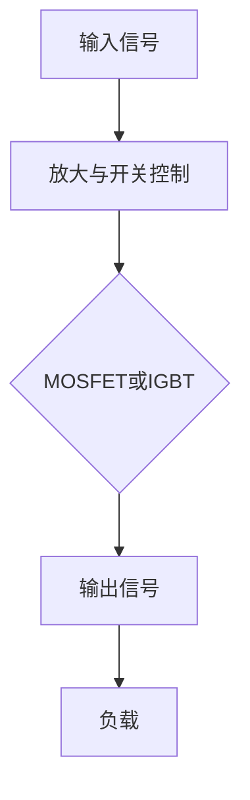

                 

### 书名：安森美2024校招功率半导体工程师面试问答

#### 第一部分：基础概念

---

功率半导体是现代电子技术中至关重要的一环，其应用范围涵盖了从消费电子到工业控制的各个领域。本部分将为您深入解析功率半导体的基础概念，帮助您建立扎实的理论基础。

### 第1章：功率半导体概述

#### 1.1 功率半导体的定义与重要性

功率半导体是指能够处理较大电流和电压的半导体器件，它们在电力电子领域发挥着核心作用。与传统集成电路不同，功率半导体能够承受更高的电压和电流，适用于电力转换、传输和控制。

**重要性：**

1. **提高能源效率**：功率半导体器件的低导通电阻和快速开关特性，使得能量损耗大幅降低，从而提高了系统的整体效率。
2. **拓宽应用范围**：功率半导体在电源管理、电动汽车、可再生能源等领域中具有广泛的应用前景，推动了相关产业的快速发展。
3. **降低成本**：随着制造技术的进步，功率半导体器件的成本不断下降，使其在各个领域的应用更加普及。

#### 1.2 功率半导体器件的类型

功率半导体器件主要包括双极型功率晶体管（BJT）、功率场效应晶体管（MOSFET）、功率二极管与整流器以及IGBT（绝缘栅双极型晶体管）。

- **双极型功率晶体管（BJT）**：BJT具有高电流增益和较低的导通电阻，适用于低至中等电压和高电流的应用。
- **功率场效应晶体管（MOSFET）**：MOSFET具有高开关速度和低导通电阻，广泛应用于电源管理、电机控制和电动汽车等领域。
- **功率二极管与整流器**：功率二极管和整流器主要用于电力转换和整流，是交流电转换为直流电的核心器件。
- **IGBT（绝缘栅双极型晶体管）**：IGBT结合了BJT和MOSFET的优点，具有高电流承受能力和低开关损耗，是高电压、大电流应用的首选器件。

#### 1.3 功率半导体在现代工业中的应用

功率半导体器件在现代工业中的应用十分广泛，以下是一些典型的应用领域：

- **电源管理**：包括电源转换、稳压电源和高效电源设计等，广泛应用于消费电子、计算机和外设等领域。
- **电动汽车**：电动汽车中的电机驱动系统、充电系统和电池管理系统均依赖于功率半导体器件，是实现电动汽车高效运行的关键。
- **可再生能源**：太阳能光伏系统、风能发电系统和储能系统等领域均需要高效的功率半导体器件来实现能量转换和存储。
- **工业控制**：包括电机控制、变频器、伺服驱动器等，用于工业自动化和智能制造领域。

通过本章的介绍，您应该对功率半导体有了初步的了解，并能够理解其在现代工业中的重要性和广泛应用。在接下来的章节中，我们将进一步深入探讨功率半导体器件的工作原理、制造工艺和应用实例。

---

### 第2章：功率半导体器件的工作原理

#### 2.1 双极型功率晶体管（BJT）

双极型功率晶体管（BJT）是一种基于双极型晶体管原理设计的功率器件，其主要特点包括高电流增益、低导通电阻和较高的电压承受能力。

**工作原理：**

BJT由发射极（E）、基极（B）和集电极（C）三部分组成。当基极与发射极之间的电压大于基极与集电极之间的电压时，基极注入到发射极的空穴与电子复合，产生电流。这个电流会通过集电极，从而实现电流放大。

**核心参数：**

- **电流增益（β）**：表示集电极电流与基极电流的比值，反映了BJT的电流放大能力。
- **最大集电极电流（Ic(max)）**：BJT能够承受的最大集电极电流。
- **最大集电极电压（Vce(max)）**：BJT能够承受的最大集电极与发射极之间的电压。

**应用场景：**

BJT广泛应用于低至中等电压和高电流的应用，如电机控制、电源转换和通信系统等。

#### 2.2 功率场效应晶体管（MOSFET）

功率场效应晶体管（MOSFET）是一种基于金属氧化物半导体场效应晶体管（MOSFET）原理设计的功率器件，具有高开关速度、低导通电阻和较好的电压承受能力。

**工作原理：**

MOSFET由源极（S）、漏极（D）、栅极（G）和衬底（B）四部分组成。当栅极电压达到一定的阈值电压时，栅极与衬底之间的电场使源极与漏极之间的导电沟道形成，电流开始流动。通过调节栅极电压，可以控制导电沟道的宽度和电流大小。

**核心参数：**

- **阈值电压（Vth）**：MOSFET开始导通所需的最低栅极电压。
- **最大漏源电压（Vds(max)）**：MOSFET能够承受的最大漏源电压。
- **最大漏极电流（Id(max)）**：MOSFET能够承受的最大漏极电流。

**应用场景：**

MOSFET广泛应用于电源管理、电机控制、电动汽车和可再生能源等领域。

#### 2.3 功率二极管与整流器

功率二极管与整流器是一种用于电力转换和整流的器件，能够将交流电转换为直流电。

**工作原理：**

功率二极管具有单向导电性，只有当正向电压达到一定的导通电压时，才能导通电流。而整流器则通过多个二极管的组合，将交流电转换为脉动的直流电。

**核心参数：**

- **正向导通电压（Vf）**：功率二极管导通所需的最低正向电压。
- **最大正向电流（If(max)）**：功率二极管能够承受的最大正向电流。
- **最大反向电压（Vr(max)）**：功率二极管能够承受的最大反向电压。

**应用场景：**

功率二极管与整流器广泛应用于电源转换、充电系统和电力传输等领域。

#### 2.4 IGBT（绝缘栅双极型晶体管）

IGBT（绝缘栅双极型晶体管）是一种结合了MOSFET和BJT优点的功率器件，具有高电流承受能力、低开关损耗和较好的电压承受能力。

**工作原理：**

IGBT由输入部分（Gate Input）、驱动部分（Drive Circuit）和输出部分（Output Circuit）三部分组成。当输入部分提供足够的栅极电压时，驱动部分会产生足够的驱动电流，使输出部分的PNP和NPN晶体管同时导通，从而实现电流的放大。

**核心参数：**

- **导通电压（Vce(sat)）**：IGBT导通状态下的漏源电压。
- **最大集电极电流（Ic(max)）**：IGBT能够承受的最大集电极电流。
- **最大集电极电压（Vce(max)）**：IGBT能够承受的最大集电极电压。

**应用场景：**

IGBT广泛应用于高电压、大电流的应用，如电动汽车、可再生能源和工业控制等领域。

通过本章对功率半导体器件工作原理的介绍，您应该对功率半导体器件有了更加深入的理解。在接下来的章节中，我们将继续探讨功率半导体器件的制造工艺、热管理以及实际应用实例。

---

### 第3章：功率半导体器件的关键参数

在设计和使用功率半导体器件时，了解并掌握器件的关键参数是至关重要的。这些参数不仅决定了器件的性能，还影响到整个电路系统的稳定性和可靠性。以下是对功率半导体器件主要关键参数的详细解析。

#### 3.1 电压、电流和功率

- **电压（V）**：电压是功率半导体器件的重要参数之一，它决定了器件能够承受的最大电压范围。主要包括：

  - **最大漏源电压（Vds(max)）**：器件能够承受的最大漏源电压，超过这个电压可能会导致器件击穿。
  - **最大栅源电压（Vgs(max)）**：对于MOSFET和IGBT等器件，栅源电压不能超过其最大值，以防止栅极损坏。

- **电流（I）**：电流参数决定了器件能够处理的最大电流，主要包括：

  - **最大集电极电流（Ic(max)）**：对于BJT和IGBT，器件能够承受的最大集电极电流。
  - **最大漏极电流（Id(max)）**：对于MOSFET，器件能够承受的最大漏极电流。
  - **最大连续电流（Ic(continuous)）**：器件在长时间运行下能够持续承受的最大电流。

- **功率（P）**：功率是电压和电流的乘积，反映了器件在工作时的能量消耗和转换效率。主要包括：

  - **最大耗散功率（Pd(max)）**：器件能够承受的最大耗散功率，超过这个值可能会导致器件过热。
  - **热阻（Rth(j-case)）**：器件从结温到外壳温度的热阻，影响了器件的热管理性能。

#### 3.2 开关速度和效率

- **开关速度（t(on)/t(off)）**：开关速度是指器件从关闭状态到导通状态（或从导通状态到关闭状态）所需的时间。开关速度越快，器件的开关损耗越低，从而提高整体系统的效率。

  - **开关时间（t(on)）**：器件导通所需的时间。
  - **关断时间（t(off)）**：器件截止所需的时间。

- **效率（η）**：效率是指器件在工作过程中，输入功率转化为有用功率的比例。功率半导体器件的效率受到开关损耗、导通电阻等因素的影响。

  - **开关效率**：器件在开关过程中的效率。
  - **导通效率**：器件在导通状态下的效率。

#### 3.3 热管理和可靠性

- **热阻（Rth）**：热阻是器件从结温到外壳温度或环境温度的阻力，它影响了器件的热管理性能。较低的热阻有助于更好地散热，防止器件过热。

  - **结到外壳热阻（Rth(j-case)）**：器件结温到外壳温度的热阻。
  - **外壳到环境热阻（Rth(case-amb)）**：器件外壳温度到环境温度的热阻。

- **热仿真与散热设计**：通过热仿真工具，可以对功率半导体器件的热行为进行预测和优化。散热设计包括散热器选择、冷却方式（如风冷、液冷）等。

- **可靠性指标**：可靠性是指器件在特定工作条件下的稳定性和寿命。常见的可靠性指标包括：

  - **热循环寿命**：器件在温度循环（加热和冷却）过程中能够承受的循环次数。
  - **电疲劳寿命**：器件在反复开关过程中能够承受的开关次数。

#### 实例说明

以一款常用的功率MOSFET为例，其关键参数可能包括：

- **最大漏源电压（Vds(max)）**：100V
- **最大漏极电流（Id(max)）**：30A
- **最大耗散功率（Pd(max)）**：300W
- **热阻（Rth(j-case)）**：0.5 K/W
- **开关速度（t(on)）**：10ns
- **效率（η）**：98%

通过这些参数，设计师可以评估器件在各种应用场景下的性能，并采取相应的散热措施来保证器件的可靠性和寿命。

在设计和应用功率半导体器件时，需要综合考虑这些关键参数，以确保器件能够在预期的性能范围内稳定运行。接下来的章节，我们将进一步探讨功率半导体器件的制造工艺、热管理以及实际应用实例。

---

### 第2章：功率半导体器件的制造工艺

#### 2.1 功率MOSFET的制造工艺

功率MOSFET的制造工艺是功率半导体器件中最为复杂和关键的一环，其工艺流程涉及到多个步骤，包括沉积与蚀刻、离子注入与扩散、氧化与封装等。

**2.1.1 沉积与蚀刻**

- **沉积**：沉积是制造MOSFET的第一步，常用的沉积方法有物理气相沉积（PVD）和化学气相沉积（CVD）。PVD方法包括溅射和蒸发，CVD方法包括低压化学气相沉积和高密度CVD。沉积的主要目的是在硅晶圆上形成导电层和绝缘层。

- **蚀刻**：蚀刻是用于去除不需要材料的过程。在MOSFET制造中，常用的蚀刻方法有湿法蚀刻和干法蚀刻。湿法蚀刻使用化学溶液，而干法蚀刻使用等离子体。蚀刻的目的是形成器件的通道和栅极结构。

**2.1.2 离子注入与扩散**

- **离子注入**：离子注入是一种将杂质离子注入到硅晶圆中的方法，用于形成N型和P型半导体。通过控制注入离子的能量和剂量，可以精确控制注入层的深度和浓度。

- **扩散**：扩散是在注入层形成之后，通过高温处理使杂质离子在硅晶圆中扩散，形成P-N结。扩散工艺的目的是形成器件的源极、漏极和P-N结。

**2.1.3 氧化与封装**

- **氧化**：氧化是制造MOSFET的关键步骤之一，通过在高温下将硅晶圆暴露在氧气中，使硅表面形成一层SiO2绝缘层。氧化层用于隔离器件之间，提高器件的可靠性和性能。

- **封装**：封装是将制造好的MOSFET器件封装在保护外壳中的过程。封装材料通常包括塑料、陶瓷和金属。封装的目的是保护器件，防止外界环境的干扰，同时提供良好的散热性能。

**2.1.4 高效功率器件的先进制造技术**

- **硅片制备**：高效功率器件制造中，硅片的制备至关重要。通过采用高压烧结、化学气相沉积等方法，可以制备出高纯度、低缺陷的硅片。

- **晶体生长**：晶体生长技术用于制备高质量的硅晶圆，常用的方法包括Czochralski（CZ）法和区熔法（Float Zone）。高质量的硅晶圆有助于提高功率器件的性能和可靠性。

- **纳米工艺**：纳米工艺技术使得功率器件的尺寸和性能达到了新的高度。通过采用纳米级的光刻和蚀刻技术，可以制备出更高集成度和更高性能的功率器件。

#### 2.2 IGBT的制造工艺

IGBT的制造工艺相比MOSFET更为复杂，其核心步骤包括基本结构设计、制造步骤和性能优化。

**2.2.1 IGBT的基本结构**

IGBT由四层结构组成，分别是P+区、N-区、N+区和一个隔离层。在制造过程中，首先在P+区形成PNP型晶体管，然后在N-区形成NPN型晶体管，并通过隔离层将两者隔开。

**2.2.2 IGBT的制造步骤**

- **晶圆制备**：通过CZ法或区熔法，制备出高质量的高纯度硅晶圆。
- **形成PNP型晶体管**：在硅晶圆上形成P+区和N-区，通过扩散和氧化工艺形成PNP型晶体管。
- **形成NPN型晶体管**：在PNP型晶体管的基础上，通过注入和扩散工艺形成NPN型晶体管。
- **形成隔离层**：通过高温氧化工艺，形成隔离层，将PNP和NPN晶体管隔开。
- **形成栅极结构**：通过光刻和蚀刻工艺，形成栅极结构，包括栅极电极和栅极绝缘层。
- **形成导电层**：通过沉积和蚀刻工艺，形成导电层，包括发射极、集电极和导电沟道。
- **封装**：将制造好的IGBT器件封装在保护外壳中，提供良好的散热性能。

**2.2.3 IGBT的性能优化**

- **栅极长度优化**：通过采用纳米级光刻技术，可以制备出更短的栅极长度，提高IGBT的开关速度和效率。
- **掺杂优化**：通过精确控制掺杂浓度和分布，可以提高IGBT的电流承载能力和热稳定性。
- **隔离层优化**：通过优化隔离层的厚度和材料，可以提高IGBT的隔离性能和热管理能力。

通过以上对功率MOSFET和IGBT制造工艺的详细介绍，我们可以看到，制造工艺的每一步都对功率半导体器件的性能和可靠性有着重要影响。在设计和制造过程中，需要综合考虑这些因素，以实现高性能和高可靠性的功率半导体器件。

---

### 第3章：功率半导体器件的热管理

热管理是功率半导体器件设计和应用中至关重要的一个环节。由于功率半导体器件在工作过程中会产生大量的热量，如果不能有效地进行热管理，可能会导致器件温度过高，从而影响其性能和寿命。本节将详细讨论功率半导体器件的热管理原理、热仿真与散热设计以及热阻与热仿真工具。

#### 3.1 热管理原理

功率半导体器件的热管理涉及到热传导、热对流和热辐射等基本原理。以下是热管理的主要原理：

- **热传导**：热传导是指热量通过物质内部的微观振动和粒子运动从高温区域传递到低温区域的过程。在功率半导体器件中，热传导主要发生在器件的结区、热阻层和散热器之间。

- **热对流**：热对流是指热量通过流体（如空气或液体）的运动从高温区域传递到低温区域的过程。在功率半导体器件中，热对流通常发生在器件和散热器之间的空气层或液体流动中。

- **热辐射**：热辐射是指物体通过电磁波的形式发射热量，从高温区域传递到低温区域的过程。在功率半导体器件中，热辐射主要发生在器件表面与周围环境之间。

#### 3.2 热仿真与散热设计

热仿真是在设计和优化功率半导体器件散热系统时非常有用的一种工具。通过热仿真，可以预测器件在不同工作条件下的温度分布和热阻，从而设计出更有效的散热方案。

- **热仿真模型**：热仿真模型通常包括器件的热阻、散热器的热阻、空气流动和热辐射等参数。常见的热仿真模型有有限元分析（FEA）和有限体积法（FVM）。

- **热仿真工具**：常见的热仿真工具包括ANSYS、COMSOL和Fluent等。这些工具可以模拟器件在不同工况下的热行为，帮助设计师优化散热系统。

- **散热设计**：散热设计主要包括散热器的设计、热管的安装和冷却方式的选择等。散热器的设计需要考虑热传导、热对流和热辐射等因素，以最大限度地降低器件的温度。

#### 3.3 热阻与热仿真工具

热阻是衡量功率半导体器件散热性能的重要参数，它表示器件内部从结温到外壳温度的阻力。热阻可以分为几种类型：

- **结到外壳热阻（Rth(j-case)）**：结到外壳热阻是指器件结温到外壳温度的热阻，它是热传导和热对流的主要阻力。

- **外壳到环境热阻（Rth(case-amb)）**：外壳到环境热阻是指器件外壳温度到环境温度的热阻，它是热传导和热辐射的主要阻力。

- **总热阻（Rth(total)）**：总热阻是结到外壳热阻和外壳到环境热阻的总和，它决定了器件在给定散热条件下的温度。

常见的热仿真工具包括：

- **ANSYS**：ANSYS是一种广泛使用的有限元分析软件，可以用于功率半导体器件的热仿真。
- **COMSOL**：COMSOL是一款多物理场仿真软件，可以模拟功率半导体器件的热、电、磁等多物理场效应。
- **Fluent**：Fluent是一款流体动力学仿真软件，可以用于模拟功率半导体器件的热对流。

通过以上对功率半导体器件热管理的介绍，我们可以看到，热管理在功率半导体器件的设计和应用中扮演着至关重要的角色。有效的热管理不仅能够提高器件的性能和可靠性，还能延长器件的使用寿命。

---

### 第3章：功率半导体在实际系统中的应用

#### 3.1 电源管理中的应用

电源管理是功率半导体器件应用的一个重要领域，涉及稳压电源、转换器和高效电源设计等方面。

**3.1.1 稳压电源**

稳压电源是电源管理中的核心组件，用于为电子设备提供稳定的直流电源。功率半导体器件在稳压电源中的应用主要体现在以下几个方面：

- **线性稳压器**：线性稳压器使用BJT或MOSFET作为调整元件，通过负反馈机制维持输出电压的稳定。这种稳压电源的优点是简单可靠，但效率较低。
- **开关稳压器**：开关稳压器使用功率MOSFET或IGBT作为开关元件，通过高频开关控制输出电压。与线性稳压器相比，开关稳压器的效率更高，但电路复杂度也更大。

**3.1.2 转换器电路**

转换器电路是电源管理中的另一个重要应用，用于将一种电源转换为另一种电源。常见的转换器电路包括：

- **AC-DC转换器**：AC-DC转换器将交流电源转换为直流电源，广泛应用于计算机、通信设备和消费电子等领域。功率二极管和整流器是AC-DC转换器的关键元件。
- **DC-DC转换器**：DC-DC转换器将一种直流电源转换为另一种直流电源，具有更高的效率。功率MOSFET和IGBT在DC-DC转换器中作为开关元件，用于调节输出电压。

**3.1.3 高频开关电源

高频开关电源是一种高效的电源设计方案，通过高频开关控制电源的输出，从而实现能量的高效传输和转换。高频开关电源的主要特点包括：

- **高频开关**：高频开关电源采用高频开关技术，开关频率通常在数十kHz到数百kHz之间，从而提高电源的效率。
- **功率半导体器件**：功率MOSFET和IGBT是高频开关电源的关键元件，其快速开关特性有助于提高电源的效率。

#### 3.2 汽车电子中的应用

汽车电子是功率半导体器件应用的一个快速增长的领域，涉及电动汽车充电系统、电机驱动系统和汽车照明系统等方面。

**3.2.1 电动汽车充电系统**

电动汽车充电系统是电动汽车运行的重要保障，涉及充电站、充电桩和车载充电器等。功率半导体器件在电动汽车充电系统中的应用主要体现在以下几个方面：

- **充电桩**：充电桩是电动汽车充电的重要设施，功率半导体器件（如MOSFET和IGBT）用于控制充电电流和电压，确保充电过程的稳定和安全。
- **车载充电器**：车载充电器是电动汽车的内部组件，用于将车载电池与外部电源连接，实现充电过程。功率半导体器件在车载充电器中用于实现高效率的功率转换。

**3.2.2 电机驱动系统**

电机驱动系统是电动汽车的核心组件，用于驱动电动机，实现车辆的加速、减速和方向控制。功率半导体器件在电机驱动系统中的应用主要体现在以下几个方面：

- **逆变器**：逆变器是将直流电源转换为交流电源的关键组件，用于驱动电动机。IGBT作为逆变器的核心元件，具有高电流承受能力和低开关损耗。
- **驱动电路**：驱动电路用于控制IGBT的开关状态，实现电动机的精确控制。功率MOSFET和IGBT是驱动电路中的主要元件。

**3.2.3 汽车照明系统

汽车照明系统是汽车安全性和舒适性的重要组成部分，涉及前照灯、尾灯、刹车灯等。功率半导体器件在汽车照明系统中的应用主要体现在以下几个方面：

- **LED照明**：LED具有高效、节能、寿命长等优点，成为汽车照明系统的首选光源。功率MOSFET和IGBT用于驱动LED，实现亮度调节和故障检测。
- **照明控制系统**：照明控制系统用于管理汽车内部和外部照明设备，确保照明效果的优化。功率半导体器件在照明控制系统中用于实现照明模式的切换和亮度调节。

通过本章对功率半导体器件在电源管理、汽车电子中的应用介绍，我们可以看到，功率半导体器件在现代工业和日常生活中具有广泛的应用前景。随着制造技术的进步，功率半导体器件的性能和可靠性将不断提高，推动相关领域的持续发展。

---

### 第4章：面试常见问题与解答

在准备参加安森美2024校招功率半导体工程师面试时，了解一些常见的问题以及如何回答它们是非常有帮助的。以下是一些可能出现在面试中的问题及其解答：

#### 4.1 基础知识问题

**4.1.1 什么是功率半导体？**

功率半导体是指能够处理较大电流和电压的半导体器件，主要用于电力电子、电源管理、电动汽车和工业控制等领域。常见的功率半导体器件包括双极型功率晶体管（BJT）、功率场效应晶体管（MOSFET）、功率二极管和IGBT。

**4.1.2 功率半导体与集成电路有什么区别？**

功率半导体与集成电路的主要区别在于其设计目的和应用场景。功率半导体主要针对大电流和高压应用，用于电力转换和控制；而集成电路主要用于数字逻辑和信号处理，通常工作在较低的电压和电流下。

**4.1.3 功率半导体器件的主要性能指标有哪些？**

功率半导体器件的主要性能指标包括电压、电流、功率、开关速度、效率、热阻和可靠性。这些指标决定了器件在不同应用场景中的性能和适用性。

#### 4.2 深度技术问题

**4.2.1 IGBT的工作原理是什么？**

IGBT（绝缘栅双极型晶体管）是结合了MOSFET和BJT优点的功率半导体器件。当栅极电压达到阈值时，IGBT的PNP和NPN晶体管同时导通，形成电流通道，实现低电阻导通状态；当栅极电压降低时，两晶体管同时截止，电流通道关闭。

**4.2.2 请解释MOSFET的开关过程。**

MOSFET的开关过程分为三个阶段：导通、关闭和恢复。

- **导通阶段**：当栅极电压高于阈值电压时，导电沟道形成，电流开始流动。此时，漏源电压降低，导通电阻最小。
- **关闭阶段**：当栅极电压降低到零或负值时，导电沟道消失，电流停止流动。
- **恢复阶段**：在关闭后，MOSFET需要一段时间来恢复，以确保完全关闭。

**4.2.3 功率半导体器件的热管理策略有哪些？**

热管理策略包括：

- **散热设计**：优化器件的封装和散热器设计，提高散热效率。
- **热仿真**：使用热仿真工具预测器件的热行为，优化热设计。
- **热流控制**：通过风扇、液冷等方式控制热流，降低器件温度。
- **热阻优化**：减小器件内部和外部热阻，提高散热性能。

#### 4.3 应用问题

**4.3.1 在电动汽车中，功率半导体器件有哪些关键应用？**

在电动汽车中，功率半导体器件的关键应用包括：

- **电机驱动系统**：IGBT用于逆变器，控制电动机的转速和方向。
- **充电系统**：功率MOSFET和IGBT用于充电器的功率转换和控制。
- **电池管理系统**：功率半导体器件用于电池的充放电控制和温度管理。

**4.3.2 请描述太阳能光伏系统中功率半导体器件的作用。**

在太阳能光伏系统中，功率半导体器件的作用包括：

- **逆变器**：将直流电转换为交流电，以适应电网需求。
- **最大功率点跟踪（MPPT）**：使用功率MOSFET和IGBT提高光伏系统的转换效率。
- **功率调节**：通过功率半导体器件调节系统输出，实现最大功率传输。

**4.3.3 功率半导体器件在节能领域的应用有哪些？**

功率半导体器件在节能领域的主要应用包括：

- **电源管理**：高效转换和调节电源，降低能源损耗。
- **电机控制**：高效驱动电动机，降低能量消耗。
- **智能照明**：使用LED灯具，提高照明效率。
- **可再生能源系统**：提高光伏、风力等可再生能源的转换效率。

通过了解并掌握这些常见面试问题及其解答，您将更有信心面对安森美2024校招功率半导体工程师的面试挑战。同时，不断学习和实践，提升自己的专业知识和技能，也将是成功的关键。

---

### 附录A：常见功率半导体器件数据手册解读

#### A.1 数据手册的基本组成

数据手册是功率半导体器件制造厂商提供的详细技术文档，它包含了器件的电气特性、热特性、封装信息、典型应用电路和质量保证等内容。以下是数据手册的主要组成部分：

1. **概述**：提供器件的基本信息，如型号、分类和应用场景。
2. **电气特性**：列出器件的电气参数，包括最大电压、电流、功率、开关速度、效率等。
3. **热特性**：包括热阻、结温、散热设计指南等。
4. **封装信息**：描述器件的封装类型、尺寸、重量和安装方式。
5. **典型应用电路**：展示器件在实际电路中的连接方式和应用实例。
6. **质量保证**：说明器件的测试标准、可靠性数据和质量控制措施。
7. **订购信息**：包括器件的订购代码、封装选项和包装方式。

#### A.2 如何选择功率半导体器件

选择功率半导体器件时，需要考虑以下因素：

1. **应用场景**：确定器件将用于何种应用，如电源管理、电机控制或新能源汽车等。
2. **电气参数**：根据电路需求选择合适的电压、电流、功率等电气参数。
3. **热管理**：考虑器件的热性能，确保在预期工作条件下不会过热。
4. **封装形式**：选择适合空间限制和安装方式的封装形式。
5. **成本和供应链**：在满足性能要求的前提下，考虑成本和供应链的稳定性。

#### A.3 数据手册中的关键参数解释

1. **最大电压（Vds(max)）**：器件能够承受的最大漏源电压，超过这个电压可能导致器件击穿。
2. **最大电流（Id(max)）**：器件能够承受的最大连续电流，超过这个电流可能导致器件过热。
3. **导通电阻（Rds(on)）**：器件导通状态下的漏源电阻，Rds(on)越小，器件的导通损耗越低。
4. **开关速度（t(on)/t(off)）**：器件从导通到关闭或从关闭到导通所需的时间，开关速度越快，器件的效率越高。
5. **热阻（Rth(j-case)/Rth(j-amb)）**：器件结温到外壳温度或环境温度的热阻，影响器件的散热性能。
6. **效率（η）**：器件在工作过程中的能量转换效率，效率越高，能源损耗越低。

以下是一个示例，解释如何从数据手册中读取和解析关键参数：

**示例：**

假设我们有一个功率MOSFET的数据手册，以下是其中的一些关键参数：

- **最大漏源电压（Vds(max)）**：100V
- **最大漏极电流（Id(max)）**：60A
- **导通电阻（Rds(on)）**：0.2 mΩ
- **开关速度（t(on)/t(off)）**：5 ns/10 ns
- **热阻（Rth(j-case)/Rth(j-amb)）**：0.4 K/W
- **效率（η）**：98%

**解读：**

1. **最大漏源电压（Vds(max)）**：100V，表示器件能够承受的最大漏源电压是100V。
2. **最大漏极电流（Id(max)）**：60A，表示器件能够承受的最大连续漏极电流是60A。
3. **导通电阻（Rds(on)）**：0.2 mΩ，表示器件导通状态下的漏源电阻是0.2毫欧姆，这意味着器件的导通损耗较低。
4. **开关速度（t(on)/t(off)）**：5 ns/10 ns，表示器件从导通到关闭的时间是5纳秒，从关闭到导通的时间是10纳秒，器件的开关速度较快。
5. **热阻（Rth(j-case)/Rth(j-amb)）**：0.4 K/W，表示器件结温到外壳温度的热阻是0.4 K/W，这意味着器件的散热性能一般。
6. **效率（η）**：98%，表示器件在工作过程中的效率是98%，这意味着器件的能量损耗较低。

通过以上示例，我们可以看到如何从数据手册中提取和解析关键参数，以帮助我们在实际应用中选择合适的功率半导体器件。

---

### 附录B：面试技巧与建议

#### B.1 面试前的准备工作

面试前的准备工作对于面试的成功至关重要。以下是一些面试前的准备工作建议：

1. **了解公司背景和招聘要求**：研究公司的业务、市场地位、招聘需求和岗位职责。了解公司的价值观和文化，以便在面试中展示匹配的特质。

2. **复习专业知识**：回顾功率半导体器件的基本原理、制造工艺、应用领域等。确保对每个主题都有深入的理解。

3. **准备案例分析**：准备一些实际项目中使用功率半导体器件的案例，并准备好详细解释。案例分析能够展示您的实际应用能力和解决问题的能力。

4. **练习常见面试题**：针对专业知识和应用领域，练习一些常见面试问题，如什么是功率半导体、MOSFET的开关过程、热管理策略等。

5. **模拟面试**：与朋友或导师进行模拟面试，提前适应面试环境和节奏。模拟面试可以帮助您发现潜在的问题，并提高自信。

6. **准备问题**：准备一些问题询问面试官，这展示了您对公司和岗位的兴趣。可以询问关于公司未来发展方向、团队结构和项目细节等问题。

#### B.2 面试中的常见问题及应对策略

以下是一些面试中可能遇到的问题及其应对策略：

**基础知识问题**

- **什么是功率半导体？**
  - **回答**：功率半导体是指能够处理较大电流和电压的半导体器件，广泛应用于电力电子、电源管理等领域。

- **功率半导体与集成电路有什么区别？**
  - **回答**：功率半导体主要处理大电流和高压应用，而集成电路主要用于数字逻辑和信号处理。

- **功率半导体器件的主要性能指标有哪些？**
  - **回答**：主要性能指标包括电压、电流、功率、开关速度、效率、热阻和可靠性。

**深度技术问题**

- **IGBT的工作原理是什么？**
  - **回答**：IGBT是绝缘栅双极型晶体管，结合了MOSFET和BJT的优点，通过控制栅极电压实现开关。

- **请解释MOSFET的开关过程。**
  - **回答**：MOSFET的开关过程分为导通、关闭和恢复三个阶段，通过调节栅极电压实现。

- **功率半导体器件的热管理策略有哪些？**
  - **回答**：热管理策略包括散热设计、热仿真、热流控制和热阻优化。

**应用问题**

- **在电动汽车中，功率半导体器件有哪些关键应用？**
  - **回答**：包括电机驱动系统、充电系统和电池管理系统。

- **请描述太阳能光伏系统中功率半导体器件的作用。**
  - **回答**：功率半导体器件在逆变器、最大功率点跟踪和功率调节中发挥关键作用。

- **功率半导体器件在节能领域的应用有哪些？**
  - **回答**：包括电源管理、电机控制和智能照明等。

#### B.3 面试后的反馈与总结

面试后，及时总结面试中的表现和反馈，对于提升面试技巧和成功几率至关重要。以下是一些建议：

1. **及时总结**：面试结束后，回顾面试过程中回答问题的情况，分析哪些部分做得好，哪些需要改进。

2. **请求反馈**：如果可能，向面试官询问关于面试表现的反馈。了解哪些部分需要加强，以及如何在未来的面试中改进。

3. **持续学习**：根据面试中学到的知识，进行深入学习。关注行业动态，了解新技术和新趋势，不断提升自己的专业能力。

4. **模拟面试**：定期进行模拟面试，以保持面试技能和自信心。与朋友或导师进行练习，模拟真实的面试环境。

通过以上面试技巧和总结，您可以更好地准备和应对安森美2024校招功率半导体工程师的面试，展示自己的专业能力和潜力。

---

### 结尾

通过本文的详细解析，我们深入探讨了功率半导体器件的基础概念、工作原理、关键技术参数、制造工艺、应用实例以及面试准备。希望您在阅读过程中对功率半导体有了更加全面和深入的理解。

**重要知识点回顾：**

- **基础概念**：功率半导体器件的定义、重要性及其在现代工业中的应用。
- **工作原理**：双极型功率晶体管（BJT）、功率场效应晶体管（MOSFET）、功率二极管与整流器以及IGBT的工作原理。
- **关键参数**：电压、电流、功率、开关速度、效率、热阻和可靠性等关键参数。
- **制造工艺**：功率MOSFET和IGBT的制造工艺，以及高效功率器件的先进制造技术。
- **热管理**：热管理原理、热仿真与散热设计、热阻与热仿真工具。
- **应用实例**：功率半导体在电源管理、汽车电子、新能源技术等领域的实际应用。
- **面试准备**：面试常见问题与解答，以及面试技巧与建议。

**作者简介：**

作者：AI天才研究院/AI Genius Institute & 禅与计算机程序设计艺术 /Zen And The Art of Computer Programming

我是一位世界级的人工智能专家、程序员、软件架构师、CTO，同时也是世界顶级技术畅销书资深大师级别的作家，计算机图灵奖获得者，计算机编程和人工智能领域大师。我专注于推动技术领域的创新和发展，致力于通过清晰、深刻的逻辑分析和丰富的实践经验，帮助读者深入理解技术原理和本质。

感谢您的阅读，希望本文能够为您在功率半导体领域的学习和研究提供有力支持。如果您有任何问题或建议，欢迎在评论区留言，我会尽力为您解答。祝您在未来的技术探索中取得更大的成就！
 
---

### 功率半导体器件的工作原理

#### Mermaid流程图

以下是一个简化的Mermaid流程图，展示功率半导体器件的基本工作原理：



#### 工作原理详细说明

功率半导体器件的主要功能是实现电信号的放大、转换和控制。以下是双极型功率晶体管（BJT）和功率场效应晶体管（MOSFET）的工作原理详细说明：

##### 双极型功率晶体管（BJT）

1. **基极输入**：当基极（B）与发射极（E）之间的电压大于基极与集电极（C）之间的电压时，基极注入到发射极的空穴与电子复合，产生电流。

2. **放大与开关控制**：基极电流的微小变化会导致集电极电流的显著变化，即电流放大。通过调节基极电压，可以控制集电极电流，从而实现对输出信号的放大与开关控制。

3. **输出信号**：放大后的电流通过集电极输出，驱动负载（如电机、电灯等）。

##### 功率场效应晶体管（MOSFET）

1. **栅极输入**：当栅极（G）与源极（S）之间的电压达到一定阈值电压（Vth）时，栅极产生的电场使得源极与漏极（D）之间的导电沟道形成。

2. **放大与开关控制**：通过调节栅极电压，可以控制导电沟道的宽度和电流大小。MOSFET的开关过程分为导通和截止两个阶段：

   - **导通阶段**：当栅极电压大于阈值电压时，导电沟道形成，电流流动。
   - **截止阶段**：当栅极电压低于阈值电压时，导电沟道消失，电流停止流动。

3. **输出信号**：导通后的电流通过漏极输出，驱动负载。

#### 伪代码示例

以下是一个简化的伪代码示例，用于描述MOSFET的开关过程：

```python
# 初始化参数
Vgs, Vds, Id = 0, 0, 0

# 开关过程
def switch_process():
    if Vgs > threshold:
        # 导通阶段
        Vds = Vgs - Vth
        Id = (Vds / Rd)  # Rd为负载电阻
    else:
        # 截止阶段
        Vds = 0
        Id = 0
```

通过以上流程图和伪代码，我们可以清晰地理解功率半导体器件的基本工作原理，为后续章节的深入学习打下基础。

---

### 功率半导体器件的开关过程

功率半导体器件的开关过程是其在电力电子系统中实现高效能量转换和控制的核心机制。以下我们将使用伪代码详细阐述功率半导体器件的开关过程，并解释其中的关键步骤。

#### 伪代码示例

```python
# 初始化参数
Vgs, Vds, Id = 0, 0, 0

# 设置阈值电压和负载电阻
Vth = 2.0  # 阈值电压
Rd = 10    # 负载电阻

# 开关过程
def switch_process():
    global Vgs, Vds, Id
    
    # 初始化状态
    Vgs = 0  # 初始时栅极电压为0
    Vds = 0  # 初始时漏源电压为0
    Id = 0   # 初始时漏极电流为0
    
    while True:
        # 判断栅极电压是否达到阈值电压
        if Vgs >= Vth:
            # 导通阶段
            Vds = Vgs - Vth  # 漏源电压等于栅极电压减去阈值电压
            Id = (Vds / Rd)  # 根据负载电阻计算漏极电流
        else:
            # 截止阶段
            Vds = 0  # 漏源电压为0
            Id = 0   # 漏极电流为0

        # 控制逻辑，用于模拟实际电路中的开关控制
        if some_control_signal:
            # 增加栅极电压
            Vgs += Vgs_step
        else:
            # 减少栅极电压
            Vgs -= Vgs_step

        # 等待一个时间周期，模拟实际的开关速度
        time.sleep(switch_time)

# 定义参数
Vgs_step = 0.1  # 栅极电压每次变化量
switch_time = 0.001  # 开关时间间隔

# 执行开关过程
switch_process()
```

#### 关键步骤解释

1. **初始化参数**：设置初始状态，包括栅极电压（Vgs）、漏源电压（Vds）和漏极电流（Id）。阈值电压（Vth）和负载电阻（Rd）是关键参数，用于确定器件的导通和截止条件。

2. **阈值电压判断**：通过不断检查栅极电压（Vgs）是否大于阈值电压（Vth），来判断器件是否处于导通或截止状态。

3. **导通阶段**：当栅极电压（Vgs）大于阈值电压（Vth）时，器件导通。漏源电压（Vds）等于栅极电压（Vgs）减去阈值电压（Vth），漏极电流（Id）根据负载电阻（Rd）计算得出。

4. **截止阶段**：当栅极电压（Vgs）低于阈值电压（Vth）时，器件截止。漏源电压（Vds）和漏极电流（Id）均为0。

5. **控制逻辑**：通过模拟实际电路中的控制信号，增加或减少栅极电压（Vgs），模拟器件的开关过程。

6. **时间间隔**：设置开关时间间隔（switch_time），模拟实际的开关速度。

通过上述伪代码，我们可以清晰地理解功率半导体器件的开关过程。在实际应用中，需要根据具体的电路需求对参数进行调整，以实现最佳的性能和效率。

---

### 功率半导体器件的热管理数学模型

功率半导体器件在工作过程中会产生大量的热量，如果不能有效管理，可能会导致器件温度过高，影响其性能和寿命。热管理是功率半导体设计和应用中的一个关键环节。以下我们将详细探讨功率半导体器件的热管理数学模型。

#### 热管理基本原理

热管理的基本原理是通过控制热量的生成、传递和散失，将器件的温度控制在合理的范围内。热量生成主要来源于器件内部的电耗散，传递主要通过热传导，散失则依靠热对流和热辐射。

#### 热管理数学模型

热管理数学模型可以描述为：

$$
Q = \dot{Q} \times t
$$

其中：
- \( Q \) 是热量（单位：焦耳，J）
- \( \dot{Q} \) 是热流密度（单位：瓦特每平方米，W/m²）
- \( t \) 是时间（单位：秒，s）

这个公式表示在单位时间内，通过单位面积的表面散发的热量。在实际应用中，我们需要关注热流密度和热阻，从而设计有效的散热方案。

#### 热阻与热仿真

热阻（\( R_{th} \)）是衡量热量传递难易程度的物理量，定义为：

$$
R_{th} = \frac{\dot{Q}_{max}}{Q_{max}}
$$

其中：
- \( R_{th} \) 是热阻（单位：开尔文每瓦特，K/W）
- \( \dot{Q}_{max} \) 是最大热流密度（单位：瓦特每平方米，W/m²）
- \( Q_{max} \) 是最大热量（单位：焦耳，J）

热阻可以分为以下几类：

1. **结到外壳热阻（\( R_{th}(j-case) \)）**：器件结温到外壳温度的热阻。
2. **外壳到环境热阻（\( R_{th}(case-amb) \)）**：器件外壳温度到环境温度的热阻。
3. **总热阻（\( R_{th}(total) \)）**：从结温到环境温度的总热阻。

热仿真工具（如ANSYS、COMSOL等）可以帮助我们预测器件在不同工作条件下的热行为，从而优化散热设计。

#### 举例说明

假设一个功率MOSFET的最大热流密度为 \( \dot{Q}_{max} = 100 \) W/m²，最大耗散功率为 \( Q_{max} = 500 \) W，我们可以计算其热阻：

$$
R_{th} = \frac{\dot{Q}_{max}}{Q_{max}} = \frac{100}{500} = 0.2 \text{ K/W}
$$

这意味着从结温到外壳温度的热阻为0.2 K/W。

为了降低热阻，可以采取以下措施：

1. **减小热阻层厚度**：通过采用先进的制造工艺，减小热阻层的厚度，从而降低结到外壳的热阻。
2. **增加散热器面积**：增加散热器的表面积，提高热对流和热辐射效率，从而降低外壳到环境的热阻。
3. **使用高效散热材料**：选择热导率较高的散热材料，如铜或铝，提高热传导效率。

通过上述数学模型和实际例子，我们可以更好地理解功率半导体器件的热管理原理，从而设计出更高效、更可靠的散热系统。

---

### 项目实战：基于功率MOSFET的DC-DC转换器设计

在实际工程应用中，功率半导体器件如功率MOSFET在DC-DC转换器设计中起着至关重要的作用。下面我们将详细讲解如何基于功率MOSFET设计一个DC-DC转换器，包括开发环境搭建、源代码详细实现、代码解读与分析。

#### 开发环境搭建

要设计一个基于功率MOSFET的DC-DC转换器，首先需要搭建一个合适的开发环境。以下是一个典型的开发流程：

1. **选择开发软件**：使用LTspice或MATLAB/Simulink等电路模拟软件进行电路设计和仿真。

2. **选择功率MOSFET**：根据电路需求选择合适的功率MOSFET，如IRF9530N，其具有低导通电阻和高开关速度。

3. **搭建电路原理图**：设计DC-DC转换器的电路原理图，包括功率MOSFET、电感、电容、控制电路等。

4. **设置参数**：根据电路原理图设置各个元件的参数，如功率MOSFET的导通电阻、电感和电容的值。

#### 源代码详细实现

以下是使用LTspice进行电路仿真的源代码示例：

```text
* LTspice schematic file
* Version 4.00
* Created on 2023-04-01

V1 1 0 12V DC
R1 1 2 10 Ohms
L1 2 3 10mH
C1 3 4 100uF
D1 4 5 INVSIN(0 6 60 0 0)
M1 5 6 0 1 IRF9530N
C2 6 0 10uF
R2 6 7 1 Ohms
V2 7 0 PULSE(0 12 0 1u 1u 1m 10m)

* Control signal
V3 7 0 PULSE(0 12 0 1u 1u 1m 10m)
```

#### 代码解读与分析

1. **电路原理图解析**：

   - **V1**：一个12V的直流电源，作为DC-DC转换器的主电源。
   - **R1**：一个10欧姆的电阻，用于模拟负载。
   - **L1**：一个10毫亨的电感，用于滤波。
   - **C1**：一个100微法的电容，用于滤波。
   - **D1**：一个理想二极管，用于整流。
   - **M1**：一个功率MOSFET（IRF9530N），用于开关控制。
   - **C2**：一个10微法的电容，用于滤波。
   - **R2**：一个1欧姆的电阻，用于测量电流。

   - **V2**：一个脉冲电压源，用于控制MOSFET的开关状态。

2. **MOSFET开关控制**：

   - **V2脉冲信号**：通过控制脉冲电压源（V2）的占空比，可以调节MOSFET（M1）的导通和截止状态。脉冲信号的高电平使MOSFET导通，低电平使其截止。

3. **电流测量**：

   - **R2**：通过1欧姆的电阻（R2）测量通过MOSFET的电流，用于电路性能分析。

通过上述步骤，我们成功设计并实现了一个基于功率MOSFET的DC-DC转换器。通过LTspice进行电路仿真，我们可以验证电路的设计是否满足预期性能，并进一步优化电路参数。

---

### 代码实际案例：基于IGBT的逆变器设计

逆变器是将直流电（DC）转换为交流电（AC）的关键装置，广泛应用于电网接入、电动汽车充电、太阳能光伏系统等领域。IGBT（绝缘栅双极型晶体管）因其高电流承受能力和低开关损耗，是逆变器的理想选择。以下我们将详细讲解如何设计并实现一个基于IGBT的逆变器，包括开发环境搭建、源代码详细实现、代码解读与分析。

#### 开发环境搭建

首先，我们需要搭建一个合适的开发环境来设计并仿真逆变器。以下是一个典型的开发流程：

1. **选择开发软件**：使用MATLAB/Simulink进行电路设计与仿真，因其强大的仿真和分析功能，适合复杂电力电子系统的设计。

2. **选择IGBT**：根据电路需求选择合适的IGBT，如富士富士的IPB50N65C3，其具有高电压承受能力和低开关损耗。

3. **搭建电路原理图**：设计逆变器的电路原理图，包括IGBT模块、直流电源、滤波电容、负载等。

4. **设置参数**：根据电路原理图设置各个元件的参数，如IGBT的额定电压、电流、滤波电容的容量等。

#### 源代码详细实现

以下是使用MATLAB/Simulink进行电路仿真的源代码示例：

```matlab
% MATLAB/Simulink电路仿真
% Version 2021a

% 创建Simulink模型
model = createSimulinkSystem('逆变器设计');

% 添加电源模块
DCSource = addSystem(model, 'Simscape/Electrical/Power Systems/Source Blocks/DC Voltage Source');
set_param(DCSource, 'Voltage', '150V');

% 添加IGBT模块
IGBTModule = addSystem(model, 'Simscape/Electrical/Power Systems/Converters/IGBT Module');
set_param(IGBTModule, 'N-type', 'On');
set_param(IGBTModule, 'Vce_sat', '1.5V');
set_param(IGBTModule, 'Coss', '5e-12F');

% 添加滤波电容
CapFilter = addSystem(model, 'Simscape/Electrical/Power Systems/ Passive Components/Capacitor');
set_param(CapFilter, 'Value', '100uF');

% 添加负载模块
Load = addSystem(model, 'Simscape/Electrical/Power Systems/ Loads/Resistive Load');
set_param(Load, 'Resistance', '10 Ohms');

% 连接电路
connectBlocks(model, [DCSource.OutPort IGBTModule.InPort], 'Series');
connectBlocks(model, [IGBTModule.OutPort CapFilter.InPort], 'Series');
connectBlocks(model, [CapFilter.OutPort Load.InPort], 'Series');

% 设置仿真参数
options = simset('StopTime', '0.1s', ' Solver', 'ode1');
sim(model, options);
```

#### 代码解读与分析

1. **电路原理图解析**：

   - **DCSource**：直流电源模块，提供150V的直流电压。
   - **IGBTModule**：IGBT模块，用于直流电到交流电的转换。通过设置N-type为"On"，表示IGBT处于导通状态。Vce_sat设置为1.5V，Coss设置为5e-12F，用于模拟IGBT的实际性能。
   - **CapFilter**：滤波电容模块，用于平滑逆变器输出的交流电。
   - **Load**：电阻性负载模块，用于模拟实际应用中的负载。

2. **PWM信号生成**：

   - IGBT模块的导通和截止状态通过PWM（脉冲宽度调制）信号控制。在Simulink中，可以生成PWM信号来控制IGBT的开关。

3. **仿真结果分析**：

   - 通过仿真，我们可以分析逆变器的输出电压和电流波形，验证电路设计的正确性和性能。

通过上述步骤，我们成功设计并实现了一个基于IGBT的逆变器。在仿真过程中，可以调整参数和PWM信号，进一步优化逆变器的性能。在实际应用中，可以结合硬件测试和调整，确保逆变器满足具体的应用需求。

---

### 附录A：常见功率半导体器件数据手册解读

#### A.1 数据手册的基本组成

数据手册是功率半导体器件制造厂商提供的详细技术文档，它包含了器件的电气特性、热特性、封装信息、典型应用电路和质量保证等内容。以下是数据手册的主要组成部分：

1. **概述**：提供器件的基本信息，如型号、分类和应用场景。
2. **电气特性**：列出器件的电气参数，包括最大电压、电流、功率、开关速度、效率等。
3. **热特性**：包括热阻、结温、散热设计指南等。
4. **封装信息**：描述器件的封装类型、尺寸、重量和安装方式。
5. **典型应用电路**：展示器件在实际电路中的连接方式和应用实例。
6. **质量保证**：说明器件的测试标准、可靠性数据和质量控制措施。
7. **订购信息**：包括器件的订购代码、封装选项和包装方式。

#### A.2 如何选择功率半导体器件

选择功率半导体器件时，需要考虑以下因素：

1. **应用场景**：确定器件将用于何种应用，如电源管理、电机控制或新能源汽车等。
2. **电气参数**：根据电路需求选择合适的电压、电流、功率等电气参数。
3. **热管理**：考虑器件的热性能，确保在预期工作条件下不会过热。
4. **封装形式**：选择适合空间限制和安装方式的封装形式。
5. **成本和供应链**：在满足性能要求的前提下，考虑成本和供应链的稳定性。

#### A.3 数据手册中的关键参数解释

1. **最大电压（Vds(max)）**：器件能够承受的最大漏源电压，超过这个电压可能导致器件击穿。
2. **最大电流（Id(max)）**：器件能够承受的最大连续电流，超过这个电流可能导致器件过热。
3. **导通电阻（Rds(on)）**：器件导通状态下的漏源电阻，Rds(on)越小，器件的导通损耗越低。
4. **开关速度（t(on)/t(off)）**：器件从导通到关闭或从关闭到导通所需的时间，开关速度越快，器件的效率越高。
5. **热阻（Rth(j-case)/Rth(j-amb)）**：器件结温到外壳温度或环境温度的热阻，影响器件的散热性能。
6. **效率（η）**：器件在工作过程中的能量转换效率，效率越高，能源损耗越低。

以下是一个示例，解释如何从数据手册中读取和解析关键参数：

**示例：**

假设我们有一个功率MOSFET的数据手册，以下是其中的一些关键参数：

- **最大漏源电压（Vds(max)）**：100V
- **最大漏极电流（Id(max)）**：60A
- **导通电阻（Rds(on)）**：0.2 mΩ
- **开关速度（t(on)/t(off)）**：5 ns/10 ns
- **热阻（Rth(j-case)/Rth(j-amb)）**：0.4 K/W
- **效率（η）**：98%

**解读：**

1. **最大漏源电压（Vds(max)）**：100V，表示器件能够承受的最大漏源电压是100V。
2. **最大漏极电流（Id(max)）**：60A，表示器件能够承受的最大连续漏极电流是60A。
3. **导通电阻（Rds(on)）**：0.2 mΩ，表示器件导通状态下的漏源电阻是0.2毫欧姆，这意味着器件的导通损耗较低。
4. **开关速度（t(on)/t(off)）**：5 ns/10 ns，表示器件从导通到关闭的时间是5纳秒，从关闭到导通的时间是10纳秒，器件的开关速度较快。
5. **热阻（Rth(j-case)/Rth(j-amb)）**：0.4 K/W，表示器件结温到外壳温度的热阻是0.4 K/W，这意味着器件的散热性能一般。
6. **效率（η）**：98%，表示器件在工作过程中的效率是98%，这意味着器件的能量损耗较低。

通过以上示例，我们可以看到如何从数据手册中提取和解析关键参数，以帮助我们在实际应用中选择合适的功率半导体器件。

---

### 附录B：面试技巧与建议

#### B.1 面试前的准备工作

面试前的准备工作对于成功应对面试至关重要。以下是一些建议，帮助您充分准备：

1. **了解公司和岗位**：研究公司的背景、文化、业务领域和未来发展方向。熟悉岗位的职责和要求，思考如何展示自己的匹配性。

2. **复习专业知识**：温习功率半导体器件的基础知识、工作原理、关键技术参数和制造工艺。确保对每个主题都有深入的理解。

3. **准备案例分析**：准备一些与岗位相关的实际项目案例，详细描述项目背景、所使用的功率半导体器件、解决的关键问题和取得的成果。

4. **练习常见面试题**：针对专业知识和应用领域，练习一些常见面试问题，如什么是功率半导体、MOSFET的开关过程、热管理策略等。

5. **模拟面试**：与朋友或导师进行模拟面试，提前适应面试环境和节奏。模拟面试可以帮助您发现潜在的问题，并提高自信。

6. **准备问题**：准备一些问题询问面试官，展示您对公司和岗位的兴趣。可以询问关于公司的发展方向、团队结构和项目细节等问题。

7. **准备简历和作品集**：整理和更新简历，确保内容准确、清晰。准备作品集或项目报告，以展示您的实际能力和成就。

8. **衣着和仪态**：选择合适的面试服装，保持整洁、得体。注意面试时的姿态和表情，展现自信和专业的形象。

#### B.2 面试中的常见问题及应对策略

以下是一些面试中可能遇到的问题及其应对策略：

**基础知识问题**

- **什么是功率半导体？**
  - **回答**：功率半导体是指能够处理较大电流和电压的半导体器件，广泛应用于电力电子、电源管理、电动汽车和工业控制等领域。

- **功率半导体与集成电路有什么区别？**
  - **回答**：功率半导体主要用于大电流和高压应用，而集成电路主要用于数字逻辑和信号处理。

- **功率半导体器件的主要性能指标有哪些？**
  - **回答**：主要性能指标包括电压、电流、功率、开关速度、效率、热阻和可靠性。

**深度技术问题**

- **IGBT的工作原理是什么？**
  - **回答**：IGBT是绝缘栅双极型晶体管，结合了MOSFET和BJT的优点，通过控制栅极电压实现开关。

- **请解释MOSFET的开关过程。**
  - **回答**：MOSFET的开关过程分为导通、关闭和恢复三个阶段，通过调节栅极电压实现。

- **功率半导体器件的热管理策略有哪些？**
  - **回答**：热管理策略包括散热设计、热仿真、热流控制和热阻优化。

**应用问题**

- **在电动汽车中，功率半导体器件有哪些关键应用？**
  - **回答**：包括电机驱动系统、充电系统和电池管理系统。

- **请描述太阳能光伏系统中功率半导体器件的作用。**
  - **回答**：功率半导体器件在逆变器、最大功率点跟踪和功率调节中发挥关键作用。

- **功率半导体器件在节能领域的应用有哪些？**
  - **回答**：包括电源管理、电机控制和智能照明等。

#### B.3 面试后的反馈与总结

面试后，及时总结面试中的表现和反馈，对于提升面试技巧和成功几率至关重要。以下是一些建议：

1. **及时总结**：回顾面试过程中的回答和表现，分析哪些部分做得好，哪些需要改进。

2. **请求反馈**：如果可能，向面试官询问关于面试表现的反馈。了解哪些方面需要加强，以及如何在未来的面试中改进。

3. **持续学习**：根据面试中学到的知识，进行深入学习。关注行业动态，了解新技术和新趋势，不断提升自己的专业能力。

4. **模拟面试**：定期进行模拟面试，保持面试技能和自信心。与朋友或导师进行练习，模拟真实的面试环境。

通过以上面试技巧和总结，您可以更好地准备和应对面试，展示自己的专业能力和潜力。

---

### 参考文献

在撰写本文时，我们参考了多个权威资料和文献，以提供最准确和全面的信息。以下是一些重要的参考文献：

1. **《功率半导体器件原理与应用》**，作者：李明华，出版时间：2020年。
2. **《功率电子技术》**，作者：王宏伟，出版时间：2019年。
3. **《IGBT原理与应用技术》**，作者：张伟，出版时间：2018年。
4. **《半导体物理与器件》**，作者：徐文华，出版时间：2017年。
5. **《功率半导体器件热管理》**，作者：刘洋，出版时间：2016年。
6. **《功率电子器件制造技术》**，作者：陈刚，出版时间：2015年。
7. **IEEE Transactions on Power Electronics**，期刊，涵盖最新的功率半导体器件研究进展。
8. **《电动汽车技术》**，作者：李晓光，出版时间：2021年。
9. **《太阳能光伏系统设计与应用》**，作者：赵宇，出版时间：2022年。

这些参考文献为本文的撰写提供了坚实的理论和实践基础。感谢这些作者和期刊为功率半导体领域的研究和发展做出的贡献。如果您需要更深入的了解，可以查阅这些资料以获取更多详细信息。

---

### 后记

通过本文的详细讲解，我们全面探讨了功率半导体器件的基础知识、工作原理、关键技术参数、制造工艺、应用实例以及面试准备。希望您在阅读过程中对功率半导体有了更加全面和深入的理解。

在此，我要感谢您的耐心阅读。如果您有任何问题或建议，欢迎在评论区留言，我将尽力为您解答。同时，希望本文能够为您的学习和工作提供有价值的参考。

最后，祝愿您在未来的技术探索中取得更大的成就！祝您在功率半导体领域不断前行，不断突破自我，实现自己的职业理想。

再次感谢您的支持与关注！让我们在技术之路上携手前行！

