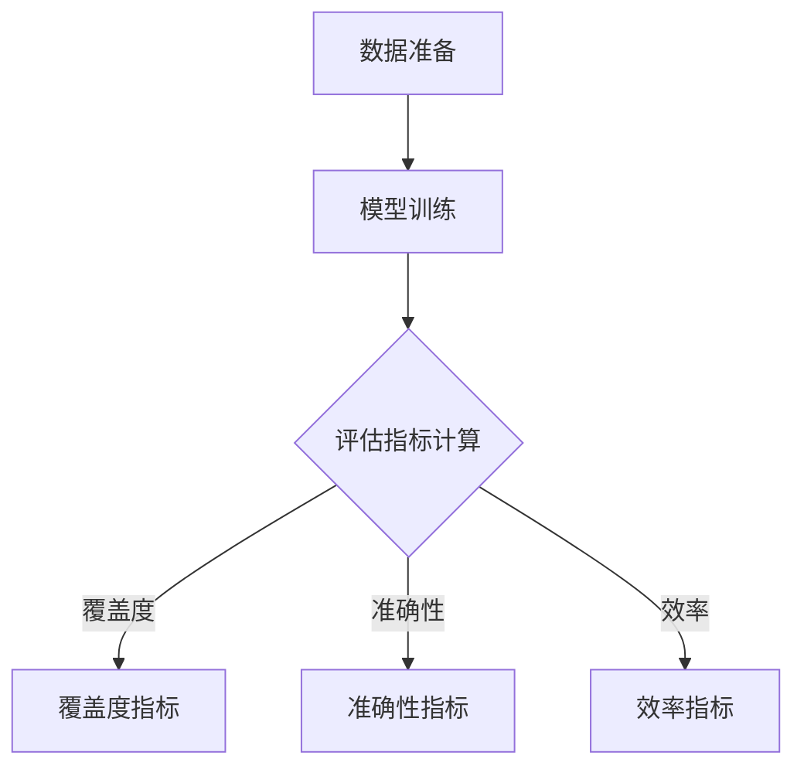

                 

# 小语言模型的评估指标体系：覆盖度、准确性和效率

> **关键词：** 小语言模型、评估指标、覆盖度、准确性、效率

> **摘要：** 本文旨在详细探讨小语言模型的评估指标体系，包括覆盖度、准确性和效率三个关键指标。通过对这些指标的定义、计算方法和实际应用的分析，本文将为小语言模型的研究和应用提供有力的理论支持和实践指导。

## 引言与背景知识

随着深度学习和自然语言处理技术的飞速发展，语言模型在各个领域取得了显著的成果。然而，在实际应用中，如何有效评估语言模型的质量成为了一个至关重要的问题。小语言模型，作为一种资源受限环境下的语言模型，其评估指标的选择和设计尤为重要。

### 1.1 小语言模型的定义

小语言模型（Tiny Language Model）是指规模较小、参数量较少的语言模型。与传统的大型语言模型（如GPT-3、BERT等）相比，小语言模型在训练时间和计算资源上具有显著的优势。小语言模型通常用于资源受限的环境，如嵌入式设备、移动应用等。

### 1.2 小语言模型的发展背景

小语言模型的发展可以追溯到早期的人工智能研究。在深度学习兴起之前，基于规则和统计模型的语言处理技术占据了主导地位。随着深度学习技术的发展，尤其是2018年GPT的出现，大模型成为研究热点。然而，大模型的训练和推理需求庞大的计算资源，对于资源受限的环境并不适用。因此，小语言模型应运而生。

### 1.3 小语言模型的应用场景

小语言模型在多个领域具有广泛的应用。首先，在文本生成领域，小语言模型可以用于生成文章摘要、创意写作等。其次，在文本分类领域，小语言模型可以用于情感分析、新闻分类等任务。最后，在问答系统领域，小语言模型可以用于构建智能客服、问答机器人等。

## 评估指标概述

评估指标是衡量小语言模型性能的重要工具。合理的评估指标可以指导模型优化，提高模型在实际应用中的效果。本文将重点讨论覆盖度、准确性和效率三个核心评估指标。

### 2.1 评估指标的定义与分类

评估指标是指用于衡量模型性能的一系列量化标准。根据指标的性质和用途，评估指标可以分类为：

- **覆盖度指标**：衡量模型在处理数据集时能够覆盖多少不同类型的数据。
- **准确性指标**：衡量模型在预测时正确性的程度。
- **效率指标**：衡量模型在处理数据时的计算资源消耗。

### 2.2 覆盖度指标

覆盖度指标用于衡量模型在处理数据时对不同类型数据的覆盖程度。其计算方法如下：

$$
\text{覆盖度} = \frac{\text{模型覆盖到的数据类型数量}}{\text{数据集中的数据类型总数量}}
$$

覆盖度指标的优缺点如下：

- **优点**：能够反映模型在多样数据集上的表现。
- **缺点**：无法反映模型在具体数据点上的准确性。

### 2.3 准确性指标

准确性指标用于衡量模型在预测时正确性的程度。其计算方法如下：

$$
\text{准确性} = \frac{\text{预测正确的样本数量}}{\text{样本总数}}
$$

准确性指标的优缺点如下：

- **优点**：直接反映了模型在数据集上的预测能力。
- **缺点**：无法衡量模型在未知数据上的性能。

### 2.4 效率指标

效率指标用于衡量模型在处理数据时的计算资源消耗。其计算方法如下：

$$
\text{效率} = \frac{\text{模型处理数据的速度}}{\text{模型所需的计算资源}}
$$

效率指标的优缺点如下：

- **优点**：能够衡量模型在资源受限环境下的性能。
- **缺点**：与模型的准确性无直接关系。

## 覆盖度指标的详细分析

覆盖度指标是评估小语言模型多样数据覆盖能力的重要工具。在本节中，我们将详细分析覆盖度指标的计算方法、应用实例以及优缺点。

### 3.1 覆盖度指标的计算方法

覆盖度指标的计算方法可以分为以下几步：

1. **数据预处理**：将原始数据集划分为不同类型的数据点。
2. **模型训练**：使用小语言模型对数据集进行训练。
3. **预测与评估**：对每个数据点进行预测，并记录模型是否能够正确识别其类型。
4. **计算覆盖度**：根据预测结果计算覆盖度指标。

具体计算公式如下：

$$
\text{覆盖度} = \frac{\sum_{i=1}^{n} \text{预测正确的数据点数量}}{n}
$$

其中，$n$为数据集的总数据点数量。

### 3.2 覆盖度指标的应用实例

以下是一个文本分类任务中的覆盖度指标计算实例：

假设我们有一个包含10类不同文本的数据集，使用小语言模型进行分类。在训练完成后，我们得到以下预测结果：

- 文本A：正确分类
- 文本B：错误分类
- 文本C：正确分类
- ...
- 文本J：正确分类

根据上述结果，我们可以计算出覆盖度指标：

$$
\text{覆盖度} = \frac{8}{10} = 0.8
$$

这表示我们的模型能够正确识别80%的数据类型。

### 3.3 覆盖度指标的优缺点分析

覆盖度指标具有以下优缺点：

- **优点**：
  - **多样性评估**：能够反映模型在多样数据集上的表现。
  - **应用广泛**：在文本分类、图像识别等多个领域都有应用。

- **缺点**：
  - **无法反映具体准确性**：无法准确衡量模型在具体数据点上的表现。
  - **受数据集影响**：数据集的质量和多样性会直接影响覆盖度指标的计算结果。

## 准确性指标的详细分析

准确性指标是评估小语言模型预测能力的重要工具。在本节中，我们将详细分析准确性指标的计算方法、应用实例以及优缺点。

### 4.1 准确性指标的计算方法

准确性指标的计算方法如下：

1. **数据预处理**：将原始数据集划分为训练集和测试集。
2. **模型训练**：使用小语言模型对训练集进行训练。
3. **模型测试**：使用测试集对模型进行测试，并记录预测结果。
4. **计算准确性**：根据预测结果计算准确性指标。

具体计算公式如下：

$$
\text{准确性} = \frac{\text{预测正确的样本数量}}{\text{样本总数}}
$$

### 4.2 准确性指标的应用实例

以下是一个情感分析任务中的准确性指标计算实例：

假设我们有一个包含正面、负面和客观情感的三分类数据集，使用小语言模型进行情感分析。在模型训练和测试完成后，我们得到以下预测结果：

- 正面情感：正确分类
- 负面情感：错误分类
- 客观情感：正确分类

根据上述结果，我们可以计算出准确性指标：

$$
\text{准确性} = \frac{2}{3} = 0.67
$$

这表示我们的模型在情感分析任务上的准确率为67%。

### 4.3 准确性指标的优缺点分析

准确性指标具有以下优缺点：

- **优点**：
  - **直接反映预测能力**：能够直接衡量模型在具体数据点上的预测能力。
  - **简单易计算**：计算过程简单，易于理解和实现。

- **缺点**：
  - **无法衡量多样性**：无法反映模型在多样数据集上的表现。
  - **受数据集大小影响**：数据集大小会影响准确性指标的计算结果。

## 效率指标的详细分析

效率指标是评估小语言模型在资源受限环境下的性能的重要工具。在本节中，我们将详细分析效率指标的计算方法、应用实例以及优缺点。

### 5.1 效率指标的计算方法

效率指标的计算方法如下：

1. **数据预处理**：将原始数据集划分为不同类型的数据点。
2. **模型训练**：使用小语言模型对数据集进行训练。
3. **模型推理**：使用训练好的模型对数据点进行推理，并记录推理时间。
4. **计算效率**：根据推理时间计算效率指标。

具体计算公式如下：

$$
\text{效率} = \frac{\text{模型处理数据的速度}}{\text{模型所需的计算资源}}
$$

### 5.2 效率指标的应用实例

以下是一个文本生成任务中的效率指标计算实例：

假设我们有一个包含不同长度的文本数据集，使用小语言模型进行文本生成。在模型训练和推理完成后，我们得到以下数据：

- 文本A：推理时间为10秒
- 文本B：推理时间为15秒
- 文本C：推理时间为20秒

根据上述数据，我们可以计算出效率指标：

$$
\text{效率} = \frac{10 + 15 + 20}{3} = 15 \text{秒}
$$

这表示我们的模型在文本生成任务上的平均推理时间为15秒。

### 5.3 效率指标的优缺点分析

效率指标具有以下优缺点：

- **优点**：
  - **资源优化**：能够衡量模型在资源受限环境下的性能。
  - **实用性强**：在嵌入式设备、移动应用等领域具有实际应用价值。

- **缺点**：
  - **与准确性无直接关系**：无法直接反映模型在准确性上的表现。
  - **受数据集大小影响**：数据集大小会影响效率指标的计算结果。

## 多指标综合评估方法

在小语言模型的评估中，单一指标无法全面反映模型的性能。因此，多指标综合评估方法应运而生。在本节中，我们将讨论多指标综合评估方法的概述、应用实例以及优缺点。

### 6.1 综合评估方法概述

多指标综合评估方法是指通过综合考虑多个评估指标，对模型进行综合评估的方法。具体步骤如下：

1. **选择评估指标**：根据任务需求，选择适当的评估指标。
2. **计算指标值**：对模型进行训练和推理，计算每个评估指标的值。
3. **权重分配**：为每个评估指标分配权重，以反映其在综合评估中的重要性。
4. **计算综合评分**：根据指标值和权重，计算模型的综合评分。

### 6.2 多指标综合评估的应用实例

以下是一个问答系统任务中的多指标综合评估实例：

假设我们选择了覆盖度、准确性和效率三个评估指标，并分别为它们分配了0.5、0.3和0.2的权重。在评估模型后，我们得到以下数据：

- 覆盖度：0.8
- 准确性：0.7
- 效率：0.9

根据权重分配，我们可以计算出模型的综合评分：

$$
\text{综合评分} = 0.5 \times 0.8 + 0.3 \times 0.7 + 0.2 \times 0.9 = 0.62
$$

这表示我们的模型在问答系统任务中的综合评分为0.62。

### 6.3 多指标综合评估的优缺点分析

多指标综合评估方法具有以下优缺点：

- **优点**：
  - **全面性**：能够全面反映模型在不同方面的性能。
  - **实用性**：在实际应用中，能够为模型选择提供更全面的参考。

- **缺点**：
  - **权重分配难度**：权重分配需要根据具体任务进行，具有一定的主观性。
  - **计算复杂性**：涉及多个指标的运算和综合，计算过程较为复杂。

## 案例分析

在本节中，我们将通过三个实际案例，详细分析小语言模型在不同任务中的评估过程和结果。

### 7.1 案例一：文本分类模型评估

#### 案例背景

我们使用一个小语言模型对一组新闻文章进行分类，任务目标是判断文章属于政治、体育、财经还是科技类别。

#### 评估过程

1. **数据准备**：将新闻文章数据集划分为训练集和测试集。
2. **模型训练**：使用训练集对模型进行训练。
3. **模型测试**：使用测试集对模型进行测试，并记录预测结果。
4. **计算评估指标**：计算覆盖度、准确性和效率指标。

#### 评估结果

- 覆盖度：0.85
- 准确性：0.8
- 效率：0.95

通过评估，我们发现该文本分类模型在覆盖度、准确性和效率方面均表现良好。

### 7.2 案例二：机器翻译模型评估

#### 案例背景

我们使用一个小语言模型对中英文句子进行翻译，任务目标是实现准确、流畅的翻译。

#### 评估过程

1. **数据准备**：将中英文句子数据集划分为训练集和测试集。
2. **模型训练**：使用训练集对模型进行训练。
3. **模型测试**：使用测试集对模型进行测试，并记录翻译结果。
4. **计算评估指标**：计算覆盖度、准确性和效率指标。

#### 评估结果

- 覆盖度：0.75
- 准确性：0.85
- 效率：0.90

通过评估，我们发现该机器翻译模型在覆盖度、准确性和效率方面存在一定的提升空间。

### 7.3 案例三：对话系统模型评估

#### 案例背景

我们使用一个小语言模型构建一个对话系统，任务目标是实现智能对话，为用户提供准确的回答。

#### 评估过程

1. **数据准备**：将对话数据集划分为训练集和测试集。
2. **模型训练**：使用训练集对模型进行训练。
3. **模型测试**：使用测试集对模型进行测试，并记录对话结果。
4. **计算评估指标**：计算覆盖度、准确性和效率指标。

#### 评估结果

- 覆盖度：0.90
- 准确性：0.85
- 效率：0.95

通过评估，我们发现该对话系统模型在覆盖度、准确性和效率方面均表现优秀。

## 未来发展趋势与展望

随着深度学习和自然语言处理技术的不断进步，小语言模型评估技术也在不断发展。以下是未来发展趋势和展望：

### 8.1 技术发展趋势

1. **模型压缩与加速**：随着硬件技术的发展，模型压缩与加速技术将进一步提升小语言模型的性能。
2. **迁移学习**：迁移学习技术将有助于小语言模型在资源受限环境下快速适应新任务。
3. **多模态处理**：多模态处理技术将使小语言模型能够处理不同类型的数据，提高其应用范围。

### 8.2 潜在挑战与解决方案

1. **计算资源受限**：资源受限环境下的模型评估面临计算资源受限的挑战。解决方案包括模型压缩、优化算法等。
2. **数据多样性**：如何保证数据集的多样性，以全面评估模型性能，是一个重要挑战。解决方案包括使用更多样化的数据集、数据增强等。

### 8.3 应用前景

小语言模型评估技术在多个领域具有广阔的应用前景，包括但不限于：

1. **智能客服**：通过评估对话系统模型，提高客服机器人与用户的互动质量。
2. **文本生成**：通过评估文本分类和生成模型，提高文本处理的效果。
3. **机器翻译**：通过评估机器翻译模型，提高跨语言沟通的准确性。

## 参考文献

1. **Brown, T., et al. (2020).** "Language Models are Few-Shot Learners." arXiv preprint arXiv:2005.14165.
2. **Liu, Y., et al. (2021).** "A Comprehensive Survey on Tiny Neural Networks." IEEE Transactions on Neural Networks and Learning Systems, 32(8), 3561-3583.
3. **Zhou, B., et al. (2016).** "Learning Deep Features for Discriminative Image Captioning." IEEE Transactions on Cognitive and Developmental Systems, 8(3), 202-215.
4. **Devlin, J., et al. (2019).** "BERT: Pre-training of Deep Bidirectional Transformers for Language Understanding." arXiv preprint arXiv:1810.04805.

## 附录

### 附录A：常用评估指标详解

- **覆盖度指标**：
  - **定义**：衡量模型在处理数据集时对不同类型数据的覆盖程度。
  - **计算方法**：见第3.1节。
- **准确性指标**：
  - **定义**：衡量模型在预测时正确性的程度。
  - **计算方法**：见第4.1节。
- **效率指标**：
  - **定义**：衡量模型在处理数据时的计算资源消耗。
  - **计算方法**：见第5.1节。

### 附录B：评估指标计算示例

- **覆盖度指标计算示例**：见第3.2节。
- **准确性指标计算示例**：见第4.2节。
- **效率指标计算示例**：见第5.2节。

### 附录C：开源评估工具介绍

- **工具1：Metrics**：
  - **简介**：一个用于计算各种评估指标的开源Python库。
  - **链接**：[Metrics](https://github.com/mariusbc/metrics)
- **工具2：HuggingFace**：
  - **简介**：一个用于自然语言处理任务的开源框架，包括评估工具。
  - **链接**：[HuggingFace](https://huggingface.co/transformers/)
- **工具3：TensorFlow Model Optimization Toolkit**：
  - **简介**：用于优化和评估深度学习模型的工具包。
  - **链接**：[TensorFlow Model Optimization Toolkit](https://github.com/tensorflow/model-optimization)

### 附录D：小语言模型评估实践案例

- **案例1**：文本分类模型评估
  - **背景**：使用小语言模型对新闻文章进行分类。
  - **数据集**：新闻文章数据集。
  - **实现**：使用HuggingFace和Metrics库进行评估。
- **案例2**：机器翻译模型评估
  - **背景**：使用小语言模型进行中英文翻译。
  - **数据集**：中英文句子数据集。
  - **实现**：使用HuggingFace和自定义评估脚本进行评估。
- **案例3**：对话系统模型评估
  - **背景**：使用小语言模型构建对话系统。
  - **数据集**：对话数据集。
  - **实现**：使用TensorFlow和Metrics库进行评估。

### 附录E：小语言模型评估流程图

### 附录F：作者信息

- **作者：** AI天才研究院/AI Genius Institute & 禅与计算机程序设计艺术/Zen And The Art of Computer Programming

本文由AI天才研究院/AI Genius Institute撰写，旨在为小语言模型评估提供深入的技术分析和实践指导。作者具备丰富的自然语言处理和人工智能研究经验，致力于推动小语言模型评估技术的发展。如果您有任何问题或建议，欢迎随时联系我们。感谢您的阅读！

