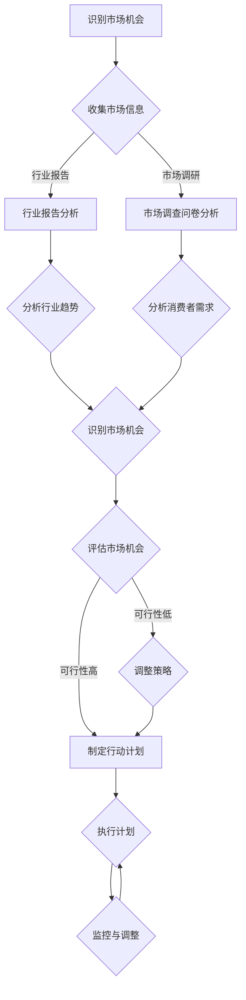

                 

# 市场机会识别：创业者的敏锐眼光

关键词：市场机会、创业、敏锐眼光、机会评估、战略规划

摘要：在竞争激烈的市场环境中，创业者的敏锐眼光至关重要。本文将深入探讨市场机会的定义与识别、市场分析工具与方法、市场机会识别实战、市场机会评估与决策以及案例研究与实战技巧，帮助创业者捕捉并把握市场机会，实现创业成功。

## 目录

### 《市场机会识别：创业者的敏锐眼光》目录

#### 第一部分：市场与创业基础知识

- **第1章**：市场机会的定义与识别
  - 1.1 市场机会的概念
  - 1.2 市场机会的分类
  - 1.3 创业者视角下的市场机会

- **第2章**：市场分析工具与方法
  - 2.1 SWOT分析
  - 2.2 宏观经济环境分析
  - 2.3 行业竞争态势分析
  - 2.4 消费者需求分析

#### 第二部分：市场机会识别实战

- **第3章**：初创企业的市场机会探索
  - 3.1 初创企业的市场定位
  - 3.2 初创企业的资源与能力分析
  - 3.3 初创企业的市场机会识别策略

- **第4章**：市场细分与目标市场选择
  - 4.1 市场细分策略
  - 4.2 目标市场选择标准
  - 4.3 如何进行目标市场定位

- **第5章**：创新与市场机会
  - 5.1 创新类型与市场机会
  - 5.2 创新驱动型市场机会识别
  - 5.3 市场机会创新的策略与实施

#### 第三部分：市场机会评估与决策

- **第6章**：市场机会评估方法
  - 6.1 市场机会评价指标体系
  - 6.2 市场机会评估模型
  - 6.3 市场机会评估的实际应用案例

- **第7章**：市场机会决策与执行
  - 7.1 市场机会的决策过程
  - 7.2 市场机会决策的影响因素
  - 7.3 市场机会的执行策略

- **第8章**：创业项目的市场机会规划
  - 8.1 创业项目的基本要素
  - 8.2 创业项目的市场机会分析
  - 8.3 创业项目的市场机会规划流程

#### 第四部分：案例研究与实战技巧

- **第9章**：知名创业公司的市场机会识别
  - 9.1 知名创业公司市场机会识别案例分析
  - 9.2 创业公司市场机会识别的实战技巧

- **第10章**：创业者应具备的敏锐眼光
  - 10.1 创业者应具备的素养
  - 10.2 创业者如何培养敏锐眼光
  - 10.3 创业者敏锐眼光的培养方法

- **第11章**：市场机会识别工具与资源
  - 11.1 市场研究工具介绍
  - 11.2 数据分析工具与技巧
  - 11.3 市场机会识别的资源整合

#### 第五部分：附录

- **第12章**：市场机会识别流程图
- **第13章**：市场机会评估指标模板
- **第14章**：创业者必备的市场机会识别书籍与资料推荐

## 第一部分：市场与创业基础知识

### 第1章：市场机会的定义与识别

#### 1.1 市场机会的概念

市场机会是指市场上存在的、能够带来潜在利润和竞争优势的业务或商业活动。它可以是未被满足的需求、市场的空白点、行业趋势的转变等。

在创业过程中，市场机会是至关重要的。创业者需要具备敏锐的市场洞察力，能够从纷繁复杂的市场环境中识别出潜在的商业机会，从而抓住机遇，实现创业梦想。

#### 1.2 市场机会的分类

市场机会可以分为以下几类：

- **消费者需求型机会**：源于消费者需求的变化，如新型产品的需求、新的消费习惯等。
- **技术创新型机会**：由技术的进步和创新带来的市场机会，如互联网、人工智能等。
- **政策与法规变化型机会**：由政府政策、法规的改变带来的市场机会，如环保政策、税收优惠等。
- **社会变革型机会**：由社会变革、人口结构变化等带来的市场机会，如老龄化、城市化等。

#### 1.3 创业者视角下的市场机会

创业者需要具备敏锐的市场洞察力，能够从以下几个方面识别市场机会：

- **看待市场动态**：密切关注市场趋势和变化，及时发现潜在的市场机会。
- **挖掘客户需求**：深入理解客户需求，找到未被满足或未被完全满足的需求。
- **分析行业结构**：研究行业竞争态势，找到行业中的弱点或空白点。
- **寻找合作伙伴**：通过与行业内的企业或个人合作，共同挖掘和创造市场机会。

### 第2章：市场分析工具与方法

#### 2.1 SWOT分析

SWOT分析是一种常用的市场分析方法，用于评估企业的优势、劣势、机会和威胁。

- **优势（Strengths）**：企业内部具备的优势，如技术、品牌、资金等。
- **劣势（Weaknesses）**：企业内部存在的问题和劣势，如管理不善、技术落后等。
- **机会（Opportunities）**：外部环境中的有利条件，如市场增长、政策扶持等。
- **威胁（Threats）**：外部环境中的不利因素，如竞争对手、市场波动等。

通过SWOT分析，创业者可以全面了解企业内外部环境，从而制定合适的战略和计划。

#### 2.2 宏观经济环境分析

宏观经济环境分析主要关注国家经济政策、经济发展趋势、消费水平等宏观因素，以评估市场机会。

- **国家经济政策**：如税收政策、外贸政策等，对市场机会有重要影响。
- **经济发展趋势**：如GDP增长、工业发展等，反映市场的总体发展态势。
- **消费水平**：如人均收入、消费结构等，影响市场需求和市场规模。

#### 2.3 行业竞争态势分析

行业竞争态势分析旨在了解行业内主要竞争对手的市场地位、产品策略、营销策略等，以评估市场机会。

- **竞争对手的市场地位**：如市场份额、品牌影响力等。
- **竞争对手的产品策略**：如产品定位、产品线等。
- **竞争对手的营销策略**：如广告投放、促销活动等。

#### 2.4 消费者需求分析

消费者需求分析旨在了解消费者的需求、偏好、购买行为等，以指导市场机会的识别。

- **消费者需求**：如消费者对产品的功能、质量、价格等方面的要求。
- **消费者偏好**：如消费者对品牌、颜色、款式等方面的偏好。
- **消费者购买行为**：如消费者的购买渠道、购买频率、购买动机等。

### 第二部分：市场机会识别实战

#### 第3章：初创企业的市场机会探索

##### 3.1 初创企业的市场定位

初创企业需要明确自己的市场定位，以便在竞争激烈的市场中找到立足点。

- **产品定位**：明确产品的目标市场和定位，如针对高端用户、大众用户等。
- **市场细分**：根据市场需求和消费者特点，对市场进行细分，找到自己的细分市场。
- **市场细分策略**：采用不同的市场细分策略，如人口统计细分、心理细分、行为细分等。

##### 3.2 初创企业的资源与能力分析

初创企业需要评估自身的资源与能力，以确定能够把握的市场机会。

- **资源分析**：包括资金、技术、人力资源等，评估企业现有资源。
- **能力分析**：包括研发能力、市场拓展能力、品牌建设能力等，评估企业现有能力。
- **资源与能力的匹配**：分析企业资源与能力的匹配程度，以确定能够把握的市场机会。

##### 3.3 初创企业的市场机会识别策略

初创企业可以通过以下策略识别市场机会：

- **持续关注市场动态**：密切关注行业趋势、竞争对手动态等，及时捕捉市场机会。
- **客户需求挖掘**：通过与客户互动、调查问卷等方式，深入了解客户需求，挖掘潜在市场机会。
- **竞争对手分析**：分析竞争对手的优势与劣势，找到自身的市场机会。
- **创新驱动**：通过技术创新、产品创新等方式，创造新的市场机会。

### 第4章：市场细分与目标市场选择

##### 4.1 市场细分策略

市场细分策略是指将市场划分为若干个具有相似特征的子市场，以更好地满足不同客户群体的需求。

- **人口统计细分**：根据人口特征进行细分，如年龄、性别、收入等。
- **心理细分**：根据消费者的心理特征进行细分，如生活方式、价值观念等。
- **行为细分**：根据消费者的行为特征进行细分，如购买频率、购买渠道等。

##### 4.2 目标市场选择标准

选择目标市场时，企业需要考虑以下标准：

- **市场规模**：目标市场的规模是否足够大，能够为企业带来足够的利润。
- **增长潜力**：目标市场的增长潜力是否较大，有助于企业长期发展。
- **竞争程度**：目标市场的竞争程度是否适中，能够为企业提供一定的竞争优势。
- **可进入性**：目标市场是否容易进入，企业能否迅速占领市场份额。

##### 4.3 如何进行目标市场定位

进行目标市场定位时，企业需要考虑以下因素：

- **产品定位**：明确产品的目标市场和定位，如针对高端用户、大众用户等。
- **消费者需求**：深入了解目标市场的消费者需求，提供符合消费者需求的产品或服务。
- **竞争态势**：分析目标市场中的竞争对手，找到自身的竞争优势。
- **营销策略**：制定针对目标市场的营销策略，如广告宣传、促销活动等。

### 第5章：创新与市场机会

##### 5.1 创新类型与市场机会

创新可以分为以下类型，不同类型的创新可以带来不同的市场机会：

- **产品创新**：通过改进产品功能、外观、质量等，满足消费者需求。
- **技术创新**：通过技术创新，提高产品质量、降低成本、提高生产效率等。
- **业务模式创新**：通过改变业务模式，创造新的市场机会，如共享经济、电商等。
- **服务创新**：通过改进服务，提高客户满意度，创造新的市场机会。

##### 5.2 创新驱动型市场机会识别

创新驱动型市场机会识别的关键在于：

- **关注行业趋势**：通过关注行业趋势，了解哪些技术或业务模式可能会带来新的市场机会。
- **技术评估**：对新兴技术进行评估，分析其潜在的市场前景和应用场景。
- **创新合作**：与科研机构、高校等合作，共同开展创新项目，挖掘市场机会。
- **市场调研**：通过市场调研，了解消费者需求和市场趋势，发现潜在的市场机会。

##### 5.3 市场机会创新的策略与实施

市场机会创新的策略包括：

- **技术创新策略**：通过研发新技术、改进生产工艺等方式，提高产品质量和降低成本。
- **产品创新策略**：通过改进产品功能、外观、质量等，满足消费者需求。
- **业务模式创新策略**：通过改变业务模式，创造新的市场机会，如共享经济、电商等。
- **服务创新策略**：通过改进服务，提高客户满意度，创造新的市场机会。

实施市场机会创新时，企业需要：

- **明确创新目标**：明确创新的目标和方向，确保创新活动的有效性。
- **创新资源投入**：投入足够的资源和资金，支持创新项目的开展。
- **创新团队建设**：建立创新团队，提供培训和激励措施，激发创新活力。
- **创新成果转化**：将创新成果转化为实际产品或服务，实现市场价值。

### 第6章：市场机会评估与决策

##### 6.1 市场机会的评估方法

市场机会的评估方法包括以下几个方面：

- **市场潜力**：评估市场未来的增长潜力和规模。
- **竞争态势**：评估市场上竞争对手的实力和市场占有率。
- **成本效益**：评估市场机会所需的成本和预期收益。
- **风险程度**：评估市场机会可能面临的风险和不确定性。

##### 6.2 市场机会评估模型

市场机会评估模型可以采用以下几种：

- **SWOT分析模型**：通过分析企业的优势、劣势、机会和威胁，评估市场机会。
- **成本-收益分析模型**：通过比较市场机会的成本和预期收益，评估市场机会的可行性。
- **风险评估模型**：通过评估市场机会可能面临的风险，制定相应的风险应对策略。

##### 6.3 市场机会评估的实际应用案例

市场机会评估的实际应用案例包括：

- **新产品开发**：通过对市场机会的评估，确定新产品开发的优先级。
- **投资决策**：通过对市场机会的评估，决定是否进行投资。
- **市场扩张**：通过对市场机会的评估，确定市场扩张的目标和策略。

### 第7章：市场机会决策与执行

##### 7.1 市场机会的决策过程

市场机会的决策过程包括以下几个阶段：

- **初步评估**：对市场机会进行初步评估，确定其可行性和潜力。
- **详细评估**：对市场机会进行详细评估，包括市场潜力、竞争态势、成本效益等。
- **决策制定**：根据评估结果，制定市场机会的决策，包括是否采取行动、如何行动等。
- **决策执行**：根据决策制定行动计划，实施市场机会的开发和利用。

##### 7.2 市场机会决策的影响因素

市场机会决策的影响因素包括：

- **市场环境**：包括宏观经济环境、行业趋势、竞争对手等。
- **企业能力**：包括企业资源、技术能力、管理能力等。
- **风险因素**：包括市场风险、技术风险、财务风险等。
- **竞争态势**：包括市场上竞争对手的实力和市场占有率等。

##### 7.3 市场机会的执行策略

市场机会的执行策略包括：

- **资源配置**：根据市场机会的特点和需求，合理配置企业资源。
- **项目管理**：建立项目管理机制，确保市场机会的顺利实施。
- **营销策略**：制定有效的营销策略，提高市场机会的成功率。
- **持续改进**：对市场机会的执行过程进行持续监控和改进，确保市场机会的实现。

### 第8章：创业项目的市场机会规划

##### 8.1 创业项目的基本要素

创业项目的基本要素包括：

- **项目目标**：明确创业项目的目标和愿景。
- **产品或服务**：确定创业项目的核心产品或服务。
- **市场定位**：确定创业项目的目标市场和定位。
- **营销策略**：制定创业项目的营销策略。
- **财务计划**：制定创业项目的财务计划。

##### 8.2 创业项目的市场机会分析

创业项目的市场机会分析包括以下几个方面：

- **市场需求分析**：分析目标市场的需求特点和趋势。
- **竞争态势分析**：分析市场上竞争对手的实力和市场占有率。
- **市场潜力分析**：分析市场未来的增长潜力和规模。
- **风险评估**：分析创业项目可能面临的市场风险、技术风险等。

##### 8.3 创业项目的市场机会规划流程

创业项目的市场机会规划流程包括以下几个步骤：

- **初步评估**：对创业项目的市场机会进行初步评估，确定其可行性和潜力。
- **详细评估**：对创业项目的市场机会进行详细评估，包括市场需求、竞争态势、成本效益等。
- **制定策略**：根据评估结果，制定创业项目的市场机会规划策略。
- **实施计划**：根据市场机会规划策略，制定创业项目的实施计划。
- **持续监控**：对创业项目的市场机会规划过程进行持续监控和调整，确保规划目标的实现。

### 第9章：知名创业公司的市场机会识别

##### 9.1 知名创业公司市场机会识别案例分析

知名创业公司通过敏锐的市场洞察力和灵活的应对策略，成功识别并抓住了市场机会，取得了巨大的成功。以下是一些案例分析：

- **滴滴出行**：通过识别城市居民出行需求的快速增长，抓住了共享经济的机遇，成功进入出行市场。
- **小米科技**：通过识别消费者对高性能、性价比高手机的强烈需求，抓住了智能手机市场的机会，迅速崛起。
- **美团点评**：通过识别本地生活服务市场的巨大潜力，抓住了电商化、O2O的机遇，成为本地生活服务市场的领导者。

##### 9.2 创业公司市场机会识别的实战技巧

创业公司在识别市场机会时，可以运用以下实战技巧：

- **持续关注市场动态**：密切关注行业趋势、消费者需求变化等，及时发现潜在的市场机会。
- **进行市场调研**：通过问卷调查、用户访谈等方式，深入了解消费者需求和市场竞争态势。
- **分析竞争对手**：分析竞争对手的优势和劣势，找到自身的市场机会。
- **创新思维**：运用创新思维，从不同角度看待市场，发现潜在的市场机会。

### 第10章：创业者应具备的敏锐眼光

##### 10.1 创业者应具备的素养

创业者应具备以下素养，以培养敏锐眼光：

- **市场敏锐度**：能够快速捕捉市场动态和趋势，发现潜在的市场机会。
- **分析能力**：具备较强的分析能力，能够对市场机会进行评估和判断。
- **沟通能力**：具备良好的沟通能力，能够与团队成员、合作伙伴、客户等有效沟通。
- **学习能力**：具备持续学习的能力，不断提升自己的知识和技能。

##### 10.2 创业者如何培养敏锐眼光

创业者可以通过以下方法培养敏锐眼光：

- **阅读行业报告**：定期阅读行业报告，了解行业趋势和竞争态势。
- **参加行业会议**：参加行业会议，与行业专家、同行交流，拓展视野。
- **市场调研**：进行市场调研，深入了解消费者需求和市场竞争态势。
- **体验用户产品**：亲身体验用户产品，从用户角度看待市场机会。

##### 10.3 创业者敏锐眼光的培养方法

创业者可以通过以下方法培养敏锐眼光：

- **多角度思考**：从不同角度看待问题，培养全方位的思考能力。
- **勤于总结**：对经历的事情进行总结，从成功和失败中吸取经验教训。
- **培养好奇心**：保持好奇心，对新鲜事物和未知领域保持兴趣。
- **培养跨学科思维**：学习不同领域的知识，培养跨学科思维，提高对问题的全面理解。

### 第11章：市场机会识别工具与资源

##### 11.1 市场研究工具介绍

市场研究工具是识别市场机会的重要工具，以下是一些常用的市场研究工具：

- **SWOT分析**：通过分析企业的优势、劣势、机会和威胁，帮助创业者识别市场机会。
- **市场调查问卷**：通过设计调查问卷，收集消费者需求和市场竞争态势的信息。
- **竞争对手分析**：通过分析竞争对手的产品、价格、营销策略等，了解竞争对手的优势和劣势。
- **行业报告**：通过阅读行业报告，了解行业趋势、市场规模、竞争态势等。

##### 11.2 数据分析工具与技巧

数据分析工具和技巧是识别市场机会的重要手段，以下是一些常用的数据分析工具和技巧：

- **数据挖掘**：通过数据挖掘技术，从大量数据中提取有价值的信息。
- **数据可视化**：通过数据可视化工具，将数据转化为图表、图形等形式，便于分析。
- **统计分析**：通过统计分析方法，对数据进行处理和分析，揭示数据背后的规律和趋势。
- **实时监控**：通过实时监控工具，对市场动态、竞争对手等实时数据进行分析。

##### 11.3 市场机会识别的资源整合

创业者需要整合各种资源，以更好地识别市场机会。以下是一些资源整合的方法：

- **人脉资源**：通过拓展人脉，结识行业专家、同行、合作伙伴等，获取市场信息。
- **信息资源**：通过获取行业报告、市场研究报告、新闻资讯等，了解市场动态。
- **创新资源**：通过合作、交流、学习等方式，获取技术创新、商业模式创新等资源。
- **资金资源**：通过融资、投资等途径，获取资金资源，支持市场机会的开发和利用。

### 第12章：市场机会识别流程图

以下是一个市场机会识别的流程图：

### 第13章：市场机会评估指标模板

以下是一个市场机会评估指标模板：

| 指标名称 | 指标定义 | 指标计算方法 |
| --- | --- | --- |
| 市场潜力 | 市场未来的增长潜力和规模 | 市场规模增长率×当前市场规模 |
| 竞争态势 | 市场上竞争对手的实力和市场占有率 | 市场占有率×竞争对手数量 |
| 成本效益 | 市场机会所需的成本和预期收益 | 成本效益比=预期收益/所需成本 |
| 风险程度 | 市场机会可能面临的风险和不确定性 | 风险指数=风险概率×风险影响 |

### 第14章：创业者必备的市场机会识别书籍与资料推荐

以下是一些创业者必备的市场机会识别书籍与资料推荐：

- **《创业维艰》**：作者本·霍洛维茨，提供了关于创业过程中面对挑战和机遇的宝贵经验。
- **《市场细分与目标市场选择》**：作者菲利普·科特勒，详细介绍了市场细分和目标市场选择的方法和策略。
- **《商业模式创新》**：作者迈克尔·波特，探讨了商业模式创新的重要性以及如何实现商业模式创新。
- **《大数据营销》**：作者唐·泰普斯科特，介绍了大数据在市场机会识别中的应用和实践。
- **《创业者之路》**：作者史蒂夫·乔布斯，讲述了乔布斯在创业过程中的思考和决策过程，对创业者具有启发意义。

## 附录

### 附录A：市场机会识别流程图

以下是一个市场机会识别的流程图：

### 附录B：市场机会评估指标模板

以下是一个市场机会评估指标模板：

| 指标名称 | 指标定义 | 指标计算方法 |
| --- | --- | --- |
| 市场潜力 | 市场未来的增长潜力和规模 | 市场规模增长率×当前市场规模 |
| 竞争态势 | 市场上竞争对手的实力和市场占有率 | 市场占有率×竞争对手数量 |
| 成本效益 | 市场机会所需的成本和预期收益 | 成本效益比=预期收益/所需成本 |
| 风险程度 | 市场机会可能面临的风险和不确定性 | 风险指数=风险概率×风险影响 |

### 附录C：创业者必备的市场机会识别书籍与资料推荐

以下是一些创业者必备的市场机会识别书籍与资料推荐：

- **《创业维艰》**：作者本·霍洛维茨，提供了关于创业过程中面对挑战和机遇的宝贵经验。
- **《市场细分与目标市场选择》**：作者菲利普·科特勒，详细介绍了市场细分和目标市场选择的方法和策略。
- **《商业模式创新》**：作者迈克尔·波特，探讨了商业模式创新的重要性以及如何实现商业模式创新。
- **《大数据营销》**：作者唐·泰普斯科特，介绍了大数据在市场机会识别中的应用和实践。
- **《创业者之路》**：作者史蒂夫·乔布斯，讲述了乔布斯在创业过程中的思考和决策过程，对创业者具有启发意义。

