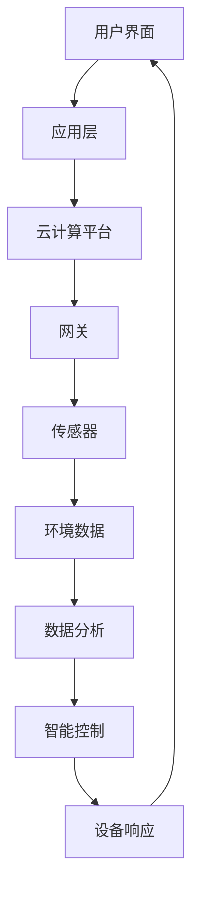

                 

### 《2050年的智能家居：从智能家电到家庭机器人的家庭服务升级》文章关键词

1. **智能家居**
2. **智能家电**
3. **家庭机器人**
4. **人工智能技术**
5. **物联网（IoT）**
6. **5G通信技术**
7. **用户隐私保护**

这些关键词不仅覆盖了文章的核心主题，还涉及了当前智能家居领域的关键技术和挑战。通过这些关键词，读者可以快速了解文章的主要内容，并对于智能家居的未来发展有初步的认识。接下来，我们将深入探讨这些关键词所代表的概念和技术，逐步构建文章的框架。

### 《2050年的智能家居：从智能家电到家庭机器人的家庭服务升级》文章摘要

本文深入探讨了智能家居的未来发展，展望了2050年智能家居的愿景。从智能家电的硬件基础和软件架构出发，我们分析了智能家居的核心技术，如物联网（IoT）、人工智能（AI）和5G通信技术。通过详尽的Mermaid流程图和伪代码，我们揭示了智能家电的算法原理和数学模型。此外，文章还探讨了家庭机器人的定义、分类、核心功能及应用场景，并提供了具体的数学公式及应用举例。最后，我们探讨了智能家居服务升级面临的挑战与机遇，以及未来智能家居在社会中的潜在影响。通过这些内容，读者将全面了解智能家居的发展历程、当前状态和未来趋势。

## 2050年的智能家居：从智能家电到家庭机器人的家庭服务升级

### 引言

随着人工智能（AI）、物联网（IoT）和5G通信技术的飞速发展，智能家居已经从最初的构想逐步走进千家万户。然而，技术的进步不仅限于现有智能家电的优化，更是向更高层次的智能家庭机器人服务迈进。本文将探讨2050年智能家居的远景，从智能家电到家庭机器人的家庭服务升级，描绘出一个高度智能化、便捷高效的家庭生活场景。

### 第一部分：智能家居的背景与核心概念

#### 1.1 智能家居概述

**1.1.1 智能家居的定义与历史发展**

智能家居，即通过物联网、人工智能等技术，将家庭设备、系统和基础设施连接起来，实现自动化管理和智能控制。智能家居的历史可以追溯到20世纪80年代的家用自动化系统，但真正的大规模发展始于21世纪初，随着物联网和人工智能技术的成熟，智能家居进入了一个崭新的阶段。

**1.1.2 智能家居的重要性**

智能家居不仅提高了生活便利性，还带来了能源节约、环境优化和安全保障等多方面的好处。随着技术的不断进步，智能家居在未来的家庭生活中将扮演越来越重要的角色。

**1.1.3 智能家居的核心技术**

智能家居的核心技术包括物联网（IoT）、人工智能（AI）和5G通信技术。

- **物联网（IoT）**：物联网技术使得各种设备可以通过互联网相互连接，实现数据的采集、传输和智能处理。
- **人工智能（AI）**：人工智能技术赋予了智能家居设备学习能力，能够根据用户习惯和环境变化进行自我调整和优化。
- **5G通信技术**：5G通信技术提供了高速、低延迟的网络环境，为智能家居设备的数据传输和处理提供了强有力的支持。

#### 1.2 智能家居的关键概念与联系

**1.2.1 智能家居的架构**

智能家居系统通常由以下几个核心模块组成：传感器、网关、云计算平台、应用层。这些模块相互协作，共同实现智能家居的功能。

- **传感器**：用于收集室内外的各种数据，如温度、湿度、光照等。
- **网关**：负责将传感器的数据传输到云计算平台或本地设备。
- **云计算平台**：负责数据存储、分析和处理，并提供智能控制功能。
- **应用层**：包括用户界面和应用软件，供用户进行操作和监控。

**1.2.2 智能家居的核心模块**

智能家居的核心模块包括智能照明、智能空调、智能安防和智能厨房等。这些模块不仅实现了基本的智能家居功能，还可以通过人工智能算法进行自我学习和优化。

**1.2.3 智能家居的通信协议**

智能家居设备之间的通信协议是确保系统稳定性和互操作性的关键。常见的通信协议包括Zigbee、Z-Wave、Wi-Fi和蓝牙等。

- **Zigbee**：低功耗、短距离无线通信技术，适合智能家居设备之间的短距离通信。
- **Z-Wave**：无线通信技术，主要用于智能家居设备的组网和控制。
- **Wi-Fi**：高速无线通信技术，适用于传输大量数据的应用场景。
- **蓝牙**：短距离无线通信技术，广泛应用于智能设备的连接和控制。

### 1.3 智能家居的Mermaid流程图

以下是智能家居系统的Mermaid流程图，展示了各个模块之间的数据流动和交互：



通过这个流程图，我们可以清晰地看到智能家居系统从用户操作到设备响应的全过程。

### 第二部分：智能家电

#### 2.1 智能家电的原理与应用

**2.1.1 智能家电的基本原理**

智能家电是智能家居的重要组成部分，其基本原理包括以下几个方面：

- **硬件基础**：智能家电通常由传感器、微处理器、通信模块等硬件组成。这些硬件负责数据的采集、处理和传输。
- **软件架构**：智能家电的软件架构包括操作系统、应用软件和中间件。操作系统负责硬件的管理和资源分配，应用软件实现智能家电的功能，中间件负责数据传输和协议转换。
- **工作流程**：智能家电的工作流程通常包括数据采集、数据处理、智能分析和设备控制。传感器采集数据，微处理器进行处理，通过通信模块将数据传输到云计算平台或本地设备，云计算平台或本地设备根据数据进行分析和决策，然后发出控制指令，设备根据指令进行响应。

**2.1.2 智能家电的应用场景**

智能家电在家庭生活中的应用非常广泛，以下是一些典型的应用场景：

- **智能照明**：通过传感器感知环境光线，智能调节灯光亮度，实现节能和舒适。
- **智能空调**：根据室内温度和湿度自动调节制冷或加热，提供舒适的室内环境。
- **智能安防**：实时监控家庭环境，发现异常情况及时报警，保障家庭安全。
- **智能厨房**：智能冰箱、智能烤箱等设备，通过物联网实现食材管理、烹饪指导和营养分析。

**2.1.3 智能家电的核心算法原理讲解**

智能家电的核心算法主要包括机器学习算法和深度学习算法。以下是一个简单的机器学习算法的伪代码示例：

```python
# 伪代码：智能照明亮度调节
def adjust_light_brightness(sensor_data, target_brightness):
    # 数据预处理
    preprocessed_data = preprocess_data(sensor_data)
    
    # 训练模型
    model = train_model(preprocessed_data, target_brightness)
    
    # 预测亮度
    predicted_brightness = model.predict(preprocessed_data)
    
    # 调节灯光亮度
    set_light_brightness(predicted_brightness)
```

这个伪代码展示了智能照明系统如何通过机器学习算法，根据传感器数据和环境需求，自动调节灯光亮度。

**2.1.4 智能家电的数学模型与数学公式**

智能家电的数学模型通常涉及以下几个方面：

- **机器人路径规划**：用于确定家庭机器人从起点到终点的最佳路径。常见的数学模型包括A*算法和Dijkstra算法。
- **人机交互**：用于分析用户行为和偏好，以优化系统响应。常用的数学模型包括贝叶斯网络和隐马尔可夫模型。
- **机器人感知**：用于处理传感器数据，提取有用的信息。常用的数学模型包括卡尔曼滤波和粒子滤波。

以下是一个简单的数学公式示例：

$$
f(x, y) = \frac{1}{2} \left( x^2 + y^2 \right)
$$

这个公式用于计算家庭机器人在二维空间中的位置。

### 第三部分：家庭机器人

#### 3.1 家庭机器人的发展与应用

**3.1.1 家庭机器人的定义与分类**

家庭机器人是指专门为家庭生活服务而设计的机器人。根据其功能和应用场景，家庭机器人可以分类如下：

- **清洁机器人**：用于自动清洁地面，如扫地机器人、擦窗机器人。
- **护理机器人**：用于照顾老人和儿童，如护理机器人、教育机器人。
- **娱乐机器人**：用于提供家庭娱乐，如玩具机器人、舞蹈机器人。
- **服务机器人**：用于提供家庭服务，如送餐机器人、购物机器人。

**3.1.2 家庭机器人的核心功能与应用场景**

家庭机器人的核心功能包括移动、感知、交互和执行。以下是一些典型的应用场景：

- **移动**：家庭机器人通过轮式或足式移动，实现自主导航和家庭环境探索。
- **感知**：家庭机器人通过摄像头、麦克风、传感器等设备，感知周围环境和用户行为。
- **交互**：家庭机器人通过语音识别、自然语言处理等技术，与用户进行交互，提供个性化服务。
- **执行**：家庭机器人根据用户需求和系统指令，执行具体的任务，如清洁、送餐等。

**3.1.3 家庭机器人在未来的发展趋势**

随着人工智能技术的不断进步，家庭机器人将在以下几个方面取得突破：

- **智能化**：家庭机器人将具备更先进的感知和决策能力，提供更加智能化的服务。
- **个性化**：家庭机器人将根据用户习惯和偏好，提供个性化的服务和体验。
- **多功能化**：家庭机器人将具备更多的功能，能够处理更复杂的任务。
- **安全化**：家庭机器人将更加注重用户隐私和安全，确保家庭环境的安全和稳定。

### 3.2 家庭机器人的数学模型与数学公式

家庭机器人的数学模型通常涉及以下几个方面：

- **路径规划**：用于确定家庭机器人从起点到终点的最佳路径。常用的数学模型包括A*算法和Dijkstra算法。
- **人机交互**：用于分析用户行为和偏好，以优化系统响应。常用的数学模型包括贝叶斯网络和隐马尔可夫模型。
- **机器人感知**：用于处理传感器数据，提取有用的信息。常用的数学模型包括卡尔曼滤波和粒子滤波。

以下是一个简单的数学公式示例：

$$
f(x, y) = \frac{1}{2} \left( x^2 + y^2 \right)
$$

这个公式用于计算家庭机器人在二维空间中的位置。

### 第四部分：智能家居服务升级

#### 4.1 智能家居服务升级的挑战与机遇

**4.1.1 智能家居服务升级面临的挑战**

智能家居服务升级面临着多方面的挑战：

- **技术挑战**：随着智能家居技术的快速发展，如何保持系统的兼容性和稳定性是一个巨大的挑战。
- **安全问题**：智能家居设备连接网络，如何确保数据安全和用户隐私是一个重要的问题。
- **用户隐私保护**：如何保护用户隐私，避免智能家居设备被不法分子利用，是一个亟待解决的问题。

**4.1.2 智能家居服务升级带来的机遇**

智能家居服务升级也带来了许多机遇：

- **新的业务模式**：智能家居服务升级将带来新的商业模式，如按需服务、订阅服务等。
- **产业链的变革**：智能家居服务升级将推动产业链的整合和升级，促进相关产业的发展。
- **用户服务体验的提升**：智能家居服务升级将提升用户的服务体验，提高用户满意度。

#### 4.2 智能家居服务升级的案例分析

以下是一些成功的智能家居服务升级案例：

- **案例一**：某公司推出的智能家居系统，通过集成多种智能家电，实现了家庭自动化管理和智能控制，大大提升了用户的生活便利性。
- **案例二**：某公司推出的智能机器人，通过先进的感知和决策技术，能够根据用户需求提供个性化的服务，受到了用户的广泛欢迎。
- **案例三**：某公司推出的智能家居平台，通过云技术和大数据分析，实现了智能家居设备的智能化管理和优化，提高了系统的稳定性和可靠性。

这些案例表明，智能家居服务升级不仅可以提升用户的生活质量，还可以为企业带来新的商业机会。

### 第五部分：未来展望

#### 5.1 智能家居的发展趋势

随着技术的不断进步，智能家居将呈现以下发展趋势：

- **技术创新**：人工智能、物联网、5G等技术的不断发展，将推动智能家居技术的不断创新和升级。
- **业务模式创新**：智能家居的商业模式将更加多元化，如按需服务、订阅服务等。
- **社会影响**：智能家居将深刻改变人们的生活方式，提高生活质量，促进社会和谐。

#### 5.2 智能家居的未来前景

智能家居的未来前景非常广阔，以下是几个方面的展望：

- **智能家居在社会生活中的应用**：智能家居将广泛应用于家庭、酒店、办公室等场景，提供智能化的服务和体验。
- **智能家居对经济的影响**：智能家居将推动相关产业的发展，带动经济增长，创造大量就业机会。
- **智能家居的未来愿景**：智能家居将成为人们生活中不可或缺的一部分，实现高度智能化、个性化、便捷高效的生活。

### 结论

通过本文的探讨，我们可以看到智能家居从智能家电到家庭机器人的家庭服务升级，不仅带来了技术的进步和生活的便利，也面临着诸多挑战和机遇。随着人工智能、物联网和5G等技术的不断发展，智能家居的未来将更加美好。让我们期待2050年智能家居的愿景，它将为我们的家庭生活带来更多的惊喜和便利。

### 附录

#### 附录 A：智能家居开发工具与资源

**A.1 主流智能家居开发工具**

**A.1.1 物联网开发平台**

- **Arduino**：一款流行的开源硬件平台，适用于开发各种智能家电和传感器设备。
- **Raspberry Pi**：一款小型计算机，可用于构建智能家居系统，具有强大的处理能力和扩展性。

**A.1.2 人工智能开发框架**

- **TensorFlow**：一款开源的机器学习和深度学习框架，适用于构建智能家居的智能算法。
- **Keras**：一款基于TensorFlow的高层神经网络API，简化了深度学习模型的搭建和训练过程。

**A.1.3 5G通信技术资源**

- **5G开发套件**：提供5G通信模块和开发工具，用于开发基于5G的智能家居应用。
- **5G实验室**：提供5G网络环境和测试设备，用于验证智能家居系统的性能和稳定性。

**A.2 智能家居开发资源**

**A.2.1 技术文档**

- **智能家居技术指南**：提供智能家居系统的基本概念、架构和开发流程。
- **物联网开发文档**：详细介绍物联网技术的原理和应用，包括传感器、通信协议和数据处理。

**A.2.2 开发社区**

- **GitHub**：一个开源代码托管平台，包含大量的智能家居项目代码和资料。
- **Stack Overflow**：一个编程问答社区，提供智能家居开发相关的技术讨论和解决方案。

**A.2.3 开源代码与案例**

- **开源智能家居项目**：提供完整的智能家居系统源代码和项目文档，供开发者参考和学习。
- **案例分享平台**：展示各种智能家居应用案例，提供项目实战经验和开发思路。

#### 附录 B：术语表

**B.1 智能家居相关术语**

- **智能家居**：通过物联网、人工智能等技术，将家庭设备、系统和基础设施连接起来，实现自动化管理和智能控制。
- **物联网（IoT）**：将各种设备通过网络连接起来，实现数据的采集、传输和智能处理。
- **人工智能（AI）**：模拟人类智能行为的计算机系统，能够学习、推理和自主决策。
- **5G通信技术**：第五代移动通信技术，提供高速、低延迟的网络环境。
- **智能家电**：具有智能功能的家用设备，如智能照明、智能空调、智能安防等。
- **家庭机器人**：专门为家庭生活服务而设计的机器人，具有移动、感知、交互和执行功能。

**B.2 智能家电相关术语**

- **传感器**：用于感知环境信息的设备，如温度传感器、湿度传感器等。
- **微处理器**：用于处理传感器数据，实现智能家电功能的芯片。
- **通信模块**：用于传输和接收数据的模块，实现智能家电与外部设备之间的通信。
- **操作系统**：用于管理硬件资源和调度任务的软件，如Linux、Android等。
- **应用软件**：实现智能家电具体功能的软件，如智能照明控制软件、智能空调控制软件等。

**B.3 家庭机器人相关术语**

- **路径规划**：用于确定机器人从起点到终点的最佳路径。
- **感知**：通过传感器获取周围环境信息。
- **交互**：通过语音、图像等方式与用户进行交流。
- **执行**：根据指令执行具体的任务。

**B.4 智能家居服务升级相关术语**

- **服务升级**：对智能家居系统进行功能增强和技术升级。
- **兼容性**：确保新系统和旧系统之间的互操作性和兼容性。
- **安全性**：保护用户数据和隐私，防止系统被非法入侵。
- **隐私保护**：采取措施保护用户的个人隐私。

#### 附录 C：参考文献

**C.1 学术论文**

- **IoT in the Home: A Survey of Smart Home Applications, Technologies, and Protocols**
- **Smart Home Systems: Architecture, Applications, and Security Challenges**
- **Artificial Intelligence in the Smart Home: Current State and Future Trends**

**C.2 报告与白皮书**

- **5G Technology: The Future of Connectivity**
- **The Future of Smart Homes: Insights from Industry Leaders**
- **A Comprehensive Guide to IoT Security**

**C.3 图书**

- **The Internet of Things: A Hands-On Approach**
- **Artificial Intelligence: A Modern Approach**
- **Smart Homes: The Ultimate Guide to Building an Intelligent Home**

**C.4 网络资源**

- **智能家居官方网站**：提供智能家居系统的最新资讯和开发资源。
- **物联网开发社区**：讨论物联网技术的应用和开发问题。
- **人工智能教程**：介绍人工智能的基础知识和实践应用。

