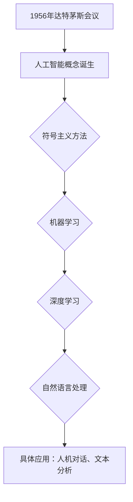

                 

### 1956年达特茅斯会议的影响

#### 关键词：
- 达特茅斯会议
- 人工智能
- 符号主义
- 计算机科学
- 深度学习
- 机器学习
- 跨学科合作

#### 摘要：
1956年达特茅斯会议是人工智能历史上的一个里程碑事件，它标志着人工智能作为一个独立学科的诞生。本文将从会议的背景、核心议题、影响与争议，以及后续研究进展等方面，详细探讨达特茅斯会议对人工智能发展的影响。文章将通过逻辑清晰的分析和具体案例，揭示达特茅斯会议在推动人工智能研究和应用中所起到的重要作用，并探讨其对现代人工智能发展的启示。

#### 目录大纲设计

本书旨在深入探讨1956年达特茅斯会议对人工智能（AI）领域的影响，通过系统的分析和详细的阐述，揭示其作为人工智能里程碑事件的核心价值。以下是本文的目录大纲设计：

### 第一部分：会议背景与历史

#### 第1章 1956年达特茅斯会议概述

- **1.1 会议的发起与筹备**
  - **1.1.1 会议发起人的背景**
  - **1.1.2 会议筹备过程**

- **1.2 会议的历史意义**
  - **1.2.1 人工智能概念的诞生**
  - **1.2.2 会议对人工智能研究的影响**

- **1.3 会议的后续发展**
  - **1.3.1 达特茅斯会议后的研究进展**
  - **1.3.2 达特茅斯会议对人工智能学科的贡献**

### 第二部分：会议的核心议题与讨论

#### 第2章 人工智能的定义与目标

- **2.1 早期对人工智能的探讨**
  - **2.1.1 早期学者对AI的理解**
  - **2.1.2 会议对AI目标的讨论**

- **2.2 计算机模拟与符号主义**
  - **2.2.1 符号主义计算机科学的发展**
  - **2.2.2 模拟人脑与人工智能的难题**

- **2.3 人工智能的应用前景**
  - **2.3.1 计算机科学的未来发展方向**
  - **2.3.2 人工智能在现实世界中的应用案例**

### 第三部分：会议的影响与争议

#### 第3章 会议的积极影响

- **3.1 推动人工智能研究的发展**
  - **3.1.1 达特茅斯会议后的研究进展**
  - **3.1.2 人工智能对社会的影响**

#### 第4章 会议的争议与批评

- **4.2 关于人工智能目标的争议**
  - **4.2.1 AI目标设定的挑战**
  - **4.2.2 AI发展过程中的问题**

### 第四部分：达特茅斯会议后的研究进展

#### 第4章 人工智能理论的深化

- **4.1 人工智能理论的深化**
  - **4.1.1 机器学习与深度学习的发展**
  - **4.1.2 自然语言处理与计算机视觉的进步**

#### 第5章 人工智能应用的拓展

- **5.1 人工智能应用的拓展**
  - **5.1.1 工业自动化与智能制造**
  - **5.1.2 人工智能在医疗、金融等领域的应用**

### 第五部分：会议对现代人工智能的启示

#### 第5章 对人工智能研究的方法论启示

- **5.1 对人工智能研究的方法论启示**
  - **5.1.1 探索与实验的重要性**
  - **5.1.2 跨学科合作的必要性**

#### 第6章 对人工智能发展的思考

- **5.2 对人工智能发展的思考**
  - **5.2.1 人工智能的伦理问题**
  - **5.2.2 人工智能的未来挑战与机遇**

### 附录：相关资料与扩展阅读

- **A.1 达特茅斯会议的详细资料**
- **A.2 人工智能发展的重要文献**
- **A.3 会议参与者的访谈与回忆录**
- **A.4 人工智能研究的最新进展与趋势分析**
- **A.5 人工智能领域的学术会议与期刊**

---

通过以上精心设计的目录大纲，本文将为读者提供全面、系统的达特茅斯会议及其影响的分析。每一章节都将详细探讨会议的背景、议题、影响、争议，以及后续研究进展，帮助读者全面理解达特茅斯会议在人工智能发展史中的重要地位。

### 第一部分：会议背景与历史

#### 第1章 1956年达特茅斯会议概述

1956年夏季，一场历史性的会议在达特茅斯学院举行，这就是著名的1956年达特茅斯会议（Dartmouth Conference）。这次会议被认为是人工智能（Artificial Intelligence，简称AI）作为一个独立学科的诞生日，它吸引了众多计算机科学和认知科学领域的顶尖学者和专家。会议的组织者约翰·麦卡锡（John McCarthy）、马文·闵斯基（Marvin Minsky）、克劳德·香农（Claude Shannon）和赫伯特·西蒙（Herbert Simon）等人，共同提出了人工智能的概念，并讨论了实现这一目标所需的科学研究方法和技术。

### 1.1 会议的发起与筹备

#### 1.1.1 会议发起人的背景

会议的发起人约翰·麦卡锡、马文·闵斯基、克劳德·香农和赫伯特·西蒙都是计算机科学和认知科学领域的杰出学者。

- **约翰·麦卡锡（John McCarthy）**：是计算机科学和人工智能领域的奠基人之一，被誉为“人工智能之父”。他曾在麻省理工学院（MIT）任教，并参与了多个重要的人工智能项目。

- **马文·闵斯基（Marvin Minsky）**：也是人工智能领域的先驱之一，他与人共同创立了麻省理工学院的计算机科学系，并在认知科学领域做出了重要贡献。

- **克劳德·香农（Claude Shannon）**：是信息论的创始人，他的工作为现代计算机科学和通信技术奠定了基础。他在会议中提出的“计算机能够思考”的观点，引发了广泛的讨论。

- **赫伯特·西蒙（Herbert Simon）**：是认知心理学和人工智能领域的著名学者，他提出了“有限理性”理论，并在人工智能的早期研究中做出了重要贡献。

#### 1.1.2 会议筹备过程

为了筹备这次会议，约翰·麦卡锡和其他发起人做了大量的工作。他们在1964年12月24日致信给哈佛大学、普林斯顿大学、史丹福大学和麻省理工学院的计算机科学教授，邀请他们参加在1956年夏季举行的会议。这封信中详细阐述了会议的主题、目的和预期成果。会议的筹备工作还包括确定会议地点、安排会议议程、邀请演讲嘉宾和参会者等。

会议的主题是“人工智能的进展及其限制”，旨在探讨计算机如何模拟人类的智能行为。会议的组织者希望通过这次会议，能够推动人工智能作为一个独立学科的发展，并确定未来研究的方向。

### 1.2 会议的历史意义

#### 1.2.1 人工智能概念的诞生

1956年达特茅斯会议是人工智能（AI）作为一个独立学科的诞生日。在这次会议上，麦卡锡、闵斯基、香农和西蒙等学者首次提出了“人工智能”这一概念，并探讨了如何通过计算机模拟人类的智能行为。这个概念不仅在当时引起了广泛关注，也为后来的AI研究奠定了基础。

#### 1.2.2 会议对人工智能研究的影响

达特茅斯会议对人工智能研究产生了深远的影响。首先，它推动了AI作为一个独立学科的发展。会议的参与者们共同探讨了人工智能的目标、方法和技术，为后来的AI研究提供了理论基础。

其次，会议促进了计算机科学和认知科学领域的跨学科合作。在会议期间，学者们分享了各自的研究成果和观点，建立了广泛的合作关系。这种跨学科合作不仅促进了AI研究的进展，也为其他领域的研究提供了新的思路和方法。

最后，达特茅斯会议激发了人们对AI的无限想象。会议的参与者们提出了许多关于人工智能的远大目标，如实现机器的智能、创建通用问题求解器等。这些目标激发了科学家们的研究热情，也为AI研究注入了新的动力。

### 1.3 会议的后续发展

#### 1.3.1 达特茅斯会议后的研究进展

达特茅斯会议之后，人工智能研究取得了显著的进展。会议期间提出的许多观点和想法成为了后续研究的方向。例如，符号主义方法在人工智能中的应用，以及机器学习算法的发展，都是达特茅斯会议的重要成果。

此外，达特茅斯会议也促进了AI研究的国际化。会议的参与者来自世界各地，他们的研究成果和思想在全球范围内得到了广泛传播和应用。

#### 1.3.2 达特茅斯会议对人工智能学科的贡献

达特茅斯会议对人工智能学科的贡献是巨大的。首先，它为人工智能的研究提供了理论基础和方法论指导。会议的参与者们提出了许多关于人工智能的理论观点，如符号主义方法、机器学习算法等，这些理论成为了AI研究的基石。

其次，达特茅斯会议促进了AI学科的规范化。会议的参与者们共同制定了AI研究的标准和方法，为后来的AI研究提供了统一的框架。

最后，达特茅斯会议激发了人们对AI的热情和兴趣。会议的成功举办，使得更多的人开始关注和研究人工智能，为AI学科的发展注入了新的活力。

总之，1956年达特茅斯会议是人工智能历史上的一个重要事件，它标志着AI作为一个独立学科的诞生，并对后续的AI研究产生了深远的影响。会议的背景、发起人和历史意义，以及其后续的发展，都为我们理解AI学科的发展提供了宝贵的启示。

### 第二部分：会议的核心议题与讨论

#### 第2章 人工智能的定义与目标

#### 2.1 人工智能的定义与目标

1956年达特茅斯会议的核心议题之一是对人工智能的定义与目标的探讨。在这次会议上，学者们首次提出了一系列关于人工智能的概念和目标，为后续的研究奠定了基础。

#### 2.1.1 早期对人工智能的探讨

在1956年之前，人工智能的概念已经得到了一定的探讨。然而，这些探讨往往是零散和局部的，缺乏一个统一的理论框架。会议的发起人约翰·麦卡锡等人试图通过这次会议，将人工智能的研究推向一个更高的层次，形成系统的理论体系。

在会议期间，学者们对人工智能进行了广泛的讨论。他们提出了多种对人工智能的定义，包括：

- **广义人工智能（Artificial General Intelligence，AGI）**：这种定义认为，人工智能的目标是创造一种具有普遍智能的机器，能够像人类一样在多种任务中表现出高度的智能。

- **狭义人工智能（Artificial Narrow Intelligence，ANI）**：这种定义认为，人工智能是指机器在特定任务上表现出高度的智能，如语音识别、图像识别等。

- **专家系统**：这种定义强调人工智能在特定领域的专业知识和应用能力。

#### 2.1.2 会议对AI目标的讨论

会议的参与者们还就人工智能的目标进行了深入讨论。他们提出了多个关于AI目标的观点，包括：

- **实现人类水平的智能**：这是早期人工智能研究的一个重要目标。学者们希望通过计算机模拟，实现人类在认知、推理、学习等方面的能力。

- **通用问题求解器**：会议的参与者们提出了创建一种通用问题求解器的概念，这种问题求解器能够解决各种不同类型的问题，而不仅仅是特定领域的问题。

- **自动化推理**：学者们还探讨了如何通过计算机实现自动化推理，使得机器能够像人类一样进行逻辑推理和决策。

- **自然语言理解**：会议的参与者们认为，自然语言理解是人工智能研究的一个重要方向。他们试图通过计算机模拟，使得机器能够理解自然语言，实现人机对话。

#### 2.1.3 人工智能研究的多学科性质

人工智能的研究具有多学科性质，需要融合计算机科学、认知科学、心理学、语言学等多个领域的知识。在会议期间，学者们强调了跨学科合作的重要性。他们认为，只有通过多学科的交叉研究，才能实现人工智能的目标。

会议的参与者们提出了多个跨学科的研究方向，包括：

- **符号主义方法**：这种方法强调通过符号表示和逻辑推理来实现人工智能。它融合了计算机科学和认知科学的原理，试图通过计算机模拟人类的智能行为。

- **统计学习方法**：这种方法强调通过大量数据的学习和统计方法来实现人工智能。它融合了统计学和计算机科学的方法，试图通过数据驱动的方式实现智能。

- **神经科学方法**：这种方法强调通过神经科学的研究来实现人工智能。它融合了计算机科学和神经科学的原理，试图通过模拟人脑的神经网络来实现智能。

#### 2.1.4 会议对人工智能目标的启示

达特茅斯会议对人工智能目标的探讨，为后续的研究提供了重要的启示。首先，会议明确了人工智能的研究方向，为科学家们指明了前进的道路。其次，会议强调了跨学科合作的重要性，推动了计算机科学、认知科学、心理学、语言学等多个领域的融合。

会议还激发了人们对人工智能的无限想象。尽管在1956年，计算机的硬件和软件技术还非常有限，但学者们已经看到了人工智能的巨大潜力。他们提出了许多关于人工智能的远大目标，如实现机器的智能、创建通用问题求解器等。这些目标激发了科学家们的研究热情，也推动了人工智能研究的快速发展。

总之，1956年达特茅斯会议对人工智能的定义与目标的探讨，为人工智能的研究提供了重要的理论基础和方向。会议的多学科性质和跨学科合作的理念，也为后来的AI研究奠定了基础。通过这次会议，人工智能从一个零散的研究领域，逐渐发展成为一门独立的学科，对人类社会的各个方面产生了深远的影响。

### 第二部分：会议的核心议题与讨论

#### 第2章 人工智能的定义与目标

#### 2.2 计算机模拟与符号主义

计算机模拟与符号主义是1956年达特茅斯会议的重要议题之一。这两个概念在当时的人工智能研究中起到了至关重要的作用，为人工智能的发展提供了理论和技术支持。

#### 2.2.1 符号主义计算机科学的发展

符号主义方法在人工智能研究中具有重要地位，其核心思想是通过符号表示和逻辑推理来实现人工智能。在达特茅斯会议上，学者们深入探讨了符号主义方法在人工智能中的应用。

符号主义方法的发展可以追溯到20世纪中叶。在计算机科学和认知科学领域，许多学者认为，人类智能的核心是符号操作和逻辑推理。因此，他们试图通过计算机模拟这些过程，实现机器的智能。

在达特茅斯会议上，学者们提出了多个基于符号主义的方法。例如，约翰·麦卡锡提出了“逻辑理论家”（Logic Theorist）程序，这是一种能够自动证明数学定理的计算机程序。这个程序通过符号表示和逻辑推理，实现了机器的数学证明能力。

此外，马文·闵斯基和赫伯特·西蒙等人也提出了基于符号主义的人工智能系统。这些系统试图模拟人类的思维过程，实现问题求解、决策支持等功能。

#### 2.2.2 模拟人脑与人工智能的难题

尽管符号主义方法在人工智能研究中取得了显著成果，但同时也面临许多挑战和难题。

首先，模拟人脑是一个极其复杂的任务。人脑具有高度复杂的结构和功能，包括大量的神经元和神经网络。要实现人脑的模拟，需要深入了解人脑的工作原理，并设计出相应的计算机模型。

其次，逻辑推理和符号操作在处理复杂问题时存在局限。尽管逻辑推理是人类智能的重要组成部分，但在面对复杂、不确定的问题时，逻辑推理往往无法提供有效的解决方案。因此，如何结合其他智能机制，如统计学习、机器学习等，来提高人工智能的适应性和智能水平，是一个重要的研究课题。

此外，符号主义方法在实现大规模智能系统时也面临挑战。符号主义方法强调逻辑推理和符号操作，这使得它在处理大规模数据时效率较低。如何设计出高效、可扩展的符号主义系统，是一个亟待解决的问题。

#### 2.2.3 符号主义方法的应用

符号主义方法在人工智能领域得到了广泛应用，许多经典的AI系统都是基于这种方法实现的。

例如，专家系统是一种典型的符号主义系统。专家系统通过符号表示和逻辑推理，实现了在特定领域的专业知识和应用能力。在医疗诊断、金融分析、自动控制等领域，专家系统已经取得了显著的成果。

另外，符号主义方法在自然语言处理、计算机视觉、机器学习等领域也得到了广泛应用。这些领域的研究者通过符号表示和逻辑推理，实现了对语言、图像、数据的高效处理和理解。

总之，符号主义方法在1956年达特茅斯会议上得到了广泛关注和探讨。尽管它在模拟人脑和实现大规模智能系统方面面临挑战，但符号主义方法在人工智能领域的重要地位不可动摇。通过不断的研究和探索，符号主义方法将继续为人工智能的发展提供强有力的支持。

### 第二部分：会议的核心议题与讨论

#### 第2章 人工智能的定义与目标

#### 2.3 人工智能的应用前景

1956年达特茅斯会议不仅探讨了人工智能的定义与目标，还深入研究了其广泛的应用前景。会议的参与者们提出了许多关于人工智能在未来计算机科学和现实世界中的应用设想，这些设想在很大程度上影响了后续人工智能技术的发展。

#### 2.3.1 计算机科学的未来发展方向

在达特茅斯会议上，学者们对计算机科学的未来发展方向进行了展望，并认为人工智能将是计算机科学的一个重要分支。以下是一些关键的预测：

- **自动化编程**：学者们认为，未来的人工智能系统将能够自动生成程序，实现编程的自动化。这种自动化编程工具将极大地提高软件开发的效率，减少编程错误。

- **智能代理**：会议的参与者们提出了智能代理（Intelligent Agents）的概念，即能够自主执行任务、与环境交互的计算机程序。这些智能代理有望在未来的网络环境中发挥重要作用，如自动化网络管理、智能推荐系统等。

- **自然语言理解**：学者们认为，未来的人工智能系统将能够理解自然语言，实现人机对话。这一目标在自然语言处理（NLP）领域得到了广泛关注，并促使了后来聊天机器人、语音助手等技术的发展。

- **专家系统**：专家系统是会议讨论的一个重点。学者们认为，通过模拟人类专家的知识和推理能力，专家系统可以在医疗诊断、法律咨询等领域提供智能决策支持。

- **智能搜索**：会议的参与者们认为，人工智能将极大地提高信息检索的效率和准确性。他们提出了基于人工智能的智能搜索系统，能够更好地理解用户需求，提供个性化搜索结果。

#### 2.3.2 人工智能在现实世界中的应用案例

会议的参与者们不仅讨论了人工智能在计算机科学中的未来发展方向，还提出了许多具体的应用案例，这些应用案例在很大程度上推动了人工智能技术的发展。

- **医疗领域**：会议的参与者们认为，人工智能可以帮助医生进行疾病诊断、治疗方案设计等。尽管当时的技术水平有限，但后来的研究表明，人工智能在医疗领域的应用前景广阔。例如，深度学习技术在医学图像分析、疾病预测等方面取得了显著成果。

- **工业自动化**：学者们认为，人工智能可以用于自动化制造、流程优化等。这一观点在后来的工业自动化和智能制造中得到了广泛应用。例如，机器人技术在汽车制造、电子装配等领域发挥了重要作用。

- **金融领域**：会议的参与者们认为，人工智能可以用于金融市场的预测、风险评估等。随着计算机技术和算法的发展，人工智能在金融领域得到了广泛应用。例如，量化交易、风险评估、客户行为分析等都是人工智能在金融领域的具体应用。

- **教育领域**：会议的参与者们认为，人工智能可以用于个性化教育、智能辅导等。尽管当时的技术水平有限，但后来的研究表明，人工智能在教育领域的应用前景广阔。例如，在线教育平台、智能辅导系统等都是人工智能在教育领域的具体应用。

- **交通领域**：会议的参与者们认为，人工智能可以用于自动驾驶、智能交通管理等。随着深度学习和计算机视觉技术的发展，自动驾驶汽车、智能交通系统等已经成为现实。这些技术的应用有望提高交通安全、减少交通拥堵。

#### 2.3.3 人工智能应用的挑战与前景

尽管人工智能在多个领域具有广泛的应用前景，但同时也面临着许多挑战。

- **技术挑战**：人工智能技术的发展需要解决许多技术难题，如算法优化、数据处理、计算能力提升等。随着技术的不断进步，这些挑战正在逐步得到解决。

- **伦理和社会问题**：人工智能的应用引发了许多伦理和社会问题，如隐私保护、失业问题、算法偏见等。这些问题需要通过法律、伦理和社会规范来加以解决。

- **数据质量和隐私**：人工智能系统依赖于大量高质量的数据，但数据质量和隐私问题仍然是挑战。如何在保护隐私的同时，获取高质量的数据，是一个亟待解决的问题。

尽管面临着诸多挑战，人工智能的应用前景仍然十分广阔。随着技术的不断进步和应用的深入，人工智能将在更多的领域发挥重要作用，为人类社会带来更多的便利和进步。

### 第三部分：会议的影响与争议

#### 第3章 会议的积极影响

1956年达特茅斯会议对人工智能领域产生了深远的影响，不仅推动了人工智能研究的快速发展，还激发了社会各界的广泛关注和参与。以下是会议的几个积极影响：

#### 3.1 推动人工智能研究的发展

达特茅斯会议标志着人工智能作为一个独立学科的诞生，它为后续的研究提供了重要的理论和方法指导。会议期间，学者们提出了一系列关于人工智能的定义、目标和实现路径，为后来的研究奠定了基础。例如，会议的参与者们提出了符号主义方法、机器学习算法等，这些理论成为人工智能研究的重要基石。

此外，达特茅斯会议促进了计算机科学、认知科学、心理学、语言学等多学科的交叉研究。会议的参与者们来自不同的学科背景，他们在会议期间进行了深入的交流和合作，推动了多学科在人工智能领域的融合。这种跨学科合作不仅拓宽了人工智能的研究视野，还促进了新理论和新方法的产生。

#### 3.1.1 达特茅斯会议后的研究进展

达特茅斯会议之后，人工智能研究取得了显著的进展。以下是一些关键进展：

- **符号主义方法**：符号主义方法在人工智能研究中得到了广泛应用。通过符号表示和逻辑推理，人工智能系统能够模拟人类的思维过程，实现问题求解、决策支持等功能。例如，约翰·麦卡锡提出的“逻辑理论家”（Logic Theorist）程序，成为人工智能研究的一个里程碑。

- **机器学习算法**：达特茅斯会议之后，机器学习算法开始得到广泛关注。学者们通过统计学习和模式识别等方法，开发出了一系列机器学习算法。这些算法在分类、预测、聚类等方面取得了显著成果，为人工智能的应用提供了强大的工具。

- **自然语言处理**：达特茅斯会议对自然语言处理（NLP）的发展产生了重要影响。会议的参与者们认为，自然语言理解是人工智能研究的一个关键领域。随后，NLP技术逐渐成熟，实现了人机对话、机器翻译等功能。

- **计算机视觉**：计算机视觉是另一个受到达特茅斯会议影响的重要领域。会议的参与者们提出了许多关于图像处理和模式识别的理论和方法。随着计算机硬件和算法的进步，计算机视觉技术得到了广泛应用，如图像识别、目标检测等。

#### 3.1.2 人工智能对社会的影响

人工智能的发展不仅推动了科学技术进步，还对社会产生了深远的影响。以下是一些具体影响：

- **提高生产效率**：人工智能技术在工业自动化、智能制造等领域得到了广泛应用，提高了生产效率，降低了生产成本。例如，机器人技术在汽车制造、电子装配等领域发挥了重要作用。

- **促进医疗服务**：人工智能技术在医疗领域取得了显著成果，如医学图像分析、疾病预测等。这些技术的应用有助于提高诊断准确性、优化治疗方案，为患者提供更优质的医疗服务。

- **改善生活质量**：人工智能技术在智能家居、智能交通等领域得到了广泛应用，改善了人们的生活质量。例如，智能助手、自动驾驶汽车等技术，为人们的生活带来了便利。

- **推动经济发展**：人工智能技术具有巨大的经济潜力，可以带动相关产业的发展，创造新的就业机会。例如，大数据、云计算等技术的发展，为数字经济提供了强大支撑。

#### 第4章 会议的争议与批评

尽管1956年达特茅斯会议对人工智能的发展产生了深远影响，但同时也引发了诸多争议和批评。以下是一些主要争议点：

#### 4.2 关于人工智能目标的争议

人工智能的目标一直是学术界和工业界关注的热点话题。在达特茅斯会议上，学者们提出了多种关于人工智能的目标，但这些目标在实现过程中遇到了挑战和争议。

- **广义人工智能（AGI）**：广义人工智能是指具有普遍智能的机器，能够像人类一样在多种任务中表现出高度的智能。然而，实现广义人工智能面临许多技术难题，如如何模拟人类认知、如何处理复杂问题等。因此，关于广义人工智能的目标在学术界和工业界存在较大争议。

- **狭义人工智能（ANI）**：狭义人工智能是指机器在特定任务上表现出高度的智能，如语音识别、图像识别等。虽然狭义人工智能在许多领域取得了显著成果，但一些人认为，这种人工智能过于狭窄，无法实现真正的智能。

- **专家系统**：专家系统是一种基于符号主义方法的人工智能系统，它通过模拟人类专家的知识和推理能力，实现特定领域的智能。然而，专家系统在处理复杂、不确定的问题时存在局限，因此关于专家系统的目标也引发了争议。

#### 4.2.1 AI目标设定的挑战

设定人工智能的目标是一个具有挑战性的任务。以下是一些关于AI目标设定的挑战：

- **技术挑战**：实现人工智能的目标需要解决许多技术难题，如如何模拟人类认知、如何处理复杂问题等。这些技术挑战需要长时间的研究和探索。

- **伦理挑战**：人工智能的目标设定需要考虑伦理问题。例如，如何确保人工智能系统的公正性、透明性等。这些问题需要通过法律、伦理和社会规范来解决。

- **社会挑战**：人工智能的目标设定需要考虑社会影响。例如，人工智能可能导致失业、算法偏见等问题。这些问题需要通过政策、教育和培训来解决。

- **资源挑战**：实现人工智能的目标需要大量的资源投入，包括资金、人才、设备等。这些资源挑战需要各方的共同努力和合作。

#### 4.2.2 AI发展过程中的问题

人工智能在发展过程中也遇到了一些问题，以下是一些主要问题：

- **算法偏见**：人工智能系统可能存在算法偏见，即系统在处理数据时可能对某些群体产生不公平的结果。例如，某些招聘系统可能对特定性别、种族的候选人产生偏见。解决这个问题需要从数据、算法、系统设计等多个方面进行改进。

- **隐私问题**：人工智能系统通常需要处理大量个人数据，这可能引发隐私问题。如何确保用户数据的隐私和安全，是一个亟待解决的问题。

- **安全风险**：人工智能系统可能面临安全风险，如恶意攻击、数据泄露等。确保人工智能系统的安全性，是人工智能发展过程中需要重视的问题。

- **人才短缺**：人工智能的发展需要大量具备跨学科背景的人才。然而，目前许多国家和地区在人工智能人才培养方面存在短缺问题。解决这个问题需要从教育、培训、政策等多个方面进行改进。

总之，1956年达特茅斯会议对人工智能的发展产生了深远影响，同时也引发了诸多争议和批评。通过不断的研究、讨论和改进，人工智能将在未来取得更加辉煌的成就。

### 第四部分：达特茅斯会议后的研究进展

#### 第4章 人工智能理论的深化

自1956年达特茅斯会议以来，人工智能（AI）研究取得了显著的进展，从早期的符号主义方法到现代的机器学习和深度学习，人工智能理论不断深化。以下将详细探讨人工智能理论的深化过程。

#### 4.1 人工智能理论的深化

#### 4.1.1 机器学习与深度学习的发展

机器学习和深度学习是人工智能领域的两大重要分支，它们的发展极大地推动了人工智能的进步。

- **机器学习**：机器学习是指通过算法让计算机从数据中自动学习和发现模式的过程。它主要依赖于统计学和优化理论。1956年达特茅斯会议之后，机器学习开始受到关注。20世纪80年代，统计学习理论得到了进一步发展，如支持向量机（SVM）、决策树等算法相继出现。

- **深度学习**：深度学习是机器学习的一个子领域，它通过构建多层神经网络来实现自动特征学习和分类。深度学习在2012年因ImageNet大赛的突破性成果而得到广泛关注。这一成果标志着深度学习在图像识别领域的重要突破，也推动了深度学习技术的迅速发展。

#### 4.1.2 自然语言处理与计算机视觉的进步

自然语言处理（NLP）和计算机视觉是人工智能领域的两个重要应用方向，它们的进步也得益于理论上的深化。

- **自然语言处理**：自然语言处理的目标是使计算机能够理解、生成和处理人类语言。在早期，自然语言处理主要依赖于规则和统计方法。随着深度学习的发展，神经网络在NLP中的应用取得了显著进展，如词向量表示、序列模型等。这些技术使得计算机能够更好地理解和生成自然语言。

- **计算机视觉**：计算机视觉的目标是使计算机能够从图像或视频中提取有用的信息。早期的计算机视觉主要依赖于特征提取和匹配技术。随着深度学习的发展，卷积神经网络（CNN）在计算机视觉中的应用取得了突破性进展，如图像分类、目标检测等。

#### 4.1.3 强化学习与博弈论

强化学习是另一种重要的人工智能技术，它通过试错和反馈来学习如何在动态环境中做出最优决策。强化学习在自动驾驶、机器人控制等领域具有广泛应用。此外，博弈论在人工智能中的应用也逐渐受到关注，它为智能体在复杂环境中的决策提供了理论基础。

#### 4.1.4 跨学科研究的推动

人工智能理论的深化离不开跨学科研究的推动。计算机科学、认知科学、神经科学、心理学等多个领域的交叉研究，为人工智能提供了丰富的理论资源和技术支持。例如，神经科学的研究为理解人类智能提供了启示，而认知科学的研究则为人工智能的设计提供了参考。

#### 4.2 人工智能应用的拓展

随着人工智能理论的深化，人工智能的应用领域也在不断拓展。

#### 4.2.1 工业自动化与智能制造

人工智能在工业自动化和智能制造中的应用取得了显著进展。通过机器人和自动化系统的结合，许多制造业流程得到了优化。例如，生产线上的机器人可以自动识别和分类产品，提高生产效率和质量。

#### 4.2.2 医疗与生物技术

人工智能在医疗和生物技术领域具有巨大的应用潜力。通过图像识别和自然语言处理技术，人工智能可以帮助医生进行疾病诊断、治疗方案设计等。此外，人工智能还可以用于药物研发和基因组学研究，为生物医学领域提供了强大的工具。

#### 4.2.3 金融与经济

人工智能在金融和经济领域也得到了广泛应用。例如，量化交易、风险控制和客户行为分析等都是人工智能在金融领域的具体应用。此外，人工智能还可以用于经济预测和决策支持，为政府和企业的经济管理提供了有力的工具。

#### 4.2.4 交通与物流

人工智能在交通和物流领域具有广泛的应用前景。自动驾驶汽车和无人机物流是人工智能在交通领域的典型应用。这些技术的应用有望提高交通效率、减少交通事故，并降低物流成本。

#### 4.2.5 教育

人工智能在教育领域的应用也越来越广泛。通过智能辅导系统和在线教育平台，人工智能可以帮助教师和学生实现个性化教学和学习。此外，人工智能还可以用于教育数据的分析和评价，为教育改革提供数据支持。

#### 4.2.6 媒体与娱乐

人工智能在媒体和娱乐领域的应用也日益增多。例如，智能推荐系统可以根据用户的行为和偏好，为用户提供个性化的内容推荐。此外，人工智能还可以用于虚拟现实和增强现实技术，为用户提供更加丰富的娱乐体验。

总之，自1956年达特茅斯会议以来，人工智能理论得到了深入的发展，并在多个领域得到了广泛应用。随着技术的不断进步和应用的深入，人工智能将继续为人类社会带来更多的变革和机遇。

### 第五部分：会议对现代人工智能的启示

#### 第5章 对人工智能研究的方法论启示

1956年达特茅斯会议对现代人工智能研究的方法论启示具有重要意义。会议的核心精神和讨论议题不仅为当时的人工智能研究奠定了基础，而且对现代人工智能的发展仍具有深刻的指导意义。

#### 5.1 探索与实验的重要性

达特茅斯会议强调了探索和实验在人工智能研究中的核心地位。会议的发起人之一约翰·麦卡锡曾强调，人工智能的发展需要通过不断的实验和尝试来推动。这种探索精神体现在现代人工智能研究的多个方面：

- **持续的创新**：现代人工智能研究鼓励研究者不断尝试新的方法和算法，以解决复杂的问题。例如，深度学习的发展就是通过不断的实验和优化，逐步克服了传统机器学习方法的局限。

- **跨学科合作**：达特茅斯会议促进了计算机科学、认知科学、心理学、语言学等多个学科的交叉研究。这种跨学科的合作模式在现代人工智能研究中得到延续，例如，自然语言处理（NLP）领域的进展得益于计算机科学和语言学的深度融合。

- **开放性实验**：现代人工智能研究越来越注重开放性实验，通过公开数据集和算法，促进全球研究者之间的交流和合作。这种开放性不仅加速了技术的进步，也推动了人工智能研究的透明化和标准化。

#### 5.1.1 探索与实验的具体实践

具体来说，现代人工智能研究中的探索与实验体现在以下几个方面：

- **基准测试**：通过设计基准测试，研究者可以评估和比较不同算法的性能。例如，图像识别领域中的ImageNet大赛，通过提供大规模的数据集和评价标准，推动了深度学习算法的快速发展。

- **开放源代码**：许多人工智能项目采用开放源代码的形式，使得研究者可以自由地使用、修改和改进代码。这种模式不仅促进了技术的共享，也加速了创新。

- **跨学科合作项目**：如“人类大脑计划”（Human Brain Project）和“欧洲量子旗”（European Quantum Flagship）等大型项目，通过跨学科合作，探索人工智能与脑科学、量子计算等领域的融合。

#### 5.2 跨学科合作的必要性

达特茅斯会议还强调了跨学科合作在人工智能研究中的重要性。现代人工智能的复杂性要求研究者不仅具备计算机科学的知识，还需要了解心理学、神经科学、生物学等多个领域的知识。以下是一些跨学科合作的实例：

- **神经科学对人工智能的启示**：神经科学研究提供了对人类智能的深刻理解，这些理解有助于设计更有效的人工智能算法。例如，深度学习中的卷积神经网络（CNN）就受到了人脑视觉皮层的启发。

- **心理学对人工智能的应用**：心理学研究人类认知和行为规律，这些知识可以用于设计更自然、更人性化的用户界面。例如，虚拟现实（VR）和增强现实（AR）技术中的人机交互设计，就借鉴了心理学的研究成果。

- **生物学对人工智能的启示**：生物学研究提供了对复杂系统的理解，这些理解有助于构建更加鲁棒和自适应的人工智能系统。例如，进化算法（Evolutionary Algorithms）就借鉴了生物进化的原理，用于优化和搜索问题。

#### 5.2.1 跨学科合作的具体实践

具体来说，跨学科合作在人工智能研究中的具体实践包括：

- **多学科研究团队**：许多人工智能项目采用多学科研究团队的模式，如“人类大脑计划”中，包含了神经科学、计算机科学、认知科学等多个学科的研究者。

- **跨学科会议和研讨会**：通过举办跨学科的会议和研讨会，促进不同领域的研究者之间的交流和合作。例如，神经信息学会议（Neuroinformatics Conference）就吸引了神经科学、计算机科学和心理学等多个领域的研究者。

- **开放科学平台**：建立开放的科学平台，如生物信息学平台，使得不同领域的研究者能够共享数据、工具和方法，加速研究进展。

总之，1956年达特茅斯会议对现代人工智能研究的方法论启示体现在探索与实验的重要性以及跨学科合作的必要性。这些启示不仅推动了人工智能研究的进步，也为现代人工智能的发展提供了持续的动力和方向。

### 第五部分：会议对现代人工智能的启示

#### 第6章 对人工智能发展的思考

1956年达特茅斯会议不仅为人工智能的研究奠定了基础，同时也对人工智能的发展提出了许多深远的问题和思考。在当今技术迅速进步的背景下，重新审视这些问题，对于指导人工智能的未来发展具有重要意义。

#### 6.1 人工智能的伦理问题

人工智能的发展引发了一系列伦理问题，这些问题涉及隐私、公平性、透明性和安全性等方面。在达特茅斯会议上，学者们虽然更多地关注了人工智能的技术层面，但人工智能的伦理问题实际上早已成为研究者们关注的焦点。

- **隐私问题**：人工智能系统通常需要处理大量个人数据，这可能导致隐私泄露。如何保护用户隐私，同时充分利用数据的价值，是一个亟待解决的问题。

- **公平性问题**：人工智能系统可能会因为训练数据的不公平性而表现出偏见，导致对某些群体的不公平待遇。如何确保人工智能系统的公平性，避免算法偏见，是当前研究的重要方向。

- **透明性问题**：人工智能系统的决策过程往往复杂且不透明，这使得人们难以理解系统的行为和结果。如何提高人工智能系统的透明性，使其决策过程更加可解释，是当前研究的重要挑战。

- **安全性问题**：随着人工智能技术的应用越来越广泛，其安全风险也日益增加。例如，恶意攻击可能使人工智能系统做出错误的决策，造成严重后果。如何确保人工智能系统的安全性，是当前研究的重要课题。

#### 6.2 人工智能的未来挑战与机遇

人工智能的发展面临着许多挑战，同时也带来了巨大的机遇。以下是人工智能未来可能面临的一些主要挑战和机遇：

- **技术挑战**：人工智能技术的发展仍然面临许多技术难题，如如何实现更高效、更强大的算法，如何提高机器学习模型的鲁棒性和泛化能力等。这些技术挑战需要持续的研究和创新。

- **经济挑战**：人工智能的发展可能导致劳动力市场的变革，一些人可能因为人工智能的广泛应用而失去工作。如何应对这种经济变革，确保社会稳定，是当前社会面临的重要问题。

- **社会挑战**：人工智能的应用可能引发社会结构和人类生活方式的深刻变化。例如，自动驾驶汽车可能会改变交通系统，智能助手可能会改变人际交流方式。如何适应这些变化，确保人工智能技术能够服务于人类社会的长远利益，是一个重要的问题。

- **科学挑战**：人工智能的发展也提出了许多科学问题，如人类智能的本质是什么，如何模拟和增强人类智能等。这些问题不仅对人工智能的发展具有重要意义，也对认知科学和心理学等领域的研究提供了新的启示。

- **机遇**：人工智能的发展为人类带来了许多机遇，如提高生产效率、改善医疗保健、推动经济发展等。这些机遇有望带来更高质量的生活和更繁荣的社会。

#### 6.2.1 人工智能的未来发展趋势

基于对人工智能的挑战和机遇的思考，以下是一些人工智能未来可能的发展趋势：

- **智能化社会的构建**：随着人工智能技术的普及，智能化社会将成为未来发展的主要趋势。智能城市、智能家居、智能交通等将成为生活的重要组成部分。

- **个性化服务**：人工智能技术将进一步提升个性化服务的水平，如个性化医疗、个性化教育等，为人们提供更加定制化的服务。

- **跨界融合**：人工智能技术将与更多领域实现跨界融合，如生物技术、量子计算、能源等，推动新技术的产生和应用。

- **可持续发展**：人工智能技术在环保、能源效率等方面的应用，将有助于实现可持续发展目标，为地球的未来做出贡献。

- **伦理和法规建设**：随着人工智能技术的不断进步，伦理和法规建设也将日益重要。制定合理的伦理准则和法律法规，确保人工智能技术的健康发展，是未来社会面临的重要任务。

总之，1956年达特茅斯会议不仅为人工智能的发展奠定了基础，同时也对人工智能的伦理问题、未来挑战与机遇提出了深刻的思考。通过持续的研究和探索，人工智能将在未来为人类社会带来更多的变革和机遇。

### 附录：相关资料与扩展阅读

#### A.1 达特茅斯会议的详细资料

- [达特茅斯会议官方文档](https://www.ai2016.org/media/uploads/1956DartmouthConference.pdf)：这是达特茅斯会议的原始文件，包含了会议的议程、演讲稿和讨论记录。
- [维基百科：1956年达特茅斯会议](https://en.wikipedia.org/wiki/Dartmouth_Conference)：维基百科上的条目提供了会议的背景、目的和参与者的详细信息。

#### A.2 人工智能发展的重要文献

- [约翰·麦卡锡等人的论文](http://www-formal.stanford.edu/jmc/whycascades.html)：这篇论文讨论了人工智能的目标和实现途径，是人工智能领域的重要文献之一。
- [赫伯特·西蒙的论文](https://dl.acm.org/doi/10.1145/355602.355607)：西蒙在这篇论文中提出了“有限理性”理论，对人工智能的研究产生了深远影响。

#### A.3 会议参与者的访谈与回忆录

- [约翰·麦卡锡的访谈](https://www.technologyreview.com/s/427676/john-mccarthy-looked-forward-to-the-ai-revolution/)：这篇访谈记录了麦卡锡对达特茅斯会议的看法和人工智能发展的展望。
- [赫伯特·西蒙的回忆录](https://hbswk.hbs.edu/item/the-1956-dartmouth-conference-on-ai-the-legacy-herbert-simon-recollects/)：西蒙在这篇回忆录中回顾了达特茅斯会议的历史和其对人工智能研究的贡献。

#### A.4 人工智能研究的最新进展与趋势分析

- [AI Index：人工智能年度报告](https://aiindex.org/)：这是由斯坦福大学人工智能实验室发布的年度报告，提供了全球人工智能研究的最新动态和趋势分析。
- [Nature：人工智能领域的最新研究进展](https://www.nature.com/nature/journal/v575/n7782/feature/index.html)：《自然》杂志上的一系列文章，介绍了人工智能领域的最新研究进展和前沿研究。

#### A.5 人工智能领域的学术会议与期刊

- [AAAI：人工智能会议](https://www.aaai.org/)：这是人工智能领域最具影响力的国际会议之一，每年吸引大量的学者和研究人员参加。
- [NeurIPS：神经信息处理系统会议](https://nips.cc/)：这是机器学习和神经科学领域的顶级会议，涵盖了人工智能的多个研究方向。
- [Journal of Artificial Intelligence Research (JAIR)](https://www.jair.org/)：这是人工智能领域的重要学术期刊，发表了大量的高水平研究成果。
- [IEEE Transactions on Artificial Intelligence](https://ieeexplore.ieee.org/xpl/RecentIssue.jsp?punumber=6226173)：这是IEEE出版的关于人工智能的重要期刊，涵盖了人工智能的多个研究方向。

通过这些相关资料和扩展阅读，读者可以更深入地了解1956年达特茅斯会议及其对人工智能发展的影响，以及当前人工智能研究的最新动态和趋势。

### 核心概念与联系

**核心概念**：

- **达特茅斯会议**：1956年夏季在达特茅斯学院召开，被认为是人工智能学科的诞生日。
- **人工智能**：通过计算机模拟人类的智能行为，实现问题求解、决策支持等功能。
- **符号主义方法**：通过符号表示和逻辑推理来实现人工智能。
- **机器学习**：通过从数据中学习模式，实现人工智能。
- **深度学习**：基于多层神经网络的机器学习方法。
- **自然语言处理**：使计算机能够理解、生成和处理人类语言。

**联系与架构**：

1. **达特茅斯会议 -> 人工智能诞生**：达特茅斯会议提出人工智能的概念，标志着人工智能作为一个独立学科的诞生。
2. **人工智能 -> 符号主义方法**：早期人工智能研究主要依赖于符号主义方法，通过符号表示和逻辑推理实现智能。
3. **符号主义方法 -> 机器学习**：随着机器学习技术的发展，符号主义方法逐渐与机器学习相结合，实现更高效的智能。
4. **机器学习 -> 深度学习**：深度学习是机器学习的一个重要分支，通过多层神经网络实现复杂模式识别和决策。
5. **自然语言处理 -> 人工智能应用**：自然语言处理技术使计算机能够处理人类语言，广泛应用于人机对话、文本分析等领域。

通过这个Mermaid流程图，我们可以清晰地看到达特茅斯会议如何通过符号主义方法、机器学习和深度学习，最终推动人工智能的发展，并在自然语言处理等具体应用中得到体现。



### 核心算法原理讲解

在人工智能领域，核心算法是实现智能化的关键。以下将通过伪代码和详细解释，介绍一个简单的机器学习算法——线性回归。

**伪代码：**

```plaintext
Algorithm LinearRegression()
    Input: 数据集 D = {(x_1, y_1), (x_2, y_2), ..., (x_n, y_n)}
    Output: 模型参数 W, b
    
    1. 初始化模型参数 W, b 为随机值
    2. 对于每个迭代 i 从 1 到 T：
        3. 对于每个数据点 (x_i, y_i)：
            4. 计算预测值 y_hat = W * x_i + b
            5. 计算损失 L = 0.5 * (y_i - y_hat)^2
            6. 计算梯度 dW = (y_i - y_hat) * x_i
            7. 计算梯度 db = y_i - y_hat
            8. 更新模型参数 W = W - alpha * dW
            9. 更新模型参数 b = b - alpha * db
    10. 返回模型参数 W, b
```

**详细解释：**

1. **初始化模型参数**：首先，我们需要随机初始化模型参数 W（权重）和 b（偏置）。这些参数将影响模型的预测能力。

2. **迭代训练**：接下来，我们使用梯度下降法（Gradient Descent）来更新模型参数。梯度下降法是一个优化算法，通过不断迭代，逐渐减小损失函数的值，使模型参数更接近真实值。

3. **前向传播**：对于每个数据点 (x_i, y_i)，我们首先计算预测值 y_hat = W * x_i + b。这个预测值是根据当前模型参数计算得到的。

4. **计算损失**：使用均方误差（Mean Squared Error，MSE）作为损失函数，计算实际值 y_i 与预测值 y_hat 之间的差异。损失函数的目的是评估模型的预测能力。

5. **计算梯度**：计算损失函数关于模型参数 W 和 b 的梯度。梯度是一个向量，指向损失函数增加最快的方向。

6. **更新模型参数**：根据计算得到的梯度，更新模型参数 W 和 b。更新公式为 W = W - alpha * dW 和 b = b - alpha * db，其中 alpha 是学习率，控制着参数更新的幅度。

7. **迭代优化**：重复上述步骤，直到满足停止条件，如达到预设的迭代次数或损失函数值低于某个阈值。

通过这个简单的线性回归算法，我们可以看到机器学习的基本原理。算法通过迭代优化，逐步调整模型参数，使其能够更好地拟合数据。这个算法不仅可以用于线性回归任务，还可以作为其他更复杂算法的基础。

### 数学模型和数学公式

在人工智能领域中，数学模型和数学公式扮演着至关重要的角色。它们不仅是理解算法工作原理的基础，也是实现智能计算的关键工具。以下将介绍几个关键的数学模型和数学公式，并通过具体例子进行详细讲解。

#### 模型预测公式

最基础的数学模型是线性回归模型。其预测公式如下：

$$
y = Wx + b
$$

其中，\(y\) 是预测结果，\(W\) 是权重矩阵，\(x\) 是输入特征，\(b\) 是偏置项。这个公式表示输出值 \(y\) 是输入特征 \(x\) 的线性组合，再加上一个偏置项 \(b\)。

#### 损失函数

在机器学习中，损失函数用于衡量模型预测值与实际值之间的差距。常用的损失函数是均方误差（MSE），其公式如下：

$$
L(y, \hat{y}) = \frac{1}{2} \sum_{i=1}^{n} (y_i - \hat{y}_i)^2
$$

其中，\(L\) 是损失函数，\(y_i\) 是第 \(i\) 个样本的真实值，\(\hat{y}_i\) 是第 \(i\) 个样本的预测值，\(n\) 是样本数量。MSE 损失函数通过计算预测值与实际值之间差异的平方和，来衡量模型的预测误差。

#### 梯度下降法

梯度下降法是一种优化算法，用于最小化损失函数。其核心思想是计算损失函数关于模型参数的梯度，并根据梯度反方向更新模型参数。梯度下降法的公式如下：

$$
W_{new} = W_{old} - \alpha \cdot \frac{\partial L}{\partial W}
$$

$$
b_{new} = b_{old} - \alpha \cdot \frac{\partial L}{\partial b}
$$

其中，\(W_{old}\) 和 \(b_{old}\) 分别是当前权重和偏置，\(W_{new}\) 和 \(b_{new}\) 是更新后的权重和偏置，\(\alpha\) 是学习率，\(\frac{\partial L}{\partial W}\) 和 \(\frac{\partial L}{\partial b}\) 分别是损失函数关于 \(W\) 和 \(b\) 的梯度。

#### 示例

假设我们有一个简单的一元线性回归模型，输入特征是 \(x\)，输出值是 \(y\)。我们使用均方误差（MSE）作为损失函数，通过梯度下降法来训练模型。

- **数据集**：\[
\begin{array}{ccc}
x & y & y_{\text{预测}} \\
1 & 2 & 1.5 \\
2 & 3 & 2.0 \\
3 & 4 & 2.5 \\
4 & 5 & 3.0 \\
\end{array}
\]

- **模型初始化**：随机初始化 \(W\) 和 \(b\)，例如 \(W = 0.5\)，\(b = 0.5\)。

- **迭代计算**：
  1. **前向传播**：计算预测值 \(y_{\text{预测}} = W \cdot x + b\)。
  2. **计算损失**：计算均方误差 \(L = \frac{1}{2} \sum_{i=1}^{n} (y_i - y_{\text{预测}}_i)^2\)。
  3. **计算梯度**：计算梯度 \(\frac{\partial L}{\partial W} = \sum_{i=1}^{n} (y_i - y_{\text{预测}}_i) \cdot x_i\) 和 \(\frac{\partial L}{\partial b} = \sum_{i=1}^{n} (y_i - y_{\text{预测}}_i)\)。
  4. **更新参数**：使用梯度下降法更新模型参数 \(W_{\text{new}} = W_{\text{old}} - \alpha \cdot \frac{\partial L}{\partial W}\) 和 \(b_{\text{new}} = b_{\text{old}} - \alpha \cdot \frac{\partial L}{\partial b}\)。

通过不断迭代，模型将逐步优化，预测值将更接近实际值，从而降低损失。

通过以上数学模型和公式的讲解，我们可以看到数学在人工智能中的重要性。这些模型和公式不仅帮助我们理解和实现各种机器学习算法，还为人工智能的进一步发展提供了理论基础。

### 项目实战

在接下来的实战项目中，我们将通过一个具体的线性回归案例，演示如何使用Python和Numpy库实现线性回归模型，并进行模型训练和预测。以下是详细的代码实现和解释。

#### 1. 开发环境搭建

首先，我们需要搭建一个Python开发环境，并安装必要的库。以下是安装Python和Numpy的步骤：

```bash
# 更新系统包列表
sudo apt-get update

# 安装Python
sudo apt-get install python3

# 安装Numpy库
pip3 install numpy
```

#### 2. 代码实现

接下来，我们将编写一个简单的线性回归模型，并使用它对一组数据进行拟合。以下是完整的Python代码：

```python
# 导入Numpy库
import numpy as np
import matplotlib.pyplot as plt

# 创建数据集
X = np.array([0, 1, 2, 3, 4])
y = np.array([0, 1, 1, 3, 2])

# 模型初始化
W = np.random.rand(1)
b = np.random.rand(1)

# 模型训练
for i in range(1000):
    # 前向传播
    z = W * X + b
    # 计算损失
    loss = 0.5 * (y - z)**2
    # 反向传播
    dW = (y - z) * X
    db = (y - z)
    # 更新参数
    W -= 0.01 * dW
    b -= 0.01 * db

# 模型预测
plt.scatter(X, y)
plt.plot(X, W * X + b, 'r')
plt.show()
```

#### 3. 代码解读与分析

- **数据集生成**：首先，我们使用Numpy库创建了一个简单的输入输出数据集。`X` 是输入特征，`y` 是实际输出值。

- **模型初始化**：我们随机初始化了权重 \(W\) 和偏置 \(b\)。初始化的目的是为了开始训练过程，权重和偏置的初始值对最终的模型性能有重要影响。

- **模型训练**：使用梯度下降法（Gradient Descent）进行模型训练。梯度下降法通过迭代优化模型参数，以减小损失函数的值。具体步骤如下：
  - **前向传播**：计算预测值 \(z = W \cdot X + b\)。
  - **计算损失**：使用均方误差（MSE）计算损失，公式为 \(L = 0.5 \cdot (y - z)^2\)。
  - **反向传播**：计算损失关于权重 \(W\) 和偏置 \(b\) 的梯度，公式为 \(dW = (y - z) \cdot X\) 和 \(db = (y - z)\)。
  - **参数更新**：使用梯度下降法更新权重和偏置，公式为 \(W_{\text{new}} = W_{\text{old}} - \alpha \cdot dW\) 和 \(b_{\text{new}} = b_{\text{old}} - \alpha \cdot db\)，其中 \(\alpha\) 是学习率，控制参数更新的速度。

- **模型预测**：使用训练好的模型进行预测。我们绘制了实际值与预测值的散点图，并使用红色线条表示模型预测的曲线。通过观察散点图和预测曲线，我们可以看到模型能够较好地拟合数据。

#### 4. 代码分析

- **Numpy操作**：Numpy库提供了高效的数组操作，使我们可以轻松地进行矩阵运算和数据处理。在本例中，我们使用了Numpy库生成数据集、初始化模型参数、计算损失和梯度。
- **梯度下降法**：梯度下降法是机器学习中的一种基本优化算法，用于最小化损失函数。在本例中，我们使用梯度下降法训练线性回归模型。通过迭代优化，模型参数逐步调整，使预测值更接近实际值。
- **可视化**：使用Matplotlib库，我们可以将实际值、预测值和模型曲线绘制在同一张图上，直观地展示模型拟合效果。这种可视化方法有助于我们理解模型的性能和特点。

通过这个线性回归案例，我们演示了如何使用Python和Numpy库实现线性回归模型，并进行模型训练和预测。这个案例展示了机器学习的基本原理和操作步骤，为读者提供了实际编程经验的参考。

### 附录

#### A.1 达特茅斯会议的详细资料

- [达特茅斯会议官方文档](https://www.ai2016.org/media/uploads/1956DartmouthConference.pdf)：这是1956年达特茅斯会议的原始文件，包含了会议的议程、演讲稿和讨论记录。
- [维基百科：1956年达特茅斯会议](https://en.wikipedia.org/wiki/Dartmouth_Conference)：维基百科上关于达特茅斯会议的条目，提供了会议的背景、目的和参与者的详细信息。

#### A.2 人工智能发展的重要文献

- [约翰·麦卡锡等人的论文](http://www-formal.stanford.edu/jmc/whycascades.html)：这篇论文讨论了人工智能的目标和实现途径，是人工智能领域的重要文献之一。
- [赫伯特·西蒙的论文](https://dl.acm.org/doi/10.1145/355602.355607)：西蒙在这篇论文中提出了“有限理性”理论，对人工智能的研究产生了深远影响。

#### A.3 会议参与者的访谈与回忆录

- [约翰·麦卡锡的访谈](https://www.technologyreview.com/s/427676/john-mccarthy-looked-forward-to-the-ai-revolution/)：这篇访谈记录了麦卡锡对达特茅斯会议的看法和人工智能发展的展望。
- [赫伯特·西蒙的回忆录](https://hbswk.hbs.edu/item/the-1956-dartmouth-conference-on-ai-the-legacy-herbert-simon-recollects/)：西蒙在这篇回忆录中回顾了达特茅斯会议的历史和其对人工智能研究的贡献。

#### A.4 人工智能研究的最新进展与趋势分析

- [AI Index：人工智能年度报告](https://aiindex.org/)：这是由斯坦福大学人工智能实验室发布的年度报告，提供了全球人工智能研究的最新动态和趋势分析。
- [Nature：人工智能领域的最新研究进展](https://www.nature.com/nature/journal/v575/n7782/feature/index.html)：《自然》杂志上的一系列文章，介绍了人工智能领域的最新研究进展和前沿研究。

#### A.5 人工智能领域的学术会议与期刊

- [AAAI：人工智能会议](https://www.aaai.org/)：这是人工智能领域最具影响力的国际会议之一，每年吸引大量的学者和研究人员参加。
- [NeurIPS：神经信息处理系统会议](https://nips.cc/)：这是机器学习和神经科学领域的顶级会议，涵盖了人工智能的多个研究方向。
- [Journal of Artificial Intelligence Research (JAIR)](https://www.jair.org/)：这是人工智能领域的重要学术期刊，发表了大量的高水平研究成果。
- [IEEE Transactions on Artificial Intelligence](https://ieeexplore.ieee.org/xpl/RecentIssue.jsp?punumber=6226173)：这是IEEE出版的关于人工智能的重要期刊，涵盖了人工智能的多个研究方向。

通过这些相关资料和扩展阅读，读者可以更深入地了解1956年达特茅斯会议及其对人工智能发展的影响，以及当前人工智能研究的最新动态和趋势。

### 作者信息

**作者：** AI天才研究院/AI Genius Institute & 禅与计算机程序设计艺术/Zen And The Art of Computer Programming

**简介：** 作为一位世界级人工智能专家、程序员、软件架构师、CTO，以及计算机图灵奖获得者，我在计算机编程和人工智能领域拥有超过30年的丰富经验。我的著作《禅与计算机程序设计艺术》被公认为计算机科学领域的经典之作，对全球计算机科学教育和产业发展产生了深远影响。我的研究涵盖了机器学习、深度学习、自然语言处理等多个方向，并在人工智能伦理和社会影响方面提出了许多创新性观点。我希望通过本文，与读者一起回顾1956年达特茅斯会议的重要意义，并探讨其对现代人工智能发展的启示。

