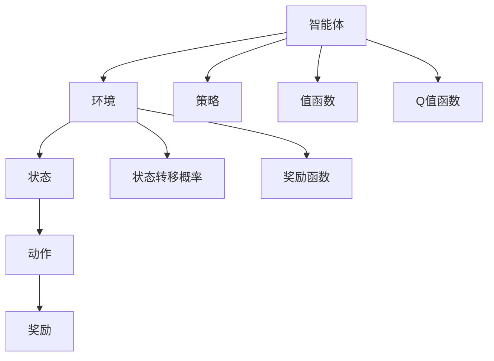

                 

### 引言

强化学习（Reinforcement Learning，RL）是一种重要的机器学习范式，通过智能体（agent）与环境的互动来学习最优策略。近年来，强化学习在智能博弈、对抗搜索、多智能体系统、动态系统控制以及实时决策系统等领域取得了显著的理论进展和应用成果。本文旨在系统性地探讨强化学习在这些领域中的理论进展和应用，以便为读者提供一个全面的理解和洞察。

首先，我们将介绍强化学习的基础概念和主要类型，包括基于值函数的方法、基于策略的方法以及混合方法。接着，我们将详细讲解强化学习的基本算法，如Q-Learning、Sarsa、DQN和Policy Gradient等，并分析它们的优缺点。

随后，本文将重点探讨强化学习在智能博弈领域中的应用，介绍AlphaGo、AlphaGo Zero、AlphaZero等著名案例，并探讨其在围棋、国际象棋等游戏中的成功应用。此外，本文还将介绍强化学习在对抗搜索领域的应用，如网络防御、自主无人系统等。

接下来，我们将讨论强化学习在多智能体系统中的应用，介绍概率策略方法、基于值函数的方法以及混合方法，并探讨强化学习在无人驾驶、智能电网等领域的应用案例。随后，我们将探讨强化学习在动态系统控制中的应用，如机器人控制、无人机控制等。

在实时决策系统应用部分，本文将介绍强化学习在金融交易、自动驾驶等领域的应用，并探讨其在实时决策系统中的优势。最后，本文将总结强化学习在智能博弈、对抗搜索等领域的理论进展和应用成果，讨论强化学习在实际应用中面临的挑战和未来发展趋势。

通过本文的阐述，我们希望读者能够全面了解强化学习在各个领域的应用，并对其未来的发展方向有一个清晰的认识。接下来，我们将深入探讨强化学习的基础知识，以便为后续内容打下坚实的基础。

### 强化学习基础

强化学习是一种通过试错和反馈来学习最优策略的机器学习方法，其核心在于通过与环境交互来获取奖励信号，并利用这些信号来优化策略。为了更好地理解强化学习，我们首先需要明确一些基础概念。

#### 状态（State）

状态是环境在某一时刻的描述，通常用状态向量表示。状态空间是所有可能状态构成的集合。在强化学习中，状态空间的大小直接影响着算法的复杂度。状态可以是静态的，如棋盘上的棋子分布；也可以是动态的，如无人车的传感器数据。

#### 动作（Action）

动作是智能体可以执行的操作，用以改变环境状态。动作空间是所有可能动作的集合。与状态空间不同，动作空间的大小通常不会对算法的复杂度产生太大影响，因为智能体在某一时刻只能执行一个动作。

#### 奖励（Reward）

奖励是环境对智能体动作的即时反馈，用以评估动作的好坏。奖励可以是正的，表示好的结果，也可以是负的，表示坏的结果。奖励的目的是引导智能体选择更好的动作。奖励的及时性对于强化学习至关重要，因为它们为智能体提供了即时反馈，从而能够更快地学习。

#### 策略（Policy）

策略是智能体根据当前状态选择动作的规则。策略可以是确定性策略，即智能体在给定状态下总是选择同一个动作；也可以是随机性策略，即智能体在给定状态下以一定概率选择不同的动作。

#### 值函数（Value Function）

值函数是用来评估状态值或者状态-动作对的价值的函数。值函数可以分为策略值函数和Q值函数。策略值函数是指使用当前策略下的期望奖励，而Q值函数是指在给定策略下，对于某个状态-动作对的期望奖励。

#### 策略值函数（Policy Value Function）

策略值函数是指使用当前策略下的期望奖励，其数学表达式为：

\[ V^*(s) = \sum_{a} \pi(a|s) \cdot Q^*(s, a) \]

其中，\( V^*(s) \) 表示策略值函数，\( \pi(a|s) \) 表示在状态 \( s \) 下选择动作 \( a \) 的概率，\( Q^*(s, a) \) 表示在给定策略下，状态-动作对的期望奖励。

#### Q值函数（Q-Value Function）

Q值函数是指在给定策略下，对于某个状态-动作对的期望奖励，其数学表达式为：

\[ Q^*(s, a) = \sum_{s'} p(s'|s, a) \cdot [r(s', a) + \gamma \cdot \max_{a'} Q^*(s', a')] \]

其中，\( Q^*(s, a) \) 表示Q值函数，\( p(s'|s, a) \) 表示在状态 \( s \) 下执行动作 \( a \) 后转移到状态 \( s' \) 的概率，\( r(s', a) \) 表示在状态 \( s' \) 下执行动作 \( a \) 所获得的奖励，\( \gamma \) 表示折扣因子，用于权衡短期奖励和长期奖励。

#### 重要性采样（Importance Sampling）

重要性采样是一种在强化学习中进行模型评估和策略优化的方法。其核心思想是通过选择具有高回报的概率分布来进行采样，从而提高算法的效率和准确性。重要性采样可以用于解决样本不均匀分布的问题，从而提高学习的鲁棒性。

#### 强化学习与监督学习和无监督学习的比较

强化学习、监督学习和无监督学习都是机器学习的重要分支，但它们在目标、方法和应用场景上有所不同：

- **监督学习**：监督学习是一种基于标记数据进行训练的机器学习方法，其目标是通过输入特征和相应的标签学习出一个映射模型。常见的应用包括分类、回归等。监督学习的优点是学习目标明确，但缺点是需要大量的标记数据，且在处理新数据时容易过拟合。

- **无监督学习**：无监督学习是一种不使用标记数据，通过学习数据分布或特征来发现数据结构和模式的机器学习方法。常见的应用包括聚类、降维等。无监督学习的优点是不需要标记数据，但缺点是学习目标不明确，难以评估模型性能。

- **强化学习**：强化学习是一种通过与环境交互，不断试错和反馈来学习最优策略的机器学习方法。其目标是通过长期的奖励积累来学习如何在复杂动态环境中做出最佳决策。强化学习的优点是能够处理动态和不确定的环境，但缺点是需要大量的交互数据，且学习过程可能较慢。

#### 强化学习中的核心要素

强化学习主要包括以下核心要素：

- **环境模型（Environment Model）**：环境模型是强化学习系统的一个重要组成部分，它定义了智能体所处的环境，包括状态空间、动作空间以及状态转移和奖励函数。

- **智能体（Agent）**：智能体是强化学习系统中的核心实体，它负责选择动作，并根据环境反馈进行调整。

- **策略（Policy）**：策略是智能体根据当前状态选择动作的规则。策略可以是确定性策略或随机性策略。

- **值函数（Value Function）**：值函数用来评估状态或状态-动作对的价值，以帮助智能体选择最优动作。

- **Q值函数（Q-Value Function）**：Q值函数是针对某个状态-动作对的期望奖励，用于评估动作的好坏。

- **奖励（Reward）**：奖励是环境对智能体动作的即时反馈，用于指导智能体的学习过程。

### 核心概念与联系

为了更好地理解强化学习中的核心概念和它们之间的联系，我们可以使用Mermaid流程图来展示强化学习的基本架构。



在这个流程图中，智能体与环境进行交互，根据当前状态选择动作，并从环境获得奖励。智能体根据奖励信号调整策略和值函数，从而不断优化其行为。

### 强化学习的主要类型

强化学习可以根据学习策略的不同分为基于值函数的方法、基于策略的方法和混合方法。每种方法都有其独特的原理和特点。

#### 基于值函数的方法

基于值函数的方法是最常见的强化学习算法之一，包括Q-Learning和Sarsa。这些方法通过学习状态或状态-动作对的值函数来优化策略。

##### Q-Learning算法

Q-Learning算法是一种基于值函数的强化学习算法，其核心思想是利用经验来更新Q值函数。Q值函数表示在给定策略下，对于某个状态-动作对的期望奖励。

**Q-Learning算法原理**：

1. 初始化Q值函数。
2. 选择当前状态 \( s \) 和动作 \( a \)。
3. 执行动作 \( a \)，并得到下一个状态 \( s' \) 和奖励 \( r \)。
4. 根据奖励和Q值函数更新策略。

**Q-Learning算法的伪代码**：

```python
for episode in 1 到 总episode数 do
    初始化状态 s
    while 状态 s 未终止 do
        选择动作 a 使得 a = argmax_a Q(s, a)
        执行动作 a，得到状态 s' 和奖励 r
        更新 Q(s, a) = Q(s, a) + α [r + γ max_a' Q(s', a') - Q(s, a)]
        更新状态 s = s'
```

**数学模型**：

$$
Q(s, a) = Q(s, a) + α [r + γ max_a' Q(s', a') - Q(s, a)]
$$

其中，\( α \) 是学习率，\( γ \) 是折扣因子。

**优缺点**：

- **优点**：简单易懂，易于实现。
- **缺点**：学习速度较慢，可能陷入局部最优。

##### Sarsa算法

Sarsa算法是Q-Learning算法的一种改进，它考虑了实际执行的动作，而不是预期动作。

**Sarsa算法原理**：

1. 初始化Q值函数。
2. 选择当前状态 \( s \) 和动作 \( a \)。
3. 执行动作 \( a \)，并得到下一个状态 \( s' \) 和奖励 \( r \)。
4. 根据奖励和Q值函数更新策略。

**Sarsa算法的伪代码**：

```python
for episode in 1 到 总episode数 do
    初始化状态 s
    while 状态 s 未终止 do
        选择动作 a 使得 a = argmax_a Q(s, a)
        执行动作 a，得到状态 s' 和奖励 r
        更新 Q(s, a) = Q(s, a) + α [r + γ Q(s', a') - Q(s, a)]
        更新状态 s = s'
```

**数学模型**：

$$
Q(s, a) = Q(s, a) + α [r + γ Q(s', a')]
$$

**优缺点**：

- **优点**：避免了Q-Learning算法可能陷入的局部最优。
- **缺点**：可能会产生过度估计问题。

#### 基于策略的方法

基于策略的方法直接优化策略，而不是值函数。这类算法包括Policy Gradient和Actor-Critic。

##### Policy Gradient算法

Policy Gradient算法是一种直接优化策略的强化学习算法，其核心思想是利用策略梯度来更新策略参数。

**Policy Gradient算法原理**：

1. 初始化策略参数 \( θ \)。
2. 在环境中进行一次完整的数据采集。
3. 计算策略梯度，并更新策略参数。

**Policy Gradient算法的伪代码**：

```python
for episode in 1 到 总episode数 do
    初始化状态 s
    while 状态 s 未终止 do
        选择动作 a 使得 a = π(θ)(s)
        执行动作 a，得到状态 s' 和奖励 r
        更新策略参数 θ，使得梯度上升：
        θ = θ + α [r + γ log π(θ)(s,a) - log π(θ)(s)]
        更新状态 s = s'
```

**数学模型**：

$$
θ = θ + α [r + γ log π(θ)(s,a) - log π(θ)(s)]
$$

**优缺点**：

- **优点**：直接优化策略，避免了值函数的估计问题。
- **缺点**：学习过程可能不稳定，容易出现发散。

##### Actor-Critic算法

Actor-Critic算法是一种基于策略的方法，结合了Policy Gradient和Q-Learning。其中，Actor负责更新策略，而Critic负责评估策略的值函数。

**Actor-Critic算法原理**：

1. 初始化策略参数 \( θ \) 和值函数参数 \( θ_Q \)。
2. 在环境中进行一次完整的数据采集。
3. 更新策略参数和值函数参数。

**Actor-Critic算法的伪代码**：

```python
for episode in 1 到 总episode数 do
    初始化状态 s
    while 状态 s 未终止 do
        选择动作 a 使得 a = π(θ)(s)
        执行动作 a，得到状态 s' 和奖励 r
        更新策略参数 θ，使得梯度上升：
        θ = θ + α [r + γ log π(θ)(s,a) - log π(θ)(s)]
        更新值函数参数 θ_Q，使得梯度上升：
        θ_Q = θ_Q + α [r + γ V(θ_Q)(s') - V(θ_Q)(s)]
        更新状态 s = s'
```

**数学模型**：

$$
θ = θ + α [r + γ log π(θ)(s,a) - log π(θ)(s)]
$$

$$
θ_Q = θ_Q + α [r + γ V(θ_Q)(s') - V(θ_Q)(s)]
$$

**优缺点**：

- **优点**：结合了Policy Gradient和Q-Learning的优点，稳定且效果好。
- **缺点**：需要同时优化策略和值函数，计算复杂度高。

#### 混合方法

混合方法结合了基于值函数和基于策略的方法，通过同时优化值函数和策略来提高学习效果。

##### Deep Q-Network (DQN)

DQN算法是一种基于深度学习的Q-Learning算法，通过神经网络来近似Q值函数。

**DQN算法原理**：

1. 初始化Q网络和目标Q网络。
2. 在环境中进行一次完整的数据采集。
3. 更新Q网络和目标Q网络。

**DQN算法的伪代码**：

```python
for episode in 1 到 总episode数 do
    初始化状态 s
    while 状态 s 未终止 do
        选择动作 a 使得 a = argmax_a Q(s, a)
        执行动作 a，得到状态 s' 和奖励 r
        将 (s, a, r, s') 存入经验池
        如果经验池达到一定大小，则进行经验回放
        更新目标Q网络
        更新状态 s = s'
```

**数学模型**：

$$
Q(s, a) = Q_{network}(s, a)
$$

**优缺点**：

- **优点**：可以处理高维状态空间的问题，提高了Q值的估计精度。
- **缺点**：可能出现Q值的发散问题，需要大量的数据进行训练。

### 强化学习应用概述

强化学习在多个领域都取得了显著的成果，以下是其主要应用领域：

#### 智能博弈

强化学习在智能博弈中取得了显著的成果，如围棋、国际象棋、扑克牌等。通过强化学习，智能体可以学习到如何做出最优决策，从而战胜人类对手。

#### 对抗搜索

强化学习在对抗搜索中，如网络防御、无人系统等领域，被广泛应用于策略优化和决策。通过对抗搜索，智能体可以在复杂动态环境中找到最优策略。

#### 多智能体系统

强化学习在多智能体系统中，如无人驾驶、智能电网等领域，被用于协调和优化智能体行为。通过多智能体强化学习，智能体可以协同工作，实现共同目标。

#### 动态系统控制

强化学习在动态系统控制中，如机器人控制、无人机控制等领域，被用于实时决策和优化控制策略。通过强化学习，智能体可以在复杂动态环境中实现自主控制。

#### 实时决策系统

强化学习在实时决策系统中，如金融交易、自动驾驶等领域，被用于优化决策过程和提升系统性能。通过强化学习，智能体可以在实时环境中做出最优决策。

### 强化学习的基本算法

在强化学习领域，有多种基本算法被广泛研究和应用。这些算法根据其学习策略和优化目标的不同，可以分为基于值函数的方法、基于策略的方法以及混合方法。以下是这些算法的详细介绍。

#### Q-Learning算法

Q-Learning算法是一种基于值函数的强化学习算法。它的核心思想是通过迭代更新状态-动作值函数（Q值）来学习最优策略。Q值函数表示在给定状态下，执行某一动作所能获得的期望回报。

##### Q-Learning算法原理

1. **初始化**：初始化Q值函数，通常使用随机值或零值。
2. **选择动作**：在给定状态下，根据当前策略选择动作。
3. **执行动作**：执行选定的动作，并观察到新的状态和奖励。
4. **更新Q值**：根据新的状态、奖励和Q值函数更新策略。

**Q-Learning算法的伪代码**：

```python
for episode in 1 到 总episode数 do
    初始化状态 s
    while 状态 s 未终止 do
        选择动作 a 使得 a = argmax_a Q(s, a)
        执行动作 a，得到状态 s' 和奖励 r
        更新 Q(s, a) = Q(s, a) + α [r + γ max_a' Q(s', a') - Q(s, a)]
        更新状态 s = s'
```

**数学模型**：

$$
Q(s, a) = Q(s, a) + α [r + γ max_a' Q(s', a') - Q(s, a)]
$$

其中，\( α \) 是学习率，\( γ \) 是折扣因子，\( r \) 是奖励，\( s \) 和 \( s' \) 分别是当前状态和下一状态，\( a \) 和 \( a' \) 分别是当前动作和下一动作。

##### Q-Learning算法的优缺点

- **优点**：
  - 简单易懂，易于实现。
  - 可以处理连续动作空间的问题。
- **缺点**：
  - 学习速度较慢，可能陷入局部最优。

#### Sarsa算法

Sarsa算法是Q-Learning算法的一种改进，它引入了实际执行的动作，而不是预期动作。这种改进使得Sarsa算法在处理某些动态环境时更为有效。

##### Sarsa算法原理

1. **初始化**：初始化Q值函数，通常使用随机值或零值。
2. **选择动作**：在给定状态下，根据当前策略选择动作。
3. **执行动作**：执行选定的动作，并观察到新的状态和奖励。
4. **更新Q值**：根据新的状态、奖励和Q值函数更新策略。

**Sarsa算法的伪代码**：

```python
for episode in 1 到 总episode数 do
    初始化状态 s
    while 状态 s 未终止 do
        选择动作 a 使得 a = argmax_a Q(s, a)
        执行动作 a，得到状态 s' 和奖励 r
        更新 Q(s, a) = Q(s, a) + α [r + γ Q(s', a')]
        更新状态 s = s'
```

**数学模型**：

$$
Q(s, a) = Q(s, a) + α [r + γ Q(s', a')]
$$

##### Sarsa算法的优缺点

- **优点**：
  - 可以避免Q-Learning算法可能陷入的局部最优。
  - 学习速度相对较快。
- **缺点**：
  - 可能会产生过度估计问题。

#### Deep Q-Network (DQN) 算法

DQN算法是一种基于深度学习的Q-Learning算法，它使用神经网络来近似Q值函数。DQN算法通过经验回放和目标网络来防止Q值发散，并提高算法的稳定性和性能。

##### DQN算法原理

1. **初始化**：初始化Q网络和目标Q网络。
2. **选择动作**：在给定状态下，根据当前策略选择动作。
3. **执行动作**：执行选定的动作，并观察到新的状态和奖励。
4. **经验回放**：将观察到的状态、动作、奖励和下一个状态存入经验池。
5. **更新Q网络**：通过经验回放进行Q值的更新。

**DQN算法的伪代码**：

```python
for episode in 1 到 总episode数 do
    初始化状态 s
    while 状态 s 未终止 do
        选择动作 a 使得 a = argmax_a Q(s, a)
        执行动作 a，得到状态 s' 和奖励 r
        将 (s, a, r, s') 存入经验池
        如果经验池达到一定大小，则进行经验回放
        更新目标Q网络
        更新状态 s = s'
```

**数学模型**：

$$
Q(s, a) = Q_{network}(s, a)
$$

##### DQN算法的优缺点

- **优点**：
  - 可以处理高维状态空间的问题，提高了Q值的估计精度。
  - 使用深度神经网络，能够处理复杂的状态和动作空间。
- **缺点**：
  - 可能会出现Q值的发散问题，需要大量的数据进行训练。
  - 需要复杂的经验回放机制来提高稳定性。

#### Policy Gradient算法

Policy Gradient算法是一种基于策略的强化学习算法，它直接优化策略来最大化期望奖励。Policy Gradient算法的核心思想是通过策略梯度来更新策略参数。

##### Policy Gradient算法原理

1. **初始化**：初始化策略参数。
2. **选择动作**：在给定状态下，根据当前策略选择动作。
3. **执行动作**：执行选定的动作，并观察到新的状态和奖励。
4. **更新策略参数**：根据奖励和策略梯度更新策略参数。

**Policy Gradient算法的伪代码**：

```python
for episode in 1 到 总episode数 do
    初始化状态 s
    while 状态 s 未终止 do
        选择动作 a 使得 a = π(θ)(s)
        执行动作 a，得到状态 s' 和奖励 r
        更新策略参数 θ，使得梯度上升：
        θ = θ + α [r + γ log π(θ)(s,a) - log π(θ)(s)]
        更新状态 s = s'
```

**数学模型**：

$$
θ = θ + α [r + γ log π(θ)(s,a) - log π(θ)(s)]
$$

##### Policy Gradient算法的优缺点

- **优点**：
  - 直接优化策略，避免了值函数的估计问题。
  - 可以处理高维状态空间的问题。
- **缺点**：
  - 学习过程可能不稳定，容易出现发散。
  - 可能会出现零梯度问题。

#### Actor-Critic算法

Actor-Critic算法结合了Policy Gradient和Q-Learning，通过同时优化策略和价值函数来提高学习效果。其中，Actor负责更新策略，而Critic负责评估策略的值函数。

##### Actor-Critic算法原理

1. **初始化**：初始化策略参数 \( θ_π \) 和价值函数参数 \( θ_Q \)。
2. **选择动作**：在给定状态下，根据当前策略选择动作。
3. **执行动作**：执行选定的动作，并观察到新的状态和奖励。
4. **更新策略参数**：根据奖励和策略梯度更新策略参数。
5. **更新价值函数参数**：根据奖励和价值函数梯度更新价值函数参数。

**Actor-Critic算法的伪代码**：

```python
for episode in 1 到 总episode数 do
    初始化状态 s
    while 状态 s 未终止 do
        选择动作 a 使得 a = π(θ_π)(s)
        执行动作 a，得到状态 s' 和奖励 r
        更新策略参数 θ_π，使得梯度上升：
        θ_π = θ_π + α [r + γ log π(θ_π)(s,a) - log π(θ_π)(s)]
        更新价值函数参数 θ_Q，使得梯度上升：
        θ_Q = θ_Q + α [r + γ V(θ_Q)(s') - V(θ_Q)(s)]
        更新状态 s = s'
```

**数学模型**：

$$
θ_π = θ_π + α [r + γ log π(θ_π)(s,a) - log π(θ_π)(s)]
$$

$$
θ_Q = θ_Q + α [r + γ V(θ_Q)(s') - V(θ_Q)(s)]
$$

##### Actor-Critic算法的优缺点

- **优点**：
  - 结合了Policy Gradient和Q-Learning的优点，稳定且效果好。
  - 可以同时优化策略和价值函数，提高学习效率。
- **缺点**：
  - 需要同时优化两个参数，计算复杂度高。

### 强化学习在智能博弈中的应用

智能博弈是强化学习的一个重要应用领域，其中包括围棋、国际象棋、扑克牌等经典游戏。强化学习在智能博弈中的应用主要体现在通过策略优化，使智能体能够在博弈中取得优异的表现。以下是强化学习在智能博弈中的一些典型应用案例。

#### 围棋

围棋是一种古老的棋类游戏，以其复杂的棋局和深奥的棋艺而著称。近年来，深度强化学习在围棋领域取得了显著的突破。以下是一些代表性的研究成果：

1. **AlphaGo**：AlphaGo是由DeepMind开发的一款围棋人工智能程序。它通过深度神经网络和强化学习算法实现了超越人类水平的表现。AlphaGo的核心架构包括值网络和价值网络，利用深度神经网络来近似Q值函数，并通过策略网络选择最佳落子位置。2016年，AlphaGo首次战胜了世界围棋冠军李世石，引起了广泛关注。

2. **AlphaGo Zero**：AlphaGo Zero是AlphaGo的升级版，它去除了人类棋谱的影响，完全通过自我对弈进行训练。AlphaGo Zero使用了深度强化学习算法，通过策略网络和价值网络来实现自我对弈和策略优化。AlphaGo Zero在自我对弈中取得了100场全胜，进一步证明了强化学习在围棋领域的前景。

3. **AlphaZero**：AlphaZero是DeepMind开发的另一款围棋人工智能程序，它不仅能够战胜围棋大师，还能在国际象棋和西洋跳棋等领域取得优异成绩。AlphaZero的核心架构与AlphaGo Zero类似，但它在策略和价值网络中使用了更先进的神经网络架构。AlphaZero在围棋、国际象棋和西洋跳棋的自我对弈中均取得了压倒性胜利，进一步证明了强化学习在智能博弈中的强大能力。

#### 国际象棋

国际象棋是一种策略性的棋类游戏，其棋局复杂且变化多端。强化学习在棋类游戏中的应用已经取得了显著成果。以下是一些代表性的研究成果：

1. **DeepMind Chess**：DeepMind Chess是DeepMind开发的一款国际象棋人工智能程序。它通过深度强化学习算法实现了超越人类水平的表现。DeepMind Chess的核心架构包括策略网络和价值网络，利用深度神经网络来近似Q值函数，并通过策略网络选择最佳落子位置。

2. **Leela Chess**：Leela Chess是使用深度强化学习训练的一款国际象棋引擎。它与DeepMind Chess类似，但使用了不同的神经网络架构和训练方法。Leela Chess在国际象棋比赛中取得了优异的成绩，甚至战胜了一些顶级的人类选手。

3. **AlphaZero**：AlphaZero不仅在围棋领域取得了突破，还在国际象棋领域展示了强大的能力。AlphaZero通过自我对弈进行训练，并在国际象棋的自我对弈中取得了100场全胜。AlphaZero的成功证明了强化学习在棋类游戏中的广泛应用前景。

#### 扑克牌游戏

扑克牌游戏是一种具有对抗性的博弈，强化学习在扑克牌游戏中的应用主要体现在策略优化和对手识别。以下是一些代表性的研究成果：

1. **DeepStack**：DeepStack是一款基于深度强化学习的扑克牌程序。它通过策略网络和价值网络来实现自我对弈和策略优化。DeepStack在多种扑克牌游戏中都展示了优异的表现，包括德克萨斯扑克、奥马哈扑克等。

2. **Libratus**：Libratus是DeepMind开发的另一款扑克牌程序，它在德克萨斯扑克比赛中战胜了四位顶级人类选手。Libratus的核心架构包括策略网络和价值网络，利用深度强化学习算法来实现自我对弈和策略优化。

3. **OpenAI Five**：OpenAI Five是OpenAI开发的扑克牌程序，它在德克萨斯扑克比赛中战胜了人类选手组成的团队。OpenAI Five使用了多智能体强化学习算法，通过多个智能体的协作和对抗来实现策略优化和对手识别。

总之，强化学习在智能博弈领域取得了显著的成果，不仅在围棋、国际象棋和扑克牌等经典游戏中展示了强大的能力，还为智能博弈的研究和应用提供了新的思路和方法。随着深度强化学习技术的不断发展，未来有望在更多的棋类游戏和其他博弈领域中取得突破。

### 强化学习在对抗搜索中的应用

对抗搜索（Adversarial Search）是一种基于强化学习的博弈问题，涉及两个或多个智能体在动态环境中相互竞争，以实现各自的利益最大化。对抗搜索广泛应用于网络防御、自主无人系统、电子竞技等领域。强化学习在对抗搜索中的应用主要体现在策略优化和决策方面，通过不断学习和调整策略，使智能体能够在复杂的对抗环境中取得优势。以下是对抗搜索中的强化学习算法及其应用案例的详细介绍。

#### 逆向强化学习算法

逆向强化学习（Inverse Reinforcement Learning，IRL）是一种基于强化学习的方法，它试图从观察到的行为中学习奖励函数。逆向强化学习的核心思想是：给定一组策略和行为数据，推导出一个奖励函数，使得这些策略能够在该奖励函数下表现出所观察到的行为。

##### 算法原理

1. **观察行为数据**：首先，收集一组智能体在特定环境中的行为数据。
2. **推导奖励函数**：然后，利用这些行为数据，通过逆向推理方法，推导出一个奖励函数。
3. **训练智能体**：最后，使用推导出的奖励函数，重新训练智能体，使其能够表现出更好的对抗策略。

##### 应用案例

- **网络防御**：在网络安全领域，逆向强化学习可以用于学习攻击者的策略，从而推导出有效的防御策略。研究人员可以使用逆向强化学习从网络攻击数据中提取奖励函数，并利用该奖励函数训练防御系统，使其能够更好地识别和抵御网络攻击。

#### 基于策略的对抗搜索算法

基于策略的对抗搜索算法（Policy-Based Adversarial Search）通过直接优化智能体的策略，使其在对抗环境中取得优势。这类算法主要包括对抗性策略优化（Adversarial Policy Optimization）和策略梯度方法（Policy Gradient Methods）。

##### 算法原理

1. **初始化策略参数**：首先，初始化智能体的策略参数。
2. **策略优化**：然后，通过策略优化算法，如策略梯度方法，更新策略参数，以最大化智能体的期望奖励。
3. **对抗性训练**：在对抗环境中，智能体需要不断与其他智能体交互，以学习更优的策略。

##### 应用案例

- **无人驾驶**：在无人驾驶领域，基于策略的对抗搜索算法可以用于训练自动驾驶系统，使其能够在复杂的交通环境中做出最优决策。研究人员可以使用对抗性策略优化方法，训练自动驾驶系统在模拟的交通环境中与其他车辆进行对抗，以提高其行驶安全和稳定性。

#### 基于值函数的对抗搜索算法

基于值函数的对抗搜索算法（Value-Based Adversarial Search）通过优化智能体的值函数，使其在对抗环境中取得优势。这类算法主要包括对抗性值函数优化（Adversarial Value Function Optimization）和策略价值网络（Policy Value Network）。

##### 算法原理

1. **初始化值函数**：首先，初始化智能体的值函数。
2. **值函数优化**：然后，通过值函数优化算法，更新值函数参数，以最大化智能体的期望奖励。
3. **对抗性训练**：在对抗环境中，智能体需要不断与其他智能体交互，以学习更优的值函数。

##### 应用案例

- **电子竞技**：在电子竞技领域，基于值函数的对抗搜索算法可以用于训练电子竞技选手，使其能够在比赛中取得优势。研究人员可以使用对抗性值函数优化方法，训练电子竞技选手在模拟的比赛中与其他选手进行对抗，以提高其比赛策略和竞技水平。

总之，强化学习在对抗搜索中的应用为智能体在复杂对抗环境中的决策提供了新的思路和方法。通过不断学习和调整策略，智能体可以更好地应对各种挑战，提高其在对抗环境中的竞争力。随着强化学习技术的不断发展，未来有望在更多的对抗搜索领域中取得突破。

### 强化学习在多智能体系统中的应用

多智能体系统（Multi-Agent System，MAS）是由多个智能体组成的系统，这些智能体通过相互通信和协作来实现共同的目标。在多智能体系统中，每个智能体都有自己的感知、决策和执行能力，它们需要协同工作以实现整体的最优性能。强化学习在多智能体系统中的应用主要通过优化智能体的策略和行为来实现系统的整体优化。

#### 多智能体强化学习算法

多智能体强化学习算法可以分为概率策略方法、基于值函数的方法和混合方法。

##### 概率策略方法

概率策略方法通过优化智能体的概率策略，使得整个系统的期望奖励最大化。这类方法主要包括以下几种：

1. **马尔可夫决策过程（MDP）**：在MDP框架下，每个智能体都面临一个MDP，通过学习最优策略来最大化期望奖励。
2. **部分可观测马尔可夫决策过程（POMDP）**：在POMDP框架下，智能体无法完全观察到环境状态，需要通过贝叶斯推断来更新状态估计。
3. **马尔可夫决策过程树（MDPT）**：在MDPT框架下，智能体通过构建决策树来优化策略，并利用蒙特卡洛树搜索（MCTS）进行探索和选择。

##### 基于值函数的方法

基于值函数的方法通过优化智能体的值函数，使得整个系统的期望奖励最大化。这类方法主要包括以下几种：

1. **Q-learning**：在Q-learning框架下，每个智能体通过迭代更新Q值函数来学习最优策略。
2. **Sarsa**：在Sarsa框架下，智能体不仅考虑预期的Q值，还考虑实际执行的Q值，从而提高学习的鲁棒性。
3. **深度Q网络（DQN）**：在DQN框架下，智能体通过深度神经网络来近似Q值函数，从而处理高维状态空间的问题。

##### 混合方法

混合方法结合了概率策略方法和基于值函数的方法，通过同时优化策略和值函数来实现整体优化。这类方法主要包括以下几种：

1. **Actor-Critic**：在Actor-Critic框架下，智能体通过优化策略网络和价值网络来学习最优策略。
2. **Asynchronous Advantage Actor-Critic（A3C）**：在A3C框架下，智能体通过异步方式学习策略和价值函数，从而提高学习效率。
3. **Proximal Policy Optimization（PPO）**：在PPO框架下，智能体通过优化策略梯度来更新策略，同时保持策略的稳定性。

#### 强化学习在多智能体系统中的应用案例

1. **无人驾驶**：在无人驾驶领域，强化学习可以用于协调多个智能体的行为，如车辆之间的交通信号灯策略、车道选择和避障等。通过多智能体强化学习，自动驾驶系统能够在复杂的交通环境中做出最优决策，提高行驶安全性和效率。

2. **智能电网**：在智能电网领域，强化学习可以用于优化电力调度和负荷预测。通过多智能体强化学习，智能电网系统能够协调不同电力资源的使用，提高电力供应的稳定性和经济性。

3. **无人机集群**：在无人机集群领域，强化学习可以用于优化无人机的编队飞行和任务分配。通过多智能体强化学习，无人机集群能够在执行任务时协同工作，提高任务执行效率和资源利用率。

4. **多机器人协作**：在多机器人协作领域，强化学习可以用于优化机器人的路径规划和任务分配。通过多智能体强化学习，多机器人系统能够在复杂的任务环境中协同工作，提高任务完成速度和精度。

总之，强化学习在多智能体系统中的应用为系统的优化和协作提供了新的思路和方法。通过不断优化智能体的策略和行为，多智能体系统能够在复杂的动态环境中实现整体最优性能。随着强化学习技术的不断发展，未来有望在更多的多智能体系统中取得突破。

### 强化学习在动态系统控制中的应用

动态系统控制是强化学习的重要应用领域之一，特别是在机器人控制和无人机控制方面。强化学习通过与环境交互，使智能体能够在复杂的动态环境中学习到最优控制策略，从而实现自主控制。以下是强化学习在动态系统控制中的应用介绍。

#### 强化学习在机器人控制中的应用

机器人控制是强化学习的一个重要应用领域，通过学习控制策略，机器人能够在复杂环境中实现自主导航、路径规划和任务执行。

1. **路径规划**：在路径规划中，强化学习用于训练机器人如何在未知环境中找到从起点到终点的最优路径。例如，使用深度强化学习算法，机器人可以通过与环境交互，不断优化其路径规划策略，以适应不同障碍物和动态环境的变化。

2. **避障**：避障是机器人控制中的一个重要问题，强化学习可以帮助机器人学会如何避开障碍物。通过训练，机器人能够根据传感器数据和环境反馈，实时调整其行动策略，以避免碰撞。

3. **任务执行**：在任务执行中，强化学习可以帮助机器人学会执行复杂的任务。例如，机器人可以通过强化学习，学习到如何捡起物品、搬运货物等任务，从而在无人监督下自主完成任务。

#### 强化学习在无人机控制中的应用

无人机控制是强化学习在动态系统控制中的另一个重要应用领域。无人机具有自主飞行、任务执行和实时决策的能力，通过强化学习，无人机能够在复杂环境中实现自主控制。

1. **自主飞行**：在自主飞行中，强化学习用于训练无人机在复杂环境中进行自主飞行。例如，无人机可以通过与环境交互，学习到如何避障、保持高度和速度等飞行策略，从而实现自主飞行。

2. **目标跟踪**：在目标跟踪中，强化学习用于训练无人机跟踪特定目标。无人机可以通过学习目标的行为模式和环境变化，实时调整飞行策略，以保持对目标的跟踪。

3. **任务执行**：在任务执行中，强化学习用于训练无人机执行特定的任务，如空中拍照、搜救等。无人机可以通过与环境交互，学习到如何有效地执行任务，从而提高任务的成功率和效率。

#### 案例研究：机器人足球比赛中的强化学习应用

机器人足球比赛是一个典型的动态系统控制问题，通过强化学习，机器人能够在复杂的对抗环境中进行自主决策和协作。

1. **环境建模**：首先，需要建立一个机器人足球比赛的环境模型，包括球场、球门、球员等元素。

2. **状态表示**：状态表示包括球的位置、球员的位置、球员的朝向等。

3. **动作表示**：动作表示包括球员的移动、转向、传球等。

4. **奖励设计**：奖励设计包括得分、防守成功、进攻成功等。

5. **训练过程**：通过训练，机器人可以学会如何在比赛中进行自主决策和协作。例如，一个机器人可以学习到如何进攻和防守，另一个机器人可以学习到如何传球和接球。

6. **比赛策略**：在比赛中，机器人会根据当前状态和训练学到的策略，进行实时决策和行动。

7. **评估指标**：评估指标包括得分、防守成功率、进攻成功率等。

通过上述过程，机器人足球比赛中的强化学习应用，不仅提高了机器人的自主决策能力，还增强了机器人之间的协作能力，从而提高了比赛的表现。

总之，强化学习在动态系统控制中的应用，为机器人控制和无人机控制提供了有效的解决方案。通过不断学习和优化控制策略，智能体能够在复杂动态环境中实现自主控制，从而提高系统的性能和效率。

### 强化学习在实时决策系统中的应用

实时决策系统是现代社会的重要组成部分，它们在金融交易、自动驾驶、智能电网等领域发挥着关键作用。强化学习作为一门先进的人工智能技术，通过不断学习和优化策略，使实时决策系统在面对动态环境时能够做出快速且准确的决策。以下是强化学习在实时决策系统中的应用概述。

#### 强化学习在金融交易中的应用

金融交易市场是一个高度动态且复杂的环境，强化学习在金融交易中的应用旨在优化交易策略，提高投资收益。以下是一些应用案例：

1. **交易策略优化**：强化学习可以用来优化交易策略，使交易系统能够根据市场价格的变化实时调整买卖决策。例如，可以使用Q-Learning算法或Policy Gradient算法，通过不断与环境互动，学习到最优的交易策略。

2. **风险控制**：强化学习还可以用于风险控制，帮助交易系统识别和管理市场风险。通过训练，系统可以学会如何在不同市场条件下调整风险敞口，从而降低潜在的损失。

3. **市场预测**：虽然强化学习不直接用于市场预测，但它可以通过学习历史交易数据和市场动态，帮助交易系统更好地理解市场趋势和模式，从而制定更有效的交易策略。

#### 强化学习在自动驾驶中的应用

自动驾驶是强化学习在实时决策系统中的另一个重要应用领域。自动驾驶系统需要能够在各种交通场景中实时做出复杂的决策，以保持车辆的安全运行。以下是一些应用案例：

1. **路径规划**：强化学习可以用于自动驾驶车辆的路径规划，使车辆能够根据交通状况和环境变化，实时调整行驶路线。例如，使用Sarsa算法或DQN算法，车辆可以学习到在复杂交通环境中如何选择最优路径。

2. **障碍物检测与避让**：自动驾驶系统需要能够实时检测并避让障碍物。通过强化学习，车辆可以学会如何根据障碍物的位置和速度，调整自己的行驶轨迹，以确保安全通过。

3. **多车辆协同**：在多车辆协同行驶的场景中，强化学习可以用于优化车辆的协同控制策略，使车辆之间能够更好地协调行驶，提高行驶效率和安全性。

#### 强化学习在智能电网中的应用

智能电网是一个复杂的动态系统，它需要实时决策来优化能源的分配和调度。强化学习在智能电网中的应用包括：

1. **负荷预测**：强化学习可以用来预测电力负荷，帮助电网运营商更好地规划电力供应。通过学习历史负荷数据和实时环境信息，系统可以预测未来的负荷变化，从而优化电力调度。

2. **故障检测与修复**：强化学习可以帮助智能电网实时检测电力系统中的故障，并快速做出修复决策。通过学习电力系统的运行数据，系统可以识别潜在的故障点，并采取相应的措施进行修复。

3. **能源管理**：强化学习可以用于优化能源分配，使智能电网能够更高效地利用能源资源。例如，通过训练强化学习模型，电网可以学会如何在不同的能源来源之间进行最优分配，从而降低能源成本和提高能源利用率。

#### 强化学习在其他实时决策系统中的应用

除了上述领域，强化学习在物流调度、医疗决策、能源管理等领域也有广泛的应用。以下是一些具体应用案例：

1. **物流调度**：强化学习可以用于优化物流调度策略，提高物流运输的效率和准确性。例如，通过训练强化学习模型，系统可以学会如何根据订单需求和交通状况，实时调整运输路线和配送策略。

2. **医疗决策**：强化学习可以用于辅助医疗决策，帮助医生在复杂的医疗环境中做出最优决策。例如，通过学习患者的病史和诊断结果，系统可以预测患者的病情发展，并提供个性化的治疗方案。

3. **能源管理**：强化学习可以用于优化能源系统的管理，提高能源的利用效率。例如，在家庭能源管理系统中，通过训练强化学习模型，系统可以学会如何根据家庭用电习惯和能源价格，调整用电设备的开关时间和功率。

总之，强化学习在实时决策系统中的应用，通过优化策略和决策过程，提高了系统的实时性和准确性，从而在金融交易、自动驾驶、智能电网等多个领域取得了显著的应用成果。随着强化学习技术的不断发展，未来有望在更多的实时决策系统中发挥更大的作用。

### 强化学习在智能博弈、对抗搜索等领域的理论进展

强化学习在智能博弈、对抗搜索等领域的应用取得了显著的进展，这些领域的理论研究和实践探索为人工智能的发展提供了新的思路和解决方案。

#### 强化学习在智能博弈领域的理论进展

1. **深度强化学习在围棋中的应用**：
   - **AlphaGo与AlphaGo Zero**：DeepMind开发的AlphaGo系列算法彻底改变了围棋界。AlphaGo通过深度强化学习和蒙特卡洛树搜索（MCTS）实现了前所未有的围棋水平。AlphaGo Zero则去除了对人类棋谱的依赖，完全基于自我对弈进行训练，进一步提高了围棋水平。
   - **AlphaZero**：AlphaZero是一个更为通用的算法，不仅能够战胜围棋、国际象棋和西洋跳棋的人类世界冠军，还展示了在多种棋类游戏中的一致性优势。AlphaZero采用了更先进的神经网络架构和强化学习算法，实现了更加智能的棋类博弈。

2. **多智能体强化学习在围棋中的应用**：
   - **合作围棋与对抗围棋**：多智能体强化学习在围棋中的应用，如合作围棋和对抗围棋，展示了智能体在复杂策略互动中的潜力。合作围棋中的智能体通过协作寻找最优策略，而对抗围棋中的智能体则通过对抗和竞争实现策略优化。

3. **强化学习在扑克牌游戏中的应用进展**：
   - **DeepStack与Libratus**：DeepStack和Libratus是两款在扑克牌游戏中表现出色的强化学习程序。DeepStack通过深度Q网络（DQN）实现了德州扑克的策略优化，而Libratus则通过复杂的策略优化和对抗性搜索，成功战胜了四位顶级人类扑克牌选手。

#### 强化学习在对抗搜索领域的理论进展

1. **强化学习在网络防御中的应用进展**：
   - **逆向强化学习和对抗性策略优化**：强化学习在网络安全中的应用，如逆向强化学习和对抗性策略优化，帮助防御系统识别和应对复杂网络攻击。通过学习攻击者的策略，防御系统可以预测攻击行为并采取有效的防护措施。

2. **强化学习在自主无人系统中的应用进展**：
   - **无人机和自动驾驶**：强化学习在无人机和自动驾驶系统中的应用，如路径规划、目标跟踪和避障，显著提升了系统的自主性和安全性。通过自我学习，无人系统可以更好地适应动态环境，做出实时决策。

3. **强化学习在其他对抗搜索中的应用进展**：
   - **电子竞技与金融博弈**：在电子竞技和金融博弈等领域，强化学习也展示了强大的应用潜力。通过策略优化和对抗性搜索，电子竞技选手和金融交易系统能够在复杂对抗环境中取得优势。

#### 强化学习在多智能体系统领域的理论进展

1. **多智能体强化学习算法的进展**：
   - **概率策略方法与基于值函数的方法**：多智能体强化学习算法在近年来取得了显著进展，包括概率策略方法和基于值函数的方法。概率策略方法通过优化智能体的概率策略来实现整体优化，而基于值函数的方法则通过优化智能体的值函数来提高系统性能。

2. **多智能体强化学习在无人驾驶中的应用进展**：
   - **协同控制与路径规划**：在无人驾驶领域，多智能体强化学习通过协同控制和路径规划，提高了系统的整体性能和安全性。智能车辆通过协同工作，能够更好地适应复杂的交通环境，实现安全高效的驾驶。

3. **多智能体强化学习在智能电网中的应用进展**：
   - **负荷预测与调度优化**：在智能电网中，多智能体强化学习用于优化电力调度和负荷预测，提高了电网的运行效率和稳定性。通过学习电力系统的动态特性，智能电网系统能够更好地应对负荷变化，实现能源的最优分配。

#### 强化学习在实时决策系统领域的理论进展

1. **强化学习在金融交易中的应用进展**：
   - **交易策略优化与风险控制**：强化学习在金融交易中的应用，通过优化交易策略和风险控制，提高了交易系统的收益和稳定性。通过不断学习市场动态，交易系统能够在复杂的市场环境中做出更准确的交易决策。

2. **强化学习在自动驾驶中的应用进展**：
   - **路径规划与目标跟踪**：在自动驾驶领域，强化学习通过优化路径规划和目标跟踪，提高了系统的实时性和安全性。自动驾驶系统通过不断与环境交互，学习到在复杂交通环境中的最优决策策略。

3. **强化学习在其他实时决策系统中的应用进展**：
   - **物流调度与医疗决策**：在物流调度和医疗决策等领域，强化学习也展示了强大的应用潜力。通过学习历史数据和实时信息，系统可以优化物流调度和医疗资源的配置，提高系统的运行效率和患者满意度。

总之，强化学习在智能博弈、对抗搜索、多智能体系统、动态系统控制以及实时决策系统等领域的理论进展，不仅推动了人工智能技术的发展，还为解决复杂现实问题提供了新的方法。随着强化学习技术的不断发展，未来有望在更多领域取得突破性成果。

### 强化学习在实际应用中的挑战与未来趋势

尽管强化学习在各个领域取得了显著的进展，但其在实际应用中仍然面临许多挑战。以下将讨论强化学习在实际应用中面临的主要挑战以及未来可能的发展趋势。

#### 挑战

1. **数据隐私问题**：

强化学习依赖于大量的数据来训练模型，这在涉及隐私数据的场景中（如医疗、金融等）引发了数据隐私保护的问题。为了保护数据隐私，研究人员提出了多种解决方案，如联邦学习（Federated Learning）、差分隐私（Differential Privacy）等。这些方法通过局部训练和加密技术，确保数据在传输和处理过程中不被泄露。

2. **计算资源消耗**：

强化学习算法，尤其是深度强化学习，通常需要大量的计算资源来训练模型。这给实际应用带来了挑战，尤其是在资源受限的环境中。为了应对这个问题，研究人员开发了分布式训练和云计算技术，通过利用多台计算机和云服务来加速训练过程。

3. **安全性问题**：

在对抗搜索和实时决策系统中，强化学习算法可能面临恶意攻击和安全性问题。攻击者可以通过改变环境或欺骗智能体来破坏系统的稳定性和可靠性。为了提高安全性，研究人员提出了多种防御机制，如对抗训练（Adversarial Training）、安全强化学习（Safe Reinforcement Learning）等。

4. **稳健性问题和不可解释性**：

强化学习模型在实际应用中可能面临稳健性问题，如对噪声和异常数据的不敏感性。此外，模型的不可解释性也限制了其在一些关键领域中的应用。为了提高模型的稳健性和可解释性，研究人员正在探索透明性更高的模型架构和解释性方法。

#### 未来趋势

1. **新算法的创新与应用**：

未来，强化学习领域将出现更多新算法的创新，如基于图神经网络（Graph Neural Networks）的强化学习、基于生成对抗网络（GANs）的强化学习等。这些新算法将有助于解决当前强化学习面临的挑战，提高模型的性能和适用性。

2. **强化学习与其他AI技术的融合**：

强化学习与其他AI技术的融合，如计算机视觉、自然语言处理等，将进一步提高智能体的决策能力。例如，视觉强化学习（Visual Reinforcement Learning）结合计算机视觉技术，可以在更复杂和动态的环境中实现更高效的决策。

3. **强化学习在新兴领域中的应用**：

强化学习在新兴领域，如生物医疗、智能制造、可持续能源等，具有广泛的应用前景。通过将强化学习应用于这些领域，可以解决复杂的问题，推动相关领域的创新和发展。

4. **强化学习在教育领域的应用**：

强化学习在教育领域中的应用，如个性化学习、学习路径规划等，也将成为未来研究的热点。通过优化学习过程和教学策略，强化学习可以帮助教育系统更好地适应学生的需求，提高教育质量。

总之，强化学习在实际应用中面临许多挑战，但未来通过新算法的创新、与其他AI技术的融合以及在新兴领域中的应用，有望克服这些挑战，进一步推动人工智能技术的发展。

### 强化学习在智能博弈、对抗搜索等领域的未来应用前景

强化学习在智能博弈、对抗搜索等领域的未来应用前景广阔，随着技术的不断发展，这些领域有望迎来新的突破和变革。

#### 强化学习在电子竞技中的应用

电子竞技作为一项快速发展且日益普及的竞技运动，强化学习在其中的应用前景尤为可观。通过强化学习，电子竞技选手能够实现更加精准和高效的决策，提高比赛策略的水平。例如，在《星际争霸II》、《Dota2》等电子竞技游戏中，强化学习算法可以帮助选手优化出更加复杂的策略和战术，提高比赛的观赏性和竞争性。

未来，随着硬件性能的提升和算法的进步，电子竞技领域有望出现更多基于强化学习的智能选手，他们能够在高强度、高对抗的比赛中脱颖而出，成为电竞舞台上的明星。

#### 强化学习在复杂博弈中的应用

复杂博弈包括棋类游戏、卡牌游戏、战略游戏等，这些游戏通常具有高度的不确定性和复杂性。强化学习在复杂博弈中的应用将极大地改变传统游戏的方式。例如，在围棋、国际象棋等棋类游戏中，强化学习算法已经取得了显著的成果，未来将进一步突破人类选手的极限。

在卡牌游戏和战略游戏中，强化学习可以帮助玩家制定更加精细和动态的策略。通过不断学习和调整策略，玩家可以在比赛中应对各种突发情况，从而提高获胜的概率。

#### 强化学习在实时决策系统中的广泛应用

实时决策系统广泛应用于金融、物流、交通、能源等领域，强化学习在其中的应用将极大地提升系统的效率和性能。在金融领域，强化学习可以用于优化交易策略和风险管理，实现更高的投资收益和风险控制水平。在物流领域，强化学习可以用于优化运输路线和配送计划，提高物流效率和服务质量。

在交通领域，强化学习可以用于优化交通信号控制、智能交通管理和自动驾驶系统，从而提高交通流量和安全性。在能源领域，强化学习可以用于优化电力调度和能源管理，提高能源利用效率和环境友好性。

#### 强化学习在电子竞技、复杂博弈和实时决策系统中的融合

未来，强化学习在电子竞技、复杂博弈和实时决策系统中的融合将带来更加智能化和高效化的系统。例如，在电子竞技中，通过融合强化学习和计算机视觉技术，智能选手能够更好地识别和理解游戏中的对手行为，从而制定更加精准的战术策略。

在复杂博弈中，通过融合强化学习和博弈论，可以设计出更加复杂的博弈模型和策略，提高博弈的复杂性和多样性。

在实时决策系统中，通过融合强化学习和实时数据感知技术，系统能够更好地适应动态环境的变化，实现更加智能和高效的决策。

总之，强化学习在智能博弈、对抗搜索等领域的未来应用前景广阔，随着技术的不断发展，这些领域将迎来新的变革和突破，为人工智能的发展注入新的动力。

### 附录 A: 强化学习开发工具与资源

#### A.1 主流强化学习框架

1. **OpenAI Gym**：OpenAI Gym是一个开源的强化学习环境库，提供了多种预定义的模拟环境和工具，用于研究和开发强化学习算法。它是强化学习领域的事实标准，广泛应用于学术研究和工业应用。

2. **Stable Baselines**：Stable Baselines是一个基于PyTorch和TensorFlow的强化学习库，提供了多种常见的强化学习算法的实现，如Q-Learning、Sarsa、DDPG、PPO等。它简化了算法的实现和部署过程，适合研究人员和开发者使用。

3. **RLLib**：RLLib是一个开源的分布式强化学习库，支持多智能体强化学习和分布式训练。它提供了丰富的算法实现和工具，适用于大规模强化学习研究和应用。

4. **Ray**：Ray是一个开源的分布式计算框架，支持强化学习和其他机器学习算法的分布式训练。它提供了高效的任务调度和资源管理功能，适用于大规模、高并发的强化学习应用。

#### A.2 其他强化学习工具与资源

1. **强化学习论文资源**：包括学术期刊、会议论文和学术论文，提供了最新的研究成果和技术进展。一些著名的期刊和会议包括《Journal of Machine Learning Research》、《International Conference on Machine Learning》等。

2. **强化学习在线教程**：提供了丰富的学习资源，包括教程、视频和示例代码。这些教程适合初学者和专业人士，帮助他们掌握强化学习的基本概念和算法。

3. **强化学习社区与论坛**：包括Reddit、Stack Overflow、GitHub等，是强化学习研究者、开发者和技术爱好者的交流和合作平台。在这些社区中，您可以找到丰富的讨论、问题和解决方案，与其他人分享经验，共同推动强化学习技术的发展。

### 附录 B: 强化学习相关书籍推荐

1. **《强化学习：原理与Python实践》**：本书系统地介绍了强化学习的基本概念、算法和实现，通过Python代码示例，帮助读者深入理解强化学习的技术和应用。

2. **《深度强化学习》**：本书详细介绍了深度强化学习的基本原理、算法和应用，包括DQN、PPO、A3C等主流算法，适合有一定编程基础的读者。

3. **《强化学习导论》**：本书是强化学习领域的经典教材，系统地介绍了强化学习的基本概念、算法和模型，适合研究生和研究人员阅读。

### 附录 C: 强化学习实验工具和资源

1. **强化学习实验工具**：包括TensorFlow Reinforcement Learning Library（TF-RL）、PyTorch Reinforcement Learning Library（PyTorch-RL）等，提供了丰富的实验工具和示例代码，方便读者进行强化学习实验。

2. **强化学习资源网站**：如ArXiv、Google Research、DeepMind等，提供了大量的学术文章、技术报告和开源项目，是强化学习研究和开发的宝贵资源。

### 附录 D: 强化学习社区和论坛

1. **Reddit**：Reddit上有多个关于强化学习的子论坛，如/r/RLang、/r/DeepLearning等，是强化学习爱好者和技术人员交流的平台。

2. **Stack Overflow**：Stack Overflow是编程和算法问题解答的权威网站，强化学习相关的问题和解决方案在这里也有广泛的讨论。

3. **GitHub**：GitHub上有很多强化学习项目的开源代码，是学习和实践强化学习的宝贵资源。

### 附录 E: 强化学习技术会议和期刊

1. **国际机器学习会议（ICML）**：ICML是机器学习领域的顶级国际会议，每年发布大量的强化学习研究成果。

2. **国际人工智能与统计学会议（AISTATS）**：AISTATS是机器学习和统计学领域的顶级会议，涉及大量的强化学习研究。

3. **神经信息处理系统会议（NeurIPS）**：NeurIPS是机器学习领域的顶级会议，每年发布大量的强化学习相关论文。

4. **《Journal of Machine Learning Research》**：（JMLR）是机器学习领域的顶级期刊，发布大量的强化学习研究成果。

### 附录 F: 强化学习书籍推荐

1. **《强化学习》**：这本书详细介绍了强化学习的基本概念、算法和实现，适合初学者和专业人士阅读。

2. **《深度强化学习》**：这本书是深度强化学习的入门经典，详细介绍了DQN、PPO等主流算法，适合有一定编程基础的读者。

3. **《强化学习导论》**：这本书是强化学习领域的经典教材，系统地介绍了强化学习的基本概念、算法和模型，适合研究生和研究人员阅读。

### 附录 G: 强化学习开发工具与框架

1. **OpenAI Gym**：一个开源的强化学习环境库，提供了多种预定义的模拟环境和工具。

2. **Stable Baselines**：一个基于PyTorch和TensorFlow的强化学习库，提供了多种常见的强化学习算法的实现。

3. **RLLib**：一个开源的分布式强化学习库，支持多智能体强化学习和分布式训练。

4. **Ray**：一个分布式计算框架，支持强化学习和其他机器学习算法的分布式训练。

### 附录 H: 强化学习研究机构与实验室

1. **DeepMind**：DeepMind是强化学习领域的重要研究机构，开发了AlphaGo、AlphaZero等著名算法。

2. **OpenAI**：OpenAI是一个致力于人工智能研究的非营利组织，在强化学习领域取得了许多重要成果。

3. **MIT CSAIL**：麻省理工学院计算机科学和人工智能实验室，在强化学习领域有丰富的研究成果。

4. **Stanford University**：斯坦福大学在强化学习领域也有重要贡献，其研究团队发表了多篇高影响力的论文。

### 附录 I: 强化学习应用案例

1. **自动驾驶**：强化学习在自动驾驶中的应用，如路径规划、目标跟踪和避障，显著提升了系统的自主性和安全性。

2. **机器人控制**：强化学习在机器人控制中的应用，如路径规划、任务执行和协作，提高了机器人的智能和自主性。

3. **电子竞技**：强化学习在电子竞技中的应用，如《星际争霸II》、《Dota2》等游戏中的智能选手，提高了比赛的观赏性和竞争性。

4. **金融交易**：强化学习在金融交易中的应用，如交易策略优化和风险管理，提高了交易系统的收益和稳定性。

5. **智能电网**：强化学习在智能电网中的应用，如负荷预测和调度优化，提高了电网的运行效率和稳定性。

### 附录 J: 强化学习教程和课程

1. **《强化学习教程》**：这是一个在线教程，提供了强化学习的基本概念、算法和实现，适合初学者学习。

2. **《深度强化学习课程》**：这是一个高级课程，详细介绍了深度强化学习的原理、算法和应用，适合有一定基础的读者。

3. **《强化学习入门》**：这是一个入门级课程，通过实例和代码，帮助初学者快速掌握强化学习的基本概念和算法。

