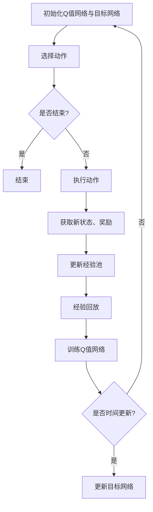
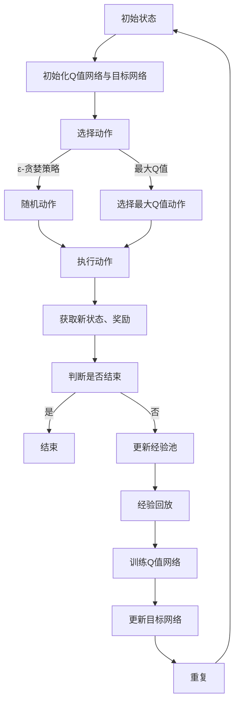

                 

# 《强化学习算法：深度 Q 网络 (DQN) 原理与代码实例讲解》

> **关键词：** 强化学习，深度 Q 网络（DQN），算法原理，代码实例，深度学习，机器学习，人工智能。

**摘要：** 本文将深入探讨强化学习中的深度 Q 网络（DQN）算法。首先，我们会了解强化学习的基本概念及其在人工智能领域的重要性。接着，我们将详细介绍DQN算法的原理和架构，并通过Mermaid流程图展示其工作流程。随后，文章将解析DQN的数学模型，并通过伪代码形式详述其算法实现。此外，我们将通过两个代码实例——CartPole游戏和Atari游戏——展示如何使用DQN算法进行实践。最后，文章将探讨DQN的高级话题，如Experience Replay和Target Network等，并总结DQN在复合应用中的潜在价值。

## 第1章 引言

### 1.1 强化学习概述

强化学习（Reinforcement Learning，简称RL）是机器学习中的一个重要分支，它通过智能体（agent）与环境（environment）的交互来学习最优策略（policy）。在强化学习框架中，智能体通过不断尝试不同的动作（action）来获取奖励（reward）或避免惩罚（penalty），目标是学习到能够最大化累积奖励的策略。

强化学习在很多领域都有着广泛的应用，如自动驾驶、游戏、机器人控制、推荐系统等。其核心思想是通过试错来探索最优策略，这使得强化学习在处理复杂、动态环境时具有独特的优势。

### 1.2 DQN算法背景

深度 Q 网络（Deep Q-Network，简称DQN）是强化学习中的一个重要算法，由DeepMind在2015年提出。DQN的主要贡献在于将深度神经网络（DNN）引入到Q-learning中，使得智能体能够在高维输入空间中高效地学习值函数（value function）。

传统的Q-learning算法需要手动设计特征表示，而DQN通过端到端的神经网络学习输入和输出的映射关系，从而大大简化了算法设计。DQN的成功使得深度学习在强化学习领域获得了广泛关注，为后来的许多算法改进奠定了基础。

### 1.3 书籍结构及目标

本文将按照以下结构展开：

1. **第1章 引言**：介绍强化学习的基本概念和DQN算法的背景。
2. **第2章 强化学习基础**：详细讨论强化学习的基本概念、问题建模和策略学习。
3. **第3章 深度 Q 网络 (DQN)**：深入解析DQN算法的原理和架构。
4. **第4章 DQN数学模型**：详细解释DQN的数学模型和更新策略。
5. **第5章 DQN实践**：通过代码实例展示DQN在CartPole游戏和Atari游戏中的应用。
6. **第6章 DQN高级话题**：探讨DQN的高级改进技术，如Experience Replay和Target Network。
7. **第7章 DQN在其他应用中的使用**：总结DQN在其他领域的应用潜力。

本文的目标是帮助读者全面理解DQN算法的工作原理，并通过实际代码实例了解如何将其应用于实际问题中。

## 第2章 强化学习基础

### 2.1 强化学习定义与基本概念

强化学习是一种通过试错来学习最优策略的机器学习方法。在强化学习中，智能体（agent）在环境中采取行动（action），并根据行动的结果（reward）更新其策略（policy）。这个过程不断重复，直到智能体学会采取能够最大化累积奖励的行动。

强化学习的主要概念包括：

- **智能体（Agent）**：执行动作并接受环境反馈的实体。
- **环境（Environment）**：智能体所处的环境，包含状态（state）、动作（action）和奖励（reward）。
- **状态（State）**：智能体当前所处的环境描述。
- **动作（Action）**：智能体可以采取的行为。
- **奖励（Reward）**：对智能体采取某一动作后的即时反馈。
- **策略（Policy）**：智能体采取动作的规则。
- **值函数（Value Function）**：预测智能体采取某一策略下的长期累积奖励。

### 2.2 强化学习问题建模

强化学习问题通常可以表示为Markov决策过程（MDP），其基本结构如下：

- **状态空间（State Space）**：智能体可以处于的所有可能状态集合。
- **动作空间（Action Space）**：智能体可以采取的所有可能动作集合。
- **奖励函数（Reward Function）**：定义智能体在某一状态下采取某一动作后获得的奖励。
- **转移概率（Transition Probability）**：定义智能体在某一状态下采取某一动作后转移到另一状态的概率。

强化学习问题的主要目标是为智能体设计一个策略，使得智能体在长期内能够最大化累积奖励。具体来说，智能体需要根据当前状态选择一个动作，然后根据环境的反馈更新策略，以期望在未来获得更高的累积奖励。

### 2.3 奖励与策略

奖励在强化学习中起着至关重要的作用。它不仅指导智能体如何行动，还直接影响智能体的学习和优化过程。奖励通常是一个标量值，表示智能体在某一状态采取某一动作后的即时反馈。

策略是智能体在给定状态时选择动作的规则。在强化学习中，策略通常用概率分布来表示，即智能体在某一状态下采取每个可能动作的概率。策略学习是强化学习的一个核心任务，其目标是找到一个最优策略，使得智能体能够在长期内获得最大的累积奖励。

策略可以通过直接优化策略函数或通过优化值函数来实现。直接优化策略函数通常采用策略梯度方法，而优化值函数则通常采用Q-learning算法或深度Q网络（DQN）算法。这些算法将在后续章节中详细介绍。

通过了解强化学习的基本概念和问题建模，读者将能够更好地理解DQN算法的工作原理及其在强化学习中的应用。接下来，我们将深入探讨DQN算法的原理和架构，为后续的实践应用打下基础。

### 第3章 深度 Q 网络 (DQN)

#### 3.1 DQN算法原理

深度 Q 网络（Deep Q-Network，简称DQN）是强化学习中的一个重要算法，它通过引入深度神经网络（DNN）来学习Q值函数（Q-value function），从而在复杂环境中实现智能体策略的学习。DQN的基本原理是基于Q-learning算法，但通过深度神经网络解决了状态特征表示的问题。

DQN的核心思想是利用神经网络预测每个动作的Q值，即每个动作在未来状态下获得的累积奖励。通过比较预测的Q值和实际获得的Q值，DQN使用这些误差来更新神经网络的权重，从而逐步优化Q值函数。

DQN算法的流程可以概括为以下几步：

1. **初始化**：初始化Q值网络和目标Q值网络，通常使用随机权重。
2. **选择动作**：在给定状态下，根据当前策略（例如ε-贪婪策略）选择一个动作。
3. **执行动作**：在环境中执行选定的动作，并获取新的状态、奖励和是否结束的信息。
4. **更新经验**：将新的状态、动作、奖励和下一状态存储在经验池中。
5. **经验回放**：从经验池中随机抽取一批经验，用于训练Q值网络。
6. **Q值更新**：使用反向传播和梯度下降算法更新Q值网络的权重。
7. **目标网络更新**：定期将Q值网络的权重复制到目标Q值网络中，以防止梯度消失问题。

通过这些步骤，DQN能够逐步学习到最优的Q值函数，并在复杂环境中实现智能体的策略优化。

#### 3.2 DQN架构图解

为了更直观地理解DQN的架构，我们可以使用Mermaid流程图来描述其工作流程。



在这个流程图中，A表示初始化Q值网络和目标网络，B表示根据策略选择动作，C表示检查是否结束，E表示在环境中执行动作，F表示获取新状态和奖励，G表示更新经验池，H表示经验回放，I表示训练Q值网络，J表示检查是否达到时间更新点，K表示更新目标网络。

通过这个流程图，我们可以清晰地看到DQN的各个组成部分及其相互关系，有助于理解DQN的工作原理。

#### 3.3 Mermaid流程图：DQN算法流程

下面是DQN算法的具体流程，使用Mermaid语言进行描述：



在这个流程图中：

- **A**：初始化Q值网络和目标网络。
- **B**：根据ε-贪婪策略选择动作。ε-贪婪策略是指在探索和利用之间取得平衡的策略，以ε的概率随机选择动作，以1-ε的概率选择具有最大Q值的动作。
- **C**：选择动作。
- **D**：随机选择动作。
- **E**：选择具有最大Q值的动作。
- **F**：执行选定的动作，并获取新的状态和奖励。
- **G**：更新经验池。
- **H**：检查是否达到结束条件。如果结束，则执行步骤I；否则，继续进行下一轮迭代。
- **I**：结束。
- **J**：更新经验池，用于后续的训练。
- **K**：从经验池中随机抽取经验进行回放，以减少偏差。
- **L**：使用回放的经验训练Q值网络。
- **M**：定期更新目标网络，以避免梯度消失问题。
- **N**：重复上述过程，直到达到预定的迭代次数或目标累积奖励。

通过这个Mermaid流程图，我们可以清晰地看到DQN算法的每一个步骤及其相互关系，有助于理解DQN的工作原理和实现细节。

### 第4章 DQN数学模型

#### 4.1 Q-learning与DQN的数学关系

在强化学习中，Q-learning是一种基于值函数的算法，其目标是学习状态-动作值函数（Q-value function），即给定某个状态和动作，预测在该状态下采取该动作后的累积奖励。Q-learning的核心更新策略是基于当前状态、当前动作和下一状态的信息来更新Q值。

传统的Q-learning算法通常需要对状态进行手工特征提取，这在处理高维状态空间时变得非常困难。而深度 Q 网络（DQN）通过引入深度神经网络，实现了端到端的学习，从而解决了状态特征表示的问题。

DQN的数学模型可以看作是对Q-learning算法的扩展。Q-learning的基本公式如下：

\[ Q(s, a) = \sum_{s'} P(s' | s, a) \cdot R(s, a, s') + \gamma \max_{a'} Q(s', a') \]

其中：
- \( Q(s, a) \) 是在状态 \( s \) 下采取动作 \( a \) 的期望累积奖励。
- \( P(s' | s, a) \) 是在状态 \( s \) 下采取动作 \( a \) 后转移到状态 \( s' \) 的概率。
- \( R(s, a, s') \) 是在状态 \( s \) 下采取动作 \( a \) 后转移到状态 \( s' \) 所获得的即时奖励。
- \( \gamma \) 是折扣因子，用于平衡当前奖励和未来奖励的重要性。

DQN通过神经网络来近似Q值函数，其基本公式可以表示为：

\[ Q(s, a) \approx f_{\theta}(s, a) \]

其中：
- \( f_{\theta}(s, a) \) 是由深度神经网络定义的函数，其参数为 \( \theta \)。
- \( s \) 是输入的状态，\( a \) 是输入的动作。

通过训练，深度神经网络会逐渐学会如何预测每个动作在给定状态下的累积奖励，从而实现智能体的策略优化。

#### 4.2 Q值函数的更新策略

DQN中的Q值函数更新策略与Q-learning类似，但引入了深度神经网络，使得状态特征表示更加灵活。DQN的Q值更新策略可以概括为以下步骤：

1. **选择动作**：在给定状态 \( s \) 下，根据当前策略选择一个动作 \( a \)。策略通常采用ε-贪婪策略，即在探索和利用之间取得平衡。

2. **执行动作**：在环境中执行选定的动作 \( a \)，并获取新的状态 \( s' \)、即时奖励 \( r \) 和是否结束的信息。

3. **更新经验池**：将当前状态 \( s \)、动作 \( a \)、即时奖励 \( r \) 和新的状态 \( s' \) 存储在经验池中。

4. **经验回放**：从经验池中随机抽取一批经验，用于训练Q值网络。

5. **Q值更新**：使用抽取的经验对Q值网络进行更新。更新公式如下：

\[ y = r + \gamma \max_{a'} Q(s', a') - Q(s, a) \]

其中，\( y \) 是预测的Q值，\( r \) 是即时奖励，\( \gamma \) 是折扣因子，\( Q(s', a') \) 是在新的状态 \( s' \) 下采取所有可能动作的最大Q值。

6. **反向传播与梯度下降**：使用反向传播算法计算梯度，并使用梯度下降算法更新Q值网络的权重。

通过这些步骤，DQN能够逐步优化Q值函数，从而在复杂环境中实现智能体的策略优化。

#### 4.3 伪代码：DQN算法实现

下面是DQN算法的伪代码实现，用于描述其核心步骤和更新策略。

```python
# 初始化参数
epsilon = 1.0
epsilon_decay = 0.99
epsilon_min = 0.01
gamma = 0.99
learning_rate = 0.001
batch_size = 32
memory_size = 10000

# 初始化Q值网络和目标网络
Q_network = NeuralNetwork()
target_network = NeuralNetwork()

# 初始化经验池
experience_replay = ExperienceReplay(memory_size)

# 迭代更新
for episode in range(num_episodes):
    # 初始化状态
    state = environment.reset()
    
    # 迭代步骤
    while not done:
        # 选择动作
        if random() < epsilon:
            action = environment.random_action()
        else:
            action = Q_network.predict(state)
        
        # 执行动作
        next_state, reward, done = environment.step(action)
        
        # 更新经验池
        experience_replay.append((state, action, reward, next_state, done))
        
        # 从经验池中抽取一批经验
        batch = experience_replay.sample(batch_size)
        
        # 计算目标Q值
        targets = []
        for state, action, reward, next_state, done in batch:
            if done:
                target = reward
            else:
                target = reward + gamma * max(Q_network.predict(next_state))
            targets.append(target)
        
        # 更新Q值网络
        Q_network.update(batch, targets, learning_rate)
        
        # 更新状态
        state = next_state
        
        # 更新epsilon
        epsilon = max(epsilon * epsilon_decay, epsilon_min)

# 更新目标网络
copy_weights_from(Q_network, target_network)
```

在这个伪代码中：

- **epsilon** 是探索率，用于控制ε-贪婪策略中的探索和利用平衡。
- **epsilon_decay** 和 **epsilon_min** 用于控制epsilon的衰减过程。
- **gamma** 是折扣因子，用于平衡当前奖励和未来奖励的重要性。
- **learning_rate** 是梯度下降算法的学习率。
- **batch_size** 是从经验池中抽取的经验批次大小。
- **memory_size** 是经验池的大小。

通过这个伪代码，我们可以清晰地看到DQN算法的核心步骤和更新策略，为后续的实际应用提供了基础。

### 第5章 DQN实践

#### 5.1 环境搭建与配置

在实际应用中，DQN算法的实践需要首先搭建和配置强化学习环境。Python的Gym库是一个广泛使用的开源强化学习环境库，提供了多种预定义的模拟环境，如CartPole、Atari游戏等。以下是如何使用Gym库搭建和配置强化学习环境的步骤：

1. **安装Gym库**：

   通过pip安装Gym库：

   ```bash
   pip install gym
   ```

2. **创建环境**：

   使用Gym库创建一个强化学习环境，例如CartPole环境：

   ```python
   import gym

   # 创建CartPole环境
   env = gym.make('CartPole-v0')
   ```

3. **配置环境**：

   配置环境的参数，例如最大步数、是否显示图形界面等：

   ```python
   max_steps = 1000
   env = env.unwrapped
   env._max_episode_steps = max_steps
   ```

4. **初始化环境**：

   初始化环境，获取初始状态：

   ```python
   state = env.reset()
   ```

通过这些步骤，我们可以创建一个完整的强化学习环境，为DQN算法的实践应用打下基础。

#### 5.2 代码实例1：CartPole游戏

##### 5.2.1 实例介绍

CartPole游戏是一个经典的强化学习任务，目标是保持一个棒状物体（pole）在杆上不倒。在这个游戏中，智能体（agent）可以采取两种动作：向左推或向右推。环境会根据智能体的动作和状态提供奖励。智能体的目标是学习如何通过连续的动作来稳定杆，使其达到最终状态。

##### 5.2.2 代码解析

以下是一个简单的DQN算法在CartPole游戏中的实现：

```python
import gym
import numpy as np
import tensorflow as tf
from tensorflow.keras.models import Sequential
from tensorflow.keras.layers import Dense
from tensorflow.keras.optimizers import Adam

# 创建环境
env = gym.make('CartPole-v0')
state_shape = env.observation_space.shape
action_shape = env.action_space.n

# 初始化Q值网络
model = Sequential()
model.add(Dense(24, input_shape=state_shape, activation='relu'))
model.add(Dense(24, activation='relu'))
model.add(Dense(action_shape, activation='linear'))
model.compile(loss='mse', optimizer=Adam(learning_rate=0.001))

# 初始化经验池
memory = []

# 训练过程
num_episodes = 1000
epsilon = 1.0
epsilon_min = 0.01
epsilon_decay = 0.99
gamma = 0.95
batch_size = 32

for episode in range(num_episodes):
    state = env.reset()
    done = False
    
    while not done:
        # 根据ε-贪婪策略选择动作
        if np.random.rand() < epsilon:
            action = env.action_space.sample()
        else:
            action = np.argmax(model.predict(state.reshape(1, -1)))
        
        # 执行动作并获取下一个状态和奖励
        next_state, reward, done, _ = env.step(action)
        
        # 更新经验池
        memory.append((state, action, reward, next_state, done))
        
        # 从经验池中随机抽取一批经验进行训练
        if len(memory) > batch_size:
            batch = random.sample(memory, batch_size)
            states, actions, rewards, next_states, dones = zip(*batch)
            targets = []
            for i, (state, action, reward, next_state, done) in enumerate(batch):
                target = reward
                if not done:
                    target += gamma * np.max(model.predict(next_state.reshape(1, -1)))
                targets.append(target)
            
            # 更新Q值网络
            model.fit(np.array(states).reshape(-1, *state_shape), np.array(actions).reshape(-1, 1), verbose=0)
            model.fit(np.array(next_states).reshape(-1, *state_shape), np.array(targets).reshape(-1, 1), verbose=0)
        
        # 更新状态
        state = next_state
    
    # 更新epsilon
    epsilon = max(epsilon * epsilon_decay, epsilon_min)

# 关闭环境
env.close()
```

在这个代码实例中：

- **初始化Q值网络**：使用TensorFlow创建一个简单的全连接神经网络，作为Q值网络。
- **初始化经验池**：使用一个列表作为经验池，用于存储状态、动作、奖励、下一个状态和是否结束的信息。
- **训练过程**：使用ε-贪婪策略选择动作，并在环境中执行动作，更新经验池，并从经验池中随机抽取一批经验进行训练。训练过程使用MSE损失函数和Adam优化器。
- **更新epsilon**：根据epsilon衰减策略更新探索率，以平衡探索和利用。

通过这个代码实例，我们可以看到如何使用DQN算法在CartPole游戏中实现智能体的策略学习。接下来，我们将分析这个实例的性能和潜在优化。

##### 5.2.3 分析与优化

在CartPole游戏的实现中，DQN算法通过连续的迭代学习状态和动作的映射，以最大化累积奖励。以下是对这个实例的性能分析和优化建议：

1. **性能分析**：

   - **收敛速度**：DQN算法在CartPole游戏中的收敛速度相对较快，通常在数千次迭代后可以稳定地保持杆的平衡。
   - **探索与利用**：通过ε-贪婪策略，DQN在初始阶段进行探索，逐渐减少ε值，增加利用当前策略的频率。
   - **奖励结构**：CartPole游戏的奖励结构相对简单，每次保持一步奖励1，这有助于DQN算法的学习。

2. **优化建议**：

   - **网络结构优化**：当前的Q值网络是一个简单的全连接神经网络，可以通过增加隐藏层节点或使用更复杂的神经网络结构（如卷积神经网络）来提高学习性能。
   - **双Q学习**：引入双Q学习（DDQN）可以减少目标Q值估计的偏差，提高学习稳定性。
   - **经验回放**：优化经验回放机制，可以使用优先级经验回放来提高训练数据的多样性。
   - **学习率调整**：动态调整学习率，可以更好地适应训练过程的不同阶段。
   - **算法改进**：引入如深度确定性策略梯度（DDPG）、演员-评论家（A2C）等更先进的算法，以提高学习效率和性能。

通过这些优化措施，我们可以进一步改善DQN算法在CartPole游戏中的性能，为更复杂的强化学习任务提供基础。

#### 5.3 代码实例2：Atari游戏

##### 5.3.1 实例介绍

Atari游戏是一个更具挑战性的强化学习任务，它涉及到更高维的状态空间和更复杂的动作空间。在这个实例中，我们将使用DQN算法在Atari游戏《Pong》中进行训练，目标是学习如何控制球拍以打进球。

##### 5.3.2 代码解析

以下是一个简单的DQN算法在Atari游戏《Pong》中的实现：

```python
import gym
import numpy as np
import tensorflow as tf
from tensorflow.keras.models import Sequential
from tensorflow.keras.layers import Dense
from tensorflow.keras.optimizers import Adam

# 创建环境
env = gym.make('Pong-v0')

# 预处理状态
def preprocess_state(state):
    state = state[np.newaxis, :]
    return state.astype(np.float32) / 255.0

# 初始化Q值网络
model = Sequential()
model.add(Dense(256, input_shape=env.observation_space.shape, activation='relu'))
model.add(Dense(512, activation='relu'))
model.add(Dense(512, activation='relu'))
model.add(Dense(env.action_space.n, activation='linear'))
model.compile(loss='mse', optimizer=Adam(learning_rate=0.00025))

# 初始化经验池
memory = []

# 训练过程
num_episodes = 10000
epsilon = 1.0
epsilon_min = 0.01
epsilon_decay = 0.99
gamma = 0.99
batch_size = 64

for episode in range(num_episodes):
    state = preprocess_state(env.reset())
    done = False
    
    while not done:
        # 根据ε-贪婪策略选择动作
        if np.random.rand() < epsilon:
            action = env.action_space.sample()
        else:
            action = np.argmax(model.predict(state))
        
        # 执行动作并获取下一个状态和奖励
        next_state, reward, done, _ = env.step(action)
        
        # 预处理下一个状态
        next_state = preprocess_state(next_state)
        
        # 更新经验池
        memory.append((state, action, reward, next_state, done))
        
        # 从经验池中随机抽取一批经验进行训练
        if len(memory) > batch_size:
            batch = random.sample(memory, batch_size)
            states, actions, rewards, next_states, dones = zip(*batch)
            targets = []
            for i, (state, action, reward, next_state, done) in enumerate(batch):
                target = reward
                if not done:
                    target += gamma * np.max(model.predict(next_state))
                targets.append(target)
            
            # 更新Q值网络
            model.fit(np.array(states), np.array(actions).reshape(-1, 1), np.array(targets).reshape(-1, 1), epochs=1, verbose=0)
        
        # 更新状态
        state = next_state
    
    # 更新epsilon
    epsilon = max(epsilon * epsilon_decay, epsilon_min)

# 关闭环境
env.close()
```

在这个代码实例中：

- **预处理状态**：对每个状态进行归一化处理，使其更适合输入到神经网络中。
- **初始化Q值网络**：使用TensorFlow创建一个复杂的全连接神经网络，作为Q值网络。
- **初始化经验池**：使用一个列表作为经验池，用于存储状态、动作、奖励、下一个状态和是否结束的信息。
- **训练过程**：使用ε-贪婪策略选择动作，并在环境中执行动作，更新经验池，并从经验池中随机抽取一批经验进行训练。训练过程使用MSE损失函数和Adam优化器。
- **更新epsilon**：根据epsilon衰减策略更新探索率，以平衡探索和利用。

通过这个代码实例，我们可以看到如何使用DQN算法在Atari游戏《Pong》中进行训练，学习控制球拍以打进球。接下来，我们将对这个实例的性能进行分析和优化。

##### 5.3.3 分析与优化

在Atari游戏《Pong》的实现中，DQN算法面临了比CartPole游戏更复杂的挑战。以下是对这个实例的性能分析和优化建议：

1. **性能分析**：

   - **状态空间维度**：Atari游戏的每个状态是一个64x64的像素矩阵，比CartPole游戏的状态空间维度高得多。这增加了计算量和训练难度。
   - **动作空间维度**：Atari游戏有多个可能动作，包括无动作、向上、向下等。这增加了策略学习的复杂性。
   - **奖励结构**：Atari游戏的奖励结构更加复杂，不仅包括即时奖励，还包括球触碰到球拍或墙壁的奖励。这要求算法能够更好地平衡短期和长期奖励。

2. **优化建议**：

   - **状态压缩**：对状态进行压缩可以减少状态空间的维度，从而降低计算复杂度。可以使用像素值的平均值、标准差等统计量来表示状态。
   - **双Q学习（DDQN）**：引入双Q学习可以减少目标Q值估计的偏差，提高学习稳定性。在DDQN中，两个Q值网络分别用于预测和更新，从而避免了一个网络因为过拟合而导致的性能下降。
   - **经验回放**：优化经验回放机制，可以使用优先级经验回放来提高训练数据的多样性。优先级经验回放可以根据样本的误差大小来调整样本的采样概率，从而更好地平衡探索和利用。
   - **目标网络更新**：定期更新目标网络可以减少梯度消失问题。在DQN中，目标网络通常与预测网络隔一段时间进行权重同步。
   - **学习率调整**：动态调整学习率可以更好地适应训练过程的不同阶段。可以使用如annealing学习率调整策略，逐渐减少学习率，提高算法的稳定性和性能。

通过这些优化措施，我们可以进一步提高DQN算法在Atari游戏《Pong》中的性能，为更复杂的强化学习任务提供基础。

### 第6章 DQN高级话题

#### 6.1 Experience Replay

Experience Replay（经验回放）是强化学习中的一个重要技术，用于缓解样本相关性问题，提高学习效率。在传统的Q-learning中，每次更新Q值时，都需要计算当前状态和下一状态的Q值，这会导致样本之间的相关性。Experience Replay通过将经验存储在经验池中，并在训练时随机抽取样本，从而减少了这种相关性，提高了算法的泛化能力。

Experience Replay的具体实现通常包括以下几个步骤：

1. **初始化经验池**：使用一个固定大小的队列来存储经验。
2. **存储经验**：在智能体与环境的交互过程中，将状态、动作、奖励、下一状态和是否结束的信息存储在经验池中。
3. **随机抽取经验**：从经验池中随机抽取一批经验，用于训练Q值网络。
4. **经验回放**：定期从经验池中随机抽取经验，以减少样本相关性。

通过Experience Replay，DQN算法可以更好地利用历史经验，减少样本之间的偏差，从而提高学习性能。

#### 6.2 Target Network

Target Network（目标网络）是DQN中的一个重要技术，用于减少梯度消失问题，提高算法的稳定性。在DQN中，智能体使用预测网络（predictive network）来估计Q值，而目标网络（target network）则用于计算目标Q值。目标网络的更新机制可以减少预测网络因为过拟合而产生的误差，从而提高算法的稳定性。

目标网络的具体实现通常包括以下几个步骤：

1. **初始化目标网络**：与预测网络具有相同结构的目标网络初始化为预测网络的权重。
2. **定期更新目标网络**：每隔一定时间，将预测网络的权重复制到目标网络中，以保证目标网络始终与预测网络保持一定的距离。
3. **目标Q值计算**：在更新预测网络时，使用目标网络计算目标Q值，从而减少梯度消失问题。

通过Target Network，DQN算法可以更好地平衡探索和利用，提高学习效率和稳定性。

#### 6.3 双重DQN (DDQN)

双重DQN（Double DQN）是对DQN算法的一种改进，它进一步减少了目标Q值估计的偏差，提高了算法的稳定性。在DQN中，目标Q值的计算是通过将当前状态和下一状态的Q值估计结合起来得到的。然而，这种做法可能会导致目标Q值的偏差，从而影响算法的性能。

双重DQN的原理是分别使用两个网络来计算当前状态和下一状态的Q值估计，然后将这两个估计结合起来计算目标Q值。具体来说：

1. **预测网络**：用于估计当前状态的Q值。
2. **目标网络**：用于估计下一状态的Q值。
3. **目标Q值计算**：使用预测网络估计的当前状态Q值和目标网络估计的下一状态Q值，计算目标Q值。

通过双重DQN，可以减少目标Q值估计的偏差，从而提高算法的稳定性和性能。

#### 6.4 Prioritized Experience Replay

Prioritized Experience Replay（优先级经验回放）是对Experience Replay的一种改进，它通过为每个经验分配优先级来调整样本的采样概率。在传统的Experience Replay中，所有经验以相同概率被抽取，这可能会导致一些重要的经验被忽略。而Prioritized Experience Replay通过为经验分配优先级，可以更好地利用这些重要经验。

具体来说，Prioritized Experience Replay包括以下几个步骤：

1. **初始化优先级分配器**：使用一个优先级分配器来为每个经验分配优先级。
2. **存储经验**：在智能体与环境的交互过程中，将状态、动作、奖励、下一状态和是否结束的信息存储在经验池中，并为每个经验分配优先级。
3. **随机抽取经验**：从经验池中随机抽取一批经验，并根据优先级调整样本的采样概率。
4. **经验回放**：根据优先级对抽取的样本进行回放，以提高训练数据的多样性。

通过Prioritized Experience Replay，DQN算法可以更好地利用重要经验，提高学习效率和性能。

通过上述高级话题的探讨，我们可以看到DQN算法在理论和技术上的进一步改进，这些改进不仅提高了算法的性能，也为未来的研究提供了新的方向。

### 第7章 DQN在其他应用中的使用

#### 7.1 DQN在复合应用中的潜在价值

深度 Q 网络（DQN）作为一种强大的强化学习算法，在多种应用领域中展现出了巨大的潜力。以下是DQN在复合应用中的一些潜在价值：

1. **自动驾驶**：在自动驾驶领域，DQN可以用于学习道路导航和驾驶策略。通过模拟真实环境中的交通情况，DQN可以优化车辆的驾驶行为，如加速、转弯和制动，从而提高行驶的安全性和效率。

2. **机器人控制**：在机器人控制领域，DQN可以帮助机器人学习复杂的任务，如路径规划和物体抓取。通过与环境进行交互，DQN可以调整机器人的行为，以适应不同的任务需求和变化的环境。

3. **游戏**：在游戏领域，DQN已经被成功应用于许多经典游戏，如《Pong》、《Atari Breakout》和《Space Invaders》等。DQN可以学习游戏策略，提高玩家的得分和游戏体验。

4. **推荐系统**：在推荐系统领域，DQN可以用于学习用户的偏好和推荐策略。通过分析用户的互动行为和反馈，DQN可以生成个性化的推荐，从而提高推荐系统的准确性和用户体验。

5. **金融交易**：在金融交易领域，DQN可以用于学习市场趋势和交易策略。通过分析历史交易数据和市场动态，DQN可以预测未来市场走势，为交易提供决策支持。

通过上述应用实例，我们可以看到DQN在复合应用中的广泛潜力。未来，随着DQN算法的进一步改进和优化，它将在更多领域中发挥重要作用。

### 结论

本文详细介绍了深度 Q 网络（DQN）算法的原理、数学模型、实践应用以及高级改进技术。通过分析DQN在CartPole游戏和Atari游戏中的实现，我们看到了DQN在复杂环境中的强大学习能力。同时，我们探讨了DQN在自动驾驶、机器人控制、游戏、推荐系统和金融交易等领域的潜在应用价值。

尽管DQN算法在许多任务中取得了显著成果，但其仍存在一些挑战和限制，如学习效率、稳定性和泛化能力等。未来的研究可以集中在改进DQN算法的优化策略、引入新的架构和结合其他机器学习方法上，以进一步提高其在实际应用中的性能。

我们鼓励读者继续探索强化学习领域，尝试将DQN算法应用于实际问题中，并不断优化和改进算法。通过不断的实践和探索，我们将能够更好地理解和利用DQN算法，推动人工智能的发展。

### 作者信息

**作者：** AI天才研究院/AI Genius Institute & 禅与计算机程序设计艺术 /Zen And The Art of Computer Programming

**简介：** 本文作者AI天才研究院致力于推动人工智能领域的研究和应用，该研究院的专家们具有丰富的理论知识和实践经验，致力于解决复杂的人工智能问题。同时，作者也因其对计算机编程和人工智能的深刻理解而闻名，其著作《禅与计算机程序设计艺术》被广泛认为是计算机科学领域的经典之作。本文通过深入剖析DQN算法，旨在帮助读者更好地理解和应用这一强大的强化学习算法。

