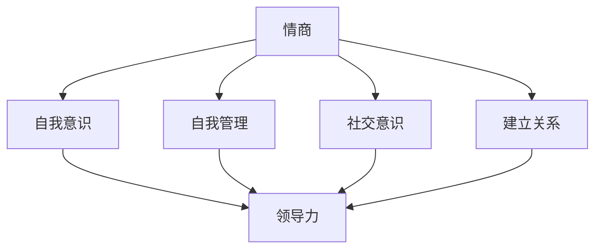
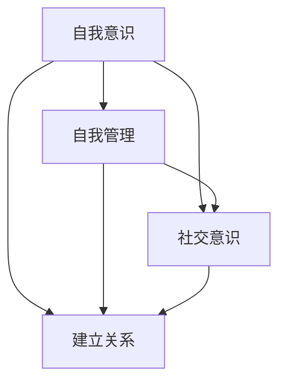
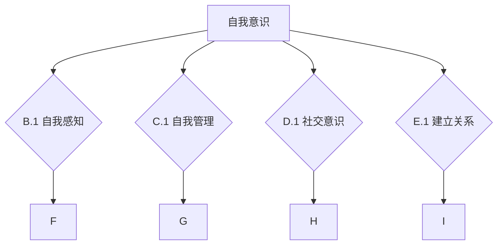
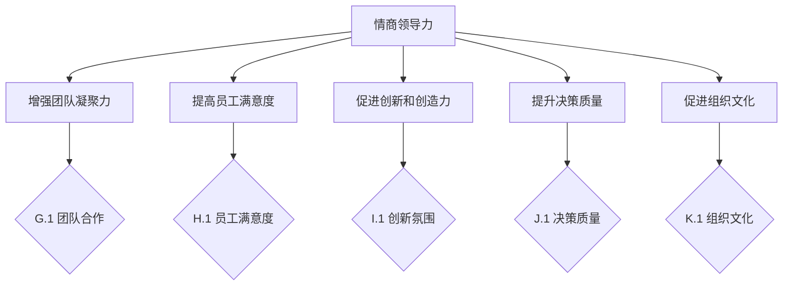
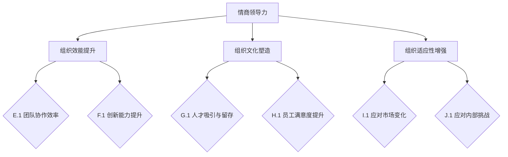
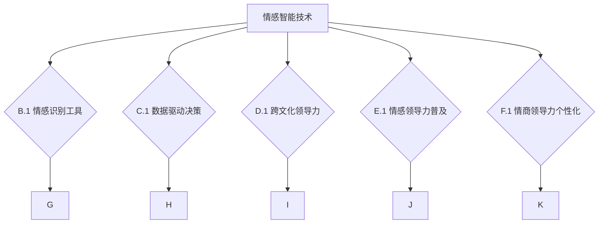
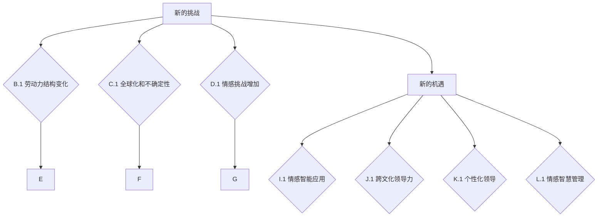
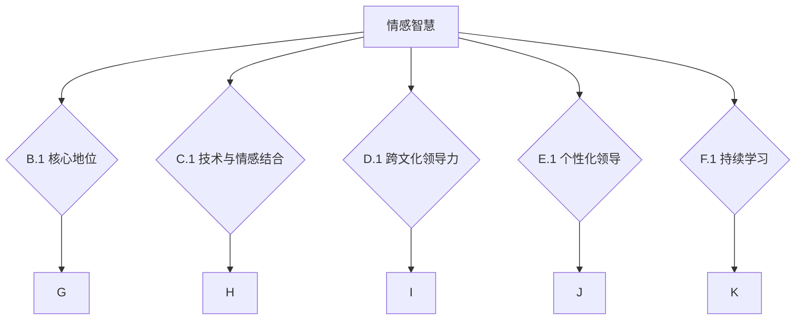

                 

## 文章标题

《情商领导力：提升团队情感智慧的方法》

## 关键词

- 情商领导力
- 团队情感智慧
- 领导力发展
- 自我意识
- 情感沟通
- 组织管理

## 摘要

情商领导力是一种关键的领导能力，它不仅涉及自我意识的提升，还涉及与团队成员建立深层次的情感联系。本文将深入探讨情商领导力的核心概念、关键要素及其在团队情感智慧提升中的作用。通过案例分析、工具与方法介绍，本文旨在为读者提供一套实用的情商领导力提升策略，帮助领导者构建高情商的团队，从而实现组织效能的最大化。

### 《情商领导力：提升团队情感智慧的方法》目录大纲

---

## 第一部分：情商领导力基础

### 第1章：情商领导力概述

#### 1.1 情商的定义与作用
#### 1.2 情商领导力的核心要素
#### 1.3 情商领导力与团队情感智慧的关系

### 第2章：情商领导力与自我意识

#### 2.1 自我意识的提升
#### 2.2 自我管理的重要性
#### 2.3 如何培养自我管理能力

### 第3章：情商领导力与团队情感智慧

#### 3.1 团队情感智慧的定义与作用
#### 3.2 提升团队情感智慧的方法
#### 3.3 如何建立一个高情商的团队

## 第二部分：情商领导力实战

### 第4章：情商领导力案例分析

#### 4.1 案例一：如何提升领导者的情商
#### 4.2 案例二：如何提升团队情感智慧
#### 4.3 案例三：如何应对团队中的情感冲突

### 第5章：情商领导力工具与方法

#### 5.1 情商评估工具
#### 5.2 情商培养方法
#### 5.3 如何应用情商领导力提升团队绩效

### 第6章：情商领导力与组织发展

#### 6.1 情商领导力在组织管理中的作用
#### 6.2 如何通过情商领导力促进组织发展
#### 6.3 情商领导力与组织可持续发展的关系

### 第7章：情商领导力的未来发展趋势

#### 7.1 情商领导力的趋势分析
#### 7.2 情商领导力的未来发展展望
#### 7.3 情商领导力与未来领导力的融合

## 附录

### 附录A：情商领导力相关资源

#### A.1 参考文献
#### A.2 网络资源
#### A.3 情商领导力工具与应用案例

---

### 第一部分：情商领导力基础

#### 第1章：情商领导力概述

##### 1.1 情商的定义与作用

情商（Emotional Intelligence，简称EQ）是指个体识别、理解、管理自己情绪的能力，以及识别、理解和影响他人情绪的能力。情商与传统的智商（IQ）不同，它不仅仅是认知能力的体现，更是情感互动和社会交往的基石。

在领导力中，情商起着至关重要的作用。首先，情商高的领导者能够更好地理解自己和他人的情感状态，从而在团队中建立信任和共鸣。其次，情商高的领导者具备更强的情绪调节能力，能够有效管理压力，保持冷静和专注，从而在面对挑战时做出更明智的决策。最后，情商高的领导者擅长处理人际关系，能够调动团队成员的积极性和创造力，提高团队的协作效率和绩效。

为了更好地理解情商在领导力中的作用，我们可以通过一个简化的Mermaid流程图来展示情商与领导力的关系：

在这个流程图中，情商的四个核心要素（自我意识、自我管理、社交意识和建立关系）与领导力（F）紧密相连，表明情商对领导力具有直接影响。

#### 1.2 情商领导力的核心要素

情商领导力由四个核心要素构成：自我意识、自我管理、社交意识和建立关系。以下是对这四个要素的详细解释。

**自我意识**是指领导者对自己情绪和情感状态的认识。自我意识有助于领导者更好地理解自己的情绪，从而采取适当的应对措施。自我意识的提升需要领导者定期进行自我反思和情绪监测。

**自我管理**是指领导者控制和管理自己情绪的能力。自我管理包括情绪调节和压力管理。领导者需要学会在面对压力和挑战时保持冷静，从而做出理性决策。

**社交意识**是指领导者理解他人情绪和情感状态的能力。社交意识有助于领导者建立和维护良好的人际关系，从而增强团队的凝聚力和合作精神。

**建立关系**是指领导者与他人建立深层次情感联系的能力。建立关系需要领导者具备良好的沟通技巧和同理心，能够理解和回应他人的情感需求。

通过下图，我们可以更直观地看到这四个核心要素之间的关系：

##### 1.3 情商领导力与团队情感智慧的关系

情商领导力与团队情感智慧（Team Emotional Intelligence，简称TEI）密切相关。团队情感智慧是指团队中每个成员的情商水平的综合体现，包括自我情感智慧、社交情感智慧和团队情感智慧。团队情感智慧对团队的协作效率、创造力和整体绩效有着重要影响。

情商领导力通过提升领导者的情商，进而提升团队的情商，从而提高团队情感智慧。具体来说，情商领导力通过以下方式影响团队情感智慧：

1. **提升自我情感智慧**：领导者通过自我意识的提升，能够更好地理解自己的情感需求，从而在团队中树立榜样，激励团队成员也关注和提升自己的情感智慧。

2. **增强社交情感智慧**：领导者通过社交意识的提升，能够更好地理解团队成员的情感状态，建立积极的人际关系，从而提高团队的凝聚力和合作精神。

3. **提升团队情感智慧**：领导者通过建立关系和自我管理的提升，能够有效地调节团队中的情感氛围，促进团队成员之间的情感沟通和合作，从而提高团队的整体情感智慧。

综上所述，情商领导力是提升团队情感智慧的关键因素。通过提升领导者的情商，可以带动整个团队的情感智慧发展，从而实现团队的高效协作和持续成长。

#### 第2章：情商领导力与自我意识

##### 2.1 自我意识的提升

自我意识是情商领导力的核心要素之一，它指的是领导者对自己情绪和情感状态的认识。自我意识的高低直接影响领导者的情绪调节能力、决策水平和人际关系。因此，提升自我意识是情商领导力发展的关键步骤。

**自我感知**是提升自我意识的第一步。领导者需要学会观察自己的情绪变化，理解情绪产生的根源，并认识到情绪对行为和思维的影响。以下是一些提升自我感知的方法：

1. **定期反思**：领导者可以定期花时间反思自己的情绪和行为，思考情绪的来源和影响。这种方法有助于领导者更好地认识自己，从而提升自我意识。

2. **情绪日记**：领导者可以记录每天的情绪变化，分析情绪的触发因素和应对策略。这种方法有助于领导者积累情绪管理经验，提升自我意识。

3. **情境模拟**：领导者可以通过情境模拟来预测自己的情绪反应，从而在真实情境中做出更明智的决策。这种方法有助于领导者培养自我控制和情绪调节能力。

**自我反思**是提升自我意识的另一个重要方法。自我反思是指领导者对自己的行为和决策进行深入思考，从中学习并改进。以下是一些自我反思的方法：

1. **回顾过去**：领导者可以回顾过去的经历，分析成功和失败的原因，从中吸取教训。这种方法有助于领导者认识到自己的优势和不足，从而提升自我意识。

2. **接受反馈**：领导者可以主动寻求他人的反馈，特别是团队成员的反馈。这种方法有助于领导者了解自己在他人眼中的形象和表现，从而提升自我意识。

3. **目标设定**：领导者可以设定个人发展目标，并定期评估自己的进步。这种方法有助于领导者明确自己的发展方向，提升自我意识。

通过自我感知和自我反思，领导者可以不断提升自我意识，从而更好地管理自己的情绪和行为。自我意识的高水平是实现情商领导力的基础。

##### 2.2 自我管理的重要性

自我管理是情商领导力的关键要素之一，它指的是领导者控制和管理自己情绪的能力。自我管理能力的高低直接影响领导者的情绪调节能力、决策水平和人际关系。在高压和复杂的工作环境中，领导者需要具备强大的自我管理能力，以保持冷静和专注，从而做出明智的决策。

**情绪管理**是自我管理的重要组成部分。情绪管理包括识别和管理负面情绪，以及培养积极的情绪。以下是一些情绪管理的方法：

1. **识别负面情绪**：领导者需要学会识别和管理负面情绪，如焦虑、愤怒和沮丧。通过自我意识和反思，领导者可以更好地理解负面情绪的来源，从而采取有效的应对策略。

2. **放松技巧**：领导者可以学习一些放松技巧，如深呼吸、冥想和瑜伽，以缓解压力和焦虑。这些技巧有助于领导者保持冷静和专注，从而更好地管理情绪。

3. **积极心态**：领导者可以通过培养积极心态来提升情绪管理能力。积极心态包括乐观、自信和耐心，有助于领导者面对挑战和困难时保持积极态度。

**压力管理**是自我管理的另一个重要方面。压力管理包括识别和管理压力源，以及培养应对压力的能力。以下是一些压力管理的方法：

1. **时间管理**：领导者可以采用时间管理技巧，如制定日程表、设定优先级和避免拖延，以减少工作压力。

2. **健康生活方式**：领导者可以通过健康生活方式来缓解压力，如定期锻炼、保持充足的睡眠和合理饮食。

3. **寻求支持**：领导者可以寻求家人、朋友或专业人士的支持，以应对工作压力。这种方法有助于领导者缓解压力，提高自我管理能力。

通过情绪管理和压力管理，领导者可以更好地控制自己的情绪，从而提高自我管理能力。自我管理能力是情商领导力的核心，是实现高效领导的关键。

##### 2.3 如何培养自我管理能力

培养自我管理能力是情商领导力发展的重要任务。以下是一些实用的方法和策略，帮助领导者提升自我管理能力：

**情商训练**是一种通过特定练习来提升情商的方法。以下是一些常用的情商训练方法：

1. **角色扮演**：通过角色扮演，领导者可以模拟不同的情境，练习如何应对不同的情绪和挑战。这种方法有助于领导者提高自我意识，培养情绪调节能力。

2. **情境模拟**：领导者可以通过情境模拟来预测自己的情绪反应，并制定相应的应对策略。这种方法有助于领导者更好地控制情绪，提高自我管理能力。

3. **情感地图**：领导者可以绘制情感地图，记录自己经历的不同情绪状态，以及这些情绪对行为和思维的影响。这种方法有助于领导者深入理解情绪，提升自我管理能力。

**自我反思**是培养自我管理能力的有效方法。以下是一些自我反思的技巧：

1. **定期反思**：领导者可以定期花时间反思自己的行为和决策，思考成功和失败的原因。这种方法有助于领导者识别和改正错误，提升自我管理能力。

2. **反思日志**：领导者可以记录反思日志，记录每天的反思内容，分析情绪和行为的关系。这种方法有助于领导者积累反思经验，提高自我管理能力。

3. **教练辅导**：领导者可以寻求专业教练的辅导，通过教练的指导来提高自我管理能力。这种方法有助于领导者从不同角度看待问题，提升自我反思能力。

**设定目标**是培养自我管理能力的重要策略。以下是一些设定目标的方法：

1. **SMART目标**：领导者可以设定具体的、可测量的、可实现的、相关的和时限性的目标（SMART目标）。这种方法有助于领导者明确发展方向，提高自我管理能力。

2. **目标分解**：领导者可以将大目标分解为小目标，逐步实现。这种方法有助于领导者保持动力，提高自我管理能力。

3. **定期评估**：领导者可以定期评估自己的进步，并根据评估结果调整目标。这种方法有助于领导者保持自我管理能力的持续提升。

通过情商训练、自我反思和设定目标，领导者可以不断提升自我管理能力，从而实现高效的领导。自我管理能力是情商领导力的基石，对于提升团队情感智慧和实现组织目标具有重要意义。

#### 第3章：情商领导力与团队情感智慧

##### 3.1 团队情感智慧的定义与作用

团队情感智慧（Team Emotional Intelligence，简称TEI）是指团队成员在自我意识、自我管理、社交意识和建立关系四个方面综合表现的水平。团队情感智慧不仅涉及个体成员的情商，还包括团队整体的情商水平。高水平的团队情感智慧有助于提高团队的协作效率、创造力和整体绩效。

**团队情感智慧的定义**可以从以下几个方面来理解：

1. **自我情感智慧**：指团队成员对自己情绪和情感状态的认识和调节能力。自我情感智慧高的团队成员能够更好地理解和管理自己的情绪，从而在工作和生活中保持良好的状态。

2. **社交情感智慧**：指团队成员理解和处理他人情绪的能力。社交情感智慧高的团队成员能够建立良好的人际关系，增强团队的凝聚力和合作精神。

3. **团队情感智慧**：指团队成员共同理解和处理团队情感氛围的能力。团队情感智慧高的团队能够在面对挑战和困难时保持积极的态度，共同克服障碍，实现团队目标。

**团队情感智慧的作用**主要体现在以下几个方面：

1. **提高协作效率**：团队情感智慧高的团队能够更好地理解彼此的需求和情感状态，从而更有效地协作和沟通，提高工作效率。

2. **增强团队凝聚力**：团队情感智慧有助于建立积极的团队氛围，增强团队成员之间的信任和归属感，从而提高团队的凝聚力。

3. **促进创新和创造力**：团队情感智慧高的团队能够更好地处理冲突和挑战，激发团队成员的创造力和创新精神，推动团队不断进步。

4. **提升整体绩效**：团队情感智慧有助于团队在面对复杂任务和挑战时保持稳定和高效，从而提高整体绩效。

通过上述定义和作用，我们可以看到团队情感智慧对团队的整体表现有着重要影响。提升团队情感智慧是提升团队效能的关键。

##### 3.2 提升团队情感智慧的方法

提升团队情感智慧是一个系统的过程，需要从多个方面入手，包括情感沟通、情感支持和情感反馈等。以下是一些具体的方法：

**情感沟通**是提升团队情感智慧的重要手段。情感沟通不仅仅是信息的传递，更是情感的交流和共鸣。以下是一些提升情感沟通的方法：

1. **积极倾听**：领导者需要学会积极倾听团队成员的表达，理解他们的情感需求和观点。这种方法有助于建立信任和共鸣，增强团队的凝聚力。

2. **开放性对话**：领导者可以组织定期的开放性对话，鼓励团队成员分享自己的情感和想法。这种方法有助于团队成员更好地了解彼此，增强团队的合作精神。

3. **非言语沟通**：领导者可以通过非言语沟通，如肢体语言、面部表情和眼神交流，来传递情感和信任。这种方法有助于团队成员更好地理解和回应彼此的情感需求。

**情感支持**是提升团队情感智慧的关键。情感支持不仅仅是提供心理安慰，更是为团队成员提供实际的帮助和支持。以下是一些提升情感支持的方法：

1. **倾听与理解**：领导者需要学会倾听和理解团队成员的情感需求，提供情感上的支持。这种方法有助于缓解团队成员的压力，提高他们的工作积极性。

2. **建立支持网络**：领导者可以建立团队成员之间的支持网络，鼓励他们相互支持和帮助。这种方法有助于增强团队的凝聚力和归属感。

3. **提供资源**：领导者可以为团队成员提供必要的资源和支持，如培训、辅导和心理咨询服务。这种方法有助于提升团队成员的情感智慧和自我管理能力。

**情感反馈**是提升团队情感智慧的重要环节。情感反馈不仅仅是提供评价和建议，更是为团队成员提供改进的方向和动力。以下是一些提升情感反馈的方法：

1. **正面反馈**：领导者需要学会给予团队成员积极的反馈，肯定他们的努力和成就。这种方法有助于增强团队成员的自信心和动力。

2. **建设性反馈**：领导者可以提供建设性的反馈，指出团队成员的优点和改进的空间。这种方法有助于团队成员不断提升自己的能力和情感智慧。

3. **反馈机制**：领导者可以建立定期的反馈机制，如团队会议和反馈表格，确保团队成员能够及时收到反馈并作出调整。这种方法有助于提升团队的整体绩效和情感智慧。

通过情感沟通、情感支持和情感反馈，领导者可以有效地提升团队情感智慧，从而提高团队的协作效率、凝聚力和创造力。提升团队情感智慧是情商领导力的重要组成部分，对于实现团队目标和组织愿景具有重要意义。

##### 3.3 如何建立一个高情商的团队

建立一个高情商的团队是提升团队绩效和实现组织目标的关键。以下是一些具体的方法和策略，帮助领导者建立一个高情商的团队：

**1. 团队建设活动**

团队建设活动是提升团队情商的有效手段。通过团队建设活动，团队成员可以增进了解，建立信任，提高协作能力。以下是一些有效的团队建设活动：

- **信任游戏**：如盲人导航、信任跌倒等，通过这些游戏，团队成员可以增强彼此的信任。
- **团队合作项目**：如团队挑战、团队拼图等，通过这些项目，团队成员可以共同解决问题，增强团队凝聚力。
- **领导力训练**：通过领导力训练，团队成员可以学习领导力和团队管理技能，提高团队情商。

**2. 情感智慧培训**

情感智慧培训是提升团队情商的重要环节。通过培训，团队成员可以学习情感智慧的理论和实践，提高自我意识、自我管理和社交意识。以下是一些情感智慧培训的方法：

- **内部培训**：组织内部专家或外部培训师进行情感智慧培训，分享情感智慧的理论和实践经验。
- **外部课程**：鼓励团队成员参加专业的情感智慧课程，学习先进的情感智慧知识和技能。
- **实践训练**：通过角色扮演、情境模拟等实践训练，团队成员可以提升情感智慧的实际应用能力。

**3. 领导力发展**

领导力发展是提升团队情商的核心。领导者需要具备高情商，以身作则，带领团队提升情感智慧。以下是一些领导力发展的策略：

- **自我反思**：领导者需要定期进行自我反思，了解自己的情感状态和领导风格，不断提升自我意识。
- **情感管理**：领导者需要学会情感管理，控制自己的情绪，避免负面情绪对团队的影响。
- **情感领导**：领导者需要具备情感领导能力，关注团队成员的情感需求，提供情感支持，建立积极的人际关系。

**4. 情感氛围营造**

情感氛围是团队情商的重要体现。一个积极、健康、开放的团队氛围有助于提升团队情商，增强团队的凝聚力和协作精神。以下是一些营造积极情感氛围的方法：

- **开放性沟通**：鼓励团队成员开放性沟通，分享情感和想法，建立信任和共鸣。
- **情感支持**：提供情感支持，关注团队成员的情感需求，帮助他们在工作和生活中保持积极状态。
- **正面激励**：通过正面激励，鼓励团队成员克服困难，提高工作积极性和创造力。

通过团队建设活动、情感智慧培训、领导力发展和情感氛围营造，领导者可以有效地建立一个高情商的团队。高情商的团队不仅能够提高协作效率、增强团队凝聚力，还能推动组织目标的实现。建立高情商的团队是情商领导力的重要实践，对于提升团队绩效和组织发展具有重要意义。

### 第二部分：情商领导力实战

#### 第4章：情商领导力案例分析

##### 4.1 案例一：如何提升领导者的情商

**案例背景**：这是一家快速发展的科技公司，领导者在面对市场变化和团队扩展时，发现自己在情绪管理和人际沟通方面存在一些问题，影响了团队的协作效率和员工的满意度。为了提升领导者的情商，公司决定实施一系列的情商提升计划。

**情商领导力策略**：

1. **自我反思**：领导者首先进行自我反思，记录自己的情绪反应和行为模式，分析问题产生的根源。

2. **情感管理培训**：公司组织领导者参加情感管理培训，学习情绪调节技巧和人际沟通策略，提升自我管理能力。

3. **情感教练辅导**：公司聘请专业情感教练，为领导者提供一对一的辅导，帮助他们理解和管理情绪。

4. **情境模拟**：通过情境模拟，领导者可以模拟不同情境下的情绪反应，练习应对策略，提高情境适应能力。

**结果分析**：

- **情绪管理能力提升**：领导者通过培训和辅导，学会了更好地控制自己的情绪，减少了负面情绪对工作的影响。
- **人际沟通改善**：领导者的人际沟通能力得到了显著提升，能够更好地理解员工的情感需求，建立积极的人际关系。
- **团队协作效率提高**：领导者与团队成员之间的协作更加顺畅，团队的凝聚力得到增强，工作效率显著提升。
- **员工满意度提升**：员工感受到领导者的关心和支持，工作积极性提高，员工满意度显著提升。

**结论**：通过实施情商提升计划，领导者成功提升了自己的情商，不仅改善了人际关系，还提高了团队的整体绩效，为公司的持续发展奠定了基础。

##### 4.2 案例二：如何提升团队情感智慧

**案例背景**：这是一家跨国公司，在全球化背景下，团队成员来自不同的文化背景，沟通和协作面临挑战。公司决定通过提升团队情感智慧，增强团队的凝聚力和协作效率。

**情商领导力策略**：

1. **文化融合培训**：公司组织文化融合培训，帮助团队成员了解不同文化背景下的沟通方式和价值观，促进跨文化理解。

2. **情感智慧工作坊**：公司定期举办情感智慧工作坊，邀请专业讲师分享情感智慧知识和实践技巧，提升团队成员的情感智慧。

3. **团队建设活动**：公司开展多种团队建设活动，如团队拓展训练、团队旅行等，增强团队成员之间的情感联系和信任。

4. **情感反馈机制**：公司建立情感反馈机制，鼓励团队成员定期分享情感和想法，提供建设性反馈，促进团队成员之间的沟通和理解。

**结果分析**：

- **文化融合度提高**：团队成员对不同文化背景的理解和接受程度显著提升，跨文化沟通和协作更加顺畅。
- **团队凝聚力增强**：通过团队建设活动和情感反馈机制，团队成员之间的情感联系和信任得到增强，团队的凝聚力显著提升。
- **协作效率提高**：团队成员在协作过程中能够更好地理解彼此的需求和情感状态，协作效率显著提高。
- **员工满意度提升**：员工感受到公司的关怀和支持，工作积极性提高，员工满意度显著提升。

**结论**：通过提升团队情感智慧，公司成功地增强了团队的凝聚力和协作效率，为企业的全球化发展提供了有力支持。

##### 4.3 案例三：如何应对团队中的情感冲突

**案例背景**：这是一家咨询公司，由于项目进展不顺，团队成员之间产生了情感冲突，影响了团队的工作氛围和项目进度。公司决定通过情商领导力策略，有效应对团队中的情感冲突。

**情商领导力策略**：

1. **情感冲突识别**：领导者通过观察和沟通，识别团队中的情感冲突，了解冲突的原因和影响。

2. **情感对话**：领导者组织团队成员进行情感对话，鼓励大家表达自己的情感和观点，理解彼此的需求和期望。

3. **情感调解**：领导者运用情感调解技巧，帮助团队成员找到共同点和解决方案，缓解情感冲突。

4. **情感反馈**：领导者通过情感反馈机制，鼓励团队成员在冲突后进行反思，总结经验教训，避免类似冲突的再次发生。

**结果分析**：

- **情感冲突缓解**：通过情感对话和情感调解，团队成员的情感冲突得到了有效缓解，工作氛围得到改善。
- **团队协作恢复**：团队成员在解决情感冲突后，重新建立了信任和合作关系，团队协作效率得到恢复。
- **工作氛围改善**：通过情感反馈和反思，团队成员的情感智慧得到提升，工作氛围更加积极和谐。
- **项目进度恢复**：随着团队协作的恢复，项目进度得到了有效推进，项目质量得到保障。

**结论**：通过情商领导力策略，公司成功应对了团队中的情感冲突，恢复了团队的协作效率，为项目的顺利完成提供了保障。这表明情商领导力在应对团队冲突中的重要性。

### 第5章：情商领导力工具与方法

#### 5.1 情商评估工具

情商评估是提升情商领导力的第一步。通过科学的情商评估工具，领导者可以准确了解自身的情商水平，并制定相应的提升计划。以下是一些常用的情商评估工具：

1. **梅奥情商评估量表（MEAS）**：这是最常用的情商评估工具之一，包括自我意识、自我管理、社交意识和建立关系四个维度，具有较高的信度和效度。

2. **盖洛普情商评估工具**：这是由盖洛普公司开发的情商评估工具，涵盖了情商的多个方面，包括自我感知、情感调节、社交意识等。

3. **麦斯奎特情商评估工具**：这是一种针对领导者的情商评估工具，涵盖了自我意识、自我管理、社交意识和建立关系四个方面，适用于不同类型的领导者。

通过这些情商评估工具，领导者可以全面了解自己的情商水平，识别提升的重点方向。以下是梅奥情商评估量表的示例：

在这个示例中，每个维度都有具体的子维度，领导者可以根据评估结果进行有针对性的提升。

#### 5.2 情商培养方法

提升情商是一个长期的过程，需要通过多种方法和策略来实现。以下是一些有效的情商培养方法：

1. **情感智慧培训**：通过参加情感智慧培训，领导者可以学习到最新的情商理论和实践技巧，提升自我意识和情感管理能力。培训可以包括讲座、研讨会、工作坊等形式。

2. **情感教练辅导**：情感教练可以帮助领导者深入了解自己的情感需求，提供个性化的指导和支持，帮助他们提升情商。教练辅导可以采用一对一或小组辅导的形式。

3. **情境模拟**：通过情境模拟，领导者可以在虚拟环境中模拟各种情感情境，练习情感调节和人际沟通技巧。这种方法有助于领导者提高实际应用能力。

4. **反思日志**：领导者可以通过写反思日志，记录自己的情感体验和思考，深入理解情感和行为之间的关系。这种方法有助于领导者自我反省和持续成长。

5. **情感角色扮演**：通过情感角色扮演，领导者可以扮演不同的角色，体验不同的情感状态，提高对他人情感的理解和共鸣。

6. **团体活动**：参加团体活动，如团队建设、社交聚会等，有助于领导者提升社交意识和建立关系的能力。通过与他人互动，领导者可以学会更好地理解和管理他人的情感。

#### 5.3 如何应用情商领导力提升团队绩效

情商领导力不仅能够提升领导者的个人情商，还能够影响团队的整体绩效。以下是一些具体的方法，帮助领导者应用情商领导力提升团队绩效：

1. **建立信任**：信任是团队协作的基础。领导者通过展示诚信、尊重和关心，建立团队成员之间的信任，提高团队协作效率。

2. **激励团队**：领导者通过了解团队成员的情感需求和价值观，提供个性化的激励，激发团队成员的积极性和创造力。

3. **情感沟通**：领导者通过有效的情感沟通，确保团队成员充分理解任务目标和期望，减少误解和冲突，提高工作执行力。

4. **情感反馈**：领导者通过及时的情感反馈，鼓励团队成员不断改进，同时提供支持和建议，帮助团队成员克服困难，实现个人和团队目标。

5. **培养团队情感智慧**：领导者通过情感智慧培训和工作坊，提升团队成员的情感智慧，增强团队的协作能力和创造力。

6. **情感领导**：领导者通过情感领导，关注团队成员的情感状态，提供情感支持，帮助团队成员在工作和生活中保持积极状态。

7. **情感氛围营造**：领导者通过营造积极、健康、开放的团队氛围，鼓励团队成员开放性沟通，分享情感和想法，增强团队的凝聚力和合作精神。

通过应用情商领导力，领导者可以提升团队的整体绩效，实现团队目标和组织愿景。情商领导力不仅是领导者个人发展的需要，更是团队和组织可持续发展的关键。

### 第6章：情商领导力与组织发展

#### 6.1 情商领导力在组织管理中的作用

情商领导力在组织管理中扮演着至关重要的角色。它不仅影响个人的领导能力，还直接作用于组织的整体效能。情商领导力在以下几个方面发挥着重要作用：

**1. 增强团队凝聚力**：情商高的领导者能够更好地理解和管理团队成员的情感需求，建立深厚的情感联系，从而增强团队的凝聚力和归属感。这种凝聚力有助于团队在面对挑战时保持团结一致，共同克服困难。

**2. 提高员工满意度**：情商领导力关注员工的情感状态，领导者能够及时识别并缓解员工的压力，提供情感支持。这种关怀提升了员工的工作满意度，减少了员工流失率，为组织稳定发展提供了保障。

**3. 促进创新和创造力**：情商领导力鼓励团队成员开放性沟通和分享想法，创造一个积极、支持的创新氛围。领导者通过同理心和情感智慧激发团队成员的创造力，推动组织的创新和发展。

**4. 提升决策质量**：情商高的领导者能够更好地理解复杂情境下的情感因素，从而做出更加全面和明智的决策。这种决策质量有助于组织在面对复杂市场环境和挑战时保持竞争力。

**5. 促进组织文化**：情商领导力有助于塑造积极、健康、开放的组织文化。领导者通过情感智慧行为示范，引导团队成员形成共同的价值观和行为准则，促进组织文化的建设和传承。

以下是一个简化的Mermaid流程图，展示了情商领导力在组织管理中的作用：

在这个流程图中，情商领导力通过不同的路径影响组织的多个方面，从而实现组织的整体发展。

#### 6.2 如何通过情商领导力促进组织发展

情商领导力在组织发展中具有巨大的潜力。以下是一些具体的方法，帮助领导者通过情商领导力促进组织发展：

**1. 制定情商发展战略**：组织需要将情商领导力纳入整体发展战略中，明确情商在组织发展中的地位和目标。领导者可以制定具体的情商提升计划，确保情商领导力的实施具有系统性和持续性。

**2. 建立情商评估体系**：组织可以通过建立科学的情商评估体系，定期评估领导者和团队成员的情商水平，识别提升的重点领域。这种评估体系可以帮助组织实时监控情商发展情况，及时调整提升策略。

**3. 情商领导力培训**：组织可以为领导者和团队成员提供定期的情商领导力培训，提升他们的情商和情感智慧。培训可以包括讲座、研讨会、工作坊等形式，旨在提升自我意识、自我管理、社交意识和建立关系等方面的能力。

**4. 创造情感支持环境**：组织需要创造一个支持性和包容性的工作环境，鼓励团队成员表达情感和观点，提供情感支持。这种环境有助于团队成员在情感上得到满足，提高工作积极性和创造力。

**5. 强化情感领导**：领导者需要通过情感领导，关注团队成员的情感需求，提供情感支持，建立积极的人际关系。领导者可以通过情感沟通、激励和反馈，帮助团队成员在情感上得到成长和发展。

**6. 融合情商与组织文化**：组织需要将情商领导力融入组织文化中，形成共同的价值观和行为准则。领导者可以通过言行示范，推广情商领导力理念，营造积极、健康、开放的团队氛围。

**7. 推动跨部门合作**：情商领导力有助于推动跨部门合作，促进不同部门之间的沟通和协作。领导者可以通过情感智慧，理解不同部门的情感需求和期望，建立跨部门信任和合作关系。

通过上述方法，领导者可以有效地通过情商领导力促进组织发展，提高组织的整体效能和竞争力。情商领导力不仅是领导者个人发展的需要，更是组织可持续发展的关键。

#### 6.3 情商领导力与组织可持续发展的关系

情商领导力与组织可持续发展之间存在密切的关系。情商领导力不仅影响组织的短期绩效，还对组织的长期稳定和持续发展产生深远影响。以下从三个方面探讨情商领导力与组织可持续发展的关系：

**1. 组织效能的提升**：情商领导力通过提升领导者和团队成员的情商，增强团队的协作效率和创新能力，从而提高组织的整体效能。情商高的领导者能够更好地管理自己和他人，激发团队成员的潜力，推动组织实现战略目标。这种高效的团队协作有助于组织在竞争激烈的市场环境中保持竞争优势，实现可持续发展。

**2. 组织文化的塑造**：情商领导力有助于塑造积极、健康、开放的组织文化。领导者通过情感智慧，关注团队成员的情感需求，提供情感支持，建立积极的人际关系。这种组织文化能够吸引和留住优秀人才，提高员工满意度和忠诚度，为组织的长期发展提供坚实基础。此外，情感文化的传播和传承有助于组织的不断创新和进步，推动组织的可持续发展。

**3. 组织适应性的增强**：情商领导力有助于提升组织的适应能力，应对外部环境的变化和内部挑战。情商高的领导者能够更好地理解和管理团队成员的情绪，保持团队的稳定和凝聚力，从而在不确定性和变化中保持组织的稳定和可持续发展。通过情商领导力，组织能够迅速应对市场变化，抓住发展机遇，实现长期目标。

以下是一个简化的Mermaid流程图，展示了情商领导力与组织可持续发展的关系：

在这个流程图中，情商领导力通过提升组织效能、塑造组织文化和增强组织适应性，为组织的可持续发展提供支持。情商领导力不仅是组织发展的关键因素，也是实现组织长期目标的基石。

### 第7章：情商领导力的未来发展趋势

#### 7.1 情商领导力的趋势分析

随着社会的发展和技术的进步，情商领导力正呈现出一系列新的趋势，这些趋势将对未来的领导力产生深远影响。

**1. 情感智能技术的应用**：随着情感智能（Affective Computing）技术的发展，越来越多的组织开始使用情感识别和分析工具，以更好地理解和管理团队成员的情感状态。例如，通过面部表情识别技术，领导者可以实时了解团队成员的情感反应，从而及时调整领导策略，提高团队效率。

**2. 数据驱动的领导决策**：数据驱动的领导决策已经成为一种趋势。领导者通过分析大量的情感数据，如员工的情绪变化、工作满意度和绩效评估，可以更准确地了解团队状态，从而做出更明智的决策。

**3. 跨文化领导力的重视**：全球化背景下，跨文化领导力的重要性日益凸显。领导者需要具备更高的情商，以理解不同文化背景下的情感需求和沟通方式，从而更好地管理多元文化团队。

**4. 情感领导力的普及**：情感领导力作为一种新兴的领导风格，正逐渐得到更多组织的认可和推广。领导者通过情感智慧，关注团队成员的情感需求，建立积极的人际关系，提高团队的凝聚力和创造力。

**5. 情商领导力的个性化**：随着个性化和定制化服务的普及，情商领导力也将越来越注重个性化。领导者需要根据团队成员的不同需求和特点，制定个性化的情商提升计划，以实现更好的领导效果。

以下是一个简化的Mermaid流程图，展示了情商领导力的主要趋势：

在这个流程图中，情感智能技术的应用、数据驱动的领导决策、跨文化领导力的重视、情感领导力的普及和情商领导力的个性化是情商领导力未来发展的主要趋势。

#### 7.2 情商领导力的未来发展展望

在未来，情商领导力将继续发展，并在以下几个方面呈现出新的机遇和挑战：

**1. 新的挑战**：随着社会和技术的快速发展，领导者将面临更多的情感挑战。例如，人工智能和自动化技术的普及可能导致劳动力结构的变化，领导者需要应对新的情感问题，如员工失业和职业转型。此外，全球化和不确定性也将对领导者的情商提出更高的要求。

**2. 新的机遇**：情商领导力的应用范围将不断扩展，为组织带来新的发展机遇。例如，通过情感智能技术，领导者可以更精准地了解员工需求，优化管理策略，提高员工满意度和绩效。同时，跨文化领导力的普及也将有助于组织在全球市场中取得更大的成功。

**3. 领导力的变革**：未来领导力将更加注重情商，领导者需要不断提升自己的情商和情感智慧，以适应新的领导环境和挑战。这要求组织和企业提供更多的培训和资源，以支持领导者的情商发展。

**4. 个性化领导**：未来的情商领导力将更加注重个性化，领导者需要根据团队成员的不同特点和需求，制定个性化的领导策略。这需要领导者具备更高的情商和适应性，以应对多样化的团队环境。

**5. 情感智慧在管理中的重要性**：情感智慧将成为未来管理中不可或缺的一部分。领导者不仅需要管理业务，还需要管理团队成员的情感需求，从而实现更好的管理效果。这要求组织和企业将情感智慧纳入管理培训和评估体系，以提高整体领导力水平。

以下是一个简化的Mermaid流程图，展示了情商领导力未来发展的新机遇和新挑战：

在这个流程图中，新的挑战和新的机遇相互交织，共同推动情商领导力向更高层次发展。

#### 7.3 情商领导力与未来领导力的融合

情商领导力与未来领导力的融合将是一个长期而复杂的过程，涉及多个方面的变革和调整。以下是一些关键点：

**1. 情感智慧的核心地位**：情感智慧将成为未来领导力的核心要素。领导者需要具备高度的情商和情感智慧，以应对复杂多变的领导环境。

**2. 技术与情感的结合**：随着情感智能技术的发展，领导者将更多地依赖技术和数据来了解和管理团队成员的情感状态。这要求领导者不仅具备情感智慧，还需要具备技术素养，能够有效利用情感智能工具。

**3. 跨文化领导力的深化**：未来领导力将更加注重跨文化领导力，领导者需要具备理解和适应不同文化背景下的情感需求和管理能力。

**4. 个性化领导的普及**：未来的领导力将更加注重个性化，领导者需要根据团队成员的不同特点和需求，制定个性化的领导策略，从而实现更高效的管理。

**5. 持续学习和自我发展**：未来领导力将更加强调持续学习和自我发展。领导者需要不断更新自己的知识体系，提升情感智慧和领导能力，以适应不断变化的领导环境。

以下是一个简化的Mermaid流程图，展示了情商领导力与未来领导力的融合：

在这个流程图中，情感智慧、技术与情感的结合、跨文化领导力、个性化领导和持续学习是情商领导力与未来领导力融合的关键要素。

### 附录A：情商领导力相关资源

#### A.1 参考文献

1. Goleman, D. (1995). Emotional Intelligence. Bantam Books.
2. Mayer, J. D., Salovey, P., & Caruso, D. (1999). Models of Emotional Intelligence. In R. J. Sternberg & J. E. Davidson (Eds.), The Nature of Emotional Intelligence (pp. 3-24). Cambridge University Press.
3. Boyatzis, R. E. (2006). Competencies for developing emotional intelligence in organizations. In R. J. Gulati & C. A. Huy (Eds.), Organizational Change and Competitive Advantage (pp. 27-44). Edward Elgar Publishing.

#### A.2 网络资源

1. Harvard Business Review: [Emotional Intelligence](https://hbr.org/topic/emotional-intelligence)
2. Center for Emotional Intelligence: [CEI Homepage](https://www centreforEQ.org/)
3. Emotional Intelligence Training: [EQ Training Resources](https://www.eit-training.com/)

#### A.3 情商领导力工具与应用案例

1. **情商评估工具**：
   - [MEAS EQ Assessment](https://www.meas-eq.com/)
   - [Gallup StrengthsFinder](https://www.gallup.com/strengthsfinder/)

2. **情商培训与应用案例**：
   - [Mindfulness for Leaders](https://www.mindfulnessforleaders.com/)
   - [EQ Global Assessment](https://www.eqglobal.com/)

3. **情商领导力应用案例**：
   - [Google’s Project Oxygen](https://www.google.com/about/our-values/oxygen/)
   - [Samsung Electronics: Leading with Emotional Intelligence](https://www.forbes.com/sites/forbesbusinesscouncil/2020/10/21/samsung-electronics-uses-emotional-intelligence-training-to-lead-through-crisis/?sh=5e545a0865be)

通过上述参考文献、网络资源和工具与应用案例，读者可以进一步深入了解情商领导力的理论和实践，为自身的领导力提升提供有益的参考。

### 作者信息

**作者：AI天才研究院/AI Genius Institute & 禅与计算机程序设计艺术 /Zen And The Art of Computer Programming**

AI天才研究院致力于推动人工智能技术的创新和发展，研究情商领导力在人工智能领域的应用。作者在计算机编程和人工智能领域拥有深厚的理论基础和丰富的实践经验，通过本书分享了对情商领导力的深刻见解和实战经验。同时，作者也深入研究禅宗哲学，将禅意融入计算机程序设计中，致力于为读者提供一种全新的编程思考方式。

通过本书，读者将不仅能够了解情商领导力的核心概念和实践方法，还能够掌握如何在复杂的组织环境中运用情商领导力，提升团队情感智慧和实现组织目标。作者希望本书能够为读者提供有益的启示，帮助他们在领导力和个人成长的道路上不断进步。

