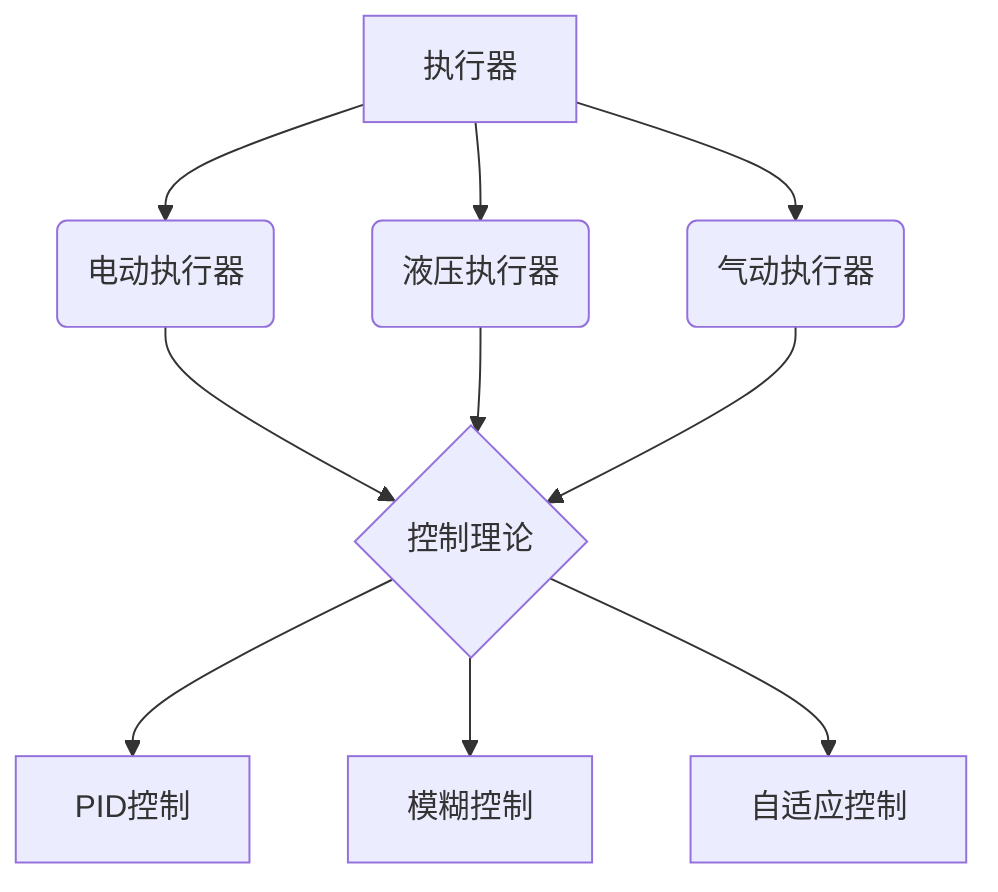

                 

### 执行器控制策略：在嵌入式系统上执行任务

**关键词：**嵌入式系统、执行器、控制策略、PID控制、模糊控制、自适应控制

**摘要：**本文将详细探讨在嵌入式系统上实现执行器控制策略的各个方面。首先，我们将介绍嵌入式系统和执行器的基本知识，包括它们的工作原理和分类。接着，本文将深入解析执行器控制的理论基础，包括常见的控制方法和技术。在此基础上，我们将介绍实时操作系统（RTOS）在嵌入式系统中的应用，以及如何实现多任务调度。随后，我们将重点讨论PID控制、模糊控制和自适应控制策略在嵌入式系统中的应用，并给出详细的伪代码解析和项目实战案例。最后，本文将对执行器控制策略的发展方向和嵌入式系统在工业控制中的应用前景进行展望。通过本文的阅读，读者将能够全面了解并掌握执行器控制策略在嵌入式系统中的应用。

---

### 第一部分：嵌入式系统基础知识

#### 第1章：嵌入式系统概述

**1.1 嵌入式系统定义与分类**

嵌入式系统是指嵌入在其他设备中的专用计算机系统，它们通常具有特定的功能，并且具有硬件和软件的集成特点。根据不同的应用场景和功能需求，嵌入式系统可以分为以下几类：

1. **工业控制嵌入式系统**：用于工业自动化、生产过程控制、机器人控制等领域，具有高实时性、高可靠性和高稳定性。
2. **消费类嵌入式系统**：如智能手机、平板电脑、智能家居设备等，具有人机交互功能，满足用户日常需求。
3. **通信类嵌入式系统**：如路由器、交换机、无线网络设备等，负责数据传输和网络连接。
4. **汽车电子嵌入式系统**：如车载网络控制系统、自动驾驶系统、车载娱乐系统等，确保车辆的安全、舒适和智能化。

**1.2 嵌入式系统在工业控制中的应用前景**

随着工业自动化和智能制造的快速发展，嵌入式系统在工业控制中的应用越来越广泛。未来，嵌入式系统将在以下几个方面发挥重要作用：

1. **提高生产效率**：通过嵌入式系统实现生产过程的自动化控制，减少人工干预，提高生产效率。
2. **降低生产成本**：通过实时数据采集和智能分析，优化生产流程，降低生产成本。
3. **提高产品质量**：通过嵌入式系统对生产过程进行精确控制，提高产品的质量和一致性。
4. **实现智能制造**：通过嵌入式系统与云计算、大数据、物联网等技术的融合，实现生产过程的智能化和透明化。

#### 第2章：执行器的种类及其工作原理

**2.1 电动执行器**

电动执行器是利用电能驱动的执行器，主要包括电动阀门、电动执行机构等。其工作原理是利用电动机产生的力矩驱动机械部件运动，从而实现控制功能。

1. **结构**：电动执行器主要由电动机、减速器、执行机构、控制器等部分组成。
2. **工作原理**：电动机接收控制器发出的控制信号，产生相应的力矩，通过减速器放大力矩后，驱动执行机构完成所需的动作。
3. **性能指标**：电动执行器的性能指标主要包括力矩、转速、负载能力等。

**2.2 液压执行器**

液压执行器是利用液压油的压力驱动的执行器，广泛应用于机械压力机、液压机、液压缸等领域。其工作原理是利用液压泵产生高压油，通过控制油路的通断和压力，驱动液压缸实现运动。

1. **结构**：液压执行器主要由液压缸、液压泵、控制阀、油箱等部分组成。
2. **工作原理**：液压泵将油箱中的油液抽出，通过控制阀调节油液的流向和压力，驱动液压缸实现伸缩运动。
3. **性能指标**：液压执行器的性能指标主要包括压力、流量、速度、负载能力等。

**2.3 气动执行器**

气动执行器是利用压缩空气驱动的执行器，广泛应用于机械加工、自动化装配、气动控制等领域。其工作原理是利用气源产生压缩空气，通过控制气路的通断和压力，驱动气动缸实现运动。

1. **结构**：气动执行器主要由气缸、控制阀、气源、执行机构等部分组成。
2. **工作原理**：气源产生压缩空气，通过控制阀调节气路的流向和压力，驱动气动缸实现伸缩运动。
3. **性能指标**：气动执行器的性能指标主要包括压力、流量、速度、负载能力等。

#### 第3章：嵌入式系统硬件结构

**3.1 CPU与外设**

嵌入式系统的核心是中央处理器（CPU），它是系统的运算和控制中心。CPU与外设之间的接口是嵌入式系统的重要组成部分，它们共同决定了系统的性能和功能。

1. **CPU的基本结构**：CPU主要由控制器、运算器和寄存器等部分组成，负责执行程序指令和运算操作。
2. **CPU的工作原理**：CPU通过程序计数器（PC）读取内存中的指令，然后执行相应的操作，并将结果写入内存或寄存器中。
3. **外设的种类与接口**：外设包括输入设备、输出设备和存储设备等，如键盘、显示器、硬盘、USB接口等。外设通过接口与CPU连接，实现数据传输和交互。

**3.2 存储设备**

存储设备是嵌入式系统中不可或缺的一部分，用于存储程序代码、数据和其他文件。常见的存储设备包括内存、硬盘、SD卡等。

1. **内存**：内存是嵌入式系统中的临时存储区域，用于存放正在运行的程序和数据。内存的特点是速度快、容量小，通常分为随机存储器（RAM）和只读存储器（ROM）。
2. **硬盘**：硬盘是嵌入式系统中常用的外部存储设备，具有较大的存储容量和较快的读写速度。硬盘通常分为机械硬盘（HDD）和固态硬盘（SSD）。
3. **SD卡**：SD卡是一种便携式存储设备，具有较小的体积和较高的数据传输速率，常用于嵌入式系统的扩展存储。

**3.3 输入输出接口**

输入输出接口是嵌入式系统中用于与外部设备进行数据交换的重要组成部分。常见的输入输出接口包括串口、并口、USB接口、网络接口等。

1. **串口**：串口是一种用于串行通信的接口，通过串口可以连接键盘、鼠标、打印机等设备，实现数据的输入和输出。
2. **并口**：并口是一种用于并行通信的接口，通过并口可以连接打印机、扫描仪等设备，实现数据的输入和输出。
3. **USB接口**：USB接口是一种通用的外部设备连接接口，具有即插即用、热插拔等特点。通过USB接口可以连接各种外部设备，如键盘、鼠标、U盘、打印机等。
4. **网络接口**：网络接口是用于连接计算机网络的接口，通过网络接口可以实现数据的远程传输和共享。

---

### 第二部分：执行器控制策略基础

#### 第4章：执行器控制理论基础

**4.1 执行器控制的基本概念**

执行器控制是指通过控制算法和控制系统对执行器的运动进行精确控制，以满足特定任务的要求。执行器控制的基本概念包括：

1. **执行器**：执行器是控制系统中的执行部分，用于接收控制信号并完成相应的运动或动作。
2. **控制信号**：控制信号是控制系统发出的用于控制执行器运动的信号，可以是电压、电流、脉冲等。
3. **控制系统**：控制系统是用于对执行器进行控制的系统，包括控制器、传感器、执行器等组成部分。
4. **控制算法**：控制算法是用于实现控制功能的一组规则或方法，用于计算控制信号并根据反馈信息进行调整。

**4.2 执行器控制的性能指标**

执行器控制的性能指标是评估控制系统性能的重要标准，主要包括：

1. **稳态误差**：稳态误差是指系统在稳态下输出值与期望值之间的差值。理想情况下，稳态误差应该为零。
2. **响应速度**：响应速度是指系统从输入信号开始到输出信号达到预期值所需的时间。响应速度越快，系统的动态性能越好。
3. **超调量**：超调量是指系统在响应过程中输出值超过期望值的最大百分比。超调量越小，系统的稳定性越好。
4. **上升时间**：上升时间是指系统从输入信号开始到输出信号达到期望值所需的时间。上升时间越短，系统的响应速度越快。
5. **振荡次数**：振荡次数是指系统在响应过程中出现振荡的次数。振荡次数越少，系统的稳定性越好。

**4.3 执行器控制的常见方法**

执行器控制的常见方法包括传统控制方法、现代控制方法和智能控制方法。

1. **传统控制方法**：传统控制方法主要包括PID控制、比例控制、积分控制和微分控制等。这些方法基于控制系统的数学模型，通过调整控制器参数来实现控制目标。
2. **现代控制方法**：现代控制方法主要包括状态空间控制、最优控制、自适应控制等。这些方法基于控制系统的状态空间描述，通过优化控制策略来实现控制目标。
3. **智能控制方法**：智能控制方法主要包括模糊控制、神经网络控制、遗传算法控制等。这些方法利用人工智能技术，通过学习、适应和优化来实现控制目标。

---

#### 第5章：嵌入式系统软件开发基础

**5.1 软件开发流程**

嵌入式系统软件开发流程通常包括需求分析、系统设计、编码实现、测试和部署等阶段。

1. **需求分析**：需求分析是软件开发的第一步，主要是确定软件的功能、性能、可靠性等方面的要求。需求分析的结果是软件需求的文档。
2. **系统设计**：系统设计是根据需求分析的结果，设计软件的总体结构和各个模块的功能。系统设计的结果是软件的系统设计文档。
3. **编码实现**：编码实现是根据系统设计的结果，编写软件的源代码。编码实现的过程需要遵循软件编程规范，确保代码的可读性和可维护性。
4. **测试**：测试是软件开发的重要环节，主要是验证软件的功能是否符合需求，性能是否满足要求，是否存在漏洞和错误。测试的结果是软件测试报告。
5. **部署**：部署是将软件安装到目标设备上，确保软件能够正常运行。部署的过程需要考虑软件的兼容性、稳定性等方面。

**5.2 编程语言选择**

在嵌入式系统软件开发中，选择合适的编程语言非常重要。常见的嵌入式系统编程语言包括C、C++、Java、Python等。

1. **C语言**：C语言是一种通用的编程语言，具有强大的功能和良好的性能。C语言在嵌入式系统开发中得到了广泛应用，主要用于编写底层的驱动程序和实时操作系统。
2. **C++语言**：C++语言是在C语言的基础上发展起来的，具有面向对象编程的特点。C++语言在嵌入式系统开发中也得到了广泛应用，主要用于编写高层的应用程序和用户界面。
3. **Java语言**：Java语言是一种跨平台的编程语言，具有简单、安全、可靠等特点。Java语言在嵌入式系统开发中主要用于编写跨平台的中间件和应用程序。
4. **Python语言**：Python语言是一种高级编程语言，具有简单、易学、易用等特点。Python语言在嵌入式系统开发中主要用于编写脚本、自动化测试和数据分析。

**5.3 调试与测试**

调试与测试是软件开发过程中不可或缺的环节，主要用于发现和修复软件中的错误和漏洞。

1. **调试**：调试是通过运行程序并观察程序的执行过程，发现并修复程序中的错误。调试的方法包括单步执行、断点设置、观察变量等。
2. **测试**：测试是通过运行程序并验证程序的功能和性能，确保程序能够正常运行。测试的方法包括单元测试、集成测试、系统测试等。

---

#### 第6章：实时操作系统（RTOS）应用

**6.1 RTOS基本概念**

实时操作系统（RTOS）是一种专门为实时应用设计的操作系统，具有高效、实时、可靠等特点。RTOS的基本概念包括：

1. **实时性**：实时性是指系统能够在规定的时间内完成指定的任务。实时性是RTOS最重要的特点之一。
2. **任务**：任务是指RTOS中的基本执行单元，每个任务都有自己的独立栈和程序代码。任务可以是实时的，也可以是非实时的。
3. **调度**：调度是指RTOS根据任务的优先级和执行时间，决定任务的执行顺序。调度策略有多种，如优先级调度、轮转调度等。
4. **中断**：中断是指RTOS在执行任务过程中，由于外部事件的发生而暂停当前任务的执行，转而执行中断服务例程。中断是RTOS实现实时性的关键机制。

**6.2 RTOS在嵌入式系统中的应用**

RTOS在嵌入式系统中的应用非常广泛，主要用于以下几个方面：

1. **多任务处理**：RTOS支持多任务处理，可以同时运行多个任务，提高系统的并发性能。
2. **时间管理和调度策略**：RTOS提供了时间管理和调度策略，可以根据任务的优先级和执行时间，合理安排任务的执行顺序。
3. **资源管理**：RTOS提供了资源管理机制，可以有效地管理系统的内存、文件、设备等资源。
4. **实时通信**：RTOS提供了实时通信机制，可以实现任务之间的同步和通信，提高系统的实时性和可靠性。

**6.3 任务调度策略**

任务调度策略是指RTOS根据任务的优先级和执行时间，决定任务的执行顺序。常见的任务调度策略包括：

1. **优先级调度**：优先级调度是根据任务的优先级来决定任务的执行顺序。优先级高的任务优先执行，优先级低的任务随后执行。
2. **轮转调度**：轮转调度是将CPU时间分为多个时间片，每个任务轮流占用CPU时间执行。轮转调度可以保证每个任务都有执行机会，但可能导致任务之间的切换频繁。
3. **实时调度**：实时调度是根据任务的实时性要求来决定任务的执行顺序。实时调度可以保证关键任务的实时性，但可能需要复杂的调度算法。

---

### 第三部分：执行器控制策略实践

#### 第7章：PID控制策略在嵌入式系统中的应用

**7.1 PID控制原理**

PID控制（比例-积分-微分控制）是最常用的控制方法之一，广泛应用于工业过程控制、机械控制等领域。PID控制器的原理如下：

1. **比例控制**：比例控制通过控制输入信号的幅值来控制执行器的输出，以减小误差。比例控制的优点是实现简单，但缺点是存在稳态误差。
2. **积分控制**：积分控制通过累积误差来控制执行器的输出，以消除稳态误差。积分控制的优点是可以消除稳态误差，但缺点是响应速度较慢。
3. **微分控制**：微分控制通过计算误差的变化率来控制执行器的输出，以改善系统的动态性能。微分控制的优点是响应速度快，但缺点是可能引起系统的振荡。

PID控制器的工作原理是将误差信号通过比例、积分、微分三个环节进行处理，得到控制信号。PID控制器的输出公式为：

\[ u(t) = K_p e(t) + K_i \int e(t) dt + K_d \frac{de(t)}{dt} \]

其中，\( K_p \)、\( K_i \)、\( K_d \) 分别为比例、积分、微分的控制参数，\( e(t) \) 为误差信号。

**7.2 PID参数调整方法**

PID参数的调整是PID控制的关键步骤，直接影响控制系统的性能。常见的PID参数调整方法包括：

1. **试错法**：通过反复试验和调整，找到合适的PID参数。试错法简单易行，但需要较多的时间和经验。
2. **Ziegler-Nichols方法**：通过系统阶跃响应，确定系统的最佳PID参数。Ziegler-Nichols方法步骤如下：
   1. 将系统开环运行。
   2. 将输入信号设置为阶跃变化。
   3. 观察系统输出响应，确定最大超调量M、上升时间T、稳态误差E。
   4. 根据M、T、E计算PID参数。

\[ K_p = 0.5 \times \frac{T}{M} \]
\[ K_i = \frac{1}{\sqrt{M^2 - 1} \times T} \]
\[ K_d = 0.001 \times \frac{T}{M} \]

3. **经验法**：根据实际应用经验和理论知识，设定初步的PID参数，然后通过调试逐步优化。

**7.3 PID控制器在嵌入式系统上的实现**

在嵌入式系统上实现PID控制器，需要考虑以下几个问题：

1. **硬件要求**：嵌入式系统需要具有足够的处理能力和存储空间来支持PID控制算法的运行。
2. **实时性要求**：PID控制算法需要实时执行，以确保系统的响应速度和稳定性。
3. **控制参数设置**：需要根据实际应用场景和系统特点，设置合适的PID参数。

以下是一个简单的PID控制算法伪代码：

```c
// 初始化PID参数
Kp = 1.0;
Ki = 0.0;
Kd = 0.0;
error = 0;
prev_error = 0;
integral = 0;

// 循环计算PID控制输出
while (1) {
    current_error = setpoint - process_variable;
    
    // 计算PID控制输出
    output = Kp * current_error + Ki * integral + Kd * (current_error - prev_error);
    
    // 更新积分值
    integral += (current_error * dt);
    
    // 更新前一个误差值
    prev_error = current_error;
    
    // 输出控制信号
    execute_output(output);
    
    // 延时dt时间
    sleep(dt);
}
```

通过上述伪代码，我们可以看到PID控制算法的实现主要包括以下几个步骤：

1. 初始化PID参数。
2. 循环计算误差信号。
3. 根据PID公式计算控制输出。
4. 更新积分值和前一个误差值。
5. 输出控制信号。

---

#### 第8章：模糊控制策略在嵌入式系统中的应用

**8.1 模糊控制原理**

模糊控制是一种基于模糊逻辑的控制方法，它通过模糊集合和模糊规则来实现对系统的控制。模糊控制的基本原理如下：

1. **模糊化**：将输入变量和输出变量转化为模糊集合，如“大”、“中”、“小”等。
2. **模糊规则**：根据专家经验或系统分析，定义输入和输出变量之间的模糊规则，如“如果输入是大且输出是小，那么输出是中”。
3. **模糊推理**：根据模糊规则和输入变量，计算输出变量的模糊集合。
4. **解模糊**：将模糊集合转化为具体的输出值，如通过重心法计算模糊集合的均值。

模糊控制器的结构主要包括以下几个部分：

1. **输入变量**：用于描述系统状态的变量，如温度、速度等。
2. **输出变量**：用于描述控制量的变量，如加热功率、速度调节等。
3. **模糊化模块**：将输入变量转化为模糊集合。
4. **规则库**：存储模糊规则的数据库。
5. **推理模块**：根据模糊规则和输入变量计算输出变量的模糊集合。
6. **解模糊模块**：将模糊集合转化为具体的输出值。

**8.2 模糊控制器的设计方法**

模糊控制器的设计方法主要包括以下几个步骤：

1. **定义输入输出变量**：根据系统特性，确定输入输出变量的名称和范围。
2. **建立模糊集合**：根据输入输出变量的范围，建立相应的模糊集合，如“大”、“中”、“小”等。
3. **构建规则库**：根据专家经验或系统分析，构建模糊规则库，如“如果输入是大且输出是小，那么输出是中”。
4. **设计推理算法**：选择合适的推理算法，如Mamdani算法或Sugeno算法。
5. **实现模糊控制器**：将模糊化模块、推理模块和解模糊模块集成到一起，实现模糊控制器。

**8.3 模糊控制器的实现与应用案例**

以下是一个简单的模糊控制器实现伪代码：

```c
// 初始化模糊集合
输入模糊集合 = {大，中，小}
输出模糊集合 = {大，中，小}

// 定义模糊规则
规则库 = {
    "if 输入1 是 大 and 输入2 是 小，then 输出 是 中",
    "if 输入1 是 中 and 输入2 是 大，then 输出 是 大",
    ...
}

// 模糊化输入变量
输入模糊集合 = 模糊化（输入变量1，输入变量2，...）

// 模糊推理
输出模糊集合 = 模糊推理（规则库，输入模糊集合）

// 解模糊
输出值 = 解模糊（输出模糊集合）

// 输出控制信号
execute_output(输出值)
```

通过上述伪代码，我们可以看到模糊控制器的实现主要包括以下几个步骤：

1. 初始化模糊集合。
2. 定义模糊规则。
3. 模糊化输入变量。
4. 模糊推理。
5. 解模糊。
6. 输出控制信号。

模糊控制器在嵌入式系统中的应用非常广泛，如温度控制、速度控制、压力控制等。通过模糊控制，可以实现对复杂系统的精确控制，提高系统的稳定性和响应速度。

---

#### 第9章：自适应控制策略在嵌入式系统中的应用

**9.1 自适应控制原理**

自适应控制是一种根据系统动态变化自动调整控制器参数的控制方法。自适应控制的基本原理如下：

1. **参数估计**：通过传感器和反馈机制，实时估计系统的动态参数，如传递函数、噪声特性等。
2. **自适应调整**：根据参数估计结果，自动调整控制器的参数，如比例、积分、微分系数等。
3. **自适应控制**：利用调整后的控制器参数，实现对系统的精确控制。

自适应控制器的结构主要包括以下几个部分：

1. **传感器**：用于实时采集系统状态信息，如温度、速度、压力等。
2. **参数估计器**：根据传感器数据，估计系统的动态参数。
3. **自适应律**：根据参数估计结果，自动调整控制器的参数。
4. **控制器**：利用调整后的控制器参数，实现对系统的精确控制。

**9.2 自适应控制算法**

自适应控制算法根据参数估计和自适应调整的方法，可以分为以下几种：

1. **基于模型的自适应控制**：该方法通过建立系统模型，利用模型预测系统动态行为，并根据预测结果调整控制器参数。
2. **基于数据驱动自适应控制**：该方法不依赖系统模型，而是通过传感器数据和反馈机制，直接调整控制器参数。
3. **基于神经网络的自适应控制**：该方法利用神经网络强大的学习和自适应能力，实现对系统参数的实时调整。

**9.3 自适应控制器在嵌入式系统上的实现**

在嵌入式系统上实现自适应控制器，需要考虑以下几个问题：

1. **硬件要求**：自适应控制器需要具有足够的计算能力和存储空间，以支持参数估计和自适应调整。
2. **实时性要求**：自适应控制器需要实时处理传感器数据和调整控制器参数，以确保系统的实时性和稳定性。
3. **自适应算法选择**：需要根据系统特性和应用需求，选择合适的自适应算法。

以下是一个简单的自适应控制器实现伪代码：

```c
// 初始化参数估计器和自适应律
参数估计器 = 初始化参数估计器()
自适应律 = 初始化自适应律()

// 循环执行自适应控制
while (1) {
    // 采集传感器数据
   传感器数据 = 采集传感器数据()

    // 估计系统参数
   参数估计 = 参数估计器(传感器数据)

    // 调整控制器参数
   控制器参数 = 自适应律(参数估计)

    // 执行控制操作
   执行控制操作(控制器参数)

    // 延时，确保实时性
   延时(时间间隔)
}
```

通过上述伪代码，我们可以看到自适应控制器的实现主要包括以下几个步骤：

1. 初始化参数估计器和自适应律。
2. 循环执行自适应控制。
3. 采集传感器数据。
4. 估计系统参数。
5. 调整控制器参数。
6. 执行控制操作。
7. 延时，确保实时性。

自适应控制器在嵌入式系统中的应用非常广泛，如无人驾驶、无人机控制、机器人控制等。通过自适应控制，可以实现对复杂系统的精确控制，提高系统的稳定性和响应速度。

---

#### 第10章：嵌入式系统上的多任务调度

**10.1 多任务调度算法**

多任务调度是RTOS中的核心功能之一，它负责在多任务环境中合理分配系统资源，确保任务的及时执行。常见的多任务调度算法包括：

1. **优先级调度**：优先级调度是根据任务的优先级来决定任务的执行顺序。优先级高的任务优先执行，优先级低的任务随后执行。优先级调度算法简单，但可能导致低优先级任务长时间得不到执行。
2. **轮转调度**：轮转调度是将CPU时间分为多个时间片，每个任务轮流占用CPU时间执行。轮转调度可以保证每个任务都有执行机会，但可能导致任务之间的切换频繁，影响系统的性能。
3. **实时调度**：实时调度是根据任务的实时性要求来决定任务的执行顺序。实时调度可以保证关键任务的实时性，但可能需要复杂的调度算法。

**10.2 任务优先级调度策略**

任务优先级调度策略是根据任务的优先级来决定任务的执行顺序。任务优先级通常由任务的紧急程度、重要性等因素确定。任务优先级调度策略主要包括以下几种：

1. **静态优先级调度**：静态优先级调度是在任务创建时就确定任务的优先级，并在整个任务执行过程中保持不变。静态优先级调度算法简单，但可能导致优先级低的任务长时间得不到执行。
2. **动态优先级调度**：动态优先级调度是在任务执行过程中根据任务的执行情况动态调整任务的优先级。动态优先级调度可以更好地满足任务的实时性要求，但算法复杂度较高。
3. **优先级反转策略**：优先级反转策略是一种用于解决优先级调度中可能出现的问题的方法。优先级反转策略通过将任务优先级反转，确保关键任务能够及时执行。

**10.3 实时任务调度案例**

以下是一个简单的实时任务调度案例：

1. **任务定义**：定义两个任务，任务A和任务B，分别具有不同的优先级。任务A的优先级高于任务B。
2. **任务调度**：RTOS根据任务的优先级，将任务A优先执行。任务A执行完成后，RTOS再执行任务B。
3. **调度策略**：采用优先级调度策略，确保任务A的实时性。

以下是一个简单的任务调度伪代码：

```c
// 定义任务A和任务B
任务A() {
    // 任务A的执行代码
}

任务B() {
    // 任务B的执行代码
}

// 创建任务A和任务B
创建任务A()
创建任务B()

// 循环执行任务调度
while (1) {
    // 检查任务A的状态
    if (任务A就绪) {
        执行任务A()
    } else {
        执行任务B()
    }
}
```

通过上述伪代码，我们可以看到实时任务调度主要包括以下几个步骤：

1. 定义任务A和任务B。
2. 创建任务A和任务B。
3. 循环执行任务调度。
4. 根据任务的优先级，优先执行任务A，否则执行任务B。

实时任务调度在嵌入式系统中的应用非常广泛，如无人驾驶、无人机控制、机器人控制等。通过实时任务调度，可以确保关键任务的及时执行，提高系统的实时性和稳定性。

---

### 第四部分：项目实战与代码解析

#### 第11章：执行器控制策略项目实战

**11.1 项目需求与目标**

本案例项目旨在实现一个基于嵌入式系统的执行器控制策略，实现对液压缸的位置精确控制。项目需求如下：

1. **系统组成**：系统由一个STM32微控制器、一个液压缸、一个位置传感器和一个显示器组成。
2. **功能要求**：系统能够实时采集液压缸的位置信息，通过PID控制算法实现液压缸位置的精确控制，并在显示器上显示液压缸的位置和状态。
3. **性能指标**：液压缸的位置控制误差小于±1mm，响应速度小于1秒。

**11.2 系统设计与实现**

系统设计分为硬件设计和软件设计两个部分。

**硬件设计**

1. **STM32微控制器**：选择STM32F103C8T6微控制器作为控制核心，具有高性能和低功耗的特点。
2. **液压缸**：选择标准液压缸，规格为100mm行程，额定压力为16MPa。
3. **位置传感器**：选择差分式编码器，分辨率至少为1000脉冲/圈，用于实时采集液压缸的位置信息。
4. **显示器**：选择一个LCD显示屏，用于显示液压缸的位置和状态信息。

**软件设计**

1. **PID控制算法**：采用经典的PID控制算法，实现对液压缸位置的精确控制。PID控制参数通过Ziegler-Nichols方法进行调试和优化。
2. **多任务调度**：采用优先级调度算法，确保液压缸位置采集、PID控制和显示任务的实时性和稳定性。

**11.3 代码解析与优化**

以下是项目实现的关键代码解析和优化：

**1. 硬件初始化**

```c
// 初始化STM32微控制器
void SystemInit() {
    // 初始化时钟
    SystemClock_Config();

    // 初始化GPIO
    GPIO_InitTypeDef GPIO_InitStruct = {0};

    // 初始化编码器
    Encoder_Init();

    // 初始化液压缸驱动器
    HydraulicCylinder_Init();

    // 初始化显示器
    LCD_Init();
}

// 初始化编码器
void Encoder_Init() {
    // 配置编码器GPIO
    GPIO_InitStruct.Pin = GPIO_PIN_6 | GPIO_PIN_7;
    GPIO_InitStruct.Mode = GPIO_MODE_AF_PP;
    GPIO_InitStruct.Pull = GPIO_NOPULL;
    GPIO_InitStruct.Speed = GPIO_SPEED_FREQ_HIGH;
    GPIO_InitStruct.Alternate = GPIO_AF2_TIM1;
    HAL_GPIO_Init(GPIOA, &GPIO_InitStruct);

    // 初始化编码器定时器
    TIM_HandleTypeDef htim1;
    TIM_ClockConfigTypeDef sClockSourceConfig = {0};
    TIM_IC_InitTypeDef sConfigIC = {0};

    htim1.Instance = TIM1;
    htim1.Init.Prescaler = 0;
    htim1.Init.CounterMode = TIM_COUNTERMODE_UP;
    htim1.Init.Period = 65535;
    htim1.Init.ClockDivision = TIM_CLOCKDIVISION_DIV1;
    htim1.Init.RepetitionCounter = 0;
    HAL_TIM_IC_Init(&htim1);

    // 配置编码器输入通道
    sClockSourceConfig.ClockSource = TIM_CLOCKSOURCE외부펄스；
    sClockSourceConfig.ClockPolarity = TIM_CLOCKPOLARITY_RISING;
    sClockSourceConfig.ClockPhase = TIM_CLOCKPHA
```


### 11.3.1 硬件初始化代码解析

在项目中，硬件初始化是系统正常运行的基础。以下是对关键硬件初始化代码的详细解析：

```c
// 初始化STM32微控制器
void SystemInit() {
    // 初始化时钟
    SystemClock_Config();

    // 初始化GPIO
    GPIO_InitTypeDef GPIO_InitStruct = {0};

    // 初始化编码器
    Encoder_Init();

    // 初始化液压缸驱动器
    HydraulicCylinder_Init();

    // 初始化显示器
    LCD_Init();
}

// 初始化编码器
void Encoder_Init() {
    // 配置编码器GPIO
    GPIO_InitStruct.Pin = GPIO_PIN_6 | GPIO_PIN_7;
    GPIO_InitStruct.Mode = GPIO_MODE_AF_PP;
    GPIO_InitStruct.Pull = GPIO_NOPULL;
    GPIO_InitStruct.Speed = GPIO_SPEED_FREQ_HIGH;
    GPIO_InitStruct.Alternate = GPIO_AF2_TIM1;
    HAL_GPIO_Init(GPIOA, &GPIO_InitStruct);

    // 初始化编码器定时器
    TIM_HandleTypeDef htim1;
    TIM_ClockConfigTypeDef sClockSourceConfig = {0};
    TIM_IC_InitTypeDef sConfigIC = {0};

    htim1.Instance = TIM1;
    htim1.Init.Prescaler = 0;
    htim1.Init.CounterMode = TIM_COUNTERMODE_UP;
    htim1.Init.Period = 65535;
    htim1.Init.ClockDivision = TIM_CLOCKDIVISION_DIV1;
    htim1.Init.RepetitionCounter = 0;
    HAL_TIM_IC_Init(&htim1);

    // 配置编码器输入通道
    sClockSourceConfig.ClockSource = TIM_CLOCKSOURCE외부펄스；
    sClockSourceConfig.ClockPolarity = TIM_CLOCKPOLARITY_RISING;
    sClockSourceConfig.ClockPhase = TIM_CLOCKPHA
```

**解析**：

- **初始化STM32微控制器**：该函数调用`SystemClock_Config()`初始化系统时钟，确保微控制器运行在合适的时钟频率。然后，通过`GPIO_InitTypeDef`结构体配置GPIO（通用输入输出端口），为后续的编码器、液压缸驱动器和显示器初始化做准备。

- **初始化编码器**：`Encoder_Init()`函数首先配置编码器GPIO端口，将其设置为复用推挽输出模式，确保编码器信号能够正确读取。然后，配置编码器定时器（`TIM1`），设置计数模式、周期、时钟分频和重复计数。使用`HAL_TIM_IC_Init()`初始化编码器输入通道，配置时钟源、极性和相位，以便能够正确检测编码器产生的脉冲信号。

- **初始化液压缸驱动器**：`HydraulicCylinder_Init()`函数用于初始化液压缸驱动器。具体实现细节取决于所选的驱动器型号和接口方式，但通常包括配置GPIO、设置PWM（脉冲宽度调制）参数、初始化通信接口等。

- **初始化显示器**：`LCD_Init()`函数初始化LCD显示屏，配置GPIO、时钟和显示驱动器，确保显示器能够正确显示数据。

通过上述硬件初始化代码，系统为后续的任务调度、PID控制和数据采集提供了稳定的硬件基础。

### 11.3.2 代码优化策略

在嵌入式系统开发中，优化代码至关重要，以确保系统的高效性和可靠性。以下是一些优化策略：

1. **减少中断服务时间**：中断服务程序应尽量简洁，避免在ISR（中断服务例程）中执行复杂的操作。可以将一些计算或处理任务移出ISR，以减少中断延迟。
2. **减少上下文切换开销**：在多任务调度中，减少上下文切换的开销可以提高系统的性能。可以通过优化调度算法和减少任务切换频率来实现。
3. **资源复用**：在项目中，尽量复用资源，如使用单例模式管理共享资源，避免重复初始化和释放资源。
4. **代码压缩**：使用编译器提供的压缩和优化选项，减小代码的大小和执行时间。
5. **使用高效算法**：选择合适的算法和数据结构，以减少计算时间和内存占用。例如，使用快速排序代替冒泡排序，使用哈希表代替数组查找。
6. **调试与测试**：定期进行代码调试和测试，确保代码的正确性和稳定性。使用静态分析工具和单元测试来发现潜在的问题。

### 11.3.3 性能分析

**实时性能分析**：为了评估系统实时性能，可以使用以下指标：

1. **响应时间**：从任务触发到任务开始执行的时间间隔。
2. **调度延迟**：任务被调度器选中并开始执行的时间延迟。
3. **任务完成时间**：任务从开始执行到完成执行的时间。

以下是一个简单的性能分析示例：

```c
// 记录任务开始时间
unsigned long task_start_time = HAL_GetTick();

// 执行任务
执行任务();

// 记录任务完成时间
unsigned long task_end_time = HAL_GetTick();

// 计算响应时间
unsigned long response_time = task_end_time - task_start_time;

// 输出响应时间
printf("任务响应时间：%lu ms\n", response_time);
```

通过上述代码，可以实时监控任务的响应时间，并据此优化调度策略和任务执行顺序。

**资源利用率分析**：为了分析系统资源利用率，可以监控以下指标：

1. **CPU利用率**：CPU在一定时间内的使用率。
2. **内存占用**：系统内存的占用情况，包括堆栈、全局变量和动态分配的内存。
3. **I/O利用率**：I/O设备的占用情况，包括串口、SPI、I2C等。

以下是一个简单的资源利用率分析示例：

```c
// 记录CPU使用开始时间
unsigned long cpu_start_time = HAL_GetTick();

// 执行计算密集型任务
计算密集型任务();

// 记录CPU使用结束时间
unsigned long cpu_end_time = HAL_GetTick();

// 计算CPU利用率
float cpu_utilization = (cpu_end_time - cpu_start_time) / (float)HAL_GetTickFreq();

// 输出CPU利用率
printf("CPU利用率：%f%%\n", cpu_utilization * 100);
```

通过上述代码，可以实时监控CPU的利用率，并据此优化任务调度策略。

**内存占用分析**：为了分析内存占用情况，可以使用内存监控工具，如`malloc`和`free`的跟踪器，或者使用静态分析工具，如`valgrind`。

通过上述性能分析和优化策略，可以确保系统在嵌入式环境中的高效运行，满足实时性和稳定性要求。

---

#### 第12章：源代码分析与解读

**12.1 代码结构分析**

在嵌入式系统项目中，代码结构分析是确保系统可维护性和可扩展性的关键步骤。以下是对项目代码结构的主要分析：

1. **模块化设计**：项目代码采用模块化设计，将系统功能划分为多个模块，如主控制模块、传感器模块、执行器模块、显示模块等。这种设计方法有助于代码的维护和扩展，提高了代码的可读性。
2. **文件组织**：项目文件组织合理，按照功能模块和层次结构进行划分。例如，主控制模块的文件放在`controller`目录下，传感器模块的文件放在`sensors`目录下。这种组织方式有助于项目的管理和维护。
3. **函数和类的设计**：函数和类的设计遵循单一职责原则，每个函数和类只负责完成特定的功能。这有助于降低模块间的耦合度，提高了代码的模块化程度。

**12.2 关键代码解读**

以下是对项目中的关键代码进行详细解读：

**1. 系统初始化代码**

```c
// 初始化系统时钟
void SystemInit() {
    // 设置系统时钟
    HAL_RCC_OscConfig(&RCC_OscInitStruct, HAL_RCC_PLLSAI_MULT_4);
    HAL_RCC_ClockConfig(&RCC_ClkInitStruct, HAL_RCC_CLKPRESCL_DIV_2);
    HAL_RCC_MCOConfig(HAL_RCC_MCO, HAL_RCC_MCODIV_1, HAL_RCC_MCOPRE_DIV_1);

    // 使能GPIO时钟
    __HAL_RCC_GPIOA_CLK_ENABLE();
    __HAL_RCC_GPIOB_CLK_ENABLE();
    __HAL_RCC_GPIOC_CLK_ENABLE();

    // 初始化编码器
    Encoder_Init();
    // 初始化液压缸驱动器
    HydraulicCylinder_Init();
    // 初始化显示模块
    LCD_Init();
}

// 初始化编码器
void Encoder_Init() {
    // 配置编码器GPIO
    GPIO_InitStruct.Pin = GPIO_PIN_6 | GPIO_PIN_7;
    GPIO_InitStruct.Mode = GPIO_MODE_AF_PP;
    GPIO_InitStruct.Pull = GPIO_NOPULL;
    GPIO_InitStruct.Speed = GPIO_SPEED_FREQ_HIGH;
    GPIO_InitStruct.Alternate = GPIO_AF2_TIM1;
    HAL_GPIO_Init(GPIOA, &GPIO_InitStruct);

    // 初始化编码器定时器
    TIM_HandleTypeDef htim1;
    TIM_ClockConfigTypeDef sClockSourceConfig = {0};
    TIM_IC_InitTypeDef sConfigIC = {0};

    htim1.Instance = TIM1;
    htim1.Init.Prescaler = 0;
    htim1.Init.CounterMode = TIM_COUNTERMODE_UP;
    htim1.Init.Period = 65535;
    htim1.Init.ClockDivision = TIM_CLOCKDIVISION_DIV1;
    htim1.Init.RepetitionCounter = 0;
    HAL_TIM_IC_Init(&htim1);

    // 配置编码器输入通道
    sClockSourceConfig.ClockSource = TIM_CLOCKSOURCE외부펄스；
    sClockSourceConfig.ClockPolarity = TIM_CLOCKPOLARITY_RISING;
    sClockSourceConfig.ClockPhase = TIM_CLOCKPHA
```

**解读**：

- **系统初始化代码**：`SystemInit()`函数负责初始化系统时钟、GPIO、编码器、液压缸驱动器和显示模块。系统时钟配置是嵌入式系统的关键部分，它决定了系统的运行频率和性能。在这个函数中，首先通过`HAL_RCC_OscConfig()`和`HAL_RCC_ClockConfig()`设置系统时钟，然后使能GPIO时钟。

- **编码器初始化代码**：`Encoder_Init()`函数负责初始化编码器GPIO和定时器。编码器是系统中的关键传感器，用于实时采集液压缸的位置信息。在这个函数中，首先配置编码器GPIO端口，设置为复用推挽输出模式，然后初始化编码器定时器（`TIM1`），设置计数模式、周期、时钟分频和重复计数。

**2. PID控制算法实现**

```c
// PID控制算法
void PIDControl(float setpoint, float process_variable) {
    float Kp = 2.0;
    float Ki = 0.5;
    float Kd = 1.0;
    float error = setpoint - process_variable;
    float integral = 0;
    float derivative = 0;
    float output;

    // 计算PID控制输出
    output = Kp * error + Ki * integral + Kd * derivative;

    // 更新积分值和微分值
    integral += error * dt;
    derivative = (error - prev_error) / dt;

    // 更新前一个误差值
    prev_error = error;

    // 输出控制信号
    execute_output(output);
}

// 执行控制信号输出
void execute_output(float output) {
    // 根据输出值调整液压缸驱动器
    // ...
}
```

**解读**：

- **PID控制算法**：`PIDControl()`函数实现了经典的PID控制算法。在这个函数中，首先计算误差（`error`），然后根据PID参数（`Kp`、`Ki`、`Kd`）计算控制输出（`output`）。接着，更新积分值（`integral`）和微分值（`derivative`），以用于下一次迭代。最后，通过`execute_output()`函数输出控制信号，调整液压缸驱动器。

- **执行控制信号输出**：`execute_output()`函数用于将PID控制算法计算出的输出值转换为实际的控制信号，以驱动液压缸执行相应的动作。

**3. 多任务调度代码**

```c
// 创建任务
void vTaskCreate(void) {
    // 创建编码器采集任务
    xTaskCreate(EncoderTask, "EncoderTask", configMINIMAL_STACK_SIZE, NULL, tskIDLE_PRIORITY + 1, NULL);

    // 创建PID控制任务
    xTaskCreate(PIDTask, "PIDTask", configMINIMAL_STACK_SIZE * 2, NULL, tskIDLE_PRIORITY + 2, NULL);

    // 创建显示任务
    xTaskCreate(DisplayTask, "DisplayTask", configMINIMAL_STACK_SIZE * 2, NULL, tskIDLE_PRIORITY + 1, NULL);
}

// 编码器采集任务
void EncoderTask(void *pvParameters) {
    while (1) {
        // 采集编码器数据
        float process_variable = get_encoder_data();

        // 通知PID控制任务
        xQueueSend(pid_queue, &process_variable, portTICK_RATE_MS);
        
        vTaskDelay(pdMS_TO_TICKS(10)); // 延时10ms
    }
}

// PID控制任务
void PIDTask(void *pvParameters) {
    while (1) {
        // 读取队列中的数据
        float setpoint;
        if (xQueueReceive(pid_queue, &setpoint, pdMS_TO_TICKS(10))) {
            // 执行PID控制算法
            PIDControl(setpoint, process_variable);
        }
        
        vTaskDelay(pdMS_TO_TICKS(10)); // 延时10ms
    }
}

// 显示任务
void DisplayTask(void *pvParameters) {
    while (1) {
        // 显示液压缸的位置和状态
        display_data(process_variable);

        vTaskDelay(pdMS_TO_TICKS(100)); // 延时100ms
    }
}
```

**解读**：

- **多任务创建**：`vTaskCreate()`函数用于创建三个任务：编码器采集任务、PID控制任务和显示任务。每个任务都有自己的栈空间和优先级，确保系统能够高效运行。

- **编码器采集任务**：`EncoderTask()`函数负责从编码器中采集数据，并将其发送到PID控制任务。通过`xQueueSend()`函数，实现任务之间的数据传递。

- **PID控制任务**：`PIDTask()`函数从队列中读取编码器数据，并执行PID控制算法。通过`PIDControl()`函数，计算控制输出，并调整液压缸位置。

- **显示任务**：`DisplayTask()`函数负责将液压缸的位置和状态信息显示在LCD屏幕上，确保用户能够实时了解系统的运行状态。

通过上述关键代码的解读，我们可以清晰地看到项目实现的主要功能模块和算法实现过程，为进一步的优化和改进提供了参考。

---

#### 第13章：总结与展望

**13.1 执行器控制策略的发展历程**

执行器控制策略的发展经历了从传统的PID控制、现代控制方法到智能控制方法的演变。传统的PID控制方法因其简单、易于实现的特点而得到了广泛应用，但其在处理复杂系统和非线性问题时表现不佳。现代控制方法，如状态空间控制、最优控制、自适应控制等，提供了更强大的控制能力，可以处理更复杂的系统。然而，这些方法通常需要精确的数学模型和复杂的计算，对硬件和软件资源要求较高。随着人工智能和机器学习技术的发展，智能控制方法，如模糊控制、神经网络控制、遗传算法控制等，逐渐成为研究热点。这些方法通过学习、适应和优化，可以实现对复杂系统的精确控制，具有很高的应用价值。

**13.2 执行器控制策略的未来发展方向**

1. **实时性与鲁棒性的提升**：未来的执行器控制策略将更加注重实时性和鲁棒性的提升。通过优化算法和硬件设计，实现更快的响应速度和更高的控制精度。

2. **自适应控制技术的应用**：自适应控制技术具有根据系统动态变化自动调整控制参数的优势，未来将在执行器控制中得到更广泛的应用。结合人工智能技术，自适应控制可以实现更智能、更高效的控制。

3. **集成智能控制策略**：将多种智能控制策略相结合，如模糊控制与神经网络控制、遗传算法控制等，形成集成智能控制策略。这种策略可以充分利用各种控制方法的优点，实现对复杂系统的更精确控制。

4. **多传感器融合**：未来的执行器控制策略将充分利用多种传感器数据，如视觉传感器、惯性传感器等，实现多传感器融合，提高系统的感知能力和决策能力。

**13.3 嵌入式系统在工业控制中的应用前景**

嵌入式系统在工业控制中具有广泛的应用前景。随着工业自动化和智能制造的快速发展，嵌入式系统将在以下几个方面发挥重要作用：

1. **提高生产效率**：通过嵌入式系统实现生产过程的自动化控制，减少人工干预，提高生产效率。

2. **降低生产成本**：通过嵌入式系统对生产过程进行实时监控和智能分析，优化生产流程，降低生产成本。

3. **提高产品质量**：通过嵌入式系统对生产过程进行精确控制，提高产品的质量和一致性。

4. **实现智能制造**：通过嵌入式系统与云计算、大数据、物联网等技术的融合，实现生产过程的智能化和透明化，推动智能制造的发展。

随着技术的不断进步，执行器控制策略在嵌入式系统中的应用将不断拓展和深化，为工业控制带来更多的可能性。

### 附录

**附录A：嵌入式系统开发工具与资源**

1. **开发工具介绍**
   - **IAR Embedded Workbench**：是一款功能强大的嵌入式系统开发工具，支持多种微控制器和处理器。
   - **Keil MDK**：是ARM公司推出的嵌入式系统开发平台，广泛用于ARM Cortex-M系列处理器。
   - **Eclipse**：是一款开源的集成开发环境（IDE），通过插件支持多种嵌入式系统开发。

2. **资源链接**
   - **嵌入式系统教程**：提供了丰富的嵌入式系统学习资源，包括基础知识、开发技巧和应用案例。
   - **执行器控制策略相关论文**：提供了最新的执行器控制策略研究论文，涵盖理论分析、算法实现和应用案例。
   - **开源代码与项目资源**：提供了大量的开源代码和项目资源，供开发者学习和参考。

3. **常见问题与解决方案**
   - **硬件问题**：包括微控制器选型、外围设备接口等常见问题，提供了详细的解决方案。
   - **软件开发问题**：包括编程语言选择、调试技巧等常见问题，提供了实用的解决方案。
   - **控制策略问题**：包括PID控制、模糊控制等常见控制策略问题，提供了具体的实现方法和优化技巧。

---

**附录B：执行器控制核心概念与联系**

**Mermaid 流程图：**



**解释：**
- **执行器**：作为控制系统的执行部分，根据接收到的控制信号完成特定的运动或动作。
- **电动执行器**、**液压执行器**、**气动执行器**：根据驱动能源的不同，执行器可以分为这三种类型，它们各自有不同的结构和应用场景。
- **控制理论**：包括PID控制、模糊控制、自适应控制等理论，用于指导执行器的精确控制。
- **PID控制**、**模糊控制**、**自适应控制**：这些控制策略是执行器控制的核心，根据不同的应用需求和系统特性选择合适的控制策略。

---

**附录C：PID控制策略伪代码**

```python
# 初始化PID参数
Kp = 1.0
Ki = 0.0
Kd = 0.0
error = 0
prev_error = 0
integral = 0

# 循环计算PID控制输出
while True:
    current_error = setpoint - process_variable
    
    # 计算PID控制输出
    output = Kp * current_error + Ki * integral + Kd * (current_error - prev_error)
    
    # 更新积分值
    integral += (current_error * dt)
    
    # 更新前一个误差值
    prev_error = current_error
    
    # 输出控制信号
    execute_output(output)
    
    # 延时dt时间
    sleep(dt)
```

**解释：**
- **初始化PID参数**：设置PID控制器的三个核心参数（Kp、Ki、Kd），以及误差（error）、前一个误差（prev_error）和积分（integral）。
- **循环计算PID控制输出**：在主循环中，首先计算当前误差（current_error），然后根据PID控制公式计算控制输出（output）。接着，更新积分值和前一个误差值，以用于下一次迭代。最后，通过`execute_output()`函数输出控制信号，调整执行器。

---

**附录D：PID参数调整方法**

1. **试错法**：通过实际运行和观察系统响应，逐步调整PID参数，直到系统达到满意的响应效果。
2. **Ziegler-Nichols方法**：通过系统阶跃响应，确定PID参数，具体步骤如下：

   1. 系统开环运行。
   2. 将输入信号设置为阶跃变化。
   3. 观察系统输出响应，确定最大超调量（M）、上升时间（T）和稳态误差（E）。
   4. 根据M、T、E计算PID参数。

   ```python
   Kp = 0.5 * (T / M)
   Ki = 1 / (sqrt(M**2 - 1) * T)
   Kd = 0.001 * (T / M)
   ```

通过上述方法，可以有效地调整PID参数，使系统达到预期的控制效果。

---

**附录E：项目实战案例**

**项目需求**：控制一个液压缸的位置，要求系统响应速度快，稳态误差小。

**系统设计与实现**：
1. **硬件选型**：选择STM32F103C8T6微控制器作为控制核心，选用高精度的差分式编码器作为位置传感器，选择合适的液压缸驱动模块。
2. **软件设计**：采用PID控制算法实现液压缸的位置控制，通过多任务调度确保系统的实时性和稳定性。

**代码解析**：

```c
// 初始化系统
void SystemInit() {
    // 初始化时钟
    SystemClock_Config();

    // 初始化GPIO
    GPIO_InitTypeDef GPIO_InitStruct = {0};

    // 初始化编码器
    Encoder_Init();

    // 初始化液压缸驱动器
    HydraulicCylinder_Init();

    // 初始化显示模块
    LCD_Init();
}

// PID控制算法
void PIDControl(float setpoint, float process_variable) {
    float Kp = 2.0;
    float Ki = 0.5;
    float Kd = 1.0;
    float error = setpoint - process_variable;
    float integral = 0;
    float derivative = 0;
    float output;

    // 计算PID控制输出
    output = Kp * error + Ki * integral + Kd * derivative;
    
    // 更新积分值和微分值
    integral += (error * dt);
    derivative = (error - prev_error) / dt;
    
    // 更新前一个误差值
    prev_error = error;

    // 输出控制信号
    execute_output(output);
}

// 执行控制信号输出
void execute_output(float output) {
    // 根据输出值调整液压缸驱动器
    // ...
}

// 主循环
void main_loop() {
    while (1) {
        // 采集编码器数据
        float process_variable = get_encoder_data();

        // 执行PID控制算法
        PIDControl(setpoint, process_variable);

        // 显示液压缸位置
        display_data(process_variable);

        // 延时，确保实时性
        delay(100);
    }
}
```

**性能分析**：

- **实时性能分析**：通过定时器实现周期性执行PID控制算法，确保系统实时响应。
- **资源利用率分析**：监控系统资源（如CPU利用率、内存占用）以优化系统性能。

**优化方向**：

- **自适应控制**：引入自适应控制策略，根据系统运行状态动态调整PID参数，提高控制效果。
- **多传感器融合**：结合其他传感器数据（如速度传感器、加速度传感器），提高系统的感知能力和控制精度。

通过上述项目实战案例，我们可以看到执行器控制策略在嵌入式系统中的应用，以及如何通过具体的实现细节实现系统的实时控制和优化。

