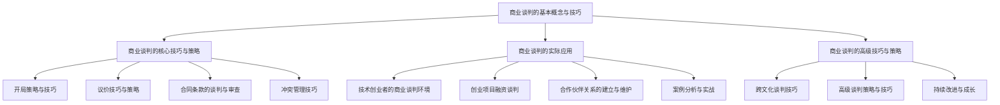

                 

### 《技术创业者的商业谈判技巧与策略》

在技术创业的道路上，商业谈判如同一位忠实的伙伴，时刻伴随着创业者。它不仅关乎公司的成长与发展，更涉及到资源的获取、合作伙伴的选择以及项目的成功与否。因此，掌握商业谈判的技巧与策略，对于技术创业者来说至关重要。

关键词：商业谈判、技术创业者、策略、技巧、谈判准备、沟通、利益分析、合同条款、跨文化谈判、实战案例

摘要：
本文旨在探讨技术创业者在商业谈判中所需掌握的技巧与策略。我们将从基本概念、核心技巧、实际应用、高级技巧等多个角度进行深入分析。通过一系列的实战案例，读者将了解到如何在实际谈判中应用这些策略，从而更好地实现创业目标。

### 第一部分：商业谈判的基本概念与技巧

#### 1. 商业谈判的概念与意义

商业谈判是指在商业活动中，各方为了达成某种共同利益，通过沟通、协商、妥协等方式，寻求解决问题的过程。它不仅涉及价格、合同等具体条款，还包括信任建立、利益分配等多个层面。

商业谈判的意义在于：

- **资源获取**：通过谈判，创业者可以获取所需资金、技术、人才等资源。
- **风险控制**：谈判过程中，创业者可以评估合作风险，降低潜在损失。
- **关系建立**：良好的谈判可以建立长期合作关系，为企业的稳定发展奠定基础。
- **价值创造**：谈判中，各方可以在利益分配上实现双赢，创造更大的价值。

#### 2. 商业谈判的准备与策略

谈判前的准备工作是成功谈判的关键。创业者需要：

- **明确谈判目标**：确定谈判的核心目标，如融资额度、技术合作等。
- **收集信息**：了解对方公司背景、业务模式、市场地位等信息。
- **分析利益**：分析谈判各方可能获得的利益，明确自身优势与劣势。
- **制定策略**：根据谈判目标、信息和利益分析，制定谈判策略。

谈判策略包括：

- **进攻性策略**：主动提出条件，争取最大利益。
- **防御性策略**：保护自身利益，避免被动局面。
- **合作性策略**：寻求共赢，建立长期合作关系。
- **折中性策略**：在利益分配上寻求平衡，达成妥协。

#### 3. 沟通技巧与信息收集

沟通技巧是商业谈判中不可或缺的一环。创业者需要：

- **有效表达**：清晰、准确地表达自己的观点和需求。
- **倾听**：倾听对方的观点，了解对方的利益和需求。
- **提问**：通过提问引导对话，获取更多信息。
- **非语言沟通**：注意身体语言、语调等非语言沟通技巧，增强说服力。

信息收集方法包括：

- **市场调研**：通过市场调研了解行业动态、竞争对手情况。
- **网络信息**：利用网络资源获取对方公司信息。
- **直接沟通**：与对方公司人员直接沟通，获取一手信息。

#### 4. 利益分析与平衡

利益分析是谈判的核心。创业者需要：

- **明确利益点**：分析谈判各方可能获得的利益，明确关键利益点。
- **评估利益**：评估各方利益的可行性和重要性。
- **平衡利益**：在利益分配上寻求平衡，实现各方的满意。

谈判中的妥协与让步是必要的，但需注意：

- **原则性妥协**：在关键利益点上坚持原则，不做无谓的让步。
- **灵活妥协**：在次要利益点上灵活调整，以达成整体利益的最大化。
- **共赢妥协**：寻求各方都能接受的妥协方案，实现共赢。

### 第二部分：商业谈判的核心技巧与策略

#### 5. 开局策略与技巧

开局是谈判的第一步，关键在于：

- **建立信任**：通过正面沟通建立信任，为后续谈判打下基础。
- **了解对方**：通过提问和倾听了解对方的利益和需求。
- **明确目标**：明确双方的谈判目标和底线。
- **营造氛围**：营造轻松、友好的谈判氛围，降低对方的心理压力。

#### 6. 议价技巧与策略

议价是谈判的核心环节，创业者需要：

- **掌握价格策略**：了解市场行情，掌握合理的价格范围。
- **运用议价技巧**：如开价技巧、还价技巧、让步技巧等。
- **分析对方价格策略**：了解对方的底牌，分析对方的价格策略。
- **灵活调整**：在议价过程中，根据对方反应灵活调整自己的策略。

#### 7. 合同条款的谈判与审查

合同条款的谈判是保障双方权益的关键。创业者需要：

- **明确合同条款**：明确合同的核心条款，如价格、交付期限、售后服务等。
- **审查合同条款**：仔细审查合同条款，确保无遗漏和歧义。
- **协商修改**：与对方协商修改不合理的条款，保障自身权益。
- **法律支持**：在必要时寻求法律支持，确保合同的合法性和有效性。

#### 8. 冲突管理技巧

冲突是谈判中不可避免的问题。创业者需要：

- **识别冲突**：及时识别谈判中的冲突点。
- **沟通解决**：通过有效沟通解决冲突，避免冲突升级。
- **妥协与让步**：在必要时做出妥协与让步，寻求双方都能接受的解决方案。
- **求助第三方**：在无法自行解决冲突时，寻求第三方调解或仲裁。

### 第三部分：商业谈判的实际应用

#### 9. 技术创业者的商业谈判环境

技术创业者在商业谈判中面临以下挑战：

- **技术创新的不确定性**：技术创新的成功与否影响谈判的可行性。
- **市场的不确定性**：市场变化快，创业者需应对市场波动。
- **资源限制**：资金、人才等资源有限，谈判需考虑资源约束。

同时，技术创业者也有以下优势：

- **技术优势**：拥有独特的技术优势，增强谈判地位。
- **创新思维**：具有创新思维，能够提出创新的解决方案。
- **敏捷性**：能够快速响应市场变化，调整谈判策略。

#### 10. 创业项目融资谈判

融资谈判是技术创业者面临的重要挑战。创业者需要：

- **明确融资目标**：确定所需的资金额度、用途和回报。
- **寻找投资者**：通过多种渠道寻找合适的投资者。
- **制定融资策略**：根据投资者特点和项目需求，制定融资策略。
- **谈判技巧**：在谈判过程中，运用议价技巧、沟通技巧等，争取有利条件。

#### 11. 合作伙伴关系的建立与维护

建立和维护合作伙伴关系是技术创业者的重要任务。创业者需要：

- **选择合适的合作伙伴**：根据业务需求和市场环境，选择合适的合作伙伴。
- **谈判合作条款**：在合作条款中明确各方责任、权利和义务。
- **建立信任**：通过合作过程中的良好表现建立信任。
- **持续沟通与支持**：在合作过程中保持沟通，提供必要的支持。

### 第四部分：商业谈判的高级技巧与策略

#### 12. 跨文化谈判技巧

跨文化谈判是技术创业者面临的一个特殊挑战。创业者需要：

- **了解文化差异**：了解不同文化的价值观、沟通方式等差异。
- **尊重文化差异**：在谈判中尊重对方的文化习惯和价值观。
- **灵活调整策略**：根据文化差异调整谈判策略，实现有效沟通。
- **寻求共同点**：在谈判中寻找共同的文化价值观和利益点，达成共识。

#### 13. 高级谈判策略与技巧

高级谈判策略与技巧包括：

- **心理战术**：运用心理战术，如暗示、诱导、压迫等，影响对方的决策。
- **权力平衡**：在谈判中保持权力平衡，避免一方过度占据优势。
- **灵活调整策略**：根据谈判进展和对方反应，灵活调整谈判策略。
- **长期视角**：从长期视角看待谈判，关注长远利益而非短期利益。

#### 14. 持续改进与成长

谈判技巧需要不断改进与成长。创业者需要：

- **自我评估**：定期评估自己的谈判技巧和效果。
- **学习与分享**：从成功和失败的谈判案例中学习，与他人分享经验。
- **培训与指导**：参加专业培训，寻求专家指导，提升谈判能力。
- **实践与应用**：将谈判技巧应用于实际谈判中，不断总结和改进。

### 附录

#### 15. 商业谈判工具与资源

商业谈判中常用的工具与资源包括：

- **谈判模拟软件**：用于模拟谈判场景，提高谈判技巧。
- **谈判技巧书籍**：提供丰富的谈判技巧和实践经验。
- **在线课程**：提供系统性的谈判技巧培训。
- **谈判案例库**：包含各种类型的谈判案例，供学习者参考。

### Mermaid 流程图



### 核心算法原理讲解（伪代码）

```python
# 谈判策略优化算法伪代码
def negotiation_strategy_optimization(target, constraints):
    # 初始化策略参数
    strategy = initialize_strategy(target, constraints)
    while not converged:
        # 评估当前策略
        evaluation = evaluate_strategy(strategy)
        if evaluation > threshold:
            # 策略优化
            strategy = optimize_strategy(strategy)
        else:
            # 策略调整
            strategy = adjust_strategy(strategy)
    return strategy
```

### 数学模型和数学公式

```latex
% 利益最大化模型
\begin{equation}
\max_{x} U(x) = \max_{x} \sum_{i=1}^{n} w_i x_i
\end{equation}

% 平衡方程
\begin{equation}
\sum_{i=1}^{n} w_i x_i = c
\end{equation}
```

### 项目实战

#### 实战环境搭建

1. **安装谈判模拟软件**：选择合适的谈判模拟软件，如Gale-Shapley匹配算法模拟器。
2. **准备模拟案例数据集**：创建包含各种谈判场景的数据集，用于训练和测试谈判策略。

#### 代码实际案例与详细解释说明

**案例背景**：某技术创业公司需要与一家大型企业合作，以获取所需的资金和技术支持。

**谈判策略**：采用博弈论中的纳什均衡理论，制定合理的谈判策略。

**代码实现**：

```python
# 导入相关库
import numpy as np

# 初始化策略参数
def initialize_strategy(target, constraints):
    # 初始化目标函数
    evaluation_function = np.zeros((target, constraints))
    # 初始化策略参数
    strategy = {
        'offer': [],
        'counteroffer': [],
        'concession': []
    }
    return strategy

# 评估策略
def evaluate_strategy(strategy):
    # 计算收益
    evaluation = sum(strategy['offer']) - sum(strategy['concession'])
    return evaluation

# 优化策略
def optimize_strategy(strategy):
    # 调整策略参数
    strategy['offer'] = np.random.uniform(0, 100, len(strategy['offer']))
    strategy['concession'] = np.random.uniform(0, 10, len(strategy['concession']))
    return strategy

# 谈判模拟
def negotiation_simulation(strategy):
    # 模拟谈判过程
    for i in range(len(strategy['offer'])):
        offer = strategy['offer'][i]
        counteroffer = strategy['offer'][i] * 0.9
        concession = strategy['concession'][i] * 0.8
        strategy['counteroffer'].append(counteroffer)
        strategy['concession'].append(concession)
    
    # 评估策略
    evaluation = evaluate_strategy(strategy)
    print(f"Evaluation: {evaluation}")

# 主函数
def main():
    # 设置目标函数和约束条件
    target = [100, 100]
    constraints = [10, 10]
    
    # 初始化策略
    strategy = initialize_strategy(target, constraints)
    
    # 进行谈判模拟
    negotiation_simulation(strategy)

# 运行主函数
if __name__ == "__main__":
    main()
```

#### 源代码详细实现与代码解读

**代码解读**：

- **初始化策略参数**：定义目标函数和策略参数，如报价、还价和让步。
- **评估策略**：计算收益，评估策略的有效性。
- **优化策略**：调整策略参数，以实现收益最大化。
- **谈判模拟**：模拟谈判过程，更新策略参数。

**性能与优化方向**：

- **优化策略调整方法**：引入机器学习算法，如遗传算法，优化策略参数。
- **多场景模拟**：增加模拟场景，提高策略的普适性。
- **实时调整**：根据谈判过程中对方的行为，实时调整策略。

### 实战案例分析

#### 案例一：创业项目融资谈判

**背景**：某技术创业公司寻求融资，以扩大业务规模。

**谈判过程**：

1. **开局**：创业者与投资者建立联系，明确融资目标和需求。
2. **议价**：创业者提出融资额和回报要求，投资者提出质疑和调整。
3. **合同条款**：双方就融资条款进行谈判，包括投资额度、股权分配、回报机制等。
4. **妥协与让步**：在关键利益点上做出妥协，达成双方都能接受的合同条款。

**成功因素**：

- **明确目标**：创业者明确融资目标和需求，有利于投资者了解项目价值。
- **掌握市场行情**：了解市场融资环境，合理定价。
- **沟通技巧**：有效沟通，增强信任，降低谈判难度。

**失败因素**：

- **目标不明确**：创业者目标不明确，导致谈判难以进行。
- **信息不对称**：投资者对项目不了解，难以做出决策。
- **谈判策略不当**：创业者谈判策略不当，导致谈判破裂。

#### 案例二：合作伙伴关系建立

**背景**：某技术创业公司寻求与一家大型企业建立合作伙伴关系。

**谈判过程**：

1. **开局**：明确双方合作目标和需求。
2. **谈判合作条款**：就合作条款进行谈判，包括合作范围、合作期限、利益分配等。
3. **建立信任**：通过合作过程中的良好表现建立信任。
4. **持续沟通与支持**：保持沟通，提供必要的支持。

**成功因素**：

- **明确合作目标**：明确双方合作目标和需求，有利于合作顺利进行。
- **互利共赢**：合作条款公平合理，实现互利共赢。
- **持续沟通**：保持沟通，解决合作过程中出现的问题。

**失败因素**：

- **目标不明确**：合作目标不明确，导致合作难以进行。
- **利益分配不公**：合作条款不公平，导致一方利益受损。
- **沟通不畅**：沟通不畅，导致合作出现矛盾和问题。

#### 案例三：跨文化谈判

**背景**：某技术创业公司寻求与一家海外企业建立合作伙伴关系。

**谈判过程**：

1. **了解文化差异**：了解双方文化的差异，尊重对方的文化习惯和价值观。
2. **调整谈判策略**：根据文化差异调整谈判策略，实现有效沟通。
3. **建立信任**：通过合作过程中的良好表现建立信任。
4. **解决文化冲突**：在谈判过程中出现文化冲突时，及时解决。

**成功因素**：

- **了解文化差异**：了解文化差异，尊重对方文化。
- **调整策略**：根据文化差异调整谈判策略。
- **建立信任**：建立信任，实现合作。

**失败因素**：

- **文化冲突**：忽视文化差异，导致文化冲突。
- **策略不当**：谈判策略不当，无法应对文化冲突。
- **沟通不畅**：沟通不畅，导致误解和矛盾。

### 结论

商业谈判是技术创业者成功创业的关键环节。掌握谈判技巧与策略，有助于创业者更好地获取资源、建立合作伙伴关系，实现创业目标。本文从基本概念、核心技巧、实际应用、高级技巧等多个角度，探讨了技术创业者所需掌握的商业谈判技巧与策略。通过实战案例的分析，读者可以更深入地了解如何应用这些策略，提高谈判成功率。

### 作者信息

作者：AI天才研究院/AI Genius Institute & 禅与计算机程序设计艺术 /Zen And The Art of Computer Programming

### 附录

#### 商业谈判工具与资源

- **谈判模拟软件**：Gale-Shapley匹配算法模拟器、商业谈判模拟平台等。
- **谈判技巧书籍**：《谈判的艺术》、《双赢谈判》等。
- **在线课程**：Coursera、Udemy等平台上的谈判技巧课程。
- **谈判案例库**：哈佛商学院案例库、麦肯锡谈判案例库等。

---

以上是《技术创业者的商业谈判技巧与策略》的详细内容。希望这篇文章能帮助技术创业者更好地应对商业谈判中的挑战，实现创业梦想。|user| <</sop></gMASK>

