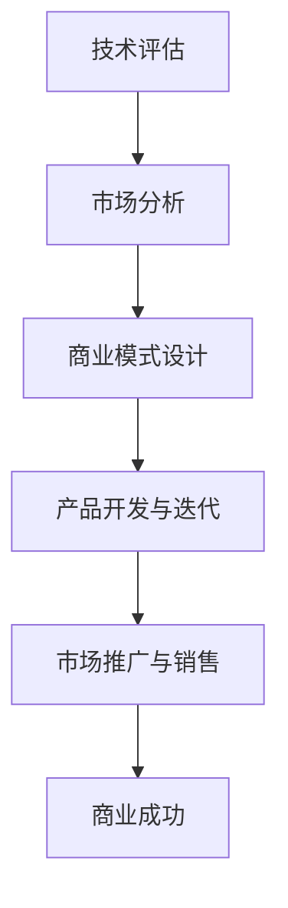

                 

# 技术商业化时机：把握市场成熟度

## 关键词

- 技术商业化
- 市场成熟度
- 商业模式
- 产品开发
- 市场推广

## 摘要

技术商业化是将创新技术转化为商业产品的过程，其成功的关键在于把握市场成熟度。本文将逐步分析技术商业化的时机，探讨如何通过技术评估和市场分析来找到最佳商业化时机，并提供具体的商业化策略和实践案例。通过本文的讨论，读者将了解如何从技术、市场和商业角度出发，实现技术的商业成功。

## 目录

### 第一部分：技术商业化概述

#### 第1章：技术商业化的重要性

1.1 技术对商业的影响  
1.2 技术商业化的挑战与机遇

#### 第2章：技术评估与市场分析

2.1 技术评估方法  
2.2 市场分析策略

#### 第3章：技术商业化策略

3.1 商业模式设计  
3.2 市场进入策略

#### 第4章：技术商业化实施

4.1 产品开发与迭代  
4.2 市场推广与销售

### 第二部分：技术商业化案例研究

#### 第5章：成功的技术商业化案例

5.1 特斯拉  
5.2 Airbnb  
5.3 WhatsApp

#### 第6章：技术商业化中的法律与伦理问题

6.1 法律风险与合规  
6.2 伦理问题与责任

#### 第7章：技术商业化的未来趋势

7.1 技术发展趋势  
7.2 市场前景与挑战

### 附录

A. 技术商业化资源  
B. 技术商业化流程图  
C. 数学模型与公式  
D. 项目实战

## 第一部分：技术商业化概述

### 第1章：技术商业化的重要性

#### 1.1 技术对商业的影响

技术革新始终是推动商业发展的核心动力。在当今信息时代，技术的进步速度令人惊叹，从互联网到人工智能、区块链、物联网等新兴技术，它们正以前所未有的方式重塑商业环境。技术的应用不仅改变了传统的业务模式，还创造了新的市场和机会。

首先，技术的进步带来了生产效率的提升。以自动化为例，工业自动化技术的普及大幅减少了人力成本，提高了生产效率。同时，数据分析和人工智能的应用使得企业能够更精准地预测市场需求，优化供应链管理，从而降低运营成本。

其次，技术的革新促进了商业模式创新。共享经济、电子商务等新兴商业模式的出现，改变了消费者与企业的互动方式，创造了新的收入来源。例如，Airbnb和Uber利用互联网技术，颠覆了传统住宿和交通行业，开创了全新的商业模式。

最后，技术的变革激发了市场潜力。大数据和人工智能技术的应用，使得企业能够更好地了解消费者行为，提供个性化的产品和服务，从而提升用户满意度。技术的进步不仅为企业带来了巨大的商业价值，也为整个社会创造了新的就业机会。

#### 1.2 技术创新与市场需求的关系

技术创新与市场需求之间的关系密不可分。市场需求是技术创新的驱动力，而技术创新又能够满足和创造新的市场需求。以下从几个方面探讨这一关系：

首先，市场需求引导技术创新。企业通过市场调研和消费者反馈，了解市场需求和痛点，从而驱动技术创新。例如，智能手机市场的需求推动了移动操作系统和应用程序的快速发展，形成了如今繁荣的应用生态系统。

其次，技术创新创造新的市场需求。技术创新往往能够带来前所未有的产品和服务，从而创造新的市场需求。例如，3D打印技术的出现，使得个性化制造成为可能，从而开辟了新的市场领域。

此外，技术创新与市场需求之间存在相互促进的动态关系。一方面，技术创新能够满足现有的市场需求，提升用户体验；另一方面，市场需求的变化又促使技术创新不断迭代和升级。这种相互促进的关系，推动了技术商业化的不断深入。

总之，技术创新与市场需求相互影响、相互促进，共同推动了技术商业化的进程。在技术商业化的过程中，企业需要密切关注市场需求的变化，及时调整技术创新的方向和力度，以实现商业成功。

### 第2章：技术评估与市场分析

#### 2.1 技术评估方法

技术评估是技术商业化过程中至关重要的一环，它有助于企业了解技术的成熟度、潜力和风险，从而为决策提供科学依据。以下介绍几种常见的技术评估方法：

**1. 技术成熟度曲线**

技术成熟度曲线（Technology Maturity Curve），也称为技术发展阶段曲线，是一种常用的技术评估方法。它将技术的发展过程分为五个阶段：起步阶段、早期阶段、成长阶段、成熟阶段和衰退阶段。每个阶段都有其特定的特征和风险。

- **起步阶段**：技术概念初步形成，研究工作正在进行中，风险较高，但潜在价值巨大。
- **早期阶段**：技术开始实验性应用，性能和稳定性有待提升，市场接受度低。
- **成长阶段**：技术逐步成熟，性能和稳定性提高，市场接受度增加，但竞争激烈。
- **成熟阶段**：技术进入广泛使用阶段，市场稳定，竞争格局清晰。
- **衰退阶段**：技术逐渐被更先进的技术取代，市场逐渐萎缩。

**2. 技术风险评估**

技术风险评估是一种评估技术实现过程中潜在风险的方法。通过识别和评估技术风险，企业可以采取相应的措施来降低风险，确保项目的顺利进行。技术风险评估通常包括以下几个方面：

- **技术实现风险**：涉及技术本身是否能够实现，如技术难题、资源不足等。
- **市场风险**：涉及市场是否接受该技术，如市场需求不足、竞争激烈等。
- **法律风险**：涉及技术是否符合相关法律法规，如知识产权保护、数据隐私等。

**3. SWOT分析**

SWOT分析（Strengths, Weaknesses, Opportunities, Threats）是一种常用的战略分析工具，用于评估技术的优势和劣势、市场机会和威胁。通过SWOT分析，企业可以全面了解技术在不同方面的表现，从而制定相应的策略。

- **优势（Strengths）**：技术的独特卖点、技术优势、市场地位等。
- **劣势（Weaknesses）**：技术的缺陷、技术限制、市场挑战等。
- **机会（Opportunities）**：市场趋势、政策支持、技术创新等。
- **威胁（Threats）**：竞争对手、市场变化、技术替代等。

**4. 成本效益分析**

成本效益分析是一种评估技术商业化可行性的方法，通过比较技术开发的成本和预期的收益，来判断技术商业化的可行性。成本效益分析通常包括以下几个方面：

- **开发成本**：技术开发的直接成本，如研发投入、设备采购等。
- **运营成本**：技术运营的间接成本，如人员培训、维护费用等。
- **预期收益**：技术商业化后的预期收入和利润。
- **收益周期**：从技术开发到盈利所需的时间。

通过以上方法，企业可以全面评估技术的成熟度、潜力和风险，为技术商业化提供科学依据。

#### 2.2 市场分析策略

市场分析是技术商业化过程中不可或缺的一环，它有助于企业了解市场需求、竞争环境和潜在用户，从而制定合适的市场策略。以下介绍几种常用的市场分析策略：

**1. 市场需求分析**

市场需求分析旨在了解市场的规模、增长趋势和用户需求。通过需求分析，企业可以确定目标市场，并制定相应的市场策略。

- **市场规模**：通过市场调研和数据分析，确定市场的总体规模和增长速度。
- **用户需求**：通过用户调查、市场研究和用户反馈，了解用户的需求和偏好。
- **市场趋势**：通过分析市场报告和行业数据，了解市场的发展趋势和未来方向。

**2. 竞争环境分析**

竞争环境分析旨在了解竞争对手的产品、市场策略和市场份额。通过竞争环境分析，企业可以确定自身的市场定位和竞争优势。

- **竞争对手**：识别市场中的主要竞争对手，分析他们的产品特点、市场份额和竞争优势。
- **产品定位**：确定自己的产品在市场中的定位，如高端、中端或低端市场。
- **竞争优势**：分析自身产品的优势和差异化特点，如技术创新、性能优势、价格优势等。

**3. SWOT分析**

SWOT分析是一种综合市场分析工具，通过分析企业的优势、劣势、机会和威胁，帮助企业制定市场策略。

- **优势**：分析企业的核心竞争力、独特卖点和市场地位。
- **劣势**：分析企业的不足、技术和市场方面的限制。
- **机会**：分析市场趋势、政策支持和技术创新带来的机会。
- **威胁**：分析竞争对手、市场变化和技术替代带来的威胁。

**4. 市场定位策略**

市场定位策略旨在确定企业产品在市场中的地位和形象，以满足特定用户群体的需求。通过市场定位，企业可以明确目标市场和产品策略。

- **目标市场**：确定企业的目标用户群体和市场范围。
- **市场细分**：将市场划分为不同的细分市场，为每个细分市场制定相应的市场策略。
- **差异化策略**：通过产品差异化、服务差异化或品牌差异化，使产品在市场中脱颖而出。

通过以上市场分析策略，企业可以全面了解市场需求、竞争环境和潜在用户，从而制定合适的市场策略，提高技术商业化的成功率。

### 第3章：技术商业化策略

#### 3.1 商业模式设计

商业模式设计是技术商业化成功的关键环节，它决定了企业如何创造、传递和捕获价值。一个成功的商业模式不仅要有清晰的收益模式，还要有合理的成本结构，以及可持续的市场进入策略。以下是商业模式设计的关键要素：

**1. 收益模式**

收益模式是指企业通过何种方式获得收入。常见的收益模式包括以下几种：

- **产品销售**：直接销售产品获得收入，如硬件设备、软件许可证等。
- **服务收费**：提供专业服务或咨询服务获得收入，如软件开发、技术支持等。
- **广告收入**：通过展示广告或推广服务获得收入，如搜索引擎、社交媒体平台等。
- **订阅模式**：通过订阅服务获得持续收入，如云服务、在线教育平台等。
- **平台模式**：通过平台连接供需双方，通过交易费用或广告收入获得收益，如电子商务平台、共享经济平台等。

在设计收益模式时，企业需要考虑市场接受度、市场需求和成本效益。例如，对于创新性技术产品，可以通过提供免费试用或折扣促销来吸引早期用户，从而积累用户基础，再逐步实现商业化。

**2. 成本结构**

成本结构是指企业在生产和运营过程中产生的各项成本。合理的成本结构能够帮助企业降低成本，提高盈利能力。常见的成本结构包括以下几种：

- **固定成本**：不随生产量或销售量变化而变化的成本，如设备购置、租金、员工薪酬等。
- **可变成本**：随生产量或销售量变化而变化的成本，如原材料、人工成本等。
- **运营成本**：包括日常运营所需的费用，如营销费用、维护费用、行政费用等。

在设计成本结构时，企业需要考虑如何最大化固定成本和可变成本的效益。例如，通过规模化生产降低单位成本，或者通过技术创新提高生产效率，从而降低运营成本。

**3. 市场进入策略**

市场进入策略是指企业如何进入目标市场，实现技术商业化。合理的市场进入策略能够帮助企业迅速占领市场，提升品牌知名度。以下是几种常见的市场进入策略：

- **市场细分**：将市场划分为不同的细分市场，为每个细分市场提供定制化的产品或服务。
- **地理扩展**：通过逐步扩展地理覆盖范围，实现市场的逐步渗透。
- **合作伙伴**：通过建立合作伙伴关系，利用合作伙伴的资源、渠道和客户基础，快速进入市场。
- **品牌推广**：通过品牌建设和市场推广，提高品牌知名度和市场认可度。

在设计市场进入策略时，企业需要考虑目标市场的特点、竞争对手的情况以及自身的资源能力。例如，对于新兴市场，可以通过提供优惠价格或定制化服务来吸引早期用户；对于竞争激烈的市场，可以通过技术创新和差异化策略来建立竞争优势。

总之，商业模式设计是技术商业化成功的关键环节。通过设计合理的收益模式、优化成本结构以及制定合适的市场进入策略，企业可以有效地实现技术商业化，创造可持续的商业价值。

#### 3.2 市场进入策略

市场进入策略是企业将产品或服务推向市场的重要步骤，直接影响商业化进程的成功与否。以下介绍几种常用的市场进入策略，并探讨其适用场景和优势：

**1. 市场细分策略**

市场细分策略是将整体市场划分为若干个子市场，针对不同的子市场制定相应的营销策略。这种方法的优势在于能够更精准地满足不同用户群体的需求，提高市场营销的效率。

- **适用场景**：适用于产品或服务具有多种应用场景和市场需求的行业，如消费品、医药、金融等。
- **优势**：能够提高市场覆盖率和用户满意度，降低市场营销成本。

具体步骤包括：
- **需求分析**：通过市场调研和用户反馈，了解不同用户群体的需求。
- **市场细分**：根据需求差异，将市场划分为多个子市场。
- **定位策略**：针对每个子市场，制定相应的产品特性、定价策略和营销方案。

**2. 地理扩展策略**

地理扩展策略是企业逐步扩大地理覆盖范围，进入新的市场区域。这种方法的优势在于能够利用现有的品牌和渠道资源，快速进入新市场。

- **适用场景**：适用于产品或服务具有地域特点和市场差异的行业，如餐饮、零售等。
- **优势**：能够快速占领新市场，提高市场占有率。

具体步骤包括：
- **市场调研**：了解目标市场的需求、竞争环境和法律法规。
- **资源整合**：利用现有资源，如品牌、渠道、合作伙伴等，进行市场扩展。
- **市场推广**：通过广告、促销活动等手段，提高品牌知名度和市场认可度。

**3. 合作伙伴策略**

合作伙伴策略是企业通过与其他企业建立合作关系，共同开拓市场。这种方法的优势在于能够利用合作伙伴的资源和渠道，提高市场进入的效率。

- **适用场景**：适用于需要特定资源和渠道的行业，如电信、物流等。
- **优势**：能够快速建立市场渠道，降低市场进入风险。

具体步骤包括：
- **寻找合作伙伴**：通过市场调研和行业合作平台，寻找合适的合作伙伴。
- **合作协议**：明确合作双方的权利、义务和利益分配。
- **资源整合**：利用合作伙伴的资源，共同开拓市场。

**4. 品牌推广策略**

品牌推广策略是通过品牌建设和市场推广，提高产品或服务的知名度和美誉度。这种方法的优势在于能够建立品牌优势，提高市场竞争力。

- **适用场景**：适用于品牌影响力对销售有重要影响的行业，如高端消费品、奢侈品牌等。
- **优势**：能够提升品牌形象，增加消费者信任度。

具体步骤包括：
- **品牌定位**：确定品牌的核心价值和市场定位。
- **广告宣传**：通过广告、公关活动等手段，提高品牌知名度。
- **用户体验**：通过提供优质的产品和服务，提升用户满意度和口碑。

总之，不同的市场进入策略适用于不同的市场环境和企业情况。企业应根据自身的资源、能力和市场特点，选择合适的策略，实现技术商业化的成功。

### 第4章：技术商业化实施

#### 4.1 产品开发与迭代

产品开发与迭代是技术商业化过程中至关重要的一环，它决定了产品能否满足市场需求，以及能否持续获得用户的认可。以下是产品开发与迭代的关键步骤和策略：

**1. 需求分析**

需求分析是产品开发的起点，通过对市场需求和用户需求的深入理解，确定产品的核心功能和特性。需求分析的步骤包括：

- **市场调研**：通过调查问卷、用户访谈、数据分析等方式，收集市场需求信息。
- **用户画像**：根据收集的数据，构建用户画像，了解用户的特征和需求。
- **需求筛选**：从众多需求中筛选出核心需求，确保产品能够解决用户的关键问题。

**2. 产品设计**

产品设计是需求分析的结果，它将用户需求转化为具体的产品功能和界面设计。产品设计的步骤包括：

- **功能设计**：根据需求分析，确定产品的功能模块和业务流程。
- **界面设计**：设计产品的用户界面，确保用户体验友好、直观。
- **交互设计**：设计产品的交互方式，提升用户操作效率和满意度。

**3. 产品开发**

产品开发是将设计转化为实际产品的过程，通常包括以下几个阶段：

- **原型开发**：根据产品设计，构建产品原型，验证核心功能和用户体验。
- **测试与优化**：对产品原型进行测试，发现并修复问题，优化产品性能和稳定性。
- **版本迭代**：根据用户反馈和市场变化，不断迭代产品，提升产品竞争力。

**4. 用户反馈与迭代**

用户反馈是产品迭代的重要依据，通过收集用户的使用数据、反馈意见和评价，可以及时了解产品的优点和不足，从而进行针对性的优化。用户反馈与迭代的步骤包括：

- **数据收集**：通过数据分析工具，收集用户的使用数据，如访问量、使用频率、故障率等。
- **用户访谈**：定期与用户进行访谈，了解他们的真实体验和需求。
- **问题定位**：根据数据分析和用户反馈，定位产品存在的问题。
- **优化与迭代**：针对存在的问题，进行产品优化和功能迭代，提升用户体验。

**5. 供应链管理**

供应链管理是确保产品开发与迭代顺利进行的重要保障。供应链管理的步骤包括：

- **需求预测**：根据市场需求和用户反馈，预测产品的需求量，制定生产计划。
- **采购与生产**：根据需求预测，进行原材料采购和产品生产。
- **库存管理**：通过库存管理，确保产品供应的及时性和稳定性。
- **物流配送**：优化物流配送，确保产品能够迅速送达用户手中。

通过以上产品开发与迭代的步骤和策略，企业可以不断优化产品，提升用户满意度，实现技术商业化的成功。

#### 4.2 市场推广与销售

市场推广与销售是技术商业化过程中至关重要的一环，它关系到产品能否被市场接受，以及企业能否实现商业价值。以下是市场推广与销售的关键策略和执行步骤：

**1. 市场推广策略**

市场推广策略是指企业如何通过各种渠道向目标市场传递产品信息，提升品牌知名度和用户认知度。以下是几种常见的市场推广策略：

- **广告宣传**：通过电视、报纸、杂志、网络广告等渠道，向目标受众传递产品信息，提升品牌知名度。
- **内容营销**：通过撰写和发布高质量的内容，如博客、白皮书、案例研究等，提供有价值的信息，吸引用户关注。
- **社交媒体营销**：利用社交媒体平台，如微博、微信、Facebook等，进行互动和推广，增强用户参与度。
- **公关活动**：通过举办新闻发布会、产品发布会、行业论坛等活动，与媒体和行业人士建立联系，提升品牌形象。

**2. 销售策略**

销售策略是指企业如何通过各种手段将产品推向市场，实现销售目标。以下是几种常见的销售策略：

- **直销**：通过企业自身的销售团队，直接与客户进行沟通和销售，提供个性化服务。
- **分销**：通过分销商、代理商等渠道，将产品推向市场，覆盖更广泛的地域。
- **电商平台**：利用电商平台，如亚马逊、淘宝等，进行线上销售，提升产品曝光度和销售量。
- **线下活动**：通过举办线下活动，如产品展示会、行业展会等，与客户面对面交流，促进销售。

**3. 销售执行步骤**

销售执行步骤是指企业在实际销售过程中需要遵循的流程和操作，以确保销售目标的实现。以下是销售执行的基本步骤：

- **目标设定**：根据市场分析结果，设定明确的销售目标，如销售额、客户数量等。
- **客户定位**：通过市场调研和客户数据分析，确定目标客户群体，明确销售方向。
- **销售计划**：制定详细的销售计划，包括销售目标、销售策略、时间安排等。
- **销售执行**：按照销售计划，开展具体的销售活动，如拜访客户、电话沟通、线上推广等。
- **销售追踪**：通过销售数据追踪和分析，了解销售进展，及时调整销售策略。

**4. 销售支持**

销售支持是指企业在销售过程中提供的各种支持和资源，以提高销售效率和客户满意度。以下是几种常见的销售支持方式：

- **销售培训**：为销售团队提供产品知识和销售技巧培训，提升销售能力。
- **销售工具**：提供销售工具，如CRM系统、营销素材、报价单等，提高销售效率。
- **技术支持**：为客户提供技术支持和售后服务，确保产品能够顺利使用。
- **客户关系管理**：通过建立客户关系管理系统，维护客户关系，提高客户忠诚度。

通过以上市场推广与销售策略和执行步骤，企业可以有效地提升产品知名度和市场占有率，实现技术商业化的成功。

### 第二部分：技术商业化案例研究

#### 第5章：成功的技术商业化案例

##### 5.1 特斯拉

特斯拉（Tesla）是一家以电动汽车和能源存储解决方案为核心业务的高科技公司，其成功的技术商业化案例为我们提供了宝贵的启示。以下是特斯拉的技术创新、市场策略和商业模式解析。

**1. 技术创新**

特斯拉的核心竞争力在于其技术创新。特斯拉在电动汽车领域引入了多项颠覆性技术，如：

- **电池技术**：特斯拉自主研发了高性能、高能量密度的电池，大幅提升了电动汽车的续航里程和性能。
- **自动驾驶技术**：特斯拉的自动驾驶系统通过大量数据训练和深度学习算法，实现了高级别自动驾驶功能。
- **能源解决方案**：特斯拉推出了Powerwall储能系统和Solar Roof太阳能屋顶，实现了能源的自给自足。

**2. 市场策略**

特斯拉的市场策略主要包括以下几个方面：

- **差异化定位**：特斯拉通过高端定位和独特的产品设计，树立了品牌形象，吸引了大量高端消费者。
- **品牌营销**：特斯拉通过社交媒体、品牌活动等手段，提升了品牌知名度和美誉度。
- **销售渠道**：特斯拉建立了线上销售平台和直营店，直接与消费者互动，提高了销售效率和客户满意度。

**3. 商业模式**

特斯拉的商业模式主要包括以下几种：

- **产品销售**：特斯拉通过销售电动汽车、太阳能产品和电池储能系统等硬件产品获得收入。
- **订阅服务**：特斯拉推出了充电网络订阅服务和自动驾驶订阅服务，通过持续收费实现收入。
- **能源解决方案**：特斯拉通过提供能源存储和能源管理解决方案，为企业客户提供定制化服务。

**4. 商业模式解析**

特斯拉的成功在于其独特的商业模式，具体表现为：

- **多元化收入来源**：特斯拉通过产品销售、订阅服务和能源解决方案等多种方式获得收入，降低了单一收入来源的风险。
- **技术创新驱动**：特斯拉通过持续的技术创新，提升了产品竞争力，建立了强大的品牌壁垒。
- **品牌溢价**：特斯拉的高端定位和独特设计，使其产品具有很高的品牌溢价，提高了盈利能力。

总之，特斯拉的技术商业化案例展示了技术创新、市场策略和商业模式的紧密关联，为其他企业提供了宝贵的经验和启示。

##### 5.2 Airbnb

Airbnb 是一家全球领先的民宿预订平台，其成功的技术商业化案例为共享经济模式提供了有力证明。以下是 Airbnb 的平台型商业模式、社区化运营策略和用户价值创造。

**1. 平台型商业模式**

Airbnb 的平台型商业模式是其成功的关键。具体表现为：

- **平台搭建**：Airbnb 通过搭建在线平台，为房东和租客提供信息匹配和交易服务。
- **用户互动**：Airbnb 通过社区论坛、用户评价系统等机制，促进房东和租客之间的互动和信任。
- **生态系统扩展**：Airbnb 通过推出一系列增值服务，如保险、预订优惠等，丰富了平台的生态系统。

**2. 社区化运营策略**

Airbnb 的社区化运营策略包括以下几个方面：

- **社区建设**：Airbnb 通过举办线下活动、社区论坛等，促进房东和租客之间的交流和互动。
- **用户参与**：Airbnb 鼓励房东和租客积极参与社区建设，提供反馈和建议，优化平台体验。
- **文化推广**：Airbnb 通过推广本地文化和特色，提升了用户体验，增强了品牌忠诚度。

**3. 用户价值创造**

Airbnb 通过以下方式创造用户价值：

- **个性化体验**：Airbnb 提供多样化的住宿选择，满足不同用户的个性化需求。
- **安全保障**：Airbnb 通过用户认证、评价系统等机制，保障用户的交易安全。
- **便捷服务**：Airbnb 提供一键预订、在线沟通等便捷服务，提高了用户体验。

**4. 商业模式解析**

Airbnb 的成功在于其平台型商业模式和社区化运营策略：

- **低门槛进入**：Airbnb 通过搭建平台，降低了市场准入门槛，吸引了大量房东和租客。
- **用户价值驱动**：通过创造用户价值，Airbnb 建立了强大的用户粘性，形成了稳定的用户群体。
- **生态系统扩展**：通过不断扩展平台生态系统，Airbnb 提高了平台盈利能力，实现了可持续发展。

总之，Airbnb 的技术商业化案例展示了平台型商业模式和社区化运营策略的成功，为共享经济模式提供了有益的经验。

##### 5.3 WhatsApp

WhatsApp 是一款全球领先的即时通讯应用，其成功的技术商业化案例为互联网创业公司提供了宝贵的启示。以下是 WhatsApp 的社交网络效应、短信业务变革和商业模式创新。

**1. 社交网络效应**

WhatsApp 的成功得益于其强大的社交网络效应。具体表现为：

- **用户规模**：WhatsApp 拥有庞大的用户基础，用户数量持续增长，形成了强大的网络效应。
- **用户活跃度**：WhatsApp 提供了便捷的通讯体验，用户活跃度高，频繁使用应用。
- **病毒式传播**：WhatsApp 通过用户推荐和分享，实现了快速传播和用户增长。

**2. 短信业务变革**

WhatsApp 对短信业务产生了深远影响，主要表现在以下几个方面：

- **成本降低**：WhatsApp 通过互联网通信技术，大幅降低了通讯成本，提供了免费或低成本的通讯服务。
- **功能丰富**：WhatsApp 提供了丰富的通讯功能，如语音通话、视频通话、文件传输等，满足了用户的多样化需求。
- **用户体验**：WhatsApp 提供了简单易用的界面和流畅的通讯体验，提升了用户满意度。

**3. 商业模式创新**

WhatsApp 的商业模式创新主要体现在以下几个方面：

- **免费策略**：WhatsApp 在早期阶段采用免费策略，快速吸引大量用户，建立庞大的用户基础。
- **广告模式**：WhatsApp 通过推出广告产品，实现了商业化，为用户提供了额外的收益来源。
- **订阅模式**：WhatsApp 推出了 WhatsApp+ 服务，为用户提供更多高级功能，通过订阅收费获得收入。

**4. 商业模式解析**

WhatsApp 的成功在于其社交网络效应和商业模式创新：

- **用户价值驱动**：通过提供免费或低成本的通讯服务，WhatsApp 创造了巨大的用户价值，形成了强大的用户粘性。
- **商业模式灵活**：通过不断创新和调整商业模式，WhatsApp 保持了持续的盈利能力。
- **市场定位精准**：WhatsApp 准确把握了移动互联网的发展趋势，为用户提供便捷的通讯服务，满足了市场需求。

总之，WhatsApp 的技术商业化案例展示了社交网络效应和商业模式创新的重要性，为互联网创业公司提供了宝贵的经验和启示。

### 第6章：技术商业化中的法律与伦理问题

#### 6.1 法律风险与合规

在技术商业化的过程中，企业面临着多种法律风险和合规挑战。这些风险和挑战涉及数据保护、知识产权保护、隐私权保护等多个方面，企业需要严格遵守相关法律法规，确保业务的合法性和可持续性。

**1. 数据保护法规**

随着大数据和云计算的普及，数据保护问题日益突出。许多国家和地区已经制定了严格的数据保护法规，如欧盟的《通用数据保护条例》（GDPR）和美国加州的《消费者隐私法案》（CCPA）。这些法规要求企业在收集、存储、处理和传输个人数据时，必须采取有效的保护措施，确保数据的安全性和隐私。

- **合规要求**：企业需要获得数据主体的明确同意，并告知数据收集的目的、范围和使用方式。
- **安全措施**：企业需要采取加密、匿名化等技术手段，保护个人数据的安全性和完整性。
- **数据泄露应对**：企业需要制定应急预案，一旦发生数据泄露事件，能够迅速响应并采取补救措施。

**2. 知识产权保护**

知识产权保护是技术商业化中的一项重要任务。企业需要确保其技术、产品或服务不侵犯他人的知识产权，同时也要保护自身的知识产权，防止他人侵权。

- **专利保护**：企业可以通过申请专利，保护其技术创新和独特设计，防止竞争对手模仿或复制。
- **版权保护**：企业需要保护其软件代码、用户界面和文档资料等版权，防止他人未经授权使用。
- **商标保护**：企业可以通过注册商标，保护其品牌名称和标识，防止他人恶意模仿。

**3. 隐私权保护**

随着用户对隐私权的重视，企业需要确保其数据处理行为符合隐私保护的要求，避免侵犯用户隐私。

- **隐私政策**：企业需要制定清晰的隐私政策，告知用户其个人信息将被如何收集、使用和共享。
- **隐私保护措施**：企业需要采取技术和管理手段，确保用户个人信息的安全和隐私。
- **用户权利**：企业需要尊重用户的知情权和选择权，允许用户访问、更正和删除其个人信息。

**4. 合规管理**

为了确保技术商业化的合法性和合规性，企业需要建立完善的合规管理体系，包括：

- **合规培训**：定期对员工进行合规培训，提高员工的合规意识和能力。
- **合规审查**：定期进行合规审查，识别和纠正潜在的法律风险。
- **合规报告**：建立合规报告机制，及时向管理层和利益相关者报告合规情况。

通过建立完善的合规管理体系，企业可以降低法律风险，确保业务的合法性和可持续性。

#### 6.2 伦理问题与责任

技术商业化不仅涉及法律和合规问题，还涉及到一系列伦理问题和社会责任。企业在追求商业利益的同时，需要考虑技术对社会、环境和用户的影响，确保其行为符合伦理标准。

**1. 用户隐私保护**

用户隐私保护是技术商业化中的一个重要伦理问题。企业在收集、处理和存储用户数据时，必须尊重用户的隐私权，采取有效的保护措施。

- **透明度**：企业应向用户明确告知其个人信息的使用目的、范围和方式，确保用户知情权。
- **数据匿名化**：企业应采用数据匿名化技术，防止个人数据被直接识别。
- **用户控制权**：企业应允许用户访问、更正和删除其个人信息，尊重用户的选择权。

**2. 社会责任**

企业在技术商业化过程中，需要承担社会责任，确保其行为有利于社会的可持续发展。

- **环境保护**：企业应采用环保技术和绿色生产方式，减少对环境的负面影响。
- **公平竞争**：企业应遵守公平竞争原则，不进行市场垄断和价格操纵。
- **社会公益**：企业可以通过捐赠、公益活动等方式，回馈社会，促进社会和谐。

**3. 伦理决策**

企业在面对技术伦理问题时，需要做出正确的决策，确保其行为符合伦理标准。

- **伦理审查**：企业应建立伦理审查机制，对涉及伦理问题的项目进行审查和评估。
- **伦理培训**：企业应定期对员工进行伦理培训，提高员工的伦理意识和判断能力。
- **公众沟通**：企业应积极与公众沟通，回应社会关切，建立良好的公众形象。

通过关注伦理问题和社会责任，企业可以树立良好的社会形象，赢得用户的信任和支持，实现可持续发展。

### 第7章：技术商业化的未来趋势

#### 7.1 技术发展趋势

随着科技的不断进步，技术商业化正迎来新的发展机遇。以下列举了几个关键技术趋势，这些趋势将深刻影响技术商业化的未来：

**1. 人工智能与大数据**

人工智能（AI）和大数据技术正成为技术商业化的核心驱动力。人工智能的应用使得企业能够通过数据分析、预测建模等方式，优化业务流程、提升决策效率。大数据技术的普及则为企业提供了丰富的数据资源，支持更加精准的市场分析、用户画像和个性化服务。未来，人工智能与大数据技术的深度融合将推动各行业的技术创新和商业模式的变革。

**2. 物联网与智能设备**

物联网（IoT）和智能设备的发展，使得万物互联成为可能。物联网技术将传感器、设备和网络连接起来，实现了数据的实时采集、传输和分析。智能设备的应用则使得家居、办公、交通等场景变得更加智能化、便捷化。未来，物联网和智能设备的普及将带来新的商业机会，如智能家居、智能交通、智能制造等领域的快速发展。

**3. 区块链技术**

区块链技术以其去中心化、不可篡改和透明性等特点，正在引起广泛关注。区块链技术不仅可以用于数字货币交易，还可以在供应链管理、版权保护、身份认证等领域发挥作用。未来，区块链技术的商业化应用将更加广泛，为各行业带来新的机遇和挑战。

**4. 虚拟现实与增强现实**

虚拟现实（VR）和增强现实（AR）技术的进步，使得虚拟体验变得更加真实和丰富。VR和AR技术在游戏、教育、医疗、旅游等领域的应用日益广泛，提供了全新的交互方式和体验。未来，随着技术的成熟和成本的降低，VR和AR技术将在更多场景中得到应用，为技术商业化开辟新的天地。

#### 7.2 市场前景与挑战

技术商业化的未来前景充满机遇，但也伴随着一系列挑战。以下从全球市场一体化和技术竞争两个方面，探讨技术商业化的市场前景与挑战：

**1. 全球市场一体化**

随着全球化的深入推进，市场一体化趋势日益明显。跨国企业可以通过全球供应链、国际市场扩张等方式，实现全球范围内的资源整合和市场拓展。未来，全球市场一体化将为技术商业化带来更多机会，企业可以更容易地进入国际市场，获取全球资源。然而，市场一体化也带来了新的挑战，如跨国竞争加剧、法律法规差异等，企业需要应对这些挑战，确保业务的全球竞争力。

**2. 技术竞争与垄断问题**

在技术快速发展的背景下，技术竞争日益激烈。企业需要不断创新，以保持技术领先地位。然而，技术竞争也可能导致市场垄断问题，部分技术领先企业可能通过垄断手段，控制市场资源和利润。未来，如何平衡技术竞争和垄断问题，将是一个重要的挑战。政府和企业需要采取措施，促进公平竞争，防止市场垄断，同时鼓励技术创新和行业健康发展。

**3. 法律法规与政策支持**

技术商业化的健康发展离不开法律法规和政策支持。各国政府纷纷出台相关政策，推动技术创新和产业发展。未来，企业需要关注相关法律法规的变化，确保业务的合规性。同时，政府也需要加强对技术创新的支持，提供政策激励和资金支持，促进技术商业化的快速发展。

总之，技术商业化的未来前景充满机遇，但也面临一系列挑战。企业需要紧跟技术发展趋势，把握市场机遇，同时应对挑战，确保技术商业化的可持续发展和商业成功。

### 附录

#### 附录A：技术商业化资源

为了更好地理解技术商业化，以下推荐几本相关书籍和若干网络资源，以供参考。

**书籍推荐：**

1. 《创新与企业家精神》（Innovation and Entrepreneurship），作者：彼得·德鲁克（Peter Drucker）
2. 《市场营销与战略规划》（Marketing and Strategic Planning），作者：菲利普·科特勒（Philip Kotler）
3. 《商业模式新生代》（Business Model Generation），作者：亚历山大·奥斯特瓦尔德（Alexander Osterwalder）和伊夫·皮尼欧（Yves Pigneur）

**网络资源：**

1. 技术博客：如 Medium、LinkedIn 等，提供丰富的技术文章和行业洞察。
2. 市场分析报告：如市场研究公司发布的行业报告，如 Gartner、Forrester 等。

#### 附录B：技术商业化流程图

以下展示了技术商业化的流程图，包括技术评估、市场分析、商业模式设计和实施等关键步骤。



#### 附录C：数学模型与公式

**1. 技术成熟度模型**

技术成熟度曲线（Technology Maturity Curve）是一种常用的技术评估模型，用于衡量技术发展水平。其参数设置如下：

$$
M(t) = \frac{1}{1 + e^{-(t - t_0) / \tau}}
$$

其中，$M(t)$ 为技术成熟度，$t$ 为时间，$t_0$ 为技术成熟度最大值出现的时间，$\tau$ 为技术成熟度曲线的半衰期。

**2. 市场需求预测模型**

市场需求预测模型通常采用线性回归和时间序列分析等方法。以下是一个简单的线性回归模型：

$$
y = ax + b
$$

其中，$y$ 为市场需求，$x$ 为影响需求的因素（如广告投入、产品价格等），$a$ 和 $b$ 为回归系数。

#### 附录D：项目实战

以下将通过一个实际项目案例，展示技术商业化的实施过程，包括市场调研报告、商业模式设计和实际代码实现。

**1. 市场调研报告**

**项目背景**：某公司计划开发一款智能家居系统，为用户提供智能家电控制、安全监控、环境监测等服务。

**调研方法**：通过问卷调查、深度访谈和数据分析，了解用户需求、市场竞争情况和潜在市场。

**数据分析**：

- **用户需求**：大多数用户希望实现远程控制、自动化操作和实时监控等功能。
- **市场竞争**：主要竞争对手包括苹果、谷歌和亚马逊等，产品主要优势在于生态系统的兼容性和智能化程度。
- **市场潜力**：智能家居市场增长迅速，预计未来几年市场规模将大幅提升。

**2. 商业模式设计**

**商业模式**：通过提供免费试用和优惠活动，吸引早期用户，积累用户基础。随后，通过提供增值服务（如安全监控、个性化推荐等）获得持续收入。

**3. 实际代码实现**

**开发环境**：使用 Python 进行开发，基于 Flask 框架搭建智能家居系统。

**源代码示例**：

```python
from flask import Flask, request, jsonify

app = Flask(__name__)

@app.route('/control', methods=['POST'])
def control_device():
    data = request.json
    device = data['device']
    action = data['action']
    
    if device == 'light' and action == 'on':
        # 打开灯光
        print('Turning on the light')
    elif device == 'light' and action == 'off':
        # 关闭灯光
        print('Turning off the light')
    else:
        # 其他设备控制逻辑
        print(f'Controlling {device} with {action}')
    
    return jsonify({'status': 'success'})

if __name__ == '__main__':
    app.run(debug=True)
```

**代码解读**：

- `from flask import Flask, request, jsonify`：导入 Flask 库，用于搭建 Web 应用。
- `app = Flask(__name__)`：创建 Flask 应用实例。
- `@app.route('/control', methods=['POST'])`：定义 HTTP POST 请求的路由，处理设备控制请求。
- `data = request.json`：获取请求的 JSON 数据。
- `device = data['device']` 和 `action = data['action']`：从 JSON 数据中提取设备名称和控制动作。
- `if-else` 语句：根据设备名称和控制动作，执行相应的控制逻辑。
- `return jsonify({'status': 'success'})`：返回 JSON 格式的响应数据。

通过以上项目实战，展示了技术商业化的实施过程，包括市场调研、商业模式设计和实际代码实现，为企业提供了具体的操作指南。

