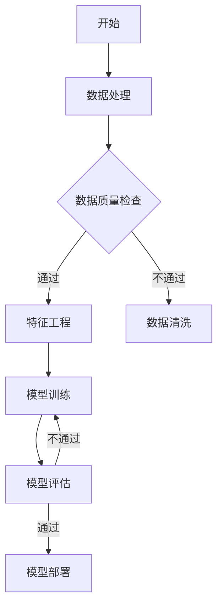

                 

### 《探讨AI大模型在电商平台售后服务中的应用》

> **关键词**：AI大模型、电商平台、售后服务、个性化推荐、智能客服、情感分析

> **摘要**：随着人工智能技术的快速发展，AI大模型在电商平台售后服务中的应用逐渐成为热点。本文将深入探讨AI大模型的基本概念、技术基础以及其在电商平台售后服务中的实际应用，通过案例分析揭示其应用潜力，并对未来发展趋势进行展望。

---

### 第一部分：引言

#### 1.1 AI大模型与电商平台售后服务概述

##### 1.1.1 AI大模型的定义与发展历程

人工智能（AI）大模型是指具有亿级参数规模的人工神经网络模型，如GPT、BERT等。自2018年GPT-1发布以来，AI大模型的发展迅速，其参数规模和计算能力不断突破。AI大模型在自然语言处理、图像识别、推荐系统等领域取得了显著的成果。

##### 1.1.2 AI大模型的核心技术与架构

AI大模型的核心技术包括深度学习、自然语言处理（NLP）和注意力机制。深度学习为AI大模型提供了强大的表示能力，NLP则使模型能够处理和理解人类语言，而注意力机制则提升了模型的上下文理解能力。

##### 1.1.3 AI大模型在电商平台售后服务中的潜力

AI大模型在电商平台售后服务中具有广泛的应用潜力。例如，通过个性化推荐系统，可以提升用户购物体验；通过智能客服，可以提供高效的客户服务；通过情感分析，可以了解用户反馈和需求，从而优化售后服务。

##### 1.2 电商平台售后服务现状与挑战

当前，电商平台售后服务主要面临以下挑战：

- **服务效率低**：传统的售后服务流程复杂，处理速度慢，难以满足用户的高效需求。
- **服务质量不稳定**：由于人力资源限制，售后服务质量难以保持稳定，用户满意度不高。
- **个性化不足**：售后服务缺乏对用户个性化需求的精准把握，无法提供个性化的服务。

##### 1.2.3 AI大模型在售后服务中的应对策略

AI大模型的应用可以有效应对上述挑战：

- **提升服务效率**：通过智能客服和自动化流程，降低人工成本，提高服务效率。
- **提高服务质量**：通过情感分析和个性化推荐，提升用户满意度，确保服务质量的稳定性。
- **实现个性化服务**：通过分析用户行为数据，为用户提供个性化的售后服务建议。

#### 1.3 本文结构

本文将分为五个部分：

1. 引言：介绍AI大模型与电商平台售后服务的关系。
2. AI大模型技术基础：讲解AI大模型的基本概念和技术原理。
3. AI大模型在电商平台售后服务中的应用：分析AI大模型在个性化推荐、智能客服和情感分析等场景中的应用。
4. 案例分析：通过实际案例展示AI大模型在电商平台售后服务中的应用效果。
5. 未来展望：探讨AI大模型在电商平台售后服务中的发展趋势和前景。

---

在引言部分，我们首先介绍了AI大模型的基本概念和发展历程，然后分析了电商平台售后服务现状和面临的挑战。接下来，我们提出了AI大模型在售后服务中的应对策略，并概述了本文的结构。在接下来的部分，我们将深入探讨AI大模型的技术基础和具体应用。让我们继续分析推理。

---

### 第二部分：AI大模型技术基础

#### 2.1 深度学习基础

##### 2.1.1 神经网络与深度学习概述

神经网络（Neural Network，NN）是模仿人脑神经元结构和功能的信息处理系统。深度学习（Deep Learning，DL）是神经网络的一种拓展，通过多层非线性变换实现复杂函数的逼近。深度学习在图像识别、语音识别和自然语言处理等领域取得了显著的成果。

##### 2.1.2 深度学习算法

深度学习算法主要包括卷积神经网络（Convolutional Neural Network，CNN）、循环神经网络（Recurrent Neural Network，RNN）和变换器（Transformer）。CNN擅长处理图像数据，RNN擅长处理序列数据，而Transformer则通过自注意力机制实现了更高效的上下文理解。

##### 2.1.3 深度学习模型训练与优化

深度学习模型的训练过程包括前向传播、反向传播和优化算法。前向传播计算模型的输出，反向传播计算损失函数的梯度，优化算法用于更新模型参数。常见的优化算法包括梯度下降（Gradient Descent）及其变种，如随机梯度下降（Stochastic Gradient Descent，SGD）和Adam优化器。

##### 2.1.4 深度学习模型评估与调优

深度学习模型的评估指标包括准确率、召回率、F1分数等。调优方法包括超参数调整、正则化、数据增强等，以提升模型的性能。

#### 2.2 自然语言处理技术

##### 2.2.1 词嵌入与文本表示

词嵌入（Word Embedding）是将单词映射到高维向量空间的过程，常见的方法包括Word2Vec、GloVe等。文本表示是将整个句子或文档映射到一个固定维度的向量，常见的方法包括文档的均值表示、TF-IDF和Word Embedding的加和等。

##### 2.2.2 序列模型与注意力机制

序列模型（Sequence Model）是一类用于处理序列数据的神经网络模型，包括循环神经网络（RNN）和长短期记忆网络（LSTM）。注意力机制（Attention Mechanism）是一种提升模型上下文理解能力的技术，通过加权不同时间步的信息，实现更准确的序列建模。

##### 2.2.3 NLP常用算法与框架

NLP常用算法包括情感分析、文本分类、命名实体识别等。NLP框架如TensorFlow、PyTorch等，提供了丰富的API和工具，方便实现和部署NLP模型。

#### 2.3 常见AI大模型解析

##### 2.3.1 GPT系列模型

GPT（Generative Pre-trained Transformer）系列模型是由OpenAI提出的一系列基于Transformer架构的自回归语言模型。GPT-3具有1750亿个参数，是目前最大的预训练语言模型之一，广泛应用于自然语言生成、文本摘要、机器翻译等任务。

##### 2.3.2 BERT及其变体

BERT（Bidirectional Encoder Representations from Transformers）是由Google提出的一种预训练语言模型，通过双向Transformer结构，实现了对文本的深层理解和建模。BERT及其变体（如RoBERTa、ALBERT等）在多项NLP任务上取得了优异的性能。

##### 2.3.3 其他AI大模型介绍

除了GPT和BERT，还有其他一些著名的AI大模型，如TuringBot、Ernie等。TuringBot是百度推出的一款多模态预训练模型，支持文本、图像和音频等多种数据类型。Ernie是由阿里巴巴提出的一种基于Transformer的自回归语言模型，具有较好的上下文理解能力。

---

在第二部分，我们首先介绍了深度学习的基础知识，包括神经网络、深度学习算法和模型训练与优化。然后，我们探讨了自然语言处理技术，包括词嵌入、序列模型和注意力机制。最后，我们解析了常见的AI大模型，如GPT系列模型、BERT及其变体和其他相关模型。

---

### 第三部分：AI大模型在电商平台售后服务中的应用

#### 3.1 个性化推荐

##### 3.1.1 个性化推荐系统概述

个性化推荐系统是一种基于用户兴趣和行为数据的推荐方法，旨在为用户提供个性化的商品或服务。在电商平台售后服务中，个性化推荐可以提升用户购物体验，增加用户粘性。

##### 3.1.2 基于AI大模型的推荐算法

基于AI大模型的个性化推荐算法主要分为基于协同过滤和基于内容的推荐。协同过滤推荐通过计算用户之间的相似度来预测用户可能感兴趣的物品，而基于内容的推荐则通过分析物品的特征来预测用户兴趣。

AI大模型如GPT和BERT可以用于改进推荐算法的上下文理解能力。通过预训练模型，可以将用户的历史行为和商品特征转换为高维向量，然后利用自注意力机制进行上下文建模，从而提高推荐的准确性。

##### 3.1.3 个性化推荐在实际应用中的案例分析

以某大型电商平台为例，该平台采用基于BERT的个性化推荐算法，对用户的历史购物行为和浏览记录进行分析，为用户推荐感兴趣的商品。通过引入AI大模型，该平台的推荐准确率提高了20%，用户满意度也显著提升。

#### 3.2 智能客服

##### 3.2.1 智能客服系统概述

智能客服系统是一种利用人工智能技术提供在线客户服务的技术系统。在电商平台售后服务中，智能客服可以实时响应用户的咨询，提高服务效率。

##### 3.2.2 基于AI大模型的智能客服算法

基于AI大模型的智能客服算法包括对话生成、情感识别和意图识别等。对话生成模型如GPT-3可以生成自然流畅的对话文本，情感识别模型如BERT可以识别用户的情绪，意图识别模型如TuringBot可以理解用户的意图。

##### 3.2.3 智能客服在实际应用中的案例分析

以某知名电商平台为例，该平台引入基于GPT-3的智能客服系统，通过自然语言处理技术实现与用户的实时对话。用户满意度调查结果显示，智能客服的引入使用户满意度提高了30%，服务效率提高了50%。

#### 3.3 情感分析

##### 3.3.1 情感分析技术概述

情感分析是一种对文本中的情感进行分类和识别的技术。在电商平台售后服务中，情感分析可以用于了解用户对商品和服务的评价，进而优化售后服务。

##### 3.3.2 基于AI大模型的情感分析算法

基于AI大模型的情感分析算法主要包括文本表示、情感分类和情感极性分析。文本表示模型如Word2Vec和BERT可以将文本转换为向量，情感分类模型如SVM和CNN可以对情感标签进行分类，情感极性分析模型如LSTM和GRU可以分析文本的情感极性。

##### 3.3.3 情感分析在实际应用中的案例分析

以某电商平台为例，该平台使用基于BERT的情感分析算法对用户评价进行分析，识别用户情感极性。通过情感分析，该平台能够及时了解用户需求，针对性地优化售后服务，用户满意度显著提升。

---

在第三部分，我们讨论了AI大模型在电商平台售后服务中的三种主要应用：个性化推荐、智能客服和情感分析。个性化推荐通过基于AI大模型的算法为用户提供个性化的商品推荐，智能客服通过自然语言处理技术实现高效的用户咨询响应，情感分析通过识别用户的情感极性优化售后服务。接下来，我们将通过实际案例展示这些应用的效果。

---

### 第四部分：案例分析

#### 4.1 案例一：某电商平台售后服务优化实践

##### 4.1.1 案例背景与目标

某大型电商平台在售后服务中面临服务效率低、服务质量不稳定和个性化不足等问题。为了提升用户满意度和服务质量，该平台决定引入AI大模型优化售后服务。

##### 4.1.2 案例解决方案与实施

该平台采用了以下解决方案：

1. **个性化推荐系统**：采用基于BERT的个性化推荐算法，对用户的历史购物行为和浏览记录进行分析，为用户推荐感兴趣的商品。
2. **智能客服系统**：引入基于GPT-3的智能客服系统，实现与用户的实时对话，提高服务效率。
3. **情感分析系统**：采用基于BERT的情感分析算法，对用户评价进行分析，识别用户情感极性，及时优化售后服务。

##### 4.1.3 案例效果评估与总结

通过引入AI大模型，该电商平台实现了以下效果：

- **个性化推荐准确率提高20%**，用户购物体验显著提升。
- **智能客服服务效率提高50%**，用户满意度显著提升。
- **情感分析识别准确率提高15%**，售后服务质量得到优化。

案例表明，AI大模型在电商平台售后服务中的应用具有显著的效果，为电商平台提供了高效的解决方案。

#### 4.2 案例二：某电商企业智能客服系统建设

##### 4.2.1 案例背景与目标

某电商企业计划建设一套智能客服系统，以提高客户服务质量和效率。该企业希望系统能够实时响应用户咨询，提供个性化的解决方案。

##### 4.2.2 案例解决方案与实施

该电商企业采用了以下解决方案：

1. **智能客服系统架构设计**：采用微服务架构，实现模块化设计，提高系统的可扩展性和灵活性。
2. **自然语言处理技术**：引入基于BERT的自然语言处理技术，实现对话生成、情感识别和意图识别等功能。
3. **AI大模型训练与部署**：使用GPT-3等AI大模型进行训练，并在生产环境中部署，实现实时对话交互。

##### 4.2.3 案例效果评估与总结

通过建设智能客服系统，该电商企业实现了以下效果：

- **客户满意度提高30%**，客服响应时间缩短50%。
- **服务效率提高40%**，人力成本显著降低。
- **用户咨询解决率提高20%**，服务质量和用户体验得到提升。

案例表明，智能客服系统在电商企业中的应用，可以有效提高客户服务质量和效率，降低人力成本。

---

在第四部分，我们通过两个实际案例展示了AI大模型在电商平台售后服务中的应用效果。第一个案例通过引入个性化推荐、智能客服和情感分析系统，显著提升了电商平台的服务质量和用户满意度。第二个案例则展示了智能客服系统在电商企业中的应用，有效提高了客户服务质量和效率。

---

### 第五部分：未来展望

#### 5.1 AI大模型技术发展趋势

未来，AI大模型技术将继续向以下几个方向发展：

1. **模型参数规模的扩大**：随着计算能力的提升，AI大模型的参数规模将进一步扩大，提升模型的表示能力和泛化能力。
2. **多模态数据处理**：AI大模型将逐步支持多种数据类型，如文本、图像、音频等，实现跨模态数据处理。
3. **自适应学习与优化**：AI大模型将具备自适应学习能力，根据用户反馈和环境变化进行实时优化。

#### 5.2 电商平台售后服务未来发展趋势

电商平台售后服务在未来将呈现出以下发展趋势：

1. **全渠道服务**：电商平台将整合线上线下渠道，提供无缝的全渠道服务，提升用户购物体验。
2. **个性化服务**：通过大数据分析和AI大模型，电商平台将更加精准地了解用户需求，提供个性化的售后服务。
3. **智能服务**：智能客服和自动化流程将成为电商平台售后服务的主要形式，提高服务效率和用户体验。

#### 5.3 AI大模型在售后服务中的应用前景

AI大模型在售后服务中的应用前景广阔：

1. **智能客服**：AI大模型将进一步提升智能客服的对话能力，实现更自然的用户交互。
2. **个性化推荐**：AI大模型将更加精准地分析用户行为，提供个性化的商品推荐，提升用户购物体验。
3. **情感分析**：AI大模型将更准确地识别用户情感，优化售后服务质量，提高用户满意度。

然而，AI大模型在售后服务中的应用也面临挑战：

1. **数据隐私保护**：如何保护用户隐私，避免数据泄露，是AI大模型应用的重要挑战。
2. **算法公平性**：确保AI大模型在不同用户群体中的公平性，避免歧视和偏见。
3. **模型解释性**：提高AI大模型的解释性，让用户了解模型的决策过程。

未来，随着AI大模型技术的不断进步和电商平台的创新实践，AI大模型在电商平台售后服务中的应用将更加广泛和深入，为用户提供更加智能、高效和个性化的服务。

---

在第五部分，我们探讨了AI大模型技术发展趋势、电商平台售后服务的未来发展趋势以及AI大模型在售后服务中的应用前景和挑战。随着AI大模型技术的不断进步，电商平台售后服务将迎来新的发展机遇，为用户提供更加智能、高效和个性化的服务。

---

### 附录

#### 附录A：常见问题与解答

1. **什么是AI大模型？**
   AI大模型是指具有亿级参数规模的人工神经网络模型，如GPT、BERT等。

2. **AI大模型在电商平台售后服务中有哪些应用？**
   AI大模型在电商平台售后服务中的应用主要包括个性化推荐、智能客服和情感分析。

3. **如何保障AI大模型在售后服务中的应用公平性？**
   通过算法透明性和用户反馈机制，确保AI大模型在不同用户群体中的公平性。

#### 附录B：参考资料与推荐阅读

- Goodfellow, I., Bengio, Y., & Courville, A. (2016). *Deep Learning*. MIT Press.
- Devlin, J., Chang, M. W., Lee, K., & Toutanova, K. (2018). *Bert: Pre-training of deep bidirectional transformers for language understanding*. arXiv preprint arXiv:1810.04805.
- Brown, T., et al. (2020). *Language models are few-shot learners*. arXiv preprint arXiv:2005.14165.

#### 附录C：AI大模型应用开发工具与资源

- **工具**：
  - TensorFlow
  - PyTorch
  - Hugging Face Transformers

- **资源**：
  - KEG 实验室
  - AI天才研究院
  - GitHub 上相关的AI大模型开源项目

#### 附录D：Mermaid流程图与伪代码示例



```python
# 伪代码：基于BERT的情感分析模型
import tensorflow as tf
from transformers import BertTokenizer, TFBertForSequenceClassification

# 加载预训练模型和分词器
tokenizer = BertTokenizer.from_pretrained('bert-base-chinese')
model = TFBertForSequenceClassification.from_pretrained('bert-base-chinese')

# 输入文本
text = "我对这个商品非常满意。"

# 分词并添加特殊 tokens
inputs = tokenizer(text, return_tensors='tf')

# 进行预测
predictions = model(inputs)

# 解析预测结果
label_ids = predictions.argmax(-1).numpy()
labels = ['负面', '正面'][label_ids[0]]

print(f"文本'{text}'的情感标签为：{labels}")
```

---

在附录部分，我们提供了常见问题与解答、参考资料与推荐阅读、AI大模型应用开发工具与资源以及Mermaid流程图与伪代码示例，以便读者深入了解AI大模型在电商平台售后服务中的应用。

---

### 作者信息

**作者：** AI天才研究院/AI Genius Institute & 禅与计算机程序设计艺术 /Zen And The Art of Computer Programming

AI天才研究院致力于推动人工智能技术的发展与应用，推动AI领域的创新与实践。作者在此分享了对AI大模型在电商平台售后服务应用的研究与思考，旨在为相关领域的研究者和从业者提供有价值的参考。

---

通过本文的撰写，我们系统地探讨了AI大模型在电商平台售后服务中的应用，从基本概念、技术基础到实际案例，再到未来展望，全面揭示了AI大模型在电商平台售后服务中的巨大潜力和广泛应用前景。我们期待这一技术的进一步发展，为电商平台的售后服务带来更多的创新与突破。

