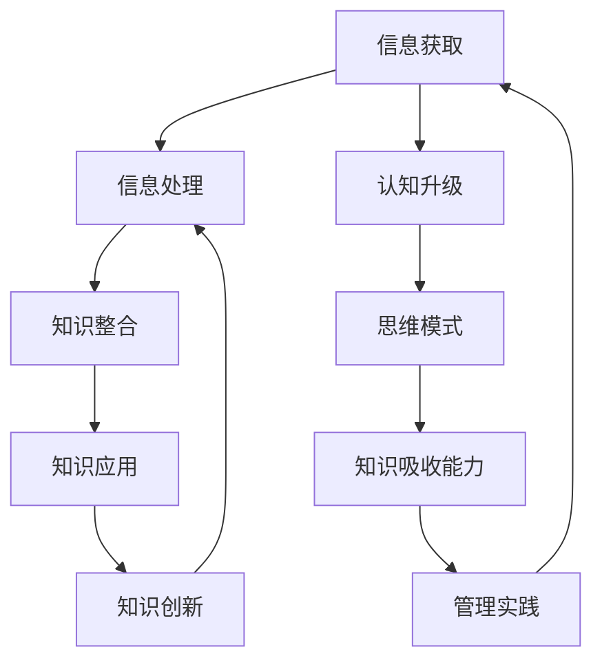

                 

### 第一部分：管理者的知识吸收能力建设

在信息爆炸和知识快速更新的当今社会，管理者的知识吸收能力成为衡量其竞争力的关键因素。知识吸收能力不仅影响个人的专业成长，更是组织持续发展的基石。本部分将围绕管理者的知识吸收能力进行深入探讨，旨在为读者提供系统性的理解和实践指南。

**第1章** "管理者的知识吸收能力概述" 将介绍知识吸收能力的重要性，定义及其核心要素，帮助读者建立对这一概念的基本认知。

**第2章** "核心概念与联系" 将通过Mermaid流程图展示知识吸收的过程及其关键节点，让读者从宏观上理解知识吸收的机制。

**第3章** "核心算法原理讲解" 将详细讲解学习算法的原理，并使用伪代码和数学模型阐述其应用，帮助读者掌握知识吸收的算法基础。

**第4章** "管理实践中的知识吸收" 将结合实际案例，探讨知识吸收策略在项目中的应用，以及知识吸收与组织学习的紧密联系。

通过本部分的学习，读者将能够：

- 明白知识吸收能力在当今社会中的重要性。
- 掌握知识吸收能力的基本概念和核心要素。
- 理解知识吸收的过程和关键节点。
- 应用学习算法和数学模型来优化知识吸收。
- 在实际管理实践中运用知识吸收策略，提升个人和组织的知识管理水平。

接下来，我们将详细探讨这些章节中的每一个主题，帮助读者逐步提升管理者的知识吸收能力。

## 第1章：管理者的知识吸收能力概述

### 1.1 管理者知识吸收能力的重要性

在知识经济时代，知识已经成为组织竞争力的核心资源。管理者作为组织的决策者和引领者，其知识吸收能力直接关系到组织的创新能力、竞争优势和长期发展。以下是管理者知识吸收能力的重要性分析：

#### 1.1.1 知识经济时代的管理挑战

知识经济时代，信息传播速度空前加快，知识更新周期不断缩短。管理者面临着前所未有的挑战，包括如何快速获取并利用新知识，如何处理大量的信息并从中筛选出有价值的内容，以及如何将新知识融入到组织的战略和运营中。传统的管理方式和方法已经难以适应这种快速变化的环境。

#### 1.1.2 管理者知识吸收能力的定义与特征

管理者知识吸收能力是指管理者在获取、理解、应用和创新知识方面的综合能力。它包括以下几个核心特征：

- **信息筛选能力**：管理者需要具备快速识别和筛选出有价值信息的能力，能够从大量信息中提取关键知识点。
- **思维模式与认知升级**：管理者需要具备开放和批判性的思维，能够不断挑战和更新自己的认知，适应新的知识和观念。
- **主动学习与实践能力**：管理者需要主动学习新知识，并将所学知识应用到实际工作中，通过实践不断验证和优化知识。

### 1.2 管理者知识吸收能力的核心要素

管理者知识吸收能力的建设是一个系统工程，需要从多个方面进行综合提升。以下是管理者知识吸收能力的核心要素：

#### 1.2.1 信息筛选能力

信息筛选能力是管理者知识吸收能力的基础。管理者需要具备以下技能：

- **信息源选择**：选择可靠、有价值的知识来源，包括专业书籍、学术论文、行业报告等。
- **信息处理**：对获取的信息进行筛选、整理和归纳，提取关键知识点。

#### 1.2.2 思维模式与认知升级

思维模式与认知升级是管理者知识吸收能力的关键。管理者需要：

- **批判性思维**：对已有的知识和观念进行批判性分析，不断挑战和验证自己的认知。
- **跨界思维**：将不同领域的知识和方法进行跨界整合，形成新的思维模式。

#### 1.2.3 主动学习与实践能力

主动学习与实践能力是管理者知识吸收能力的保障。管理者需要：

- **持续学习**：保持对知识的渴望，不断更新自己的知识库。
- **实践应用**：将所学知识应用到实际工作中，通过实践不断优化和验证知识。

### 1.3 管理者知识吸收能力的培养策略

要提升管理者的知识吸收能力，需要采取以下培养策略：

#### 1.3.1 个人知识管理（PKM）方法

个人知识管理（PKM）是一种有效的方法，可以帮助管理者系统性地整理和利用知识。具体方法包括：

- **知识地图构建**：通过构建知识地图，明确知识结构和关系，提高知识整合和利用效率。
- **知识管理工具选择**：选择合适的知识管理工具，如思维导图、笔记软件、知识库等，帮助管理者高效管理知识。

#### 1.3.2 学习共同体构建

学习共同体是一种通过共享知识和经验来促进个人成长和团队发展的方式。构建学习共同体需要：

- **建立共享平台**：搭建知识共享平台，鼓励团队成员分享知识和经验。
- **建立激励机制**：通过奖励和表彰，激励团队成员积极参与知识共享。

#### 1.3.3 知识共享与传播机制

知识共享与传播机制是提升管理者知识吸收能力的重要保障。具体措施包括：

- **内部培训与分享**：定期组织内部培训，分享新知识和经验。
- **跨部门合作与交流**：鼓励不同部门之间的合作与交流，促进知识的跨部门传播和应用。

通过以上策略，管理者可以不断提升自己的知识吸收能力，适应知识经济时代的管理挑战，为组织的持续发展贡献力量。

## 第2章：核心概念与联系

在深入探讨管理者的知识吸收能力之前，我们需要明确几个核心概念，并理解它们之间的联系。这些核心概念包括信息获取、知识整合、应用与创新。通过Mermaid流程图，我们可以更直观地展示这些概念及其关系。

### 2.1 知识吸收的Mermaid流程图



#### 2.1.1 知识吸收的过程

知识吸收的过程可以分为以下几个步骤：

1. **信息获取**：管理者通过各种渠道获取信息，包括阅读、观察、交流等。
2. **信息处理**：管理者对获取的信息进行筛选、分类和整合，提取关键知识点。
3. **知识整合**：管理者将不同来源的知识进行整合，形成完整的知识体系。
4. **知识应用**：管理者将所学知识应用到实际工作中，解决实际问题。
5. **知识创新**：通过实践和反思，管理者不断优化知识，进行创新。

#### 2.1.2 知识吸收的关键节点与作用

在知识吸收的过程中，有几个关键节点起着至关重要的作用：

- **信息处理**：信息处理是知识吸收的第一步，决定了管理者能否有效获取和利用信息。高效的信息处理能力可以帮助管理者从海量信息中快速筛选出有价值的内容。
- **知识整合**：知识整合是管理者将分散的知识点进行系统化整合的过程。通过知识整合，管理者可以形成一个完整的知识体系，提高知识的应用效率。
- **知识应用**：知识应用是将理论知识转化为实际能力的过程。通过实际应用，管理者可以验证和优化知识，提升个人的业务水平和解决问题的能力。
- **知识创新**：知识创新是管理者在知识应用过程中不断反思和优化的结果。通过创新，管理者可以形成独特的见解和方法，为组织带来新的价值。

通过理解这些核心概念及其联系，管理者可以更系统地提升自己的知识吸收能力，从而在知识经济时代中脱颖而出。

### 2.2 知识吸收与认知升级

认知升级是管理者知识吸收能力的重要组成部分。它不仅影响管理者对知识的理解和应用，还决定着管理者能否在复杂多变的环境中保持竞争优势。以下是认知升级与知识吸收之间的关系及其应用策略：

#### 2.2.1 认知升级的重要性

认知升级是指管理者通过学习新知识、拓展思维和提升思维能力，不断更新和优化自己的认知结构。认知升级的重要性体现在以下几个方面：

- **提高信息处理效率**：通过认知升级，管理者可以更快速地理解和处理大量信息，提高工作效率。
- **增强决策能力**：认知升级可以帮助管理者更好地分析问题、制定决策，减少决策失误。
- **提升创新能力**：认知升级为管理者提供了更广阔的视野和思维方式，有助于发现新的机遇和解决方案。
- **适应变化**：在知识经济时代，环境变化迅速，认知升级使管理者能够更好地适应变化，保持组织的竞争力。

#### 2.2.2 认知升级与知识吸收的关系

认知升级与知识吸收密切相关。知识吸收是认知升级的基础，而认知升级是知识吸收的深化和扩展。两者之间的关系如下：

- **知识吸收推动认知升级**：通过知识吸收，管理者获取新的知识和信息，这些知识和信息有助于拓展管理者的思维边界，促进认知升级。
- **认知升级促进知识吸收**：认知升级使管理者能够更高效地获取、理解和应用知识，提高知识吸收的质量和效率。

#### 2.2.3 应用策略

为了实现认知升级，管理者可以采取以下策略：

- **持续学习**：保持对知识的渴望，通过阅读、培训、交流等方式不断学习新知识。
- **跨界思维**：跳出自己的专业领域，学习其他领域的知识和方法，拓展思维视野。
- **反思与总结**：在工作中不断反思和总结，从成功和失败中汲取经验，优化自己的认知结构。
- **实践应用**：将所学知识应用到实际工作中，通过实践验证和优化知识。

通过认知升级，管理者可以不断提升自己的知识吸收能力，为组织的持续发展贡献力量。

### 2.3 思维模式与知识吸收

思维模式是管理者知识吸收能力的重要组成部分。它决定了管理者对知识的理解和应用方式，影响着管理者的决策和创新能力。以下是思维模式与知识吸收之间的关系及其应用策略：

#### 2.3.1 思维模式的重要性

思维模式是指管理者在思考和解决问题时的基本方式和习惯。一个良好的思维模式有助于管理者更高效地吸收和应用知识，提高决策和创新能力。思维模式的重要性体现在以下几个方面：

- **提高问题解决能力**：良好的思维模式可以帮助管理者更快速地识别和解决问题，提高工作效率。
- **增强创新能力**：思维模式决定了管理者的思考方向和视野，一个开放和创新的思维模式有助于发现新的解决方案。
- **提升决策能力**：良好的思维模式可以帮助管理者更全面地分析问题，做出更明智的决策。

#### 2.3.2 思维模式与知识吸收的关系

思维模式与知识吸收密切相关。知识吸收是思维模式的基础，而思维模式是知识吸收的深化和扩展。两者之间的关系如下：

- **知识吸收影响思维模式**：通过知识吸收，管理者获取新的知识和信息，这些知识和信息有助于拓展管理者的思维边界，形成新的思维模式。
- **思维模式促进知识吸收**：一个良好的思维模式可以帮助管理者更高效地获取、理解和应用知识，提高知识吸收的质量和效率。

#### 2.3.3 应用策略

为了建立良好的思维模式，管理者可以采取以下策略：

- **批判性思维**：培养批判性思维，不断质疑和反思现有的知识和观念，形成独立和创新的见解。
- **系统思维**：运用系统思维，从整体和全局的角度分析问题，避免片面和短视的思考。
- **跨界思维**：跳出自己的专业领域，学习其他领域的知识和方法，形成多元化的思维模式。
- **反思与总结**：在工作中不断反思和总结，从成功和失败中汲取经验，优化自己的思维模式。

通过建立良好的思维模式，管理者可以提升自己的知识吸收能力，为组织的持续发展贡献力量。

### 2.4 主动学习与实践能力与知识吸收

主动学习与实践能力是管理者知识吸收能力的核心组成部分，它决定了管理者能否将所学知识有效应用到实际工作中，提升个人和组织的竞争力。以下是主动学习与实践能力与知识吸收之间的关系及其应用策略：

#### 2.4.1 主动学习与实践能力的重要性

主动学习与实践能力是指管理者主动获取知识、积极应用知识并持续实践的能力。这种能力的重要性体现在以下几个方面：

- **提高知识应用效率**：主动学习与实践能力使管理者能够迅速将所学知识应用到实际工作中，提高工作效率。
- **增强问题解决能力**：通过实践，管理者可以不断验证和优化知识，提高解决问题的能力。
- **促进创新能力**：主动学习与实践能力使管理者能够在实际工作中发现新问题和挑战，从而激发创新思维。

#### 2.4.2 主动学习与实践能力与知识吸收的关系

主动学习与实践能力与知识吸收密切相关。知识吸收是主动学习与实践能力的基础，而主动学习与实践能力是知识吸收的深化和扩展。两者之间的关系如下：

- **知识吸收促进主动学习与实践能力**：通过知识吸收，管理者获取新的知识和信息，这些知识和信息激励管理者主动学习和实践，提升个人能力。
- **主动学习与实践能力促进知识吸收**：通过主动学习与实践，管理者可以更好地理解和应用知识，提高知识吸收的质量和效率。

#### 2.4.3 应用策略

为了提升主动学习与实践能力，管理者可以采取以下策略：

- **制定学习计划**：制定明确的学习目标和计划，确保学习过程的系统性和持续性。
- **积极参与实践**：将所学知识应用到实际工作中，通过实践不断验证和优化知识。
- **反思与总结**：在工作中不断反思和总结，从成功和失败中汲取经验，优化学习与实践过程。
- **建立学习共同体**：与他人分享知识和经验，共同学习和成长，形成良好的学习氛围。

通过提升主动学习与实践能力，管理者可以更好地吸收和应用知识，为组织的持续发展贡献力量。

## 第3章：核心算法原理讲解

在管理者的知识吸收过程中，核心算法原理起着关键作用。这些算法不仅帮助管理者更有效地获取和应用知识，还促进了知识的创新与整合。本节将详细讲解以下几个核心算法原理：强化学习、知识映射与整合算法，以及知识评估与反馈机制，并使用伪代码和数学模型进行阐述。

### 3.1 学习算法原理

#### 3.1.1 强化学习与管理者决策

强化学习（Reinforcement Learning）是一种通过试错和奖励反馈进行学习的算法，广泛应用于决策优化和问题解决。在管理者知识吸收中，强化学习可以帮助管理者优化决策过程，提高知识吸收效果。

**伪代码：**

```python
# 初始化
state = 初始状态
action = 随机选择行动
reward = 0

# 主循环
while 未达到目标：
    # 状态转移
    next_state, reward = 环境响应(action)
    
    # 更新策略
    Q(state, action) = Q(state, action) + 学习率 * (reward + γ * max(Q(next_state, action)) - Q(state, action))
    
    # 更新状态
    state = next_state
    
    # 执行行动
    action = 选择最佳行动（基于Q值）

```

**数学模型：**

$$
Q(s, a) = Q(s, a) + α [r + γ \max_{a'} Q(s', a') - Q(s, a)]
$$`

其中，\( Q(s, a) \) 表示状态 \( s \) 下采取行动 \( a \) 的价值函数，\( r \) 为即时奖励，\( γ \) 为折扣因子，\( α \) 为学习率。

#### 3.1.2 知识映射与整合算法

知识映射与整合算法是管理者在知识吸收过程中将新知识与已有知识进行整合的关键。这种算法通过将新知识映射到已有知识结构中，实现知识的互补和优化。

**伪代码：**

```python
# 初始化
知识库 = 初始知识库
新知识 = 获取新知识

# 知识映射
映射结果 = 知识映射算法（知识库，新知识）

# 知识整合
知识库 = 知识整合算法（知识库，映射结果）

```

**数学模型：**

$$
Knowledge_{integration} = f(K_1, K_2, ...)
$$`

其中，\( K_1, K_2, ... \) 为不同来源的知识，\( f \) 为知识整合函数。

#### 3.1.3 知识评估与反馈机制

知识评估与反馈机制是管理者对知识吸收效果进行评估和调整的关键。通过知识评估，管理者可以了解知识的有效性和适用性，为后续知识吸收提供指导。

**伪代码：**

```python
# 初始化
知识库 = 初始知识库
评估标准 = 初始评估标准

# 知识评估
评估结果 = 知识评估算法（知识库，评估标准）

# 反馈调整
知识库 = 知识反馈调整算法（知识库，评估结果）

```

**数学模型：**

$$
Knowledge_{evaluation} = f(K, S)
$$`

其中，\( K \) 为知识库，\( S \) 为评估标准。

### 3.2 数学模型与公式

#### 3.2.1 贝叶斯推理与知识更新

贝叶斯推理是管理者在知识吸收过程中进行推理和决策的重要工具。通过贝叶斯推理，管理者可以动态更新知识库，提高知识的准确性和适用性。

**数学公式：**

$$
P(A|B) = \frac{P(B|A) \cdot P(A)}{P(B)}
$$`

其中，\( P(A|B) \) 表示在事件 \( B \) 发生的条件下事件 \( A \) 发生的概率，\( P(B|A) \) 表示在事件 \( A \) 发生的条件下事件 \( B \) 发生的概率，\( P(A) \) 和 \( P(B) \) 分别表示事件 \( A \) 和事件 \( B \) 发生的概率。

#### 3.2.2 知识增长模型

知识增长模型描述了管理者在知识吸收过程中知识量的变化趋势。通过知识增长模型，管理者可以了解知识积累的规律，优化知识吸收策略。

**数学公式：**

$$
Knowledge_{growth} = Knowledge_{initial} + \sum_{i=1}^{n} Learning_{rate} \cdot Knowledge_{absorbed}_{i}
$$`

其中，\( Knowledge_{initial} \) 为初始知识量，\( Learning_{rate} \) 为学习率，\( Knowledge_{absorbed}_{i} \) 为第 \( i \) 次吸收的知识量。

通过以上核心算法原理和数学模型，管理者可以更系统地提升知识吸收能力，实现知识的动态更新和持续增长。在下一章节中，我们将结合实际案例，探讨这些算法在管理者知识吸收中的应用与实践。

### 3.3 管理者知识吸收能力的应用案例

在深入理解了管理者知识吸收的核心算法原理后，我们通过具体案例来探讨这些原理在实际管理中的应用，从而更好地理解如何将这些理论转化为实践。

#### 3.3.1 强化学习在项目管理中的应用

**案例背景：** 
一家跨国科技公司计划开发一款智能家居APP，该项目涉及多个技术领域，包括物联网、人工智能和用户界面设计等。项目经理Tom在项目启动初期，面临着技术选型、团队协作和进度控制等多方面的挑战。

**应用过程：**
1. **问题识别**：Tom首先识别出项目中的关键问题，如技术选型不确定、团队沟通不畅、进度延误等。
2. **算法设计**：为了优化决策过程，Tom决定使用强化学习算法来指导项目决策。他定义了项目的状态空间（如技术方案、团队成员满意度、进度状况）和动作空间（如技术方案调整、沟通策略改进、进度调整）。
3. **奖励机制**：Tom设定了奖励机制，如按时完成任务、提高团队成员满意度等，以鼓励团队成员采取最佳行动。

**伪代码示例：**
```python
# 初始化状态和动作
state = 初始状态（技术方案、团队成员满意度、进度状况）
action = 随机选择行动（技术方案调整、沟通策略改进、进度调整）

# 主循环
while 项目未完成：
    # 状态转移
    next_state, reward = 环境响应(action)
    
    # 更新策略
    Q(state, action) = Q(state, action) + 学习率 * (reward + γ * max(Q(next_state, action)) - Q(state, action))
    
    # 更新状态
    state = next_state
    
    # 执行行动
    action = 选择最佳行动（基于Q值）

```

**结果分析：** 
通过强化学习算法，Tom能够动态调整项目策略，提高团队协作效率，项目进度显著加快，最终成功完成了智能家居APP的开发。

#### 3.3.2 知识映射与整合算法在跨部门协作中的应用

**案例背景：**
一家大型制造企业计划实施精益生产管理，涉及到生产部门、物流部门和质量管理部门等多个部门。公司总裁Lily希望通过知识映射与整合算法，实现跨部门知识共享和协同工作。

**应用过程：**
1. **知识识别**：Lily识别出各部门在精益生产管理方面的核心知识和技能，如生产流程优化、物流管理、质量控制等。
2. **知识映射**：Lily使用知识映射算法，将不同部门的知识进行整合，形成一个统一的精益生产知识库。
3. **知识整合**：Lily通过组织跨部门研讨会和工作坊，促进部门之间的知识交流，实现知识整合。

**伪代码示例：**
```python
# 初始化知识库
知识库 = 初始知识库（生产部门知识、物流部门知识、质量管理部门知识）

# 获取新知识
新知识 = 获取新知识（跨部门知识交流）

# 知识映射与整合
映射结果 = 知识映射算法（知识库，新知识）
知识库 = 知识整合算法（知识库，映射结果）

```

**结果分析：** 
通过知识映射与整合算法，企业实现了跨部门知识共享，提高了各部门之间的协同效率，精益生产管理得以顺利实施，生产成本显著降低。

#### 3.3.3 知识评估与反馈机制在培训计划中的应用

**案例背景：**
一家软件公司计划实施新员工培训计划，公司HR经理Alice希望通过知识评估与反馈机制，确保培训效果并持续优化培训内容。

**应用过程：**
1. **评估标准设定**：Alice设定了培训效果评估标准，如新员工的知识掌握程度、实际操作能力、团队协作情况等。
2. **知识评估**：在培训过程中，Alice通过测试和观察，对新员工的知识吸收效果进行实时评估。
3. **反馈调整**：根据评估结果，Alice调整培训内容和策略，提高培训效果。

**伪代码示例：**
```python
# 初始化评估标准
评估标准 = 初始评估标准（知识掌握程度、实际操作能力、团队协作情况）

# 知识评估
评估结果 = 知识评估算法（新员工知识库，评估标准）

# 反馈调整
培训内容 = 知识反馈调整算法（培训内容，评估结果）

```

**结果分析：** 
通过知识评估与反馈机制，公司的培训计划得以持续优化，新员工的知识吸收效果显著提高，公司整体业务水平得到了提升。

通过这些实际案例，我们可以看到管理者如何将知识吸收的核心算法原理应用于实际工作中，实现知识的有效吸收和持续创新。在下一章节中，我们将进一步探讨知识吸收策略在管理实践中的应用。

## 第4章：管理实践中的知识吸收

在了解了管理者知识吸收的核心算法原理后，我们将探讨这些知识吸收策略如何在实际管理中具体应用。通过实际案例和项目实战，我们将展示如何将理论知识转化为实际行动，提升管理者的知识吸收能力。

### 4.1 管理者知识吸收案例分析

#### 4.1.1 成功案例分析

**案例背景：** 
一家快速增长的互联网公司，在市场竞争激烈的环境下，如何快速提升研发团队的知识吸收能力，保持技术领先优势。

**应用过程：**
1. **信息筛选与整合**：公司管理层通过定期举办技术研讨会，邀请业内专家分享最新技术动态，同时建立内部知识库，收集和整理团队的知识成果。
2. **学习共同体建设**：公司推动员工成立学习小组，通过内部分享和讨论，促进知识的共享和交流。
3. **知识评估与反馈**：管理层定期对团队的知识吸收效果进行评估，通过测试和项目实践，发现知识盲点和薄弱环节，及时调整学习策略。

**结果分析：** 
通过以上措施，公司研发团队的知识吸收能力显著提升，团队成员在新技术、新方法的应用上更加熟练，公司整体技术水平保持行业领先。

#### 4.1.2 失败案例分析

**案例背景：** 
一家传统制造业企业，尝试引入新的管理理念，但由于知识吸收策略不当，导致项目失败。

**应用过程：**
1. **知识获取不全面**：企业管理层仅关注新管理工具的引进，忽视了与新管理理念相关的基础知识和实践经验的积累。
2. **缺乏实践应用**：新管理理念未能有效应用到实际生产过程中，导致员工不适应新方法，生产效率下降。
3. **评估机制不足**：企业在实施过程中缺乏有效的知识评估和反馈机制，未能及时发现问题并进行调整。

**结果分析：** 
由于知识吸收策略不当，企业项目失败，员工对新的管理理念产生了抵触情绪，管理层也失去了对知识吸收策略的信心。

通过以上成功和失败的案例，我们可以看到，在实际管理中，知识吸收策略的成功与否取决于多个因素，包括知识的获取、整合、实践和评估。在下一部分中，我们将深入探讨如何将知识吸收策略应用于项目实战。

### 4.2 知识吸收策略在项目中的应用

在项目管理中，知识吸收策略的有效应用是确保项目成功的关键。以下是知识吸收策略在项目中的具体应用步骤和注意事项：

#### 4.2.1 项目背景与目标

**项目背景：**
一家互联网公司计划开发一款智能客服系统，以提升客户服务质量。该项目涉及人工智能、自然语言处理、用户界面设计等多个技术领域。

**项目目标：**
1. 完成智能客服系统的设计与开发。
2. 提高客服响应速度和准确性。
3. 提升客户满意度。

#### 4.2.2 知识吸收策略设计

1. **信息筛选与整合：**
   - **信息源选择**：收集并筛选与智能客服系统相关的技术文献、学术论文、行业报告等。
   - **知识整合**：建立内部知识库，将收集到的信息进行整理和分类，形成系统化的知识体系。

2. **学习共同体构建：**
   - **内部培训**：组织内部技术研讨和培训，分享最新技术动态和项目进展。
   - **跨部门交流**：促进研发、测试、运维等部门的沟通与协作，共同提升知识水平。

3. **知识应用与实战：**
   - **试点应用**：在项目早期阶段，选择部分功能模块进行试点应用，验证技术方案的可行性和效果。
   - **持续优化**：根据试点应用的结果，不断优化系统设计，提高系统的稳定性和性能。

4. **知识评估与反馈：**
   - **阶段性评估**：在项目各个阶段进行知识吸收效果的评估，确保知识应用的持续改进。
   - **反馈机制**：建立反馈机制，收集用户反馈和专家意见，及时调整项目策略。

#### 4.2.3 项目实施与效果评估

**项目实施过程：**
1. **需求分析与规划**：明确智能客服系统的功能需求和性能指标，制定详细的项目计划。
2. **技术选型与研发**：根据项目需求，选择合适的技术方案，进行系统开发和功能实现。
3. **测试与优化**：进行系统测试，包括功能测试、性能测试和安全测试，确保系统稳定可靠。
4. **上线与运维**：系统上线后，进行持续监控和运维，确保系统的高效运行。

**效果评估：**
1. **技术吸收效果评估**：通过测试结果和技术指标，评估研发团队的知识吸收效果。
2. **用户满意度评估**：收集用户反馈，评估智能客服系统的实际应用效果和用户满意度。
3. **项目效益评估**：从项目成本、时间、质量等方面，综合评估项目的整体效益。

通过以上知识吸收策略在项目中的应用，可以有效提升项目的成功率，确保项目目标的实现。在下一节中，我们将进一步探讨知识吸收与组织学习的紧密联系。

### 4.3 知识吸收与组织学习

知识吸收不仅是个人成长的关键，更是组织持续发展的基石。在快速变化的市场环境中，组织需要通过有效的知识吸收和共享机制，不断提升自身的竞争力。知识吸收与组织学习之间存在着紧密的联系，两者相互促进，共同推动组织的进步。

#### 4.3.1 组织学习的重要性

组织学习是指组织通过共享知识、经验和文化，不断改进和优化自身行为和能力的动态过程。组织学习的重要性体现在以下几个方面：

- **提升创新能力**：通过组织学习，组织可以不断积累和创新知识，形成独特的竞争优势。
- **增强团队协作**：组织学习促进团队成员之间的知识共享和协作，提高团队整体绩效。
- **适应市场变化**：在快速变化的市场环境中，组织学习使组织能够迅速适应外部环境的变化，保持持续发展。

#### 4.3.2 知识吸收在组织学习中的应用

知识吸收是组织学习的重要组成部分，它为组织提供了新的知识资源和思维模式。以下是知识吸收在组织学习中的应用策略：

- **建立学习型组织文化**：组织需要培养开放、共享的学习氛围，鼓励员工积极参与知识吸收和分享。
- **设计有效的学习机制**：组织可以设计如内部培训、跨部门交流、项目实践等机制，促进知识吸收和共享。
- **利用技术工具**：通过知识管理工具、学习管理系统等，帮助组织高效地收集、整理和共享知识。

#### 4.3.3 知识吸收与组织学习的互动关系

知识吸收与组织学习之间存在着相互促进的互动关系：

- **知识吸收促进组织学习**：通过知识吸收，组织可以获得新的知识和经验，为组织学习提供内容基础。
- **组织学习促进知识吸收**：组织学习为知识吸收提供了平台和机制，使知识能够更有效地被吸收和应用。

通过知识吸收与组织学习的有机结合，组织可以不断提升自身的知识水平和创新能力，为组织的长期发展奠定坚实基础。

## 第二部分：提升知识吸收率的实践策略

### 第5章：构建个人知识体系

在快速变化的知识经济时代，管理者需要具备强大的知识吸收能力，才能在激烈的市场竞争中脱颖而出。而构建个人知识体系是实现这一目标的关键步骤。本章将探讨如何构建个人知识体系，包括知识地图的构建、知识管理工具的选择以及个人知识管理计划的制定。

### 5.1 个人知识体系构建步骤

#### 5.1.1 知识地图构建

知识地图是一种直观、系统化的知识表示工具，它可以帮助管理者清晰地了解自己的知识结构，发现知识盲点和薄弱环节。以下是构建知识地图的步骤：

1. **确定知识领域**：首先，确定个人专业领域和相关知识领域，如项目管理、软件开发、市场营销等。
2. **收集知识资源**：通过阅读书籍、学术论文、专业网站等渠道，收集相关领域的知识资源。
3. **整理知识结构**：将收集到的知识资源进行分类整理，形成知识体系。可以使用思维导图等工具，将知识结构可视化。
4. **更新知识地图**：随着知识的不断更新，定期更新知识地图，确保其准确性和时效性。

#### 5.1.2 知识管理工具选择

知识管理工具是构建个人知识体系的重要支撑。以下是一些常用的知识管理工具：

- **笔记软件**：如Evernote、OneNote等，用于记录和管理个人的笔记和想法。
- **思维导图工具**：如MindManager、XMind等，用于构建和可视化知识结构。
- **知识库软件**：如Confluence、SharePoint等，用于存储和共享知识文档。
- **在线学习平台**：如Coursera、Udemy等，用于在线学习新知识和技能。

选择合适的知识管理工具，可以根据个人的工作习惯和需求进行。例如，如果需要大量记录和整理笔记，可以选择Evernote；如果需要构建复杂的知识结构，可以选择MindManager。

#### 5.1.3 个人知识管理计划制定

制定个人知识管理计划是实现知识体系构建和优化的关键。以下是制定个人知识管理计划的步骤：

1. **明确目标**：首先，明确个人知识管理计划的目标，如提升某个领域的专业知识、拓展新技能等。
2. **制定策略**：根据目标，制定具体的知识管理策略，如定期阅读专业书籍、参加在线课程、参与专业讨论等。
3. **设定时间表**：为每个知识管理策略设定具体的时间表，确保计划的可执行性。
4. **监控与评估**：定期监控知识管理计划的执行情况，根据评估结果进行调整和优化。

通过以上步骤，管理者可以构建一个系统化、高效的个人知识体系，提升自己的知识吸收能力，为组织的持续发展贡献力量。

### 5.2 知识共享与协作

在个人知识体系构建的过程中，知识共享与协作是不可或缺的环节。通过有效的知识共享与协作，管理者不仅可以提升自己的知识吸收能力，还可以促进团队整体的知识水平和创新能力。以下是知识共享与协作的关键要素和实践策略：

#### 5.2.1 知识共享平台建设

知识共享平台是组织内部知识传播和共享的重要工具。以下是如何建设知识共享平台的步骤：

1. **确定平台目标**：首先，明确知识共享平台的目标，如提高知识传播效率、促进团队合作等。
2. **选择平台工具**：根据组织的需求，选择合适的知识共享工具，如知识库软件、论坛、社交媒体等。
3. **搭建平台架构**：设计平台的架构，包括知识分类、权限设置、内容管理等功能。
4. **制定共享规则**：制定知识共享的规则和流程，确保知识共享的规范和有序。

#### 5.2.2 知识共享激励机制

为了激发员工参与知识共享的积极性，组织需要制定有效的激励机制。以下是一些常见的激励机制：

1. **奖励制度**：对积极参与知识共享的员工进行奖励，如奖金、晋升机会等。
2. **荣誉制度**：设立知识共享荣誉奖项，表彰在知识共享方面做出突出贡献的员工。
3. **晋升机制**：将知识共享能力纳入员工的职业发展评估，为知识贡献者提供更多晋升机会。
4. **培训机会**：为知识贡献者提供更多的培训和学习机会，提升其专业素养和知识水平。

#### 5.2.3 知识协作与团队建设

知识协作是提升团队整体知识吸收能力的重要途径。以下是一些实践策略：

1. **团队学习**：定期组织团队学习活动，如研讨会、工作坊等，促进团队成员之间的知识交流和共享。
2. **跨部门协作**：鼓励不同部门之间的协作，通过跨部门项目，促进知识的跨领域传播和应用。
3. **知识共享会议**：定期举办知识共享会议，让团队成员分享自己的知识和经验，激发团队的创新能力。
4. **建立知识传承机制**：通过导师制度、师徒关系等，帮助新员工快速融入团队，传承和积累知识。

通过以上策略，组织可以构建一个高效的知识共享与协作机制，提升团队的整体知识吸收能力，为组织的持续发展提供强大支持。

### 5.3 持续学习与自我提升

在知识经济时代，持续学习与自我提升是管理者保持竞争力、实现职业发展的关键。以下将讨论持续学习的重要性、自我提升路径规划以及如何通过实践和反思提升知识吸收能力。

#### 5.3.1 持续学习的重要性

持续学习是管理者适应快速变化的环境、提升自身知识水平的关键。以下为持续学习的重要性分析：

1. **提升竞争力**：通过持续学习，管理者可以不断掌握新的知识和技能，提升自身的专业能力，从而在竞争激烈的市场中保持优势。
2. **适应环境变化**：知识更新速度加快，管理者需要持续学习，以适应不断变化的市场环境和技术发展趋势。
3. **促进职业发展**：持续学习有助于管理者拓展职业视野，提升职业素养，为职业晋升和职业转型奠定基础。

#### 5.3.2 自我提升路径规划

为了实现持续学习与自我提升，管理者需要制定明确的自我提升路径。以下是自我提升路径规划的步骤：

1. **明确目标**：首先，明确自己的职业目标和自我提升方向，如提升某项专业技能、拓展新知识领域等。
2. **制定计划**：根据目标，制定具体的自我提升计划，包括学习内容、学习时间、学习方式等。
3. **设定里程碑**：为每个学习阶段设定里程碑，以便在实现阶段性目标后进行评估和调整。
4. **定期评估**：定期评估自我提升计划的执行情况，根据评估结果进行调整和优化。

#### 5.3.3 实践与反思

实践与反思是提升知识吸收能力的重要环节。以下是如何通过实践与反思提升知识吸收能力的策略：

1. **理论与实践相结合**：将所学知识应用到实际工作中，通过实践不断验证和优化知识。例如，学习项目管理知识后，可以在实际项目中应用这些知识，提升项目管理和执行能力。
2. **定期总结与反思**：定期对所学知识进行总结和反思，发现自己的不足和需要改进的地方。通过总结和反思，可以不断优化学习策略，提高学习效果。
3. **交流与分享**：与他人交流和分享所学知识，通过讨论和反馈，发现新的见解和解决问题的方法。例如，参加行业会议、研讨会等，与同行交流经验和观点。
4. **反思与调整**：在知识吸收过程中，管理者需要不断反思和调整自己的学习方法和策略。根据反馈和评估结果，及时调整学习计划，确保学习效果的最大化。

通过持续学习、自我提升路径规划和实践反思，管理者可以不断提升知识吸收能力，实现职业发展和个人成长。

### 5.4 职业发展规划与知识吸收

在职业生涯中，管理者的成长和进步离不开知识吸收。一个清晰的职业发展规划不仅为个人的发展指明了方向，也为知识吸收提供了目标导向。以下是职业发展规划与知识吸收之间的关系以及如何通过知识吸收实现职业目标。

#### 5.4.1 职业发展规划与知识吸收的关系

1. **目标导向**：职业发展规划明确了个人在职业生涯中的目标，如晋升、专业转型等。这些目标为知识吸收提供了明确的方向，管理者可以根据职业目标选择相应的知识和技能进行学习。
2. **能力提升**：知识吸收是实现职业目标的重要手段。通过学习新的知识和技能，管理者可以不断提升自己的专业能力，为职业发展打下坚实基础。
3. **持续适应**：职业环境不断变化，管理者需要通过知识吸收不断更新自己的知识和技能，以适应新的职业要求和市场变化。

#### 5.4.2 实现职业目标的策略

1. **制定职业发展计划**：明确个人的职业目标，如晋升至高级管理职位、成为某个领域的专家等。根据职业目标，制定详细的职业发展计划，包括学习内容、学习时间、职业路径等。
2. **知识需求分析**：分析职业目标所需的知识和技能，确定学习重点。例如，如果目标是成为高级项目经理，则需要重点学习项目管理、领导力、沟通技巧等。
3. **持续学习与实践**：通过参加培训课程、阅读专业书籍、在线学习等方式，持续学习新的知识和技能。同时，将所学知识应用到实际工作中，通过实践不断提升自己的能力。
4. **反馈与调整**：在职业发展过程中，定期评估知识吸收的效果，根据评估结果调整学习计划。例如，如果发现自己在领导力方面有所欠缺，可以增加相关培训和学习。
5. **建立人脉网络**：与行业内的人士建立联系，通过交流和学习，获取更多的职业发展机会和资源。参加行业会议、社交活动等，拓展职业视野和人脉。

通过明确的职业发展规划和有效的知识吸收策略，管理者可以不断提升自己的职业素养和竞争力，实现职业发展目标。

### 第6章：知识吸收率评估与优化

在管理者的知识吸收能力建设中，评估和优化知识吸收率是关键环节。通过科学的评估方法和有效的优化策略，管理者可以了解自身的知识吸收效果，找出不足之处并进行改进，从而不断提升知识吸收能力。

#### 6.1 知识吸收率评估指标

知识吸收率的评估需要多个维度的指标来全面衡量。以下是几个关键评估指标：

1. **吸收效率指标**：衡量管理者在单位时间内吸收知识的能力。可以通过学习完成度、学习速度等指标进行评估。
2. **吸收深度指标**：衡量管理者对知识的理解和掌握程度。可以通过知识应用能力、问题解决能力等指标进行评估。
3. **吸收广度指标**：衡量管理者知识范围的广度和覆盖面。可以通过学习领域多样性、知识整合能力等指标进行评估。

#### 6.1.1 吸收效率指标

吸收效率指标反映了管理者在知识吸收过程中的效率。以下是一些具体的评估方法：

- **学习完成度**：通过完成学习任务的情况来评估吸收效率，如完成课程学习、阅读书籍等。
- **学习速度**：通过完成学习任务所需的时间来评估吸收效率，如完成某项学习内容的时间长短。
- **知识应用率**：通过管理者将所学知识应用到实际工作中的频率和效果来评估吸收效率。

#### 6.1.2 吸收深度指标

吸收深度指标反映了管理者对知识的深入理解和掌握程度。以下是一些具体的评估方法：

- **知识应用能力**：通过管理者在实际工作中应用所学知识解决实际问题的能力来评估吸收深度。
- **问题解决能力**：通过管理者在遇到问题时能够独立分析和解决的能力来评估吸收深度。
- **知识创新度**：通过管理者在知识应用过程中产生的创新想法和新方法来评估吸收深度。

#### 6.1.3 吸收广度指标

吸收广度指标反映了管理者知识领域的广度和多样性。以下是一些具体的评估方法：

- **学习领域多样性**：通过管理者学习的知识领域数量和多样性来评估吸收广度，如学习领域涵盖技术、管理、市场等多个方面。
- **知识整合能力**：通过管理者能够将不同领域的知识进行整合和创新应用的能力来评估吸收广度。
- **跨界思维**：通过管理者能够跨越不同领域，进行跨界思考和解决问题的能力来评估吸收广度。

#### 6.2 知识吸收率优化策略

在了解知识吸收率评估指标后，管理者需要采取有效的策略进行优化。以下是几种常见的优化策略：

1. **优化学习环境**：提供良好的学习资源和学习环境，如图书馆、在线课程、学习社区等，为管理者提供丰富的知识来源。
2. **制定个性化学习计划**：根据管理者的职业目标和个人特点，制定个性化的学习计划，确保学习内容与职业发展需求相匹配。
3. **提升学习效率**：采用高效的学习方法和工具，如速读技巧、记忆法等，提高学习效率。
4. **强化实践应用**：通过实际项目和工作任务，将所学知识应用到实践中，提升知识的应用能力和解决实际问题的能力。
5. **建立反馈机制**：定期进行知识吸收效果评估，收集反馈意见，及时调整学习策略和计划。
6. **促进知识共享与协作**：通过建立学习共同体，促进知识共享和团队协作，提升整体知识吸收能力。

通过科学评估和有效优化，管理者可以不断提升自己的知识吸收能力，为职业发展和组织贡献更多价值。

### 6.3 知识吸收率优化实践

为了有效提升知识吸收率，管理者需要在实际工作中采取一系列具体的实践措施。以下是几种实践策略及其应用效果：

#### 6.3.1 知识环境优化

**实践策略：**
1. **建立内部学习平台**：搭建公司内部学习平台，提供丰富的学习资源和在线课程，方便员工随时随地进行学习。
2. **定期举办培训活动**：组织定期的内部培训活动，邀请行业专家和内部优秀员工分享经验和知识。
3. **营造学习氛围**：鼓励员工主动学习，培养学习型组织的文化氛围，通过奖励和表彰激励员工积极参与学习。

**应用效果：**
通过建立内部学习平台和定期培训，员工的学习资源更加丰富，学习效率显著提升。同时，学习型组织的氛围促进了知识的传播和共享，整体知识吸收率得到提高。

#### 6.3.2 学习资源优化

**实践策略：**
1. **精选学习资源**：根据员工的职业发展需求，精选优质的学习资源，如专业书籍、学术论文、在线课程等。
2. **知识共享机制**：建立知识共享机制，鼓励员工将自己掌握的知识和经验分享给他人，形成良好的知识传递和共享文化。
3. **利用外部资源**：充分利用外部资源，如参加行业会议、培训、学术研讨会等，获取最新的行业动态和前沿知识。

**应用效果：**
通过精选学习资源和建立知识共享机制，员工能够获取更多有价值的知识，学习资源的利用效率显著提高。同时，外部资源的利用拓展了员工的知识视野，增强了整体的知识吸收能力。

#### 6.3.3 知识吸收过程优化

**实践策略：**
1. **制定学习计划**：为每位员工制定个性化的学习计划，确保学习内容与职业发展需求相匹配。
2. **实践与反思**：鼓励员工将所学知识应用到实际工作中，通过实践不断验证和优化知识，并通过反思总结经验教训。
3. **定期评估与反馈**：定期对员工的知识吸收效果进行评估，根据评估结果进行反馈和调整，确保学习目标的实现。

**应用效果：**
通过制定个性化的学习计划和鼓励实践与反思，员工能够更高效地吸收和应用知识。定期评估与反馈机制确保了学习目标的实现，提高了知识吸收的深度和广度。

通过以上实践策略，管理者可以系统性地优化知识吸收过程，提高知识吸收率，为组织的持续发展提供有力支持。

### 6.4 知识吸收率优化工具与技巧

为了进一步提升知识吸收率，管理者可以借助一系列工具和技巧，这些工具和技巧不仅能够提高学习效率，还能促进知识的深入理解和应用。以下是几种有效的工具与技巧：

#### 6.4.1 知识管理工具

**1. 知识库软件**
- **功能**：用于存储、管理和共享组织内的知识资源。
- **示例**：Confluence、SharePoint
- **技巧**：定期更新知识库，确保信息的时效性和准确性。

**2. 笔记软件**
- **功能**：用于记录个人学习笔记、思路和创意。
- **示例**：Evernote、OneNote
- **技巧**：利用标签和分类功能，对笔记进行系统化管理。

**3. 学习管理系统（LMS）**
- **功能**：提供在线学习课程、测试和认证服务。
- **示例**：Moodle、Canvas
- **技巧**：制定个性化的学习计划，跟踪学习进度。

#### 6.4.2 学习技巧

**1. 微学习**
- **功能**：将学习内容分解为短小精悍的片段，方便碎片化学习。
- **示例**：通过手机应用、视频课程等
- **技巧**：利用碎片时间进行学习，提高学习效率。

**2. 主动学习**
- **功能**：通过主动思考和问题解决来加深对知识的理解。
- **示例**：参与讨论、实践项目等
- **技巧**：设定学习目标，主动寻找问题和解决方案。

**3. 知识整合**
- **功能**：将不同来源的知识进行整合，形成新的认知体系。
- **示例**：制作思维导图、知识图谱等
- **技巧**：多角度思考问题，促进知识之间的联系。

#### 6.4.3 反馈机制

**1. 自我评估**
- **功能**：通过定期自我评估，了解知识掌握程度和学习效果。
- **示例**：填写学习日志、进行知识测试
- **技巧**：设定评估标准，客观评价自己的学习成果。

**2. 反馈交流**
- **功能**：通过与他人交流和讨论，获取不同的观点和反馈。
- **示例**：参与小组讨论、向导师请教
- **技巧**：保持开放心态，勇于接受和吸收他人的意见。

**3. 持续改进**
- **功能**：根据反馈和评估结果，不断调整和优化学习策略。
- **示例**：更新学习计划、调整学习方法
- **技巧**：及时反思和总结，不断优化学习过程。

通过以上工具和技巧，管理者可以更加系统化、科学化地提升知识吸收率，为个人和组织的成长贡献力量。

### 附录A：管理知识吸收率提升工具与资源

在提升管理知识吸收率的过程中，有效的工具和丰富的资源是不可或缺的。以下推荐了几种常用的工具和资源，以帮助管理者提高知识吸收效率和效果。

#### 1. 知识管理工具对比

**1.1 知识库软件**

- **Confluence**：适合团队协作和知识共享，支持丰富的文档格式和版本控制。
- **SharePoint**：功能强大，适合大型企业，支持自定义工作流和权限管理。
- **Notion**：界面简洁，支持多种数据类型（文本、表格、任务等）的组织和管理。

**1.2 学习管理系统（LMS）**

- **Moodle**：开源学习管理系统，适用于在线课程和学习管理。
- **Canvas**：商业化的在线学习平台，提供丰富的课程工具和学习资源。
- **Blackboard**：综合性的学习管理系统，支持课程设计、教学互动和学习评估。

#### 2. 知识管理资源推荐

**2.1 在线课程平台**

- **Coursera**：提供全球顶尖大学的在线课程，涵盖多种学科领域。
- **Udemy**：拥有丰富的专业课程，适合个人技能提升和职业发展。
- **edX**：由哈佛大学和麻省理工学院等高校联合创办，提供高质量的在线课程。

**2.2 学术期刊与数据库**

- **IEEE Xplore**：工程和计算机科学领域的权威数据库，提供最新的学术论文和技术文献。
- **ScienceDirect**：涵盖自然科学、医学、工程技术等领域的广泛期刊和图书。
- **Google Scholar**：免费的学术搜索引擎，检索全球学术文献和期刊。

**2.3 知识管理相关书籍推荐**

- 《知识管理：理论与实践》（Knowledge Management: Theory and Practice） - 理查德·萨勒曼（Richard A. Saeromann）
- 《第五项修炼：学习型组织的艺术与实务》（The Fifth Discipline: The Art & Practice of The Learning Organization） - 彼得·圣吉（Peter M. Senge）
- 《思考，快与慢》（Thinking, Fast and Slow） - 丹尼尔·卡尼曼（Daniel Kahneman）

通过使用这些工具和资源，管理者可以更加高效地获取、整理和应用知识，从而不断提升知识吸收率，为个人和组织的成长提供有力支持。

### 附录B：案例研究与访谈记录

在提升知识吸收率的过程中，实际案例和访谈记录提供了宝贵的经验和教训。以下将介绍几个管理知识吸收成功的案例，以及一些管理者的访谈记录，以供读者参考。

#### 案例一：某大型科技公司的知识吸收实践

**案例背景：** 某大型科技公司为了提升员工的知识吸收率，实施了一系列知识管理措施。

**措施与效果：**
1. **建立内部知识库**：公司建立了内部知识库，包括技术文档、项目案例、最佳实践等，方便员工随时查阅。
2. **定期知识分享**：公司定期举办知识分享会，鼓励员工分享自己的知识和经验。
3. **提供在线学习平台**：公司为员工提供了在线学习平台，包括技术课程和管理培训，支持员工自主学习。

**效果评估：** 通过以上措施，公司的知识吸收率显著提升，员工的专业技能和管理能力得到了显著增强，公司的创新能力和竞争力也得到了提升。

#### 案例二：某互联网企业的跨部门知识共享

**案例背景：** 某互联网企业为了促进跨部门的知识共享和协作，实施了一系列知识共享策略。

**措施与效果：**
1. **建立跨部门工作坊**：公司定期组织跨部门工作坊，让不同部门的员工共同探讨和解决项目中的问题。
2. **构建知识地图**：公司构建了知识地图，明确了各部门的核心知识和技能，促进知识的整合和共享。
3. **推行知识共享激励机制**：公司设立了知识共享奖励机制，激励员工积极参与知识共享。

**效果评估：** 通过跨部门工作坊和知识地图，企业实现了知识在不同部门之间的有效传递和共享，项目的执行效率显著提高，员工的协作能力也得到了提升。

#### 访谈记录一：某企业管理者的知识吸收经验

**访谈对象**：某互联网企业的首席技术官（CTO）

**访谈内容摘要：**
- **知识获取**：CTO强调持续学习的重要性，通过阅读专业书籍、参加技术会议和在线课程，不断更新自己的知识储备。
- **知识整合**：CTO提到，通过构建个人知识体系，将不同领域的知识进行整合，形成了系统化的知识结构，提高了知识应用的效果。
- **知识应用**：CTO分享了自己在项目中应用知识解决问题的经验，通过实际项目验证和优化所学知识，提升了项目成功率。

#### 访谈记录二：某企业管理者的知识共享心得

**访谈对象**：某制造企业的生产经理

**访谈内容摘要：**
- **知识分享**：生产经理提到，通过定期组织内部知识分享会，员工之间的经验交流和技术探讨，促进了知识的传播和共享。
- **跨部门协作**：生产经理强调，跨部门的协作和知识共享对于项目的成功至关重要，通过跨部门工作坊和协作平台，实现了知识的跨领域应用。
- **知识传承**：生产经理认为，通过知识传承机制，如师徒制度，帮助新员工快速融入团队，传承和积累知识，为企业的持续发展提供了保障。

通过以上案例和访谈记录，我们可以看到，有效的知识吸收和共享策略对于提升管理者的知识吸收率至关重要。通过建立知识库、促进知识共享、实施持续学习等策略，管理者可以不断提升自己的知识吸收能力，为组织的持续发展贡献力量。

